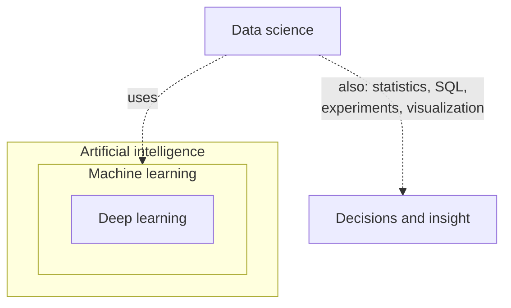
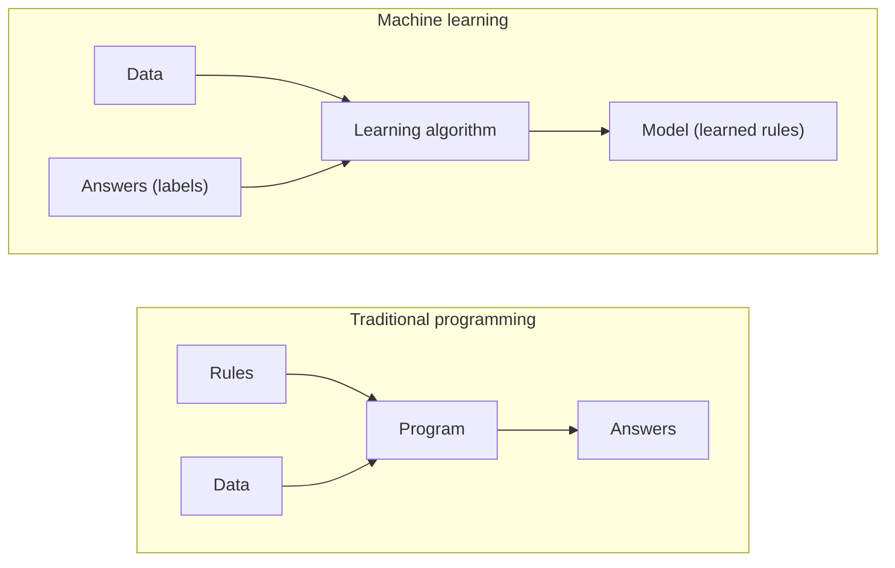
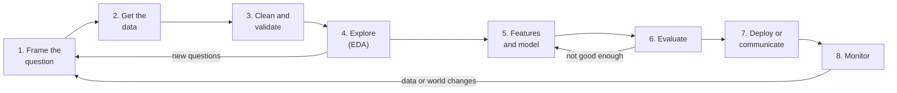
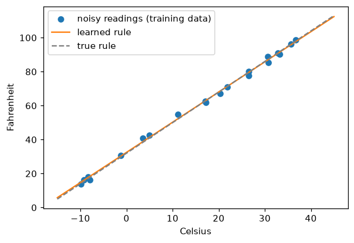

# The Data Landscape

> **Level 0 · Chapter 1** · ⏱️ ~40 min read · Prerequisites: None

This chapter is your map of the field. You'll learn what AI, machine learning, deep learning, and data science each mean, the kinds of problems machine learning solves, how a real project flows from a question to a working system, who does what, which tools you'll use, and how to study a field this big without drowning.

## Why it matters

Priya joined a retail company as its first "AI person." In her first week, three requests landed on her desk. Marketing wanted "AI to predict which customers will leave." Finance wanted "machine learning to explain why revenue dropped in March." The CEO wanted "a ChatGPT for our product catalog."

She started all three with the same tool, a deep neural network, because that's what she'd seen in tutorials. Two months later she had little to show. The churn model was beaten by a simple gradient-boosted tree that a contractor built in a day. The revenue question didn't need a model at all: a careful analysis with a few SQL queries and charts would have answered it in an afternoon. The catalog assistant needed a pretrained language model and good retrieval, not a network trained from scratch.

Priya wasn't short on skill. She was missing a *map*. These were three different kinds of problem: **prediction**, **explanation**, and **generation**. Each needs different methods, different data, and a different definition of success. This chapter gives you that map, so that when a problem lands on your desk you can place it before you start coding.

## Concepts

### AI, machine learning, deep learning, and data science

These four terms are used loosely, and often interchangeably, in the press. They mean different things.

**Artificial intelligence (AI)** is the broadest goal: building systems that perform tasks we associate with intelligence, such as reasoning, perception, language, and decision-making. AI includes approaches that involve no learning at all. A chess engine that searches millions of positions with hand-written evaluation rules is AI.

**Machine learning (ML)** is the subset of AI where a system *learns* how to do a task from data instead of following rules a person wrote. You don't tell a spam filter "emails containing 'FREE MONEY' are spam." You show it thousands of labeled emails, and it works out the patterns itself.

**Deep learning (DL)** is the subset of machine learning that uses **neural networks** with many layers. Its key strength is learning useful **representations** directly from raw data such as pixels, audio, and text, where older methods needed humans to design the inputs by hand. Modern image recognition, speech recognition, and large language models are all deep learning.

**Data science** overlaps with all of these, but its goal is different. It's about extracting *knowledge and decisions* from data. A data scientist might use machine learning, but they spend at least as much time on questions, data cleaning, statistics, experiments, and communication. A large share of valuable data science involves no ML at all.



!!! info "Where this handbook fits"
    The Beginner tier is data science foundations. The Intermediate tier is classical machine learning. The Expert tier is deep learning. Each builds on the one before, which is why the order matters.

### Rules versus learning

The idea that defines machine learning is a change in who writes the program.

In **traditional programming**, a person writes rules, the computer applies them to data, and out come answers.

In **machine learning**, a person provides data *and the answers* (examples of correct output). The computer produces the rules, which we call a **model**. The model is then applied to new data to produce new answers.



Why would you ever want this? Because for many tasks, nobody can write the rules down. Try to write rules that recognize a cat in a photo, using only pixel values. Every rule you write ("pointy ears!") breaks on the next photo (a cat lying down, a cat in the dark, a dog with pointy ears). The rules are too many, too subtle, and too entangled for a person to spell out. But you *can* collect a hundred thousand labeled photos.

Learning is also valuable when the rules *change*. Fraudsters adapt every month. A hand-written fraud rulebook goes stale; a model can be retrained on last month's data.

And learning is the wrong choice when the rules are simple, known, and stable. Tax calculations, unit conversions, and input validation should be code, not models. A model can only ever *approximate* the rule it learned, and it will occasionally be wrong in ways that are hard to predict.

### What it means to "learn"

The word "learn" sounds mysterious. In machine learning it means something precise:

1. Choose a **model family**: a set of candidate functions, controlled by adjustable numbers called **parameters**. For example, all straight lines $y = wx + b$, where the parameters are the slope $w$ and the intercept $b$.
2. Choose a **loss function**: a number that measures how wrong the model's predictions are on the training data. For example, the average squared distance between predictions and true values.
3. **Training** means searching for the parameters that make the loss as small as possible.

That's it. "The model learned that bigger houses cost more" means "the training procedure found a positive slope that minimizes prediction error on past sales." Every method in this handbook, from linear regression to GPT, is a version of these three steps: a model family, a loss, and a way to search. The methods differ in how flexible the model family is, which loss fits the task, and how clever the search is.

The goal of learning isn't to do well on the training data. Anyone can memorize the answers they've already seen. The goal is to do well on **new data the model has never seen**, which is called **generalization**. Much of the craft of machine learning is about making sure your model generalizes and *measuring* honestly whether it does. You'll study this in depth in [Level 3](../03-ml-fundamentals/04-generalization-bias-variance.md).

### The kinds of machine learning

Machine learning problems fall into a few families, depending on what the training data looks like.

**Supervised learning** learns from examples that come with the correct answer, called the **label** or **target**. The inputs are called **features**. It has two main types:

- **Regression** predicts a number: a house price, tomorrow's demand, a delivery time.
- **Classification** predicts a category: spam or not spam, which of 10 digits, which disease.

**Unsupervised learning** finds structure in data that has no labels:

- **Clustering** groups similar items, such as customer segments.
- **Dimensionality reduction** compresses many features into a few, for visualization or efficiency.
- **Anomaly detection** finds items that don't fit, such as suspicious transactions.

**Self-supervised learning** creates labels from the data itself. Hide a word in a sentence and train a model to predict it: the hidden word is the label, and you got it for free. This is how large language models are pretrained on enormous amounts of text that nobody labeled.

**Reinforcement learning (RL)** learns by trial and error. An **agent** takes actions in an **environment** and receives **rewards**, and learns which actions lead to the most reward over time. It's used for game-playing, robotics, and fine-tuning language models to follow human preferences.

| Family | Training data | Example question | Example method |
|---|---|---|---|
| Supervised: regression | Features + numeric label | "What will this house sell for?" | Linear regression, gradient boosting |
| Supervised: classification | Features + category label | "Is this transaction fraud?" | Logistic regression, random forest |
| Unsupervised | Features only | "What natural groups do our customers form?" | k-means, PCA |
| Self-supervised | Raw data (text, images) | "What word comes next?" | Transformers |
| Reinforcement | Actions and rewards | "What move wins the game?" | Q-learning, policy gradients |

There's also **generative modeling**, which cuts across these families. A generative model learns the distribution of the data well enough to produce new samples, such as images, text, or audio. Diffusion models and language models are generative.

### Prediction, explanation, and generation

Go back to Priya's three requests. A more useful split than the families above is by what the *business* wants:

- **Prediction**: "What will happen?" (Will this customer leave?) You care most about accuracy on new cases, and less about *why*. This is supervised ML's home ground.
- **Explanation and inference**: "Why did it happen?" or "What would happen if we changed X?" (Why did revenue drop? Will a price cut increase sales?) You care about *causes* and *uncertainty*. This is statistics, experiments, and causal inference, covered in [Level 1](../01-math-foundations/05-statistics.md) and [Level 2](../02-data-science-workflow/05-experimentation-and-ab-testing.md). A model that predicts well can still be useless or misleading for explanation.
- **Generation**: "Create something." (Answer questions about our catalog.) Today this usually means adapting large pretrained models, covered in [Level 8](../08-modern-deep-learning/03-llms-in-practice.md).

!!! warning "Common mistake: prediction is not explanation"
    A model that predicts ice cream sales from drowning deaths can be quite accurate, because both rise in summer. That doesn't mean banning swimming will hurt ice cream sales. Predictive features aren't causes. When someone asks "why," you need the tools of causal inference, not just a good model.

### The end-to-end workflow

Real projects follow a cycle that looks roughly the same whether you're analyzing a spreadsheet or training a language model.



1. **Frame the question.** What decision will this inform, and how will we measure success? "Predict churn" becomes "Rank customers by risk of cancelling in the next 30 days, so the retention team can call the top 500 each week. Success means more retained revenue than the calls cost." This step is the most important and the most often skipped.
2. **Get the data.** Find it, query it (often with SQL), and understand where it came from and what each column really means.
3. **Clean and validate.** Fix types, handle missing values, remove duplicates, and check that the data makes sense. This routinely takes most of a project's time.
4. **Explore.** Summarize and plot the data to understand it, find problems, and form hypotheses. This is **exploratory data analysis (EDA)**.
5. **Engineer features and build models.** Turn raw data into useful inputs, start with a simple **baseline**, and only then try more complex models.
6. **Evaluate** honestly, on data the model hasn't seen, with a metric that matches the business goal.
7. **Deploy or communicate.** Put the model into a product, or present the analysis so someone can act on it.
8. **Monitor.** The world changes, and so does your data. Models decay and need retraining.

The arrows going backward matter. You will loop. EDA will reveal that the question was wrong, evaluation will send you back to feature engineering, and monitoring will tell you it's time to retrain.

!!! tip "Always start with a baseline"
    Before any ML, ask: what would a trivial approach score? Predict the average, predict the most common class, or predict "same as last week." If your model doesn't clearly beat that, it isn't adding value. You'd be surprised how often a sophisticated model barely beats "predict the average."

### Roles

Job titles vary wildly between companies, but four roles cover most of the field:

| Role | Main question | Typical work | Core tools |
|---|---|---|---|
| **Data analyst** | What happened, and why? | Reports, dashboards, ad-hoc analysis | SQL, spreadsheets, BI tools, pandas |
| **Data scientist** | What will happen, and what should we do? | Experiments, statistical analysis, predictive models | Python, statistics, scikit-learn |
| **ML engineer** | How do we run models reliably at scale? | Training pipelines, serving, monitoring | Python, PyTorch, Docker, cloud |
| **Research scientist** | How can we do something new? | New methods and architectures, papers | PyTorch, math, lots of compute |

Around them sit **data engineers**, who build the pipelines that move and store data, and **MLOps or platform engineers**, who build the infrastructure that ML runs on. If you come from data or software engineering, you already have half of an ML engineer's skill set. This handbook gives you the other half.

### The tool stack

You'll use a small set of tools over and over. Here's the map; each one gets proper treatment later.

| Layer | Tools | Where you learn it |
|---|---|---|
| Language | Python | [Python essentials](03-python-essentials.md) |
| Environments | venv, uv, conda | [Environment setup](02-environment-setup.md) |
| Interactive work | Jupyter, VS Code | [Environment setup](02-environment-setup.md) |
| Arrays and math | NumPy, SciPy | [NumPy](04-numpy.md) |
| Tables | pandas, polars, SQL, DuckDB | [pandas](05-pandas.md), [SQL](../02-data-science-workflow/01-sql-and-data-acquisition.md) |
| Plots | matplotlib, seaborn, plotly | [Visualization](06-visualization.md) |
| Statistics | SciPy, statsmodels | [Statistics](../01-math-foundations/05-statistics.md) |
| Classical ML | scikit-learn, XGBoost, LightGBM | [Level 3](../03-ml-fundamentals/index.md), [Level 4](../04-ml-algorithms/index.md) |
| Deep learning | PyTorch | [Level 7](../07-deep-learning-pytorch/index.md) |
| Production | FastAPI, Docker, MLflow | [ML in production](../05-applied-ml/05-ml-in-production.md) |

Why Python? It isn't the fastest language. But nearly every library on that list is a thin Python layer over fast compiled code (C, C++, CUDA, Fortran). You write short, readable Python, and the heavy lifting runs at compiled speed. You'll see exactly how this works in the [NumPy chapter](04-numpy.md).

### How to study a field this big

Machine learning has a reputation for being impossible to keep up with. New papers appear daily. The good news is that the *foundations* change slowly. Gradient descent, the bias-variance trade-off, cross-validation, backpropagation, and attention are the ideas that the newest models are built from. Master those and new methods become variations on themes you know.

Some principles that work:

- **Understand one level down.** When you use `model.fit()`, know roughly what it computes. When you use a neural network, know what a gradient is. You don't need to re-derive everything, but you shouldn't be operating a black box.
- **Code it from scratch once.** Implementing linear regression, a decision tree, or backpropagation yourself, even badly, teaches you more than reading about it ten times. This handbook asks you to do this repeatedly.
- **Check the math with code.** Derived a gradient? Check it numerically. Think a formula gives the variance? Simulate it. Code makes math concrete and catches your mistakes.
- **Learn by doing projects.** The capstones exist because real problems force you to combine skills, and that's where understanding solidifies.
- **Be skeptical of results, especially your own.** If a model looks too good, assume a bug, usually leakage, until you've proved otherwise.

## In practice

You haven't learned the tools yet, but it's worth seeing the "three steps of learning" happen once in code. This example is fully explained in later chapters, so don't worry about the details. Watch the shape of the idea instead.

### Learning a rule from data

Imagine you don't know the formula for converting Celsius to Fahrenheit. You do have a few (noisy) thermometer readings in both units. Can the computer *learn* the conversion rule?

```python
import numpy as np

rng = np.random.default_rng(0)
celsius = rng.uniform(-10, 40, size=20)
# The true rule is F = 1.8 * C + 32. We add measurement noise.
fahrenheit = 1.8 * celsius + 32 + rng.normal(0, 2, size=20)

print(np.round(celsius[:5], 1))
print(np.round(fahrenheit[:5], 1))
```

```text
[21.8  3.5 -8.  -9.2 30.7]
[71.1 41.  16.4 16.2 89. ]
```

Now the three steps:

1. **Model family:** straight lines, $F = wC + b$.
2. **Loss:** the mean squared error between predicted and actual Fahrenheit.
3. **Search:** find the $w$ and $b$ that minimize the loss.

For straight lines, NumPy can do the search in one call:

```python
w, b = np.polyfit(celsius, fahrenheit, deg=1)
print(f"learned rule: F = {w:.3f} * C + {b:.3f}")

predictions = w * celsius + b
mse = np.mean((predictions - fahrenheit) ** 2)
print(f"mean squared error on training data: {mse:.2f}")
```

```text
learned rule: F = 1.777 * C + 32.490
mean squared error on training data: 1.80
```

The learned slope and intercept are close to the true 1.8 and 32, but not exact, because the data was noisy and there were only 20 readings. That's what learning is: estimating a rule from imperfect examples. With more data, the estimate gets closer to the truth.

Now the real test, which is generalization. Does the learned rule work on temperatures it has never seen?

```python
new_celsius = np.array([-40.0, 0.0, 100.0])
print(np.round(w * new_celsius + b, 1))
```

```text
[-38.6  32.5 210.1]
```

The true answers are −40, 32, and 212. The model is close even at 100 °C, far outside the training range of −10 to 40. That's because the true relationship really is a straight line, so the model family is right. If the true relationship were curved, a straight line would extrapolate badly. Matching the model family to the problem is one of the central skills you'll build.

### Seeing it

A picture makes the idea clearer. Here are the readings, the learned line, and the true line:

```python
import matplotlib.pyplot as plt

xs = np.linspace(-15, 45, 100)
fig, ax = plt.subplots(figsize=(6, 4))
ax.scatter(celsius, fahrenheit, label="noisy readings (training data)")
ax.plot(xs, w * xs + b, color="C1", label="learned rule")
ax.plot(xs, 1.8 * xs + 32, color="gray", linestyle="--", label="true rule")
ax.set_xlabel("Celsius")
ax.set_ylabel("Fahrenheit")
ax.legend()
plt.show()
```



*The learned line (orange) almost overlaps the true rule (dashed), even though no single reading lies exactly on it.*

### A baseline, first

Recall the tip: always compare against a trivial baseline. Here the simplest possible "model" ignores Celsius entirely and always predicts the average Fahrenheit reading:

```python
baseline = np.full_like(fahrenheit, fahrenheit.mean())
baseline_mse = np.mean((baseline - fahrenheit) ** 2)
print(f"baseline MSE: {baseline_mse:.1f}   model MSE: {mse:.1f}")
```

```text
baseline MSE: 817.2   model MSE: 1.8
```

The model's error is far smaller than the baseline's, so it's clearly learning something real. On real problems the gap is often much narrower, and sometimes it isn't there at all.

## Exercises

### Exercise 1: Place the problem (easy)

For each request, say whether it's mainly **prediction**, **explanation/inference**, or **generation**, and which learning family (if any) fits:

1. "Flag credit card transactions that are likely fraud, in real time."
2. "Did our new onboarding flow increase 30-day retention?"
3. "Group our 2 million customers into a handful of segments for marketing."
4. "Write product descriptions for 10,000 new catalog items."
5. "Estimate how many support tickets we'll get each day next month."

??? success "Solution"

    1. **Prediction**, supervised **classification** (fraud vs not fraud). It's also often framed as anomaly detection when labels are scarce.
    2. **Explanation/inference.** This is a causal question. The right tool is an A/B test, or, without one, careful causal inference. A predictive model can't answer it on its own.
    3. Unsupervised learning: **clustering**. Neither prediction nor explanation in the strict sense; it's discovering structure.
    4. **Generation**, using a pretrained language model, probably with retrieval of each product's specification data.
    5. **Prediction**, supervised **regression** on a time series (forecasting). Covered in [Time series forecasting](../04-ml-algorithms/07-time-series.md).

### Exercise 2: Rules or learning? (easy)

Should each of these be hand-written code or a learned model? Justify each in one sentence.

1. Converting prices between currencies using today's exchange rates.
2. Detecting whether a support email is angry.
3. Checking that a phone number field contains 10 digits.
4. Recommending which article a reader should read next.

??? success "Solution"

    1. **Code.** The rule is exact and known (multiply by the rate). A model could only approximate it.
    2. **Learning.** "Angry" can't be captured in rules (sarcasm, context, many phrasings), but you can label examples.
    3. **Code.** It's a simple, fixed rule. A regex is exact, cheap, and explainable.
    4. **Learning.** Preferences are complex, personal, and change over time, and you have lots of click data to learn from.

### Exercise 3: Frame the question (medium)

A subscription company says: "We want to use ML to reduce churn." Rewrite this as a well-framed project. Specify:

- the exact prediction target (with a time window),
- who will act on the prediction and how,
- the success metric for the *business*, not just the model,
- a baseline to beat.

??? success "Solution"

    One good framing (there are others):

    - **Target:** for each active subscriber on the first of the month, will they cancel within the next 30 days (yes or no)?
    - **Action:** the retention team calls the 500 highest-risk customers each week and offers a discount where appropriate. The model's job is *ranking*, so the top of the list must be accurate.
    - **Business metric:** revenue retained from called customers minus the cost of calls and discounts, measured with a holdout group that isn't called. That makes it an experiment, so you measure the *effect* of the calls, not just the model's accuracy.
    - **Baseline:** call the 500 customers with the lowest recent usage (a simple rule the team might already use), or call 500 at random. The model must beat that rule, not just a coin flip.

    The key improvements over "reduce churn with ML": a precise time window, a concrete action with a capacity limit (500 a week), and a success measure that captures *impact*, not just prediction accuracy.

### Exercise 4: Break the learned rule (medium)

Re-run the Celsius example, but train only on readings between 20 and 22 °C (use `rng.uniform(20, 22, size=20)`), keeping the same noise. Repeat it with three different random seeds (0, 1, 2). Each time, print the learned `w` and `b` and the prediction for 100 °C. What happens, and why?

??? success "Solution"

    ```python
    import numpy as np

    for seed in [0, 1, 2]:
        rng = np.random.default_rng(seed)
        c = rng.uniform(20, 22, size=20)
        f = 1.8 * c + 32 + rng.normal(0, 2, size=20)
        w2, b2 = np.polyfit(c, f, deg=1)
        print(f"seed {seed}: F = {w2:.2f} * C + {b2:.2f}   prediction at 100 C: {w2 * 100 + b2:.1f}")
    ```

    ```text
    seed 0: F = 1.21 * C + 44.44   prediction at 100 C: 165.9
    seed 1: F = 2.98 * C + 7.16   prediction at 100 C: 305.6
    seed 2: F = 2.17 * C + 24.37   prediction at 100 C: 241.4
    ```

    The truth is $F = 1.8C + 32$, which gives 212 at 100 °C. Each run learns a noticeably different line, and the predictions at 100 °C scatter widely around 212, some too low and some too high. Nothing is wrong with the method: with inputs that span only 2 °C (about 3.6 °F of real change), the measurement noise (about ±2 °F) is as large as the signal, so many different lines fit the data about equally well. The slope estimate is very uncertain, and extrapolating 78 °C beyond the data multiplies that uncertainty. The lesson: **the coverage of your training data limits what a model can learn**, and models are least trustworthy far from the data they saw.

### Exercise 5: Map your path (hard, reflective)

Write a half-page plan for working through this handbook:

1. Which tier and level should you start at, based on the [start-here guide](../../start-here.md)?
2. How many hours a week can you commit, and what does that imply for finishing each tier, using the estimates on the [roadmap](../../roadmap.md)?
3. Which role in the table above are you aiming for, and which levels matter most for it?
4. What will your first capstone-style project be on *your own* data or interests?

??? success "Solution"

    There's no single right answer. A strong plan is specific. For example: "I'm a data engineer, comfortable with Python and SQL. I'll skim Level 0, doing only the exercises, and spend extra time on Level 1 because my math is rusty. At 6 hours a week, the Beginner tier will take about 12 weeks. I'm aiming for ML engineer, so Levels 3, 5, and 7 matter most. My personal project: predicting late deliveries from my company's order data (anonymized), which I'll start after Level 3." Revisit the plan at each tier checkpoint.

## Check yourself

1. What is the difference between machine learning and deep learning?

    ??? note "Answer"

        Deep learning is a subset of machine learning that uses neural networks with many layers, which learn representations directly from raw data. Machine learning also includes many methods that aren't neural networks, such as linear models, decision trees, and gradient boosting.

2. In one sentence each, what are the three ingredients of "learning"?

    ??? note "Answer"

        A model family (a set of candidate functions controlled by parameters), a loss function (a measure of how wrong predictions are), and a search procedure (training) that finds the parameters minimizing the loss.

3. Why is good performance on training data not enough?

    ??? note "Answer"

        Because the goal is generalization: performing well on new, unseen data. A model can fit training data perfectly by memorizing it, including its noise, and still fail on new data.

4. What's the difference between supervised and self-supervised learning?

    ??? note "Answer"

        Supervised learning uses labels provided by people or external records. Self-supervised learning creates the labels from the data itself, for example by hiding a word and predicting it, so it can learn from vast amounts of unlabeled data.

5. Why can't a highly accurate predictive model answer "why did sales drop?" on its own?

    ??? note "Answer"

        Prediction relies on correlations, and correlated features aren't necessarily causes. A "why" question is about cause and effect, which needs experiments or causal inference methods that account for confounders.

6. What is a baseline, and why should you build one first?

    ??? note "Answer"

        A trivial approach, such as predicting the average or the most common class. It sets the bar a model must beat to be useful, and it often reveals that the problem is easier, or harder, than it looked.

7. Name two situations where hand-written rules beat machine learning.

    ??? note "Answer"

        When the rule is known, exact, and stable (tax formulas, unit conversions, validation checks), and when you have little or no data to learn from. Rules are also preferable when every decision must be exactly explainable.

## Key takeaways

- AI ⊃ machine learning ⊃ deep learning. Data science overlaps with all three, but is defined by its goal (knowledge and decisions), not its methods.
- Machine learning means learning rules from data: a model family, a loss function, and a search for the best parameters.
- The goal is generalization to new data, not performance on training data.
- Classify problems by what they need: prediction, explanation, or generation. Each needs different tools.
- Real projects loop through question → data → cleaning → exploration → modeling → evaluation → deployment → monitoring.
- Always start with a baseline, and be suspicious of results that look too good.

## Further reading

- *An Introduction to Statistical Learning* by Gareth James, Daniela Witten, Trevor Hastie, Robert Tibshirani, and Jonathan Taylor. A gentle, rigorous introduction to the core ideas, free to read online.
- "Statistical Modeling: The Two Cultures" by Leo Breiman (*Statistical Science*, 2001). A classic essay on prediction versus explanation.
- *Deep Learning* by Ian Goodfellow, Yoshua Bengio, and Aaron Courville, chapter 1. A history and overview of deep learning, free online.

## Next

Set up a clean, reproducible workspace: [Setting up your environment](02-environment-setup.md).
