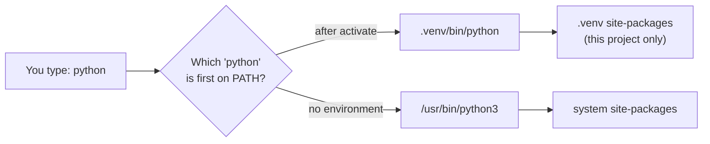

# Setting Up Your Environment

> **Level 0 · Chapter 2** · ⏱️ ~45 min read · Prerequisites: [The data landscape](01-the-data-landscape.md)

A reproducible environment means your code runs the same way tomorrow, on a colleague's laptop, and on a server. This chapter explains how Python finds packages, what a virtual environment really is, how to pin dependencies so results can be reproduced, when to use uv, pip, or conda, how Jupyter kernels work, and what you need to know about GPUs. If you only want the setup steps, they're on the [setup page](../../setup.md). This chapter explains why they work.

## Why it matters

Sam trained a model that hit 91% accuracy and wrote it up. Three months later, a colleague tried to reproduce it for an audit. The notebook crashed on import. After fixing that, it ran, but scored 87%.

It took two days to find out why. Sam had installed packages globally with `pip install` over many months. Between Sam's run and the audit, scikit-learn had been upgraded, and the default of one model parameter had changed. A preprocessing library had also changed how it handled missing values. Nobody had recorded which versions produced the 91%, so the result couldn't be reproduced, and the audit flagged the whole project.

An isolated environment per project, with pinned versions in a file committed next to the code, would have prevented all of it. It takes two minutes to set up.

## Concepts

### How Python finds a package

When you write `import numpy`, Python searches a list of directories, in order, for something named `numpy`. That list is `sys.path`. It typically contains:

1. The directory of the script you're running (or the current directory, in an interactive session).
2. The standard library directories, such as `.../lib/python3.12`.
3. A **site-packages** directory, where installed third-party packages live, such as `.../lib/python3.12/site-packages`.

`pip install numpy` downloads NumPy and unpacks it into a site-packages directory. Which one? The one belonging to the Python interpreter that ran pip. That's the crux of most environment confusion: **each Python interpreter has its own site-packages**, and a package installed for one interpreter is invisible to another.

You can see this for yourself:

```bash
python3 -c "import sys; print(sys.executable); print(*sys.path, sep='\n')"
```

```text
/usr/bin/python3

/usr/lib/python312.zip
/usr/lib/python3.12
/usr/lib/python3.12/lib-dynload
/usr/local/lib/python3.12/dist-packages
/usr/lib/python3/dist-packages
```

This is the system Python on Ubuntu (Debian-based systems name the directory `dist-packages`). The empty line is the current directory.

### Why one global environment fails

If every project shares one Python and one site-packages, you hit three problems:

- **Version conflicts.** Project A needs `pandas<2`; project B needs `pandas>=2.2`. Only one version can be installed at a time.
- **Unreproducible results.** Upgrading a package for one project silently changes every other project, as happened to Sam.
- **Breaking the operating system.** On Linux, the OS uses its own Python for system tools. Installing or upgrading packages into it can break them. Modern distributions block this: `pip install` into the system Python fails with an `externally-managed-environment` error. That's a guardrail, not a bug.

### What a virtual environment is

A **virtual environment** is a directory containing its own Python executable (usually a link to an existing interpreter) and its own, initially empty, site-packages. Nothing more magical than that.

```text
.venv/
├── bin/
│   ├── python -> /usr/bin/python3.12     # a link to a real interpreter
│   ├── pip
│   └── activate                          # a shell script
├── lib/
│   └── python3.12/
│       └── site-packages/                # this project's packages only
└── pyvenv.cfg                            # records which interpreter it's based on
```

When Python starts, it checks for a `pyvenv.cfg` file next to (or one level above) its executable. If it finds one, it uses that environment's site-packages instead of the global one. So running `.venv/bin/python` gives you a Python that sees only this project's packages.

**Activation** is a convenience. `source .venv/bin/activate` puts `.venv/bin` at the front of your shell's `PATH`, so typing `python` or `pip` finds the environment's versions first. It also changes your prompt so you can see which environment is active. You never *need* to activate: calling `.venv/bin/python` directly works exactly the same way. `deactivate` restores the old `PATH`.



!!! tip "The golden rule"
    One project, one environment. Create it in the project folder as `.venv`, and never commit it to git. It's disposable: you can always rebuild it from your dependency file.

### Installing packages: pip, uv, and wheels

**pip** is Python's standard package installer. It downloads packages from the **Python Package Index (PyPI)** and installs them into the current interpreter's site-packages.

Most data science packages contain compiled code (C, C++, Fortran). Rather than compile on your machine, pip downloads a **wheel**: a prebuilt archive for your exact platform, such as `numpy-2.1.0-cp312-cp312-manylinux_2_17_x86_64.whl`. The name records the Python version (`cp312`), the operating system, and the CPU architecture. That's why installing NumPy takes seconds, not minutes.

**uv** is a newer tool, written in Rust, that does the job of pip, venv, and more, often 10–100 times faster. It can also install Python versions for you, so you don't depend on whatever Python your OS shipped. The commands mirror pip's:

| Task | pip / venv | uv |
|---|---|---|
| Create an environment | `python3 -m venv .venv` | `uv venv` |
| Choose the Python version | install it yourself first | `uv venv --python 3.12` |
| Install packages | `pip install pandas` | `uv pip install pandas` |
| Install from a file | `pip install -r requirements.txt` | `uv pip install -r requirements.txt` |
| Record installed versions | `pip freeze > requirements.txt` | `uv pip freeze > requirements.txt` |

This handbook uses uv in examples, but everything works with pip.

### Pinning versions: requirements and lock files

To reproduce results, you need to record *exactly* which versions you used. There are two levels of strictness.

A **requirements file** lists what your project needs, with optional version constraints:

```text
numpy>=2.0
pandas>=2.2
scikit-learn>=1.5
```

That says what's *compatible*, but not what was actually installed. Install it in six months and you'll get newer versions.

A **lock file** records the exact version of *every* package, including dependencies of dependencies (called **transitive dependencies**). The simplest lock file is the output of `pip freeze`:

```text
joblib==1.6.0
numpy==2.5.3
pandas==3.0.6
python-dateutil==2.9.0.post0
scikit-learn==1.9.1
scipy==1.18.1
six==1.17.0
threadpoolctl==3.7.0
```

Installing from this file gives you exactly the same packages, every time. A good practice is to keep both: a short, human-edited `requirements.in` with what you need, and a generated, fully pinned `requirements.txt`:

```bash
uv pip compile requirements.in -o requirements.txt   # resolve and pin everything
uv pip sync requirements.txt                         # make the environment match exactly
```

`uv pip sync` also *removes* packages that aren't in the file, so the environment matches it exactly.

For larger projects, the modern standard is a **`pyproject.toml`** file that declares the project's metadata and dependencies, managed with `uv add`, `uv lock`, and `uv sync`. It's the same idea with better tooling. Either approach works; the important thing is that the lock file is committed to git.

!!! warning "Common mistake: pinning nothing"
    "It works on my machine" is the most common reproducibility failure in data work. Pin versions, and commit the lock file next to the code. Record the Python version too, since packages behave differently across versions.

### Conda: when you need more than Python packages

**Conda** is a different package and environment manager, popular in scientific computing. Its key difference: conda packages can contain *anything*, not just Python. It can install C libraries, compilers, CUDA toolkits, and R alongside Python packages, with consistent versions.

That made conda essential in the days before wheels shipped compiled code. Today, pip and uv install nearly every data science and deep learning package without trouble, including PyTorch with CUDA. Conda is still the better choice when:

- you need non-Python dependencies that aren't distributed as wheels (some geospatial or bioinformatics libraries, for example), or
- your organization or cluster standardizes on it.

If you use conda, use **conda-forge** (a large, community-maintained channel), and prefer the faster **mamba** or **micromamba** front ends. Avoid mixing `conda install` and `pip install` in the same environment where possible: if you must, install with conda first, then pip.

| | venv + uv/pip | conda |
|---|---|---|
| Packages | Python (wheels from PyPI) | Anything (Python, C libraries, CUDA, R) |
| Speed | uv is very fast | Slower; mamba is much better |
| Environment location | `.venv` in the project | Central directory, by name |
| Best for | Most Python projects | Complex non-Python dependencies |

### Jupyter: notebooks and kernels

A **Jupyter notebook** (`.ipynb`) mixes code cells, their outputs, charts, and Markdown text in one document. It's ideal for exploration: run a cell, look at the result, and decide what to do next.

Jupyter has two parts that are easy to confuse:

- The **front end** (JupyterLab, the classic notebook, or VS Code) is the interface in your browser or editor.
- The **kernel** is a separate process that actually runs your code: usually a Python process with the `ipykernel` package.


The kernel uses the packages of whichever Python it was started from. That's why "ModuleNotFoundError in the notebook, but it works in my terminal" is so common: the notebook's kernel is a different Python. Two reliable fixes:

1. Install JupyterLab inside the project's environment and start it from there (`jupyter lab`). Its default kernel is then that environment's Python.
2. Or register the environment as a named kernel, then choose it from the notebook's kernel menu:

    ```bash
    uv pip install ipykernel
    python -m ipykernel install --user --name my-project --display-name "Python (my-project)"
    ```

Notebooks have real downsides, and you should know them:

- **Hidden state.** Cells can run in any order. A variable might come from a cell you've since deleted. Before you trust a result, use "Restart kernel and run all cells."
- **Hard to review and test.** Notebook JSON makes for messy diffs in git, and notebooks are hard to import from.
- **Hard to deploy.** Production code belongs in `.py` modules.

A good workflow: explore in notebooks, then move code you'll reuse into `.py` files in a `src/` folder and import it into the notebooks. [Communicating results](../02-data-science-workflow/06-communicating-results.md) covers this in more depth.

!!! tip "Autoreload"
    When you import your own modules into a notebook, run `%load_ext autoreload` and `%autoreload 2` in the first cell. Jupyter then re-imports modules when you edit them, without restarting the kernel.

### Project layout

A consistent layout makes projects easy to navigate, for you and for others. This one works from a weekend analysis up to a production model:

```text
churn-project/
├── .venv/                  # environment (in .gitignore)
├── pyproject.toml          # or requirements.in + requirements.txt
├── README.md               # what this is and how to run it
├── data/
│   ├── raw/                # original data, never edited (in .gitignore if large)
│   └── processed/          # derived data, reproducible from raw + code
├── notebooks/
│   ├── 01-explore.ipynb
│   └── 02-baseline-model.ipynb
├── src/
│   └── churn/              # reusable code: loading, features, models
│       ├── __init__.py
│       ├── data.py
│       └── features.py
├── models/                 # saved models (in .gitignore)
└── reports/                # figures and write-ups
```

Two principles carry most of the value. **Raw data is read-only:** every processed file can be regenerated from raw data and code. And **numbered notebooks** tell a reader the order to read them in.

### GPUs and CUDA

You don't need a GPU for this handbook. Every example runs on a laptop CPU. But you'll meet GPUs in deep learning, so here's what the pieces are.

A **GPU** has thousands of small cores that do the same operation on many numbers at once. Neural network training is mostly large matrix multiplications, which fit that design perfectly, so GPUs can be 10–100 times faster than CPUs for it.

**CUDA** is NVIDIA's platform for programming its GPUs. A working GPU setup has layers:

| Layer | What it is | Who installs it |
|---|---|---|
| GPU driver | Lets the OS talk to the card | You, once, from your OS or NVIDIA |
| CUDA runtime | Libraries for running GPU code | Bundled inside PyTorch's wheels |
| cuDNN | Optimized deep learning primitives | Bundled inside PyTorch's wheels |
| PyTorch | Your code's interface | `pip`/`uv` install, choosing the CUDA build |

The usual source of trouble is a mismatch between these layers. PyTorch's official wheels bundle their own CUDA runtime, so in practice you only need a recent enough NVIDIA **driver**, plus the PyTorch build for your CUDA version from the selector on pytorch.org. `nvidia-smi` shows your driver version and GPU usage. Apple Silicon Macs use the **MPS** backend instead of CUDA, and it's included in the standard macOS PyTorch build.

Checking from Python:

```python
import torch

print("CUDA available:", torch.cuda.is_available())
print("MPS available: ", torch.backends.mps.is_available())
```

```text
CUDA available: False
MPS available:  False
```

On this CPU-only machine both are `False`, and that's fine.

### Cloud notebooks

**Google Colab** gives you a free Jupyter notebook in the browser, with the common libraries preinstalled and a free (time-limited, sometimes unavailable) GPU. Kaggle Notebooks offer something similar. They're great for trying deep learning without hardware, but sessions reset: files vanish unless you save them to Google Drive or download them, and installed packages must be reinstalled each session. For serious projects, use a local environment and use Colab when you need a GPU.

### Reproducibility beyond packages

Pinned packages are necessary, but not sufficient. Three more things can make results differ between runs:

- **Randomness.** Shuffling, random initialization, and sampling all use random number generators. **Seed** them so runs are repeatable: `rng = np.random.default_rng(42)` in NumPy, `random_state=42` in scikit-learn, and `torch.manual_seed(42)` in PyTorch.
- **Data versions.** The same code on different data gives different results. Record which data you used (a file hash or a dated snapshot).
- **Hardware and parallelism.** Floating-point results can differ slightly between CPUs, GPUs, and thread counts, because the order of additions changes rounding. Expect tiny differences across machines, not big ones.

## In practice

### Create and use an environment

Follow along in a terminal (on Windows, use the PowerShell versions from the [setup page](../../setup.md)):

```bash
mkdir env-demo && cd env-demo
uv venv --python 3.12
source .venv/bin/activate
which python
python -c "import sys; print(sys.prefix)"
```

```text
Using CPython 3.12.3 interpreter at: /usr/bin/python3.12
Creating virtual environment at: .venv
Activate with: source .venv/bin/activate
/home/alex/env-demo/.venv/bin/python
/home/alex/env-demo/.venv
```

`sys.prefix` points into `.venv`: this Python uses the environment's site-packages. Now install something and check what's there:

```bash
uv pip install pandas
uv pip list
```

```text
Resolved 4 packages in 210ms
Installed 4 packages in 61ms
 + numpy==2.5.3
 + pandas==3.0.6
 + python-dateutil==2.9.0.post0
 + six==1.17.0
Package         Version
--------------- -----------
numpy           2.5.3
pandas          3.0.6
python-dateutil 2.9.0.post0
six             1.17.0
```

You asked for one package and got four: pandas's **dependencies** came along too. This is why lock files record everything, not just what you asked for.

### Pin, destroy, and rebuild

The real test of reproducibility is rebuilding from scratch:

```bash
echo "pandas>=2.2" > requirements.in
uv pip compile requirements.in -o requirements.txt
deactivate
rm -rf .venv                       # delete the environment entirely
uv venv --python 3.12
uv pip sync requirements.txt       # rebuild it exactly
```

If that works, anyone with your repository can recreate your environment exactly. Make it a habit: if you're ever afraid to delete `.venv`, your setup isn't reproducible yet.

### Check versions from code

Inside a notebook or script, record the versions that produced a result. It's cheap insurance:

```python
import platform
from importlib.metadata import version

print("python", platform.python_version())
for pkg in ["numpy", "pandas", "scikit-learn"]:
    print(f"{pkg:13s}", version(pkg))
```

```text
python 3.13.5
numpy         2.5.3
pandas        3.0.6
scikit-learn  1.9.1
```

Note that `importlib.metadata.version` takes the *distribution* name you install (`scikit-learn`), not the import name (`sklearn`). Your exact versions will differ.

### A `.gitignore` for data projects

```text
.venv/
__pycache__/
.ipynb_checkpoints/
data/raw/
data/processed/
models/
*.parquet
.env
```

The `.env` line matters: files holding secrets such as API keys or database passwords must never be committed.

## Exercises

### Exercise 1: Two environments, two versions (easy)

Create two folders, `old/` and `new/`, each with its own environment. Install `pandas<2` (which needs Python 3.11 or older, so use `--python 3.11`) in `old/`, and the latest pandas in `new/`. Confirm from each environment's Python that they import different versions.

??? success "Solution"

    ```bash
    mkdir old new
    cd old && uv venv --python 3.11 && uv pip install "pandas<2" && cd ..
    cd new && uv venv --python 3.12 && uv pip install pandas && cd ..
    old/.venv/bin/python -c "import pandas; print(pandas.__version__)"
    new/.venv/bin/python -c "import pandas; print(pandas.__version__)"
    ```

    ```text
    1.5.3
    3.0.6
    ```

    Two versions of the same package coexist peacefully because each environment has its own site-packages. Note that you didn't need to activate anything: calling each environment's `python` directly is enough. (uv downloads Python 3.11 automatically if you don't have it.)

### Exercise 2: Where did it go? (easy)

In an activated environment, find the directory NumPy was installed into, using Python only.

??? success "Solution"

    ```bash
    python -c "import numpy; print(numpy.__file__)"
    ```

    ```text
    /home/alex/env-demo/.venv/lib/python3.12/site-packages/numpy/__init__.py
    ```

    Every module records the file it was loaded from in `__file__`. When imports behave strangely, this is the fastest way to see which copy of a package you're actually getting.

### Exercise 3: The kernel mismatch (medium)

Reproduce the classic notebook problem, then fix it. Install JupyterLab globally (or use any Jupyter you already have), open a notebook, and try to import a package that you've installed only in a project environment. Then fix it by registering the environment as a kernel.

??? success "Solution"

    1. In the project environment: `uv pip install ipykernel scikit-learn`.
    2. Start Jupyter *outside* the environment and run `import sklearn`. You get `ModuleNotFoundError`, because the kernel is a different Python.
    3. Register the environment as a kernel:

        ```bash
        source .venv/bin/activate
        python -m ipykernel install --user --name env-demo --display-name "Python (env-demo)"
        ```

    4. In the notebook, choose **Kernel → Change kernel → Python (env-demo)** and run the import again. It works.
    5. To check which Python a notebook is using, run `import sys; sys.executable` in a cell.

### Exercise 4: Make a project reproducible (medium)

Take any small script you've written (or the Celsius example from [Chapter 1](01-the-data-landscape.md)) and make it fully reproducible: a project folder with the layout above, a `requirements.in`, a compiled `requirements.txt`, a `.gitignore`, and a README with exact setup steps. Prove it works by deleting `.venv` and rebuilding from the README alone.

??? success "Solution"

    A minimal version:

    ```text
    celsius/
    ├── README.md
    ├── requirements.in        # numpy>=2.0, matplotlib>=3.8
    ├── requirements.txt       # generated by uv pip compile
    ├── .gitignore             # .venv/, __pycache__/
    └── src/
        └── fit.py             # the script, with a seeded RNG
    ```

    README steps:

    ```bash
    uv venv --python 3.12
    uv pip sync requirements.txt
    .venv/bin/python src/fit.py
    ```

    The checklist that matters: versions are pinned (the compiled file), the Python version is stated, randomness is seeded, and a stranger could run it from the README without asking you anything.

### Exercise 5: Explain the stack (hard)

A colleague's PyTorch code says `CUDA available: False` on a machine with an NVIDIA GPU. List, in the order you'd check them, the possible causes, and the command or code you'd use to check each one.

??? success "Solution"

    1. **Is the driver working?** Run `nvidia-smi`. If it fails, the driver isn't installed or loaded. Fix that first: nothing else can work without it.
    2. **Is a CPU-only PyTorch installed?** Run `python -c "import torch; print(torch.__version__, torch.version.cuda)"`. A version like `2.5.1+cpu`, or `torch.version.cuda` being `None`, means a CPU build. Reinstall using the CUDA command from pytorch.org.
    3. **Is the driver too old for the PyTorch CUDA build?** Compare the "CUDA Version" shown by `nvidia-smi` (the newest CUDA the driver supports) with `torch.version.cuda`. The driver must support at least that version. Upgrade the driver, or install a PyTorch built for an older CUDA.
    4. **Is the code running in the environment you think?** Check `sys.executable`. This is especially likely in notebooks, where the kernel may be a different environment.
    5. **Is the GPU hidden?** Check whether the environment variable `CUDA_VISIBLE_DEVICES` is set to an empty string or a nonexistent device.

## Check yourself

1. What is a virtual environment, physically, on disk?

    ??? note "Answer"

        A directory containing a link to a Python interpreter, its own site-packages directory for installed packages, activation scripts, and a `pyvenv.cfg` file recording which interpreter it's based on.

2. What does "activating" an environment actually do?

    ??? note "Answer"

        It puts the environment's `bin` directory at the front of `PATH`, so `python` and `pip` resolve to the environment's copies, and it changes the prompt. You can skip it entirely by calling `.venv/bin/python` directly.

3. What's the difference between a requirements file and a lock file?

    ??? note "Answer"

        A requirements file lists direct dependencies, usually with loose constraints (what's compatible). A lock file pins the exact version of every package, including transitive dependencies, so the environment can be rebuilt identically.

4. Why can a notebook fail to import a package that works in your terminal?

    ??? note "Answer"

        The notebook's kernel is a separate Python process that may come from a different environment. Packages are visible only to the interpreter whose site-packages they're installed in.

5. When is conda a better choice than uv or pip?

    ??? note "Answer"

        When you need non-Python dependencies, such as C libraries or specific toolkits, that aren't available as wheels, or when your team or cluster has standardized on conda.

6. Name three things besides package versions that can make results differ between runs.

    ??? note "Answer"

        Unseeded randomness, different data versions, and hardware or parallelism differences that change floating-point rounding. (A different Python version also counts.)

7. Why do PyTorch's pip wheels make GPU setup easier than it used to be?

    ??? note "Answer"

        They bundle the CUDA runtime and cuDNN libraries, so you only need a recent enough NVIDIA driver on the machine. You no longer have to install and match the CUDA toolkit yourself.

## Key takeaways

- Each Python interpreter has its own site-packages. A virtual environment is just a separate interpreter link and site-packages directory.
- Use one environment per project, created in the project as `.venv`, and never commit it.
- Pin exact versions in a lock file and commit it. If you're afraid to delete `.venv`, your setup isn't reproducible.
- uv is a fast, modern replacement for pip and venv. Use conda when you need non-Python dependencies.
- A Jupyter kernel runs in its own environment. Most "module not found" notebook errors are kernel mismatches.
- Seed randomness and record data versions, as well as packages.

## Further reading

- The Python Packaging User Guide, packaging.python.org: the official guide to environments, pip, and `pyproject.toml`.
- The uv documentation, docs.astral.sh/uv.
- The Jupyter documentation on kernels, docs.jupyter.org.
- PyTorch's "Get Started" page, pytorch.org/get-started, for the right install command for your hardware.

## Next

Sharpen the Python you'll use every day: [Python essentials for data work](03-python-essentials.md).
