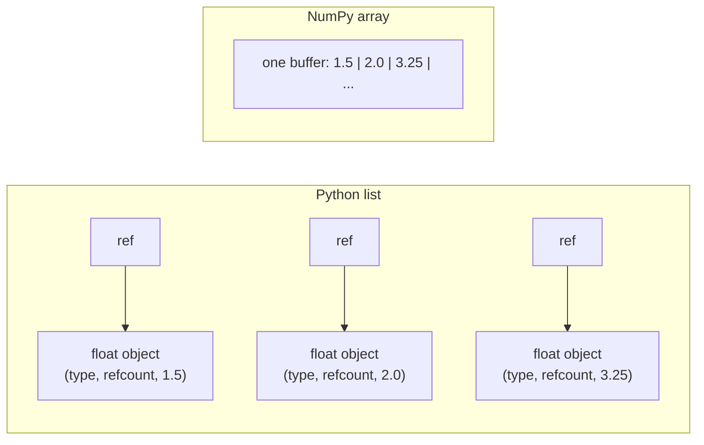
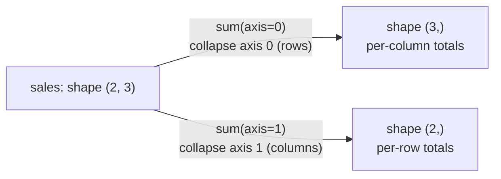
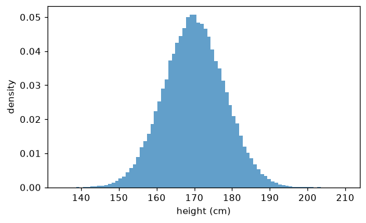

# NumPy

> **Level 0 · Chapter 4** · ⏱️ ~60 min read · Prerequisites: [Python essentials for data work](03-python-essentials.md)

NumPy is the foundation of numerical Python. pandas, scikit-learn, SciPy, matplotlib, and PyTorch's tensor API are all built on it or modeled on it. This chapter explains what an array really is in memory, why vectorized code is fast, how indexing, broadcasting, axes, and reshaping work, and how to do linear algebra and generate random numbers properly. Master this chapter and the rest of the stack will feel familiar.

## Why it matters

Alex needed to compute the distance between every pair of 5,000 customer feature vectors, for a "similar customers" feature. The first version used two nested Python loops over the customers, plus an inner loop over the 20 features. It took 25 minutes per run.

A colleague rewrote it as three lines of NumPy using broadcasting. It ran in under a second, and gave the same answer to the last decimal place.

The difference wasn't a clever algorithm. Both versions did the same arithmetic. The NumPy version did it in compiled C, on tightly packed numbers, without the Python interpreter touching each one. Learning to "think in arrays" (expressing a computation as operations on whole arrays rather than loops over elements) is the single most valuable skill in numerical Python. It's also exactly how you'll think in PyTorch later.

## Concepts

### What an ndarray is

A NumPy **ndarray** (n-dimensional array) is a grid of values that all have the same type, stored in one contiguous block of memory. That's very different from a Python list.

A Python list of a million floats is an array of a million *references*, each pointing to a separate Python float object somewhere else in memory. Every float object carries a type pointer and a reference count as well as its 8 bytes of actual number. A NumPy array of a million float64 values is a single 8 MB block of raw numbers, side by side.



An array is described by a few attributes:

- **`shape`**: the size along each dimension, such as `(3, 4)` for 3 rows and 4 columns.
- **`ndim`**: the number of dimensions, called **axes**.
- **`dtype`**: the type of every element, such as `float64` or `int32`.
- **`strides`**: how many bytes to step in memory to move one position along each axis.

```python
import numpy as np

a = np.arange(12, dtype=np.float64).reshape(3, 4)
print(a)
print("shape:", a.shape, " ndim:", a.ndim, " dtype:", a.dtype)
print("itemsize:", a.itemsize, "bytes  total:", a.nbytes, "bytes")
print("strides:", a.strides)
```

```text
[[ 0.  1.  2.  3.]
 [ 4.  5.  6.  7.]
 [ 8.  9. 10. 11.]]
shape: (3, 4)  ndim: 2  dtype: float64
itemsize: 8 bytes  total: 96 bytes
strides: (32, 8)
```

The strides `(32, 8)` mean: to move one row down, skip 32 bytes (4 elements × 8 bytes); to move one column right, skip 8 bytes. The 2D array is really a flat run of 12 numbers, and the shape and strides tell NumPy how to interpret it as a grid. By default rows are stored one after another, which is called **row-major** or **C order**.

This design is why many operations are free. Transposing an array doesn't move any data; it just swaps the strides:

```python
t = a.T
print(t.shape, t.strides)
print(np.shares_memory(a, t))
```

```text
(4, 3) (8, 32)
True
```

### Views and copies

Because shape and strides are separate from the data, NumPy can create a new array object that *looks at the same memory* in a different way. That's a **view**. Basic slicing, transposing, and most reshapes return views. Changing a view changes the original:

```python
row = a[1]          # a view of the second row
row[0] = 100
print(a[1])
```

```text
[100.   5.   6.   7.]
```

Views are what make NumPy memory-efficient: slicing a 10 GB array costs nothing. But they're also a source of surprises, especially in pandas, which is built on NumPy. When you need an independent array, call `.copy()`.

Two kinds of indexing return copies instead of views: **fancy indexing** (indexing with a list or array of positions) and **boolean indexing** (indexing with a mask). We'll see both below. The rule of thumb: if the result can be described as a regular stride pattern over the original memory, you get a view; otherwise you get a copy.

```python
print(np.shares_memory(a, a[:, 1:3]))        # slice: view
print(np.shares_memory(a, a[[0, 2]]))        # fancy index: copy
print(np.shares_memory(a, a[a > 5]))         # boolean mask: copy
```

```text
True
False
False
```

### dtypes

Every element of an array has the same **dtype**. The common ones:

| dtype | Bytes | Range / precision | Typical use |
|---|---|---|---|
| `bool` | 1 | True/False | masks |
| `int32`, `int64` | 4, 8 | ±2.1 billion / ±9.2 × 10¹⁸ | counts, IDs, indices |
| `float32` | 4 | ~7 significant digits | deep learning (saves memory, GPU-friendly) |
| `float64` | 8 | ~16 significant digits | NumPy's default; scientific computing |
| `complex128` | 16 | two float64s | signal processing |
| `object` | 8 (a reference) | any Python object | avoid: slow, no vectorization |

NumPy infers the dtype when you create an array, and you can convert with `astype`. Two things bite people.

**Integer overflow is silent.** Fixed-size integers wrap around when they exceed their range, with no error:

```python
x = np.array([2_000_000_000], dtype=np.int32)
print(x + x)                 # wraps around
print(x.astype(np.int64) + x)
```

```text
[-294967296]
[4000000000]
```

**Integer division and casting can truncate.** Assigning a float into an integer array silently drops the fractional part:

```python
counts = np.array([1, 2, 3])
counts[0] = 2.9
print(counts, counts.dtype)
```

```text
[2 2 3] int64
```

When in doubt, check `.dtype`. Many subtle bugs in data pipelines come from a column that's `int` when you expected `float`, or `object` when you expected numbers.

### Vectorization and universal functions

**Vectorization** means expressing an operation on whole arrays instead of looping over elements in Python. NumPy's arithmetic operators and math functions are **universal functions (ufuncs)**: they apply an operation element by element, in a compiled loop.

```python
prices = np.array([10.0, 20.0, 30.0])
quantities = np.array([3, 1, 2])

revenue = prices * quantities        # element-wise multiply
print(revenue, revenue.sum())
print(np.sqrt(prices))
print(np.where(prices > 15, "high", "low"))
```

```text
[30. 20. 60.] 110.0
[3.16227766 4.47213595 5.47722558]
['low' 'high' 'high']
```

Why is this so much faster than a Python loop? For each element, a Python loop must:

1. fetch the next object from the list,
2. look up its type,
3. find the right `__mul__` method for that type,
4. allocate a new Python float object for the result,
5. update reference counts.

A ufunc does none of that. It already knows every element is a float64, so it runs a tight compiled loop over raw numbers that the CPU can execute very efficiently, often several numbers per instruction (called **SIMD**). The arithmetic is identical; the overhead around it disappears.

### Indexing

**Basic indexing and slicing** work like Python lists, with one comma-separated index per axis:

```python
m = np.arange(20).reshape(4, 5)
print(m)
print(m[2, 3])          # row 2, column 3
print(m[1])             # row 1 (same as m[1, :])
print(m[:, 0])          # column 0
print(m[1:3, ::2])      # rows 1-2, every other column
print(m[-1, -2:])       # last row, last two columns
```

```text
[[ 0  1  2  3  4]
 [ 5  6  7  8  9]
 [10 11 12 13 14]
 [15 16 17 18 19]]
13
[5 6 7 8 9]
[ 0  5 10 15]
[[ 5  7  9]
 [10 12 14]]
[18 19]
```

Note that `m[:, 0]` returns a 1D array of shape `(4,)`, not a column of shape `(4, 1)`: indexing with a single integer *removes* that axis. If you want to keep the axis, slice instead: `m[:, 0:1]` has shape `(4, 1)`.

**Boolean indexing** selects the elements where a mask of the same shape is `True`. This is how you filter data:

```python
scores = np.array([72, 95, 58, 88, 41, 99])
passed = scores >= 60
print(passed)
print(scores[passed])
print(scores[(scores >= 60) & (scores < 90)])     # combine with & | ~
print(passed.mean())                              # fraction True
```

```text
[ True  True False  True False  True]
[72 95 88 99]
[72 88]
0.6666666666666666
```

Combine conditions with `&` (and), `|` (or), and `~` (not), and wrap each condition in parentheses, because `&` binds more tightly than `>=`. Python's `and` and `or` don't work on arrays. Taking the mean of a boolean array gives the fraction of `True` values, a trick you'll use constantly.

**Fancy indexing** uses an array of positions:

```python
print(scores[[0, 2, 4]])
order = np.argsort(scores)            # positions that would sort the array
print(order, scores[order])
print(scores[np.argsort(scores)[-3:][::-1]])   # top 3, descending
```

```text
[72 58 41]
[4 2 0 3 1 5] [41 58 72 88 95 99]
[99 95 88]
```

`argsort` returns *indices*, which you can use to reorder other arrays the same way: to sort customers by score, for example, while keeping their IDs aligned.

### Axes and aggregation

Reductions such as `sum`, `mean`, `max`, and `std` can work over the whole array or along one **axis**. The `axis` argument names the axis that gets *collapsed*:

```python
sales = np.array([[10, 20, 30],      # rows: 2 stores
                  [40, 50, 60]])     # columns: 3 days
print(sales.sum())                   # everything
print(sales.sum(axis=0))             # collapse rows    -> one value per day
print(sales.sum(axis=1))             # collapse columns -> one value per store
print(sales.mean(axis=1, keepdims=True))
```

```text
210
[50 70 90]
[ 60 150]
[[20.]
 [50.]]
```



The way to remember it: **the axis you name disappears from the shape**. `(2, 3)` summed over axis 0 becomes `(3,)`. `keepdims=True` keeps the collapsed axis with size 1, giving `(2, 1)`, which is handy for broadcasting the result back against the original, as you'll see next.

### Broadcasting

**Broadcasting** is how NumPy combines arrays of different shapes. It's what lets you write `array - array.mean(axis=0)` to center every column at once.

The rules, applied to the shapes compared from the *right*:

1. If the arrays have different numbers of dimensions, pad the shorter shape with 1s on the left.
2. Two dimensions are compatible if they're equal, or if one of them is 1.
3. A dimension of size 1 is stretched (virtually, without copying) to match the other.

If any pair of dimensions is incompatible, you get an error.

| A shape | B shape | Result | Why |
|---|---|---|---|
| `(3, 4)` | `(4,)` | `(3, 4)` | B padded to `(1, 4)`, stretched over 3 rows |
| `(3, 4)` | `(3, 1)` | `(3, 4)` | B's column stretched over 4 columns |
| `(3, 1)` | `(1, 4)` | `(3, 4)` | both stretched: an "outer" operation |
| `(5, 1, 4)` | `(3, 1)` | `(5, 3, 4)` | B padded to `(1, 3, 1)` |
| `(3, 4)` | `(3,)` | error | 4 vs 3 at the right: incompatible |

Here's the most common use: standardizing every column (feature) of a data matrix to zero mean and unit variance:

```python
rng = np.random.default_rng(0)
X = rng.normal(loc=[50, 0.5, 1000], scale=[10, 0.1, 200], size=(1000, 3))

mu = X.mean(axis=0)          # shape (3,)
sigma = X.std(axis=0)        # shape (3,)
Z = (X - mu) / sigma         # (1000, 3) with (3,) -> broadcast over rows

print(np.round(mu, 2))
print(np.round(Z.mean(axis=0), 6), np.round(Z.std(axis=0), 6))
```

```text
[4.8980e+01 5.0000e-01 9.9424e+02]
[-0.  0. -0.] [1. 1. 1.]
```

And the trick from the story. To compute all pairwise differences between two sets of points, insert axes with `None` (also written `np.newaxis`) so the shapes broadcast into a grid:

```python
P = np.array([[0.0, 0.0], [3.0, 4.0], [6.0, 8.0]])     # 3 points in 2D
diff = P[:, None, :] - P[None, :, :]                   # (3,1,2) - (1,3,2) -> (3,3,2)
dist = np.sqrt((diff ** 2).sum(axis=-1))               # (3,3)
print(dist)
```

```text
[[ 0.  5. 10.]
 [ 5.  0.  5.]
 [10.  5.  0.]]
```

`diff[i, j]` is `P[i] - P[j]`. Summing squared differences over the last axis gives squared distances. No loops.

!!! warning "Common mistake: accidental broadcasting"
    Broadcasting never complains when shapes are compatible, even if that's not what you meant. Subtracting a `(100,)` array from a `(100, 1)` array gives a `(100, 100)` array, not `(100,)`. If a result is suddenly huge, or a loss looks strange, print the shapes. This bug is especially common with predictions of shape `(n, 1)` versus targets of shape `(n,)`.

### Reshaping and combining

| Operation | What it does | View or copy? |
|---|---|---|
| `a.reshape(3, 4)` | new shape, same number of elements; use `-1` for "whatever fits" | view when possible |
| `a.ravel()` / `a.flatten()` | to 1D | view when possible / always a copy |
| `a.T`, `a.transpose(1, 0, 2)` | reorder axes | view |
| `a[:, None]`, `np.expand_dims` | add an axis of size 1 | view |
| `a.squeeze()` | remove axes of size 1 | view |
| `np.concatenate([a, b], axis=0)` | join along an *existing* axis | copy |
| `np.stack([a, b], axis=0)` | join along a *new* axis | copy |

```python
v = np.arange(6)
print(v.reshape(2, 3))
print(v.reshape(-1, 2).shape)          # -1: NumPy works out the 3
a, b = np.ones((2, 3)), np.zeros((2, 3))
print(np.concatenate([a, b], axis=0).shape, np.stack([a, b], axis=0).shape)
```

```text
[[0 1 2]
 [3 4 5]]
(3, 2)
(4, 3) (2, 2, 3)
```

`reshape` fills the new shape in row-major order: it reads the elements in their memory order and lays them out row by row. It never reorders data. To swap rows and columns, use a transpose, not a reshape. Mixing these up silently scrambles data.

### Linear algebra

The `@` operator does matrix multiplication. For 2D arrays $A$ of shape $(m, k)$ and $B$ of shape $(k, n)$, $C = AB$ has shape $(m, n)$ with entries

$$
C_{ij} = \sum_{p=1}^{k} A_{ip} B_{pj}.
$$

The inner dimensions must match. [Linear algebra](../01-math-foundations/01-linear-algebra.md) explains what matrix multiplication *means*; here's the mechanics:

```python
A = np.array([[1.0, 2.0], [3.0, 4.0]])
x = np.array([1.0, 1.0])

print(A @ x)                       # matrix-vector product
print(A @ A)                       # matrix-matrix product
print(A * A)                       # NOT matrix multiplication: element-wise!
print(np.linalg.det(A))
print(np.linalg.solve(A, np.array([5.0, 6.0])))     # solve A z = [5, 6]
print(np.linalg.norm(x))           # Euclidean length
```

```text
[3. 7.]
[[ 7. 10.]
 [15. 22.]]
[[ 1.  4.]
 [ 9. 16.]]
-2.0000000000000004
[-4.   4.5]
1.4142135623730951
```

Note the determinant: mathematically it's exactly −2, but floating-point arithmetic gives −2.0000000000000004. That's normal, and it's why you compare floats with tolerances.

!!! tip "solve, don't invert"
    To solve $Az = b$, use `np.linalg.solve(A, b)`, not `np.linalg.inv(A) @ b`. It's faster and more numerically accurate. You'll rarely need an explicit inverse.

For 3D and higher arrays, `@` treats the last two axes as matrices and broadcasts over the rest. That's how you multiply a whole batch of matrices at once, which is everywhere in deep learning.

### Random numbers

Simulations, data splits, model initialization, and bootstrapping all need random numbers, and they need to be **reproducible**. Use NumPy's **Generator** API: create one generator with a seed, and draw everything from it.

```python
rng = np.random.default_rng(seed=42)

print(rng.integers(1, 7, size=5))              # dice rolls
print(np.round(rng.normal(0, 1, size=3), 3))   # standard normal
print(np.round(rng.uniform(0, 1, size=3), 3))
print(rng.choice(["a", "b", "c"], size=5, p=[0.6, 0.3, 0.1]))
print(rng.permutation(5))                      # a shuffled order
```

```text
[1 5 4 3 3]
[ 0.941 -1.951 -1.302]
[0.761 0.786 0.128]
['a' 'a' 'c' 'b' 'b']
[1 0 4 3 2]
```

Run this again with `seed=42` and you get exactly the same numbers. Different seed, different numbers. Two practices:

- **Create one generator** near the top of a script or function, and pass it around. Don't reseed in the middle of your code.
- **Avoid the legacy API** (`np.random.seed`, `np.random.rand`). It uses hidden global state, so any library call that draws random numbers changes your results. You'll still see it in older tutorials.

A quick sanity check that the generator does what it claims: draw many samples and compare their statistics with the theory.

```python
import matplotlib.pyplot as plt

samples = rng.normal(loc=170, scale=8, size=100_000)
print(f"mean {samples.mean():.2f}, std {samples.std():.2f}")

fig, ax = plt.subplots(figsize=(6, 3.5))
ax.hist(samples, bins=80, density=True, alpha=0.7)
ax.set_xlabel("height (cm)")
ax.set_ylabel("density")
plt.show()
```

```text
mean 169.97, std 8.03
```



*100,000 samples from a normal distribution with mean 170 and standard deviation 8. The sample statistics match the parameters closely.*

### Missing values: NaN

NumPy represents a missing or undefined float as **NaN** ("not a number"). NaN spreads through arithmetic: any calculation involving NaN gives NaN. Use the `nan`-aware functions to ignore missing values:

```python
x = np.array([1.0, np.nan, 3.0])
print(x.mean(), np.nanmean(x))
print(np.isnan(x))
print(np.nan == np.nan)        # NaN isn't equal to anything, even itself
```

```text
nan 2.0
[False  True False]
False
```

Because `np.nan == np.nan` is `False`, never test for NaN with `==`. Use `np.isnan`. Integer arrays can't hold NaN, which is why a column of integers with missing values turns into floats. pandas handles missing values more conveniently, as covered in the [next chapter](05-pandas.md).

## In practice

### Loop versus vectorized: measuring it

Here's the story's computation at a smaller scale: pairwise Euclidean distances between 300 points with 20 features, done three ways.

```python
import time

rng = np.random.default_rng(0)
X = rng.normal(size=(300, 20))

def pairwise_loops(X):
    n, d = X.shape
    D = np.empty((n, n))
    for i in range(n):
        for j in range(n):
            s = 0.0
            for k in range(d):
                s += (X[i, k] - X[j, k]) ** 2
            D[i, j] = s ** 0.5
    return D

def pairwise_broadcast(X):
    diff = X[:, None, :] - X[None, :, :]
    return np.sqrt((diff ** 2).sum(axis=-1))

def pairwise_algebra(X):
    # ||a - b||^2 = ||a||^2 + ||b||^2 - 2 a.b
    sq = (X ** 2).sum(axis=1)
    D2 = sq[:, None] + sq[None, :] - 2 * X @ X.T
    return np.sqrt(np.maximum(D2, 0))     # clip tiny negatives from rounding

for f in [pairwise_loops, pairwise_broadcast, pairwise_algebra]:
    t0 = time.perf_counter()
    D = f(X)
    print(f"{f.__name__:20s} {time.perf_counter() - t0:8.4f} s")

print(np.allclose(pairwise_loops(X), pairwise_algebra(X), atol=1e-6))
```

```text
pairwise_loops         0.4263 s
pairwise_broadcast     0.0123 s
pairwise_algebra       0.0009 s
True
```

All three give the same distances, within a small tolerance. (The algebraic version's diagonal isn't exactly zero: rounding leaves tiny positive values whose square roots are around $10^{-7}$, which is why the check passes `atol=1e-6`.) The broadcast version is tens of times faster than the loops, and the algebraic version is hundreds of times faster. The gap grows with the number of points. The algebraic version rewrites the problem as a matrix multiplication, which NumPy hands to a highly optimized linear algebra library (BLAS). It also uses far less memory: the broadcast version builds a $300 \times 300 \times 20$ intermediate array, while the algebraic one never does. For 5,000 points the broadcast intermediate would need 4 GB, so the algebraic trick isn't just faster, it's the only one that fits in memory.

`np.maximum(D2, 0)` is there because rounding can make a true zero come out as a tiny negative number, and the square root of a negative number is NaN. Guarding against floating-point edge cases like this is a recurring theme.

### A worked example: grading on a curve

Ten students take four exams. Standardize each exam's scores (so exams of different difficulty are comparable), average them, and find each student's best exam, all without loops:

```python
rng = np.random.default_rng(1)
scores = rng.integers(40, 100, size=(10, 4)).astype(float)

z = (scores - scores.mean(axis=0)) / scores.std(axis=0)    # per-exam z-scores
overall = z.mean(axis=1)                                   # per-student average
best_exam = scores.argmax(axis=1)                          # index of each student's best raw score
ranking = np.argsort(-overall)                             # best student first

print("top 3 students:", ranking[:3])
print("their overall z:", np.round(overall[ranking[:3]], 2))
print("best exam per student:", best_exam)
```

```text
top 3 students: [5 0 6]
their overall z: [0.93 0.67 0.32]
best exam per student: [3 3 2 1 0 0 0 3 0 0]
```

Each line is one array operation. Reading code like this fluently, and checking shapes in your head, is the skill to practice.

## Exercises

### Exercise 1: Shapes in your head (easy)

Without running anything, give the shape of each result, or say "error". Then check with NumPy.

```python
a = np.zeros((4, 3))
b = np.zeros(3)
c = np.zeros((4, 1))
d = np.zeros((2, 1, 3))
```

1. `a + b`
2. `a + c`
3. `a + c.T`
4. `a.sum(axis=0)`
5. `d + a`
6. `a @ b`

??? success "Solution"

    1. `(4, 3)`: `b` is padded to `(1, 3)` and stretched over rows.
    2. `(4, 3)`: `c` is stretched over columns.
    3. Error: `c.T` has shape `(1, 4)`, and 4 vs 3 at the right is incompatible.
    4. `(3,)`: axis 0 disappears.
    5. `(2, 4, 3)`: `a` is padded to `(1, 4, 3)`. Comparing from the right: 3 vs 3 match, 1 vs 4 stretches, and 2 vs the padded 1 stretches.
    6. `(4,)`: a matrix-vector product, `(4, 3) @ (3,)`.

    ```python
    import numpy as np

    a, b, c, d = np.zeros((4, 3)), np.zeros(3), np.zeros((4, 1)), np.zeros((2, 1, 3))
    print((a + b).shape, (a + c).shape, a.sum(axis=0).shape, (d + a).shape, (a @ b).shape)
    try:
        a + c.T
    except ValueError as e:
        print("error:", e)
    ```

    ```text
    (4, 3) (4, 3) (3,) (2, 4, 3) (4,)
    error: operands could not be broadcast together with shapes (4,3) (1,4)
    ```

    Number 5 often catches people out: before you decide something is an error, check the rules from the right, one dimension at a time.

### Exercise 2: Clip outliers (easy)

Given `x = rng.normal(0, 1, 1000)` with `rng = np.random.default_rng(0)`, replace every value more than 2 standard deviations from the mean with the boundary value (mean ± 2 std), without a loop. Report how many values were clipped.

??? success "Solution"

    ```python
    rng = np.random.default_rng(0)
    x = rng.normal(0, 1, 1000)
    lo, hi = x.mean() - 2 * x.std(), x.mean() + 2 * x.std()
    n_clipped = ((x < lo) | (x > hi)).sum()
    x_clipped = np.clip(x, lo, hi)
    print(n_clipped, round(x_clipped.min(), 3), round(x_clipped.max(), 3))
    ```

    ```text
    42 -2.002 1.905
    ```

    For a normal distribution, about 4.6% of values lie more than 2 standard deviations from the mean, so roughly 46 out of 1,000 is expected. `np.clip` does the replacement in one vectorized call.

### Exercise 3: One-hot encoding with fancy indexing (medium)

Given an integer array of class labels `y = np.array([2, 0, 1, 2, 1])` with 3 classes, build the one-hot matrix of shape `(5, 3)`, where row `i` has a 1 in column `y[i]` and 0 elsewhere. Do it two ways: with fancy indexing, and with broadcasting a comparison.

??? success "Solution"

    ```python
    y = np.array([2, 0, 1, 2, 1])
    n_classes = 3

    onehot = np.zeros((len(y), n_classes))
    onehot[np.arange(len(y)), y] = 1          # pairs of (row, column) indices

    onehot2 = (y[:, None] == np.arange(n_classes)[None, :]).astype(float)

    print(onehot)
    print(np.array_equal(onehot, onehot2))
    ```

    ```text
    [[0. 0. 1.]
     [1. 0. 0.]
     [0. 1. 0.]
     [0. 0. 1.]
     [0. 1. 0.]]
    True
    ```

    The first version indexes with two arrays at once: element `k` of the result is set at position `(k, y[k])`. The second compares a `(5, 1)` column of labels with a `(1, 3)` row of class numbers, broadcasting to a `(5, 3)` boolean grid. You'll use this pattern again for classification losses.

### Exercise 4: Moving average (medium)

Compute the 3-day moving average of `prices = np.array([10., 11, 12, 13, 12, 11, 15])` without a Python loop. The result should have 5 values (the averages of days 1–3, 2–4, and so on). Do it with `np.cumsum`, and explain why it works.

??? success "Solution"

    ```python
    prices = np.array([10., 11, 12, 13, 12, 11, 15])
    k = 3
    c = np.cumsum(np.insert(prices, 0, 0.0))     # c[i] = sum of the first i prices
    moving = (c[k:] - c[:-k]) / k
    print(moving)
    print(np.convolve(prices, np.ones(k) / k, mode="valid"))   # same answer
    ```

    ```text
    [11.         12.         12.33333333 12.         12.66666667]
    [11.         12.         12.33333333 12.         12.66666667]
    ```

    `c[i]` is the sum of the first `i` prices, so the sum of any window from `i` to `i + k - 1` is `c[i + k] - c[i]`. Subtracting two shifted views of the cumulative sum gives every window's sum at once. `np.convolve` computes the same thing as a sliding dot product with weights `[1/3, 1/3, 1/3]`, an idea you'll meet again in convolutional neural networks.

### Exercise 5: k-nearest neighbors from scratch (hard)

Write a function `knn_predict(X_train, y_train, X_test, k)` that predicts the label of each test point by majority vote among its `k` nearest training points, fully vectorized except possibly for the vote. Test it on two clusters: 100 points around `(0, 0)` labeled 0, and 100 around `(3, 3)` labeled 1, both with standard deviation 1. Report the accuracy on 50 fresh test points from each cluster.

??? success "Solution"

    ```python
    def knn_predict(X_train, y_train, X_test, k=5):
        # squared distances (n_test, n_train) via the algebraic trick
        d2 = ((X_test ** 2).sum(1)[:, None] + (X_train ** 2).sum(1)[None, :]
              - 2 * X_test @ X_train.T)
        nearest = np.argpartition(d2, k, axis=1)[:, :k]     # k smallest per row, unordered
        votes = y_train[nearest]                            # (n_test, k) neighbor labels
        return (votes.mean(axis=1) > 0.5).astype(int)       # majority for 0/1 labels

    rng = np.random.default_rng(0)
    def make(n):
        X = np.vstack([rng.normal(0, 1, (n, 2)), rng.normal(3, 1, (n, 2))])
        y = np.array([0] * n + [1] * n)
        return X, y

    X_train, y_train = make(100)
    X_test, y_test = make(50)
    pred = knn_predict(X_train, y_train, X_test, k=5)
    print("accuracy:", (pred == y_test).mean())
    ```

    ```text
    accuracy: 0.99
    ```

    `np.argpartition` finds the `k` smallest values per row without fully sorting each row, which is faster than `argsort` for large arrays. With binary labels, a mean above 0.5 is a majority vote (an odd `k` avoids ties). You'll study kNN properly in [Level 4](../04-ml-algorithms/01-knn-and-naive-bayes.md). For now, notice that a working classifier took about 6 lines of array code.

## Check yourself

1. What are an array's shape and strides, and how do they make transposing free?

    ??? note "Answer"

        The shape is the size along each axis. The strides are the number of bytes to step in memory to move one position along each axis. Transposing just swaps the shape and strides, describing the same memory in a different order, so no data moves.

2. Which indexing operations return views, and which return copies?

    ??? note "Answer"

        Basic slicing (and transposes and most reshapes) return views. Fancy indexing (with integer arrays or lists) and boolean indexing return copies.

3. Why is vectorized NumPy code faster than a Python loop doing the same arithmetic?

    ??? note "Answer"

        The loop pays Python interpreter overhead for every element: object fetches, type checks, method lookups, allocations, and reference counting. A ufunc runs one compiled loop over raw, same-typed numbers in contiguous memory, often using SIMD instructions.

4. State the broadcasting rules.

    ??? note "Answer"

        Compare shapes from the right. Pad the shorter shape with 1s on the left. Each pair of dimensions must be equal, or one of them must be 1, which is stretched to match. Otherwise it's an error.

5. What does `axis=0` mean in `X.mean(axis=0)` for a data matrix with rows as samples?

    ??? note "Answer"

        Collapse axis 0, the rows, producing one value per column: the mean of each feature across all samples.

6. Why should you use `np.linalg.solve` instead of computing an inverse?

    ??? note "Answer"

        It's faster and numerically more accurate. Computing an explicit inverse does extra work and amplifies rounding error.

7. Why is `np.random.default_rng(seed)` better than `np.random.seed(seed)`?

    ??? note "Answer"

        The Generator object holds its own state, so randomness is explicit and isolated. The legacy API uses hidden global state that any other code can change, which makes results harder to reproduce.

8. How do you test whether values are NaN, and why not with `==`?

    ??? note "Answer"

        Use `np.isnan`. NaN is defined to be unequal to everything, including itself, so `x == np.nan` is always `False`.

## Key takeaways

- An ndarray is one typed block of memory plus a shape and strides. Many operations (slicing, transposing, reshaping) just create new views of the same data.
- Vectorized operations run in compiled loops and are often hundreds of times faster than Python loops.
- Know your indexing: slices give views; fancy and boolean indexing give copies.
- The axis you reduce over disappears from the shape. Use `keepdims=True` to broadcast results back.
- Broadcasting compares shapes from the right and stretches size-1 dimensions. When results look wrong, print the shapes.
- Use `@` for matrix multiplication, `solve` instead of `inv`, and one seeded `default_rng` for all randomness.

## Further reading

- The NumPy User Guide, numpy.org/doc/stable/user, especially "NumPy fundamentals" on broadcasting, indexing, and copies versus views.
- "The NumPy array: a structure for efficient numerical computation" by Stéfan van der Walt, S. Chris Colbert, and Gaël Varoquaux (2011).
- *Python for Data Analysis* by Wes McKinney, chapter 4.

## Next

Work with labeled, tabular data: [pandas](05-pandas.md).
