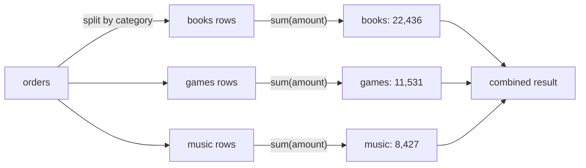

# pandas

> **Level 0 · Chapter 5** · ⏱️ ~60 min read · Prerequisites: [NumPy](04-numpy.md)

pandas is the everyday tool for tabular data in Python: loading it, cleaning it, filtering, grouping, joining, reshaping, and handling time series. This chapter explains the two core objects (Series and DataFrame), why the **index** and **alignment** matter, how selection really works, the split-apply-combine model behind `groupby`, how to join tables without silently losing or duplicating rows, how to reshape data, how to work with dates, and how to write pandas code that is fast and readable. It also covers what changed in pandas 3 and when to reach for polars instead.

## Why it matters

Sam merged a table of 50,000 orders with a table of customers to add each customer's region, then summed revenue by region for the quarterly report. Revenue came out 18% higher than finance's number. The report had gone to three directors before anyone noticed.

The customer table had duplicate rows: some customers appeared twice, because of a bug in an upstream export. Every order for those customers matched *two* customer rows, so the merge produced two copies of each of those orders, and their revenue was counted twice. pandas did exactly what it was told. No error, no warning.

One argument would have caught it: `validate="many_to_one"` makes `merge` raise an error if the right-hand table has duplicate keys. Knowing how merges, groupbys, and indexes really behave is the difference between pandas code that looks right and pandas code that *is* right.

## Concepts

### Series and DataFrame

A **Series** is a one-dimensional array of values with an **index**: a label for each position. A **DataFrame** is a table: a collection of Series (columns) that share one index (the row labels). Under the hood, columns are stored as NumPy arrays (or Arrow arrays), so everything you learned about vectorization still applies.

```python
import numpy as np
import pandas as pd

pd.set_option("display.width", 100)

prices = pd.Series([4.5, 3.0, 12.0], index=["apple", "banana", "cherry"], name="price")
print(prices)
print(prices["banana"], prices.iloc[0])
```

```text
apple      4.5
banana     3.0
cherry    12.0
Name: price, dtype: float64
3.0 4.5
```

```python
df = pd.DataFrame({
    "product": ["apple", "banana", "cherry", "apple"],
    "qty": [3, 12, 1, 5],
    "price": [4.5, 3.0, 12.0, 4.5],
})
print(df)
print(df.dtypes)
print(df.shape)
```

```text
  product  qty  price
0   apple    3    4.5
1  banana   12    3.0
2  cherry    1   12.0
3   apple    5    4.5
product        str
qty          int64
price      float64
dtype: object
(4, 3)
```

When you don't give an index, pandas uses a **RangeIndex**: 0, 1, 2, and so on. Each column has its own dtype: integer, float, and, for text, `str`.

!!! info "pandas 3 changes"
    This handbook uses **pandas 3**. Two changes matter most. Text columns now have a dedicated `str` dtype instead of the generic `object` dtype of older versions, which is faster and safer. And **Copy-on-Write** is always on, which changes how modifications behave (explained below). If you see `object` dtypes for text in older tutorials, that's pandas 1 or 2.

### The index and alignment

The index isn't just row numbers. Operations between Series and DataFrames **align on the index labels**, not on positions:

```python
q1 = pd.Series({"north": 100, "south": 80, "east": 60})
q2 = pd.Series({"south": 90, "east": 70, "west": 50})
print(q1 + q2)
```

```text
east     130.0
north      NaN
south    170.0
west       NaN
dtype: float64
```

pandas matched `south` with `south` and `east` with `east`, even though they were in different positions. Labels present in only one Series give NaN. That's why the result became float64: integers can't hold NaN. Use `q1.add(q2, fill_value=0)` to treat missing labels as zero.

Alignment is powerful (you never misalign two series that share labels) and occasionally surprising (if the labels don't match, you get NaNs instead of an error). After filtering or sorting, the index keeps the *original* labels, so use `reset_index(drop=True)` when you want a fresh 0..n−1 index.

### Loading and saving data

Real data lives in files and databases. The readers you'll use most:

| Format | Read | Write | Notes |
|---|---|---|---|
| CSV | `pd.read_csv` | `df.to_csv` | universal, but slow, large, and loses dtypes |
| Parquet | `pd.read_parquet` | `df.to_parquet` | columnar, compressed, keeps dtypes; the best default for analytics |
| JSON | `pd.read_json` | `df.to_json` | nested data; use `pd.json_normalize` to flatten it |
| Excel | `pd.read_excel` | `df.to_excel` | needs `openpyxl` |
| SQL | `pd.read_sql` | `df.to_sql` | needs a database connection; see [SQL](../02-data-science-workflow/01-sql-and-data-acquisition.md) |

`read_csv` has many options. The ones that prevent the most bugs:

- `dtype={"zip_code": "str"}`: stops leading zeros from being dropped from codes that look like numbers.
- `parse_dates=["order_date"]`: parses dates while loading.
- `usecols=[...]`: loads only the columns you need.
- `na_values=["N/A", "-"]`: tells pandas which strings mean "missing".
- `chunksize=100_000`: returns an iterator of DataFrames, for files too big to load at once.

**Parquet** is what you should save intermediate data as. It stores each column's dtype, compresses well, and loads much faster than CSV. Because it's **columnar** (each column is stored together), it can read just the columns you ask for without touching the rest of the file.

### The running example

The rest of the chapter uses a small, seeded orders dataset:

```python
rng = np.random.default_rng(0)
n = 1_000
orders = pd.DataFrame({
    "order_id": np.arange(1, n + 1),
    "customer_id": rng.integers(1, 201, size=n),
    "order_date": pd.Timestamp("2024-01-01") + pd.to_timedelta(rng.integers(0, 365, size=n), unit="D"),
    "category": rng.choice(["books", "games", "music", "garden"], size=n, p=[0.4, 0.25, 0.2, 0.15]),
    "amount": np.round(rng.gamma(shape=2.0, scale=25.0, size=n), 2),
})
orders.loc[rng.choice(n, size=30, replace=False), "amount"] = np.nan   # some missing values

customers = pd.DataFrame({
    "customer_id": np.arange(1, 201),
    "region": rng.choice(["north", "south", "east", "west"], size=200),
    "signup_year": rng.integers(2019, 2025, size=200),
})

print(orders.head())
print(orders.info())
```

```text
   order_id  customer_id order_date category  amount
0         1          171 2024-07-20    books  113.55
1         2          128 2024-01-30    music   23.88
2         3          103 2024-03-08    games   72.48
3         4           54 2024-11-15    games   52.38
4         5           62 2024-06-10    games   96.45
<class 'pandas.DataFrame'>
RangeIndex: 1000 entries, 0 to 999
Data columns (total 5 columns):
 #   Column       Non-Null Count  Dtype
---  ------       --------------  -----
 0   order_id     1000 non-null   int64
 1   customer_id  1000 non-null   int64
 2   order_date   1000 non-null   datetime64[us]
 3   category     1000 non-null   str
 4   amount       970 non-null    float64
dtypes: datetime64[us](1), float64(1), int64(2), str(1)
memory usage: 44.2 KB
None
```

`info()` is the first thing to run on any new dataset: it shows every column's dtype and how many values are present. Here it shows the 30 missing amounts.

### Selecting data: `[]`, `loc`, and `iloc`

There are three ways to select, and mixing them up is a common source of bugs:

- **`df["col"]`** selects a column (or `df[["a", "b"]]` for several). With a boolean Series, `df[mask]` selects rows.
- **`df.loc[rows, cols]`** selects by **label**. Slices include *both* endpoints.
- **`df.iloc[rows, cols]`** selects by **integer position**, like NumPy. Slices exclude the end.

```python
print(orders.loc[0:2, ["category", "amount"]])          # labels 0, 1, AND 2
print(orders.iloc[0:2, [3, 4]])                         # positions 0 and 1 only
print(orders.loc[orders["amount"] > 200, ["order_id", "amount"]].head(3))
```

```text
  category  amount
0    books  113.55
1    music   23.88
2    games   72.48
  category  amount
0    books  113.55
1    music   23.88
     order_id  amount
514       515  201.40
646       647  217.08
707       708  201.59
```

The rule: use `loc` when you mean labels and boolean conditions, `iloc` when you mean positions, and plain `[]` only for selecting columns. Explicit is safer.

### Filtering

Boolean masks work as in NumPy: combine with `&`, `|`, and `~`, and parenthesize each condition. Some helpers make conditions more readable:

```python
big_books = orders[(orders["category"] == "books") & (orders["amount"] > 100)]
leisure = orders[orders["category"].isin(["games", "music"])]
mid = orders[orders["amount"].between(20, 50)]
q = orders.query("category == 'garden' and amount > 120")

print(len(big_books), len(leisure), len(mid), len(q))
```

```text
41 411 392 4
```

`query` takes a string expression, which reads nicely for complex filters. It can reference Python variables with `@`, as in `orders.query("amount > @threshold")`.

### Missing data

pandas marks missing values as `NaN` (or `NaT` for dates, and `<NA>` in the nullable dtypes). The core tools:

```python
print(orders["amount"].isna().sum())              # count missing
print(orders["amount"].mean())                    # NaN is skipped by default
print(orders["amount"].fillna(0).mean())          # treating missing as 0 changes the answer!
print(orders.dropna(subset=["amount"]).shape)
```

```text
30
50.1149587628866
48.61151
(970, 5)
```

Note the second and third lines. Aggregations skip NaN by default, so the mean is the mean of the 970 known amounts. Filling with 0 drags the mean down, because it claims 30 orders had zero revenue, which is probably false. **How you handle missing values changes your results.** Choosing a strategy (drop, fill with a statistic, fill with a model's prediction, or flag it) is a modeling decision covered in depth in [Data cleaning](../02-data-science-workflow/02-data-cleaning.md).

Integer columns with missing values traditionally become float, because NumPy integers can't hold NaN. pandas has **nullable dtypes** that fix this: `Int64` (capital I), `Float64`, and `boolean`, which use `<NA>` for missing values:

```python
counts = pd.Series([3, None, 5], dtype="Int64")
print(counts)
```

```text
0       3
1    <NA>
2       5
dtype: Int64
```

### groupby: split, apply, combine

`groupby` is the heart of pandas analysis. It follows a three-step model called **split-apply-combine**:

1. **Split** the rows into groups by the values of one or more keys.
2. **Apply** a function to each group independently.
3. **Combine** the results into a new Series or DataFrame.



The apply step comes in three flavors:

- **Aggregation** reduces each group to one value (sum, mean, count). The result has one row per group.
- **Transformation** returns a value for every original row, computed within its group, such as each order's share of its category's revenue. The result has the original shape.
- **Filtration** keeps or drops whole groups, such as "categories with at least 200 orders".

```python
by_cat = orders.groupby("category")["amount"].agg(["count", "sum", "mean"]).round(2)
print(by_cat.sort_values("sum", ascending=False))
```

```text
          count       sum   mean
category
books       433  22436.39  51.82
games       215  11531.35  53.63
music       184   8426.66  45.80
garden      138   6217.11  45.05
```

Note that `count` is 433 for books, not the total number of book orders (442, as you'll see below). `count` counts *non-missing* values, while `size` counts all rows. A missing amount isn't counted. This is a frequent source of mismatched totals.

**Named aggregation** gives you clean column names and lets you aggregate different columns differently:

```python
summary = orders.groupby("category").agg(
    orders=("order_id", "size"),
    customers=("customer_id", "nunique"),
    revenue=("amount", "sum"),
    median_order=("amount", "median"),
)
print(summary)
```

```text
          orders  customers   revenue  median_order
category
books        442        178  22436.39        43.550
games        222        141  11531.35        43.970
garden       147        106   6217.11        34.890
music        189        124   8426.66        33.015
```

**Transform** broadcasts a group-level result back to each row. A classic use is computing each value's share of its group, or each value's difference from its group mean:

```python
orders["cat_mean"] = orders.groupby("category")["amount"].transform("mean")
orders["vs_cat_mean"] = (orders["amount"] - orders["cat_mean"]).round(2)
print(orders[["category", "amount", "cat_mean", "vs_cat_mean"]].head(3).round(2))
orders = orders.drop(columns=["cat_mean", "vs_cat_mean"])
```

```text
  category  amount  cat_mean  vs_cat_mean
0    books  113.55     51.82        61.73
1    music   23.88     45.80       -21.92
2    games   72.48     53.63        18.85
```

### Joining tables: merge

`pd.merge` (or `df.merge`) combines two tables on key columns, like a SQL join. The `how` argument decides what happens to rows without a match:

| `how` | Keeps | SQL equivalent |
|---|---|---|
| `"inner"` | only keys present in both tables (the default) | `INNER JOIN` |
| `"left"` | every row of the left table; NaN where the right has no match | `LEFT JOIN` |
| `"right"` | every row of the right table | `RIGHT JOIN` |
| `"outer"` | every key from either table | `FULL OUTER JOIN` |

```python
enriched = orders.merge(customers, on="customer_id", how="left", validate="many_to_one")
print(enriched.shape)
print(enriched.groupby("region")["amount"].sum().round(2))
```

```text
(1000, 7)
region
east     14724.06
north    11511.32
south    10431.26
west     11944.87
Name: amount, dtype: float64
```

Two habits make merges safe.

**Check the row count.** A left join with a unique right-hand key must keep exactly the left table's row count, here 1,000. If it grows, the right table has duplicate keys. If it shrinks, you probably used an inner join by accident.

**Use `validate`.** `validate="many_to_one"` declares that each key appears at most once in the right table, and raises an error if it doesn't. This is precisely Sam's bug:

```python
dup_customers = pd.concat([customers, customers.iloc[:10]])     # 10 duplicated customers
bad = orders.merge(dup_customers, on="customer_id", how="left")
print(len(orders), "->", len(bad))
try:
    orders.merge(dup_customers, on="customer_id", how="left", validate="many_to_one")
except pd.errors.MergeError as e:
    print("MergeError:", str(e).splitlines()[0])
```

```text
1000 -> 1047
MergeError: Merge keys are not unique in right dataset; not a many-to-one merge
```

Without `validate`, 47 orders were silently duplicated, inflating any revenue total. With it, the bug is caught immediately. `indicator=True` is also useful: it adds a `_merge` column saying whether each row matched in `both` tables or only in the `left_only` or `right_only` one.

`pd.concat` is different from merge: it **stacks** tables on top of each other (or side by side, with `axis=1`), aligning on column names or index labels rather than matching keys.

### Reshaping: wide and long

The same data can be **long** (one row per observation: customer, month, value) or **wide** (one row per customer, one column per month). Analysis and plotting libraries usually want long data; reports and some models want wide data.

- **`pivot_table`** turns long into wide, aggregating duplicates.
- **`melt`** turns wide into long.

```python
orders["month"] = orders["order_date"].dt.month
wide = orders.pivot_table(index="category", columns="month", values="amount",
                          aggfunc="sum").round(0)
print(wide.iloc[:, :6])

long = wide.reset_index().melt(id_vars="category", var_name="month", value_name="revenue")
print(long.head(3))
print(long.shape)
```

```text
month          1       2       3       4       5       6
category
books     2313.0  1263.0  1866.0  1894.0  1881.0  2269.0
games      364.0  1091.0   809.0   813.0  1067.0  1167.0
garden     236.0   616.0   644.0   185.0   306.0   827.0
music      524.0   466.0  1316.0   850.0  1047.0   953.0
  category month  revenue
0    books     1   2313.0
1    games     1    364.0
2   garden     1    236.0
(48, 3)
```

4 categories × 12 months = 48 rows in long form. `stack` and `unstack` do the same kind of reshaping using index levels instead of columns.

### Dates and time series

Dates deserve their own dtype: `datetime64`. Once a column is datetime, the `.dt` accessor exposes its parts, and you can do arithmetic with **Timedelta** values:

```python
d = orders["order_date"]
print(d.min(), d.max())
print(d.dt.day_name().head(3).tolist())
print((d.max() - d.min()).days, "days spanned")
```

```text
2024-01-01 00:00:00 2024-12-30 00:00:00
['Saturday', 'Tuesday', 'Friday']
364 days spanned
```

With dates as the index, **`resample`** groups by time period (like a groupby on calendar periods), and **`rolling`** computes moving-window statistics:

```python
daily = orders.set_index("order_date")["amount"].resample("D").sum()
weekly = daily.resample("W").sum()
smooth = daily.rolling(window=28, min_periods=1).mean()

print(weekly.head(3).round(2))
print(smooth.tail(3).round(2))
```

```text
order_date
2024-01-07    889.47
2024-01-14    656.71
2024-01-21    475.01
Freq: W-SUN, Name: amount, dtype: float64
order_date
2024-12-28    107.05
2024-12-29    108.88
2024-12-30    116.52
Freq: D, Name: amount, dtype: float64
```

`resample("D")` gives one row per calendar day, including days with no orders, which get a sum of 0. That's what you want for time series. Weekly bins end on Sunday by default (`W-SUN`).

!!! warning "Common mistake: time zones"
    Timestamps without a time zone are **naive**. If your data mixes sources (servers in UTC, a web app in local time), naive timestamps are silently misaligned by hours, and daylight saving time shifts make it worse. Store timestamps in UTC (`tz_localize("UTC")`), and convert to local time (`tz_convert`) only for display.

### Copy-on-Write and modifying data

In pandas 3, **Copy-on-Write (CoW)** is always on. Every DataFrame or Series you get from an operation *behaves as if it were an independent copy*. pandas avoids actually copying data until one of them is modified, which keeps it fast. The practical consequences:

1. **Modifying a subset never changes the original.** `sub = df[df.qty > 1]` followed by `sub.loc[:, "qty"] = 0` leaves `df` untouched.
2. **Chained assignment never works.** `df[df["qty"] > 1]["price"] = 0` changes a temporary copy and is lost (pandas warns with `ChainedAssignmentError`). Do it in one step with `loc`:

```python
df.loc[df["qty"] > 1, "price"] = 0.0
print(df)
```

```text
  product  qty  price
0   apple    3    0.0
1  banana   12    0.0
2  cherry    1   12.0
3   apple    5    0.0
```

The rule is simple: **to change a DataFrame, use one `.loc[rows, cols] = value` on it directly, or create new columns with `assign`.** If you learned pandas before version 3, CoW also replaces the infamous `SettingWithCopyWarning`.

### Method chaining

Rather than creating many intermediate variables, you can write an analysis as a **chain** of methods, each returning a new DataFrame. `assign` adds columns, `query` filters, and `pipe` calls your own function in the middle of a chain:

```python
def add_quarter(frame):
    return frame.assign(quarter=frame["order_date"].dt.quarter)

report = (
    orders
    .dropna(subset=["amount"])
    .merge(customers, on="customer_id", how="left", validate="many_to_one")
    .pipe(add_quarter)
    .query("signup_year >= 2022")
    .groupby(["region", "quarter"], as_index=False)
    .agg(revenue=("amount", "sum"), orders=("order_id", "size"))
    .sort_values(["region", "quarter"])
)
print(report.head(6).round(2))
```

```text
  region  quarter  revenue  orders
0   east        1  1756.97      38
1   east        2  2057.49      35
2   east        3  1395.13      25
3   east        4  1826.59      36
4  north        1  1034.80      24
5  north        2  1265.00      24
```

Read it top to bottom: drop missing amounts, add regions, add the quarter, keep recent signups, then total revenue per region and quarter. Each step is one line, there are no throwaway variables, and the whole thing is easy to comment out step by step while debugging. Wrap the chain in parentheses so you can break lines freely.

### Performance

pandas is fast when you stay vectorized and slow when you don't. In rough order of preference:

1. **Built-in vectorized operations**: column arithmetic, `.str` and `.dt` methods, `groupby` aggregations by name (`"sum"`, `"mean"`). These run in compiled code.
2. **NumPy functions on columns**, such as `np.where` and `np.select` for conditional logic.
3. **`.apply` with a Python function**. It loops in Python, row by row or group by group, and is often 10–100 times slower. Use it only when nothing vectorized exists.
4. **`iterrows`**: almost never. It's the slowest option of all.

Other big wins:

- **The `category` dtype** for low-cardinality text columns stores each distinct string once and the column as small integer codes. That cuts memory and speeds up groupbys.
- **Parquet instead of CSV**, and loading only the columns you need.
- **Downcasting** float64 to float32 where the precision doesn't matter.

### polars: an alternative

**polars** is a newer DataFrame library, written in Rust. It's often several times faster than pandas on large data, uses all your CPU cores, and has a **lazy** mode that optimizes a whole query before running it, the way a database does. Its API is expression-based rather than index-based:

<!-- skip-run -->
```python
import polars as pl

pl_orders = pl.from_pandas(orders)
result = (
    pl_orders.lazy()
    .filter(pl.col("amount").is_not_null())
    .group_by("category")
    .agg(pl.col("amount").sum().alias("revenue"))
    .sort("revenue", descending=True)
    .collect()
)
```

polars has no index, so there's no alignment, and no `loc` versus `iloc`. Many people find that simpler. pandas remains the most widely used, and it's what scikit-learn and most tutorials expect, so learn pandas first. Reach for polars, or DuckDB (covered in [SQL](../02-data-science-workflow/01-sql-and-data-acquisition.md)), when data gets large and pandas gets slow.

## In practice

### A customer summary, end to end

Here's a realistic task that combines the tools: build a one-row-per-customer table, the kind of **feature table** you'd later feed to a churn model. For each customer: number of orders, total and average spend, favorite category, days since the last order, and region.

```python
as_of = pd.Timestamp("2025-01-01")
valid = orders.dropna(subset=["amount"])

per_customer = valid.groupby("customer_id").agg(
    n_orders=("order_id", "size"),
    total_spend=("amount", "sum"),
    avg_spend=("amount", "mean"),
    last_order=("order_date", "max"),
)

favorite = (
    valid.groupby(["customer_id", "category"]).size()
    .rename("n").reset_index()
    .sort_values(["customer_id", "n", "category"], ascending=[True, False, True])
    .drop_duplicates("customer_id")
    .set_index("customer_id")["category"]
)

features = (
    per_customer
    .assign(
        favorite_category=favorite,
        days_since_last=(as_of - per_customer["last_order"]).dt.days,
    )
    .drop(columns="last_order")
    .join(customers.set_index("customer_id")["region"])
    .round(2)
)
print(features.head())
print(features.shape)
```

```text
             n_orders  total_spend  ...  days_since_last region
customer_id                         ...
1                   4       153.44  ...               28  north
2                   7       612.19  ...               91   west
3                   4       284.92  ...               40  north
4                   4       185.29  ...               44  south
5                   4       118.79  ...              291   west

[5 rows x 6 columns]
(198, 6)
```

A few details worth noticing:

- The favorite category is found by counting orders per (customer, category), sorting so each customer's top category comes first (breaking ties alphabetically, for determinism), and keeping the first row per customer.
- `assign(favorite_category=favorite)` aligns on the index (`customer_id`), so each customer gets its own favorite even though the two were computed separately.
- `.join` is a merge on the index. Customers with no valid orders don't appear at all, because we started from `valid.groupby`. Whether that's right depends on the question: for a churn model, customers with zero orders matter, and you'd start from the customer table and left-join instead.

### Spotting problems with quick checks

Make these checks a reflex after any non-trivial transformation:

```python
assert features.index.is_unique, "duplicate customers!"
assert features["n_orders"].ge(1).all()
print(features.isna().sum().to_dict())
print(features.describe().round(1).loc[["mean", "min", "max"]])
```

```text
{'n_orders': 0, 'total_spend': 0, 'avg_spend': 0, 'favorite_category': 0, 'days_since_last': 0, 'region': 0}
      n_orders  total_spend  avg_spend  days_since_last
mean       4.9        245.5       50.2             73.3
min        1.0          8.8        7.4              2.0
max       12.0        662.9      106.6            330.0
```

An `assert` turns an assumption into a check that fails loudly. `describe()` shows ranges at a glance, so impossible values (negative spend, ages of 300) stand out.

## Exercises

### Exercise 1: Alignment surprise (easy)

Predict the result of the code below, then run it. Explain the output and fix it so that it gives the element-wise sum by position.

```python
a = pd.Series([1, 2, 3])
b = pd.Series([10, 20, 30], index=[1, 2, 3])
print(a + b)
```

??? success "Solution"

    ```python
    a = pd.Series([1, 2, 3])
    b = pd.Series([10, 20, 30], index=[1, 2, 3])
    print(a + b)
    print(a + b.to_numpy())                    # by position
    print(a + b.reset_index(drop=True))        # or re-index b
    ```

    ```text
    0     NaN
    1    12.0
    2    23.0
    3     NaN
    dtype: float64
    0    11
    1    22
    2    33
    dtype: int64
    0    11
    1    22
    2    33
    dtype: int64
    ```

    pandas aligned on labels: `a` has labels 0–2 and `b` has 1–3. Only labels 1 and 2 are in both. Converting `b` to a NumPy array drops its index, so the addition is positional.

### Exercise 2: Top customers per region (easy)

Using `orders` and `customers`, find the top 2 customers by total spend in each region. Show region, customer ID, and total spend.

??? success "Solution"

    ```python
    top2 = (
        orders.dropna(subset=["amount"])
        .merge(customers[["customer_id", "region"]], on="customer_id", validate="many_to_one")
        .groupby(["region", "customer_id"], as_index=False)["amount"].sum()
        .sort_values(["region", "amount"], ascending=[True, False])
        .groupby("region").head(2)
        .round(2)
    )
    print(top2)
    ```

    ```text
        region  customer_id  amount
    9     east           36  662.94
    36    east          116  660.56
    79   north          115  647.53
    61   north           46  572.22
    130  south          118  530.86
    145  south          179  511.23
    150   west            2  612.19
    196   west          197  570.85
    ```

    `groupby(...).head(2)` keeps the first two rows of each group *in the current order*, so sorting first makes it a "top N per group".

### Exercise 3: Find the bug (medium)

This code is supposed to compute the share of total revenue for each category, but the shares sum to far more than 1. Find and fix the bug.

```python
shares = orders.groupby("category")["amount"].transform("sum") / orders["amount"].sum()
print(shares.sum())
```

??? success "Solution"

    `transform` returns one value *per original row*: every row gets its category's total. Summing that over all 1,000 rows counts each category total once per order. You want an aggregation (one value per category) instead:

    ```python
    shares = orders.groupby("category")["amount"].sum() / orders["amount"].sum()
    print(shares.round(3))
    print(round(shares.sum(), 6))
    ```

    ```text
    category
    books     0.462
    games     0.237
    garden    0.128
    music     0.173
    Name: amount, dtype: float64
    1.0
    ```

    Rule of thumb: `agg` gives one row per group, while `transform` gives one row per original row. Use `transform` when you need the group value *next to each row*, for example "this order's share of its category".

### Exercise 4: Month-over-month growth (medium)

Compute total revenue per month for 2024, and the month-over-month percentage change. Which month had the largest increase?

??? success "Solution"

    ```python
    monthly = (
        orders.set_index("order_date")["amount"]
        .resample("MS").sum()                 # MS = month start labels
    )
    growth = monthly.pct_change().mul(100).round(1)
    out = pd.DataFrame({"revenue": monthly.round(0), "mom_pct": growth})
    print(out.head(4))
    print("largest increase:", growth.idxmax().strftime("%B"), f"({growth.max()}%)")
    ```

    ```text
                revenue  mom_pct
    order_date
    2024-01-01   3437.0      NaN
    2024-02-01   3436.0     -0.0
    2024-03-01   4636.0     34.9
    2024-04-01   3742.0    -19.3
    largest increase: March (34.9%)
    ```

    `pct_change` compares each row with the previous one. The first month has nothing to compare with, so it's NaN. In this synthetic data the changes are just noise: there's no real seasonality, because the dates were drawn uniformly.

### Exercise 5: Safe merge pipeline (hard)

A new table `refunds` has columns `order_id` and `refund_amount`, and an order can have several partial refunds. Compute net revenue per region (amount minus total refunds) *without* duplicating orders. Generate the table with:

```python
rng = np.random.default_rng(1)
refunds = pd.DataFrame({
    "order_id": rng.choice(orders["order_id"], size=120),
    "refund_amount": np.round(rng.uniform(1, 20, size=120), 2),
})
```

Show that a naive merge of `orders` with `refunds` changes the order count, then do it correctly.

??? success "Solution"

    ```python
    rng = np.random.default_rng(1)
    refunds = pd.DataFrame({
        "order_id": rng.choice(orders["order_id"], size=120),
        "refund_amount": np.round(rng.uniform(1, 20, size=120), 2),
    })

    naive = orders.merge(refunds, on="order_id", how="left")
    print("naive rows:", len(naive), "vs orders:", len(orders))

    refund_per_order = refunds.groupby("order_id", as_index=False)["refund_amount"].sum()
    net = (
        orders.merge(refund_per_order, on="order_id", how="left", validate="one_to_one")
        .assign(refund_amount=lambda d: d["refund_amount"].fillna(0),
                net=lambda d: d["amount"] - d["refund_amount"])
        .merge(customers[["customer_id", "region"]], on="customer_id", validate="many_to_one")
    )
    print("correct rows:", len(net))
    print(net.groupby("region")["net"].sum().round(2))
    ```

    ```text
    naive rows: 1004 vs orders: 1000
    correct rows: 1000
    region
    east     14375.03
    north    11209.83
    south    10199.88
    west     11587.05
    Name: net, dtype: float64
    ```

    The naive merge duplicated every order with more than one refund, which would double-count its *amount*. The fix is to aggregate the "many" side down to one row per key *before* merging, then `validate` the merge. Filling missing refunds with 0 is correct here: no refund row really does mean nothing was refunded. Note `lambda d:` inside `assign`, which refers to the DataFrame at that point in the chain.

## Check yourself

1. What's the difference between a Series and a DataFrame?

    ??? note "Answer"

        A Series is a one-dimensional labeled array, with one dtype. A DataFrame is a table of columns (each a Series with its own dtype) that share a row index.

2. What does "alignment" mean in pandas, and when does it produce NaN?

    ??? note "Answer"

        Operations between pandas objects match values by index label, not by position. Labels present in only one of the objects produce NaN in the result.

3. When do you use `loc` versus `iloc`?

    ??? note "Answer"

        `loc` selects by label (and boolean masks), and its slices include the end label. `iloc` selects by integer position, like NumPy, and its slices exclude the end.

4. What's the difference between `count` and `size` in a groupby?

    ??? note "Answer"

        `count` counts non-missing values in each group; `size` counts all rows, including those with missing values.

5. What's the difference between `agg` and `transform`?

    ??? note "Answer"

        `agg` returns one value per group (a smaller result). `transform` returns one value per original row, with the group's result broadcast back, so the result has the original shape.

6. How can a left merge increase the number of rows, and how do you guard against it?

    ??? note "Answer"

        If the right table has duplicate keys, each left row matches several right rows and is duplicated. Guard with `validate="many_to_one"` (or `one_to_one`), and check row counts before and after.

7. Under Copy-on-Write, why does `df[mask]["col"] = 0` not change `df`?

    ??? note "Answer"

        `df[mask]` returns a new object that behaves as an independent copy. The assignment modifies that temporary object, which is then discarded. Use `df.loc[mask, "col"] = 0` instead.

8. Why is `.apply` with a Python function usually slow?

    ??? note "Answer"

        It calls the Python function once per row or group, in a Python-level loop, so it loses the speed of compiled, vectorized operations.

## Key takeaways

- A DataFrame is a set of typed columns sharing an index, and operations align on index labels.
- Select with `loc` (labels and masks) and `iloc` (positions). Change data with a single `.loc[...] = value` or with `assign`.
- `groupby` is split-apply-combine: aggregate for one row per group, transform for one value per row.
- Merges silently duplicate rows when keys aren't unique. Always use `validate`, and check row counts.
- Reshape with `pivot_table` (long to wide) and `melt` (wide to long). Use `resample` and `rolling` for time series, and store timestamps in UTC.
- Stay vectorized, use Parquet and categories, and consider polars or DuckDB when data gets big.

## Further reading

- The pandas User Guide, pandas.pydata.org/docs/user_guide, especially "Group by", "Merge, join, concatenate and compare", and "Copy-on-Write".
- *Python for Data Analysis* (3rd edition) by Wes McKinney, the creator of pandas.
- "Tidy Data" by Hadley Wickham (*Journal of Statistical Software*, 2014), the classic paper on long versus wide data.
- The polars user guide, docs.pola.rs.

## Next

Turn data into pictures: [Data visualization](06-visualization.md).
