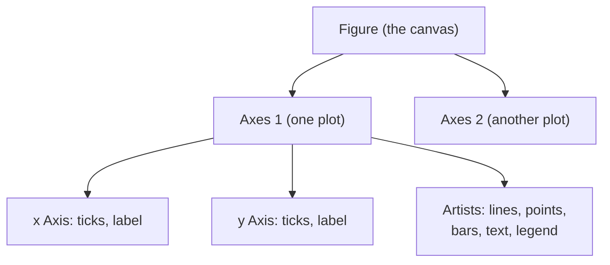
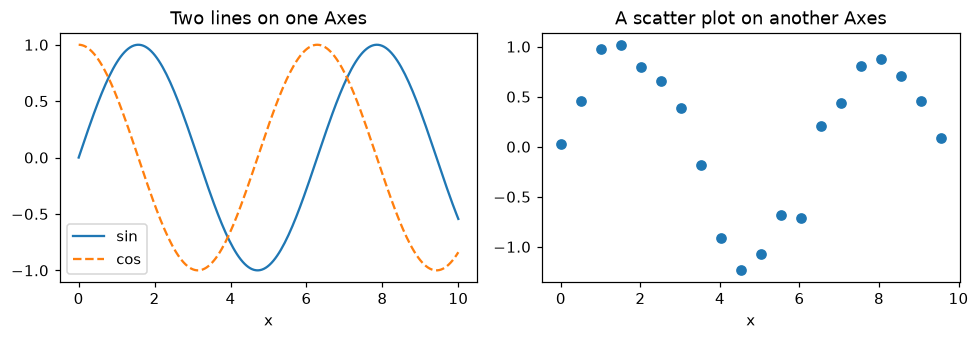
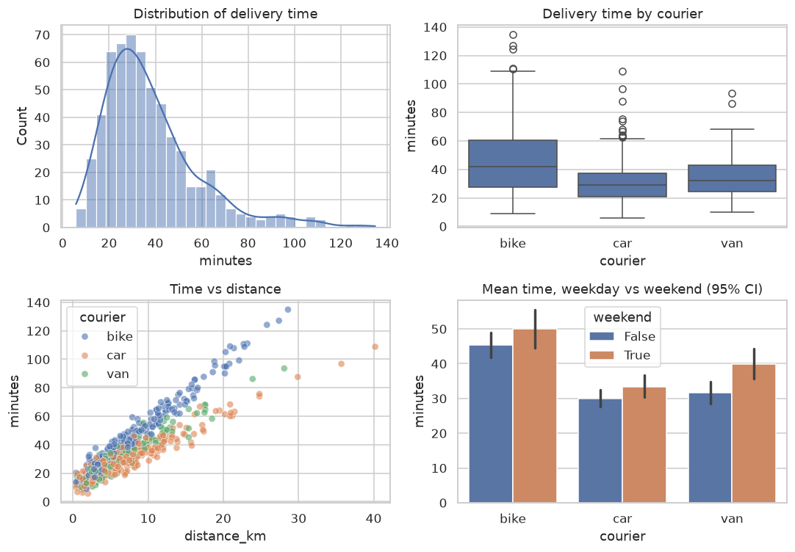
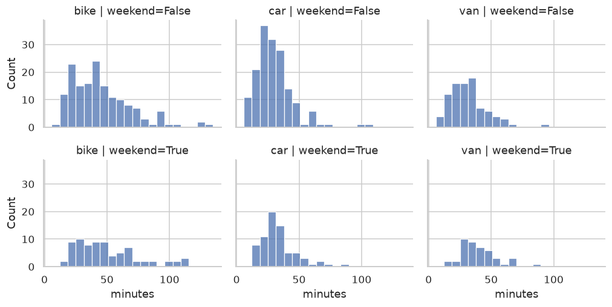
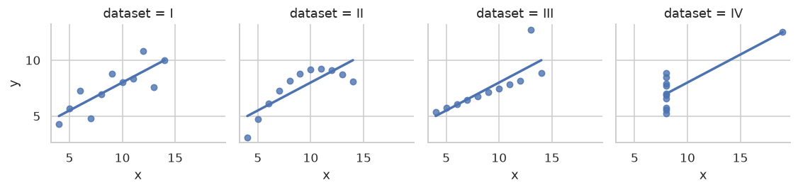
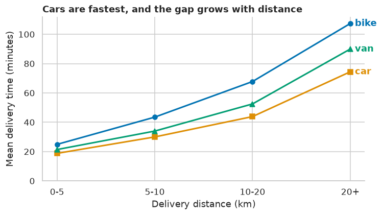
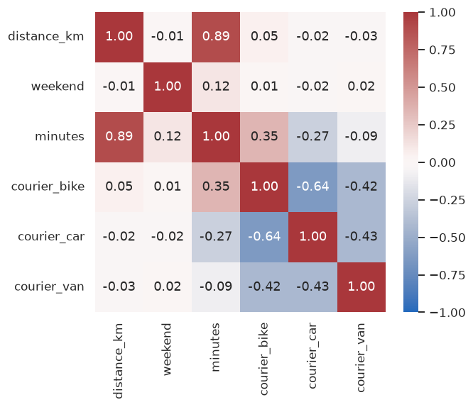
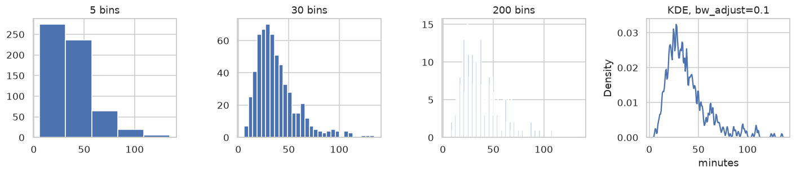
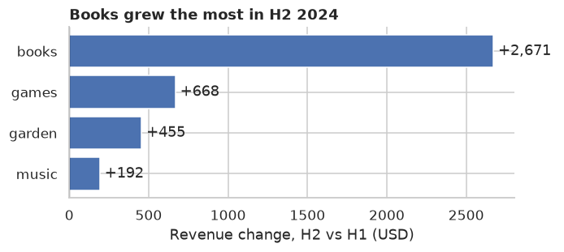

# Data Visualization

> **Level 0 · Chapter 6** · ⏱️ ~50 min read · Prerequisites: [pandas](05-pandas.md)

A good chart shows in a second what a table hides. This chapter teaches matplotlib's figure-and-axes model (so you can control any plot instead of fighting it), the core chart types and when each is right, seaborn for statistical plots, how to choose a chart for the question you're asking, how to use color well and accessibly, small multiples, the plots you'll use while exploring data, and interactive charts with plotly.

## Why it matters

In 1973, the statistician Francis Anscombe published four small datasets. All four have the same mean of $x$, the same mean of $y$, the same variance, the same correlation (0.816), and the same best-fit line. A table of summary statistics says they're identical.

Plot them and they couldn't be more different: one is a clean linear relationship, one is a curve, one is a perfect line spoiled by a single outlier, and one is a vertical stack of points with one extreme point creating the entire "correlation."

Summary statistics compress data, and compression throws information away. Every experienced analyst has a story about a model built on a relationship that a single scatter plot would have shown was an artifact. **Plot your data before you trust any number computed from it.** You'll reproduce Anscombe's quartet in the "In practice" section.

## Concepts

### Matplotlib's model: figures and axes

**matplotlib** is the foundational plotting library in Python. seaborn and pandas' `.plot()` are built on top of it. Its confusing reputation comes mostly from having two interfaces. Once you understand its object model, it becomes predictable.

- A **Figure** is the whole canvas: the window or image file.
- An **Axes** (note the "e") is one plot inside the figure: a coordinate system with an x-axis, a y-axis, data, a title, and so on. A figure can contain many Axes.
- Each Axes contains **Axis** objects (the x and y axes, with ticks and labels) and **artists**: lines, markers, text, patches.



There are two ways to drive it:

- The **pyplot interface** (`plt.plot(...)`, `plt.title(...)`) acts on an implicit "current" figure and axes. It's fine for quick one-off plots.
- The **object-oriented interface** (`fig, ax = plt.subplots()`, then `ax.plot(...)`, `ax.set_title(...)`) acts on explicit objects. Use this for anything with more than one plot, and for any code you'll reuse.

This handbook always uses the object-oriented interface. The method names map simply: `plt.title` becomes `ax.set_title`, `plt.xlabel` becomes `ax.set_xlabel`, and `plt.xlim` becomes `ax.set_xlim`.

```python
import matplotlib.pyplot as plt
import numpy as np
import pandas as pd

x = np.linspace(0, 10, 200)

fig, axes = plt.subplots(1, 2, figsize=(9, 3.2))
axes[0].plot(x, np.sin(x), label="sin")
axes[0].plot(x, np.cos(x), label="cos", linestyle="--")
axes[0].set_title("Two lines on one Axes")
axes[0].set_xlabel("x")
axes[0].legend()

axes[1].scatter(x[::10], np.sin(x[::10]) + np.random.default_rng(0).normal(0, 0.2, 20))
axes[1].set_title("A scatter plot on another Axes")
axes[1].set_xlabel("x")

fig.tight_layout()
plt.show()
```



*One Figure, two Axes. Each Axes is an independent plot that you control through its own methods.*

`plt.subplots(nrows, ncols)` returns the figure and an array of Axes. `figsize` is in inches. `tight_layout()` adjusts spacing so titles and labels don't overlap. To save a figure, call `fig.savefig("chart.png", dpi=150, bbox_inches="tight")`. Use `.svg` or `.pdf` for vector graphics that stay sharp at any size.

### The core chart types

Most analysis needs a handful of chart types. Each answers a different kind of question:

| Question | Chart | Notes |
|---|---|---|
| How does a value change over time? | **line** | time on the x-axis; use for ordered, continuous x |
| How do categories compare? | **bar** (horizontal for long labels) | start the value axis at zero |
| How are values distributed? | **histogram**, **density (KDE)** | try several bin counts |
| How do distributions compare across groups? | **box plot**, **violin**, overlaid histograms | box plots hide multimodality |
| How do two numeric variables relate? | **scatter** | add transparency for many points |
| How do many variables correlate? | **heatmap** of the correlation matrix | use a diverging colormap centered at 0 |
| What are the parts of a whole? | stacked bar, or a sorted bar of shares | avoid pie charts with more than 3 slices |

A **histogram** splits the range of a variable into bins and counts how many values fall in each. Its shape depends on the number of bins: too few hides structure, and too many shows noise. A **kernel density estimate (KDE)** is a smoothed histogram, drawn by placing a small bump (a **kernel**) on each data point and adding the bumps up.

A **box plot** summarizes a distribution in five numbers. The box spans the first to third **quartile** (the middle 50% of the data, whose width is the **interquartile range**, IQR), with a line at the median. The whiskers extend to the furthest points within 1.5 × IQR of the box, and points beyond that are drawn individually as potential outliers.

### Statistical plots with seaborn

**seaborn** is a higher-level library built on matplotlib. It works directly with pandas DataFrames: you name the columns to map to x, y, color (`hue`), and panels, and seaborn does the grouping, aggregation, and legends for you. Every seaborn function draws on a matplotlib Axes (pass `ax=` to choose which), so you can always fine-tune the result with matplotlib methods.

Let's make a realistic dataset of delivery times:

```python
import seaborn as sns

rng = np.random.default_rng(42)
n = 600
deliveries = pd.DataFrame({
    "distance_km": rng.gamma(2.0, 4.0, n).round(1),
    "courier": rng.choice(["bike", "car", "van"], n, p=[0.4, 0.4, 0.2]),
    "weekend": rng.random(n) < 0.3,
})
speed = deliveries["courier"].map({"bike": 14, "car": 24, "van": 20})
deliveries["minutes"] = (
    10 + 60 * deliveries["distance_km"] / speed
    + np.where(deliveries["weekend"], 5, 0)
    + rng.normal(0, 4, n)
).round(1)
print(deliveries.head())
```

```text
   distance_km courier  weekend  minutes
0          8.4    bike     True     48.5
1         11.3    bike     True     57.0
2          7.3     car    False     30.9
3          6.6    bike    False     42.8
4         12.3    bike    False     62.5
```

Four common seaborn plots on one figure:

```python
sns.set_theme(style="whitegrid")
fig, axes = plt.subplots(2, 2, figsize=(10, 7))

sns.histplot(data=deliveries, x="minutes", bins=30, kde=True, ax=axes[0, 0])
axes[0, 0].set_title("Distribution of delivery time")

sns.boxplot(data=deliveries, x="courier", y="minutes", order=["bike", "car", "van"], ax=axes[0, 1])
axes[0, 1].set_title("Delivery time by courier")

sns.scatterplot(data=deliveries, x="distance_km", y="minutes", hue="courier",
                hue_order=["bike", "car", "van"], alpha=0.6, ax=axes[1, 0])
axes[1, 0].set_title("Time vs distance")

sns.barplot(data=deliveries, x="courier", y="minutes", hue="weekend",
            order=["bike", "car", "van"], errorbar=("ci", 95), ax=axes[1, 1])
axes[1, 1].set_title("Mean time, weekday vs weekend (95% CI)")

fig.tight_layout()
plt.show()
```



*Four questions, four chart types. The scatter plot shows the most: delivery time grows linearly with distance, at a different rate for each courier.*

Notice how much the scatter plot reveals that the others don't. The histogram suggests one lumpy distribution, and the box plot says bikes are slowest on average. Only the scatter shows *why*: time is driven by distance, and the slope differs by vehicle. Bikes are slowest per kilometer. The bar chart's error bars show 95% **confidence intervals** for each mean, which you'll learn to compute in [Statistics](../01-math-foundations/05-statistics.md).

### Choosing the right chart

Start from the question, not the chart type. Ask three things:

1. **What am I comparing?** Values over time, categories, distributions, or relationships?
2. **How many variables?** One (a distribution), two (a relationship or comparison), or more (use color, size, or panels)?
3. **Who is it for?** Exploration (fast, many plots, just for you) or explanation (one carefully designed chart for others)?

And a few rules that prevent misleading charts:

- **Bar charts must start at zero.** A bar's *length* encodes the value. Truncating the axis makes a 2% difference look like a 50% difference. Line charts may use a non-zero baseline, because they encode change.
- **Label everything**, with units: "Revenue (USD, thousands)", not "rev".
- **Avoid 3D effects, dual y-axes, and pie charts with many slices.** People judge lengths and positions accurately, but angles, areas, and volumes poorly.
- **Sort categories** by value unless they have a natural order, such as months or sizes.

### Color and accessibility

Color is powerful and easy to misuse. Matplotlib and seaborn offer three kinds of **colormap** (palette), and choosing the wrong kind distorts the data:

| Data | Colormap type | Examples | Use for |
|---|---|---|---|
| Ordered, one direction | **sequential** | `viridis`, `Blues`, `rocket` | counts, intensity, probability |
| Ordered around a midpoint | **diverging** | `RdBu`, `coolwarm`, `vlag` | correlations, change vs baseline |
| Unordered categories | **qualitative** | `tab10`, seaborn `colorblind` | groups and labels |

Two traps:

- **Rainbow colormaps (`jet`)** have uneven perceived brightness, so they create fake boundaries in smooth data, and they're unreadable for many people with color vision deficiency. `viridis` was designed to be perceptually uniform and colorblind-safe, and it prints well in grayscale.
- **About 1 in 12 men and 1 in 200 women** have some form of color vision deficiency, most commonly red-green. Don't encode meaning with red versus green alone. Use a colorblind-safe palette (`sns.color_palette("colorblind")`), and add a second cue such as line style, marker shape, or direct labels.

For a diverging colormap, center it on the meaningful midpoint (`center=0` in seaborn heatmaps), or the colors lie about which values are above and below it.

### Small multiples

When a single plot gets crowded with too many groups, split it into a grid of small plots that share axes, one per group. Edward Tufte called these **small multiples**. Because the axes are shared, the eye compares panels instantly. seaborn's **figure-level functions** (`relplot`, `displot`, `catplot`) do this with `col=` and `row=`:

```python
g = sns.displot(data=deliveries, x="minutes", col="courier", row="weekend",
                col_order=["bike", "car", "van"], bins=20, height=2.4, aspect=1.3)
g.set_titles("{col_name} | weekend={row_name}")
plt.show()
```



*Small multiples: six histograms with shared axes. The weekend shift and the per-courier differences are easy to compare.*

Figure-level functions create their own figure and return a **FacetGrid** object rather than drawing on an Axes you supply. That's the one place in seaborn where you don't pass `ax=`.

### Plots for exploratory data analysis

When you meet a new dataset, a few plots answer most first questions:

- **Histograms of every numeric column**: `df.hist(bins=30, figsize=(12, 8))` in one line. Look for skew, spikes at suspicious values (0, 999, −1 as "missing" codes), and impossible values.
- **Bar charts of category counts**: `df["col"].value_counts().plot.barh()`. Look for typos and inconsistent spellings ("NY", "New York", "ny").
- **A correlation heatmap**: `sns.heatmap(df.corr(numeric_only=True), annot=True, cmap="vlag", center=0)`.
- **A pair plot** of a few key variables: `sns.pairplot(df, hue="target")`, a grid of every pairwise scatter plot.
- **The target against each feature**, when you're building a model.

[Exploratory data analysis](../02-data-science-workflow/03-exploratory-data-analysis.md) turns these into a systematic checklist.

### Interactive charts with plotly

**plotly** makes interactive charts that run in a browser or notebook: hover to see values, zoom, pan, and toggle series. `plotly.express` has a seaborn-like interface:

<!-- skip-run -->
```python
import plotly.express as px

fig = px.scatter(deliveries, x="distance_km", y="minutes", color="courier",
                 hover_data=["weekend"], title="Delivery time vs distance")
fig.show()                          # opens in a notebook or browser
fig.write_html("deliveries.html")   # a standalone, shareable file
```

Interactive charts are great for exploring and for dashboards. For reports and papers, static matplotlib figures are still the standard: they're reproducible, printable, and easy to version.

## In practice

### Anscombe's quartet

Let's reproduce the story. seaborn ships Anscombe's data, but it's small enough to type, and typing it avoids needing a download:

```python
x123 = [10, 8, 13, 9, 11, 14, 6, 4, 12, 7, 5]
anscombe = pd.DataFrame({
    "x": x123 * 3 + [8, 8, 8, 8, 8, 8, 8, 19, 8, 8, 8],
    "y": [8.04, 6.95, 7.58, 8.81, 8.33, 9.96, 7.24, 4.26, 10.84, 4.82, 5.68,
          9.14, 8.14, 8.74, 8.77, 9.26, 8.10, 6.13, 3.10, 9.13, 7.26, 4.74,
          7.46, 6.77, 12.74, 7.11, 7.81, 8.84, 6.08, 5.39, 8.15, 6.42, 5.73,
          6.58, 5.76, 7.71, 8.84, 8.47, 7.04, 5.25, 12.50, 5.56, 7.91, 6.89],
    "dataset": [name for name in ["I", "II", "III", "IV"] for _ in range(11)],
})

stats = anscombe.groupby("dataset").apply(
    lambda d: pd.Series({
        "mean_x": d["x"].mean(), "mean_y": d["y"].mean(),
        "var_y": d["y"].var(), "corr": d["x"].corr(d["y"]),
    }),
    include_groups=False,
).round(2)
print(stats)
```

```text
         mean_x  mean_y  var_y  corr
dataset
I           9.0     7.5   4.13  0.82
II          9.0     7.5   4.13  0.82
III         9.0     7.5   4.12  0.82
IV          9.0     7.5   4.12  0.82
```

Identical, to two decimal places. Now plot them:

```python
g = sns.lmplot(data=anscombe, x="x", y="y", col="dataset", col_wrap=4,
               ci=None, height=2.6, scatter_kws={"s": 30})
plt.show()
```



*Anscombe's quartet: four datasets with the same summary statistics and the same regression line, and completely different stories.*

Only dataset I is suited to a straight-line model. II is a curve, III is a line with one outlier pulling the fit, and in IV, one point creates the entire relationship. If you take one habit from this chapter, take this one: plot first.

### From exploration to explanation

An exploratory chart is for you, so speed matters more than polish. An explanatory chart is for someone else, and every element should serve the message. Here's the same data made into a chart for a report, answering one question: "Which courier type is fastest for longer deliveries?"

```python
mean_by = (
    deliveries.assign(band=pd.cut(deliveries["distance_km"], [0, 5, 10, 20, 60],
                                  labels=["0-5", "5-10", "10-20", "20+"]))
    .groupby(["band", "courier"], observed=True)["minutes"].mean()
    .unstack()
)

fig, ax = plt.subplots(figsize=(7, 4))
palette = dict(zip(["bike", "car", "van"], sns.color_palette("colorblind", 3)))
for courier, style in [("bike", "o-"), ("car", "s-"), ("van", "^-")]:
    ax.plot(mean_by.index.astype(str), mean_by[courier], style, color=palette[courier], lw=2)
    ax.annotate(courier, (3, mean_by[courier].iloc[-1]), xytext=(6, 0),
                textcoords="offset points", va="center", color=palette[courier], fontweight="bold")

ax.set_title("Cars are fastest, and the gap grows with distance", loc="left", fontweight="bold")
ax.set_xlabel("Delivery distance (km)")
ax.set_ylabel("Mean delivery time (minutes)")
ax.spines[["top", "right"]].set_visible(False)
ax.set_ylim(0, None)
fig.tight_layout()
plt.show()
print(mean_by.round(1))
```

```text
courier   bike   car   van
band
0-5       24.9  18.8  21.4
5-10      43.5  30.0  34.0
10-20     67.8  43.8  52.5
20+      107.3  74.4  89.9
```



*An explanatory chart: the title states the conclusion, lines are labeled directly instead of using a legend, and marker shapes back up the colors.*

What makes it explanatory: the **title is the takeaway**, not a description ("Mean delivery time by band"). **Direct labels** replace a legend, so the reader doesn't look back and forth. **Marker shapes** make the lines distinguishable without color. The **axis starts at zero**, and **chart junk** (the top and right borders) is removed. [Communicating results](../02-data-science-workflow/06-communicating-results.md) goes further.

## Exercises

### Exercise 1: Fix the misleading chart (easy)

This bar chart compares two products' satisfaction scores, 82% and 85%. Run it, explain why it's misleading, and fix it.

<!-- skip-run -->
```python
fig, ax = plt.subplots()
ax.bar(["Product A", "Product B"], [82, 85])
ax.set_ylim(80, 86)
plt.show()
```

??? success "Solution"

    With the y-axis starting at 80, Product B's bar is 2.5 times as tall as A's, implying a huge difference, when the real difference is 3 percentage points. Bar length encodes value, so bars must start at zero:

    ```python
    fig, ax = plt.subplots(figsize=(4, 3))
    ax.bar(["Product A", "Product B"], [82, 85], color=sns.color_palette("colorblind", 2))
    ax.set_ylim(0, 100)
    ax.set_ylabel("Satisfied customers (%)")
    for i, v in enumerate([82, 85]):
        ax.text(i, v + 1, f"{v}%", ha="center")
    plt.show()
    ```

    If the 3-point difference is what matters, show it directly: a dot plot with a narrow axis is acceptable, because dots encode position, not length. Or plot the difference itself, with a confidence interval.

### Exercise 2: Choose the chart (easy)

Which chart would you use for each, and why?

1. Daily website visits over two years.
2. Revenue for 25 product categories.
3. The distribution of customer ages, comparing paying and free users.
4. The relationship between ad spend and sales across 500 campaigns.
5. Pairwise correlations among 15 numeric features.

??? success "Solution"

    1. **Line chart.** Time is ordered and continuous. Add a 7-day rolling mean to see the trend through weekly cycles.
    2. **Horizontal bar chart, sorted by revenue.** Horizontal bars fit long labels, and sorting makes ranking obvious.
    3. **Overlaid histograms or KDEs** (normalized with `stat="density"`, since the groups differ in size), or side-by-side box or violin plots.
    4. **Scatter plot** with transparency (`alpha`). Consider log scales if spend spans orders of magnitude.
    5. **Correlation heatmap** with a diverging colormap centered at 0.

### Exercise 3: A correlation heatmap (medium)

Build a heatmap of the correlations between `distance_km`, `minutes`, `weekend`, and a one-hot encoding of `courier` in the deliveries data. Use an appropriate colormap, centered correctly, with the values annotated. Which variable correlates most with `minutes`?

??? success "Solution"

    ```python
    num = pd.get_dummies(deliveries, columns=["courier"], dtype=float).astype(float)
    corr = num.corr()
    fig, ax = plt.subplots(figsize=(6, 5))
    sns.heatmap(corr, annot=True, fmt=".2f", cmap="vlag", center=0, vmin=-1, vmax=1, ax=ax)
    plt.show()
    print(corr["minutes"].drop("minutes").sort_values(ascending=False).round(2))
    ```

    ```text
    distance_km     0.89
    courier_bike    0.35
    weekend         0.12
    courier_van    -0.09
    courier_car    -0.27
    Name: minutes, dtype: float64
    ```

    

    Distance dominates. The diverging `vlag` colormap with `center=0` makes positive and negative correlations visually distinct, and fixing `vmin=-1, vmax=1` keeps the color scale honest across different heatmaps.

### Exercise 4: Bin count matters (medium)

Draw the histogram of `minutes` with 5, 30, and 200 bins side by side. Describe what each one shows or hides, and then draw a KDE with a deliberately too-small bandwidth (`bw_adjust=0.1`). What's the lesson?

??? success "Solution"

    ```python
    fig, axes = plt.subplots(1, 4, figsize=(13, 3))
    for ax, bins in zip(axes[:3], [5, 30, 200]):
        ax.hist(deliveries["minutes"], bins=bins)
        ax.set_title(f"{bins} bins")
    sns.kdeplot(deliveries["minutes"], bw_adjust=0.1, ax=axes[3])
    axes[3].set_title("KDE, bw_adjust=0.1")
    fig.tight_layout()
    plt.show()
    ```

    

    With 5 bins, the long right tail is hidden in one bar. With 30, the shape is clear: right-skewed, with a long tail. With 200, it's mostly noise. The undersmoothed KDE invents dozens of peaks that are just individual data points. The lesson: a histogram's or KDE's shape is partly an artifact of your choices. Try several settings before you conclude that a distribution is, for example, bimodal.

### Exercise 5: Make it explanatory (hard)

Using the orders data from the [pandas chapter](05-pandas.md) (regenerate it with the same code), make one explanatory chart answering: "Which category's revenue grew the most from the first half of 2024 to the second half?" Follow the principles: a takeaway title, sorted categories, direct labels, a zero baseline, and minimal clutter.

??? success "Solution"

    One good design is a horizontal bar chart of the *change* (H2 minus H1), sorted, with bars colored by sign and the values labeled:

    ```python
    rng = np.random.default_rng(0)
    n = 1_000
    orders = pd.DataFrame({
        "order_date": pd.Timestamp("2024-01-01") + pd.to_timedelta(rng.integers(0, 365, size=n), unit="D"),
        "category": rng.choice(["books", "games", "music", "garden"], size=n, p=[0.4, 0.25, 0.2, 0.15]),
        "amount": np.round(rng.gamma(shape=2.0, scale=25.0, size=n), 2),
    })
    half = np.where(orders["order_date"].dt.month <= 6, "H1", "H2")
    rev = orders.groupby(["category", half])["amount"].sum().unstack()
    change = (rev["H2"] - rev["H1"]).sort_values()

    fig, ax = plt.subplots(figsize=(6.5, 3))
    colors = ["#c44e52" if v < 0 else "#4c72b0" for v in change]
    ax.barh(change.index, change.values, color=colors)
    ax.axvline(0, color="black", lw=0.8)
    for i, v in enumerate(change.values):
        ax.text(v, i, f" {v:+,.0f} ", va="center", ha="left" if v >= 0 else "right")
    ax.set_title(f"{change.idxmax().title()} grew the most in H2 2024", loc="left", fontweight="bold")
    ax.set_xlabel("Revenue change, H2 vs H1 (USD)")
    ax.spines[["top", "right"]].set_visible(False)
    fig.tight_layout()
    plt.show()
    print(change.round(0))
    ```

    ```text
    category
    music      192.0
    garden     455.0
    games      668.0
    books     2671.0
    dtype: float64
    ```

    

    The title is computed from the data, so it stays correct if the data changes. Plotting the *change* directly answers the question; two bars per category would make the reader do the subtraction. In this synthetic data the changes are random noise. In a real report, you'd check whether a change of this size is bigger than normal month-to-month variation before calling it growth.

## Check yourself

1. What's the difference between a Figure and an Axes in matplotlib?

    ??? note "Answer"

        The Figure is the whole canvas or image. An Axes is one plot within it, with its own coordinate system, data, and labels. A Figure can contain many Axes.

2. Why prefer the object-oriented interface (`fig, ax = plt.subplots()`) over `plt.plot`?

    ??? note "Answer"

        It makes explicit which figure and axes each command acts on, which matters as soon as you have more than one plot, and it makes plotting code reusable inside functions.

3. Why must bar charts start at zero, when line charts needn't?

    ??? note "Answer"

        Bars encode values by their length, so a truncated axis exaggerates differences. Lines encode values by position and change, so a non-zero baseline doesn't distort them.

4. Which kind of colormap would you use for a correlation matrix, and why?

    ??? note "Answer"

        A diverging colormap centered at zero, because correlations have a meaningful midpoint (0) and two directions (positive and negative).

5. What's wrong with the rainbow `jet` colormap?

    ??? note "Answer"

        Its perceived brightness isn't uniform, so it creates false boundaries and hides real ones, and it's hard to read for people with color vision deficiency. Perceptually uniform maps such as `viridis` fix both problems.

6. What does Anscombe's quartet teach?

    ??? note "Answer"

        Very different datasets can have identical summary statistics and regression lines. Always plot data before trusting numbers computed from it.

7. What are small multiples, and why do they work?

    ??? note "Answer"

        A grid of small plots, one per group, that share axes. Shared axes let the eye compare groups directly, without the clutter of overlaying them all on one plot.

## Key takeaways

- A Figure contains Axes, and an Axes contains the data and labels. Use `fig, ax = plt.subplots()` and call methods on `ax`.
- Choose the chart from the question: lines for time, bars for categories, histograms and box plots for distributions, scatter plots for relationships, and heatmaps for correlation matrices.
- seaborn works directly with DataFrames, and every seaborn plot can be fine-tuned with matplotlib.
- Use sequential, diverging, or qualitative colormaps to match the data, and keep charts colorblind-safe with a second cue.
- Plot before you trust a statistic, and turn exploratory plots into explanatory ones with a takeaway title, direct labels, and less clutter.

## Further reading

- *Fundamentals of Data Visualization* by Claus O. Wilke, free online at clauswilke.com/dataviz. Excellent on choosing charts and using color.
- *The Visual Display of Quantitative Information* by Edward Tufte.
- The matplotlib "Quick start guide" and the seaborn tutorial, at matplotlib.org and seaborn.pydata.org.
- "Graphs in Statistical Analysis" by F. J. Anscombe (*The American Statistician*, 1973).

## Next

Put Level 0 together in the [Level 0 capstone](../../exercises/level-0-capstone.md).
