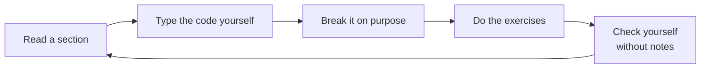

# Level 0: Python for Data

> **Level 0 · Overview** · ⏱️ ~3–4 weeks at about an hour a day · Prerequisites: basic Python (variables, loops, functions)

Level 0 turns "I know some Python" into "I can load, reshape, compute on, and chart any tabular dataset quickly and correctly." Everything later in the handbook, from linear algebra to transformers, is written in the tools you learn here.

## What this level covers

You start with a map of the field: what AI, machine learning, deep learning, and data science each mean, how a project flows from a question to a deployed answer, and who does which job. Then you build the workbench. You set up a clean, reproducible Python environment, so your code runs the same way next month and on a colleague's laptop.

Next comes the core stack. You tighten the Python you already know (data structures and their costs, generators, dataclasses, type hints, paths). You learn **NumPy**, the array library that nearly every numerical Python tool is built on, including how arrays sit in memory and why vectorized code is fast. You learn **pandas**, the everyday tool for tabular data: filtering, grouping, joining, reshaping, and time series. You finish with **visualization**: matplotlib's model of figures and axes, seaborn for statistical plots, plotly for interactive ones, and the judgment to pick the right chart.

## What you'll be able to do

- Explain the difference between AI, ML, deep learning, and data science, and place any project on the end-to-end workflow.
- Create an isolated, pinned Python environment for a project, and know when conda or Colab is the better choice.
- Write idiomatic, efficient Python for data work and avoid the classic traps (mutable defaults, aliasing, float equality).
- Replace slow Python loops with vectorized NumPy code, and predict the result shape of any broadcasting operation.
- Load, clean, filter, aggregate, merge, and reshape data with pandas, and know when polars is worth reaching for.
- Choose and build clear, accessible charts for exploring data and for showing results.

## Chapters

| # | Chapter | What it covers | Time |
|---|---|---|---|
| 1 | [The data landscape](01-the-data-landscape.md) | AI vs ML vs DL vs data science, kinds of learning, the end-to-end workflow, roles, the tool stack, how to study | ~40 min read + 1 h practice |
| 2 | [Setting up your environment](02-environment-setup.md) | Python versions, venv and uv, conda, Jupyter, VS Code, project layout, lock files, GPUs, Colab | ~45 min read + 1–2 h practice |
| 3 | [Python essentials for data work](03-python-essentials.md) | Data structures and their costs, comprehensions, functions, dataclasses, generators, type hints, files, pitfalls | ~50 min read + 2–3 h practice |
| 4 | [NumPy](04-numpy.md) | ndarrays and memory, dtypes, vectorization, indexing, broadcasting, axes, reshaping, linear algebra, random numbers | ~60 min read + 3–4 h practice |
| 5 | [pandas](05-pandas.md) | Series and DataFrames, I/O, selection, missing values, groupby, merges, reshaping, time series, chaining, polars | ~60 min read + 4–5 h practice |
| 6 | [Data visualization](06-visualization.md) | Matplotlib's figure/axes model, core chart types, seaborn, choosing charts, color and accessibility, plotly | ~50 min read + 2–3 h practice |

## How to study this level

- **Type the code; don't paste it.** Typing forces you to notice every argument. Then change something and predict the result before you run it.
- **Keep a scratch notebook per chapter.** Run each example, then poke at it: change a shape, drop a column, add a missing value.
- **Predict shapes and dtypes.** Before running any NumPy or pandas line, say out loud what shape and dtype the result will have. This one habit prevents most bugs.
- **Use the cheat sheets** while you practice: [NumPy](../../cheatsheets/numpy.md), [pandas](../../cheatsheets/pandas.md), and [visualization](../../cheatsheets/visualization.md).
- **Start your "mistakes I made" log now.** Every time something surprises you, write down what happened and why.

!!! tip "If you already know Python well"
    Skim chapters 1–3 and do their exercises. If you get them all right, move straight to NumPy. Don't skip NumPy and pandas, even if you've used them: the chapters explain *why* they behave the way they do, and later levels rely on that.

## Capstone

The level ends with a project: **[analyze a real dataset end to end in a notebook](../../exercises/level-0-capstone.md)**. You set up a reproducible project, load and clean the data, analyze it with NumPy and pandas, chart it, and write up what you found. Finish it without notes before you start [Level 1: Math foundations](../01-math-foundations/index.md).
