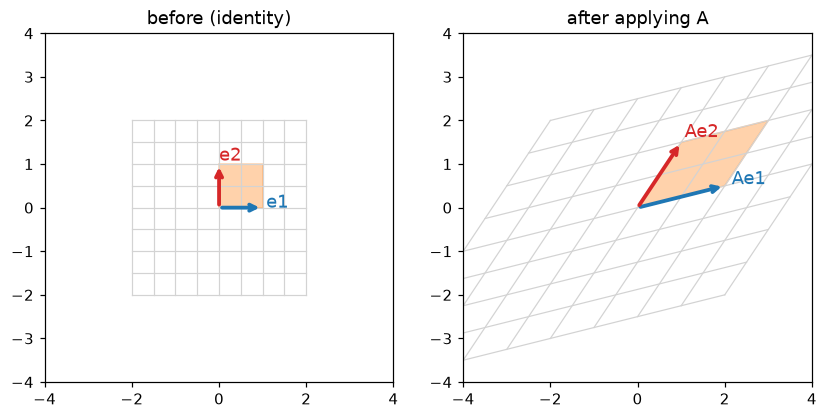
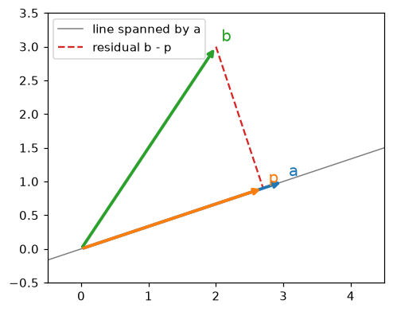

# Linear Algebra

> **Level 1 · Chapter 1** · ⏱️ ~60 min read · Prerequisites: [NumPy](../00-python-for-data/04-numpy.md)

Linear algebra is the language that data and models are written in. This chapter covers vectors (as arrows and as rows of data), dot products and cosine similarity, norms, matrices as transformations of space, matrix multiplication, linear systems, rank and independence, inverses and determinants, and projections, with every idea checked in NumPy.

## Why it matters

Sam was building a model to predict monthly revenue per customer. The feature table had `web_spend`, `app_spend`, `store_spend`, and, because a teammate thought it would help, `total_spend`, the sum of the other three. Sam fitted a linear regression with a hand-written solver, and the coefficients came out absurd: `web_spend` got a weight of about plus 3 million and `total_spend` about minus 3 million. Re-running on a slightly different date range flipped the signs. The predictions looked fine, which made it worse: nothing crashed, so the nonsense coefficients went into a slide deck about "what drives revenue".

The cause was pure linear algebra. One column was a combination of the others, so the data matrix had less **rank** than columns. Infinitely many coefficient vectors gave identical predictions, and the solver picked one more or less at random, based on rounding error. If Sam had checked `np.linalg.matrix_rank(X)`, the problem would have been obvious in one line.

You'll hit this and its cousins constantly: duplicated features, one-hot encodings with every category plus an intercept, nearly parallel embedding vectors, and similarity searches dominated by vector length. Linear algebra is how you see them.

## Concepts

### Vectors: arrows and rows of data

A **vector** is an ordered list of numbers. You can read it two ways, and you need both.

**Geometrically**, a vector is an arrow from the origin to a point. The vector $\mathbf{v} = (3, 2)$ points 3 units right and 2 units up. Adding vectors means placing arrows tip to tail. Multiplying by a number (a **scalar**) stretches or flips the arrow.

**As data**, a vector is one record. A customer with age 34, 12 visits last month, and USD 250 of spend is the vector $(34, 12, 250)$. A dataset of $n$ customers with $d$ features is $n$ points in $d$-dimensional space. You can't picture 50 dimensions, but everything you learn in 2D (lengths, angles, distances, projections) works the same way there. That's the payoff of linear algebra: build intuition with pictures in 2D, then apply the same formulas in any dimension.

We write vectors in bold lowercase, $\mathbf{x} \in \mathbb{R}^d$, which reads "$\mathbf{x}$ is a vector of $d$ real numbers". Its entries are $x_1, \dots, x_d$. By convention a vector is a **column** (a $d \times 1$ matrix), and $\mathbf{x}^\top$ (read "x transpose") is the same numbers laid out as a row.

The two basic operations work entry by entry:

$$
\mathbf{a} + \mathbf{b} = \begin{pmatrix} a_1 + b_1 \\ \vdots \\ a_d + b_d \end{pmatrix}, \qquad c\,\mathbf{a} = \begin{pmatrix} c\,a_1 \\ \vdots \\ c\,a_d \end{pmatrix}.
$$

A sum of scaled vectors, $c_1 \mathbf{v}_1 + c_2 \mathbf{v}_2 + \dots + c_k \mathbf{v}_k$, is called a **linear combination**. Almost everything in this chapter is about linear combinations.

```python
import numpy as np

alex = np.array([34.0, 12.0, 250.0])   # age, visits, spend in USD
sam = np.array([29.0, 3.0, 40.0])

print(alex + sam)              # entry-wise sum
print(0.5 * (alex + sam))      # the average customer: a linear combination
print(alex.shape)              # a 1D array of 3 numbers
```

```text
[ 63.  15. 290.]
[ 31.5   7.5 145. ]
(3,)
```

NumPy doesn't distinguish row and column vectors for 1D arrays: shape `(3,)` is just "three numbers". When the distinction matters (for example in matrix products), NumPy infers it from context, or you make it explicit with shape `(3, 1)` or `(1, 3)`.

### The dot product

The **dot product** (or **inner product**) of two vectors of the same length multiplies matching entries and adds them up:

$$
\mathbf{a}^\top \mathbf{b} = \mathbf{a} \cdot \mathbf{b} = \sum_{i=1}^{d} a_i b_i.
$$

The $\sum_{i=1}^{d}$ reads "the sum, for $i$ from 1 to $d$, of". The result is a single number, a scalar.

The dot product is everywhere in ML. A linear model's prediction is $\hat{y} = \mathbf{w}^\top \mathbf{x} + b$: a weighted sum of features, where $\mathbf{w}$ holds one weight per feature and $b$ is a constant offset (the **bias** or intercept). Each neuron in a neural network computes a dot product. Attention in transformers is dot products between query and key vectors.

**Geometrically**, the dot product measures how much two vectors point the same way:

$$
\mathbf{a}^\top \mathbf{b} = \lVert \mathbf{a} \rVert \, \lVert \mathbf{b} \rVert \cos\theta,
$$

where $\lVert \mathbf{a} \rVert$ is the length of $\mathbf{a}$ (defined below) and $\theta$ is the angle between the arrows. It's positive when they point roughly the same way ($\theta < 90^\circ$), zero when they're perpendicular, and negative when they point roughly opposite ways.

Why are these two definitions the same? Here's the derivation. The **law of cosines** from high-school geometry says that for a triangle with sides $\mathbf{a}$, $\mathbf{b}$, and $\mathbf{a} - \mathbf{b}$,

$$
\lVert \mathbf{a} - \mathbf{b} \rVert^2 = \lVert \mathbf{a} \rVert^2 + \lVert \mathbf{b} \rVert^2 - 2 \lVert \mathbf{a} \rVert \lVert \mathbf{b} \rVert \cos\theta.
$$

Now expand the left side using the sum definition. Since $\lVert \mathbf{v} \rVert^2 = \sum_i v_i^2 = \mathbf{v}^\top \mathbf{v}$,

$$
\lVert \mathbf{a} - \mathbf{b} \rVert^2 = \sum_i (a_i - b_i)^2 = \sum_i a_i^2 - 2\sum_i a_i b_i + \sum_i b_i^2 = \lVert \mathbf{a} \rVert^2 - 2\,\mathbf{a}^\top\mathbf{b} + \lVert \mathbf{b} \rVert^2.
$$

Comparing the two lines, the $\lVert \mathbf{a} \rVert^2$ and $\lVert \mathbf{b} \rVert^2$ terms cancel, leaving $\mathbf{a}^\top \mathbf{b} = \lVert \mathbf{a} \rVert \lVert \mathbf{b} \rVert \cos\theta$. The algebraic and geometric definitions agree.

Two vectors with a dot product of zero are called **orthogonal**: perpendicular, in any number of dimensions.

### Cosine similarity

Dividing out the lengths leaves just the angle:

$$
\cos\theta = \frac{\mathbf{a}^\top \mathbf{b}}{\lVert \mathbf{a} \rVert \, \lVert \mathbf{b} \rVert}.
$$

This is **cosine similarity**. It ranges from $-1$ (opposite directions) through $0$ (unrelated, orthogonal) to $1$ (same direction), and it ignores length entirely. That's exactly what you want when length is a nuisance. Two documents represented as word counts point the same way if they use words in the same proportions, even if one is ten times longer. Two users who rate the same movies highly look similar even if one rates everything a bit higher. Text embeddings from language models are almost always compared with cosine similarity.

```python
def cosine(a, b):
    return a @ b / (np.linalg.norm(a) * np.linalg.norm(b))

a = np.array([1.0, 0.0])
b = np.array([1.0, 1.0])
print(a @ b)                                   # the dot product
print(cosine(a, b), np.cos(np.pi / 4))         # 45 degrees apart
print(round(np.degrees(np.arccos(cosine(a, b))), 6))   # recover the angle

# Check the geometric formula on random 5-dimensional vectors
rng = np.random.default_rng(0)
u, v = rng.normal(size=5), rng.normal(size=5)
lhs = np.linalg.norm(u - v) ** 2
rhs = u @ u + v @ v - 2 * u @ v
print(np.isclose(lhs, rhs))
```

```text
1.0
0.7071067811865475 0.7071067811865476
45.0
True
```

The `@` operator on two 1D arrays computes the dot product. The last check confirms the expansion of $\lVert \mathbf{u} - \mathbf{v} \rVert^2$ that the derivation relied on.

### Norms: measuring length

A **norm** is a way to measure the size of a vector. The one you know from geometry is the **Euclidean norm**, or **L2 norm**:

$$
\lVert \mathbf{x} \rVert_2 = \sqrt{\sum_{i=1}^{d} x_i^2} = \sqrt{\mathbf{x}^\top \mathbf{x}}.
$$

In 2D it's Pythagoras: the arrow $(3, 4)$ has length 5. Two others matter in ML:

- The **L1 norm** (or Manhattan norm) adds absolute values: $\lVert \mathbf{x} \rVert_1 = \sum_i \lvert x_i \rvert$. It's the distance a taxi drives on a grid of streets.
- The **L∞ norm** (or max norm) takes the largest absolute entry: $\lVert \mathbf{x} \rVert_\infty = \max_i \lvert x_i \rvert$.

All three are special cases of the **Lp norm**, $\lVert \mathbf{x} \rVert_p = \left(\sum_i \lvert x_i \rvert^p\right)^{1/p}$. When people write $\lVert \mathbf{x} \rVert$ with no subscript, they mean L2.

The **distance** between two points is the norm of their difference, $\lVert \mathbf{a} - \mathbf{b} \rVert$. That's what k-nearest neighbors and k-means use.

Norms also measure the size of a model's weights. **Ridge regression** penalizes $\lVert \mathbf{w} \rVert_2^2$, and **lasso** penalizes $\lVert \mathbf{w} \rVert_1$. The two penalties behave very differently (L1 pushes weights to exactly zero, L2 just shrinks them), and you'll see why geometrically in [Level 3](../03-ml-fundamentals/index.md).

A **unit vector** has length 1. Dividing any nonzero vector by its norm gives the unit vector pointing the same way, $\mathbf{x} / \lVert \mathbf{x} \rVert$. This is called **normalizing**. Cosine similarity is just the dot product of normalized vectors.

```python
x = np.array([3.0, -4.0])
print(np.linalg.norm(x))              # L2: sqrt(9 + 16)
print(np.linalg.norm(x, ord=1))       # L1: 3 + 4
print(np.linalg.norm(x, ord=np.inf))  # L-infinity: max(3, 4)
x_unit = x / np.linalg.norm(x)
print(x_unit, np.linalg.norm(x_unit))
```

```text
5.0
7.0
4.0
[ 0.6 -0.8] 1.0
```

!!! warning "Common mistake: distances on unscaled features"
    The customer vector $(34, 12, 250)$ mixes years, visit counts, and dollars. Its Euclidean distance to another customer is dominated by spend, simply because spend has the biggest numbers. Changing spend from USD to cents would change which customers are "nearest". Standardize features (subtract the mean, divide by the standard deviation) before using distances or norms on them.

### Matrices as transformations

A **matrix** is a rectangular grid of numbers. A matrix with $m$ rows and $n$ columns is written $\mathbf{A} \in \mathbb{R}^{m \times n}$, and $A_{ij}$ is the entry in row $i$, column $j$. Like vectors, matrices have two readings.

**As data**, a matrix is a table. The **design matrix** $\mathbf{X} \in \mathbb{R}^{n \times d}$ has one row per sample and one column per feature. Row $i$ is the vector $\mathbf{x}_i^\top$.

**As a transformation**, a matrix is a function that moves vectors. Multiplying $\mathbf{A}$ by a vector $\mathbf{x}$ gives a new vector:

$$
(\mathbf{A}\mathbf{x})_i = \sum_{j=1}^{n} A_{ij} x_j.
$$

Entry $i$ of the result is the dot product of row $i$ of $\mathbf{A}$ with $\mathbf{x}$. That's the **row view**. There's an equally important **column view**: $\mathbf{A}\mathbf{x}$ is a linear combination of the columns of $\mathbf{A}$, weighted by the entries of $\mathbf{x}$:

$$
\mathbf{A}\mathbf{x} = x_1 \mathbf{a}_1 + x_2 \mathbf{a}_2 + \dots + x_n \mathbf{a}_n,
$$

where $\mathbf{a}_j$ is column $j$ of $\mathbf{A}$.

The column view gives you the key to picturing any matrix. In 2D, the **standard basis vectors** are $\mathbf{e}_1 = (1, 0)$ and $\mathbf{e}_2 = (0, 1)$. By the column view, $\mathbf{A}\mathbf{e}_1 = \mathbf{a}_1$ and $\mathbf{A}\mathbf{e}_2 = \mathbf{a}_2$. So **the columns of a matrix are where the basis vectors land.** Every other vector $\mathbf{x} = x_1 \mathbf{e}_1 + x_2 \mathbf{e}_2$ lands at $x_1 \mathbf{a}_1 + x_2 \mathbf{a}_2$: the same combination of the moved basis vectors.

That's what **linear** means. A transformation $f$ is linear if $f(\mathbf{u} + \mathbf{v}) = f(\mathbf{u}) + f(\mathbf{v})$ and $f(c\,\mathbf{u}) = c\,f(\mathbf{u})$. Geometrically, grid lines stay straight, parallel, and evenly spaced, and the origin stays put. Every matrix is a linear transformation, and every linear transformation between finite-dimensional spaces is a matrix.

Some 2D examples:

| Matrix | What it does |
|---|---|
| $\begin{pmatrix} 2 & 0 \\ 0 & 3 \end{pmatrix}$ | stretches $x$ by 2 and $y$ by 3 (a **diagonal** matrix scales each axis) |
| $\begin{pmatrix} \cos\phi & -\sin\phi \\ \sin\phi & \cos\phi \end{pmatrix}$ | rotates counterclockwise by angle $\phi$ |
| $\begin{pmatrix} 1 & 1 \\ 0 & 1 \end{pmatrix}$ | shears: pushes points right in proportion to their height |
| $\begin{pmatrix} 1 & 0 \\ 0 & 0 \end{pmatrix}$ | squashes everything onto the $x$-axis (a projection) |
| $\begin{pmatrix} 1 & 0 \\ 0 & 1 \end{pmatrix}$ | does nothing: the **identity** matrix $\mathbf{I}$ |

```python
import matplotlib.pyplot as plt

A = np.array([[2.0, 1.0],
              [0.5, 1.5]])

fig, axes = plt.subplots(1, 2, figsize=(9, 4.5))
t = np.linspace(-2, 2, 50)
square = np.array([[0, 1, 1, 0, 0],
                   [0, 0, 1, 1, 0]])
for ax, M, title in [(axes[0], np.eye(2), "before (identity)"), (axes[1], A, "after applying A")]:
    for c in np.linspace(-2, 2, 9):                     # grid lines, then transform them
        for pts in (np.stack([np.full_like(t, c), t]), np.stack([t, np.full_like(t, c)])):
            q = M @ pts
            ax.plot(q[0], q[1], color="lightgray", lw=0.8)
    s = M @ square
    ax.fill(s[0], s[1], color="tab:orange", alpha=0.35)
    for col, color, name in [(0, "tab:blue", "e1"), (1, "tab:red", "e2")]:
        ax.annotate("", xy=M[:, col], xytext=(0, 0),
                    arrowprops=dict(arrowstyle="->", color=color, lw=2.5))
        ax.text(*(M[:, col] * 1.08), f"A{name}" if M is A else name, color=color, fontsize=12)
    ax.set_xlim(-4, 4); ax.set_ylim(-4, 4); ax.set_aspect("equal")
    ax.set_title(title)
plt.show()

print("A e1 =", A @ np.array([1.0, 0.0]), " A e2 =", A @ np.array([0.0, 1.0]))
```

```text
A e1 = [2.  0.5]  A e2 = [1.  1.5]
```



*A matrix moves the basis vectors to its columns, and the whole grid follows. Grid lines stay straight and evenly spaced, and the unit square (orange) becomes a parallelogram.*

### Matrix multiplication is composition

If $\mathbf{B}$ transforms a vector and then $\mathbf{A}$ transforms the result, the combined effect is $\mathbf{A}(\mathbf{B}\mathbf{x})$. **Matrix multiplication** is defined so that this equals $(\mathbf{A}\mathbf{B})\mathbf{x}$: the product $\mathbf{A}\mathbf{B}$ is the single matrix that does "first $\mathbf{B}$, then $\mathbf{A}$". For $\mathbf{A} \in \mathbb{R}^{m \times k}$ and $\mathbf{B} \in \mathbb{R}^{k \times n}$,

$$
(\mathbf{A}\mathbf{B})_{ij} = \sum_{p=1}^{k} A_{ip} B_{pj}.
$$

Why this formula? Apply the column view: column $j$ of $\mathbf{A}\mathbf{B}$ must be where $\mathbf{e}_j$ ends up. $\mathbf{B}$ sends $\mathbf{e}_j$ to its column $\mathbf{b}_j$, then $\mathbf{A}$ sends that to $\mathbf{A}\mathbf{b}_j$. So column $j$ of the product is $\mathbf{A}\mathbf{b}_j$, and entry $i$ of that is the formula above.

Three rules follow from "multiplication is composition":

1. **The inner dimensions must match.** $(m \times k)(k \times n) \to (m \times n)$. $\mathbf{B}$'s output must be the right size to feed into $\mathbf{A}$.
2. **Order matters.** In general $\mathbf{A}\mathbf{B} \neq \mathbf{B}\mathbf{A}$. Rotating then stretching is not the same as stretching then rotating.
3. **Associativity holds.** $(\mathbf{A}\mathbf{B})\mathbf{C} = \mathbf{A}(\mathbf{B}\mathbf{C})$: a chain of transformations is the same chain however you group it.

The **transpose** $\mathbf{A}^\top$ swaps rows and columns, $(\mathbf{A}^\top)_{ij} = A_{ji}$. A useful identity is $(\mathbf{A}\mathbf{B})^\top = \mathbf{B}^\top \mathbf{A}^\top$ (note the order flips). A matrix equal to its own transpose is **symmetric**. The matrix $\mathbf{X}^\top \mathbf{X}$, which appears in regression, is always symmetric.

```python
rng = np.random.default_rng(1)
A = rng.normal(size=(2, 3))
B = rng.normal(size=(3, 4))
C = rng.normal(size=(4, 2))
x = rng.normal(size=4)

print((A @ B).shape)                                  # (2,3)(3,4) -> (2,4)
print(np.allclose((A @ B) @ x, A @ (B @ x)))          # composition
print(np.allclose((A @ B) @ C, A @ (B @ C)))          # associativity
print(np.allclose((A @ B).T, B.T @ A.T))              # transpose of a product

R = np.array([[0.0, -1.0], [1.0, 0.0]])               # rotate 90 degrees
S = np.array([[2.0, 0.0], [0.0, 1.0]])                # stretch x by 2
print(R @ S)
print(S @ R)                                          # different: order matters
```

```text
(2, 4)
True
True
True
[[ 0. -1.]
 [ 2.  0.]]
[[ 0. -2.]
 [ 1.  0.]]
```

There's a fourth view of the product worth knowing: $\mathbf{A}\mathbf{B}$ is the sum of **outer products** of the columns of $\mathbf{A}$ with the rows of $\mathbf{B}$, $\mathbf{A}\mathbf{B} = \sum_{p} \mathbf{a}_p \mathbf{b}_p^\top$, where $\mathbf{b}_p^\top$ is row $p$ of $\mathbf{B}$. An outer product $\mathbf{u}\mathbf{v}^\top$ of two vectors is a whole matrix with entries $u_i v_j$. You'll meet this view again with the SVD in the [next chapter](02-matrix-decompositions.md).

!!! warning "Common mistake: `*` is not matrix multiplication"
    In NumPy, `A * B` multiplies entry by entry (and broadcasts). `A @ B` is the matrix product. Mixing them up often doesn't raise an error when the shapes happen to be compatible, and silently gives wrong answers. In math notation, entry-wise multiplication is written $\mathbf{A} \odot \mathbf{B}$ (the **Hadamard product**).

### Systems of linear equations

A **system of linear equations** asks for numbers that satisfy several linear equations at once:

$$
\begin{aligned}
2x_1 + x_2 &= 5 \\
x_1 + 3x_2 &= 10
\end{aligned}
\qquad\Longleftrightarrow\qquad
\underbrace{\begin{pmatrix} 2 & 1 \\ 1 & 3 \end{pmatrix}}_{\mathbf{A}}
\underbrace{\begin{pmatrix} x_1 \\ x_2 \end{pmatrix}}_{\mathbf{x}}
=
\underbrace{\begin{pmatrix} 5 \\ 10 \end{pmatrix}}_{\mathbf{b}}.
$$

There are two pictures of $\mathbf{A}\mathbf{x} = \mathbf{b}$:

- **The row picture.** Each equation is a line (in 2D) or a plane or hyperplane (in more dimensions). The solution is where they all intersect. Two lines can cross at one point, be parallel (no solution), or be the same line (infinitely many solutions).
- **The column picture.** Find the weights $x_1, x_2$ so that $x_1 \mathbf{a}_1 + x_2 \mathbf{a}_2 = \mathbf{b}$. You're asking whether $\mathbf{b}$ can be built from the columns of $\mathbf{A}$, and with which recipe.

The column picture generalizes better. It turns "does a solution exist?" into "is $\mathbf{b}$ reachable by combining the columns?", which leads straight to span and rank.

By hand, you solve a small system by **elimination**: subtract multiples of one equation from another to remove variables. Subtracting half of the first equation from the second gives $2.5\,x_2 = 7.5$, so $x_2 = 3$, and then $2x_1 + 3 = 5$ gives $x_1 = 1$. Computers do exactly this, organized as the **LU decomposition**, in `np.linalg.solve`.

```python
A = np.array([[2.0, 1.0], [1.0, 3.0]])
b = np.array([5.0, 10.0])
x = np.linalg.solve(A, b)
print(x)
print(A @ x)                                       # reproduces b
print(1.0 * A[:, 0] + 3.0 * A[:, 1])               # the column picture
```

```text
[1. 3.]
[ 5. 10.]
[ 5. 10.]
```

In ML, the systems are usually **overdetermined**: more equations (samples) than unknowns (parameters), with noise, so no exact solution exists. Then you look for the $\mathbf{x}$ that comes *closest*, which is where projections and least squares come in, at the end of this chapter.

### Span, linear independence, basis, and rank

The **span** of a set of vectors is everything you can build from them with linear combinations. The span of one nonzero vector in 3D is a line through the origin. The span of two vectors that don't point along the same line is a plane through the origin. The span of the columns of $\mathbf{A}$ is called its **column space**, and $\mathbf{A}\mathbf{x} = \mathbf{b}$ has a solution exactly when $\mathbf{b}$ is in the column space.

A set of vectors is **linearly independent** if none of them is a linear combination of the others. Equivalently, the only way to combine them into the zero vector is with all weights zero:

$$
c_1 \mathbf{v}_1 + \dots + c_k \mathbf{v}_k = \mathbf{0} \quad\Longrightarrow\quad c_1 = \dots = c_k = 0.
$$

If some vector is a combination of others, it's **linearly dependent**: it adds nothing new to the span. In Sam's table, `total_spend` was dependent on the other three columns, since $\mathbf{t} = \mathbf{w} + \mathbf{a} + \mathbf{s}$, which means $1\cdot\mathbf{w} + 1\cdot\mathbf{a} + 1\cdot\mathbf{s} - 1\cdot\mathbf{t} = \mathbf{0}$ with weights that aren't all zero.

A **basis** of a space is a set of linearly independent vectors that spans it. Every vector in the space can be written as a combination of the basis vectors in exactly one way. The standard basis $\mathbf{e}_1, \dots, \mathbf{e}_d$ is one basis of $\mathbb{R}^d$, but there are infinitely many others. The number of vectors in any basis is the same; it's the **dimension** of the space.

The **rank** of a matrix is the dimension of its column space: the number of linearly independent columns. A remarkable fact is that it also equals the number of linearly independent rows. An $n \times d$ matrix has rank at most $\min(n, d)$. If the rank equals $d$ (the number of columns), the matrix has **full column rank**.

Why does rank deficiency break regression? If the columns of $\mathbf{X}$ are dependent, there's a nonzero vector $\mathbf{v}$ with $\mathbf{X}\mathbf{v} = \mathbf{0}$. Then for any weights $\mathbf{w}$, the weights $\mathbf{w} + c\,\mathbf{v}$ give exactly the same predictions, $\mathbf{X}(\mathbf{w} + c\,\mathbf{v}) = \mathbf{X}\mathbf{w}$, for any $c$, however huge. The data can't tell these apart. The set of all such $\mathbf{v}$ is the **null space** of $\mathbf{X}$. The **rank-nullity theorem** says the dimension of the column space plus the dimension of the null space equals the number of columns, so every lost unit of rank is a new direction in which the weights can slide freely.

```python
rng = np.random.default_rng(0)
n = 200
web, app, store = rng.gamma(2.0, 50.0, size=(3, n))
X = np.column_stack([web, app, store])
X_bad = np.column_stack([web, app, store, web + app + store])   # adds total_spend

print(np.linalg.matrix_rank(X), "of", X.shape[1], "columns")
print(np.linalg.matrix_rank(X_bad), "of", X_bad.shape[1], "columns")

v = np.array([1.0, 1.0, 1.0, -1.0])                 # a null-space direction
print(np.allclose(X_bad @ v, 0))                    # X v = 0 (up to rounding)
w = np.array([0.2, 0.5, 0.1, 0.0])
print(np.allclose(X_bad @ w, X_bad @ (w + 1e6 * v)))  # wildly different weights, same predictions
```

```text
3 of 3 columns
3 of 4 columns
True
True
```

`matrix_rank` uses the SVD from the [next chapter](02-matrix-decompositions.md) with a small tolerance, because in floating point a "dependent" column is rarely dependent to the last bit.

### The determinant: how much space is stretched

A square matrix $\mathbf{A} \in \mathbb{R}^{d \times d}$ maps $d$-dimensional space to itself. The **determinant** $\det(\mathbf{A})$ is the factor by which it scales area (in 2D) or volume (in higher dimensions), with a sign that says whether it flips orientation.

In the figure above, the unit square (area 1) became a parallelogram. Its area is $\det(\mathbf{A})$. For a $2 \times 2$ matrix,

$$
\det \begin{pmatrix} a & b \\ c & d \end{pmatrix} = ad - bc.
$$

You can derive this from the picture. The parallelogram spanned by columns $(a, c)$ and $(b, d)$ fits in an $(a + b) \times (c + d)$ rectangle. Subtract the two triangles of area $\tfrac12 ac$, two triangles of area $\tfrac12 bd$, and two small rectangles of area $bc$, and you're left with $(a+b)(c+d) - ac - bd - 2bc = ad - bc$. (That picture assumes all entries are positive and the columns are in counterclockwise order, but the formula holds in general.)

Key facts, each of which you can read off the "volume scaling" picture:

- $\det(\mathbf{I}) = 1$: doing nothing scales nothing.
- $\det(\mathbf{A}\mathbf{B}) = \det(\mathbf{A})\det(\mathbf{B})$: scaling by one factor and then another multiplies the factors.
- A negative determinant means space is flipped, like a mirror image.
- $\det(\mathbf{A}) = 0$ means space is squashed into a lower dimension (a plane into a line, say). Volume becomes zero. This happens exactly when the columns are linearly dependent, so the rank is less than $d$.

A square matrix with $\det(\mathbf{A}) = 0$ is called **singular**.

### The inverse: undoing a transformation

If $\mathbf{A}$ doesn't squash space, you can undo it. The **inverse** $\mathbf{A}^{-1}$ is the matrix with

$$
\mathbf{A}^{-1}\mathbf{A} = \mathbf{A}\mathbf{A}^{-1} = \mathbf{I}.
$$

If $\mathbf{A}\mathbf{x} = \mathbf{b}$, multiplying both sides by $\mathbf{A}^{-1}$ gives $\mathbf{x} = \mathbf{A}^{-1}\mathbf{b}$. For a $2 \times 2$ matrix there's a closed form,

$$
\begin{pmatrix} a & b \\ c & d \end{pmatrix}^{-1} = \frac{1}{ad - bc} \begin{pmatrix} d & -b \\ -c & a \end{pmatrix},
$$

which you can verify by multiplying it out. The $\frac{1}{ad - bc}$ shows why a singular matrix has no inverse: you'd be dividing by zero. Geometrically, once a plane is squashed onto a line, many points land on the same spot, and there's no way to know which one you started from.

The following are all equivalent for a square matrix $\mathbf{A}$. Learn them as one bundle:

1. $\mathbf{A}$ is invertible.
2. $\det(\mathbf{A}) \neq 0$.
3. The columns of $\mathbf{A}$ are linearly independent; the rank is $d$.
4. $\mathbf{A}\mathbf{x} = \mathbf{0}$ only for $\mathbf{x} = \mathbf{0}$; the null space is just the origin.
5. $\mathbf{A}\mathbf{x} = \mathbf{b}$ has exactly one solution for every $\mathbf{b}$.

Two identities you'll use: $(\mathbf{A}\mathbf{B})^{-1} = \mathbf{B}^{-1}\mathbf{A}^{-1}$ (to undo "B then A", undo A first), and $(\mathbf{A}^\top)^{-1} = (\mathbf{A}^{-1})^\top$.

A matrix $\mathbf{Q}$ whose columns are orthonormal (unit length and mutually orthogonal) is called **orthogonal**. Its inverse is just its transpose, $\mathbf{Q}^{-1} = \mathbf{Q}^\top$, since $\mathbf{Q}^\top\mathbf{Q}$ collects the dot products of the columns, which are 1 on the diagonal and 0 elsewhere. Rotations and reflections are orthogonal matrices. They preserve lengths and angles, and their determinant is $\pm 1$.

```python
A = np.array([[2.0, 1.0], [0.5, 1.5]])
print(np.linalg.det(A), 2.0 * 1.5 - 1.0 * 0.5)       # ad - bc
A_inv = np.linalg.inv(A)
print(np.allclose(A_inv @ A, np.eye(2)))

B = np.array([[1.0, 2.0], [-1.0, 0.5]])
print(np.isclose(np.linalg.det(A @ B), np.linalg.det(A) * np.linalg.det(B)))
print(np.allclose(np.linalg.inv(A @ B), np.linalg.inv(B) @ np.linalg.inv(A)))

phi = np.pi / 6
Q = np.array([[np.cos(phi), -np.sin(phi)], [np.sin(phi), np.cos(phi)]])   # rotation
print(np.allclose(Q.T @ Q, np.eye(2)), np.linalg.det(Q))

Sing = np.array([[1.0, 2.0], [2.0, 4.0]])        # second column = 2 x first
print(np.linalg.det(Sing))
try:
    np.linalg.inv(Sing)
except np.linalg.LinAlgError as e:
    print("LinAlgError:", e)
```

```text
2.5 2.5
True
True
True
True 1.0
0.0
LinAlgError: Singular matrix
```

!!! tip "Solve, don't invert"
    Mathematically, $\mathbf{x} = \mathbf{A}^{-1}\mathbf{b}$. Computationally, call `np.linalg.solve(A, b)`. Forming the inverse explicitly does about three times the work and loses more accuracy to rounding. The inverse is a thinking tool; `solve` is the computing tool.

### Projections

A **projection** finds the closest point to $\mathbf{b}$ within some subspace. It's the most important idea in this chapter for ML, because **least squares regression is a projection**.

**Projecting onto a line.** Take a line through the origin in direction $\mathbf{a}$. The closest point on it to $\mathbf{b}$ is some multiple $\hat{c}\,\mathbf{a}$. Picture dropping a perpendicular from $\mathbf{b}$ to the line: the closest point is where the leftover vector $\mathbf{b} - \hat{c}\,\mathbf{a}$ (the **residual**) is perpendicular to $\mathbf{a}$. Write that condition as a dot product and solve for $\hat{c}$:

$$
\mathbf{a}^\top (\mathbf{b} - \hat{c}\,\mathbf{a}) = 0
\quad\Longrightarrow\quad
\hat{c} = \frac{\mathbf{a}^\top \mathbf{b}}{\mathbf{a}^\top \mathbf{a}},
\qquad
\mathbf{p} = \hat{c}\,\mathbf{a} = \frac{\mathbf{a}^\top \mathbf{b}}{\mathbf{a}^\top \mathbf{a}}\,\mathbf{a}.
$$

Why is the perpendicular point the closest? For any other point $c\,\mathbf{a}$ on the line, the vectors $\mathbf{b} - \mathbf{p}$ and $\mathbf{p} - c\,\mathbf{a}$ are perpendicular, so by Pythagoras $\lVert \mathbf{b} - c\,\mathbf{a} \rVert^2 = \lVert \mathbf{b} - \mathbf{p} \rVert^2 + \lVert \mathbf{p} - c\,\mathbf{a} \rVert^2 \geq \lVert \mathbf{b} - \mathbf{p} \rVert^2$.

If $\mathbf{a}$ is a unit vector, $\hat{c} = \mathbf{a}^\top\mathbf{b}$: the dot product with a unit vector is the length of the shadow that $\mathbf{b}$ casts on that direction. That's the cleanest geometric meaning of the dot product.

**Projecting onto a column space.** Now project $\mathbf{b} \in \mathbb{R}^n$ onto the span of several vectors, the columns of $\mathbf{X} \in \mathbb{R}^{n \times d}$. A point in the column space is $\mathbf{X}\mathbf{w}$ for some weights $\mathbf{w}$. The same reasoning applies: the residual $\mathbf{b} - \mathbf{X}\hat{\mathbf{w}}$ must be perpendicular to *every* column of $\mathbf{X}$. Stacking those $d$ dot-product conditions into one matrix equation,

$$
\mathbf{X}^\top (\mathbf{b} - \mathbf{X}\hat{\mathbf{w}}) = \mathbf{0}
\quad\Longrightarrow\quad
\mathbf{X}^\top\mathbf{X}\,\hat{\mathbf{w}} = \mathbf{X}^\top \mathbf{b}.
$$

These are the **normal equations** ("normal" means perpendicular). If $\mathbf{X}$ has full column rank, $\mathbf{X}^\top\mathbf{X}$ is invertible, and

$$
\hat{\mathbf{w}} = (\mathbf{X}^\top\mathbf{X})^{-1}\mathbf{X}^\top\mathbf{b},
\qquad
\mathbf{p} = \mathbf{X}\hat{\mathbf{w}} = \underbrace{\mathbf{X}(\mathbf{X}^\top\mathbf{X})^{-1}\mathbf{X}^\top}_{\mathbf{P}}\,\mathbf{b}.
$$

The matrix $\mathbf{P}$ is the **projection matrix** (statisticians call it the **hat matrix**, because it puts the hat on $\mathbf{y}$ to give $\hat{\mathbf{y}}$). It has two signature properties: $\mathbf{P}^2 = \mathbf{P}$ (projecting twice is the same as projecting once; you're already in the subspace) and $\mathbf{P}^\top = \mathbf{P}$.

Now read this as regression. Rename $\mathbf{b}$ to $\mathbf{y}$, the vector of $n$ target values. A linear model predicts $\hat{\mathbf{y}} = \mathbf{X}\mathbf{w}$, which is always in the column space of $\mathbf{X}$. **Least squares** chooses $\mathbf{w}$ to minimize the sum of squared errors $\lVert \mathbf{y} - \mathbf{X}\mathbf{w} \rVert^2$, which is the squared distance from $\mathbf{y}$ to the column space. The closest point is the projection. So the least squares predictions are the projection of $\mathbf{y}$ onto the column space, and the least squares weights solve the normal equations. You'll derive the same equations with calculus in [Calculus and gradients](03-calculus-and-gradients.md), and use them in the [capstone](../../exercises/level-1-capstone.md).

This also explains Sam's bug. When $\mathbf{X}$ is rank deficient, $\mathbf{X}^\top\mathbf{X}$ is singular. The projection $\mathbf{p}$ is still unique (the closest point is the closest point), but the weights that produce it aren't.

```python
b = np.array([2.0, 3.0])
a = np.array([3.0, 1.0])
p = (a @ b) / (a @ a) * a
print("projection:", p, " residual . a =", round((b - p) @ a, 12))

fig, ax = plt.subplots(figsize=(5.5, 4))
ax.plot([-1, 4.5], [-1 / 3, 1.5], color="gray", lw=1, label="line spanned by a")
for vec, color, name in [(a, "tab:blue", "a"), (b, "tab:green", "b"), (p, "tab:orange", "p")]:
    ax.annotate("", xy=vec, xytext=(0, 0), arrowprops=dict(arrowstyle="->", color=color, lw=2.5))
    ax.text(vec[0] + 0.08, vec[1] + 0.08, name, color=color, fontsize=13)
ax.plot([b[0], p[0]], [b[1], p[1]], "--", color="tab:red", label="residual b - p")
ax.set_xlim(-0.5, 4.5); ax.set_ylim(-0.5, 3.5); ax.set_aspect("equal")
ax.legend(loc="upper left")
plt.show()
```

```text
projection: [2.7 0.9]  residual . a = -0.0
```



*Projecting b onto the line through a. The projection p is the closest point on the line, and the residual b − p is perpendicular to the line.*

Now the general case, with a random design matrix:

```python
rng = np.random.default_rng(42)
X = rng.normal(size=(50, 3))
y = rng.normal(size=50)

w_hat = np.linalg.solve(X.T @ X, X.T @ y)        # normal equations
P = X @ np.linalg.solve(X.T @ X, X.T)            # projection (hat) matrix
y_hat = P @ y

print(np.allclose(y_hat, X @ w_hat))             # projection = fitted values
print(np.allclose(X.T @ (y - y_hat), 0))         # residual is orthogonal to every column
print(np.allclose(P @ P, P), np.allclose(P, P.T))
print(np.allclose(w_hat, np.linalg.lstsq(X, y, rcond=None)[0]))   # matches NumPy's solver
print(round(np.trace(P), 6))                     # trace of P = rank = number of columns
```

```text
True
True
True True
True
3.0
```

The **trace** of a matrix is the sum of its diagonal entries. The trace of a projection matrix equals the dimension of the subspace it projects onto. In regression this number has a name, the model's **degrees of freedom**, and it shows up when you compute standard errors in [Statistics](05-statistics.md).

## In practice

### Everything in NumPy: a reference

| Math | NumPy | Notes |
|---|---|---|
| $\mathbf{a}^\top\mathbf{b}$ | `a @ b` or `np.dot(a, b)` | scalar for 1D arrays |
| $\mathbf{u}\mathbf{v}^\top$ | `np.outer(u, v)` | a matrix |
| $\mathbf{A}\mathbf{x}$, $\mathbf{A}\mathbf{B}$ | `A @ x`, `A @ B` | `*` is element-wise |
| $\mathbf{A}^\top$ | `A.T` | a view, no copy |
| $\lVert \mathbf{x} \rVert_2$, $\lVert \mathbf{x} \rVert_1$ | `np.linalg.norm(x)`, `np.linalg.norm(x, 1)` | `axis=1` for row norms |
| $\mathbf{I}_d$ | `np.eye(d)` | |
| $\det(\mathbf{A})$ | `np.linalg.det(A)` | rounding: compare with tolerance |
| $\mathbf{A}^{-1}\mathbf{b}$ | `np.linalg.solve(A, b)` | prefer over `inv` |
| $\operatorname{rank}(\mathbf{A})$ | `np.linalg.matrix_rank(A)` | uses SVD with a tolerance |
| least squares $\min \lVert \mathbf{y} - \mathbf{X}\mathbf{w} \rVert$ | `np.linalg.lstsq(X, y, rcond=None)` | works even if rank deficient |
| $\operatorname{tr}(\mathbf{A})$ | `np.trace(A)` | |

### Cosine similarity search over documents

Here's a tiny search engine. Each document is a vector of word counts, and the query is matched by cosine similarity. The whole similarity computation is one matrix-vector product once the rows are normalized.

```python
vocab = ["model", "data", "loss", "pizza", "cheese", "oven"]
docs = np.array([
    [3, 2, 1, 0, 0, 0],    # 0: ML notes
    [9, 6, 3, 0, 0, 0],    # 1: the same notes, three times as long
    [0, 1, 0, 4, 3, 2],    # 2: pizza recipe
    [1, 4, 0, 0, 0, 0],    # 3: data engineering
], dtype=float)
query = np.array([1, 1, 1, 0, 0, 0], dtype=float)   # "model data loss"

raw = docs @ query
D_unit = docs / np.linalg.norm(docs, axis=1, keepdims=True)
cos = D_unit @ (query / np.linalg.norm(query))

print("raw dot products:", raw)
print("cosine:          ", np.round(cos, 3))
print("ranking by cosine:", np.argsort(-cos))
```

```text
raw dot products: [ 6. 18.  1.  5.]
cosine:           [0.926 0.926 0.105 0.7  ]
ranking by cosine: [0 1 3 2]
```

The raw dot product ranks document 1 far above document 0, only because it's longer. Cosine similarity scores them identically, since they point in the same direction. Vector databases used for retrieval with language models do the same thing at scale: they store normalized embeddings, so a dot product is a cosine.

### Least squares three ways, and why `lstsq` is the safe default

```python
rng = np.random.default_rng(0)
n = 100
X = np.column_stack([np.ones(n), rng.normal(size=(n, 2))])   # intercept + 2 features
w_true = np.array([1.0, 2.0, -3.0])
y = X @ w_true + rng.normal(scale=0.5, size=n)

w_inv = np.linalg.inv(X.T @ X) @ X.T @ y          # textbook formula (avoid)
w_solve = np.linalg.solve(X.T @ X, X.T @ y)       # normal equations, solved
w_lstsq, *_ = np.linalg.lstsq(X, y, rcond=None)   # SVD-based least squares
print(np.round(w_solve, 3))
print(np.allclose(w_inv, w_solve), np.allclose(w_solve, w_lstsq))
```

```text
[ 0.918  1.946 -2.913]
True True
```

On well-behaved data all three agree, and recover weights close to the true $(1, 2, -3)$. They part ways when columns are nearly dependent. Forming $\mathbf{X}^\top\mathbf{X}$ squares the matrix's sensitivity to rounding (its **condition number**, covered in the [next chapter](02-matrix-decompositions.md)), while `lstsq` works on $\mathbf{X}$ directly. In a rank-deficient case like Sam's, `solve` and `inv` fail or return garbage, while `lstsq` returns the solution with the smallest norm, a sensible, stable choice:

```python
X_bad = np.column_stack([web, app, store, web + app + store])
y_rev = 0.3 * web + 0.5 * app + 0.1 * store + rng.normal(scale=5, size=len(web))
w_min, _, rank, _ = np.linalg.lstsq(X_bad, y_rev, rcond=None)
print("rank:", rank)
print("minimum-norm weights:", np.round(w_min, 3))
```

```text
rank: 3
minimum-norm weights: [ 0.071  0.281 -0.127  0.225]
```

The weights are stable, but they still aren't the "true" story (0.3, 0.5, 0.1, 0): the data can't distinguish "spend on web" from "a quarter of total spend". No algorithm can fix that. You fix it by dropping the redundant column.

!!! warning "Common mistake: the dummy variable trap"
    One-hot encoding a categorical column with $k$ categories gives $k$ columns that always sum to 1. Add an intercept column of ones and you have exact linear dependence, the same bug as Sam's. Drop one category (`drop="first"` in scikit-learn's `OneHotEncoder`) or drop the intercept. Regularized models tolerate it, but plain least squares doesn't.

### Shapes: the bug you'll hit most

```python
w = np.array([1.0, 2.0, 3.0])
print(w.shape, w[:, None].shape, w[None, :].shape)
col = w[:, None]
print((col.T @ col).shape, (col @ col.T).shape)     # inner product vs outer product
```

```text
(3,) (3, 1) (1, 3)
(1, 1) (3, 3)
```

With explicit column vectors, $\mathbf{w}^\top\mathbf{w}$ is a $1 \times 1$ matrix and $\mathbf{w}\mathbf{w}^\top$ is $3 \times 3$. Print shapes whenever a result surprises you.

## Exercises

### Exercise 1: Angles by hand (easy)

Let $\mathbf{a} = (1, 2, 2)$ and $\mathbf{b} = (2, 0, -1)$. By hand, compute $\mathbf{a}^\top\mathbf{b}$, $\lVert \mathbf{a} \rVert$, $\lVert \mathbf{b} \rVert$, and the angle between them. Then compute the projection of $\mathbf{b}$ onto $\mathbf{a}$. Check everything in NumPy.

??? success "Solution"

    $\mathbf{a}^\top\mathbf{b} = 2 + 0 - 2 = 0$. The vectors are orthogonal, so the angle is $90^\circ$ and the projection of $\mathbf{b}$ onto $\mathbf{a}$ is the zero vector. The lengths are $\lVert \mathbf{a} \rVert = \sqrt{1 + 4 + 4} = 3$ and $\lVert \mathbf{b} \rVert = \sqrt{4 + 0 + 1} = \sqrt{5} \approx 2.236$.

    ```python
    import numpy as np

    a, b = np.array([1.0, 2.0, 2.0]), np.array([2.0, 0.0, -1.0])
    print(a @ b, np.linalg.norm(a), round(np.linalg.norm(b), 3))
    print(np.degrees(np.arccos(a @ b / (np.linalg.norm(a) * np.linalg.norm(b)))))
    print((a @ b) / (a @ a) * a)
    ```

    ```text
    0.0 3.0 2.236
    90.0
    [0. 0. 0.]
    ```

    A zero dot product means $\mathbf{b}$ casts no shadow at all on $\mathbf{a}$.

### Exercise 2: Inverse and determinant of a 2×2 (easy)

For $\mathbf{A} = \begin{pmatrix} 4 & 7 \\ 2 & 6 \end{pmatrix}$, compute $\det(\mathbf{A})$ and $\mathbf{A}^{-1}$ by hand with the closed-form formula. What does the determinant tell you about how $\mathbf{A}$ changes the area of shapes? Then find the value of $k$ that makes $\begin{pmatrix} 4 & 7 \\ 2 & k \end{pmatrix}$ singular, and describe its column space.

??? success "Solution"

    $\det(\mathbf{A}) = 4 \cdot 6 - 7 \cdot 2 = 10$, so $\mathbf{A}$ multiplies every area by 10 and doesn't flip orientation. The inverse is

    $$
    \mathbf{A}^{-1} = \frac{1}{10}\begin{pmatrix} 6 & -7 \\ -2 & 4 \end{pmatrix} = \begin{pmatrix} 0.6 & -0.7 \\ -0.2 & 0.4 \end{pmatrix}.
    $$

    The second matrix is singular when $4k - 14 = 0$, so $k = 3.5$. Then the second column $(7, 3.5)$ is $1.75$ times the first column $(4, 2)$, so the column space is the line through the origin in the direction $(2, 1)$.

    ```python
    A = np.array([[4.0, 7.0], [2.0, 6.0]])
    print(round(np.linalg.det(A), 6))
    print(np.linalg.inv(A))
    print(np.linalg.matrix_rank(np.array([[4.0, 7.0], [2.0, 3.5]])))
    ```

    ```text
    10.0
    [[ 0.6 -0.7]
     [-0.2  0.4]]
    1
    ```

### Exercise 3: Properties of the hat matrix (medium)

Let $\mathbf{P} = \mathbf{X}(\mathbf{X}^\top\mathbf{X})^{-1}\mathbf{X}^\top$.

1. Prove algebraically that $\mathbf{P}^2 = \mathbf{P}$ and $\mathbf{P}^\top = \mathbf{P}$.
2. Show that $\mathbf{I} - \mathbf{P}$ is also a projection, and that $(\mathbf{I} - \mathbf{P})\mathbf{X} = \mathbf{0}$. What does $\mathbf{I} - \mathbf{P}$ project onto?
3. Verify all of this numerically for a random $30 \times 4$ matrix.

??? success "Solution"

    1. $\mathbf{P}^2 = \mathbf{X}(\mathbf{X}^\top\mathbf{X})^{-1}\underbrace{\mathbf{X}^\top\mathbf{X}(\mathbf{X}^\top\mathbf{X})^{-1}}_{\mathbf{I}}\mathbf{X}^\top = \mathbf{P}$. For the transpose, use $(\mathbf{ABC})^\top = \mathbf{C}^\top\mathbf{B}^\top\mathbf{A}^\top$ and the fact that $\mathbf{X}^\top\mathbf{X}$ (and therefore its inverse) is symmetric: $\mathbf{P}^\top = \mathbf{X}\left((\mathbf{X}^\top\mathbf{X})^{-1}\right)^\top\mathbf{X}^\top = \mathbf{P}$.
    2. $(\mathbf{I} - \mathbf{P})^2 = \mathbf{I} - 2\mathbf{P} + \mathbf{P}^2 = \mathbf{I} - \mathbf{P}$. And $\mathbf{P}\mathbf{X} = \mathbf{X}(\mathbf{X}^\top\mathbf{X})^{-1}\mathbf{X}^\top\mathbf{X} = \mathbf{X}$, so $(\mathbf{I} - \mathbf{P})\mathbf{X} = \mathbf{0}$. $\mathbf{I} - \mathbf{P}$ projects onto the **orthogonal complement** of the column space: everything perpendicular to all the columns. Applied to $\mathbf{y}$, it gives the residuals.

    ```python
    rng = np.random.default_rng(3)
    X = rng.normal(size=(30, 4))
    P = X @ np.linalg.inv(X.T @ X) @ X.T
    M = np.eye(30) - P
    print(np.allclose(P @ P, P), np.allclose(P.T, P))
    print(np.allclose(M @ M, M), np.allclose(M @ X, 0))
    print(round(np.trace(P), 6), round(np.trace(M), 6))
    ```

    ```text
    True True
    True True
    4.0 26.0
    ```

    The traces are 4 and 26: the column space is 4-dimensional and its complement is $30 - 4 = 26$-dimensional. That 26 is the residual degrees of freedom, $n - d$, which divides the residual sum of squares when you estimate the noise variance.

### Exercise 4: Spotting dependence (medium)

A dataset has columns `height_cm`, `height_in` (height in inches), `weight_kg`, and `bmi` $= \text{weight\_kg} / (\text{height\_cm}/100)^2$. What's the rank of the design matrix, assuming many varied people? Is `bmi` a linear combination of the others? Check your answer with simulated data.

??? success "Solution"

    `height_in` is exactly `height_cm / 2.54`, a scalar multiple, so it's linearly dependent. `bmi` is a *nonlinear* function of height and weight, so it is not a linear combination of the other columns, and it adds a dimension. The rank is 3 out of 4 columns.

    ```python
    rng = np.random.default_rng(0)
    h = rng.normal(170, 10, 500)
    wt = rng.normal(70, 12, 500)
    X = np.column_stack([h, h / 2.54, wt, wt / (h / 100) ** 2])
    print(np.linalg.matrix_rank(X))
    ```

    ```text
    3
    ```

    Linear dependence is about *linear* combinations only. Strong nonlinear relationships don't reduce rank, though they can still make columns nearly dependent in practice, which hurts numerical stability.

### Exercise 5: Gram-Schmidt from scratch (hard)

The **Gram-Schmidt process** turns linearly independent vectors $\mathbf{a}_1, \dots, \mathbf{a}_d$ into orthonormal vectors $\mathbf{q}_1, \dots, \mathbf{q}_d$ with the same span: for each $\mathbf{a}_k$, subtract its projections onto the $\mathbf{q}$'s found so far, then normalize what's left. Implement `gram_schmidt(A)` that returns $\mathbf{Q}$ with orthonormal columns, check that $\mathbf{Q}^\top\mathbf{Q} = \mathbf{I}$, and show that $\mathbf{R} = \mathbf{Q}^\top\mathbf{A}$ is upper triangular, so $\mathbf{A} = \mathbf{Q}\mathbf{R}$. Compare with `np.linalg.qr`.

??? success "Solution"

    ```python
    def gram_schmidt(A):
        n, d = A.shape
        Q = np.zeros((n, d))
        for k in range(d):
            v = A[:, k].copy()
            for j in range(k):
                v -= (Q[:, j] @ A[:, k]) * Q[:, j]    # remove the shadow on q_j
            Q[:, k] = v / np.linalg.norm(v)
        return Q

    rng = np.random.default_rng(0)
    A = rng.normal(size=(6, 3))
    Q = gram_schmidt(A)
    R = Q.T @ A
    print(np.allclose(Q.T @ Q, np.eye(3)))
    print(np.round(R, 3))
    print(np.allclose(Q @ R, A))

    Q2, R2 = np.linalg.qr(A)
    signs = np.sign(np.diag(R2))                     # QR is unique only up to column signs
    print(np.allclose(Q, Q2 * signs), np.allclose(R, signs[:, None] * R2))
    ```

    ```text
    True
    [[ 3.045  0.939  0.748]
     [-0.     1.026 -1.197]
     [-0.    -0.     0.836]]
    True
    True True
    ```

    $\mathbf{R}$ is upper triangular because each $\mathbf{a}_k$ lies in the span of $\mathbf{q}_1, \dots, \mathbf{q}_k$, and every later $\mathbf{q}_j$ ($j > k$) is orthogonal to that span, so $R_{jk} = \mathbf{q}_j^\top\mathbf{a}_k = 0$. (The tiny `-0.` entries are rounding noise.) This is the **QR decomposition**. Library implementations use a more numerically stable method (Householder reflections) and may flip the sign of some columns, which is why the comparison multiplies by the signs of $\mathbf{R}$'s diagonal. QR is how careful least squares solvers avoid forming $\mathbf{X}^\top\mathbf{X}$: with $\mathbf{X} = \mathbf{Q}\mathbf{R}$, the normal equations reduce to $\mathbf{R}\mathbf{w} = \mathbf{Q}^\top\mathbf{y}$, a triangular system.

## Check yourself

1. What are the two ways to read the matrix-vector product $\mathbf{A}\mathbf{x}$?

    ??? note "Answer"

        Row view: entry $i$ is the dot product of row $i$ of $\mathbf{A}$ with $\mathbf{x}$. Column view: $\mathbf{A}\mathbf{x}$ is a linear combination of the columns of $\mathbf{A}$, weighted by the entries of $\mathbf{x}$.

2. What do the columns of a matrix tell you about the transformation it performs?

    ??? note "Answer"

        Column $j$ is where the basis vector $\mathbf{e}_j$ lands. Since the transformation is linear, every other vector lands at the same combination of the moved basis vectors.

3. When is cosine similarity a better choice than the dot product or Euclidean distance?

    ??? note "Answer"

        When vector length is a nuisance and only direction matters: word-count vectors of documents of different lengths, user rating vectors with different rating scales, and embeddings. Cosine similarity divides out both lengths.

4. Why is $\mathbf{A}\mathbf{B}$ generally different from $\mathbf{B}\mathbf{A}$?

    ??? note "Answer"

        Matrix multiplication is composition of transformations, and order matters: "first B, then A" is a different transformation from "first A, then B" (rotating then stretching differs from stretching then rotating). The shapes may not even allow both products.

5. List four conditions equivalent to a square matrix being invertible.

    ??? note "Answer"

        Nonzero determinant; linearly independent columns (full rank); trivial null space ($\mathbf{A}\mathbf{x} = \mathbf{0}$ only for $\mathbf{x} = \mathbf{0}$); a unique solution to $\mathbf{A}\mathbf{x} = \mathbf{b}$ for every $\mathbf{b}$.

6. What does a determinant of zero mean geometrically?

    ??? note "Answer"

        The transformation squashes space into a lower dimension, so volumes become zero. Different inputs land on the same output, so the transformation can't be undone.

7. Why does a regression design matrix with a duplicated or derived column give unstable coefficients?

    ??? note "Answer"

        The columns are linearly dependent, so there's a nonzero null-space vector $\mathbf{v}$ with $\mathbf{X}\mathbf{v} = \mathbf{0}$. Any multiple of $\mathbf{v}$ can be added to the weights without changing the predictions, so the data can't pin down the weights, and $\mathbf{X}^\top\mathbf{X}$ is singular.

8. In what sense is least squares regression a projection?

    ??? note "Answer"

        Predictions $\mathbf{X}\mathbf{w}$ always lie in the column space of $\mathbf{X}$. Least squares picks the point in that space closest to $\mathbf{y}$, which is the orthogonal projection of $\mathbf{y}$. The condition that the residual is perpendicular to every column gives the normal equations $\mathbf{X}^\top\mathbf{X}\hat{\mathbf{w}} = \mathbf{X}^\top\mathbf{y}$.

## Key takeaways

- A vector is both an arrow and a row of data. Lengths, angles, and projections work the same in 2 dimensions or 2,000.
- The dot product is $\lVert \mathbf{a} \rVert\lVert \mathbf{b} \rVert\cos\theta$; cosine similarity keeps only the angle. Norms measure size, and the norm of a difference is a distance.
- A matrix is a linear transformation whose columns show where the basis vectors go. Multiplying matrices composes transformations, so order matters.
- Rank counts independent columns. Rank deficiency means a null space, which means coefficients the data can't determine.
- The determinant is a volume scaling factor; zero means singular, with no inverse. Use `solve` or `lstsq`, not `inv`.
- Least squares is the orthogonal projection of $\mathbf{y}$ onto the column space of $\mathbf{X}$, and the normal equations say the residual is perpendicular to every feature.

## Further reading

- *Introduction to Linear Algebra* by Gilbert Strang, and his MIT OpenCourseWare course 18.06. The column picture and the four fundamental subspaces come from here.
- *Essence of Linear Algebra*, the video series by Grant Sanderson (3Blue1Brown). The best visual intuition for matrices as transformations and the determinant as volume.
- *Mathematics for Machine Learning* by Marc Peter Deisenroth, A. Aldo Faisal, and Cheng Soon Ong (Cambridge University Press, 2020), chapters 2 and 3.
- The NumPy linear algebra reference (`numpy.linalg`) in the official NumPy documentation.

## Next

Look inside a matrix to find its hidden structure: [Matrix decompositions](02-matrix-decompositions.md).
