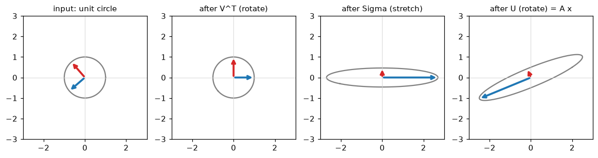
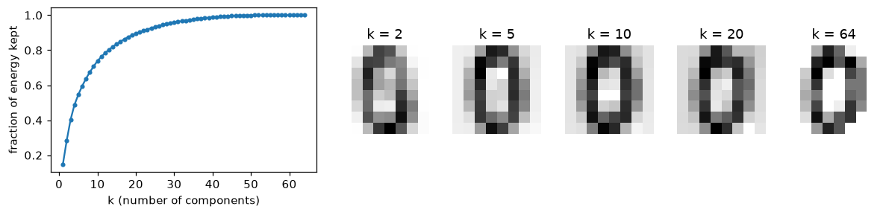

# Matrix Decompositions

> **Level 1 · Chapter 2** · ⏱️ ~55 min read · Prerequisites: [Linear algebra](01-linear-algebra.md)

A decomposition factors a matrix into simpler pieces that reveal what it really does. This chapter covers eigenvalues and eigenvectors, the eigendecomposition, the special and very common case of symmetric matrices, the singular value decomposition (SVD) and its geometry, low-rank approximation, the link to principal component analysis (PCA), and conditioning, which tells you when numerical answers can be trusted.

## Why it matters

Alex trained a logistic regression model on loan applications with two features: annual income in USD (values around 50,000) and the number of open credit lines (values around 5). Gradient descent crawled. After 50,000 iterations the loss was still falling, and one weight had barely moved from zero. A larger learning rate made the loss explode to infinity. Alex concluded that "gradient descent is finicky" and moved on to a library.

A colleague asked one question: "What are the eigenvalues of $\mathbf{X}^\top\mathbf{X}$?" The largest was about a billion times the smallest. Along one direction the loss surface was a steep canyon wall, and along the other it was an almost flat valley floor. Any learning rate small enough not to bounce off the walls was far too small to make progress along the floor. Standardizing both features shrank that ratio to nearly 1, and gradient descent converged in under 100 iterations.

That ratio of extreme eigenvalues (or singular values) is called the **condition number**. It decides whether optimization is fast or slow, and whether numerical answers are accurate or garbage. Eigenvalues and the SVD also power PCA, recommender systems, image compression, spectral clustering, PageRank, and the analysis of neural network training. They're the X-ray of linear algebra.

## Concepts

### Eigenvectors: directions a matrix only stretches

Apply a matrix to a typical vector and the vector rotates as well as stretches. But for most square matrices there are a few special directions where the matrix only stretches (or shrinks, or flips). A vector $\mathbf{v} \neq \mathbf{0}$ pointing along such a direction is an **eigenvector**, and the stretch factor $\lambda$ is its **eigenvalue**:

$$
\mathbf{A}\mathbf{v} = \lambda\mathbf{v}.
$$

("Eigen" is German for "own" or "characteristic": these are the matrix's own directions.) If $\lambda = 2$, the matrix doubles vectors in that direction. If $\lambda = 0.5$, it halves them. If $\lambda = -1$, it flips them. If $\lambda = 0$, it squashes them to zero, which means the matrix is singular.

Any multiple of an eigenvector is also an eigenvector with the same eigenvalue, so what matters is the direction. By convention, software returns eigenvectors scaled to length 1, but their sign is arbitrary.

**Finding them by hand.** Rewrite the definition as $(\mathbf{A} - \lambda\mathbf{I})\mathbf{v} = \mathbf{0}$. For a nonzero $\mathbf{v}$ to solve this, $\mathbf{A} - \lambda\mathbf{I}$ must squash some direction to zero, so it must be singular:

$$
\det(\mathbf{A} - \lambda\mathbf{I}) = 0.
$$

This is the **characteristic equation**. For a $d \times d$ matrix it's a polynomial of degree $d$ in $\lambda$, so there are $d$ eigenvalues, counted with repetition, possibly complex.

Take $\mathbf{A} = \begin{pmatrix} 2 & 1 \\ 1 & 2 \end{pmatrix}$:

$$
\det\begin{pmatrix} 2 - \lambda & 1 \\ 1 & 2 - \lambda \end{pmatrix} = (2 - \lambda)^2 - 1 = \lambda^2 - 4\lambda + 3 = (\lambda - 3)(\lambda - 1) = 0.
$$

So $\lambda_1 = 3$ and $\lambda_2 = 1$. For $\lambda_1 = 3$, solve $(\mathbf{A} - 3\mathbf{I})\mathbf{v} = \mathbf{0}$: the first row gives $-v_1 + v_2 = 0$, so $\mathbf{v}_1 \propto (1, 1)$. For $\lambda_2 = 1$: $v_1 + v_2 = 0$, so $\mathbf{v}_2 \propto (1, -1)$. This matrix stretches the diagonal direction $(1, 1)$ by 3 and leaves the anti-diagonal direction $(1, -1)$ alone.

Two facts fall out of the characteristic polynomial and are handy checks: the **trace** (sum of the diagonal) equals the sum of the eigenvalues, and the **determinant** equals their product. Here, $2 + 2 = 3 + 1$ and $2 \cdot 2 - 1 = 3 \cdot 1$. The determinant fact matches the geometry: stretching by 3 in one direction and 1 in another scales area by 3.

```python
import numpy as np

A = np.array([[2.0, 1.0], [1.0, 2.0]])
eigvals, eigvecs = np.linalg.eig(A)
eigvals, eigvecs = eigvals.real, eigvecs.real    # eig may return a complex dtype; these are real
print(eigvals)
print(eigvecs)                                   # eigenvectors are the COLUMNS
v = eigvecs[:, 0]
print(np.allclose(A @ v, eigvals[0] * v))        # A v = lambda v
print(np.isclose(eigvals.sum(), np.trace(A)), np.isclose(eigvals.prod(), np.linalg.det(A)))
```

```text
[3. 1.]
[[ 0.70710678 -0.70710678]
 [ 0.70710678  0.70710678]]
True
True True
```

`np.linalg.eig` handles general matrices, whose eigenvalues can be complex, so recent NumPy versions return a complex dtype even when every imaginary part is zero. Taking `.real` is safe here because the matrix is symmetric (more on that below). The columns are $(1, 1)/\sqrt{2}$ and $(-1, 1)/\sqrt{2}$: the directions we found by hand, normalized to unit length (the second one with its sign flipped, which is equally valid).

Not every real matrix has real eigenvalues. A 90° rotation leaves no direction unchanged, and its characteristic equation $\lambda^2 + 1 = 0$ has only complex roots, $\pm i$. And some matrices don't have enough eigenvectors: the shear $\begin{pmatrix} 1 & 1 \\ 0 & 1 \end{pmatrix}$ has eigenvalue 1 twice but only one eigenvector direction, $(1, 0)$. Fortunately, the matrices that matter most in ML are symmetric, and those are perfectly behaved, as you'll see shortly.

### The eigendecomposition

Suppose a $d \times d$ matrix has $d$ linearly independent eigenvectors. Put them as columns in a matrix $\mathbf{V}$, and the eigenvalues on the diagonal of a matrix $\mathbf{\Lambda}$ ("capital lambda"). The $d$ equations $\mathbf{A}\mathbf{v}_i = \lambda_i \mathbf{v}_i$, stacked side by side, read $\mathbf{A}\mathbf{V} = \mathbf{V}\mathbf{\Lambda}$. Multiply on the right by $\mathbf{V}^{-1}$:

$$
\mathbf{A} = \mathbf{V}\mathbf{\Lambda}\mathbf{V}^{-1}.
$$

This is the **eigendecomposition**, and a matrix that has one is **diagonalizable**. Read it right to left as a recipe for applying $\mathbf{A}$: $\mathbf{V}^{-1}$ rewrites a vector in eigenvector coordinates, $\mathbf{\Lambda}$ stretches each coordinate by its eigenvalue, and $\mathbf{V}$ converts back. In the right coordinate system, every diagonalizable matrix is just a diagonal matrix, an independent stretch along each axis.

The payoff is that hard operations become easy. Powers, for example:

$$
\mathbf{A}^k = \mathbf{V}\mathbf{\Lambda}\mathbf{V}^{-1}\,\mathbf{V}\mathbf{\Lambda}\mathbf{V}^{-1} \cdots \mathbf{V}\mathbf{\Lambda}\mathbf{V}^{-1} = \mathbf{V}\mathbf{\Lambda}^k\mathbf{V}^{-1},
$$

because every inner $\mathbf{V}^{-1}\mathbf{V}$ cancels, and $\mathbf{\Lambda}^k$ just raises each diagonal entry to the $k$th power.

This explains what happens when you apply a matrix over and over, as in a Markov chain, a recurrent neural network, or an iterative algorithm. Write the starting vector in eigenvector coordinates, $\mathbf{x}_0 = c_1\mathbf{v}_1 + \dots + c_d\mathbf{v}_d$. Then

$$
\mathbf{A}^k\mathbf{x}_0 = c_1\lambda_1^k\mathbf{v}_1 + \dots + c_d\lambda_d^k\mathbf{v}_d.
$$

The component with the largest $\lvert\lambda\rvert$ grows fastest and eventually dominates. If all $\lvert\lambda_i\rvert < 1$, everything decays to zero; if any $\lvert\lambda_i\rvert > 1$, things blow up. That's the core of the **vanishing and exploding gradient** problem in deep networks, which you'll meet in [Level 6](../06-neural-networks/index.md). It also gives a simple algorithm, **power iteration**: multiply a random vector by $\mathbf{A}$ repeatedly, normalizing each time, and it lines up with the dominant eigenvector. Google's original PageRank is power iteration on a matrix of web links.

```python
rng = np.random.default_rng(0)
A = np.array([[0.9, 0.2], [0.1, 0.8]])          # columns sum to 1: a Markov chain
vals, V = np.linalg.eig(A)
vals, V = vals.real, V.real                      # real eigenvalues here
Lam = np.diag(vals)
print(np.allclose(A, V @ Lam @ np.linalg.inv(V)))
print(np.allclose(np.linalg.matrix_power(A, 20), V @ np.diag(vals ** 20) @ np.linalg.inv(V)))

x = rng.random(2)                                # power iteration
for _ in range(100):
    x = A @ x
    x /= np.linalg.norm(x)
print("eigenvalues:", vals)
print("power iteration:", x, " eigenvector:", V[:, np.argmax(vals)])
```

```text
True
True
eigenvalues: [1.  0.7]
power iteration: [0.89442719 0.4472136 ]  eigenvector: [0.89442719 0.4472136 ]
```

The chain has eigenvalue 1 (its long-run steady state, proportional to $(2, 1)$, so the system spends two-thirds of its time in state 1) and 0.7 (a transient that shrinks by 30% each step and vanishes).

### Symmetric matrices: the well-behaved case

A matrix is **symmetric** if $\mathbf{A} = \mathbf{A}^\top$. Symmetric matrices are everywhere in ML: covariance matrices, $\mathbf{X}^\top\mathbf{X}$ in regression, kernel matrices, graph adjacency matrices of undirected graphs, and Hessians (matrices of second derivatives, in the [next chapter](03-calculus-and-gradients.md)). They have a beautiful guarantee.

**The spectral theorem.** A real symmetric matrix has real eigenvalues, and it has a full set of eigenvectors that are mutually orthogonal. So it can be written

$$
\mathbf{A} = \mathbf{Q}\mathbf{\Lambda}\mathbf{Q}^\top = \sum_{i=1}^{d} \lambda_i\,\mathbf{q}_i\mathbf{q}_i^\top,
$$

where $\mathbf{Q}$ is an orthogonal matrix (orthonormal columns, so $\mathbf{Q}^{-1} = \mathbf{Q}^\top$). Geometrically, a symmetric matrix is a pure stretch along $d$ perpendicular axes, with no shear or rotation mixed in. The sum on the right writes it as a weighted sum of rank-one projections $\mathbf{q}_i\mathbf{q}_i^\top$, one per axis.

The full proof takes a page, but the orthogonality part is short. Take eigenvectors $\mathbf{v}_1, \mathbf{v}_2$ with different eigenvalues $\lambda_1 \neq \lambda_2$. Compute $\mathbf{v}_1^\top\mathbf{A}\mathbf{v}_2$ two ways:

$$
\lambda_2\,\mathbf{v}_1^\top\mathbf{v}_2 = \mathbf{v}_1^\top(\mathbf{A}\mathbf{v}_2) = (\mathbf{A}^\top\mathbf{v}_1)^\top\mathbf{v}_2 = (\mathbf{A}\mathbf{v}_1)^\top\mathbf{v}_2 = \lambda_1\,\mathbf{v}_1^\top\mathbf{v}_2.
$$

The middle step used $\mathbf{A}^\top = \mathbf{A}$. So $(\lambda_2 - \lambda_1)\,\mathbf{v}_1^\top\mathbf{v}_2 = 0$, and since $\lambda_1 \neq \lambda_2$, the dot product must be zero.

**Positive definite matrices.** For a symmetric matrix, the expression $\mathbf{x}^\top\mathbf{A}\mathbf{x}$ is called a **quadratic form**: a function of $\mathbf{x}$ built from squares and cross terms, like $2x_1^2 + 2x_1x_2 + 2x_2^2$ for our example. The matrix is **positive semi-definite (PSD)** if $\mathbf{x}^\top\mathbf{A}\mathbf{x} \geq 0$ for every $\mathbf{x}$, and **positive definite (PD)** if it's strictly positive for every $\mathbf{x} \neq \mathbf{0}$. In eigenvector coordinates $\mathbf{z} = \mathbf{Q}^\top\mathbf{x}$, the quadratic form is $\sum_i \lambda_i z_i^2$, so:

- PSD $\iff$ all eigenvalues $\geq 0$.
- PD $\iff$ all eigenvalues $> 0$, which also means invertible.

A PD quadratic form is a bowl. Its level sets $\mathbf{x}^\top\mathbf{A}\mathbf{x} = 1$ are ellipses (ellipsoids in higher dimensions) whose axes point along the eigenvectors, with semi-axis lengths $1/\sqrt{\lambda_i}$. Large eigenvalue means a steep direction and a short axis.

The most important PSD matrix in ML is $\mathbf{X}^\top\mathbf{X}$. For any $\mathbf{w}$,

$$
\mathbf{w}^\top\mathbf{X}^\top\mathbf{X}\mathbf{w} = (\mathbf{X}\mathbf{w})^\top(\mathbf{X}\mathbf{w}) = \lVert \mathbf{X}\mathbf{w} \rVert^2 \geq 0.
$$

It's PD exactly when $\mathbf{X}\mathbf{w} = \mathbf{0}$ only for $\mathbf{w} = \mathbf{0}$, that is, when $\mathbf{X}$ has full column rank. Every covariance matrix is PSD for the same reason.

Use `np.linalg.eigh` (the "h" is for Hermitian, the complex generalization of symmetric) for symmetric matrices. It's faster, it guarantees real eigenvalues and orthonormal eigenvectors, and it returns eigenvalues in ascending order.

```python
rng = np.random.default_rng(1)
X = rng.normal(size=(100, 3))
S = X.T @ X                                  # symmetric PSD
lam, Q = np.linalg.eigh(S)
print(np.round(lam, 2))                      # real, non-negative, ascending
print(np.allclose(Q.T @ Q, np.eye(3)))       # orthonormal eigenvectors
print(np.allclose(S, Q @ np.diag(lam) @ Q.T))
print(np.allclose(S, sum(l * np.outer(q, q) for l, q in zip(lam, Q.T))))   # sum of rank-one pieces

w = rng.normal(size=3)
print(np.isclose(w @ S @ w, np.linalg.norm(X @ w) ** 2))
```

```text
[ 68.66  87.18 102.15]
True
True
True
True
```

### The SVD: every matrix is rotate, stretch, rotate

Eigendecomposition needs a square matrix, and works best for symmetric ones. Data matrices are rectangular: $n$ samples by $d$ features. The **singular value decomposition (SVD)** works for *every* matrix. For $\mathbf{A} \in \mathbb{R}^{m \times n}$,

$$
\mathbf{A} = \mathbf{U}\mathbf{\Sigma}\mathbf{V}^\top,
$$

where

- $\mathbf{U} \in \mathbb{R}^{m \times m}$ is orthogonal. Its columns $\mathbf{u}_i$ are the **left singular vectors**.
- $\mathbf{\Sigma} \in \mathbb{R}^{m \times n}$ is zero except on its diagonal, which holds the **singular values** $\sigma_1 \geq \sigma_2 \geq \dots \geq 0$.
- $\mathbf{V} \in \mathbb{R}^{n \times n}$ is orthogonal. Its columns $\mathbf{v}_i$ are the **right singular vectors**.

**The geometry.** Read $\mathbf{A}\mathbf{x} = \mathbf{U}\mathbf{\Sigma}\mathbf{V}^\top\mathbf{x}$ right to left. $\mathbf{V}^\top$ rotates (or reflects) the input, which lines the directions $\mathbf{v}_i$ up with the coordinate axes. $\mathbf{\Sigma}$ stretches each axis by $\sigma_i$ (and drops or pads dimensions if $m \neq n$). $\mathbf{U}$ rotates the result into the output space. So **every linear transformation is a rotation, an axis-aligned stretch, and another rotation.** The unit circle always maps to an ellipse whose semi-axes are $\sigma_i\mathbf{u}_i$. In equation form, the SVD says $\mathbf{A}\mathbf{v}_i = \sigma_i\mathbf{u}_i$: the orthonormal input directions $\mathbf{v}_i$ map to the orthogonal output directions $\mathbf{u}_i$, stretched by $\sigma_i$.

```python
import matplotlib.pyplot as plt

A = np.array([[2.0, 1.5], [0.5, 1.0]])
U, s, Vt = np.linalg.svd(A)
theta = np.linspace(0, 2 * np.pi, 200)
circle = np.stack([np.cos(theta), np.sin(theta)])

stages = [("input: unit circle", np.eye(2)), ("after V^T (rotate)", Vt),
          ("after Sigma (stretch)", np.diag(s) @ Vt), ("after U (rotate) = A x", A)]
fig, axes = plt.subplots(1, 4, figsize=(13, 3.6))
for ax, (title, M) in zip(axes, stages):
    pts = M @ circle
    ax.plot(pts[0], pts[1], color="gray")
    for i, color in enumerate(["tab:blue", "tab:red"]):
        tip = M @ Vt[i]                      # where the right singular vector v_i has moved
        ax.annotate("", xy=tip, xytext=(0, 0), arrowprops=dict(arrowstyle="->", color=color, lw=2.5))
    ax.set_xlim(-3, 3); ax.set_ylim(-3, 3); ax.set_aspect("equal")
    ax.axhline(0, color="lightgray", lw=0.6); ax.axvline(0, color="lightgray", lw=0.6)
    ax.set_title(title, fontsize=10)
plt.show()
print("singular values:", np.round(s, 4))
print(np.allclose(A @ Vt[0], s[0] * U[:, 0]))    # A v1 = sigma1 u1
```

```text
singular values: [2.6992 0.4631]
True
```



*The SVD in pictures. The blue and red arrows start as the right singular vectors v1 and v2, get rotated onto the axes, stretched by the singular values, and rotated to become σ1u1 and σ2u2, the semi-axes of the output ellipse.*

**Where the SVD comes from.** Here's how to construct it from things you already know. The matrix $\mathbf{A}^\top\mathbf{A}$ is $n \times n$, symmetric, and PSD, so by the spectral theorem it has orthonormal eigenvectors $\mathbf{v}_i$ with eigenvalues $\lambda_i \geq 0$. Define $\sigma_i = \sqrt{\lambda_i}$ and, for $\sigma_i > 0$, $\mathbf{u}_i = \mathbf{A}\mathbf{v}_i / \sigma_i$. These $\mathbf{u}_i$ are orthonormal:

$$
\mathbf{u}_i^\top\mathbf{u}_j = \frac{\mathbf{v}_i^\top\mathbf{A}^\top\mathbf{A}\mathbf{v}_j}{\sigma_i\sigma_j} = \frac{\lambda_j\,\mathbf{v}_i^\top\mathbf{v}_j}{\sigma_i\sigma_j},
$$

which is 1 when $i = j$ and 0 otherwise. By construction $\mathbf{A}\mathbf{v}_i = \sigma_i\mathbf{u}_i$, and stacking these gives $\mathbf{A}\mathbf{V} = \mathbf{U}\mathbf{\Sigma}$, so $\mathbf{A} = \mathbf{U}\mathbf{\Sigma}\mathbf{V}^\top$. (If some $\sigma_i = 0$, you complete $\mathbf{U}$ with any orthonormal vectors.)

This also tells you how SVD and eigendecomposition relate:

$$
\mathbf{A}^\top\mathbf{A} = \mathbf{V}\mathbf{\Sigma}^\top\mathbf{\Sigma}\mathbf{V}^\top, \qquad \mathbf{A}\mathbf{A}^\top = \mathbf{U}\mathbf{\Sigma}\mathbf{\Sigma}^\top\mathbf{U}^\top.
$$

The right singular vectors are the eigenvectors of $\mathbf{A}^\top\mathbf{A}$, the left singular vectors are the eigenvectors of $\mathbf{A}\mathbf{A}^\top$, and the squared singular values are the eigenvalues of both. For a symmetric PSD matrix, the SVD and the eigendecomposition are the same thing.

Other things the SVD tells you at a glance:

- The **rank** is the number of nonzero singular values. That's how `matrix_rank` works: it counts singular values above a small tolerance.
- The **spectral norm** $\lVert \mathbf{A} \rVert_2 = \sigma_1$ is the most $\mathbf{A}$ can stretch any unit vector.
- The **Frobenius norm** $\lVert \mathbf{A} \rVert_F = \sqrt{\sum_{ij} A_{ij}^2} = \sqrt{\sum_i \sigma_i^2}$, the matrix's total "energy".
- The first $r$ columns of $\mathbf{U}$ (where $r$ is the rank) are an orthonormal basis for the column space.

In practice you almost always use the **thin** (or economy) SVD, `np.linalg.svd(A, full_matrices=False)`, which keeps only $\min(m, n)$ singular vectors on each side. For a $10{,}000 \times 50$ data matrix, the full $\mathbf{U}$ would be $10{,}000 \times 10{,}000$ (800 MB); the thin one is $10{,}000 \times 50$.

```python
rng = np.random.default_rng(0)
A = rng.normal(size=(6, 4))
U, s, Vt = np.linalg.svd(A, full_matrices=False)
print(U.shape, s.shape, Vt.shape)
print(np.allclose(A, U @ np.diag(s) @ Vt))                       # exact reconstruction
print(np.allclose(np.sort(s ** 2), np.linalg.eigvalsh(A.T @ A)))  # sigma^2 = eig(A^T A)
print(np.isclose(np.linalg.norm(A, 2), s[0]), np.isclose(np.linalg.norm(A, "fro"), np.sqrt((s ** 2).sum())))
```

```text
(6, 4) (4,) (4, 4)
True
True
True True
```

### Low-rank approximation

Expanding the product gives the SVD as a sum of rank-one matrices, ordered by importance:

$$
\mathbf{A} = \sum_{i=1}^{r} \sigma_i\,\mathbf{u}_i\mathbf{v}_i^\top.
$$

Each term $\sigma_i\mathbf{u}_i\mathbf{v}_i^\top$ is a "layer" of the matrix: a single pattern ($\mathbf{v}_i$ across columns, $\mathbf{u}_i$ down rows) with strength $\sigma_i$. Keep only the first $k$ layers and you get

$$
\mathbf{A}_k = \sum_{i=1}^{k} \sigma_i\,\mathbf{u}_i\mathbf{v}_i^\top = \mathbf{U}_k\mathbf{\Sigma}_k\mathbf{V}_k^\top.
$$

The **Eckart–Young theorem** says $\mathbf{A}_k$ is the *best* rank-$k$ approximation to $\mathbf{A}$: no other matrix of rank at most $k$ is closer, in either the Frobenius or the spectral norm. The errors are exactly the discarded singular values:

$$
\lVert \mathbf{A} - \mathbf{A}_k \rVert_F = \sqrt{\sum_{i > k}\sigma_i^2}, \qquad \lVert \mathbf{A} - \mathbf{A}_k \rVert_2 = \sigma_{k+1}.
$$

The error formulas follow directly from the sum: $\mathbf{A} - \mathbf{A}_k$ is the sum of the leftover layers, which is itself an SVD with singular values $\sigma_{k+1}, \sigma_{k+2}, \dots$. The proof that nothing beats truncation is a page of careful argument (see Further reading); the key idea is that any rank-$k$ matrix must ignore some direction within the span of $\mathbf{v}_1, \dots, \mathbf{v}_{k+1}$, and $\mathbf{A}$ stretches every such direction by at least $\sigma_{k+1}$.

Low-rank approximation matters because real data matrices often have rapidly decaying singular values. A few patterns explain most of the structure, and the rest is detail or noise. Storing $\mathbf{U}_k$, $\mathbf{\Sigma}_k$, and $\mathbf{V}_k$ takes $k(m + n + 1)$ numbers instead of $mn$. Recommender systems model a huge, mostly missing user-by-item rating matrix as low rank ("users have a few taste factors, items have a few attributes"). LoRA, a popular way to fine-tune large language models, learns weight updates constrained to low rank.

Let's see it on real data: the scikit-learn digits dataset, 1,797 handwritten digits, each an 8×8 image flattened to 64 pixel values.

```python
from sklearn.datasets import load_digits

X = load_digits().data                          # (1797, 64)
mu = X.mean(axis=0)
Xc = X - mu                                     # center each pixel column
U, s, Vt = np.linalg.svd(Xc, full_matrices=False)

energy = np.cumsum(s ** 2) / np.sum(s ** 2)
for k in [2, 5, 10, 20, 40]:
    Xk = U[:, :k] @ np.diag(s[:k]) @ Vt[:k]
    err = np.linalg.norm(Xc - Xk, "fro")
    print(f"k={k:2d}  energy kept {energy[k-1]:.3f}  error {err:8.2f}  formula {np.sqrt((s[k:] ** 2).sum()):8.2f}")

fig, axes = plt.subplots(1, 6, figsize=(13, 2.6), gridspec_kw={"width_ratios": [3, 1, 1, 1, 1, 1]})
axes[0].plot(np.arange(1, 65), energy, marker=".")
axes[0].set_xlabel("k (number of components)")
axes[0].set_ylabel("fraction of energy kept")
for ax, k in zip(axes[1:], [2, 5, 10, 20, 64]):
    img = mu + U[0, :k] * s[:k] @ Vt[:k]        # rank-k reconstruction of the first digit
    ax.imshow(img.reshape(8, 8), cmap="gray_r")
    ax.set_title(f"k = {k}"); ax.axis("off")
plt.show()
```

```text
k= 2  energy kept 0.285  error  1242.39  formula  1242.39
k= 5  energy kept 0.545  error   991.19  formula   991.19
k=10  energy kept 0.738  error   751.79  formula   751.79
k=20  energy kept 0.894  error   477.71  formula   477.71
k=40  energy kept 0.988  error   159.60  formula   159.60
```



*Left: the fraction of squared Frobenius norm captured by the top k singular values. Right: the first digit (a zero) rebuilt from k components. By k = 10 it's clearly recognizable.*

The measured error matches the Eckart–Young formula to every printed digit, and 20 of 64 components keep almost 90% of the energy.

### The link to PCA

**Principal component analysis (PCA)** finds the directions along which data varies most. You'll use it for visualization, compression, and denoising in [Level 4](../04-ml-algorithms/index.md). Underneath, it's exactly the SVD of the centered data matrix.

Here's the derivation. Let $\mathbf{X}_c$ be the $n \times d$ data matrix with each column's mean subtracted. The **sample covariance matrix** is

$$
\mathbf{C} = \frac{1}{n - 1}\mathbf{X}_c^\top\mathbf{X}_c,
$$

a $d \times d$ symmetric PSD matrix whose diagonal entries are the feature variances and whose off-diagonal entries are covariances ([Probability](04-probability.md) defines these properly). Project every sample onto a unit direction $\mathbf{w}$: the projections are $\mathbf{X}_c\mathbf{w}$, and their variance is

$$
\frac{1}{n-1}\lVert \mathbf{X}_c\mathbf{w} \rVert^2 = \mathbf{w}^\top\mathbf{C}\mathbf{w}.
$$

PCA asks for the unit vector $\mathbf{w}$ that maximizes this. Write $\mathbf{w}$ in the eigenvector coordinates of $\mathbf{C}$: $\mathbf{w}^\top\mathbf{C}\mathbf{w} = \sum_i \lambda_i z_i^2$ with $\sum_i z_i^2 = 1$. That's a weighted average of the eigenvalues, which is largest when all the weight goes on the biggest one. So the first **principal component** is the top eigenvector of $\mathbf{C}$, and the variance along it is the top eigenvalue $\lambda_1$. The second component is the best direction orthogonal to the first, which is the second eigenvector, and so on.

Now connect to the SVD. With $\mathbf{X}_c = \mathbf{U}\mathbf{\Sigma}\mathbf{V}^\top$,

$$
\mathbf{C} = \frac{1}{n-1}\mathbf{V}\mathbf{\Sigma}^2\mathbf{V}^\top.
$$

So the principal directions are the right singular vectors $\mathbf{v}_i$, the variance along each is $\sigma_i^2/(n - 1)$, and the coordinates of the samples in the new basis (the **scores**) are $\mathbf{X}_c\mathbf{V} = \mathbf{U}\mathbf{\Sigma}$. Libraries compute PCA with the SVD rather than by forming $\mathbf{C}$, for the numerical reasons in the next section. The **explained variance ratio** of component $i$ is $\sigma_i^2 / \sum_j \sigma_j^2$, exactly the "energy" plotted above.

```python
from sklearn.decomposition import PCA

n = Xc.shape[0]
C = Xc.T @ Xc / (n - 1)
lam, Q = np.linalg.eigh(C)
lam, Q = lam[::-1], Q[:, ::-1]                   # sort descending

pca = PCA(n_components=5).fit(X)                 # sklearn centers for you
print(np.allclose(lam[:5], s[:5] ** 2 / (n - 1)))
print(np.allclose(pca.explained_variance_, lam[:5]))
print(np.allclose(np.abs(pca.components_), np.abs(Vt[:5])))          # same directions, up to sign
print(np.allclose(np.abs(pca.transform(X)), np.abs((U * s)[:, :5])))   # same scores, up to sign
print(np.round(pca.explained_variance_ratio_, 3))
```

```text
True
True
True
True
[0.149 0.136 0.118 0.084 0.058]
```

Eigenvectors of the covariance, right singular vectors of the centered data, and scikit-learn's `components_`: three routes to the same directions.

### Conditioning and numerical stability

Computers store numbers with about 16 significant digits (`float64`). Every arithmetic step rounds. Usually that's harmless, but some problems amplify tiny errors into huge ones. The **condition number** measures that amplification. For an invertible matrix,

$$
\kappa(\mathbf{A}) = \frac{\sigma_{\max}}{\sigma_{\min}} = \lVert \mathbf{A} \rVert_2\,\lVert \mathbf{A}^{-1} \rVert_2.
$$

**Why the ratio of singular values?** Solve $\mathbf{A}\mathbf{x} = \mathbf{b}$, and suppose $\mathbf{b}$ has a small error $\delta\mathbf{b}$ (from measurement or rounding). The solution's error is $\delta\mathbf{x} = \mathbf{A}^{-1}\delta\mathbf{b}$. In the worst case, $\mathbf{b}$ points along the direction $\mathbf{A}$ stretches most (so $\mathbf{x}$ is small relative to $\mathbf{b}$), while $\delta\mathbf{b}$ points along the direction $\mathbf{A}$ stretches least (so $\mathbf{A}^{-1}$ blows it up by $1/\sigma_{\min}$). Working through the norms gives the bound

$$
\frac{\lVert \delta\mathbf{x} \rVert}{\lVert \mathbf{x} \rVert} \leq \kappa(\mathbf{A})\,\frac{\lVert \delta\mathbf{b} \rVert}{\lVert \mathbf{b} \rVert}.
$$

A relative error of $10^{-16}$ in the input can become a relative error of $\kappa \times 10^{-16}$ in the answer. A rule of thumb: **you lose about $\log_{10}\kappa$ digits of accuracy.** With $\kappa = 10^{10}$, only about 6 of your 16 digits are trustworthy. With $\kappa \geq 10^{16}$, the answer can be pure noise, and the matrix is effectively singular. A matrix with large $\kappa$ is called **ill-conditioned**.

Three consequences for ML:

1. **Don't form $\mathbf{X}^\top\mathbf{X}$ if you can avoid it.** Its singular values are the squares of $\mathbf{X}$'s, so $\kappa(\mathbf{X}^\top\mathbf{X}) = \kappa(\mathbf{X})^2$. If $\kappa(\mathbf{X}) = 10^6$ (well within float64's comfort zone), the normal equations face $10^{12}$. That's why `lstsq`, which uses the SVD of $\mathbf{X}$ directly, is more accurate than solving the normal equations.
2. **Nearly collinear features** make $\sigma_{\min}$ tiny and $\kappa$ huge, so coefficients become unstable even without exact dependence. Regularization (ridge regression) adds $\alpha\mathbf{I}$ to $\mathbf{X}^\top\mathbf{X}$, which adds $\alpha$ to every eigenvalue and caps the condition number.
3. **Gradient descent slows down in proportion to the condition number** of the loss surface's curvature. That was Alex's problem. Features on wildly different scales give $\mathbf{X}^\top\mathbf{X}$ a huge condition number; standardizing fixes most of it. [Information theory and optimization](06-information-theory-and-optimization.md) derives this.

```python
from scipy.linalg import hilbert

for d in [4, 8, 12]:
    H = hilbert(d)                               # a famously ill-conditioned matrix
    x_true = np.ones(d)
    b = H @ x_true
    x = np.linalg.solve(H, b)
    rel_err = np.linalg.norm(x - x_true) / np.linalg.norm(x_true)
    print(f"d={d:2d}  cond={np.linalg.cond(H):9.2e}  relative error={rel_err:.1e}")
```

```text
d= 4  cond= 1.55e+04  relative error=4.1e-14
d= 8  cond= 1.53e+10  relative error=6.1e-08
d=12  cond= 1.81e+16  relative error=3.2e-01
```

The **Hilbert matrix**, with entries $1/(i + j - 1)$, gets ill-conditioned fast. With $d = 12$, solving a system whose exact answer is all ones returns something about 30% off, with no error or warning. The relative errors grow with $\kappa$ and stay within the worst-case bound of roughly $\kappa \times 10^{-16}$, as the rule of thumb predicts.

## In practice

### Choosing the right routine

| Task | Use | Why |
|---|---|---|
| Eigen of a symmetric matrix (covariance, $\mathbf{X}^\top\mathbf{X}$, Hessian) | `np.linalg.eigh` | real results, orthonormal vectors, ascending order, faster |
| Eigenvalues only, symmetric | `np.linalg.eigvalsh` | skips the vectors |
| Eigen of a general square matrix | `np.linalg.eig` | may return complex numbers; no ordering |
| SVD of a data matrix | `np.linalg.svd(X, full_matrices=False)` | thin SVD; descending singular values; `Vt` is already transposed |
| Top few components of a huge or sparse matrix | `scipy.sparse.linalg.svds`, `sklearn.utils.extmath.randomized_svd` | avoid computing everything |
| PCA | `sklearn.decomposition.PCA` | centers data, handles signs and solver choice |
| Condition number | `np.linalg.cond(A)` | $\sigma_{\max}/\sigma_{\min}$ |

!!! warning "Common mistake: rows versus columns"
    `np.linalg.eig` and `eigh` return eigenvectors as the **columns** of the second output: `vecs[:, i]` goes with `vals[i]`. `np.linalg.svd` returns `Vt`, whose **rows** are the right singular vectors: `Vt[i]` goes with `s[i]`. Grabbing `vecs[i]` instead of `vecs[:, i]` gives a vector that isn't an eigenvector at all, and nothing warns you.

!!! warning "Common mistake: comparing eigenvectors across runs"
    Eigenvectors and singular vectors are defined only up to sign (and, with repeated eigenvalues, up to rotation within the repeated subspace). Two libraries, or two versions of the same library, can return $\mathbf{v}$ and $-\mathbf{v}$. If you compare PCA components or interpret their signs ("component 1 is high income"), fix a sign convention first, such as making the largest-magnitude entry positive.

### Why standardizing fixes conditioning

Here's Alex's story in numbers:

```python
rng = np.random.default_rng(0)
n = 1000
income = rng.normal(50_000, 15_000, n)
credit_lines = rng.poisson(5, n).astype(float)
X = np.column_stack([income, credit_lines])

Z = (X - X.mean(axis=0)) / X.std(axis=0)        # standardize each column
print(f"cond(X^T X), raw:          {np.linalg.cond(X.T @ X):.2e}")
print(f"cond(X^T X), standardized: {np.linalg.cond(Z.T @ Z):.2f}")
print(f"cond(X) squared, raw:      {np.linalg.cond(X) ** 2:.2e}")
```

```text
cond(X^T X), raw:          3.95e+08
cond(X^T X), standardized: 1.01
cond(X) squared, raw:      3.95e+08
```

Standardizing cuts the condition number from hundreds of millions to about 1, and the last line confirms $\kappa(\mathbf{X}^\top\mathbf{X}) = \kappa(\mathbf{X})^2$.

### PCA from scratch, then with scikit-learn

=== "From scratch"

    ```python
    def pca_fit_transform(X, k):
        mu = X.mean(axis=0)
        U, s, Vt = np.linalg.svd(X - mu, full_matrices=False)
        components = Vt[:k]                                  # principal directions (rows)
        explained_var = s[:k] ** 2 / (len(X) - 1)
        scores = (X - mu) @ components.T                     # same as U[:, :k] * s[:k]
        return scores, components, explained_var

    scores, comps, ev = pca_fit_transform(load_digits().data, 2)
    print(scores.shape, np.round(ev, 2))
    ```

    ```text
    (1797, 2) [179.01 163.72]
    ```

=== "scikit-learn"

    ```python
    pca = PCA(n_components=2, svd_solver="full")
    scores_sk = pca.fit_transform(load_digits().data)
    print(scores_sk.shape, np.round(pca.explained_variance_, 2))
    ```

    ```text
    (1797, 2) [179.01 163.72]
    ```

### Truncated SVD as a denoiser

If a matrix is "low rank plus noise", truncating the SVD keeps the signal and throws away most of the noise, because random noise spreads its energy evenly over all singular directions while the signal concentrates in a few.

```python
rng = np.random.default_rng(0)
m, n_cols, r = 200, 100, 3
L = rng.normal(size=(m, r)) @ rng.normal(size=(r, n_cols))     # true rank-3 signal
noisy = L + rng.normal(scale=1.0, size=(m, n_cols))

U, s, Vt = np.linalg.svd(noisy, full_matrices=False)
print("top singular values:", np.round(s[:6], 1))
denoised = U[:, :r] @ np.diag(s[:r]) @ Vt[:r]
rel = lambda E: np.linalg.norm(E) / np.linalg.norm(L)
print(f"error before: {rel(noisy - L):.3f}   after rank-3 truncation: {rel(denoised - L):.3f}")
```

```text
top singular values: [148.2 141.6 100.3  23.5  22.5  22.2]
error before: 0.620   after rank-3 truncation: 0.127
```

There's a clear gap after the third singular value: three big ones (signal), then a flat floor (noise). Looking for that "elbow" is how you choose $k$ in practice.

## Exercises

### Exercise 1: Eigenvalues by hand (easy)

Find the eigenvalues and eigenvectors of $\mathbf{A} = \begin{pmatrix} 4 & 1 \\ 2 & 3 \end{pmatrix}$ by hand. Check that the trace equals their sum and the determinant equals their product. Are the eigenvectors orthogonal? Why or why not? Verify in NumPy.

??? success "Solution"

    $\det(\mathbf{A} - \lambda\mathbf{I}) = (4 - \lambda)(3 - \lambda) - 2 = \lambda^2 - 7\lambda + 10 = (\lambda - 5)(\lambda - 2)$, so $\lambda = 5$ and $\lambda = 2$. Trace $4 + 3 = 7 = 5 + 2$; determinant $12 - 2 = 10 = 5 \cdot 2$.

    For $\lambda = 5$: $-v_1 + v_2 = 0$, so $\mathbf{v} \propto (1, 1)$. For $\lambda = 2$: $2v_1 + v_2 = 0$, so $\mathbf{v} \propto (1, -2)$. Their dot product is $1 - 2 = -1 \neq 0$: not orthogonal. That's allowed because $\mathbf{A}$ isn't symmetric; the spectral theorem doesn't apply.

    ```python
    import numpy as np

    A = np.array([[4.0, 1.0], [2.0, 3.0]])
    vals, vecs = np.linalg.eig(A)
    vals, vecs = vals.real, vecs.real
    print(vals)
    print(vecs / vecs[0])          # scale each column so its first entry is 1
    ```

    ```text
    [5. 2.]
    [[ 1.  1.]
     [ 1. -2.]]
    ```

### Exercise 2: Eigenvalues of powers and inverses (easy)

Show that if $\mathbf{A}\mathbf{v} = \lambda\mathbf{v}$, then $\mathbf{A}^2\mathbf{v} = \lambda^2\mathbf{v}$, and, if $\mathbf{A}$ is invertible, $\mathbf{A}^{-1}\mathbf{v} = \frac{1}{\lambda}\mathbf{v}$. What's the condition number of $\mathbf{A}^{-1}$ compared with $\mathbf{A}$, for symmetric PD $\mathbf{A}$? Verify with a random symmetric PD matrix.

??? success "Solution"

    $\mathbf{A}^2\mathbf{v} = \mathbf{A}(\lambda\mathbf{v}) = \lambda\mathbf{A}\mathbf{v} = \lambda^2\mathbf{v}$. For the inverse, multiply $\mathbf{A}\mathbf{v} = \lambda\mathbf{v}$ by $\mathbf{A}^{-1}$: $\mathbf{v} = \lambda\mathbf{A}^{-1}\mathbf{v}$, so $\mathbf{A}^{-1}\mathbf{v} = \mathbf{v}/\lambda$ ($\lambda \neq 0$ because $\mathbf{A}$ is invertible). Same eigenvectors, eigenvalues inverted, so the largest and smallest swap roles and $\kappa(\mathbf{A}^{-1}) = \kappa(\mathbf{A})$.

    ```python
    rng = np.random.default_rng(0)
    B = rng.normal(size=(4, 4))
    A = B.T @ B + 0.1 * np.eye(4)               # symmetric positive definite
    lam = np.linalg.eigvalsh(A)
    print(np.allclose(np.linalg.eigvalsh(A @ A), lam ** 2))
    print(np.allclose(np.linalg.eigvalsh(np.linalg.inv(A)), np.sort(1 / lam)))
    print(np.isclose(np.linalg.cond(A), np.linalg.cond(np.linalg.inv(A))))
    ```

    ```text
    True
    True
    True
    ```

### Exercise 3: SVD from the eigendecomposition, and why not to (medium)

Implement `svd_via_eigh(A)` that computes the thin SVD of a tall matrix from `np.linalg.eigh(A.T @ A)`, following the construction in the chapter. Check it on a random $50 \times 5$ matrix. Then make the matrix ill-conditioned by replacing its last column with the first column plus $10^{-9}$ times the old last column (two nearly collinear features), and compare the smallest singular value from your function with `np.linalg.svd`. Explain the difference.

??? success "Solution"

    ```python
    def svd_via_eigh(A):
        lam, V = np.linalg.eigh(A.T @ A)
        order = np.argsort(lam)[::-1]
        lam, V = lam[order], V[:, order]
        s = np.sqrt(np.clip(lam, 0, None))
        U = A @ V / s
        return U, s, V.T

    rng = np.random.default_rng(0)
    A = rng.normal(size=(50, 5))
    U, s, Vt = svd_via_eigh(A)
    print(np.allclose(U @ np.diag(s) @ Vt, A), np.allclose(s, np.linalg.svd(A, compute_uv=False)))

    A_ill = A.copy()
    A_ill[:, -1] = A[:, 0] + 1e-9 * A[:, -1]     # nearly collinear with column 0
    print("via eigh:", svd_via_eigh(A_ill)[1][-1])
    print("np.svd:  ", np.linalg.svd(A_ill, compute_uv=False)[-1])
    ```

    ```text
    True True
    via eigh: 5.057322145951123e-08
    np.svd:   5.796078064741096e-09
    ```

    On the well-conditioned matrix, the two agree. On the ill-conditioned one, the true smallest singular value is about $6 \times 10^{-9}$, so its square is about $3 \times 10^{-17}$. Forming $\mathbf{A}^\top\mathbf{A}$ puts that next to eigenvalues around $100$, a ratio of about $10^{-19}$, beyond float64's 16 digits, so it gets swamped by rounding. The eigh route returns a value nearly ten times too large, and on another matrix it could come out as zero or negative. `np.linalg.svd` works on $\mathbf{A}$ directly and keeps it. This is the $\kappa^2$ effect in action.

### Exercise 4: How much does compression save? (medium)

A $1{,}000 \times 500$ matrix is approximated by its rank-20 truncated SVD. How many numbers must you store, and what fraction of the original is that? If the singular values are $\sigma_i = 100 / i$, what fraction of the squared Frobenius norm does the rank-20 approximation keep? Compute the second part numerically.

??? success "Solution"

    Storage is $k(m + n + 1) = 20 \times 1{,}501 = 30{,}020$ numbers, versus $500{,}000$: about 6%.

    ```python
    i = np.arange(1, 501)
    s = 100 / i
    print(round((s[:20] ** 2).sum() / (s ** 2).sum(), 4))
    ```

    ```text
    0.9715
    ```

    About 97% of the energy in 6% of the storage. Because $\sum 1/i^2$ converges, the tail beyond $i = 20$ contributes little. Real data rarely decays this cleanly, which is why you always plot the singular values before choosing $k$.

### Exercise 5: PCA on the wine data, with and without scaling (hard)

Load `sklearn.datasets.load_wine` (178 wines, 13 chemical features on very different scales). Run PCA from scratch (via SVD) on (a) the raw centered features and (b) the standardized features. For each, report the explained variance ratio of the first two components and which original feature has the largest absolute weight in component 1. Explain the difference. Check (b) against scikit-learn's `PCA` on `StandardScaler` output.

??? success "Solution"

    ```python
    from sklearn.datasets import load_wine
    from sklearn.decomposition import PCA
    from sklearn.preprocessing import StandardScaler

    data = load_wine()
    X, names = data.data, data.feature_names

    def pca_svd(X):
        Xc = X - X.mean(axis=0)
        _, s, Vt = np.linalg.svd(Xc, full_matrices=False)
        return s ** 2 / (s ** 2).sum(), Vt

    for label, M in [("raw", X), ("standardized", (X - X.mean(0)) / X.std(0))]:
        ratio, Vt = pca_svd(M)
        print(f"{label:13s} ratio[:2]={np.round(ratio[:2], 3)}  top feature in PC1: {names[np.argmax(np.abs(Vt[0]))]}")

    sk = PCA(n_components=2).fit(StandardScaler().fit_transform(X))
    print("sklearn standardized:", np.round(sk.explained_variance_ratio_, 3))
    ```

    ```text
    raw           ratio[:2]=[0.998 0.002]  top feature in PC1: proline
    standardized  ratio[:2]=[0.362 0.192]  top feature in PC1: flavanoids
    sklearn standardized: [0.362 0.192]
    ```

    On raw data, `proline` has values in the hundreds to over a thousand while most features are below 10, so its variance dwarfs everything and PC1 is essentially "the proline axis", explaining 99.8% of the variance. That says nothing about chemistry; it's an artifact of units. After standardizing, every feature has variance 1, and PCA finds genuine shared structure spread across many features. Standardize before PCA unless your features share a meaningful common unit.

## Check yourself

1. What does the equation $\mathbf{A}\mathbf{v} = \lambda\mathbf{v}$ say geometrically?

    ??? note "Answer"

        Applying $\mathbf{A}$ to $\mathbf{v}$ doesn't change its direction (up to a flip if $\lambda < 0$); it only scales it by $\lambda$. Eigenvectors are the directions the matrix purely stretches.

2. What does the spectral theorem guarantee, and why does it matter for ML?

    ??? note "Answer"

        A real symmetric matrix has real eigenvalues and orthonormal eigenvectors, so $\mathbf{A} = \mathbf{Q}\mathbf{\Lambda}\mathbf{Q}^\top$: a pure stretch along perpendicular axes. Covariance matrices, $\mathbf{X}^\top\mathbf{X}$, kernel matrices, and Hessians are all symmetric, so they always decompose this cleanly.

3. Why is $\mathbf{X}^\top\mathbf{X}$ always positive semi-definite, and when is it positive definite?

    ??? note "Answer"

        $\mathbf{w}^\top\mathbf{X}^\top\mathbf{X}\mathbf{w} = \lVert \mathbf{X}\mathbf{w} \rVert^2 \geq 0$. It's positive definite when $\mathbf{X}\mathbf{w} = \mathbf{0}$ only for $\mathbf{w} = \mathbf{0}$, which is when $\mathbf{X}$ has full column rank.

4. Describe the geometry of the SVD in one sentence.

    ??? note "Answer"

        Every matrix rotates (or reflects) the input with $\mathbf{V}^\top$, stretches each axis by a singular value, and rotates into the output space with $\mathbf{U}$, so it maps the unit sphere to an ellipsoid with semi-axes $\sigma_i\mathbf{u}_i$.

5. How are the singular values of $\mathbf{A}$ related to eigenvalues?

    ??? note "Answer"

        The squared singular values are the eigenvalues of $\mathbf{A}^\top\mathbf{A}$ (and of $\mathbf{A}\mathbf{A}^\top$, apart from extra zeros). The right singular vectors are eigenvectors of $\mathbf{A}^\top\mathbf{A}$; the left ones are eigenvectors of $\mathbf{A}\mathbf{A}^\top$.

6. What does the Eckart–Young theorem say?

    ??? note "Answer"

        Truncating the SVD to the top $k$ terms gives the best rank-$k$ approximation in Frobenius and spectral norm, with errors $\sqrt{\sum_{i>k}\sigma_i^2}$ and $\sigma_{k+1}$ respectively.

7. How is PCA computed from the SVD, and what must you do to the data first?

    ??? note "Answer"

        Center each column (and usually standardize), take the thin SVD $\mathbf{X}_c = \mathbf{U}\mathbf{\Sigma}\mathbf{V}^\top$. The principal directions are the rows of $\mathbf{V}^\top$, the variances are $\sigma_i^2/(n-1)$, and the scores are $\mathbf{U}\mathbf{\Sigma}$.

8. What is the condition number, and why should you avoid forming $\mathbf{X}^\top\mathbf{X}$?

    ??? note "Answer"

        $\kappa = \sigma_{\max}/\sigma_{\min}$, the worst-case factor by which relative errors in the input grow in the solution; you lose about $\log_{10}\kappa$ digits. $\kappa(\mathbf{X}^\top\mathbf{X}) = \kappa(\mathbf{X})^2$, so forming it doubles the number of digits lost.

## Key takeaways

- Eigenvectors are the directions a matrix only stretches; eigenvalues are the stretch factors. In the eigenvector basis, a diagonalizable matrix is just a diagonal matrix, which makes powers and long-run behavior easy to analyze.
- Symmetric matrices have real eigenvalues and orthogonal eigenvectors. PSD means all eigenvalues are non-negative, and $\mathbf{X}^\top\mathbf{X}$ and covariance matrices are always PSD.
- The SVD exists for every matrix: rotate, stretch, rotate. It gives the rank, the norms, and orthonormal bases for free.
- Truncated SVD is the best low-rank approximation, with error equal to the discarded singular values. That's the engine behind compression, denoising, and recommender models.
- PCA is the SVD of the centered data matrix. Standardize first unless features share units.
- The condition number tells you how many digits you can trust. Prefer SVD- or QR-based solvers, standardize features, and regularize when features are nearly collinear.

## Further reading

- *Introduction to Linear Algebra* by Gilbert Strang, the chapters on eigenvalues and the SVD.
- *Numerical Linear Algebra* by Lloyd N. Trefethen and David Bau III (SIAM, 1997). Lectures 4–5 cover the SVD and its geometry; lectures 12–15 cover conditioning and stability.
- *Mathematics for Machine Learning* by Deisenroth, Faisal, and Ong, chapter 4 (matrix decompositions) and chapter 10 (PCA).
- "A Tutorial on Principal Component Analysis" by Jonathon Shlens (2014, arXiv:1404.1100).

## Next

Learn how functions change, which is how models learn: [Calculus and gradients](03-calculus-and-gradients.md).
