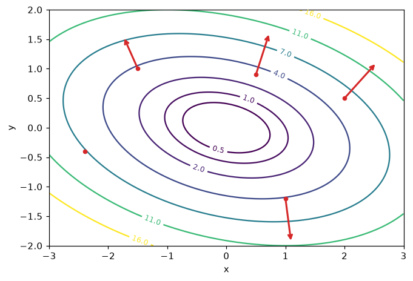
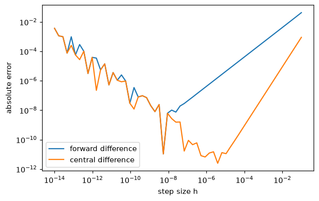

# Calculus and Gradients

> **Level 1 · Chapter 3** · ⏱️ ~55 min read · Prerequisites: [Linear algebra](01-linear-algebra.md)

Training a model means nudging its parameters to reduce its error, and calculus is the math of nudges. This chapter covers derivatives as rates of change, the differentiation rules (above all the chain rule), partial derivatives, gradients and why they point uphill, Jacobians and Hessians, Taylor approximation, finding minima, convexity, and how to check any gradient numerically.

## Why it matters

Wei wrote a custom loss function for a pricing model: squared error, but with late deliveries weighted more heavily. Wei derived its gradient by hand, coded it, and started training. The loss went down. The model shipped.

Three months later a colleague reimplemented the model in PyTorch, which computes gradients automatically, and got noticeably better accuracy from the same data. The difference came down to one line. Wei's hand-derived gradient was missing a factor of 2 on the weighted term, so the optimizer was following a direction that pointed downhill, but not *steepest* downhill, and it settled at a worse solution. The loss going down hid the bug completely.

A two-minute **gradient check**, comparing the formula against a numerical estimate at a few random points, would have caught it on day one. You'll learn to write one in this chapter. More importantly, you'll understand what a gradient *is*, why following it reduces a loss, and when that's guaranteed to find the best answer. Every training algorithm in this handbook, from linear regression to transformers, is built on these ideas.

## Concepts

### Derivatives: rates of change

Suppose $f(x)$ is a function of one number. Its **derivative** at $x$, written $f'(x)$ or $\frac{df}{dx}$, is the rate at which $f$ changes as $x$ changes: how much the output moves per unit of input movement, right at that point.

Picture the graph of $f$. Pick two points, $x$ and $x + h$, and draw the straight line through them, a **secant line**. Its slope is "rise over run":

$$
\frac{f(x + h) - f(x)}{h}.
$$

Now slide $x + h$ toward $x$ by shrinking $h$. The secant line pivots and settles into the **tangent line**: the line that just touches the curve at $x$. The derivative is the slope of that tangent line:

$$
f'(x) = \lim_{h \to 0} \frac{f(x + h) - f(x)}{h}.
$$

The $\lim_{h \to 0}$ reads "the limit as $h$ goes to zero": the value the expression approaches as $h$ gets arbitrarily small (without ever being exactly zero, where the fraction would be $0/0$).

Let's derive one from scratch. For $f(x) = x^2$:

$$
\frac{(x + h)^2 - x^2}{h} = \frac{x^2 + 2xh + h^2 - x^2}{h} = \frac{2xh + h^2}{h} = 2x + h \;\xrightarrow{h \to 0}\; 2x.
$$

So $f'(x) = 2x$. At $x = 3$ the curve rises 6 units per unit of $x$; at $x = 0$ it's flat; at $x = -1$ it falls 2 units per unit. Near any point, a smooth function looks like a straight line, and the derivative is that line's slope. This idea, **local linearity**, is the foundation of everything in this chapter.

Why does ML care? A **loss function** $\mathcal{L}(w)$ measures how wrong a model with parameter $w$ is. The derivative $\mathcal{L}'(w)$ tells you which way to move $w$ to reduce the loss, and how sensitive the loss is to that move. If $\mathcal{L}'(w) > 0$, increasing $w$ increases the loss, so decrease $w$. If $\mathcal{L}'(w) < 0$, increase it. That's gradient descent in one dimension: $w \leftarrow w - \eta\,\mathcal{L}'(w)$, where $\eta$ ("eta") is a small step size called the **learning rate**.

```python
import numpy as np
import matplotlib.pyplot as plt

f = lambda x: x ** 2
x0 = 1.0
for h in [1.0, 0.1, 0.01, 0.001]:
    print(f"h={h:<6} secant slope = {(f(x0 + h) - f(x0)) / h:.4f}")
print("exact derivative 2*x0 =", 2 * x0)
```

```text
h=1.0    secant slope = 3.0000
h=0.1    secant slope = 2.1000
h=0.01   secant slope = 2.0100
h=0.001  secant slope = 2.0010
exact derivative 2*x0 = 2.0
```

The secant slope is exactly $2x + h$, as the algebra predicted, and it closes in on 2.

### The rules of differentiation

You rarely use the limit definition directly. Instead, you combine a handful of rules. Here they are, with $c$ a constant and $f$, $g$ functions of $x$:

| Rule | Formula | Example |
|---|---|---|
| Constant | $\frac{d}{dx} c = 0$ | $\frac{d}{dx} 7 = 0$ |
| Power | $\frac{d}{dx} x^n = n x^{n-1}$ | $\frac{d}{dx} x^3 = 3x^2$, $\frac{d}{dx} \frac{1}{x} = -\frac{1}{x^2}$ |
| Constant multiple | $(c f)' = c f'$ | $(5x^2)' = 10x$ |
| Sum | $(f + g)' = f' + g'$ | $(x^2 + x)' = 2x + 1$ |
| Product | $(f g)' = f' g + f g'$ | $(x e^x)' = e^x + x e^x$ |
| Quotient | $\left(\frac{f}{g}\right)' = \frac{f' g - f g'}{g^2}$ | $\left(\frac{1}{1 + x}\right)' = -\frac{1}{(1 + x)^2}$ |
| Exponential | $\frac{d}{dx} e^x = e^x$ | $e^x$ is its own rate of change |
| Logarithm | $\frac{d}{dx} \ln x = \frac{1}{x}$ | for $x > 0$ |
| Chain | $\frac{d}{dx} f(g(x)) = f'(g(x))\,g'(x)$ | $\frac{d}{dx} e^{-x^2} = e^{-x^2} \cdot (-2x)$ |

Each comes from the limit definition. The product rule shows the style. Write $f(x + h) \approx f(x) + f'(x)h$ and the same for $g$ (local linearity), multiply them out, and the product changes by $f'g\,h + fg'\,h + f'g'\,h^2$. Divide by $h$ and let $h \to 0$: the $h^2$ term vanishes, leaving $f'g + fg'$. Geometrically, if $f$ and $g$ are the sides of a rectangle, growing both adds two thin strips (areas $f'h \cdot g$ and $f \cdot g'h$) plus a negligible corner.

### The chain rule

The **chain rule** is the most important rule for ML, because models are compositions of functions: a linear layer, then an activation, then another layer, then a loss. If $y = f(u)$ and $u = g(x)$, then

$$
\frac{dy}{dx} = \frac{dy}{du} \cdot \frac{du}{dx}.
$$

**Rates multiply.** If $u$ changes 3 times as fast as $x$, and $y$ changes 2 times as fast as $u$, then $y$ changes $2 \times 3 = 6$ times as fast as $x$. Think of gears: turn the first gear once, the middle gear turns three times, and the last gear turns six times.

The derivation uses local linearity twice. A small change $h$ in $x$ changes $u$ by about $g'(x)\,h$. That change in $u$ changes $y$ by about $f'(u) \cdot g'(x)\,h$. Divide by $h$ and take the limit.

For a long chain $y = f_3(f_2(f_1(x)))$, you just keep multiplying: $\frac{dy}{dx} = f_3' \cdot f_2' \cdot f_1'$, each evaluated at the right intermediate value. **Backpropagation**, the algorithm that trains every neural network, is nothing more than the chain rule applied efficiently, from the loss back to each parameter. You'll build it from scratch in [Level 6](../06-neural-networks/index.md).

**Worked example: the sigmoid.** The **sigmoid** function $\sigma(z) = \frac{1}{1 + e^{-z}}$ squashes any number into $(0, 1)$, and it turns a score into a probability in logistic regression. Its derivative, using the chain rule with outer function $u^{-1}$ and inner function $u = 1 + e^{-z}$:

$$
\sigma'(z) = -\frac{1}{(1 + e^{-z})^2} \cdot (-e^{-z}) = \frac{e^{-z}}{(1 + e^{-z})^2} = \underbrace{\frac{1}{1 + e^{-z}}}_{\sigma(z)} \cdot \underbrace{\frac{e^{-z}}{1 + e^{-z}}}_{1 - \sigma(z)} = \sigma(z)\,(1 - \sigma(z)).
$$

The derivative is expressed through the function's own output, which makes it cheap to compute. Its maximum is $0.25$ at $z = 0$, and it's tiny for large $\lvert z \rvert$, which is one reason deep networks of sigmoids train slowly (the factors of at most $0.25$ multiply along the chain).

Let's check both the sigmoid derivative and a chain rule result numerically, using a **central difference** $\frac{f(x + h) - f(x - h)}{2h}$, which you'll see later is more accurate than the one-sided version:

```python
def numdiff(f, x, h=1e-5):
    return (f(x + h) - f(x - h)) / (2 * h)

sigmoid = lambda z: 1 / (1 + np.exp(-z))
z = np.array([-3.0, 0.0, 0.5, 4.0])
print(np.allclose(numdiff(sigmoid, z), sigmoid(z) * (1 - sigmoid(z))))

g = lambda x: np.exp(-x ** 2)                    # chain rule: e^(-x^2) * (-2x)
x = np.array([-1.0, 0.3, 2.0])
print(np.allclose(numdiff(g, x), np.exp(-x ** 2) * (-2 * x)))
```

```text
True
True
```

### Partial derivatives

Models have many parameters, so losses are functions of many variables. A **partial derivative** measures the rate of change with respect to one variable while holding all the others fixed. For $f(x, y)$, it's written $\frac{\partial f}{\partial x}$ (the curly $\partial$ reads "partial"):

$$
\frac{\partial f}{\partial x}(x, y) = \lim_{h \to 0} \frac{f(x + h, y) - f(x, y)}{h}.
$$

You compute it with the ordinary rules, treating the other variables as constants. For $f(x, y) = x^2 y + 3y$:

$$
\frac{\partial f}{\partial x} = 2xy, \qquad \frac{\partial f}{\partial y} = x^2 + 3.
$$

Geometrically, $f(x, y)$ is a surface over the plane. Slice it with a vertical plane parallel to the $x$-axis and you get a curve; $\frac{\partial f}{\partial x}$ is the slope of that curve.

**Example: the loss for one data point.** A line $\hat{y} = wx + b$ predicts $y$ from $x$. The squared error on a single point is $\mathcal{L}(w, b) = (wx + b - y)^2$. Using the chain rule with inner function $r = wx + b - y$ (the **residual**):

$$
\frac{\partial \mathcal{L}}{\partial w} = 2r \cdot x, \qquad \frac{\partial \mathcal{L}}{\partial b} = 2r \cdot 1.
$$

If the prediction is too high ($r > 0$) and $x > 0$, both partials are positive, so gradient descent lowers $w$ and $b$. Sensible.

### The gradient: the direction of steepest ascent

Collect all the partial derivatives into a vector and you get the **gradient**:

$$
\nabla f(\mathbf{x}) = \begin{pmatrix} \frac{\partial f}{\partial x_1} \\ \vdots \\ \frac{\partial f}{\partial x_d} \end{pmatrix}.
$$

The symbol $\nabla$ is called "nabla" or "del". The gradient is a vector with the same shape as $\mathbf{x}$: one entry per parameter.

How does $f$ change if you move from $\mathbf{x}$ a tiny step $t$ in some unit direction $\mathbf{u}$? Each coordinate $x_i$ moves by $t u_i$, and by local linearity each contributes $\frac{\partial f}{\partial x_i} t u_i$. Adding them up gives the **directional derivative**:

$$
D_{\mathbf{u}} f(\mathbf{x}) = \lim_{t \to 0}\frac{f(\mathbf{x} + t\mathbf{u}) - f(\mathbf{x})}{t} = \sum_i \frac{\partial f}{\partial x_i} u_i = \nabla f(\mathbf{x})^\top \mathbf{u}.
$$

Now use the geometric form of the dot product from [Linear algebra](01-linear-algebra.md): $\nabla f^\top\mathbf{u} = \lVert \nabla f \rVert \lVert \mathbf{u} \rVert \cos\theta = \lVert \nabla f \rVert \cos\theta$, where $\theta$ is the angle between $\mathbf{u}$ and the gradient. This is:

- **largest** when $\theta = 0$, that is, when $\mathbf{u}$ points along the gradient. So **the gradient points in the direction of steepest ascent**, and its length $\lVert \nabla f \rVert$ is the slope in that direction.
- **most negative** when $\mathbf{u}$ points opposite the gradient: $-\nabla f$ is the direction of steepest descent. That's why gradient descent steps along $-\nabla f$.
- **zero** when $\mathbf{u}$ is perpendicular to the gradient. Moving perpendicular to the gradient keeps $f$ constant (to first order), so **the gradient is perpendicular to the contour lines** (the level sets where $f$ is constant).

```python
f2 = lambda x, y: x ** 2 + 3 * y ** 2 + x * y
grad_f2 = lambda x, y: np.array([2 * x + y, 6 * y + x])

xs, ys = np.meshgrid(np.linspace(-3, 3, 200), np.linspace(-2, 2, 200))
fig, ax = plt.subplots(figsize=(7, 4.6))
cs = ax.contour(xs, ys, f2(xs, ys), levels=[0.5, 1, 2, 4, 7, 11, 16], cmap="viridis")
ax.clabel(cs, fontsize=8)
for px, py in [(2.0, 0.5), (-1.5, 1.0), (1.0, -1.2), (-2.4, -0.4), (0.5, 0.9)]:
    gx, gy = grad_f2(px, py)
    ax.annotate("", xy=(px + 0.12 * gx, py + 0.12 * gy), xytext=(px, py),
                arrowprops=dict(arrowstyle="->", color="tab:red", lw=2))
    ax.plot(px, py, "o", color="tab:red", ms=4)
ax.set_aspect("equal"); ax.set_xlabel("x"); ax.set_ylabel("y")
plt.show()

# Directional derivative check at (1, -1) along a random unit direction
rng = np.random.default_rng(0)
u = rng.normal(size=2); u /= np.linalg.norm(u)
p, t = np.array([1.0, -1.0]), 1e-6
numeric = (f2(*(p + t * u)) - f2(*(p - t * u))) / (2 * t)
print(np.isclose(numeric, grad_f2(*p) @ u))
```

```text
True
```



*Contours of f(x, y) = x² + 3y² + xy with gradient arrows (scaled down). Each arrow is perpendicular to the contour through its base and points uphill, toward larger values.*

### Gradients of vector expressions

In ML you constantly need gradients of expressions involving vectors and matrices. Three identities cover most cases. For $\mathbf{x}, \mathbf{a} \in \mathbb{R}^d$ and $\mathbf{A} \in \mathbb{R}^{d \times d}$:

$$
\nabla_{\mathbf{x}}\left(\mathbf{a}^\top\mathbf{x}\right) = \mathbf{a}, \qquad
\nabla_{\mathbf{x}}\left(\mathbf{x}^\top\mathbf{A}\mathbf{x}\right) = (\mathbf{A} + \mathbf{A}^\top)\,\mathbf{x}, \qquad
\nabla_{\mathbf{x}}\lVert \mathbf{x} \rVert^2 = 2\mathbf{x}.
$$

The subscript in $\nabla_{\mathbf{x}}$ says which variable you're differentiating with respect to. These mirror the 1D rules $(ax)' = a$ and $(ax^2)' = 2ax$, and you can derive them by writing out the sums. For the first, $\mathbf{a}^\top\mathbf{x} = \sum_i a_i x_i$, and the partial with respect to $x_k$ picks out $a_k$. For the second, $\mathbf{x}^\top\mathbf{A}\mathbf{x} = \sum_i\sum_j x_i A_{ij} x_j$; the variable $x_k$ appears when $i = k$ (giving $\sum_j A_{kj}x_j$) and when $j = k$ (giving $\sum_i x_i A_{ik}$), so the partial is $(\mathbf{A}\mathbf{x})_k + (\mathbf{A}^\top\mathbf{x})_k$. For symmetric $\mathbf{A}$, this is $2\mathbf{A}\mathbf{x}$. The third is the second with $\mathbf{A} = \mathbf{I}$.

**The least squares gradient.** Now the payoff. The mean squared error of a linear model on $n$ samples, with design matrix $\mathbf{X} \in \mathbb{R}^{n \times d}$ and targets $\mathbf{y} \in \mathbb{R}^n$, is

$$
\mathcal{L}(\mathbf{w}) = \frac{1}{n}\lVert \mathbf{X}\mathbf{w} - \mathbf{y} \rVert^2 = \frac{1}{n}\left(\mathbf{w}^\top\mathbf{X}^\top\mathbf{X}\mathbf{w} - 2\,\mathbf{y}^\top\mathbf{X}\mathbf{w} + \mathbf{y}^\top\mathbf{y}\right).
$$

Apply the identities term by term ($\mathbf{X}^\top\mathbf{X}$ is symmetric, and the second term is $\mathbf{a}^\top\mathbf{w}$ with $\mathbf{a} = -2\mathbf{X}^\top\mathbf{y}$):

$$
\nabla_{\mathbf{w}}\mathcal{L} = \frac{1}{n}\left(2\mathbf{X}^\top\mathbf{X}\mathbf{w} - 2\mathbf{X}^\top\mathbf{y}\right) = \frac{2}{n}\mathbf{X}^\top(\mathbf{X}\mathbf{w} - \mathbf{y}).
$$

Read it: the residuals $\mathbf{X}\mathbf{w} - \mathbf{y}$, correlated with each feature column, then averaged. Setting the gradient to zero gives $\mathbf{X}^\top\mathbf{X}\mathbf{w} = \mathbf{X}^\top\mathbf{y}$, the same **normal equations** you got from projection geometry in [Linear algebra](01-linear-algebra.md). Calculus and geometry agree. Let's verify the gradient numerically, one coordinate at a time:

```python
def numerical_gradient(f, w, h=1e-6):
    g = np.zeros_like(w)
    for i in range(len(w)):
        e = np.zeros_like(w); e[i] = h
        g[i] = (f(w + e) - f(w - e)) / (2 * h)
    return g

rng = np.random.default_rng(0)
n, d = 50, 3
X = rng.normal(size=(n, d))
y = rng.normal(size=n)
w = rng.normal(size=d)

loss = lambda w: np.sum((X @ w - y) ** 2) / n
grad = lambda w: 2 / n * X.T @ (X @ w - y)

print(np.round(grad(w), 6))
print(np.round(numerical_gradient(loss, w), 6))
w_star = np.linalg.solve(X.T @ X, X.T @ y)
print("gradient at the normal-equation solution:", np.round(grad(w_star), 12))
```

```text
[-2.575546 -0.709635 -2.804757]
[-2.575546 -0.709635 -2.804757]
gradient at the normal-equation solution: [-0.  0.  0.]
```

### The multivariable chain rule and the Jacobian

When a function outputs a vector, $\mathbf{f}: \mathbb{R}^n \to \mathbb{R}^m$, its derivative is a matrix. The **Jacobian** $\mathbf{J} \in \mathbb{R}^{m \times n}$ holds every partial derivative of every output with respect to every input:

$$
J_{ij} = \frac{\partial f_i}{\partial x_j}.
$$

Row $i$ is the gradient of output $i$ (laid out as a row). The Jacobian is the best linear approximation to $\mathbf{f}$ near a point: $\mathbf{f}(\mathbf{x} + \mathbf{h}) \approx \mathbf{f}(\mathbf{x}) + \mathbf{J}\mathbf{h}$. It's the multi-dimensional version of "near a point, a smooth function looks like a line". Some examples:

- $\mathbf{f}(\mathbf{x}) = \mathbf{A}\mathbf{x}$ has Jacobian $\mathbf{A}$ everywhere: a linear map is its own best linear approximation.
- An element-wise function, such as applying $\sigma$ to each entry, has a **diagonal** Jacobian, $\operatorname{diag}(\sigma'(x_1), \dots, \sigma'(x_n))$, since output $i$ depends only on input $i$.

The **chain rule** for compositions becomes matrix multiplication of Jacobians. If $\mathbf{z} = \mathbf{g}(\mathbf{x})$ and $\mathbf{y} = \mathbf{f}(\mathbf{z})$, then

$$
\mathbf{J}_{\mathbf{y} \leftarrow \mathbf{x}} = \mathbf{J}_{\mathbf{y} \leftarrow \mathbf{z}}\;\mathbf{J}_{\mathbf{z} \leftarrow \mathbf{x}}.
$$

That's the same "rates multiply" idea, with matrices playing the role of rates, and it matches the fact that composing linear maps multiplies their matrices.

Here's the least squares gradient again, derived with the chain rule instead of expanding. Let $\mathbf{r} = \mathbf{X}\mathbf{w} - \mathbf{y}$ (Jacobian with respect to $\mathbf{w}$: $\mathbf{X}$) and $\mathcal{L} = \frac{1}{n}\lVert \mathbf{r} \rVert^2$ (gradient with respect to $\mathbf{r}$: $\frac{2}{n}\mathbf{r}$, which as a $1 \times n$ Jacobian is $\frac{2}{n}\mathbf{r}^\top$). Multiplying the Jacobians gives $\frac{2}{n}\mathbf{r}^\top\mathbf{X}$, a row vector; transposing it to a column gives $\nabla_{\mathbf{w}}\mathcal{L} = \frac{2}{n}\mathbf{X}^\top\mathbf{r}$. Same answer, no expansion. Backpropagation computes exactly these products, starting from the scalar loss and working backward, so that it never has to build a full Jacobian matrix.

```python
def numerical_jacobian(f, x, h=1e-6):
    fx = f(x)
    J = np.zeros((len(fx), len(x)))
    for j in range(len(x)):
        e = np.zeros_like(x); e[j] = h
        J[:, j] = (f(x + e) - f(x - e)) / (2 * h)
    return J

rng = np.random.default_rng(1)
W = rng.normal(size=(3, 4))
x = rng.normal(size=4)
layer = lambda x: sigmoid(W @ x)                       # a tiny neural-network layer
z = W @ x
J_analytic = np.diag(sigmoid(z) * (1 - sigmoid(z))) @ W  # chain rule: diag(sigma') times W
print(J_analytic.shape, np.allclose(J_analytic, numerical_jacobian(layer, x)))
```

```text
(3, 4) True
```

### The Hessian: curvature

The gradient tells you the slope. The **Hessian** tells you how the slope changes: the matrix of second partial derivatives of a scalar function $f: \mathbb{R}^d \to \mathbb{R}$,

$$
H_{ij} = \frac{\partial^2 f}{\partial x_i\,\partial x_j}.
$$

It's the Jacobian of the gradient. For smooth functions the order of differentiation doesn't matter, so the Hessian is **symmetric**, and everything from [Matrix decompositions](02-matrix-decompositions.md) applies: it has real eigenvalues and orthogonal eigenvectors. The eigenvectors are the principal directions of curvature, and the eigenvalues say how sharply the function curves along each one: large positive means a steep-walled valley, near zero means flat, negative means curving downward.

For least squares, differentiate the gradient $\frac{2}{n}(\mathbf{X}^\top\mathbf{X}\mathbf{w} - \mathbf{X}^\top\mathbf{y})$ once more:

$$
\mathbf{H} = \frac{2}{n}\mathbf{X}^\top\mathbf{X}.
$$

The Hessian is constant (the loss is a quadratic bowl), and it's PSD. Its condition number is what slowed Alex's gradient descent in the previous chapter's story.

```python
def numerical_hessian(f, w, h=1e-4):
    return numerical_jacobian(lambda v: numerical_gradient(f, v, h), w, h)

H_num = numerical_hessian(loss, w)
print(np.allclose(H_num, 2 / n * X.T @ X, atol=1e-5))
print("Hessian eigenvalues:", np.round(np.linalg.eigvalsh(2 / n * X.T @ X), 3))
```

```text
True
Hessian eigenvalues: [1.358 1.584 2.596]
```

### Taylor approximation

Local linearity says a smooth function looks like its tangent line near a point. **Taylor approximation** makes this precise and lets you add curvature. In one dimension, near a point $x$,

$$
f(x + h) \approx f(x) + f'(x)\,h + \frac{1}{2}f''(x)\,h^2.
$$

The first two terms are the tangent line (the **first-order** approximation). Adding the third gives the best-fitting parabola (the **second-order** approximation). You can check the coefficients: the parabola on the right has the same value, slope, and second derivative as $f$ at $h = 0$. The error of a first-order approximation shrinks like $h^2$, and of a second-order one like $h^3$: halve $h$ and the error drops by a factor of 4 or 8.

In many dimensions, with step $\mathbf{h}$:

$$
f(\mathbf{x} + \mathbf{h}) \approx f(\mathbf{x}) + \nabla f(\mathbf{x})^\top\mathbf{h} + \frac{1}{2}\mathbf{h}^\top\mathbf{H}(\mathbf{x})\,\mathbf{h}.
$$

This one formula explains most of optimization:

- **Why gradient descent works.** Take $\mathbf{h} = -\eta\nabla f$. The first-order terms give $f(\mathbf{x} - \eta\nabla f) \approx f(\mathbf{x}) - \eta\lVert \nabla f \rVert^2$. For a small enough $\eta > 0$, the loss goes down, unless the gradient is already zero.
- **Why the learning rate can't be too big.** The second-order term $\frac{1}{2}\eta^2\nabla f^\top\mathbf{H}\nabla f$ is positive along directions of positive curvature, and it grows like $\eta^2$. Step too far and it overwhelms the first-order decrease, and the loss goes *up*.
- **Newton's method.** Minimize the quadratic approximation exactly: setting its gradient with respect to $\mathbf{h}$ to zero gives $\nabla f + \mathbf{H}\mathbf{h} = \mathbf{0}$, so $\mathbf{h} = -\mathbf{H}^{-1}\nabla f$. For a quadratic loss, one Newton step lands exactly on the minimum. It's too expensive for big neural networks (the Hessian has $d^2$ entries), but it's used in classical statistics software, including for logistic regression.

```python
f1 = lambda x: np.exp(x) * np.sin(x)
d1 = lambda x: np.exp(x) * (np.sin(x) + np.cos(x))
d2 = lambda x: 2 * np.exp(x) * np.cos(x)

x0 = 0.5
print(" h        1st-order error   2nd-order error")
for h in [0.1, 0.05, 0.025]:
    first = f1(x0) + d1(x0) * h
    second = first + 0.5 * d2(x0) * h ** 2
    print(f"{h:<8} {abs(f1(x0 + h) - first):.2e}          {abs(f1(x0 + h) - second):.2e}")
```

```text
 h        1st-order error   2nd-order error
0.1      1.47e-02          2.05e-04
0.05     3.64e-03          2.65e-05
0.025    9.08e-04          3.37e-06
```

Each time $h$ halves, the first-order error drops by about 4 (that's $h^2$) and the second-order error by about 8 (that's $h^3$), exactly as the theory says.

### Finding minima

A **local minimum** is a point lower than everything nearby; a **global minimum** is lower than everything, period. At a minimum of a smooth function, the tangent is flat, so the gradient is zero. A point where $\nabla f = \mathbf{0}$ is called a **critical point** (or stationary point). But a critical point isn't necessarily a minimum. The Taylor expansion at a critical point has no first-order term:

$$
f(\mathbf{x} + \mathbf{h}) \approx f(\mathbf{x}) + \frac{1}{2}\mathbf{h}^\top\mathbf{H}\mathbf{h},
$$

so the Hessian decides what kind of critical point it is (the **second derivative test**):

| Hessian at the critical point | Meaning | 1D analogue |
|---|---|---|
| positive definite (all eigenvalues $> 0$) | local minimum: curves up in every direction | $f'' > 0$ |
| negative definite (all eigenvalues $< 0$) | local maximum | $f'' < 0$ |
| mixed signs | **saddle point**: up in some directions, down in others | (no 1D analogue) |
| some eigenvalues zero | the test is inconclusive | $f'' = 0$ |

The classic saddle is $f(x, y) = x^2 - y^2$, shaped like a horse saddle or a mountain pass: the origin is a minimum along $x$ and a maximum along $y$. Its Hessian is $\operatorname{diag}(2, -2)$. Saddle points are extremely common in the high-dimensional losses of neural networks: with millions of parameters, the odds that *every* direction curves upward at a random critical point are small. Gradient descent can slow down near saddles, but noise in the gradients usually pushes it off.

### Convexity

Most functions have many local minima, and gradient descent finds whichever one is downhill from where it starts. **Convex** functions are the great exception: for them, every local minimum is a global minimum.

A function is **convex** if the straight line (chord) between any two points on its graph lies on or above the graph:

$$
f\big(t\mathbf{a} + (1 - t)\mathbf{b}\big) \leq t\,f(\mathbf{a}) + (1 - t)\,f(\mathbf{b}) \quad \text{for all } \mathbf{a}, \mathbf{b} \text{ and } t \in [0, 1].
$$

Picture a bowl. Equivalent tests for smooth functions:

- In 1D: $f''(x) \geq 0$ everywhere (the slope never decreases).
- In many dimensions: the Hessian is positive semi-definite everywhere.
- The tangent plane at any point lies below the graph: $f(\mathbf{b}) \geq f(\mathbf{a}) + \nabla f(\mathbf{a})^\top(\mathbf{b} - \mathbf{a})$.

The last one gives a two-line proof of the key property. If $\nabla f(\mathbf{a}) = \mathbf{0}$, the inequality says $f(\mathbf{b}) \geq f(\mathbf{a})$ for *every* $\mathbf{b}$. So for a convex function, any critical point is a global minimum. If the inequality is strict (the function is **strictly convex**), the minimum is unique.

Convex losses in ML include mean squared error for linear models (Hessian $\frac{2}{n}\mathbf{X}^\top\mathbf{X}$, always PSD), the logistic regression loss, the hinge loss of support vector machines, and their sums with L1 or L2 penalties (sums of convex functions are convex). Neural network losses are **not** convex: shuffling the hidden units of a layer gives a different set of weights with exactly the same loss, so there are many separate minima, and the chord between two of them passes over a hump. That's why deep learning relies on good initialization and on the empirical fact that most minima found in practice are good enough. [Information theory and optimization](06-information-theory-and-optimization.md) goes deeper.

```python
rng = np.random.default_rng(0)
def chord_violations(f, dim, trials=10_000):
    count = 0
    for _ in range(trials):
        a, b, t = rng.normal(size=dim) * 3, rng.normal(size=dim) * 3, rng.random()
        if f(t * a + (1 - t) * b) > t * f(a) + (1 - t) * f(b) + 1e-12:
            count += 1
    return count

print("MSE of a linear model:", chord_violations(loss, 3))
print("x^2 - y^2 (saddle):   ", chord_violations(lambda v: v[0] ** 2 - v[1] ** 2, 2))
print("sin(x) + sin(y):      ", chord_violations(lambda v: np.sin(v).sum(), 2))
```

```text
MSE of a linear model: 0
x^2 - y^2 (saddle):    5024
sin(x) + sin(y):       4954
```

Random testing can't *prove* convexity, but a single violation disproves it. The least squares loss passes every test; the other two fail many times.

### Numerical versus analytical gradients

You've been using **numerical gradients** throughout: estimate each partial derivative by nudging one input. **Analytical gradients** come from a formula you derived (or that software derived for you). You need to understand the trade-off, because numerical gradients are how you check analytical ones.

**Accuracy.** Taylor expansion tells you the error of each finite-difference formula. The **forward difference** is

$$
\frac{f(x + h) - f(x)}{h} = f'(x) + \frac{1}{2}f''(x)\,h + O(h^2),
$$

so its error shrinks like $h$. ($O(h^2)$, read "order $h$ squared", means "terms that shrink at least as fast as $h^2$".) The **central difference** subtracts the expansions of $f(x + h)$ and $f(x - h)$; the $f''$ terms cancel, leaving

$$
\frac{f(x + h) - f(x - h)}{2h} = f'(x) + \frac{1}{6}f'''(x)\,h^2 + O(h^4),
$$

an error that shrinks like $h^2$. Much better, for the same two function evaluations per coordinate.

**Rounding.** So why not take $h = 10^{-15}$? Because $f(x + h)$ and $f(x)$ are each rounded to about 16 significant digits. Their difference is a tiny number with a rounding error of about $10^{-16}\lvert f \rvert$, and dividing by $h$ magnifies that error to about $10^{-16}/h$. Shrinking $h$ reduces the Taylor error but grows the rounding error. The total is smallest somewhere in between: around $h \approx 10^{-8}$ for forward differences and $h \approx 10^{-5}$ for central differences, in float64.

```python
f = np.sin
x0 = 1.0
exact = np.cos(x0)
hs = np.logspace(-14, -1, 60)
fwd = np.abs((f(x0 + hs) - f(x0)) / hs - exact)
ctr = np.abs((f(x0 + hs) - f(x0 - hs)) / (2 * hs) - exact)

fig, ax = plt.subplots(figsize=(6.5, 4))
ax.loglog(hs, fwd, label="forward difference")
ax.loglog(hs, ctr, label="central difference")
ax.set_xlabel("step size h"); ax.set_ylabel("absolute error")
ax.legend()
plt.show()
print(f"best forward h ~ {hs[np.argmin(fwd)]:.0e}, error {fwd.min():.1e}")
print(f"best central h ~ {hs[np.argmin(ctr)]:.0e}, error {ctr.min():.1e}")
```

```text
best forward h ~ 5e-09, error 1.1e-11
best central h ~ 4e-06, error 2.5e-12
```



*Error of finite-difference derivatives of sin at x = 1. To the right, truncation error dominates (slope 1 for forward, slope 2 for central). To the left, rounding error dominates and grows as h shrinks.*

**Cost.** A numerical gradient needs about $2d$ function evaluations for $d$ parameters. For a model with a million parameters, that's two million forward passes per step: hopeless for training. An analytical gradient, computed by backpropagation, costs about as much as a couple of forward passes, regardless of $d$. Frameworks like PyTorch compute analytical gradients automatically with **automatic differentiation** ("autodiff"), which applies the chain rule mechanically to every operation in your code ([Level 7](../07-deep-learning-pytorch/index.md)).

So the rule is: **train with analytical gradients, test them with numerical ones.**

## In practice

### A reusable gradient checker

Compare analytical and numerical gradients with a **relative error**, because gradients can be large or tiny:

$$
\text{rel\_error} = \frac{\lVert \mathbf{g}_{\text{analytic}} - \mathbf{g}_{\text{numeric}} \rVert}{\max\left(\lVert \mathbf{g}_{\text{analytic}} \rVert + \lVert \mathbf{g}_{\text{numeric}} \rVert,\ \epsilon\right)}.
$$

Rules of thumb for float64 with central differences: below about $10^{-7}$ is fine, $10^{-7}$ to $10^{-4}$ deserves a look, and above $10^{-4}$ almost always means a bug.

```python
def grad_check(f, grad_f, w, h=1e-5):
    g_a = grad_f(w)
    g_n = numerical_gradient(f, w, h)
    return np.linalg.norm(g_a - g_n) / max(np.linalg.norm(g_a) + np.linalg.norm(g_n), 1e-12)

# Wei's weighted squared error: late deliveries (weight 3) count more
rng = np.random.default_rng(0)
X = rng.normal(size=(100, 4))
y = rng.normal(size=100)
weights = np.where(rng.random(100) < 0.2, 3.0, 1.0)

wloss = lambda w: np.mean(weights * (X @ w - y) ** 2)
grad_correct = lambda w: 2 / len(y) * X.T @ (weights * (X @ w - y))
grad_buggy = lambda w: 1 / len(y) * X.T @ (weights * (X @ w - y))     # missing the 2

w0 = rng.normal(size=4)
print(f"correct: {grad_check(wloss, grad_correct, w0):.1e}")
print(f"buggy:   {grad_check(wloss, grad_buggy, w0):.1e}")
```

```text
correct: 1.2e-11
buggy:   3.3e-01
```

The buggy gradient is off by a constant factor, so it still points downhill, and training "works". The check exposes it instantly.

### The library version: SciPy

SciPy has a gradient checker and general-purpose optimizers that accept your gradient:

```python
from scipy.optimize import check_grad, minimize

print(f"check_grad error: {check_grad(wloss, grad_correct, w0):.1e}")    # absolute norm of the difference
res = minimize(wloss, w0, jac=grad_correct, method="BFGS")
w_exact = np.linalg.solve(X.T @ (weights[:, None] * X), X.T @ (weights * y))
print(res.success, res.nit, np.allclose(res.x, w_exact, atol=1e-5))
```

```text
check_grad error: 1.4e-07
True 11 True
```

`check_grad` uses a forward difference and reports an absolute difference, so expect larger numbers than from the relative central-difference check above. `minimize` with BFGS (a method that builds up an approximation to the Hessian from gradients) reaches the exact weighted least squares solution in about ten iterations.

!!! warning "Common mistakes in gradient checking"
    - **Checking in float32.** With about 7 significant digits, numerical gradients are too noisy to check anything. Cast to float64 first.
    - **Choosing h badly.** $h = 10^{-10}$ is too small for central differences (rounding dominates); $h = 10^{-2}$ is too big. Use about $10^{-5}$ to $10^{-6}$.
    - **Checking at special points.** At $w = 0$, or at the kink of a ReLU or absolute value, functions may not be differentiable, and some bugs (like a wrong sign on a term that happens to be zero) are invisible. Check at random points.
    - **Mismatched averaging.** If the loss is a mean over samples, the gradient must be too. A missing $1/n$ is the single most common gradient bug.

## Exercises

### Exercise 1: Critical points by hand (easy)

For $f(x) = x^3 - 3x$, find $f'(x)$ and $f''(x)$, find the critical points, and classify each one. Does $f$ have a global minimum? Verify the derivative numerically at $x = 2$.

??? success "Solution"

    $f'(x) = 3x^2 - 3 = 3(x - 1)(x + 1)$, so the critical points are $x = \pm 1$. $f''(x) = 6x$: $f''(1) = 6 > 0$, a local minimum with $f(1) = -2$; $f''(-1) = -6 < 0$, a local maximum with $f(-1) = 2$. There's no global minimum: $f(x) \to -\infty$ as $x \to -\infty$. A local minimum isn't necessarily global, because $f$ isn't convex ($f'' < 0$ for $x < 0$).

    ```python
    import numpy as np

    f = lambda x: x ** 3 - 3 * x
    h = 1e-5
    print(round((f(2 + h) - f(2 - h)) / (2 * h), 6), 3 * 2 ** 2 - 3)
    ```

    ```text
    9.0 9
    ```

### Exercise 2: Softplus and the sigmoid (easy)

The **softplus** function is $s(x) = \ln(1 + e^x)$, a smooth version of the ReLU $\max(0, x)$. Show with the chain rule that $s'(x) = \sigma(x)$, the sigmoid. Is softplus convex? Verify the derivative numerically on a grid of points.

??? success "Solution"

    With outer function $\ln u$ and inner $u = 1 + e^x$: $s'(x) = \frac{1}{1 + e^x}\cdot e^x = \frac{e^x}{1 + e^x}$. Divide top and bottom by $e^x$: $\frac{1}{e^{-x} + 1} = \sigma(x)$. Then $s''(x) = \sigma'(x) = \sigma(x)(1 - \sigma(x)) > 0$ for every $x$, so softplus is (strictly) convex.

    ```python
    softplus = lambda x: np.log1p(np.exp(x))
    sigmoid = lambda x: 1 / (1 + np.exp(-x))
    xs = np.linspace(-5, 5, 11)
    h = 1e-5
    print(np.allclose((softplus(xs + h) - softplus(xs - h)) / (2 * h), sigmoid(xs)))
    ```

    ```text
    True
    ```

### Exercise 3: The logistic regression gradient (medium)

Logistic regression predicts $p_i = \sigma(\mathbf{w}^\top\mathbf{x}_i)$ and minimizes the average **log loss**

$$
\mathcal{L}(\mathbf{w}) = -\frac{1}{n}\sum_{i=1}^{n}\Big[y_i\ln p_i + (1 - y_i)\ln(1 - p_i)\Big],
$$

with labels $y_i \in \{0, 1\}$. Derive $\nabla\mathcal{L} = \frac{1}{n}\mathbf{X}^\top(\mathbf{p} - \mathbf{y})$, where $\mathbf{p}$ is the vector of predictions. Implement the loss and gradient, and gradient-check them on random data.

??? success "Solution"

    Let $z_i = \mathbf{w}^\top\mathbf{x}_i$. Using $\sigma' = \sigma(1 - \sigma)$, the derivative of $\ln p_i$ with respect to $z_i$ is $\frac{p_i(1 - p_i)}{p_i} = 1 - p_i$, and of $\ln(1 - p_i)$ is $\frac{-p_i(1 - p_i)}{1 - p_i} = -p_i$. So the per-sample loss $\ell_i$ has

    $$
    \frac{\partial \ell_i}{\partial z_i} = -\big[y_i(1 - p_i) - (1 - y_i)p_i\big] = p_i - y_i.
    $$

    By the chain rule, $\nabla_{\mathbf{w}} z_i = \mathbf{x}_i$, so $\nabla_{\mathbf{w}}\ell_i = (p_i - y_i)\mathbf{x}_i$. Averaging and stacking gives $\frac{1}{n}\mathbf{X}^\top(\mathbf{p} - \mathbf{y})$: the same "features times errors" shape as least squares.

    ```python
    rng = np.random.default_rng(0)
    X = rng.normal(size=(200, 3))
    y = (rng.random(200) < 0.5).astype(float)

    def logloss(w):
        p = sigmoid(X @ w)
        return -np.mean(y * np.log(p) + (1 - y) * np.log(1 - p))

    def logloss_grad(w):
        return X.T @ (sigmoid(X @ w) - y) / len(y)

    def numerical_gradient(f, w, h=1e-6):
        g = np.zeros_like(w)
        for i in range(len(w)):
            e = np.zeros_like(w); e[i] = h
            g[i] = (f(w + e) - f(w - e)) / (2 * h)
        return g

    w = rng.normal(size=3)
    ga, gn = logloss_grad(w), numerical_gradient(logloss, w)
    print(f"{np.linalg.norm(ga - gn) / (np.linalg.norm(ga) + np.linalg.norm(gn)):.1e}")
    ```

    ```text
    2.5e-10
    ```

### Exercise 4: Classify the critical points (medium)

For $f(x, y) = x^4 + y^2 - 2xy$, find the gradient and Hessian, find all critical points, and classify each using the Hessian's eigenvalues. Verify the eigenvalues in NumPy.

??? success "Solution"

    $\nabla f = (4x^3 - 2y,\ 2y - 2x)$. Setting both to zero: $y = x$, then $4x^3 - 2x = 2x(2x^2 - 1) = 0$, so $x \in \{0, \pm 1/\sqrt{2}\}$, giving critical points $(0, 0)$ and $\pm(1/\sqrt{2}, 1/\sqrt{2})$.

    The Hessian is $\begin{pmatrix} 12x^2 & -2 \\ -2 & 2 \end{pmatrix}$. At $(0, 0)$: $\begin{pmatrix} 0 & -2 \\ -2 & 2 \end{pmatrix}$, with determinant $-4 < 0$, so the eigenvalues have opposite signs: a saddle. At $\pm(1/\sqrt{2}, 1/\sqrt{2})$: $\begin{pmatrix} 6 & -2 \\ -2 & 2 \end{pmatrix}$, with determinant $8 > 0$ and trace $8 > 0$, so both eigenvalues are positive: local minima (both with $f = -1/4$).

    ```python
    for x in [0.0, 1 / np.sqrt(2)]:
        H = np.array([[12 * x ** 2, -2.0], [-2.0, 2.0]])
        print(round(x, 4), np.round(np.linalg.eigvalsh(H), 4))
    ```

    ```text
    0.0 [-1.2361  3.2361]
    0.7071 [1.1716 6.8284]
    ```

### Exercise 5: Newton versus gradient descent (hard)

Minimize $f(x, y) = (x - 1)^2 + 10\,(y + 2)^2$ starting from $(0, 0)$ with (a) gradient descent with $\eta = 0.09$, run until the gradient's norm is below $10^{-6}$, and (b) Newton's method. Count the iterations each takes. Explain the difference using the Hessian. What happens to gradient descent with $\eta = 0.11$?

??? success "Solution"

    ```python
    f = lambda v: (v[0] - 1) ** 2 + 10 * (v[1] + 2) ** 2
    grad = lambda v: np.array([2 * (v[0] - 1), 20 * (v[1] + 2)])
    H = np.array([[2.0, 0.0], [0.0, 20.0]])

    def gd(eta, max_iter=10_000):
        v = np.zeros(2)
        for k in range(max_iter):
            g = grad(v)
            if np.linalg.norm(g) < 1e-6:
                return k, v
            v = v - eta * g
            if not np.isfinite(v).all():
                return k, v
        return max_iter, v

    print("GD eta=0.09:", gd(0.09))
    v = np.zeros(2)
    v = v - np.linalg.solve(H, grad(v))              # one Newton step
    print("Newton after 1 step:", v, "gradient:", grad(v))
    k, v_bad = gd(0.11, max_iter=50)
    print("GD eta=0.11 after 50 steps:", v_bad)
    ```

    ```text
    GD eta=0.09: (79, array([ 0.99999984, -2.00000004]))
    Newton after 1 step: [ 1. -2.] gradient: [0. 0.]
    GD eta=0.11 after 50 steps: [9.99995975e-01 1.81988763e+04]
    ```

    The Hessian is $\operatorname{diag}(2, 20)$: the bowl is 10 times steeper in $y$ than in $x$ (condition number 10). Gradient descent's step must stay below $2/20 = 0.1$ to avoid overshooting in the steep $y$ direction, and with such a small step it creeps along the shallow $x$ direction, shrinking that error by a factor of only $1 - 2\eta = 0.82$ per step. At $\eta = 0.11 > 0.1$, each $y$ step overshoots by more than it corrects, and $y$ diverges. Newton's method rescales each direction by its curvature ($\mathbf{H}^{-1}$), so it lands on the minimum $(1, -2)$ in one step for any quadratic. [Information theory and optimization](06-information-theory-and-optimization.md) derives the $2/\lambda_{\max}$ limit.

### Exercise 6: Convex or not? (medium)

Decide whether each loss is convex in the parameters, and justify it: (a) ridge regression, $\lVert \mathbf{X}\mathbf{w} - \mathbf{y} \rVert^2 + \lambda\lVert \mathbf{w} \rVert^2$ with $\lambda > 0$; (b) the squared error of a one-hidden-unit network, $(v\,\sigma(wx) - y)^2$, as a function of $(v, w)$.

??? success "Solution"

    (a) Convex, in fact strictly convex. Its Hessian is $2\mathbf{X}^\top\mathbf{X} + 2\lambda\mathbf{I}$. The first term is PSD, and adding $2\lambda\mathbf{I}$ adds $2\lambda > 0$ to every eigenvalue, so the Hessian is positive definite everywhere. That's also why ridge always has a unique solution, even when $\mathbf{X}$ is rank deficient.

    (b) Not convex. Products of parameters break convexity. Take $x = 1$ and $y = 1$, so the loss is $(v\,\sigma(w) - 1)^2$. It's zero whenever $v\,\sigma(w) = 1$: for example at $(v, w) = (2, 0)$, since $\sigma(0) = 0.5$, and at $(1/\sigma(3), 3)$. If the loss were convex, the chord between these two points would lie on or above the graph, so the loss at their midpoint would have to be at most 0. It isn't:

    ```python
    sigmoid = lambda z: 1 / (1 + np.exp(-z))
    net_loss = lambda p: (p[0] * sigmoid(p[1]) - 1.0) ** 2      # x = 1, y = 1
    a = np.array([2.0, 0.0])
    b = np.array([1 / sigmoid(3.0), 3.0])
    print(round(net_loss(a), 12), round(net_loss(b), 12), round(net_loss((a + b) / 2), 4))
    ```

    ```text
    0.0 0.0 0.0609
    ```

    One violation is enough to prove non-convexity. The zero-loss weights form a curve, $v = 1/\sigma(w)$, and the straight line between two points on that curve leaves it. Products of weights in a network create curved valleys like this, plus symmetries, so there's no guarantee that a local minimum is global.

## Check yourself

1. In words, what is a derivative, and how does the limit definition capture it?

    ??? note "Answer"

        The instantaneous rate of change of a function: the slope of its tangent line. The limit definition takes the slope of the secant line through $x$ and $x + h$ and lets $h$ shrink to zero.

2. State the chain rule, and explain why it matters for neural networks.

    ??? note "Answer"

        $\frac{d}{dx}f(g(x)) = f'(g(x))\,g'(x)$: rates of change multiply along a composition. A neural network is a long composition of functions, and backpropagation is the chain rule applied from the loss backward to every parameter.

3. Why does the gradient point in the direction of steepest ascent?

    ??? note "Answer"

        The rate of change in unit direction $\mathbf{u}$ is $\nabla f^\top\mathbf{u} = \lVert \nabla f \rVert\cos\theta$, which is largest when $\mathbf{u}$ is aligned with $\nabla f$ ($\theta = 0$). Its maximum value is $\lVert \nabla f \rVert$.

4. What's the difference between a Jacobian and a Hessian?

    ??? note "Answer"

        The Jacobian is the matrix of first derivatives of a vector-valued function (one row per output, one column per input). The Hessian is the matrix of second derivatives of a scalar function; it's the Jacobian of the gradient, and it's symmetric.

5. Use the Taylor expansion to explain why a small step along $-\nabla f$ decreases $f$, and why a big step might not.

    ??? note "Answer"

        $f(\mathbf{x} - \eta\nabla f) \approx f(\mathbf{x}) - \eta\lVert \nabla f \rVert^2 + \frac{1}{2}\eta^2\nabla f^\top\mathbf{H}\nabla f$. For small $\eta$ the negative first-order term dominates, so $f$ decreases. The second-order term grows like $\eta^2$ and can overwhelm it for large $\eta$ in directions of high curvature.

6. How do you tell a minimum from a saddle point?

    ??? note "Answer"

        Both have zero gradient. Look at the Hessian's eigenvalues: all positive means a local minimum; mixed signs mean a saddle (the function curves up in some directions and down in others).

7. Why is convexity so valuable?

    ??? note "Answer"

        For a convex function, any local minimum (any point with zero gradient) is a global minimum, so gradient-based methods can't get stuck in a bad local minimum. Least squares and logistic regression are convex; neural networks aren't.

8. Why use central differences with $h \approx 10^{-5}$ rather than forward differences with $h = 10^{-12}$?

    ??? note "Answer"

        Central differences have truncation error proportional to $h^2$ instead of $h$. A tiny $h$ makes rounding error, about $10^{-16}/h$, explode. Around $h = 10^{-5}$, the central difference balances the two and typically achieves an accuracy of $10^{-10}$ or better for well-scaled functions.

## Key takeaways

- A derivative is a local slope: near a point, a smooth function looks like a line. Partial derivatives do this one variable at a time, and the gradient collects them.
- The chain rule says rates multiply through compositions. With Jacobians, it becomes matrix multiplication, which is what backpropagation computes.
- The gradient points uphill, perpendicular to contours, so stepping along $-\nabla f$ reduces the loss for a small enough step.
- The least squares gradient is $\frac{2}{n}\mathbf{X}^\top(\mathbf{X}\mathbf{w} - \mathbf{y})$; setting it to zero gives the normal equations.
- The Hessian measures curvature. Its eigenvalues classify critical points and set how large a learning rate can be.
- Convex functions have no bad local minima. Linear and logistic regression are convex; neural networks aren't.
- Train with analytical gradients; check them with central differences and a relative error.

## Further reading

- *Calculus* by Gilbert Strang (MIT OpenCourseWare, free online), for a gentle full treatment of single and multivariable calculus.
- *Essence of Calculus*, the video series by Grant Sanderson (3Blue1Brown).
- *Mathematics for Machine Learning* by Deisenroth, Faisal, and Ong, chapter 5 (vector calculus).
- "The Matrix Cookbook" by Kaare Brandt Petersen and Michael Syskind Pedersen, a free reference of matrix derivative identities.
- The "Gradient checks" section of the Stanford CS231n course notes on neural networks, for practical advice.

## Next

Learn the language of uncertainty: [Probability](04-probability.md).
