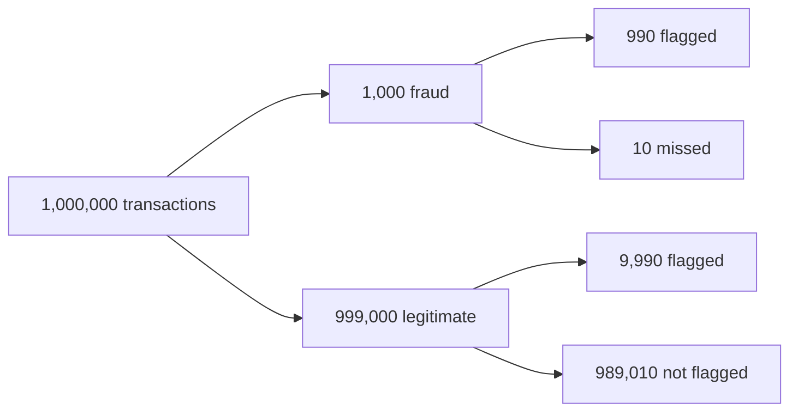
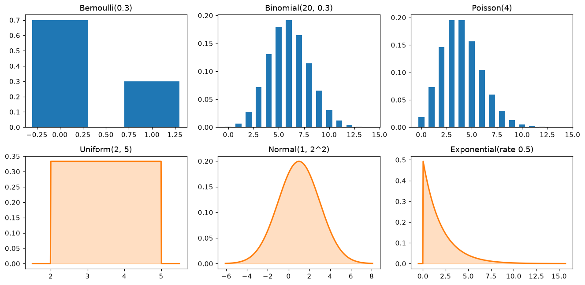
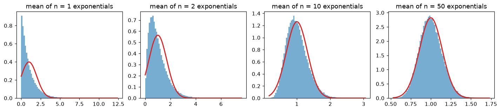

# Probability

> **Level 1 · Chapter 4** · ⏱️ ~60 min read · Prerequisites: [NumPy](../00-python-for-data/04-numpy.md) and high-school algebra; [Calculus and gradients](03-calculus-and-gradients.md) helps for continuous distributions

Probability is the mathematics of uncertainty, and machine learning is uncertainty all the way down: noisy data, random samples, and predictions that are really probabilities. This chapter covers sample spaces and events, conditional probability, Bayes' theorem, random variables, the six distributions you'll meet most often, expectation and variance, joint and conditional distributions, covariance, and the two great limit theorems, the law of large numbers and the central limit theorem. Every result is checked by simulation.

## Why it matters

Priya's team launched a fraud detector for card payments. On a balanced test set it caught 99% of fraudulent transactions and wrongly flagged only 1% of legitimate ones. Everyone was pleased. In its first week in production, it flagged about 10,000 transactions for manual review, and the fraud team found that roughly 9 in 10 of them were perfectly legitimate. The reviewers concluded the model was broken.

It wasn't. Only about 1 in 1,000 real transactions is fraudulent. Out of a million transactions, that's 1,000 frauds, of which the model catches 990, and 999,000 legitimate ones, of which 1% (9,990) get flagged anyway. So of roughly 10,980 alerts, only 990, about 9%, are real fraud. The model was exactly as good as promised. The team had confused "the probability of an alert, given fraud" with "the probability of fraud, given an alert". Those two numbers are related by **Bayes' theorem**, and the bridge between them is the **base rate**.

This mix-up wrecks medical screening programs, spam filters, security alerts, and A/B test readouts. Probability gives you the tools to avoid it, and the vocabulary (distributions, expectations, variances, independence) that every model in this handbook is written in.

## Concepts

### Sample spaces, events, and the rules of probability

A random **experiment** is anything with an uncertain outcome: rolling a die, a customer deciding whether to churn, measuring tomorrow's sales. The **sample space** $\Omega$ ("omega") is the set of all possible outcomes. For a die, $\Omega = \{1, 2, 3, 4, 5, 6\}$. An **event** is a set of outcomes you care about, such as "the roll is even", $A = \{2, 4, 6\}$.

A **probability** $P(A)$ is a number between 0 and 1 assigned to each event. There are two ways to interpret it, and you'll use both:

- **Frequentist:** $P(A)$ is the long-run fraction of times $A$ happens if you repeat the experiment many times.
- **Bayesian:** $P(A)$ is a degree of belief that $A$ is true, which you update as evidence arrives. This works even for one-off events, like "this transaction is fraud".

Whatever the interpretation, probabilities obey three rules, the **axioms of probability**: $P(A) \geq 0$; $P(\Omega) = 1$ (something happens); and for events that can't happen together (**disjoint** or mutually exclusive events), probabilities add: $P(A \cup B) = P(A) + P(B)$. The symbol $\cup$ means "or" (union), and $\cap$ means "and" (intersection). Everything else follows from those three:

- **Complement:** $P(\text{not } A) = 1 - P(A)$. Often the easy way in: "at least one" is 1 minus "none".
- **Union of any two events:** $P(A \cup B) = P(A) + P(B) - P(A \cap B)$. Adding $P(A)$ and $P(B)$ counts the overlap twice, so subtract it once.
- **Equally likely outcomes:** if all outcomes are equally likely, $P(A) = \lvert A \rvert / \lvert \Omega \rvert$, the number of outcomes in $A$ divided by the total.

You can estimate any probability by **simulation**: run the experiment many times on a computer and count. This is called the **Monte Carlo** method, and it's how you'll check every formula in this chapter.

```python
import numpy as np

rng = np.random.default_rng(0)
rolls = rng.integers(1, 7, size=(1_000_000, 2))     # two dice, a million times
total = rolls.sum(axis=1)

even_first = rolls[:, 0] % 2 == 0
sum_gt_8 = total > 8
print(f"P(sum = 7):           sim {np.mean(total == 7):.4f}   exact {6/36:.4f}")
print(f"P(first even or sum > 8): sim {np.mean(even_first | sum_gt_8):.4f}   "
      f"formula {np.mean(even_first) + np.mean(sum_gt_8) - np.mean(even_first & sum_gt_8):.4f}")
print(f"P(at least one 6):    sim {np.mean((rolls == 6).any(axis=1)):.4f}   exact {1 - (5/6) ** 2:.4f}")
```

```text
P(sum = 7):           sim 0.1668   exact 0.1667
P(first even or sum > 8): sim 0.6112   formula 0.6112
P(at least one 6):    sim 0.3060   exact 0.3056
```

### Conditional probability

The probability of $A$ **given** that $B$ happened is

$$
P(A \mid B) = \frac{P(A \cap B)}{P(B)}, \qquad P(B) > 0.
$$

The vertical bar reads "given". Intuitively, learning that $B$ happened shrinks your universe from $\Omega$ to $B$. Within that smaller universe, the part where $A$ also happens is $A \cap B$, and you renormalize by dividing by $P(B)$ so the new universe has total probability 1.

For two dice, $P(\text{sum} = 7) = 6/36 = 1/6$. But given that the first die shows a 6, only one outcome out of six, $(6, 1)$, gives 7, so $P(\text{sum} = 7 \mid \text{first} = 6) = 1/6$ too. Given that the sum is at least 11, the first die is 6 with probability $2/3$ (the outcomes are $(5,6)$, $(6,5)$, and $(6,6)$).

Rearranging the definition gives the **multiplication rule**, $P(A \cap B) = P(A \mid B)\,P(B)$: the chance of both is the chance of the first times the chance of the second given the first.

Two events are **independent** if knowing one tells you nothing about the other: $P(A \mid B) = P(A)$, or equivalently, $P(A \cap B) = P(A)\,P(B)$. Separate coin flips are independent. A customer's churn and their number of support tickets are not.

The **law of total probability** splits a probability across cases. If $B_1, \dots, B_k$ are disjoint and cover every possibility (a **partition**), then

$$
P(A) = \sum_{j=1}^{k} P(A \mid B_j)\,P(B_j).
$$

For example, the overall churn rate is the churn rate among monthly-plan customers times the share of monthly customers, plus the same for annual-plan customers. It's a weighted average of the conditional probabilities.

```python
first = rolls[:, 0]
print(f"P(sum=7 | first=6)  = {np.mean(total[first == 6] == 7):.4f}")       # condition = filter
print(f"P(first=6 | sum>=11) = {np.mean(first[total >= 11] == 6):.4f}")
# Independence check: are "first die even" and "second die even" independent?
a, b = rolls[:, 0] % 2 == 0, rolls[:, 1] % 2 == 0
print(f"P(A and B) = {np.mean(a & b):.4f}   P(A) P(B) = {np.mean(a) * np.mean(b):.4f}")
```

```text
P(sum=7 | first=6)  = 0.1668
P(first=6 | sum>=11) = 0.6683
P(A and B) = 0.2494   P(A) P(B) = 0.2495
```

In code, **conditioning is filtering**: keep the rows where $B$ happened, then compute the fraction where $A$ happened. That's exactly what `df[df.B].A.mean()` does in pandas.

### Bayes' theorem

The multiplication rule works in both directions: $P(A \cap B) = P(A \mid B)P(B) = P(B \mid A)P(A)$. Divide by $P(B)$ and you get **Bayes' theorem**:

$$
P(A \mid B) = \frac{P(B \mid A)\,P(A)}{P(B)}.
$$

It turns one conditional probability around into the other. In the language of evidence, with $H$ a hypothesis and $E$ the evidence:

$$
\underbrace{P(H \mid E)}_{\text{posterior}} = \frac{\overbrace{P(E \mid H)}^{\text{likelihood}}\;\overbrace{P(H)}^{\text{prior}}}{\underbrace{P(E)}_{\text{evidence}}}.
$$

The **prior** is what you believed before seeing the evidence. The **likelihood** is how probable the evidence is if the hypothesis is true. The **posterior** is your updated belief. The denominator $P(E)$ is usually computed with the law of total probability, $P(E) = P(E \mid H)P(H) + P(E \mid \text{not } H)P(\text{not } H)$.

Back to Priya's fraud detector. Let $F$ be "fraud" and $A$ be "alert". The **sensitivity** (true positive rate) is $P(A \mid F) = 0.99$, the **false positive rate** is $P(A \mid \text{not } F) = 0.01$, and the base rate is $P(F) = 0.001$. Then

$$
P(F \mid A) = \frac{0.99 \times 0.001}{0.99 \times 0.001 + 0.01 \times 0.999} = \frac{0.00099}{0.01098} \approx 0.090.
$$

Only 9% of alerts are fraud, matching the counting argument in the story. The reasoning is easiest with **natural frequencies**: imagine a concrete population, say a million transactions, and count.



The flagged transactions are $990 + 9{,}990 = 10{,}980$, of which 990 are fraud. When the base rate is tiny, even a small false positive rate applied to the huge legitimate group swamps the true positives. That's why the **precision** of a classifier, $P(\text{positive} \mid \text{flagged})$, depends on the base rate, while sensitivity doesn't. You'll meet this again in [model evaluation](../03-ml-fundamentals/index.md).

```python
n = 1_000_000
fraud = rng.random(n) < 0.001
alert = np.where(fraud, rng.random(n) < 0.99, rng.random(n) < 0.01)

prior, sens, fpr = 0.001, 0.99, 0.01
posterior = sens * prior / (sens * prior + fpr * (1 - prior))
print(f"P(fraud | alert): simulated {fraud[alert].mean():.3f}   Bayes {posterior:.3f}")
print(f"alerts: {alert.sum():,}   of which fraud: {(fraud & alert).sum():,}")
```

```text
P(fraud | alert): simulated 0.090   Bayes 0.090
alerts: 10,896   of which fraud: 977
```

Bayes' theorem is also the foundation of a whole school of statistics and of models like naive Bayes classifiers. You'll see the Bayesian view of estimation in [Statistics](05-statistics.md).

!!! warning "Common mistake: flipping the conditional"
    $P(\text{evidence} \mid \text{innocent})$ is not $P(\text{innocent} \mid \text{evidence})$. "Only 1% of legitimate transactions get flagged" does not mean "a flagged transaction is 99% likely to be fraud". This error is common enough in courtrooms to have a name, the **prosecutor's fallacy**. Whenever you see a conditional probability, say out loud which way round it goes.

### Random variables and their distributions

A **random variable** is a number determined by a random outcome: the sum of two dice, the number of purchases a customer makes this month, the time until the next server failure. We write random variables in capitals ($X$) and the values they take in lowercase ($x$). The **distribution** of $X$ says how probability is spread over its possible values.

A **discrete** random variable takes countably many values (usually integers). Its distribution is a **probability mass function (PMF)**, $p(x) = P(X = x)$, with $\sum_x p(x) = 1$.

A **continuous** random variable takes values in a continuum, such as any real number. The probability of any *exact* value is zero (the chance a height is exactly 170.000... cm is zero), so instead you use a **probability density function (PDF)** $f(x)$, and probabilities are areas under it:

$$
P(a \leq X \leq b) = \int_a^b f(x)\,dx, \qquad \int_{-\infty}^{\infty} f(x)\,dx = 1.
$$

The integral $\int_a^b f(x)\,dx$ is the area under the curve $f$ between $a$ and $b$; for a beginner, "area under the curve" is all you need. A density is probability *per unit of $x$*, like mass per unit length. It can exceed 1: a uniform distribution on $[0, 0.5]$ has density 2 everywhere on that interval, and its total area is still $2 \times 0.5 = 1$.

Both kinds have a **cumulative distribution function (CDF)**, $F(x) = P(X \leq x)$, which rises from 0 to 1. Its inverse, the **quantile function** (`ppf` in SciPy, for "percent point function"), answers "below what value do 95% of outcomes fall?".

### Expectation

The **expected value** (or **mean**) of a random variable is its probability-weighted average:

$$
\mathbb{E}[X] = \sum_x x\,p(x) \quad \text{(discrete)}, \qquad \mathbb{E}[X] = \int x\,f(x)\,dx \quad \text{(continuous)}.
$$

It's often written $\mu$ ("mu"). Think of it as the balance point of the distribution: if the PMF were weights on a ruler, the mean is where the ruler balances. By the frequentist reading, it's the long-run average of many independent draws. For a die, $\mathbb{E}[X] = (1 + 2 + \dots + 6)/6 = 3.5$, a value the die can never actually show.

The most useful property of expectation is **linearity**: for any random variables $X$ and $Y$ and constants $a$, $b$,

$$
\mathbb{E}[aX + bY] = a\,\mathbb{E}[X] + b\,\mathbb{E}[Y].
$$

This holds **even if $X$ and $Y$ are dependent**. The proof for discrete variables is one line: $\mathbb{E}[X + Y] = \sum_{x,y}(x + y)\,p(x, y) = \sum_{x,y}x\,p(x,y) + \sum_{x,y}y\,p(x,y) = \mathbb{E}[X] + \mathbb{E}[Y]$, where the last step sums out the other variable. So the expected sum of two dice is $3.5 + 3.5 = 7$, with no need to list all 36 outcomes.

To find the expectation of a function of $X$, weight the function's values by $X$'s probabilities: $\mathbb{E}[g(X)] = \sum_x g(x)\,p(x)$. But in general $\mathbb{E}[g(X)] \neq g(\mathbb{E}[X])$. For example, $\mathbb{E}[X^2] \neq (\mathbb{E}[X])^2$, and that gap is exactly the variance.

### Variance and standard deviation

The **variance** measures spread: the expected squared distance from the mean,

$$
\operatorname{Var}(X) = \mathbb{E}\big[(X - \mu)^2\big].
$$

Its square root is the **standard deviation**, $\sigma = \sqrt{\operatorname{Var}(X)}$, which is in the same units as $X$. (In this chapter $\sigma$ means a standard deviation; elsewhere it's also the sigmoid function. Context always makes it clear.)

Expanding the square and using linearity gives a formula that's often easier to compute:

$$
\operatorname{Var}(X) = \mathbb{E}[X^2 - 2\mu X + \mu^2] = \mathbb{E}[X^2] - 2\mu\,\mathbb{E}[X] + \mu^2 = \mathbb{E}[X^2] - \mu^2.
$$

"The mean of the square minus the square of the mean." For a die, $\mathbb{E}[X^2] = (1 + 4 + 9 + 16 + 25 + 36)/6 = 91/6$, so $\operatorname{Var}(X) = 91/6 - 3.5^2 = 35/12 \approx 2.917$.

How does variance behave under scaling and shifting? Shifting by $b$ moves the mean by $b$ too, so distances to the mean don't change; scaling by $a$ scales distances by $a$ and squared distances by $a^2$:

$$
\operatorname{Var}(aX + b) = a^2\operatorname{Var}(X).
$$

For **independent** $X$ and $Y$, variances add: $\operatorname{Var}(X + Y) = \operatorname{Var}(X) + \operatorname{Var}(Y)$. (Not standard deviations, and not for dependent variables; see covariance below.)

```python
faces = np.arange(1, 7)
p = np.full(6, 1 / 6)
mean = np.sum(faces * p)
var = np.sum(faces ** 2 * p) - mean ** 2
x = rng.integers(1, 7, size=1_000_000)
y = rng.integers(1, 7, size=1_000_000)
print(f"die: mean {mean:.4f} (sim {x.mean():.4f}), var {var:.4f} (sim {x.var():.4f})")
print(f"Var(3X + 5) = {np.var(3 * x + 5):.3f}  vs 9 Var(X) = {9 * x.var():.3f}")
print(f"Var(X + Y)  = {np.var(x + y):.3f}  vs Var(X) + Var(Y) = {x.var() + y.var():.3f}")
```

```text
die: mean 3.5000 (sim 3.5006), var 2.9167 (sim 2.9165)
Var(3X + 5) = 26.248  vs 9 Var(X) = 26.248
Var(X + Y)  = 5.839  vs Var(X) + Var(Y) = 5.835
```

### Six distributions you'll use constantly

Each common distribution is a model of a particular kind of randomness. Knowing the *story* behind each one tells you when to use it.

| Distribution | Story | Values | PMF or PDF | Mean | Variance |
|---|---|---|---|---|---|
| **Bernoulli**$(p)$ | one yes/no trial with success probability $p$ | $\{0, 1\}$ | $p^x(1-p)^{1-x}$ | $p$ | $p(1-p)$ |
| **Binomial**$(n, p)$ | number of successes in $n$ independent trials | $0, \dots, n$ | $\binom{n}{x}p^x(1-p)^{n-x}$ | $np$ | $np(1-p)$ |
| **Poisson**$(\lambda)$ | count of rare events in a fixed window, at average rate $\lambda$ | $0, 1, 2, \dots$ | $\frac{\lambda^x e^{-\lambda}}{x!}$ | $\lambda$ | $\lambda$ |
| **Uniform**$(a, b)$ | any value in an interval, equally likely | $[a, b]$ | $\frac{1}{b-a}$ | $\frac{a+b}{2}$ | $\frac{(b-a)^2}{12}$ |
| **Normal**$(\mu, \sigma^2)$ | sums of many small independent effects | all reals | $\frac{1}{\sigma\sqrt{2\pi}}e^{-\frac{(x-\mu)^2}{2\sigma^2}}$ | $\mu$ | $\sigma^2$ |
| **Exponential**$(\lambda)$ | waiting time until the next event, at rate $\lambda$ | $x \geq 0$ | $\lambda e^{-\lambda x}$ | $\frac{1}{\lambda}$ | $\frac{1}{\lambda^2}$ |

**Bernoulli.** Did this customer churn? Did this user click? A Bernoulli variable is 1 with probability $p$ and 0 otherwise. Its mean is $0\cdot(1-p) + 1\cdot p = p$, and since $X^2 = X$ for 0/1 values, $\mathbb{E}[X^2] = p$ and the variance is $p - p^2 = p(1-p)$. The variance is largest at $p = 0.5$, where the outcome is most uncertain. Binary classifiers model each label as Bernoulli.

**Binomial.** Out of $n = 1{,}000$ visitors who each convert with probability $p = 0.03$, how many convert? A binomial variable is a sum of $n$ independent Bernoullis. The PMF counts the $\binom{n}{x}$ ("$n$ choose $x$", $\frac{n!}{x!(n-x)!}$) ways to place $x$ successes among $n$ trials, each arrangement having probability $p^x(1-p)^{n-x}$. Linearity gives the mean for free, $np$, and independence makes the variances add to $np(1-p)$. This is the distribution behind A/B tests on conversion rates.

**Poisson.** How many support tickets arrive in an hour? How many typos per page? When events happen independently at a constant average rate $\lambda$ per window, the count is Poisson. It's the limit of a binomial with many trials and a tiny success probability: chop the hour into $n$ tiny intervals, each with probability $\lambda/n$ of an event, and let $n \to \infty$. Its mean and variance are both $\lambda$, which gives a quick check on real count data: if the variance is far larger than the mean (**overdispersion**), a plain Poisson model is wrong.

**Uniform.** Every value in $[a, b]$ is equally likely, so the density is the constant $1/(b - a)$. Random number generators start here, and random search over hyperparameters samples from uniforms.

**Normal (Gaussian).** The bell curve, centered at $\mu$ with spread $\sigma$. Heights, measurement errors, and test scores are roughly normal, and the central limit theorem (below) explains why: sums and averages of many small independent effects become normal. The **standard normal** has $\mu = 0$ and $\sigma = 1$, and any normal can be standardized by $Z = (X - \mu)/\sigma$. About 68% of the probability lies within $1\sigma$ of the mean, 95% within $1.96\sigma$, and 99.7% within $3\sigma$. Linear regression assumes normal errors, and neural networks are often initialized with normal weights.

**Exponential.** How long until the next customer arrives, or until a component fails? If events follow a Poisson process with rate $\lambda$, the waiting time is exponential, with mean $1/\lambda$. It's the only continuous distribution that's **memoryless**: $P(X > s + t \mid X > s) = P(X > t)$. A lightbulb with exponential lifetime that has already lasted 1,000 hours is as good as new. That makes it a poor model for things that wear out, and a good model for truly random arrivals.

SciPy's `scipy.stats` module has all of these with a uniform interface: `pmf` or `pdf`, `cdf`, `ppf` (quantiles), `mean`, `var`, and `rvs` (random samples).

```python
from scipy import stats

dists = {
    "Bernoulli(0.3)": stats.bernoulli(0.3),
    "Binomial(20, 0.3)": stats.binom(20, 0.3),
    "Poisson(4)": stats.poisson(4),
    "Uniform(2, 5)": stats.uniform(loc=2, scale=3),        # scipy: [loc, loc + scale]
    "Normal(1, 2^2)": stats.norm(loc=1, scale=2),
    "Exponential(rate 0.5)": stats.expon(scale=1 / 0.5),   # scipy uses scale = 1 / rate
}
for name, d in dists.items():
    s = d.rvs(size=500_000, random_state=1)
    print(f"{name:22s} mean {d.mean():6.3f} (sim {s.mean():6.3f})   var {d.var():6.3f} (sim {s.var():6.3f})")

z = stats.norm()
print("P(|Z| < 1), P(|Z| < 1.96), P(|Z| < 3):", np.round([z.cdf(k) - z.cdf(-k) for k in (1, 1.96, 3)], 4))
print("95th percentile of Z:", round(z.ppf(0.95), 4))
```

```text
Bernoulli(0.3)         mean  0.300 (sim  0.300)   var  0.210 (sim  0.210)
Binomial(20, 0.3)      mean  6.000 (sim  5.998)   var  4.200 (sim  4.193)
Poisson(4)             mean  4.000 (sim  3.996)   var  4.000 (sim  3.998)
Uniform(2, 5)          mean  3.500 (sim  3.499)   var  0.750 (sim  0.750)
Normal(1, 2^2)         mean  1.000 (sim  1.002)   var  4.000 (sim  3.995)
Exponential(rate 0.5)  mean  2.000 (sim  1.997)   var  4.000 (sim  3.978)
P(|Z| < 1), P(|Z| < 1.96), P(|Z| < 3): [0.6827 0.95   0.9973]
95th percentile of Z: 1.6449
```

Every formula in the table matches the simulation. Here they are side by side:

```python
import matplotlib.pyplot as plt

fig, axes = plt.subplots(2, 3, figsize=(12, 6))
for ax, (name, d) in zip(axes.ravel(), dists.items()):
    if hasattr(d, "pmf"):
        k = np.arange(0, 15) if "Bernoulli" not in name else np.array([0, 1])
        ax.bar(k, d.pmf(k), color="tab:blue", width=0.6)
    else:
        xs = np.linspace(d.ppf(0.0005) - 0.5, d.ppf(0.9995) + 0.5, 400)
        ax.plot(xs, d.pdf(xs), color="tab:orange", lw=2)
        ax.fill_between(xs, d.pdf(xs), alpha=0.25, color="tab:orange")
    ax.set_title(name)
fig.tight_layout()
plt.show()
```



*The six workhorse distributions. Discrete ones (top, bars) have probability masses that sum to 1; continuous ones (bottom, curves) have densities whose area is 1.*

### Joint, marginal, and conditional distributions

Real problems involve several random variables at once. Their **joint distribution** gives the probability of every combination. For two discrete variables, it's a table of $p(x, y) = P(X = x, Y = y)$.

Suppose $X$ is a customer's plan (monthly or annual) and $Y$ is whether they churned:

| | churned ($Y = 1$) | stayed ($Y = 0$) | **marginal of plan** |
|---|---|---|---|
| monthly | 0.12 | 0.48 | **0.60** |
| annual | 0.02 | 0.38 | **0.40** |
| **marginal of churn** | **0.14** | **0.86** | 1.00 |

The **marginal distribution** of one variable is found by summing the joint over the other, which is the law of total probability:

$$
p(x) = \sum_y p(x, y).
$$

The name comes from writing those sums in the table's margins. The overall churn rate is $0.12 + 0.02 = 0.14$.

The **conditional distribution** of $Y$ given $X = x$ is a row of the joint table, renormalized to sum to 1:

$$
p(y \mid x) = \frac{p(x, y)}{p(x)}.
$$

Monthly customers churn with probability $0.12 / 0.60 = 0.20$; annual customers with probability $0.02 / 0.40 = 0.05$. The two variables are **independent** exactly when the joint factorizes into the product of the marginals, $p(x, y) = p(x)\,p(y)$ for every $x, y$, which is the same as saying every conditional equals the marginal. Here $0.60 \times 0.14 = 0.084 \neq 0.12$, so plan and churn are dependent.

For continuous variables, the same ideas hold with a joint density $f(x, y)$ and integrals in place of sums. Supervised learning is, at bottom, about conditional distributions: a classifier estimates $p(y \mid \mathbf{x})$, the distribution of the label given the features.

```python
import pandas as pd

joint = np.array([[0.12, 0.48], [0.02, 0.38]])          # rows: monthly, annual; cols: churned, stayed
plan_idx = rng.choice(4, size=200_000, p=joint.ravel())
df = pd.DataFrame({"plan": np.where(plan_idx < 2, "monthly", "annual"),
                   "churned": (plan_idx % 2 == 0).astype(int)})

print(pd.crosstab(df.plan, df.churned, normalize="all").round(3))   # joint
print(df.churned.mean().round(3))                                  # marginal P(churn)
print(df.groupby("plan").churned.mean().round(3))                  # conditional P(churn | plan)
```

```text
churned      0     1
plan
annual   0.379  0.02
monthly  0.481  0.12
0.14
plan
annual     0.051
monthly    0.199
Name: churned, dtype: float64
```

A joint table, a marginal (`mean` over everything), and a conditional (`groupby` then `mean`): three pandas idioms you'll use for the rest of your career.

### Covariance and correlation

The **covariance** of two random variables measures whether they move together:

$$
\operatorname{Cov}(X, Y) = \mathbb{E}\big[(X - \mu_X)(Y - \mu_Y)\big] = \mathbb{E}[XY] - \mu_X\mu_Y.
$$

When $X$ is above its mean and $Y$ tends to be above its mean too, the product is positive on average: positive covariance. If one tends to be high when the other is low, it's negative. The second form follows by expanding, just like the variance formula (and $\operatorname{Cov}(X, X) = \operatorname{Var}(X)$).

Covariance fixes the variance-of-a-sum rule for dependent variables. Expanding $\mathbb{E}[((X - \mu_X) + (Y - \mu_Y))^2]$:

$$
\operatorname{Var}(X + Y) = \operatorname{Var}(X) + \operatorname{Var}(Y) + 2\operatorname{Cov}(X, Y).
$$

Positively correlated risks add up to more risk than independent ones. That's why diversifying a portfolio with negatively correlated assets reduces variance.

Covariance depends on units (centimeters times kilograms). The **correlation** rescales it to lie between $-1$ and $1$:

$$
\rho_{XY} = \frac{\operatorname{Cov}(X, Y)}{\sigma_X\,\sigma_Y}.
$$

Why is it bounded? The centered variables $X - \mu_X$ and $Y - \mu_Y$ behave like vectors, with covariance as their dot product and standard deviations as their lengths. Correlation is then the cosine of the angle between them, as in [Linear algebra](01-linear-algebra.md), and a cosine can't leave $[-1, 1]$. (Formally, that's the Cauchy–Schwarz inequality.) $\rho = \pm 1$ means $Y$ is an exact linear function of $X$.

Two warnings. **Independence implies zero covariance, but zero covariance does not imply independence.** Covariance only detects *linear* association. If $X$ is symmetric around zero and $Y = X^2$, then $Y$ is completely determined by $X$, yet $\operatorname{Cov}(X, Y) = \mathbb{E}[X^3] - \mathbb{E}[X]\mathbb{E}[X^2] = 0$. And of course, correlation isn't causation, a topic for [Level 2](../02-data-science-workflow/index.md).

For a random vector $\mathbf{X} = (X_1, \dots, X_d)$, the **covariance matrix** $\mathbf{\Sigma}$ collects all the pairwise covariances, $\Sigma_{ij} = \operatorname{Cov}(X_i, X_j)$, with variances on the diagonal. It's symmetric and positive semi-definite, the matrix that PCA decomposes in [Matrix decompositions](02-matrix-decompositions.md). The variance of any linear combination $\mathbf{w}^\top\mathbf{X}$ is $\mathbf{w}^\top\mathbf{\Sigma}\mathbf{w}$, the multi-dimensional version of the variance-of-a-sum rule.

```python
x = rng.normal(size=200_000)
noise = rng.normal(size=200_000)
y = 0.8 * x + 0.6 * noise                    # built to have correlation 0.8
print(f"Cov: {np.cov(x, y)[0, 1]:.3f}   corr: {np.corrcoef(x, y)[0, 1]:.3f}")
print(f"Var(X+Y) = {np.var(x + y):.3f}   formula = {np.var(x) + np.var(y) + 2 * np.cov(x, y, ddof=0)[0, 1]:.3f}")

y2 = x ** 2                                  # completely dependent on x...
print(f"corr(X, X^2) = {np.corrcoef(x, y2)[0, 1]:.3f}")     # ...but uncorrelated

Sigma = np.cov(np.vstack([x, y]))            # 2x2 covariance matrix
w = np.array([2.0, -1.0])
print(f"Var(2X - Y) = {np.var(2 * x - y, ddof=1):.3f}   w^T Sigma w = {w @ Sigma @ w:.3f}")
```

```text
Cov: 0.796   corr: 0.799
Var(X+Y) = 3.584   formula = 3.584
corr(X, X^2) = 0.009
Var(2X - Y) = 1.793   w^T Sigma w = 1.793
```

### The law of large numbers

Why does simulation work at all? Because of the **law of large numbers (LLN)**: the average of many independent draws from the same distribution converges to the true mean. If $X_1, \dots, X_n$ are **independent and identically distributed (i.i.d.)** with mean $\mu$, the **sample mean**

$$
\bar{X}_n = \frac{1}{n}\sum_{i=1}^{n} X_i
$$

approaches $\mu$ as $n$ grows.

You can see *how fast* with the rules you already have. By linearity, $\mathbb{E}[\bar{X}_n] = \frac{1}{n}\cdot n\mu = \mu$: the sample mean is right on average. By independence, variances add, and scaling by $\frac{1}{n}$ scales variance by $\frac{1}{n^2}$:

$$
\operatorname{Var}(\bar{X}_n) = \frac{1}{n^2}\sum_{i=1}^{n}\operatorname{Var}(X_i) = \frac{n\sigma^2}{n^2} = \frac{\sigma^2}{n}.
$$

So the spread of the sample mean, its **standard error**, is $\sigma/\sqrt{n}$. It shrinks to zero, which is why the average converges. But it shrinks slowly: to halve the error, you need four times as much data. To get one more decimal digit of accuracy, you need 100 times as much. This $1/\sqrt{n}$ law governs simulation accuracy, A/B test sample sizes, and the noise in mini-batch gradients.

```python
draws = rng.exponential(scale=2.0, size=1_000_000)       # true mean 2, true sd 2
for n in [10, 100, 10_000, 1_000_000]:
    print(f"n={n:>9,}  sample mean {draws[:n].mean():.4f}   standard error {2 / np.sqrt(n):.4f}")
```

```text
n=       10  sample mean 2.5942   standard error 0.6325
n=      100  sample mean 1.9733   standard error 0.2000
n=   10,000  sample mean 2.0236   standard error 0.0200
n=1,000,000  sample mean 2.0020   standard error 0.0020
```

The LLN needs the mean to exist. For extremely heavy-tailed distributions, such as the **Cauchy distribution**, it doesn't, and sample averages never settle down (Exercise 6).

### The central limit theorem

The LLN says $\bar{X}_n$ concentrates around $\mu$. The **central limit theorem (CLT)** says what shape its fluctuations take: **approximately normal, whatever the shape of the original distribution.** Precisely, if the $X_i$ are i.i.d. with mean $\mu$ and finite variance $\sigma^2$, then for large $n$

$$
\bar{X}_n \approx \mathcal{N}\!\left(\mu,\ \frac{\sigma^2}{n}\right), \qquad \text{equivalently} \qquad \frac{\bar{X}_n - \mu}{\sigma/\sqrt{n}} \approx \mathcal{N}(0, 1).
$$

Here $\mathcal{N}(\mu, \sigma^2)$ denotes a normal distribution. The proof needs tools beyond this chapter (characteristic functions), but the key idea is that when you add many independent pieces, the details of each piece's shape wash out, and only the mean and variance survive. Any skew in one draw is averaged against the others.

This is one of the most useful facts in all of statistics. It's why you can put error bars on an average of skewed data, such as revenue per user, which is nothing like normal. It's why A/B tests on conversion rates use normal approximations. It's why many measurement errors, which are sums of many small disturbances, look normal. You'll build confidence intervals on it in [Statistics](05-statistics.md).

How large must $n$ be? It depends on how skewed the original distribution is. For mildly skewed data, 30 is a common rule of thumb; for heavily skewed data (like revenue, where a few whales spend thousands), you may need hundreds or thousands. Simulation tells you.

```python
fig, axes = plt.subplots(1, 4, figsize=(13, 3))
for ax, n in zip(axes, [1, 2, 10, 50]):
    means = rng.exponential(scale=1.0, size=(100_000, n)).mean(axis=1)   # mean 1, sd 1
    ax.hist(means, bins=80, density=True, alpha=0.6, color="tab:blue")
    xs = np.linspace(means.min(), means.max(), 300)
    ax.plot(xs, stats.norm(1, 1 / np.sqrt(n)).pdf(xs), color="tab:red", lw=2)
    ax.set_title(f"mean of n = {n} exponentials")
fig.tight_layout()
plt.show()

means50 = rng.exponential(scale=1.0, size=(100_000, 50)).mean(axis=1)
print(f"sd of sample means: {means50.std():.4f}   theory 1/sqrt(50) = {1 / np.sqrt(50):.4f}")
print(f"fraction within 1.96 standard errors: {np.mean(np.abs(means50 - 1) < 1.96 / np.sqrt(50)):.4f}")
```

```text
sd of sample means: 0.1415   theory 1/sqrt(50) = 0.1414
fraction within 1.96 standard errors: 0.9512
```



*The CLT in action. Averages of n exponential draws (blue) with the normal approximation from the CLT (red). At n = 1 it's the skewed exponential itself; by n = 50, the bell curve fits closely.*

The fraction within $\pm 1.96$ standard errors is close to the 95% the normal distribution promises, and the spread of the sample means matches $\sigma/\sqrt{n}$.

## In practice

### Simulation as a superpower

When a probability question gets confusing, simulate it. Here's the **birthday problem**: in a group of 23 people, what's the chance two share a birthday? Intuition says small. The exact answer uses the complement: the probability that all birthdays differ is $\frac{365}{365}\cdot\frac{364}{365}\cdots\frac{343}{365}$.

```python
k = 23
exact = 1 - np.prod((365 - np.arange(k)) / 365)
bdays = rng.integers(0, 365, size=(200_000, k))
sorted_b = np.sort(bdays, axis=1)
shared = (np.diff(sorted_b, axis=1) == 0).any(axis=1)
print(f"exact {exact:.4f}   simulated {shared.mean():.4f}")
```

```text
exact 0.5073   simulated 0.5067
```

Just over 50%. There are $\binom{23}{2} = 253$ pairs of people, and each pair has a small chance of matching; the number of pairs grows much faster than the number of people. The same effect is why hash collisions and duplicate IDs show up far sooner than intuition suggests.

### The scipy.stats interface

| Method | Meaning | Example |
|---|---|---|
| `d.pmf(k)` / `d.pdf(x)` | mass or density at a point | `stats.binom(10, 0.5).pmf(5)` |
| `d.cdf(x)` | $P(X \leq x)$ | `stats.norm().cdf(1.96)` |
| `d.sf(x)` | $P(X > x)$, more accurate than `1 - cdf` in the far tail | `stats.norm().sf(5)` |
| `d.ppf(q)` | quantile: the $x$ with $P(X \leq x) = q$ | `stats.norm().ppf(0.975)` |
| `d.mean()`, `d.var()`, `d.std()` | moments | |
| `d.rvs(size, random_state)` | random samples | prefer `rng` methods in NumPy for speed |

```python
visits = stats.poisson(4)                     # tickets per hour
print(f"P(no tickets in an hour)    = {visits.pmf(0):.4f}")
print(f"P(more than 8 tickets)      = {visits.sf(8):.4f}")
print(f"staff for 99% of hours: {visits.ppf(0.99):.0f} tickets")
wait = stats.expon(scale=1 / 4)               # hours between tickets at rate 4/hour
print(f"P(wait > 30 min)            = {wait.sf(0.5):.4f}   (same as P(0 tickets in 30 min) = {stats.poisson(2).pmf(0):.4f})")
```

```text
P(no tickets in an hour)    = 0.0183
P(more than 8 tickets)      = 0.0214
staff for 99% of hours: 9 tickets
P(wait > 30 min)            = 0.1353   (same as P(0 tickets in 30 min) = 0.1353)
```

The last line shows the Poisson and exponential describing the same process from two angles: "waiting more than 30 minutes" is the same event as "no tickets in the next 30 minutes".

!!! warning "Common mistake: parameterization mismatches"
    Libraries disagree about parameters. SciPy's `expon` takes `scale = 1/rate`; NumPy's `rng.exponential` also takes `scale`; some textbooks use the rate. `stats.norm(loc, scale)` takes a standard deviation, while math notation $\mathcal{N}(\mu, \sigma^2)$ usually gives the variance. `stats.uniform(loc, scale)` covers $[\text{loc}, \text{loc} + \text{scale}]$, not $[\text{loc}, \text{scale}]$. Always check a distribution's `mean()` and `var()` against what you intended.

!!! warning "Common mistake: assuming independence"
    Formulas that multiply probabilities or add variances assume independence. Transactions from the same user, sensor readings a second apart, and daily sales on consecutive days are usually dependent. Treating dependent data as independent makes you overconfident: your standard errors come out too small.

## Exercises

### Exercise 1: Conditioning on dice (easy)

You roll two fair dice and are told that at least one shows a 6. What's the probability that the sum is 7? Work it out by counting, then check by simulation.

??? success "Solution"

    Outcomes with at least one 6: 6 with the first die showing 6, plus 6 with the second, minus the double-counted $(6, 6)$: 11 outcomes. Of those, sum 7 happens for $(1, 6)$ and $(6, 1)$. So the answer is $2/11 \approx 0.182$, a little higher than the unconditional $1/6$.

    ```python
    import numpy as np

    rng = np.random.default_rng(0)
    r = rng.integers(1, 7, size=(1_000_000, 2))
    has6 = (r == 6).any(axis=1)
    print(round(np.mean(r[has6].sum(axis=1) == 7), 4), round(2 / 11, 4))
    ```

    ```text
    0.1819 0.1818
    ```

### Exercise 2: A second test (medium)

A disease affects 1% of a population. A test has 95% sensitivity and a 5% false positive rate. (a) What's $P(\text{disease} \mid \text{positive})$? (b) A patient tests positive, then takes a second, independent test of the same kind and tests positive again. What's the probability now? Explain why using the first posterior as the new prior works.

??? success "Solution"

    (a) $P(D \mid +) = \frac{0.95 \times 0.01}{0.95 \times 0.01 + 0.05 \times 0.99} = \frac{0.0095}{0.059} \approx 0.161$.

    (b) Use $0.161$ as the new prior: $\frac{0.95 \times 0.161}{0.95 \times 0.161 + 0.05 \times 0.839} \approx 0.785$. This works because the tests are independent *given* disease status, so the second test's likelihoods don't depend on the first result. Updating twice in sequence gives the same answer as one update with the joint likelihood $0.95^2$ versus $0.05^2$.

    ```python
    def bayes(prior, sens, fpr):
        return sens * prior / (sens * prior + fpr * (1 - prior))

    p1 = bayes(0.01, 0.95, 0.05)
    p2 = bayes(p1, 0.95, 0.05)
    print(round(p1, 3), round(p2, 3), round(bayes(0.01, 0.95 ** 2, 0.05 ** 2), 3))
    ```

    ```text
    0.161 0.785 0.785
    ```

    Evidence accumulates: one positive moves the probability from 1% to 16%, and two move it to 79%.

### Exercise 3: Moments of the uniform (easy)

Derive the mean and variance of the uniform distribution on $[a, b]$ using integrals, and verify by simulation for $a = 2$, $b = 10$.

??? success "Solution"

    The density is $\frac{1}{b-a}$ on $[a, b]$. Then $\mathbb{E}[X] = \int_a^b \frac{x}{b-a}dx = \frac{b^2 - a^2}{2(b-a)} = \frac{a + b}{2}$, and $\mathbb{E}[X^2] = \int_a^b \frac{x^2}{b-a}dx = \frac{b^3 - a^3}{3(b-a)} = \frac{a^2 + ab + b^2}{3}$. So

    $$
    \operatorname{Var}(X) = \frac{a^2 + ab + b^2}{3} - \frac{(a+b)^2}{4} = \frac{4a^2 + 4ab + 4b^2 - 3a^2 - 6ab - 3b^2}{12} = \frac{(b - a)^2}{12}.
    $$

    For $[2, 10]$: mean 6 and variance $64/12 \approx 5.333$.

    ```python
    u = rng.uniform(2, 10, size=1_000_000)
    print(round(u.mean(), 3), round(u.var(), 3), round(64 / 12, 3))
    ```

    ```text
    6.001 5.332 5.333
    ```

### Exercise 4: Two correlated investments (medium)

Two investments have yearly returns with standard deviations 10% and 20%, and correlation $\rho$. You put half your money in each. Find the standard deviation of your portfolio's return as a function of $\rho$, and evaluate it for $\rho = 1, 0, -0.5$. Verify the $\rho = -0.5$ case by simulation.

??? success "Solution"

    The portfolio return is $R = 0.5X + 0.5Y$, so

    $$
    \operatorname{Var}(R) = 0.25\,\sigma_X^2 + 0.25\,\sigma_Y^2 + 2(0.5)(0.5)\rho\,\sigma_X\sigma_Y = 0.25(0.01) + 0.25(0.04) + 0.5\rho(0.02).
    $$

    For $\rho = 1$: $\operatorname{Var} = 0.0225$, sd $15\%$ (just the average of the two sds; no diversification benefit). For $\rho = 0$: $0.0125$, sd $\approx 11.2\%$. For $\rho = -0.5$: $0.0075$, sd $\approx 8.7\%$, less risky than either investment alone.

    ```python
    rho, sx, sy = -0.5, 0.10, 0.20
    cov = np.array([[sx ** 2, rho * sx * sy], [rho * sx * sy, sy ** 2]])
    XY = rng.multivariate_normal([0.05, 0.08], cov, size=1_000_000)
    print(round((0.5 * XY[:, 0] + 0.5 * XY[:, 1]).std(), 4), round(np.sqrt(0.0075), 4))
    ```

    ```text
    0.0865 0.0866
    ```

### Exercise 5: Monty Hall (medium)

On a game show, a prize is behind one of three doors. You pick door 1. The host, who knows where the prize is, opens one of the other two doors to reveal no prize (choosing at random if both are empty). Should you switch? Reason with conditional probability, then simulate 100,000 games for both strategies.

??? success "Solution"

    Your first pick is right with probability $1/3$, and the host's action can't change that, because he can always open an empty door whatever you picked. So staying wins with probability $1/3$. Switching wins whenever your first pick was wrong ($2/3$), because the host has removed the only other wrong door. Switch.

    ```python
    n = 100_000
    prize = rng.integers(0, 3, n)
    pick = np.zeros(n, dtype=int)
    # host opens a door that is neither the pick nor the prize (random if two are available)
    host = np.empty(n, dtype=int)
    for i in range(n):
        options = [d for d in (1, 2) if d != prize[i]]
        host[i] = options[rng.integers(len(options))]
    switch = 3 - pick - host                 # the remaining door (doors are 0, 1, 2)
    print(f"stay wins {np.mean(pick == prize):.3f}   switch wins {np.mean(switch == prize):.3f}")
    ```

    ```text
    stay wins 0.335   switch wins 0.665
    ```

    The key is that the host's choice isn't random: it depends on where the prize is. That dependence is the information you gain.

### Exercise 6: When averages don't settle (hard)

Draw 1,000,000 samples from a standard **Cauchy distribution** (`rng.standard_cauchy`) and print the running mean at $n = 10^2, 10^3, \dots, 10^6$. Do the same for a standard normal. Then repeat the Cauchy experiment with five different seeds at $n = 10^6$. What does this say about the law of large numbers and the central limit theorem? Why?

??? success "Solution"

    ```python
    c = rng.standard_cauchy(1_000_000)
    z = rng.standard_normal(1_000_000)
    for n in [10 ** k for k in range(2, 7)]:
        print(f"n={n:>9,}  Cauchy mean {c[:n].mean():9.3f}   normal mean {z[:n].mean():7.4f}")
    print([round(float(np.random.default_rng(s).standard_cauchy(1_000_000).mean()), 2) for s in range(5)])
    ```

    ```text
    n=      100  Cauchy mean    -1.467   normal mean  0.0911
    n=    1,000  Cauchy mean     5.853   normal mean  0.0438
    n=   10,000  Cauchy mean     0.446   normal mean  0.0044
    n=  100,000  Cauchy mean    -1.066   normal mean -0.0023
    n=1,000,000  Cauchy mean    -2.650   normal mean -0.0014
    [0.47, 0.41, -0.39, -0.43, 0.25]
    ```

    The normal mean converges toward 0 at the $1/\sqrt{n}$ rate. The Cauchy mean wanders and never settles, and different seeds give very different answers even with a million draws. The Cauchy's tails are so heavy that $\mathbb{E}[\lvert X \rvert] = \infty$: the mean doesn't exist, so the LLN doesn't apply, and with infinite variance the CLT doesn't either. (In fact, the mean of $n$ standard Cauchy draws has exactly the same Cauchy distribution as a single draw: averaging buys you nothing.) Real data with extreme outliers, such as revenue with a few huge accounts or insurance claims, can behave in this direction. Robust statistics like the median are the defense.

## Check yourself

1. What's the difference between $P(A \mid B)$ and $P(B \mid A)$? Give an example where they're very different.

    ??? note "Answer"

        $P(A \mid B)$ is the probability of $A$ within the cases where $B$ happened, and vice versa. In the fraud example, $P(\text{alert} \mid \text{fraud}) = 0.99$, but $P(\text{fraud} \mid \text{alert}) \approx 0.09$, because legitimate transactions vastly outnumber fraud.

2. State Bayes' theorem and name its parts.

    ??? note "Answer"

        $P(H \mid E) = P(E \mid H)\,P(H) / P(E)$. The posterior $P(H \mid E)$ equals the likelihood $P(E \mid H)$ times the prior $P(H)$, divided by the evidence $P(E)$, which you get from the law of total probability.

3. Why can a probability density be greater than 1?

    ??? note "Answer"

        A density is probability per unit length, not a probability. Only its integral (area) over an interval is a probability. A narrow distribution must have a tall density so that its total area is 1.

4. Does $\mathbb{E}[X + Y] = \mathbb{E}[X] + \mathbb{E}[Y]$ require independence? Does $\operatorname{Var}(X + Y) = \operatorname{Var}(X) + \operatorname{Var}(Y)$?

    ??? note "Answer"

        Linearity of expectation never requires independence. The variance rule requires zero covariance (which independence guarantees); in general $\operatorname{Var}(X + Y) = \operatorname{Var}(X) + \operatorname{Var}(Y) + 2\operatorname{Cov}(X, Y)$.

5. Give the story behind the binomial, Poisson, and exponential distributions.

    ??? note "Answer"

        Binomial: number of successes in $n$ independent yes/no trials with the same success probability. Poisson: number of events in a fixed window when events occur independently at a constant average rate. Exponential: the waiting time until the next such event.

6. Can two variables have zero correlation and still be dependent?

    ??? note "Answer"

        Yes. Correlation only measures linear association. If $X$ is symmetric around 0 and $Y = X^2$, $Y$ is fully determined by $X$, yet their correlation is zero.

7. What's the standard error of a sample mean, and what does it imply about collecting more data?

    ??? note "Answer"

        $\sigma/\sqrt{n}$. Accuracy improves only with the square root of the sample size: four times as much data halves the error, and a hundred times as much gains one decimal digit.

8. What does the central limit theorem say, and when can it fail?

    ??? note "Answer"

        For i.i.d. draws with finite variance, the sample mean is approximately normal with mean $\mu$ and variance $\sigma^2/n$ for large $n$, whatever the original distribution's shape. It fails for distributions without a finite variance (like the Cauchy), and it needs larger $n$ for heavily skewed data. It also assumes independence.

## Key takeaways

- Probability rules are few: complements, unions with an overlap correction, conditioning as "restrict and renormalize", and independence as "the joint factorizes".
- Bayes' theorem turns $P(E \mid H)$ into $P(H \mid E)$, and the base rate matters enormously. Count with natural frequencies when in doubt.
- A random variable's distribution is a PMF (discrete) or PDF (continuous). Know the story, mean, and variance of the Bernoulli, binomial, Poisson, uniform, normal, and exponential.
- Expectation is linear, always. Variances add only for uncorrelated variables; otherwise add twice the covariance.
- Correlation is a cosine between centered variables: it detects linear association only, and it isn't causation.
- The sample mean converges to the true mean (LLN) with standard error $\sigma/\sqrt{n}$, and its fluctuations are approximately normal (CLT). That's the basis of nearly every error bar you'll ever draw.
- When in doubt, simulate.

## Further reading

- *Introduction to Probability* by Joseph K. Blitzstein and Jessica Hwang (2nd edition, CRC Press, 2019). Story-driven and rigorous; the free Harvard Stat 110 lectures accompany it.
- *Seeing Theory*, an interactive visual introduction to probability and statistics from Brown University.
- *Mathematics for Machine Learning* by Deisenroth, Faisal, and Ong, chapter 6 (probability and distributions).
- The `scipy.stats` reference in the official SciPy documentation.

## Next

Turn data into conclusions with honest error bars: [Statistics](05-statistics.md).
