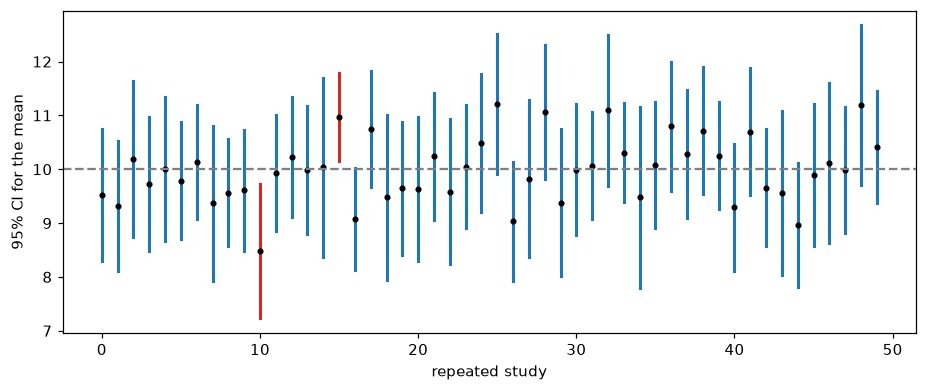
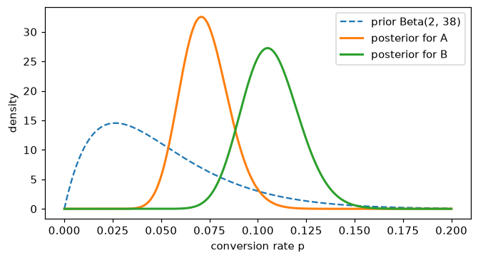

# Statistics

> **Level 1 · Chapter 5** · ⏱️ ~65 min read · Prerequisites: [Probability](04-probability.md)

Probability starts from a known model and predicts data; statistics runs the other way, from data back to the model. This chapter covers descriptive statistics, sampling distributions, estimators and their bias and variance, maximum likelihood estimation, confidence intervals, hypothesis tests and p-values, the t-test, chi-square test, and ANOVA, the bootstrap, multiple testing, and the Bayesian alternative to all of it.

## Why it matters

Sam ran an A/B test of a redesigned checkout page. After two weeks, the dashboard showed 20 metrics: conversion, average order value, time on page, returns, support contacts, and so on. Nineteen showed no significant difference. One, "items per order on mobile", had a p-value of 0.03. The team wrote it up as a win, shipped the redesign, and set a target for the next quarter based on that lift.

The lift never appeared again. It had never been there. If you test 20 metrics where nothing has changed, each at the 5% significance level, the chance that *at least one* comes out "significant" by pure luck is $1 - 0.95^{20} \approx 64\%$. Sam's result was the expected outcome of looking at enough numbers.

Statistics is the discipline of not fooling yourself. It tells you how much an estimate would wobble if you collected the data again, how surprised you should be by a difference, and how to keep your error rate honest when you look at many things at once. Every model evaluation, A/B test, and data-driven claim you make depends on it.

## Concepts

### Descriptive statistics

Before inference comes description: summarizing a dataset $x_1, \dots, x_n$ with a few numbers.

**Center.** The **sample mean** $\bar{x} = \frac{1}{n}\sum_i x_i$ is the balance point. The **median** is the middle value when sorted (the average of the two middle values if $n$ is even). The **mode** is the most frequent value. The mean uses every value's magnitude, so a single extreme value can drag it anywhere; the median only cares about order, so it's **robust** to outliers.

**Spread.** The **sample variance** is

$$
s^2 = \frac{1}{n - 1}\sum_{i=1}^{n}(x_i - \bar{x})^2,
$$

and the **sample standard deviation** is $s = \sqrt{s^2}$. (Why $n - 1$ and not $n$? You'll derive it below.) **Quantiles** split sorted data: the $q$-quantile has a fraction $q$ of the data below it. The 0.25 and 0.75 quantiles are the first and third **quartiles**, and the distance between them is the **interquartile range (IQR)**, a robust measure of spread covering the middle half of the data.

**Shape.** **Skewness** measures asymmetry. Revenue, income, and session length are **right-skewed**: most values are modest, with a long tail of large ones. In right-skewed data the mean is above the median.

```python
import numpy as np
import pandas as pd
from scipy import stats

rng = np.random.default_rng(0)
revenue = rng.lognormal(mean=3.0, sigma=1.0, size=1000)    # right-skewed, like spend per user
revenue_whale = np.append(revenue, 50_000)                 # one huge customer

for name, x in [("typical", revenue), ("with one whale", revenue_whale)]:
    q1, q3 = np.percentile(x, [25, 75])
    print(f"{name:15s} mean {x.mean():8.2f}  median {np.median(x):6.2f}  "
          f"sd {x.std(ddof=1):8.2f}  IQR {q3 - q1:6.2f}  skew {stats.skew(x):6.2f}")
```

```text
typical         mean    30.63  median  18.64  sd    36.64  IQR  27.09  skew   3.87
with one whale  mean    80.55  median  18.65  sd  1579.81  IQR  27.30  skew  31.57
```

One customer out of 1,001 more than doubles the mean and multiplies the standard deviation by about 40, while the median and IQR barely move. When you report a "typical" value of skewed data, report the median, or both.

### Populations, samples, and sampling distributions

A **population** is the full set you care about: all customers, all future transactions. A **parameter** is a number describing it, such as the true mean spend $\mu$. You almost never see the whole population. You see a **sample**, and you compute a **statistic** from it, such as $\bar{x}$, to estimate the parameter.

Here's the central idea of statistics. A statistic is computed from random data, so **a statistic is a random variable**. Draw a different sample and you'd get a different $\bar{x}$. The distribution of a statistic over all the samples you might have drawn is its **sampling distribution**. You only ever see one draw from it, but its spread tells you how much to trust that draw. The standard deviation of a sampling distribution is called the **standard error (SE)**.

From [Probability](04-probability.md), you know the sampling distribution of the mean: centered on $\mu$, with standard error $\sigma/\sqrt{n}$, and approximately normal for large $n$ by the central limit theorem. Other statistics, like the median, have sampling distributions too, often without a neat formula. Simulation shows them:

```python
population = rng.lognormal(3.0, 1.0, size=1_000_000)
mu = population.mean()
n = 100
samples = rng.choice(population, size=(10_000, n))         # 10,000 repeated studies
means = samples.mean(axis=1)
medians = np.median(samples, axis=1)

print(f"population mean {mu:.2f}, sd {population.std():.2f}")
print(f"sampling dist. of the mean:   center {means.mean():.2f}, SE {means.std():.2f}  (sigma/sqrt(n) = {population.std() / np.sqrt(n):.2f})")
print(f"sampling dist. of the median: center {medians.mean():.2f}, SE {medians.std():.2f}")
```

```text
population mean 33.17, sd 43.48
sampling dist. of the mean:   center 33.10, SE 4.33  (sigma/sqrt(n) = 4.35)
sampling dist. of the median: center 20.24, SE 2.53
```

The simulated standard error of the mean matches $\sigma/\sqrt{n}$. Notice that the median estimates a *different* parameter here (the population median, about 20), because the distribution is skewed.

### Estimators: bias, variance, and mean squared error

An **estimator** is a rule for computing an estimate of a parameter $\theta$ from data. We write the estimator as $\hat{\theta}$ ("theta hat"). How good is it? Two properties of its sampling distribution matter:

- **Bias**: $\operatorname{Bias}(\hat{\theta}) = \mathbb{E}[\hat{\theta}] - \theta$. Does it hit the target on average? An estimator with zero bias is **unbiased**.
- **Variance**: $\operatorname{Var}(\hat{\theta})$. How much does it scatter from sample to sample?

Picture shooting at a target. Bias is how far the center of your cluster of shots is from the bullseye; variance is how spread out the cluster is. The overall quality is the **mean squared error**, the expected squared distance from the truth, and it splits exactly into those two parts. Add and subtract $\mathbb{E}[\hat{\theta}]$:

$$
\begin{aligned}
\operatorname{MSE}(\hat{\theta}) = \mathbb{E}\big[(\hat{\theta} - \theta)^2\big]
&= \mathbb{E}\Big[\big((\hat{\theta} - \mathbb{E}[\hat{\theta}]) + (\mathbb{E}[\hat{\theta}] - \theta)\big)^2\Big] \\
&= \underbrace{\mathbb{E}\big[(\hat{\theta} - \mathbb{E}[\hat{\theta}])^2\big]}_{\operatorname{Var}(\hat{\theta})} + 2\,\underbrace{\mathbb{E}\big[\hat{\theta} - \mathbb{E}[\hat{\theta}]\big]}_{0}\,(\mathbb{E}[\hat{\theta}] - \theta) + \underbrace{(\mathbb{E}[\hat{\theta}] - \theta)^2}_{\operatorname{Bias}^2}.
\end{aligned}
$$

So $\operatorname{MSE} = \operatorname{Bias}^2 + \operatorname{Var}$. This is the first appearance of the **bias-variance trade-off**, one of the central ideas of machine learning ([Level 3](../03-ml-fundamentals/index.md)). A slightly biased estimator with much lower variance can have a lower MSE than an unbiased one; that's exactly what regularization does.

An estimator is **consistent** if it converges to the true value as $n \to \infty$. The sample mean is unbiased and consistent.

**Why $n - 1$?** Consider estimating the variance $\sigma^2$ with the "obvious" formula that divides by $n$, $\hat{\sigma}^2_n = \frac{1}{n}\sum_i(x_i - \bar{x})^2$. The problem is that $\bar{x}$ is fitted to the same data, so the data are always a bit closer to $\bar{x}$ than to the true $\mu$. Precisely, using $\sum_i(x_i - \bar{x})^2 = \sum_i(x_i - \mu)^2 - n(\bar{x} - \mu)^2$ (expand and simplify), and taking expectations:

$$
\mathbb{E}\Big[\sum_i(x_i - \bar{x})^2\Big] = n\sigma^2 - n\cdot\frac{\sigma^2}{n} = (n - 1)\,\sigma^2.
$$

The second term used $\operatorname{Var}(\bar{x}) = \sigma^2/n$. So dividing by $n$ underestimates $\sigma^2$ by a factor of $(n-1)/n$, and dividing by $n - 1$ makes it unbiased. This is **Bessel's correction**. One way to think about it: estimating $\bar{x}$ used up one **degree of freedom**, leaving $n - 1$ independent pieces of information about spread.

```python
sigma2 = 4.0
small = rng.normal(0, 2.0, size=(200_000, 5))              # many samples of size n = 5
print(f"mean of var(ddof=0): {small.var(axis=1, ddof=0).mean():.3f}   theory (n-1)/n * 4 = {4 * 4 / 5:.3f}")
print(f"mean of var(ddof=1): {small.var(axis=1, ddof=1).mean():.3f}   theory 4")
```

```text
mean of var(ddof=0): 3.192   theory (n-1)/n * 4 = 3.200
mean of var(ddof=1): 3.990   theory 4
```

!!! warning "Common mistake: ddof defaults differ"
    NumPy's `np.var` and `np.std` divide by $n$ (`ddof=0`) by default. pandas' `.var()` and `.std()` divide by $n - 1$ (`ddof=1`). The same column gives different numbers in the two libraries. For large $n$ it hardly matters; for small samples it does. Be explicit.

### Maximum likelihood estimation

Where do estimators come from? The most important general recipe is **maximum likelihood estimation (MLE)**: choose the parameter values under which the observed data would have been most probable.

Suppose the data $x_1, \dots, x_n$ are i.i.d. from a distribution with PMF or PDF $p(x \mid \theta)$. The **likelihood** is the probability (or density) of the whole dataset, viewed as a function of $\theta$:

$$
L(\theta) = \prod_{i=1}^{n} p(x_i \mid \theta).
$$

The $\prod$ symbol is a product, like $\sum$ for sums. Products of many small numbers underflow to zero in floating point, and they're awkward to differentiate, so we take logs. Since log is increasing, maximizing the **log-likelihood** gives the same answer:

$$
\ell(\theta) = \log L(\theta) = \sum_{i=1}^{n}\log p(x_i \mid \theta), \qquad \hat{\theta}_{\text{MLE}} = \arg\max_{\theta}\,\ell(\theta).
$$

$\arg\max_\theta$ means "the value of $\theta$ that maximizes", as opposed to $\max$, which would be the maximum value itself.

**Example: a conversion rate.** Each of $n$ visitors converts ($x_i = 1$) or not ($x_i = 0$), Bernoulli with unknown $p$. With $k = \sum_i x_i$ conversions,

$$
\ell(p) = \sum_i\big[x_i\log p + (1 - x_i)\log(1 - p)\big] = k\log p + (n - k)\log(1 - p).
$$

Set the derivative to zero: $\frac{k}{p} - \frac{n - k}{1 - p} = 0$, which gives $\hat{p} = k/n$. The MLE is the observed conversion rate, as intuition suggests, but now it comes from a principle that works for any model.

**Example: the normal distribution.** For $x_i \sim \mathcal{N}(\mu, \sigma^2)$,

$$
\ell(\mu, \sigma^2) = -\frac{n}{2}\log(2\pi\sigma^2) - \frac{1}{2\sigma^2}\sum_i(x_i - \mu)^2.
$$

For any $\sigma^2$, maximizing over $\mu$ means *minimizing the sum of squared errors* $\sum_i(x_i - \mu)^2$, which gives $\hat{\mu} = \bar{x}$. Setting the derivative with respect to $\sigma^2$ to zero gives $\hat{\sigma}^2 = \frac{1}{n}\sum_i(x_i - \bar{x})^2$: the biased, divide-by-$n$ version. MLEs are often slightly biased in small samples, but they're consistent and, for large $n$, as precise as any reasonable estimator can be.

That first observation is profound: **least squares is maximum likelihood under normal noise.** If you assume $y_i = \mathbf{w}^\top\mathbf{x}_i + \varepsilon_i$ with normal errors $\varepsilon_i$, maximizing the likelihood over $\mathbf{w}$ is the same as minimizing the squared error. Likewise, the cross-entropy loss of classifiers is a negative log-likelihood, as you'll show in [Information theory and optimization](06-information-theory-and-optimization.md). Most loss functions in ML are negative log-likelihoods in disguise.

When there's no closed form, you maximize the log-likelihood numerically by minimizing its negative:

```python
from scipy.optimize import minimize

wait_times = rng.gamma(shape=2.0, scale=3.0, size=500)      # true shape 2, scale 3

def neg_log_lik(params):
    log_shape, log_scale = params                            # optimize logs to keep both positive
    return -stats.gamma.logpdf(wait_times, a=np.exp(log_shape), scale=np.exp(log_scale)).sum()

res = minimize(neg_log_lik, x0=[0.0, 0.0])
print("MLE by hand:  shape %.3f  scale %.3f" % tuple(np.exp(res.x)))
shape, loc, scale = stats.gamma.fit(wait_times, floc=0)
print("scipy .fit(): shape %.3f  scale %.3f" % (shape, scale))
```

```text
MLE by hand:  shape 1.998  scale 3.055
scipy .fit(): shape 1.998  scale 3.055
```

### Confidence intervals

A point estimate alone hides its uncertainty. A **confidence interval (CI)** gives a range of plausible values. Here's how to build one for a mean.

By the CLT, $\bar{x}$ is approximately $\mathcal{N}(\mu, \sigma^2/n)$, so the standardized quantity $\frac{\bar{x} - \mu}{\sigma/\sqrt{n}}$ is approximately standard normal and lies within $\pm 1.96$ with probability 0.95. Rearrange the inequality to put $\mu$ in the middle:

$$
P\left(\bar{x} - 1.96\frac{\sigma}{\sqrt{n}} \leq \mu \leq \bar{x} + 1.96\frac{\sigma}{\sqrt{n}}\right) \approx 0.95.
$$

In practice you don't know $\sigma$, so you plug in $s$. That adds extra uncertainty, which the **Student's t distribution** accounts for. If the data are normal, $\frac{\bar{x} - \mu}{s/\sqrt{n}}$ follows a t distribution with $n - 1$ degrees of freedom, which looks like a normal with heavier tails; as $n$ grows, it approaches the normal. The 95% **t-interval** is

$$
\bar{x} \pm t_{0.975,\,n-1}\,\frac{s}{\sqrt{n}},
$$

where $t_{0.975,\,n-1}$ is the 97.5th percentile of the t distribution (2.26 for $n = 10$; 1.98 for $n = 100$; approaching 1.96). The general shape is the one to remember: **estimate ± critical value × standard error**.

**What "95% confidence" means** is subtle, and frequently misstated. In this (frequentist) framework, $\mu$ is a fixed number and the *interval* is random. "95%" describes the procedure: if you repeated the study many times, 95% of the intervals you'd compute would contain $\mu$. It does *not* mean "there's a 95% probability that $\mu$ is in this particular interval": once computed, that interval either contains $\mu$ or it doesn't. (The Bayesian approach at the end of the chapter does give that kind of statement.)

```python
import matplotlib.pyplot as plt

true_mu, n, reps = 10.0, 25, 100
data = rng.normal(true_mu, 3.0, size=(reps, n))
xbar, s = data.mean(axis=1), data.std(axis=1, ddof=1)
t_crit = stats.t.ppf(0.975, df=n - 1)
lo, hi = xbar - t_crit * s / np.sqrt(n), xbar + t_crit * s / np.sqrt(n)
covers = (lo <= true_mu) & (true_mu <= hi)

fig, ax = plt.subplots(figsize=(10, 3.8))
for i in range(50):
    ax.plot([i, i], [lo[i], hi[i]], color="tab:blue" if covers[i] else "tab:red", lw=2)
    ax.plot(i, xbar[i], "o", color="black", ms=3)
ax.axhline(true_mu, color="gray", ls="--")
ax.set_xlabel("repeated study"); ax.set_ylabel("95% CI for the mean")
plt.show()

big = rng.normal(true_mu, 3.0, size=(100_000, n))
m, sd = big.mean(axis=1), big.std(axis=1, ddof=1)
half = t_crit * sd / np.sqrt(n)
print(f"t critical value for n={n}: {t_crit:.3f}")
print(f"coverage over 100,000 studies: {np.mean(np.abs(m - true_mu) <= half):.4f}")
```

```text
t critical value for n=25: 2.064
coverage over 100,000 studies: 0.9506
```



*Fifty 95% confidence intervals from fifty repeated studies. Blue intervals contain the true mean (dashed line); red ones miss. In the long run, 5% miss.*

For a **proportion** $\hat{p} = k/n$, the same recipe with the Bernoulli standard error $\sqrt{\hat{p}(1 - \hat{p})/n}$ gives the simple (Wald) interval $\hat{p} \pm 1.96\sqrt{\hat{p}(1-\hat{p})/n}$. It misbehaves for small $n$ or $\hat{p}$ near 0 or 1; the Wilson interval (`statsmodels.stats.proportion.proportion_confint(..., method="wilson")`) is a better default.

### Hypothesis testing and p-values

A **hypothesis test** asks whether the data are consistent with a specific claim. The recipe:

1. State a **null hypothesis** $H_0$, the "nothing interesting is happening" claim, such as "the new checkout has the same conversion rate as the old one". The **alternative hypothesis** $H_1$ is what you suspect instead, such as "the rates differ".
2. Choose a **test statistic** that measures how far the data are from what $H_0$ predicts, and whose distribution under $H_0$ you know.
3. Compute the **p-value**: the probability, *assuming $H_0$ is true*, of getting a test statistic at least as extreme as the one observed.
4. If the p-value is below a pre-chosen **significance level** $\alpha$ (often 0.05), **reject** $H_0$. Otherwise, **fail to reject** it.

A small p-value says: "if nothing were going on, data like these would be rare". That's evidence against $H_0$. Two kinds of error are possible:

| | $H_0$ true | $H_0$ false |
|---|---|---|
| reject $H_0$ | **Type I error** (false positive), probability $\alpha$ | correct; probability = **power** |
| fail to reject | correct | **Type II error** (false negative), probability $\beta$ |

$\alpha$ is the false positive rate you accept. **Power**, $1 - \beta$, is the probability of detecting an effect that's really there; it grows with sample size and effect size. Planning sample sizes to get adequate power is covered in [Experimentation and A/B testing](../02-data-science-workflow/05-experimentation-and-ab-testing.md).

A key fact: when $H_0$ is true (and the test's assumptions hold), **p-values are uniformly distributed** between 0 and 1. That's what makes the rule "reject when $p < \alpha$" have false positive rate exactly $\alpha$.

!!! warning "Common mistake: what a p-value is not"
    - It is **not** the probability that $H_0$ is true. It's computed *assuming* $H_0$ is true. (That's flipping a conditional, as in [Probability](04-probability.md).)
    - It is **not** the probability that your result is a fluke, and $1 - p$ is not the probability your finding will replicate.
    - It does **not** measure the size or importance of an effect. With a million users, a 0.01% lift can have $p < 0.001$ and still be worthless. Always report an effect size with a confidence interval.
    - "Not significant" does **not** mean "no effect". It may mean too little data.

### t-tests

The **t-test** family compares means.

**One-sample t-test.** Is the mean $\mu$ equal to a value $\mu_0$? The statistic is the CI's building block,

$$
t = \frac{\bar{x} - \mu_0}{s/\sqrt{n}},
$$

which has a t distribution with $n - 1$ degrees of freedom under $H_0$. The two-sided p-value is $P(\lvert T \rvert \geq \lvert t \rvert)$.

**Two-sample t-test.** Do two independent groups (A and B) have the same mean? The statistic is the difference in sample means divided by its standard error. Since the groups are independent, variances add:

$$
t = \frac{\bar{x}_A - \bar{x}_B}{\sqrt{\dfrac{s_A^2}{n_A} + \dfrac{s_B^2}{n_B}}}.
$$

This is **Welch's t-test**, which doesn't assume the two groups have equal variances; its degrees of freedom come from a formula (the Welch–Satterthwaite approximation) that SciPy computes for you. Use it by default (`equal_var=False`).

**Paired t-test.** When each measurement in A has a natural partner in B (the same user before and after, the same model on the same dataset fold), compute the differences $d_i = a_i - b_i$ and run a one-sample t-test on them against 0. Pairing removes the variation between subjects and is much more powerful when it applies.

```python
# Two checkout designs: revenue per user (skewed, but n is large enough for the CLT)
rng_ab = np.random.default_rng(16)
a = rng_ab.lognormal(3.0, 1.0, size=2000)
b = rng_ab.lognormal(3.05, 1.0, size=2000)     # B's true mean is about 5% (1.70 USD) higher

t_manual = (b.mean() - a.mean()) / np.sqrt(a.var(ddof=1) / len(a) + b.var(ddof=1) / len(b))
res = stats.ttest_ind(b, a, equal_var=False)
print(f"Welch t by hand {t_manual:.3f}   scipy t {res.statistic:.3f}   p = {res.pvalue:.4f}")
ci = res.confidence_interval(0.95)
print(f"difference in means {b.mean() - a.mean():.2f} USD, 95% CI ({ci.low:.2f}, {ci.high:.2f})")

# Paired: the same 30 users' session length before and after a change
before = rng.normal(10, 3, size=30)
after = before + rng.normal(0.5, 1.0, size=30)
print(f"paired p = {stats.ttest_rel(after, before).pvalue:.4f}   "
      f"(ignoring pairing: p = {stats.ttest_ind(after, before).pvalue:.4f})")
```

```text
Welch t by hand 1.290   scipy t 1.290   p = 0.1971
difference in means 1.69 USD, 95% CI (-0.88, 4.26)
paired p = 0.0009   (ignoring pairing: p = 0.3942)
```

Here B really is better, by about 5%, but with 2,000 users per group and highly variable revenue, the test can't distinguish it from noise: the confidence interval includes zero. That's a power problem, not proof of no effect. The paired example shows the opposite: the same small change is easy to detect when each user is compared with themselves, and invisible when the pairing is thrown away.

### The chi-square test

The **chi-square ($\chi^2$) test of independence** asks whether two categorical variables are related, using a table of counts. Under $H_0$ (independence), the expected count in each cell is

$$
E_{ij} = \frac{(\text{row } i \text{ total}) \times (\text{column } j \text{ total})}{\text{grand total}},
$$

because independence means the joint probability is the product of the marginals. The statistic adds up the squared gaps between observed counts $O_{ij}$ and expected counts, each scaled by the expected count:

$$
\chi^2 = \sum_{i,j}\frac{(O_{ij} - E_{ij})^2}{E_{ij}},
$$

and under $H_0$ it approximately follows a chi-square distribution with $(r - 1)(c - 1)$ degrees of freedom for a table with $r$ rows and $c$ columns. The same statistic, with expected counts from a hypothesized distribution, gives the **goodness-of-fit** test (for example, "is this die fair?"). The approximation needs expected counts of at least about 5 per cell.

```python
# Did the plan type affect churn? Rows: monthly, annual. Columns: churned, stayed.
observed = np.array([[120, 480],
                     [ 20, 380]])
row, col, total = observed.sum(1, keepdims=True), observed.sum(0, keepdims=True), observed.sum()
expected = row * col / total
chi2_manual = ((observed - expected) ** 2 / expected).sum()
chi2, p, dof, exp = stats.chi2_contingency(observed, correction=False)
print(np.round(expected, 1))
print(f"chi2 by hand {chi2_manual:.2f}   scipy {chi2:.2f}   dof {dof}   p = {p:.2e}")
```

```text
[[ 84. 516.]
 [ 56. 344.]]
chi2 by hand 44.85   scipy 44.85   dof 1   p = 2.13e-11
```

(`correction=False` turns off Yates' continuity correction, which SciPy applies to 2×2 tables by default, so the numbers match the textbook formula.)

### ANOVA

What if you have more than two groups, such as three pricing variants? Running all pairwise t-tests inflates false positives (see multiple testing, below). **One-way analysis of variance (ANOVA)** tests $H_0$: "all group means are equal" in one shot.

The idea is to compare two estimates of the noise. If the groups really have the same mean, the variation *between* group means should be about what you'd expect from noise alone; if some means differ, it'll be larger. With $k$ groups, $N$ observations in total, group sizes $n_j$, group means $\bar{x}_j$, and grand mean $\bar{x}$:

$$
F = \frac{\text{between-group mean square}}{\text{within-group mean square}} = \frac{\sum_j n_j(\bar{x}_j - \bar{x})^2 / (k - 1)}{\sum_j\sum_i(x_{ij} - \bar{x}_j)^2 / (N - k)}.
$$

Under $H_0$, $F$ follows an **F distribution** with $(k - 1, N - k)$ degrees of freedom, and large values are evidence against $H_0$. A significant ANOVA says *some* means differ, not which; follow up with corrected pairwise comparisons (such as Tukey's HSD).

```python
groups = [rng.normal(50, 10, 40), rng.normal(52, 10, 40), rng.normal(58, 10, 40)]
allx = np.concatenate(groups)
k, N = len(groups), len(allx)
ss_between = sum(len(g) * (g.mean() - allx.mean()) ** 2 for g in groups)
ss_within = sum(((g - g.mean()) ** 2).sum() for g in groups)
F_manual = (ss_between / (k - 1)) / (ss_within / (N - k))
F, p = stats.f_oneway(*groups)
print(f"F by hand {F_manual:.3f}   scipy F {F:.3f}   p = {p:.2e}")
```

```text
F by hand 7.821   scipy F 7.821   p = 6.49e-04
```

### The bootstrap

Formulas for standard errors exist for means, proportions, and differences of means. What about the median, a ratio of two means, a correlation, or a model's AUC? The **bootstrap** gives a standard error or confidence interval for almost any statistic, with no formula.

The idea is beautifully simple. You'd like to draw many new samples from the population and see how the statistic varies, but you only have one sample. So treat the sample *as if it were the population*: draw many **resamples** of the same size $n$ from it **with replacement** (some points appear twice, some not at all), compute the statistic on each, and use the spread of those values as an estimate of the sampling distribution. The simplest interval, the **percentile bootstrap**, takes the 2.5th and 97.5th percentiles of the bootstrap values.

The bootstrap works when the sample is reasonably representative of the population and the statistic is a smooth function of the data. It struggles with very small samples, with extremes (the maximum of a sample), and with dependent data (resample whole users or time blocks, not individual rows).

```python
x = rng.lognormal(3.0, 1.0, size=200)                  # one sample of revenue
boot = np.array([np.median(rng.choice(x, size=len(x), replace=True)) for _ in range(10_000)])
print(f"sample median {np.median(x):.2f}")
print(f"bootstrap SE {boot.std(ddof=1):.2f}   95% percentile CI ({np.percentile(boot, 2.5):.2f}, {np.percentile(boot, 97.5):.2f})")

res = stats.bootstrap((x,), np.median, confidence_level=0.95, n_resamples=10_000,
                      method="percentile", random_state=0)
print(f"scipy.stats.bootstrap CI ({res.confidence_interval.low:.2f}, {res.confidence_interval.high:.2f})")
```

```text
sample median 21.56
bootstrap SE 1.87   95% percentile CI (18.02, 24.66)
scipy.stats.bootstrap CI (18.02, 24.66)
```

SciPy's default method, BCa ("bias-corrected and accelerated"), adjusts the percentiles for bias and skew and is usually more accurate than the plain percentile method.

### Multiple testing

Back to Sam's 20 metrics. If you run $m$ independent tests at level $\alpha$ when every null hypothesis is true, the probability of at least one false positive, the **family-wise error rate (FWER)**, is

$$
1 - (1 - \alpha)^m,
$$

which is about 64% for $m = 20$ and $\alpha = 0.05$. Two standard corrections:

- **Bonferroni:** test each hypothesis at $\alpha/m$. Since the probability of a union is at most the sum of the probabilities, $P(\text{any false positive}) \leq m \cdot \alpha/m = \alpha$. Simple and safe, but it loses a lot of power when $m$ is large.
- **Benjamini–Hochberg (BH):** controls the **false discovery rate (FDR)**, the expected fraction of false positives *among the results you call significant*, which is often what you actually care about. Sort the p-values $p_{(1)} \leq \dots \leq p_{(m)}$, find the largest $k$ with $p_{(k)} \leq \frac{k}{m}\alpha$, and reject the hypotheses with the $k$ smallest p-values. It's far more powerful than Bonferroni when there are many tests and some real effects.

Multiple testing hides in many forms: many metrics, many segments ("it worked for Android users in Canada"), many model variants, and checking an A/B test every day and stopping when it looks significant ("peeking"). The fix is to decide in advance what you'll test, and to correct for what you actually tested.

```python
from statsmodels.stats.multitest import multipletests

n_sims, m = 10_000, 20
p_null = rng.uniform(size=(n_sims, m))                   # p-values are uniform under H0
print(f"P(at least one p < 0.05): sim {np.mean((p_null < 0.05).any(axis=1)):.3f}   formula {1 - 0.95 ** 20:.3f}")
print(f"with Bonferroni:          sim {np.mean((p_null < 0.05 / m).any(axis=1)):.3f}")

# 20 metrics: 3 with real effects, 17 null
z = np.concatenate([rng.normal(3.5, 1, 3), rng.normal(0, 1, 17)])
pvals = 2 * stats.norm.sf(np.abs(z))
for method in ["bonferroni", "fdr_bh"]:
    reject = multipletests(pvals, alpha=0.05, method=method)[0]
    print(f"{method:10s} rejects {reject.sum()} (true effects among them: {reject[:3].sum()})")
print("uncorrected rejects", (pvals < 0.05).sum())
```

```text
P(at least one p < 0.05): sim 0.648   formula 0.642
with Bonferroni:          sim 0.051
bonferroni rejects 3 (true effects among them: 2)
fdr_bh     rejects 4 (true effects among them: 3)
uncorrected rejects 4
```

The first two lines confirm the formula and show Bonferroni holding the family-wise error rate at 5%. In the second experiment, BH finds all three real effects, while Bonferroni misses one. Notice that one null metric was extreme enough to pass every method: corrections keep error *rates* under control, they don't make individual errors impossible. That's why surprising findings need confirmation on fresh data.

### Bayesian versus frequentist thinking

Everything so far is **frequentist**: parameters are fixed but unknown, probability describes the long-run behavior of procedures, and you get p-values and confidence intervals. **Bayesian** statistics treats the unknown parameter itself as a random variable, describing your uncertainty about it, and uses Bayes' theorem to update that uncertainty with data:

$$
\underbrace{p(\theta \mid \text{data})}_{\text{posterior}} \propto \underbrace{p(\text{data} \mid \theta)}_{\text{likelihood}}\;\underbrace{p(\theta)}_{\text{prior}}.
$$

The $\propto$ means "proportional to": the evidence $p(\text{data})$ in the denominator is just the constant that makes the posterior integrate to 1.

**A conversion rate, the Bayesian way.** Put a prior on the conversion rate $p$. A convenient choice is the **Beta distribution**, $\text{Beta}(a, b)$, a distribution on $[0, 1]$ with density proportional to $p^{a-1}(1-p)^{b-1}$ and mean $\frac{a}{a+b}$. Think of $a$ and $b$ as "prior conversions and non-conversions". After observing $k$ conversions in $n$ visits, the Bernoulli likelihood is $p^k(1-p)^{n-k}$, and multiplying:

$$
p(p \mid \text{data}) \propto p^{k}(1 - p)^{n-k}\cdot p^{a-1}(1-p)^{b-1} = p^{a + k - 1}(1 - p)^{b + n - k - 1}.
$$

That's another Beta: the posterior is $\text{Beta}(a + k,\ b + n - k)$. You literally add the observed successes and failures to the prior counts. (A prior that gives a posterior in the same family is called **conjugate**.) A 95% **credible interval** is the middle 95% of the posterior, and it *does* mean "given the model and prior, there's a 95% probability that $p$ is in this range".

You can also answer questions frequentist tools can't answer directly, such as "what's the probability B is better than A?", by sampling from both posteriors and counting.

```python
a0, b0 = 2, 38                         # prior: about 5% conversion, worth 40 visits of evidence
k, n_vis = 30, 400                     # data: 30 conversions in 400 visits (7.5%)
prior = stats.beta(a0, b0)
post = stats.beta(a0 + k, b0 + n_vis - k)

grid = np.linspace(0, 0.2, 2001)       # check the conjugate result with brute force on a grid
unnorm = stats.binom.pmf(k, n_vis, grid) * prior.pdf(grid)
grid_post = unnorm / (unnorm.sum() * (grid[1] - grid[0]))
print(f"conjugate posterior matches grid: {np.allclose(grid_post, post.pdf(grid), atol=1e-3)}")
print(f"MLE {k / n_vis:.4f}   posterior mean {post.mean():.4f}")
print(f"95% credible interval ({post.ppf(0.025):.4f}, {post.ppf(0.975):.4f})")

post_B = stats.beta(a0 + 45, b0 + 400 - 45)       # variant B: 45 of 400
draws_A = post.rvs(100_000, random_state=1)
draws_B = post_B.rvs(100_000, random_state=2)
print(f"P(B better than A) = {np.mean(draws_B > draws_A):.3f}")

fig, ax = plt.subplots(figsize=(7, 3.5))
ax.plot(grid, prior.pdf(grid), label="prior Beta(2, 38)", ls="--")
ax.plot(grid, post.pdf(grid), label="posterior for A", lw=2)
ax.plot(grid, post_B.pdf(grid), label="posterior for B", lw=2)
ax.set_xlabel("conversion rate p"); ax.set_ylabel("density"); ax.legend()
plt.show()
```

```text
conjugate posterior matches grid: True
MLE 0.0750   posterior mean 0.0727
95% credible interval (0.0504, 0.0987)
P(B better than A) = 0.963
```



*Bayesian updating for a conversion rate. The prior (dashed) is broad; 400 visits of data produce much narrower posteriors for A and B.*

The posterior mean, 0.0727, sits between the prior mean (0.05) and the data's MLE (0.075), pulled toward the prior by its 40 "pseudo-visits". With more data, the likelihood dominates and the prior matters less. That pull is called **shrinkage**, and it's a feature: it tames estimates from small samples. (It's also the Bayesian view of regularization: L2 regularization corresponds to a normal prior on the weights.)

| | Frequentist | Bayesian |
|---|---|---|
| Parameters | fixed, unknown | random variables with a distribution |
| Probability means | long-run frequency | degree of belief |
| Prior knowledge | not used formally | encoded in the prior |
| Interval | confidence interval: 95% of such intervals cover the truth | credible interval: 95% probability the parameter is inside |
| Answers | "how surprising are the data if $H_0$ holds?" | "how probable is each hypothesis, given the data?" |
| Cost | cheap, standard formulas | needs a prior; often needs sampling algorithms (MCMC) |

Neither is "right". In practice, with plenty of data and weak priors, they usually give similar numbers. Frequentist methods dominate A/B testing and classical statistics software; Bayesian methods shine with small data, hierarchical structure (many related groups), and decisions that need probabilities of hypotheses.

## In practice

### Which test should I use?

| Question | Data | Test | SciPy / statsmodels |
|---|---|---|---|
| Is the mean equal to a value? | one numeric sample | one-sample t-test | `stats.ttest_1samp` |
| Do two groups have the same mean? | two independent numeric samples | Welch's t-test | `stats.ttest_ind(a, b, equal_var=False)` |
| Did a change shift paired measurements? | before/after on the same units | paired t-test | `stats.ttest_rel` |
| Do two groups differ, without assuming normality? | two samples, skewed or ordinal | Mann–Whitney U | `stats.mannwhitneyu` |
| Do 3+ groups have the same mean? | several numeric samples | one-way ANOVA | `stats.f_oneway` |
| Are two categorical variables related? | contingency table | chi-square test | `stats.chi2_contingency` |
| Do two conversion rates differ? | successes and trials per group | two-proportion z-test | `statsmodels.stats.proportion.proportions_ztest` |
| CI for a weird statistic? | any sample | bootstrap | `stats.bootstrap` |

### A two-proportion test, three ways

Variant A converts 30 of 400 visitors and B converts 45 of 400. Is the difference real? Here's the classical z-test by hand, the statsmodels version, and the equivalent chi-square test:

```python
from statsmodels.stats.proportion import proportions_ztest

k = np.array([45, 30]); n_ab = np.array([400, 400])
p_pool = k.sum() / n_ab.sum()                            # under H0 both rates are equal
se = np.sqrt(p_pool * (1 - p_pool) * (1 / n_ab[0] + 1 / n_ab[1]))
z = (k[0] / n_ab[0] - k[1] / n_ab[1]) / se
print(f"by hand:     z = {z:.3f}   p = {2 * stats.norm.sf(abs(z)):.4f}")
z_sm, p_sm = proportions_ztest(k, n_ab)
print(f"statsmodels: z = {z_sm:.3f}   p = {p_sm:.4f}")
chi2, p_chi, _, _ = stats.chi2_contingency(np.array([k, n_ab - k]).T, correction=False)
print(f"chi-square:  chi2 = {chi2:.3f} (= z^2 = {z ** 2:.3f})   p = {p_chi:.4f}")
```

```text
by hand:     z = 1.819   p = 0.0688
statsmodels: z = 1.819   p = 0.0688
chi-square:  chi2 = 3.310 (= z^2 = 3.310)   p = 0.0688
```

The three agree exactly: for a 2×2 table, the chi-square statistic is the square of the z statistic. Notice the contrast with the Bayesian analysis above, which found a 96% posterior probability that B is better. The p-value of 0.069 isn't "significant" at 0.05. These answer different questions, and neither says the effect is large enough to matter. Report the estimated lift with its interval, and decide based on the cost of being wrong.

!!! warning "Common mistake: peeking"
    Checking an A/B test every day and stopping the first time $p < 0.05$ inflates the false positive rate far above 5%, because you're running many tests and keeping the luckiest. Fix the sample size in advance (from a power analysis), or use methods designed for continuous monitoring (sequential tests). [Experimentation and A/B testing](../02-data-science-workflow/05-experimentation-and-ab-testing.md) covers both.

## Exercises

### Exercise 1: Summaries by hand (easy)

For the data $2, 4, 4, 5, 7, 9, 40$, compute by hand the mean, median, and sample standard deviation. Then drop the 40 and recompute. Which summaries changed the most, and why? Check with NumPy.

??? success "Solution"

    With 40: mean $71/7 \approx 10.14$, median 5. Without it: mean $31/6 \approx 5.17$, median 4.5. The squared deviations from 10.14 are dominated by $(40 - 10.14)^2 \approx 891.4$, so the standard deviation is about 13.4 with the outlier and about 2.5 without. The mean and SD change dramatically; the median barely moves, because it depends only on the order of values, not their size.

    ```python
    import numpy as np

    x = np.array([2, 4, 4, 5, 7, 9, 40.0])
    for d in (x, x[:-1]):
        print(round(d.mean(), 2), np.median(d), round(d.std(ddof=1), 2))
    ```

    ```text
    10.14 5.0 13.36
    5.17 4.5 2.48
    ```

### Exercise 2: MLE for the exponential (medium)

Waiting times $x_1, \dots, x_n$ are modeled as exponential with rate $\lambda$, density $\lambda e^{-\lambda x}$. Derive the MLE $\hat{\lambda}$. Then check it numerically by minimizing the negative log-likelihood on simulated data with true $\lambda = 0.25$.

??? success "Solution"

    $\ell(\lambda) = \sum_i(\log\lambda - \lambda x_i) = n\log\lambda - \lambda\sum_i x_i$. Setting $\ell'(\lambda) = \frac{n}{\lambda} - \sum_i x_i = 0$ gives $\hat{\lambda} = \frac{n}{\sum_i x_i} = \frac{1}{\bar{x}}$. ($\ell''(\lambda) = -n/\lambda^2 < 0$, so it's a maximum.)

    ```python
    from scipy.optimize import minimize_scalar

    rng = np.random.default_rng(0)
    x = rng.exponential(scale=1 / 0.25, size=1000)
    nll = lambda lam: -(len(x) * np.log(lam) - lam * x.sum())
    res = minimize_scalar(nll, bounds=(1e-6, 10), method="bounded")
    print(round(res.x, 4), round(1 / x.mean(), 4))
    ```

    ```text
    0.2446 0.2446
    ```

### Exercise 3: When does the t-interval lie? (medium)

The t-interval assumes normal data, or a large enough $n$ for the CLT. Estimate by simulation the actual coverage of the nominal 95% t-interval for the mean of an exponential distribution (true mean 1) with $n = 5, 20, 100$. What do you conclude?

??? success "Solution"

    ```python
    from scipy import stats

    for n in [5, 20, 100]:
        x = rng.exponential(1.0, size=(50_000, n))
        m, s = x.mean(axis=1), x.std(axis=1, ddof=1)
        half = stats.t.ppf(0.975, n - 1) * s / np.sqrt(n)
        print(n, round(np.mean(np.abs(m - 1.0) <= half), 4))
    ```

    ```text
    5 0.8826
    20 0.9193
    100 0.9406
    ```

    With skewed data and small $n$, the "95%" interval covers the truth noticeably less often than promised. Coverage improves as $n$ grows, as the CLT predicts, but even at $n = 100$ it's slightly short. For small, skewed samples, use a bootstrap interval (BCa), transform the data (for example, take logs), or at least report the caveat.

### Exercise 4: Chi-square by hand (medium)

A survey asks 200 users on two platforms whether they'd recommend the product:

| | yes | no |
|---|---|---|
| iOS | 70 | 30 |
| Android | 55 | 45 |

Compute the expected counts under independence, the $\chi^2$ statistic, and the p-value (1 degree of freedom) by hand, then check with SciPy.

??? success "Solution"

    Row totals are 100 and 100; column totals are 125 and 75; the grand total is 200. Expected counts: $100 \times 125/200 = 62.5$ for "yes" and $37.5$ for "no" in each row. Then

    $$
    \chi^2 = \frac{7.5^2}{62.5} + \frac{7.5^2}{37.5} + \frac{7.5^2}{62.5} + \frac{7.5^2}{37.5} = 0.9 + 1.5 + 0.9 + 1.5 = 4.8.
    $$

    ```python
    obs = np.array([[70, 30], [55, 45]])
    chi2, p, dof, expected = stats.chi2_contingency(obs, correction=False)
    print(expected)
    print(round(chi2, 3), round(p, 4), round(stats.chi2(1).sf(4.8), 4))
    ```

    ```text
    [[62.5 37.5]
     [62.5 37.5]]
    4.8 0.0285 0.0285
    ```

    $p \approx 0.029$, so at $\alpha = 0.05$ you'd conclude the recommendation rate differs by platform (70% versus 55%).

### Exercise 5: Bootstrap a ratio (hard)

An online store's key metric is revenue per session, the ratio $\sum \text{revenue} / \sum \text{sessions}$ across users. Simulate 500 users, each with a Poisson(3) number of sessions and revenue equal to their sessions times a lognormal(2, 1) amount. Compute the ratio, then a 95% bootstrap confidence interval by resampling **users** (not sessions). Compare your percentile interval with `scipy.stats.bootstrap` using the BCa method. Why must you resample users?

??? success "Solution"

    ```python
    rng = np.random.default_rng(42)
    sessions = rng.poisson(3, 500)
    revenue = sessions * rng.lognormal(2.0, 1.0, 500)
    ratio = revenue.sum() / sessions.sum()

    idx = rng.integers(0, 500, size=(10_000, 500))           # resample users, keeping pairs together
    boot = revenue[idx].sum(axis=1) / sessions[idx].sum(axis=1)
    print(f"ratio {ratio:.2f}   percentile CI ({np.percentile(boot, 2.5):.2f}, {np.percentile(boot, 97.5):.2f})")

    res = stats.bootstrap((revenue, sessions), lambda r, s: r.sum() / s.sum(), paired=True,
                          vectorized=False, n_resamples=5_000, method="BCa", random_state=0)
    print(f"BCa CI ({res.confidence_interval.low:.2f}, {res.confidence_interval.high:.2f})")
    ```

    ```text
    ratio 11.69   percentile CI (10.37, 13.15)
    BCa CI (10.51, 13.29)
    ```

    A user's sessions and revenue are linked (and a user's sessions are correlated with each other), so the independent unit is the user. Resampling individual sessions would treat correlated observations as independent and give an interval that's too narrow. The general rule: **resample at the level at which the data were randomly sampled.**

### Exercise 6: Benjamini–Hochberg by hand (medium)

Ten tests give p-values 0.001, 0.008, 0.012, 0.030, 0.041, 0.090, 0.200, 0.350, 0.600, 0.900. At $\alpha = 0.05$, which hypotheses are rejected (a) without correction, (b) with Bonferroni, and (c) with Benjamini–Hochberg? Check with statsmodels.

??? success "Solution"

    (a) The five p-values below 0.05.

    (b) Bonferroni threshold $0.05/10 = 0.005$: only 0.001.

    (c) BH thresholds $\frac{k}{10}\times 0.05$ are $0.005, 0.010, 0.015, 0.020, 0.025, \dots$ Compare the sorted p-values: $0.001 \leq 0.005$ ✓, $0.008 \leq 0.010$ ✓, $0.012 \leq 0.015$ ✓, $0.030 > 0.020$, $0.041 > 0.025$, and none of the later ones pass. The largest $k$ that passes is 3, so reject the three smallest.

    ```python
    from statsmodels.stats.multitest import multipletests

    p = np.array([0.001, 0.008, 0.012, 0.030, 0.041, 0.090, 0.200, 0.350, 0.600, 0.900])
    print((p < 0.05).sum(),
          multipletests(p, 0.05, "bonferroni")[0].sum(),
          multipletests(p, 0.05, "fdr_bh")[0].sum())
    ```

    ```text
    5 1 3
    ```

## Check yourself

1. Why is the median preferred over the mean for summarizing revenue per user?

    ??? note "Answer"

        Revenue is right-skewed with extreme values. The mean is pulled toward the tail by a few large values; the median depends only on order, so it's robust and better describes a typical user. (The mean still matters for totals, so report both.)

2. What is a sampling distribution, and what is a standard error?

    ??? note "Answer"

        The distribution of a statistic across all the samples you might have drawn. The standard error is its standard deviation: how much the statistic would vary from study to study.

3. Show that MSE = bias² + variance, in words.

    ??? note "Answer"

        Split the estimator's error into its deviation from its own average (variance) and the gap between its average and the truth (bias). The cross term has expectation zero, so the expected squared error is the variance plus the squared bias.

4. Why does the sample variance divide by $n - 1$?

    ??? note "Answer"

        Deviations are measured from $\bar{x}$, which is fitted to the same data, so they're systematically smaller than deviations from the true mean. On average the sum of squared deviations is $(n - 1)\sigma^2$, so dividing by $n - 1$ gives an unbiased estimate.

5. What's the connection between least squares and maximum likelihood?

    ??? note "Answer"

        If the errors are independent and normal with constant variance, the log-likelihood is a constant minus the sum of squared errors over $2\sigma^2$. Maximizing the likelihood is then the same as minimizing squared error.

6. What does a 95% confidence interval mean?

    ??? note "Answer"

        It comes from a procedure that, over many repeated samples, produces intervals containing the true parameter 95% of the time. It doesn't say there's a 95% probability that the parameter lies in this particular interval (that's a Bayesian credible interval).

7. Define a p-value, and name two things it is not.

    ??? note "Answer"

        The probability, assuming the null hypothesis is true, of a test statistic at least as extreme as the one observed. It's not the probability that the null is true, and it's not a measure of effect size or importance.

8. You test 50 features for association with churn and find 3 with $p < 0.05$. What should you do?

    ??? note "Answer"

        Expect about 2.5 false positives even if no feature matters. Apply a correction (Benjamini–Hochberg for discovery, Bonferroni if any false positive is costly), look at effect sizes, and confirm on fresh data before acting.

## Key takeaways

- Describe before you infer. For skewed data, the median and IQR are more robust than the mean and standard deviation.
- A statistic is a random variable. Its sampling distribution and standard error say how far to trust it.
- MSE = bias² + variance. Unbiasedness isn't everything; a little bias can buy a lot of variance reduction.
- Maximum likelihood is the general recipe for estimators, and least squares is MLE under normal noise.
- Confidence intervals take the form estimate ± critical value × standard error, and "95%" describes the procedure, not the interval.
- A p-value measures surprise under the null, not the probability the null is true. Report effect sizes with intervals, and correct for multiple testing.
- The bootstrap gives intervals for almost any statistic; resample the independent units. Bayesian methods give direct probability statements about parameters at the cost of choosing a prior.

## Further reading

- *All of Statistics* by Larry Wasserman (Springer, 2004). Compact and rigorous, written for people heading into machine learning.
- *Statistical Inference* by George Casella and Roger L. Berger, the standard graduate text for estimators, MLE, and tests.
- *An Introduction to the Bootstrap* by Bradley Efron and Robert Tibshirani (Chapman & Hall, 1993).
- "Controlling the False Discovery Rate: A Practical and Powerful Approach to Multiple Testing" by Yoav Benjamini and Yosef Hochberg, *Journal of the Royal Statistical Society, Series B* (1995).
- "The ASA Statement on p-Values: Context, Process, and Purpose" by Ronald L. Wasserstein and Nicole A. Lazar, *The American Statistician* (2016).

## Next

See why loss functions look the way they do, and how to minimize them: [Information theory and optimization](06-information-theory-and-optimization.md).
