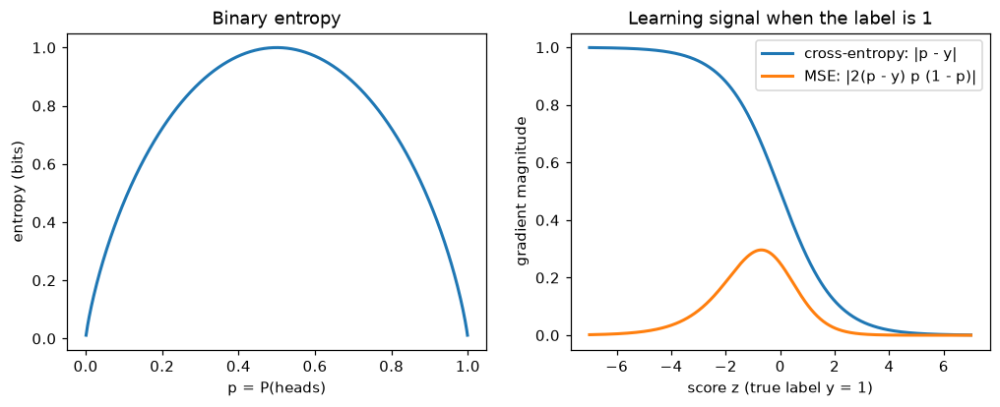
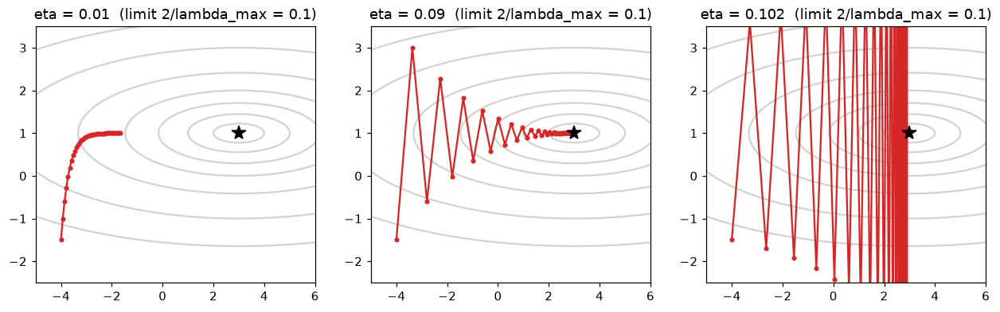

# Information Theory and Optimization

> **Level 1 · Chapter 6** · ⏱️ ~55 min read · Prerequisites: [Calculus and gradients](03-calculus-and-gradients.md), [Probability](04-probability.md), [Statistics](05-statistics.md)

This chapter ties the level together. Information theory explains where machine learning's loss functions come from; optimization explains how to minimize them. You'll learn entropy, cross-entropy, and KL divergence, prove that minimizing cross-entropy is maximum likelihood, see loss functions as objectives with a probabilistic meaning, analyze gradient descent, learn what makes convex problems easy, and solve constrained problems with Lagrange multipliers.

## Why it matters

Priya built a binary classifier, a linear score passed through a sigmoid to produce a probability, and trained it with mean squared error between the predicted probability and the 0/1 label. It seemed natural: MSE was the loss Priya knew from regression. Training stalled. A chunk of the training set was stuck at predicted probabilities near 0.001 for examples whose true label was 1, and the model wasn't fixing them, no matter how long it trained.

The culprit was the gradient. With MSE on a sigmoid output, the gradient with respect to the score contains the factor $\sigma'(z) = \sigma(z)(1 - \sigma(z))$, which is nearly zero when the model is confidently wrong. The worst mistakes produced the weakest learning signal. Switching to **cross-entropy** loss, the standard choice, cancels that factor exactly: the gradient becomes simply "prediction minus label", largest precisely when the model is most wrong.

That isn't a lucky trick. Cross-entropy is the negative log-likelihood of a Bernoulli model, so minimizing it is maximum likelihood estimation, and it measures, in a precise information-theoretic sense, how badly the model's probabilities encode reality. Understanding *why* each loss function has the form it does, and how gradient descent behaves on it, is what lets you design, debug, and tune models instead of copying recipes.

## Concepts

### Information as surprise

Claude Shannon founded information theory in 1948 with a simple question: how much information does learning the outcome of a random event give you? His answer: the more surprising the outcome, the more information. Learning that the sun rose this morning tells you almost nothing; learning that a 1-in-a-million event happened tells you a lot.

The **information content** (or **surprisal**) of an outcome with probability $p$ is

$$
I(p) = -\log p = \log\frac{1}{p}.
$$

Why a logarithm? Two requirements pin it down. Certain events ($p = 1$) carry no information, and $-\log 1 = 0$. And the information from two *independent* events should add: learning two independent facts tells you the sum of what each tells you. Independent probabilities multiply, $p_1 p_2$, and logarithms turn products into sums, $-\log(p_1 p_2) = -\log p_1 - \log p_2$. The logarithm is essentially the only function with that property.

The base of the log sets the unit. With $\log_2$, information is measured in **bits**: a fair coin flip ($p = 1/2$) carries exactly 1 bit. With the natural log $\ln$, the unit is the **nat**. Machine learning libraries use natural logs, so losses are in nats; $1 \text{ nat} = 1/\ln 2 \approx 1.44$ bits. In this chapter, $\log$ means natural log unless a base is shown.

### Entropy

The **entropy** of a discrete distribution $p$ is the expected surprisal, the average information per outcome:

$$
H(p) = \mathbb{E}_{x \sim p}\big[-\log p(x)\big] = -\sum_x p(x)\log p(x).
$$

(Terms with $p(x) = 0$ contribute 0, since $p\log p \to 0$ as $p \to 0$.) The notation $\mathbb{E}_{x \sim p}$ means "the expectation when $x$ is drawn from $p$". Entropy measures uncertainty:

- A certain outcome has $H = 0$: nothing to learn.
- Among distributions over $k$ outcomes, the **uniform** distribution has the highest entropy, $\log k$. You'll prove this with Lagrange multipliers later in this chapter.
- A fair coin has 1 bit of entropy. A coin that lands heads 90% of the time has about 0.47 bits: it's more predictable.

Entropy has a concrete meaning: **it's the minimum average number of bits needed to encode outcomes from $p$** (Shannon's source coding theorem). The trick is to give frequent outcomes short codes and rare ones long codes, ideally $-\log_2 p(x)$ bits each. Suppose a weather station reports sun, cloud, rain, or snow with probabilities $\frac12, \frac14, \frac18, \frac18$. The codes `0`, `10`, `110`, `111` have lengths 1, 2, 3, 3, which are exactly $-\log_2$ of the probabilities, and no code word is a prefix of another, so a stream of them can be decoded unambiguously. The average length is $\frac12(1) + \frac14(2) + \frac18(3) + \frac18(3) = 1.75$ bits, equal to the entropy. A naive fixed-length code would need 2 bits.

```python
import numpy as np
from scipy import stats

def entropy(p, base=np.e):
    p = np.asarray(p, dtype=float)
    nz = p > 0
    return float(-np.sum(p[nz] * np.log(p[nz])) / np.log(base)) + 0.0   # + 0.0 turns -0.0 into 0.0

weather = [1/2, 1/4, 1/8, 1/8]
print(f"weather: {entropy(weather, 2):.3f} bits   scipy: {stats.entropy(weather, base=2):.3f}")
print(f"fair coin {entropy([0.5, 0.5], 2):.3f} bits   90/10 coin {entropy([0.9, 0.1], 2):.3f} bits")
print(f"uniform over 6: {entropy(np.ones(6) / 6):.4f} nats = log 6 = {np.log(6):.4f}")
print(f"certain outcome: {entropy([1.0, 0.0, 0.0]):.1f}")
```

```text
weather: 1.750 bits   scipy: 1.750
fair coin 1.000 bits   90/10 coin 0.469 bits
uniform over 6: 1.7918 nats = log 6 = 1.7918
certain outcome: 0.0
```

### Cross-entropy

Now suppose the data come from $p$, but you built your code (or your model) for a different distribution $q$. Each outcome $x$ costs $-\log q(x)$, and on average you pay the **cross-entropy**:

$$
H(p, q) = \mathbb{E}_{x \sim p}\big[-\log q(x)\big] = -\sum_x p(x)\log q(x).
$$

If your weather code assumed all four outcomes were equally likely ($q$ uniform, 2 bits each), the cross-entropy would be 2 bits, a quarter of a bit per report wasted. Using the wrong distribution always costs extra: **$H(p, q) \geq H(p)$, with equality only when $q = p$** (proved in the next section). That makes cross-entropy a natural measure of how well $q$ models $p$, and exactly what you want for training a model $q$ to match data from $p$.

### KL divergence

The extra cost of using $q$ instead of $p$ is the **Kullback–Leibler (KL) divergence**:

$$
D_{\text{KL}}(p \,\|\, q) = H(p, q) - H(p) = \sum_x p(x)\log\frac{p(x)}{q(x)}.
$$

It measures how different $q$ is from $p$, from $p$'s point of view. Two properties matter.

**It's never negative** (this is **Gibbs' inequality**). The proof uses the fact that $\log$ is concave, so $\log t \leq t - 1$ for all $t > 0$ (the curve lies below its tangent line at $t = 1$). Apply it with $t = q(x)/p(x)$:

$$
-D_{\text{KL}}(p \,\|\, q) = \sum_x p(x)\log\frac{q(x)}{p(x)} \leq \sum_x p(x)\left(\frac{q(x)}{p(x)} - 1\right) = \sum_x q(x) - \sum_x p(x) \leq 1 - 1 = 0.
$$

(The sums run over $x$ with $p(x) > 0$, so $\sum q(x)$ over those $x$ is at most 1.) Equality needs $q(x)/p(x) = 1$ everywhere, so $D_{\text{KL}} = 0$ exactly when $q = p$. That also proves $H(p, q) \geq H(p)$.

**It isn't symmetric**: $D_{\text{KL}}(p \,\|\, q) \neq D_{\text{KL}}(q \,\|\, p)$ in general, so it's not a true distance. The asymmetry has teeth. $D_{\text{KL}}(p \,\|\, q)$ is infinite if $q$ gives zero probability to something $p$ says can happen: a model that declares a real outcome impossible pays an infinite price when it happens. That's why classifiers should never output probabilities of exactly 0 or 1.

KL divergence appears all over ML: in variational autoencoders, in knowledge distillation (matching a small model's predictions to a large one's), in reinforcement learning from human feedback (keeping a fine-tuned language model close to the original), and in measuring drift between training and production data.

For continuous distributions, sums become integrals. Between two normal distributions it has a closed form, which you can check by Monte Carlo, estimating the expectation $\mathbb{E}_{x \sim p}[\log p(x) - \log q(x)]$ as an average over samples:

$$
D_{\text{KL}}\big(\mathcal{N}(\mu_1, \sigma_1^2) \,\|\, \mathcal{N}(\mu_2, \sigma_2^2)\big) = \log\frac{\sigma_2}{\sigma_1} + \frac{\sigma_1^2 + (\mu_1 - \mu_2)^2}{2\sigma_2^2} - \frac{1}{2}.
$$

```python
def kl(p, q):
    p, q = np.asarray(p, float), np.asarray(q, float)
    nz = p > 0
    return np.sum(p[nz] * np.log(p[nz] / q[nz]))

p = np.array([0.5, 0.25, 0.125, 0.125])             # the weather distribution
q = np.array([0.25, 0.25, 0.25, 0.25])              # the naive uniform code
cross = -np.sum(p * np.log2(q))
print(f"H(p,q) = {cross:.3f} bits   H(p) = {entropy(p, 2):.3f} bits   KL = {kl(p, q) / np.log(2):.3f} bits")
print(f"scipy KL: {stats.entropy(p, q, base=2):.3f} bits")
r = np.array([0.1, 0.1, 0.4, 0.4])
print(f"KL(p||r) = {kl(p, r):.4f}   KL(r||p) = {kl(r, p):.4f}   (not symmetric)")

rng = np.random.default_rng(0)
m1, s1, m2, s2 = 0.0, 1.0, 1.0, 2.0
x = rng.normal(m1, s1, 1_000_000)
mc = np.mean(stats.norm(m1, s1).logpdf(x) - stats.norm(m2, s2).logpdf(x))
closed = np.log(s2 / s1) + (s1 ** 2 + (m1 - m2) ** 2) / (2 * s2 ** 2) - 0.5
print(f"Gaussian KL: closed form {closed:.4f}   Monte Carlo {mc:.4f}")
```

```text
H(p,q) = 2.000 bits   H(p) = 1.750 bits   KL = 0.250 bits
scipy KL: 0.250 bits
KL(p||r) = 0.7430   KL(r||p) = 0.6779   (not symmetric)
Gaussian KL: closed form 0.4431   Monte Carlo 0.4424
```

### Minimizing cross-entropy is maximum likelihood

Here's the most important result in the chapter. Take a classification dataset of $n$ examples with labels $y_i$, and a model that outputs a probability distribution over classes, $q_\theta(y \mid \mathbf{x})$, with parameters $\theta$. The model's **negative log-likelihood (NLL)**, averaged over the data, is

$$
\text{NLL}(\theta) = -\frac{1}{n}\sum_{i=1}^{n}\log q_\theta(y_i \mid \mathbf{x}_i).
$$

Maximum likelihood ([Statistics](05-statistics.md)) chooses $\theta$ to minimize it. Now write each label as a distribution: the **one-hot** distribution $p_i$ that puts probability 1 on the true class $y_i$ and 0 elsewhere. The cross-entropy between that label distribution and the model's prediction is

$$
H(p_i, q_\theta(\cdot \mid \mathbf{x}_i)) = -\sum_{c} p_i(c)\log q_\theta(c \mid \mathbf{x}_i) = -\log q_\theta(y_i \mid \mathbf{x}_i),
$$

because only the true class has $p_i(c) \neq 0$. Averaging over the dataset, **the average cross-entropy loss is exactly the negative log-likelihood**. Minimizing one is minimizing the other.

There's a second, deeper way to see it. Let $\hat{p}$ be the **empirical distribution** of the data (each training example gets probability $1/n$). Then

$$
\text{NLL}(\theta) = H(\hat{p}, q_\theta) = H(\hat{p}) + D_{\text{KL}}(\hat{p} \,\|\, q_\theta).
$$

$H(\hat{p})$ depends only on the data, not on $\theta$. So **maximum likelihood = minimizing cross-entropy = minimizing the KL divergence from the data distribution to the model.** Training a classifier is making its distribution as close as possible, in the information-theoretic sense, to the distribution the data came from. The leftover $H(\hat{p})$ is the irreducible part: you can't compress the labels below their own entropy.

For two classes with labels $y_i \in \{0, 1\}$ and a predicted probability $\hat{p}_i = q_\theta(1 \mid \mathbf{x}_i)$, the cross-entropy takes its familiar form, the **binary cross-entropy** or **log loss**:

$$
\mathcal{L} = -\frac{1}{n}\sum_{i=1}^{n}\Big[y_i\log\hat{p}_i + (1 - y_i)\log(1 - \hat{p}_i)\Big].
$$

Let's confirm numerically with scikit-learn: fit a logistic regression, then compute the log loss three ways.

```python
from sklearn.datasets import make_classification
from sklearn.linear_model import LogisticRegression
from sklearn.metrics import log_loss

X, y = make_classification(n_samples=500, n_features=4, n_informative=3, n_redundant=0, random_state=0)
model = LogisticRegression().fit(X, y)
p_hat = model.predict_proba(X)[:, 1]

nll = -np.mean(np.log(np.where(y == 1, p_hat, 1 - p_hat)))      # probability of the observed label
onehot = np.eye(2)[y]
probs = model.predict_proba(X)
ce = np.mean(-np.sum(onehot * np.log(probs), axis=1))           # cross-entropy per example
print(f"NLL {nll:.6f}   cross-entropy {ce:.6f}   sklearn log_loss {log_loss(y, p_hat):.6f}")
```

```text
NLL 0.457358   cross-entropy 0.457358   sklearn log_loss 0.457358
```

### Loss functions as objectives

The same reasoning explains most standard losses: **pick a probability model for the target, and the loss is its negative log-likelihood.** Training then means **empirical risk minimization**: minimize the average loss over the training data, as a stand-in for the expected loss on future data.

| Loss | Formula (one example) | Probabilistic model | What it estimates |
|---|---|---|---|
| Squared error (MSE) | $(y - \hat{y})^2$ | $y \sim \mathcal{N}(\hat{y}, \sigma^2)$ | conditional mean |
| Absolute error (MAE) | $\lvert y - \hat{y} \rvert$ | $y \sim \text{Laplace}(\hat{y}, b)$ | conditional median |
| Binary cross-entropy | $-y\log\hat{p} - (1 - y)\log(1 - \hat{p})$ | $y \sim \text{Bernoulli}(\hat{p})$ | class probability |
| Categorical cross-entropy | $-\log\hat{p}_{y}$ | $y \sim \text{Categorical}(\hat{\mathbf{p}})$ | class probabilities |
| Poisson deviance | $\hat{\lambda} - y\log\hat{\lambda}$ (+ const.) | $y \sim \text{Poisson}(\hat{\lambda})$ | conditional mean of counts |
| Hinge (SVM) | $\max(0, 1 - y\,s)$, $y \in \{-1, 1\}$ | none: a geometric margin | decision boundary only |

The "what it estimates" column is practical. Minimizing squared error over a constant $c$ gives the mean (set $\frac{d}{dc}\sum(y_i - c)^2 = 0$); minimizing absolute error gives the median. So if your business cares about the typical delivery time rather than the average, train with MAE.

**Regularization fits the same picture.** Adding a penalty $\lambda\lVert \mathbf{w} \rVert^2$ to the NLL is the same as maximizing the *posterior* with a normal prior on the weights (the **maximum a posteriori**, or MAP, estimate): the log of a normal prior is $-\frac{1}{2\tau^2}\lVert \mathbf{w} \rVert^2$ plus a constant. An L1 penalty corresponds to a Laplace prior.

**Back to Priya's bug.** With a sigmoid output $\hat{p} = \sigma(z)$ and a label $y$, differentiate each loss with respect to the score $z$, using $\sigma' = \sigma(1 - \sigma)$:

$$
\frac{\partial}{\partial z}(\hat{p} - y)^2 = 2(\hat{p} - y)\,\hat{p}(1 - \hat{p}), \qquad \frac{\partial}{\partial z}\text{BCE} = \hat{p} - y.
$$

(The second one is derived in [Calculus and gradients](03-calculus-and-gradients.md), Exercise 3.) With $y = 1$ and $\hat{p} = 0.001$, the MSE gradient is about $2 \times (-1) \times 0.001 = -0.002$: almost no push. The cross-entropy gradient is $-0.999$: a strong push. The log in cross-entropy exactly cancels the flattening of the sigmoid.

```python
import matplotlib.pyplot as plt

ps = np.linspace(0.001, 0.999, 500)
fig, axes = plt.subplots(1, 2, figsize=(11, 3.8))
axes[0].plot(ps, -ps * np.log2(ps) - (1 - ps) * np.log2(1 - ps), lw=2)
axes[0].set_xlabel("p = P(heads)"); axes[0].set_ylabel("entropy (bits)")
axes[0].set_title("Binary entropy")

z = np.linspace(-7, 7, 500)
p_z = 1 / (1 + np.exp(-z))
axes[1].plot(z, np.abs(p_z - 1), lw=2, label="cross-entropy: |p - y|")
axes[1].plot(z, np.abs(2 * (p_z - 1) * p_z * (1 - p_z)), lw=2, label="MSE: |2(p - y) p (1 - p)|")
axes[1].set_xlabel("score z (true label y = 1)"); axes[1].set_ylabel("gradient magnitude")
axes[1].set_title("Learning signal when the label is 1"); axes[1].legend()
plt.show()

for p_val in [0.001, 0.5, 0.999]:
    print(f"p_hat={p_val:<6} MSE grad {2 * (p_val - 1) * p_val * (1 - p_val):+.4f}   CE grad {p_val - 1:+.4f}")
```

```text
p_hat=0.001  MSE grad -0.0020   CE grad -0.9990
p_hat=0.5    MSE grad -0.2500   CE grad -0.5000
p_hat=0.999  MSE grad -0.0000   CE grad -0.0010
```



*Left: binary entropy is highest when the outcome is a coin toss. Right: for a positive example, cross-entropy gives the biggest gradient when the model is most wrong (very negative score); MSE's gradient vanishes there, which is why it trains classifiers poorly.*

### Gradient descent

Most losses have no closed-form minimizer, so you search. **Gradient descent** starts from a guess $\theta_0$ and repeatedly steps downhill:

$$
\theta_{t+1} = \theta_t - \eta\,\nabla\mathcal{L}(\theta_t),
$$

with learning rate $\eta > 0$. [Calculus and gradients](03-calculus-and-gradients.md) showed why this works for small $\eta$: by Taylor's theorem, $\mathcal{L}(\theta - \eta\nabla\mathcal{L}) \approx \mathcal{L}(\theta) - \eta\lVert \nabla\mathcal{L} \rVert^2$.

How fast does it converge, and how big can $\eta$ be? Analyze the simplest nontrivial case, a quadratic bowl, which is what every smooth loss looks like near its minimum (that's the second-order Taylor expansion):

$$
\mathcal{L}(\theta) = \frac{1}{2}(\theta - \theta^*)^\top\mathbf{H}(\theta - \theta^*),
$$

with minimum $\theta^*$ and symmetric positive definite Hessian $\mathbf{H}$. The gradient is $\mathbf{H}(\theta - \theta^*)$, so the error $\mathbf{e}_t = \theta_t - \theta^*$ evolves as

$$
\mathbf{e}_{t+1} = \mathbf{e}_t - \eta\mathbf{H}\mathbf{e}_t = (\mathbf{I} - \eta\mathbf{H})\,\mathbf{e}_t.
$$

Write the error in the eigenvector basis of $\mathbf{H}$ ([Matrix decompositions](02-matrix-decompositions.md)). Along eigenvector $i$, with eigenvalue (curvature) $\lambda_i$, each step multiplies that component by $(1 - \eta\lambda_i)$. Everything follows from that one number:

- **Stability.** The component shrinks only if $\lvert 1 - \eta\lambda_i \rvert < 1$, that is, $0 < \eta < 2/\lambda_i$. For all components at once: $\eta < 2/\lambda_{\max}$. Beyond that, the steepest direction overshoots further each step, and the loss explodes.
- **Speed.** The flattest direction, $\lambda_{\min}$, shrinks by $1 - \eta\lambda_{\min}$ per step. With the largest safe step, about $\eta \approx 1/\lambda_{\max}$, that factor is about $1 - \lambda_{\min}/\lambda_{\max} = 1 - 1/\kappa$, where $\kappa = \lambda_{\max}/\lambda_{\min}$ is the **condition number**. So the number of steps to reduce the error by a fixed factor grows roughly in proportion to $\kappa$.

That's Alex's story from [Matrix decompositions](02-matrix-decompositions.md): features on wildly different scales gave a condition number in the hundreds of millions, so the safe learning rate was tiny relative to the flat direction, and progress along it took forever. The fix is to make the bowl rounder: standardize features (rescales the Hessian), or use optimizers that adapt per-direction step sizes, like Adam, or that use curvature directly, like Newton's method.

```python
H = np.diag([1.0, 20.0])                        # condition number 20
theta_star = np.array([3.0, 1.0])
loss_q = lambda th: 0.5 * (th - theta_star) @ H @ (th - theta_star)
grad_q = lambda th: H @ (th - theta_star)

def run_gd(eta, steps=40, start=(-4.0, -1.5)):
    th = np.array(start)
    path = [th.copy()]
    for _ in range(steps):
        th = th - eta * grad_q(th)
        path.append(th.copy())
    return np.array(path)

g1, g2 = np.meshgrid(np.linspace(-5, 6, 300), np.linspace(-2.5, 3.5, 300))
Z = 0.5 * (1.0 * (g1 - 3) ** 2 + 20.0 * (g2 - 1) ** 2)
fig, axes = plt.subplots(1, 3, figsize=(14, 3.8))
for ax, eta in zip(axes, [0.01, 0.09, 0.102]):
    path = run_gd(eta)
    ax.contour(g1, g2, Z, levels=[0.5, 2, 5, 10, 20, 40, 70], colors="lightgray")
    ax.plot(path[:, 0], path[:, 1], "o-", ms=3, color="tab:red")
    ax.plot(*theta_star, "k*", ms=12)
    ax.set_title(f"eta = {eta}  (limit 2/lambda_max = 0.1)")
    ax.set_xlim(-5, 6); ax.set_ylim(-2.5, 3.5)
plt.show()

for eta in [0.01, 0.09, 0.102]:
    print(f"eta={eta:<6} loss after 40 steps: {loss_q(run_gd(eta)[-1]):.3e}")
```

```text
eta=0.01   loss after 40 steps: 1.096e+01
eta=0.09   loss after 40 steps: 1.296e-02
eta=0.102  loss after 40 steps: 1.441e+03
```



*Gradient descent on a bowl 20 times steeper in one direction than the other. Too small a learning rate crawls; a well-chosen one converges; just above 2/λmax, the steep direction oscillates with growing amplitude.*

With $\eta = 0.102$, just past the limit, the steep coordinate's factor is $1 - 0.102 \times 20 = -1.04$: it flips sign each step and grows 4% each time. Over more steps it diverges completely.

**Stochastic gradient descent.** In ML, the loss is an average over $n$ examples, so the full gradient costs a pass over all the data. **Stochastic gradient descent (SGD)** estimates the gradient from a small random **mini-batch** of examples instead. Each estimate is noisy but unbiased (its expectation is the full gradient, by linearity), and it's thousands of times cheaper on large datasets. The noise shrinks like $1/\sqrt{\text{batch size}}$, the standard-error law from [Probability](04-probability.md). Momentum, Adam, and learning-rate schedules, which make SGD work in deep learning, are covered in [Level 6](../06-neural-networks/index.md).

### Convex optimization

[Calculus and gradients](03-calculus-and-gradients.md) defined convex functions: the chord between any two points on the graph lies above the graph, and every local minimum is global. A **convex optimization problem** minimizes a convex function over a **convex set** (a set that contains the straight segment between any two of its points: a disk, a box, a half-space, but not a ring or a crescent).

Convex problems are the "solved" part of optimization. Beyond "no bad local minima", they come with guarantees. If $\mathcal{L}$ is convex and its gradient is **$L$-smooth** (it changes no faster than $L$ times the distance moved, which for twice-differentiable functions means the Hessian's eigenvalues are at most $L$), gradient descent with $\eta = 1/L$ satisfies

$$
\mathcal{L}(\theta_t) - \mathcal{L}(\theta^*) \leq \frac{L\,\lVert \theta_0 - \theta^* \rVert^2}{2t}.
$$

If, in addition, the function is **strongly convex** (curvature at least $\mu > 0$ in every direction, like a bowl with no flat floor), the error shrinks geometrically, by a factor of about $1 - \mu/L = 1 - 1/\kappa$ per step: the same condition number as in the quadratic analysis. The proofs take a page each and follow the quadratic analysis above; see Boyd and Vandenberghe in Further reading.

Convex problems in ML include linear and logistic regression (with or without L1/L2 penalties), support vector machines, and Lasso. Deep networks are not convex, so none of these guarantees apply. In practice, gradient methods still find good solutions for them, for reasons that are an active research area.

```python
# Logistic regression is convex: gradient descent from different starting points reaches the same answer
X_c = (X - X.mean(0)) / X.std(0)
Xb = np.column_stack([np.ones(len(X_c)), X_c])
sigmoid = lambda t: 1 / (1 + np.exp(-t))

def fit_gd(w0, eta=0.5, steps=5000):
    w = w0.copy()
    for _ in range(steps):
        w -= eta * Xb.T @ (sigmoid(Xb @ w) - y) / len(y)
    return w

starts = [np.zeros(5), rng.normal(0, 5, 5), rng.normal(0, 5, 5)]
sols = [fit_gd(w0) for w0 in starts]
print(np.round(sols[0], 4))
print("all starts agree:", all(np.allclose(sols[0], s, atol=1e-4) for s in sols))
sk = LogisticRegression(C=np.inf, tol=1e-10, max_iter=10_000).fit(X_c, y)   # C=inf: no penalty
print("matches sklearn: ", np.allclose(sols[0], np.r_[sk.intercept_, sk.coef_.ravel()], atol=1e-3))
```

```text
[ 0.2545  2.959  -1.1802  0.1106  1.6142]
all starts agree: True
matches sklearn:  True
```

### Constrained optimization and Lagrange multipliers

Sometimes the parameters must satisfy a constraint: probabilities must sum to 1, a budget must be respected, weights must have a fixed norm. The problem is

$$
\min_{\mathbf{x}}\; f(\mathbf{x}) \quad \text{subject to} \quad g(\mathbf{x}) = 0.
$$

**The geometric idea.** The constraint $g(\mathbf{x}) = 0$ is a curve (or surface) you must stay on. Walk along it, watching the contour lines of $f$. As long as you're crossing contour lines, you can go further in the downhill direction and do better. At the constrained optimum, you can't: the curve just *touches* a contour line of $f$ without crossing it. Touching means they're tangent there, so their perpendicular directions line up. The gradient of $f$ is perpendicular to $f$'s contours, and the gradient of $g$ is perpendicular to the constraint curve. So at the optimum the two gradients are parallel:

$$
\nabla f(\mathbf{x}^*) = \lambda\,\nabla g(\mathbf{x}^*)
$$

for some number $\lambda$, called a **Lagrange multiplier**.

**The recipe.** Build the **Lagrangian** $\mathcal{L}(\mathbf{x}, \lambda) = f(\mathbf{x}) - \lambda\,g(\mathbf{x})$ and set all its partial derivatives to zero. The derivatives with respect to $\mathbf{x}$ give the parallel-gradients condition, and the derivative with respect to $\lambda$ gives back the constraint $g(\mathbf{x}) = 0$. (Some books write $+\lambda g$; it only flips the sign of $\lambda$.) With several constraints, add one multiplier per constraint. The multiplier has a useful meaning: it's the rate at which the optimal value changes if you relax the constraint slightly, the "price" of the constraint.

**Example: the maximum-entropy distribution.** Which distribution over $k$ outcomes has the most entropy? Maximize $H(p) = -\sum_i p_i\log p_i$ subject to $\sum_i p_i = 1$. The Lagrangian is $-\sum_i p_i\log p_i - \lambda(\sum_i p_i - 1)$. Setting the derivative with respect to $p_i$ to zero:

$$
-\log p_i - 1 - \lambda = 0 \quad\Longrightarrow\quad p_i = e^{-1-\lambda}.
$$

Every $p_i$ equals the same constant, and the constraint forces it to be $1/k$. **The uniform distribution maximizes entropy**, as claimed earlier. Add a second constraint fixing the mean, $\sum_i p_i x_i = m$, with a second multiplier $\beta$, and the same steps give $p_i \propto e^{-\beta x_i}$: an exponential form, the **Boltzmann distribution** of physics. That's exactly the shape of the **softmax** function that turns scores into probabilities in neural networks (Exercise 6).

**Example: the minimum-norm solution.** When a linear system $\mathbf{X}\mathbf{w} = \mathbf{y}$ has more unknowns than equations, it has infinitely many solutions. Which one has the smallest norm? Minimize $\frac{1}{2}\lVert \mathbf{w} \rVert^2$ subject to $\mathbf{X}\mathbf{w} = \mathbf{y}$, with a vector of multipliers $\boldsymbol{\lambda}$, one per equation. The Lagrangian $\frac{1}{2}\mathbf{w}^\top\mathbf{w} - \boldsymbol{\lambda}^\top(\mathbf{X}\mathbf{w} - \mathbf{y})$ has gradient $\mathbf{w} - \mathbf{X}^\top\boldsymbol{\lambda}$ with respect to $\mathbf{w}$, so $\mathbf{w} = \mathbf{X}^\top\boldsymbol{\lambda}$. Substitute into the constraint: $\mathbf{X}\mathbf{X}^\top\boldsymbol{\lambda} = \mathbf{y}$, so

$$
\mathbf{w}^* = \mathbf{X}^\top(\mathbf{X}\mathbf{X}^\top)^{-1}\mathbf{y}.
$$

This is the solution `np.linalg.lstsq` and the pseudoinverse return for underdetermined systems, and the one gradient descent converges to when started from zero, a fact that matters in the theory of why huge neural networks generalize.

**Inequality constraints**, like $w_i \geq 0$ or $\lVert \mathbf{w} \rVert \leq c$, generalize this to the **Karush–Kuhn–Tucker (KKT) conditions**: a multiplier for each inequality, which must be non-negative and must be zero unless the constraint is tight (**complementary slackness**). Support vector machines are derived this way, and only the training points with nonzero multipliers, the "support vectors", determine the solution. You'll meet them in [Level 4](../04-ml-algorithms/index.md).

```python
from scipy.optimize import minimize

rng = np.random.default_rng(1)
X_u = rng.normal(size=(3, 6))                  # 3 equations, 6 unknowns
y_u = rng.normal(size=3)
w_lagrange = X_u.T @ np.linalg.solve(X_u @ X_u.T, y_u)
w_lstsq = np.linalg.lstsq(X_u, y_u, rcond=None)[0]
res = minimize(lambda w: 0.5 * w @ w, x0=np.zeros(6), method="SLSQP",
               constraints={"type": "eq", "fun": lambda w: X_u @ w - y_u})
print(np.allclose(X_u @ w_lagrange, y_u))      # satisfies the constraints
print(np.allclose(w_lagrange, w_lstsq), np.allclose(w_lagrange, res.x, atol=1e-6))

# Maximum entropy over 5 outcomes, solved numerically
neg_H = lambda p: np.sum(p * np.log(np.clip(p, 1e-12, None)))
res_h = minimize(neg_H, x0=np.array([0.5, 0.2, 0.1, 0.1, 0.1]), method="SLSQP",
                 bounds=[(0, 1)] * 5, constraints={"type": "eq", "fun": lambda p: p.sum() - 1})
print(np.round(res_h.x, 4))
```

```text
True
True True
[0.2001 0.2003 0.1999 0.1999 0.1999]
```

## In practice

### Numerically stable cross-entropy

Computing $\log(\text{softmax}(\mathbf{z}))$ naively breaks for large scores: $e^{1000}$ overflows to infinity. The **softmax** of scores $\mathbf{z}$ is $\text{softmax}(\mathbf{z})_c = e^{z_c}/\sum_j e^{z_j}$, and its log is

$$
\log\text{softmax}(\mathbf{z})_c = z_c - \log\sum_j e^{z_j}.
$$

The **log-sum-exp** term is computed stably by subtracting the maximum first: $\log\sum_j e^{z_j} = m + \log\sum_j e^{z_j - m}$ with $m = \max_j z_j$, which keeps every exponent at most 0. This is why frameworks provide fused functions like PyTorch's `cross_entropy`, which takes raw scores (**logits**), not probabilities.

```python
from scipy.special import logsumexp

def cross_entropy_naive(z, y):
    p = np.exp(z) / np.exp(z).sum(axis=1, keepdims=True)
    return -np.mean(np.log(p[np.arange(len(y)), y]))

def cross_entropy_stable(z, y):
    m = z.max(axis=1, keepdims=True)
    lse = m[:, 0] + np.log(np.exp(z - m).sum(axis=1))
    return np.mean(lse - z[np.arange(len(y)), y])

z = np.array([[2.0, 1.0, 0.1], [0.5, 2.5, 0.3]])
labels = np.array([0, 2])
print(cross_entropy_naive(z, labels), cross_entropy_stable(z, labels))
print(np.mean(logsumexp(z, axis=1) - z[np.arange(2), labels]))     # SciPy's version

big = z * 500                                                      # very confident logits
with np.errstate(over="ignore", invalid="ignore", divide="ignore"):
    print(cross_entropy_naive(big, labels), cross_entropy_stable(big, labels))
```

```text
1.4185397696491855 1.418539769649186
1.418539769649186
nan 550.0
```

The naive version returns `nan` (it computed $\infty/\infty$); the stable one returns the correct, large loss.

!!! warning "Common mistake: log of zero"
    If a model outputs a probability of exactly 0 for the true class, the log loss is infinite, and one example can wreck an average. Libraries clip probabilities to $[\epsilon, 1 - \epsilon]$ or, better, work with logits throughout. Never compute `np.log(p)` on raw model outputs without thinking about zeros.

!!! warning "Common mistake: comparing losses in different units"
    A cross-entropy of 0.69 nats is 1.0 bit. Papers on language models often report bits per character or **perplexity**, $e^{H}$ for a cross-entropy $H$ in nats, the effective number of equally likely choices the model is torn between. Check the log base before comparing numbers across papers or tools.

### Gradient descent from scratch versus scikit-learn

Here's softmax regression (multiclass logistic regression) on the iris dataset, trained with full-batch gradient descent using the gradient $\frac{1}{n}\mathbf{X}^\top(\mathbf{P} - \mathbf{Y})$, where $\mathbf{P}$ holds the predicted probabilities and $\mathbf{Y}$ the one-hot labels (Exercise 3 derives it):

```python
from sklearn.datasets import load_iris

Xi, yi = load_iris(return_X_y=True)
Xi = (Xi - Xi.mean(0)) / Xi.std(0)
Xi_b = np.column_stack([np.ones(len(Xi)), Xi])
Y = np.eye(3)[yi]

def softmax(Z):
    Z = Z - Z.max(axis=1, keepdims=True)
    E = np.exp(Z)
    return E / E.sum(axis=1, keepdims=True)

lam = 0.01                                     # small L2 penalty so the optimum is finite
W = np.zeros((5, 3))
for step in range(20_000):
    P = softmax(Xi_b @ W)
    G = Xi_b.T @ (P - Y) / len(yi) + lam * np.r_[np.zeros((1, 3)), W[1:]]
    W -= 0.5 * G
loss = -np.mean(np.log(softmax(Xi_b @ W)[np.arange(len(yi)), yi]))
print(f"from scratch: loss {loss:.4f}   accuracy {np.mean(softmax(Xi_b @ W).argmax(1) == yi):.3f}")

sk = LogisticRegression(C=1 / (lam * len(yi)), tol=1e-10, max_iter=10_000).fit(Xi, yi)
print(f"sklearn:      loss {log_loss(yi, sk.predict_proba(Xi)):.4f}   accuracy {sk.score(Xi, yi):.3f}")
print("same probabilities:", np.allclose(softmax(Xi_b @ W), sk.predict_proba(Xi), atol=1e-4))
```

```text
from scratch: loss 0.1533   accuracy 0.960
sklearn:      loss 0.1533   accuracy 0.960
same probabilities: True
```

scikit-learn's `C` is the inverse regularization strength applied to the *summed* loss, so `C = 1 / (lam * n)` matches a penalty of $\frac{\lambda}{2}\lVert \mathbf{W} \rVert^2$ on the *averaged* loss. Getting such conventions right is half the work of matching a library.

## Exercises

### Exercise 1: Entropy of dice (easy)

Compute by hand, in bits, the entropy of a fair six-sided die. Then compute it for a loaded die with probabilities $(0.5, 0.1, 0.1, 0.1, 0.1, 0.1)$. Which is more predictable? Check with SciPy.

??? success "Solution"

    Fair: $H = \log_2 6 \approx 2.585$ bits. Loaded: $H = -0.5\log_2 0.5 - 5 \times 0.1\log_2 0.1 = 0.5 + 0.5 \times 3.3219 \approx 2.161$ bits. The loaded die has lower entropy, so it's more predictable: you'd guess "1" and be right half the time.

    ```python
    import numpy as np
    from scipy import stats

    print(round(stats.entropy(np.ones(6) / 6, base=2), 3),
          round(stats.entropy([0.5, 0.1, 0.1, 0.1, 0.1, 0.1], base=2), 3))
    ```

    ```text
    2.585 2.161
    ```

### Exercise 2: KL between two coins (easy)

Let $p$ be a fair coin and $q$ a coin with $P(\text{heads}) = 0.9$. Compute $D_{\text{KL}}(p \,\|\, q)$ and $D_{\text{KL}}(q \,\|\, p)$ by hand in nats. Which is larger, and why?

??? success "Solution"

    $D_{\text{KL}}(p \,\|\, q) = 0.5\ln\frac{0.5}{0.9} + 0.5\ln\frac{0.5}{0.1} = 0.5(-0.5878) + 0.5(1.6094) \approx 0.511$.

    $D_{\text{KL}}(q \,\|\, p) = 0.9\ln\frac{0.9}{0.5} + 0.1\ln\frac{0.1}{0.5} = 0.9(0.5878) + 0.1(-1.6094) \approx 0.368$.

    $D_{\text{KL}}(p \,\|\, q)$ is larger. When data come from the fair coin, tails happen half the time, and the model $q$ finds each tail very surprising ($-\ln 0.1 \approx 2.3$ nats). When data come from $q$, the rare tails are only mildly more surprising under $p$ than expected.

    ```python
    print(round(stats.entropy([0.5, 0.5], [0.9, 0.1]), 3), round(stats.entropy([0.9, 0.1], [0.5, 0.5]), 3))
    ```

    ```text
    0.511 0.368
    ```

### Exercise 3: The softmax cross-entropy gradient (medium)

For one example with logits $\mathbf{z} \in \mathbb{R}^k$, probabilities $\mathbf{p} = \text{softmax}(\mathbf{z})$, and true class $y$, the loss is $\ell = -\log p_y = -z_y + \log\sum_j e^{z_j}$. Derive $\frac{\partial \ell}{\partial z_c} = p_c - \mathbf{1}[c = y]$, where $\mathbf{1}[c = y]$ is 1 if $c = y$ and 0 otherwise. Verify with finite differences.

??? success "Solution"

    The derivative of $-z_y$ with respect to $z_c$ is $-1$ if $c = y$ and 0 otherwise. The derivative of $\log\sum_j e^{z_j}$ is $\frac{e^{z_c}}{\sum_j e^{z_j}} = p_c$. Adding: $\frac{\partial \ell}{\partial z_c} = p_c - \mathbf{1}[c = y]$. In vector form, $\nabla_{\mathbf{z}}\ell = \mathbf{p} - \mathbf{y}_{\text{onehot}}$, "prediction minus label", the same form as binary cross-entropy. With $\mathbf{z} = \mathbf{W}^\top\mathbf{x}$, the chain rule gives the gradient $\mathbf{x}(\mathbf{p} - \mathbf{y})^\top$ for the weights, which averaged over examples is the $\frac{1}{n}\mathbf{X}^\top(\mathbf{P} - \mathbf{Y})$ used above.

    ```python
    from scipy.special import logsumexp, softmax

    rng = np.random.default_rng(0)
    z, y_true = rng.normal(size=5), 2
    loss = lambda z: -z[y_true] + logsumexp(z)
    analytic = softmax(z) - np.eye(5)[y_true]
    h = 1e-6
    numeric = np.array([(loss(z + h * e) - loss(z - h * e)) / (2 * h) for e in np.eye(5)])
    print(np.allclose(analytic, numeric, atol=1e-8))
    ```

    ```text
    True
    ```

### Exercise 4: Predict gradient descent's behavior (medium)

For $f(\mathbf{w}) = \frac{1}{2}\mathbf{w}^\top\mathbf{H}\mathbf{w}$ with $\mathbf{H} = \begin{pmatrix} 3 & 1 \\ 1 & 3 \end{pmatrix}$: (a) find the eigenvalues of $\mathbf{H}$ and the largest stable learning rate; (b) with $\eta = 0.25$, by what factor does each eigen-component of the error shrink per step? (c) Roughly how many steps does it take to reduce $\lVert \mathbf{w} \rVert$ by a factor of $10^6$? Check (c) by running it from $\mathbf{w}_0 = (1, 0)$.

??? success "Solution"

    (a) $\det(\mathbf{H} - \lambda\mathbf{I}) = (3 - \lambda)^2 - 1 = 0$ gives $\lambda = 4$ and $2$, with eigenvectors $(1, 1)$ and $(1, -1)$. Stability needs $\eta < 2/4 = 0.5$.

    (b) Factors $1 - 0.25 \times 4 = 0$ and $1 - 0.25 \times 2 = 0.5$. The steep component vanishes after one step; the other halves each step.

    (c) After the first step only the slow component remains, halving each step: $0.5^t = 10^{-6}$ gives $t = 6\ln 10/\ln 2 \approx 19.9$, so about 20 steps.

    ```python
    H = np.array([[3.0, 1.0], [1.0, 3.0]])
    w0 = np.array([1.0, 0.0])
    w = w0.copy()
    for t in range(1, 100):
        w = w - 0.25 * H @ w
        if np.linalg.norm(w) <= 1e-6 * np.linalg.norm(w0):
            break
    print(np.linalg.eigvalsh(H), t)
    ```

    ```text
    [2. 4.] 20
    ```

### Exercise 5: Lagrange multipliers by hand (medium)

A fence of total length 40 m encloses a rectangular yard against an existing wall, so only three sides need fencing: two sides of length $x$ and one of length $y$, with $2x + y = 40$. Use a Lagrange multiplier to find the dimensions that maximize the area $xy$, and interpret $\lambda$. Verify with `scipy.optimize.minimize`.

??? success "Solution"

    Lagrangian: $xy - \lambda(2x + y - 40)$. Partial derivatives: $y - 2\lambda = 0$, $x - \lambda = 0$, and $2x + y = 40$. So $y = 2\lambda$ and $x = \lambda$, giving $2\lambda + 2\lambda = 40$, $\lambda = 10$: $x = 10$, $y = 20$, area 200 m². The multiplier $\lambda = 10$ is the marginal value of fence: one more meter of fence adds about 10 m² of area. (Check: with 41 m, the optimum is $x = 10.25$, $y = 20.5$, area $210.125$, about 10 more.)

    ```python
    from scipy.optimize import minimize

    res = minimize(lambda v: -v[0] * v[1], x0=[5.0, 5.0], method="SLSQP",
                   constraints={"type": "eq", "fun": lambda v: 2 * v[0] + v[1] - 40})
    print(np.round(res.x, 4), round(-res.fun, 4))
    ```

    ```text
    [10. 20.] 200.0
    ```

### Exercise 6: The maximum-entropy die (hard)

A six-sided die has an average roll of 4.5 (a fair die averages 3.5). Among all distributions on $\{1, \dots, 6\}$ with mean 4.5, which has maximum entropy? (a) Use Lagrange multipliers to show the answer has the form $p_i \propto e^{\beta i}$, a softmax of the scores $\beta i$. (b) Find $\beta$ numerically. (c) Confirm with constrained optimization.

??? success "Solution"

    (a) Maximize $-\sum_i p_i\log p_i$ subject to $\sum_i p_i = 1$ and $\sum_i i\,p_i = 4.5$. The Lagrangian is $-\sum_i p_i\log p_i - \lambda_0(\sum_i p_i - 1) - \beta'(\sum_i i\,p_i - 4.5)$. Setting the derivative with respect to $p_i$ to zero: $-\log p_i - 1 - \lambda_0 - \beta' i = 0$, so $p_i = e^{-1-\lambda_0}e^{-\beta' i}$. Normalizing, $p_i = e^{\beta i}/\sum_j e^{\beta j}$ with $\beta = -\beta'$: a softmax of the scores $\beta i$.

    ```python
    from scipy.optimize import brentq

    faces = np.arange(1, 7)
    mean_for = lambda b: softmax(b * faces) @ faces
    beta = brentq(lambda b: mean_for(b) - 4.5, -5, 5)          # (b) solve mean(beta) = 4.5
    p_maxent = softmax(beta * faces)
    print(round(beta, 4), np.round(p_maxent, 4))

    neg_H = lambda p: np.sum(p * np.log(np.clip(p, 1e-12, None)))
    cons = [{"type": "eq", "fun": lambda p: p.sum() - 1},
            {"type": "eq", "fun": lambda p: p @ faces - 4.5}]
    res = minimize(neg_H, x0=np.ones(6) / 6, method="SLSQP", bounds=[(0, 1)] * 6, constraints=cons)
    print(np.round(res.x, 4), np.allclose(res.x, p_maxent, atol=1e-4))   # (c)
    ```

    ```text
    0.371 [0.0544 0.0788 0.1142 0.1654 0.2398 0.3475]
    [0.0544 0.0788 0.1142 0.1655 0.2398 0.3475] True
    ```

    The probabilities rise geometrically, each about $e^{0.371} \approx 1.45$ times the previous one. Among all distributions consistent with "the mean is 4.5", this one assumes the least beyond that fact. The same argument, with expected feature values as constraints, derives logistic regression and softmax classifiers as maximum-entropy models.

## Check yourself

1. Why is information measured with a logarithm?

    ??? note "Answer"

        Information from independent events should add, while their probabilities multiply. The logarithm turns products into sums, and $-\log p$ is zero for certain events and grows as events become rarer.

2. What does entropy measure, and which distribution maximizes it?

    ??? note "Answer"

        The expected surprisal, or average uncertainty, of a distribution: equivalently, the minimum average number of bits needed to encode its outcomes. Over $k$ outcomes, the uniform distribution maximizes it, at $\log k$.

3. How are cross-entropy, entropy, and KL divergence related?

    ??? note "Answer"

        $H(p, q) = H(p) + D_{\text{KL}}(p \,\|\, q)$. Cross-entropy is the cost of encoding data from $p$ with a code built for $q$; the KL divergence is the extra cost beyond the optimal $H(p)$, and it's never negative.

4. Prove in two sentences that minimizing cross-entropy is maximum likelihood.

    ??? note "Answer"

        With one-hot labels, the cross-entropy for each example is $-\log q_\theta(y_i \mid \mathbf{x}_i)$, the negative log-probability the model assigns to the observed label. Averaged over the data, that's the negative log-likelihood, so minimizing one minimizes the other.

5. Why is MSE a poor loss for a sigmoid classifier?

    ??? note "Answer"

        Its gradient with respect to the score includes the factor $\hat{p}(1 - \hat{p})$, which vanishes when the model is confidently wrong, so the worst errors barely get corrected. Cross-entropy's gradient is $\hat{p} - y$, largest exactly then. Also, MSE isn't the likelihood of a Bernoulli model, and with a sigmoid it isn't convex in the weights.

6. What limits gradient descent's learning rate, and what makes it slow?

    ??? note "Answer"

        On a quadratic, each eigen-direction's error is multiplied by $1 - \eta\lambda_i$ per step, so stability requires $\eta < 2/\lambda_{\max}$. The flattest direction then shrinks only by about $1 - 1/\kappa$ per step, so convergence takes a number of steps proportional to the condition number $\kappa$.

7. What's special about convex optimization problems?

    ??? note "Answer"

        Every local minimum is a global minimum, and gradient methods come with convergence guarantees ($O(1/t)$ for smooth convex functions, geometric for strongly convex ones). Linear and logistic regression, SVMs, and the Lasso are convex; neural networks aren't.

8. What's the geometric condition behind Lagrange multipliers?

    ??? note "Answer"

        At a constrained optimum, the constraint curve is tangent to a contour of the objective, so their gradients are parallel: $\nabla f = \lambda\nabla g$. The multiplier $\lambda$ measures how much the optimal value would change if the constraint were relaxed slightly.

## Key takeaways

- Surprisal is $-\log p$; entropy is average surprisal, the irreducible uncertainty of a distribution and the best possible average code length.
- Cross-entropy $H(p, q)$ is the cost of modeling $p$ with $q$; KL divergence is the excess over $H(p)$, always non-negative and not symmetric.
- Minimizing cross-entropy is maximum likelihood is minimizing KL from the data to the model. Most losses are negative log-likelihoods, and regularizers are log-priors.
- Use cross-entropy, not MSE, for classifiers, and compute it from logits with log-sum-exp.
- Gradient descent's step size is capped at $2/\lambda_{\max}$ and its speed is governed by the condition number; scaling features makes the bowl rounder.
- Convex problems have no bad local minima and come with guarantees; deep learning gives those up.
- Lagrange multipliers turn constrained problems into unconstrained ones: at the optimum, the objective's gradient is parallel to the constraint's. They show that maximum entropy gives uniform and softmax distributions, and that the minimum-norm solution is $\mathbf{X}^\top(\mathbf{X}\mathbf{X}^\top)^{-1}\mathbf{y}$.

## Further reading

- "A Mathematical Theory of Communication" by Claude E. Shannon, *Bell System Technical Journal* (1948), the paper that founded information theory, still very readable.
- *Elements of Information Theory* by Thomas M. Cover and Joy A. Thomas (2nd edition, Wiley, 2006).
- *Information Theory, Inference, and Learning Algorithms* by David J. C. MacKay (Cambridge University Press, 2003), free online from the author.
- *Convex Optimization* by Stephen Boyd and Lieven Vandenberghe (Cambridge University Press, 2004), free online from the authors; chapters 2, 3, 5, and 9.
- *Deep Learning* by Ian Goodfellow, Yoshua Bengio, and Aaron Courville (MIT Press, 2016), chapters 3 (probability and information theory) and 4 (numerical computation).

## Next

Put it all together: [Level 1 capstone: linear regression three ways, from scratch](../../exercises/level-1-capstone.md).
