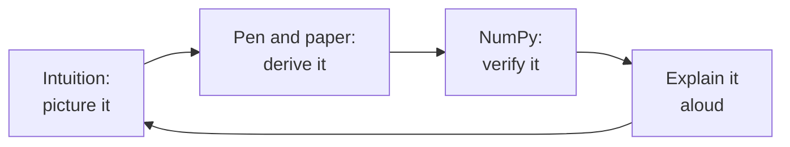

# Level 1: Math Foundations

> **Level 1 · Overview** · ⏱️ ~4–5 weeks at about an hour a day · Prerequisites: [Level 0](../00-python-for-data/index.md) (especially [NumPy](../00-python-for-data/04-numpy.md)) and high-school algebra

Level 1 teaches the math that machine learning is written in: linear algebra, matrix decompositions, calculus, probability, statistics, and the information theory and optimization that tie them together. You learn each idea three ways (the intuition, the derivation, and a NumPy check) so the formulas in later chapters read like sentences instead of hieroglyphics.

## If math makes you nervous, read this first

Many strong engineers feel uneasy about math. Often that comes from how it was taught: symbols before meaning, speed over understanding, and no way to check your work. This level is built differently.

- **You only need high-school algebra to start.** Every symbol is defined the first time it appears, and the [math notation cheat sheet](../../cheatsheets/math-notation.md) tells you how to read each one aloud.
- **Every idea starts with a picture or a plain-language explanation.** A matrix is a transformation of space. A derivative is a rate of change. A probability is a long-run frequency or a degree of belief. The symbols come after you know what they describe.
- **You can always check your work.** You have a superpower that most math students never had: a computer. Every formula in this level is verified numerically in NumPy. If your derivation and the code disagree, one of them is wrong, and finding out which teaches you more than any textbook paragraph.
- **You only need what ML uses.** This is not a math degree. It's the specific toolkit that regression, neural networks, PCA, A/B tests, and transformers are built on, with each topic tied to where it shows up later.
- **Slow is normal.** Math is read at a different speed from prose. One page an hour is good progress when you're working through it properly. The time estimates below are generous on purpose.

!!! tip "The goal is fluency, not memorization"
    You don't need to memorize formulas. You need to be able to read them, explain what each piece does, derive the important ones when you need to, and check them in code. That's what the exercises train.

## What this level covers

**Linear algebra** gives you the language of data: a dataset is a matrix, a data point is a vector, and a model often applies a matrix to a vector. **Matrix decompositions** (eigendecomposition and SVD) reveal the structure inside a matrix and power PCA, compression, and recommender systems. **Calculus** tells you how a model's error changes when you nudge its parameters, which is what every training algorithm uses. **Probability** gives you the vocabulary of uncertainty, and **statistics** turns data into conclusions with honest error bars. **Information theory and optimization** explain why the loss functions of machine learning look the way they do and how gradient descent finds good parameters.

## What you'll be able to do

- Read and write vector and matrix expressions, and picture what a matrix does to space.
- Solve linear systems, compute projections, and explain why least squares is a projection.
- Compute and interpret eigenvalues, eigenvectors, and the SVD, and use them for low-rank approximation and PCA.
- Differentiate the functions ML uses, derive gradients of loss functions, and check them numerically.
- Reason with conditional probability and Bayes' theorem, and use the common distributions correctly.
- Estimate quantities with confidence intervals, run and interpret hypothesis tests, and bootstrap when formulas fail.
- Explain entropy, cross-entropy, and KL divergence, and show why minimizing cross-entropy is maximum likelihood.
- Implement gradient descent from scratch and explain how the learning rate and conditioning affect it.

## Chapters

| # | Chapter | What it covers | Time |
|---|---|---|---|
| 1 | [Linear algebra](01-linear-algebra.md) | Vectors, dot products, norms, matrices as transformations, linear systems, rank, inverse, determinant, projections | ~60 min read + 4–5 h practice |
| 2 | [Matrix decompositions](02-matrix-decompositions.md) | Eigenvalues and eigenvectors, symmetric matrices, SVD and its geometry, low-rank approximation, PCA, conditioning | ~55 min read + 4–5 h practice |
| 3 | [Calculus and gradients](03-calculus-and-gradients.md) | Derivatives, the chain rule, partial derivatives, gradients, Jacobian and Hessian, Taylor approximation, convexity, gradient checking | ~55 min read + 4–5 h practice |
| 4 | [Probability](04-probability.md) | Events, conditional probability, Bayes, random variables, common distributions, expectation, covariance, LLN, CLT | ~60 min read + 4–5 h practice |
| 5 | [Statistics](05-statistics.md) | Descriptive statistics, sampling distributions, estimators, MLE, confidence intervals, hypothesis tests, bootstrap, multiple testing, Bayesian thinking | ~65 min read + 5–6 h practice |
| 6 | [Information theory and optimization](06-information-theory-and-optimization.md) | Entropy, cross-entropy, KL divergence, losses as objectives, gradient descent, convexity, Lagrange multipliers | ~55 min read + 4–5 h practice |

## How to study math



1. **Read with a pen in your hand.** When the text derives something, close the page and redo the derivation on paper. Every step you can't reproduce is a step you haven't understood yet. Go back, read it again, and retry.
2. **Do small examples by hand.** Multiply a 2×2 matrix by a vector. Compute a dot product of two 3-vectors. Apply Bayes' theorem with round numbers. Small, concrete cases build intuition faster than abstract ones.
3. **Verify every result in NumPy.** After you compute something by hand, check it in code. After you derive a formula, plug random numbers into both sides and confirm they match with `np.allclose`. For gradients, compare your formula against a finite-difference estimate. This loop of derive, then verify, is the core skill of the level.
4. **Draw pictures.** Sketch vectors, projections, tangent lines, and probability densities. If you can't draw it, ask what it would look like for two dimensions.
5. **Explain it out loud.** Pretend you're teaching a colleague. If you stumble, you've found a gap.
6. **Space it out.** Return to each chapter's "Check yourself" questions a few days later and again a week later. Spaced recall makes math stick far better than rereading.

!!! example "What \"verify it in NumPy\" looks like"
    Suppose you derive that $\lVert \mathbf{a} + \mathbf{b} \rVert^2 = \lVert \mathbf{a} \rVert^2 + 2\,\mathbf{a}^\top\mathbf{b} + \lVert \mathbf{b} \rVert^2$. Check it with random vectors:

    ```python
    import numpy as np

    rng = np.random.default_rng(0)
    a, b = rng.normal(size=5), rng.normal(size=5)
    lhs = np.linalg.norm(a + b) ** 2
    rhs = np.linalg.norm(a) ** 2 + 2 * a @ b + np.linalg.norm(b) ** 2
    print(np.isclose(lhs, rhs))
    ```

    ```text
    True
    ```

    If it printed `False`, you'd know to recheck your algebra before building on it.

!!! warning "Don't skip the exercises"
    Reading a derivation and following each step feels like understanding. It isn't, quite. Understanding is being able to produce the derivation yourself. The exercises, especially the by-hand ones, are where the learning happens.

## Capstone

The level ends with **[linear regression three ways, from scratch](../../exercises/level-1-capstone.md)**: you solve the same problem with the normal equations (linear algebra), with gradient descent (calculus and optimization), and with statistical inference (standard errors, confidence intervals, and tests). The three answers must agree. Finish it without notes before you move on to [Level 2: The data science workflow](../02-data-science-workflow/index.md).
