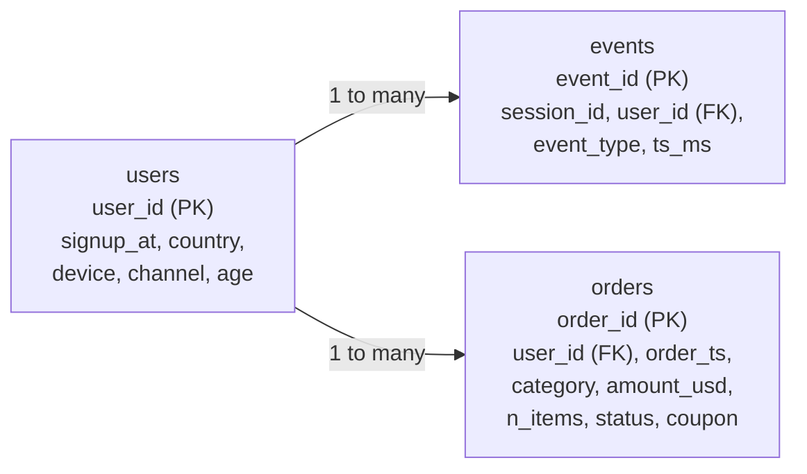
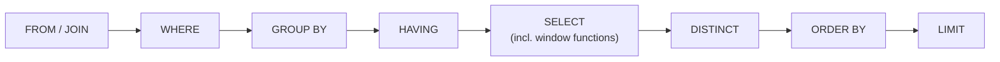
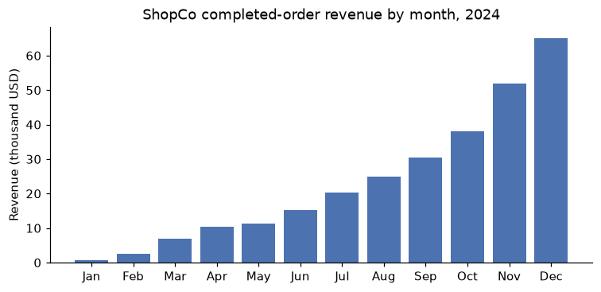

# SQL and data acquisition

> **Level 2 · Chapter 1** · ⏱️ ~60 min read · Prerequisites: [pandas](../00-python-for-data/05-pandas.md) and [Statistics](../01-math-foundations/05-statistics.md)

Most of the world's business data lives in relational databases, and SQL is how you get it out. This chapter teaches you to think in tables and keys, write queries from `SELECT` to window functions, run them from Python with DuckDB and sqlite3, choose between CSV, JSON, and Parquet, pull data from APIs, and decide when scraping a website is acceptable. Every example uses one messy e-commerce dataset that returns throughout Level 2.

## Why it matters

Sam was asked a simple question: "What's our average revenue per customer?" Sam joined the `orders` table to the `users` table, summed revenue per user, and averaged it. The answer, USD 182, went into a board slide.

Two weeks later, Wei rebuilt the number for a pricing model and got something far lower. The difference came from two lines of SQL. First, Sam's inner join silently dropped every customer who had signed up but never ordered, so the average was over buyers, not customers. Second, the `users` table contained duplicate rows from a signup form that sometimes submitted twice. Every order belonging to a duplicated user matched two user rows, so that user's revenue was counted twice.

Neither mistake raised an error. Both queries ran, returned clean-looking numbers, and were wrong. SQL does exactly what you ask, and the skill this chapter teaches is knowing precisely what you're asking: what one row of each table means, what a join does to row counts, and how `NULL` behaves. Get that right, and SQL is the fastest and most reliable way to get data. Get it wrong, and it produces confident nonsense.

## Concepts

### Relational thinking

A **relational database** stores data in **tables** (also called relations). Each table has named, typed **columns**, and each **row** is one record. The most important property of a table is its **grain**: what one row represents. "One row per order" and "one row per order line item" are different grains, and mixing them up is the most common source of wrong numbers.

Tables are linked by keys:

- A **primary key** is a column (or set of columns) that uniquely identifies each row, such as `order_id` in an orders table.
- A **foreign key** is a column that refers to the primary key of another table, such as `orders.user_id`, which points at `users.user_id`.

Instead of storing a customer's country on every order, a well-designed database stores it once in `users` and links orders to users by `user_id`. Splitting data into tables so that each fact lives in exactly one place is called **normalization**. It prevents contradictions (two orders claiming different countries for the same customer) at the cost of needing **joins** to recombine the facts.

Relational thinking also means thinking in **sets**. You don't tell SQL to loop over rows. You describe the result you want ("the total revenue per country for completed orders"), and the database's **query planner** decides how to compute it. SQL is **declarative**: you say *what*, not *how*. That's why the same query can run on a laptop or across a thousand machines.

Underneath, SQL is built on a small algebra of operations on tables. Three matter most:

- **Selection** $\sigma_{p}(R)$ keeps the rows of table $R$ where the predicate $p$ is true. In SQL, that's `WHERE`.
- **Projection** $\pi_{a, b}(R)$ keeps only columns $a$ and $b$. In SQL, that's the column list after `SELECT`.
- **Join** $R \bowtie_{p} S$ pairs every row of $R$ with every row of $S$ and keeps the pairs where $p$ is true. Formally it's selection applied to the **Cartesian product** $R \times S$, the set of all pairs:

$$
R \bowtie_{p} S = \sigma_{p}(R \times S)
$$

Databases never actually build the full Cartesian product (that would be $|R| \cdot |S|$ rows, where $|R|$ is the number of rows in $R$). They use hash tables or sorted merges to find matching pairs directly. But the definition tells you exactly what the result contains, and we'll use it to predict join sizes.

### The ShopCo dataset

Throughout Level 2 you'll analyze a fictional online store, ShopCo. Its data warehouse has three tables:



- **users**: one row per registered customer (in theory), with signup time, country, the device they signed up on, the marketing channel that brought them, and their age.
- **events**: one row per website or app event. A session is a visit; each session has a `page_view`, and some go on to `add_to_cart`, `checkout`, and `purchase`. Timestamps are stored as milliseconds since 1970-01-01 UTC, a format called **Unix epoch** time.
- **orders**: one row per order, with a timestamp, product category, amount in US dollars, number of items, status, and an optional coupon code.

To keep everything fast on a laptop, you'll work with a sample: 5,000 customers who signed up in 2024, with all their events and orders for the year. The data is synthetic but deliberately realistic, which means it's messy. Expand the generator below and run it. You'll use the same function in every chapter of this level. Don't read the comments too closely yet: finding the problems is part of the work, and the next chapter does it systematically.

??? example "The ShopCo data generator (expand and run this first)"

    ```python
    import numpy as np
    import pandas as pd

    def make_shop(n_users=5000, seed=42):
        """Messy, seeded synthetic data for ShopCo: returns (users, events, orders)."""
        rng = np.random.default_rng(seed)
        start = pd.Timestamp("2024-01-01", tz="UTC")
        end = pd.Timestamp("2025-01-01", tz="UTC")

        # ---------- users ----------
        uid = np.arange(1001, 1001 + n_users)
        country = rng.choice(["US", "UK", "DE", "IN", "BR"], n_users, p=[.40, .20, .15, .15, .10])
        p_mobile = pd.Series(country).map({"US": .35, "UK": .80, "DE": .45, "IN": .80, "BR": .60}).to_numpy()
        device = np.where(rng.random(n_users) < p_mobile, "mobile",
                          rng.choice(["desktop", "tablet"], n_users, p=[.85, .15]))
        channel = rng.choice(["organic", "paid_search", "social", "email", "referral"],
                             n_users, p=[.35, .25, .20, .10, .10])
        signup = start + pd.to_timedelta(rng.uniform(0, 330, n_users), unit="D")
        age_true = np.clip(rng.normal(36, 11, n_users), 18, 80).round()
        age = age_true.copy()
        age[rng.random(n_users) < np.where(device == "mobile", .15, .04)] = np.nan  # mobile form skips age
        age[rng.choice(n_users, 25, replace=False)] = -1                           # "unknown" sentinel
        age[rng.choice(n_users, 4, replace=False)] = [230, 199, 340, 2]            # typos
        variants = {"US": ["us", "USA", "United States"], "UK": ["uk", "U.K.", "United Kingdom"],
                    "DE": ["de", "Germany"], "IN": ["India", " IN"], "BR": ["Brazil", "br "]}
        messy = rng.random(n_users) < 0.2
        country_raw = [rng.choice(variants[c]) if m else c for c, m in zip(country, messy)]
        users = pd.DataFrame({
            "user_id": uid,
            "signup_at": signup.strftime("%Y-%m-%d %H:%M:%S"),    # UTC, stored as text
            "country": country_raw, "device": device, "channel": channel, "age": age,
        })
        users = pd.concat([users, users.sample(60, random_state=seed)])  # double-submitted forms

        # ---------- sessions and funnel events ----------
        lam = pd.Series(channel).map({"email": 9, "referral": 7, "organic": 6,
                                      "social": 4, "paid_search": 4}).to_numpy()
        n_sess = rng.poisson(lam * rng.gamma(2, 0.5, n_users))
        s_user = np.repeat(np.arange(n_users), n_sess)
        s_dev, s_cty = device[s_user], country[s_user]
        # visits follow a daily rhythm in the customer's *local* time, peaking in the evening
        hour_w = np.array([3, 2, 1, 1, 1, 1, 2, 3, 4, 5, 5, 6, 7, 6, 6, 6, 6, 7, 8, 10, 11, 10, 8, 5])
        local_s = rng.choice(24, len(s_user), p=hour_w / hour_w.sum()) * 3600 + rng.uniform(0, 3600, len(s_user))
        utc_off = pd.Series(s_cty).map({"US": -5, "UK": 0, "DE": 1, "IN": 5.5, "BR": -3}).to_numpy()
        day = (signup[s_user] + (end - signup[s_user]) * rng.random(len(s_user))).floor("D")
        s_start = day + pd.to_timedelta(local_s - utc_off * 3600, unit="s")
        s_start = s_start.where(s_start > signup[s_user], signup[s_user] + pd.Timedelta(minutes=5))
        s_start = s_start.where(s_start < end - pd.Timedelta(hours=1), end - pd.Timedelta(hours=1))
        p_buy = np.select([s_dev == "desktop", s_dev == "tablet"], [.85, .70], .40) + .12 * (s_cty == "UK")
        cart = rng.random(len(s_user)) < .35
        checkout = cart & (rng.random(len(s_user)) < .60)
        purchase = checkout & (rng.random(len(s_user)) < p_buy)
        t_cart = s_start + pd.to_timedelta(rng.uniform(30, 600, len(s_user)), unit="s")
        t_chk = t_cart + pd.to_timedelta(rng.uniform(30, 300, len(s_user)), unit="s")
        t_buy = t_chk + pd.to_timedelta(rng.uniform(10, 120, len(s_user)), unit="s")
        sid = np.arange(1, len(s_user) + 1)
        parts = []
        for name, mask, t in [("page_view", np.ones(len(s_user), bool), s_start), ("add_to_cart", cart, t_cart),
                              ("checkout", checkout, t_chk), ("purchase", purchase, t_buy)]:
            parts.append(pd.DataFrame({"session_id": sid[mask], "user_id": uid[s_user][mask],
                                       "event_type": name, "ts_ms": t[mask].as_unit("ms").asi8}))
        events = pd.concat(parts).sort_values("ts_ms", ignore_index=True)
        events = pd.concat([events, events.sample(frac=.01, random_state=seed)])  # client retries
        events = events.sort_values("ts_ms", ignore_index=True)
        events.insert(0, "event_id", np.arange(1, len(events) + 1))

        # ---------- orders (one per purchase session) ----------
        o_idx = np.flatnonzero(purchase)
        n_o = len(o_idx)
        cats = np.array(["electronics", "home", "fashion", "books", "beauty"])
        cat = rng.choice(cats, n_o, p=[.20, .25, .25, .15, .15])
        median = pd.Series(cat).map({"electronics": 120, "home": 60, "fashion": 45,
                                     "books": 18, "beauty": 30}).to_numpy()
        n_items = 1 + rng.poisson(.6, n_o)
        spend = median * n_items ** .7 * np.exp(.01 * (age_true[s_user][o_idx] - 36))
        amount = np.round(spend * rng.lognormal(0, .5, n_o), 2)
        status = rng.choice(["completed", "cancelled", "refunded"], n_o, p=[.90, .05, .05])
        amount[(status == "refunded") & (rng.random(n_o) < .5)] *= -1          # some refunds stored negative
        amount[rng.random(n_o) < .015] = np.nan                                 # lost in a migration
        amount[rng.choice(n_o, 4, replace=False)] = 99999.0                     # QA test orders
        cat_raw = cat.astype(object)
        r = rng.random(n_o)
        cat_raw[r < .10] = np.char.title(cat[r < .10].astype(str))
        cat_raw[(r >= .10) & (r < .15)] = np.char.upper(cat[(r >= .10) & (r < .15)].astype(str))
        cat_raw[(r >= .15) & (r < .20)] = np.char.add(cat[(r >= .15) & (r < .20)].astype(str), " ")
        coupon = rng.choice(np.array([None, "WELCOME10", "SPRING20", "FREESHIP"], dtype=object),
                            n_o, p=[.80, .08, .06, .06])
        # timestamps: web writes UTC with "Z"; the mobile app writes local time with an offset
        t = pd.Series(t_buy[o_idx])
        o_dev, o_cty = s_dev[o_idx], s_cty[o_idx]
        ts = t.dt.strftime("%Y-%m-%dT%H:%M:%SZ")
        tzs = {"US": "America/New_York", "UK": "Europe/London", "DE": "Europe/Berlin",
               "IN": "Asia/Kolkata", "BR": "America/Sao_Paulo"}
        for c, tz in tzs.items():
            m = (o_dev == "mobile") & (o_cty == c)
            local = t[m].dt.tz_convert(tz).dt.strftime("%Y-%m-%d %H:%M:%S%z")
            ts[m] = local.str[:-2] + ":" + local.str[-2:]
        orders = pd.DataFrame({
            "order_id": np.arange(500001, 500001 + n_o), "user_id": uid[s_user][o_idx],
            "order_ts": ts.to_numpy(), "category": cat_raw, "amount_usd": amount,
            "n_items": n_items, "status": status, "coupon": coupon,
        })
        orphans = orders.sample(15, random_state=seed).assign(user_id=lambda d: d.user_id + 90000,
                                                              order_id=lambda d: d.order_id + 50000)
        orders = pd.concat([orders, orphans, orders.sample(frac=.02, random_state=seed + 1)])
        orders = orders.sample(frac=1, random_state=seed).reset_index(drop=True)
        return users.reset_index(drop=True), events, orders
    ```

```python
import duckdb
import numpy as np
import pandas as pd

pd.set_option("display.width", 120)
pd.set_option("display.max_columns", 20)
users, events, orders = make_shop()
for name, df in [("users", users), ("events", events), ("orders", orders)]:
    print(f"{name:7s} {len(df):>6,} rows   columns: {list(df.columns)}")
```

```text
users    5,060 rows   columns: ['user_id', 'signup_at', 'country', 'device', 'channel', 'age']
events  46,621 rows   columns: ['event_id', 'session_id', 'user_id', 'event_type', 'ts_ms']
orders   3,636 rows   columns: ['order_id', 'user_id', 'order_ts', 'category', 'amount_usd', 'n_items', 'status', 'coupon']
```

Already a problem shows: the generator created 5,000 customers, but `users` has 5,060 rows. Keep that in mind.

### Running SQL from Python: DuckDB and sqlite3

You don't need a database server to learn or use SQL. Two **embedded** databases run inside your Python process:

| | sqlite3 | DuckDB |
|---|---|---|
| Ships with | Python's standard library | `pip install duckdb` |
| Storage layout | **Row-oriented**: each row stored together | **Column-oriented**: each column stored together |
| Built for | Many small reads and writes (**OLTP**, online transaction processing): apps, config, caches | Big scans and aggregations (**OLAP**, online analytical processing): analytics |
| Reads pandas DataFrames directly | No (copy in with `to_sql`) | Yes |
| Reads Parquet and CSV files directly | No | Yes |
| SQL dialect | Small, loosely typed | Rich, close to PostgreSQL |

Why does storage layout matter? An analytical query such as "total revenue per category" touches two columns out of eight. A column store reads just those two columns, packed tightly together, and processes them in vectorized batches, the same idea that makes NumPy fast. A row store has to read every row in full. For analytics, DuckDB is usually much faster; for an app that inserts one order at a time, SQLite is the natural choice.

Here's DuckDB. A **connection** is a handle to one database. With `register`, a pandas DataFrame becomes a table you can query, without copying it:

```python
con = duckdb.connect()             # an in-memory database
for name, df in [("users", users), ("events", events), ("orders", orders)]:
    con.register(name, df)
con.sql("SET TimeZone = 'UTC'")    # make timestamp display and truncation use UTC

print(con.sql("SELECT * FROM orders LIMIT 5").df())
```

```text
   order_id  user_id                   order_ts     category  amount_usd  n_items     status     coupon
0    501290     2835       2024-10-19T22:41:44Z  electronics      105.67        1  completed        NaN
1    500121     1182  2024-11-23 11:49:42+05:30       books        10.36        1  completed   SPRING20
2    500840     2227  2024-11-13 19:45:26+00:00      fashion       59.82        1  completed        NaN
3    501538     3166       2024-12-24T01:03:09Z        books       52.78        2  completed  WELCOME10
4    502892     5093  2024-11-19 08:56:16+05:30         home       56.31        1  completed        NaN
```

`con.sql(...)` returns a DuckDB relation, and `.df()` converts it to a pandas DataFrame. You can already see three problems in five rows: timestamps in two formats with different time zones, and category spellings that may not be consistent.

The `SET TimeZone = 'UTC'` line matters more than it looks. DuckDB's `TIMESTAMPTZ` type stores an absolute instant, but functions like "truncate to month" need to know which calendar you mean, and they use the session's time zone. Without setting it, the same query can give different monthly totals on a laptop in Berlin and a server in Virginia.

### SELECT, WHERE, ORDER BY, and NULL

The basic query shape is:

```sql
SELECT order_id, user_id, category, amount_usd   -- which columns (projection)
FROM orders                                      -- which table
WHERE status = 'completed' AND amount_usd > 500  -- which rows (selection)
ORDER BY amount_usd DESC                         -- sort
LIMIT 6;                                         -- keep the first 6
```

```python
q = """
SELECT order_id, user_id, category, amount_usd
FROM orders
WHERE status = 'completed' AND amount_usd > 500
ORDER BY amount_usd DESC
LIMIT 6
"""
print(con.sql(q).df())
```

```text
   order_id  user_id     category  amount_usd
0    501775     3484         home    99999.00
1    503500     5928         home    99999.00
2    500283     1395       beauty    99999.00
3    501449     3028        books    99999.00
4    500282     1395  electronics     1019.12
5    500282     1395  electronics     1019.12
```

Four orders of exactly USD 99,999.00 look like test orders, not real ones, and order 500282 appears twice. Sorting by a numeric column and looking at both ends is one of the cheapest data checks there is.

SQL doesn't run clauses in the order you write them. The **logical order of evaluation** is:



This explains several rules that otherwise seem arbitrary. You can't use a column alias defined in `SELECT` inside `WHERE`, because `WHERE` runs first. You can't filter on an aggregate like `SUM(amount_usd)` in `WHERE`, because the groups don't exist yet; that's what `HAVING` is for. And `ORDER BY` can use aliases, because it runs after `SELECT`.

**NULL** is SQL's marker for a missing value. It's not zero and not an empty string. It means "unknown", and SQL follows a **three-valued logic**: every comparison is `TRUE`, `FALSE`, or `NULL` (unknown). Any comparison with `NULL` is `NULL`, including `NULL = NULL`, because two unknowns aren't known to be equal. `WHERE` keeps only rows where the condition is `TRUE`, so rows where it's `NULL` vanish silently.

```python
print(con.sql("""
SELECT COUNT(*)                                     AS n_rows,
       COUNT(amount_usd)                            AS n_with_amount,
       COUNT(*) FILTER (WHERE amount_usd = NULL)    AS n_equals_null,
       COUNT(*) FILTER (WHERE amount_usd IS NULL)   AS n_is_null
FROM orders
""").df())
```

```text
   n_rows  n_with_amount  n_equals_null  n_is_null
0    3636           3583              0         53
```

`COUNT(*)` counts rows, while `COUNT(column)` counts non-null values. `= NULL` matches nothing; `IS NULL` is the correct test. Aggregates such as `SUM` and `AVG` skip nulls, so `AVG(amount_usd)` is the mean over orders that *have* an amount. That's often what you want, but you should know you're choosing it.

!!! warning "Common mistake: NULLs that silently drop rows"
    `WHERE coupon <> 'WELCOME10'` does *not* return orders without a coupon, because `NULL <> 'WELCOME10'` is `NULL`, not `TRUE`. Write `WHERE coupon IS DISTINCT FROM 'WELCOME10'` or `WHERE coupon IS NULL OR coupon <> 'WELCOME10'`. The same trap appears with `NOT IN (subquery)` when the subquery returns a `NULL`: then the whole condition is never true and you get zero rows.

### GROUP BY and HAVING

`GROUP BY` splits rows into groups that share the same values in the grouping columns, then an **aggregate function** (`COUNT`, `SUM`, `AVG`, `MIN`, `MAX`, and others) collapses each group to one row. It's pandas' split-apply-combine, written declaratively. The grain of the result is "one row per distinct combination of the grouping columns".

`HAVING` filters groups after aggregation, the way `WHERE` filters rows before it:

```python
print(con.sql("""
SELECT category, COUNT(*) AS n_orders
FROM orders
GROUP BY category
HAVING COUNT(*) >= 40
ORDER BY n_orders DESC, category
""").df())
```

```text
        category  n_orders
0        fashion       755
1           home       731
2    electronics       551
3         beauty       434
4          books       429
5        Fashion        95
6           Home        86
7         Beauty        70
8    Electronics        69
9           HOME        56
10         home         53
11  electronics         49
12         Books        48
13      fashion         43
14       FASHION        42
```

The same category appears under several spellings. Grouping is exact string matching, so `'home'`, `'Home'`, `'HOME'`, and `'home '` (with a trailing space) are four groups. Notice the tie-breaker in `ORDER BY n_orders DESC, category`, too: without it, rows with equal counts can come back in a different order on each run, because SQL tables have no inherent row order. Normalizing inside the query fixes it:

```python
print(con.sql("""
SELECT lower(trim(category)) AS category,
       COUNT(*)              AS n_orders,
       ROUND(SUM(amount_usd), 2)  AS revenue_usd
FROM orders
WHERE status = 'completed' AND amount_usd < 10000
GROUP BY lower(trim(category))
ORDER BY revenue_usd DESC
""").df())
```

```text
      category  n_orders  revenue_usd
0  electronics       609    116607.40
1         home       820     75167.77
2      fashion       823     55178.00
3       beauty       485     23842.97
4        books       465     12687.26
```

Every column in a `SELECT` with `GROUP BY` must either be in the `GROUP BY` or wrapped in an aggregate. Asking for `user_id` in a per-category summary makes no sense, because each category has many users. (SQLite allows it anyway and returns an arbitrary value, which is a silent bug waiting to happen. DuckDB and PostgreSQL raise an error.)

### Joins

A **join** combines rows from two tables that match on a condition, usually a key. The kinds differ in what they do with rows that have no match:

| Join | Keeps | Typical use |
|---|---|---|
| `INNER JOIN` | Only pairs that match | Orders with their customer's attributes |
| `LEFT JOIN` | Every row of the left table; nulls where the right has no match | All customers, with their orders if any |
| `RIGHT JOIN` | Mirror image of `LEFT` | Rarely used; swap the tables instead |
| `FULL OUTER JOIN` | Every row of both tables | Reconciling two sources |
| **Semi join** (`WHERE EXISTS`, or DuckDB's `SEMI JOIN`) | Left rows that have at least one match, once each | Customers who ordered |
| **Anti join** (`WHERE NOT EXISTS`, or `ANTI JOIN`) | Left rows with no match | Customers who never ordered |

A tiny example makes the differences concrete:

```python
left = pd.DataFrame({"user_id": [1, 2, 3], "name": ["Alex", "Sam", "Priya"]})
right = pd.DataFrame({"user_id": [1, 1, 3, 4], "amount": [10, 20, 30, 40]})
con.register("l", left)
con.register("r", right)

for kind in ["INNER JOIN", "LEFT JOIN", "FULL OUTER JOIN", "ANTI JOIN", "SEMI JOIN"]:
    cols = "l.user_id, l.name" if kind in ("ANTI JOIN", "SEMI JOIN") else "l.user_id, l.name, r.user_id AS r_id, r.amount"
    res = con.sql(f"SELECT {cols} FROM l {kind} r ON l.user_id = r.user_id ORDER BY ALL").df()
    print(f"--- {kind}: {len(res)} rows\n{res.to_string(index=False)}")
```

```text
--- INNER JOIN: 3 rows
 user_id  name  r_id  amount
       1  Alex     1      10
       1  Alex     1      20
       3 Priya     3      30
--- LEFT JOIN: 4 rows
 user_id  name  r_id  amount
       1  Alex     1      10
       1  Alex     1      20
       2   Sam  <NA>    <NA>
       3 Priya     3      30
--- FULL OUTER JOIN: 5 rows
 user_id  name  r_id  amount
       1  Alex     1      10
       1  Alex     1      20
       2   Sam  <NA>    <NA>
       3 Priya     3      30
    <NA>   NaN     4      40
--- ANTI JOIN: 1 rows
 user_id name
       2  Sam
--- SEMI JOIN: 2 rows
 user_id  name
       1  Alex
       3 Priya
```

Notice that the inner join returned **three** rows from a left table of three rows, but not the three you might expect: Alex appears twice (two orders), Sam is gone (no orders), and order 4 is gone (no user). Joins can both add and remove rows.

**Predicting join size.** Apply the definition $R \bowtie S = \sigma_p(R \times S)$ to an equality join on a key. Group both tables by key value $k$, and let $r_k$ and $s_k$ be the number of rows with key $k$ in $R$ and $S$. A pair of rows survives only if both have the same key, and for key $k$ there are $r_k \cdot s_k$ such pairs. So the inner join has exactly

$$
|R \bowtie S| = \sum_{k} r_k \, s_k
$$

rows, where the sum runs over keys present in both tables. If $k$ is the primary key of $R$, every $r_k = 1$ and the join has $\sum_k s_k$ rows: at most one row per row of $S$. That's the safe case, a **many-to-one** join. But if the "primary key" isn't actually unique, some $r_k = 2$ and those rows of $S$ are **duplicated**. This is called **fan-out**, and it's exactly what happened to Sam.

Let's measure it on ShopCo:

```python
print(con.sql("""
SELECT
  (SELECT COUNT(*) FROM orders)                                     AS order_rows,
  (SELECT COUNT(*) FROM orders o JOIN users u USING (user_id))      AS inner_join_rows,
  (SELECT COUNT(*) FROM orders o LEFT JOIN users u USING (user_id)) AS left_join_rows,
  (SELECT COUNT(*) - COUNT(DISTINCT user_id) FROM users)            AS duplicate_user_rows
""").df())
```

```text
   order_rows  inner_join_rows  left_join_rows  duplicate_user_rows
0        3636             3650            3665                   60
```

Both joins have *more* rows than `orders` itself, which is impossible for a correct many-to-one join. Every extra row is an order matched to a duplicated user. And the inner join has 15 fewer rows than the left join: those are orders whose `user_id` doesn't exist in `users` at all, called **orphans**. The inner join drops them silently. Two checks catch both problems before you trust a join: confirm the key is unique on the "one" side (`COUNT(*) = COUNT(DISTINCT key)`), and compare row counts before and after.

!!! warning "Common mistake: join fan-out"
    Always know the grain of both tables before joining. If you join orders to a table that has several rows per user (say, a table of addresses), every order is repeated once per address, and every sum over orders is inflated. Check `COUNT(*)` before and after each join. A row count that grows unexpectedly is a bug until proven otherwise.

### Subqueries and CTEs

A **subquery** is a query nested inside another. It can appear in `FROM` (as a derived table), in `WHERE` (as a filter), or in `SELECT` (as a single value, called a **scalar subquery**, as in the row-count query above).

As queries grow, nested subqueries become hard to read from the inside out. A **common table expression** (**CTE**), introduced with `WITH`, names each step so the query reads top to bottom like a recipe. Here's a provisional cleanup of the two main tables, written as CTEs and then saved as **views** (named queries) so later queries can use them. Chapter 2 does this properly; for now, it's just enough to get sensible numbers.

```python
con.sql("""
CREATE OR REPLACE VIEW users_clean AS
SELECT DISTINCT
    user_id,
    CAST(signup_at AS TIMESTAMP) AS signup_at,
    CASE upper(trim(country))
        WHEN 'USA' THEN 'US' WHEN 'UNITED STATES' THEN 'US'
        WHEN 'U.K.' THEN 'UK' WHEN 'UNITED KINGDOM' THEN 'UK'
        WHEN 'GERMANY' THEN 'DE' WHEN 'INDIA' THEN 'IN' WHEN 'BRAZIL' THEN 'BR'
        ELSE upper(trim(country))
    END AS country,
    device, channel, age
FROM users
""")
con.sql("""
CREATE OR REPLACE VIEW orders_clean AS
SELECT DISTINCT
    order_id, user_id,
    CAST(order_ts AS TIMESTAMPTZ) AS order_ts,
    lower(trim(category)) AS category,
    amount_usd, n_items, status, coupon
FROM orders
WHERE amount_usd IS NULL OR amount_usd < 10000      -- drop the QA test orders
""")
print(con.sql("""
SELECT (SELECT COUNT(*) FROM users_clean) AS users, (SELECT COUNT(DISTINCT user_id) FROM users_clean) AS distinct_users,
       (SELECT COUNT(*) FROM orders_clean) AS orders, (SELECT COUNT(DISTINCT order_id) FROM orders_clean) AS distinct_orders
""").df())
```

```text
   users  distinct_users  orders  distinct_orders
0   5000            5000    3561             3561
```

Now the keys are unique. With clean views, "revenue per customer, by country" becomes a readable CTE pipeline. Note the `LEFT JOIN` from users, so customers with no orders count as zero:

```python
q = """
WITH revenue_per_user AS (            -- step 1: one row per user who ordered
    SELECT user_id, SUM(amount_usd) AS revenue
    FROM orders_clean
    WHERE status = 'completed'
    GROUP BY user_id
),
per_customer AS (                     -- step 2: one row per customer, buyers or not
    SELECT u.user_id, u.country, COALESCE(r.revenue, 0) AS revenue
    FROM users_clean u
    LEFT JOIN revenue_per_user r USING (user_id)
)
SELECT country,
       COUNT(*)                              AS customers,
       ROUND(AVG(revenue), 2)                AS revenue_per_customer,
       ROUND(AVG(revenue) FILTER (WHERE revenue > 0), 2) AS revenue_per_buyer
FROM per_customer
GROUP BY country
ORDER BY customers DESC
"""
print(con.sql(q).df())
```

```text
  country  customers  revenue_per_customer  revenue_per_buyer
0      US       2023                 61.30             144.20
1      UK       1026                 50.79             127.11
2      IN        747                 41.13             130.76
3      DE        711                 61.78             148.90
4      BR        493                 53.51             138.12
```

`COALESCE(a, b)` returns the first non-null argument, turning "no orders" into zero revenue. Look at the gap between revenue per customer and revenue per buyer: that's Sam's first mistake, quantified. Both numbers are legitimate; they answer different questions. Name the denominator every time you report an average.

### Window functions

Aggregation collapses many rows into one. Sometimes you want an aggregate *alongside* each row instead: each order with its customer's order number, the time since the previous order, or a running total. That's a **window function**. It computes a value for each row from a "window" of related rows, without collapsing them.

The syntax is `function(...) OVER (PARTITION BY ... ORDER BY ... frame)`:

- `PARTITION BY` splits rows into independent groups (like `GROUP BY`, but rows are kept).
- `ORDER BY` orders rows within each partition.
- The **frame** (such as `ROWS BETWEEN 6 PRECEDING AND CURRENT ROW`) says which rows around the current one the function sees.

Common window functions:

| Function | Returns |
|---|---|
| `ROW_NUMBER()` | 1, 2, 3, ... within the partition |
| `RANK()`, `DENSE_RANK()` | Rank with ties (`RANK` skips numbers after a tie; `DENSE_RANK` doesn't) |
| `LAG(x, k)`, `LEAD(x, k)` | The value of `x` from $k$ rows before or after |
| `SUM(x) OVER (...)`, `AVG(x) OVER (...)` | Running or moving aggregates over the frame |
| `FIRST_VALUE(x)`, `LAST_VALUE(x)` | The first or last value in the frame |

Mathematically, if a partition's rows in order have values $x_1, x_2, \ldots, x_n$, a running sum gives row $t$ the value $S_t = \sum_{i=1}^{t} x_i$, and a $w$-row moving average gives

$$
M_t = \frac{1}{\min(w, t)} \sum_{i=\max(1,\, t-w+1)}^{t} x_i,
$$

the mean of the current row and up to $w-1$ rows before it. Here's each user's order sequence with the gap since their previous order:

```python
q = """
SELECT user_id, order_id, order_ts,
       ROW_NUMBER() OVER w                                   AS order_number,
       date_diff('day', LAG(order_ts) OVER w, order_ts)      AS days_since_prev
FROM orders_clean
WHERE status = 'completed'
WINDOW w AS (PARTITION BY user_id ORDER BY order_ts)
ORDER BY user_id, order_ts
LIMIT 8
"""
print(con.sql(q).df())
```

```text
   user_id  order_id                  order_ts  order_number  days_since_prev
0     1011    500001 2024-09-24 02:00:24+00:00             1             <NA>
1     1014    500002 2024-07-14 08:04:13+00:00             1             <NA>
2     1016    500004 2024-10-14 16:55:15+00:00             1             <NA>
3     1017    500006 2024-09-01 11:24:22+00:00             1             <NA>
4     1017    500005 2024-11-13 21:18:35+00:00             2               73
5     1018    500008 2024-05-24 22:25:12+00:00             1             <NA>
6     1018    500007 2024-11-03 17:08:37+00:00             2              163
7     1022    500009 2024-10-24 23:51:02+00:00             1             <NA>
```

`WINDOW w AS (...)` names a window definition so you don't repeat it. The first order of each user has no previous order, so `LAG` returns `NULL`.

Because window functions are computed in the `SELECT` step, after `WHERE`, you can't filter on them in the same query's `WHERE`. Wrap the query in a CTE and filter outside, or use DuckDB's `QUALIFY` clause, which filters on window results. Here's the classic "first order per customer" pattern, which you'll use constantly:

```python
q = """
SELECT user_id, order_id, category, amount_usd
FROM orders_clean
WHERE status = 'completed'
QUALIFY ROW_NUMBER() OVER (PARTITION BY user_id ORDER BY order_ts) = 1
ORDER BY user_id
LIMIT 5
"""
print(con.sql(q).df())
```

```text
   user_id  order_id category  amount_usd
0     1011    500001     home       18.96
1     1014    500002     home      222.34
2     1016    500004   beauty       24.99
3     1017    500006     home       81.36
4     1018    500008   beauty       52.12
```

And here's a daily revenue series with a running total and a 7-day moving average, computed in one pass:

```python
q = """
WITH daily AS (
    SELECT CAST(order_ts AS DATE) AS day, SUM(amount_usd) AS revenue
    FROM orders_clean
    WHERE status = 'completed'
    GROUP BY day
)
SELECT day,
       ROUND(revenue, 2) AS revenue,
       ROUND(SUM(revenue) OVER (ORDER BY day), 2) AS running_total,
       ROUND(AVG(revenue) OVER (ORDER BY day ROWS BETWEEN 6 PRECEDING AND CURRENT ROW), 2) AS ma_7d
FROM daily
ORDER BY day DESC
LIMIT 5
"""
print(con.sql(q).df())
```

```text
         day  revenue  running_total    ma_7d
0 2024-12-31  3132.69      277653.14  2144.56
1 2024-12-30  2010.30      274520.45  2194.97
2 2024-12-29  2866.21      272510.15  2225.50
3 2024-12-28  1894.00      269643.94  2125.04
4 2024-12-27  1495.17      267749.94  2084.62
```

!!! warning "Common mistake: ROWS vs RANGE, and missing days"
    `ROWS BETWEEN 6 PRECEDING AND CURRENT ROW` means the 7 previous *rows*, not 7 days. If some days have no orders, those days have no rows, and the window stretches over more than a week. For a true 7-day window, either fill in missing days first (join to a calendar of all dates) or use a range frame: `RANGE BETWEEN INTERVAL 6 DAYS PRECEDING AND CURRENT ROW`.

### File formats: CSV, JSON, and Parquet

Not all data lives in databases. A lot arrives as files, and the format affects correctness, size, and speed.

- **CSV** (comma-separated values) is plain text, one row per line. It's universal and human-readable, but it has no types: every value is text, and the reader has to guess that `00501` is a zip code and not the number 501. Quoting, commas inside values, encodings, and missing-value markers vary between tools.
- **JSON** (JavaScript Object Notation) is text too, but it supports nesting: objects inside objects, and lists. It's the language of web APIs. **JSON Lines** (one JSON object per line) is common for logs. It's verbose, because every row repeats every key.
- **Parquet** is a binary, **columnar** format. It stores a schema with real types (integers, timestamps with time zones, strings), compresses each column separately (similar values compress well), and stores per-chunk statistics such as min and max. A reader can skip columns it doesn't need (**column pruning**) and skip chunks whose min and max rule out a filter (**predicate pushdown**). For analytics, it's the default choice.

Let's write the orders three ways and read them back:

```python
import os

# a typed copy: real UTC timestamps instead of text
typed = orders.assign(order_ts=pd.to_datetime(orders["order_ts"], utc=True, format="ISO8601"))
typed.to_csv("orders.csv", index=False)
typed.to_json("orders.jsonl", orient="records", lines=True)
typed.to_parquet("orders.parquet", index=False)

for f in ["orders.csv", "orders.jsonl", "orders.parquet"]:
    print(f"{f:15s} {os.path.getsize(f) / 1024:7.1f} KB")

back_csv = pd.read_csv("orders.csv")
back_pq = pd.read_parquet("orders.parquet")
print("order_ts after CSV:    ", back_csv["order_ts"].dtype)
print("order_ts after Parquet:", back_pq["order_ts"].dtype)
print("Parquet round trip identical:", back_pq.equals(typed))
```

```text
orders.csv        235.7 KB
orders.jsonl      525.6 KB
orders.parquet     94.4 KB
order_ts after CSV:     str
order_ts after Parquet: datetime64[us, UTC]
Parquet round trip identical: True
```

The timestamps went into the CSV as real UTC timestamps and came back as plain strings, because CSV has no types and the reader has to guess. Parquet gave back exactly the table that went in. Even on this small table, Parquet is less than half the size of the CSV and under a fifth of the JSON Lines file, and the gap grows with data size: on large tables with repetitive values, Parquet is often many times smaller than CSV and much faster to read.

DuckDB can query files directly without loading them into pandas first. With Parquet, it reads only the columns the query uses:

```python
print(con.sql("""
SELECT status, COUNT(*) AS n, ROUND(AVG(n_items), 2) AS avg_items
FROM 'orders.parquet'
GROUP BY status
ORDER BY n DESC
""").df())
```

```text
      status     n  avg_items
0  completed  3253       1.60
1   refunded   198       1.56
2  cancelled   185       1.59
```

This scales surprisingly far. DuckDB can query a folder of Parquet files larger than your laptop's memory, streaming through them in chunks.

### Calling APIs

Much external data (weather, exchange rates, ad-platform spend, CRM records) comes from **web APIs**: URLs that return data, usually JSON, instead of web pages. Most follow the **REST** style: you send an HTTP `GET` request to a URL describing a resource, such as `/v1/orders?since=2024-06-01`, and get a JSON response.

Real API work involves a few recurring patterns:

- **Authentication**: usually an API key or token in a request header. Keep it in an environment variable, never in your code or notebook.
- **Pagination**: large results come in pages. The response includes a cursor or page number for the next request.
- **Rate limits**: servers cap requests per minute. A `429 Too Many Requests` response means slow down.
- **Retries with backoff**: networks fail. Retry transient errors (429 and 5xx status codes), waiting longer each time, often doubling the delay. This is called **exponential backoff**.
- **Raw first**: save the raw responses before transforming them, so you can reprocess without calling the API again.

Here's the shape of a robust paginated client. It isn't run here, because the URL is a placeholder and the verification environment has no network access:

<!-- skip-run -->
```python
import os
import time

import requests

def fetch_all(url, params=None, max_retries=5):
    """Fetch every page from a cursor-paginated JSON API."""
    headers = {"Authorization": f"Bearer {os.environ['SHOP_API_TOKEN']}"}
    params = dict(params or {})
    rows = []
    while True:
        for attempt in range(max_retries):
            resp = requests.get(url, params=params, headers=headers, timeout=30)
            if resp.status_code == 429 or resp.status_code >= 500:
                time.sleep(2 ** attempt)          # exponential backoff: 1, 2, 4, 8, ... seconds
                continue
            resp.raise_for_status()               # other errors (401, 404, ...) are bugs: fail loudly
            break
        else:
            raise RuntimeError(f"giving up after {max_retries} attempts")
        page = resp.json()
        rows.extend(page["data"])
        if not page.get("next_cursor"):
            return rows
        params["cursor"] = page["next_cursor"]
        time.sleep(0.2)                           # be polite, even under the rate limit

orders_api = pd.json_normalize(fetch_all("https://api.example.com/v1/orders", {"since": "2024-06-01"}))
```

API responses are usually nested. `pd.json_normalize` flattens nested objects into columns with dotted names, and the `record_path` argument expands lists into rows. This part runs offline on a sample payload:

```python
import json

payload = json.loads("""
{"data": [
  {"order_id": 1, "customer": {"id": 1001, "country": "US"},
   "items": [{"sku": "A1", "qty": 2, "price": 9.5}, {"sku": "B7", "qty": 1, "price": 30.0}]},
  {"order_id": 2, "customer": {"id": 1002, "country": "DE"},
   "items": [{"sku": "A1", "qty": 1, "price": 9.5}]}
], "next_cursor": null}
""")
print(pd.json_normalize(payload["data"]).drop(columns="items"))
print(pd.json_normalize(payload["data"], record_path="items",
                        meta=["order_id", ["customer", "id"]]))
```

```text
   order_id  customer.id customer.country
0         1         1001               US
1         2         1002               DE
  sku  qty  price order_id customer.id
0  A1    2    9.5        1        1001
1  B7    1   30.0        1        1001
2  A1    1    9.5        2        1002
```

The second table has a different grain: one row per order line item, not per order. Flattening nested data is one of the main places where the grain changes under you, so name it explicitly.

### Scraping, and the ethics of collecting data

**Web scraping** means downloading web pages and extracting data from their HTML. Sometimes it's the only way to get public information. It's also where data collection most easily becomes rude, illegal, or harmful. Before scraping, work through these questions:

1. **Is there an API or a download?** Use it. It's more stable, and it's what the site wants you to use.
2. **What do the terms of service say?** Many sites forbid automated collection. Breaking terms of service can have legal consequences, and the law varies by country.
3. **What does `robots.txt` say?** It's a file at the root of a site (`/robots.txt`) that tells automated clients which paths they may fetch. It's a convention, not a lock, and respecting it is the baseline of good behavior.
4. **Are you gentle?** Rate-limit your requests (one every second or few seconds is a common courtesy), identify your client honestly in the `User-Agent` header, and cache pages so you never download the same one twice.
5. **Is there personal data?** Names, emails, photos, and profiles are covered by privacy law in many places (such as the GDPR in the EU), even when they're publicly visible. Collect only what you need, and think about how it could be misused.
6. **Does it respect copyright?** Facts are generally not copyrightable, but text, images, and databases can be.

Python's standard library can parse `robots.txt` for you. Here it runs on a sample file, offline:

```python
from urllib.robotparser import RobotFileParser

robots = """
User-agent: *
Disallow: /checkout/
Disallow: /account/
Crawl-delay: 5
"""
rp = RobotFileParser()
rp.parse(robots.splitlines())
for path in ["/products/blue-mug", "/checkout/cart", "/account/settings"]:
    print(f"{path:22s} allowed: {rp.can_fetch('shopco-research-bot', path)}")
print("crawl delay (s):", rp.crawl_delay("shopco-research-bot"))
```

```text
/products/blue-mug     allowed: True
/checkout/cart         allowed: False
/account/settings      allowed: False
crawl delay (s): 5
```

When scraping is justified, the usual tools are `requests` (or `httpx`) to download pages and `BeautifulSoup` or `lxml` to parse the HTML. Expect scrapers to break whenever the site's layout changes, and treat scraped data as the least trustworthy kind you have.

## In practice

### A conversion funnel in one query

A **funnel** counts how many sessions reach each step of a process. It's one of the most common analyses in e-commerce. The events table records each step, so a funnel is a **conditional aggregation**: count distinct sessions, filtered by step. `epoch_ms` converts the millisecond timestamps into real timestamps:

```python
q = """
WITH ev AS (
    SELECT DISTINCT session_id, user_id, event_type, epoch_ms(ts_ms) AS ts   -- drop retried duplicates
    FROM events
)
SELECT u.device,
       COUNT(DISTINCT session_id)                                              AS sessions,
       COUNT(DISTINCT session_id) FILTER (WHERE event_type = 'add_to_cart')    AS carts,
       COUNT(DISTINCT session_id) FILTER (WHERE event_type = 'checkout')       AS checkouts,
       COUNT(DISTINCT session_id) FILTER (WHERE event_type = 'purchase')       AS purchases,
       ROUND(100.0 * purchases / sessions, 1)                                  AS conversion_pct
FROM ev
JOIN users_clean u USING (user_id)
GROUP BY u.device
ORDER BY sessions DESC
"""
print(con.sql(q).df())
```

```text
    device  sessions  carts  checkouts  purchases  conversion_pct
0   mobile     15223   5344       3190       1366             9.0
1  desktop     10348   3723       2249       1936            18.7
2   tablet      1645    553        334        248            15.1
```

DuckDB lets later columns in the `SELECT` refer to earlier aliases (`purchases / sessions`), which most databases don't allow. The `100.0` matters in databases that do integer division (see SQLite below). Mobile sessions convert at roughly half the desktop rate, and most of the drop happens between checkout and purchase. That's a hypothesis worth testing: is the mobile checkout page the problem? Chapter 5 tests exactly that.

### Monthly revenue, from SQL to a chart

A common workflow is: aggregate in SQL (where the data lives and the engine is fast), then bring the small result into pandas to plot it.

```python
import matplotlib.pyplot as plt

monthly = con.sql("""
SELECT date_trunc('month', order_ts) AS month,
       COUNT(*)                      AS orders,
       SUM(amount_usd)               AS revenue
FROM orders_clean
WHERE status = 'completed'
GROUP BY month
ORDER BY month
""").df()
print(monthly.tail(3))

fig, ax = plt.subplots(figsize=(8, 3.5))
ax.bar(monthly["month"].dt.strftime("%b"), monthly["revenue"] / 1000, color="#4C72B0")
ax.set_ylabel("Revenue (thousand USD)")
ax.set_title("ShopCo completed-order revenue by month, 2024")
ax.spines[["top", "right"]].set_visible(False)
plt.show()
```

```text
                       month  orders   revenue
9  2024-10-01 00:00:00+00:00     456  38131.66
10 2024-11-01 00:00:00+00:00     622  51988.10
11 2024-12-01 00:00:00+00:00     714  65101.32
```



*Revenue grows through the year because the customer base grows: every month adds new signups, and older customers keep ordering.*

### Checking a number two ways

Whenever a number matters, compute it a second way. Here's revenue per country from the SQL views, recomputed in pandas from the raw DataFrames with the same cleaning rules. If the two disagree, one of them has a bug:

```python
u = users.drop_duplicates().copy()
u["country"] = (u["country"].str.strip().str.upper()
                .replace({"USA": "US", "UNITED STATES": "US", "U.K.": "UK", "UNITED KINGDOM": "UK",
                          "GERMANY": "DE", "INDIA": "IN", "BRAZIL": "BR"}))
o = orders.drop_duplicates()
o = o[(o["amount_usd"].isna() | (o["amount_usd"] < 10000)) & (o["status"] == "completed")]
pandas_rev = o.merge(u[["user_id", "country"]], on="user_id").groupby("country")["amount_usd"].sum().round(2)

sql_rev = con.sql("""
SELECT country, ROUND(SUM(amount_usd), 2) AS revenue
FROM orders_clean JOIN users_clean USING (user_id)
WHERE status = 'completed'
GROUP BY country
""").df().set_index("country")["revenue"]

print(pd.concat({"pandas": pandas_rev, "sql": sql_rev}, axis=1).sort_index())
print("max abs difference:", (pandas_rev - sql_rev.reindex(pandas_rev.index)).abs().max())
```

```text
            pandas        sql
country
BR        26381.87   26381.87
DE        43924.68   43924.68
IN        30727.68   30727.68
UK        52113.46   52113.46
US       124012.28  124012.28
max abs difference: 0.0
```

They agree. If they hadn't, the usual culprits are a duplicate you removed in one place but not the other, a `NULL` handled differently, or a join type that differs.

### sqlite3: parameters and integer division

SQLite is in every Python installation and on every phone. With pandas you write a table into it with `to_sql` and read query results with `pd.read_sql`. Two habits matter.

First, **never build SQL by pasting user input into a string**. If a value comes from outside your code, an attacker (or an unlucky apostrophe in a name like O'Brien) can change the query's meaning. This is **SQL injection**. Use **parameters**: placeholders (`?` in sqlite3, `?` or `$name` in DuckDB) that the driver fills in safely.

Second, know your dialect. SQLite divides integers as integers:

```python
import sqlite3

lite = sqlite3.connect(":memory:")
users.drop_duplicates().to_sql("users", lite, index=False)

country = "UK"   # imagine this came from a web form
print(pd.read_sql("SELECT device, COUNT(*) AS n FROM users WHERE country = ? GROUP BY device ORDER BY n DESC",
                  lite, params=(country,)))
print(lite.execute("SELECT 7 / 2, 7 / 2.0, CAST(7 AS REAL) / 2").fetchone())
```

```text
    device    n
0   mobile  667
1  desktop  116
2   tablet   25
(3, 3.5, 3.5)
```

`7 / 2` is `3` in SQLite (and in PostgreSQL and SQL Server), but `3.5` in DuckDB. A conversion rate computed as `purchases / sessions` in SQLite is zero for every group. Multiply by `1.0` or cast to a real type first.

!!! warning "Common mistake: pulling everything into pandas"
    `pd.read_sql("SELECT * FROM events", ...)` on a production table with a billion rows will exhaust your memory and annoy the database's owners. Filter and aggregate in SQL, and pull only the result you need. Use pandas (or polars) for the final, small, local steps.

## Exercises

### Exercise 1: NULL arithmetic by hand (easy)

Given this table `t`:

| id | x |
|---|---|
| 1 | 10 |
| 2 | NULL |
| 3 | 20 |
| 4 | NULL |

Without running anything, give the result of each expression: `COUNT(*)`, `COUNT(x)`, `SUM(x)`, `AVG(x)`, `SUM(x) / COUNT(*)`, and `COUNT(*) FILTER (WHERE x <> 10)`. Then check with DuckDB.

??? success "Solution"

    `COUNT(*)` = 4 (rows). `COUNT(x)` = 2 (non-null values). `SUM(x)` = 30. `AVG(x)` = 15, the mean of the two known values. `SUM(x) / COUNT(*)` = 7.5, which treats missing values as zero: a different quantity. `COUNT(*) FILTER (WHERE x <> 10)` = 1: only the row with 20, because `NULL <> 10` is `NULL`, not `TRUE`.

    ```python
    t = pd.DataFrame({"id": [1, 2, 3, 4], "x": [10, None, 20, None]})
    con.register("t", t)
    print(con.sql("""
    SELECT COUNT(*) AS n, COUNT(x) AS n_x, SUM(x) AS s, AVG(x) AS avg_x,
           SUM(x) / COUNT(*) AS s_over_n, COUNT(*) FILTER (WHERE x <> 10) AS n_not_10
    FROM t
    """).df())
    ```

    ```text
       n  n_x     s  avg_x  s_over_n  n_not_10
    0  4    2  30.0   15.0       7.5         1
    ```

    Whether `AVG(x)` or `SUM(x) / COUNT(*)` is right depends on what `NULL` means. If it means "unknown", `AVG(x)` is a reasonable estimate. If it means "zero" (for example, no purchases), you want the second one, and you should write `AVG(COALESCE(x, 0))` to say so explicitly.

### Exercise 2: Categories worth keeping (easy)

Using `orders_clean`, list each category's number of completed orders, total revenue, and average order value, keeping only categories with at least 400 completed orders. Sort by average order value, highest first.

??? success "Solution"

    ```python
    print(con.sql("""
    SELECT category,
           COUNT(*)                   AS n_orders,
           ROUND(SUM(amount_usd), 2)  AS revenue,
           ROUND(AVG(amount_usd), 2)  AS avg_order_value
    FROM orders_clean
    WHERE status = 'completed'
    GROUP BY category
    HAVING COUNT(*) >= 400
    ORDER BY avg_order_value DESC
    """).df())
    ```

    ```text
          category  n_orders    revenue  avg_order_value
    0  electronics       605  113799.10           190.94
    1         home       821   74133.94            91.64
    2      fashion       819   53959.33            66.86
    3       beauty       480   23312.84            49.29
    4        books       464   12447.93            27.18
    ```

    `WHERE` filters orders before grouping; `HAVING` filters categories after. Electronics has fewer orders than some categories but by far the highest average order value, which is why it leads on revenue.

### Exercise 3: Customers who never ordered (medium)

Count the customers in `users_clean` who have no orders at all in `orders_clean`, in three different ways: a `LEFT JOIN` with an `IS NULL` filter, `NOT EXISTS`, and DuckDB's `ANTI JOIN`. Confirm all three agree. Then explain why `WHERE user_id NOT IN (SELECT user_id FROM orders_clean)` would be dangerous if `orders_clean.user_id` could contain a `NULL`.

??? success "Solution"

    ```python
    print(con.sql("""
    SELECT
      (SELECT COUNT(*) FROM users_clean u LEFT JOIN orders_clean o USING (user_id)
        WHERE o.order_id IS NULL)                                                  AS via_left_join,
      (SELECT COUNT(*) FROM users_clean u
        WHERE NOT EXISTS (SELECT 1 FROM orders_clean o WHERE o.user_id = u.user_id)) AS via_not_exists,
      (SELECT COUNT(*) FROM users_clean u ANTI JOIN orders_clean o USING (user_id)) AS via_anti_join
    """).df())
    ```

    ```text
       via_left_join  via_not_exists  via_anti_join
    0           2847            2847           2847
    ```

    In the left-join version, filter on a column that can't be null in a real match (the right table's primary key), not on a column that might legitimately be null.

    `x NOT IN (a, b, NULL)` means `x <> a AND x <> b AND x <> NULL`. The last comparison is always `NULL`, so the whole condition can never be `TRUE`, and the query returns zero rows. `NOT EXISTS` and anti joins don't have this problem, which is why they're the safer habit.

### Exercise 4: Time between orders (medium)

For customers with at least two completed orders, compute the median number of days between consecutive orders, overall and by acquisition channel. Use `LAG` in a CTE, then aggregate with DuckDB's `MEDIAN`. Which channel's customers reorder fastest?

??? success "Solution"

    ```python
    print(con.sql("""
    WITH gaps AS (
        SELECT o.user_id, u.channel,
               date_diff('day', LAG(order_ts) OVER (PARTITION BY o.user_id ORDER BY order_ts), order_ts) AS gap_days
        FROM orders_clean o JOIN users_clean u USING (user_id)
        WHERE status = 'completed'
    )
    SELECT COALESCE(channel, 'ALL') AS channel,
           COUNT(*) AS n_gaps,
           MEDIAN(gap_days) AS median_gap_days
    FROM gaps
    WHERE gap_days IS NOT NULL
    GROUP BY ROLLUP (channel)
    ORDER BY median_gap_days, channel
    """).df())
    ```

    ```text
           channel  n_gaps  median_gap_days
    0        email     257             31.0
    1       social     119             32.0
    2          ALL    1172             35.0
    3      organic     475             35.0
    4  paid_search     146             35.5
    5     referral     175             38.0
    ```

    `GROUP BY ROLLUP (channel)` adds a grand-total row with `channel` set to `NULL`, which `COALESCE` relabels. Customers acquired by email reorder fastest here. The differences among the other channels are small, and with only about 120 to 480 gaps per channel, some of them are probably noise. Be careful with the interpretation: customers who signed up late in the year have less time to place a second order, so the gaps are **censored** (we only see gaps short enough to fit in the data window). Comparisons between channels are fairer than the absolute numbers.

### Exercise 5: Predict the fan-out (hard)

The raw `users` table has some duplicated rows. Using the formula $|R \bowtie S| = \sum_k r_k s_k$, predict in pandas exactly how many rows `orders JOIN users USING (user_id)` returns, using only per-key counts. Then verify with SQL. How many orders are duplicated by the join, and how much revenue (among completed orders under USD 10,000) does the fan-out add?

??? success "Solution"

    ```python
    r = users["user_id"].value_counts()          # r_k
    s = orders["user_id"].value_counts()         # s_k
    common = r.index.intersection(s.index)
    predicted = int((r[common] * s[common]).sum())
    actual = con.sql("SELECT COUNT(*) FROM orders JOIN users USING (user_id)").fetchone()[0]
    print("predicted:", predicted, " actual:", actual)

    print(con.sql("""
    WITH ok AS (SELECT * FROM orders WHERE status = 'completed' AND amount_usd < 10000)
    SELECT (SELECT COUNT(*) FROM ok JOIN users USING (user_id)) - (SELECT COUNT(*) FROM ok
              WHERE user_id IN (SELECT user_id FROM users))              AS extra_rows,
           ROUND((SELECT SUM(amount_usd) FROM ok JOIN users USING (user_id))
               - (SELECT SUM(amount_usd) FROM ok WHERE user_id IN (SELECT user_id FROM users)), 2) AS extra_revenue
    """).df())
    ```

    ```text
    predicted: 3650  actual: 3650
       extra_rows  extra_revenue
    0          28        3704.77
    ```

    The prediction matches exactly, because the formula is just counting matching pairs. The second query compares the join with a semi join (`IN`), which keeps each order at most once. The difference is pure fan-out. It's a small percentage here, but it's invisible in the result, and in a real warehouse a bad join key can multiply totals many times over.

## Check yourself

1. What is the grain of a table, and why does it matter before a join?

    ??? note "Answer"

        The grain is what one row represents (one order, one order line, one user per day). Joining two tables multiplies rows wherever a key repeats, so you have to know which side is "one" and which is "many" to know whether the result's row count, and every sum over it, is correct.

2. In what order are the clauses of a `SELECT` query logically evaluated?

    ??? note "Answer"

        `FROM`/`JOIN`, `WHERE`, `GROUP BY`, `HAVING`, `SELECT` (including window functions), `DISTINCT`, `ORDER BY`, `LIMIT`. That's why `WHERE` can't use `SELECT` aliases or aggregates, and why window functions need a subquery or `QUALIFY` to be filtered.

3. Why does `WHERE x = NULL` return no rows?

    ??? note "Answer"

        Any comparison with `NULL` evaluates to `NULL` (unknown), and `WHERE` keeps only rows where the condition is `TRUE`. Use `IS NULL` or `IS DISTINCT FROM`.

4. How many rows does an inner equality join return, in terms of key counts?

    ??? note "Answer"

        $\sum_k r_k s_k$, summed over keys present in both tables, where $r_k$ and $s_k$ count the rows with key $k$ on each side. If the key is unique on one side, the result has at most as many rows as the other side.

5. What's the difference between `GROUP BY` and a window function with `PARTITION BY`?

    ??? note "Answer"

        `GROUP BY` collapses each group into one row. A window function computes a value per row from a window of related rows, and keeps every row.

6. Why is Parquet usually better than CSV for analytics?

    ??? note "Answer"

        It stores real types and a schema, compresses each column, and lets readers skip unneeded columns and row groups (column pruning and predicate pushdown). CSV is untyped text that must be parsed and type-guessed in full.

7. Name three things a well-behaved API client or scraper does.

    ??? note "Answer"

        Any three of: authenticate with a key kept out of the code, handle pagination, respect rate limits, retry transient errors with exponential backoff, save raw responses, honor `robots.txt` and the terms of service, identify itself in the `User-Agent`, and avoid collecting personal data it doesn't need.

8. When would you choose SQLite over DuckDB?

    ??? note "Answer"

        For transactional workloads (many small inserts, updates, and point lookups), such as an application's local storage, or when you can only use the standard library. DuckDB is built for analytical scans and aggregations.

## Key takeaways

- Know the grain of every table and check key uniqueness before you join. Compare row counts before and after each join to catch fan-out and orphans.
- SQL evaluates `FROM`, `WHERE`, `GROUP BY`, `HAVING`, `SELECT`, then `ORDER BY`. Use `HAVING` for aggregates, and a CTE or `QUALIFY` to filter on window functions.
- `NULL` means unknown: comparisons with it are never true, `COUNT(col)` skips it, and `NOT IN` with a `NULL` returns nothing.
- CTEs make long queries readable, and window functions give per-row context: order numbers, gaps, running totals, and moving averages.
- DuckDB queries DataFrames and Parquet files in place and is built for analytics; sqlite3 is built in and suited to transactional work. Always pass user input as parameters.
- Prefer Parquet for analytical data, use APIs with backoff and saved raw responses, and scrape only when it's allowed, gentle, and respectful of personal data.

## Further reading

- The DuckDB documentation, duckdb.org/docs, especially the SQL introduction, the window functions page, and the Python API guide.
- *Learning SQL* by Alan Beaulieu (O'Reilly), a clear introduction to SQL from the ground up.
- *SQL Performance Explained* by Markus Winand, also published as the free site "Use The Index, Luke!" (use-the-index-luke.com), for how databases execute queries.
- The Apache Parquet documentation, parquet.apache.org, for how columnar storage and encodings work.

## Next

The provisional cleanup in this chapter was just enough to get going. Next, do it properly: [Data cleaning](02-data-cleaning.md).
