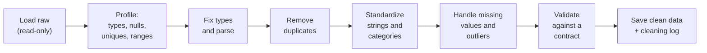
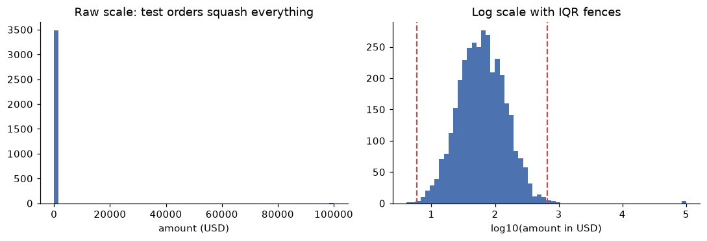
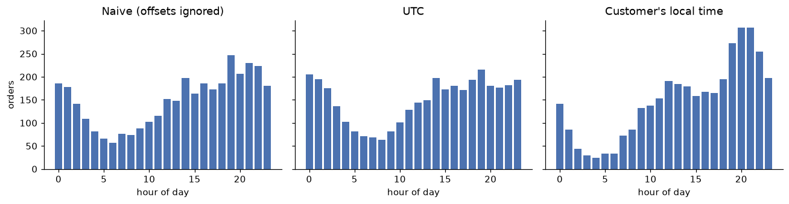

# Data cleaning

> **Level 2 · Chapter 2** · ⏱️ ~60 min read · Prerequisites: [SQL and data acquisition](01-sql-and-data-acquisition.md) and [pandas](../00-python-for-data/05-pandas.md)

Raw data is never ready to analyze. This chapter teaches a systematic way to clean it: reshape it into tidy form, parse types, understand *why* values are missing before you fill them, handle outliers, duplicates, inconsistent strings, dates, and time zones, and write validation checks so bad data can't sneak back in. You'll clean the ShopCo tables from Chapter 1 end to end and turn the result into a reusable function.

## Why it matters

ShopCo's marketing team wanted to send promotional emails at the hour customers are most likely to buy. Priya pulled a year of orders and plotted orders by hour of day. The timestamps came from two systems: the website wrote UTC times ending in `Z`, and the mobile app wrote local times with an offset such as `+05:30`. To get the hour, Priya took characters 11 and 12 of each string. That's quick, and it ignores the offsets.

The chart looked plausible: a broad, flat hump with its tallest bar at 19:00. The emails went out at 19:00 UTC. Conversion barely moved. A month later, Wei re-parsed the timestamps properly and converted each order to the customer's own time zone. The real peak was a sharp one at 20:00 to 21:00 local time. For customers in the US, India, and Brazil, most of the customer base, 19:00 UTC was hours away from it. The first analysis had mixed instants from five time zones, half of them with the offset ignored, into one meaningless histogram.

Nothing crashed. Every step "worked". That's the nature of dirty data: it rarely causes errors. It causes plausible, wrong answers. Cleaning is how you make sure that the numbers mean what you think they mean.

## Concepts

### A cleaning workflow

Cleaning goes best when it's systematic rather than reactive. A good order of operations:



Four principles make the process trustworthy:

1. **Never edit raw data.** Keep the original files or tables untouched, and produce cleaned copies. If a cleaning decision turns out wrong, you can redo it.
2. **Clean with code, not by hand.** A fix made by editing a spreadsheet cell is invisible and unrepeatable. A fix in a script can be reviewed, rerun on next month's data, and corrected.
3. **Log every decision with counts.** "Removed 71 duplicate orders" is a fact you can check and report. Silent row loss is one of the most common analysis bugs.
4. **Clean for the question.** Whether a USD 4,000 order is an error depends on the business. Whether a missing age matters depends on whether you need age. Decide with the question in mind, and write the reason next to the rule.

Start by generating the ShopCo data again. It's the same generator as Chapter 1.

??? example "The ShopCo data generator (expand and run this first)"

    ```python
    import numpy as np
    import pandas as pd

    def make_shop(n_users=5000, seed=42):
        """Messy, seeded synthetic data for ShopCo: returns (users, events, orders)."""
        rng = np.random.default_rng(seed)
        start = pd.Timestamp("2024-01-01", tz="UTC")
        end = pd.Timestamp("2025-01-01", tz="UTC")

        # ---------- users ----------
        uid = np.arange(1001, 1001 + n_users)
        country = rng.choice(["US", "UK", "DE", "IN", "BR"], n_users, p=[.40, .20, .15, .15, .10])
        p_mobile = pd.Series(country).map({"US": .35, "UK": .80, "DE": .45, "IN": .80, "BR": .60}).to_numpy()
        device = np.where(rng.random(n_users) < p_mobile, "mobile",
                          rng.choice(["desktop", "tablet"], n_users, p=[.85, .15]))
        channel = rng.choice(["organic", "paid_search", "social", "email", "referral"],
                             n_users, p=[.35, .25, .20, .10, .10])
        signup = start + pd.to_timedelta(rng.uniform(0, 330, n_users), unit="D")
        age_true = np.clip(rng.normal(36, 11, n_users), 18, 80).round()
        age = age_true.copy()
        age[rng.random(n_users) < np.where(device == "mobile", .15, .04)] = np.nan  # mobile form skips age
        age[rng.choice(n_users, 25, replace=False)] = -1                           # "unknown" sentinel
        age[rng.choice(n_users, 4, replace=False)] = [230, 199, 340, 2]            # typos
        variants = {"US": ["us", "USA", "United States"], "UK": ["uk", "U.K.", "United Kingdom"],
                    "DE": ["de", "Germany"], "IN": ["India", " IN"], "BR": ["Brazil", "br "]}
        messy = rng.random(n_users) < 0.2
        country_raw = [rng.choice(variants[c]) if m else c for c, m in zip(country, messy)]
        users = pd.DataFrame({
            "user_id": uid,
            "signup_at": signup.strftime("%Y-%m-%d %H:%M:%S"),    # UTC, stored as text
            "country": country_raw, "device": device, "channel": channel, "age": age,
        })
        users = pd.concat([users, users.sample(60, random_state=seed)])  # double-submitted forms

        # ---------- sessions and funnel events ----------
        lam = pd.Series(channel).map({"email": 9, "referral": 7, "organic": 6,
                                      "social": 4, "paid_search": 4}).to_numpy()
        n_sess = rng.poisson(lam * rng.gamma(2, 0.5, n_users))
        s_user = np.repeat(np.arange(n_users), n_sess)
        s_dev, s_cty = device[s_user], country[s_user]
        # visits follow a daily rhythm in the customer's *local* time, peaking in the evening
        hour_w = np.array([3, 2, 1, 1, 1, 1, 2, 3, 4, 5, 5, 6, 7, 6, 6, 6, 6, 7, 8, 10, 11, 10, 8, 5])
        local_s = rng.choice(24, len(s_user), p=hour_w / hour_w.sum()) * 3600 + rng.uniform(0, 3600, len(s_user))
        utc_off = pd.Series(s_cty).map({"US": -5, "UK": 0, "DE": 1, "IN": 5.5, "BR": -3}).to_numpy()
        day = (signup[s_user] + (end - signup[s_user]) * rng.random(len(s_user))).floor("D")
        s_start = day + pd.to_timedelta(local_s - utc_off * 3600, unit="s")
        s_start = s_start.where(s_start > signup[s_user], signup[s_user] + pd.Timedelta(minutes=5))
        s_start = s_start.where(s_start < end - pd.Timedelta(hours=1), end - pd.Timedelta(hours=1))
        p_buy = np.select([s_dev == "desktop", s_dev == "tablet"], [.85, .70], .40) + .12 * (s_cty == "UK")
        cart = rng.random(len(s_user)) < .35
        checkout = cart & (rng.random(len(s_user)) < .60)
        purchase = checkout & (rng.random(len(s_user)) < p_buy)
        t_cart = s_start + pd.to_timedelta(rng.uniform(30, 600, len(s_user)), unit="s")
        t_chk = t_cart + pd.to_timedelta(rng.uniform(30, 300, len(s_user)), unit="s")
        t_buy = t_chk + pd.to_timedelta(rng.uniform(10, 120, len(s_user)), unit="s")
        sid = np.arange(1, len(s_user) + 1)
        parts = []
        for name, mask, t in [("page_view", np.ones(len(s_user), bool), s_start), ("add_to_cart", cart, t_cart),
                              ("checkout", checkout, t_chk), ("purchase", purchase, t_buy)]:
            parts.append(pd.DataFrame({"session_id": sid[mask], "user_id": uid[s_user][mask],
                                       "event_type": name, "ts_ms": t[mask].as_unit("ms").asi8}))
        events = pd.concat(parts).sort_values("ts_ms", ignore_index=True)
        events = pd.concat([events, events.sample(frac=.01, random_state=seed)])  # client retries
        events = events.sort_values("ts_ms", ignore_index=True)
        events.insert(0, "event_id", np.arange(1, len(events) + 1))

        # ---------- orders (one per purchase session) ----------
        o_idx = np.flatnonzero(purchase)
        n_o = len(o_idx)
        cats = np.array(["electronics", "home", "fashion", "books", "beauty"])
        cat = rng.choice(cats, n_o, p=[.20, .25, .25, .15, .15])
        median = pd.Series(cat).map({"electronics": 120, "home": 60, "fashion": 45,
                                     "books": 18, "beauty": 30}).to_numpy()
        n_items = 1 + rng.poisson(.6, n_o)
        spend = median * n_items ** .7 * np.exp(.01 * (age_true[s_user][o_idx] - 36))
        amount = np.round(spend * rng.lognormal(0, .5, n_o), 2)
        status = rng.choice(["completed", "cancelled", "refunded"], n_o, p=[.90, .05, .05])
        amount[(status == "refunded") & (rng.random(n_o) < .5)] *= -1          # some refunds stored negative
        amount[rng.random(n_o) < .015] = np.nan                                 # lost in a migration
        amount[rng.choice(n_o, 4, replace=False)] = 99999.0                     # QA test orders
        cat_raw = cat.astype(object)
        r = rng.random(n_o)
        cat_raw[r < .10] = np.char.title(cat[r < .10].astype(str))
        cat_raw[(r >= .10) & (r < .15)] = np.char.upper(cat[(r >= .10) & (r < .15)].astype(str))
        cat_raw[(r >= .15) & (r < .20)] = np.char.add(cat[(r >= .15) & (r < .20)].astype(str), " ")
        coupon = rng.choice(np.array([None, "WELCOME10", "SPRING20", "FREESHIP"], dtype=object),
                            n_o, p=[.80, .08, .06, .06])
        # timestamps: web writes UTC with "Z"; the mobile app writes local time with an offset
        t = pd.Series(t_buy[o_idx])
        o_dev, o_cty = s_dev[o_idx], s_cty[o_idx]
        ts = t.dt.strftime("%Y-%m-%dT%H:%M:%SZ")
        tzs = {"US": "America/New_York", "UK": "Europe/London", "DE": "Europe/Berlin",
               "IN": "Asia/Kolkata", "BR": "America/Sao_Paulo"}
        for c, tz in tzs.items():
            m = (o_dev == "mobile") & (o_cty == c)
            local = t[m].dt.tz_convert(tz).dt.strftime("%Y-%m-%d %H:%M:%S%z")
            ts[m] = local.str[:-2] + ":" + local.str[-2:]
        orders = pd.DataFrame({
            "order_id": np.arange(500001, 500001 + n_o), "user_id": uid[s_user][o_idx],
            "order_ts": ts.to_numpy(), "category": cat_raw, "amount_usd": amount,
            "n_items": n_items, "status": status, "coupon": coupon,
        })
        orphans = orders.sample(15, random_state=seed).assign(user_id=lambda d: d.user_id + 90000,
                                                              order_id=lambda d: d.order_id + 50000)
        orders = pd.concat([orders, orphans, orders.sample(frac=.02, random_state=seed + 1)])
        orders = orders.sample(frac=1, random_state=seed).reset_index(drop=True)
        return users.reset_index(drop=True), events, orders
    ```

```python
import numpy as np
import pandas as pd

pd.set_option("display.width", 120)
pd.set_option("display.max_columns", 20)
users, events, orders = make_shop()
```

### Tidy data

Before fixing individual values, make sure the table has a sensible shape. **Tidy data**, a term popularized by Hadley Wickham, follows three rules:

1. Each **variable** is a column.
2. Each **observation** is a row.
3. Each type of **observational unit** is its own table.

ShopCo's three tables are tidy: users, events, and orders are different units, and each row is one of them. But data often arrives untidy, especially from spreadsheets and reports. A typical example is a "wide" report with one column per month:

```python
wide = pd.DataFrame({
    "category": ["books", "home"],
    "2024-01": [310.5, 920.0],
    "2024-02": [298.0, 1012.4],
    "2024-03": [355.2, 980.9],
})
long = wide.melt(id_vars="category", var_name="month", value_name="revenue_usd")
long["month"] = pd.to_datetime(long["month"])
print(long)
```

```text
  category      month  revenue_usd
0    books 2024-01-01        310.5
1     home 2024-01-01        920.0
2    books 2024-02-01        298.0
3     home 2024-02-01       1012.4
4    books 2024-03-01        355.2
5     home 2024-03-01        980.9
```

In the wide table, "month" is a variable hidden in the column headers. In the long (tidy) table, it's a column you can filter, group, join, and plot. Other common untidy patterns are several values packed into one cell (`"red;blue"`), one variable split across columns (`first_name`, `last_name` is fine; `revenue_q1`, `revenue_q2` is not), and two units mixed in one table (customer details repeated on every order row).

Tidy is the right form for *analysis*. Wide is often the right form for *presentation*, such as a report table with months across the top. Use `pivot_table` to go back when you present.

### Profiling: look before you fix

**Profiling** means summarizing every column before changing anything: its type, how many values are missing, how many distinct values it has, and a few examples. A small function does it for any table:

```python
def profile(df):
    """One row per column: dtype, missing count and share, distinct count, and examples."""
    return pd.DataFrame({
        "dtype": df.dtypes.astype(str),
        "n_missing": df.isna().sum(),
        "pct_missing": (100 * df.isna().mean()).round(1),
        "n_unique": df.nunique(),
        "examples": [df[c].dropna().unique()[:3].tolist() for c in df.columns],
    })

print(profile(users))
print(profile(orders))
```

```text
             dtype  n_missing  pct_missing  n_unique                                           examples
user_id      int64          0          0.0      5000                                 [1001, 1002, 1003]
signup_at      str          0          0.0      5000  [2024-09-01 10:55:12, 2024-11-24 14:47:13, 202...
country        str          0          0.0        17                                      [IN, UK,  IN]
device         str          0          0.0         3                          [mobile, desktop, tablet]
channel        str          0          0.0         5                      [organic, email, paid_search]
age        float64        529         10.5        58                                 [25.0, 42.0, 36.0]
              dtype  n_missing  pct_missing  n_unique                                           examples
order_id      int64          0          0.0      3565                           [501290, 500121, 500840]
user_id       int64          0          0.0      2169                                 [2835, 1182, 2227]
order_ts        str          0          0.0      3550  [2024-10-19T22:41:44Z, 2024-11-23 11:49:42+05:...
category        str          0          0.0        20                     [electronics, books , fashion]
amount_usd  float64         53          1.5      3162                             [105.67, 10.36, 59.82]
n_items       int64          0          0.0         5                                          [1, 2, 3]
status          str          0          0.0         3                   [completed, refunded, cancelled]
coupon          str       2915         80.2         3                    [SPRING20, WELCOME10, FREESHIP]
```

Read the profile line by line and write down everything that looks wrong:

- `signup_at` and `order_ts` are **strings**, not timestamps.
- `country` has far more than five distinct values for a store that sells in five countries.
- `age` has missing values, and it's a float, partly because pandas uses `NaN` (a float) to mark missing numbers.
- `category` has more distinct spellings than there are categories.
- `coupon` is mostly missing. Is that unknown, or "no coupon"?

Then add the numeric ranges, which is where impossible values show up:

```python
print(users["age"].describe().round(1))
print(orders["amount_usd"].describe().round(2))
```

```text
count    4531.0
mean       36.4
std        12.8
min        -1.0
25%        29.0
50%        36.0
75%        44.0
max       340.0
Name: age, dtype: float64
count     3583.00
mean       195.19
std       3338.29
min       -311.22
25%         32.83
50%         59.94
75%        110.50
max      99999.00
Name: amount_usd, dtype: float64
```

An age of -1 and an age of 340 are not real ages. A negative order amount and a maximum of exactly 99,999 need explaining. Profiling took two minutes and found most of this chapter's work.

### Types and parsing

Getting types right is the foundation, because every later operation depends on them. A date stored as a string sorts alphabetically, can't be subtracted, and can't be grouped by month. A number stored as a string can't be summed.

The tools:

- `pd.to_datetime` parses dates and times. Pass `utc=True` when strings carry offsets, and `format=...` when you know the format (faster, and it fails loudly instead of guessing).
- `pd.to_numeric(..., errors="coerce")` parses numbers and turns anything unparseable into `NaN`.
- `.astype("category")` stores a low-cardinality string column as integer codes plus a lookup table: smaller and faster.
- `.astype("Int64")` (capital I) is pandas' **nullable integer** type, which can hold missing values without turning integers into floats.

`errors="coerce"` is convenient and dangerous, because it converts every bad value into a missing one *silently*. Always count what was coerced:

```python
raw = pd.Series(["1,234.50", "USD 99", " 42 ", "N/A", "", "3.5e2", "twelve"])
cleaned = raw.str.replace("USD", "").str.replace(",", "").str.strip()
parsed = pd.to_numeric(cleaned.replace({"": None, "N/A": None}), errors="coerce")
print(pd.DataFrame({"raw": raw, "parsed": parsed}))
failed = parsed.isna() & ~raw.str.strip().isin(["", "N/A"])
print("values that failed to parse:", raw[failed].tolist())
```

```text
        raw  parsed
0  1,234.50  1234.5
1    USD 99    99.0
2       42     42.0
3       N/A     NaN
4               NaN
5     3.5e2   350.0
6    twelve     NaN
values that failed to parse: ['twelve']
```

The explicit missing markers (`""` and `"N/A"`) become `NaN` on purpose. `"twelve"` becomes `NaN` by accident, and the last line catches it. In real data, look at the failures before deciding what to do with them.

For ShopCo, three columns need parsing. `signup_at` is a UTC timestamp written without an offset. `ts_ms` is Unix epoch milliseconds. `order_ts` mixes formats and offsets, which the time zone section handles below.

```python
signup = pd.to_datetime(users["signup_at"], format="%Y-%m-%d %H:%M:%S", utc=True)
event_ts = pd.to_datetime(events["ts_ms"], unit="ms", utc=True)
print(signup.dtype, signup.min(), signup.max())
print(event_ts.dtype, event_ts.min(), event_ts.max())
print(users["age"].astype("Int64").head(3).tolist())
```

```text
datetime64[us, UTC] 2024-01-01 01:21:20+00:00 2024-11-25 23:51:40+00:00
datetime64[ms, UTC] 2024-01-02 12:49:54.797000+00:00 2024-12-31 23:12:46.186000+00:00
[25, <NA>, 42]
```

Check the minimum and maximum of every parsed date. A parsing mistake, such as reading epoch milliseconds as seconds or swapping day and month, usually produces dates in 1970, the far future, or the wrong season.

### Duplicates

Duplicates come in three kinds, and each needs a different fix:

- **Exact duplicates**: every column is identical. Usually a pipeline loaded the same data twice, or a form was submitted twice. Drop all but one.
- **Key duplicates**: the same primary key with *different* content, such as an order that appears once as `completed` and once as `refunded`. These are often updates, and you need a rule for which version wins, such as "keep the row with the latest `updated_at`".
- **Near duplicates**: the same real-world entity under slightly different records, such as one customer with two accounts. These need **entity resolution** (matching on name, email, address), which is a whole field of its own.

A subtle case: ShopCo's events have a unique `event_id`, so no two rows are exact duplicates. But when the mobile app retries a request, the server records the same event twice and gives each copy a new ID. You only see these duplicates when you compare the columns that describe the event itself:

```python
event_cols = ["session_id", "user_id", "event_type", "ts_ms"]
print("users, exact duplicates:       ", users.duplicated().sum())
print("users, duplicate user_id:      ", users["user_id"].duplicated().sum())
print("orders, exact duplicates:      ", orders.duplicated().sum())
print("orders, duplicate order_id:    ", orders["order_id"].duplicated().sum())
print("events, exact duplicates:      ", events.duplicated().sum())
print("events, duplicate content:     ", events.duplicated(subset=event_cols).sum())
```

```text
users, exact duplicates:        60
users, duplicate user_id:       60
orders, exact duplicates:       71
orders, duplicate order_id:     71
events, exact duplicates:       0
events, duplicate content:      462
```

For users and orders, the key duplicates and the exact duplicates are the same rows, which means every duplicate is an identical copy. That's the easy case: `drop_duplicates()` is safe. If there had been more key duplicates than exact duplicates, some keys would have conflicting versions, and you'd need to look at them before choosing.

!!! warning "Common mistake: deduplicating on the wrong columns"
    `drop_duplicates()` with no arguments compares every column, including surrogate IDs like `event_id` that are unique by construction. It then finds nothing. Deduplicate on the columns that define the *thing* (the event's content), and check how many rows you removed against what you expected.

### Inconsistent categories and strings

Free text and loosely controlled fields drift: `"US"`, `"us"`, `"USA"`, `"United States"`, and `" US"` with a leading space. Grouping treats each as a separate value. The fix has three steps:

1. **Normalize mechanically**: strip whitespace and fix case. This alone collapses many variants.
2. **Map explicitly**: a dictionary from every known variant to its canonical value.
3. **Check for leftovers**: anything not covered by the map is either a new variant to add or a genuinely invalid value. Never let unmapped values pass silently.

```python
COUNTRY_MAP = {"US": "US", "USA": "US", "UNITED STATES": "US", "UK": "UK", "U.K.": "UK",
               "UNITED KINGDOM": "UK", "DE": "DE", "GERMANY": "DE", "IN": "IN", "INDIA": "IN",
               "BR": "BR", "BRAZIL": "BR"}

step1 = users["country"].str.strip().str.upper()
print("distinct before:", users["country"].nunique(), " after strip+upper:", step1.nunique())
country = step1.map(COUNTRY_MAP)
print("unmapped values:", step1[country.isna()].unique().tolist())
print(country.value_counts())
```

```text
distinct before: 17  after strip+upper: 12
unmapped values: []
country
US    2045
UK    1038
IN     756
DE     721
BR     500
Name: count, dtype: int64
```

When you don't know the variants in advance, Python's `difflib` can suggest close matches to a list of canonical values, which helps you build the map. Treat its suggestions as candidates for a human to approve, not as automatic fixes: `"Austria"` and `"Australia"` are close strings and different countries.

```python
import difflib

canonical = ["electronics", "home", "fashion", "books", "beauty"]
for raw_value in ["Electronics ", "HOME", "fashon", "boks", "garden"]:
    match = difflib.get_close_matches(raw_value.strip().lower(), canonical, n=1, cutoff=0.75)
    print(f"{raw_value!r:15} -> {match}")
```

```text
'Electronics '  -> ['electronics']
'HOME'          -> ['home']
'fashon'        -> ['fashion']
'boks'          -> ['books']
'garden'        -> []
```

Two more string traps are worth knowing. **Unicode**: the same visible text can have different underlying characters (an accented "é" can be one code point or two), so normalize with `unicodedata.normalize("NFKC", s)` when text comes from many sources. And **encodings**: a file read with the wrong encoding turns "Zürich" into "Zürich". When you see that pattern, re-read the file as UTF-8.

### Missing data: mechanisms first, then imputation

Before you fill a missing value, ask *why* it's missing. The answer decides which fixes are valid. Statisticians (following Donald Rubin) classify the reasons into three **missing data mechanisms**.

Let $Y$ be a variable with some values missing, such as age, and let $R$ be the **missingness indicator**: $R = 1$ when the value is missing and $R = 0$ when it's observed. Let $X$ be other variables we observe fully, such as device.

- **MCAR (missing completely at random)**: missingness is unrelated to anything, observed or not.

    $$
    P(R = 1 \mid X, Y) = P(R = 1)
    $$

    Example: a server randomly dropped 2% of form submissions. The observed values are a random sample of all values.

- **MAR (missing at random)**: missingness depends only on *observed* variables.

    $$
    P(R = 1 \mid X, Y) = P(R = 1 \mid X)
    $$

    Example: ShopCo's mobile signup form makes age optional and many mobile users skip it, while the desktop form requires it. Missingness depends on device, which we observe. The name is confusing: MAR does *not* mean random overall, only random *within* groups defined by observed variables.

- **MNAR (missing not at random)**: missingness depends on the missing value itself, or on something we don't observe.

    $$
    P(R = 1 \mid X, Y) \text{ depends on } Y
    $$

    Example: older customers are more reluctant to state their age, or high earners skip the income question.

Why it matters: under MCAR, dropping incomplete rows (**complete-case analysis**) gives unbiased estimates; you just lose sample size. Under MAR, complete-case estimates can be biased, but you can correct the bias using the observed variables that drive missingness. Under MNAR, the data alone can't tell you the answer; you need assumptions or extra information.

You can't prove which mechanism holds from the data, because the missing values are, by definition, missing. But you can test MCAR against MAR: if missingness differs across groups of an observed variable, it isn't MCAR.

```python
print(users.groupby("device")["age"].apply(lambda s: s.isna().mean()).round(3))
```

```text
device
desktop    0.044
mobile     0.153
tablet     0.044
Name: age, dtype: float64
```

Age is missing about three and a half times as often for mobile signups. That rules out MCAR, and it's consistent with MAR given device (it could still be MNAR as well; no test on observed data can rule that out).

A simulation shows what each mechanism does to the simplest estimate, the mean. Below, mobile users are younger than desktop users, which is realistic. We hide ages under each mechanism and compare three estimates of the true mean age: the complete-case mean, the mean after filling with the overall mean (which equals the complete-case mean), and the mean after **group-wise imputation**, filling each missing age with the median of its device group.

```python
rng = np.random.default_rng(0)
n = 100_000
mobile = rng.random(n) < 0.5
age = np.where(mobile, rng.normal(30, 8, n), rng.normal(42, 10, n))
true_mean = age.mean()

masks = {
    "MCAR": rng.random(n) < 0.20,
    "MAR (by device)": rng.random(n) < np.where(mobile, 0.35, 0.05),
    "MNAR (older skip)": rng.random(n) < 1 / (1 + np.exp(-(age - 50) / 5)),
}
rows = []
for name, miss in masks.items():
    s = pd.Series(np.where(miss, np.nan, age))
    group_fill = s.fillna(s.groupby(mobile).transform("median"))
    rows.append({"mechanism": name, "pct_missing": 100 * miss.mean(),
                 "complete_case": s.mean(), "group_imputed": group_fill.mean()})
res = pd.DataFrame(rows).set_index("mechanism")
print(f"true mean age: {true_mean:.2f}")
print(res.round(2))
```

```text
true mean age: 35.97
                   pct_missing  complete_case  group_imputed
mechanism
MCAR                     20.04          35.97          35.96
MAR (by device)          20.05          37.08          35.96
MNAR (older skip)        15.99          33.38          34.03
```

Under MCAR, every method is fine. Under MAR, the complete-case mean is biased upward, because the younger mobile users are underrepresented among the observed ages; filling within device groups removes the bias. Under MNAR, both are biased, because the people missing are systematically older than the observed people *in the same group*, and nothing in the observed data reveals by how much.

Now the menu of **imputation** methods (filling in missing values), with their costs:

| Method | What it does | Valid under | Cost |
|---|---|---|---|
| Drop rows (complete case) | Remove rows with any missing value | MCAR | Loses data; biased under MAR |
| Mean or median | Fill with one global value | MCAR, roughly | Shrinks variance, weakens correlations |
| Group-wise median | Fill with the median of a related group | MAR given the group | Needs a good grouping variable |
| Model-based (regression, kNN, iterative) | Predict the missing value from other columns | MAR | More complex; can still understate uncertainty |
| Multiple imputation | Impute several times with noise, analyze each, combine | MAR | The statistically principled choice for inference |
| Missing indicator | Add a column `age_missing` and fill with a constant | Any (for prediction) | Lets a model learn from missingness itself |

**Why mean imputation shrinks variance.** Suppose a fraction $m$ of $n$ values are missing, the observed values have mean $\bar{y}$ and variance $\sigma^2$, and you fill the missing ones with $\bar{y}$. The filled values contribute zero to the sum of squared deviations, so the total sum of squares stays at about $(1 - m)\,n\,\sigma^2$, now divided by $n$:

$$
\operatorname{Var}_{\text{imputed}} \approx \frac{(1-m)\,n\,\sigma^2}{n} = (1 - m)\,\sigma^2
$$

With 20% missing, the apparent variance drops by 20%, and the standard deviation by about 11% (since $\sqrt{0.8} \approx 0.89$). Confidence intervals become too narrow, and correlations with other variables are pulled toward zero, because the filled-in values don't vary with anything.

**Structural missingness** is a different thing entirely. ShopCo's `coupon` column is missing for about 80% of orders because those orders didn't use a coupon. That's not unknown information; it's a known "none". Fill it with an explicit value such as `"none"`, and don't count it as a data quality problem.

!!! warning "Common mistake: imputing with information from the test set"
    When you build a model, compute imputation values (medians, group medians, fitted imputation models) on the training data only, then apply them to validation and test data. Computing a median on the full dataset leaks information about the test set into training. Chapter 4 covers this kind of leakage, and scikit-learn pipelines prevent it.

For ShopCo, we won't impute age at all during cleaning. We'll mark invalid values as missing, keep them missing, and let each analysis decide. A cleaned dataset should record what's known; imputation is a modeling decision.

### Outliers

An **outlier** is a value far from the bulk of the data. Outliers come from two very different sources, and the first job is telling them apart:

- **Errors**: typos (age 340), test records (a USD 99,999 order), unit mistakes (cents stored as dollars), and sentinel codes (age -1 meaning "unknown"). These should be fixed or removed.
- **Genuine extremes**: a real customer who spent USD 1,500. Removing these throws away true information, often the most important information (fraud, whales, failures).

Three detection rules are common. Each gives a **fence**: values beyond it get flagged for a look.

1. **Z-score**: $z_i = (x_i - \bar{x}) / s$, where $\bar{x}$ is the mean and $s$ the standard deviation. Flag $|z_i| > 3$. The weakness: the outliers inflate $\bar{x}$ and $s$ themselves, so a few huge values can hide each other. This is called **masking**.
2. **Robust z-score**: replace the mean with the median and the standard deviation with the **median absolute deviation**, $\text{MAD} = \operatorname{median}_i\left(|x_i - \operatorname{median}(x)|\right)$. For normal data, $\text{MAD} \approx 0.6745\,\sigma$, so the robust z-score is

    $$
    z_i^{\text{robust}} = \frac{x_i - \operatorname{median}(x)}{1.4826 \cdot \text{MAD}}
    $$

    where $1.4826 \approx 1/0.6745$ makes it comparable to an ordinary z-score. Medians barely move when a few extreme values are added, so this rule doesn't suffer from masking.
3. **IQR fences** (Tukey's rule): with quartiles $Q_1$ and $Q_3$ and **interquartile range** $\text{IQR} = Q_3 - Q_1$, flag values below $Q_1 - 1.5\,\text{IQR}$ or above $Q_3 + 1.5\,\text{IQR}$. This is what a box plot's whiskers show.

All three assume roughly symmetric data. Order amounts are strongly right-skewed (many small orders, a long tail of large ones), so on the raw scale these rules flag hundreds of perfectly real orders. A better approach for skewed, positive data is to apply the rules to $\log(x)$, where the distribution is closer to symmetric:

```python
amt = orders["amount_usd"].dropna()
pos = amt[amt > 0]

def iqr_flags(x):
    q1, q3 = x.quantile([0.25, 0.75])
    return (x < q1 - 1.5 * (q3 - q1)) | (x > q3 + 1.5 * (q3 - q1))

def robust_z(x):
    med = x.median()
    mad = (x - med).abs().median()
    return (x - med) / (1.4826 * mad)

print("negative amounts:             ", (amt < 0).sum())
print("z-score |z| > 3 (raw):        ", (((pos - pos.mean()) / pos.std()).abs() > 3).sum())
print("IQR flags (raw scale):        ", iqr_flags(pos).sum())
print("IQR flags (log scale):        ", iqr_flags(np.log(pos)).sum())
print("robust |z| > 3.5 (log scale): ", (robust_z(np.log(pos)).abs() > 3.5).sum())
print("largest values:", pos.nlargest(6).tolist())
```

```text
negative amounts:              98
z-score |z| > 3 (raw):         4
IQR flags (raw scale):         216
IQR flags (log scale):         18
robust |z| > 3.5 (log scale):  4
largest values: [99999.0, 99999.0, 99999.0, 99999.0, 1019.12, 1019.12]
```

The raw z-score flags exactly the four test orders and nothing else. They inflate the standard deviation to over USD 3,000, so a genuine USD 1,000 order gets a z-score well below 1: the extremes hide everything less extreme. With several outliers of different sizes, that's how they mask each other. The raw IQR rule has the opposite problem and flags over 200 ordinary large orders, because the distribution is skewed. On the log scale, the IQR rule flags 18 orders (unusually small or large, but plausible), and the robust z-score at a threshold of 3.5 flags just the four test orders, which stand far apart from everything else.

```python
import matplotlib.pyplot as plt

fig, axes = plt.subplots(1, 2, figsize=(10, 3.5))
axes[0].hist(pos, bins=60, color="#4C72B0")
axes[0].set_title("Raw scale: test orders squash everything")
axes[0].set_xlabel("amount (USD)")
axes[1].hist(np.log10(pos), bins=60, color="#4C72B0")
q1, q3 = np.log10(pos).quantile([0.25, 0.75])
for fence in [q1 - 1.5 * (q3 - q1), q3 + 1.5 * (q3 - q1)]:
    axes[1].axvline(fence, color="#C44E52", linestyle="--")
axes[1].set_title("Log scale with IQR fences")
axes[1].set_xlabel("log10(amount in USD)")
for ax in axes:
    ax.spines[["top", "right"]].set_visible(False)
plt.tight_layout()
plt.show()
```



*On the raw scale, four test orders stretch the axis so far that the real distribution collapses into one bar. On the log scale the shape is visible, and the test orders sit far beyond the fence.*

Once you've found outliers, the options are:

- **Fix** them if you know the true value (a refund stored as a negative amount can become positive with a `refunded` status).
- **Remove** them if they're not real (test orders) and log how many you removed.
- **Cap** (or **winsorize**) them: replace values beyond a percentile, such as the 1st and 99th, with that percentile. This limits their influence on means and models without deleting rows.
- **Keep** them and use robust methods: medians instead of means, log transforms, or rank-based statistics.

Whatever you choose, decide using domain knowledge and write the rule down. "Ages outside 13 to 100 are invalid because the site requires users to be 13 or older" is a rule someone can check and challenge.

### Dates and time zones

Time is the messiest data type. Get the concepts straight first:

- An **instant** is a single point in time, the same everywhere: "the moment the order was placed". Store instants in **UTC** (Coordinated Universal Time).
- A **wall-clock time** (or local time) is what a clock on the wall showed somewhere: "20:15 in Mumbai". It means nothing without a place.
- A **UTC offset** like `+05:30` says how far a local time is from UTC *at that moment*.
- A **time zone** like `Europe/Berlin` is a set of rules for which offset applies when, including **daylight saving time** (DST). Berlin is `+01:00` in winter and `+02:00` in summer. Time zones are named with **IANA** identifiers (`Region/City`), and an offset alone isn't enough to recover them.

The rule of thumb: **parse with offsets, store in UTC, convert to local time only for questions about local behavior** ("what hour do people shop?").

ShopCo's `order_ts` mixes `2024-10-19T22:41:44Z` (UTC) and `2024-11-23 11:49:42+05:30` (local with offset). `pd.to_datetime(..., utc=True, format="ISO8601")` parses both, applies each offset, and returns UTC instants. Compare that with the naive approach from the story, which reads the clock digits and ignores the offset:

```python
TIMEZONES = {"US": "America/New_York", "UK": "Europe/London", "DE": "Europe/Berlin",
             "IN": "Asia/Kolkata", "BR": "America/Sao_Paulo"}

o = orders.drop_duplicates()
naive_hour = o["order_ts"].str[11:13].astype(int)                 # the wrong way
ts_utc = pd.to_datetime(o["order_ts"], utc=True, format="ISO8601")  # the right way
print(o["order_ts"].iloc[1], "->", ts_utc.iloc[1])

o_country = o["user_id"].map(users.drop_duplicates().set_index("user_id")["country"]
                             .str.strip().str.upper().map(COUNTRY_MAP))
local_hour = pd.Series(-1, index=o.index)
for c, tz in TIMEZONES.items():
    m = o_country == c
    local_hour[m] = ts_utc[m].dt.tz_convert(tz).dt.hour
local_hour = local_hour[local_hour >= 0]                          # orphan orders have no country

print("naive parse disagrees with UTC for", (naive_hour != ts_utc.dt.hour).mean().round(3), "of orders")
print("peak hour  naive:", naive_hour.mode()[0], " UTC:", ts_utc.dt.hour.mode()[0],
      " customer-local:", local_hour.mode()[0])
```

```text
2024-11-23 11:49:42+05:30 -> 2024-11-23 06:19:42+00:00
naive parse disagrees with UTC for 0.317 of orders
peak hour  naive: 19  UTC: 19  customer-local: 20
```

```python
fig, axes = plt.subplots(1, 3, figsize=(12, 3.2), sharey=True)
for ax, (title, h) in zip(axes, [("Naive (offsets ignored)", naive_hour),
                                 ("UTC", ts_utc.dt.hour),
                                 ("Customer's local time", local_hour)]):
    ax.bar(range(24), h.value_counts().reindex(range(24), fill_value=0), color="#4C72B0")
    ax.set_title(title)
    ax.set_xlabel("hour of day")
    ax.spines[["top", "right"]].set_visible(False)
axes[0].set_ylabel("orders")
plt.tight_layout()
plt.show()
```



*The same orders, three ways. Only the customer-local view answers "when do people shop?", and it shows a clear evening peak that the other two blur.*

The UTC chart is *correct* as a record of instants, and it's the right basis for questions like "how many orders happened during the outage from 14:00 to 15:00 UTC". It's just the wrong view for a question about human behavior, because 20:00 in Mumbai and 20:00 in New York are ten and a half hours apart.

Two DST traps catch everyone eventually. When clocks spring forward, some local times **don't exist** (in Berlin, 02:30 on 31 March 2024 never happened). When clocks fall back, some local times happen **twice** (01:30 on 3 November 2024 in New York is **ambiguous**). If you store local times without offsets, you can't tell those apart. That's one more reason to store UTC.

!!! warning "Common mistake: naive and aware timestamps"
    pandas distinguishes **naive** timestamps (no time zone) from **aware** ones (with a time zone). Comparing or subtracting a naive and an aware timestamp raises an error, which is good. Worse is when everything is naive but different columns silently mean different zones. Make every timestamp column aware, in UTC, as early as possible.

### Validation and data contracts

Cleaning once isn't enough. Next month's data will have new problems. **Validation** means checking data against explicit expectations every time it arrives, and failing loudly when they're violated.

A **data contract** is an agreement between the producer of a dataset (an app team, a vendor) and its consumers (you) about what the data looks like: column names and types, which columns can be null, allowed values, ranges, uniqueness, and freshness. Written as code, it becomes a test that runs in the pipeline. Tools such as pandera, Great Expectations, and dbt tests do this at scale, but the idea fits in a few lines of pandas:

```python
ORDERS_CONTRACT = {
    "order_id":   {"dtype": "int64", "unique": True, "nullable": False},
    "user_id":    {"dtype": "int64", "nullable": False},
    "order_ts":   {"dtype": "datetime64[us, UTC]", "nullable": False},
    "category":   {"allowed": {"electronics", "home", "fashion", "books", "beauty"}},
    "amount_usd": {"min": 0, "max": 10_000},
    "status":     {"allowed": {"completed", "cancelled", "refunded"}},
}

def validate(df, contract):
    """Return a list of human-readable contract violations (empty means valid)."""
    problems = []
    for col, rules in contract.items():
        if col not in df:
            problems.append(f"{col}: missing column")
            continue
        s = df[col]
        if "dtype" in rules and str(s.dtype) != rules["dtype"]:
            problems.append(f"{col}: dtype {s.dtype}, expected {rules['dtype']}")
        if rules.get("nullable") is False and s.isna().any():
            problems.append(f"{col}: {s.isna().sum()} nulls")
        if rules.get("unique") and s.duplicated().any():
            problems.append(f"{col}: {s.duplicated().sum()} duplicate values")
        if "allowed" in rules:
            bad = set(s.dropna().astype(str)) - rules["allowed"]
            if bad:
                problems.append(f"{col}: {len(bad)} unexpected values, e.g. {sorted(bad)[:3]}")
        if "min" in rules and (s < rules["min"]).any():
            problems.append(f"{col}: {(s < rules['min']).sum()} values below {rules['min']}")
        if "max" in rules and (s > rules["max"]).any():
            problems.append(f"{col}: {(s > rules['max']).sum()} values above {rules['max']}")
    return problems

for p in validate(orders, ORDERS_CONTRACT):
    print("FAIL", p)
```

```text
FAIL order_id: 71 duplicate values
FAIL order_ts: dtype str, expected datetime64[us, UTC]
FAIL category: 15 unexpected values, e.g. ['BEAUTY', 'BOOKS', 'Beauty']
FAIL amount_usd: 98 values below 0
FAIL amount_usd: 4 values above 10000
```

Every failure is one of the problems we found by profiling, now expressed as a check that runs automatically. In a production pipeline, a failure stops the load and alerts someone, rather than letting bad data flow into dashboards. Notice that `amount_usd` is allowed to be null here: we decided missing amounts are acceptable (and will be excluded from revenue), so the contract records that decision.

## In practice

### A complete, reusable cleaning function

Here's everything above as one function. Each rule has a comment explaining why. Later chapters reuse this exact function.

```python
def clean_shop(users, events, orders):
    """Apply the Chapter 2 cleaning rules. Returns clean (users, events, orders)."""
    u = users.drop_duplicates().copy()
    u["signup_at"] = pd.to_datetime(u["signup_at"], utc=True)
    u["country"] = u["country"].str.strip().str.upper().map(COUNTRY_MAP)
    u["age"] = u["age"].where(u["age"].between(13, 100))          # sentinels and typos -> NaN
    u = u.astype({"device": "category", "channel": "category", "country": "category"})

    e = events.drop_duplicates(subset=["session_id", "user_id", "event_type", "ts_ms"]).copy()
    e["ts"] = pd.to_datetime(e["ts_ms"], unit="ms", utc=True)
    e = e.drop(columns="ts_ms")

    o = orders.drop_duplicates().copy()
    o = o[o["user_id"].isin(u["user_id"])]                          # drop orphans
    o = o[o["amount_usd"].ne(99999.0)]                              # drop QA test orders
    o["order_ts"] = pd.to_datetime(o["order_ts"], utc=True, format="ISO8601")
    o["category"] = o["category"].str.strip().str.lower().astype("category")
    o["amount_usd"] = o["amount_usd"].abs()                         # refunds stored as negatives
    o["coupon"] = o["coupon"].fillna("none")
    country = o["user_id"].map(u.set_index("user_id")["country"])
    o["local_hour"] = -1
    for c, tz in TIMEZONES.items():
        m = (country == c).to_numpy()
        o.loc[m, "local_hour"] = o.loc[m, "order_ts"].dt.tz_convert(tz).dt.hour
    return u.reset_index(drop=True), e.reset_index(drop=True), o.reset_index(drop=True)

u, e, o = clean_shop(users, events, orders)
for name, before, after in [("users", users, u), ("events", events, e), ("orders", orders, o)]:
    print(f"{name:7s} {len(before):>6,} -> {len(after):>6,} rows ({len(before) - len(after):,} removed)")
print("contract violations after cleaning:", validate(o, ORDERS_CONTRACT))
print(profile(o)[["dtype", "n_missing", "n_unique"]])
```

```text
users    5,060 ->  5,000 rows (60 removed)
events  46,621 -> 46,159 rows (462 removed)
orders   3,636 ->  3,546 rows (90 removed)
contract violations after cleaning: []
                          dtype  n_missing  n_unique
order_id                  int64          0      3546
user_id                   int64          0      2153
order_ts    datetime64[us, UTC]          0      3546
category               category          0         5
amount_usd              float64         52      3136
n_items                   int64          0         5
status                      str          0         3
coupon                      str          0         4
local_hour                int64          0        24
```

Two details deserve a comment. The test-order filter uses `ne(99999.0)` rather than `< 10000` because a missing amount should survive cleaning; `NaN < 10000` is `False` and would silently drop those rows. And `category` is stored as a pandas categorical, which is smaller and makes the allowed set explicit.

The orders that remain with a missing `amount_usd` are still real orders: they count toward order volume and conversion, but not toward revenue. Write that down in the analysis, too.

### A cleaning log and before/after metrics

The final check is to compare the headline numbers before and after cleaning. Large changes are expected here; the point is that each one is explained by a logged rule.

```python
def headline(o_df, u_df):
    amt = pd.to_numeric(o_df["amount_usd"], errors="coerce")
    done = o_df["status"].eq("completed")
    return pd.Series({
        "user_rows": len(u_df),
        "orders": len(o_df),
        "revenue_usd": amt[done].sum().round(2),
        "mean_order_usd": amt[done].mean().round(2),
        "median_order_usd": amt[done].median().round(2),
    })

print(pd.DataFrame({"raw": headline(orders, users), "clean": headline(o, u)}))
```

```text
                        raw      clean
user_rows           5060.00    5000.00
orders              3636.00    3546.00
revenue_usd       683479.40  277159.97
mean_order_usd       213.19      88.49
median_order_usd      62.24      62.24
```

The four test orders alone had inflated revenue by roughly USD 400,000, more than doubling it, and the mean order value with it. The median barely moved, which is a good reminder of why medians are robust. Save the clean tables to Parquet so the types survive, and keep the cleaning script next to them.

<!-- skip-run -->
```python
u.to_parquet("users_clean.parquet")
e.to_parquet("events_clean.parquet")
o.to_parquet("orders_clean.parquet")
```

!!! warning "Common mistake: cleaning that changes the question"
    Every cleaning rule changes the population you're analyzing. Dropping orders with missing amounts means "revenue among orders with a recorded amount". Dropping users with missing age biases toward desktop users. Report the rules alongside the results, so readers know which population the numbers describe.

## Exercises

### Exercise 1: Tidy a report (easy)

A finance spreadsheet has one row per country and one column per quarter: `country, Q1_2024, Q2_2024, Q3_2024, Q4_2024`, with revenue values. Convert it to a tidy table with columns `country`, `quarter` (as a pandas `Period`), and `revenue_usd`, then compute each country's revenue growth from Q1 to Q4. Use this data: US 100, 120, 150, 180; DE 40, 42, 41, 50.

??? success "Solution"

    ```python
    wide = pd.DataFrame({"country": ["US", "DE"],
                         "Q1_2024": [100, 40], "Q2_2024": [120, 42],
                         "Q3_2024": [150, 41], "Q4_2024": [180, 50]})
    tidy = wide.melt(id_vars="country", var_name="quarter", value_name="revenue_usd")
    tidy["quarter"] = pd.PeriodIndex(tidy["quarter"].str[3:] + tidy["quarter"].str[:2], freq="Q")
    tidy = tidy.sort_values(["country", "quarter"]).reset_index(drop=True)
    print(tidy)
    growth = tidy.groupby("country")["revenue_usd"].agg(lambda s: s.iloc[-1] / s.iloc[0] - 1)
    print(growth.round(3))
    ```

    ```text
      country quarter  revenue_usd
    0      DE  2024Q1           40
    1      DE  2024Q2           42
    2      DE  2024Q3           41
    3      DE  2024Q4           50
    4      US  2024Q1          100
    5      US  2024Q2          120
    6      US  2024Q3          150
    7      US  2024Q4          180
    country
    DE    0.25
    US    0.80
    Name: revenue_usd, dtype: float64
    ```

    The header `Q1_2024` holds two variables (quarter and year) glued together. Reordering it to `2024Q1` lets pandas parse it as a quarterly period, which sorts correctly and supports date arithmetic.

### Exercise 2: Masking, by hand (easy)

For the values $x = [10, 11, 12, 12, 13, 14, 200, 250]$, compute by hand: the mean and standard deviation (use the sample standard deviation), the z-score of 200, the median, the MAD, and the robust z-score of 200. Which rule flags 200 at a threshold of 3? Check with NumPy.

??? success "Solution"

    The mean is $522 / 8 = 65.25$. The squared deviations from the mean sum to about $69{,}313.5$, dominated by 200 and 250, so the sample standard deviation is $\sqrt{69{,}313.5 / 7} \approx 99.5$. So $z_{200} = (200 - 65.25)/99.5 \approx 1.35$: not flagged. The two outliers inflate the standard deviation enough to hide each other.

    The median is the average of the middle two sorted values, $(12 + 13)/2 = 12.5$. The absolute deviations from 12.5 are $2.5, 1.5, 0.5, 0.5, 0.5, 1.5, 187.5, 237.5$; sorted, the middle two are $1.5$ and $1.5$, so $\text{MAD} = 1.5$. The robust z-score is $(200 - 12.5)/(1.4826 \times 1.5) \approx 84.3$: flagged by a mile.

    ```python
    x = np.array([10, 11, 12, 12, 13, 14, 200, 250])
    z = (x - x.mean()) / x.std(ddof=1)
    med = np.median(x)
    mad = np.median(np.abs(x - med))
    rz = (x - med) / (1.4826 * mad)
    print(f"mean={x.mean():.2f} sd={x.std(ddof=1):.2f} z(200)={z[6]:.2f}")
    print(f"median={med} MAD={mad} robust z(200)={rz[6]:.1f}")
    ```

    ```text
    mean=65.25 sd=99.51 z(200)=1.35
    median=12.5 MAD=1.5 robust z(200)=84.3
    ```

### Exercise 3: Testing the missingness mechanism (medium)

Use a chi-square test of independence (from Level 1) to test whether age missingness in the raw `users` table (after removing duplicates and treating -1 as missing) is independent of `device`. Then repeat for `channel`. What do the results say about MCAR?

??? success "Solution"

    ```python
    from scipy.stats import chi2_contingency

    uu = users.drop_duplicates().copy()
    uu["age_missing"] = uu["age"].isna() | uu["age"].eq(-1)
    for col in ["device", "channel"]:
        table = pd.crosstab(uu[col], uu["age_missing"])
        chi2, p, dof, _ = chi2_contingency(table)
        rates = uu.groupby(col)["age_missing"].mean().round(3).to_dict()
        print(f"{col:8s} chi2={chi2:7.1f} dof={dof} p={p:.2g}  missing rate: {rates}")
    ```

    ```text
    device   chi2=  140.2 dof=2 p=3.5e-31  missing rate: {'desktop': 0.05, 'mobile': 0.155, 'tablet': 0.05}
    channel  chi2=    4.1 dof=4 p=0.4  missing rate: {'email': 0.117, 'organic': 0.104, 'paid_search': 0.121, 'referral': 0.093, 'social': 0.106}
    ```

    Missingness strongly depends on device (a tiny p-value), so the data are not MCAR. There's no evidence that it depends on channel. A reasonable working assumption is MAR given device, which suggests imputing within device groups if you need age. No test can rule out MNAR, so if age matters for a decision, say so.

### Exercise 4: Daylight saving traps (medium)

Localize these wall-clock times to `Europe/Berlin` with `tz_localize`: `2024-03-31 02:30` and `2024-10-27 02:30`. What happens, and why? Then localize them using `nonexistent="shift_forward"` and `ambiguous=True`, and print the UTC equivalents.

??? success "Solution"

    ```python
    for s in ["2024-03-31 02:30", "2024-10-27 02:30"]:
        try:
            print(pd.Timestamp(s).tz_localize("Europe/Berlin"))
        except Exception as err:
            print(type(err).__name__, "-", err)

    spring = pd.Timestamp("2024-03-31 02:30").tz_localize("Europe/Berlin", nonexistent="shift_forward")
    autumn = pd.Timestamp("2024-10-27 02:30").tz_localize("Europe/Berlin", ambiguous=True)  # True = DST reading
    print(spring, "=", spring.tz_convert("UTC"))
    print(autumn, "=", autumn.tz_convert("UTC"))
    ```

    ```text
    ValueError - 2024-03-31 02:30:00 is a nonexistent time due to daylight savings time. Try using the 'nonexistent' argument.
    ValueError - Cannot infer dst time from 2024-10-27 02:30:00, try using the 'ambiguous' argument
    2024-03-31 03:00:00+02:00 = 2024-03-31 01:00:00+00:00
    2024-10-27 02:30:00+02:00 = 2024-10-27 00:30:00+00:00
    ```

    On 31 March, Berlin's clocks jumped from 02:00 to 03:00, so 02:30 never existed. On 27 October, clocks went from 03:00 back to 02:00, so 02:30 happened twice, once at `+02:00` and once at `+01:00`, and pandas refuses to guess which. Instants stored in UTC (or with an offset) never have this problem.

### Exercise 5: The cost of mean imputation (hard)

Simulate 50,000 pairs $(x, y)$ with $y = 2x + \varepsilon$, $x \sim \mathcal{N}(0, 1)$ and $\varepsilon \sim \mathcal{N}(0, 1)$. Make 30% of $x$ missing completely at random. Compare, for the complete cases and for mean-imputed $x$: the standard deviation of $x$, the correlation between $x$ and $y$, and the slope of a least-squares regression of $y$ on $x$. Check the variance against the formula $(1 - m)\sigma^2$, and explain the slope result.

??? success "Solution"

    ```python
    rng = np.random.default_rng(1)
    n = 50_000
    x = rng.normal(0, 1, n)
    y = 2 * x + rng.normal(0, 1, n)
    miss = rng.random(n) < 0.30
    x_obs = np.where(miss, np.nan, x)
    x_imp = np.where(miss, np.nanmean(x_obs), x_obs)

    def summary(xv, yv):
        slope = np.cov(xv, yv)[0, 1] / np.var(xv, ddof=1)
        return np.std(xv, ddof=1), np.corrcoef(xv, yv)[0, 1], slope

    cc = ~miss
    for name, (sd, r, b) in [("complete case", summary(x[cc], y[cc])), ("mean imputed", summary(x_imp, y))]:
        print(f"{name:14s} sd(x)={sd:.3f}  corr={r:.3f}  slope={b:.3f}")
    print("predicted sd after imputation:", round(np.sqrt(1 - miss.mean()) * np.nanstd(x_obs, ddof=1), 3))
    ```

    ```text
    complete case  sd(x)=0.995  corr=0.896  slope=2.016
    mean imputed   sd(x)=0.832  corr=0.750  slope=2.016
    predicted sd after imputation: 0.832
    ```

    Complete-case analysis is unbiased here because the data are MCAR: the slope is close to the true 2 and the correlation close to the true $2/\sqrt{5} \approx 0.894$. Mean imputation shrinks the standard deviation of $x$ to about $\sqrt{0.7} \approx 0.84$ of its value, as the formula predicts, and it drags the correlation toward zero, because 30% of rows now have a constant $x$ paired with a $y$ that still varies. The slope stays near 2 in this particular setup (filling $x$ at its mean adds points that sit at the center), but the residual variance balloons, so standard errors and any inference built on them are wrong. In general, single imputation understates uncertainty; multiple imputation fixes that.

## Check yourself

1. What are the three rules of tidy data?

    ??? note "Answer"

        Each variable is a column, each observation is a row, and each type of observational unit is its own table.

2. Why should you count values after `pd.to_numeric(..., errors="coerce")`?

    ??? note "Answer"

        Coercion silently turns every unparseable value into `NaN`. Counting (and looking at) the values that failed tells you whether they were intended missing markers or real data in an unexpected format.

3. Define MCAR, MAR, and MNAR in one sentence each.

    ??? note "Answer"

        MCAR: missingness is unrelated to any variable. MAR: missingness depends only on observed variables. MNAR: missingness depends on the missing value itself or on something unobserved.

4. Why does complete-case analysis give biased results under MAR?

    ??? note "Answer"

        The observed rows are no longer a random sample: groups with more missingness are underrepresented. If those groups differ on the variable of interest (mobile users are younger), the observed mean is pulled toward the overrepresented groups.

5. Why can a plain z-score fail to detect outliers?

    ??? note "Answer"

        The outliers inflate the mean and standard deviation used to compute the z-score, so extreme values can look ordinary. This is masking. Robust z-scores use the median and MAD, which barely move when outliers are present.

6. What's the difference between a UTC offset and a time zone?

    ??? note "Answer"

        An offset is a fixed difference from UTC at one moment (`+01:00`). A time zone (`Europe/Berlin`) is a set of rules that determines the offset at any date, including daylight saving changes.

7. When is a missing value not a data quality problem?

    ??? note "Answer"

        When it's structural: the value doesn't exist rather than being unknown, such as a coupon code on an order that used no coupon. Fill it with an explicit value like `"none"`.

8. What is a data contract, and why write it as code?

    ??? note "Answer"

        An agreement between data producers and consumers about schema, types, nullability, allowed values, ranges, uniqueness, and freshness. As code, it runs automatically on every new batch and stops bad data before it reaches analyses.

## Key takeaways

- Clean systematically: profile, fix types, deduplicate, standardize, handle missing values and outliers, then validate. Never edit raw data, and log every rule with counts.
- Tidy data (variables as columns, observations as rows) is the right shape for analysis; reshape with `melt` and `pivot_table`.
- Ask why data is missing before filling it. Complete-case analysis is fine under MCAR, biased under MAR, and no method fixes MNAR without assumptions. Mean imputation shrinks variance by about $(1-m)$.
- Separate errors from genuine extremes. Use robust rules (median and MAD, IQR) on a sensible scale, such as log for skewed amounts, and decide with domain knowledge.
- Parse timestamps with their offsets, store instants in UTC, and convert to local time only for questions about local behavior.
- Turn your cleaning knowledge into a data contract that runs on every new batch.

## Further reading

- "Tidy Data" by Hadley Wickham, *Journal of Statistical Software* 59(10), 2014.
- *Flexible Imputation of Missing Data* by Stef van Buuren (2nd edition, CRC Press), also freely readable online, for missing data mechanisms and multiple imputation.
- *Statistical Analysis with Missing Data* by Roderick Little and Donald Rubin (Wiley), the classic reference.
- The pandas user guide sections "Working with missing data" and "Time series / date functionality" (time zone handling), at pandas.pydata.org/docs.

## Next

With clean data, you can start asking questions: [Exploratory data analysis](03-exploratory-data-analysis.md).
