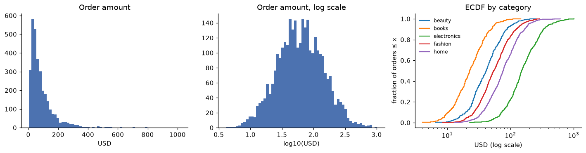
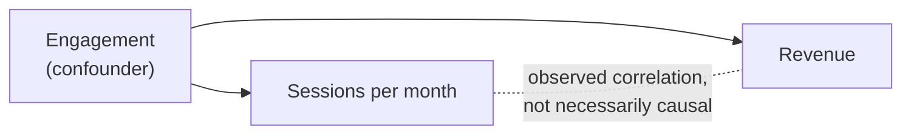
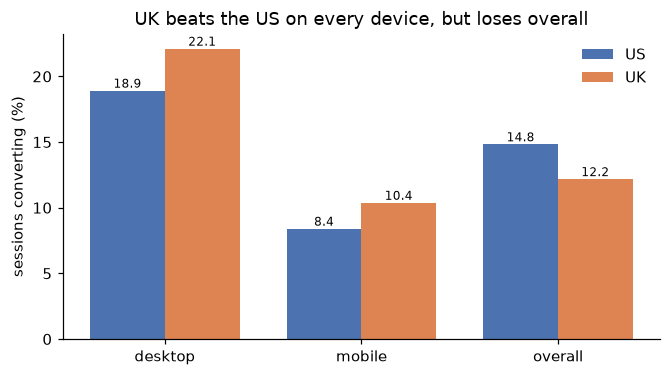

# Exploratory data analysis

> **Level 2 · Chapter 3** · ⏱️ ~55 min read · Prerequisites: [Data cleaning](02-data-cleaning.md), [Data visualization](../00-python-for-data/06-visualization.md), and [Statistics](../01-math-foundations/05-statistics.md)

Exploratory data analysis (EDA) is how you get to know a dataset before you trust it with a decision or a model. This chapter gives you a repeatable EDA checklist, shows how to read univariate distributions and bivariate relationships, explains Pearson and Spearman correlation and where they mislead, separates correlation from causation, works through a real Simpson's paradox in the ShopCo data, and ends with segmenting and turning observations into testable hypotheses.

## Why it matters

ShopCo's quarterly review had a slide titled "UK underperforming". UK sessions converted to purchases at 12.2%, against 14.8% in the US. A vice president proposed moving UK marketing budget to the US.

Alex, a data scientist, was asked to "confirm the gap" before the decision. Instead of just recomputing the two numbers, Alex split them by device. On desktop, the UK converted *better* than the US. On mobile, the UK converted *better* than the US. The UK lost only in the total, because more than four out of five UK sessions came from mobile, and mobile converts at about half the desktop rate in every country.

The real story wasn't "the UK is weak". It was "mobile checkout is weak, and the UK has the most mobile traffic". Moving budget to the US would have fixed nothing. Fixing mobile checkout would help every country, the UK most of all. One extra `groupby` turned a wrong decision into a useful one. That's what good EDA does: it asks the next question before anyone acts on the first answer.

## Concepts

### What EDA is for

John Tukey, who named the field in the 1970s, described EDA as detective work: looking at data to see what it seems to say, before (and separately from) the confirmatory work of testing whether it's really so. EDA has four jobs:

1. **Understand the data**: what each row is, what values look like, how big things are.
2. **Find problems** that cleaning missed: impossible values, gaps in time, suspicious spikes.
3. **Find structure**: distributions, relationships, segments, trends.
4. **Generate hypotheses**: precise, testable statements to confirm later with fresh data or an experiment.

The key word is *generate*. In EDA you look at many slices of the data, and some patterns will appear by pure chance. The more you look, the more chance patterns you find. Statisticians call this the **garden of forking paths**: each choice of filter, segment, and metric is a fork, and a result that survives only one path is weak evidence. EDA findings are leads, not conclusions.

Set up the data. The generator and the Chapter 2 cleaning function are below; expand and run both.

??? example "The ShopCo data generator (expand and run this first)"

    ```python
    import numpy as np
    import pandas as pd

    def make_shop(n_users=5000, seed=42):
        """Messy, seeded synthetic data for ShopCo: returns (users, events, orders)."""
        rng = np.random.default_rng(seed)
        start = pd.Timestamp("2024-01-01", tz="UTC")
        end = pd.Timestamp("2025-01-01", tz="UTC")

        # ---------- users ----------
        uid = np.arange(1001, 1001 + n_users)
        country = rng.choice(["US", "UK", "DE", "IN", "BR"], n_users, p=[.40, .20, .15, .15, .10])
        p_mobile = pd.Series(country).map({"US": .35, "UK": .80, "DE": .45, "IN": .80, "BR": .60}).to_numpy()
        device = np.where(rng.random(n_users) < p_mobile, "mobile",
                          rng.choice(["desktop", "tablet"], n_users, p=[.85, .15]))
        channel = rng.choice(["organic", "paid_search", "social", "email", "referral"],
                             n_users, p=[.35, .25, .20, .10, .10])
        signup = start + pd.to_timedelta(rng.uniform(0, 330, n_users), unit="D")
        age_true = np.clip(rng.normal(36, 11, n_users), 18, 80).round()
        age = age_true.copy()
        age[rng.random(n_users) < np.where(device == "mobile", .15, .04)] = np.nan  # mobile form skips age
        age[rng.choice(n_users, 25, replace=False)] = -1                           # "unknown" sentinel
        age[rng.choice(n_users, 4, replace=False)] = [230, 199, 340, 2]            # typos
        variants = {"US": ["us", "USA", "United States"], "UK": ["uk", "U.K.", "United Kingdom"],
                    "DE": ["de", "Germany"], "IN": ["India", " IN"], "BR": ["Brazil", "br "]}
        messy = rng.random(n_users) < 0.2
        country_raw = [rng.choice(variants[c]) if m else c for c, m in zip(country, messy)]
        users = pd.DataFrame({
            "user_id": uid,
            "signup_at": signup.strftime("%Y-%m-%d %H:%M:%S"),    # UTC, stored as text
            "country": country_raw, "device": device, "channel": channel, "age": age,
        })
        users = pd.concat([users, users.sample(60, random_state=seed)])  # double-submitted forms

        # ---------- sessions and funnel events ----------
        lam = pd.Series(channel).map({"email": 9, "referral": 7, "organic": 6,
                                      "social": 4, "paid_search": 4}).to_numpy()
        n_sess = rng.poisson(lam * rng.gamma(2, 0.5, n_users))
        s_user = np.repeat(np.arange(n_users), n_sess)
        s_dev, s_cty = device[s_user], country[s_user]
        # visits follow a daily rhythm in the customer's *local* time, peaking in the evening
        hour_w = np.array([3, 2, 1, 1, 1, 1, 2, 3, 4, 5, 5, 6, 7, 6, 6, 6, 6, 7, 8, 10, 11, 10, 8, 5])
        local_s = rng.choice(24, len(s_user), p=hour_w / hour_w.sum()) * 3600 + rng.uniform(0, 3600, len(s_user))
        utc_off = pd.Series(s_cty).map({"US": -5, "UK": 0, "DE": 1, "IN": 5.5, "BR": -3}).to_numpy()
        day = (signup[s_user] + (end - signup[s_user]) * rng.random(len(s_user))).floor("D")
        s_start = day + pd.to_timedelta(local_s - utc_off * 3600, unit="s")
        s_start = s_start.where(s_start > signup[s_user], signup[s_user] + pd.Timedelta(minutes=5))
        s_start = s_start.where(s_start < end - pd.Timedelta(hours=1), end - pd.Timedelta(hours=1))
        p_buy = np.select([s_dev == "desktop", s_dev == "tablet"], [.85, .70], .40) + .12 * (s_cty == "UK")
        cart = rng.random(len(s_user)) < .35
        checkout = cart & (rng.random(len(s_user)) < .60)
        purchase = checkout & (rng.random(len(s_user)) < p_buy)
        t_cart = s_start + pd.to_timedelta(rng.uniform(30, 600, len(s_user)), unit="s")
        t_chk = t_cart + pd.to_timedelta(rng.uniform(30, 300, len(s_user)), unit="s")
        t_buy = t_chk + pd.to_timedelta(rng.uniform(10, 120, len(s_user)), unit="s")
        sid = np.arange(1, len(s_user) + 1)
        parts = []
        for name, mask, t in [("page_view", np.ones(len(s_user), bool), s_start), ("add_to_cart", cart, t_cart),
                              ("checkout", checkout, t_chk), ("purchase", purchase, t_buy)]:
            parts.append(pd.DataFrame({"session_id": sid[mask], "user_id": uid[s_user][mask],
                                       "event_type": name, "ts_ms": t[mask].as_unit("ms").asi8}))
        events = pd.concat(parts).sort_values("ts_ms", ignore_index=True)
        events = pd.concat([events, events.sample(frac=.01, random_state=seed)])  # client retries
        events = events.sort_values("ts_ms", ignore_index=True)
        events.insert(0, "event_id", np.arange(1, len(events) + 1))

        # ---------- orders (one per purchase session) ----------
        o_idx = np.flatnonzero(purchase)
        n_o = len(o_idx)
        cats = np.array(["electronics", "home", "fashion", "books", "beauty"])
        cat = rng.choice(cats, n_o, p=[.20, .25, .25, .15, .15])
        median = pd.Series(cat).map({"electronics": 120, "home": 60, "fashion": 45,
                                     "books": 18, "beauty": 30}).to_numpy()
        n_items = 1 + rng.poisson(.6, n_o)
        spend = median * n_items ** .7 * np.exp(.01 * (age_true[s_user][o_idx] - 36))
        amount = np.round(spend * rng.lognormal(0, .5, n_o), 2)
        status = rng.choice(["completed", "cancelled", "refunded"], n_o, p=[.90, .05, .05])
        amount[(status == "refunded") & (rng.random(n_o) < .5)] *= -1          # some refunds stored negative
        amount[rng.random(n_o) < .015] = np.nan                                 # lost in a migration
        amount[rng.choice(n_o, 4, replace=False)] = 99999.0                     # QA test orders
        cat_raw = cat.astype(object)
        r = rng.random(n_o)
        cat_raw[r < .10] = np.char.title(cat[r < .10].astype(str))
        cat_raw[(r >= .10) & (r < .15)] = np.char.upper(cat[(r >= .10) & (r < .15)].astype(str))
        cat_raw[(r >= .15) & (r < .20)] = np.char.add(cat[(r >= .15) & (r < .20)].astype(str), " ")
        coupon = rng.choice(np.array([None, "WELCOME10", "SPRING20", "FREESHIP"], dtype=object),
                            n_o, p=[.80, .08, .06, .06])
        # timestamps: web writes UTC with "Z"; the mobile app writes local time with an offset
        t = pd.Series(t_buy[o_idx])
        o_dev, o_cty = s_dev[o_idx], s_cty[o_idx]
        ts = t.dt.strftime("%Y-%m-%dT%H:%M:%SZ")
        tzs = {"US": "America/New_York", "UK": "Europe/London", "DE": "Europe/Berlin",
               "IN": "Asia/Kolkata", "BR": "America/Sao_Paulo"}
        for c, tz in tzs.items():
            m = (o_dev == "mobile") & (o_cty == c)
            local = t[m].dt.tz_convert(tz).dt.strftime("%Y-%m-%d %H:%M:%S%z")
            ts[m] = local.str[:-2] + ":" + local.str[-2:]
        orders = pd.DataFrame({
            "order_id": np.arange(500001, 500001 + n_o), "user_id": uid[s_user][o_idx],
            "order_ts": ts.to_numpy(), "category": cat_raw, "amount_usd": amount,
            "n_items": n_items, "status": status, "coupon": coupon,
        })
        orphans = orders.sample(15, random_state=seed).assign(user_id=lambda d: d.user_id + 90000,
                                                              order_id=lambda d: d.order_id + 50000)
        orders = pd.concat([orders, orphans, orders.sample(frac=.02, random_state=seed + 1)])
        orders = orders.sample(frac=1, random_state=seed).reset_index(drop=True)
        return users.reset_index(drop=True), events, orders
    ```

??? example "The Chapter 2 cleaning function (expand and run this second)"

    ```python
    COUNTRY_MAP = {"US": "US", "USA": "US", "UNITED STATES": "US", "UK": "UK", "U.K.": "UK",
                   "UNITED KINGDOM": "UK", "DE": "DE", "GERMANY": "DE", "IN": "IN", "INDIA": "IN",
                   "BR": "BR", "BRAZIL": "BR"}
    TIMEZONES = {"US": "America/New_York", "UK": "Europe/London", "DE": "Europe/Berlin",
                 "IN": "Asia/Kolkata", "BR": "America/Sao_Paulo"}

    def clean_shop(users, events, orders):
        """Apply the Chapter 2 cleaning rules. Returns clean (users, events, orders)."""
        u = users.drop_duplicates().copy()
        u["signup_at"] = pd.to_datetime(u["signup_at"], utc=True)
        u["country"] = u["country"].str.strip().str.upper().map(COUNTRY_MAP)
        u["age"] = u["age"].where(u["age"].between(13, 100))          # sentinels and typos -> NaN
        u = u.astype({"device": "category", "channel": "category", "country": "category"})

        e = events.drop_duplicates(subset=["session_id", "user_id", "event_type", "ts_ms"]).copy()
        e["ts"] = pd.to_datetime(e["ts_ms"], unit="ms", utc=True)
        e = e.drop(columns="ts_ms")

        o = orders.drop_duplicates().copy()
        o = o[o["user_id"].isin(u["user_id"])]                          # drop orphans
        o = o[o["amount_usd"].ne(99999.0)]                              # drop QA test orders
        o["order_ts"] = pd.to_datetime(o["order_ts"], utc=True, format="ISO8601")
        o["category"] = o["category"].str.strip().str.lower().astype("category")
        o["amount_usd"] = o["amount_usd"].abs()                         # refunds stored as negatives
        o["coupon"] = o["coupon"].fillna("none")
        country = o["user_id"].map(u.set_index("user_id")["country"])
        o["local_hour"] = -1
        for c, tz in TIMEZONES.items():
            m = (country == c).to_numpy()
            o.loc[m, "local_hour"] = o.loc[m, "order_ts"].dt.tz_convert(tz).dt.hour
        return u.reset_index(drop=True), e.reset_index(drop=True), o.reset_index(drop=True)
    ```

```python
import matplotlib.pyplot as plt
import numpy as np
import pandas as pd
from scipy import stats

pd.set_option("display.width", 120)
users, events, orders = make_shop()
u, e, o = clean_shop(users, events, orders)

# One row per session: which funnel steps it reached, plus the user's attributes
sessions = (e.pivot_table(index=["session_id", "user_id"], columns="event_type",
                          values="ts", aggfunc="size", fill_value=0)
             .reset_index().rename_axis(columns=None))
sessions = sessions.merge(u, on="user_id")
sessions["converted"] = sessions["purchase"] > 0
print(len(u), "users,", len(sessions), "sessions,", len(o), "orders")
```

```text
5000 users, 27216 sessions, 3546 orders
```

### An EDA checklist

A checklist keeps exploration from wandering, and makes sure you don't skip the boring steps that catch the expensive mistakes.

1. **Write down the question.** "Why does UK conversion trail the US?" is a question. "Look at the data" is not.
2. **Know the grain and size.** One row per what? How many rows, over what period? Any gaps in time?
3. **Profile every column**: types, missing values, distinct values, ranges (Chapter 2).
4. **Univariate**: the distribution of each important variable on its own.
5. **Bivariate**: how pairs of variables relate, especially each one with your outcome.
6. **Segments**: does the pattern hold in every group, or is it driven by one?
7. **Time**: trends, seasonality, sudden jumps that might be data changes rather than real changes.
8. **Anomalies**: anything surprising. Explain it or flag it.
9. **Hypotheses**: write down what you think is going on, how you'd test it, and what would change your mind.

Steps 1 to 3 were done in earlier chapters. This chapter covers 4 to 9.

### Univariate distributions

For a numeric variable, describe four things:

- **Center**: the mean $\bar{x} = \frac{1}{n}\sum_i x_i$, or the median (the middle value). The median is robust to extreme values; the mean is not.
- **Spread**: the standard deviation $s$, or the interquartile range (IQR, from the 25th to the 75th percentile).
- **Shape**: symmetric or **skewed** (a long tail on one side), one peak (**unimodal**) or several (**multimodal**), and how heavy the tails are.
- **Oddities**: spikes at round numbers, gaps, impossible values, floors and ceilings.

**Skewness** measures asymmetry. The sample skewness is the average cubed standardized value:

$$
g_1 = \frac{1}{n} \sum_{i=1}^{n} \left( \frac{x_i - \bar{x}}{s} \right)^3
$$

Cubing keeps the sign, so values far above the mean push $g_1$ positive (a long right tail) and values far below push it negative. A symmetric distribution has $g_1 \approx 0$. Money, counts, durations, and sizes are almost always right-skewed: they can't go below zero, but they can get very large. For right-skewed data, the mean is above the median, and a log transform often makes the shape close to symmetric.

```python
amt = o.loc[o["status"].eq("completed"), "amount_usd"].dropna()
summary = pd.Series({
    "n": len(amt), "mean": amt.mean(), "median": amt.median(), "sd": amt.std(),
    "skew": stats.skew(amt), "skew of log": stats.skew(np.log(amt)),
    "p99": amt.quantile(0.99), "max": amt.max(),
})
print(summary.round(2))
```

```text
n              3132.00
mean             88.49
median           62.24
sd               88.52
skew              3.29
skew of log       0.04
p99             461.56
max            1019.12
dtype: float64
```

The mean is well above the median, and the skewness is large; on the log scale, it's close to zero. A histogram shows the same story, but the choice of bins and scale changes what you see. An **empirical cumulative distribution function** (**ECDF**) avoids the binning choice entirely: for each value $x$, it plots the fraction of observations at or below $x$,

$$
\hat{F}(x) = \frac{1}{n} \sum_{i=1}^{n} \mathbf{1}[x_i \le x],
$$

where $\mathbf{1}[\cdot]$ is 1 when the condition holds and 0 otherwise. ECDFs are excellent for comparing groups: you can read medians and percentiles directly off them.

```python
fig, axes = plt.subplots(1, 3, figsize=(13, 3.5))
axes[0].hist(amt, bins=60, color="#4C72B0")
axes[0].set(title="Order amount", xlabel="USD")
axes[1].hist(np.log10(amt), bins=60, color="#4C72B0")
axes[1].set(title="Order amount, log scale", xlabel="log10(USD)")
for cat, grp in o[o["status"].eq("completed")].dropna(subset=["amount_usd"]).groupby("category", observed=True):
    x = np.sort(grp["amount_usd"])
    axes[2].step(x, np.arange(1, len(x) + 1) / len(x), where="post", label=cat)
axes[2].set(xscale="log", title="ECDF by category", xlabel="USD (log scale)", ylabel="fraction of orders ≤ x")
axes[2].legend(fontsize=8, frameon=False)
for ax in axes:
    ax.spines[["top", "right"]].set_visible(False)
plt.tight_layout()
plt.show()
```



*The raw histogram hides most of the data in a few bars; the log scale shows a roughly symmetric shape. The ECDFs show that categories differ mainly by a shift on the log scale: electronics orders are typically several times larger than books orders.*

For a **categorical** variable, the univariate summary is a frequency table. Look for dominant categories, a long tail of rare ones, and values that shouldn't exist. Rare categories matter later: a category with 12 rows can't support a reliable estimate, and it may need to be grouped into "other".

```python
print(u["channel"].value_counts(normalize=True).round(3))
print(u["device"].value_counts(normalize=True).round(3))
```

```text
channel
organic        0.353
paid_search    0.233
social         0.206
referral       0.105
email          0.102
Name: proportion, dtype: float64
device
mobile     0.557
desktop    0.380
tablet     0.063
Name: proportion, dtype: float64
```

### Bivariate relationships

The right tool depends on the variable types:

| Pair | Summaries | Charts |
|---|---|---|
| Numeric and numeric | Correlation, binned means | Scatter plot (with transparency or hexbins when crowded) |
| Numeric and categorical | Group means, medians, quantiles | Box plots, violin plots, overlaid ECDFs |
| Categorical and categorical | Cross-tabulation, row or column percentages | Stacked or grouped bars, heatmaps |
| Anything and time | Rolling means, period-over-period change | Line charts |

For numeric-by-categorical, the `groupby` table is the workhorse. Use several statistics at once, because the mean alone hides the shape:

```python
by_cat = (o[o["status"].eq("completed")]
          .groupby("category", observed=True)["amount_usd"]
          .agg(n="size", mean="mean", median="median", p90=lambda s: s.quantile(0.9))
          .round(2).sort_values("median", ascending=False))
print(by_cat)
```

```text
               n    mean  median     p90
category
electronics  603  191.26  150.71  333.27
home         819   91.75   76.86  167.45
fashion      816   66.96   54.24  123.81
beauty       480   49.29   41.46   88.43
books        460   27.22   22.69   50.79
```

For categorical-by-categorical, a cross-tabulation with row percentages answers "within each X, how is Y distributed?":

```python
print(pd.crosstab(u["country"], u["device"], normalize="index").round(2))
```

```text
device   desktop  mobile  tablet
country
BR          0.34    0.61    0.05
DE          0.46    0.45    0.09
IN          0.17    0.80    0.03
UK          0.15    0.83    0.03
US          0.56    0.35    0.09
```

That table is already a clue for the story at the top: the UK and India are mostly mobile, the US mostly desktop.

### Correlation: Pearson and Spearman

**Covariance** measures whether two variables move together. For paired observations $(x_i, y_i)$,

$$
\operatorname{cov}(x, y) = \frac{1}{n-1} \sum_{i=1}^{n} (x_i - \bar{x})(y_i - \bar{y}).
$$

Each term is positive when $x_i$ and $y_i$ are on the same side of their means and negative otherwise. The trouble is units: covariance in "USD times items" can't be compared with anything. Dividing by both standard deviations gives a unitless number, the **Pearson correlation coefficient**:

$$
r = \frac{\operatorname{cov}(x, y)}{s_x \, s_y} = \frac{\sum_i (x_i - \bar{x})(y_i - \bar{y})}{\sqrt{\sum_i (x_i - \bar{x})^2} \, \sqrt{\sum_i (y_i - \bar{y})^2}}.
$$

By the Cauchy-Schwarz inequality, $-1 \le r \le 1$. $r = \pm 1$ exactly when the points lie on a straight line; $r = 0$ means no *linear* relationship. Geometrically, $r$ is the cosine of the angle between the centered vectors $\mathbf{x} - \bar{x}$ and $\mathbf{y} - \bar{y}$, which you met in linear algebra.

The **Spearman rank correlation** $\rho$ is Pearson's $r$ computed on the **ranks** of the data instead of the values: replace each $x_i$ by its position in sorted order (1 for the smallest), do the same for $y$, and correlate the ranks. Because ranks ignore how far apart values are, Spearman measures whether the relationship is **monotonic** (consistently increasing or decreasing), not whether it's linear, and a single extreme value can move it only a little.

Here are both, from scratch, checked against SciPy:

```python
def pearson(x, y):
    xc, yc = x - x.mean(), y - y.mean()
    return (xc @ yc) / np.sqrt((xc @ xc) * (yc @ yc))

def spearman(x, y):
    return pearson(stats.rankdata(x), stats.rankdata(y))     # average ranks for ties

x = np.array([1.0, 2, 3, 4, 5, 6])
y = x ** 3                                                    # monotonic but not linear
print(f"from scratch: pearson={pearson(x, y):.3f} spearman={spearman(x, y):.3f}")
print(f"scipy:        pearson={stats.pearsonr(x, y)[0]:.3f} spearman={stats.spearmanr(x, y)[0]:.3f}")
```

```text
from scratch: pearson=0.938 spearman=1.000
scipy:        pearson=0.938 spearman=1.000
```

Spearman is exactly 1, because $y$ always increases with $x$. Pearson is less than 1, because the relationship isn't a straight line.

### The limits of correlation

Correlation is one number summarizing a cloud of points, and it hides a lot. Its main limits:

- **It only measures one kind of relationship.** Pearson captures linear association, Spearman monotonic association. A perfect U-shape, such as $y = x^2$ for $x$ symmetric around zero, has a correlation of zero.
- **Pearson is fragile.** One extreme point can create a strong correlation from nothing or destroy a real one.
- **Restricted range weakens it.** If you only look at customers who spent over USD 100, the correlation between spend and anything else shrinks, because you've cut away most of the variation.
- **It says nothing about slope.** $r = 0.9$ can go with a tiny effect or a huge one; $r$ measures how tightly points hug a line, not how steep the line is.
- **The same $r$ can come from wildly different data.** Anscombe's quartet (Exercise 4) is the classic demonstration: always plot.

The fragility is easy to see on ShopCo. Compare the raw orders, which still contain the four USD 99,999 test orders and negative refunds, with the cleaned completed orders:

```python
raw = orders.dropna(subset=["amount_usd"])
clean = o[o["status"].eq("completed")].dropna(subset=["amount_usd"])
for name, df in [("raw (with test orders)", raw), ("clean", clean)]:
    r = stats.pearsonr(df["n_items"], df["amount_usd"])[0]
    rho = stats.spearmanr(df["n_items"], df["amount_usd"])[0]
    print(f"{name:24s} pearson={r:.3f}  spearman={rho:.3f}")

xs = np.linspace(-3, 3, 101)
print(f"y = x^2:                 pearson={pearson(xs, xs ** 2):.3f}")
```

```text
raw (with test orders)   pearson=0.005  spearman=0.332
clean                    pearson=0.336  spearman=0.359
y = x^2:                 pearson=-0.000
```

Four rows out of more than 3,600 erased the Pearson correlation completely, while Spearman barely moved. When the two disagree sharply, look for outliers or a nonlinear shape.

### Correlation is not causation

Even a solid, robust correlation between $X$ and $Y$ doesn't mean $X$ causes $Y$. There are four other explanations to rule out first:

1. **Confounding**: a third variable $Z$ causes both. Customers acquired by email visit more often *and* order more, but that doesn't mean visits cause orders; both may come from being an engaged customer.
2. **Reverse causation**: $Y$ causes $X$. Customers who buy more receive more marketing emails, so "emails cause purchases" may be partly backwards.
3. **Selection**: the way rows got into your data creates the relationship. If you only analyze customers who left a review, and both very happy and very angry customers review, you'll find strange patterns that don't exist in the full population.
4. **Chance**: with enough comparisons, some correlations appear by luck alone.

A **causal diagram** makes these structures explicit. Arrows mean "causes". Here's confounding:



The only general way to establish causation is to *intervene*: change $X$ for a random subset of units and see what happens to $Y$. That's a randomized experiment, the subject of Chapter 5, which also introduces methods for estimating causal effects when you can't randomize.

### Simpson's paradox

**Simpson's paradox** is when a relationship that holds in every subgroup reverses (or vanishes) when the subgroups are combined. It's not a statistical curiosity; it's the most common way that aggregated numbers mislead decision makers. Here's ShopCo's version, from the story at the top. We compare the US and the UK, on desktop and mobile:

```python
two = sessions[sessions["country"].isin(["US", "UK"]) & sessions["device"].isin(["desktop", "mobile"])].copy()
two["country"] = two["country"].astype(str)
two["device"] = two["device"].astype(str)

by_device = two.pivot_table(index="country", columns="device", values="converted", aggfunc="mean")
by_device["overall"] = two.groupby("country")["converted"].mean()
mix = pd.crosstab(two["country"], two["device"], normalize="index")
print("conversion rate:\n", (100 * by_device).round(1))
print("\nshare of sessions by device:\n", mix.round(2))
```

```text
conversion rate:
 device   desktop  mobile  overall
country
UK          22.1    10.4     12.2
US          18.9     8.4     14.8

share of sessions by device:
 device   desktop  mobile
country
UK          0.15    0.85
US          0.61    0.39
```

The UK converts better on desktop and better on mobile, yet worse overall. How can that be? The overall rate is a **weighted average** of the device rates, weighted by each country's device mix. If $p_{c,d}$ is the conversion rate of country $c$ on device $d$, and $w_{c,d}$ is the share of country $c$'s sessions on device $d$ (so $\sum_d w_{c,d} = 1$), then

$$
p_c = \sum_{d} w_{c,d} \, p_{c,d}.
$$

The UK has higher $p_{c,d}$ for each device, but puts about 85% of its weight on mobile, the low-converting device. The US puts most of its weight on desktop. The difference in weights outweighs the difference in rates.

Which comparison is right? It depends on the question, and on the causal structure. Device isn't caused by the country's site quality; it's a characteristic of the visitors, which affects conversion. That makes it a confounder of the "country vs conversion" comparison, and the within-device comparison is the fair one for "is the UK market performing worse?" A useful way to get one fair summary number is **standardization**: apply both countries' device-specific rates to the *same* device mix.

```python
common_mix = mix.mean()                                  # an even blend of the two mixes
standardized = (by_device[["desktop", "mobile"]] * common_mix).sum(axis=1)
print("standardized conversion (%):", (100 * standardized).round(1).to_dict())
```

```text
standardized conversion (%): {'UK': 14.9, 'US': 12.4}
```

With the device mix held equal, the UK comes out ahead. The paradox disappears once you ask the comparison you actually meant.

```python
fig, ax = plt.subplots(figsize=(7, 3.6))
labels = ["desktop", "mobile", "overall"]
xpos = np.arange(len(labels))
for i, (country, color) in enumerate([("US", "#4C72B0"), ("UK", "#DD8452")]):
    vals = 100 * by_device.loc[country, labels]
    bars = ax.bar(xpos + (i - 0.5) * 0.38, vals, width=0.38, color=color, label=country)
    ax.bar_label(bars, fmt="%.1f", fontsize=8)
ax.set_xticks(xpos, labels)
ax.set_ylabel("sessions converting (%)")
ax.set_title("UK beats the US on every device, but loses overall")
ax.legend(frameon=False)
ax.spines[["top", "right"]].set_visible(False)
plt.show()
```



*Simpson's paradox in ShopCo's data. The overall comparison mixes a conversion difference with a device-mix difference.*

Be careful with the reverse lesson, too: stratifying isn't always right. If the subgroup variable is caused by the thing you're comparing (a **mediator**), conditioning on it can hide a real effect. Suppose a new checkout design increases conversion partly by convincing more users to add items to their cart. Comparing conversion "within users who added to cart" would strip out part of the design's effect. Whether to split by a variable depends on whether it's a cause of the treatment (split) or a consequence of it (usually don't). Chapter 5 returns to this with causal diagrams.

### Segmenting

**Segmenting** means repeating an analysis within groups: by device, country, channel, signup cohort, and so on. It's how you find that an average hides very different groups, and how you avoid Simpson's paradox. Two cautions apply.

First, **small segments are noisy**. A segment with 50 sessions and 5 conversions has a 10% rate with a 95% confidence interval of roughly 2% to 18%. Always show the uncertainty along with the rate. For a proportion $\hat{p}$ from $n$ trials, the normal-approximation interval from Level 1 is

$$
\hat{p} \pm z_{0.975} \sqrt{\frac{\hat{p}(1-\hat{p})}{n}},
$$

with $z_{0.975} \approx 1.96$. (For small $n$ or rates near 0 or 1, the Wilson interval behaves better; `statsmodels` computes both.)

Second, **more segments mean more false discoveries**. Look at 20 segments and one will look unusual at the 5% level even when nothing is going on (Exercise 5).

```python
from statsmodels.stats.proportion import proportion_confint

seg = sessions.groupby(["device", "channel"], observed=True)["converted"].agg(conversions="sum", sessions="size")
lo, hi = proportion_confint(seg["conversions"], seg["sessions"], alpha=0.05, method="wilson")
seg["rate_pct"] = 100 * seg["conversions"] / seg["sessions"]
seg["ci_low"], seg["ci_high"] = 100 * lo, 100 * hi
print(seg.round(1).sort_values("rate_pct", ascending=False).head(8))
```

```text
                     conversions  sessions  rate_pct  ci_low  ci_high
device  channel
desktop referral             232      1184      19.6    17.4     22.0
        paid_search          347      1839      18.9    17.1     20.7
        organic              768      4114      18.7    17.5     19.9
        social               280      1514      18.5    16.6     20.5
        email                309      1697      18.2    16.4     20.1
tablet  social                43       258      16.7    12.6     21.7
        referral              39       235      16.6    12.4     21.9
        organic               89       570      15.6    12.9     18.8
```

Within each device, the channels' intervals overlap heavily. The device is what drives conversion; the channel barely matters once you know the device. That's a useful negative finding: it tells marketing that the acquisition channel isn't the lever for conversion.

### Forming hypotheses

The output of EDA is a short list of hypotheses, each specific enough to test. A good hypothesis states:

- the **claim** ("the mobile checkout page loses buyers"),
- the **evidence** that suggested it ("mobile sessions reach checkout at a similar rate to desktop but convert at half the rate after it, in every country"),
- the **metric** that would move ("checkout-to-purchase rate on mobile"),
- the **test** ("A/B test a simplified mobile checkout"), and
- what result would **falsify** it.

Here's the evidence for ShopCo's lead hypothesis, as funnel step rates by device:

```python
steps = sessions.groupby("device", observed=True)[["page_view", "add_to_cart", "checkout", "purchase"]].apply(lambda d: (d > 0).sum())
rates = pd.DataFrame({
    "view_to_cart": steps["add_to_cart"] / steps["page_view"],
    "cart_to_checkout": steps["checkout"] / steps["add_to_cart"],
    "checkout_to_purchase": steps["purchase"] / steps["checkout"],
})
print((100 * rates).round(1))
```

```text
         view_to_cart  cart_to_checkout  checkout_to_purchase
device
desktop          36.0              60.4                  86.1
mobile           35.1              59.7                  42.8
tablet           33.6              60.4                  74.3
```

The first two steps are nearly identical across devices. The gap is entirely in the last step. That's what you take to Chapter 5.

!!! warning "Common mistake: testing a hypothesis on the data that suggested it"
    If you found a pattern by exploring a dataset, the same dataset can't fairly confirm it: you'd be counting the pattern's lucky noise as evidence. Confirm with new data, a held-out sample you didn't explore, or an experiment.

## In practice

### Revenue concentration

A standard question for any business with customers: how concentrated is revenue? If a small fraction of customers produces most revenue, retention of that group matters more than anything else. Sort customers by revenue and compute cumulative shares. The resulting curve is a **Lorenz curve**, and the area between it and the diagonal gives the **Gini coefficient** (0 is perfect equality, 1 means one customer has everything).

```python
rev = (o[o["status"].eq("completed")].groupby("user_id")["amount_usd"].sum()
         .reindex(u["user_id"], fill_value=0).sort_values(ascending=False))
share = rev.cumsum() / rev.sum()
for top in [0.01, 0.05, 0.10, 0.20]:
    print(f"top {top:4.0%} of customers -> {share.iloc[int(top * len(rev)) - 1]:.1%} of revenue")
print(f"customers with any completed order: {(rev > 0).mean():.1%}")

x = np.sort(rev.to_numpy())                          # ascending for the Lorenz curve
lorenz = np.cumsum(x) / x.sum()
gini = 1 - 2 * np.trapezoid(lorenz, dx=1 / len(x))
print(f"Gini coefficient: {gini:.3f}")
```

```text
top   1% of customers -> 12.6% of revenue
top   5% of customers -> 38.3% of revenue
top  10% of customers -> 58.2% of revenue
top  20% of customers -> 82.1% of revenue
customers with any completed order: 39.8%
Gini coefficient: 0.789
```

Most customers haven't completed an order, which by itself pushes the Gini coefficient high. Concentration among *buyers* is a separate, also useful number; always say which population a concentration figure describes.

### Signup cohorts

A **cohort** is a group of users who share a starting point, typically signup month. Cohort analysis separates "the business is growing" from "each customer is getting more valuable", which a single revenue chart mixes together.

```python
uo = u[["user_id", "signup_at"]].assign(cohort=u["signup_at"].dt.tz_convert(None).dt.to_period("Q"))
first_order = o[o["status"].eq("completed")].groupby("user_id")["order_ts"].min().rename("first_order")
uo = uo.merge(first_order, on="user_id", how="left")
uo["days_to_first"] = (uo["first_order"] - uo["signup_at"]).dt.days
cohorts = uo.groupby("cohort").agg(users=("user_id", "size"),
                                   pct_ordered=("first_order", lambda s: 100 * s.notna().mean()),
                                   median_days_to_first=("days_to_first", "median"))
print(cohorts.round(1))
```

```text
        users  pct_ordered  median_days_to_first
cohort
2024Q1   1384         40.0                 125.0
2024Q2   1389         41.7                  82.0
2024Q3   1395         39.3                  50.0
2024Q4    832         39.2                  23.0
```

The share who have ordered is similar across cohorts, but the median time from signup to first order falls from about four months for Q1 signups to about three weeks for Q4. That doesn't mean Q4 customers are keener. A Q4 customer can only have a first order in this data if they ordered within weeks, because the data ends on 31 December, while Q1 customers had all year. This is the same **censoring** issue as in Chapter 1, and comparing cohorts fairly needs a fixed window, such as "ordered within 30 days of signup". Spotting this kind of built-in bias is a core EDA skill.

### A one-paragraph EDA summary

End every EDA with a written summary. For ShopCo:

> In our sample of 5,000 customers who signed up in 2024, about 40% completed at least one order during the year. Order values are strongly right-skewed (median around USD 62, mean around USD 88), and the top 10% of customers account for well over half of revenue. Session conversion averages 13%, and the dominant driver is device: desktop sessions convert at roughly twice the mobile rate in every country, with the entire gap at the final checkout-to-purchase step. Country differences in overall conversion are explained by device mix (a Simpson's paradox: the UK outperforms the US within each device). Acquisition channel has little relationship with conversion once device is accounted for. **Lead hypothesis:** the mobile checkout page loses buyers; test it with an A/B experiment on the checkout-to-purchase rate.

## Exercises

### Exercise 1: Correlations by hand (easy)

For the five points $x = [1, 2, 3, 4, 5]$ and $y = [2, 4, 5, 4, 10]$, compute Pearson's $r$ by hand using the formula with centered values, then Spearman's $\rho$ by ranking first. Explain why they differ. Check with SciPy.

??? success "Solution"

    $\bar{x} = 3$ and $\bar{y} = 5$. Centered: $x - \bar{x} = [-2, -1, 0, 1, 2]$ and $y - \bar{y} = [-3, -1, 0, -1, 5]$. The sum of products is $6 + 1 + 0 - 1 + 10 = 16$. The sums of squares are $10$ and $9 + 1 + 0 + 1 + 25 = 36$. So $r = 16 / \sqrt{10 \cdot 36} = 16 / 18.97 \approx 0.843$.

    For Spearman, rank $y$: the values $2, 4, 5, 4, 10$ get ranks $1, 2.5, 4, 2.5, 5$ (the two 4s share the average of ranks 2 and 3). Ranks of $x$ are $1, 2, 3, 4, 5$. Centered ranks: $[-2, -1, 0, 1, 2]$ and $[-2, -0.5, 1, -0.5, 2]$. Products sum to $4 + 0.5 + 0 - 0.5 + 4 = 8$. Sums of squares: $10$ and $4 + 0.25 + 1 + 0.25 + 4 = 9.5$. So $\rho = 8 / \sqrt{95} \approx 0.821$.

    ```python
    x = np.array([1, 2, 3, 4, 5])
    y = np.array([2, 4, 5, 4, 10])
    print(round(stats.pearsonr(x, y)[0], 3), round(stats.spearmanr(x, y)[0], 3))
    ```

    ```text
    0.843 0.821
    ```

    Pearson is slightly higher here because the last point (10) is far out along the trend, which a linear measure rewards. Spearman only sees that it's the largest, and it's penalized by the dip from 5 to 4.

### Exercise 2: Pick the chart (easy)

For each question, name the variable types involved and the chart you'd make first: (a) Is order value different across the five categories? (b) Does conversion vary by hour of day? (c) Does a user's age relate to their average order value? (d) Which device mix does each country have? (e) Is the share of orders using a coupon changing over the year?

??? success "Solution"

    (a) Numeric by categorical: box plots or overlaid ECDFs of order value per category, on a log scale. (b) A rate by an ordered numeric (hour): a line or bar chart of conversion rate per hour, with confidence intervals. (c) Numeric by numeric: a scatter plot with transparency, plus a binned-means line (average order value by age band), and Spearman correlation. (d) Categorical by categorical: a 100% stacked bar per country, or a heatmap of row percentages. (e) A rate over time: a line chart of the weekly or monthly coupon share, ideally with the number of orders shown too, so noisy early months are visible.

### Exercise 3: Standardize by hand (medium)

From the Simpson's paradox output, take the UK and US desktop and mobile conversion rates and the UK and US device mixes. (a) Recompute each country's overall rate as a weighted average, and check it matches. (b) Compute what the UK's overall rate would be with the US device mix, and what the US rate would be with the UK mix. (c) In one sentence, explain the result to a non-technical manager.

??? success "Solution"

    ```python
    p = by_device[["desktop", "mobile"]]
    w = mix[["desktop", "mobile"]]
    print("recomputed overall:", (p * w).sum(axis=1).mul(100).round(2).to_dict())
    print("from data:         ", by_device["overall"].mul(100).round(2).to_dict())
    print(f"UK rates with US mix: {100 * (p.loc['UK'] * w.loc['US']).sum():.2f}%")
    print(f"US rates with UK mix: {100 * (p.loc['US'] * w.loc['UK']).sum():.2f}%")
    ```

    ```text
    recomputed overall: {'UK': 12.18, 'US': 14.83}
    from data:          {'UK': 12.18, 'US': 14.83}
    UK rates with US mix: 17.55%
    US rates with UK mix: 10.02%
    ```

    The weighted averages reproduce the overall rates exactly, because that's what an overall rate is. With the US's device mix, the UK would beat the US's actual overall rate; with the UK's mix, the US would fall below the UK. For a manager: "The UK converts better than the US on both phones and computers; it only looks worse overall because most UK shoppers use phones, and phones convert worse everywhere."

### Exercise 4: Anscombe's quartet (medium)

Anscombe's quartet is four small datasets, built by the statistician Francis Anscombe in 1973, with nearly identical summary statistics. Here they are:

```python
anscombe = {
    "I":   ([10, 8, 13, 9, 11, 14, 6, 4, 12, 7, 5],
            [8.04, 6.95, 7.58, 8.81, 8.33, 9.96, 7.24, 4.26, 10.84, 4.82, 5.68]),
    "II":  ([10, 8, 13, 9, 11, 14, 6, 4, 12, 7, 5],
            [9.14, 8.14, 8.74, 8.77, 9.26, 8.10, 6.13, 3.10, 9.13, 7.26, 4.74]),
    "III": ([10, 8, 13, 9, 11, 14, 6, 4, 12, 7, 5],
            [7.46, 6.77, 12.74, 7.11, 7.81, 8.84, 6.08, 5.39, 8.15, 6.42, 5.73]),
    "IV":  ([8, 8, 8, 8, 8, 8, 8, 19, 8, 8, 8],
            [6.58, 5.76, 7.71, 8.84, 8.47, 7.04, 5.25, 12.50, 5.56, 7.91, 6.89]),
}
```

For each dataset, compute the means of $x$ and $y$, Pearson's $r$, and Spearman's $\rho$. Then plot all four as scatter plots, and describe what the summary statistics miss in each.

??? success "Solution"

    ```python
    for name, (x, y) in anscombe.items():
        x, y = np.array(x, float), np.array(y)
        print(f"{name:4s} mean_x={x.mean():.2f} mean_y={y.mean():.2f} "
              f"pearson={stats.pearsonr(x, y)[0]:.3f} spearman={stats.spearmanr(x, y)[0]:.3f}")
    ```

    ```text
    I    mean_x=9.00 mean_y=7.50 pearson=0.816 spearman=0.818
    II   mean_x=9.00 mean_y=7.50 pearson=0.816 spearman=0.691
    III  mean_x=9.00 mean_y=7.50 pearson=0.816 spearman=0.991
    IV   mean_x=9.00 mean_y=7.50 pearson=0.817 spearman=0.500
    ```

    Pearson's $r$ is about 0.816 in all four, but the scatter plots are completely different. I is a noisy linear relationship, the only one where $r$ tells the story. II is a smooth curve (a parabola): strong but nonlinear. III is a perfect line with one outlier that drags $r$ down; Spearman, which is near 1, is closer to the truth. IV has no relationship at all among ten points stacked at $x = 8$; a single point at $x = 19$ creates the entire correlation. Spearman differs noticeably in II, III, and IV, a hint that something other than a linear trend is going on. The lesson is Anscombe's: always plot the data.

### Exercise 5: How many segments until something "works"? (hard)

Simulate an analyst checking 20 segments for a difference in conversion between two groups when there is no true difference: in each segment, both groups have 1,000 sessions with a true conversion rate of 10%. Run a two-proportion z-test in each segment. Repeat the whole analysis 2,000 times, and estimate the probability that at least one segment shows $p < 0.05$. Compare with $1 - 0.95^{20}$, then show how the Bonferroni correction (testing each at $0.05/20$) changes it.

??? success "Solution"

    ```python
    from statsmodels.stats.proportion import proportions_ztest

    rng = np.random.default_rng(0)
    n, p, n_seg, n_sims = 1000, 0.10, 20, 2000
    a = rng.binomial(n, p, size=(n_sims, n_seg))
    b = rng.binomial(n, p, size=(n_sims, n_seg))
    pooled = (a + b) / (2 * n)
    se = np.sqrt(pooled * (1 - pooled) * 2 / n)
    z = (a - b) / n / se
    pvals = 2 * stats.norm.sf(np.abs(z))                       # vectorized two-proportion z-test
    print("check one test against statsmodels:",
          np.isclose(pvals[0, 0], proportions_ztest([a[0, 0], b[0, 0]], [n, n])[1]))
    print(f"P(at least one p < 0.05):      {(pvals < 0.05).any(axis=1).mean():.3f}  theory {1 - 0.95 ** 20:.3f}")
    print(f"with Bonferroni (p < 0.0025):  {(pvals < 0.05 / n_seg).any(axis=1).mean():.3f}")
    ```

    ```text
    check one test against statsmodels: True
    P(at least one p < 0.05):      0.644  theory 0.642
    with Bonferroni (p < 0.0025):  0.050
    ```

    With 20 independent looks, there's about a 64% chance of at least one "significant" difference when none exists. Bonferroni brings the family-wise false positive rate back to about 5%, at the cost of power. In EDA, the practical lesson is to treat any single striking segment as a hypothesis, not a finding.

## Check yourself

1. Name the four jobs of EDA, and why EDA findings are hypotheses rather than conclusions.

    ??? note "Answer"

        Understand the data, find problems, find structure, and generate hypotheses. Because you look at many slices, some patterns arise by chance, and the same data can't fairly confirm a pattern it suggested.

2. Why is the mean above the median for right-skewed data like order values?

    ??? note "Answer"

        The long right tail contains a few very large values. The mean is pulled toward them, while the median depends only on the middle of the sorted data.

3. What does an ECDF show, and why is it often better than a histogram for comparing groups?

    ??? note "Answer"

        For each value $x$, the fraction of observations at or below $x$. It needs no bin choices, shows every percentile directly, and several groups overlay cleanly.

4. How does Spearman correlation differ from Pearson?

    ??? note "Answer"

        Spearman is Pearson computed on ranks. It measures monotonic rather than linear association, and it's much less sensitive to outliers.

5. Give a dataset with a strong relationship but a Pearson correlation of zero.

    ??? note "Answer"

        $y = x^2$ for $x$ spread symmetrically around zero. The relationship is perfect but not linear (or monotonic), so both Pearson and Spearman are about zero.

6. List four reasons other than causation that two variables can be correlated.

    ??? note "Answer"

        Confounding (a common cause), reverse causation, selection effects in how the data were collected, and chance (especially after many comparisons).

7. Explain Simpson's paradox using the weighted-average formula.

    ??? note "Answer"

        A group's overall rate is $\sum_d w_d p_d$, its subgroup rates weighted by its subgroup mix. If one group has higher rates in every subgroup but puts much more weight on a low-rate subgroup, its overall rate can be lower.

8. When should you *not* split an analysis by a variable?

    ??? note "Answer"

        When the variable is a consequence of the thing you're comparing (a mediator). Conditioning on it removes part of the effect you're trying to measure.

## Key takeaways

- Start EDA with a written question and a checklist; end it with a written summary and a short list of testable hypotheses.
- Describe distributions by center, spread, shape, and oddities. Money and counts are right-skewed: use medians, log scales, and ECDFs.
- Pearson measures linear association and is fragile; Spearman measures monotonic association and is robust. Neither replaces a plot.
- Correlation can come from confounding, reverse causation, selection, or chance. Causation needs an intervention or careful causal reasoning.
- Aggregates are weighted averages. When group mixes differ, compare within groups or standardize, or Simpson's paradox can reverse your conclusion.
- Segments reveal hidden structure but multiply false discoveries. Show confidence intervals and confirm findings on new data.

## Further reading

- *Exploratory Data Analysis* by John W. Tukey (Addison-Wesley, 1977), the book that named the field.
- "Graphs in Statistical Analysis" by F. J. Anscombe, *The American Statistician* 27(1), 1973, the source of Anscombe's quartet.
- "Sex Bias in Graduate Admissions: Data from Berkeley" by P. J. Bickel, E. A. Hammel, and J. W. O'Connell, *Science* 187, 1975, the most famous real Simpson's paradox.
- *The Book of Why* by Judea Pearl and Dana Mackenzie (Basic Books, 2018), an accessible introduction to causal diagrams and confounding.

## Next

Turn what you've learned about the data into model inputs: [Feature engineering](04-feature-engineering.md).
