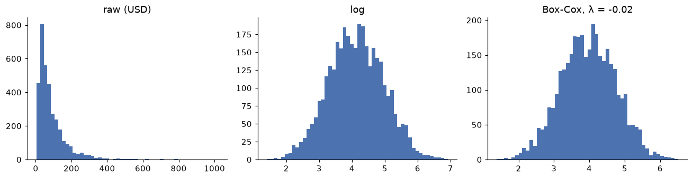

# Feature engineering

> **Level 2 · Chapter 4** · ⏱️ ~60 min read · Prerequisites: [Exploratory data analysis](03-exploratory-data-analysis.md) and [Linear algebra](../01-math-foundations/01-linear-algebra.md)

A model can only learn from the numbers you give it. Feature engineering is the craft of turning raw columns (categories, skewed amounts, timestamps, free text) into informative numeric inputs. This chapter covers encoding categoricals (one-hot, ordinal, and target encoding), scaling, log and Box-Cox transforms, binning, date and time features, text features with bag of words and TF-IDF, interactions, and feature selection. Throughout, it hunts the most common and most expensive bug in applied machine learning: data leakage.

## Why it matters

Sam built a model to predict which ShopCo sessions would end in a purchase, so the site could show a discount to visitors likely to leave. The validation score was spectacular: an AUC of 0.98, where 0.5 is a coin flip and 1.0 is perfect. Everyone was delighted. In production, the model was useless.

The cause was one feature, `reached_checkout`. In the historical data, it was a strong predictor of purchase, because almost every purchase passes through checkout. But at the moment the model needed to make its prediction, early in the session, nobody had reached checkout yet. The feature carried information from the future. The model had learned "people who are about to buy are about to buy".

This is **data leakage**: information in the training features that won't be available, or won't mean the same thing, when the model is used. It produces models that look brilliant in evaluation and fail in reality. Every feature-engineering decision in this chapter comes with a leakage question attached: *would I know this value, computed this way, at prediction time?*

## Concepts

### Features, and what models need

A **feature** is one input variable to a model, and a **feature vector** $\mathbf{x} \in \mathbb{R}^d$ is the list of $d$ feature values for one example. Most models (linear models, neural networks, k-nearest neighbors, support vector machines) need every feature to be a number, with no missing values, and many of them work best when features are on similar scales. Tree-based models are more forgiving about scale and shape, but they still need numbers.

**Feature engineering** is everything between the clean table and the model's input matrix $\mathbf{X} \in \mathbb{R}^{n \times d}$, with one row per example. It has two goals: make the data *usable* (numeric, complete, well-scaled) and make it *informative* (expose patterns the model would struggle to find on its own, like "evening" or "price per item").

Feature engineering in this chapter is applied to a prediction task you'll see again in later levels: **predict whether a ShopCo session ends in a purchase**, using only what's known when the session starts. To judge features, we'll use a **logistic regression** model, which you'll build from scratch in [Level 3](../03-ml-fundamentals/03-logistic-regression.md); for now, treat it as a function that learns one weight per feature and outputs a probability. We'll score it with the **AUC** (area under the ROC curve): the probability that a randomly chosen converting session gets a higher predicted score than a randomly chosen non-converting one. An AUC of 0.5 means no skill; 1.0 means perfect ranking.

Set up the data. The generator and cleaning function are the ones from earlier chapters.

??? example "The ShopCo data generator (expand and run this first)"

    ```python
    import numpy as np
    import pandas as pd

    def make_shop(n_users=5000, seed=42):
        """Messy, seeded synthetic data for ShopCo: returns (users, events, orders)."""
        rng = np.random.default_rng(seed)
        start = pd.Timestamp("2024-01-01", tz="UTC")
        end = pd.Timestamp("2025-01-01", tz="UTC")

        # ---------- users ----------
        uid = np.arange(1001, 1001 + n_users)
        country = rng.choice(["US", "UK", "DE", "IN", "BR"], n_users, p=[.40, .20, .15, .15, .10])
        p_mobile = pd.Series(country).map({"US": .35, "UK": .80, "DE": .45, "IN": .80, "BR": .60}).to_numpy()
        device = np.where(rng.random(n_users) < p_mobile, "mobile",
                          rng.choice(["desktop", "tablet"], n_users, p=[.85, .15]))
        channel = rng.choice(["organic", "paid_search", "social", "email", "referral"],
                             n_users, p=[.35, .25, .20, .10, .10])
        signup = start + pd.to_timedelta(rng.uniform(0, 330, n_users), unit="D")
        age_true = np.clip(rng.normal(36, 11, n_users), 18, 80).round()
        age = age_true.copy()
        age[rng.random(n_users) < np.where(device == "mobile", .15, .04)] = np.nan  # mobile form skips age
        age[rng.choice(n_users, 25, replace=False)] = -1                           # "unknown" sentinel
        age[rng.choice(n_users, 4, replace=False)] = [230, 199, 340, 2]            # typos
        variants = {"US": ["us", "USA", "United States"], "UK": ["uk", "U.K.", "United Kingdom"],
                    "DE": ["de", "Germany"], "IN": ["India", " IN"], "BR": ["Brazil", "br "]}
        messy = rng.random(n_users) < 0.2
        country_raw = [rng.choice(variants[c]) if m else c for c, m in zip(country, messy)]
        users = pd.DataFrame({
            "user_id": uid,
            "signup_at": signup.strftime("%Y-%m-%d %H:%M:%S"),    # UTC, stored as text
            "country": country_raw, "device": device, "channel": channel, "age": age,
        })
        users = pd.concat([users, users.sample(60, random_state=seed)])  # double-submitted forms

        # ---------- sessions and funnel events ----------
        lam = pd.Series(channel).map({"email": 9, "referral": 7, "organic": 6,
                                      "social": 4, "paid_search": 4}).to_numpy()
        n_sess = rng.poisson(lam * rng.gamma(2, 0.5, n_users))
        s_user = np.repeat(np.arange(n_users), n_sess)
        s_dev, s_cty = device[s_user], country[s_user]
        # visits follow a daily rhythm in the customer's *local* time, peaking in the evening
        hour_w = np.array([3, 2, 1, 1, 1, 1, 2, 3, 4, 5, 5, 6, 7, 6, 6, 6, 6, 7, 8, 10, 11, 10, 8, 5])
        local_s = rng.choice(24, len(s_user), p=hour_w / hour_w.sum()) * 3600 + rng.uniform(0, 3600, len(s_user))
        utc_off = pd.Series(s_cty).map({"US": -5, "UK": 0, "DE": 1, "IN": 5.5, "BR": -3}).to_numpy()
        day = (signup[s_user] + (end - signup[s_user]) * rng.random(len(s_user))).floor("D")
        s_start = day + pd.to_timedelta(local_s - utc_off * 3600, unit="s")
        s_start = s_start.where(s_start > signup[s_user], signup[s_user] + pd.Timedelta(minutes=5))
        s_start = s_start.where(s_start < end - pd.Timedelta(hours=1), end - pd.Timedelta(hours=1))
        p_buy = np.select([s_dev == "desktop", s_dev == "tablet"], [.85, .70], .40) + .12 * (s_cty == "UK")
        cart = rng.random(len(s_user)) < .35
        checkout = cart & (rng.random(len(s_user)) < .60)
        purchase = checkout & (rng.random(len(s_user)) < p_buy)
        t_cart = s_start + pd.to_timedelta(rng.uniform(30, 600, len(s_user)), unit="s")
        t_chk = t_cart + pd.to_timedelta(rng.uniform(30, 300, len(s_user)), unit="s")
        t_buy = t_chk + pd.to_timedelta(rng.uniform(10, 120, len(s_user)), unit="s")
        sid = np.arange(1, len(s_user) + 1)
        parts = []
        for name, mask, t in [("page_view", np.ones(len(s_user), bool), s_start), ("add_to_cart", cart, t_cart),
                              ("checkout", checkout, t_chk), ("purchase", purchase, t_buy)]:
            parts.append(pd.DataFrame({"session_id": sid[mask], "user_id": uid[s_user][mask],
                                       "event_type": name, "ts_ms": t[mask].as_unit("ms").asi8}))
        events = pd.concat(parts).sort_values("ts_ms", ignore_index=True)
        events = pd.concat([events, events.sample(frac=.01, random_state=seed)])  # client retries
        events = events.sort_values("ts_ms", ignore_index=True)
        events.insert(0, "event_id", np.arange(1, len(events) + 1))

        # ---------- orders (one per purchase session) ----------
        o_idx = np.flatnonzero(purchase)
        n_o = len(o_idx)
        cats = np.array(["electronics", "home", "fashion", "books", "beauty"])
        cat = rng.choice(cats, n_o, p=[.20, .25, .25, .15, .15])
        median = pd.Series(cat).map({"electronics": 120, "home": 60, "fashion": 45,
                                     "books": 18, "beauty": 30}).to_numpy()
        n_items = 1 + rng.poisson(.6, n_o)
        spend = median * n_items ** .7 * np.exp(.01 * (age_true[s_user][o_idx] - 36))
        amount = np.round(spend * rng.lognormal(0, .5, n_o), 2)
        status = rng.choice(["completed", "cancelled", "refunded"], n_o, p=[.90, .05, .05])
        amount[(status == "refunded") & (rng.random(n_o) < .5)] *= -1          # some refunds stored negative
        amount[rng.random(n_o) < .015] = np.nan                                 # lost in a migration
        amount[rng.choice(n_o, 4, replace=False)] = 99999.0                     # QA test orders
        cat_raw = cat.astype(object)
        r = rng.random(n_o)
        cat_raw[r < .10] = np.char.title(cat[r < .10].astype(str))
        cat_raw[(r >= .10) & (r < .15)] = np.char.upper(cat[(r >= .10) & (r < .15)].astype(str))
        cat_raw[(r >= .15) & (r < .20)] = np.char.add(cat[(r >= .15) & (r < .20)].astype(str), " ")
        coupon = rng.choice(np.array([None, "WELCOME10", "SPRING20", "FREESHIP"], dtype=object),
                            n_o, p=[.80, .08, .06, .06])
        # timestamps: web writes UTC with "Z"; the mobile app writes local time with an offset
        t = pd.Series(t_buy[o_idx])
        o_dev, o_cty = s_dev[o_idx], s_cty[o_idx]
        ts = t.dt.strftime("%Y-%m-%dT%H:%M:%SZ")
        tzs = {"US": "America/New_York", "UK": "Europe/London", "DE": "Europe/Berlin",
               "IN": "Asia/Kolkata", "BR": "America/Sao_Paulo"}
        for c, tz in tzs.items():
            m = (o_dev == "mobile") & (o_cty == c)
            local = t[m].dt.tz_convert(tz).dt.strftime("%Y-%m-%d %H:%M:%S%z")
            ts[m] = local.str[:-2] + ":" + local.str[-2:]
        orders = pd.DataFrame({
            "order_id": np.arange(500001, 500001 + n_o), "user_id": uid[s_user][o_idx],
            "order_ts": ts.to_numpy(), "category": cat_raw, "amount_usd": amount,
            "n_items": n_items, "status": status, "coupon": coupon,
        })
        orphans = orders.sample(15, random_state=seed).assign(user_id=lambda d: d.user_id + 90000,
                                                              order_id=lambda d: d.order_id + 50000)
        orders = pd.concat([orders, orphans, orders.sample(frac=.02, random_state=seed + 1)])
        orders = orders.sample(frac=1, random_state=seed).reset_index(drop=True)
        return users.reset_index(drop=True), events, orders
    ```

??? example "The Chapter 2 cleaning function (expand and run this second)"

    ```python
    COUNTRY_MAP = {"US": "US", "USA": "US", "UNITED STATES": "US", "UK": "UK", "U.K.": "UK",
                   "UNITED KINGDOM": "UK", "DE": "DE", "GERMANY": "DE", "IN": "IN", "INDIA": "IN",
                   "BR": "BR", "BRAZIL": "BR"}
    TIMEZONES = {"US": "America/New_York", "UK": "Europe/London", "DE": "Europe/Berlin",
                 "IN": "Asia/Kolkata", "BR": "America/Sao_Paulo"}

    def clean_shop(users, events, orders):
        """Apply the Chapter 2 cleaning rules. Returns clean (users, events, orders)."""
        u = users.drop_duplicates().copy()
        u["signup_at"] = pd.to_datetime(u["signup_at"], utc=True)
        u["country"] = u["country"].str.strip().str.upper().map(COUNTRY_MAP)
        u["age"] = u["age"].where(u["age"].between(13, 100))          # sentinels and typos -> NaN
        u = u.astype({"device": "category", "channel": "category", "country": "category"})

        e = events.drop_duplicates(subset=["session_id", "user_id", "event_type", "ts_ms"]).copy()
        e["ts"] = pd.to_datetime(e["ts_ms"], unit="ms", utc=True)
        e = e.drop(columns="ts_ms")

        o = orders.drop_duplicates().copy()
        o = o[o["user_id"].isin(u["user_id"])]                          # drop orphans
        o = o[o["amount_usd"].ne(99999.0)]                              # drop QA test orders
        o["order_ts"] = pd.to_datetime(o["order_ts"], utc=True, format="ISO8601")
        o["category"] = o["category"].str.strip().str.lower().astype("category")
        o["amount_usd"] = o["amount_usd"].abs()                         # refunds stored as negatives
        o["coupon"] = o["coupon"].fillna("none")
        country = o["user_id"].map(u.set_index("user_id")["country"])
        o["local_hour"] = -1
        for c, tz in TIMEZONES.items():
            m = (country == c).to_numpy()
            o.loc[m, "local_hour"] = o.loc[m, "order_ts"].dt.tz_convert(tz).dt.hour
        return u.reset_index(drop=True), e.reset_index(drop=True), o.reset_index(drop=True)
    ```

```python
import matplotlib.pyplot as plt
import numpy as np
import pandas as pd
from scipy import stats

pd.set_option("display.width", 120)
users, events, orders = make_shop()
u, e, o = clean_shop(users, events, orders)

# One row per session, with what was known when it started
s = (e.pivot_table(index=["session_id", "user_id"], columns="event_type", values="ts",
                   aggfunc="size", fill_value=0).reset_index().rename_axis(columns=None))
start = e[e["event_type"].eq("page_view")].groupby("session_id")["ts"].min().rename("start")
s = s.merge(start, on="session_id").merge(u, on="user_id").sort_values("start", ignore_index=True)
s["converted"] = (s["purchase"] > 0).astype(int)

# The time-based split: train on January to September, test on October to December
cutoff = pd.Timestamp("2024-10-01", tz="UTC")
is_train = s["start"] < cutoff
print(f"{len(s):,} sessions; train {is_train.sum():,}, test {(~is_train).sum():,}; "
      f"conversion {s['converted'].mean():.3f}")
```

```text
27,216 sessions; train 12,011, test 15,205; conversion 0.130
```

The split is by time, not random: train on the past, test on the future, exactly as the model would be used. That choice is itself a leakage defense, discussed at the end of the chapter.

### Encoding categorical variables

A **categorical** variable takes values from a fixed set of labels, such as device (`mobile`, `desktop`, `tablet`). Models need numbers, and how you assign them matters.

**One-hot encoding** creates one binary column per category: `device_mobile` is 1 for mobile sessions and 0 otherwise, and so on. It makes no assumption about order or spacing between categories, which makes it the default for **nominal** variables (categories with no natural order).

```python
from sklearn.preprocessing import OneHotEncoder

print(pd.get_dummies(s["device"].head(4), prefix="device", dtype=int))

ohe = OneHotEncoder(handle_unknown="ignore", sparse_output=False)
ohe.fit(s.loc[is_train, ["device"]])
print(ohe.get_feature_names_out(), ohe.transform(pd.DataFrame({"device": ["tablet", "smart_tv"]})))
```

```text
   device_desktop  device_mobile  device_tablet
0               0              1              0
1               0              0              1
2               0              1              0
3               0              1              0
['device_desktop' 'device_mobile' 'device_tablet'] [[0. 0. 1.]
 [0. 0. 0.]]
```

`pd.get_dummies` is handy for exploring, but scikit-learn's `OneHotEncoder` remembers the categories it saw during `fit`. That matters in production: a new category (`smart_tv`) becomes all zeros with `handle_unknown="ignore"` instead of crashing, and the columns always come out in the same order.

Two details about one-hot encoding. First, the columns always sum to 1, so in a linear model with an intercept, one column is redundant: the intercept plus any $k-1$ columns determine the last. This perfect collinearity is called the **dummy variable trap**. For unregularized linear regression, drop one category (`drop="first"`), which then becomes the **reference category**. With regularization (the scikit-learn default for logistic regression), keeping all columns is fine. Second, one-hot encoding a variable with thousands of categories creates thousands of sparse columns, most of them for rare categories that the model can't learn much about.

**Ordinal encoding** maps categories to integers, $0, 1, 2, \ldots$ It's right for **ordinal** variables, whose categories have a natural order, such as shirt sizes or satisfaction levels. Specify the order explicitly; the default is alphabetical, which turns `L, M, S, XL` into nonsense. For nominal variables, ordinal codes invent an order and a spacing that don't exist, which misleads linear models (tree models tolerate it better).

```python
from sklearn.preprocessing import OrdinalEncoder

sizes = pd.DataFrame({"size": ["M", "XL", "S", "L", "M"]})
print(OrdinalEncoder().fit_transform(sizes).ravel())                                      # alphabetical: wrong
print(OrdinalEncoder(categories=[["S", "M", "L", "XL"]]).fit_transform(sizes).ravel())    # meaningful order
```

```text
[1. 3. 2. 0. 1.]
[1. 3. 0. 2. 1.]
```

**Target encoding** replaces each category with a statistic of the target for that category, usually its mean. For a binary target, that's the category's conversion rate. It turns a high-cardinality variable (thousands of cities or products) into a single informative column. The raw category mean is noisy for rare categories, so it's **smoothed** toward the global mean $\bar{y}$. For category $c$ with $n_c$ training rows and target mean $\bar{y}_c$,

$$
\text{TE}(c) = \frac{n_c \, \bar{y}_c + m \, \bar{y}}{n_c + m},
$$

where $m$ is a smoothing strength: the number of "pseudo-observations" at the global mean. A category with $n_c \gg m$ keeps roughly its own mean; a category with $n_c \ll m$ is pulled toward $\bar{y}$. This is the same shrinkage idea as a Bayesian posterior mean with a prior centered on $\bar{y}$.

Target encoding has a trap built in: if a row's own target is part of the mean that encodes it, the feature leaks the target. Rare categories leak the most; a category seen once is encoded with exactly its own label. To see how bad that is, give every ShopCo user a random "city" that has *no relationship* to conversion, and target-encode it:

```python
from sklearn.metrics import roc_auc_score

rng = np.random.default_rng(0)
city_of_user = dict(zip(u["user_id"], rng.integers(0, 400, len(u)).astype(str)))
s["city"] = s["user_id"].map(city_of_user)          # pure noise: 400 random cities
train, test = s[is_train].copy(), s[~is_train].copy()

means = train.groupby("city")["converted"].mean()
naive_train = train["city"].map(means)
naive_test = test["city"].map(means).fillna(train["converted"].mean())
print(f"naive target encoding   train AUC {roc_auc_score(train['converted'], naive_train):.3f}   "
      f"test AUC {roc_auc_score(test['converted'], naive_test):.3f}")
```

```text
naive target encoding   train AUC 0.655   test AUC 0.506
```

A feature made of pure noise looks predictive on the training data, because each row's encoding contains its own label. A model trained on it would lean on it, and then fail on new data. The fix is **out-of-fold encoding**: split the training data into $k$ folds, and encode each fold using means computed on the *other* folds only, so no row ever sees its own label. scikit-learn's `TargetEncoder` does this automatically in `fit_transform` (and applies smoothing):

```python
from sklearn.model_selection import KFold
from sklearn.preprocessing import TargetEncoder

te = TargetEncoder(cv=KFold(5, shuffle=True, random_state=0))
oof_train = te.fit_transform(train[["city"]], train["converted"])[:, 0]
oof_test = te.transform(test[["city"]])[:, 0]
print(f"out-of-fold encoding    train AUC {roc_auc_score(train['converted'], oof_train):.3f}   "
      f"test AUC {roc_auc_score(test['converted'], oof_test):.3f}")
```

```text
out-of-fold encoding    train AUC 0.518   test AUC 0.506
```

Now the training score is honest: noise looks like noise.

| Encoding | Good for | Watch out for |
|---|---|---|
| One-hot | Nominal variables with few categories | Many sparse columns; the dummy trap in unregularized linear models |
| Ordinal | Ordered categories | Invents order and spacing if the variable is nominal |
| Target | High-cardinality nominal variables | Target leakage unless out-of-fold; needs smoothing |

### Scaling and normalization

Features come in wildly different units: `days_since_signup` ranges over hundreds, `age` over tens, a one-hot column over 0 and 1. Many algorithms care:

- **Distance-based** methods (k-nearest neighbors, k-means, SVMs with RBF kernels) treat a difference of 1 in every feature as equally important, so the largest-scale feature dominates.
- **Gradient descent** converges slowly when features have very different scales, because the loss surface becomes a long, narrow valley (Level 3 shows this).
- **Regularization** penalizes large weights, and a feature's weight size depends on its units, so unscaled features are penalized unevenly.

Tree-based models split on thresholds, so monotonic rescaling doesn't change them.

The three common scalers, for a feature with values $x_1, \ldots, x_n$:

- **Standardization** (z-scoring): $z_i = (x_i - \mu)/\sigma$, using the mean $\mu$ and standard deviation $\sigma$. The result has mean 0 and standard deviation 1.
- **Min-max scaling**: $x_i' = (x_i - x_{\min})/(x_{\max} - x_{\min})$, mapping the training range to $[0, 1]$. Sensitive to outliers, since one extreme value sets the range.
- **Robust scaling**: $x_i' = (x_i - \operatorname{median})/\text{IQR}$. Outliers barely affect the median and IQR.

The crucial rule: **compute $\mu$, $\sigma$, and the rest on the training data only**, then apply those same numbers to validation and test data. Fitting a scaler on all the data leaks information about the test set's distribution into training. It's a mild leak for a scaler, but the habit matters, because the same mistake with imputation or target encoding is severe.

```python
from sklearn.preprocessing import StandardScaler

s["days_since_signup"] = (s["start"] - s["signup_at"]).dt.total_seconds() / 86400
x_train = s.loc[is_train, ["days_since_signup"]]
x_test = s.loc[~is_train, ["days_since_signup"]]

mu, sigma = x_train.mean().iloc[0], x_train.std(ddof=0).iloc[0]     # from scratch, training data only
z_test_manual = (x_test - mu) / sigma
scaler = StandardScaler().fit(x_train)                              # scikit-learn: the same thing
print(f"train mean {mu:.1f} days, sd {sigma:.1f}")
print("manual and sklearn agree:", np.allclose(z_test_manual, scaler.transform(x_test)))
print(f"scaled test mean {scaler.transform(x_test).mean():.2f} (not 0: the test period is later)")
```

```text
train mean 81.9 days, sd 62.2
manual and sklearn agree: True
scaled test mean 0.53 (not 0: the test period is later)
```

The scaled test data doesn't have mean 0, and it shouldn't: later sessions really are further from signup. If you had fitted the scaler on all data, the test set would look more like the training set than it really is.

### Transformations: log and Box-Cox

Order amounts, session counts, and most money-like variables are right-skewed (Chapter 3). For linear models, a long tail means a few extreme values dominate the fit, and relationships that are multiplicative ("electronics orders are about three times larger") look curved. A **log transform** compresses the tail and turns multiplicative effects into additive ones, because $\log(ab) = \log a + \log b$. Use $\log(1 + x)$, written `log1p`, when the variable can be zero.

The **Box-Cox transform** generalizes this into a family indexed by a parameter $\lambda$, for strictly positive $x$:

$$
x^{(\lambda)} =
\begin{cases}
\dfrac{x^{\lambda} - 1}{\lambda} & \lambda \ne 0, \\[2ex]
\log x & \lambda = 0.
\end{cases}
$$

$\lambda = 1$ is a shift (no change in shape), $\lambda = 0.5$ is like a square root, and $\lambda = 0$ is the log. The $\lambda = 0$ case is the limit of the first line: as $\lambda \to 0$, both $x^\lambda - 1$ and $\lambda$ go to 0, and by L'Hôpital's rule (differentiating numerator and denominator with respect to $\lambda$),

$$
\lim_{\lambda \to 0} \frac{x^\lambda - 1}{\lambda} = \lim_{\lambda \to 0} \frac{x^\lambda \ln x}{1} = \ln x,
$$

so the family is continuous in $\lambda$. `scipy.stats.boxcox` picks the $\lambda$ that makes the transformed data most like a normal distribution, by maximum likelihood. The **Yeo-Johnson transform** extends the idea to zero and negative values; scikit-learn's `PowerTransformer` implements both.

```python
amt = o["amount_usd"].dropna()
amt = amt[amt > 0]
bc, lam = stats.boxcox(amt)
print(f"Box-Cox lambda: {lam:.3f}")
print(f"skewness  raw {stats.skew(amt):.2f}   log {stats.skew(np.log(amt)):.2f}   Box-Cox {stats.skew(bc):.2f}")

fig, axes = plt.subplots(1, 3, figsize=(12, 3.2))
for ax, (title, vals) in zip(axes, [("raw (USD)", amt), ("log", np.log(amt)), (f"Box-Cox, λ = {lam:.2f}", bc)]):
    ax.hist(vals, bins=50, color="#4C72B0")
    ax.set_title(title)
    ax.spines[["top", "right"]].set_visible(False)
plt.tight_layout()
plt.show()
```

```text
Box-Cox lambda: -0.018
skewness  raw 3.20   log 0.04   Box-Cox 0.00
```



*The fitted Box-Cox lambda is essentially zero, so the best power transform for order amounts is the log. That's typical for money.*

The data chose the log, independently. In practice, try the log first for positive, skewed variables, and reach for Box-Cox or Yeo-Johnson when the log over- or under-corrects. Like scalers, a fitted $\lambda$ is a parameter learned from data, so fit it on the training set only.

### Binning

**Binning** (or **discretization**) turns a numeric variable into categories: ages into bands, amounts into tiers. There are two main ways to choose the edges:

- **Equal-width bins** split the range into intervals of the same length. Simple, but with skewed data most rows land in one or two bins.
- **Quantile bins** put the same number of rows in each bin. Every bin has enough data, but the edges are less interpretable.

```python
age = s.loc[is_train, "age"]
print(pd.cut(age, bins=[12, 24, 34, 44, 54, 100]).value_counts(sort=False))
print(pd.qcut(age, q=4).value_counts(sort=False))
```

```text
age
(12, 24]     1568
(24, 34]     2981
(34, 44]     3539
(44, 54]     1911
(54, 100]     570
Name: count, dtype: int64
age
(17.999, 29.0]    2816
(29.0, 37.0]      2837
(37.0, 44.0]      2435
(44.0, 73.0]      2481
Name: count, dtype: int64
```

Binning throws away information (a 25-year-old and a 34-year-old become the same), so it rarely helps a flexible model. It's useful when the relationship is genuinely step-like (a legal age threshold, a pricing tier), when a linear model needs to capture a nonlinear shape (each bin gets its own weight), and when you need robustness to outliers or explainable categories for a report. Binning also handles missing values naturally: "unknown" becomes its own bin.

### Date and time features

A raw timestamp is useless to most models; it's just a huge number. The useful information is in its parts and in durations:

- **Calendar parts**: hour, day of week, day of month, month, quarter, holiday flags, weekend flags.
- **Durations**: days since signup, days since the last order, time since the last session. These often carry the most signal.
- **Local time**: for behavior, convert to the customer's time zone first (Chapter 2).

Cyclical parts need care. If hour is encoded as a number from 0 to 23, the model sees 23:00 and 00:00 as maximally far apart, when they're one hour apart. **Cyclical encoding** maps a value $h$ with period $P$ (24 for hours, 7 for weekdays) onto a circle with two features:

$$
h_{\sin} = \sin\left(\frac{2\pi h}{P}\right), \qquad h_{\cos} = \cos\left(\frac{2\pi h}{P}\right).
$$

On the circle, the distance between two hours depends only on how far apart they are around the clock. The chord between angles $\theta_1$ and $\theta_2$ has length $2\left|\sin\left(\frac{\theta_1 - \theta_2}{2}\right)\right|$, which is small for 23:00 and 00:00 and largest for hours 12 apart.

```python
def cyclical(values, period):
    angle = 2 * np.pi * np.asarray(values) / period
    return np.column_stack([np.sin(angle), np.cos(angle)])

hours = np.array([23, 0, 12])
enc = cyclical(hours, 24)
print("raw distance 23 -> 0:     ", abs(23 - 0))
print("cyclic distance 23 -> 0:  ", np.linalg.norm(enc[0] - enc[1]).round(3))
print("cyclic distance 0 -> 12:  ", np.linalg.norm(enc[1] - enc[2]).round(3))
```

```text
raw distance 23 -> 0:      23
cyclic distance 23 -> 0:   0.261
cyclic distance 0 -> 12:   2.0
```

Now build ShopCo's time features. The local hour uses the customer's country; the "prior" features use only sessions that happened *before* the current one, which is what you'd know in production:

```python
local_hour = pd.Series(-1, index=s.index)
for c, tz in TIMEZONES.items():
    m = (s["country"] == c).to_numpy()
    local_hour[m] = s.loc[m, "start"].dt.tz_convert(tz).dt.hour
s["local_hour"] = local_hour
s[["hour_sin", "hour_cos"]] = cyclical(s["local_hour"], 24)
s["dow"] = s["start"].dt.dayofweek
s["is_weekend"] = (s["dow"] >= 5).astype(int)

# Past-only history: counts of this user's *earlier* sessions and purchases (s is sorted by start)
s["prior_sessions"] = s.groupby("user_id").cumcount()
s["prior_purchases"] = s.groupby("user_id")["converted"].cumsum() - s["converted"]
print(s[["user_id", "start", "local_hour", "prior_sessions", "prior_purchases", "converted"]]
      .query("user_id == 1017").to_string(index=False))
```

```text
 user_id                            start  local_hour  prior_sessions  prior_purchases  converted
    1017 2024-06-12 14:27:06.296000+00:00          15               0                0          0
    1017 2024-06-27 23:23:41.331000+00:00           0               1                0          0
    1017 2024-06-28 18:06:18.358000+00:00          19               2                0          0
    1017 2024-07-08 18:36:51.208000+00:00          19               3                0          0
    1017 2024-07-12 21:53:43.187000+00:00          22               4                0          0
    1017 2024-08-28 21:49:57.967000+00:00          22               5                0          0
    1017 2024-09-01 11:17:17.016000+00:00          12               6                0          1
    1017 2024-10-02 12:20:38.201000+00:00          13               7                1          0
    1017 2024-11-13 21:11:50.314000+00:00          21               8                1          1
    1017 2024-11-14 21:38:08.131000+00:00          21               9                2          0
```

`cumsum() - converted` counts purchases strictly before the current session: the running total includes the current row, so subtracting it removes the current session's own outcome. Getting this off by one row is a classic leak.

### Text features: bag of words and TF-IDF

Text needs to become numbers too. The simplest useful representation is the **bag of words**: build a **vocabulary** of all words (more generally, **tokens**) in the training texts, and represent each document as a vector of counts, one entry per vocabulary word. Word order is thrown away, hence "bag". The resulting **document-term matrix** has one row per document and one column per token, and it's very sparse.

Raw counts overweight words that appear everywhere ("the", "it", "item"). **TF-IDF** (term frequency times inverse document frequency) downweights them. For term $t$ in document $d$, in a corpus of $N$ documents where $\text{df}(t)$ documents contain $t$:

$$
\text{tf-idf}(t, d) = \text{tf}(t, d) \cdot \text{idf}(t), \qquad \text{idf}(t) = \ln\frac{1 + N}{1 + \text{df}(t)} + 1.
$$

$\text{tf}(t, d)$ is the count of $t$ in $d$. A word in every document has $\text{idf} = 1$, the minimum; a word in one document out of a thousand has $\text{idf} \approx 7.2$. The $+1$ terms are smoothing (this is scikit-learn's default formula; textbooks vary slightly). Each document vector is then usually normalized to unit length, so long reviews aren't favored just for being long.

Here's TF-IDF from scratch on three tiny reviews, checked against scikit-learn:

```python
from collections import Counter
from sklearn.feature_extraction.text import TfidfVectorizer

docs = ["arrived broken", "great product arrived fast", "broken and late, want a refund"]
tokenized = [d.replace(",", "").split() for d in docs]
vocab = sorted({w for doc in tokenized for w in doc if len(w) > 1})    # sklearn ignores 1-letter tokens
N = len(docs)
df = Counter(w for doc in tokenized for w in set(doc))
idf = {w: np.log((1 + N) / (1 + df[w])) + 1 for w in vocab}
X_manual = np.array([[Counter(doc)[w] * idf[w] for w in vocab] for doc in tokenized])
X_manual /= np.linalg.norm(X_manual, axis=1, keepdims=True)

vec = TfidfVectorizer()
X_sk = vec.fit_transform(docs).toarray()
print(list(vec.get_feature_names_out()) == vocab, np.allclose(X_manual, X_sk))
print(pd.DataFrame(X_sk, columns=vocab).round(2))
```

```text
True True
    and  arrived  broken  fast  great  late  product  refund  want
0  0.00     0.71    0.71  0.00   0.00  0.00     0.00    0.00  0.00
1  0.00     0.40    0.00  0.53   0.53  0.00     0.53    0.00  0.00
2  0.47     0.00    0.36  0.00   0.00  0.47     0.00    0.47  0.47
```

"arrived" and "broken" each appear in two documents, so they get lower weights than words unique to one review. Now a realistic use: ShopCo's support team wants to flag product reviews that are likely to be followed by a refund request. We'll generate 2,000 reviews from sentence templates, where refund-bound reviews use complaint sentences more often:

```python
rng = np.random.default_rng(7)
POS = ["Love it, works perfectly.", "Arrived fast and looks great.", "Excellent quality for the price.",
       "Would recommend to a friend.", "Fits well and feels comfortable."]
NEG = ["Arrived broken, very disappointed.", "Wrong size, I want to return it.", "Stopped working after a week.",
       "The package was damaged and late.", "Cheap material, not as pictured."]
NEU = ["Delivery took four days.", "I ordered the blue one.", "Bought this as a gift.",
       "Second order from this shop.", "The color is darker than the photo."]

def make_review(refund):
    p = [0.55, 0.10, 0.35] if refund else [0.08, 0.55, 0.37]       # P(negative, positive, neutral sentence)
    kinds = rng.choice(3, size=rng.integers(2, 4), p=p)
    return " ".join(rng.choice([NEG, POS, NEU][k]) for k in kinds)

refund = (rng.random(2000) < 0.15).astype(int)
reviews = pd.DataFrame({"text": [make_review(r) for r in refund], "refund": refund})
print(reviews.head(3).to_string())
```

```text
                                                                          text  refund
0  Arrived fast and looks great. Bought this as a gift. Bought this as a gift.       0
1                          Bought this as a gift. Would recommend to a friend.       0
2                   Arrived fast and looks great. Would recommend to a friend.       0
```

```python
from sklearn.linear_model import LogisticRegression
from sklearn.model_selection import train_test_split
from sklearn.pipeline import make_pipeline

r_train, r_test = train_test_split(reviews, test_size=0.3, random_state=0, stratify=reviews["refund"])
text_model = make_pipeline(TfidfVectorizer(ngram_range=(1, 2), min_df=2), LogisticRegression(max_iter=1000))
text_model.fit(r_train["text"], r_train["refund"])
print(f"test AUC: {roc_auc_score(r_test['refund'], text_model.predict_proba(r_test['text'])[:, 1]):.3f}")

vocab = text_model[0].get_feature_names_out()
coef = text_model[1].coef_[0]
order = np.argsort(coef)
print("most refund-like:   ", list(vocab[order[-6:]][::-1]))
print("least refund-like:  ", list(vocab[order[:6]]))
```

```text
test AUC: 0.923
most refund-like:    ['broken', 'broken very', 'very disappointed', 'very', 'disappointed', 'arrived broken']
least refund-like:   ['comfortable', 'fits', 'feels', 'fits well', 'feels comfortable', 'and feels']
```

`ngram_range=(1, 2)` adds **bigrams** (pairs of adjacent words, such as "not as"), which recover a little word order; `min_df=2` drops tokens seen in only one training document. The vectorizer is inside the pipeline, so its vocabulary and IDF weights are learned from the training reviews only. Bag of words and TF-IDF are still strong baselines for text classification; Level 8 covers the learned embeddings and transformers that go beyond them.

### Interactions

An **interaction** is when the effect of one feature depends on another. A linear model with features $x_1$ and $x_2$ computes $w_1 x_1 + w_2 x_2 + b$: the effect of $x_1$ is $w_1$, whatever $x_2$ is. If a discount banner increases conversion on mobile but not on desktop, no choice of $w_1$ and $w_2$ can represent that. Adding the product $x_1 x_2$ as a third feature can:

$$
\hat{z} = w_1 x_1 + w_2 x_2 + w_{12}\, x_1 x_2 + b,
$$

so the effect of $x_1$ becomes $w_1 + w_{12} x_2$. For two categorical variables, the equivalent is a **feature cross**: one-hot encode the combined category (`mobile_UK`, `desktop_US`, and so on).

```python
from sklearn.model_selection import cross_val_score

rng = np.random.default_rng(3)
n = 4000
mobile = rng.integers(0, 2, n)
banner = rng.integers(0, 2, n)
logit = -2 + 1.2 * mobile * banner                      # the banner only works on mobile
y = (rng.random(n) < 1 / (1 + np.exp(-logit))).astype(int)

def with_product(m, b):
    return np.column_stack([m, b, m * b])

main = LogisticRegression().fit(np.column_stack([mobile, banner]), y)
inter = LogisticRegression().fit(with_product(mobile, banner), y)

cells = pd.DataFrame({"mobile": [0, 0, 1, 1], "banner": [0, 1, 0, 1]})
cells["observed"] = pd.Series(y).groupby([mobile, banner]).mean().to_numpy()
cells["main_effects_model"] = main.predict_proba(cells[["mobile", "banner"]].to_numpy())[:, 1]
cells["interaction_model"] = inter.predict_proba(with_product(cells["mobile"], cells["banner"]))[:, 1]
print(cells.round(3).to_string(index=False))
```

```text
 mobile  banner  observed  main_effects_model  interaction_model
      0       0     0.106               0.078              0.105
      0       1     0.134               0.161              0.134
      1       0     0.120               0.149              0.121
      1       1     0.313               0.284              0.312
```

The main-effects model has to spread the banner's effect across both devices. It overstates the effect on desktop (predicting a jump from 7.8% to 16.1%, where the data shows 10.6% to 13.4%) and understates it on mobile. The model with the product term reproduces all four cells.

Other useful constructed features are **ratios** and **differences** that encode domain knowledge: price per item (`amount / n_items`), spend this month relative to the customer's average, time since the previous session. A model could, in principle, discover these from the raw columns, but giving them explicitly helps simpler models and smaller datasets a lot. Tree ensembles and neural networks find many interactions on their own; linear models need them spelled out.

### Feature selection

More features aren't always better. Irrelevant features add noise, slow training, make models harder to explain, and give a flexible model more ways to overfit. **Feature selection** chooses a subset. The three families:

- **Filter methods** score each feature on its own, independently of any model: variance (drop near-constant features), correlation with the target, or **mutual information** (how much knowing the feature reduces uncertainty about the target; it catches nonlinear relationships that correlation misses).
- **Wrapper methods** search over feature subsets by training a model on each: recursive feature elimination (RFE), forward or backward selection. Accurate but expensive.
- **Embedded methods** select as part of training: L1-regularized (lasso) models push useless weights to exactly zero, and tree ensembles rank features by importance. Level 3 covers regularization.

```python
from sklearn.feature_selection import mutual_info_classif

cand = ["prior_sessions", "prior_purchases", "days_since_signup", "local_hour", "hour_sin", "hour_cos",
        "dow", "is_weekend"]
train = s[is_train]
X_mi = pd.concat([train[cand], pd.get_dummies(train[["device", "country", "channel"]], dtype=int)], axis=1)
mi = mutual_info_classif(X_mi, train["converted"], random_state=0,
                         discrete_features=[c not in ("days_since_signup", "hour_sin", "hour_cos") for c in X_mi.columns])
print(pd.Series(mi, index=X_mi.columns).sort_values(ascending=False).round(4).head(8))
```

```text
device_mobile        0.0090
device_desktop       0.0077
hour_cos             0.0018
days_since_signup    0.0016
prior_sessions       0.0014
country_US           0.0012
country_IN           0.0009
local_hour           0.0008
dtype: float64
```

The device indicators carry by far the most information about conversion, consistent with Chapter 3. Time-of-day features carry very little: people shop more in the evening, but evening visitors don't *convert* at a higher rate. That's a useful distinction: a feature can predict volume without predicting the outcome.

Feature selection has its own leakage trap, and it's one of the most famous mistakes in applied statistics. If you select features using the whole dataset and *then* cross-validate, the selection step has already seen the validation folds. With enough candidate features, some correlate with the target by chance, and the selection finds exactly those:

```python
from sklearn.feature_selection import SelectKBest, f_classif

rng = np.random.default_rng(0)
X_noise = rng.normal(size=(200, 5000))                   # 5,000 features of pure noise
y_noise = rng.integers(0, 2, 200)                        # a random label

selected = SelectKBest(f_classif, k=20).fit(X_noise, y_noise).transform(X_noise)   # wrong: selection sees all data
wrong = cross_val_score(LogisticRegression(), selected, y_noise, cv=5).mean()
right = cross_val_score(make_pipeline(SelectKBest(f_classif, k=20), LogisticRegression()),
                        X_noise, y_noise, cv=5).mean()   # right: selection refit inside each fold
print(f"selection outside CV: accuracy {wrong:.2f}    selection inside CV: accuracy {right:.2f}")
```

```text
selection outside CV: accuracy 0.79    selection inside CV: accuracy 0.51
```

Outside the cross-validation, pure noise appears to predict a coin flip with high accuracy. Inside, the truth comes out: about 50%. Every step that learns from data (selection, scaling, imputation, encoding) belongs inside the pipeline that cross-validation refits on each fold.

### Data leakage

**Data leakage** is any way that information unavailable at prediction time gets into training or evaluation. It's the most common reason a model that looked great fails in production. The main forms:

| Kind | What happens | ShopCo example | Defense |
|---|---|---|---|
| **Target leakage** | A feature is computed from the target, or from events after the prediction moment | `reached_checkout`; "total purchases this year" (includes the current session) | For each feature, ask "would I know this, computed this way, at prediction time?" |
| **Train-test contamination** | Preprocessing is fitted on data that includes the test set | Scaling, imputing, or target-encoding before splitting | Put every fitted step in a `Pipeline`; split first |
| **Temporal leakage** | Training uses information from after the test period | A random split of time-ordered sessions; features using future sessions | Split by time; build features with past-only windows |
| **Group leakage** | The same entity appears in train and test, so the model memorizes it | The same customer's sessions on both sides of a random split | Group-aware splits (`GroupKFold`) |

Leaks are found by suspicion. The warning signs: a validation score far better than you expected or than similar problems achieve, a single feature with overwhelming importance, or a big drop from validation to production. Let's measure two leaks directly. Here are three models on the same time split: honest features, honest plus the year's total purchases for the user (computed over all of 2024, including the future), and honest plus `checkout`:

```python
from sklearn.compose import ColumnTransformer
from sklearn.impute import SimpleImputer

s["user_total_purchases"] = s.groupby("user_id")["converted"].transform("sum")   # LEAK: uses the future
s["reached_checkout"] = (s["checkout"] > 0).astype(int)                         # LEAK: happens after the start
train, test = s[is_train], s[~is_train]

def evaluate(cat_cols, num_cols):
    prep = ColumnTransformer([
        ("cat", OneHotEncoder(handle_unknown="ignore"), cat_cols),
        ("num", make_pipeline(SimpleImputer(strategy="median", add_indicator=True), StandardScaler()), num_cols),
    ])
    model = make_pipeline(prep, LogisticRegression(max_iter=1000))
    model.fit(train[cat_cols + num_cols], train["converted"])
    return roc_auc_score(test["converted"], model.predict_proba(test[cat_cols + num_cols])[:, 1])

honest_cat = ["device", "country", "channel"]
honest_num = ["age", "prior_sessions", "prior_purchases", "days_since_signup", "hour_sin", "hour_cos", "is_weekend"]
print(f"honest features:              test AUC {evaluate(honest_cat, honest_num):.3f}")
print(f"+ user_total_purchases (leak): test AUC {evaluate(honest_cat, honest_num + ['user_total_purchases']):.3f}")
print(f"+ reached_checkout (leak):     test AUC {evaluate(honest_cat, honest_num + ['reached_checkout']):.3f}")
```

```text
honest features:              test AUC 0.612
+ user_total_purchases (leak): test AUC 0.804
+ reached_checkout (leak):     test AUC 0.976
```

The honest model is modest, and that's the truth: whether a session converts is mostly unpredictable at its start, beyond the device. The leaky models look far better and are worthless, because their best features don't exist yet when the prediction is needed. Notice that even the time-based split didn't catch these leaks; the leak was in how the features were *built*. No split protects you from a feature computed with future information.

!!! warning "Common mistake: fitting preprocessing before splitting"
    `X = StandardScaler().fit_transform(X)` followed by `train_test_split(X, ...)` is the most common form of contamination. So is filling missing values with a median from the full dataset. Split first, then fit every preprocessing step on the training portion, ideally inside a scikit-learn `Pipeline` so it happens automatically within each cross-validation fold.

## In practice

### A complete, leak-free feature pipeline

Here's the full pipeline for the session model, assembled from the pieces above. Raw columns go in; every transformation is fitted on the training data only; the same object transforms new data in production.

```python
from sklearn.preprocessing import FunctionTransformer

def hour_to_circle(df):
    return cyclical(df.iloc[:, 0], 24)

features = ColumnTransformer([
    ("onehot", OneHotEncoder(handle_unknown="ignore"), ["device", "country", "channel"]),
    ("hour", FunctionTransformer(hour_to_circle, feature_names_out=lambda *a: np.array(["hour_sin", "hour_cos"])),
     ["local_hour"]),
    ("counts", make_pipeline(FunctionTransformer(np.log1p, feature_names_out="one-to-one"), StandardScaler()),
     ["prior_sessions", "prior_purchases"]),
    ("numeric", make_pipeline(SimpleImputer(strategy="median", add_indicator=True), StandardScaler()),
     ["age", "days_since_signup"]),
])
model = make_pipeline(features, LogisticRegression(max_iter=1000))
cols = ["device", "country", "channel", "local_hour", "prior_sessions", "prior_purchases", "age", "days_since_signup"]
model.fit(train[cols], train["converted"])
print(f"test AUC: {roc_auc_score(test['converted'], model.predict_proba(test[cols])[:, 1]):.3f}")

names = model[0].get_feature_names_out()
weights = pd.Series(model[1].coef_[0], index=names).sort_values()
print(weights[weights.index.str.startswith("onehot")].round(2))
```

```text
test AUC: 0.612
onehot__device_mobile         -0.88
onehot__country_IN            -0.30
onehot__country_DE            -0.29
onehot__channel_social        -0.28
onehot__country_BR            -0.25
onehot__channel_paid_search   -0.24
onehot__channel_organic       -0.24
onehot__country_US            -0.19
onehot__channel_email         -0.18
onehot__device_tablet         -0.17
onehot__channel_referral      -0.11
onehot__country_UK            -0.01
onehot__device_desktop        -0.00
dtype: float64
```

The weights confirm the EDA. With one-hot columns, only the differences between categories of the same variable matter, because the intercept absorbs a shared shift. Mobile sits 0.88 below desktop on the log-odds scale, by far the largest gap in the model. Among countries, the UK sits highest, 0.2 to 0.3 above the others, once device is in the model: Simpson's paradox again, resolved automatically because the model conditions on device. Channels differ much less than devices. The `log1p` on the count features tames their skew before scaling.

### A leakage review checklist

Before trusting any model, go through its features one at a time and answer these questions in writing:

1. **When is this value known?** If it's recorded after the prediction moment, remove it, or rebuild it from earlier data only.
2. **Was it computed with any target information?** Target encodings, "lifetime" aggregates, and labels hiding in IDs or file names all count.
3. **Was anything fitted on data that includes the test set?** Scalers, imputers, encoders, selectors, vocabularies.
4. **Does the split match how the model will be used?** Future data for time-dependent problems; new customers for problems where the model will see new customers.
5. **Is the score believable?** Compare with a simple baseline and with what similar problems achieve. A huge jump from one feature is a red flag until explained.

## Exercises

### Exercise 1: TF-IDF by hand (easy)

For the corpus `["late delivery", "late refund", "great item"]`, compute the unnormalized TF-IDF weights of "late" and "refund" in the second document, using $\text{idf}(t) = \ln\frac{1+N}{1+\text{df}(t)} + 1$. Which word gets more weight, and why? Then confirm the normalized vector with `TfidfVectorizer`.

??? success "Solution"

    $N = 3$. "late" appears in 2 documents: $\text{idf} = \ln(4/3) + 1 \approx 1.288$. "refund" appears in 1: $\text{idf} = \ln(4/2) + 1 \approx 1.693$. Each appears once in document 2, so the weights are $1.288$ and $1.693$. "refund" gets more weight because it's rarer in the corpus, so it says more about this particular document.

    Normalizing to unit length divides both by $\sqrt{1.288^2 + 1.693^2} \approx 2.127$, giving about $0.605$ and $0.796$.

    ```python
    vec = TfidfVectorizer()
    X = vec.fit_transform(["late delivery", "late refund", "great item"]).toarray()
    print({w: round(float(v), 3) for w, v in zip(vec.get_feature_names_out(), X[1])})
    ```

    ```text
    {'delivery': 0.0, 'great': 0.0, 'item': 0.0, 'late': 0.605, 'refund': 0.796}
    ```

### Exercise 2: Box-Cox by hand (easy)

Compute the Box-Cox transform of $x = 4$ for $\lambda = 1$, $0.5$, $0$, and $-1$. Then check numerically that $(x^\lambda - 1)/\lambda$ approaches $\ln 4$ as $\lambda$ shrinks toward zero.

??? success "Solution"

    $\lambda = 1$: $(4 - 1)/1 = 3$. $\lambda = 0.5$: $(2 - 1)/0.5 = 2$. $\lambda = 0$: $\ln 4 \approx 1.386$. $\lambda = -1$: $(1/4 - 1)/(-1) = 0.75$. Smaller $\lambda$ compresses large values more strongly.

    ```python
    x = 4.0
    for lam in [1, 0.5, 0.1, 0.01, 0.001]:
        print(lam, round((x ** lam - 1) / lam, 4))
    print("ln 4 =", round(np.log(x), 4))
    ```

    ```text
    1 3.0
    0.5 2.0
    0.1 1.487
    0.01 1.3959
    0.001 1.3873
    ln 4 = 1.3863
    ```

### Exercise 3: Smoothed target encoding (medium)

A training set has a global conversion rate of 10%. City A has 2 sessions, both converted. City B has 400 sessions, 60 converted. Compute the smoothed target encoding of both cities with $m = 20$, by hand. Then explain what happens as $m \to 0$ and as $m \to \infty$, and why city A shows the danger of an unsmoothed, in-sample encoding.

??? success "Solution"

    City A: $(2 \cdot 1.0 + 20 \cdot 0.10) / (2 + 20) = 4/22 \approx 0.182$. City B: $(400 \cdot 0.15 + 20 \cdot 0.10)/(420) = 62/420 \approx 0.148$.

    As $m \to 0$, each city gets its raw mean: A gets 1.0, a wildly overconfident estimate from two sessions. As $m \to \infty$, every city gets the global mean, 0.10, and the feature carries no information. Smoothing trades between these extremes, trusting categories in proportion to their data.

    City A also shows the leak: in-sample, its encoding of 1.0 is computed from the very labels it will be used to predict, so a model learns "encoding near 1 means converted", which won't hold on new data. Out-of-fold encoding fixes this; smoothing only reduces it.

    ```python
    def smoothed(n_c, mean_c, global_mean, m):
        return (n_c * mean_c + m * global_mean) / (n_c + m)
    print(round(smoothed(2, 1.0, 0.10, 20), 3), round(smoothed(400, 0.15, 0.10, 20), 3))
    ```

    ```text
    0.182 0.148
    ```

### Exercise 4: Spot the leaks (medium)

ShopCo wants to predict, on the first day of each month, which customers will **churn** (place no order in the next 90 days). For each proposed feature, say whether it leaks, and how to fix it if so:

1. Number of orders in the previous 90 days.
2. Whether the customer contacted support in the next 30 days.
3. Average order value, computed over all of the customer's orders in the dataset.
4. The customer's signup channel.
5. Days since the last order, computed on the first day of the month.
6. A target encoding of the customer's city, computed on the full dataset before the train-test split.

??? success "Solution"

    1. Fine: it uses only the past, as of the prediction date.
    2. Leak: it's in the future relative to the prediction. Remove it, or use "contacted support in the *previous* 30 days".
    3. Leak: "all orders in the dataset" includes orders after the prediction date (and for churners, the *absence* of later orders shapes it). Compute it from orders before the prediction date.
    4. Fine: known at signup, before any prediction.
    5. Fine, as long as "last order" means last order before the prediction date.
    6. Leak, twice over: the encoding uses target values from the test set, and in-sample encoding leaks each row's own label. Fit it out-of-fold on the training data only, inside the pipeline.

### Exercise 5: Out-of-fold target encoding from scratch (hard)

Implement `oof_target_encode(categories, y, n_splits=5, m=20, seed=0)` that returns a smoothed out-of-fold encoding for the training rows, using `KFold` to compute each fold's encoding from the other folds. Apply it to the noise `city` feature in the ShopCo training data, and confirm that the training AUC of the encoding is close to 0.5, unlike the naive version.

??? success "Solution"

    ```python
    def oof_target_encode(categories, y, n_splits=5, m=20, seed=0):
        categories, y = pd.Series(categories).reset_index(drop=True), pd.Series(y).reset_index(drop=True)
        out = np.empty(len(y))
        for fit_idx, enc_idx in KFold(n_splits, shuffle=True, random_state=seed).split(categories):
            y_fit, c_fit = y.iloc[fit_idx], categories.iloc[fit_idx]
            g = y_fit.mean()
            stats_ = y_fit.groupby(c_fit).agg(["sum", "count"])
            enc = (stats_["sum"] + m * g) / (stats_["count"] + m)        # smoothed mean per category
            out[enc_idx] = categories.iloc[enc_idx].map(enc).fillna(g).to_numpy()
        return out

    tr = s[is_train]
    oof = oof_target_encode(tr["city"], tr["converted"])
    naive = tr["city"].map(tr.groupby("city")["converted"].mean())
    print(f"naive in-sample AUC {roc_auc_score(tr['converted'], naive):.3f}   "
          f"out-of-fold AUC {roc_auc_score(tr['converted'], oof):.3f}")
    ```

    ```text
    naive in-sample AUC 0.655   out-of-fold AUC 0.516
    ```

    Each training row's encoding comes from folds that don't contain it, so its own label can't leak in. For the test set, you'd encode with statistics from the whole training set, which is what `TargetEncoder.transform` does.

## Check yourself

1. What is data leakage, and what single question catches most of it?

    ??? note "Answer"

        Information in training or evaluation that won't be available (or won't mean the same thing) at prediction time. Ask of every feature: "Would I know this value, computed this way, at the moment of prediction?"

2. When is one-hot encoding the right choice, and when is ordinal encoding?

    ??? note "Answer"

        One-hot for nominal variables with a manageable number of categories. Ordinal for variables with a genuine order, with the order specified explicitly.

3. Why must target encoding be computed out-of-fold?

    ??? note "Answer"

        In-sample, each row's encoding includes its own label, so the feature leaks the target, most severely for rare categories. Out-of-fold encoding computes each row's value from other folds only.

4. Why fit a scaler on the training data only?

    ??? note "Answer"

        The scaler's parameters (mean, standard deviation) are learned from data. Fitting them on data that includes the test set leaks information about the test distribution and makes evaluation optimistic. The habit also prevents worse leaks with imputers and encoders.

5. What does the Box-Cox parameter $\lambda$ control, and what does $\lambda = 0$ mean?

    ??? note "Answer"

        The power applied to the data: $\lambda = 1$ leaves the shape unchanged, smaller values compress large values more. $\lambda = 0$ is the log transform, the limit of $(x^\lambda - 1)/\lambda$ as $\lambda \to 0$.

6. Why encode hour of day with sine and cosine?

    ??? note "Answer"

        Hour is cyclical: 23:00 and 00:00 are adjacent. As a plain number they look 23 apart. Mapping hours onto a circle makes distances reflect time around the clock.

7. What does IDF do in TF-IDF?

    ??? note "Answer"

        It downweights tokens that appear in many documents (and so say little about any one document) and upweights rare, distinctive tokens.

8. Why does selecting features on the full dataset before cross-validation inflate scores?

    ??? note "Answer"

        The selection has already seen the validation folds, so it picks features that happen to correlate with the target there, including pure noise. Selection must be refit inside each fold.

## Key takeaways

- Every fitted transformation (encoders, scalers, imputers, power transforms, vocabularies, selectors) is learned from training data only. Put them in a scikit-learn `Pipeline`.
- One-hot for nominal categories, ordinal for ordered ones, and smoothed out-of-fold target encoding for high-cardinality ones.
- Log-transform skewed positive variables; Box-Cox and Yeo-Johnson generalize this. Encode cyclical time with sine and cosine, and favor durations and past-only history features.
- Bag of words and TF-IDF turn text into sparse vectors and remain strong baselines.
- Interactions and ratios encode domain knowledge that linear models can't discover on their own.
- Leakage hides in target-derived features, future information, preprocessing fitted on all data, and entities shared across splits. A score that's too good is a bug until proven otherwise.

## Further reading

- *Feature Engineering and Selection: A Practical Approach for Predictive Models* by Max Kuhn and Kjell Johnson (CRC Press, 2019), also freely readable online.
- The scikit-learn user guide, scikit-learn.org, sections "Preprocessing data", "Feature extraction" (text), "Feature selection", and "Common pitfalls and recommended practices".
- "Leakage in Data Mining: Formulation, Detection, and Avoidance" by Shachar Kaufman, Saharon Rosset, and Claudia Perlich, *KDD 2011*.
- *The Elements of Statistical Learning* by Hastie, Tibshirani, and Friedman, section 7.10.2, "The Wrong and Right Way to Do Cross-validation".

## Next

Features help you predict. To learn what *causes* what, you need experiments: [Experimentation and A/B testing](05-experimentation-and-ab-testing.md).
