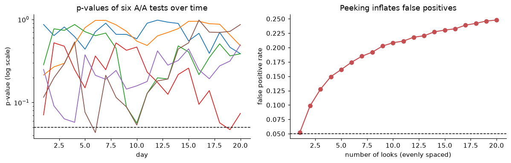
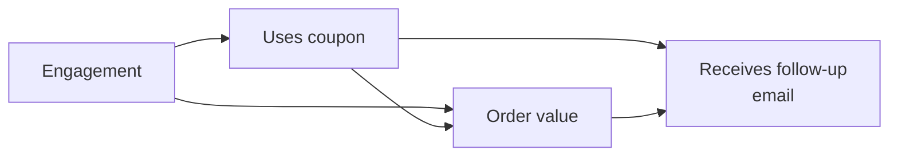
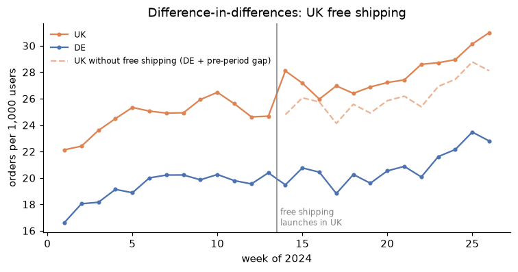

# Experimentation and A/B testing

> **Level 2 · Chapter 5** · ⏱️ ~65 min read · Prerequisites: [Statistics](../01-math-foundations/05-statistics.md) and [Exploratory data analysis](03-exploratory-data-analysis.md)

An A/B test is a randomized experiment: show a change to a random half of your users, and compare. It's the most reliable way to learn whether a change *causes* an improvement. This chapter covers why randomization works, how to choose metrics and guardrails, how to size a test with a power analysis, how to analyze it with a two-proportion z-test and confidence intervals, and how tests go wrong: peeking, novelty effects, and multiple comparisons. It ends with multi-armed bandits and an introduction to causal inference without randomization, using causal diagrams and difference-in-differences.

## Why it matters

ShopCo's EDA (Chapter 3) pointed at the mobile checkout page: mobile visitors reached checkout as often as desktop visitors, but fewer than half of them finished. The design team built a one-page mobile checkout, and Priya's team launched an A/B test.

The product manager watched the dashboard every morning. On day three, the new checkout was ahead by more than 8 percentage points with $p < 0.001$. The PM declared victory, stopped the test, and rolled it out to everyone. The quarterly forecast was raised accordingly.

The forecast missed. The real, lasting improvement turned out to be about a third of what the dashboard had shown. Two things had inflated the day-three number. First, a new design attracts curiosity, and early lifts often fade: a **novelty effect**. Second, checking the p-value every day and stopping the first time it looks good is a known way to manufacture "significant" results: **peeking**. The checkout really was better. But the decision was based on a number that the process itself had distorted.

Running an experiment is easy. Running one whose result you can trust takes a plan made in advance, a sample size you computed, and an analysis that matches the plan. That's this chapter.

## Concepts

### Why randomize: potential outcomes

Here's the fundamental problem. For each user $i$, imagine two **potential outcomes**: $Y_i(1)$, what they'd do with the new checkout, and $Y_i(0)$, what they'd do with the old one. The **individual treatment effect** is $Y_i(1) - Y_i(0)$. But each user sees only one version, so we observe only one of the two outcomes, never both. This is the **fundamental problem of causal inference**.

We settle for the **average treatment effect** (ATE) across users:

$$
\tau = \mathbb{E}[Y(1) - Y(0)] = \mathbb{E}[Y(1)] - \mathbb{E}[Y(0)].
$$

Let $T_i \in \{0, 1\}$ indicate which version user $i$ saw. The naive comparison is the difference in observed group means, which estimates $\mathbb{E}[Y \mid T = 1] - \mathbb{E}[Y \mid T = 0]$. Since a user with $T=1$ shows $Y(1)$, this equals $\mathbb{E}[Y(1) \mid T = 1] - \mathbb{E}[Y(0) \mid T = 0]$. Add and subtract $\mathbb{E}[Y(0) \mid T = 1]$:

$$
\underbrace{\mathbb{E}[Y(1) \mid T=1] - \mathbb{E}[Y(0) \mid T=1]}_{\text{effect on the treated}} + \underbrace{\mathbb{E}[Y(0) \mid T=1] - \mathbb{E}[Y(0) \mid T=0]}_{\text{selection bias}}.
$$

The second term is **selection bias**: how differently the two groups would have behaved *without* the treatment. If users chose the new checkout themselves, eager buyers might opt in, and the selection bias would be large and positive.

**Randomization** removes it. If a coin flip decides $T$, then $T$ is independent of the potential outcomes, so $\mathbb{E}[Y(0) \mid T = 1] = \mathbb{E}[Y(0) \mid T = 0] = \mathbb{E}[Y(0)]$. The selection bias is exactly zero, the first term becomes $\tau$, and the simple difference in means is an unbiased estimate of the causal effect. No other method gets this guarantee without assumptions. That's why randomized experiments are the gold standard.

### Designing the experiment: units and assignment

The **unit of randomization** is the thing you flip a coin for: a user, a session, a page view, a store. Choose the unit at which the treatment is experienced and the metric is measured. If you randomize sessions, the same user may see both checkouts on different visits, which is confusing for them and contaminates both groups. ShopCo randomizes **users**.

Assignment must be **consistent** (the same user always gets the same version) and **independent** of anything about the user. The standard technique is to hash the user ID together with an experiment-specific **salt**, and use the hash to pick a bucket. Hashing is deterministic, needs no stored table, and different salts give independent splits for different experiments:

```python
import hashlib

import numpy as np
import pandas as pd

def assign(user_id, experiment="mobile-checkout-v2", treatment_share=0.5):
    digest = hashlib.sha256(f"{experiment}:{user_id}".encode()).hexdigest()
    bucket = int(digest[:8], 16) / 16 ** 8          # a stable pseudo-random number in [0, 1)
    return "treatment" if bucket < treatment_share else "control"

print([assign(uid) for uid in [1001, 1002, 1003, 1001]])
shares = pd.Series([assign(uid) for uid in range(100_000)]).value_counts(normalize=True)
print(shares.round(4).to_dict())
```

```text
['control', 'treatment', 'control', 'control']
{'control': 0.501, 'treatment': 0.499}
```

User 1001 gets the same answer both times, and the split over 100,000 IDs is very close to 50/50.

A related idea is the **triggered** population: include in the analysis only users who could have been affected. The new design only changes the checkout page, so ShopCo analyzes mobile users who *reached* checkout during the test. Users who never got there saw no difference; including them would add noise and dilute the measured effect without changing it. (Trigger on something that happens *before* the treatment can act, such as arriving at the page, never on something the treatment might influence.)

### Metrics and guardrails

Choose metrics before the test starts, and write them down. There are three kinds:

- The **primary metric** (or **overall evaluation criterion**) decides the test. It should be sensitive to the change, aligned with long-term value, and computed per randomization unit. ShopCo's primary metric is the **purchase conversion rate**: the share of triggered users who complete a purchase.
- **Secondary metrics** help explain the result: average order value, time to complete checkout, payment errors.
- **Guardrail metrics** must not get worse, even if the primary metric improves: refund rate, page load time, customer support contacts, revenue per user. A checkout that converts more by hiding the shipping cost will show up here.

Two technical points about metrics. First, the denominator should match the unit of randomization. If you randomize users but compute "conversions per session", users with many sessions count more, the observations aren't independent, and the standard formulas underestimate the variance. Second, a test with twenty metrics will usually show one "significant" change by chance (Chapter 3, Exercise 5). That's why one metric is designated primary in advance.

### Hypotheses, errors, and power

The test is framed as a hypothesis test, as in Level 1. With conversion rates $p_C$ (control) and $p_T$ (treatment):

- The **null hypothesis** $H_0: p_T = p_C$ says the change makes no difference.
- The **alternative** $H_1: p_T \ne p_C$ (two-sided).

Two errors are possible:

| | $H_0$ true (no effect) | $H_1$ true (real effect) |
|---|---|---|
| **Reject $H_0$** | **Type I error** (false positive), probability $\alpha$ | Correct: probability is the **power** $1 - \beta$ |
| **Don't reject** | Correct | **Type II error** (false negative), probability $\beta$ |

The **significance level** $\alpha$ is usually 0.05. The **power** is the probability of detecting an effect if there really is one of a given size; 80% is a common target. That "given size" is the **minimum detectable effect** (MDE): the smallest effect worth detecting, chosen for business reasons. If the new checkout costs a lot to maintain, a 0.5-point lift might not be worth it, so there's no point designing a test to detect it.

### Power analysis and sample size

How many users does the test need? Let $\delta = p_T - p_C$ be the effect, and $n$ the users per group. The difference in sample proportions $\hat{p}_T - \hat{p}_C$ has standard error

$$
\text{SE} = \sqrt{\frac{p_C(1-p_C)}{n} + \frac{p_T(1-p_T)}{n}} \approx \sqrt{\frac{2\,\bar{p}(1-\bar{p})}{n}},
$$

where $\bar{p}$ is the average of the two rates. The test rejects $H_0$ when $|\hat{\delta}| / \text{SE} > z_{1-\alpha/2}$ (1.96 for $\alpha = 0.05$). For power $1 - \beta$, the true effect $\delta$ must sit far enough beyond that threshold that the estimate lands past it with probability $1 - \beta$. That requires $\delta = (z_{1-\alpha/2} + z_{1-\beta}) \cdot \text{SE}$. Substitute the SE and solve for $n$:

$$
n \approx \frac{2\,(z_{1-\alpha/2} + z_{1-\beta})^2\, \bar{p}(1-\bar{p})}{\delta^2}.
$$

With $\alpha = 0.05$ and 80% power, $(1.96 + 0.84)^2 \approx 7.85$. The formula shows the key trade-off: **the sample size grows with the inverse square of the effect**. Halve the MDE and you need four times as many users. This is why tests for small improvements need huge samples.

For ShopCo: mobile checkout-to-purchase conversion is about 43% (from Chapter 3). The team decides that a 3-percentage-point lift (to 46%) is the smallest worth acting on.

```python
from scipy import stats
from statsmodels.stats.power import NormalIndPower
from statsmodels.stats.proportion import proportion_effectsize

p_c, mde, alpha, power = 0.43, 0.03, 0.05, 0.80
p_t = p_c + mde
z_a, z_b = stats.norm.ppf(1 - alpha / 2), stats.norm.ppf(power)
p_bar = (p_c + p_t) / 2
n_formula = 2 * (z_a + z_b) ** 2 * p_bar * (1 - p_bar) / mde ** 2

h = proportion_effectsize(p_t, p_c)       # Cohen's h, an effect size for proportions
n_statsmodels = NormalIndPower().solve_power(effect_size=h, alpha=alpha, power=power, ratio=1.0)
print(f"per group: formula {n_formula:,.0f}   statsmodels {n_statsmodels:,.0f}")

for m in [0.01, 0.02, 0.03, 0.05]:
    hh = proportion_effectsize(p_c + m, p_c)
    print(f"MDE {m:.0%} points -> {NormalIndPower().solve_power(hh, alpha=alpha, power=power):>8,.0f} users per group")
```

```text
per group: formula 4,308   statsmodels 4,306
MDE 1% points ->   38,580 users per group
MDE 2% points ->    9,668 users per group
MDE 3% points ->    4,306 users per group
MDE 5% points ->    1,556 users per group
```

statsmodels uses **Cohen's h**, $h = 2\arcsin\sqrt{p_T} - 2\arcsin\sqrt{p_C}$, an effect size on a variance-stabilized scale, so its answer differs from the simple formula by a few users. Both say about 4,300 users per group. ShopCo gets about 650 triggered mobile users a day, so the test needs about two weeks. Round up to **whole weeks**, because behavior differs between weekdays and weekends, and a test that covers Monday to Thursday only isn't representative.

!!! tip "Write the plan before you start"
    A one-paragraph **pre-registration** prevents most experiment mistakes: the hypothesis, the unit, the triggered population, the primary metric, the guardrails, the MDE, the sample size, the duration, and the analysis method. Decide all of these before seeing any data, and don't change them after.

### Analyzing the test: the two-proportion z-test

Here's the ShopCo checkout experiment: 14 days, about 650 triggered users a day, randomized 50/50. The generator includes a true effect, and (as in the story) a novelty boost that fades over the first days.

```python
def make_checkout_experiment(days=14, users_per_day=650, seed=2):
    """Synthetic A/B test of a one-page mobile checkout. One row per triggered user."""
    rng = np.random.default_rng(seed)
    n = days * users_per_day
    day = np.repeat(np.arange(days), users_per_day)
    variant = np.where(rng.random(n) < 0.5, "treatment", "control")
    country = rng.choice(["US", "UK", "DE", "IN", "BR"], n, p=[0.25, 0.30, 0.10, 0.25, 0.10])
    lift = 0.03 + 0.06 * np.exp(-day / 2.5)                 # lasting lift + a fading novelty boost
    p = 0.43 + np.where(variant == "treatment", lift, 0.0)
    purchased = rng.random(n) < p
    order_usd = np.where(purchased, np.round(60 * rng.lognormal(0, 0.6, n), 2), 0.0)
    refunded = purchased & (rng.random(n) < 0.05)
    return pd.DataFrame({"user_id": rng.choice(10**7, n, replace=False), "day": day, "variant": variant,
                         "country": country, "purchased": purchased.astype(int),
                         "order_usd": order_usd, "refunded": refunded.astype(int)})

exp = make_checkout_experiment()
print(exp.head(3))
print(exp.groupby("variant").agg(users=("user_id", "size"), conversions=("purchased", "sum"),
                                 conversion=("purchased", "mean")).round(4))
```

```text
   user_id  day    variant country  purchased  order_usd  refunded
0  1738020    0  treatment      IN          1      53.54         0
1  9904126    0  treatment      UK          0       0.00         0
2  9572502    0    control      US          1      59.06         0
           users  conversions  conversion
variant
control     4505         1917      0.4255
treatment   4595         2193      0.4773
```

**First, check the split.** A **sample ratio mismatch** (SRM) means the groups' sizes differ from the design by more than chance allows. It signals a broken assignment or logging bug (for example, the new page crashing for some browsers, so their users never get logged), and it invalidates the comparison. Test it with a chi-square goodness-of-fit test against the planned 50/50:

```python
counts = exp["variant"].value_counts().sort_index()
chi2, p_srm = stats.chisquare(counts, f_exp=[len(exp) / 2] * 2)
print(counts.to_dict(), f"SRM p-value = {p_srm:.3f}")
```

```text
{'control': 4505, 'treatment': 4595} SRM p-value = 0.345
```

A p-value this large means no evidence of a mismatch. (Teams usually alarm on $p < 0.001$, since this check runs on every experiment.)

**Now the test.** With $x_C$ conversions out of $n_C$ users and $x_T$ out of $n_T$, the sample rates are $\hat{p}_C = x_C/n_C$ and $\hat{p}_T = x_T/n_T$. Under $H_0$, both groups share one rate, best estimated by pooling: $\hat{p} = (x_C + x_T)/(n_C + n_T)$. The **two-proportion z-statistic** is

$$
z = \frac{\hat{p}_T - \hat{p}_C}{\sqrt{\hat{p}(1-\hat{p})\left(\frac{1}{n_C} + \frac{1}{n_T}\right)}},
$$

which is approximately standard normal under $H_0$ for large samples, by the central limit theorem. The two-sided p-value is $2\,(1 - \Phi(|z|))$, where $\Phi$ is the standard normal CDF.

For the **confidence interval** of the difference, don't pool (we're no longer assuming $H_0$):

$$
(\hat{p}_T - \hat{p}_C) \pm z_{1-\alpha/2} \sqrt{\frac{\hat{p}_T(1-\hat{p}_T)}{n_T} + \frac{\hat{p}_C(1-\hat{p}_C)}{n_C}}.
$$

From scratch, then with statsmodels:

```python
from statsmodels.stats.proportion import confint_proportions_2indep, proportions_ztest

g = exp.groupby("variant")["purchased"].agg(["sum", "count"])
x_t, n_t = g.loc["treatment"]
x_c, n_c = g.loc["control"]
pt, pc = x_t / n_t, x_c / n_c

pooled = (x_t + x_c) / (n_t + n_c)
z = (pt - pc) / np.sqrt(pooled * (1 - pooled) * (1 / n_t + 1 / n_c))
p_value = 2 * stats.norm.sf(abs(z))
se = np.sqrt(pt * (1 - pt) / n_t + pc * (1 - pc) / n_c)
ci = (pt - pc - 1.96 * se, pt - pc + 1.96 * se)
print(f"from scratch: diff = {pt - pc:+.4f}, z = {z:.3f}, p = {p_value:.2g}, 95% CI [{ci[0]:+.4f}, {ci[1]:+.4f}]")

z_sm, p_sm = proportions_ztest([x_t, x_c], [n_t, n_c])
lo, hi = confint_proportions_2indep(x_t, n_t, x_c, n_c, method="wald")
print(f"statsmodels:  z = {z_sm:.3f}, p = {p_sm:.2g}, 95% CI [{lo:+.4f}, {hi:+.4f}]")
print(f"relative lift: {(pt - pc) / pc:+.1%}")
```

```text
from scratch: diff = +0.0517, z = 4.958, p = 7.1e-07, 95% CI [+0.0313, +0.0722]
statsmodels:  z = 4.958, p = 7.1e-07, 95% CI [+0.0313, +0.0722]
relative lift: +12.2%
```

Report the result as an effect with an interval, not just a p-value: "The new checkout raised purchase conversion by about 5 points (95% CI roughly 3 to 7 points), from about 43% to 48%." The interval tells the business the plausible range of the gain, which is what they need for a forecast. The p-value only says the effect is unlikely to be zero.

**Guardrails and continuous metrics.** Revenue per user is continuous and very skewed (most users spend zero). With thousands of users per group, the central limit theorem makes Welch's t-test reasonable for the difference in means, and a bootstrap confidence interval (Level 1) is a good check that doesn't rely on normality:

```python
rev_t = exp.loc[exp["variant"].eq("treatment"), "order_usd"].to_numpy()
rev_c = exp.loc[exp["variant"].eq("control"), "order_usd"].to_numpy()
t_stat, p_rev = stats.ttest_ind(rev_t, rev_c, equal_var=False)       # Welch's t-test

rng = np.random.default_rng(0)
boot = np.array([rng.choice(rev_t, len(rev_t)).mean() - rng.choice(rev_c, len(rev_c)).mean()
                 for _ in range(2000)])
print(f"revenue per user: treatment {rev_t.mean():.2f}, control {rev_c.mean():.2f} USD; "
      f"Welch p = {p_rev:.1g}; bootstrap 95% CI [{np.percentile(boot, 2.5):+.2f}, {np.percentile(boot, 97.5):+.2f}]")

refunds = exp[exp["purchased"].eq(1)].groupby("variant")["refunded"].agg(["sum", "count"])
_, p_refund = proportions_ztest(refunds["sum"], refunds["count"])
print("refund rate among buyers:", (refunds["sum"] / refunds["count"]).round(4).to_dict(), f"p = {p_refund:.2f}")
```

```text
revenue per user: treatment 34.14, control 30.57 USD; Welch p = 0.0004; bootstrap 95% CI [+1.62, +5.37]
refund rate among buyers: {'control': 0.049, 'treatment': 0.0606} p = 0.10
```

Revenue per user rose, which follows from the conversion gain. The refund rate among buyers is about 1.2 points higher in treatment, but not significantly so ($p = 0.10$). Be careful with that sentence: "no significant change" in a guardrail isn't proof of no harm, especially since the test was sized for the primary metric, not for refunds. Check whether the confidence interval rules out a harmful change of a size you care about; if it doesn't, keep monitoring.

### Peeking: why you can't stop when it looks good

The p-value's guarantee, "if $H_0$ is true, $p < 0.05$ happens only 5% of the time", holds for **one** test at a planned sample size. If you compute the p-value every day and stop the first time it dips below 0.05, you get many chances to cross the line, and the p-value of a null experiment wanders a lot. The real false positive rate becomes much larger than 5%.

A simulation makes it concrete. We run 10,000 **A/A tests** (both groups get the same experience, so $H_0$ is true by construction), each for 20 days, and check the z-test after every day:

```python
import matplotlib.pyplot as plt

rng = np.random.default_rng(1)
n_sims, n_days, per_day, p0 = 10_000, 20, 300, 0.43
conv_a = rng.binomial(per_day, p0, size=(n_sims, n_days)).cumsum(axis=1)   # cumulative conversions
conv_b = rng.binomial(per_day, p0, size=(n_sims, n_days)).cumsum(axis=1)
n_cum = per_day * np.arange(1, n_days + 1)                                  # cumulative users per group

pooled = (conv_a + conv_b) / (2 * n_cum)
z = (conv_b - conv_a) / n_cum / np.sqrt(pooled * (1 - pooled) * 2 / n_cum)
pvals = 2 * stats.norm.sf(np.abs(z))                                        # shape (sims, days)

print(f"false positive rate, one test at day 20:   {(pvals[:, -1] < 0.05).mean():.3f}")
print(f"false positive rate, peeking every day:    {(pvals < 0.05).any(axis=1).mean():.3f}")
looks = np.arange(1, n_days + 1)
fpr_by_looks = [(pvals[:, np.linspace(0, n_days - 1, k).round().astype(int)] < 0.05).any(axis=1).mean() for k in looks]

fig, axes = plt.subplots(1, 2, figsize=(11, 3.6))
for i in range(6):
    axes[0].plot(looks, pvals[i], lw=1.2)
axes[0].axhline(0.05, color="black", ls="--", lw=1)
axes[0].set(yscale="log", xlabel="day", ylabel="p-value (log scale)", title="p-values of six A/A tests over time")
axes[1].plot(looks, fpr_by_looks, marker="o", color="#C44E52")
axes[1].axhline(0.05, color="black", ls="--", lw=1)
axes[1].set(xlabel="number of looks (evenly spaced)", ylabel="false positive rate", title="Peeking inflates false positives")
for ax in axes:
    ax.spines[["top", "right"]].set_visible(False)
plt.tight_layout()
plt.show()
```

```text
false positive rate, one test at day 20:   0.050
false positive rate, peeking every day:    0.248
```



*Under the null hypothesis, p-values wander. Every extra look is another chance to cross 0.05 by luck, so the false positive rate climbs with the number of looks.*

There are three honest ways to handle the urge to look:

1. **Fixed horizon**: compute the sample size, run to it, analyze once. Look at the dashboard for bugs and guardrail emergencies, never to decide.
2. **Sequential testing**: use a method designed for repeated looks. **Group sequential designs** spend the $\alpha$ budget across a few planned interim looks, using a stricter threshold at each look (O'Brien-Fleming boundaries are very strict early and close to 0.05 at the end). **Always-valid** p-values and confidence sequences allow continuous monitoring. Many experimentation platforms offer one of these.
3. **Calibrate by simulation**: find the per-look threshold that keeps the overall false positive rate at 5% for your look schedule.

The simulation above can do option 3 directly. For each simulated null test, record its smallest p-value across the 20 looks; the 5th percentile of those minima is the per-look threshold that gives a 5% overall error rate:

```python
threshold = np.quantile(pvals.min(axis=1), 0.05)
print(f"with 20 daily looks, use p < {threshold:.4f} at each look to keep the overall false positive rate at 5%")
```

```text
with 20 daily looks, use p < 0.0079 at each look to keep the overall false positive rate at 5%
```

The cost is power: a stricter threshold needs more data to detect the same effect. There's no free lunch, only a choice between looking rarely and looking with stricter rules.

### Other pitfalls

- **Novelty and primacy effects.** Users react to change itself. A new design can get a temporary boost from curiosity (**novelty**) or a temporary dip because returning users have to relearn it (**primacy**, or change aversion). Plot the effect by day, run long enough to see it stabilize, and compare new users (who have no old habits) with returning ones. The analysis below does this for ShopCo.
- **Underpowered tests and the winner's curse.** When power is low, the only results that reach significance are the ones where luck inflated the estimate. Significant results from underpowered tests systematically overstate the effect (Exercise 5).
- **Multiple comparisons.** Many metrics, many variants, or many segments raise the chance of a false positive. Pre-register one primary metric; correct for multiple variants (Bonferroni divides $\alpha$ by the number of comparisons, Holm's method is uniformly more powerful); treat segment findings as hypotheses.
- **Interference.** The math assumes one user's treatment doesn't affect another user's outcome, an assumption called **SUTVA** (stable unit treatment value assumption). It fails in marketplaces (treated buyers take inventory from control buyers) and social products. The fix is randomizing larger units, such as cities or time periods.
- **Twyman's law.** "Any figure that looks interesting or different is usually wrong." A huge effect from a small change is more likely a bug (an SRM, a logging change, a bot) than a breakthrough. Investigate before celebrating.

### Multi-armed bandits

An A/B test spends half its traffic on the worse version for the whole test. That's the price of learning precisely. A **multi-armed bandit** trades some precision for less waste: it shifts traffic toward the better-looking arm *during* the test. The name comes from a gambler choosing between slot machines ("one-armed bandits") with unknown payout rates. Every choice balances **exploration** (trying arms to learn their rates) against **exploitation** (playing the arm that currently looks best). The total cost of not always playing the best arm is called **regret**.

**Thompson sampling** is a simple, effective bandit algorithm with a Bayesian core. Keep a Beta posterior for each arm's conversion rate. Starting from a uniform $\text{Beta}(1, 1)$ prior, after $s$ conversions and $f$ non-conversions the posterior is $\text{Beta}(1 + s, 1 + f)$, by Beta-Binomial conjugacy from Level 1. For each new user, draw one random sample from each arm's posterior and show the arm with the highest draw. Arms that are probably better win most draws; arms that are uncertain still win some, which keeps exploring them.

Here's a comparison on 10,000 users with true rates of 43% and 46%, repeated 300 times. Real systems update the posterior in batches, so we update every 200 users:

```python
def run_policy(policy, p_arms=(0.43, 0.46), n_users=10_000, batch=200, n_runs=300, seed=0):
    rng = np.random.default_rng(seed)
    p_arms = np.array(p_arms)
    succ = np.zeros((n_runs, 2))
    fail = np.zeros((n_runs, 2))
    shown_best = 0.0
    for _ in range(n_users // batch):
        if policy == "ab":
            arm = rng.integers(0, 2, size=(n_runs, batch))
        else:                                            # Thompson sampling, one draw per user
            draws = rng.beta(1 + succ[:, :, None], 1 + fail[:, :, None], size=(n_runs, 2, batch))
            arm = draws.argmax(axis=1)
        conv = rng.random((n_runs, batch)) < p_arms[arm]
        for a in (0, 1):
            succ[:, a] += (conv & (arm == a)).sum(axis=1)
            fail[:, a] += (~conv & (arm == a)).sum(axis=1)
        shown_best += (arm == 1).mean()
    total_conv = succ.sum(axis=1).mean()
    regret = n_users * p_arms.max() - total_conv
    return total_conv, regret, shown_best / (n_users // batch)

for policy in ["ab", "thompson"]:
    conv, regret, share = run_policy(policy)
    print(f"{policy:9s} conversions {conv:7.1f}   regret {regret:6.1f}   share of users on better arm {share:.2f}")
```

```text
ab        conversions  4448.3   regret  151.7   share of users on better arm 0.50
thompson  conversions  4562.3   regret   37.7   share of users on better arm 0.87
```

Thompson sampling sends most users to the better arm and loses far fewer conversions. So why run A/B tests at all? Because the bandit gives you a much less precise estimate of the *difference* between the arms: the worse arm gets few users, and assignment probabilities change over time, which complicates inference. Use bandits when the goal is to *earn* during the test (headlines, promotions, short-lived offers). Use A/B tests when the goal is to *learn* a reliable effect size for a lasting decision, and when you need guardrails and long-term effects measured cleanly.

### Causal inference without randomization

Sometimes you can't randomize: the change was launched to everyone, it's unethical or illegal to withhold, or it applies to a whole country. Then you're estimating causal effects from **observational data**, where selection bias doesn't vanish on its own. Two tools help you reason about it.

**Causal diagrams.** A **directed acyclic graph** (**DAG**) draws variables as nodes and direct causes as arrows, with no cycles. For ShopCo, consider the question "does using a coupon increase order value?":



The effect we want is the arrow $C \to V$. But there's another path from $C$ to $V$: $C \leftarrow E \to V$. It's a **backdoor path**, because it starts with an arrow *into* the treatment, and it carries a non-causal association: engaged customers both use coupons and spend more. $E$ is a **confounder**. To estimate the causal effect, you **block** backdoor paths by adjusting for (conditioning on, stratifying by, or including in a regression) a set of variables that intercepts them. Here, adjusting for engagement.

Two kinds of variables you must *not* adjust for:

- **Mediators**, on the causal path from treatment to outcome. Adjusting for them removes part of the effect you want to measure (Chapter 3's warning).
- **Colliders**, variables caused by both the treatment and the outcome, like $R$ above. A path through a collider is blocked by default, and conditioning on the collider *opens* it, creating a spurious association. If you analyzed only customers who received the follow-up email, you'd create a link between coupon use and order value that isn't causal.

DAGs force you to state your assumptions. Their conclusions are only as good as the arrows you drew, and an unmeasured confounder can't be adjusted for. That's the fundamental weakness of observational analysis, and the reason randomization is preferred when possible.

**Difference-in-differences.** In week 14 of 2024, ShopCo introduced free shipping in the UK, but not in Germany. Did it increase orders? Two naive answers are both wrong:

- *UK after minus UK before* mixes the effect with everything else that changed over time: growth, seasonality, marketing.
- *UK after minus Germany after* mixes the effect with the permanent differences between the two countries.

**Difference-in-differences** (DiD) combines them. Use Germany's change over the same period to estimate what would have happened in the UK without free shipping, and subtract it:

$$
\hat{\tau}_{\text{DiD}} = \left(\bar{Y}_{\text{UK, post}} - \bar{Y}_{\text{UK, pre}}\right) - \left(\bar{Y}_{\text{DE, post}} - \bar{Y}_{\text{DE, pre}}\right).
$$

The first difference removes the UK's permanent level; subtracting Germany's change removes the shared time trend. The key assumption is **parallel trends**: without the treatment, the UK's outcome would have moved in parallel with Germany's. It can't be tested for the post period, but you can check whether the trends were parallel *before* the change, and you should always plot them.

DiD is also a regression. With an indicator $\text{UK}_i$ for the treated country and $\text{post}_t$ for weeks after the change,

$$
Y_{it} = \beta_0 + \beta_1\, \text{UK}_i + \beta_2\, \text{post}_t + \beta_3\, (\text{UK}_i \times \text{post}_t) + \varepsilon_{it},
$$

where $\beta_1$ is the permanent country gap, $\beta_2$ the common change over time, and $\beta_3$ the DiD estimate of the effect. The regression form gives a standard error and extends to more groups, periods, and control variables.

```python
import statsmodels.formula.api as smf

rng = np.random.default_rng(5)
weeks = np.arange(1, 27)
season = 1.5 * np.sin(2 * np.pi * weeks / 26)
rows = []
for country, level in [("UK", 22.0), ("DE", 17.0)]:
    effect = np.where((country == "UK") & (weeks >= 14), 2.0, 0.0)       # true effect: +2 orders per 1,000 users
    y = level + 0.25 * weeks + season + effect + rng.normal(0, 0.6, len(weeks))
    rows.append(pd.DataFrame({"country": country, "week": weeks, "orders_per_1k": y}))
panel = pd.concat(rows, ignore_index=True)
panel["uk"] = (panel["country"] == "UK").astype(int)
panel["post"] = (panel["week"] >= 14).astype(int)

means = panel.groupby(["country", "post"])["orders_per_1k"].mean().unstack()
print(means.round(2))
print(f"naive before/after (UK only): {means.loc['UK', 1] - means.loc['UK', 0]:+.2f}")
print(f"naive UK vs DE (after only):  {means.loc['UK', 1] - means.loc['DE', 1]:+.2f}")
did = (means.loc["UK", 1] - means.loc["UK", 0]) - (means.loc["DE", 1] - means.loc["DE", 0])
print(f"difference-in-differences:    {did:+.2f}")

fit = smf.ols("orders_per_1k ~ uk * post", data=panel).fit(cov_type="HC1")
print(f"regression: beta_3 = {fit.params['uk:post']:+.2f}, 95% CI "
      f"[{fit.conf_int().loc['uk:post', 0]:+.2f}, {fit.conf_int().loc['uk:post', 1]:+.2f}]")
```

```text
post         0      1
country
DE       19.32  20.83
UK       24.63  27.96
naive before/after (UK only): +3.34
naive UK vs DE (after only):  +7.13
difference-in-differences:    +1.82
regression: beta_3 = +1.82, 95% CI [+0.40, +3.24]
```

Both naive answers are far off; DiD recovers the true effect of +2 within its confidence interval. (A caution about the standard error: with real panel data, outcomes in nearby weeks are correlated, and proper DiD inference clusters standard errors by group, which needs many groups. With only two countries, treat the interval as optimistic.)

```python
fig, ax = plt.subplots(figsize=(8, 3.6))
for country, color in [("UK", "#DD8452"), ("DE", "#4C72B0")]:
    d = panel[panel["country"] == country]
    ax.plot(d["week"], d["orders_per_1k"], marker="o", ms=3, color=color, label=country)
pre_gap = means.loc["UK", 0] - means.loc["DE", 0]
de = panel[panel["country"] == "DE"]
ax.plot(de["week"][de["week"] >= 14], de["orders_per_1k"][de["week"] >= 14] + pre_gap,
        ls="--", color="#DD8452", alpha=0.6, label="UK without free shipping (DE + pre-period gap)")
ax.axvline(13.5, color="gray", lw=1)
ax.text(13.7, ax.get_ylim()[0] + 0.5, "free shipping\nlaunches in UK", fontsize=8, color="gray")
ax.set(xlabel="week of 2024", ylabel="orders per 1,000 users", title="Difference-in-differences: UK free shipping")
ax.legend(frameon=False, fontsize=8)
ax.spines[["top", "right"]].set_visible(False)
plt.show()
```



*Before week 14, the two countries move in parallel, which supports the key assumption. After it, the UK pulls away from its counterfactual (dashed), and the gap is the estimated effect.*

## In practice

### Analyzing the checkout experiment end to end

The plan was pre-registered: users randomized 50/50, triggered on reaching mobile checkout, primary metric purchase conversion, guardrails revenue per user and refund rate, MDE 3 points, two weeks. The SRM check and the main analysis are above. Two more checks complete the picture.

**Is the effect stable over time?** A novelty effect shows up as a lift that shrinks over the first days:

```python
daily = exp.pivot_table(index="day", columns="variant", values="purchased", aggfunc="mean")
daily["lift_pts"] = 100 * (daily["treatment"] - daily["control"])
print(daily["lift_pts"].round(1).to_string())

first, rest = exp[exp["day"] < 4], exp[exp["day"] >= 7]
for name, part in [("days 0-3", first), ("days 7-13", rest)]:
    r = part.groupby("variant")["purchased"].mean()
    print(f"{name}: lift {100 * (r['treatment'] - r['control']):+.1f} points")
```

```text
day
0      5.8
1     14.2
2      5.2
3      7.4
4      7.3
5      5.6
6      6.7
7      2.1
8      3.5
9      5.8
10     5.8
11    -2.4
12     2.0
13     3.1
days 0-3: lift +8.1 points
days 7-13: lift +2.8 points
```

Daily lifts are noisy (each day has only about 325 users per group), but the pattern is clear when grouped: the first days show a much larger lift than the second week. That's the story's day-three number. The second-week lift is the better estimate of the lasting effect, and it's what goes into the forecast. If the change were large or expensive, the right move would be to keep a small holdout group on the old checkout for a few more weeks to confirm the effect has stabilized.

**Is it consistent across segments?** Look, but don't go fishing:

```python
seg = exp.groupby(["country", "variant"])["purchased"].mean().unstack()
seg["lift_pts"] = 100 * (seg["treatment"] - seg["control"])
seg["n"] = exp.groupby("country").size()
print(seg.round(3).sort_values("n", ascending=False))
```

```text
variant  control  treatment  lift_pts     n
country
UK         0.444      0.477     3.280  2753
US         0.412      0.478     6.532  2245
IN         0.422      0.481     5.949  2198
DE         0.422      0.499     7.659   960
BR         0.413      0.448     3.524   944
```

The lift is positive in every country, with sizes that vary as much as you'd expect from samples of these sizes. No segment calls for a different decision.

**The decision memo.** "The one-page mobile checkout increased purchase conversion among mobile users reaching checkout. Over the full two weeks, the lift was about 5 points (95% CI roughly 3 to 7), but the first days were inflated by a novelty effect; the second week's lift of about 3 points is our best estimate of the lasting effect. Revenue per user rose. The refund rate was slightly higher in treatment, though not significantly. Recommendation: ship to all mobile users, and keep a 5% holdout for four weeks to confirm the long-run lift and to watch the refund rate."

## Exercises

### Exercise 1: Size a test by hand (easy)

A page converts at 10%. You want 80% power to detect an absolute lift of 1 percentage point at $\alpha = 0.05$, two-sided. Compute the required users per group with the approximate formula, then check with statsmodels. How many would you need for a 0.5-point lift?

??? success "Solution"

    $\bar{p} = 0.105$, so $\bar{p}(1-\bar{p}) = 0.093975$. With $(1.96 + 0.8416)^2 \approx 7.849$: $n \approx 2 \times 7.849 \times 0.093975 / 0.01^2 \approx 14{,}750$ per group. Halving the MDE quadruples $n$ (and $\bar{p}$ changes slightly), so a 0.5-point lift needs about 58,000 per group.

    ```python
    for m in [0.01, 0.005]:
        pb = 0.10 + m / 2
        n_hand = 2 * (stats.norm.ppf(0.975) + stats.norm.ppf(0.8)) ** 2 * pb * (1 - pb) / m ** 2
        n_sm = NormalIndPower().solve_power(proportion_effectsize(0.10 + m, 0.10), alpha=0.05, power=0.8)
        print(f"MDE {m:.3f}: formula {n_hand:,.0f}   statsmodels {n_sm:,.0f}")
    ```

    ```text
    MDE 0.010: formula 14,752   statsmodels 14,744
    MDE 0.005: formula 57,764   statsmodels 57,756
    ```

### Exercise 2: Read the result correctly (easy)

A test reports a lift of +0.8 points, $p = 0.09$, 95% CI $[-0.1, +1.7]$ points, with an MDE of 1 point and 80% power. Which statements are correct? (a) The change has no effect. (b) There's a 9% chance the null hypothesis is true. (c) The data are consistent with effects from slightly negative to +1.7 points. (d) If there were no effect, a difference at least this large would occur about 9% of the time. (e) We should keep running the test until it's significant.

??? success "Solution"

    (c) and (d) are correct. (a) is wrong: failing to reject isn't evidence of no effect; the interval includes meaningful positive effects. (b) is the most common misreading: a p-value is computed *assuming* the null is true, so it can't be the probability that the null is true. (e) is peeking: extending a test until it crosses 0.05 inflates the false positive rate. The right next step is a business decision based on the interval (is a lift of up to 1.7 points worth pursuing?), possibly with a new, properly sized test.

### Exercise 3: Sample ratio mismatch (medium)

An experiment designed as 50/50 ends with 50,600 users in control and 49,400 in treatment. Is this a sample ratio mismatch? Compute the chi-square test, and list two plausible causes you'd investigate.

??? success "Solution"

    ```python
    chi2, p = stats.chisquare([50_600, 49_400])
    print(f"chi2 = {chi2:.1f}, p = {p:.1e}")
    ```

    ```text
    chi2 = 14.4, p = 1.5e-04
    ```

    A 1.2% imbalance on 100,000 users is far beyond chance ($p$ around $10^{-4}$), so yes. Don't analyze the results until it's explained. Plausible causes: the treatment page fails to load or log for some browsers or app versions, so some treated users disappear from the data; bots or crawlers handled differently by the two variants; a redirect in one arm that loses users; or the assignment and logging joining on different user identifiers.

### Exercise 4: Difference-in-differences by hand (medium)

Average weekly orders per 1,000 users were: UK before 24.0, UK after 28.5; DE before 19.0, DE after 21.5. Compute the DiD estimate. Then explain what would bias it if, in the post period, Germany had a national holiday that depressed orders.

??? success "Solution"

    UK change: $28.5 - 24.0 = 4.5$. DE change: $21.5 - 19.0 = 2.5$. DiD: $4.5 - 2.5 = 2.0$ orders per 1,000 users.

    A German holiday in the post period would make Germany's change smaller than the UK's counterfactual change, violating parallel trends. The control group's change would understate the common trend, so the DiD estimate would be biased *upward*: part of the holiday dip would be credited to free shipping. Checks: plot the weekly series, exclude the holiday weeks, or add more control countries.

### Exercise 5: The winner's curse (hard)

Simulate 5,000 underpowered experiments: a true lift from 10% to 10.5% with 3,000 users per group. Estimate the power. Then, among the experiments that reached $p < 0.05$ in the positive direction, compute the average estimated lift. Compare it with the true 0.5 points, and explain the result. Repeat with 60,000 users per group.

??? success "Solution"

    ```python
    rng = np.random.default_rng(2)
    for n in [3_000, 60_000]:
        xc = rng.binomial(n, 0.100, 5000)
        xt = rng.binomial(n, 0.105, 5000)
        pc_, pt_ = xc / n, xt / n
        pool = (xc + xt) / (2 * n)
        zz = (pt_ - pc_) / np.sqrt(pool * (1 - pool) * 2 / n)
        sig = (zz > 1.96)
        print(f"n={n:>6,}: power {sig.mean():.2f}; mean estimated lift among significant results "
              f"{100 * (pt_ - pc_)[sig].mean():.2f} points (true 0.50)")
    ```

    ```text
    n= 3,000: power 0.10; mean estimated lift among significant results 1.90 points (true 0.50)
    n=60,000: power 0.80; mean estimated lift among significant results 0.56 points (true 0.50)
    ```

    With 3,000 per group, power is tiny, and the only way to reach significance is for random noise to push the estimate far above the truth, so the significant results overstate the effect several times over. With 60,000 per group, power is high, nearly every experiment is significant, and the average significant estimate is close to the truth. Underpowered tests don't just miss effects; when they "succeed", they exaggerate.

## Check yourself

1. Why does randomization make the difference in means an unbiased estimate of the causal effect?

    ??? note "Answer"

        The naive difference equals the effect on the treated plus a selection bias term, $\mathbb{E}[Y(0) \mid T=1] - \mathbb{E}[Y(0) \mid T=0]$. Randomization makes treatment independent of the potential outcomes, so that term is zero.

2. What are power and the minimum detectable effect, and how does the required sample size depend on the MDE?

    ??? note "Answer"

        Power is the probability of rejecting $H_0$ when a true effect of a given size exists. The MDE is the smallest effect the test is designed to detect with that power. The sample size scales with $1/\text{MDE}^2$: halving the MDE quadruples the sample.

3. Why is the standard error pooled in the z-test but not in the confidence interval?

    ??? note "Answer"

        The test computes the statistic's distribution assuming $H_0$, under which both groups share one rate, best estimated by pooling. The confidence interval doesn't assume $H_0$, so each group's own rate is used.

4. What is a sample ratio mismatch, and why does it invalidate a test?

    ??? note "Answer"

        Group sizes that differ from the design more than chance allows. It indicates that users were lost or added non-randomly (a bug in assignment or logging), so the groups may no longer be comparable.

5. Why does checking the p-value daily and stopping at the first $p < 0.05$ inflate false positives?

    ??? note "Answer"

        Under the null, the p-value wanders over time. Each look is another chance for it to dip below 0.05, so the probability of ever crossing is much higher than 5%. Fixed horizons, sequential designs, or stricter per-look thresholds fix it.

6. When would you use a bandit instead of an A/B test?

    ??? note "Answer"

        When the goal is to maximize reward during the test (short-lived offers, headlines) rather than to estimate an effect precisely. A/B tests are better for learning reliable effect sizes and checking guardrails for lasting decisions.

7. In a DAG, which variables should you adjust for, and which should you not?

    ??? note "Answer"

        Adjust for confounders, which block backdoor paths from treatment to outcome. Don't adjust for mediators (on the causal path) or colliders (caused by both treatment and outcome), since that removes part of the effect or opens a spurious path.

8. What assumption does difference-in-differences rely on, and how do you check it?

    ??? note "Answer"

        Parallel trends: without treatment, the treated group's outcome would have changed like the control group's. It can't be verified for the post period, but you can check that the pre-treatment trends were parallel by plotting them.

## Key takeaways

- Randomization removes selection bias, which makes the difference in means a causal estimate. Randomize the unit at which the treatment is experienced, with consistent hashed assignment.
- Pre-register the hypothesis, primary metric, guardrails, MDE, sample size, and duration. Sample size grows with the inverse square of the MDE.
- Check for sample ratio mismatch first. Then report the effect with a confidence interval, not just a p-value, and check guardrails.
- Don't stop a test when it first looks significant: peeking inflates false positives. Use a fixed horizon or a sequential method.
- Watch for novelty effects, the winner's curse in underpowered tests, multiple comparisons, and interference between units.
- Bandits earn while testing; A/B tests learn precisely. Without randomization, reason with DAGs, and use difference-in-differences when a comparable control group and parallel pre-trends exist.

## Further reading

- *Trustworthy Online Controlled Experiments: A Practical Guide to A/B Testing* by Ron Kohavi, Diane Tang, and Ya Xu (Cambridge University Press, 2020), the standard practical reference.
- *Causal Inference: The Mixtape* by Scott Cunningham (Yale University Press, 2021), also free online, for potential outcomes, DAGs, and difference-in-differences.
- *Causal Inference: What If* by Miguel Hernán and James Robins (CRC Press), freely available from the authors.
- "A Tutorial on Thompson Sampling" by Daniel Russo, Benjamin Van Roy, Abbas Kazerouni, Ian Osband, and Zheng Wen, *Foundations and Trends in Machine Learning*, 2018.

## Next

An analysis only matters if people understand and act on it: [Communicating results](06-communicating-results.md).
