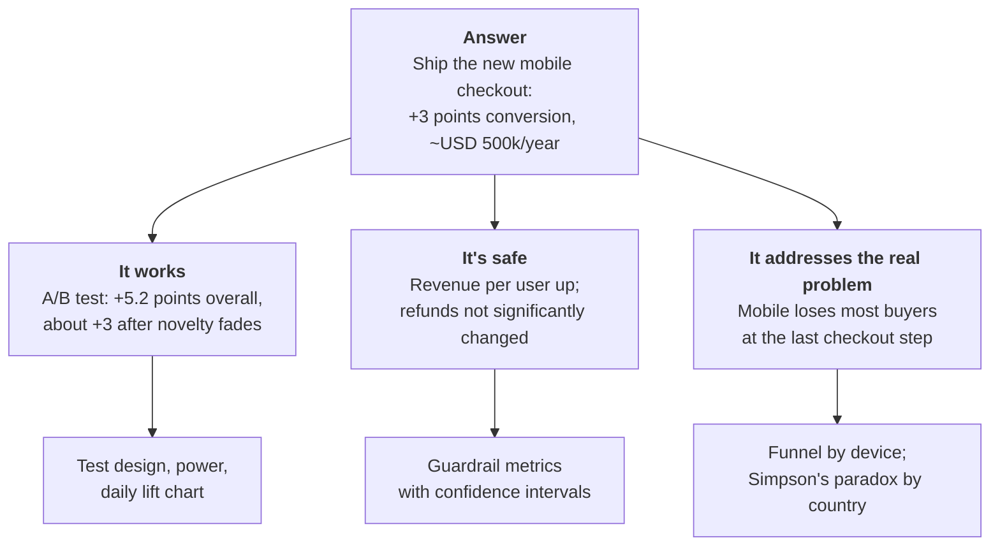
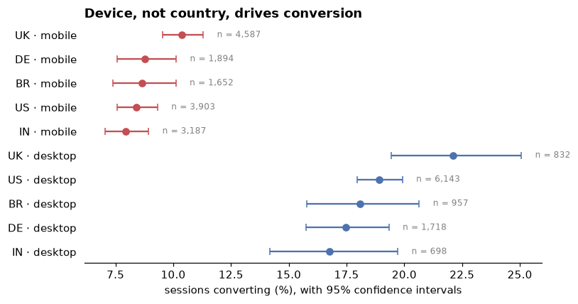

# Communicating results

> **Level 2 · Chapter 6** · ⏱️ ~50 min read · Prerequisites: [Experimentation and A/B testing](05-experimentation-and-ab-testing.md) and [Data visualization](../00-python-for-data/06-visualization.md)

An analysis creates value only when someone understands it, trusts it, and acts on it. This chapter covers the communication half of data science: knowing your audience, structuring a message with the pyramid principle, designing charts that make one point clearly, writing an analysis report, building dashboards people actually use, and making your work reproducible with scripts, environments, and version control.

## Why it matters

Wei spent three weeks on ShopCo's mobile checkout analysis: the funnel breakdown, the Simpson's paradox by country, the A/B test with its power analysis and novelty check. It was careful, correct work. Wei presented it to the leadership team as 34 slides, in the order the work had been done: data sources, cleaning decisions, exploratory charts, the test design, the results, and finally, on slide 31, the recommendation.

By slide 12, the CEO was checking email. By slide 20, someone asked, "So what are we supposed to do?" Wei said it was coming. The meeting ran out of time at slide 26. The decision was deferred to the next quarter.

A week later, Wei's manager, Priya, rewrote it as one page. The first sentence said: "Ship the new mobile checkout: it raises mobile purchase conversion by about 3 points, worth roughly USD 500,000 a year, with no harm to refunds or revenue per user so far." Three short sections followed, each one supporting that sentence with one chart. The rest went into an appendix. The decision took ten minutes.

Nothing in the analysis changed. Only its structure did. The work that goes into an analysis is chronological, but the communication of it shouldn't be. Your audience wants the answer first, and they'll ask for the evidence they need.

## Concepts

### Knowing your audience

Before writing a word or drawing a chart, answer three questions:

1. **Who is reading, and what decision will they make?** An executive deciding whether to ship needs different information than an engineer deciding how to implement it.
2. **What do they already know and believe?** If they believe the UK is underperforming, your message has to address that belief directly, not just present a different number.
3. **How much time and attention will they give it?** Thirty seconds on a slide? Five minutes on an email? An hour on a technical review?

Different audiences need different versions of the same analysis:

| Audience | They need | Leave out | Format |
|---|---|---|---|
| Executives | The decision, the impact in money or customers, the main risk | Methods, intermediate results, code | One page or three slides, answer first |
| Product and business partners | What to do, the trade-offs, what to monitor | Statistical details beyond confidence intervals | Short report with a few charts |
| Technical peers and reviewers | Data, methods, assumptions, robustness checks, code | Persuasion | Full report, notebook, or repository |
| Wider company or public | The finding in plain language, why it matters | Jargon, caveats only experts can weigh | A paragraph and one chart |

It's normal to produce two or three of these from one analysis. The technical version is what makes the short version trustworthy; the short version is what gets the technical work used.

### The pyramid principle

The **pyramid principle**, developed by Barbara Minto at McKinsey, is a way to structure any argument: **start with the answer, then group the supporting arguments, then give the evidence for each**. The reader gets the conclusion in the first sentence and can stop at whatever depth they need.



The supporting arguments should be **MECE**: mutually exclusive (they don't overlap) and collectively exhaustive (together, they fully support the answer). "It works, it's safe, and it targets the real problem" is a typical MECE set for a recommendation.

For an introduction, Minto's **SCQA** pattern sets up the answer in four short beats:

- **Situation**: what the reader already knows. "Mobile is 56% of our traffic."
- **Complication**: what changed or what's wrong. "But mobile converts at half the desktop rate."
- **Question**: what the reader now wonders. "Can we fix that?"
- **Answer**: your main message. "Yes: the new checkout recovers a third of the gap."

Contrast the two structures for the same content:

| Chronological (how you worked) | Pyramid (how they read) |
|---|---|
| 1. We pulled data from three tables. | **Ship the new mobile checkout: +3 points conversion.** |
| 2. We cleaned duplicates and time zones. | 1. The A/B test shows a clear, lasting lift. |
| 3. EDA showed a mobile gap. | 2. Guardrails show no harm. |
| 4. We designed and ran an A/B test. | 3. It fixes the step where mobile loses buyers. |
| 5. Results were significant. | Appendix: data, cleaning, methods. |
| 6. Therefore, we recommend shipping. | |

The chronological version makes the reader do the work of finding the point. The pyramid version gives it to them and lets them decide how much evidence to read.

### Effective charts

A chart in a report or presentation is an argument, not a data dump. The exploratory charts from Chapter 3 were for *you*, to find things. Explanatory charts are for *them*, to see one thing quickly. The principles:

1. **One message per chart.** If you can't state the message in one sentence, the chart isn't ready.
2. **Put the message in the title.** An **action title** states the takeaway: "Mobile loses more than half of buyers at the last step", not "Funnel conversion by device".
3. **Choose the chart for the message.** Comparison across categories: bars (horizontal when labels are long), sorted. Change over time: lines. Distribution: histogram, box plot, or ECDF. Relationship: scatter. Part of a whole: a stacked bar, or a pie only with two or three slices.
4. **Highlight what matters, mute the rest.** Use one strong color for the point of the chart and gray for context. Color is a **pre-attentive** attribute: the eye notices it before reading anything.
5. **Remove clutter.** Edward Tufte called it maximizing the **data-ink ratio**: delete heavy gridlines, borders, background colors, redundant legends, and decimal places nobody needs. Label bars and lines directly instead of making readers match colors to a legend.
6. **Be honest with scales.** Bar charts must start at zero, because bar length encodes the value. Line charts may zoom in, but say so. Avoid dual y-axes, which let you create any visual correlation you like by choosing the scales. Never use 3D effects.
7. **Show uncertainty** when it matters to the decision: confidence intervals as error bars or bands, and sample sizes for small groups.
8. **Design for everyone.** Use colorblind-safe palettes, don't encode meaning in red versus green alone, and keep text large enough to read on a projector.

Here's a makeover. The "before" chart is the default you'd get from plotting a raw funnel table. The "after" chart makes one point.

??? example "The ShopCo data generator (expand and run this first)"

    ```python
    import numpy as np
    import pandas as pd

    def make_shop(n_users=5000, seed=42):
        """Messy, seeded synthetic data for ShopCo: returns (users, events, orders)."""
        rng = np.random.default_rng(seed)
        start = pd.Timestamp("2024-01-01", tz="UTC")
        end = pd.Timestamp("2025-01-01", tz="UTC")

        # ---------- users ----------
        uid = np.arange(1001, 1001 + n_users)
        country = rng.choice(["US", "UK", "DE", "IN", "BR"], n_users, p=[.40, .20, .15, .15, .10])
        p_mobile = pd.Series(country).map({"US": .35, "UK": .80, "DE": .45, "IN": .80, "BR": .60}).to_numpy()
        device = np.where(rng.random(n_users) < p_mobile, "mobile",
                          rng.choice(["desktop", "tablet"], n_users, p=[.85, .15]))
        channel = rng.choice(["organic", "paid_search", "social", "email", "referral"],
                             n_users, p=[.35, .25, .20, .10, .10])
        signup = start + pd.to_timedelta(rng.uniform(0, 330, n_users), unit="D")
        age_true = np.clip(rng.normal(36, 11, n_users), 18, 80).round()
        age = age_true.copy()
        age[rng.random(n_users) < np.where(device == "mobile", .15, .04)] = np.nan  # mobile form skips age
        age[rng.choice(n_users, 25, replace=False)] = -1                           # "unknown" sentinel
        age[rng.choice(n_users, 4, replace=False)] = [230, 199, 340, 2]            # typos
        variants = {"US": ["us", "USA", "United States"], "UK": ["uk", "U.K.", "United Kingdom"],
                    "DE": ["de", "Germany"], "IN": ["India", " IN"], "BR": ["Brazil", "br "]}
        messy = rng.random(n_users) < 0.2
        country_raw = [rng.choice(variants[c]) if m else c for c, m in zip(country, messy)]
        users = pd.DataFrame({
            "user_id": uid,
            "signup_at": signup.strftime("%Y-%m-%d %H:%M:%S"),    # UTC, stored as text
            "country": country_raw, "device": device, "channel": channel, "age": age,
        })
        users = pd.concat([users, users.sample(60, random_state=seed)])  # double-submitted forms

        # ---------- sessions and funnel events ----------
        lam = pd.Series(channel).map({"email": 9, "referral": 7, "organic": 6,
                                      "social": 4, "paid_search": 4}).to_numpy()
        n_sess = rng.poisson(lam * rng.gamma(2, 0.5, n_users))
        s_user = np.repeat(np.arange(n_users), n_sess)
        s_dev, s_cty = device[s_user], country[s_user]
        # visits follow a daily rhythm in the customer's *local* time, peaking in the evening
        hour_w = np.array([3, 2, 1, 1, 1, 1, 2, 3, 4, 5, 5, 6, 7, 6, 6, 6, 6, 7, 8, 10, 11, 10, 8, 5])
        local_s = rng.choice(24, len(s_user), p=hour_w / hour_w.sum()) * 3600 + rng.uniform(0, 3600, len(s_user))
        utc_off = pd.Series(s_cty).map({"US": -5, "UK": 0, "DE": 1, "IN": 5.5, "BR": -3}).to_numpy()
        day = (signup[s_user] + (end - signup[s_user]) * rng.random(len(s_user))).floor("D")
        s_start = day + pd.to_timedelta(local_s - utc_off * 3600, unit="s")
        s_start = s_start.where(s_start > signup[s_user], signup[s_user] + pd.Timedelta(minutes=5))
        s_start = s_start.where(s_start < end - pd.Timedelta(hours=1), end - pd.Timedelta(hours=1))
        p_buy = np.select([s_dev == "desktop", s_dev == "tablet"], [.85, .70], .40) + .12 * (s_cty == "UK")
        cart = rng.random(len(s_user)) < .35
        checkout = cart & (rng.random(len(s_user)) < .60)
        purchase = checkout & (rng.random(len(s_user)) < p_buy)
        t_cart = s_start + pd.to_timedelta(rng.uniform(30, 600, len(s_user)), unit="s")
        t_chk = t_cart + pd.to_timedelta(rng.uniform(30, 300, len(s_user)), unit="s")
        t_buy = t_chk + pd.to_timedelta(rng.uniform(10, 120, len(s_user)), unit="s")
        sid = np.arange(1, len(s_user) + 1)
        parts = []
        for name, mask, t in [("page_view", np.ones(len(s_user), bool), s_start), ("add_to_cart", cart, t_cart),
                              ("checkout", checkout, t_chk), ("purchase", purchase, t_buy)]:
            parts.append(pd.DataFrame({"session_id": sid[mask], "user_id": uid[s_user][mask],
                                       "event_type": name, "ts_ms": t[mask].as_unit("ms").asi8}))
        events = pd.concat(parts).sort_values("ts_ms", ignore_index=True)
        events = pd.concat([events, events.sample(frac=.01, random_state=seed)])  # client retries
        events = events.sort_values("ts_ms", ignore_index=True)
        events.insert(0, "event_id", np.arange(1, len(events) + 1))

        # ---------- orders (one per purchase session) ----------
        o_idx = np.flatnonzero(purchase)
        n_o = len(o_idx)
        cats = np.array(["electronics", "home", "fashion", "books", "beauty"])
        cat = rng.choice(cats, n_o, p=[.20, .25, .25, .15, .15])
        median = pd.Series(cat).map({"electronics": 120, "home": 60, "fashion": 45,
                                     "books": 18, "beauty": 30}).to_numpy()
        n_items = 1 + rng.poisson(.6, n_o)
        spend = median * n_items ** .7 * np.exp(.01 * (age_true[s_user][o_idx] - 36))
        amount = np.round(spend * rng.lognormal(0, .5, n_o), 2)
        status = rng.choice(["completed", "cancelled", "refunded"], n_o, p=[.90, .05, .05])
        amount[(status == "refunded") & (rng.random(n_o) < .5)] *= -1          # some refunds stored negative
        amount[rng.random(n_o) < .015] = np.nan                                 # lost in a migration
        amount[rng.choice(n_o, 4, replace=False)] = 99999.0                     # QA test orders
        cat_raw = cat.astype(object)
        r = rng.random(n_o)
        cat_raw[r < .10] = np.char.title(cat[r < .10].astype(str))
        cat_raw[(r >= .10) & (r < .15)] = np.char.upper(cat[(r >= .10) & (r < .15)].astype(str))
        cat_raw[(r >= .15) & (r < .20)] = np.char.add(cat[(r >= .15) & (r < .20)].astype(str), " ")
        coupon = rng.choice(np.array([None, "WELCOME10", "SPRING20", "FREESHIP"], dtype=object),
                            n_o, p=[.80, .08, .06, .06])
        # timestamps: web writes UTC with "Z"; the mobile app writes local time with an offset
        t = pd.Series(t_buy[o_idx])
        o_dev, o_cty = s_dev[o_idx], s_cty[o_idx]
        ts = t.dt.strftime("%Y-%m-%dT%H:%M:%SZ")
        tzs = {"US": "America/New_York", "UK": "Europe/London", "DE": "Europe/Berlin",
               "IN": "Asia/Kolkata", "BR": "America/Sao_Paulo"}
        for c, tz in tzs.items():
            m = (o_dev == "mobile") & (o_cty == c)
            local = t[m].dt.tz_convert(tz).dt.strftime("%Y-%m-%d %H:%M:%S%z")
            ts[m] = local.str[:-2] + ":" + local.str[-2:]
        orders = pd.DataFrame({
            "order_id": np.arange(500001, 500001 + n_o), "user_id": uid[s_user][o_idx],
            "order_ts": ts.to_numpy(), "category": cat_raw, "amount_usd": amount,
            "n_items": n_items, "status": status, "coupon": coupon,
        })
        orphans = orders.sample(15, random_state=seed).assign(user_id=lambda d: d.user_id + 90000,
                                                              order_id=lambda d: d.order_id + 50000)
        orders = pd.concat([orders, orphans, orders.sample(frac=.02, random_state=seed + 1)])
        orders = orders.sample(frac=1, random_state=seed).reset_index(drop=True)
        return users.reset_index(drop=True), events, orders
    ```

??? example "The Chapter 2 cleaning function (expand and run this second)"

    ```python
    COUNTRY_MAP = {"US": "US", "USA": "US", "UNITED STATES": "US", "UK": "UK", "U.K.": "UK",
                   "UNITED KINGDOM": "UK", "DE": "DE", "GERMANY": "DE", "IN": "IN", "INDIA": "IN",
                   "BR": "BR", "BRAZIL": "BR"}
    TIMEZONES = {"US": "America/New_York", "UK": "Europe/London", "DE": "Europe/Berlin",
                 "IN": "Asia/Kolkata", "BR": "America/Sao_Paulo"}

    def clean_shop(users, events, orders):
        """Apply the Chapter 2 cleaning rules. Returns clean (users, events, orders)."""
        u = users.drop_duplicates().copy()
        u["signup_at"] = pd.to_datetime(u["signup_at"], utc=True)
        u["country"] = u["country"].str.strip().str.upper().map(COUNTRY_MAP)
        u["age"] = u["age"].where(u["age"].between(13, 100))          # sentinels and typos -> NaN
        u = u.astype({"device": "category", "channel": "category", "country": "category"})

        e = events.drop_duplicates(subset=["session_id", "user_id", "event_type", "ts_ms"]).copy()
        e["ts"] = pd.to_datetime(e["ts_ms"], unit="ms", utc=True)
        e = e.drop(columns="ts_ms")

        o = orders.drop_duplicates().copy()
        o = o[o["user_id"].isin(u["user_id"])]                          # drop orphans
        o = o[o["amount_usd"].ne(99999.0)]                              # drop QA test orders
        o["order_ts"] = pd.to_datetime(o["order_ts"], utc=True, format="ISO8601")
        o["category"] = o["category"].str.strip().str.lower().astype("category")
        o["amount_usd"] = o["amount_usd"].abs()                         # refunds stored as negatives
        o["coupon"] = o["coupon"].fillna("none")
        country = o["user_id"].map(u.set_index("user_id")["country"])
        o["local_hour"] = -1
        for c, tz in TIMEZONES.items():
            m = (country == c).to_numpy()
            o.loc[m, "local_hour"] = o.loc[m, "order_ts"].dt.tz_convert(tz).dt.hour
        return u.reset_index(drop=True), e.reset_index(drop=True), o.reset_index(drop=True)
    ```

```python
import matplotlib.pyplot as plt
import numpy as np
import pandas as pd

users, events, orders = make_shop()
u, e, o = clean_shop(users, events, orders)
sessions = (e.pivot_table(index=["session_id", "user_id"], columns="event_type", values="ts",
                          aggfunc="size", fill_value=0).reset_index().rename_axis(columns=None)
            .merge(u[["user_id", "device", "country", "channel"]], on="user_id"))
reached = sessions.groupby("device", observed=True)[["page_view", "add_to_cart", "checkout", "purchase"]].apply(lambda d: (d > 0).sum())
print(reached)
```

```text
         page_view  add_to_cart  checkout  purchase
device
desktop      10348         3723      2249      1936
mobile       15223         5344      3190      1366
tablet        1645          553       334       248
```

```python
fig, axes = plt.subplots(1, 2, figsize=(13, 4.2), gridspec_kw={"width_ratios": [1.1, 1]})

# BEFORE: the default plot of the raw table
reached.T.plot(kind="bar", ax=axes[0], grid=True)
axes[0].set_title("Funnel data by device")
axes[0].tick_params(axis="x", rotation=45)

# AFTER: one message, one highlight, direct labels, an action title
rate = (100 * reached["purchase"] / reached["checkout"]).sort_values()
colors = ["#C44E52" if d == "mobile" else "#BBBBBB" for d in rate.index]
bars = axes[1].barh(rate.index.astype(str), rate.values, color=colors)
axes[1].bar_label(bars, labels=[f"{v:.0f}%" for v in rate.values], padding=4, fontsize=11)
axes[1].set_xlim(0, 100)
axes[1].set_title("Mobile loses more than half of buyers\nat the last checkout step",
                  loc="left", fontsize=12, fontweight="bold")
axes[1].set_xlabel("sessions completing purchase after reaching checkout (%)")
axes[1].spines[["top", "right", "bottom"]].set_visible(False)
axes[1].tick_params(left=False, bottom=False, labelbottom=False)
axes[1].tick_params(axis="y", labelsize=11)
plt.tight_layout()
plt.show()
```


*The same data, two purposes. The left chart shows everything and says nothing; the right chart makes one point that a reader gets in two seconds.*

The "before" chart isn't wrong. It's an exploratory chart: you'd need to compute the ratios in your head to see the story, and the large page-view bars dominate it while carrying no message. The "after" chart computes the one ratio that matters, sorts it, labels it directly, and says what it means in the title.

**Showing uncertainty.** When categories have different sample sizes, a bar chart of rates suggests a precision that small groups don't have. A **dot plot with confidence intervals** shows both the estimate and how far to trust it:

```python
from statsmodels.stats.proportion import proportion_confint

g = (sessions.assign(converted=sessions["purchase"] > 0)
     .groupby(["country", "device"], observed=True)["converted"].agg(["sum", "count"]))
g = g[g.index.get_level_values("device") != "tablet"]
lo, hi = proportion_confint(g["sum"], g["count"], method="wilson")
g["rate"], g["lo"], g["hi"] = 100 * g["sum"] / g["count"], 100 * lo, 100 * hi
g = g.reset_index().sort_values(["device", "rate"])

fig, ax = plt.subplots(figsize=(7.5, 4))
for i, row in enumerate(g.itertuples()):
    color = "#C44E52" if row.device == "mobile" else "#4C72B0"
    ax.errorbar(row.rate, i, xerr=[[row.rate - row.lo], [row.hi - row.rate]], fmt="o", color=color, capsize=3)
    ax.text(row.hi + 0.6, i, f"n = {row.count:,}", va="center", fontsize=8, color="gray")
ax.set_yticks(range(len(g)), [f"{r.country} · {r.device}" for r in g.itertuples()])
ax.set_xlabel("sessions converting (%), with 95% confidence intervals")
ax.set_title("Device, not country, drives conversion", loc="left", fontweight="bold")
ax.spines[["top", "right", "left"]].set_visible(False)
ax.tick_params(left=False)
plt.tight_layout()
plt.show()
```



*Every mobile segment converts at about half the rate of every desktop segment. The interval widths show which differences between countries are too uncertain to act on.*

### Writing an analysis report

A good analysis report is short, answer-first, and honest about uncertainty. A structure that works for most analyses:

1. **Title that states the conclusion.** "The new mobile checkout lifts conversion by about 3 points", not "Checkout experiment results".
2. **Summary** (three to five sentences): the answer, the key numbers with their uncertainty, the recommendation, and the main risk. Many readers stop here, so it must stand alone.
3. **Background and question**: why this analysis exists, in two or three sentences.
4. **Findings**: one subsection per supporting argument, each headed by a claim and backed by one chart or table.
5. **Limitations and caveats**: what could make the conclusion wrong, and how much it matters.
6. **Recommendation and next steps**: who should do what, and what to monitor.
7. **Appendix**: data sources, cleaning rules, methods, robustness checks, and a link to the code.

Some writing habits make numbers trustworthy:

- **Give both absolute and relative changes, and name the base.** "Conversion rose from 42.6% to 47.7%, 5.2 percentage points (a 12% relative increase)." "Up 12%" alone is ambiguous: 12 points or 12 percent?
- **Name the denominator.** "Conversion among mobile users who reached checkout", not just "conversion".
- **Round to what matters.** "About USD 500,000 a year" is more honest than "USD 512,186.40 a year" for a projection built on an estimate with a wide interval.
- **Translate statistics.** Say "we're confident the lift is between 3 and 7 points" rather than "the result is statistically significant at the 5% level"; the second sentence doesn't say how big or how sure.
- **Separate findings from opinions.** "The test shows X" and "I recommend Y" are different kinds of statement; keep them visibly different.
- **State limitations without burying the answer.** Every analysis has them. List the ones that could change the decision, and say what would resolve them.

### Dashboards

A **dashboard** is a page of charts and numbers that updates automatically. Reports answer one question once; dashboards **monitor** a few questions continuously. Good dashboards are designed backwards from the decisions they support:

- **One audience, one purpose.** An executive weekly-business-review dashboard and an on-call operations dashboard should be different pages.
- **Few metrics, precisely defined.** Each **key performance indicator** (KPI) needs one written definition (numerator, denominator, filters, time zone) that matches every other place it's reported. A shared, version-controlled set of definitions, sometimes called a **semantic layer** or metrics layer, prevents the "two dashboards, two numbers" problem.
- **Context for every number.** A number alone means nothing. Show it against a target, the previous period, or the same period last year, with a trend line.
- **Freshness and ownership.** Show when the data was last updated, and who to ask when something looks wrong.
- **Alerts for the things that matter.** If someone must act when a metric crosses a threshold, send an alert instead of hoping they check the dashboard.

Common failures are **vanity metrics** (numbers that only go up, like cumulative signups, and drive no decision), dashboards with forty charts that nobody reads, and dashboards whose definitions quietly differ from the finance team's. Tools range from business-intelligence platforms (Looker, Tableau, Power BI, Superset, Metabase) to Python app frameworks (Streamlit, Dash) for custom needs.

The core of most dashboards is a small, well-defined KPI table. Here's ShopCo's weekly version, with week-over-week changes:

```python
done = o[o["status"].eq("completed")].copy()
done["week"] = done["order_ts"].dt.tz_convert(None).dt.to_period("W-SUN")
weekly = done.groupby("week").agg(orders=("order_id", "size"), revenue_usd=("amount_usd", "sum"),
                                  buyers=("user_id", "nunique"))
weekly["aov_usd"] = weekly["revenue_usd"] / weekly["orders"]
last4 = weekly.iloc[-5:-1]                     # the last complete weeks (the final week is partial)
kpi = pd.DataFrame({"this week": last4.iloc[-1], "last week": last4.iloc[-2]})
kpi["change"] = (kpi["this week"] / kpi["last week"] - 1).map("{:+.1%}".format)
print(f"Week {last4.index[-1]}")
print(kpi.round(1))
```

```text
Week 2024-12-23/2024-12-29
             this week  last week  change
orders           144.0      178.0  -19.1%
revenue_usd    15539.2    15277.3   +1.7%
buyers           140.0      173.0  -19.1%
aov_usd          107.9       85.8  +25.7%
```

Notice the comment: the final week of the data is incomplete, and comparing a partial week with a full one is a classic dashboard bug that produces a scary "drop" every Monday morning.

### Reproducible analysis

An analysis is **reproducible** when someone else (or you, six months later) can rerun it from the raw data and get the same numbers. It's what makes a result checkable, and it turns next quarter's update from a week of archaeology into a single command. The ingredients:

1. **Code, not clicks.** Every step from raw data to final chart is in code. No manual edits in spreadsheets, no copy-pasted numbers.
2. **Immutable raw data.** Keep raw extracts read-only, with the query and the date they were pulled. Cleaning writes new files.
3. **A pinned environment.** Record exact package versions in a lock file (`uv.lock`, `requirements.txt` with pinned versions, or a conda environment file), as in Level 0. pandas 2 and pandas 3 can give different results for the same code.
4. **Seeds for randomness.** Every bootstrap, simulation, and train-test split uses a fixed seed.
5. **One entry point.** A single script or `make` target runs everything in order.
6. **Relative paths and configuration.** No `C:\Users\wei\Desktop\final_v3.csv`. Parameters (dates, thresholds) live in one config file.
7. **Generated outputs.** Charts and tables in the report are produced by the code, never edited by hand.

A typical layout for an analysis project:

```text
checkout-analysis/
├── README.md              # the question, how to run, where the report is
├── pyproject.toml         # dependencies
├── uv.lock                # exact pinned versions
├── config.yaml            # dates, thresholds, experiment ID
├── data/
│   ├── raw/               # read-only extracts (not in git; see below)
│   └── processed/         # outputs of the cleaning step (not in git)
├── src/checkout/          # reusable functions: load, clean, analyze, plot
│   ├── clean.py
│   └── analyze.py
├── notebooks/             # exploration, importing from src/
├── scripts/run_all.py     # the single entry point
├── tests/                 # tests for cleaning rules and metric definitions
└── reports/               # generated report and figures
```

A simple way to *check* reproducibility is to fingerprint the results: compute a hash of the key output table. Run the pipeline twice; if the hashes match, the outputs are bit-for-bit identical. Put the hash in the report, and anyone rerunning the code can confirm they got the same thing.

```python
import hashlib

def run_pipeline(seed=42):
    users, events, orders = make_shop(seed=seed)
    u, e, o = clean_shop(users, events, orders)
    done = o[o["status"].eq("completed")]
    return (done.merge(u[["user_id", "country"]], on="user_id")
                .groupby("country", observed=True)["amount_usd"].agg(["size", "sum"]).round(2))

def fingerprint(df):
    return hashlib.sha256(pd.util.hash_pandas_object(df, index=True).to_numpy().tobytes()).hexdigest()[:12]

print("run 1, seed 42:", fingerprint(run_pipeline(42)))
print("run 2, seed 42:", fingerprint(run_pipeline(42)))
print("run 3, seed 7: ", fingerprint(run_pipeline(7)))
```

```text
run 1, seed 42: 4b9a22ede9a0
run 2, seed 42: 4b9a22ede9a0
run 3, seed 7:  486fdd78b508
```

Same inputs and seed, same fingerprint; change anything, and the fingerprint changes. In a real project, the same idea applies to raw data files: record a checksum of each extract so you know when the data under an analysis has changed.

### Notebooks vs scripts

Jupyter notebooks and plain Python scripts are both essential, for different jobs.

| | Notebooks | Scripts and modules |
|---|---|---|
| Best for | Exploration, visual iteration, teaching, narrative reports | Pipelines, reusable functions, scheduled jobs, anything tested |
| Strengths | Immediate feedback, charts inline, prose next to code | Run top to bottom every time, easy to diff, review, test, and import |
| Weaknesses | **Hidden state**: cells run out of order, deleted cells whose variables still exist; noisy diffs; hard to test | Slower to iterate visually |

Hidden state is the notebook's characteristic failure. You define `threshold = 0.5` in a cell, use it, later change the cell to `0.3` but don't rerun the cells below. The notebook now shows results computed with a value that appears nowhere in it. The defense is simple and non-negotiable: **before sharing a notebook, restart the kernel and run all cells**. If it doesn't run cleanly top to bottom, it isn't finished.

A healthy workflow uses both:

1. Explore in a notebook.
2. When a piece of code stabilizes (a cleaning rule, a metric definition), move it into a module under `src/`, and add a test.
3. Import it back into the notebook, which shrinks to narrative, calls, and charts.
4. The final pipeline runs as a script; notebooks become readable reports on top of it.

Tools help at the edges: **jupytext** saves notebooks as plain `.py` or `.md` files that diff cleanly, **nbstripout** removes outputs before committing, **papermill** runs a notebook with parameters as a pipeline step, and **Quarto** renders notebooks and markdown into polished reports.

### Version control for data work

You learned git basics in Level 0. For analysis work, a few extra habits matter:

- **Commit code, configuration, and small reference files. Don't commit large data, credentials, or generated outputs.** Git stores every version of every file forever, so a 2 GB extract committed once bloats the repository permanently, and a committed password stays in the history even after you delete it.
- **Use a `.gitignore`** from day one:

    ```text
    data/
    reports/figures/
    .env
    *.parquet
    .ipynb_checkpoints/
    ```

- **Strip notebook outputs** before committing (nbstripout), or pair notebooks with jupytext files. Outputs make diffs unreadable and can leak data.
- **Version data separately.** Tools such as **DVC** (Data Version Control) store large files elsewhere (cloud storage) and commit small pointer files with their hashes to git, so each commit records exactly which data version it used. Without a tool, at minimum keep dated, immutable snapshots and record their checksums.
- **Review analysis like code.** Open a pull request for significant analyses; a second pair of eyes on a join or a filter catches the bugs from Chapter 1.
- **Tag what you shipped.** When a report goes out, tag the commit (`git tag checkout-report-2024-12`), so the exact code behind every published number can be recovered.

<!-- skip-run -->
```bash
git init checkout-analysis && cd checkout-analysis
uv init && uv add pandas duckdb matplotlib statsmodels    # pinned in uv.lock
echo -e "data/\n.env\nreports/figures/" > .gitignore
git add . && git commit -m "Project skeleton: environment, layout, gitignore"
# ... work ...
git tag checkout-report-2024-12 && git push --tags
```

## In practice

### A one-page report for the checkout test

Here's a complete one-page report for the A/B test from Chapter 5, following the structure above. Notice that the first paragraph is enough for an executive, and each section supports one claim.

!!! example "Report: The new mobile checkout lifts purchase conversion by about 3 points"

    **Summary.** We tested a one-page mobile checkout against the current three-step version for two weeks, with 9,100 mobile users who reached checkout, randomly split. The new checkout raised purchase conversion from 42.6% to 47.7%: 5.2 percentage points (95% CI: 3.1 to 7.2). Part of that early lift was a novelty effect; in the second week the lift was about 3 points, which we use as the lasting estimate. At current volumes (about 650 mobile users reach checkout each day, and the average order is about USD 72), 3 points is worth roughly USD 500,000 a year in additional revenue. Revenue per user rose; the refund rate was slightly higher but not significantly. **We recommend shipping it to all mobile users, with a 5% holdout for four weeks.**

    **Why we tested this.** Mobile is 56% of sessions but converts at half the desktop rate. Our funnel analysis showed the gap is almost entirely at the last step: mobile users reach checkout as often as desktop users but complete only 43% of checkouts, against 86% on desktop. Country differences in conversion turned out to be explained by device mix.

    **It works.** Conversion was higher in the new checkout in all five countries. The randomization was healthy (group sizes 4,505 and 4,595, consistent with a 50/50 split). The test was sized in advance to detect a 3-point lift with 80% power.

    **The early lift overstates the long-run effect.** The lift was about 8 points in the first four days and about 3 points in the second week, a typical novelty pattern. Forecasts should use 3 points until the holdout confirms the long-run value.

    **No harm detected.** Revenue per user rose by about USD 3.60 (95% CI: 1.60 to 5.40). The refund rate among buyers was 6.1% versus 4.9%, a difference that's not statistically significant but not small enough to rule out a real increase; the holdout will monitor it.

    **Limitations.** Two weeks can't capture effects on repeat purchases. The revenue projection assumes current mobile traffic and order values.

    **Next steps.** Engineering: ship to 95% of mobile users. Analytics: report the holdout comparison and refund rate in four weeks. Design: apply the one-page pattern to tablet checkout, which has the second-lowest completion rate.

    *Appendix (linked): data sources and extraction query, cleaning rules, power analysis, full results tables, and the analysis repository at tag `checkout-report-2024-12`.*

The revenue figure is a rough projection, so the report says "roughly" and gives the assumption behind it. All other numbers come straight from the analysis, and every claim has one piece of evidence next to it.

### A pre-send checklist

Before sending any analysis, check:

1. Does the first sentence state the answer, in words the audience uses?
2. Is every chart's message in its title, and does each chart support a claim in the text?
3. Does every number have a denominator, a unit, sensible rounding, and (where it matters) an interval?
4. Are limitations stated, with the ones that could change the decision first?
5. Does the code run top to bottom from raw data, in a pinned environment, and is the commit tagged?
6. Has someone else read it? Ask them to tell you the main point. If they can't, rewrite the top.

## Exercises

### Exercise 1: Rewrite as a pyramid (easy)

Rewrite this summary so it leads with the answer, in at most four sentences: "We looked at three months of support tickets. We categorized them by topic using keywords. Shipping delays were the largest category at 38%. These tickets take twice as long to resolve as average. Most delays come from one warehouse. We think fixing that warehouse's process would reduce ticket volume a lot."

??? success "Solution"

    "Fixing the process at one warehouse could cut support tickets by up to a third. Shipping delays are the largest ticket category (38% of tickets over three months), they take twice as long as average to resolve, and most of them trace back to that warehouse. We recommend a process review there, and tracking shipping-delay tickets weekly to measure the effect."

    The answer comes first, quantified (up to a third, since 38% is the share of all delay tickets and not all of those are from that warehouse). The evidence follows as one sentence with three supporting facts. The method (keyword categorization) moves to an appendix, unless the audience is likely to doubt the categorization.

### Exercise 2: Critique a chart (easy)

A slide shows a 3D pie chart titled "Revenue breakdown" with eleven slices (one per product category), a legend on the right in the same order as the slices, and no numbers. The speaker's point is that electronics revenue doubled this year. List the problems and propose a replacement.

??? success "Solution"

    Problems: the title doesn't state the message; a pie shows only one point in time, so it can't show "doubled"; eleven slices are unreadable, especially in 3D, which distorts the areas of front slices; the legend forces readers to match colors; there are no values. Replacement: a line chart or a pair of bars showing electronics revenue last year versus this year (or a slope chart of all categories, with electronics highlighted and the rest in gray), with an action title such as "Electronics revenue doubled to USD 1.2M this year", and direct value labels.

### Exercise 3: Say the number right (medium)

A treatment raised conversion from 4.0% to 4.6%. A colleague writes "conversion increased by 15%" and another writes "conversion increased by 0.6%". Who's right? Write one sentence that can't be misread. Then, if 200,000 users a year reach this page and each conversion is worth USD 50 on average, estimate the annual revenue impact, and say how you'd express its uncertainty if the 95% CI of the lift is 0.1 to 1.1 points.

??? success "Solution"

    Both are describing the same change, and both are ambiguous. The relative change is $0.6/4.0 = 15\%$; the absolute change is 0.6 **percentage points**, which isn't "0.6%". Unambiguous: "Conversion rose from 4.0% to 4.6%, an increase of 0.6 percentage points (15% in relative terms)."

    ```python
    users_per_year, value_usd = 200_000, 50
    for lift_pts in [0.1, 0.6, 1.1]:
        print(f"lift {lift_pts:.1f} points -> USD {users_per_year * lift_pts / 100 * value_usd:,.0f} a year")
    ```

    ```text
    lift 0.1 points -> USD 10,000 a year
    lift 0.6 points -> USD 60,000 a year
    lift 1.1 points -> USD 110,000 a year
    ```

    Report it as "about USD 60,000 a year (plausible range USD 10,000 to 110,000)". The range is wide because the interval for the lift is wide. That's useful information for the decision, not something to hide.

### Exercise 4: A KPI table that doesn't lie (medium)

Using the cleaned ShopCo orders `o`, build a monthly KPI table for completed orders with orders, revenue, buyers, and average order value, plus month-over-month change for revenue. Make sure the months are computed in UTC. Then explain why "December revenue grew X% over November" would mislead a reader of this particular dataset, given how the data was generated (hint: think about where growth comes from).

??? success "Solution"

    ```python
    m = o[o["status"].eq("completed")].copy()
    m["month"] = m["order_ts"].dt.tz_convert("UTC").dt.tz_localize(None).dt.to_period("M")
    monthly = m.groupby("month").agg(orders=("order_id", "size"), revenue_usd=("amount_usd", "sum"),
                                     buyers=("user_id", "nunique"))
    monthly["aov_usd"] = monthly["revenue_usd"] / monthly["orders"]
    monthly["revenue_mom"] = monthly["revenue_usd"].pct_change().map(lambda v: f"{v:+.1%}" if pd.notna(v) else "")
    print(monthly.tail(4).round(1))
    ```

    ```text
             orders  revenue_usd  buyers  aov_usd revenue_mom
    month
    2024-09     346      30540.9     328     88.3      +23.5%
    2024-10     455      38098.6     415     83.7      +24.7%
    2024-11     618      51749.1     534     83.7      +35.8%
    2024-12     710      64980.5     597     91.5      +25.6%
    ```

    Revenue grows month over month mainly because the customer base grows: every month adds new signups, and existing customers keep ordering. A month-over-month revenue increase therefore mixes acquisition with per-customer behavior. A reader could conclude that something done in December worked, when the growth is the same structural trend as every other month. Better KPIs for judging changes are per-customer rates (revenue per active customer, conversion per session) or comparisons against a forecast or the same month last year.

### Exercise 5: Find the hidden state (hard)

A notebook has these cells, run in the order 1, 2, 3, then cell 1 was edited to `threshold = 100` and only cell 3 was rerun:

```python
# Cell 1
threshold = 50
# Cell 2
big = o[o["amount_usd"] > threshold]
# Cell 3
print(len(big), "orders above", threshold)
```

What does cell 3 print, and why is it wrong? Then write a function-based version that can't have this problem, and use it to print the correct counts for both thresholds.

??? success "Solution"

    Cell 3 prints the count of orders above 50, labeled as "above 100", because `big` was computed by cell 2 with the old threshold, and cell 2 wasn't rerun. The notebook's visible code no longer matches its output.

    ```python
    def count_big_orders(orders_df, threshold):
        """Pure function: the result depends only on the arguments."""
        return int((orders_df["amount_usd"] > threshold).sum())

    for t in [50, 100]:
        print(count_big_orders(o, t), "orders above", t)
    ```

    ```text
    2061 orders above 50
    1029 orders above 100
    ```

    A function's result depends only on its arguments, so there's no stale intermediate variable to go out of sync. Combined with "restart and run all" before sharing, this eliminates the whole class of hidden-state bugs.

## Check yourself

1. What three questions should you answer about your audience before writing?

    ??? note "Answer"

        Who is reading and what decision they'll make; what they already know and believe; how much time and attention they'll give it.

2. State the pyramid principle in one sentence.

    ??? note "Answer"

        Lead with the answer, then give a small set of grouped, non-overlapping supporting arguments, then the evidence for each, so readers can stop at whatever depth they need.

3. What is an action title, and why use one?

    ??? note "Answer"

        A chart title that states the takeaway ("Mobile loses half of buyers at checkout") rather than describing the data. It tells the reader what to see, so the chart supports a claim instead of starting a puzzle.

4. Why must bar charts start at zero, while line charts may not?

    ??? note "Answer"

        Bars encode value by length, so a truncated axis exaggerates differences. Lines encode value by position and slope, and zooming in to show variation is acceptable if the axis is labeled clearly.

5. What's the difference between "up 15%" and "up 15 percentage points"?

    ??? note "Answer"

        "15%" is a relative change (multiply by 1.15); "15 percentage points" is an absolute change in a rate (for example, 40% to 55%). Mixing them up can misstate an effect several times over.

6. List four ingredients of a reproducible analysis.

    ??? note "Answer"

        Any four of: everything in code, immutable raw data with recorded provenance, a pinned environment (lock file), fixed random seeds, a single entry point, relative paths and a config file, and outputs generated rather than hand-edited.

7. What is hidden state in a notebook, and what's the simplest defense?

    ??? note "Answer"

        Variables whose values don't match the visible code, because cells were run out of order, edited without rerunning dependents, or deleted. Restart the kernel and run all cells before sharing, and move stable logic into functions and modules.

8. Why shouldn't large data files go into git, and what do you do instead?

    ??? note "Answer"

        Git keeps every version forever, so large files permanently bloat the repository (and committed secrets persist in history). Store data elsewhere, version it with a tool like DVC or with dated immutable snapshots and checksums, and commit only code, configuration, and pointers.

## Key takeaways

- Start from the audience and the decision. Produce a short, answer-first version and a full technical version of the same analysis.
- Structure messages as pyramids: answer, then MECE supporting arguments, then evidence. Use SCQA to set up the answer.
- Each explanatory chart makes one point, stated in its title. Highlight the point, mute the context, label directly, start bars at zero, and show uncertainty.
- Report numbers with denominators, units, sensible rounding, intervals, and both absolute and relative changes.
- Dashboards monitor a few precisely defined KPIs with context, freshness, and owners; they're not a substitute for analysis.
- Make work reproducible: code, pinned environments, seeds, immutable raw data, one entry point, and version control with data kept out of git. Restart and run all before sharing a notebook.

## Further reading

- *The Pyramid Principle: Logic in Writing and Thinking* by Barbara Minto (Pearson), the source of the pyramid and SCQA.
- *Storytelling with Data* by Cole Nussbaumer Knaflic (Wiley, 2015), a practical guide to explanatory charts.
- *The Visual Display of Quantitative Information* by Edward Tufte (Graphics Press), the classic on chart design and the data-ink ratio.
- "Good enough practices in scientific computing" by Greg Wilson and coauthors, *PLOS Computational Biology* 13(6), 2017, a concise guide to reproducible project habits.

## Next

You've completed the data science workflow. Put it all together in the [Level 2 capstone: a full data science investigation](../../exercises/level-2-capstone.md), then move on to [Level 3: ML fundamentals](../03-ml-fundamentals/index.md).
