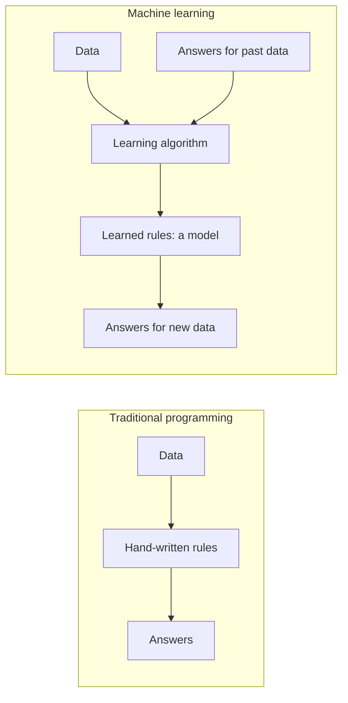
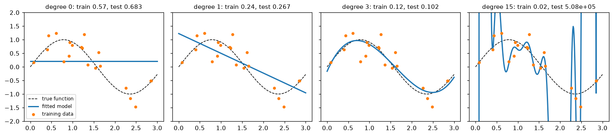

# What Is Machine Learning?

> **Level 3 · Chapter 1** · ⏱️ ~55 min read · Prerequisites: [Statistics](../01-math-foundations/05-statistics.md), [Information theory and optimization](../01-math-foundations/06-information-theory-and-optimization.md), [Feature engineering](../02-data-science-workflow/04-feature-engineering.md)

Machine learning is a way to build programs from examples instead of rules. This chapter gives you the vocabulary and the core idea underneath every model in this handbook: pick a family of functions, measure error with a loss, choose the function with the lowest error on data, and hope (with good reason) that it works on data it hasn't seen. It ends with the scikit-learn API you'll use for the rest of the Intermediate tier.

## Why it matters

Priya's team at a subscription company wanted to predict which customers would cancel next month. A senior engineer wrote rules first: "flag anyone who hasn't logged in for 30 days, or who filed two support tickets this month." The rules caught some churners, but every tweak broke something else, and nobody could say how good they were.

Priya trained a model on two years of customer history instead. On the training data it was spectacular: 99% accuracy. The team celebrated, shipped it, and a month later it had flagged almost nobody who actually left. Two mistakes compounded. The model had memorized individual customers rather than learning patterns that carry over to new ones, and only 4% of customers churned, so "nobody churns" was already 96% accurate.

Both mistakes come from not having a precise answer to the question this chapter answers: *what does it mean for a program to learn?* Learning isn't doing well on the examples you were given. It's doing well on the ones you weren't. Every idea in this level, from loss functions to cross-validation to regularization, exists to make that precise and to make it happen.

## Concepts

### Learning from data

A traditional program is a set of rules written by a person: input goes in, the rules run, output comes out. A machine learning program is different. A person writes a *learning algorithm*, gives it **examples** (pairs of inputs and the outputs you want), and the algorithm produces the rules.



Tom Mitchell's classic definition makes this precise: a program **learns** from experience $E$ with respect to a task $T$ and a performance measure $P$ if its performance at $T$, measured by $P$, improves with $E$. For churn prediction, $T$ is "predict whether a customer cancels next month," $E$ is two years of customer histories with known outcomes, and $P$ is something like the money saved by targeting retention offers well. The definition forces you to name all three. Teams that skip naming $P$ end up optimizing accuracy when they cared about money, as Priya's team did.

When is ML the right tool? Use it when the rules are too many, too subtle, or change too often to write by hand (spam, fraud, image recognition, search ranking), and when you have data that captures the pattern. Don't use it when a simple rule works, when there's no data, or when mistakes are unacceptable and can't be caught. A tax calculation should be code, not a model.

### The kinds of learning

ML problems are grouped by what the data tells the algorithm.

**Supervised learning** uses labeled examples: each input comes with the correct output. The algorithm learns a mapping from inputs to outputs. It splits into two kinds by the type of output:

- **Regression**: the output is a number. Predict a house price, tomorrow's demand, or a delivery time.
- **Classification**: the output is a category. Predict churn or no churn, fraud or legitimate, which of ten digits is in an image.

Most of the Intermediate tier is supervised learning, because most business ML is: you have historical outcomes and want to predict future ones.

**Unsupervised learning** uses inputs with no labels. The goal is to find structure: groups of similar customers (**clustering**), a compact description of high-dimensional data (**dimensionality reduction**), or unusual points (**anomaly detection**). There's no single right answer to check against, which makes evaluation harder. You'll meet these methods in [Level 4](../04-ml-algorithms/index.md).

**Self-supervised learning** creates labels from the data itself. Hide a word in a sentence and predict it from the rest; hide part of an image and reconstruct it; predict the next token of text. The "label" is just part of the input, so you get unlimited labeled data for free. This is how large language models are pretrained, and it's why they could be trained on most of the public internet without anyone labeling it. Technically it's supervised learning with automatically made labels; what makes it powerful is that the pretext task forces the model to learn useful general representations. You'll study it in [Level 8](../08-modern-deep-learning/index.md).

**Reinforcement learning** (RL) learns by acting. An **agent** takes **actions** in an **environment**, receives **rewards**, and learns a **policy** (a rule for choosing actions) that maximizes total reward over time. There are no labeled right answers, only delayed feedback: a chess move is good if you eventually win. RL powers game-playing systems and robot control, and a variant of it (learning from human feedback) is used to fine-tune chat models. The bandit algorithms from [Experimentation and A/B testing](../02-data-science-workflow/05-experimentation-and-ab-testing.md) are the simplest kind of RL.

Two in-between cases are worth naming. **Semi-supervised learning** uses a few labels and many unlabeled examples. **Weak supervision** uses noisy labels, such as rules of thumb or crowd votes, in place of carefully checked ones.

| Paradigm | Data | Goal | Example |
|---|---|---|---|
| Supervised (regression) | inputs + numeric labels | predict a number | delivery time in minutes |
| Supervised (classification) | inputs + category labels | predict a category | churn: yes or no |
| Unsupervised | inputs only | find structure | customer segments |
| Self-supervised | inputs only, labels made from them | learn representations | predict the masked word |
| Reinforcement | states, actions, rewards | learn a policy | which offer to show, over time |

### Features, labels, models, parameters, and hyperparameters

These words appear in every chapter from here on, so let's pin them down with the churn example.

- An **example** (or sample, instance, row) is one unit you make a prediction about: one customer.
- A **feature** is one measured input about an example: tenure in months, monthly charge, number of support tickets. Collect an example's $d$ features into a **feature vector** $\mathbf{x} \in \mathbb{R}^d$. Stack $n$ examples as rows and you get the **design matrix** $\mathbf{X} \in \mathbb{R}^{n \times d}$. You learned to build good features in [Feature engineering](../02-data-science-workflow/04-feature-engineering.md).
- The **label** (or target) $y$ is the thing you want to predict: whether the customer churned. The labels for all examples form the vector $\mathbf{y} \in \mathbb{R}^n$.
- A **model** is a function $f$ that maps a feature vector to a prediction $\hat{y} = f(\mathbf{x})$. "Model" also refers loosely to the family of functions, as in "a linear model."
- **Parameters** are the numbers inside the model that the learning algorithm sets from data. A linear model $f(\mathbf{x}) = \mathbf{w}^\top\mathbf{x} + b$ has parameters $\mathbf{w}$ (the **weights**, one per feature) and $b$ (the **bias** or intercept). We write all parameters together as $\theta$.
- **Hyperparameters** are settings you choose *before* learning that control how learning happens: the degree of a polynomial, the strength of regularization, the learning rate, the number of trees. The algorithm doesn't learn them from the training loss; you pick them, usually by trying several and comparing performance on held-out data.

The parameter/hyperparameter distinction matters for a practical reason. If you chose hyperparameters by looking at training error, you'd always pick the most flexible setting, because it fits the training data best. Hyperparameters must be tuned on data the parameters never saw. You'll see this in [Generalization and the bias-variance trade-off](04-generalization-bias-variance.md).

### Loss functions

To learn, the algorithm needs to measure how wrong a prediction is. A **loss function** $\ell(\hat{y}, y)$ assigns a non-negative number to a prediction $\hat{y}$ when the truth is $y$: zero for a perfect prediction, larger for worse ones. You met loss functions as objectives in [Information theory and optimization](../01-math-foundations/06-information-theory-and-optimization.md). The common ones:

| Loss | Formula | Used for | Behavior |
|---|---|---|---|
| Squared | $(\hat{y} - y)^2$ | regression | punishes big errors heavily; smooth |
| Absolute | $\lvert \hat{y} - y \rvert$ | regression | robust to outliers; kink at 0 |
| 0-1 | $\mathbb{1}[\hat{y} \neq y]$ | classification (evaluation) | counts mistakes; flat, so useless for gradients |
| Log-loss (cross-entropy) | $-y\log p - (1-y)\log(1-p)$ | classification with probabilities $p$ | punishes confident mistakes heavily |

Here $\mathbb{1}[\cdot]$ is the **indicator function**: 1 if the condition is true, 0 otherwise.

The choice of loss isn't cosmetic. It decides *what* the model predicts. Here's a clean way to see it. Suppose your model can only output a single constant $c$ for every example. Which $c$ minimizes the average squared loss on data $y_1, \dots, y_n$?

$$
\frac{d}{dc}\,\frac{1}{n}\sum_{i=1}^n (c - y_i)^2 = \frac{2}{n}\sum_{i=1}^n (c - y_i) = 2\left(c - \bar{y}\right) = 0 \quad\Longrightarrow\quad c = \bar{y}.
$$

Squared loss leads to the **mean**. Now absolute loss. Its derivative with respect to $c$ is $\frac{1}{n}\sum_i \operatorname{sign}(c - y_i)$, which is (number of $y_i$ below $c$ minus number above) divided by $n$. That's zero when half the points are on each side: absolute loss leads to the **median**. So a model trained with squared loss predicts the conditional mean of $y$ given $\mathbf{x}$, and a model trained with absolute loss predicts the conditional median. For skewed targets like order values, those can be very different numbers, and only you know which one the business needs.

```python
import numpy as np

rng = np.random.default_rng(0)
y = rng.lognormal(mean=3.0, sigma=1.0, size=1000)   # skewed, like order values

cs = np.linspace(0, 60, 6001)
sq = [np.mean((c - y) ** 2) for c in cs]
ab = [np.mean(np.abs(c - y)) for c in cs]
print(f"best c for squared loss:  {cs[np.argmin(sq)]:.2f}   mean   = {y.mean():.2f}")
print(f"best c for absolute loss: {cs[np.argmin(ab)]:.2f}   median = {np.median(y):.2f}")
```

```text
best c for squared loss:  30.63   mean   = 30.63
best c for absolute loss: 18.63   median = 18.64
```

The two "best constants" differ by more than 50%. Neither is wrong; they answer different questions.

### Empirical risk minimization

Now the central idea. Assume examples $(\mathbf{x}, y)$ come from some unknown probability distribution $P$: the process that generates customers and their outcomes. What you really want is a model with low expected loss on *new* draws from $P$. That expected loss is the **risk** (or true risk, generalization error):

$$
R(f) = \mathbb{E}_{(\mathbf{x}, y) \sim P}\left[\ell\big(f(\mathbf{x}), y\big)\right].
$$

You can't compute $R(f)$, because you don't know $P$. What you have is a **training set** of $n$ examples drawn from it, $\{(\mathbf{x}_i, y_i)\}_{i=1}^n$. The average loss on it is the **empirical risk**:

$$
\hat{R}_n(f) = \frac{1}{n}\sum_{i=1}^{n} \ell\big(f(\mathbf{x}_i), y_i\big).
$$

For any *fixed* $f$ chosen without looking at the training data, $\hat{R}_n(f)$ is an unbiased estimate of $R(f)$: it's a sample mean of i.i.d. losses, so the law of large numbers from [Probability](../01-math-foundations/04-probability.md) says it converges to $R(f)$ as $n$ grows. That suggests a strategy called **empirical risk minimization** (ERM): choose the model with the lowest training loss,

$$
\hat{f} = \arg\min_{f \in \mathcal{H}} \hat{R}_n(f),
$$

where $\mathcal{H}$ is the set of models you're willing to consider. Almost every algorithm in this handbook is ERM with a particular $\mathcal{H}$ and $\ell$, sometimes plus a penalty. Linear regression is ERM with linear functions and squared loss. Logistic regression is ERM with linear scores and log-loss. A neural network is ERM with a very large $\mathcal{H}$.

You've seen this before from the statistics side. In [Statistics](../01-math-foundations/05-statistics.md), maximum likelihood chose parameters to maximize the probability of the data. With the right loss, ERM and MLE are the same thing: minimizing average log-loss is maximizing the Bernoulli likelihood, and minimizing squared error is maximizing a Gaussian likelihood. You'll derive both in the next two chapters.

Here's ERM in its most naive form: search a grid of lines for the one with the lowest training MSE.

```python
# Data from a "true" process: y = 3 + 2x + noise
n = 50
x = rng.uniform(0, 5, size=n)
y = 3 + 2 * x + rng.normal(0, 1.0, size=n)

# Hypothesis space: lines y = w*x + b on a grid. Learning = search for the lowest training loss.
ws = np.linspace(-5, 5, 201)
bs = np.linspace(-5, 10, 301)
W, B = np.meshgrid(ws, bs)
pred = W[..., None] * x + B[..., None]              # shape (301, 201, 50)
mse = np.mean((pred - y) ** 2, axis=-1)
i, j = np.unravel_index(np.argmin(mse), mse.shape)
print(f"learned: w = {W[i, j]:.2f}, b = {B[i, j]:.2f}, training MSE = {mse[i, j]:.3f}")
```

```text
learned: w = 2.00, b = 3.00, training MSE = 1.531
```

The search lands on $w = 2.00$ and $b = 3.00$, the grid points nearest the true values, without anyone telling it the rule. (The exact best line for this noisy sample is slightly different; the grid, with steps of 0.05, is too coarse to see it.) The training MSE is about 1.5, close to the noise variance of 1 plus sampling luck: even the true rule can't predict the noise. Grid search is hopeless beyond two or three parameters (a grid with 100 values per parameter and 20 parameters has $10^{40}$ points), which is why the next chapters use calculus instead: a closed-form solution for linear regression and gradient descent for everything else.

### The hypothesis space

The set $\mathcal{H}$ of functions the learner may choose from is the **hypothesis space** (or model class). Choosing $\mathcal{H}$ is the most consequential decision you make, and it's made before you see any loss values.

- If $\mathcal{H}$ is too small, no function in it can capture the real pattern. Lines can't fit a curve. The model **underfits**: high error on training and new data alike.
- If $\mathcal{H}$ is too large, some function in it can fit the training data perfectly, *including its noise*. ERM will find it. The model **overfits**: low training error, high error on new data.

The flexibility of $\mathcal{H}$ is called **capacity**. Polynomials of degree 15 have more capacity than lines. A lookup table that memorizes every training example has unlimited capacity: it achieves zero training error on any data set and has learned nothing transferable.

Everything you assume about the problem when you pick $\mathcal{H}$ (and the loss, and any penalty) is called **inductive bias**. "The relationship is roughly linear," "nearby inputs have similar outputs," "the image class doesn't change if you shift the image a few pixels": each is an inductive bias, and each lets a model generalize from finite data, at the price of being wrong when the assumption is wrong.

### Generalization

A model **generalizes** if its performance on new data from the same distribution is close to its performance on the training data. The difference is the **generalization gap**:

$$
\text{gap}(\hat{f}) = R(\hat{f}) - \hat{R}_n(\hat{f}).
$$

Here's the subtle part, and it's the root cause of Priya's disaster. A moment ago, $\hat{R}_n(f)$ was an unbiased estimate of $R(f)$ for a fixed $f$. But $\hat{f}$ isn't fixed: it was *chosen* because it had the lowest training loss among everything in $\mathcal{H}$. Picking the minimum of many noisy estimates picks the luckiest one, so $\hat{R}_n(\hat{f})$ is biased downward, and the bias grows with the size of $\mathcal{H}$. It's the same selection effect as running many A/B tests and reporting the best one, from the multiple testing section of [Statistics](../01-math-foundations/05-statistics.md).

The fix is simple and non-negotiable: estimate $R(\hat{f})$ on data that played no part in choosing $\hat{f}$. A **test set** is a random sample held out before training and used once, at the end. Because $\hat{f}$ was chosen without it, the test loss is an unbiased estimate of the true risk again. The next code puts four hypothesis spaces side by side.

```python
import matplotlib.pyplot as plt

def true_f(x):
    return np.sin(2 * x)

rng = np.random.default_rng(1)
x_tr = np.sort(rng.uniform(0, 3, 20))
y_tr = true_f(x_tr) + rng.normal(0, 0.3, 20)
x_te = rng.uniform(0, 3, 1000)
y_te = true_f(x_te) + rng.normal(0, 0.3, 1000)

def fit_poly(x, y, degree):
    # Least squares on the features 1, x, x^2, ..., x^degree (next chapter derives this)
    return np.polynomial.Polynomial.fit(x, y, degree)

grid = np.linspace(0, 3, 300)
fig, axes = plt.subplots(1, 4, figsize=(14, 3.2), sharey=True)
for ax, deg in zip(axes, [0, 1, 3, 15]):
    p = fit_poly(x_tr, y_tr, deg)
    tr = np.mean((p(x_tr) - y_tr) ** 2)
    te = np.mean((p(x_te) - y_te) ** 2)
    print(f"degree {deg:>2}: train MSE = {tr:.3f}   test MSE = {te:.3f}")
    ax.plot(grid, true_f(grid), "k--", lw=1, label="true function")
    ax.plot(grid, p(grid), color="tab:blue", lw=2, label="fitted model")
    ax.scatter(x_tr, y_tr, s=15, color="tab:orange", zorder=3, label="training data")
    ax.set_ylim(-2, 2)
    ax.set_title(f"degree {deg}: train {tr:.2f}, test {te:.3g}", fontsize=10)
axes[0].legend(fontsize=8, loc="lower left")
plt.tight_layout()
plt.show()
```

```text
degree  0: train MSE = 0.568   test MSE = 0.683
degree  1: train MSE = 0.237   test MSE = 0.267
degree  3: train MSE = 0.119   test MSE = 0.102
degree 15: train MSE = 0.023   test MSE = 508244.548
```



*The same 20 training points, four hypothesis spaces. Degrees 0 and 1 underfit; degree 3 captures the shape; degree 15 chases the noise and swings wildly between points.*

Training error falls every time the hypothesis space grows, because each space contains the previous one. Test error falls, then explodes: the degree-15 curve swings to enormous values in the gap with no training points (between about 1.7 and 2.2) and at the edges, and test points land there. The degree-3 model's test MSE is close to the noise variance, $0.3^2 = 0.09$, which is the floor no model can beat. The degree-15 model has the lowest training error of all and is by far the worst model. That's generalization in one table: **training error measures fit; only held-out error measures learning**. Chapter 4 explains the shape of this curve with the bias-variance decomposition.

Why should generalization be possible at all? Because of the assumption hiding in the risk formula: training and future data come from the *same* distribution $P$, and examples are independent. Statistical learning theory turns this into guarantees. For a finite hypothesis space, for example, with probability at least $1 - \delta$, every $f \in \mathcal{H}$ satisfies $R(f) \le \hat{R}_n(f) + \sqrt{\frac{\ln\lvert\mathcal{H}\rvert + \ln(1/\delta)}{2n}}$ for a loss bounded in $[0, 1]$. The proof (Hoeffding's inequality plus a union bound over $\mathcal{H}$) is beyond this chapter, but the shape of the bound is the lesson: the gap shrinks with more data ($n$) and grows with a richer hypothesis space ($\lvert\mathcal{H}\rvert$). When the i.i.d. assumption breaks, as when customer behavior shifts after a price change, no bound helps. That's **distribution shift**, and you'll monitor for it in [ML in production](../05-applied-ml/05-ml-in-production.md).

### The no free lunch theorem

If bigger hypothesis spaces overfit and smaller ones underfit, is there a best learning algorithm overall? The **no free lunch theorem** (Wolpert, 1996) says no. Averaged over *all possible* target functions, every learning algorithm has the same expected error on examples outside the training set. A sophisticated algorithm and random guessing tie.

The intuition is easy to check by counting. Take inputs that are 3 binary features, so there are $2^3 = 8$ possible inputs. A target function assigns a label 0 or 1 to each, so there are $2^8 = 256$ possible functions. Suppose you've seen the labels of 6 inputs. Exactly $2^2 = 4$ functions agree with what you've seen, and on the 2 unseen inputs they cover every combination: 00, 01, 10, 11. Whatever your algorithm predicts for an unseen input, it's right for exactly half of the consistent functions. The training data alone says *nothing* about the unseen inputs.

```python
from itertools import product

inputs = list(product([0, 1], repeat=3))           # the 8 possible inputs
seen = inputs[:6]
target = {inp: (inp[0] ^ inp[1]) | inp[2] for inp in inputs}   # some "true" rule

consistent = []
for labels in product([0, 1], repeat=8):           # all 256 functions
    f = dict(zip(inputs, labels))
    if all(f[s] == target[s] for s in seen):
        consistent.append(f)
print("functions consistent with the training data:", len(consistent))
for unseen in inputs[6:]:
    share = np.mean([f[unseen] for f in consistent])
    print(f"input {unseen}: share of consistent functions that say 1 = {share:.2f}")
```

```text
functions consistent with the training data: 4
input (1, 1, 0): share of consistent functions that say 1 = 0.50
input (1, 1, 1): share of consistent functions that say 1 = 0.50
```

The theorem doesn't mean ML is futile. Real-world target functions aren't drawn uniformly from all possible functions: they're smooth, structured, and mostly simple. Learning works because inductive bias matches that structure. The practical lessons are:

- **There's no universally best model.** Boosted trees tend to win on tabular data and neural networks on images and text, because their inductive biases fit those domains, not because they're better in general.
- **Every model makes assumptions.** Know what yours are, and test them against data.
- **Always compare against simple baselines.** Predict the mean, predict the majority class, or use last week's value. A complex model that doesn't beat a baseline on held-out data hasn't learned anything useful.

### The scikit-learn API

**scikit-learn** is the standard Python library for classical ML. Its power comes from one consistent interface: once you know how to use one model, you know how to use all of them. The design rests on a few kinds of objects.

- An **estimator** is any object that learns from data with a `fit(X, y)` method (or `fit(X)` for unsupervised ones). `fit` returns the estimator itself, so you can chain calls.
- A **predictor** is an estimator with `predict(X)`. Classifiers usually also have `predict_proba(X)` (class probabilities) and `decision_function(X)` (raw scores). Every predictor has `score(X, y)`, which returns a default metric: accuracy for classifiers, $R^2$ for regressors.
- A **transformer** is an estimator with `transform(X)`, which returns a modified version of the data: scaling, encoding, imputing, or reducing dimensions. `fit_transform(X)` does both in one step.

Four conventions make it work:

1. **Hyperparameters go in the constructor**: `Ridge(alpha=1.0)`. The constructor stores them and does nothing else. `get_params()` and `set_params()` read and change them.
2. **Learned attributes end with an underscore**: `coef_`, `intercept_`, `classes_`, `mean_`. They exist only after `fit`. If you see a trailing underscore, it was estimated from data.
3. **Data is a 2D array** `X` of shape `(n_samples, n_features)`, plus a 1D `y` of shape `(n_samples,)`. A pandas DataFrame works too. A single feature must still be 2D: `x.reshape(-1, 1)`.
4. **Fit on training data only.** `fit` learns; `predict` and `transform` apply what was learned. Fitting anything (even a scaler) on test data leaks information.

The model-selection tools build on this interface:

- `train_test_split(X, y, test_size=0.2, random_state=0, stratify=y)` shuffles and splits the data into a training and a test set. `stratify=y` keeps the class proportions the same in both.
- `cross_val_score(estimator, X, y, cv=5, scoring=...)` splits the data into 5 folds, fits on 4 and scores on the 5th, five times, and returns the 5 scores. Chapter 4 explains why this is a better estimate than a single split.
- `Pipeline` chains transformers and a final estimator into one estimator, so preprocessing is fit inside each training fold. You'll use it from here on and study it properly in [ML pipelines](../05-applied-ml/01-ml-pipelines.md).

Let's see it all on a real data set: the breast cancer data bundled with scikit-learn, 569 tumors described by 30 measurements, labeled malignant or benign.

```python
from sklearn.datasets import load_breast_cancer
from sklearn.model_selection import train_test_split, cross_val_score
from sklearn.preprocessing import StandardScaler
from sklearn.linear_model import LogisticRegression
from sklearn.pipeline import make_pipeline

X, y = load_breast_cancer(return_X_y=True)
print("X:", X.shape, " y:", y.shape, " classes:", np.unique(y), " share of class 1:", round(y.mean(), 3))

X_tr, X_te, y_tr, y_te = train_test_split(X, y, test_size=0.25, random_state=0, stratify=y)

scaler = StandardScaler()               # a transformer; hyperparameters in the constructor
X_tr_s = scaler.fit_transform(X_tr)     # learn means and stds on TRAINING data only
X_te_s = scaler.transform(X_te)         # apply the training statistics to the test set
print("learned attribute mean_[:3]:", np.round(scaler.mean_[:3], 2))

clf = LogisticRegression(C=1.0, max_iter=1000)   # a predictor
clf.fit(X_tr_s, y_tr)
print("predictions:  ", clf.predict(X_te_s[:5]))
print("P(class 1):   ", np.round(clf.predict_proba(X_te_s[:5])[:, 1], 3))
print(f"test accuracy: {clf.score(X_te_s, y_te):.3f}")
```

```text
X: (569, 30)  y: (569,)  classes: [0 1]  share of class 1: 0.627
learned attribute mean_[:3]: [14.12 19.27 91.91]
predictions:   [1 0 0 1 0]
P(class 1):    [0.996 0.    0.    1.    0.003]
test accuracy: 0.958
```

Now the same model inside a pipeline, evaluated with 5-fold cross-validation on the training set. The pipeline refits the scaler inside each fold, so the held-out fold never influences the scaling. Compare it against the simplest possible baseline, which always predicts the majority class.

```python
from sklearn.dummy import DummyClassifier

pipe = make_pipeline(StandardScaler(), LogisticRegression(max_iter=1000))
scores = cross_val_score(pipe, X_tr, y_tr, cv=5, scoring="accuracy")
print("fold accuracies:", np.round(scores, 3))
print(f"mean = {scores.mean():.3f}, std = {scores.std():.3f}")

baseline = cross_val_score(DummyClassifier(strategy="most_frequent"), X_tr, y_tr, cv=5)
print(f"majority-class baseline: {baseline.mean():.3f}")
print("hyperparameters:", {k: v for k, v in pipe.get_params().items() if k == "logisticregression__C"})
```

```text
fold accuracies: [0.953 0.976 0.965 0.976 1.   ]
mean = 0.974, std = 0.015
majority-class baseline: 0.627
hyperparameters: {'logisticregression__C': 1.0}
```

The model beats the baseline by a wide margin, and the fold-to-fold spread tells you how much the estimate would move with a different split. Notice the parameter name `logisticregression__C`: a pipeline exposes its steps' hyperparameters as `<step>__<param>`, which is how tuning tools reach inside it.

## In practice

### Write your own estimator

The scikit-learn API is a contract, not magic. Any class that follows it works with `cross_val_score`, `Pipeline`, and every other tool. Writing one yourself is the best way to understand the contract. Here's a **nearest centroid classifier**: during `fit`, it computes the mean feature vector (the centroid) of each class; to predict, it assigns each example to the class with the closest centroid.

```python
from sklearn.base import BaseEstimator, ClassifierMixin
from sklearn.neighbors import NearestCentroid

class MyNearestCentroid(ClassifierMixin, BaseEstimator):
    def __init__(self, shrink=0.0):          # hyperparameters only; no work here
        self.shrink = shrink

    def fit(self, X, y):
        X, y = np.asarray(X, dtype=float), np.asarray(y)
        self.classes_ = np.unique(y)          # learned attributes end in "_"
        overall = X.mean(axis=0)
        cents = np.array([X[y == c].mean(axis=0) for c in self.classes_])
        self.centroids_ = (1 - self.shrink) * cents + self.shrink * overall
        return self                           # fit returns self

    def predict(self, X):
        X = np.asarray(X, dtype=float)
        dists = ((X[:, None, :] - self.centroids_[None, :, :]) ** 2).sum(axis=2)
        return self.classes_[np.argmin(dists, axis=1)]

mine = make_pipeline(StandardScaler(), MyNearestCentroid())
theirs = make_pipeline(StandardScaler(), NearestCentroid())
s_mine = cross_val_score(mine, X_tr, y_tr, cv=5)
s_theirs = cross_val_score(theirs, X_tr, y_tr, cv=5)
print("mine:  ", np.round(s_mine, 3))
print("sklearn:", np.round(s_theirs, 3))
print("predictions identical:", np.array_equal(mine.fit(X_tr, y_tr).predict(X_te),
                                               theirs.fit(X_tr, y_tr).predict(X_te)))
```

```text
mine:   [0.884 0.953 0.894 0.941 0.965]
sklearn: [0.884 0.953 0.894 0.941 0.965]
predictions identical: True
```

The from-scratch class drops straight into a pipeline and cross-validation, and matches scikit-learn's version exactly. `BaseEstimator` supplies `get_params`/`set_params` by reading the constructor's arguments, which is why the constructor must store them unchanged. `ClassifierMixin` supplies `score` (accuracy). Nearest centroid is about 93% accurate here, below logistic regression's 97%: a simpler hypothesis space with a stronger inductive bias (each class is one blob).

!!! warning "Common mistake: fitting preprocessing on all the data"
    Calling `StandardScaler().fit_transform(X)` on the full data set and *then* splitting means the test set's means and standard deviations shaped the training features. It's a small leak for a scaler, but the same pattern with target encoding, feature selection, or imputation from test-set statistics can inflate scores dramatically. Split first, or put every preprocessing step in a `Pipeline` so cross-validation refits it in each fold.

### Check the shapes

Most scikit-learn errors for beginners are shape errors. A single feature must be a column.

```python
x1 = rng.uniform(0, 5, 8)
try:
    StandardScaler().fit(x1)
except ValueError as e:
    print("ValueError:", str(e).splitlines()[0])
print(StandardScaler().fit(x1.reshape(-1, 1)).mean_)
```

```text
ValueError: Expected 2D array, got 1D array instead:
[2.32221636]
```

!!! warning "Common mistake: reporting training accuracy"
    `clf.score(X_train, y_train)` tells you how well the model fits data it has already seen. It's useful for diagnosing underfitting, and useless as an estimate of real-world performance. Always report a held-out score, and always next to a baseline.

## Exercises

### Exercise 1: Name the paradigm (easy)

For each task, say whether it's supervised regression, supervised classification, unsupervised, self-supervised, or reinforcement learning, and name the label if there is one.

1. Predict the number of bikes rented at a station tomorrow.
2. Group news articles into topics, with no topic labels available.
3. Train a model to predict the next frame of a video from the previous frames, as pretraining.
4. Decide, for each visitor, which of five banner ads to show, learning from clicks as you go.
5. Flag credit card transactions as fraudulent, using past chargebacks.

??? success "Solution"

    1. Supervised regression; the label is the rental count. (Counts are sometimes modeled with special losses, but the output is a number.)
    2. Unsupervised (clustering or topic modeling); no label.
    3. Self-supervised; the "label" is the next frame, taken from the video itself.
    4. Reinforcement learning, specifically a multi-armed bandit; the reward is a click.
    5. Supervised classification; the label is "chargeback or not." In practice the labels arrive weeks late and are noisy, which is common in fraud.

### Exercise 2: The best constant under absolute loss (easy)

Show by hand that for the data $\{1, 2, 3, 10\}$, every constant $c$ in the interval $[2, 3]$ minimizes the average absolute loss, while the squared loss is minimized only at the mean. Compute both minimum losses. Then explain why the absolute-loss solution is less affected by the 10.

??? success "Solution"

    For $c \in [2, 3]$: $\sum_i \lvert c - y_i\rvert = (c - 1) + (c - 2) + (3 - c) + (10 - c) = 10$, which doesn't depend on $c$, so the average is $2.5$. Moving $c$ below 2 or above 3 puts three points on one side and one on the other, and the sum's slope becomes $\pm 2$, so the loss grows. Any median of an even-sized sample works.

    The mean is $\bar{y} = 4$, and the minimum squared loss is $\frac{1}{4}(9 + 4 + 1 + 36) = 12.5$.

    The 10 pulls the mean from 2 to 4 because squared loss grows quadratically, so one big residual dominates. Absolute loss grows linearly, so the 10 counts as just "one point above," whatever its size.

    ```python
    y = np.array([1, 2, 3, 10])
    for c in [1.5, 2, 2.5, 3, 4]:
        print(c, np.mean(np.abs(c - y)), np.mean((c - y) ** 2))
    ```

    ```text
    1.5 2.75 18.75
    2 2.5 16.5
    2.5 2.5 14.75
    3 2.5 13.5
    4 3.0 12.5
    ```

    The absolute loss is flat at 2.5 across $[2, 3]$ and rises outside it, while the squared loss keeps falling until $c = 4$, the mean.

### Exercise 3: A baseline estimator (medium)

Write a `MajorityClassifier` that follows the scikit-learn API: it learns the most frequent class in `fit` and predicts it for every input. Add a `predict_proba` that returns the training class frequencies for every row. Check it with `cross_val_score` on the breast cancer training set and compare with `DummyClassifier(strategy="most_frequent")`.

??? success "Solution"

    ```python
    class MajorityClassifier(ClassifierMixin, BaseEstimator):
        def fit(self, X, y):
            y = np.asarray(y)
            self.classes_, counts = np.unique(y, return_counts=True)
            self.priors_ = counts / counts.sum()
            self.majority_ = self.classes_[np.argmax(counts)]
            return self

        def predict(self, X):
            return np.full(len(X), self.majority_)

        def predict_proba(self, X):
            return np.tile(self.priors_, (len(X), 1))

    mine = cross_val_score(MajorityClassifier(), X_tr, y_tr, cv=5)
    ref = cross_val_score(DummyClassifier(strategy="most_frequent"), X_tr, y_tr, cv=5)
    print(np.round(mine, 3), np.round(ref, 3))
    print(MajorityClassifier().fit(X_tr, y_tr).predict_proba(X_te[:2]).round(3))
    ```

    ```text
    [0.628 0.635 0.624 0.624 0.624] [0.628 0.635 0.624 0.624 0.624]
    [[0.373 0.627]
     [0.373 0.627]]
    ```

    The two agree fold by fold. A model that can't beat about 0.63 accuracy here has learned nothing. Note that the constructor takes no arguments, so there's no `__init__` to write: `BaseEstimator` handles an estimator with no hyperparameters.

### Exercise 4: Selection bias in training error (medium)

Generate 30 examples with 50 features of pure noise and a random binary label (so no model can truly beat 50%). Consider the 50 "one-feature rules" $\hat{y} = \mathbb{1}[x_j > \text{median}(x_j)]$ and their flipped versions. Pick the rule with the best training accuracy. Before you run anything, predict: will its training accuracy be near 50%? Then compute its accuracy on 10,000 fresh examples. Explain the result using the generalization gap.

??? success "Solution"

    ```python
    rng = np.random.default_rng(3)
    n, d = 30, 50
    Xn = rng.normal(size=(n, d)); yn = rng.integers(0, 2, n)
    Xf = rng.normal(size=(10_000, d)); yf = rng.integers(0, 2, 10_000)

    med = np.median(Xn, axis=0)
    acc = ((Xn > med) == yn[:, None]).mean(axis=0)     # accuracy of each rule
    acc_all = np.concatenate([acc, 1 - acc])            # flipped rules too
    best = np.argmax(acc_all)
    j, flip = best % d, best >= d
    pred_f = (Xf[:, j] > med[j]) ^ flip
    print(f"best training accuracy: {acc_all[best]:.3f}")
    print(f"same rule on fresh data: {np.mean(pred_f == yf):.3f}")
    ```

    ```text
    best training accuracy: 0.700
    same rule on fresh data: 0.496
    ```

    Each rule's training accuracy is an honest, noisy estimate of 50%. But you looked at 100 of them and kept the maximum, which is biased upward: with only 30 examples, the best of 100 coin-flip rules easily reaches 70%. On fresh data the chosen rule is a coin flip. This is the generalization gap created by selection, and it's why a held-out test set must play no part in choosing the model.

### Exercise 5: No free lunch by counting (medium)

With $k$ binary features there are $2^k$ possible inputs. Suppose a training set reveals the labels of $m$ distinct inputs. (a) How many Boolean functions are consistent with the training data? (b) Show that for any unseen input, exactly half of them assign it label 1. (c) What does this imply about an algorithm's average accuracy on unseen inputs, taken over all consistent functions? (d) Give one reason this argument doesn't make learning impossible in practice.

??? success "Solution"

    (a) The $m$ seen labels are fixed; each of the $2^k - m$ unseen inputs can be labeled 0 or 1 freely, so there are $2^{2^k - m}$ consistent functions.

    (b) Fix one unseen input $u$. The consistent functions pair up: each one with $f(u) = 1$ matches exactly one with $f(u) = 0$ that agrees everywhere else. So exactly half say 1.

    (c) Any deterministic prediction for $u$ is right for exactly half of the consistent functions. Averaged uniformly over them, the expected accuracy on unseen inputs is exactly 50%, for every algorithm.

    (d) Real target functions aren't uniformly random. They have structure (smoothness, simplicity, symmetries), and an algorithm whose inductive bias matches the structure does better than 50% on the functions that actually occur, at the cost of doing worse on bizarre ones that don't.

### Exercise 6: Leakage in a pipeline (hard)

Feature selection can leak. Generate 100 examples with 5,000 pure-noise features and a random binary label. (a) Select the 20 features most correlated with the label using *all* the data (use `SelectKBest(f_classif, k=20)`), then run 5-fold `cross_val_score` with logistic regression on those 20 features. (b) Do it again with selection inside a `Pipeline`. Before running it, predict which one will report near-chance accuracy. Explain the gap.

??? success "Solution"

    ```python
    from sklearn.feature_selection import SelectKBest, f_classif

    rng = np.random.default_rng(0)
    Xn = rng.normal(size=(100, 5000)); yn = rng.integers(0, 2, 100)

    X_sel = SelectKBest(f_classif, k=20).fit_transform(Xn, yn)      # leaks: sees every fold's labels
    leaky = cross_val_score(LogisticRegression(max_iter=1000), X_sel, yn, cv=5)

    pipe = make_pipeline(SelectKBest(f_classif, k=20), LogisticRegression(max_iter=1000))
    honest = cross_val_score(pipe, Xn, yn, cv=5)
    print(f"selection outside CV: {leaky.mean():.2f}")
    print(f"selection inside CV:  {honest.mean():.2f}")
    ```

    ```text
    selection outside CV: 0.85
    selection inside CV:  0.48
    ```

    The labels are random, so the true accuracy of any model is 50%. Selecting features with all the labels picks the 20 noise features that happen to correlate with *these* labels, including the labels of every future validation fold. Cross-validation then measures how well the model fits noise it was selected to fit. Inside the pipeline, selection is redone on each training fold only, and the score drops to chance, which is the truth.

## Check yourself

1. State Mitchell's definition of learning, and name $T$, $E$, and $P$ for a spam filter.

    ??? note "Answer"

        A program learns from experience $E$ with respect to task $T$ and performance measure $P$ if its performance at $T$, measured by $P$, improves with $E$. For spam: $T$ is classifying emails as spam or not, $E$ is a set of emails labeled by users, and $P$ could be the share of spam caught at a fixed rate of good mail wrongly blocked.

2. What's the difference between a parameter and a hyperparameter? Give an example of each for polynomial regression.

    ??? note "Answer"

        Parameters are learned from the training data by the algorithm (the polynomial's coefficients). Hyperparameters are chosen before training and control the learning (the polynomial's degree). Hyperparameters must be chosen using held-out data, because training error always favors the most flexible setting.

3. Which constant prediction minimizes average squared loss, and which minimizes average absolute loss? Why does that matter for a skewed target?

    ??? note "Answer"

        The mean and the median, respectively. More generally, squared loss makes a model predict the conditional mean and absolute loss the conditional median. For a skewed target, like order values, these can differ a lot, so the loss choice decides what the model estimates.

4. Define risk and empirical risk. Why is the training loss of the trained model an optimistic estimate of its risk?

    ??? note "Answer"

        Risk is the expected loss on a new example drawn from the data distribution; empirical risk is the average loss on the training set. For a fixed model, the empirical risk is unbiased, but the trained model was selected because it has the lowest empirical risk in the hypothesis space. Choosing the minimum of many noisy estimates favors models that got lucky on this sample, so the training loss underestimates the risk.

5. What is a hypothesis space, and what happens when it's too small or too large?

    ??? note "Answer"

        The set of functions the learning algorithm can choose from. Too small, and no function in it fits the real pattern (underfitting: high training and test error). Too large, and some function fits the training noise, which ERM finds (overfitting: low training error, high test error).

6. What does the no free lunch theorem say, and what's the practical lesson?

    ??? note "Answer"

        Averaged over all possible target functions, all learning algorithms have the same expected error on unseen inputs. No algorithm is best everywhere; an algorithm does well when its inductive bias fits the problem. Practically: try models suited to your data type, and always compare against simple baselines on held-out data.

7. In scikit-learn, what's the difference between `fit`, `transform`, `fit_transform`, and `predict`? What does a trailing underscore on an attribute mean?

    ??? note "Answer"

        `fit` learns from data and returns the estimator. `transform` applies a fitted transformer to data. `fit_transform` fits and transforms the same data (use it on training data only). `predict` applies a fitted predictor. A trailing underscore (`coef_`, `mean_`) marks an attribute learned during `fit`.

8. Why does `cross_val_score` on a `Pipeline` give a more trustworthy score than scaling first and then cross-validating?

    ??? note "Answer"

        The pipeline refits every preprocessing step on each training fold only, so the validation fold never influences the preprocessing. Scaling first lets every validation fold's statistics leak into training, and for steps like feature selection the leak can be dramatic.

## Key takeaways

- Machine learning produces programs from examples. Name the task, the experience, and the performance measure before you start.
- Supervised learning predicts labels (regression for numbers, classification for categories); unsupervised finds structure; self-supervised makes labels from the data; reinforcement learning learns from rewards.
- Most algorithms are empirical risk minimization: choose the function in a hypothesis space with the lowest average training loss. The loss decides what's predicted (mean for squared loss, median for absolute loss).
- Training error measures fit, not learning. The chosen model's training error is optimistically biased, so evaluate on data that played no part in choosing it.
- Capacity is a trade-off: too little underfits, too much overfits. No free lunch says there's no universally best model, only inductive biases that fit a problem.
- scikit-learn's estimator API (`fit`/`predict`/`transform`, hyperparameters in the constructor, learned attributes with `_`) lets every model plug into `train_test_split`, `cross_val_score`, and `Pipeline`.

## Further reading

- *An Introduction to Statistical Learning* by James, Witten, Hastie, Tibshirani, and Taylor, chapter 2 (free online, with a Python edition).
- *Machine Learning* by Tom Mitchell (1997), chapter 1, for the definition of learning and the role of inductive bias.
- "The Lack of A Priori Distinctions Between Learning Algorithms" by David Wolpert (*Neural Computation*, 1996), the no free lunch paper.
- *Understanding Machine Learning: From Theory to Algorithms* by Shalev-Shwartz and Ben-David, chapters 2–5, for ERM, PAC learning, and no free lunch done rigorously.
- The scikit-learn user guide, especially "Developing scikit-learn estimators" and "Cross-validation: evaluating estimator performance."

## Next

Build your first real model, derive its solution, and implement it from scratch: [Linear regression](02-linear-regression.md).
