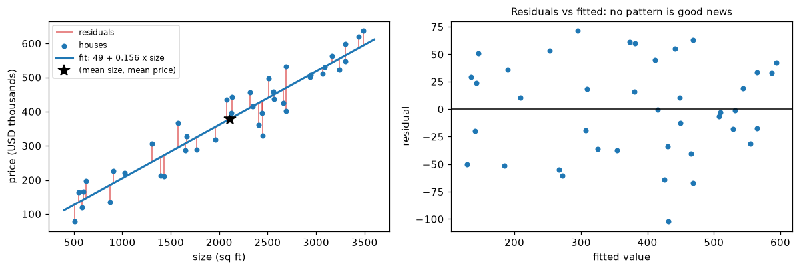
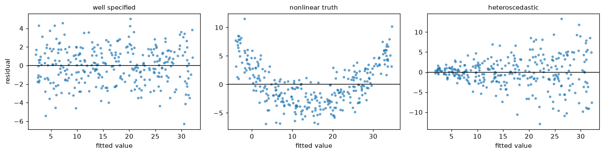

# Linear Regression

> **Level 3 · Chapter 2** · ⏱️ ~65 min read · Prerequisites: [What is machine learning?](01-what-is-machine-learning.md), [Linear algebra](../01-math-foundations/01-linear-algebra.md), [Calculus and gradients](../01-math-foundations/03-calculus-and-gradients.md), [Statistics](../01-math-foundations/05-statistics.md)

Linear regression predicts a number as a weighted sum of features. It's the simplest real model in ML, and it's worth knowing completely: you'll derive its solution two ways, implement it from scratch with the normal equation and with gradient descent, check its assumptions, extend it to curves with polynomial features, and learn to read its coefficients without fooling yourself.

## Why it matters

Sam built a model to estimate house prices for a property website. It was a linear regression on size, number of bedrooms, and age, and it fit well. Then Sam looked at the coefficients and saw something surprising: the bedrooms coefficient was *negative*. Each extra bedroom lowered the predicted price by about USD 15,000.

The marketing team ran with it. A blog post advised homeowners not to convert a study into a bedroom before selling, because "our data shows extra bedrooms reduce value." An economist friend of Sam's read it and winced. The coefficient wasn't saying that bedrooms reduce value. It said that *among houses of the same size*, more bedrooms means smaller rooms, and buyers pay less for cramped houses. Converting a study adds a bedroom without changing the size, so the coefficient was at least relevant there; but the blog post had also told readers that bigger houses with more bedrooms were worth less, which the data didn't say at all.

Linear regression is easy to fit and easy to misread. This chapter makes sure you can do the first and avoid the second: where the coefficients come from, what each one means, and which assumptions have to hold before you trust them.

## Concepts

### The model

A **linear regression** model predicts a numeric target $y$ from $d$ features $\mathbf{x} = (x_1, \dots, x_d)$ as a weighted sum plus a constant:

$$
\hat{y} = w_1 x_1 + w_2 x_2 + \dots + w_d x_d + b = \mathbf{w}^\top\mathbf{x} + b.
$$

The **weights** $\mathbf{w} \in \mathbb{R}^d$ say how much the prediction changes per unit of each feature; the **intercept** (or bias) $b$ is the prediction when every feature is zero. With one feature, the model is a line; with two, a plane; with $d$, a hyperplane in $d + 1$ dimensions.

"Linear" means linear in the **parameters**, not necessarily in the raw inputs. You can feed it $x^2$, $\log x$, or $x_1 x_2$ as features, and it's still linear regression, because the prediction is still a weighted sum. That's what makes polynomial regression possible later in this chapter.

A trick simplifies everything that follows. Add a constant feature $x_0 = 1$ to every example. Then $b$ becomes just another weight, $w_0$, and the model is $\hat{y} = \mathbf{w}^\top\mathbf{x}$ with $\mathbf{w}, \mathbf{x} \in \mathbb{R}^{d+1}$. Stacking all $n$ examples as rows of the **design matrix** $\mathbf{X} \in \mathbb{R}^{n \times (d+1)}$, whose first column is all ones, gives every prediction at once:

$$
\hat{\mathbf{y}} = \mathbf{X}\mathbf{w}.
$$

In this chapter, when $\mathbf{X}$ includes the column of ones, we say so; otherwise $b$ is written separately.

### Least squares

Which weights are best? Following [empirical risk minimization](01-what-is-machine-learning.md#empirical-risk-minimization), pick a loss and minimize its average over the training data. Linear regression uses squared error. The **residual** for example $i$ is $r_i = y_i - \hat{y}_i$, the vertical distance from the point to the fitted line. **Least squares** chooses $\mathbf{w}$ to minimize the **mean squared error** (MSE):

$$
\mathcal{L}(\mathbf{w}) = \frac{1}{n}\sum_{i=1}^{n}\left(y_i - \mathbf{w}^\top\mathbf{x}_i\right)^2 = \frac{1}{n}\lVert \mathbf{y} - \mathbf{X}\mathbf{w} \rVert^2.
$$

Minimizing the sum (the **residual sum of squares**, RSS) instead of the mean gives the same $\mathbf{w}$; the $\frac{1}{n}$ only rescales the loss.

Why squares, rather than absolute values or fourth powers? Three reasons, in increasing depth:

1. **Convenience.** Squares are smooth, so the loss has a gradient everywhere and a closed-form minimum. You'll derive it below.
2. **The conditional mean.** As you saw in [Chapter 1](01-what-is-machine-learning.md#loss-functions), squared loss makes a model estimate the mean of $y$. Least squares estimates $\mathbb{E}[y \mid \mathbf{x}]$, which is usually what you want for prices and demand.
3. **Maximum likelihood.** If the data come from $y = \mathbf{w}^\top\mathbf{x} + \varepsilon$ with Gaussian noise $\varepsilon \sim \mathcal{N}(0, \sigma^2)$, least squares *is* the maximum likelihood estimate. Here's the derivation, building on [maximum likelihood estimation](../01-math-foundations/05-statistics.md#maximum-likelihood-estimation). Each $y_i$ has density $\frac{1}{\sqrt{2\pi\sigma^2}}\exp\left(-\frac{(y_i - \mathbf{w}^\top\mathbf{x}_i)^2}{2\sigma^2}\right)$. With independent examples, the log-likelihood is the sum of logs:

    $$
    \log L(\mathbf{w}, \sigma^2) = -\frac{n}{2}\log(2\pi\sigma^2) - \frac{1}{2\sigma^2}\sum_{i=1}^{n}\left(y_i - \mathbf{w}^\top\mathbf{x}_i\right)^2.
    $$

    The first term doesn't involve $\mathbf{w}$, and the second is $-\frac{1}{2\sigma^2}\,\text{RSS}(\mathbf{w})$. Maximizing the log-likelihood over $\mathbf{w}$ is exactly minimizing the RSS. Setting the derivative with respect to $\sigma^2$ to zero gives $\hat{\sigma}^2_{\text{MLE}} = \text{RSS}/n$, which is biased low; the unbiased version divides by $n - (d + 1)$, the number of examples minus the number of fitted weights.

The squared loss also has a weakness: an outlier with a residual of 10 contributes 100 to the loss, so a few wild points can drag the whole fit. Robust alternatives (absolute loss, Huber loss) exist for that case.

### Simple linear regression by hand

Start with one feature: $\hat{y} = wx + b$. The loss is

$$
\mathcal{L}(w, b) = \frac{1}{n}\sum_{i=1}^{n}(y_i - w x_i - b)^2.
$$

It's a bowl-shaped (convex) function of $(w, b)$, so the minimum is where both partial derivatives are zero. Using the chain rule from [Calculus and gradients](../01-math-foundations/03-calculus-and-gradients.md):

$$
\frac{\partial \mathcal{L}}{\partial b} = -\frac{2}{n}\sum_i (y_i - w x_i - b) = 0 \quad\Longrightarrow\quad b = \bar{y} - w\bar{x},
$$

where $\bar{x}$ and $\bar{y}$ are the sample means. So the fitted line always passes through the point of means $(\bar{x}, \bar{y})$. Substitute this $b$ into the other condition:

$$
\frac{\partial \mathcal{L}}{\partial w} = -\frac{2}{n}\sum_i x_i\,(y_i - w x_i - b) = 0 \quad\Longrightarrow\quad \sum_i x_i\big((y_i - \bar{y}) - w(x_i - \bar{x})\big) = 0.
$$

Because $\sum_i (y_i - \bar{y}) = 0$ and $\sum_i (x_i - \bar{x}) = 0$, you can replace the leading $x_i$ with $x_i - \bar{x}$ without changing the sum. Solving for $w$:

$$
w = \frac{\sum_i (x_i - \bar{x})(y_i - \bar{y})}{\sum_i (x_i - \bar{x})^2} = \frac{\operatorname{cov}(x, y)}{\operatorname{var}(x)} = r_{xy}\,\frac{s_y}{s_x}.
$$

The slope is the covariance over the variance of $x$, or equivalently the Pearson correlation $r_{xy}$ (from [Exploratory data analysis](../02-data-science-workflow/03-exploratory-data-analysis.md)) times the ratio of standard deviations $s_y / s_x$. If $x$ and $y$ are standardized, the slope *is* the correlation.

```python
import numpy as np
import matplotlib.pyplot as plt

rng = np.random.default_rng(0)
n = 40
size = rng.uniform(500, 3500, n)                         # square feet
price = 50 + 0.15 * size + rng.normal(0, 40, n)          # USD thousands

w = np.sum((size - size.mean()) * (price - price.mean())) / np.sum((size - size.mean()) ** 2)
b = price.mean() - w * size.mean()
print(f"by hand:  w = {w:.4f}, b = {b:.2f}")
print("np.polyfit:", np.round(np.polyfit(size, price, 1), 4))

fitted = w * size + b
fig, axes = plt.subplots(1, 2, figsize=(11, 3.8))
ax = axes[0]
ax.vlines(size, fitted, price, color="tab:red", lw=1, alpha=0.7, label="residuals")
ax.scatter(size, price, s=18, zorder=3, label="houses")
grid = np.array([400, 3600])
ax.plot(grid, w * grid + b, color="tab:blue", lw=2, label=f"fit: {b:.0f} + {w:.3f} x size")
ax.plot(size.mean(), price.mean(), "k*", ms=12, label="(mean size, mean price)")
ax.set_xlabel("size (sq ft)"); ax.set_ylabel("price (USD thousands)"); ax.legend(fontsize=8)
axes[1].scatter(fitted, price - fitted, s=18)
axes[1].axhline(0, color="k", lw=1)
axes[1].set_xlabel("fitted value"); axes[1].set_ylabel("residual")
axes[1].set_title("Residuals vs fitted: no pattern is good news", fontsize=10)
plt.tight_layout()
plt.show()
```

```text
by hand:  w = 0.1562, b = 48.92
np.polyfit: [ 0.1562 48.9178]
```



*Least squares minimizes the sum of the squared red segments. The line passes through the point of means. On the right, residuals scatter evenly around zero with no trend, which is what a well-specified model looks like.*

The estimates are close to the true slope of 0.15 (USD 150 per square foot) and intercept of 50 used to generate the data.

### The normal equation

With many features, use matrices. Let $\mathbf{X}$ include the column of ones. Expand the loss as in [Calculus and gradients](../01-math-foundations/03-calculus-and-gradients.md#gradients-of-vector-expressions):

$$
\mathcal{L}(\mathbf{w}) = \frac{1}{n}(\mathbf{y} - \mathbf{X}\mathbf{w})^\top(\mathbf{y} - \mathbf{X}\mathbf{w}) = \frac{1}{n}\left(\mathbf{y}^\top\mathbf{y} - 2\,\mathbf{w}^\top\mathbf{X}^\top\mathbf{y} + \mathbf{w}^\top\mathbf{X}^\top\mathbf{X}\mathbf{w}\right).
$$

(The two cross terms $\mathbf{y}^\top\mathbf{X}\mathbf{w}$ and $\mathbf{w}^\top\mathbf{X}^\top\mathbf{y}$ are the same scalar, so they combine.) Use the identities $\nabla_{\mathbf{w}}(\mathbf{a}^\top\mathbf{w}) = \mathbf{a}$ and $\nabla_{\mathbf{w}}(\mathbf{w}^\top\mathbf{A}\mathbf{w}) = 2\mathbf{A}\mathbf{w}$ for symmetric $\mathbf{A}$:

$$
\nabla_{\mathbf{w}}\mathcal{L} = \frac{1}{n}\left(-2\mathbf{X}^\top\mathbf{y} + 2\mathbf{X}^\top\mathbf{X}\mathbf{w}\right) = \frac{2}{n}\mathbf{X}^\top(\mathbf{X}\mathbf{w} - \mathbf{y}).
$$

This is the **MSE gradient**, and you'll use it again for gradient descent. Read it as: take the residuals (prediction minus truth), and for each feature, average residual × feature value. A feature whose values line up with positive residuals gets its weight pushed down.

Setting the gradient to zero gives the **normal equation**:

$$
\mathbf{X}^\top\mathbf{X}\,\mathbf{w} = \mathbf{X}^\top\mathbf{y} \qquad\Longrightarrow\qquad \hat{\mathbf{w}} = (\mathbf{X}^\top\mathbf{X})^{-1}\mathbf{X}^\top\mathbf{y}.
$$

Is this point a minimum? The Hessian (the matrix of second derivatives) is $\frac{2}{n}\mathbf{X}^\top\mathbf{X}$, and for any vector $\mathbf{v}$, $\mathbf{v}^\top\mathbf{X}^\top\mathbf{X}\mathbf{v} = \lVert\mathbf{X}\mathbf{v}\rVert^2 \geq 0$. So the Hessian is positive semi-definite, the loss is **convex**, and any point where the gradient vanishes is a global minimum. If the columns of $\mathbf{X}$ are linearly independent (**full column rank**), then $\mathbf{X}\mathbf{v} \neq \mathbf{0}$ for every $\mathbf{v} \neq \mathbf{0}$, the Hessian is positive definite, $\mathbf{X}^\top\mathbf{X}$ is invertible, and the minimum is unique.

**The geometric view.** You met this in [Linear algebra](../01-math-foundations/01-linear-algebra.md) as a projection. The predictions $\mathbf{X}\mathbf{w}$ can be any vector in the **column space** of $\mathbf{X}$, the set of all weighted sums of its columns. Least squares picks the point in that space closest to $\mathbf{y}$, which is the orthogonal projection of $\mathbf{y}$ onto it. At the projection, the residual vector $\mathbf{r} = \mathbf{y} - \mathbf{X}\hat{\mathbf{w}}$ is perpendicular to every column:

$$
\mathbf{X}^\top\mathbf{r} = \mathbf{0} \quad\Longleftrightarrow\quad \mathbf{X}^\top(\mathbf{y} - \mathbf{X}\hat{\mathbf{w}}) = \mathbf{0},
$$

which is the normal equation again ("normal" means perpendicular). Two useful facts fall out. Because the column of ones is one of the columns, $\mathbf{1}^\top\mathbf{r} = \sum_i r_i = 0$: with an intercept, the residuals always sum to zero. And the residuals are uncorrelated with every feature in the training set, by construction, so a residual-vs-feature plot can't show a linear trend; it can only show curvature or changing spread.

**How to compute it.** Never form the inverse explicitly. `np.linalg.inv(X.T @ X) @ X.T @ y` is slower and less accurate than the alternatives, because forming $\mathbf{X}^\top\mathbf{X}$ squares the **condition number** (from [Matrix decompositions](../01-math-foundations/02-matrix-decompositions.md)), so rounding errors get amplified. Use `np.linalg.solve(X.T @ X, X.T @ y)` if $\mathbf{X}$ is well conditioned, or better, `np.linalg.lstsq(X, y)`, which works on $\mathbf{X}$ directly using the SVD. When $\mathbf{X}$ doesn't have full column rank (a duplicated feature, or a one-hot encoding that includes every category alongside an intercept), there are infinitely many solutions; `lstsq` returns the one with the smallest norm, $\hat{\mathbf{w}} = \mathbf{X}^{+}\mathbf{y}$, where $\mathbf{X}^{+}$ is the **pseudo-inverse**.

The cost is about $O(nd^2)$ to form $\mathbf{X}^\top\mathbf{X}$ (or run the SVD) plus $O(d^3)$ to solve. That's instant for thousands of features, slow for hundreds of thousands, and impossible when the data doesn't fit in memory. That's where gradient descent comes in.

Let's fit Sam's house price model. The data generator makes bedrooms correlated with size, which matters later.

```python
rng = np.random.default_rng(42)
n = 500
size = rng.uniform(600, 3500, n)
bedrooms = np.clip(np.round(size / 650 + rng.normal(0, 0.7, n)), 1, 6)
age = rng.uniform(0, 60, n)
price = 40 + 0.20 * size - 15 * bedrooms - 1.0 * age + rng.normal(0, 35, n)

X = np.column_stack([np.ones(n), size, bedrooms, age])   # first column: intercept
w_solve = np.linalg.solve(X.T @ X, X.T @ price)
w_lstsq, *_ = np.linalg.lstsq(X, price, rcond=None)
names = ["intercept", "size", "bedrooms", "age"]
for nm, a, c in zip(names, w_solve, w_lstsq):
    print(f"{nm:>9}: solve {a:9.4f}   lstsq {c:9.4f}")

r = price - X @ w_lstsq
print("sum of residuals:", np.round(r.sum(), 8))
print("X^T r:", np.round(X.T @ r, 6))
```

```text
intercept: solve   32.9593   lstsq   32.9593
     size: solve    0.2012   lstsq    0.2012
 bedrooms: solve  -15.7769   lstsq  -15.7769
      age: solve   -0.9535   lstsq   -0.9535
sum of residuals: -0.0
X^T r: [-0.e+00 -2.e-06 -0.e+00 -0.e+00]
```

Both methods agree, and the residuals are orthogonal to every column, as the geometry promised. The bedrooms coefficient is negative, just as in Sam's story, and close to the true $-15$ used to generate the data.

### Gradient descent

Instead of solving the normal equation, you can walk downhill. **Gradient descent** starts from some $\mathbf{w}$ (often zeros) and repeatedly steps against the gradient:

$$
\mathbf{w} \leftarrow \mathbf{w} - \eta\,\nabla_{\mathbf{w}}\mathcal{L} = \mathbf{w} - \eta\,\frac{2}{n}\mathbf{X}^\top(\mathbf{X}\mathbf{w} - \mathbf{y}),
$$

where the **learning rate** $\eta > 0$ sets the step size. You met the algorithm in [Information theory and optimization](../01-math-foundations/06-information-theory-and-optimization.md#gradient-descent). Each step costs $O(nd)$, there's no $d \times d$ matrix to form or factor, and the same update works for losses that have no closed form, like logistic regression in the next chapter.

Gradient descent is sensitive to the scale of the features. Here, size is in the thousands and bedrooms in single digits, so the loss surface is a long, thin valley: a learning rate small enough to be stable along the size direction makes progress along the others painfully slow. The fix is to **standardize** the features (subtract the mean, divide by the standard deviation) before running gradient descent. [Gradient descent in depth](07-gradient-descent-in-depth.md) explains exactly why, using the eigenvalues of the Hessian. Standardizing changes the weights' units, so convert them back afterward if you want them in original units: a weight $w_j^{s}$ on the standardized feature corresponds to $w_j = w_j^{s}/s_j$ on the original, and the intercept absorbs the means.

```python
def fit_gd(X, y, lr=0.1, n_iter=2000):
    """Batch gradient descent on MSE. X must include a column of ones."""
    w = np.zeros(X.shape[1])
    n = len(y)
    for _ in range(n_iter):
        grad = 2 / n * X.T @ (X @ w - y)
        w -= lr * grad
    return w

feats = np.column_stack([size, bedrooms, age])
mu, sd = feats.mean(axis=0), feats.std(axis=0)
Xs = np.column_stack([np.ones(n), (feats - mu) / sd])

w_s = fit_gd(Xs, price)
w_orig = w_s[1:] / sd                          # back to original units
b_orig = w_s[0] - np.sum(w_s[1:] * mu / sd)
print("GD, original units:", np.round(np.r_[b_orig, w_orig], 4))
print("normal equation:   ", np.round(w_lstsq, 4))
print("max abs difference:", np.abs(np.r_[b_orig, w_orig] - w_lstsq).max())
```

```text
GD, original units: [ 32.9593   0.2012 -15.7769  -0.9535]
normal equation:    [ 32.9593   0.2012 -15.7769  -0.9535]
max abs difference: 2.5579538487363607e-13
```

Gradient descent on standardized features reaches the normal-equation answer to within about $10^{-12}$ in 2,000 cheap steps. Try `fit_gd` on the unstandardized `X` and it either diverges (learning rate too large for the size feature) or crawls (learning rate small enough to be stable). You'll explore this in the exercises of Chapter 7.

### Assumptions and diagnostics

Least squares will happily fit a line to anything. Whether the result means something depends on assumptions. They split into two groups: those needed for good *predictions*, and the stronger ones needed for trustworthy *inference* (standard errors, confidence intervals, p-values on coefficients). With $y = \mathbf{w}^\top\mathbf{x} + \varepsilon$:

1. **Linearity.** The mean of $y$ really is a linear function of the features: $\mathbb{E}[y \mid \mathbf{x}] = \mathbf{w}^\top\mathbf{x}$. If the truth is curved, the model is biased everywhere. *Check:* plot residuals against fitted values and against each feature. A curve or U-shape means a missing nonlinearity. *Fix:* transform features (log, polynomial, splines) or use a nonlinear model.
2. **Exogeneity** (no omitted confounders). The noise has mean zero given the features: $\mathbb{E}[\varepsilon \mid \mathbf{x}] = 0$. If an omitted variable affects $y$ and correlates with an included feature, that feature's coefficient absorbs part of its effect (**omitted variable bias**). Predictions can still be fine; coefficients can be badly wrong. *Check:* domain knowledge, the causal reasoning from [Experimentation and A/B testing](../02-data-science-workflow/05-experimentation-and-ab-testing.md); no residual plot detects this one.
3. **Independence.** Errors are independent across examples. Repeated measures of the same customer, or time series where today's error predicts tomorrow's, violate it. Coefficients stay unbiased, but standard errors are too small and confidence intervals too narrow. *Check:* residuals against time or group.
4. **Homoscedasticity.** The noise has constant variance $\sigma^2$. In practice, the errors on expensive houses are often larger than on cheap ones (**heteroscedasticity**). Again, coefficients stay unbiased, but standard errors are wrong. *Check:* a funnel shape in residuals vs fitted. *Fix:* model $\log y$, use weighted least squares, or use robust ("sandwich") standard errors.
5. **Normality of errors.** Needed only for exact small-sample inference; with large $n$, the central limit theorem covers you. It is *not* needed for least squares to be a good predictor. *Check:* a Q-Q plot of residuals.
6. **No perfect multicollinearity.** No feature is an exact linear combination of others, so $\mathbf{X}^\top\mathbf{X}$ is invertible. *Near*-collinearity (size and bedrooms) doesn't break the fit, but it inflates the coefficients' variance: small changes in data swing them around, even though predictions stay stable. *Check:* the **variance inflation factor** $\text{VIF}_j = 1/(1 - R_j^2)$, where $R_j^2$ is how well feature $j$ is predicted by the others; values above about 5–10 signal trouble (a rule of thumb).

Under assumptions 1–4 (plus no perfect multicollinearity), the **Gauss–Markov theorem** says least squares has the smallest variance among all linear unbiased estimators. That's the classical justification for least squares. As you'll see in [Regularization](05-regularization.md), giving up unbiasedness can buy a much lower variance, which is often a good deal.

The residual plot is the most useful single diagnostic. Here's what the common failures look like.

```python
rng = np.random.default_rng(1)
xd = rng.uniform(0, 10, 300)
cases = {
    "well specified": 2 + 3 * xd + rng.normal(0, 2, 300),
    "nonlinear truth": 2 + 0.4 * xd ** 2 + rng.normal(0, 2, 300),
    "heteroscedastic": 2 + 3 * xd + rng.normal(0, 0.5 + 0.6 * xd, 300),
}
fig, axes = plt.subplots(1, 3, figsize=(13, 3.4))
for ax, (title, yd) in zip(axes, cases.items()):
    Xd = np.column_stack([np.ones_like(xd), xd])
    wd, *_ = np.linalg.lstsq(Xd, yd, rcond=None)
    fit = Xd @ wd
    ax.scatter(fit, yd - fit, s=8, alpha=0.6)
    ax.axhline(0, color="k", lw=1)
    ax.set_title(title, fontsize=10); ax.set_xlabel("fitted value")
axes[0].set_ylabel("residual")
plt.tight_layout()
plt.show()
```



*Left: a healthy residual plot. Middle: a U-shape means the model misses curvature. Right: a funnel means the noise grows with the prediction, so standard errors from ordinary least squares are wrong.*

### Polynomial features

The middle panel shows a straight line can't fit a curve. But linear regression is linear in the *parameters*, so you can add powers of a feature as new features:

$$
\hat{y} = w_0 + w_1 x + w_2 x^2 + \dots + w_p x^p.
$$

This is **polynomial regression**, and it's still least squares: the design matrix just has columns $1, x, x^2, \dots, x^p$. With several features, `PolynomialFeatures(degree=2)` also adds **interaction** terms like $x_1 x_2$, which let the effect of one feature depend on another (a bigger garden matters more in the suburbs than downtown).

The degree $p$ is a hyperparameter that controls capacity. As you saw in [Chapter 1](01-what-is-machine-learning.md#generalization), too low underfits and too high overfits, so choose it by cross-validation, never by training error. Two practical points:

- **Scale first.** For $x$ around 1,000, $x^5$ is around $10^{15}$, and the columns of the design matrix become nearly collinear and wildly different in scale. Standardize $x$ before expanding it.
- **The feature count explodes.** With $d$ features and degree $p$, there are $\binom{d + p}{p}$ terms: 100 features at degree 3 gives 176,851. Polynomial expansion is for a handful of features, or with [regularization](05-regularization.md).

```python
from sklearn.pipeline import make_pipeline
from sklearn.preprocessing import PolynomialFeatures, StandardScaler
from sklearn.linear_model import LinearRegression
from sklearn.model_selection import cross_val_score

yq = cases["nonlinear truth"]
for deg in [1, 2, 3, 6, 12]:
    model = make_pipeline(StandardScaler(), PolynomialFeatures(degree=deg), LinearRegression())
    mse = -cross_val_score(model, xd.reshape(-1, 1), yq, cv=5, scoring="neg_mean_squared_error")
    print(f"degree {deg:>2}: CV MSE = {mse.mean():.2f}")
```

```text
degree  1: CV MSE = 13.85
degree  2: CV MSE = 4.70
degree  3: CV MSE = 4.71
degree  6: CV MSE = 4.72
degree 12: CV MSE = 4.82
```

Degree 2 (the true shape) wins, with a cross-validated MSE of about 4.7, not far above the noise variance $2^2 = 4$ that no model can beat (the rest is estimation error from fitting on 240 points per fold). Higher degrees don't help and slowly get worse. scikit-learn's scorers always follow "higher is better," so MSE is reported as `neg_mean_squared_error`, and you flip the sign.

### Interpreting coefficients

A fitted coefficient $w_j$ answers one precise question: **how much does the prediction change when feature $j$ increases by one unit and every other feature in the model stays the same?** Every interpretation mistake comes from forgetting a part of that sentence.

**Units.** $w_j$ is in units of $y$ per unit of $x_j$. The size coefficient of 0.20 means USD 200 (0.20 thousand) per square foot. Change $x_j$ from feet to meters and the coefficient changes by a factor of 10.76. So you can't compare raw coefficients to decide which feature "matters most."

**Standardized coefficients.** If you standardize every feature, each coefficient is the change in $y$ per standard deviation of the feature, which puts them on a comparable scale. It's a reasonable first look at relative importance, though correlated features muddy it, and [Interpretability](../05-applied-ml/04-interpretability.md) covers better tools.

**"Holding the others fixed."** This is Sam's story. The bedrooms coefficient of about $-16$ is the effect of an extra bedroom *at a fixed size*. A simple regression of price on bedrooms alone gives a large *positive* slope, because more bedrooms usually means a bigger house. Both numbers are correct answers to different questions. The **partial** effect (with size in the model) and the **marginal** association (alone) differ whenever features are correlated. Which one you need depends on the question you're answering.

**Categorical features.** One-hot encode a category with $k$ levels into $k - 1$ indicator columns, dropping one **reference level**. Each coefficient is then the difference from the reference level, holding other features fixed. Keeping all $k$ columns alongside an intercept makes the columns sum to the intercept column: perfect multicollinearity, the **dummy variable trap**. scikit-learn's `OneHotEncoder(drop="first")` handles it; `LinearRegression` uses `lstsq`, so it doesn't crash on the trap, but the individual coefficients become arbitrary.

**Log transforms.** If you model $\log y$, then $e^{w_j} - 1$ is the proportional change in $y$ per unit of $x_j$; for small $w_j$, it's about $100 \cdot w_j$ percent. If you model $\log y$ on $\log x_j$, then $w_j$ is an **elasticity**: the percent change in $y$ per 1% change in $x_j$. These are often more natural for prices, incomes, and demand, which tend to vary multiplicatively.

**Correlation is not causation.** A coefficient describes how predictions change, not what happens if you intervene. If a confounder is missing from the model, the coefficient on a correlated feature absorbs its effect (assumption 2). A regression of sales on ad spend can't separate "ads cause sales" from "the company spends more on ads in seasons when sales are high anyway." Use experiments, or the causal methods from Level 2, for causal questions.

**Uncertainty.** A coefficient is an estimate with a standard error. Under the classical assumptions, $\operatorname{Var}(\hat{\mathbf{w}}) = \sigma^2(\mathbf{X}^\top\mathbf{X})^{-1}$. Multicollinearity makes $\mathbf{X}^\top\mathbf{X}$ nearly singular, so its inverse, and these variances, blow up. Report intervals, not just point estimates. `statsmodels` computes them; scikit-learn doesn't.

## In practice

### From scratch and with scikit-learn

Here's a complete linear regression estimator following the scikit-learn API from [Chapter 1](01-what-is-machine-learning.md#the-scikit-learn-api), with both solvers. We test it on the diabetes data set: 442 patients, 10 standardized measurements, and a measure of disease progression one year later.

```python
from sklearn.base import BaseEstimator, RegressorMixin
from sklearn.datasets import load_diabetes
from sklearn.model_selection import train_test_split

class LinearRegressionScratch(RegressorMixin, BaseEstimator):
    def __init__(self, solver="lstsq", lr=0.1, n_iter=5000):
        self.solver = solver
        self.lr = lr
        self.n_iter = n_iter

    def fit(self, X, y):
        X, y = np.asarray(X, float), np.asarray(y, float)
        Xb = np.column_stack([np.ones(len(X)), X])
        if self.solver == "lstsq":
            w, *_ = np.linalg.lstsq(Xb, y, rcond=None)
        elif self.solver == "gd":
            w = np.zeros(Xb.shape[1])
            for _ in range(self.n_iter):
                w -= self.lr * 2 / len(y) * Xb.T @ (Xb @ w - y)
        else:
            raise ValueError(f"unknown solver {self.solver!r}")
        self.intercept_, self.coef_ = w[0], w[1:]
        return self

    def predict(self, X):
        return np.asarray(X, float) @ self.coef_ + self.intercept_

Xd, yd = load_diabetes(return_X_y=True)
Xd = (Xd - Xd.mean(axis=0)) / Xd.std(axis=0)        # standardize for gradient descent
X_tr, X_te, y_tr, y_te = train_test_split(Xd, yd, test_size=0.25, random_state=0)

ours_ls = LinearRegressionScratch("lstsq").fit(X_tr, y_tr)
ours_gd = LinearRegressionScratch("gd", lr=0.05, n_iter=20000).fit(X_tr, y_tr)
sk = LinearRegression().fit(X_tr, y_tr)
print("coef (sklearn):", np.round(sk.coef_[:4], 3), "...")
print("lstsq matches:", np.allclose(ours_ls.coef_, sk.coef_), np.isclose(ours_ls.intercept_, sk.intercept_))
print("GD max |diff|:", np.abs(ours_gd.coef_ - sk.coef_).max().round(6))
print(f"test R^2: ours {ours_ls.score(X_te, y_te):.4f}, sklearn {sk.score(X_te, y_te):.4f}")
```

```text
coef (sklearn): [-2.058 -9.925 28.225 14.407] ...
lstsq matches: True True
GD max |diff|: 0.0
test R^2: ours 0.3594, sklearn 0.3594
```

The from-scratch version matches scikit-learn's coefficients and test score. **$R^2$**, the default score for regressors, is the share of the target's variance the model explains: $R^2 = 1 - \text{RSS}/\text{TSS}$, where $\text{TSS} = \sum_i (y_i - \bar{y})^2$. An $R^2$ of 0.36 means the model explains about a third of the variation in disease progression on new patients. [Evaluation metrics](06-evaluation-metrics.md) covers it and its pitfalls in detail.

The gradient descent version needed many iterations because several diabetes features are strongly correlated, which makes the loss surface an elongated valley even after standardization. Chapter 7 explains this through the condition number.

### Inference with statsmodels

When you need standard errors and confidence intervals, use `statsmodels`, which reports the classical OLS inference. Here it is on the house data, along with the VIFs and the simple regression that misled Sam's marketing team.

```python
import statsmodels.api as sm
from statsmodels.stats.outliers_influence import variance_inflation_factor

ols = sm.OLS(price, X).fit()
table = np.column_stack([ols.params, ols.bse, ols.conf_int()])
print("            coef     se   [0.025   0.975]")
for nm, row in zip(names, table):
    print(f"{nm:>9} " + " ".join(f"{v:8.3f}" for v in row))
print("VIF:", [round(float(variance_inflation_factor(X, j)), 2) for j in range(1, 4)])

simple = sm.OLS(price, np.column_stack([np.ones(n), bedrooms])).fit()
print(f"bedrooms alone: slope = {simple.params[1]:.1f}")
```

```text
            coef     se   [0.025   0.975]
intercept   32.959    4.966   23.202   42.717
     size    0.201    0.004    0.194    0.208
 bedrooms  -15.777    2.198  -20.096  -11.458
      age   -0.953    0.090   -1.131   -0.776
VIF: [3.86, 3.86, 1.0]
bedrooms alone: slope = 86.3
```

Alone, each extra bedroom is associated with about USD 86,000 *more*; holding size fixed, about USD 16,000 *less*. The 95% interval for the partial effect excludes zero, so the negative sign is real, not noise. The VIF of about 3.9 for size and bedrooms reflects their correlation: their standard errors are roughly $\sqrt{3.9} \approx 2$ times larger than they'd be with uncorrelated features.

!!! warning "Common mistake: inverting a singular matrix"
    If your features include a column that's an exact combination of others (all one-hot columns plus an intercept, or a total alongside its parts), $\mathbf{X}^\top\mathbf{X}$ is singular. `np.linalg.inv` may raise an error or, worse, return huge garbage numbers without complaint because of rounding. Use `np.linalg.lstsq` or scikit-learn, and fix the design: drop a reference level or the redundant column.

!!! warning "Common mistake: extrapolating"
    A linear model's predictions keep going in a straight line forever. A model of price vs size fit on 600–3,500 sq ft houses says nothing reliable about a 20,000 sq ft mansion, and a polynomial fit goes wild just outside the training range. Check that new inputs fall inside the range of the training data.

## Exercises

### Exercise 1: A line by hand (easy)

Fit $\hat{y} = wx + b$ by least squares to the points $(0, 1)$, $(1, 3)$, $(2, 4)$, $(3, 8)$ using the formulas $w = \sum (x_i - \bar{x})(y_i - \bar{y}) / \sum (x_i - \bar{x})^2$ and $b = \bar{y} - w\bar{x}$. Compute the residuals and check that they sum to zero. Confirm with NumPy.

??? success "Solution"

    $\bar{x} = 1.5$, $\bar{y} = 4$. The deviations are $x - \bar{x} = (-1.5, -0.5, 0.5, 1.5)$ and $y - \bar{y} = (-3, -1, 0, 4)$. Then $\sum (x_i - \bar{x})(y_i - \bar{y}) = 4.5 + 0.5 + 0 + 6 = 11$ and $\sum (x_i - \bar{x})^2 = 2.25 + 0.25 + 0.25 + 2.25 = 5$, so $w = 2.2$ and $b = 4 - 2.2 \times 1.5 = 0.7$.

    The fitted values are $0.7, 2.9, 5.1, 7.3$, and the residuals are $0.3, 0.1, -1.1, 0.7$, which sum to $0$.

    ```python
    x = np.array([0, 1, 2, 3.0]); y = np.array([1, 3, 4, 8.0])
    w, b = np.polyfit(x, y, 1)
    print(round(w, 4), round(b, 4), np.round(y - (w * x + b), 4), round(np.sum(y - (w * x + b)), 10))
    ```

    ```text
    2.2 0.7 [ 0.3  0.1 -1.1  0.7] -0.0
    ```

### Exercise 2: Regression through the origin (easy)

Derive the least squares slope for the model $\hat{y} = wx$ with no intercept. Do the residuals still sum to zero? Show a small example where they don't.

??? success "Solution"

    $\mathcal{L}(w) = \frac{1}{n}\sum_i (y_i - w x_i)^2$, so $\mathcal{L}'(w) = -\frac{2}{n}\sum_i x_i (y_i - w x_i) = 0$, giving $w = \sum_i x_i y_i / \sum_i x_i^2$.

    The normal equation now says only $\sum_i x_i r_i = 0$. There's no column of ones, so nothing forces $\sum_i r_i = 0$.

    ```python
    x = np.array([1, 2, 3.0]); y = np.array([3, 4, 5.0])
    w = (x @ y) / (x @ x)
    r = y - w * x
    print(round(w, 4), np.round(r, 4), round(r.sum(), 4), round(x @ r, 10))
    ```

    ```text
    1.8571 [ 1.1429  0.2857 -0.5714] 0.8571 0.0
    ```

    The residuals are orthogonal to $x$ but don't sum to zero. Dropping the intercept forces the line through the origin, which is rarely justified; keep the intercept unless theory demands otherwise.

### Exercise 3: The dummy variable trap (medium)

Create 200 examples with a categorical feature `city` taking values A, B, C (one-hot encode all three) plus an intercept column, and a target $y = 10 + 5[\text{B}] - 3[\text{C}] + \text{noise}$. (a) Compute the rank of $\mathbf{X}$ and the condition number of $\mathbf{X}^\top\mathbf{X}$. (b) Fit with `np.linalg.lstsq` and interpret what you get. (c) Drop the A column and refit. Explain why the second fit is interpretable and the first isn't.

??? success "Solution"

    ```python
    rng = np.random.default_rng(0)
    city = rng.choice(["A", "B", "C"], 200)
    D = np.column_stack([(city == c).astype(float) for c in "ABC"])
    yc = 10 + 5 * D[:, 1] - 3 * D[:, 2] + rng.normal(0, 1, 200)

    X_trap = np.column_stack([np.ones(200), D])
    print("rank:", np.linalg.matrix_rank(X_trap), "of", X_trap.shape[1], " cond:", f"{np.linalg.cond(X_trap.T @ X_trap):.1e}")
    w_trap, *_ = np.linalg.lstsq(X_trap, yc, rcond=None)
    print("all dummies:", np.round(w_trap, 3))

    X_ok = np.column_stack([np.ones(200), D[:, 1:]])
    w_ok, *_ = np.linalg.lstsq(X_ok, yc, rcond=None)
    print("drop A:     ", np.round(w_ok, 3))
    ```

    ```text
    rank: 3 of 4  cond: 2.3e+16
    all dummies: [ 7.908  1.778  7.071 -0.94 ]
    drop A:      [ 9.686  5.293 -2.718]
    ```

    The three dummy columns sum to the intercept column, so $\mathbf{X}$ has rank 3, not 4, and $\mathbf{X}^\top\mathbf{X}$ is singular (the condition number is astronomically large). There are infinitely many solutions: you can add any constant to the intercept and subtract it from all three city coefficients without changing a single prediction. `lstsq` returns the minimum-norm one, which splits the baseline of about 10 between the intercept and the dummies, so no individual coefficient means anything. Only differences like $w_B - w_A \approx 5$ are identified.

    Dropping A makes A the reference level. Now the intercept is the mean for city A (about 10), and the B and C coefficients are the differences from A (about $+5$ and $-3$), exactly the parameters used to generate the data.

### Exercise 4: Log targets and percentage effects (medium)

Generate salaries with a multiplicative effect: $\text{salary} = 40{,}000 \cdot e^{0.06\cdot\text{years} + \varepsilon}$, with $\varepsilon \sim \mathcal{N}(0, 0.2^2)$ and years uniform on 0 to 30. Fit linear regression to salary and to $\log(\text{salary})$. Interpret each slope in words. Which model's residuals look better, and why?

??? success "Solution"

    ```python
    rng = np.random.default_rng(0)
    years = rng.uniform(0, 30, 1000)
    salary = 40_000 * np.exp(0.06 * years + rng.normal(0, 0.2, 1000))
    Xy = np.column_stack([np.ones(1000), years])
    w_lin, *_ = np.linalg.lstsq(Xy, salary, rcond=None)
    w_log, *_ = np.linalg.lstsq(Xy, np.log(salary), rcond=None)
    print(f"linear: +USD {w_lin[1]:,.0f} per year")
    print(f"log:    slope {w_log[1]:.4f} -> {100 * (np.exp(w_log[1]) - 1):.2f}% per year")
    for nm, w, t in [("linear", w_lin, salary), ("log", w_log, np.log(salary))]:
        res = t - Xy @ w
        lo, hi = res[years < 10].std(), res[years > 20].std()
        print(f"{nm}: residual std (years<10) = {lo:.3g}, (years>20) = {hi:.3g}")
    ```

    ```text
    linear: +USD 6,554 per year
    log:    slope 0.0599 -> 6.17% per year
    linear: residual std (years<10) = 1.5e+04, (years>20) = 3.9e+04
    log: residual std (years<10) = 0.199, (years>20) = 0.198
    ```

    The linear model says each year adds a fixed amount, about USD 6,600, which is too much early in a career and too little late. The log model says each year multiplies salary by $e^{0.0599} \approx 1.062$, a 6.2% raise, matching the 6% used to generate the data (the true multiplier is $e^{0.06} - 1 = 6.18\%$). The linear model's residuals are heteroscedastic (their spread more than doubles from early to late careers); the log model's residual spread is constant at the true 0.2. When effects are multiplicative, model the log.

### Exercise 5: Omitted variable bias (hard)

Suppose the truth is $y = 2x_1 + 3x_2 + \varepsilon$ and $x_2 = 0.5x_1 + u$, with $x_1$, $u$, and $\varepsilon$ independent. You regress $y$ on $x_1$ alone. (a) Derive the slope this regression converges to as $n \to \infty$. (b) Check by simulation. (c) Explain what goes wrong in Sam's bedroom story in these terms, if you swap the roles.

??? success "Solution"

    (a) The simple regression slope converges to $\operatorname{cov}(x_1, y)/\operatorname{var}(x_1)$. Substituting $y = 2x_1 + 3x_2 + \varepsilon$:

    $$
    \frac{\operatorname{cov}(x_1, 2x_1 + 3x_2 + \varepsilon)}{\operatorname{var}(x_1)} = 2 + 3\,\frac{\operatorname{cov}(x_1, x_2)}{\operatorname{var}(x_1)} = 2 + 3 \times 0.5 = 3.5.
    $$

    The extra 1.5 is the omitted variable's effect (3) times the slope of $x_2$ on $x_1$ (0.5).

    ```python
    rng = np.random.default_rng(0)
    N = 200_000
    x1 = rng.normal(size=N); x2 = 0.5 * x1 + rng.normal(size=N)
    yy = 2 * x1 + 3 * x2 + rng.normal(size=N)
    print(np.round(np.polyfit(x1, yy, 1)[0], 3))
    both, *_ = np.linalg.lstsq(np.column_stack([np.ones(N), x1, x2]), yy, rcond=None)
    print(np.round(both[1:], 3))
    ```

    ```text
    3.489
    [1.998 2.998]
    ```

    (c) In Sam's data, regressing price on bedrooms alone omits size, which has a large positive effect and correlates positively with bedrooms. So the bedrooms-only slope equals the true partial effect (about $-16$) plus a large positive bias (size's effect times the slope of size on bedrooms), which flips the sign to about $+86$. Neither number is "wrong"; the simple slope just answers a different question than the partial one.

### Exercise 6: Unbiased noise variance (hard)

Show by simulation that $\text{RSS}/n$ underestimates $\sigma^2$ and $\text{RSS}/(n - p)$ doesn't, where $p$ is the number of fitted weights including the intercept. Use $n = 20$, $p = 5$, $\sigma = 2$, and 5,000 simulated data sets. Then explain the intuition: why does fitting more weights shrink the RSS even when the extra features are useless?

??? success "Solution"

    ```python
    rng = np.random.default_rng(0)
    n_s, p, sigma = 20, 5, 2.0
    Xf = np.column_stack([np.ones(n_s), rng.normal(size=(n_s, p - 1))])
    w_true = rng.normal(size=p)
    est_n, est_np = [], []
    for _ in range(5000):
        ys = Xf @ w_true + rng.normal(0, sigma, n_s)
        wh, *_ = np.linalg.lstsq(Xf, ys, rcond=None)
        rss = np.sum((ys - Xf @ wh) ** 2)
        est_n.append(rss / n_s); est_np.append(rss / (n_s - p))
    print(f"true sigma^2 = {sigma**2}, mean RSS/n = {np.mean(est_n):.3f}, mean RSS/(n-p) = {np.mean(est_np):.3f}")
    ```

    ```text
    true sigma^2 = 4.0, mean RSS/n = 2.995, mean RSS/(n-p) = 3.994
    ```

    $\mathbb{E}[\text{RSS}] = (n - p)\sigma^2$, so $\text{RSS}/n$ has expectation $\sigma^2(n-p)/n = 4 \times 15/20 = 3$, as the simulation shows. Intuitively, the fitted values are the projection of $\mathbf{y}$ onto a $p$-dimensional column space. The projection absorbs the part of the noise that happens to lie in that space, so the residual keeps only the noise in the remaining $n - p$ dimensions. Each extra feature, useful or not, absorbs one more dimension of noise. This is the simplest case of training error being optimistic, the theme of [Chapter 4](04-generalization-bias-variance.md).

## Check yourself

1. What does "linear" mean in linear regression? Is $\hat{y} = w_0 + w_1 x + w_2 x^2$ a linear regression?

    ??? note "Answer"

        Linear in the parameters: the prediction is a weighted sum of features. Yes, it's linear regression with features $1, x, x^2$, even though it's a curve in $x$.

2. Write the MSE gradient and the normal equation. Where does the normal equation come from?

    ??? note "Answer"

        $\nabla\mathcal{L} = \frac{2}{n}\mathbf{X}^\top(\mathbf{X}\mathbf{w} - \mathbf{y})$. Setting it to zero gives $\mathbf{X}^\top\mathbf{X}\mathbf{w} = \mathbf{X}^\top\mathbf{y}$. Geometrically, it says the residual vector is perpendicular to every column of $\mathbf{X}$: the prediction is the orthogonal projection of $\mathbf{y}$ onto the column space.

3. Under what assumption is least squares the maximum likelihood estimate?

    ??? note "Answer"

        When $y = \mathbf{w}^\top\mathbf{x} + \varepsilon$ with independent Gaussian noise of constant variance. The negative log-likelihood is then a constant plus $\text{RSS}/(2\sigma^2)$.

4. Why shouldn't you compute $(\mathbf{X}^\top\mathbf{X})^{-1}$ explicitly? What should you use instead?

    ??? note "Answer"

        Forming $\mathbf{X}^\top\mathbf{X}$ squares the condition number, and explicit inversion is slower and less stable; with singular or near-singular matrices it can silently return garbage. Use `np.linalg.lstsq` (SVD-based), `np.linalg.solve`, or scikit-learn.

5. When would you use gradient descent instead of the normal equation?

    ??? note "Answer"

        When the number of features is very large (the $O(d^3)$ solve and $d \times d$ matrix become expensive), when data doesn't fit in memory (mini-batches), or when the loss has no closed-form solution. For small and medium problems, the closed form (via `lstsq`) is simpler and exact.

6. Which assumptions affect the coefficients' *values*, and which only affect their *standard errors*?

    ??? note "Answer"

        Linearity and exogeneity (no omitted confounders) affect the values: violating them biases the coefficients. Independence and homoscedasticity leave the coefficients unbiased but make the classical standard errors wrong. Normality matters only for exact small-sample inference. Multicollinearity inflates variances without biasing.

7. A model gives the bedrooms coefficient $-16$ (USD thousands). State precisely what that means, and what it doesn't.

    ??? note "Answer"

        Among houses with the same size and age, one more bedroom is associated with a predicted price about USD 16,000 lower. It doesn't mean bedrooms reduce value in general (bigger houses have more bedrooms and cost more), and it isn't a causal effect unless every confounder is in the model.

8. What is the dummy variable trap, and how do you avoid it?

    ??? note "Answer"

        Including all $k$ one-hot columns of a category plus an intercept: the columns sum to the intercept column, so $\mathbf{X}$ is rank-deficient and the coefficients aren't identified. Drop one reference level (`OneHotEncoder(drop="first")`), and interpret the remaining coefficients as differences from it.

## Key takeaways

- Linear regression predicts $\hat{y} = \mathbf{w}^\top\mathbf{x} + b$ and fits by least squares, which is maximum likelihood under Gaussian noise and estimates the conditional mean.
- The MSE gradient is $\frac{2}{n}\mathbf{X}^\top(\mathbf{X}\mathbf{w} - \mathbf{y})$; setting it to zero gives the normal equation $\mathbf{X}^\top\mathbf{X}\mathbf{w} = \mathbf{X}^\top\mathbf{y}$, the orthogonal projection of $\mathbf{y}$ onto the column space. The loss is convex, so this is the global minimum.
- Compute it with `lstsq`, not an explicit inverse. Use gradient descent on standardized features when the problem is too big for a direct solve.
- Check assumptions with residual plots: curves mean missed nonlinearity, funnels mean heteroscedasticity. Omitted confounders bias coefficients and no plot shows it.
- Polynomial features fit curves with the same machinery; choose the degree by cross-validation and scale before expanding.
- A coefficient is the change in prediction per unit of a feature *with the other features held fixed*. Mind units, reference levels, log scales, collinearity, and the gap between association and causation.

## Further reading

- *An Introduction to Statistical Learning* by James, Witten, Hastie, Tibshirani, and Taylor, chapter 3 (free online).
- *The Elements of Statistical Learning* by Hastie, Tibshirani, and Friedman, chapter 3, for the geometry and the Gauss–Markov theorem (free online).
- *Regression and Other Stories* by Gelman, Hill, and Vehtari, for interpretation, transformations, and causal pitfalls.
- The scikit-learn user guide, section "Linear Models," and the statsmodels documentation for `OLS`.

## Next

Turn the weighted sum into a probability and predict categories: [Logistic regression and classification](03-logistic-regression.md).
