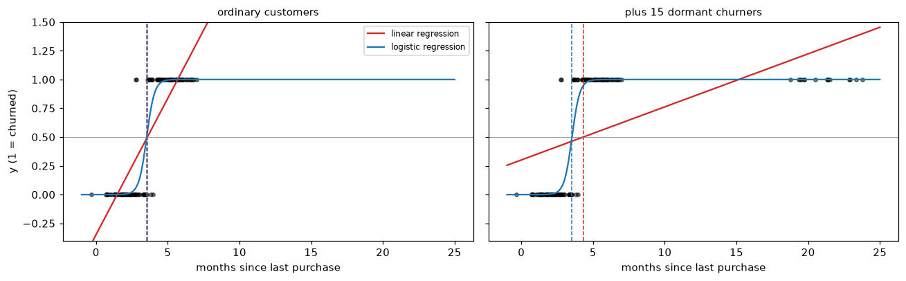
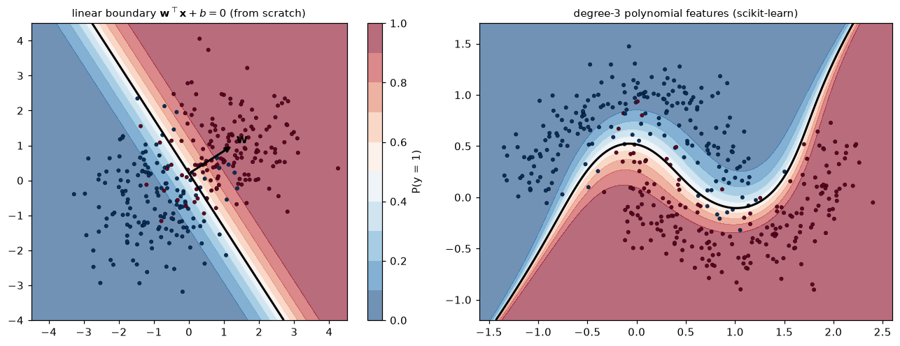

# Logistic Regression and Classification

> **Level 3 · Chapter 3** · ⏱️ ~65 min read · Prerequisites: [Linear regression](02-linear-regression.md), [Probability](../01-math-foundations/04-probability.md), [Statistics](../01-math-foundations/05-statistics.md) (maximum likelihood), [Information theory and optimization](../01-math-foundations/06-information-theory-and-optimization.md) (cross-entropy)

Logistic regression turns a weighted sum of features into a probability, and it's the workhorse of classification: churn, fraud, credit risk, click prediction, medical screening. This chapter shows why linear regression fails for classes, derives the log-loss from maximum likelihood and its gradient from the chain rule, explains decision boundaries, extends the model to many classes with the softmax, and implements all of it from scratch before matching scikit-learn.

## Why it matters

Alex's team needed to predict which customers of a subscription app would cancel. They already had a linear regression pipeline, so they coded "cancelled" as 1 and "stayed" as 0, fit a linear regression, and flagged customers whose prediction was above 0.5. It worked well enough in testing.

Two things went wrong in production. First, the finance team wanted churn *probabilities* to forecast revenue, and the model produced values like $-0.3$ and $1.4$ for some customers. Nobody could explain what a probability of 1.4 meant. Second, after a data migration added a batch of long-dormant accounts (all cancelled, all with huge "days since last login"), the model was retrained and suddenly stopped flagging customers it used to catch. The dormant accounts were extreme but obvious, and yet they *moved the decision threshold for everyone else*.

Both failures have the same cause: linear regression is the wrong model for a yes/no outcome. Logistic regression fixes both, and the way it fixes them, by modeling probabilities and fitting with maximum likelihood, is the template for nearly every classifier in deep learning too.

## Concepts

### Why not linear regression for classes?

In **binary classification**, the label is $y \in \{0, 1\}$: 1 for the **positive class** (the event you care about, like churn) and 0 for the **negative class**. What you'd like from a model is the probability $P(y = 1 \mid \mathbf{x})$, and then a decision rule on top of it.

Linear regression on a 0/1 target does estimate $\mathbb{E}[y \mid \mathbf{x}] = P(y = 1 \mid \mathbf{x})$, so the idea isn't crazy. But a straight line has two problems:

1. **It isn't bounded.** A line goes below 0 and above 1, so its outputs can't be probabilities.
2. **Squared error punishes being "too right".** A churner with a prediction of 3.0 (very confidently positive, which is good) has a squared error of $(3 - 1)^2 = 4$. To reduce that "error," least squares tilts the line, which moves the 0.5 crossing point and can misclassify ordinary customers. Extreme but easy examples drag the boundary around, which is what happened to Alex's team.

The code below simulates Alex's situation. The feature is months since a customer's last purchase; the first fit uses ordinary customers, and the second adds 15 long-dormant churners.

```python
import numpy as np
import matplotlib.pyplot as plt
from sklearn.linear_model import LinearRegression, LogisticRegression

rng = np.random.default_rng(0)
x = np.r_[rng.normal(2, 1.0, 60), rng.normal(5, 1.0, 60)]
y = np.r_[np.zeros(60), np.ones(60)]
x_dormant = rng.uniform(18, 24, 15)                     # obvious churners
x2, y2 = np.r_[x, x_dormant], np.r_[y, np.ones(15)]

def thresholds(xx, yy):
    lin = LinearRegression().fit(xx.reshape(-1, 1), yy)
    log = LogisticRegression(C=np.inf).fit(xx.reshape(-1, 1), yy)
    t_lin = (0.5 - lin.intercept_) / lin.coef_[0]        # where the line crosses 0.5
    t_log = -log.intercept_[0] / log.coef_[0, 0]         # where the probability is 0.5
    return lin, log, t_lin, t_log

fig, axes = plt.subplots(1, 2, figsize=(12, 3.8), sharey=True)
grid = np.linspace(-1, 25, 400)
for ax, (xx, yy, title) in zip(axes, [(x, y, "ordinary customers"), (x2, y2, "plus 15 dormant churners")]):
    lin, log, t_lin, t_log = thresholds(xx, yy)
    print(f"{title:>26}: linear threshold = {t_lin:.2f}, logistic threshold = {t_log:.2f}")
    ax.scatter(xx, yy, s=12, alpha=0.5, color="k")
    ax.plot(grid, lin.predict(grid.reshape(-1, 1)), color="tab:red", label="linear regression")
    ax.plot(grid, log.predict_proba(grid.reshape(-1, 1))[:, 1], color="tab:blue", label="logistic regression")
    ax.axvline(t_lin, color="tab:red", ls="--", lw=1); ax.axvline(t_log, color="tab:blue", ls="--", lw=1)
    ax.axhline(0.5, color="gray", lw=0.5)
    ax.set_ylim(-0.4, 1.5); ax.set_title(title, fontsize=10); ax.set_xlabel("months since last purchase")
axes[0].set_ylabel("y (1 = churned)"); axes[0].legend(fontsize=8, loc="upper right")
plt.tight_layout()
plt.show()
```

```text
        ordinary customers: linear threshold = 3.58, logistic threshold = 3.53
  plus 15 dormant churners: linear threshold = 4.32, logistic threshold = 3.53
```



*Dashed lines mark each model's decision threshold. With ordinary customers both agree. Adding obvious churners far to the right flattens the regression line and drags its threshold to the right, into the ordinary churners; the logistic threshold doesn't move.*

With the dormant accounts added, the linear model's threshold moves from about 3.6 to 4.3 months. Ordinary churners here average 5 months with a standard deviation of 1, so the share of them the model misses roughly triples, from about 8% to about 25%, because of customers who were never in doubt. The logistic threshold barely changes, because once its probability is near 1 for a point, that point contributes almost nothing to the loss or its gradient. Let's build that model.

### The sigmoid and the log-odds

Logistic regression keeps the linear score $z = \mathbf{w}^\top\mathbf{x} + b$, which can be any real number, and squashes it into $(0, 1)$ with the **sigmoid** (or **logistic**) function:

$$
\sigma(z) = \frac{1}{1 + e^{-z}}, \qquad P(y = 1 \mid \mathbf{x}) = p(\mathbf{x}) = \sigma(\mathbf{w}^\top\mathbf{x} + b).
$$

The sigmoid is S-shaped: $\sigma(0) = 0.5$, $\sigma(z) \to 1$ as $z \to \infty$, and $\sigma(z) \to 0$ as $z \to -\infty$. Two identities you'll use constantly:

- **Symmetry:** $\sigma(-z) = 1 - \sigma(z)$. Multiply the top and bottom of $\frac{1}{1 + e^{z}}$ by $e^{-z}$ to get $\frac{e^{-z}}{e^{-z} + 1} = 1 - \frac{1}{1 + e^{-z}}$.
- **Derivative:** $\sigma'(z) = \sigma(z)\,(1 - \sigma(z))$, derived in [Calculus and gradients](../01-math-foundations/03-calculus-and-gradients.md#the-chain-rule).

What is the linear score $z$, in probability terms? Solve $p = \sigma(z)$ for $z$:

$$
p = \frac{1}{1 + e^{-z}} \;\Longrightarrow\; e^{-z} = \frac{1 - p}{p} \;\Longrightarrow\; z = \log\frac{p}{1 - p}.
$$

The ratio $\frac{p}{1 - p}$ is the **odds** (a probability of 0.8 is odds of 4 to 1), and $\log\frac{p}{1-p}$ is the **log-odds** or **logit**. So logistic regression is a *linear model for the log-odds*:

$$
\log\frac{P(y = 1 \mid \mathbf{x})}{P(y = 0 \mid \mathbf{x})} = \mathbf{w}^\top\mathbf{x} + b.
$$

This gives the coefficients a clean meaning. Increase $x_j$ by one unit, holding the others fixed, and the log-odds rise by $w_j$, so the odds are *multiplied* by $e^{w_j}$, the **odds ratio**. A coefficient of 0.4 on "support tickets last month" means each extra ticket multiplies the odds of churn by $e^{0.4} \approx 1.49$. The effect on the *probability* isn't constant: it's largest near $p = 0.5$, where the sigmoid is steepest, and tiny near 0 or 1.

### Log-loss from maximum likelihood

The model outputs probabilities, so fit it the way statisticians fit any probability model: with [maximum likelihood](../01-math-foundations/05-statistics.md#maximum-likelihood-estimation). Each label is a Bernoulli random variable with success probability $p_i = \sigma(\mathbf{w}^\top\mathbf{x}_i + b)$. The Bernoulli probability mass function can be written in one line, using the fact that $y_i$ is 0 or 1:

$$
P(y_i \mid \mathbf{x}_i) = p_i^{\,y_i}\,(1 - p_i)^{1 - y_i}.
$$

(If $y_i = 1$ this is $p_i$; if $y_i = 0$ it's $1 - p_i$.) Assuming independent examples, the likelihood is the product $L(\mathbf{w}, b) = \prod_{i=1}^n p_i^{y_i}(1 - p_i)^{1 - y_i}$. Products of many small numbers underflow, and logs turn products into sums, so take the log and flip the sign to get a loss to *minimize*. Dividing by $n$ gives the average **negative log-likelihood**:

$$
\mathcal{L}(\mathbf{w}, b) = -\frac{1}{n}\sum_{i=1}^{n}\Big[y_i\log p_i + (1 - y_i)\log(1 - p_i)\Big].
$$

This is the **log-loss**, also called **binary cross-entropy**. The name isn't a coincidence: each term is the cross-entropy $H(q, p)$ from [Information theory](../01-math-foundations/06-information-theory-and-optimization.md#cross-entropy) between the label's distribution $q = (y_i, 1 - y_i)$ and the model's $(p_i, 1 - p_i)$. Maximum likelihood and minimum cross-entropy are the same thing, as that chapter showed.

Look at what one term does. If $y_i = 1$, the loss is $-\log p_i$: 0 when $p_i = 1$, about 0.69 at $p_i = 0.5$, 4.6 at $p_i = 0.01$, and infinite as $p_i \to 0$. Confident mistakes are punished without limit. And a correct, confident prediction costs almost nothing, so it barely pulls on the fit, which is why the dormant churners didn't move the logistic boundary.

**A simpler form for computing.** Write $z_i = \mathbf{w}^\top\mathbf{x}_i + b$. Since $\log\sigma(z) = -\log(1 + e^{-z})$ and $\log(1 - \sigma(z)) = \log\sigma(-z) = -\log(1 + e^{z})$, and $\log(1 + e^{-z}) = \log(1 + e^{z}) - z$, each term simplifies to

$$
\ell_i = \log\left(1 + e^{z_i}\right) - y_i z_i.
$$

`np.logaddexp(0, z)` computes $\log(1 + e^{z})$ without overflowing for large $z$. Computing $\sigma(z)$ first and then taking its log is the classic way to get `log(0) = -inf` and a `nan` loss.

**Why not squared error on the probabilities?** You could minimize $\frac{1}{n}\sum_i(\sigma(z_i) - y_i)^2$. But that loss isn't convex in $\mathbf{w}$, and its gradient contains the factor $\sigma'(z_i)$, which is nearly zero when the model is confidently wrong ($z_i$ very negative for a positive example). The model would learn slowest exactly when it's most wrong. Log-loss avoids both problems, as the gradient shows.

### The gradient

Differentiate one term with respect to its score $z_i$, using $\frac{d}{dz}\log(1 + e^{z}) = \frac{e^{z}}{1 + e^{z}} = \sigma(z)$:

$$
\frac{\partial \ell_i}{\partial z_i} = \sigma(z_i) - y_i = p_i - y_i.
$$

That's remarkably simple: the derivative of the loss with respect to the score is just *prediction minus label*. No $\sigma'$ factor survives, so a confidently wrong prediction gets a gradient of almost $\pm 1$, the largest possible. Now apply the chain rule. Since $z_i = \mathbf{w}^\top\mathbf{x}_i + b$, we have $\frac{\partial z_i}{\partial \mathbf{w}} = \mathbf{x}_i$ and $\frac{\partial z_i}{\partial b} = 1$:

$$
\nabla_{\mathbf{w}}\mathcal{L} = \frac{1}{n}\sum_{i=1}^n (p_i - y_i)\,\mathbf{x}_i = \frac{1}{n}\mathbf{X}^\top\big(\sigma(\mathbf{X}\mathbf{w}) - \mathbf{y}\big), \qquad \frac{\partial \mathcal{L}}{\partial b} = \frac{1}{n}\sum_{i=1}^n (p_i - y_i).
$$

Here $\sigma(\mathbf{X}\mathbf{w})$ applies the sigmoid to each entry. (If $\mathbf{X}$ includes a column of ones, the bias gradient is just one more entry of the first formula.) Compare it with the [linear regression gradient](02-linear-regression.md#the-normal-equation), $\frac{2}{n}\mathbf{X}^\top(\mathbf{X}\mathbf{w} - \mathbf{y})$: same structure, residuals correlated with features, with the prediction now passed through a sigmoid. This isn't luck. Both are **generalized linear models** with their "natural" loss, and that family always produces this form. You'll see it a third time with the softmax.

Setting the gradient to zero gives $\mathbf{X}^\top\sigma(\mathbf{X}\mathbf{w}) = \mathbf{X}^\top\mathbf{y}$. With an intercept, its first row says $\sum_i p_i = \sum_i y_i$: at the optimum, the average predicted probability equals the observed positive rate on the training data. But the sigmoid makes the equation nonlinear in $\mathbf{w}$, so **there's no closed-form solution**. You solve it iteratively.

**Convexity.** Differentiate the gradient once more. Since $\frac{\partial p_i}{\partial \mathbf{w}} = p_i(1 - p_i)\,\mathbf{x}_i$, the Hessian is

$$
\nabla^2_{\mathbf{w}}\mathcal{L} = \frac{1}{n}\sum_{i=1}^n p_i(1 - p_i)\,\mathbf{x}_i\mathbf{x}_i^\top = \frac{1}{n}\mathbf{X}^\top\mathbf{S}\mathbf{X}, \qquad \mathbf{S} = \operatorname{diag}\big(p_i(1 - p_i)\big).
$$

Every $p_i(1 - p_i)$ is positive, so for any $\mathbf{v}$, $\mathbf{v}^\top\mathbf{X}^\top\mathbf{S}\mathbf{X}\mathbf{v} = \sum_i p_i(1-p_i)(\mathbf{x}_i^\top\mathbf{v})^2 \geq 0$. The Hessian is positive semi-definite everywhere, so log-loss is **convex**: gradient descent can't get stuck in a bad local minimum. Second-order solvers like Newton's method use this Hessian directly (you'll implement one in the exercises), and scikit-learn's default `lbfgs` solver approximates it.

**When the minimum doesn't exist.** If a hyperplane separates the classes perfectly, you can always reduce the loss by scaling $\mathbf{w}$ up: every $p_i$ moves closer to its label. The loss approaches 0 but never reaches it, and the weights grow forever. The maximum likelihood estimate doesn't exist. This happens often with many features and few examples. The fix is [regularization](05-regularization.md), which adds a penalty on $\lVert\mathbf{w}\rVert^2$; it's why scikit-learn's `LogisticRegression` is regularized by default (`C=1.0`).

### Decision boundaries

A probability isn't a decision. To classify, choose a **threshold** $t$ and predict 1 when $p(\mathbf{x}) \geq t$. With the default $t = 0.5$, since $\sigma(z) \geq 0.5$ exactly when $z \geq 0$:

$$
\hat{y} = 1 \quad\Longleftrightarrow\quad \mathbf{w}^\top\mathbf{x} + b \geq 0.
$$

The **decision boundary**, the set where the model is exactly undecided, is $\{\mathbf{x} : \mathbf{w}^\top\mathbf{x} + b = 0\}$: a line in 2D, a plane in 3D, a **hyperplane** in general. So logistic regression is a **linear classifier**. The weight vector $\mathbf{w}$ is perpendicular to the boundary (it's the gradient of the score) and points toward the positive class. The signed distance from a point to the boundary is $(\mathbf{w}^\top\mathbf{x} + b)/\lVert\mathbf{w}\rVert$, so the score $z$ measures how far, in units scaled by $\lVert\mathbf{w}\rVert$, a point is from the boundary. The larger $\lVert\mathbf{w}\rVert$, the steeper the sigmoid across the boundary and the more confident the model.

Choosing a different threshold $t$ moves the boundary to $\mathbf{w}^\top\mathbf{x} + b = \operatorname{logit}(t)$, which is parallel to the original. Lowering $t$ flags more customers: you catch more churners and also bother more loyal ones. Choosing $t$ is a business decision, covered in [Evaluation metrics](06-evaluation-metrics.md#choosing-a-threshold).

For curved boundaries, use the trick from linear regression: add nonlinear features. With polynomial features of degree 2, the boundary $w_1x_1 + w_2x_2 + w_3x_1^2 + w_4x_1x_2 + w_5x_2^2 + b = 0$ is a conic: an ellipse, parabola, or hyperbola. Higher degrees give more flexible boundaries, with the same overfitting risk as before.

### Multiclass classification with the softmax

With $K > 2$ classes (which of 10 digits, which of 5 product categories), there are two common approaches.

**One-vs-rest (OvR)** trains $K$ separate binary classifiers, "class $k$ versus everything else," and predicts the class whose classifier gives the highest score. It's simple and works with any binary classifier, but the $K$ probabilities don't sum to 1, and each model is trained on an imbalanced problem.

**Multinomial logistic regression** (also called **softmax regression**) models all classes jointly. Give each class its own weight vector $\mathbf{w}_k$ and bias $b_k$, and compute a score, or **logit**, per class: $z_k = \mathbf{w}_k^\top\mathbf{x} + b_k$. The **softmax** function turns the $K$ scores into a probability distribution:

$$
P(y = k \mid \mathbf{x}) = p_k = \operatorname{softmax}(\mathbf{z})_k = \frac{e^{z_k}}{\sum_{j=1}^{K} e^{z_j}}.
$$

Exponentiating makes every score positive; dividing by the sum makes them add up to 1. The largest score gets the largest probability, and the gap between scores sets how lopsided the distribution is: it's a smooth, differentiable version of "pick the max," hence the name.

Two properties matter in practice:

- **Shift invariance.** Adding the same constant $c$ to every score doesn't change the output: $\frac{e^{z_k + c}}{\sum_j e^{z_j + c}} = \frac{e^c e^{z_k}}{e^c\sum_j e^{z_j}}$. Two consequences: you compute softmax stably by subtracting $\max_j z_j$ first, so no exponent overflows; and the parameters are redundant (adding the same vector to every $\mathbf{w}_k$ changes nothing), which regularization resolves by picking the smallest-norm solution.
- **Two classes give the sigmoid.** With $K = 2$: $p_1 = \frac{e^{z_1}}{e^{z_0} + e^{z_1}} = \frac{1}{1 + e^{-(z_1 - z_0)}} = \sigma(z_1 - z_0)$. Binary logistic regression is softmax regression with one redundant set of weights removed.

**The loss.** Encode the label as a **one-hot** vector $\mathbf{y}_i$ with a 1 in position $y_i$ and 0 elsewhere. The likelihood of example $i$ is $p_{i, y_i} = \prod_k p_{ik}^{y_{ik}}$ (a categorical distribution), so the average negative log-likelihood is the **categorical cross-entropy**:

$$
\mathcal{L} = -\frac{1}{n}\sum_{i=1}^n\sum_{k=1}^K y_{ik}\log p_{ik} = -\frac{1}{n}\sum_{i=1}^n \log p_{i, y_i}.
$$

Only the probability assigned to the correct class matters.

**The gradient.** For one example, write the loss as $\ell = -\sum_k y_k \log p_k = -\sum_k y_k z_k + \log\sum_j e^{z_j}$ (using $\log p_k = z_k - \log\sum_j e^{z_j}$ and $\sum_k y_k = 1$). Differentiate with respect to the score $z_m$:

$$
\frac{\partial \ell}{\partial z_m} = -y_m + \frac{e^{z_m}}{\sum_j e^{z_j}} = p_m - y_m.
$$

Prediction minus label again, now per class. Collect the probabilities into $\mathbf{P} \in \mathbb{R}^{n \times K}$ and the one-hot labels into $\mathbf{Y} \in \mathbb{R}^{n \times K}$, and stack the weight vectors as the columns of $\mathbf{W} \in \mathbb{R}^{d \times K}$, so the scores are $\mathbf{Z} = \mathbf{X}\mathbf{W} + \mathbf{1}\mathbf{b}^\top$. The chain rule gives

$$
\nabla_{\mathbf{W}}\mathcal{L} = \frac{1}{n}\mathbf{X}^\top(\mathbf{P} - \mathbf{Y}), \qquad \nabla_{\mathbf{b}}\mathcal{L} = \frac{1}{n}\sum_{i=1}^n(\mathbf{p}_i - \mathbf{y}_i).
$$

This exact formula, softmax followed by cross-entropy with gradient $\mathbf{P} - \mathbf{Y}$, sits at the output of nearly every neural network classifier. You'll meet it again in [Forward and backpropagation](../06-neural-networks/02-forward-and-backpropagation.md). The decision regions are still linear: the boundary between classes $k$ and $m$ is where $z_k = z_m$, a hyperplane.

### The probabilistic interpretation

Logistic regression is a **discriminative** model: it models $P(y \mid \mathbf{x})$ directly and says nothing about how $\mathbf{x}$ is distributed. A **generative** model instead models $P(\mathbf{x} \mid y)$ and $P(y)$ and uses Bayes' theorem. The two are connected. Suppose each class's features are Gaussian with means $\boldsymbol{\mu}_0, \boldsymbol{\mu}_1$ and a *shared* covariance $\boldsymbol{\Sigma}$. By [Bayes' theorem](../01-math-foundations/04-probability.md), the log-odds are

$$
\log\frac{P(y = 1 \mid \mathbf{x})}{P(y = 0 \mid \mathbf{x})} = \log\frac{P(\mathbf{x} \mid y = 1)}{P(\mathbf{x} \mid y = 0)} + \log\frac{P(y = 1)}{P(y = 0)}.
$$

Write out the two Gaussian densities and the quadratic terms $\mathbf{x}^\top\boldsymbol{\Sigma}^{-1}\mathbf{x}$ cancel (because the covariance is shared), leaving $\mathbf{w}^\top\mathbf{x} + b$ with $\mathbf{w} = \boldsymbol{\Sigma}^{-1}(\boldsymbol{\mu}_1 - \boldsymbol{\mu}_0)$. So the posterior is *exactly* a logistic function of a linear score. Logistic regression is correct under this model and many others (any exponential-family class-conditional with shared parameters), which is part of why it works so well in practice. You'll see the generative side in [naive Bayes](../04-ml-algorithms/01-knn-and-naive-bayes.md).

What makes the probabilities trustworthy? Log-loss is a **proper scoring rule**: its expected value is minimized by predicting the *true* probability. A model trained by minimizing it is pushed toward **calibrated** probabilities, meaning that among customers given a 30% churn probability, about 30% churn. The "average prediction equals the positive rate" identity above is one symptom. Calibration can still fail (a misspecified model, heavy regularization, resampling the classes), so you'll learn to check it in [Evaluation metrics](06-evaluation-metrics.md#calibration).

## In practice

### Binary logistic regression from scratch

Here's a complete implementation: a stable loss, its gradient, a gradient check, gradient descent, and a comparison with scikit-learn. The data simulate a churn problem with three standardized features and known true weights.

```python
from scipy.special import expit            # a numerically stable sigmoid

rng = np.random.default_rng(1)
n = 3000
names = ["tenure", "monthly_charge", "support_tickets"]
X = rng.normal(size=(n, 3))
w_true, b_true = np.array([-1.5, 0.8, 1.2]), -1.0
y = rng.binomial(1, expit(X @ w_true + b_true))
print(f"churn rate: {y.mean():.3f}")

Xb = np.column_stack([np.ones(n), X])       # intercept as weight 0

def loss(w, X, y):
    z = X @ w
    return np.mean(np.logaddexp(0, z) - y * z)

def grad(w, X, y):
    return X.T @ (expit(X @ w) - y) / len(y)

def numerical_grad(f, w, h=1e-6):
    g = np.zeros_like(w)
    for j in range(len(w)):
        e = np.zeros_like(w); e[j] = h
        g[j] = (f(w + e) - f(w - e)) / (2 * h)
    return g

w0 = rng.normal(size=4)
g_a, g_n = grad(w0, Xb, y), numerical_grad(lambda w: loss(w, Xb, y), w0)
print("gradient check, relative error:", f"{np.linalg.norm(g_a - g_n) / np.linalg.norm(g_a + g_n):.1e}")

w = np.zeros(4)
for it in range(3001):
    w -= 1.0 * grad(w, Xb, y)                # learning rate 1.0
    if it % 1000 == 0:
        print(f"iter {it:>4}: loss = {loss(w, Xb, y):.6f}, |grad| = {np.linalg.norm(grad(w, Xb, y)):.1e}")
```

```text
churn rate: 0.343
gradient check, relative error: 2.1e-10
iter    0: loss = 0.603768, |grad| = 2.4e-01
iter 1000: loss = 0.428178, |grad| = 1.8e-16
iter 2000: loss = 0.428178, |grad| = 1.8e-16
iter 3000: loss = 0.428178, |grad| = 1.8e-16
```

The analytical gradient matches the numerical one to about ten digits, and gradient descent drives the gradient to essentially zero. Now compare with scikit-learn. `LogisticRegression` is regularized by default; setting `C=np.inf` removes the penalty so it solves the same problem.

```python
sk = LogisticRegression(C=np.inf, tol=1e-10, max_iter=10_000).fit(X, y)
print("from scratch:", np.round(w, 5))
print("scikit-learn:", np.round(np.r_[sk.intercept_, sk.coef_.ravel()], 5))
print("true:        ", np.r_[b_true, w_true])
p_ours, p_sk = expit(Xb @ w), sk.predict_proba(X)[:, 1]
print("max |prob difference|:", f"{np.abs(p_ours - p_sk).max():.1e}")
print(f"mean predicted prob = {p_ours.mean():.4f}, churn rate = {y.mean():.4f}")
print("odds ratios:", dict(zip(names, np.round(np.exp(w[1:]), 2))))
```

```text
from scratch: [-1.00065 -1.49267  0.78281  1.16812]
scikit-learn: [-1.00065 -1.49267  0.78281  1.16812]
true:         [-1.  -1.5  0.8  1.2]
max |prob difference|: 5.4e-11
mean predicted prob = 0.3433, churn rate = 0.3433
odds ratios: {'tenure': np.float64(0.22), 'monthly_charge': np.float64(2.19), 'support_tickets': np.float64(3.22)}
```

The two implementations agree to five decimals, both recover the true weights, and the mean predicted probability equals the churn rate exactly, as the zero-gradient condition requires. The odds ratios read naturally: one standard deviation more of tenure multiplies the odds of churning by about 0.22 (a 78% reduction), and one more standard deviation of support tickets multiplies them by about 3.2.

### Decision boundaries, straight and curved

The left panel shows the linear boundary and probability contours of a from-scratch model on two features. The right panel fits two interleaving half-moons, where no straight line works, with a scikit-learn pipeline that adds polynomial features.

```python
from sklearn.datasets import make_moons
from sklearn.pipeline import make_pipeline
from sklearn.preprocessing import PolynomialFeatures, StandardScaler

# Left: two Gaussian classes, fit from scratch with gradient descent
rng = np.random.default_rng(2)
X2 = np.r_[rng.normal([-1, -0.5], 1.0, (150, 2)), rng.normal([1.2, 1.0], 1.0, (150, 2))]
y2 = np.r_[np.zeros(150), np.ones(150)]
X2b = np.column_stack([np.ones(300), X2])
w2 = np.zeros(3)
for _ in range(5000):
    w2 -= 0.5 * grad(w2, X2b, y2)

# Right: half-moons with degree-3 polynomial features
Xm, ym = make_moons(400, noise=0.2, random_state=0)
poly = make_pipeline(PolynomialFeatures(3), StandardScaler(), LogisticRegression(C=10, max_iter=5000)).fit(Xm, ym)
line = LogisticRegression().fit(Xm, ym)
print(f"moons accuracy: linear {line.score(Xm, ym):.3f}, degree-3 {poly.score(Xm, ym):.3f}")

fig, axes = plt.subplots(1, 2, figsize=(12, 4.6))
g1, g2 = np.meshgrid(np.linspace(-4.5, 4.5, 300), np.linspace(-4, 4.5, 300))
P = expit(w2[0] + w2[1] * g1 + w2[2] * g2)
cs = axes[0].contourf(g1, g2, P, levels=np.linspace(0, 1, 11), cmap="RdBu_r", alpha=0.6)
axes[0].contour(g1, g2, P, levels=[0.5], colors="k", linewidths=2)
axes[0].scatter(X2[:, 0], X2[:, 1], c=y2, cmap="RdBu_r", s=12, edgecolor="k", lw=0.3)
mid = np.array([0.0, -w2[0] / w2[2]])
axes[0].annotate("", xy=mid + w2[1:] / np.linalg.norm(w2[1:]) * 1.5, xytext=mid,
                 arrowprops=dict(arrowstyle="->", lw=2))
axes[0].text(*(mid + w2[1:] / np.linalg.norm(w2[1:]) * 1.6), "w", fontsize=12, weight="bold")
axes[0].set_title(r"linear boundary $\mathbf{w}^\top\mathbf{x} + b = 0$ (from scratch)", fontsize=10)
axes[0].set_aspect("equal")
fig.colorbar(cs, ax=axes[0], label="P(y = 1)")

h1, h2 = np.meshgrid(np.linspace(-1.6, 2.6, 300), np.linspace(-1.2, 1.7, 300))
Pm = poly.predict_proba(np.c_[h1.ravel(), h2.ravel()])[:, 1].reshape(h1.shape)
axes[1].contourf(h1, h2, Pm, levels=np.linspace(0, 1, 11), cmap="RdBu_r", alpha=0.6)
axes[1].contour(h1, h2, Pm, levels=[0.5], colors="k", linewidths=2)
axes[1].scatter(Xm[:, 0], Xm[:, 1], c=ym, cmap="RdBu_r", s=12, edgecolor="k", lw=0.3)
axes[1].set_title("degree-3 polynomial features (scikit-learn)", fontsize=10)
plt.tight_layout()
plt.show()
```

```text
moons accuracy: linear 0.875, degree-3 0.953
```



*Left: the 0.5 contour is a straight line, probability contours run parallel to it, and the weight vector w points across it toward the positive class. Right: polynomial features let the same model draw a curved boundary.*

### Softmax regression from scratch

Now the multiclass version, on the wine data set (178 wines, 13 chemical measurements, 3 cultivars). The wine classes are nearly separable, so, as with separable binary data, the unregularized solution doesn't exist. We add the L2 penalty that scikit-learn uses by default. scikit-learn minimizes $C\sum_i \ell_i + \frac{1}{2}\lVert\mathbf{W}\rVert^2$; dividing by $Cn$ shows it's the same as minimizing the *mean* loss plus $\frac{\lambda}{2}\lVert\mathbf{W}\rVert^2$ with $\lambda = \frac{1}{Cn}$. The penalty's gradient, $\lambda\mathbf{W}$, adds to the gradient; the biases aren't penalized. [Regularization](05-regularization.md) covers this properly.

```python
from sklearn.datasets import load_wine

Xw, yw = load_wine(return_X_y=True)
Xw = (Xw - Xw.mean(axis=0)) / Xw.std(axis=0)
nw, K = len(yw), 3
Y = np.eye(K)[yw]                                   # one-hot labels, shape (n, K)

def softmax(Z):
    Z = Z - Z.max(axis=1, keepdims=True)             # shift for stability
    E = np.exp(Z)
    return E / E.sum(axis=1, keepdims=True)

C = 1.0
lam = 1 / (C * nw)
W, bvec = np.zeros((Xw.shape[1], K)), np.zeros(K)
for _ in range(20_000):
    P = softmax(Xw @ W + bvec)
    W -= 0.5 * (Xw.T @ (P - Y) / nw + lam * W)
    bvec -= 0.5 * (P - Y).mean(axis=0)

sk3 = LogisticRegression(C=C, tol=1e-10, max_iter=10_000).fit(Xw, yw)
P_ours, P_sk = softmax(Xw @ W + bvec), sk3.predict_proba(Xw)
print("max |coef difference|:", f"{np.abs(W.T - sk3.coef_).max():.1e}")
print("max |prob difference|:", f"{np.abs(P_ours - P_sk).max():.1e}")
print("bias sums to zero:", np.isclose(bvec.sum(), 0), " coefficient columns sum to zero:", np.allclose(W.sum(axis=1), 0))
print(f"training accuracy: {np.mean(P_ours.argmax(axis=1) == yw):.3f}")
```

```text
max |coef difference|: 8.0e-07
max |prob difference|: 1.2e-07
bias sums to zero: True  coefficient columns sum to zero: True
training accuracy: 1.000
```

The from-scratch softmax regression matches scikit-learn's multinomial model. Notice that each feature's weights sum to zero across the three classes: that's how the L2 penalty resolves the shift invariance, by picking the smallest-norm member of each family of equivalent solutions.

!!! warning "Common mistake: unscaled features with a regularized model"
    The L2 penalty treats every coefficient alike, so a feature measured in large units (income in dollars) gets a tiny coefficient that's barely penalized, while one in small units gets penalized heavily. scikit-learn's `LogisticRegression` is regularized by default, so always standardize features first (in a `Pipeline`). Unscaled features also slow the `lbfgs` solver and trigger `ConvergenceWarning`.

!!! warning "Common mistake: reading `predict` as the model's answer"
    `predict` applies a fixed 0.5 threshold. For imbalanced or cost-sensitive problems, that's rarely the best decision rule. Use `predict_proba`, and choose the threshold from costs, as in [Evaluation metrics](06-evaluation-metrics.md#choosing-a-threshold).

## Exercises

### Exercise 1: Sigmoid facts (easy)

(a) Compute $\sigma(0)$, $\sigma(2)$, $\sigma(-2)$ by hand (use $e^{-2} \approx 0.135$). (b) A model predicts $p = 0.9$. What are the odds and the log-odds? (c) A coefficient is $w_j = -0.7$. By what factor does a one-unit increase in $x_j$ change the odds?

??? success "Solution"

    (a) $\sigma(0) = 1/(1 + 1) = 0.5$. $\sigma(2) = 1/(1 + 0.135) \approx 0.881$. $\sigma(-2) = 1 - \sigma(2) \approx 0.119$.

    (b) Odds $= 0.9/0.1 = 9$; log-odds $= \ln 9 \approx 2.197$.

    (c) The odds are multiplied by $e^{-0.7} \approx 0.497$: roughly halved.

    ```python
    print(np.round(expit([0, 2, -2]), 3), round(np.log(0.9 / 0.1), 3), round(np.exp(-0.7), 3))
    ```

    ```text
    [0.5   0.881 0.119] 2.197 0.497
    ```

### Exercise 2: Log-loss by hand (easy)

Three customers have labels $y = (1, 0, 1)$ and predicted churn probabilities $p = (0.8, 0.3, 0.05)$. Compute each customer's log-loss and the average. Which customer dominates, and why is that the intended behavior?

??? success "Solution"

    $-\ln 0.8 \approx 0.223$, $-\ln(1 - 0.3) = -\ln 0.7 \approx 0.357$, $-\ln 0.05 \approx 2.996$. The average is $\approx 1.192$.

    The third customer, a churner given only a 5% probability, contributes about 84% of the total. Log-loss punishes confident mistakes heavily, because a model that says "5%" for events that happen is badly miscalibrated, and the decisions built on it (no retention offer) are costly.

    ```python
    from sklearn.metrics import log_loss
    yy, pp = np.array([1, 0, 1]), np.array([0.8, 0.3, 0.05])
    per = -(yy * np.log(pp) + (1 - yy) * np.log(1 - pp))
    print(np.round(per, 3), round(per.mean(), 3), round(log_loss(yy, pp), 3))
    ```

    ```text
    [0.223 0.357 2.996] 1.192 1.192
    ```

### Exercise 3: Separable data (medium)

Generate 40 points in 1D: class 0 at $x \sim \mathcal{N}(-2, 0.5^2)$ and class 1 at $x \sim \mathcal{N}(2, 0.5^2)$, so the classes are perfectly separated. Run gradient descent on the unregularized log-loss and print $w$ and the loss after 100, 1,000, 10,000, and 100,000 iterations. Then add an L2 penalty $\frac{\lambda}{2}w^2$ with $\lambda = 0.01$ and repeat. Before you run it, predict what happens to $w$ in each case and why.

??? success "Solution"

    ```python
    rng = np.random.default_rng(0)
    xs = np.r_[rng.normal(-2, 0.5, 20), rng.normal(2, 0.5, 20)]
    ys = np.r_[np.zeros(20), np.ones(20)]
    Xs = np.column_stack([np.ones(40), xs])

    for lam in [0.0, 0.01]:
        wv, done = np.zeros(2), 0
        for stop in [100, 1_000, 10_000, 100_000]:
            for _ in range(stop - done):
                wv -= 1.0 * (grad(wv, Xs, ys) + lam * np.r_[0, wv[1]])
            done = stop
            print(f"lambda={lam}: iter {stop:>6}: w = {wv[1]:7.3f}, loss = {loss(wv, Xs, ys):.2e}")
    ```

    ```text
    lambda=0.0: iter    100: w =   3.078, loss = 3.18e-03
    lambda=0.0: iter   1000: w =   4.385, loss = 3.61e-04
    lambda=0.0: iter  10000: w =   5.773, loss = 3.95e-05
    lambda=0.0: iter 100000: w =   7.221, loss = 4.20e-06
    lambda=0.01: iter    100: w =   2.270, loss = 1.29e-02
    lambda=0.01: iter   1000: w =   2.273, loss = 1.29e-02
    lambda=0.01: iter  10000: w =   2.273, loss = 1.29e-02
    lambda=0.01: iter 100000: w =   2.273, loss = 1.29e-02
    ```

    Without a penalty, $w$ keeps growing (roughly logarithmically in the number of iterations) and the loss keeps shrinking toward 0: every increase in $w$ pushes all probabilities closer to their labels, so there's no minimum. The "answer" depends on when you stop. With the penalty, the term $\frac{\lambda}{2}w^2$ eventually costs more than the tiny log-loss gain, so $w$ settles at a finite value. This is one reason scikit-learn regularizes by default.

### Exercise 4: Softmax with two classes (medium)

(a) Show algebraically that a two-class softmax with scores $z_0, z_1$ gives $p_1 = \sigma(z_1 - z_0)$. (b) Verify numerically on random scores. (c) Show numerically that adding 1,000 to every score breaks a naive softmax but not the stable one.

??? success "Solution"

    (a) $p_1 = \frac{e^{z_1}}{e^{z_0} + e^{z_1}}$. Divide top and bottom by $e^{z_1}$: $p_1 = \frac{1}{e^{z_0 - z_1} + 1} = \frac{1}{1 + e^{-(z_1 - z_0)}} = \sigma(z_1 - z_0)$.

    ```python
    rng = np.random.default_rng(0)
    Z = rng.normal(size=(5, 2))
    print(np.allclose(softmax(Z)[:, 1], expit(Z[:, 1] - Z[:, 0])))

    naive = lambda Z: np.exp(Z) / np.exp(Z).sum(axis=1, keepdims=True)
    with np.errstate(over="ignore", invalid="ignore"):
        print(naive(Z + 1000)[0], softmax(Z + 1000)[0], softmax(Z)[0])
    ```

    ```text
    True
    [nan nan] [0.56410403 0.43589597] [0.56410403 0.43589597]
    ```

    (c) $e^{1000}$ overflows to infinity, and $\infty/\infty$ is `nan`. Subtracting the row maximum first makes the largest exponent $e^0 = 1$, and by shift invariance the result is unchanged.

### Exercise 5: The Hessian and convexity (medium)

Using the binary churn data from the In practice section, compute the Hessian $\frac{1}{n}\mathbf{X}^\top\mathbf{S}\mathbf{X}$ at the fitted weights. (a) Check that all its eigenvalues are positive. (b) Check it against a numerical Hessian (finite differences of the gradient). (c) Use the eigenvalues to explain why a learning rate of 1.0 was safe for gradient descent here.

??? success "Solution"

    ```python
    p = expit(Xb @ w)
    H = Xb.T @ (Xb * (p * (1 - p))[:, None]) / n
    H_num = np.column_stack([
        (grad(w + 1e-6 * e, Xb, y) - grad(w - 1e-6 * e, Xb, y)) / 2e-6 for e in np.eye(4)
    ])
    eig = np.linalg.eigvalsh(H)
    print("eigenvalues:", np.round(eig, 4))
    print("matches numerical Hessian:", np.allclose(H, H_num, atol=1e-7))
    print("largest possible eigenvalue anywhere <= 0.25 * max eig of X^T X / n =", round(0.25 * np.linalg.eigvalsh(Xb.T @ Xb / n).max(), 4))
    ```

    ```text
    eigenvalues: [0.048  0.14   0.1476 0.1566]
    matches numerical Hessian: True
    largest possible eigenvalue anywhere <= 0.25 * max eig of X^T X / n = 0.265
    ```

    (a) All positive, so the loss is strictly convex near the optimum. (b) It matches. (c) Gradient descent on a function with curvature at most $L$ is stable for $\eta < 2/L$ ([Gradient descent in depth](07-gradient-descent-in-depth.md) derives this). Since $p(1-p) \leq 0.25$, the Hessian is never larger than $0.25\,\mathbf{X}^\top\mathbf{X}/n$, whose top eigenvalue here is about 0.27. So any $\eta$ below about $2/0.27 \approx 7$ is safe, and 1.0 is comfortably inside.

### Exercise 6: Newton's method (hard)

Newton's method uses curvature: $\mathbf{w} \leftarrow \mathbf{w} - \mathbf{H}^{-1}\nabla\mathcal{L}$. For logistic regression this is also called **iteratively reweighted least squares** (IRLS). Implement it for the binary churn data, starting from zeros, and print the gradient norm at each iteration. How many iterations does it need to reach a gradient norm below $10^{-10}$, compared with gradient descent? What does each iteration cost, and when would you prefer gradient descent anyway?

??? success "Solution"

    ```python
    wn = np.zeros(4)
    for it in range(1, 10):
        p = expit(Xb @ wn)
        H = Xb.T @ (Xb * (p * (1 - p))[:, None]) / n
        wn -= np.linalg.solve(H, grad(wn, Xb, y))
        gnorm = np.linalg.norm(grad(wn, Xb, y))
        print(f"Newton iter {it}: |grad| = {gnorm:.1e}")
        if gnorm < 1e-10:
            break
    print("matches GD solution:", np.allclose(wn, w))

    wg, it = np.zeros(4), 0
    while np.linalg.norm(grad(wg, Xb, y)) >= 1e-10:
        wg -= 1.0 * grad(wg, Xb, y); it += 1
    print("gradient descent iterations:", it)
    ```

    ```text
    Newton iter 1: |grad| = 7.6e-02
    Newton iter 2: |grad| = 1.8e-02
    Newton iter 3: |grad| = 2.1e-03
    Newton iter 4: |grad| = 3.4e-05
    Newton iter 5: |grad| = 1.0e-08
    Newton iter 6: |grad| = 8.5e-16
    matches GD solution: True
    gradient descent iterations: 406
    ```

    Newton converges in 6 iterations versus about 400 for gradient descent: near the optimum, the number of correct digits roughly doubles each step (**quadratic convergence**). But each Newton step forms a $d \times d$ Hessian ($O(nd^2)$) and solves a linear system ($O(d^3)$), while a gradient step costs $O(nd)$. With a few dozen features Newton (or L-BFGS, which approximates it cheaply) wins easily. With millions of parameters, as in neural networks, the Hessian doesn't even fit in memory, and first-order methods are the only option.

## Check yourself

1. Give two reasons linear regression is a poor model for a 0/1 target.

    ??? note "Answer"

        Its outputs aren't bounded to $[0, 1]$, so they can't be probabilities. And squared error penalizes predictions that are "too correct" (like 3.0 for a positive), so extreme but easy examples tilt the line and move the decision threshold for everyone else.

2. What does logistic regression model linearly?

    ??? note "Answer"

        The log-odds: $\log\frac{p}{1-p} = \mathbf{w}^\top\mathbf{x} + b$. A one-unit increase in $x_j$ multiplies the odds by $e^{w_j}$.

3. Derive the log-loss from the Bernoulli likelihood in two lines.

    ??? note "Answer"

        $P(y_i \mid \mathbf{x}_i) = p_i^{y_i}(1-p_i)^{1-y_i}$. The average negative log of the product over independent examples is $-\frac{1}{n}\sum_i[y_i\log p_i + (1-y_i)\log(1-p_i)]$.

4. What is the gradient of the log-loss, and why is it notable that no $\sigma'$ factor appears?

    ??? note "Answer"

        $\frac{1}{n}\mathbf{X}^\top(\sigma(\mathbf{X}\mathbf{w}) - \mathbf{y})$. Because $\partial\ell/\partial z = p - y$, a confidently wrong prediction gets a large gradient, so the model learns fastest where it's most wrong. With squared error on probabilities, the $\sigma'$ factor would make that gradient nearly zero.

5. Why is there no closed-form solution, and why is that not a big problem?

    ??? note "Answer"

        The optimality condition $\mathbf{X}^\top\sigma(\mathbf{X}\mathbf{w}) = \mathbf{X}^\top\mathbf{y}$ is nonlinear in $\mathbf{w}$. But the loss is convex (its Hessian $\frac{1}{n}\mathbf{X}^\top\mathbf{S}\mathbf{X}$ is positive semi-definite), so gradient descent or Newton's method reliably finds the global minimum.

6. What shape is the decision boundary of logistic regression, and what happens to it when you change the threshold from 0.5 to 0.2?

    ??? note "Answer"

        A hyperplane, $\mathbf{w}^\top\mathbf{x} + b = 0$, perpendicular to $\mathbf{w}$. With threshold 0.2 it becomes $\mathbf{w}^\top\mathbf{x} + b = \operatorname{logit}(0.2) \approx -1.39$: a parallel hyperplane shifted toward the negative class, so more examples are flagged positive.

7. Write the softmax and the gradient of the softmax cross-entropy with respect to the scores.

    ??? note "Answer"

        $p_k = e^{z_k}/\sum_j e^{z_j}$; $\partial\ell/\partial z_k = p_k - y_k$, so $\nabla_{\mathbf{W}}\mathcal{L} = \frac{1}{n}\mathbf{X}^\top(\mathbf{P} - \mathbf{Y})$.

8. Your unregularized logistic regression's weights keep growing as you train longer, and the training loss approaches zero. What's going on, and what do you do?

    ??? note "Answer"

        The training data are linearly separable, so the maximum likelihood estimate doesn't exist: scaling up $\mathbf{w}$ always lowers the loss. Add L2 regularization (scikit-learn's default), which gives a finite, unique solution.

## Key takeaways

- Logistic regression models $P(y = 1 \mid \mathbf{x}) = \sigma(\mathbf{w}^\top\mathbf{x} + b)$: a linear model for the log-odds, whose coefficients are log odds ratios.
- Its loss, log-loss (binary cross-entropy), is the Bernoulli negative log-likelihood. Its gradient is $\frac{1}{n}\mathbf{X}^\top(\sigma(\mathbf{X}\mathbf{w}) - \mathbf{y})$, prediction minus label times features, just like linear regression.
- The loss is convex but has no closed form; solve it with gradient descent, Newton's method, or L-BFGS. On separable data, the weights diverge unless you regularize.
- The decision boundary is a hyperplane; thresholds shift it in parallel, and polynomial features curve it.
- Softmax regression extends it to $K$ classes; its cross-entropy gradient is $\frac{1}{n}\mathbf{X}^\top(\mathbf{P} - \mathbf{Y})$, the same formula used at the output of neural networks.
- Compute losses stably (`logaddexp`, subtract the max before softmax), standardize features, and treat the probabilities, not `predict`, as the model's output.

## Further reading

- *An Introduction to Statistical Learning* by James, Witten, Hastie, Tibshirani, and Taylor, chapter 4 (free online).
- *Pattern Recognition and Machine Learning* by Christopher Bishop, sections 4.2–4.3, for the generative connection and IRLS.
- *Probabilistic Machine Learning: An Introduction* by Kevin Murphy, chapter 10 (logistic regression).
- The scikit-learn user guide, section "Logistic regression," for solvers and the exact objective.

## Next

You can now fit models. The next question is whether they'll work on data they haven't seen: [Generalization and the bias-variance trade-off](04-generalization-bias-variance.md).
