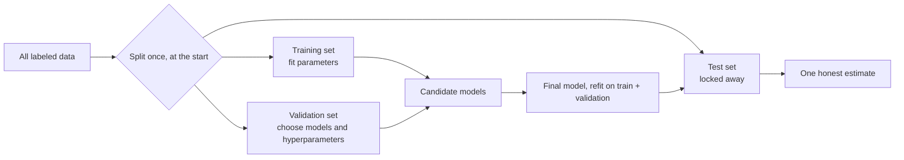
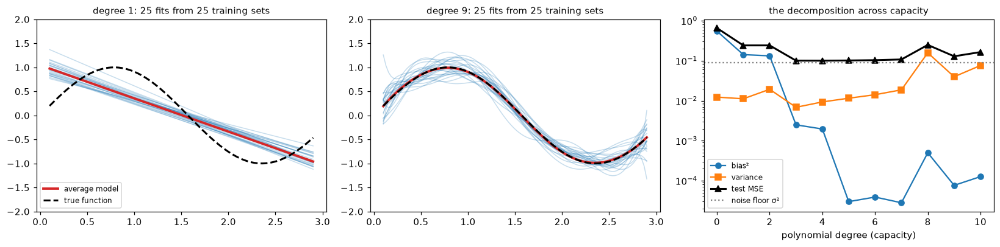
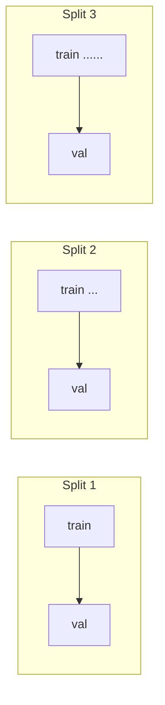

# Generalization and the Bias-Variance Trade-off

> **Level 3 · Chapter 4** · ⏱️ ~65 min read · Prerequisites: [Linear regression](02-linear-regression.md), [Logistic regression and classification](03-logistic-regression.md), [Statistics](../01-math-foundations/05-statistics.md) (estimators, bias, and variance)

A model is only useful if it works on data it hasn't seen. This chapter is about measuring and controlling that: underfitting and overfitting, the separate jobs of training, validation, and test sets, the bias-variance decomposition (derived, then demonstrated by simulation), model capacity, learning curves, k-fold, stratified, and time-series cross-validation, and the surprising modern twist called double descent.

## Why it matters

Wei's team was building a model to flag fraudulent insurance claims. They held out 20% of the data as a test set, as the textbooks say. Then they got to work: they tried six model families, a dozen feature sets, and a few hundred hyperparameter settings, and after each experiment they checked the test score. After three weeks, the best configuration scored an F1 of 0.81 on the test set. Management approved the launch based on that number.

In production, the model's F1 was 0.68. Nothing was broken. The data hadn't shifted. The model was just as good as it had always been; the 0.81 had never been real. By checking the test set after every experiment and keeping what scored best, the team had used it hundreds of times to make choices, and the winner had been selected partly for fitting the quirks of those particular 2,000 claims. The test set had quietly become a training set.

The fix is a discipline, not an algorithm: a validation set (or cross-validation) for making choices, and a test set that's touched once, at the end. To understand *why* that discipline works, and how to make good choices with the validation data, you need the ideas in this chapter.

## Concepts

### Underfitting and overfitting

[Chapter 1](01-what-is-machine-learning.md#generalization) showed that training error always falls as a model gets more flexible, while error on new data falls and then rises. The two failure modes have names.

**Underfitting** means the model is too simple to capture the real pattern. A straight line through a curved relationship. Training error is high, and error on new data is about as high. The model is wrong in a *systematic* way, and more data won't fix it.

**Overfitting** means the model has fit the noise in its particular training sample as if it were signal. A degree-15 polynomial through 20 points. Training error is low; error on new data is much higher. The model is wrong in an *erratic* way: train it on a different sample and you get a very different model.

| Symptom | Training error | Validation error | Diagnosis | Try |
|---|---|---|---|---|
| Both high, close together | high | high | underfitting (high bias) | more features, a more flexible model, less regularization |
| Low training, much higher validation | low | high | overfitting (high variance) | more data, a simpler model, more regularization, fewer features |
| Both low, close together | low | low | good fit | check the test set once, then ship |

"High" and "low" are relative to what's achievable. Compare against a baseline (predict the mean) and, if you can estimate it, the irreducible noise level or human-level performance.

### Training, validation, and test sets

Every time you make a choice based on a data set, that data set's score becomes optimistically biased for the chosen option: [Chapter 1](01-what-is-machine-learning.md#generalization) showed why. So you need a separate data set for each *kind* of use:

- The **training set** fits the parameters. Its error tells you about fit, not generalization.
- The **validation set** (or development set) compares choices: model families, features, hyperparameters, thresholds. Its error is optimistic for the chosen configuration, mildly if you compare a few options, badly if you compare hundreds.
- The **test set** estimates the performance of the *final*, chosen model. Use it once. If you go back and change the model after looking at it, it has become a validation set, and you need a new test set for an honest estimate.



Common proportions are 60/20/20 or 70/15/15 for moderate data sets, and much smaller validation and test fractions for very large ones (1% of ten million examples is plenty). What matters is that each set is large enough for its error estimate to be precise. Rules for a sound split:

- **Split before you look.** Exploration that informs feature choices should use the training set only.
- **Make each set represent the future.** Randomly shuffled splits assume examples are independent and identically distributed. If they aren't, the split must respect the structure: by time for forecasting, by customer or patient when one entity has many rows, by geography if the model will be used in new regions.
- **Deduplicate across splits.** Near-identical rows on both sides of a split (the same image resized, the same customer under two IDs) leak the answer.
- **Stratify for classification.** Keep the class proportions the same in each set, especially with rare classes.

### The bias-variance decomposition

Why does test error follow a U-shape as capacity grows? The **bias-variance decomposition** answers this exactly for squared loss. It connects to the [bias and variance of estimators](../01-math-foundations/05-statistics.md#estimators-bias-variance-and-mean-squared-error) from Statistics: a learned model is an estimator of the true function, and its error splits the same way.

**The setup.** Data come from $y = f(\mathbf{x}) + \varepsilon$, where $f$ is the true function and $\varepsilon$ is noise with $\mathbb{E}[\varepsilon] = 0$ and $\operatorname{Var}(\varepsilon) = \sigma^2$, independent of everything else. You draw a training set $\mathcal{D}$ of $n$ examples and train a model $\hat{f}_{\mathcal{D}}$. The training set is random, so the trained model is random too: a different sample gives a different model. Define the **average model** $\bar{f}(\mathbf{x}) = \mathbb{E}_{\mathcal{D}}[\hat{f}_{\mathcal{D}}(\mathbf{x})]$, the prediction you'd get by averaging over infinitely many training sets.

Fix a test input $\mathbf{x}$ and draw a new label $y = f(\mathbf{x}) + \varepsilon$ there. We want the expected squared error, averaged over both the training set and the new noise:

$$
\text{Err}(\mathbf{x}) = \mathbb{E}_{\mathcal{D}, \varepsilon}\left[\big(y - \hat{f}_{\mathcal{D}}(\mathbf{x})\big)^2\right].
$$

**The derivation.** Drop the argument $\mathbf{x}$ to keep the notation light, and write $\hat{f}$ for $\hat{f}_{\mathcal{D}}(\mathbf{x})$. Add and subtract $f$ and $\bar{f}$ inside the square:

$$
y - \hat{f} = \underbrace{(y - f)}_{\varepsilon} + \underbrace{(f - \bar{f})}_{\text{a constant}} + \underbrace{(\bar{f} - \hat{f})}_{\text{random, mean } 0}.
$$

Square the sum of three terms, $(a + b + c)^2 = a^2 + b^2 + c^2 + 2ab + 2ac + 2bc$, and take expectations term by term:

- $\mathbb{E}[\varepsilon^2] = \sigma^2$.
- $(f - \bar{f})^2$ is a constant, so its expectation is itself.
- $\mathbb{E}[(\bar{f} - \hat{f})^2] = \operatorname{Var}_{\mathcal{D}}(\hat{f})$, by the definition of variance, since $\bar{f} = \mathbb{E}[\hat{f}]$.
- $2\,\mathbb{E}[\varepsilon\,(f - \bar{f})] = 2(f - \bar{f})\,\mathbb{E}[\varepsilon] = 0$.
- $2\,\mathbb{E}[\varepsilon\,(\bar{f} - \hat{f})] = 2\,\mathbb{E}[\varepsilon]\,\mathbb{E}[\bar{f} - \hat{f}] = 0$, because the new noise is independent of the training set.
- $2\,(f - \bar{f})\,\mathbb{E}[\bar{f} - \hat{f}] = 0$, because $\mathbb{E}[\hat{f}] = \bar{f}$.

Every cross term vanishes, leaving

$$
\text{Err}(\mathbf{x}) = \underbrace{\sigma^2}_{\text{irreducible noise}} + \underbrace{\big(f(\mathbf{x}) - \bar{f}(\mathbf{x})\big)^2}_{\text{bias}^2} + \underbrace{\mathbb{E}_{\mathcal{D}}\Big[\big(\hat{f}_{\mathcal{D}}(\mathbf{x}) - \bar{f}(\mathbf{x})\big)^2\Big]}_{\text{variance}}.
$$

Average over the distribution of test inputs $\mathbf{x}$ and you get the expected test MSE. Each term has a clear meaning:

- **Irreducible error** $\sigma^2$: noise in the labels themselves. No model can beat it. It's the floor.
- **Bias** $f - \bar{f}$: how far the *average* model is from the truth. It measures systematic error from the hypothesis space being too restrictive (or the regularization too strong). A line fit to a sine curve has high bias no matter how much data you give it.
- **Variance**: how much the model jumps around from one training set to the next. It measures sensitivity to the particular sample. A degree-15 polynomial has high variance: change a few points and it swings wildly.

Increasing capacity typically lowers bias (the hypothesis space can get closer to the truth) and raises variance (more freedom to chase the sample's noise). Total error is their sum plus the floor, so it's U-shaped: the **bias-variance trade-off**. The best model sits at the bottom of the U, where a further drop in bias would cost more in variance.

Two remarks keep this honest. First, the decomposition is exact for squared loss; for 0-1 loss and log-loss, analogous decompositions exist but they're messier, and the intuition carries over. Second, "trade-off" describes a typical pattern, not a law: some changes, like more training data, reduce variance at no cost in bias, and the double descent section below shows a regime where adding capacity *lowers* variance.

### Demonstrating it by simulation

The decomposition talks about averages over training sets, which you never have in practice. In a simulation you do. The code below draws 500 independent training sets of 50 points from $y = \sin(2x) + \varepsilon$ with $\sigma = 0.3$, fits polynomials of each degree to each one, and measures bias² and variance directly on a grid of test inputs. It then checks that noise + bias² + variance equals the test MSE measured on fresh noisy labels.

```python
import numpy as np
import matplotlib.pyplot as plt

def f_true(x):
    return np.sin(2 * x)

rng = np.random.default_rng(0)
sigma, n, n_sims = 0.3, 50, 500
grid = np.linspace(0.1, 2.9, 100)
degrees = range(0, 11)

results, all_preds = [], {}
for deg in degrees:
    preds = np.empty((n_sims, len(grid)))
    for s in range(n_sims):
        x = rng.uniform(0, 3, n)
        y = f_true(x) + rng.normal(0, sigma, n)
        preds[s] = np.polynomial.Polynomial.fit(x, y, deg)(grid)
    all_preds[deg] = preds
    bias2 = np.mean((preds.mean(axis=0) - f_true(grid)) ** 2)
    var = np.mean(preds.var(axis=0))
    y_new = f_true(grid) + rng.normal(0, sigma, preds.shape)   # fresh test labels
    test_mse = np.mean((y_new - preds) ** 2)
    results.append((deg, bias2, var, test_mse))
    print(f"degree {deg:>2}: bias^2 = {bias2:.4f}  variance = {var:.4f}  "
          f"noise + bias^2 + var = {sigma**2 + bias2 + var:.4f}  measured test MSE = {test_mse:.4f}")
```

```text
degree  0: bias^2 = 0.5497  variance = 0.0123  noise + bias^2 + var = 0.6520  measured test MSE = 0.6569
degree  1: bias^2 = 0.1424  variance = 0.0112  noise + bias^2 + var = 0.2436  measured test MSE = 0.2419
degree  2: bias^2 = 0.1327  variance = 0.0193  noise + bias^2 + var = 0.2420  measured test MSE = 0.2420
degree  3: bias^2 = 0.0025  variance = 0.0069  noise + bias^2 + var = 0.0993  measured test MSE = 0.1006
degree  4: bias^2 = 0.0020  variance = 0.0093  noise + bias^2 + var = 0.1013  measured test MSE = 0.1003
degree  5: bias^2 = 0.0000  variance = 0.0116  noise + bias^2 + var = 0.1016  measured test MSE = 0.1016
degree  6: bias^2 = 0.0000  variance = 0.0142  noise + bias^2 + var = 0.1042  measured test MSE = 0.1035
degree  7: bias^2 = 0.0000  variance = 0.0187  noise + bias^2 + var = 0.1088  measured test MSE = 0.1077
degree  8: bias^2 = 0.0005  variance = 0.1580  noise + bias^2 + var = 0.2485  measured test MSE = 0.2490
degree  9: bias^2 = 0.0001  variance = 0.0398  noise + bias^2 + var = 0.1299  measured test MSE = 0.1293
degree 10: bias^2 = 0.0001  variance = 0.0761  noise + bias^2 + var = 0.1662  measured test MSE = 0.1647
```

The two right-hand columns agree to within about 0.005 at every degree, which is the Monte Carlo error of a 500-run simulation: the decomposition is exact, not an approximation. Read down the table. Bias² drops steeply from degree 0 to 3 (a sine needs curvature) and is essentially zero from degree 5 on. Variance grows with the degree, erratically at the high end (degree 8 has a spike from a few unlucky training sets with sparse points near the edges, where high-degree fits swing hardest). Test MSE bottoms out around degrees 3–5, close to the noise floor of $0.3^2 = 0.09$. Let's see it.

```python
fig, axes = plt.subplots(1, 3, figsize=(15, 3.8))
for ax, deg in zip(axes[:2], [1, 9]):
    for s in range(25):
        ax.plot(grid, all_preds[deg][s], color="tab:blue", alpha=0.25, lw=1)
    ax.plot(grid, all_preds[deg].mean(axis=0), color="tab:red", lw=2.5, label="average model")
    ax.plot(grid, f_true(grid), "k--", lw=2, label="true function")
    ax.set_ylim(-2, 2); ax.set_title(f"degree {deg}: 25 fits from 25 training sets", fontsize=10)
axes[0].legend(fontsize=8, loc="lower left")

r = np.array(results)
ax = axes[2]
ax.plot(r[:, 0], r[:, 1], "o-", label="bias²")
ax.plot(r[:, 0], r[:, 2], "s-", label="variance")
ax.plot(r[:, 0], r[:, 3], "k^-", lw=2, label="test MSE")
ax.axhline(sigma ** 2, color="gray", ls=":", label="noise floor σ²")
ax.set_yscale("log"); ax.set_xlabel("polynomial degree (capacity)")
ax.set_title("the decomposition across capacity", fontsize=10); ax.legend(fontsize=8)
plt.tight_layout()
plt.show()
```



*Left: lines are consistent with each other (low variance) but their average (red) is far from the truth (high bias). Middle: degree-9 fits are right on average (low bias) but each one wiggles differently (high variance). Right: test error is their sum plus the noise floor, so it's U-shaped.*

### Model capacity

**Capacity** is a model's ability to fit a wide variety of functions. The bias-variance picture says you want enough capacity to capture the signal and no more. But capacity isn't one knob. It's controlled by:

- **The hypothesis space**: polynomial degree, number of features, depth of a tree, number of layers and units in a network, $k$ in $k$-nearest neighbors (smaller $k$ means more capacity).
- **Regularization**: a penalty on large weights shrinks the effective size of the hypothesis space without changing its form. [Regularization](05-regularization.md) is the next chapter.
- **The optimization procedure**: stopping gradient descent early limits how far the weights can travel from their starting point, which also limits capacity.
- **The amount of data**: capacity is relative. A model with 100 parameters overfits 50 examples and is underpowered for 5 million.

For linear models, the number of parameters is a fair measure. Theory offers more refined measures, such as the **VC dimension** (the largest number of points a model class can label in every possible way; it's $d + 1$ for linear classifiers in $d$ dimensions) and the **effective degrees of freedom** of a regularized model. You don't need them to work in practice, but they explain why counting parameters can mislead: a heavily regularized model with a million parameters can have less effective capacity than an unregularized one with a thousand.

### Validation curves and learning curves

You can't simulate many training sets in real life, but two plots give you the same diagnosis from one data set.

A **validation curve** plots training and validation error against a capacity hyperparameter. The training curve falls steadily; the validation curve is U-shaped; the gap between them is the overfitting. Pick the hyperparameter at the bottom of the validation U. That's model selection.

A **learning curve** plots training and validation error against the *training set size*, for a fixed model. It tells you whether more data will help:

- **High bias**: both curves flatten out quickly at a similar, high error. The model can't use more data; the gap is small because the model doesn't have the capacity to overfit. More data won't help. More capacity will.
- **High variance**: training error is low, validation error is much higher, and the gap shrinks slowly as data grows. More data will help (variance falls roughly like $1/n$), as will regularization.

scikit-learn computes both with cross-validation: `validation_curve` and `learning_curve`.

```python
from sklearn.model_selection import KFold, validation_curve, learning_curve
from sklearn.pipeline import make_pipeline
from sklearn.preprocessing import PolynomialFeatures, StandardScaler
from sklearn.linear_model import LinearRegression

rng = np.random.default_rng(1)
x_all = rng.uniform(0, 3, 400)
y_all = f_true(x_all) + rng.normal(0, sigma, 400)
X_all = x_all.reshape(-1, 1)

def poly_model(deg):
    return make_pipeline(StandardScaler(), PolynomialFeatures(deg), LinearRegression())

cv = KFold(5, shuffle=True, random_state=0)
degs = np.arange(0, 16)
tr, va = validation_curve(poly_model(1), X_all[:60], y_all[:60], param_name="polynomialfeatures__degree",
                          param_range=degs, cv=cv, scoring="neg_mean_squared_error")
tr_mse, va_mse = -tr.mean(axis=1), -va.mean(axis=1)
best = degs[np.argmin(va_mse)]
print(f"validation curve on 60 points: best degree = {best}, CV MSE = {va_mse.min():.3f}")

fig, axes = plt.subplots(1, 2, figsize=(12, 3.9))
axes[0].plot(degs, tr_mse, "o-", label="training MSE")
axes[0].plot(degs, va_mse, "s-", label="validation MSE (5-fold CV)")
axes[0].axvline(best, color="gray", ls="--"); axes[0].axhline(sigma ** 2, color="gray", ls=":")
axes[0].set_yscale("log"); axes[0].set_xlabel("polynomial degree"); axes[0].legend(fontsize=8)
axes[0].set_title("validation curve: U-shaped validation error", fontsize=10)

sizes = np.array([15, 25, 40, 60, 100, 160, 250, 320])
for deg, style in [(1, "-"), (12, "--")]:
    ns, tr_l, va_l = learning_curve(poly_model(deg), X_all, y_all, train_sizes=sizes, cv=cv,
                                    scoring="neg_mean_squared_error", shuffle=True, random_state=0)
    axes[1].plot(ns, -tr_l.mean(axis=1), "o" + style, color="tab:blue", label=f"degree {deg}: training")
    axes[1].plot(ns, -va_l.mean(axis=1), "s" + style, color="tab:orange", label=f"degree {deg}: validation")
    print(f"degree {deg:>2}: validation MSE at n={ns[0]}: {-va_l.mean(axis=1)[0]:.3g}, at n={ns[-1]}: {-va_l.mean(axis=1)[-1]:.3f}")
axes[1].axhline(sigma ** 2, color="gray", ls=":")
axes[1].set_yscale("log"); axes[1].set_ylim(0.01, 10); axes[1].set_xlabel("training set size")
axes[1].set_title("learning curves: high bias (solid) vs high variance (dashed)", fontsize=10)
axes[1].legend(fontsize=7)
plt.tight_layout()
plt.show()
```

```text
validation curve on 60 points: best degree = 7, CV MSE = 0.123
degree  1: validation MSE at n=15: 0.288, at n=320: 0.262
degree 12: validation MSE at n=15: 357, at n=320: 0.102
```


*Left: the validation curve on 60 points. Right: for degree 1, both curves converge on a high plateau, so more data can't help; for degree 12, the gap is enormous with little data and closes as data grows.*

The degree-1 model's validation error barely moves from 15 to 320 examples: it's stuck at its bias. The degree-12 model is hopeless on 15 examples and nearly reaches the noise floor on 320. *Which model is better depends on how much data you have*, which is the practical meaning of the bias-variance trade-off.

### k-fold cross-validation

A single validation split has two problems: it wastes data (the validation examples never train the model), and its estimate is noisy (a different split gives a different number). **k-fold cross-validation** fixes both. Split the training data into $k$ equal **folds**. For each fold $j = 1, \dots, k$: train on the other $k - 1$ folds, evaluate on fold $j$. The CV estimate is the average of the $k$ scores:

$$
\text{CV}_k = \frac{1}{k}\sum_{j=1}^{k} \text{Err}_j.
$$

Every example is used for validation exactly once and for training $k - 1$ times. Some practical points:

- **Choosing $k$.** $k = 5$ or $10$ is standard. Each model trains on a fraction $(k-1)/k$ of the data, so CV estimates the performance of a model trained on slightly less data than you have, which makes it slightly pessimistic. Larger $k$ reduces that bias but costs more fits. **Leave-one-out** CV ($k = n$) is nearly unbiased but expensive and has high variance, because the $n$ models are almost identical.
- **The spread across folds** tells you how stable the estimate is, but the fold scores aren't independent (the training sets overlap), so $\text{std}/\sqrt{k}$ underestimates the true uncertainty. Treat it as a rough guide. **Repeated** k-fold (several shuffles) smooths out the luck of one particular split.
- **After CV, refit.** CV evaluates a *procedure* ("degree-5 polynomial fit by least squares"). Once you've chosen it, refit on all the training data, then evaluate on the test set once.
- **Everything goes inside the folds.** Scaling, imputation, feature selection, and target encoding must be fit within each training fold, or information leaks from the validation fold. A `Pipeline` passed to `cross_val_score` does this for you.
- **Tuning with CV is still selection.** The best CV score among many configurations is optimistic. The test set (or **nested cross-validation**, covered in [Hyperparameter tuning](../05-applied-ml/02-hyperparameter-tuning.md)) gives the honest estimate.

**Stratified k-fold** makes each fold's class proportions match the full data set's. With a 5% positive rate and 100 examples per fold, a plain random fold could easily have 2 or 9 positives, which makes the fold scores noisy and some metrics undefined. scikit-learn uses `StratifiedKFold` automatically when you pass a classifier and an integer `cv` to `cross_val_score`.

**Group k-fold** keeps all rows from one group (a patient, a customer, a store) in the same fold. If the model will be used on *new* patients, validation must be on patients it hasn't seen, or it gets credit for recognizing individuals. `GroupKFold` and `StratifiedGroupKFold` do this.

### Time-series splits

When data are ordered in time and the model will predict the future, random shuffling is a form of leakage. A shuffled fold puts Tuesday in validation and Monday and Wednesday in training, so the model **interpolates** between known neighbors, while in production it must **extrapolate** into an unknown future. Time series also have autocorrelation (today resembles yesterday), so a random split makes validation examples near-copies of training ones.

**Time-series cross-validation** respects the order: each split trains on everything up to a point and validates on the period right after it. With `TimeSeriesSplit`, the training window grows (an **expanding window**); you can also keep a fixed-length **sliding window**, and add a `gap` between training and validation to mimic the delay before a forecast is used. This is also called **walk-forward validation**, and you'll use it heavily in [Time series forecasting](../04-ml-algorithms/07-time-series.md).



The difference can be dramatic. Here's a $k$-nearest neighbors model predicting a trending, autocorrelated daily series from the day number alone.

```python
from sklearn.model_selection import TimeSeriesSplit, cross_val_score
from sklearn.neighbors import KNeighborsRegressor

rng = np.random.default_rng(0)
days = np.arange(600)
sales = 100 + 0.5 * days + 10 * np.sin(2 * np.pi * days / 7) + np.cumsum(rng.normal(0, 1.5, 600))
Xt = days.reshape(-1, 1)
knn = KNeighborsRegressor(n_neighbors=5)

shuffled = -cross_val_score(knn, Xt, sales, cv=KFold(5, shuffle=True, random_state=0), scoring="neg_mean_absolute_error")
forward = -cross_val_score(knn, Xt, sales, cv=TimeSeriesSplit(5), scoring="neg_mean_absolute_error")
print(f"shuffled 5-fold MAE:   {shuffled.mean():.1f}")
print(f"time-series split MAE: {forward.mean():.1f}  (per split: {np.round(forward, 1)})")
```

```text
shuffled 5-fold MAE:   7.6
time-series split MAE: 26.7  (per split: [24.6 17.5 21.6 36.6 33.4])
```

Shuffled CV says the model is good, because every validation day has training days on both sides. Walk-forward validation reveals errors about three and a half times larger in every split: a nearest-neighbor model on the day number just repeats the last days it saw and misses the trend. Only the second number describes what would happen in production.

### Double descent

The bias-variance U-curve is the classical story, and it's right for the models in this level. But it doesn't explain a fact of modern deep learning: networks with far more parameters than training examples, which can fit the training data perfectly, often generalize *better* as they grow.

The phenomenon is called **double descent**. As capacity grows, test error first follows the classical U. It peaks around the **interpolation threshold**, the point where the model has just enough parameters to fit the training data exactly (for linear models, when the number of parameters $p$ equals $n$). Beyond that point, in the **overparameterized** regime, test error descends a second time, sometimes below the best classical model.

Why the peak? At $p = n$ there's exactly one way to fit every training point, and it's usually a wild, high-norm solution (the matrix being inverted is nearly singular, so its smallest eigenvalues blow the solution up). Why the second descent? With $p > n$, infinitely many parameter vectors fit the data perfectly, and the algorithm picks one with a particular property. Least squares solved with the pseudo-inverse, and gradient descent started from zero, both pick the **minimum-norm** interpolating solution. As $p$ grows, the minimum-norm solution gets smoother and more stable: the extra parameters let the model spread the fit across many directions instead of concentrating it in a few large weights. This preference for small-norm solutions is a form of **implicit regularization**.

You can reproduce it with linear regression on random features: map 5-dimensional inputs through $p$ random ReLU units, $\phi_j(\mathbf{x}) = \max(0, \mathbf{a}_j^\top\mathbf{x} + c_j)$ with random $\mathbf{a}_j, c_j$, and fit the minimum-norm least squares solution on $n = 40$ training points.

```python
def double_descent_error(p, seed, n_train=40, d=5):
    r = np.random.default_rng(seed)
    w_t = r.normal(size=d) / np.sqrt(d)
    target = lambda X: X @ w_t + 0.5 * np.sin(2 * X[:, 0])
    X_tr, X_te = r.normal(size=(n_train, d)), r.normal(size=(1000, d))
    y_tr = target(X_tr) + r.normal(0, 0.2, n_train)
    A, c = r.normal(size=(d, p)) / np.sqrt(d), r.normal(size=p)
    phi = lambda X: np.maximum(0, X @ A + c)         # p random ReLU features
    theta = np.linalg.pinv(phi(X_tr)) @ y_tr         # minimum-norm least squares
    return np.mean((phi(X_te) @ theta - target(X_te)) ** 2)

for p in [5, 10, 20, 30, 38, 40, 42, 50, 80, 200, 1000]:
    errs = [double_descent_error(p, s) for s in range(50)]
    print(f"p = {p:>4} features (n = 40): median test MSE = {np.median(errs):.3f}")
```

```text
p =    5 features (n = 40): median test MSE = 0.726
p =   10 features (n = 40): median test MSE = 0.424
p =   20 features (n = 40): median test MSE = 0.464
p =   30 features (n = 40): median test MSE = 0.947
p =   38 features (n = 40): median test MSE = 4.052
p =   40 features (n = 40): median test MSE = 5.593
p =   42 features (n = 40): median test MSE = 9.172
p =   50 features (n = 40): median test MSE = 2.086
p =   80 features (n = 40): median test MSE = 0.542
p =  200 features (n = 40): median test MSE = 0.281
p = 1000 features (n = 40): median test MSE = 0.220
```

The median test error falls, then rises to a sharp peak around $p = n = 40$, then falls again, and with hundreds of features it ends up *lower* than the best model with fewer features than examples. (The median is used because near $p = n$ a few runs produce astronomically large errors.)

Keep it in perspective. Double descent is real and well documented, but the peak largely disappears with properly tuned explicit regularization, and for the classical models in Levels 3–5 (with regularization and cross-validation), the U-shaped picture and its practical advice still hold. What double descent changes is the slogan "more parameters than data means overfitting." It's an active research area; treat the explanations as current understanding rather than settled theory.

## In practice

### A complete model-selection workflow

Here's the discipline from the story, end to end: split off a test set, choose a hyperparameter with cross-validation on the training set only, refit, and evaluate on the test set once.

```python
from sklearn.model_selection import train_test_split

rng = np.random.default_rng(42)
x = rng.uniform(0, 3, 300)
y = f_true(x) + rng.normal(0, sigma, 300)
X_tr, X_te, y_tr, y_te = train_test_split(x.reshape(-1, 1), y, test_size=0.25, random_state=0)

cv = KFold(5, shuffle=True, random_state=0)
cv_mse = {}
for deg in range(1, 13):
    scores = cross_val_score(poly_model(deg), X_tr, y_tr, cv=cv, scoring="neg_mean_squared_error")
    cv_mse[deg] = (-scores.mean(), scores.std())
best = min(cv_mse, key=lambda d: cv_mse[d][0])
for deg in [1, 3, best, 12]:
    print(f"degree {deg:>2}: CV MSE = {cv_mse[deg][0]:.4f} (fold std {cv_mse[deg][1]:.4f})")

final = poly_model(best).fit(X_tr, y_tr)               # refit on all training data
test_mse = np.mean((final.predict(X_te) - y_te) ** 2)  # touch the test set once
print(f"chosen degree = {best}, test MSE = {test_mse:.4f}")
```

```text
degree  1: CV MSE = 0.2647 (fold std 0.0654)
degree  3: CV MSE = 0.1001 (fold std 0.0038)
degree  9: CV MSE = 0.0982 (fold std 0.0091)
degree 12: CV MSE = 0.1054 (fold std 0.0105)
chosen degree = 9, test MSE = 0.0951
```

Notice how close several of the middle degrees are. When CV scores differ by less than their fold-to-fold spread, the differences are mostly noise. A common convention, the **one-standard-error rule**, picks the simplest model whose CV score is within one standard error of the best. Here degree 3 (CV MSE 0.1001) is within one standard error of the winner, degree 9 (0.0982, with a standard error of about $0.0091/\sqrt{5} \approx 0.004$), so the rule would pick the much simpler degree 3. It's a rule of thumb, not a theorem, but it guards against chasing noise.

!!! warning "Common mistake: tuning on the test set"
    Every look at the test set that changes what you do turns it into a validation set. If you've done that, the test score is optimistic, and you need fresh data for an honest estimate. Keep the test set locked until the end, and decide in advance what you'll do with its result.

!!! warning "Common mistake: shuffled cross-validation on grouped or time-ordered data"
    If one patient contributes many rows, or the data are a time series, plain `KFold(shuffle=True)` leaks information between folds and makes models look far better than they are. Use `GroupKFold` for groups and `TimeSeriesSplit` for time. Ask: "Will the model in production see entities and periods it was trained on?" Your validation should match the answer.

## Exercises

### Exercise 1: Read the diagnosis (easy)

For each scenario, say whether the model is underfitting, overfitting, or fine, and name one thing to try. The noise floor (best achievable MSE) is about 1.0 in each.

1. Training MSE 4.1, validation MSE 4.3.
2. Training MSE 0.2, validation MSE 3.8.
3. Training MSE 1.0, validation MSE 1.1.
4. A learning curve where the validation MSE is still falling steeply at the largest training size, with a big gap to the training MSE.

??? success "Solution"

    1. Underfitting (high bias): both errors are high and close. Add features or capacity, or reduce regularization.
    2. Overfitting (high variance): a large gap, and training error below the noise floor (it's fitting noise). Regularize, simplify, or get more data.
    3. Fine: both near the noise floor. Evaluate on the test set and move on.
    4. High variance, and more data would help: the validation error hasn't plateaued. If you can't get more data, regularize.

### Exercise 2: Bias and variance of a shrunken mean (medium)

You estimate a mean $\mu$ from $n$ i.i.d. observations with variance $\sigma^2$, using the **shrunken** estimator $\hat{\mu}_c = c\,\bar{y}$ for a constant $0 \leq c \leq 1$. (a) Derive its bias, variance, and MSE. (b) Find the $c$ that minimizes the MSE. (c) Check by simulation with $\mu = 1$, $\sigma = 3$, $n = 10$. (d) What does this say about unbiased estimators?

??? success "Solution"

    (a) $\mathbb{E}[c\bar{y}] = c\mu$, so the bias is $(c - 1)\mu$. $\operatorname{Var}(c\bar{y}) = c^2\sigma^2/n$. So $\text{MSE}(c) = (1 - c)^2\mu^2 + c^2\sigma^2/n$.

    (b) $\frac{d}{dc}\text{MSE} = -2(1 - c)\mu^2 + 2c\sigma^2/n = 0$ gives $c^* = \frac{\mu^2}{\mu^2 + \sigma^2/n}$. With $\mu = 1$, $\sigma^2/n = 0.9$: $c^* = 1/1.9 \approx 0.526$.

    ```python
    rng = np.random.default_rng(0)
    mu, s, n_obs = 1.0, 3.0, 10
    ybar = rng.normal(mu, s, size=(200_000, n_obs)).mean(axis=1)
    for c in [1.0, 0.8, 0.526, 0.3]:
        est = c * ybar
        print(f"c = {c:5.3f}: bias^2 = {(est.mean() - mu) ** 2:.3f}, var = {est.var():.3f}, MSE = {np.mean((est - mu) ** 2):.3f}"
              f"  (theory {(1 - c) ** 2 * mu ** 2 + c ** 2 * s ** 2 / n_obs:.3f})")
    ```

    ```text
    c = 1.000: bias^2 = 0.000, var = 0.899, MSE = 0.899  (theory 0.900)
    c = 0.800: bias^2 = 0.039, var = 0.575, MSE = 0.614  (theory 0.616)
    c = 0.526: bias^2 = 0.223, var = 0.249, MSE = 0.472  (theory 0.474)
    c = 0.300: bias^2 = 0.489, var = 0.081, MSE = 0.570  (theory 0.571)
    ```

    (d) The unbiased estimator ($c = 1$) has the *highest* MSE of these. Accepting a little bias buys a large drop in variance. This is exactly what regularization does to model weights, in the [next chapter](05-regularization.md). Note that $c^*$ depends on the unknown $\mu$; in practice you pick the amount of shrinkage with data, via cross-validation.

### Exercise 3: Bias and variance of k-nearest neighbors (medium)

$k$-NN regression predicts the average label of the $k$ closest training points. Using the bias-variance simulation from this chapter (500 training sets of 50 points from $\sin(2x)$ with $\sigma = 0.3$), measure bias², variance, and test MSE for $k \in \{1, 3, 10, 25, 50\}$. Which end is high-capacity? What happens at $k = 50$?

??? success "Solution"

    ```python
    from sklearn.neighbors import KNeighborsRegressor
    rng = np.random.default_rng(0)
    for k in [1, 3, 10, 25, 50]:
        preds = np.empty((500, len(grid)))
        for s in range(500):
            x = rng.uniform(0, 3, 50); y = f_true(x) + rng.normal(0, sigma, 50)
            preds[s] = KNeighborsRegressor(k).fit(x.reshape(-1, 1), y).predict(grid.reshape(-1, 1))
        b2 = np.mean((preds.mean(0) - f_true(grid)) ** 2); v = np.mean(preds.var(0))
        print(f"k = {k:>2}: bias^2 = {b2:.4f}, variance = {v:.4f}, expected test MSE = {sigma**2 + b2 + v:.4f}")
    ```

    ```text
    k =  1: bias^2 = 0.0002, variance = 0.0950, expected test MSE = 0.1852
    k =  3: bias^2 = 0.0001, variance = 0.0335, expected test MSE = 0.1236
    k = 10: bias^2 = 0.0074, variance = 0.0164, expected test MSE = 0.1139
    k = 25: bias^2 = 0.0641, variance = 0.0198, expected test MSE = 0.1739
    k = 50: bias^2 = 0.5497, variance = 0.0129, expected test MSE = 0.6527
    ```

    Small $k$ is high capacity: with $k = 1$ the bias is tiny but the variance is about $\sigma^2$, since each prediction is a single noisy label. Larger $k$ averages more labels (variance falls roughly like $\sigma^2/k$) but reaches farther away, where the function differs (bias grows). At $k = 50$, every prediction is the average of the whole training set: a constant, with the same high bias as a degree-0 polynomial. The best $k$ is in the middle.

### Exercise 4: Why stratify? (easy)

Make a label vector with 1,000 examples and a 3% positive rate. Split it with plain `KFold(10, shuffle=True)` and with `StratifiedKFold(10, shuffle=True)`, and print the number of positives in each validation fold. What would go wrong when computing recall on the plain folds?

??? success "Solution"

    ```python
    from sklearn.model_selection import StratifiedKFold
    rng = np.random.default_rng(1)
    yl = (rng.random(1000) < 0.03).astype(int)
    Xl = np.zeros((1000, 1))
    for name, splitter in [("KFold", KFold(10, shuffle=True, random_state=0)),
                           ("StratifiedKFold", StratifiedKFold(10, shuffle=True, random_state=0))]:
        print(f"{name:>15}:", [int(yl[va].sum()) for _, va in splitter.split(Xl, yl)])
    ```

    ```text
              KFold: [2, 3, 3, 1, 1, 2, 2, 4, 3, 4]
    StratifiedKFold: [2, 2, 2, 2, 2, 3, 3, 3, 3, 3]
    ```

    With plain folds the positive counts vary a lot, and a fold can end up with very few positives. Recall on a fold with 1 positive can only be 0 or 1, and with 0 positives it's undefined. Stratified folds keep the counts nearly equal, so each fold's score is comparable and the average is less noisy.

### Exercise 5: Group leakage (hard)

Simulate 100 patients with 10 measurements each. Each patient has a random "baseline" that shifts all their features and determines their label, plus per-measurement noise; the features carry *no* information beyond the patient's identity. (a) Run 5-fold `cross_val_score` with a 1-nearest-neighbor classifier using plain shuffled `KFold`, and (b) using `GroupKFold` by patient. Before running it, predict which score will be near 50%. Explain what the first number actually measures.

??? success "Solution"

    ```python
    from sklearn.model_selection import GroupKFold
    from sklearn.neighbors import KNeighborsClassifier
    rng = np.random.default_rng(0)
    n_pat, per = 100, 10
    patient = np.repeat(np.arange(n_pat), per)
    baseline = rng.normal(0, 3, size=(n_pat, 5))
    label = rng.integers(0, 2, n_pat)                      # unrelated to the baseline
    Xg = baseline[patient] + rng.normal(0, 0.5, size=(n_pat * per, 5))
    yg = label[patient]
    knn = KNeighborsClassifier(1)
    plain = cross_val_score(knn, Xg, yg, cv=KFold(5, shuffle=True, random_state=0))
    grouped = cross_val_score(knn, Xg, yg, cv=GroupKFold(5), groups=patient)
    print(f"shuffled KFold: {plain.mean():.3f}   GroupKFold: {grouped.mean():.3f}")
    ```

    ```text
    shuffled KFold: 0.995   GroupKFold: 0.504
    ```

    The labels are random per patient, so no model can predict them for a *new* patient: the honest accuracy is 50%, which `GroupKFold` reports. Shuffled folds put some of each patient's measurements in training and others in validation. The nearest neighbor of a validation measurement is another measurement of the same patient, whose label is the same, so the model scores nearly perfectly by *recognizing patients*. That number measures re-identification, not diagnosis.

### Exercise 6: How noisy is a CV score? (hard)

Using the breast cancer data and a scaled logistic regression pipeline, compute the 10-fold CV accuracy under 50 different shuffles (`KFold(10, shuffle=True, random_state=r)`). Report the spread of the 50 CV estimates. Then compare the average within-run standard error, $\text{std}/\sqrt{10}$. What does this tell you about declaring one model better than another based on a 0.5-point CV difference?

??? success "Solution"

    ```python
    from sklearn.datasets import load_breast_cancer
    from sklearn.linear_model import LogisticRegression
    Xb_, yb_ = load_breast_cancer(return_X_y=True)
    pipe = make_pipeline(StandardScaler(), LogisticRegression(max_iter=1000))
    means, ses = [], []
    for r in range(50):
        sc = cross_val_score(pipe, Xb_, yb_, cv=KFold(10, shuffle=True, random_state=r))
        means.append(sc.mean()); ses.append(sc.std() / np.sqrt(10))
    print(f"CV accuracy across shuffles: mean {np.mean(means):.4f}, min {np.min(means):.4f}, max {np.max(means):.4f}, std {np.std(means):.4f}")
    print(f"average within-run std/sqrt(k): {np.mean(ses):.4f}")
    ```

    ```text
    CV accuracy across shuffles: mean 0.9779, min 0.9718, max 0.9825, std 0.0029
    average within-run std/sqrt(k): 0.0061
    ```

    The CV estimate moves over a range of about one point (a standard deviation of about 0.3 points) just from how the data were shuffled. The within-run standard error, about 0.6 points, is larger because it reflects how much accuracy varies from fold to fold. Neither captures all the uncertainty: both treat these 569 tumors as fixed, while a new sample of tumors would give different numbers again. Either way, a 0.5-point difference between two models is within the noise. To compare models fairly, use the *same* folds for both (a paired comparison), repeat CV with several shuffles, and look at the distribution of per-fold differences, not just the means.

## Check yourself

1. What are the separate jobs of the training, validation, and test sets? What happens to the test set if you use it to choose between models?

    ??? note "Answer"

        Training fits parameters; validation compares and chooses models and hyperparameters; test estimates the final model's performance once. If you use the test set to choose, its score becomes optimistically biased for the chosen model, just like a validation score, and you no longer have an honest estimate.

2. Write the bias-variance decomposition and define each term.

    ??? note "Answer"

        $\mathbb{E}[(y - \hat{f}(\mathbf{x}))^2] = \sigma^2 + (f(\mathbf{x}) - \bar{f}(\mathbf{x}))^2 + \mathbb{E}[(\hat{f}(\mathbf{x}) - \bar{f}(\mathbf{x}))^2]$: irreducible noise, squared bias (how far the average model is from the truth), and variance (how much the model changes across training sets).

3. In the derivation, why do the cross terms vanish?

    ??? note "Answer"

        The test noise $\varepsilon$ has mean zero and is independent of the training set, so terms with one factor of $\varepsilon$ vanish; and $\hat{f} - \bar{f}$ has mean zero by the definition of $\bar{f}$, so the term pairing it with the constant $f - \bar{f}$ vanishes.

4. A learning curve shows training and validation errors meeting at a high value early on. Will more data help? What will?

    ??? note "Answer"

        No: that's high bias, and the model is already using all it can from the data. More capacity will help: more or better features, a more flexible model, or less regularization.

5. Why is `StratifiedKFold` the default for classifiers, and when do you need `GroupKFold` instead?

    ??? note "Answer"

        Stratification keeps class proportions equal across folds, which stabilizes per-fold scores, especially with rare classes. Use `GroupKFold` when several rows belong to the same entity (patient, customer) and the model will be used on new entities, so that no entity appears in both training and validation.

6. Why is shuffled k-fold wrong for forecasting, and what do you use instead?

    ??? note "Answer"

        It lets the model train on the future and validate on the past, and puts near-duplicate neighboring time points on both sides of the split, so it measures interpolation rather than forecasting. Use time-ordered splits (`TimeSeriesSplit`, walk-forward validation), possibly with a gap.

7. What is double descent, and where does the peak occur?

    ??? note "Answer"

        Test error follows the classical U-curve as capacity grows, peaks near the interpolation threshold (where the model can just barely fit the training data exactly, $p \approx n$ for linear models), then falls again in the overparameterized regime, because the minimum-norm interpolating solution becomes smoother as capacity grows.

8. Two models' 5-fold CV accuracies are 0.912 and 0.917. What would you check before choosing the second?

    ??? note "Answer"

        Whether the difference exceeds the noise: compare per-fold scores on the same folds (paired), repeat CV with different shuffles, and consider the one-standard-error rule. Also check that preprocessing was inside the folds and that the folds respect any group or time structure.

## Key takeaways

- Underfitting is high bias (both errors high); overfitting is high variance (a large train-validation gap). Diagnose by comparing training error, validation error, and the noise floor.
- Use the training set to fit, the validation set (or CV) to choose, and the test set once to report. Every choice made on a data set makes its score optimistic.
- Expected squared error = noise + bias² + variance, exactly. Capacity usually trades bias for variance, giving a U-shaped validation curve.
- Learning curves tell you whether more data will help (high variance) or not (high bias).
- k-fold CV uses all the data for both training and validation; stratify for classification, group by entity, split by time for forecasting, and keep all preprocessing inside the folds.
- Double descent shows that heavily overparameterized models can generalize well thanks to implicit regularization, but the classical picture remains the right guide for tuned classical models.

## Further reading

- *An Introduction to Statistical Learning*, chapters 2 and 5, for the bias-variance trade-off and cross-validation (free online).
- *The Elements of Statistical Learning*, chapter 7, "Model Assessment and Selection" (free online).
- "Reconciling modern machine-learning practice and the classical bias–variance trade-off" by Belkin, Hsu, Ma, and Mandal (*PNAS*, 2019), the paper that named double descent.
- The scikit-learn user guide, "Cross-validation: evaluating estimator performance" and "Validation curves: plotting scores to evaluate models."

## Next

Now that you can see overfitting, learn the main tool for controlling it: [Regularization](05-regularization.md).
