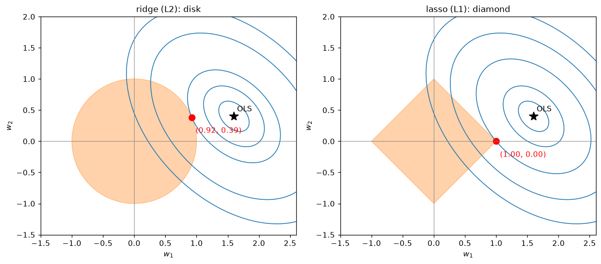
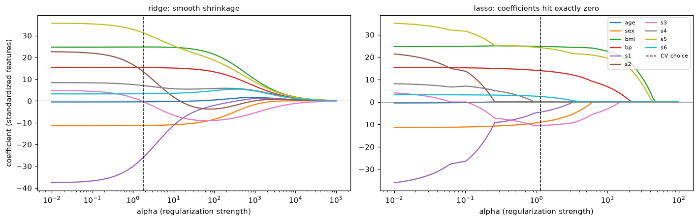

# Regularization

> **Level 3 · Chapter 5** · ⏱️ ~65 min read · Prerequisites: [Linear regression](02-linear-regression.md), [Logistic regression and classification](03-logistic-regression.md), [Generalization and the bias-variance trade-off](04-generalization-bias-variance.md), [Information theory and optimization](../01-math-foundations/06-information-theory-and-optimization.md) (constrained optimization)

Regularization means deliberately constraining a model so it can't fit noise. This chapter derives ridge regression's closed form and shows how it shrinks, explains why the lasso sets coefficients exactly to zero (algebraically, with soft-thresholding, and geometrically, with corners), covers the elastic net, shows that both penalties are Bayesian priors in disguise, connects early stopping to ridge, and shows how to choose the penalty strength.

## Why it matters

Priya's team built a lead-scoring model for a sales team: will this lead buy within 90 days? They had 1,800 past leads and a lot of features, including word counts from the lead's free-text inquiry, which brought the total to about 3,000 columns. A plain logistic regression fit the training leads perfectly. On new leads it was barely better than a coin flip. Worse, when the sales director asked which words mattered, the answer changed completely every time the model was retrained on a slightly different month of data. "Pricing" was strongly positive one week and strongly negative the next.

The problem was variance. With more features than examples, there were countless coefficient vectors that fit the training data perfectly, and the solver picked a wild one. Two changes fixed it. Adding an L2 penalty (ridge) made the model stable and its accuracy respectable. Switching to an L1 penalty (lasso) did something even more useful for the sales team: it set all but 45 coefficients exactly to zero, giving them a short list of signals they could read, question, and act on.

Regularization is how you trade a little bias for a lot less variance, as the previous chapter promised was possible. It's in nearly every model you'll train, including scikit-learn's default logistic regression and every modern neural network.

## Concepts

### Why constrain a model?

The [bias-variance decomposition](04-generalization-bias-variance.md#the-bias-variance-decomposition) says test error is noise plus bias² plus variance. Least squares is unbiased (when the model is correctly specified), but [Exercise 2 of the previous chapter](04-generalization-bias-variance.md#exercise-2-bias-and-variance-of-a-shrunken-mean-medium) showed that shrinking an unbiased estimator toward zero can lower its MSE. Regularization applies that idea to model weights.

Large weights are a symptom of overfitting. A degree-15 polynomial that threads 20 noisy points has enormous, alternating coefficients that cancel each other to hit each point. A logistic regression on separable data drives its weights to infinity. Correlated features let a model put $+1000$ on one and $-999$ on its near-copy. In each case, penalizing the size of the weights rules out the wild solutions without changing the hypothesis space.

A **regularized** objective adds a **penalty** $\Omega(\mathbf{w})$ to the training loss:

$$
\min_{\mathbf{w}, b} \;\; \mathcal{L}(\mathbf{w}, b) + \lambda\,\Omega(\mathbf{w}).
$$

The **regularization strength** $\lambda \geq 0$ is a hyperparameter. At $\lambda = 0$ you get the unregularized fit; as $\lambda \to \infty$, the weights are forced to zero and the model predicts a constant. Somewhere between is the best bias-variance balance, found by cross-validation. Three conventions hold almost everywhere:

- **The intercept isn't penalized.** Penalizing $b$ would make the predictions depend on where you put the origin of $y$. Shrinking toward "predict the mean" is the goal, not shrinking toward "predict zero."
- **Features must be on comparable scales.** The penalty treats all weights alike, so a feature measured in large units (income in dollars) gets a tiny, barely penalized weight, and a feature in small units gets penalized hard. **Standardize** features first, inside a pipeline.
- **The penalty is on the weights, not the data.** Regularization changes which model is chosen, not the features.

There's an equivalent **constrained** form: minimize the loss subject to $\Omega(\mathbf{w}) \leq t$ for a budget $t$. By the theory of [Lagrange multipliers](../01-math-foundations/06-information-theory-and-optimization.md#constrained-optimization-and-lagrange-multipliers), every $\lambda$ corresponds to some budget $t$ and vice versa: a larger $\lambda$ means a smaller $t$. The penalized form is easier to optimize; the constrained form is easier to picture, as you'll see in the geometric view.

### L2 regularization: ridge regression

**Ridge regression** is least squares with a squared L2 penalty. Assume for now that the features and the target are **centered** (each column of $\mathbf{X}$ and $\mathbf{y}$ has mean zero), so there's no intercept to worry about; we'll restore it in a moment. The objective is

$$
J(\mathbf{w}) = \lVert \mathbf{y} - \mathbf{X}\mathbf{w} \rVert^2 + \lambda\lVert \mathbf{w} \rVert^2.
$$

**The closed form.** Take the gradient with the same identities used for the [normal equation](02-linear-regression.md#the-normal-equation), plus $\nabla_{\mathbf{w}}\lVert\mathbf{w}\rVert^2 = 2\mathbf{w}$:

$$
\nabla_{\mathbf{w}} J = -2\mathbf{X}^\top(\mathbf{y} - \mathbf{X}\mathbf{w}) + 2\lambda\mathbf{w} = \mathbf{0} \quad\Longrightarrow\quad (\mathbf{X}^\top\mathbf{X} + \lambda\mathbf{I})\,\mathbf{w} = \mathbf{X}^\top\mathbf{y},
$$

$$
\hat{\mathbf{w}}_{\text{ridge}} = (\mathbf{X}^\top\mathbf{X} + \lambda\mathbf{I})^{-1}\mathbf{X}^\top\mathbf{y}.
$$

It's the normal equation with $\lambda$ added to the diagonal: the "ridge" the method is named for. That small change has a big consequence. $\mathbf{X}^\top\mathbf{X}$ is positive semi-definite, so its eigenvalues are $\geq 0$, and possibly exactly 0 when features are collinear or $d > n$. Adding $\lambda\mathbf{I}$ adds $\lambda$ to every eigenvalue, so for any $\lambda > 0$ all eigenvalues are at least $\lambda$. The matrix is always invertible, the solution is always unique, and the condition number drops from $s_{\max}/s_{\min}$ to $(s_{\max} + \lambda)/(s_{\min} + \lambda)$. Ridge was originally invented (by Hoerl and Kennard in 1970) for exactly this: stabilizing regressions with nearly collinear features.

**The intercept.** With uncentered data, fit ridge on centered data and recover the intercept as $\hat{b} = \bar{y} - \bar{\mathbf{x}}^\top\hat{\mathbf{w}}$. This is equivalent to minimizing $\lVert\mathbf{y} - \mathbf{X}\mathbf{w} - b\mathbf{1}\rVert^2 + \lambda\lVert\mathbf{w}\rVert^2$, which doesn't penalize $b$. Setting the derivative with respect to $b$ to zero gives exactly that formula for $\hat{b}$.

**How ridge shrinks: the SVD view.** Write the [singular value decomposition](../01-math-foundations/02-matrix-decompositions.md) $\mathbf{X} = \mathbf{U}\mathbf{D}\mathbf{V}^\top$, with singular values $d_1 \geq d_2 \geq \dots \geq 0$, orthonormal columns $\mathbf{u}_j$ of $\mathbf{U}$, and $\mathbf{V}$ orthogonal. Then $\mathbf{X}^\top\mathbf{X} + \lambda\mathbf{I} = \mathbf{V}(\mathbf{D}^2 + \lambda\mathbf{I})\mathbf{V}^\top$, and the ridge predictions on the training data are

$$
\mathbf{X}\hat{\mathbf{w}}_{\text{ridge}} = \mathbf{U}\mathbf{D}(\mathbf{D}^2 + \lambda\mathbf{I})^{-1}\mathbf{D}\mathbf{U}^\top\mathbf{y} = \sum_{j} \mathbf{u}_j\,\frac{d_j^2}{d_j^2 + \lambda}\,\mathbf{u}_j^\top\mathbf{y}.
$$

Ordinary least squares projects $\mathbf{y}$ onto each direction $\mathbf{u}_j$ and keeps it fully (the factor is 1). Ridge multiplies each projection by a **shrinkage factor** $\frac{d_j^2}{d_j^2 + \lambda}$, which is close to 1 for directions with large singular values (directions in which the data vary a lot and the coefficient is well determined) and close to 0 for directions with small singular values (directions with little spread, where the coefficient is mostly fitting noise). Ridge shrinks most where the data say least. These directions are the principal components of the data, which you'll meet again in [Dimensionality reduction](../04-ml-algorithms/06-dimensionality-reduction.md).

The sum of the shrinkage factors, $\text{df}(\lambda) = \sum_j \frac{d_j^2}{d_j^2 + \lambda}$, is the **effective degrees of freedom**: it equals the number of features $d$ at $\lambda = 0$ and falls toward 0 as $\lambda$ grows. It's a continuous version of "number of parameters," and it's the right measure of a ridge model's capacity.

Ridge shrinks every coefficient toward zero, but it (almost) never makes one exactly zero. All features stay in the model. If you need a model that uses fewer features, you need a different penalty.

### L1 regularization: the lasso and sparsity

The **lasso** (least absolute shrinkage and selection operator, Tibshirani 1996) uses the L1 norm, $\lVert\mathbf{w}\rVert_1 = \sum_j \lvert w_j\rvert$. In scikit-learn's scaling:

$$
J(\mathbf{w}) = \frac{1}{2n}\lVert \mathbf{y} - \mathbf{X}\mathbf{w} \rVert^2 + \lambda\lVert \mathbf{w} \rVert_1.
$$

The absolute value has a kink at zero, so there's no closed form in general. But one special case shows exactly what the kink does. Suppose the features are standardized and uncorrelated, so $\frac{1}{n}\mathbf{X}^\top\mathbf{X} = \mathbf{I}$. Expanding the squared error, $\frac{1}{2n}\lVert\mathbf{y} - \mathbf{X}\mathbf{w}\rVert^2 = \frac{1}{2n}\lVert\mathbf{y}\rVert^2 - \mathbf{w}^\top\mathbf{z} + \frac{1}{2}\lVert\mathbf{w}\rVert^2$, where $\mathbf{z} = \frac{1}{n}\mathbf{X}^\top\mathbf{y}$ is the least squares solution in this case. Completing the square, the objective **separates** into one independent problem per coordinate:

$$
J(\mathbf{w}) = \text{const} + \sum_{j}\left[\frac{1}{2}(w_j - z_j)^2 + \lambda\lvert w_j\rvert\right].
$$

Minimize $g(w) = \frac{1}{2}(w - z)^2 + \lambda\lvert w\rvert$ for one coordinate. Consider three cases:

- If the minimizer is $w > 0$, then $g'(w) = w - z + \lambda = 0$ gives $w = z - \lambda$, which is consistent (positive) only when $z > \lambda$.
- If the minimizer is $w < 0$, then $g'(w) = w - z - \lambda = 0$ gives $w = z + \lambda$, consistent only when $z < -\lambda$.
- Otherwise ($\lvert z\rvert \leq \lambda$), neither side works, and the minimum is at the kink, $w = 0$. (Formally: 0 is in the **subgradient** $\{-z + \lambda s : s \in [-1, 1]\}$ exactly when $\lvert z\rvert \leq \lambda$.)

Together, these give the **soft-thresholding** operator:

$$
\hat{w}_j = S_\lambda(z_j) = \operatorname{sign}(z_j)\,\max\big(\lvert z_j\rvert - \lambda,\; 0\big).
$$

Compare ridge in the same setting: minimizing $\frac{1}{2}(w - z)^2 + \frac{\lambda}{2}w^2$ gives $\hat{w}_j = \frac{z_j}{1 + \lambda}$, a proportional shrink that never reaches zero. The lasso instead subtracts a fixed amount $\lambda$ from every coefficient's magnitude and sets any coefficient smaller than $\lambda$ to *exactly zero*. That's **sparsity**: the lasso performs **feature selection** automatically.

Why does the absolute value do this and the square doesn't? Near zero, the square's slope is $\lambda w$, which vanishes, so the penalty offers almost no resistance to small nonzero weights. The absolute value's slope is $\pm\lambda$ no matter how small $w$ gets: there's a constant cost for being nonzero at all, and a weight only escapes zero if the data push harder than $\lambda$.

**Coordinate descent.** For general (correlated) features, the lasso is solved by **coordinate descent**: cycle through the coordinates, minimizing over one $w_j$ at a time with the others fixed. Each one-dimensional problem is a soft-threshold. Let $\mathbf{r}^{(j)} = \mathbf{y} - \sum_{k \neq j}\mathbf{x}_k w_k$ be the **partial residual**, what's left to explain without feature $j$. Then

$$
w_j \leftarrow \frac{S_\lambda\!\left(\frac{1}{n}\mathbf{x}_j^\top\mathbf{r}^{(j)}\right)}{\frac{1}{n}\mathbf{x}_j^\top\mathbf{x}_j}.
$$

Because the objective is convex, this converges to the global minimum. It's what scikit-learn's `Lasso` does, and you'll implement it in the In practice section.

The lasso has limits. With $d > n$, it selects at most $n$ features. With a group of highly correlated features, it tends to pick one somewhat arbitrarily and zero the rest, and which one it picks can flip between data samples. And its shrinkage biases the large, important coefficients toward zero too (each loses $\lambda$ of magnitude). Refitting an unpenalized model on the selected features (the "relaxed lasso") is one fix.

### Elastic net

The **elastic net** mixes the two penalties. In scikit-learn's parameterization, with overall strength $\alpha$ and mixing parameter $\rho$ (`l1_ratio`):

$$
J(\mathbf{w}) = \frac{1}{2n}\lVert \mathbf{y} - \mathbf{X}\mathbf{w} \rVert^2 + \alpha\rho\,\lVert\mathbf{w}\rVert_1 + \frac{\alpha(1 - \rho)}{2}\lVert\mathbf{w}\rVert^2.
$$

$\rho = 1$ is the lasso; $\rho = 0$ is ridge. In between, you get sparsity from the L1 part and stability from the L2 part. The L2 part makes the objective strictly convex, so correlated features are handled gracefully: instead of picking one of a group arbitrarily, the elastic net tends to keep the group together with similar coefficients (the "grouping effect"). It's a good default when you want sparsity and suspect correlated features, as with text, genomics, or many overlapping business metrics.

### The geometric view

The constrained form explains sparsity in one picture. For two weights, least squares is minimizing the RSS, whose contours are ellipses centered at the unregularized solution $\hat{\mathbf{w}}_{\text{OLS}}$. The constraint region is:

- for ridge, $w_1^2 + w_2^2 \leq t$: a **disk**;
- for lasso, $\lvert w_1\rvert + \lvert w_2\rvert \leq t$: a **diamond** (a square rotated 45°), with corners on the axes.

If $\hat{\mathbf{w}}_{\text{OLS}}$ is outside the region, the constrained solution is where the smallest RSS ellipse that grows outward from $\hat{\mathbf{w}}_{\text{OLS}}$ first touches the region. A disk has no corners, so the touching point is generically somewhere with both coordinates nonzero. The diamond's corners stick out toward the ellipses, so the first touch is very often at a corner, where one coordinate is exactly zero. In higher dimensions, the L1 ball has corners and edges along every axis and coordinate subspace, and the effect is even stronger: most of its "surface area that sticks out" lies on low-dimensional faces where many coordinates are zero.

```python
import numpy as np
import matplotlib.pyplot as plt

A = np.array([[1.0, 0.4], [0.4, 1.0]])      # RSS(w) = (w - w_ols)^T A (w - w_ols) + const
w_ols = np.array([1.6, 0.4])
t = 1.0                                      # constraint budget
rss = lambda W: np.einsum("...i,ij,...j->...", W - w_ols, A, W - w_ols)

theta = np.linspace(0, 2 * np.pi, 40001)
circle = np.c_[np.cos(theta), np.sin(theta)] * t
diamond = np.c_[np.cos(theta), np.sin(theta)]
diamond = diamond / np.abs(diamond).sum(axis=1, keepdims=True) * t
w_ridge = circle[np.argmin(rss(circle))]
w_lasso = diamond[np.argmin(rss(diamond))]
print("ridge solution:", np.round(w_ridge, 3), " lasso solution:", np.round(w_lasso, 3))

g1, g2 = np.meshgrid(np.linspace(-1.5, 2.6, 400), np.linspace(-1.5, 2.0, 400))
G = rss(np.stack([g1, g2], axis=-1))
fig, axes = plt.subplots(1, 2, figsize=(11, 4.8))
for ax, region, sol, name in [(axes[0], circle, w_ridge, "ridge (L2): disk"),
                              (axes[1], diamond, w_lasso, "lasso (L1): diamond")]:
    ax.contour(g1, g2, G, levels=np.r_[0.05, 0.2, rss(sol[None])[0], 1.5, 2.5], colors="tab:blue", linewidths=1)
    ax.fill(region[:, 0], region[:, 1], color="tab:orange", alpha=0.35)
    ax.plot(*w_ols, "k*", ms=12); ax.annotate("OLS", w_ols + [0.05, 0.08])
    ax.plot(*sol, "ro", ms=8); ax.annotate(f"({sol[0]:.2f}, {sol[1]:.2f})", sol + [0.06, -0.25], color="red")
    ax.axhline(0, color="gray", lw=0.6); ax.axvline(0, color="gray", lw=0.6)
    ax.set_aspect("equal"); ax.set_title(name, fontsize=11)
    ax.set_xlabel("$w_1$"); ax.set_ylabel("$w_2$")
plt.tight_layout()
plt.show()
```

```text
ridge solution: [0.923 0.386]  lasso solution: [1. 0.]
```



*The same RSS contours and the same budget. The ellipse first touches the disk at a point with both weights nonzero; it first touches the diamond at a corner, where $w_2 = 0$ exactly.*

### The Bayesian view: penalties are priors

There's a second, deeper way to see regularization. In [Bayesian thinking](../01-math-foundations/05-statistics.md#bayesian-versus-frequentist-thinking), you put a **prior** distribution on the weights, expressing what you believe before seeing data, and combine it with the likelihood to get the **posterior**. The **maximum a posteriori** (MAP) estimate is the posterior's peak:

$$
\hat{\mathbf{w}}_{\text{MAP}} = \arg\max_{\mathbf{w}}\; p(\mathbf{w} \mid \mathcal{D}) = \arg\max_{\mathbf{w}}\; p(\mathcal{D} \mid \mathbf{w})\,p(\mathbf{w}) = \arg\min_{\mathbf{w}}\;\Big[-\log p(\mathcal{D} \mid \mathbf{w}) - \log p(\mathbf{w})\Big].
$$

(The evidence $p(\mathcal{D})$ in Bayes' theorem doesn't depend on $\mathbf{w}$, so it drops out.) The first term is the usual loss. The second is a penalty, determined by the prior.

**Gaussian prior → ridge.** Take the linear model with Gaussian noise, $y_i = \mathbf{w}^\top\mathbf{x}_i + \varepsilon_i$ with $\varepsilon_i \sim \mathcal{N}(0, \sigma^2)$, so $-\log p(\mathcal{D} \mid \mathbf{w}) = \frac{1}{2\sigma^2}\lVert\mathbf{y} - \mathbf{X}\mathbf{w}\rVert^2 + \text{const}$ (from [Linear regression](02-linear-regression.md#least-squares)). Put an independent Gaussian prior on each weight, $w_j \sim \mathcal{N}(0, \tau^2)$, so $-\log p(\mathbf{w}) = \frac{1}{2\tau^2}\lVert\mathbf{w}\rVert^2 + \text{const}$. Multiply the sum by $2\sigma^2$:

$$
\hat{\mathbf{w}}_{\text{MAP}} = \arg\min_{\mathbf{w}}\; \lVert\mathbf{y} - \mathbf{X}\mathbf{w}\rVert^2 + \frac{\sigma^2}{\tau^2}\lVert\mathbf{w}\rVert^2.
$$

That's ridge with $\lambda = \sigma^2/\tau^2$. The prior says "weights are probably small, on the scale of $\tau$." A strong belief (small $\tau$) or noisy data (large $\sigma$) means heavy regularization. With lots of data, the likelihood term grows with $n$ while the prior stays fixed, so the data win and the regularization matters less, which matches the frequentist intuition that variance shrinks with $n$.

**Laplace prior → lasso.** The **Laplace** distribution has density $p(w_j) = \frac{1}{2\beta}e^{-\lvert w_j\rvert/\beta}$: a sharp peak at zero and heavier tails than a Gaussian. Its negative log is $\frac{\lvert w_j\rvert}{\beta}$ + const, and the same steps give the lasso with $\lambda \propto \sigma^2/\beta$. The prior says "most weights are near zero, but a few can be large," which is the sparsity assumption. (A subtlety: the MAP estimate under a Laplace prior is sparse, but the posterior *mean* isn't; exact zeros come from taking the peak.)

The same logic applies to logistic regression: a Gaussian prior on its weights gives L2-regularized log-loss. This is why the penalty strength can be thought of as a statement of belief, and why "regularization" and "prior" are often used interchangeably in ML.

### Early stopping

Regularization doesn't have to be a penalty term. **Early stopping** trains with gradient descent from zero (or small) weights, monitors the validation error, and stops when it stops improving, keeping the best weights seen. It's cheap, it's universal, and it's one of the most widely used regularizers for neural networks.

Why does stopping early regularize? For least squares, you can see it exactly. Work in the eigenbasis of $\mathbf{X}^\top\mathbf{X}$, with eigenvalues $s_j = d_j^2$. Gradient descent on $\frac{1}{2}\lVert\mathbf{y} - \mathbf{X}\mathbf{w}\rVert^2$ from $\mathbf{w}_0 = \mathbf{0}$ with learning rate $\eta$ moves each eigen-component of the error toward the least squares value geometrically: after $t$ steps, the component along eigenvector $j$ has reached a fraction

$$
1 - (1 - \eta s_j)^t
$$

of its least squares value. ([Gradient descent in depth](07-gradient-descent-in-depth.md#convergence-on-a-quadratic) derives this.) Compare ridge, which keeps a fraction $\frac{s_j}{s_j + \lambda}$. Both are near 1 for large $s_j$ (well-determined directions are learned first and fully) and near 0 for small $s_j$ (noisy directions are learned slowly or not at all). Roughly, stopping after $t$ steps behaves like ridge with $\lambda \approx \frac{1}{\eta t}$: more steps, less regularization. Early stopping and ridge aren't identical, but they shrink the same directions in the same order.

In practice, early stopping needs a validation set to decide when to stop, and the number of steps becomes the hyperparameter. Scikit-learn's `SGDClassifier`, `SGDRegressor`, `MLPClassifier`, and gradient boosting models all support it with an `early_stopping` or `n_iter_no_change` option.

### Choosing the strength

The regularization strength is a hyperparameter, so you choose it on data the weights weren't fit to:

1. **Search a logarithmic grid.** Useful values of $\lambda$ span orders of magnitude, so try something like `np.logspace(-4, 4, 50)`.
2. **Cross-validate each value**, with preprocessing (especially scaling) inside the pipeline.
3. **Pick the best**, or apply the **one-standard-error rule** from [the previous chapter](04-generalization-bias-variance.md#a-complete-model-selection-workflow) to pick the strongest regularization whose CV score is within one standard error of the best. That gives a simpler, more stable model at little cost.
4. **Refit on all the training data** with the chosen value, and evaluate on the test set once.

scikit-learn has efficient built-ins. `RidgeCV` computes leave-one-out CV for many $\lambda$ values almost for free using the SVD. `LassoCV` and `ElasticNetCV` compute the whole **regularization path** (the coefficients as a function of $\lambda$) with warm starts, which is much faster than independent fits. `LogisticRegressionCV` does the same for logistic regression.

Mind the conventions, which differ between estimators:

| Estimator | Objective | Strength parameter |
|---|---|---|
| `Ridge(alpha)` | $\lVert\mathbf{y} - \mathbf{X}\mathbf{w}\rVert^2 + \alpha\lVert\mathbf{w}\rVert^2$ | larger `alpha` = stronger |
| `Lasso(alpha)` | $\frac{1}{2n}\lVert\mathbf{y} - \mathbf{X}\mathbf{w}\rVert^2 + \alpha\lVert\mathbf{w}\rVert_1$ | larger `alpha` = stronger |
| `ElasticNet(alpha, l1_ratio)` | $\frac{1}{2n}\lVert\cdot\rVert^2 + \alpha\rho\lVert\mathbf{w}\rVert_1 + \frac{\alpha(1-\rho)}{2}\lVert\mathbf{w}\rVert^2$ | larger `alpha` = stronger |
| `LogisticRegression(C, l1_ratio)` | $C\sum_i \ell_i + \frac{1-\rho}{2}\lVert\mathbf{w}\rVert^2 + \rho\lVert\mathbf{w}\rVert_1$ | **smaller** `C` = stronger; `C=np.inf` means none |

Note that `Ridge` uses the *sum* of squared errors while `Lasso` uses the *mean* (times $\frac{1}{2}$), so the same numeric `alpha` means very different strengths, and the lasso's `alpha` doesn't need to grow with $n$. For logistic regression, dividing by $Cn$ shows that `C` corresponds to $\lambda = \frac{1}{Cn}$ on the mean log-loss, as used in the [softmax example](03-logistic-regression.md#softmax-regression-from-scratch).

## In practice

### Ridge from scratch

The closed form, with centering for the unpenalized intercept, matches scikit-learn's `Ridge` on the diabetes data.

```python
from sklearn.datasets import load_diabetes
from sklearn.linear_model import Ridge, Lasso, LinearRegression, RidgeCV, LassoCV
from sklearn.preprocessing import StandardScaler

X, y = load_diabetes(return_X_y=True)
X = StandardScaler().fit_transform(X)
names = load_diabetes().feature_names

def ridge_fit(X, y, lam):
    x_mean, y_mean = X.mean(axis=0), y.mean()
    Xc, yc = X - x_mean, y - y_mean                     # center: intercept is not penalized
    w = np.linalg.solve(Xc.T @ Xc + lam * np.eye(X.shape[1]), Xc.T @ yc)
    return w, y_mean - x_mean @ w

for lam in [0.0, 10.0, 100.0, 1000.0]:
    w, b = ridge_fit(X, y, lam)
    sk = Ridge(alpha=lam).fit(X, y) if lam > 0 else LinearRegression().fit(X, y)
    d2 = np.linalg.svd(X - X.mean(axis=0), compute_uv=False) ** 2
    df = np.sum(d2 / (d2 + lam))
    print(f"lambda = {lam:>6}: matches sklearn: {np.allclose(w, sk.coef_) and np.isclose(b, sk.intercept_)}, "
          f"||w|| = {np.linalg.norm(w):6.1f}, effective df = {df:5.2f}")
```

```text
lambda =    0.0: matches sklearn: True, ||w|| =   65.5, effective df = 10.00
lambda =   10.0: matches sklearn: True, ||w|| =   42.6, effective df =  8.83
lambda =  100.0: matches sklearn: True, ||w|| =   34.8, effective df =  6.59
lambda = 1000.0: matches sklearn: True, ||w|| =   17.4, effective df =  2.51
```

As $\lambda$ grows, the weight vector shrinks and the effective degrees of freedom fall from 10 (one per feature) toward 0.

### Lasso from scratch with coordinate descent

```python
def soft_threshold(z, lam):
    return np.sign(z) * np.maximum(np.abs(z) - lam, 0.0)

def lasso_cd(X, y, lam, n_sweeps=10_000, tol=1e-12):
    n, d = X.shape
    x_mean, y_mean = X.mean(axis=0), y.mean()
    Xc, yc = X - x_mean, y - y_mean
    col_sq = (Xc ** 2).sum(axis=0) / n
    w = np.zeros(d)
    r = yc.copy()                                       # residual y - Xw
    for _ in range(n_sweeps):
        max_change = 0.0
        for j in range(d):
            r += Xc[:, j] * w[j]                        # partial residual without feature j
            w_new = soft_threshold(Xc[:, j] @ r / n, lam) / col_sq[j]
            r -= Xc[:, j] * w_new
            max_change = max(max_change, abs(w_new - w[j]))
            w[j] = w_new
        if max_change < tol:
            break
    return w, y_mean - x_mean @ w

for lam in [0.1, 1.0, 5.0, 20.0]:
    w, b = lasso_cd(X, y, lam)
    sk = Lasso(alpha=lam, tol=1e-12, max_iter=100_000).fit(X, y)
    print(f"alpha = {lam:>4}: max |w - sklearn| = {np.abs(w - sk.coef_).max():.1e}, "
          f"nonzero = {np.sum(w != 0):>2}: {[nm for nm, wj in zip(names, w) if wj != 0]}")
```

```text
alpha =  0.1: max |w - sklearn| = 5.1e-10, nonzero =  9: ['age', 'sex', 'bmi', 'bp', 's1', 's2', 's4', 's5', 's6']
alpha =  1.0: max |w - sklearn| = 3.2e-12, nonzero =  7: ['sex', 'bmi', 'bp', 's1', 's3', 's5', 's6']
alpha =  5.0: max |w - sklearn| = 1.3e-11, nonzero =  5: ['sex', 'bmi', 'bp', 's3', 's5']
alpha = 20.0: max |w - sklearn| = 5.8e-12, nonzero =  3: ['bmi', 'bp', 's5']
```

The from-scratch version matches scikit-learn, and as the penalty grows, features drop out one by one until only the strongest signals remain. Note the exact zeros: `w != 0` is a meaningful test for the lasso, never for ridge.

### Regularization paths and choosing alpha

A **regularization path** plots every coefficient against the penalty strength. It shows the whole family of models at once: which features enter first, which are stable, and where the cross-validated choice lands.

```python
ridge_alphas = np.logspace(-2, 5, 100)
lasso_alphas = np.logspace(-2, 2, 100)
ridge_path = np.array([Ridge(alpha=a).fit(X, y).coef_ for a in ridge_alphas])
lasso_path = np.array([Lasso(alpha=a, max_iter=50_000).fit(X, y).coef_ for a in lasso_alphas])

ridge_cv = RidgeCV(alphas=ridge_alphas).fit(X, y)                  # efficient leave-one-out CV
lasso_cv = LassoCV(alphas=lasso_alphas, cv=10, max_iter=50_000).fit(X, y)
print(f"RidgeCV alpha = {ridge_cv.alpha_:.2f}")
print(f"LassoCV alpha = {lasso_cv.alpha_:.3f}, keeps {np.sum(lasso_cv.coef_ != 0)} of {X.shape[1]} features")

fig, axes = plt.subplots(1, 2, figsize=(13, 4.2))
for ax, alphas, path, best, title in [(axes[0], ridge_alphas, ridge_path, ridge_cv.alpha_, "ridge: smooth shrinkage"),
                                      (axes[1], lasso_alphas, lasso_path, lasso_cv.alpha_, "lasso: coefficients hit exactly zero")]:
    for j in range(path.shape[1]):
        ax.plot(alphas, path[:, j], lw=1.5, label=names[j])
    ax.axvline(best, color="k", ls="--", lw=1, label="CV choice")
    ax.axhline(0, color="gray", lw=0.5)
    ax.set_xscale("log"); ax.set_xlabel("alpha (regularization strength)"); ax.set_title(title, fontsize=10)
axes[0].set_ylabel("coefficient (standardized features)")
axes[1].legend(fontsize=7, ncol=2, loc="upper right")
plt.tight_layout()
plt.show()
```

```text
RidgeCV alpha = 1.83
LassoCV alpha = 1.150, keeps 7 of 10 features
```



*Left: ridge shrinks all coefficients smoothly; a few cross zero on the way, but none sits at exactly zero. Right: lasso coefficients hit zero one at a time, so each value of alpha selects a different subset. The dashed lines mark the cross-validated choices.*

Notice the features `s1` and `s2` (two correlated blood serum measurements): at small alpha they have large coefficients of opposite sign that partly cancel, a classic symptom of collinearity. Both penalties pull them in quickly.

### When features are many relative to examples

Regularization matters most when $d$ is large relative to $n$, as in Priya's story. Here are 120 features, only 10 of which matter, and 150 training examples.

```python
from sklearn.pipeline import make_pipeline

rng = np.random.default_rng(0)
n_tr, n_te, d, k = 150, 2000, 120, 10
w_true = np.zeros(d); w_true[:k] = rng.choice([-1, 1], k) * rng.uniform(1, 3, k)
X_tr, X_te = rng.normal(size=(n_tr, d)), rng.normal(size=(n_te, d))
y_tr = X_tr @ w_true + rng.normal(0, 2, n_tr)
y_te = X_te @ w_true + rng.normal(0, 2, n_te)

models = {
    "least squares": LinearRegression(),
    "ridge (RidgeCV)": RidgeCV(alphas=np.logspace(-2, 4, 60)),
    "lasso (LassoCV)": LassoCV(cv=5, random_state=0, max_iter=50_000),
}
for name, m in models.items():
    m.fit(X_tr, y_tr)
    mse = np.mean((m.predict(X_te) - y_te) ** 2)
    nz = np.sum(np.abs(m.coef_) > 1e-8)
    print(f"{name:>25}: test MSE = {mse:6.2f}, nonzero coefs = {nz:>3}")
lasso = models["lasso (LassoCV)"]
found = set(np.flatnonzero(lasso.coef_)) & set(range(k))
print(f"lasso found {len(found)} of the {k} true features; baseline MSE (predict mean) = {np.var(y_te):.2f}")
```

```text
            least squares: test MSE =  23.15, nonzero coefs = 120
          ridge (RidgeCV): test MSE =  14.30, nonzero coefs = 120
          lasso (LassoCV): test MSE =   6.39, nonzero coefs =  39
lasso found 10 of the 10 true features; baseline MSE (predict mean) = 57.48
```

Unregularized least squares has 120 weights to estimate from 150 noisy examples, so its variance is large: its test MSE is several times the noise variance of 4. Ridge cuts the error substantially. The lasso does best by far, because its inductive bias (most weights are zero) matches the truth here, and it recovers every true feature, along with a few dozen small false positives. When the truth is dense (many small effects), ridge usually wins instead; cross-validation, or the elastic net, lets the data decide.

!!! warning "Common mistake: regularizing unscaled features"
    `Ridge(alpha=1).fit(X, y)` on raw features penalizes a coefficient on "income in USD" (tiny, because income values are large) much less than one on "number of children." The model's behavior then depends on your choice of units. Always put a `StandardScaler` before a regularized linear model in a `Pipeline`, so the scaling is learned on training folds only.

!!! warning "Common mistake: reading lasso's selection as the truth"
    The lasso's chosen features are a property of this sample and this alpha. With correlated features, a different sample can select a different member of the group. Check stability by refitting on bootstrap samples and counting how often each feature is selected, and don't conclude that an unselected feature has no effect.

### Regularized logistic regression

Everything carries over to classification. Here's L1-regularized logistic regression on the breast cancer data, with features dropping out as `C` decreases (stronger regularization). L1 needs a solver that supports it, such as `liblinear` or `saga`.

```python
from sklearn.datasets import load_breast_cancer
from sklearn.linear_model import LogisticRegression
from sklearn.model_selection import cross_val_score

Xb, yb = load_breast_cancer(return_X_y=True)
for C in [10.0, 1.0, 0.1, 0.02]:
    pipe = make_pipeline(StandardScaler(), LogisticRegression(C=C, l1_ratio=1.0, solver="liblinear", random_state=0))
    acc = cross_val_score(pipe, Xb, yb, cv=5).mean()
    nz = np.sum(pipe.fit(Xb, yb)[-1].coef_ != 0)
    print(f"C = {C:>5}: CV accuracy = {acc:.3f}, nonzero coefficients = {nz:>2} of 30")
```

```text
C =  10.0: CV accuracy = 0.963, nonzero coefficients = 24 of 30
C =   1.0: CV accuracy = 0.972, nonzero coefficients = 16 of 30
C =   0.1: CV accuracy = 0.974, nonzero coefficients =  8 of 30
C =  0.02: CV accuracy = 0.935, nonzero coefficients =  4 of 30
```

Accuracy stays high until regularization becomes very strong, while the number of features used drops sharply: a much simpler model at little cost.

## Exercises

### Exercise 1: Ridge in one dimension (easy)

For centered data with a single feature and no intercept, derive the ridge estimate $\hat{w} = \frac{\sum_i x_i y_i}{\sum_i x_i^2 + \lambda}$. With $\sum x_i y_i = 30$ and $\sum x_i^2 = 10$, compute $\hat{w}$ for $\lambda = 0, 10, 90$. What fraction of the least squares estimate does each keep?

??? success "Solution"

    $J(w) = \sum_i(y_i - wx_i)^2 + \lambda w^2$; $J'(w) = -2\sum_i x_i(y_i - wx_i) + 2\lambda w = 0$ gives $w(\sum x_i^2 + \lambda) = \sum x_i y_i$.

    $\lambda = 0$: $\hat{w} = 3$ (the least squares estimate). $\lambda = 10$: $30/20 = 1.5$, half. $\lambda = 90$: $30/100 = 0.3$, a tenth. The fraction kept is $\frac{\sum x_i^2}{\sum x_i^2 + \lambda}$, the one-dimensional shrinkage factor $\frac{d^2}{d^2 + \lambda}$.

### Exercise 2: Soft-thresholding by hand (easy)

With orthonormal standardized features, the least squares coefficients are $\mathbf{z} = (3.0, -0.5, 1.2, -2.0)$. Compute the lasso solution with $\lambda = 1$ and the ridge solution $z_j/(1 + \lambda)$ with $\lambda = 1$. How many coefficients does each set to zero?

??? success "Solution"

    Lasso: subtract 1 from each magnitude, floor at 0, keep the sign: $(2.0, 0, 0.2, -1.0)$. One zero.

    Ridge: divide by 2: $(1.5, -0.25, 0.6, -1.0)$. No zeros.

    ```python
    z = np.array([3.0, -0.5, 1.2, -2.0])
    print(soft_threshold(z, 1.0), z / 2)
    ```

    ```text
    [ 2.  -0.   0.2 -1. ] [ 1.5  -0.25  0.6  -1.  ]
    ```

    The lasso subtracts a constant from every magnitude, so small coefficients vanish and large ones shrink by the same absolute amount. Ridge shrinks by the same *proportion*, so nothing vanishes and large coefficients lose the most in absolute terms.

### Exercise 3: Ridge is least squares on augmented data (medium)

Show that ridge regression on centered $(\mathbf{X}, \mathbf{y})$ gives the same solution as ordinary least squares on the augmented data $\tilde{\mathbf{X}} = \begin{pmatrix}\mathbf{X} \\ \sqrt{\lambda}\,\mathbf{I}\end{pmatrix}$, $\tilde{\mathbf{y}} = \begin{pmatrix}\mathbf{y} \\ \mathbf{0}\end{pmatrix}$. Verify numerically on the diabetes data. Interpret the extra rows.

??? success "Solution"

    $\lVert\tilde{\mathbf{y}} - \tilde{\mathbf{X}}\mathbf{w}\rVert^2 = \lVert\mathbf{y} - \mathbf{X}\mathbf{w}\rVert^2 + \lVert\mathbf{0} - \sqrt{\lambda}\mathbf{w}\rVert^2 = \lVert\mathbf{y} - \mathbf{X}\mathbf{w}\rVert^2 + \lambda\lVert\mathbf{w}\rVert^2$, which is the ridge objective. Equivalently, $\tilde{\mathbf{X}}^\top\tilde{\mathbf{X}} = \mathbf{X}^\top\mathbf{X} + \lambda\mathbf{I}$ and $\tilde{\mathbf{X}}^\top\tilde{\mathbf{y}} = \mathbf{X}^\top\mathbf{y}$.

    ```python
    lam = 50.0
    Xc, yc = X - X.mean(axis=0), y - y.mean()
    X_aug = np.vstack([Xc, np.sqrt(lam) * np.eye(X.shape[1])])
    y_aug = np.r_[yc, np.zeros(X.shape[1])]
    w_aug, *_ = np.linalg.lstsq(X_aug, y_aug, rcond=None)
    print(np.allclose(w_aug, ridge_fit(X, y, lam)[0]))
    ```

    ```text
    True
    ```

    Each extra row is a fake observation saying "the target is 0 when only feature $j$ is $\sqrt{\lambda}$." These pseudo-observations pull every weight toward zero, with more pull for larger $\lambda$. This is also a handy way to fit ridge with any least squares solver.

### Exercise 4: Correlated features (medium)

Create 200 examples where $x_2 = x_1 + \text{small noise}$ (correlation about 0.99) and $x_3$ is independent; let $y = 3x_1 + 3x_2 + 2x_3 + \text{noise}$. Fit `Lasso(alpha=0.1)`, `Ridge(alpha=10)`, and `ElasticNet(alpha=0.1, l1_ratio=0.5)` on standardized features, and refit each on 5 bootstrap samples. Before running it, predict how each model will divide the shared effect between $x_1$ and $x_2$ (the true effects are equal). Explain.

??? success "Solution"

    ```python
    from sklearn.linear_model import ElasticNet
    rng = np.random.default_rng(0)
    nc = 200
    x1 = rng.normal(size=nc); x2 = x1 + rng.normal(0, 0.15, nc); x3 = rng.normal(size=nc)
    Xc3 = StandardScaler().fit_transform(np.c_[x1, x2, x3])
    yc3 = 3 * x1 + 3 * x2 + 2 * x3 + rng.normal(0, 1, nc)
    for name, model in [("lasso", Lasso(alpha=0.1)), ("ridge", Ridge(alpha=10)),
                        ("elastic net", ElasticNet(alpha=0.1, l1_ratio=0.5))]:
        coefs = []
        for b in range(5):
            idx = rng.integers(0, nc, nc)
            coefs.append(model.fit(Xc3[idx], yc3[idx]).coef_)
        print(f"{name:>11}: x1 coefs {np.round([c[0] for c in coefs], 2)}  x2 coefs {np.round([c[1] for c in coefs], 2)}")
    ```

    ```text
          lasso: x1 coefs [1.72 1.45 1.67 1.23 1.63]  x2 coefs [4.12 4.28 4.06 4.54 4.1 ]
          ridge: x1 coefs [2.96 2.72 2.79 2.74 2.66]  x2 coefs [2.78 3.   2.88 3.   3.05]
    elastic net: x1 coefs [2.83 2.73 2.59 2.8  2.61]  x2 coefs [2.88 2.99 3.03 2.9  2.99]
    ```

    The true effects are equal (3 and 3), but the lasso divides them unequally: it leans on $x_2$ (about 4) and shrinks $x_1$ (about 1.5), and its split moves more from one bootstrap sample to the next than the others'. The L1 penalty is indifferent to *how* a fixed total is divided between two features (any split with the same signs has the same L1 norm), so tiny differences in the data decide the split, and with a slightly larger alpha it would zero one of them out. Ridge prefers an equal split, because for a fixed sum $w_1 + w_2$ the L2 norm $w_1^2 + w_2^2$ is smallest when they're equal; its coefficients are nearly equal and stable. The elastic net inherits that grouping behavior from its L2 part while still being able to zero out irrelevant features.

### Exercise 5: Early stopping versus ridge (hard)

On the high-dimensional data from the In practice section ($n = 150$, $d = 120$), run gradient descent on $\frac{1}{2n}\lVert\mathbf{y} - \mathbf{X}\mathbf{w}\rVert^2$ from $\mathbf{w} = \mathbf{0}$ with $\eta = 0.05$, recording the test MSE at iterations 1, 10, 30, 100, 300, 1,000, 3,000, 10,000. Then compute ridge (in the matching scaling, $\frac{1}{2n}\lVert\cdot\rVert^2 + \frac{\lambda}{2}\lVert\mathbf{w}\rVert^2$) at $\lambda = 1/(\eta t)$ for the same $t$. Compare the two error curves and explain the resemblance.

??? success "Solution"

    ```python
    yc_tr = y_tr - y_tr.mean()
    w = np.zeros(d); t_done = 0
    for t in [1, 10, 30, 100, 300, 1000, 3000, 10000]:
        for _ in range(t - t_done):
            w -= 0.05 * (X_tr.T @ (X_tr @ w - yc_tr) / n_tr)
        t_done = t
        gd_mse = np.mean((X_te @ w + y_tr.mean() - y_te) ** 2)
        lam = 1 / (0.05 * t)
        w_r = np.linalg.solve(X_tr.T @ X_tr / n_tr + lam * np.eye(d), X_tr.T @ yc_tr / n_tr)
        r_mse = np.mean((X_te @ w_r + y_tr.mean() - y_te) ** 2)
        print(f"t = {t:>5}: GD test MSE = {gd_mse:6.2f}   ridge(lambda = {lam:7.4f}) test MSE = {r_mse:6.2f}")
    ```

    ```text
    t =     1: GD test MSE =  50.98   ridge(lambda = 20.0000) test MSE =  51.55
    t =    10: GD test MSE =  27.20   ridge(lambda =  2.0000) test MSE =  30.88
    t =    30: GD test MSE =  18.45   ridge(lambda =  0.6667) test MSE =  21.04
    t =   100: GD test MSE =  14.87   ridge(lambda =  0.2000) test MSE =  15.48
    t =   300: GD test MSE =  14.67   ridge(lambda =  0.0667) test MSE =  14.28
    t =  1000: GD test MSE =  17.23   ridge(lambda =  0.0200) test MSE =  15.71
    t =  3000: GD test MSE =  20.96   ridge(lambda =  0.0067) test MSE =  18.27
    t = 10000: GD test MSE =  22.09   ridge(lambda =  0.0020) test MSE =  20.53
    ```

    The two columns track each other closely: early in training, gradient descent has only learned the directions with the largest eigenvalues, just as ridge with a large $\lambda$ keeps only those. Both curves are U-shaped: too little training (too much regularization) underfits, and running to convergence (no regularization) ends at the high-variance least squares solution. The minimum of the gradient descent curve is the early stopping point. The correspondence $\lambda \approx 1/(\eta t)$ is approximate, so the numbers differ a little, but the shape is the same.

### Exercise 6: MAP equals ridge (medium)

Simulate $n = 30$ examples with 3 features, $\sigma = 2$, and true weights $(1, -1, 0.5)$. Using `scipy.optimize.minimize`, find the MAP estimate under the prior $w_j \sim \mathcal{N}(0, \tau^2)$ with $\tau = 0.5$ by minimizing the negative log posterior written directly as a sum of Gaussian log-densities. Check that it equals ridge with $\lambda = \sigma^2/\tau^2$ (no intercept).

??? success "Solution"

    ```python
    from scipy.optimize import minimize
    from scipy.stats import norm
    rng = np.random.default_rng(0)
    sig, tau = 2.0, 0.5
    Xm = rng.normal(size=(30, 3)); ym = Xm @ np.array([1, -1, 0.5]) + rng.normal(0, sig, 30)
    neg_log_post = lambda w: -(norm.logpdf(ym, Xm @ w, sig).sum() + norm.logpdf(w, 0, tau).sum())
    w_map = minimize(neg_log_post, np.zeros(3), tol=1e-12).x
    w_ridge = np.linalg.solve(Xm.T @ Xm + sig**2 / tau**2 * np.eye(3), Xm.T @ ym)
    print(np.round(w_map, 5), np.round(w_ridge, 5))
    ```

    ```text
    [ 0.73903 -0.51058  0.20694] [ 0.73903 -0.51058  0.20694]
    ```

    They agree. The Gaussian log-densities expand to $-\frac{1}{2\sigma^2}\lVert\mathbf{y} - \mathbf{X}\mathbf{w}\rVert^2 - \frac{1}{2\tau^2}\lVert\mathbf{w}\rVert^2$ plus constants, and multiplying by $-2\sigma^2$ gives the ridge objective with $\lambda = \sigma^2/\tau^2 = 16$.

## Check yourself

1. Why does adding $\lambda\mathbf{I}$ make $\mathbf{X}^\top\mathbf{X} + \lambda\mathbf{I}$ always invertible?

    ??? note "Answer"

        $\mathbf{X}^\top\mathbf{X}$ is positive semi-definite, so its eigenvalues are $\geq 0$. Adding $\lambda\mathbf{I}$ adds $\lambda > 0$ to each eigenvalue (same eigenvectors), so all eigenvalues are $\geq \lambda > 0$, and a symmetric matrix with all positive eigenvalues is invertible.

2. In the SVD view, which directions does ridge shrink most, and why is that sensible?

    ??? note "Answer"

        Directions with small singular values $d_j$, via the factor $\frac{d_j^2}{d_j^2 + \lambda}$. Those are directions where the data barely vary, so coefficients along them are poorly determined and mostly fit noise.

3. Derive the soft-thresholding solution of $\min_w \frac{1}{2}(w - z)^2 + \lambda\lvert w\rvert$.

    ??? note "Answer"

        For $w > 0$: $w = z - \lambda$, valid if $z > \lambda$. For $w < 0$: $w = z + \lambda$, valid if $z < -\lambda$. Otherwise the minimum is at the kink, $w = 0$. Together: $\operatorname{sign}(z)\max(\lvert z\rvert - \lambda, 0)$.

4. Explain geometrically why the lasso produces zeros and ridge doesn't.

    ??? note "Answer"

        In the constrained form, the solution is where the RSS contours first touch the constraint region. The L1 ball is a diamond (cross-polytope) with corners on the axes, which stick out and are usually touched first; at a corner, some coordinates are exactly zero. The L2 ball is round, so the touching point generically has all coordinates nonzero.

5. What prior corresponds to ridge, and what to the lasso? What does $\lambda$ correspond to?

    ??? note "Answer"

        A zero-mean Gaussian prior gives ridge; a zero-mean Laplace prior gives the lasso. For ridge with Gaussian noise, $\lambda = \sigma^2/\tau^2$: noise variance over prior variance. Stronger prior belief or noisier data means more regularization.

6. Why must features be standardized before ridge or lasso, and why isn't the intercept penalized?

    ??? note "Answer"

        The penalty treats all coefficients alike, but a coefficient's size depends on its feature's units; without scaling, the amount of regularization each feature gets is arbitrary. The intercept isn't penalized because that would shrink predictions toward zero rather than toward the mean, making the model depend on the origin of $y$.

7. How is early stopping like ridge regression?

    ??? note "Answer"

        Gradient descent from zero learns large-eigenvalue directions first; after $t$ steps, direction $j$ has reached a fraction $1 - (1 - \eta s_j)^t$ of its least squares value, similar to ridge's $\frac{s_j}{s_j + \lambda}$, with roughly $\lambda \approx 1/(\eta t)$. Fewer steps means stronger regularization.

8. In scikit-learn, does a larger `C` in `LogisticRegression` mean more or less regularization? How do you turn it off?

    ??? note "Answer"

        Less: `C` is an inverse strength, corresponding to $\lambda = 1/(Cn)$ on the mean log-loss. Turn regularization off with `C=np.inf`.

## Key takeaways

- Regularization adds a penalty on weight size to the loss, trading a little bias for a large reduction in variance. Standardize features and leave the intercept unpenalized.
- Ridge has the closed form $(\mathbf{X}^\top\mathbf{X} + \lambda\mathbf{I})^{-1}\mathbf{X}^\top\mathbf{y}$, always unique; it shrinks low-variance directions most, by $\frac{d_j^2}{d_j^2 + \lambda}$, and never zeros coefficients.
- The lasso soft-thresholds: coefficients smaller than $\lambda$ become exactly zero, so it selects features. Geometrically, the L1 ball's corners make sparse solutions likely. Solve it with coordinate descent.
- The elastic net combines both: sparsity plus stable handling of correlated features.
- Ridge is MAP estimation with a Gaussian prior; lasso with a Laplace prior. Early stopping acts like ridge with $\lambda \approx 1/(\eta t)$.
- Choose the strength on a log grid with cross-validation (or `RidgeCV`, `LassoCV`, `LogisticRegressionCV`), and mind each estimator's convention (`alpha` vs `C`, sum vs mean).

## Further reading

- *The Elements of Statistical Learning* by Hastie, Tibshirani, and Friedman, section 3.4, "Shrinkage Methods" (free online).
- *Statistical Learning with Sparsity: The Lasso and Generalizations* by Hastie, Tibshirani, and Wainwright (free online).
- "Regression Shrinkage and Selection via the Lasso" by Robert Tibshirani (*Journal of the Royal Statistical Society, Series B*, 1996).
- "Regularization and variable selection via the elastic net" by Zou and Hastie (*Journal of the Royal Statistical Society, Series B*, 2005).
- *Deep Learning* by Goodfellow, Bengio, and Courville, chapter 7, for early stopping and regularization in neural networks (free online).

## Next

You've been scoring models with MSE and accuracy. Learn the full toolkit, and when each number misleads: [Evaluation metrics](06-evaluation-metrics.md).
