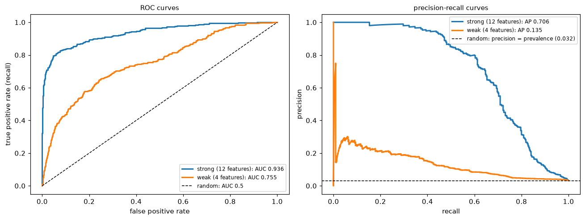

# Evaluation Metrics

> **Level 3 · Chapter 6** · ⏱️ ~70 min read · Prerequisites: [Logistic regression and classification](03-logistic-regression.md), [Generalization and the bias-variance trade-off](04-generalization-bias-variance.md), [Probability](../01-math-foundations/04-probability.md) (Bayes' theorem)

A metric is how you decide whether a model is good, which model is better, and how to use it. This chapter covers the regression metrics (MAE, MSE, RMSE, R²), the confusion matrix and the classification metrics built from it, accuracy and its traps, precision, recall, and F1, ROC and precision-recall curves, calibration, and how to choose a decision threshold from business costs. Every metric is implemented from scratch and checked against scikit-learn.

## Why it matters

Sam's team built a model to flag fraudulent card transactions. The first version reported 99.6% accuracy, and it took a day to notice that it flagged nothing at all: only 0.4% of transactions were fraud, so "everything is legitimate" was 99.6% accurate. The second version was evaluated properly, with a ROC AUC of 0.95, and shipped with scikit-learn's default `predict`. It caught about a third of the fraud.

Nothing was wrong with the second model. The problem was the decision rule. `predict` flags a transaction when the fraud probability exceeds 0.5, but a missed fraud cost the company about USD 200 on average, while reviewing a false alarm cost about USD 5. With those costs, flagging anything above a probability of about 2.4% is the right call, and the same model, with a threshold chosen that way, caught most of the fraud and cut total losses roughly in half.

The model, the metric, and the decision are three different things. A good metric measures what you actually care about; a good threshold turns a model's scores into the decisions that minimize cost. This chapter teaches both, and the traps along the way.

## Concepts

### Regression metrics

For a regression model with predictions $\hat{y}_i$ on $n$ evaluation examples, the residuals are $e_i = y_i - \hat{y}_i$. Four metrics cover most needs.

**Mean absolute error (MAE)** is the average size of an error:

$$
\text{MAE} = \frac{1}{n}\sum_{i=1}^n \lvert y_i - \hat{y}_i \rvert.
$$

It's in the target's units ("we're off by 12 minutes on average"), and every unit of error counts the same, so it's robust to a few huge errors. A model that minimizes MAE predicts the conditional *median* ([Chapter 1](01-what-is-machine-learning.md#loss-functions)).

**Mean squared error (MSE)** averages the squared errors:

$$
\text{MSE} = \frac{1}{n}\sum_{i=1}^n (y_i - \hat{y}_i)^2.
$$

Squaring makes large errors dominate: one error of 10 costs as much as a hundred errors of 1. Use it when big misses are disproportionately bad, and remember that its units are squared (minutes²), which makes it hard to communicate. It's minimized by the conditional *mean*.

**Root mean squared error (RMSE)** is $\sqrt{\text{MSE}}$, back in the target's units. Since squaring weights large errors, RMSE $\geq$ MAE always, and a big gap between them signals a few large errors (heavy tails or outliers).

**The coefficient of determination, $R^2$**, compares the model with the simplest baseline, always predicting the mean $\bar{y}$:

$$
R^2 = 1 - \frac{\sum_i (y_i - \hat{y}_i)^2}{\sum_i (y_i - \bar{y})^2} = 1 - \frac{\text{SSE}}{\text{SST}} = 1 - \frac{\text{MSE}}{\operatorname{Var}(y)}.
$$

The numerator is the model's squared error; the denominator is the baseline's. So $R^2 = 1$ is a perfect fit, $R^2 = 0$ is no better than the mean, and $R^2 < 0$ means *worse* than the mean, which can't happen in-sample for least squares with an intercept but happens easily on test data with a bad model. It's unitless, which makes it comparable across problems, but that's also a trap: $R^2$ depends on the variance of the target in the evaluation set. The same model has a lower $R^2$ on a test set with a narrower range of $y$, even if its errors are identical. For in-sample least squares with an intercept, $R^2$ equals the squared correlation between $y$ and $\hat{y}$.

Other regression metrics you'll meet: **MAPE** (mean absolute percentage error, $\frac{1}{n}\sum\lvert e_i/y_i\rvert$), which is intuitive but explodes when $y_i$ is near zero and penalizes over-predictions more than under-predictions; **median absolute error**, robust to outliers; and **pinball (quantile) loss** for quantile forecasts.

**Which one?** Match the metric to the cost of errors. If an error of 20 is twice as bad as an error of 10, use MAE. If it's four times as bad, use MSE/RMSE. Report RMSE or MAE to stakeholders (they're in real units) and $R^2$ as a sanity check against the baseline. And train with a loss consistent with the metric you'll be judged on: a model trained for MSE estimates the mean, which isn't what MAE rewards.

```python
import numpy as np
from sklearn.metrics import mean_absolute_error, mean_squared_error, root_mean_squared_error, r2_score

rng = np.random.default_rng(0)
y_true = rng.gamma(shape=2.0, scale=15.0, size=500)            # delivery minutes, right-skewed
y_pred = y_true + rng.normal(0, 6, 500)
y_pred[:5] += 80                                               # a few badly wrong predictions

def regression_metrics(y, p):
    e = y - p
    mse = np.mean(e ** 2)
    return {"MAE": np.mean(np.abs(e)), "MSE": mse, "RMSE": np.sqrt(mse),
            "R2": 1 - np.sum(e ** 2) / np.sum((y - y.mean()) ** 2)}

ours = regression_metrics(y_true, y_pred)
theirs = {"MAE": mean_absolute_error(y_true, y_pred), "MSE": mean_squared_error(y_true, y_pred),
          "RMSE": root_mean_squared_error(y_true, y_pred), "R2": r2_score(y_true, y_pred)}
for k in ours:
    print(f"{k:>4}: ours {ours[k]:8.3f}   sklearn {theirs[k]:8.3f}")
print(f"R2 of predicting the mean: {r2_score(y_true, np.full(500, y_true.mean())):.3f}")
print(f"R2 of predicting a constant 10 minutes too high: {r2_score(y_true, np.full(500, y_true.mean() + 10)):.3f}")
```

```text
 MAE: ours    5.659   sklearn    5.659
 MSE: ours   96.302   sklearn   96.302
RMSE: ours    9.813   sklearn    9.813
  R2: ours    0.748   sklearn    0.748
R2 of predicting the mean: 0.000
R2 of predicting a constant 10 minutes too high: -0.261
```

Five bad predictions out of 500 push the RMSE to about 1.7 times the MAE. A constant prediction that's merely off by 10 minutes gets a negative $R^2$: worse than the mean, as the formula says.

### The confusion matrix

For a binary classifier, every prediction falls into one of four cells:

| | Predicted positive | Predicted negative |
|---|---|---|
| **Actually positive** | **true positive** (TP) | **false negative** (FN) |
| **Actually negative** | **false positive** (FP) | **true negative** (TN) |

This table is the **confusion matrix**, and almost every classification metric is a ratio of its cells. A false positive is a **type I error** (a false alarm); a false negative is a **type II error** (a miss), the same names as in [hypothesis testing](../01-math-foundations/05-statistics.md#hypothesis-testing-and-p-values). Keep in mind that a confusion matrix describes a model *at one threshold*. Change the threshold and all four counts change.

scikit-learn's `confusion_matrix(y_true, y_pred)` puts the true labels on rows and predictions on columns, sorted by label, so for labels 0 and 1 the layout is `[[TN, FP], [FN, TP]]`. That's the reverse of the table above, which is a common source of confusion.

### Accuracy and its traps

**Accuracy** is the share of correct predictions:

$$
\text{accuracy} = \frac{\text{TP} + \text{TN}}{\text{TP} + \text{TN} + \text{FP} + \text{FN}}.
$$

It's intuitive and fine when classes are balanced and errors cost about the same. It fails in three common ways:

1. **Imbalance.** With a 0.4% fraud rate, predicting "not fraud" for everything is 99.6% accurate. Always compare accuracy with the majority-class baseline, $\max(\pi, 1 - \pi)$, where $\pi$ is the positive rate.
2. **Unequal costs.** Accuracy counts a missed cancer and a false alarm as the same mistake. They aren't.
3. **Thresholds.** Accuracy evaluates `predict`, a hard decision at one threshold, so it ignores how well the model *ranks* cases and how good its probabilities are.

**Balanced accuracy**, the average of the recall on each class, $\frac{1}{2}\left(\frac{\text{TP}}{\text{TP} + \text{FN}} + \frac{\text{TN}}{\text{TN} + \text{FP}}\right)$, fixes the first problem: the all-negative classifier scores 0.5 no matter how imbalanced the data are.

### Precision, recall, and F1

Two questions matter for the positive class.

**Precision**: of the cases the model flagged, how many were really positive?

$$
\text{precision} = \frac{\text{TP}}{\text{TP} + \text{FP}}.
$$

**Recall** (also **sensitivity**, or **true positive rate**, TPR): of the real positives, how many did the model catch?

$$
\text{recall} = \text{TPR} = \frac{\text{TP}}{\text{TP} + \text{FN}}.
$$

Precision is about the cost of false alarms: low precision means reviewers waste time and customers get annoyed. Recall is about the cost of misses: low recall means fraud goes through and sick patients go home. You can trade one for the other by moving the threshold. Lowering it flags more cases, which raises recall and usually lowers precision. Two more rates complete the set: **specificity** (true negative rate) $= \frac{\text{TN}}{\text{TN} + \text{FP}}$, and the **false positive rate** $\text{FPR} = \frac{\text{FP}}{\text{FP} + \text{TN}} = 1 - \text{specificity}$.

**Precision depends on the base rate; recall doesn't.** Recall and FPR are computed within one true class each, so they don't change if positives become rarer. Precision mixes the classes. By [Bayes' theorem](../01-math-foundations/04-probability.md), with prevalence $\pi$:

$$
\text{precision} = \frac{\text{TPR}\cdot\pi}{\text{TPR}\cdot\pi + \text{FPR}\cdot(1 - \pi)}.
$$

A screening test with 90% recall and a 5% false positive rate has a precision of 65% at 10% prevalence, but only 15% at 1% prevalence. The test is just as good; the population changed. So precision measured on a balanced test set says little about precision in production, and you should evaluate on data with the real-world class balance.

**F1** combines precision $P$ and recall $R$ into one number using the **harmonic mean**:

$$
F_1 = \frac{2PR}{P + R} = \frac{2\,\text{TP}}{2\,\text{TP} + \text{FP} + \text{FN}}.
$$

Why harmonic? It's dominated by the smaller of the two: $P = 1, R = 0.01$ gives an arithmetic mean of 0.505 but $F_1 \approx 0.02$. A model can't get a good F1 by excelling at one and failing the other. Notice that TN doesn't appear, which makes F1 useful when negatives are plentiful and uninteresting. The generalization $F_\beta = \frac{(1 + \beta^2)PR}{\beta^2 P + R}$ weights recall $\beta$ times as much as precision: $F_2$ for screening, $F_{0.5}$ when false alarms are costly.

F1 is popular but has no direct business meaning, and it's computed at a single threshold. If you know the costs of errors, optimize the cost directly, as shown later in this chapter.

**More than two classes.** Compute precision, recall, and F1 per class (that class versus the rest), then average:

- **macro** average: the unweighted mean over classes. Every class counts equally, so rare classes matter as much as common ones.
- **weighted** average: weighted by each class's number of true examples (its **support**). Dominated by common classes.
- **micro** average: pool all TP, FP, and FN counts first, then compute the metric. For single-label multiclass problems, micro precision, micro recall, micro F1, and accuracy are all equal.

If rare classes matter (rare diseases, rare product defects), report macro averages and the per-class table, which `classification_report` prints.

### ROC curves and AUC

A probabilistic classifier produces scores, and every threshold gives a different confusion matrix. Rather than pick one, you can look at all of them. The **ROC curve** (receiver operating characteristic, a name from radar engineering) plots the true positive rate against the false positive rate as the threshold sweeps from $+\infty$ (flag nothing: the point $(0, 0)$) down to $-\infty$ (flag everything: $(1, 1)$).

- A perfect classifier goes straight up to $(0, 1)$, catching every positive before any negative, then across.
- A random classifier, which scores without looking at the features, lies on the diagonal $\text{TPR} = \text{FPR}$.
- Better models bow toward the top-left corner.

The **area under the ROC curve** (ROC AUC, or just **AUC**) summarizes the curve in one number from 0 to 1, with 0.5 for random scoring. It has a beautiful interpretation:

$$
\text{AUC} = P\big(s(\mathbf{x}^+) > s(\mathbf{x}^-)\big),
$$

the probability that a randomly chosen positive gets a higher score than a randomly chosen negative (counting ties as half). Here's why. Sweep the threshold down through the scores. Each time it passes a positive, the curve steps up by $1/n_+$; each time it passes a negative, it steps right by $1/n_-$. The area under the curve accumulates, for each negative, a column of height equal to the fraction of positives already passed, that is, the fraction of positives scored above that negative. Averaging over negatives gives the fraction of (positive, negative) pairs ranked correctly. This is the **Mann–Whitney U statistic**, normalized, and it lets you compute AUC from ranks alone.

Consequences of that interpretation:

- AUC measures **ranking** quality only. Any monotone transformation of the scores (squaring them, taking logs) leaves it unchanged, so a model can have an excellent AUC and badly calibrated probabilities.
- AUC doesn't depend on a threshold, which is a strength for comparing models and a weakness for deciding: you never use a model at "all thresholds."
- AUC doesn't depend on the class balance (TPR and FPR are each within-class rates), which makes it stable across populations, and also blind to what imbalance does to precision.
- Much of the ROC curve covers thresholds you'd never use. For fraud, only the region with a tiny FPR matters (a 1% FPR on millions of transactions is tens of thousands of false alarms), and two models with the same AUC can differ greatly there.

### Precision-recall curves

The **precision-recall (PR) curve** plots precision against recall as the threshold sweeps. It focuses on the positive class, and it shows exactly what imbalance does: at a given recall, precision falls when positives are rare, because each false positive rate is applied to a huge number of negatives.

The baseline is different too. A random classifier has precision equal to the prevalence $\pi$ at every recall, so the PR baseline is a horizontal line at $\pi$, not a diagonal. With 2% positives, a PR curve hovering around 0.3 is a large improvement over random, even though it looks unimpressive.

The area under the PR curve is usually computed as **average precision** (AP): the mean of the precision values at each threshold where a new positive is recovered, weighted by the recall gained:

$$
\text{AP} = \sum_k (R_k - R_{k-1})\,P_k.
$$

`average_precision_score` computes this step-wise sum, which avoids the overly optimistic linear interpolation between PR points.

**ROC or PR?** Use ROC AUC to compare how well models rank when classes are reasonably balanced, or when you care about both classes. Use PR curves and AP when positives are rare and the cost of a false alarm matters, as in fraud, rare disease screening, and search. Report both when in doubt; they answer different questions.

### Calibration

A model is **calibrated** if its probabilities mean what they say: among all the cases it assigns probability $p$, a fraction $p$ are positive.

$$
P\big(y = 1 \mid \hat{p}(\mathbf{x}) = p\big) = p \quad \text{for all } p.
$$

Calibration matters whenever you use the probabilities as numbers rather than just ranking by them: expected-cost thresholds (next section), forecasting the number of churners, pricing risk, or combining a model's output with other information.

**Checking calibration.** A **reliability diagram** (calibration curve) bins the predictions (say, 10 bins), and plots the mean predicted probability in each bin against the observed fraction of positives. A calibrated model lies on the diagonal. Points below the diagonal mean the model is **over-confident** in the positive class (it says 30%, but only 15% happen); points above mean under-confident. Two summary numbers:

- The **Brier score**, $\frac{1}{n}\sum_i(\hat{p}_i - y_i)^2$: the MSE of the probabilities. Lower is better. It mixes calibration with discrimination (a model that ranks better also scores better), so it's not a pure calibration measure.
- The **expected calibration error** (ECE): the average gap between the diagonal and the curve, weighted by the number of examples in each bin.

Log-loss also rewards calibration. Log-loss and the Brier score are both **proper scoring rules**: their expected value is minimized by reporting the true probability.

**Why models are miscalibrated.** Logistic regression trained by maximum likelihood on representative data tends to be well calibrated. Calibration breaks when:

- you reweight or resample the classes (`class_weight="balanced"`, oversampling, SMOTE), which shifts the probabilities toward the minority class on purpose ([Imbalanced data](../05-applied-ml/03-imbalanced-data.md));
- the model isn't trained with a proper scoring rule or produces scores that aren't probabilities (SVMs, naive Bayes, boosted trees in some settings, deep networks trained to overfit);
- strong regularization pulls probabilities toward 0.5;
- the class balance in production differs from training.

**Fixing it: recalibration.** Learn a mapping from the model's scores to calibrated probabilities on data the model wasn't trained on. **Platt scaling** fits a one-feature logistic regression, $\sigma(a\,s + b)$, on the scores $s$: two parameters, works well with little data, but can only fix S-shaped distortions. **Isotonic regression** fits any non-decreasing step function: more flexible, but needs more data (a rule of thumb is at least about a thousand calibration examples) and can overfit. Because both are monotone, they don't change the ranking, so ROC AUC is unchanged. In scikit-learn, `CalibratedClassifierCV` does this with internal cross-validation, so the calibrator never sees predictions on its own training rows.

### Choosing a threshold

A model gives probabilities; the business needs decisions. Here's how to turn one into the other.

**From costs to a threshold.** Suppose acting on a case (flagging, treating, offering a discount) has costs and benefits that depend on the true class. Let $c_{\text{FP}}$ be the cost of a false positive and $c_{\text{FN}}$ the cost of a false negative, with correct decisions costing nothing (you can always shift costs so that's true). For a case with calibrated probability $p$ of being positive:

$$
\mathbb{E}[\text{cost} \mid \text{flag}] = (1 - p)\,c_{\text{FP}}, \qquad \mathbb{E}[\text{cost} \mid \text{don't flag}] = p\,c_{\text{FN}}.
$$

Flag when the first is smaller: $(1 - p)\,c_{\text{FP}} < p\,c_{\text{FN}}$, which rearranges to

$$
p > t^* = \frac{c_{\text{FP}}}{c_{\text{FP}} + c_{\text{FN}}}.
$$

With Sam's costs, $c_{\text{FP}} = 5$ and $c_{\text{FN}} = 200$, the optimal threshold is $5/205 \approx 0.024$: flag anything with more than a 2.4% chance of fraud. The default 0.5 is optimal only when the two errors cost the same. If correct decisions also have values (a caught fraud recovers money, a saved churner is worth their margin), use the general form: flag when $p \cdot (\text{value of acting on a positive}) + (1 - p)\cdot(\text{value of acting on a negative})$ exceeds the value of not acting.

This rule assumes **calibrated** probabilities. If they aren't, the formula's threshold is wrong, and you should either recalibrate or choose the threshold empirically.

**Choosing empirically.** Compute the total cost (or profit) on a *validation* set for every threshold, pick the minimum, then report the cost at that threshold on the *test* set. Picking the threshold on the test set is tuning on the test set. This approach works even without calibration, and it handles costs that don't fit the simple formula.

**Other constraints.** Often the decision is framed as a constraint rather than a cost: "we need 95% recall" (screening), "precision must be at least 80%" (automated blocking), or "the team can review 200 cases a day" (capacity). Then choose the threshold that meets the constraint on validation data, and check how precisely it holds on test data. A capacity constraint means you flag the top $k$ scores, which makes **precision at $k$** the metric that matters.

### Business-cost metrics

Ultimately, a model should be judged by what it's worth. A **business-cost metric** turns the confusion matrix into money (or lives, or hours) using the costs and benefits of each cell:

$$
\text{expected cost per case} = \frac{c_{\text{FP}}\cdot\text{FP} + c_{\text{FN}}\cdot\text{FN}}{n}.
$$

Plotting this against the threshold gives a **cost curve** whose minimum is the operating point, and comparing models at their own best thresholds, in money, is the comparison stakeholders actually care about. Two practical tips: get the cost numbers from the business, with ranges, and check that your decision is robust across the range; and include a "do nothing" baseline (flag nobody) and a "do everything" baseline (flag everybody), because sometimes one of them wins.

A related tool is the **lift** or **cumulative gains** chart: sort cases by score and plot the share of all positives captured in the top $x\%$. "The top 10% of scores contain 60% of all churners" is a sentence every marketing team understands.

## In practice

### Setting up an imbalanced problem

The examples below use a synthetic fraud-like data set with about 3% positives, split into training, validation, and test sets, and two models: a logistic regression on all 12 features and a weaker one on 4 features.

```python
import matplotlib.pyplot as plt
from sklearn.datasets import make_classification
from sklearn.model_selection import train_test_split
from sklearn.pipeline import make_pipeline
from sklearn.preprocessing import StandardScaler
from sklearn.linear_model import LogisticRegression

X, y = make_classification(n_samples=40_000, n_features=12, n_informative=6, n_redundant=2,
                           weights=[0.97], flip_y=0.005, class_sep=0.8, random_state=0)
X_tr, X_tmp, y_tr, y_tmp = train_test_split(X, y, test_size=0.5, stratify=y, random_state=0)
X_va, X_te, y_va, y_te = train_test_split(X_tmp, y_tmp, test_size=0.5, stratify=y_tmp, random_state=0)
print(f"positive rate: train {y_tr.mean():.4f}, val {y_va.mean():.4f}, test {y_te.mean():.4f}")

strong = make_pipeline(StandardScaler(), LogisticRegression(max_iter=1000)).fit(X_tr, y_tr)
weak = make_pipeline(StandardScaler(), LogisticRegression(max_iter=1000)).fit(X_tr[:, :4], y_tr)
p_strong, p_weak = strong.predict_proba(X_te)[:, 1], weak.predict_proba(X_te[:, :4])[:, 1]
```

```text
positive rate: train 0.0321, val 0.0321, test 0.0320
```

### The confusion matrix and its metrics, from scratch

```python
from sklearn.metrics import (confusion_matrix, accuracy_score, precision_score, recall_score,
                             f1_score, balanced_accuracy_score)

def binary_metrics(y, y_hat):
    tp = np.sum((y == 1) & (y_hat == 1)); fp = np.sum((y == 0) & (y_hat == 1))
    fn = np.sum((y == 1) & (y_hat == 0)); tn = np.sum((y == 0) & (y_hat == 0))
    prec = tp / (tp + fp) if tp + fp else 0.0
    rec = tp / (tp + fn)
    return {"TP": tp, "FP": fp, "FN": fn, "TN": tn,
            "accuracy": (tp + tn) / len(y), "precision": prec, "recall": rec,
            "specificity": tn / (tn + fp), "F1": 2 * prec * rec / (prec + rec) if prec + rec else 0.0,
            "balanced acc": 0.5 * (rec + tn / (tn + fp))}

y_hat = (p_strong >= 0.5).astype(int)
m = binary_metrics(y_te, y_hat)
print({k: (int(v) if k in "TP FP FN TN" else round(float(v), 4)) for k, v in m.items()})
print("sklearn confusion_matrix [[TN, FP], [FN, TP]]:", confusion_matrix(y_te, y_hat).tolist())
print("sklearn:", [round(f(y_te, y_hat), 4) for f in (accuracy_score, precision_score, recall_score, f1_score, balanced_accuracy_score)])
print(f"majority-class baseline accuracy: {1 - y_te.mean():.4f}")
```

```text
{'TP': 154, 'FP': 24, 'FN': 166, 'TN': 9656, 'accuracy': 0.981, 'precision': 0.8652, 'recall': 0.4813, 'specificity': 0.9975, 'F1': 0.6185, 'balanced acc': 0.7394}
sklearn confusion_matrix [[TN, FP], [FN, TP]]: [[9656, 24], [166, 154]]
sklearn: [0.981, 0.8652, 0.4813, 0.6185, 0.7394]
majority-class baseline accuracy: 0.9680
```

The accuracy looks superb next to its baseline, but recall shows the model at the default threshold misses more than half of the positives. That's Sam's second problem in numbers.

### ROC and PR curves from scratch

Sorting the scores once gives every point on both curves.

```python
from scipy.stats import rankdata
from sklearn.metrics import roc_auc_score, average_precision_score, roc_curve, precision_recall_curve

def curves(y, s):
    order = np.argsort(-s, kind="mergesort")
    y_sorted, s_sorted = y[order], s[order]
    last = np.r_[np.flatnonzero(np.diff(s_sorted)), len(s) - 1]   # last index of each distinct score
    tp = np.cumsum(y_sorted)[last]; fp = (last + 1) - tp
    tpr, fpr = tp / y.sum(), fp / (len(y) - y.sum())
    precision = tp / (last + 1)
    return np.r_[0, fpr], np.r_[0, tpr], precision, tpr

def auc_rank(y, s):                       # Mann-Whitney: P(score of positive > score of negative)
    r = rankdata(s)
    n_pos, n_neg = y.sum(), len(y) - y.sum()
    return (r[y == 1].sum() - n_pos * (n_pos + 1) / 2) / (n_pos * n_neg)

for name, s in [("strong", p_strong), ("weak", p_weak)]:
    fpr, tpr, prec, rec = curves(y_te, s)
    auc_trap = np.trapezoid(tpr, fpr)
    ap = np.sum(np.diff(np.r_[0, rec]) * prec)
    print(f"{name:>6}: ROC AUC trapezoid {auc_trap:.4f}, rank formula {auc_rank(y_te, s):.4f}, "
          f"sklearn {roc_auc_score(y_te, s):.4f} | AP ours {ap:.4f}, sklearn {average_precision_score(y_te, s):.4f}")

# Sanity check of the probabilistic meaning, by sampling random pairs
rng = np.random.default_rng(0)
pos, neg = p_strong[y_te == 1], p_strong[y_te == 0]
print(f"fraction of 100,000 random (pos, neg) pairs ranked correctly: "
      f"{np.mean(rng.choice(pos, 100_000) > rng.choice(neg, 100_000)):.4f}")

fig, axes = plt.subplots(1, 2, figsize=(12, 4.6))
for name, s, c in [("strong (12 features)", p_strong, "tab:blue"), ("weak (4 features)", p_weak, "tab:orange")]:
    f_, t_, _ = roc_curve(y_te, s)
    p_, r_, _ = precision_recall_curve(y_te, s)
    axes[0].plot(f_, t_, color=c, lw=2, label=f"{name}: AUC {roc_auc_score(y_te, s):.3f}")
    axes[1].plot(r_, p_, color=c, lw=2, label=f"{name}: AP {average_precision_score(y_te, s):.3f}")
axes[0].plot([0, 1], [0, 1], "k--", lw=1, label="random: AUC 0.5")
axes[1].axhline(y_te.mean(), color="k", ls="--", lw=1, label=f"random: precision = prevalence ({y_te.mean():.3f})")
axes[0].set_xlabel("false positive rate"); axes[0].set_ylabel("true positive rate (recall)")
axes[1].set_xlabel("recall"); axes[1].set_ylabel("precision")
axes[0].set_title("ROC curves", fontsize=10); axes[1].set_title("precision-recall curves", fontsize=10)
for ax in axes:
    ax.legend(fontsize=8, loc="lower right" if ax is axes[0] else "upper right")
plt.tight_layout()
plt.show()
```

```text
strong: ROC AUC trapezoid 0.9359, rank formula 0.9359, sklearn 0.9359 | AP ours 0.7060, sklearn 0.7060
  weak: ROC AUC trapezoid 0.7548, rank formula 0.7548, sklearn 0.7548 | AP ours 0.1348, sklearn 0.1348
fraction of 100,000 random (pos, neg) pairs ranked correctly: 0.9364
```



*Both views agree that the 12-feature model is better. The ROC curves both look respectable; the PR curves show more starkly how much precision each model gives up as recall rises, against a baseline of just 3%.*

All three ways of computing AUC agree, including the pair-sampling estimate, and the from-scratch average precision matches scikit-learn's. Notice how different the two summaries feel: ROC AUCs that sound excellent, and average precisions that sound mediocre, for the same models. Neither is wrong. AP is measured against a baseline of 0.03, AUC against 0.5.

### Calibration and recalibration

Logistic regression trained on the real class balance should be close to calibrated. Training with `class_weight="balanced"`, a common response to imbalance, upweights the positives and inflates every probability. Isotonic recalibration with `CalibratedClassifierCV` repairs it without changing the ranking.

```python
from sklearn.calibration import calibration_curve, CalibratedClassifierCV
from sklearn.metrics import brier_score_loss, log_loss

balanced = make_pipeline(StandardScaler(), LogisticRegression(class_weight="balanced", max_iter=1000)).fit(X_tr, y_tr)
recal = CalibratedClassifierCV(make_pipeline(StandardScaler(), LogisticRegression(class_weight="balanced", max_iter=1000)),
                               method="isotonic", cv=5).fit(X_tr, y_tr)
models = {"plain": strong, "class_weight='balanced'": balanced, "balanced + isotonic": recal}
probs = {name: m.predict_proba(X_te)[:, 1] for name, m in models.items()}

for name, p in probs.items():
    print(f"{name:>24}: mean prob {p.mean():.4f} (actual {y_te.mean():.4f}), Brier {brier_score_loss(y_te, p):.4f}, "
          f"log-loss {log_loss(y_te, p):.4f}, ROC AUC {roc_auc_score(y_te, p):.4f}")
```

```text
                   plain: mean prob 0.0322 (actual 0.0320), Brier 0.0152, log-loss 0.0656, ROC AUC 0.9359
 class_weight='balanced': mean prob 0.2348 (actual 0.0320), Brier 0.0940, log-loss 0.3073, ROC AUC 0.9467
     balanced + isotonic: mean prob 0.0320 (actual 0.0320), Brier 0.0176, log-loss 0.0700, ROC AUC 0.9458
```

The balanced model's average predicted probability is many times the true positive rate: it's badly over-confident about fraud, which its much worse Brier score and log-loss reflect. Its AUC is about the same (slightly higher here), because reweighting distorts the probabilities without much changing their order. Isotonic recalibration brings the probabilities back in line, with AUC again almost the same. The reliability diagram below shows the same story, together with the cost analysis from the next section.

### Choosing the threshold from costs

Use Sam's costs: a false alarm costs USD 5 to review, and a missed fraud costs USD 200. The theoretical threshold is $5/205 \approx 0.024$. We choose the threshold empirically on the validation set, then report the cost on the test set.

```python
c_fp, c_fn = 5.0, 200.0
t_theory = c_fp / (c_fp + c_fn)

def total_cost(y, p, t):
    flag = p >= t
    return c_fp * np.sum(flag & (y == 0)) + c_fn * np.sum(~flag & (y == 1))

thresholds = np.linspace(0.001, 0.6, 600)
p_va = strong.predict_proba(X_va)[:, 1]
val_costs = np.array([total_cost(y_va, p_va, t) for t in thresholds])
t_best = thresholds[np.argmin(val_costs)]

print(f"theoretical threshold {t_theory:.3f}, best on validation {t_best:.3f}")
for label, t in [("default 0.5", 0.5), ("theory", t_theory), ("validation-chosen", t_best)]:
    cost = total_cost(y_te, p_strong, t)
    m = binary_metrics(y_te, (p_strong >= t).astype(int))
    print(f"{label:>18} (t = {t:.3f}): test cost USD {cost:>8,.0f}, precision {m['precision']:.3f}, recall {m['recall']:.3f}")
print(f"{'flag nobody':>18}: test cost USD {c_fn * y_te.sum():>8,.0f}")
print(f"{'flag everybody':>18}: test cost USD {c_fp * (1 - y_te).sum():>8,.0f}")

fig, axes = plt.subplots(1, 2, figsize=(12, 4.4))
for (name, p), mk in zip(probs.items(), ["o-", "s-", "^-"]):
    frac_pos, mean_pred = calibration_curve(y_te, p, n_bins=10, strategy="quantile")
    axes[0].plot(mean_pred, frac_pos, mk, label=name)
axes[0].plot([0, 1], [0, 1], "k--", lw=1, label="perfectly calibrated")
axes[0].set_xlabel("mean predicted probability (bin)"); axes[0].set_ylabel("observed fraction of positives")
axes[0].set_title("reliability diagram (10 quantile bins)", fontsize=10); axes[0].legend(fontsize=8)
axes[1].plot(thresholds, val_costs / 1000, color="tab:blue")
axes[1].axvline(t_theory, color="tab:green", ls="--", label=f"theory c_FP/(c_FP+c_FN) = {t_theory:.3f}")
axes[1].axvline(t_best, color="tab:red", ls=":", label=f"validation minimum = {t_best:.3f}")
axes[1].axvline(0.5, color="gray", ls="-.", label="default 0.5")
axes[1].set_xscale("log"); axes[1].set_xlabel("threshold"); axes[1].set_ylabel("validation cost (USD thousands)")
axes[1].set_title("cost curve", fontsize=10); axes[1].legend(fontsize=8)
plt.tight_layout()
plt.show()
```

```text
theoretical threshold 0.024, best on validation 0.070
       default 0.5 (t = 0.500): test cost USD   33,320, precision 0.865, recall 0.481
            theory (t = 0.024): test cost USD   16,335, precision 0.149, recall 0.869
 validation-chosen (t = 0.070): test cost USD   15,315, precision 0.355, recall 0.797
       flag nobody: test cost USD   64,000
    flag everybody: test cost USD   48,400
```


*Left: the class-weighted model's points sit well below the diagonal (it predicts far more fraud than occurs); recalibration moves them back. Right: the cost curve is flat near its minimum, a region that includes the theoretical threshold; the default threshold of 0.5 costs about twice as much.*

The validation-chosen threshold (0.07) is higher than the theoretical 0.024, but the cost curve is flat across that range, and the two give similar test costs: finite validation data can't pin down the exact minimum of a flat curve. Either way, moving from the default 0.5 to a cost-based threshold cuts the test cost roughly in half, from about USD 33,000 to about USD 15,000–16,000. Recall rises sharply and precision falls, which is the right trade at these costs. Both "flag nobody" and "flag everybody" are far worse. Had you used the balanced model's inflated probabilities with the theoretical threshold, you'd flag far too many cases; that's why the formula needs calibrated probabilities.

!!! warning "Common mistake: choosing the threshold on the test set"
    The threshold is a hyperparameter. Choose it on validation data (or with cross-validated predictions), then report the test cost at that fixed threshold. Choosing it on the test set gives an optimistic cost, for the same reasons as tuning any hyperparameter there.

!!! warning "Common mistake: comparing precision across populations"
    Precision depends on prevalence. A model evaluated on a rebalanced 50/50 test set will show far higher precision than it will achieve in production at 3%. Evaluate on data with the production class balance, or correct precision for the base rate using the formula in this chapter.

### Multiclass metrics

`classification_report` prints per-class precision, recall, F1, and support, plus the averages.

```python
from sklearn.datasets import load_digits
from sklearn.metrics import classification_report

Xd, yd = load_digits(return_X_y=True)
yd3 = np.where(yd == 0, 0, np.where(yd == 1, 1, 2))               # classes: "0", "1", "other digit"
Xd_tr, Xd_te, yd_tr, yd_te = train_test_split(Xd[:, ::4], yd3, test_size=0.3, stratify=yd3, random_state=0)
clf = make_pipeline(StandardScaler(), LogisticRegression(max_iter=2000)).fit(Xd_tr, yd_tr)
pred = clf.predict(Xd_te)
print(classification_report(yd_te, pred, target_names=["zero", "one", "other"], digits=3))
for avg in ["macro", "weighted", "micro"]:
    print(f"{avg:>8} F1: {f1_score(yd_te, pred, average=avg):.3f}")
print(f"accuracy: {accuracy_score(yd_te, pred):.3f}")
```

```text
              precision    recall  f1-score   support

        zero      0.926     0.943     0.935        53
         one      0.729     0.636     0.680        55
       other      0.950     0.963     0.956       432

    accuracy                          0.928       540
   macro avg      0.868     0.848     0.857       540
weighted avg      0.925     0.928     0.926       540

   macro F1: 0.857
weighted F1: 0.926
   micro F1: 0.928
accuracy: 0.928
```

Micro F1 equals accuracy, as the theory says. The macro average gives the small "zero" and "one" classes as much weight as the large "other" class, so it's the one to watch if those rare classes matter.

## Exercises

### Exercise 1: Metrics by hand (easy)

A disease screening model is evaluated on 1,000 people, 50 of whom have the disease. It flags 80 people, 40 of whom have the disease. Compute TP, FP, FN, TN, accuracy, precision, recall, specificity, F1, and balanced accuracy. Compare accuracy with the majority-class baseline.

??? success "Solution"

    TP = 40, FP = 80 − 40 = 40, FN = 50 − 40 = 10, TN = 950 − 40 = 910.

    Accuracy = (40 + 910)/1000 = 0.95. Precision = 40/80 = 0.5. Recall = 40/50 = 0.8. Specificity = 910/950 ≈ 0.958. F1 = 2(0.5)(0.8)/(1.3) ≈ 0.615. Balanced accuracy = (0.8 + 0.958)/2 ≈ 0.879.

    The baseline "nobody has it" scores 0.95 accuracy too, so accuracy says nothing here. Recall (80% of cases caught) and precision (half of flagged people are sick) describe the model.

    ```python
    yt = np.r_[np.ones(50), np.zeros(950)].astype(int)
    yp = np.r_[np.ones(40), np.zeros(10), np.ones(40), np.zeros(910)].astype(int)
    print({k: round(float(v), 3) for k, v in binary_metrics(yt, yp).items()})
    ```

    ```text
    {'TP': 40.0, 'FP': 40.0, 'FN': 10.0, 'TN': 910.0, 'accuracy': 0.95, 'precision': 0.5, 'recall': 0.8, 'specificity': 0.958, 'F1': 0.615, 'balanced acc': 0.879}
    ```

### Exercise 2: Precision and prevalence (medium)

A test has recall 0.9 and a false positive rate of 0.05. Compute its precision at prevalences of 20%, 5%, 1%, and 0.1%, using the formula from this chapter. Then confirm by simulation for the 1% case with a million people. What would you tell a team that's evaluating this test on a balanced data set?

??? success "Solution"

    $\text{precision} = \frac{0.9\pi}{0.9\pi + 0.05(1 - \pi)}$.

    ```python
    for pi in [0.2, 0.05, 0.01, 0.001]:
        print(f"prevalence {pi:>5}: precision {0.9 * pi / (0.9 * pi + 0.05 * (1 - pi)):.3f}")
    rng = np.random.default_rng(0)
    sick = rng.random(1_000_000) < 0.01
    flag = np.where(sick, rng.random(1_000_000) < 0.9, rng.random(1_000_000) < 0.05)
    print(f"simulated precision at 1%: {sick[flag].mean():.3f}")
    ```

    ```text
    prevalence   0.2: precision 0.818
    prevalence  0.05: precision 0.486
    prevalence  0.01: precision 0.154
    prevalence 0.001: precision 0.018
    simulated precision at 1%: 0.154
    ```

    On a balanced set, precision would be $0.9/(0.9 + 0.05) \approx 0.95$, wildly optimistic for a rare condition. Report recall and FPR (which don't depend on prevalence), and compute precision at the real-world prevalence.

### Exercise 3: The cost-optimal threshold (easy)

A churn model's calibrated probabilities are used to decide who gets a retention offer. An offer costs USD 20. If a customer who would have churned gets the offer, they stay with probability 0.4, and a retained customer is worth USD 300. Derive the threshold above which you should send the offer. Does the threshold change if 10% of customers churn instead of 20%?

??? success "Solution"

    For a customer with churn probability $p$, sending the offer has expected value $p \times 0.4 \times 300 - 20 = 120p - 20$; not sending is worth 0 (relative to the status quo). Send when $120p > 20$, so $p > 1/6 \approx 0.167$.

    The threshold doesn't depend on the overall churn rate: it's a per-customer decision based on that customer's probability. The churn rate affects *how many* customers exceed the threshold, and therefore the total cost and benefit.

### Exercise 4: AUC by counting pairs (easy)

Scores for 3 positives: 0.9, 0.6, 0.35. Scores for 4 negatives: 0.7, 0.4, 0.3, 0.1. Compute the AUC by counting correctly ordered (positive, negative) pairs. Check with `roc_auc_score`. Then square all the scores and recompute. What happens and why?

??? success "Solution"

    Pairs: 0.9 beats all 4 negatives; 0.6 beats 0.4, 0.3, 0.1 (3); 0.35 beats 0.3 and 0.1 (2). That's $4 + 3 + 2 = 9$ of $3 \times 4 = 12$ pairs, so AUC = 0.75.

    ```python
    yy = np.array([1, 1, 1, 0, 0, 0, 0]); ss = np.array([0.9, 0.6, 0.35, 0.7, 0.4, 0.3, 0.1])
    print(roc_auc_score(yy, ss), roc_auc_score(yy, ss ** 2), round(auc_rank(yy, ss), 4))
    ```

    ```text
    0.75 0.75 0.75
    ```

    Squaring is monotone, so it preserves the ranking, and AUC only depends on the ranking. That's also why AUC can't tell you whether the probabilities are calibrated.

### Exercise 5: When R² goes negative (medium)

Fit a linear regression on 50 training points from $y = 2x + \varepsilon$ with $x \in [0, 1]$. Evaluate $R^2$ (a) on test data from the same range, (b) on test data with $x \in [0.45, 0.55]$ only, and (c) on test data with $x \in [2, 3]$ where the true relationship is $y = 2 + 0.5x$ instead. Explain each result.

??? success "Solution"

    ```python
    from sklearn.linear_model import LinearRegression
    rng = np.random.default_rng(0)
    x = rng.uniform(0, 1, 50); yv = 2 * x + rng.normal(0, 0.2, 50)
    lr = LinearRegression().fit(x.reshape(-1, 1), yv)
    for label, xt, f in [("same range", rng.uniform(0, 1, 1000), lambda x: 2 * x),
                         ("narrow range", rng.uniform(0.45, 0.55, 1000), lambda x: 2 * x),
                         ("shifted, different truth", rng.uniform(2, 3, 1000), lambda x: 2 + 0.5 * x)]:
        yt = f(xt) + rng.normal(0, 0.2, 1000)
        pred = lr.predict(xt.reshape(-1, 1))
        print(f"{label:>25}: R2 = {r2_score(yt, pred):7.3f}, RMSE = {root_mean_squared_error(yt, pred):.3f}")
    ```

    ```text
                   same range: R2 =   0.882, RMSE = 0.204
                 narrow range: R2 =   0.067, RMSE = 0.196
     shifted, different truth: R2 = -65.202, RMSE = 2.019
    ```

    (a) Good fit. (b) The RMSE is the same (the errors are just as small), but $R^2$ collapses, because the narrow range has little variance in $y$ to explain: $R^2$ measures error relative to the target's spread in *this* evaluation set. (c) Extrapolating with the wrong relationship gives predictions worse than the test set's own mean, so $R^2$ is strongly negative. RMSE is the more stable number to compare across evaluation sets.

### Exercise 6: Macro versus micro (medium)

A classifier for 3 classes has these per-class results on a test set: class A (support 900): precision 0.95, recall 0.98; class B (support 80): precision 0.6, recall 0.5; class C (support 20): precision 0.3, recall 0.15. Compute each class's F1, the macro F1, and the weighted F1. Which average would you report to a team that cares about class C, and why?

??? success "Solution"

    F1: A $= 2(0.95)(0.98)/1.93 \approx 0.965$; B $= 2(0.6)(0.5)/1.1 \approx 0.545$; C $= 2(0.3)(0.15)/0.45 = 0.2$.

    Macro F1 $= (0.965 + 0.545 + 0.2)/3 \approx 0.570$. Weighted F1 $= (900 \times 0.965 + 80 \times 0.545 + 20 \times 0.2)/1000 \approx 0.916$.

    The weighted average looks great because class A dominates it; the macro average exposes the poor performance on B and C. For a team that cares about the rare class, report the per-class table and the macro average, never only the weighted average or accuracy.

## Check yourself

1. When is MAE a better choice than RMSE, and what does a large gap between them indicate?

    ??? note "Answer"

        MAE when an error twice as large is about twice as bad, or when outliers shouldn't dominate; RMSE when large errors are disproportionately costly. RMSE $\geq$ MAE always, and a large gap means a few large errors dominate.

2. What does $R^2 < 0$ on a test set mean?

    ??? note "Answer"

        The model's squared error is larger than that of predicting the test set's mean. It's worse than the trivial baseline, often from extrapolation, distribution shift, or overfitting.

3. Define precision and recall. Which depends on the prevalence of positives, and why?

    ??? note "Answer"

        Precision $= \text{TP}/(\text{TP} + \text{FP})$; recall $= \text{TP}/(\text{TP} + \text{FN})$. Precision depends on prevalence, because it mixes the two classes: with rarer positives, the same false positive rate produces more false positives relative to true ones. Recall is computed within the positive class only.

4. Why is F1 a harmonic mean rather than an arithmetic mean?

    ??? note "Answer"

        The harmonic mean is dominated by the smaller value, so a model can't score well by excelling at one of precision and recall while failing the other.

5. State the probabilistic interpretation of ROC AUC. Why doesn't it tell you whether probabilities are calibrated?

    ??? note "Answer"

        AUC is the probability that a random positive gets a higher score than a random negative. It depends only on the ranking of scores, so any monotone distortion of the probabilities (including miscalibration) leaves it unchanged.

6. With 1% positives, why is a PR curve often more informative than a ROC curve?

    ??? note "Answer"

        ROC uses the false positive rate, which stays small even when false positives vastly outnumber true positives (the negatives are so many). The PR curve shows precision directly, revealing how many of the flagged cases are real. Its baseline is the prevalence, 0.01.

7. What does it mean for a model to be calibrated, and how do you check and fix it?

    ??? note "Answer"

        Among cases given probability $p$, a fraction $p$ are positive. Check with a reliability diagram, the Brier score, or log-loss on held-out data. Fix with Platt scaling or isotonic regression fit on data the model wasn't trained on (`CalibratedClassifierCV`).

8. Derive the cost-optimal threshold for false positive cost $c_{\text{FP}}$ and false negative cost $c_{\text{FN}}$. What assumption does it need?

    ??? note "Answer"

        Flag when $(1 - p)c_{\text{FP}} < p\,c_{\text{FN}}$, so $p > c_{\text{FP}}/(c_{\text{FP}} + c_{\text{FN}})$. It needs calibrated probabilities; otherwise, choose the threshold empirically on validation data.

## Key takeaways

- Choose regression metrics by the cost of errors: MAE (robust, median), MSE/RMSE (punishes large errors, mean), and $R^2$ as a comparison with the mean baseline that depends on the target's spread.
- The confusion matrix underlies classification metrics. Accuracy fails under imbalance and unequal costs; always compare with the majority baseline.
- Precision is about false alarms and depends on prevalence; recall is about misses and doesn't. F1 combines them at one threshold; F-beta reweights them.
- ROC AUC measures ranking (the probability a positive outranks a negative) and ignores calibration and prevalence; PR curves and average precision show performance on rare positives against a baseline equal to the prevalence.
- Calibration means probabilities match frequencies. Check it with reliability diagrams and the Brier score; fix it with Platt scaling or isotonic regression on held-out data.
- Turn probabilities into decisions with a threshold chosen from costs, $t^* = c_{\text{FP}}/(c_{\text{FP}} + c_{\text{FN}})$ for calibrated probabilities, or by minimizing cost on validation data. Judge models in the business's units.

## Further reading

- "An introduction to ROC analysis" by Tom Fawcett (*Pattern Recognition Letters*, 2006).
- "The Relationship Between Precision-Recall and ROC Curves" by Davis and Goadrich (ICML 2006).
- "Predicting Good Probabilities With Supervised Learning" by Niculescu-Mizil and Caruana (ICML 2005), on calibration of common models.
- "The Foundations of Cost-Sensitive Learning" by Charles Elkan (IJCAI 2001), for threshold selection from costs.
- The scikit-learn user guide, sections "Metrics and scoring: quantifying the quality of predictions," "Probability calibration," and "Tuning the decision threshold for class prediction."

## Next

You've used gradient descent in almost every chapter of this level. Now open it up and learn to make it fast and reliable: [Gradient descent in depth](07-gradient-descent-in-depth.md).
