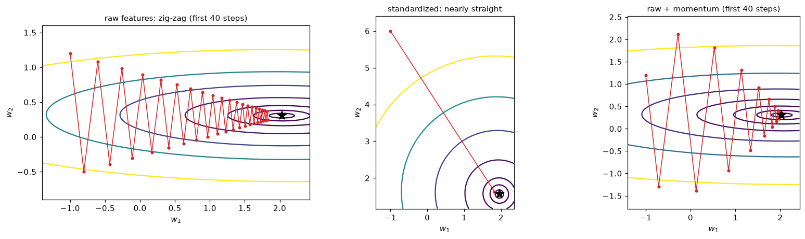

# Gradient Descent in Depth

> **Level 3 · Chapter 7** · ⏱️ ~65 min read · Prerequisites: [Linear regression](02-linear-regression.md), [Logistic regression and classification](03-logistic-regression.md), [Matrix decompositions](../01-math-foundations/02-matrix-decompositions.md) (eigenvalues, conditioning), [Calculus and gradients](../01-math-foundations/03-calculus-and-gradients.md) (Hessian, Taylor approximation)

Gradient descent trains almost every model in machine learning, from logistic regression to large language models. This chapter opens it up: batch, stochastic, and mini-batch variants; what the learning rate does and why too large a value diverges; how fast it converges and what controls that speed; why feature scaling matters so much (conditioning); what loss landscapes look like; a first look at momentum; and how to implement and debug it.

## Why it matters

Alex was training a logistic regression with stochastic gradient descent on a few million loan applications. The loss went down for a while and then crawled. Alex lowered the learning rate: slower. Raised it: the loss blew up to `nan`. Alex spent two days adding features and trying different batch sizes, convinced the model needed more capacity.

The fix took one line. One feature was annual income in dollars, with values in the tens of thousands, while the others were rates and counts between 0 and 10. That one feature made the loss surface a canyon thousands of times steeper in one direction than the others. Any learning rate small enough to be stable along the steep direction was far too small for the rest. Standardizing the features made the canyon a bowl, and the model converged in a few epochs to a better loss than two days of tweaking had reached.

Gradient descent is simple to write and easy to get subtly wrong. Understanding *why* it converges, and what slows it down, turns hours of guessing into minutes of diagnosis. It's also the foundation for the optimizers in [Level 6](../06-neural-networks/04-optimizers.md).

## Concepts

### The algorithm, revisited

You want to minimize a loss $\mathcal{L}(\mathbf{w})$ that's an average over $n$ training examples:

$$
\mathcal{L}(\mathbf{w}) = \frac{1}{n}\sum_{i=1}^n \ell_i(\mathbf{w}),
$$

where $\ell_i$ is the loss on example $i$. **Gradient descent** starts from an initial guess $\mathbf{w}_0$ and repeats

$$
\mathbf{w}_{t+1} = \mathbf{w}_t - \eta\,\nabla\mathcal{L}(\mathbf{w}_t),
$$

with **learning rate** (step size) $\eta > 0$. Why does this work? The first-order [Taylor approximation](../01-math-foundations/03-calculus-and-gradients.md#taylor-approximation) says $\mathcal{L}(\mathbf{w} + \Delta) \approx \mathcal{L}(\mathbf{w}) + \nabla\mathcal{L}^\top\Delta$. With $\Delta = -\eta\nabla\mathcal{L}$, the change is $-\eta\lVert\nabla\mathcal{L}\rVert^2 < 0$: a small enough step along the negative gradient always decreases the loss. "Small enough" is where all the subtlety lives, because the approximation ignores curvature. The second-order Taylor term, $\frac{1}{2}\Delta^\top\mathbf{H}\Delta$ with Hessian $\mathbf{H}$, grows with $\eta^2$ and eventually wins.

The three variants differ only in how much data each gradient uses.

### Batch, stochastic, and mini-batch

**Batch gradient descent** (or full-batch) uses the exact gradient over all $n$ examples at every step. Each step costs $O(nd)$ for a linear model with $d$ features. Its path is smooth and deterministic, and it's easy to analyze. With millions of examples, one step means a full pass over the data just to move once.

**Stochastic gradient descent** (SGD) uses one randomly chosen example per step:

$$
\mathbf{w}_{t+1} = \mathbf{w}_t - \eta_t\,\nabla\ell_{i_t}(\mathbf{w}_t), \qquad i_t \text{ chosen uniformly at random}.
$$

The single-example gradient is a noisy but **unbiased** estimate of the full gradient: $\mathbb{E}_{i}[\nabla\ell_i(\mathbf{w})] = \frac{1}{n}\sum_i\nabla\ell_i(\mathbf{w}) = \nabla\mathcal{L}(\mathbf{w})$. On average, each step points the right way. The step costs $O(d)$, so SGD makes $n$ updates in the time batch gradient descent makes one. Early in training, when every example points in roughly the same direction, that's a huge win. Near the minimum, the noise dominates: the individual gradients disagree, so SGD with a fixed learning rate never settles; it bounces around in a region whose size is proportional to $\eta$.

**Mini-batch gradient descent** uses a random subset $\mathcal{B}_t$ of $B$ examples per step:

$$
\mathbf{g}_t = \frac{1}{B}\sum_{i \in \mathcal{B}_t}\nabla\ell_i(\mathbf{w}_t), \qquad \mathbf{w}_{t+1} = \mathbf{w}_t - \eta_t\,\mathbf{g}_t.
$$

It's still unbiased, and averaging $B$ independent samples divides the variance of the estimate by $B$, so its standard deviation shrinks like $1/\sqrt{B}$. It's the compromise used almost everywhere: batch sizes of 32 to 512 are typical. The deeper reason is hardware. A matrix multiply on 64 examples takes barely longer than on one, because CPUs and GPUs process vectors in parallel, so you get a much better gradient for nearly the same time per step. ("SGD" in deep learning libraries almost always means mini-batch.)

Practical conventions:

- An **epoch** is one pass over the training data: $n/B$ mini-batch steps.
- **Shuffle** the data every epoch, then walk through it in batches. Sampling without replacement this way works at least as well as independent random draws. Never iterate over data sorted by label or time: consecutive batches would all point in similar, biased directions.
- **Decay the learning rate** for SGD. To converge exactly, the classic **Robbins–Monro conditions** require $\sum_t \eta_t = \infty$ (steps can travel any distance) and $\sum_t\eta_t^2 < \infty$ (the accumulated noise is finite), which $\eta_t = \eta_0/(1 + t/\tau)$ satisfies. In practice, step decay or cosine schedules are common; [Optimizers](../06-neural-networks/04-optimizers.md) covers them.

| Variant | Gradient per step | Cost per step | Path | Use |
|---|---|---|---|---|
| Batch | exact | $O(nd)$ | smooth | small data, analysis, L-BFGS-style solvers |
| Stochastic ($B = 1$) | very noisy, unbiased | $O(d)$ | jagged | streaming data, online learning |
| Mini-batch | noisy, unbiased, variance $\propto 1/B$ | $O(Bd)$ | moderately noisy | nearly everything, especially deep learning |

### Learning rate effects

Start with the simplest possible loss, a one-dimensional parabola $f(w) = \frac{a}{2}w^2$ with curvature $a > 0$ and minimum at 0. Its gradient is $aw$, so a gradient step is

$$
w_{t+1} = w_t - \eta a w_t = (1 - \eta a)\,w_t \qquad\Longrightarrow\qquad w_t = (1 - \eta a)^t\,w_0.
$$

Everything depends on the factor $r = 1 - \eta a$:

- $0 < \eta < 1/a$: $0 < r < 1$. Monotone convergence; small $\eta$ means $r$ near 1, which is slow.
- $\eta = 1/a$: $r = 0$. One step lands exactly on the minimum. (This is Newton's method, which divides by the curvature.)
- $1/a < \eta < 2/a$: $-1 < r < 0$. The iterate overshoots and flips sign each step, but still converges: **oscillation**.
- $\eta = 2/a$: $r = -1$. Bounces between $w_0$ and $-w_0$ forever.
- $\eta > 2/a$: $\lvert r\rvert > 1$. Each overshoot is bigger than the last: **divergence**. The loss grows exponentially, overflows, and becomes `nan`.

So the largest stable learning rate is set by the curvature: $\eta < 2/a$. Steep losses demand small steps.

### Convergence on a quadratic

Linear regression's loss is exactly quadratic, and every smooth loss looks quadratic near its minimum (by Taylor's theorem), so the quadratic case tells you almost everything. Write

$$
\mathcal{L}(\mathbf{w}) = \mathcal{L}^* + \frac{1}{2}(\mathbf{w} - \mathbf{w}^*)^\top\mathbf{H}\,(\mathbf{w} - \mathbf{w}^*),
$$

where $\mathbf{w}^*$ is the minimizer and $\mathbf{H}$ the Hessian, symmetric and positive definite. (For MSE, $\mathbf{H} = \frac{2}{n}\mathbf{X}^\top\mathbf{X}$.) The gradient is $\mathbf{H}(\mathbf{w} - \mathbf{w}^*)$, so the error $\mathbf{e}_t = \mathbf{w}_t - \mathbf{w}^*$ evolves as

$$
\mathbf{e}_{t+1} = \mathbf{e}_t - \eta\mathbf{H}\mathbf{e}_t = (\mathbf{I} - \eta\mathbf{H})\,\mathbf{e}_t \qquad\Longrightarrow\qquad \mathbf{e}_t = (\mathbf{I} - \eta\mathbf{H})^t\,\mathbf{e}_0.
$$

Diagonalize $\mathbf{H} = \mathbf{Q}\boldsymbol{\Lambda}\mathbf{Q}^\top$ with eigenvalues $\lambda_1 \geq \dots \geq \lambda_d > 0$ and orthonormal eigenvectors $\mathbf{q}_j$ ([Matrix decompositions](../01-math-foundations/02-matrix-decompositions.md)). In the eigenbasis, the problem splits into $d$ independent one-dimensional parabolas, one per eigenvector:

$$
\mathbf{q}_j^\top\mathbf{e}_t = (1 - \eta\lambda_j)^t\;\mathbf{q}_j^\top\mathbf{e}_0.
$$

Each eigen-direction behaves like the 1D case, with curvature $\lambda_j$. Three consequences follow.

1. **Stability is set by the steepest direction.** Every factor must satisfy $\lvert 1 - \eta\lambda_j\rvert < 1$, so $\eta < 2/\lambda_{\max}$. Exceed it and the steepest direction diverges.
2. **Speed is set by the flattest direction.** With $\eta = 1/\lambda_{\max}$, the flattest direction shrinks by a factor $1 - \lambda_{\min}/\lambda_{\max}$ per step. The best fixed learning rate, $\eta = 2/(\lambda_{\max} + \lambda_{\min})$, balances the two extremes and gives a worst-case factor of

    $$
    \rho = \frac{\kappa - 1}{\kappa + 1}, \qquad \kappa = \frac{\lambda_{\max}}{\lambda_{\min}}.
    $$

3. **The condition number controls everything.** $\kappa$ is the **condition number** of the Hessian. To shrink the error by a factor $\varepsilon$, you need $\rho^t \leq \varepsilon$, which (using $\ln\rho \approx -2/\kappa$ for large $\kappa$) takes about $t \approx \frac{\kappa}{2}\ln\frac{1}{\varepsilon}$ iterations. Ten times worse conditioning means ten times more iterations.

The error shrinks by a constant factor per step, so the number of correct digits grows linearly with $t$: this is called **linear convergence** (a confusing name; on a log plot of the error, it's a straight line). It holds for any **strongly convex** and smooth loss, with $\lambda_{\min}$ and $\lambda_{\max}$ replaced by lower and upper bounds on the curvature ($\mu$ and $L$). For convex losses that aren't strongly convex (like logistic regression on separable data, where the curvature can vanish), the guarantee weakens to $\mathcal{L}(\mathbf{w}_t) - \mathcal{L}^* \leq \frac{\lVert\mathbf{w}_0 - \mathbf{w}^*\rVert^2}{2\eta t}$ for $\eta \leq 1/L$: a $1/t$ rate, much slower. For SGD with decaying learning rates on strongly convex problems, the expected error falls roughly like $1/t$. And for non-convex losses such as neural networks, the guarantees only promise reaching a point where the gradient is small, not a global minimum.

You can now see why [early stopping acts like ridge regression](05-regularization.md#early-stopping): stopped at step $t$ from $\mathbf{w}_0 = \mathbf{0}$, each eigen-component has reached a fraction $1 - (1 - \eta\lambda_j)^t$ of its final value, so high-curvature directions are learned first.

### Feature scaling and conditioning

For least squares, the Hessian is $\frac{2}{n}\mathbf{X}^\top\mathbf{X}$, so the condition number depends directly on the features. Two things make it large:

- **Different scales.** If one feature has standard deviation 1,000 and another 1, the diagonal entries of $\mathbf{X}^\top\mathbf{X}$ differ by a factor of $10^6$, and so (roughly) does the condition number. This was Alex's problem.
- **Correlated features.** Two features that move together create a direction (their difference) with almost no variance, hence a tiny eigenvalue. Scaling can't fix this; it's a property of the data.
- **An uncentered feature** with a large mean is nearly collinear with the intercept column, which also creates a tiny eigenvalue. Centering fixes it.

Picture the contours of the loss. With $\kappa = 1$, they're circles: the negative gradient points straight at the minimum from everywhere, and gradient descent walks straight in. With large $\kappa$, they're long, thin ellipses. The gradient points mostly across the narrow valley, not along it, so gradient descent **zig-zags** across the valley floor while creeping along it.

**Standardizing** features (subtract the mean, divide by the standard deviation) makes $\frac{1}{n}\mathbf{X}^\top\mathbf{X}$ the correlation matrix, with ones on the diagonal. That removes the scale problem completely and the centering problem too, leaving only the conditioning caused by genuine correlation. It's the single most effective thing you can do to speed up gradient descent on a linear model, and it's why scaling appears in every pipeline in this handbook. Neural networks use the same idea inside the network, with batch and layer normalization.

Scaling changes the parameters' units, not the model: a linear model on standardized features represents exactly the same predictions, with weights rescaled by the standard deviations, as you saw in [Linear regression](02-linear-regression.md#gradient-descent).

### Loss landscapes

The **loss landscape** is the loss viewed as a surface over parameter space. For linear and logistic regression, it's a convex bowl (possibly a stretched one), and gradient descent with a suitable learning rate always reaches the bottom. For neural networks, the landscape is non-convex, and several features matter:

- **Local minima**: points lower than their surroundings but not the lowest overall. Gradient descent can stop there. In large neural networks, empirical studies suggest most local minima found in practice have losses close to the global minimum, so they're less of a problem than once feared (an empirical observation, not a theorem).
- **Saddle points**: the gradient is zero, but the Hessian has both positive and negative eigenvalues, so it's a minimum along some directions and a maximum along others. In high dimensions, saddles are far more common than local minima, because a critical point needs *every* one of millions of curvatures to be positive to be a minimum. The gradient is small near a saddle, so plain gradient descent slows down; the noise in SGD helps escape.
- **Plateaus**: large flat regions where the gradient is tiny and progress stalls, for example when sigmoid units saturate.
- **Ravines**: long, narrow valleys, the ill-conditioned case above, ubiquitous in deep learning.
- **Sharp and flat minima**: some researchers argue that wide, flat minima generalize better than sharp ones, and that SGD's noise biases it toward flat ones. This is an active research area with mixed evidence; treat it as a hypothesis.

You can't see a million-dimensional surface, but you can look at slices: plot the loss along the line from the initial weights to the final ones, or on a 2D plane through the final weights spanned by two random directions.

### Momentum: a preview

On an ill-conditioned problem, gradient descent wastes its steps: consecutive gradients across the valley point in opposite directions and cancel, while the small component along the valley adds up only slowly. **Momentum** exploits this by accumulating a running sum of past gradients, a **velocity**:

$$
\mathbf{v}_{t+1} = \beta\,\mathbf{v}_t + \nabla\mathcal{L}(\mathbf{w}_t), \qquad \mathbf{w}_{t+1} = \mathbf{w}_t - \eta\,\mathbf{v}_{t+1},
$$

with $\mathbf{v}_0 = \mathbf{0}$ and a momentum coefficient $0 \leq \beta < 1$ (often 0.9). Picture a heavy ball rolling down the valley: oscillating components cancel out in the running sum, while consistent components build up speed, up to about $\frac{1}{1 - \beta}$ times a single step (10× for $\beta = 0.9$).

On a quadratic, with well-chosen $\eta$ and $\beta$, momentum (Polyak's **heavy ball** method) improves the convergence factor from $\frac{\kappa - 1}{\kappa + 1}$ to $\frac{\sqrt{\kappa} - 1}{\sqrt{\kappa} + 1}$, so the iteration count scales with $\sqrt{\kappa}$ instead of $\kappa$. For $\kappa = 10{,}000$, that's roughly 100 times fewer steps. The optimal settings are $\eta = \frac{4}{(\sqrt{\lambda_{\max}} + \sqrt{\lambda_{\min}})^2}$ and $\beta = \left(\frac{\sqrt{\kappa} - 1}{\sqrt{\kappa} + 1}\right)^2$; you'll use them below. In practice you don't know the eigenvalues, so you tune $\eta$ with $\beta$ fixed at 0.9. Nesterov momentum, RMSProp, and Adam build on this idea, and they're the subject of [Optimizers](../06-neural-networks/04-optimizers.md).

### Implementing and debugging gradient descent

Gradient descent fails quietly. The loss usually goes down *somewhat* even with a bug, which is what makes bugs expensive (remember Wei's missing factor of 2 in [Calculus and gradients](../01-math-foundations/03-calculus-and-gradients.md#why-it-matters)). A checklist that catches nearly everything:

1. **Check the gradient numerically** before training, with central differences at a few random points, as in [Calculus and gradients](../01-math-foundations/03-calculus-and-gradients.md#numerical-versus-analytical-gradients). A relative error around $10^{-7}$ or smaller is right; $10^{-2}$ is a bug.
2. **Standardize the features.** Most "the learning rate is impossible to tune" problems are conditioning problems.
3. **Plot the loss against iterations**, on a log scale. Read the shape:
    - decreasing smoothly, then flattening: healthy;
    - decreasing very slowly in a straight line: learning rate too small, or ill-conditioning;
    - jagged but trending down: mini-batch noise, normal; decay the learning rate if it plateaus high;
    - oscillating or growing, then `nan`: learning rate too large (or overflow in the loss; use stable formulas like `logaddexp`).
4. **Find the learning rate on a log scale.** Try $10^{-4}, 10^{-3}, \dots, 1$ for a few hundred steps each. The best is usually a bit below the largest value that doesn't diverge.
5. **Shuffle**, and check that mini-batches contain a mix of classes.
6. **Overfit a tiny subset.** On 10 examples, a model with enough capacity should drive the training loss near zero. If it can't, the bug is in the code, not the data.
7. **Compare with a reference.** For linear and logistic regression, you have the normal equation and scikit-learn; for anything else, a slower but trusted implementation.
8. **Stop sensibly**: when the gradient norm is small, when the relative improvement in loss per epoch falls below a tolerance, or (with a validation set) when validation loss stops improving. Always also cap the number of iterations.

## In practice

### Conditioning and paths, visualized

Here's a two-feature least squares problem whose second feature has a standard deviation of 5 and the first of 1. We compute the Hessian's eigenvalues, run gradient descent on the raw and standardized features, and run heavy-ball momentum on the raw features, counting iterations to reach the minimum within $10^{-8}$.

```python
import numpy as np
import matplotlib.pyplot as plt

rng = np.random.default_rng(0)
n = 200
x1 = rng.normal(0, 1, n)
x2 = 0.5 * x1 + rng.normal(0, 5, n)
X = np.column_stack([x1, x2])
y = 2.0 * x1 + 0.3 * x2 + rng.normal(0, 0.5, n)

def mse_grad(w, X, y):
    return 2 / len(y) * X.T @ (X @ w - y)

def run(X, y, lr, n_steps, beta=0.0, w0=None):
    w = np.array(w0, float); v = np.zeros_like(w); path = [w.copy()]
    for _ in range(n_steps):
        v = beta * v + mse_grad(w, X, y)
        w = w - lr * v
        path.append(w.copy())
    return np.array(path)

def steps_to_converge(path, w_star, tol=1e-8):
    err = np.linalg.norm(path - w_star, axis=1)
    hit = np.flatnonzero(err < tol)
    return hit[0] if hit.size else None

Xs = X / X.std(axis=0)                                      # standardized (the data are already centered)
for name, A in [("raw", X), ("standardized", Xs)]:
    lam = np.linalg.eigvalsh(2 / n * A.T @ A)
    print(f"{name:>12}: eigenvalues {np.round(lam, 3)}, condition number {lam[-1] / lam[0]:6.1f}, "
          f"max stable lr 2/lambda_max = {2 / lam[-1]:.4f}")

w_star = np.linalg.solve(X.T @ X, X.T @ y)
ws_star = np.linalg.solve(Xs.T @ Xs, Xs.T @ y)
lam = np.linalg.eigvalsh(2 / n * X.T @ X)
lam_s = np.linalg.eigvalsh(2 / n * Xs.T @ Xs)
w0, w0s = [-1.0, 1.2], [-1.0, 6.0]

p_raw = run(X, y, 2 / (lam[0] + lam[-1]), 2000, w0=w0)
p_std = run(Xs, y, 2 / (lam_s[0] + lam_s[-1]), 2000, w0=w0s)
k = lam[-1] / lam[0]
lr_hb = 4 / (np.sqrt(lam[-1]) + np.sqrt(lam[0])) ** 2
beta_hb = ((np.sqrt(k) - 1) / (np.sqrt(k) + 1)) ** 2
p_mom = run(X, y, lr_hb, 2000, beta=beta_hb, w0=w0)
print(f"iterations to 1e-8: GD raw {steps_to_converge(p_raw, w_star)}, GD standardized {steps_to_converge(p_std, ws_star)}, "
      f"momentum raw {steps_to_converge(p_mom, w_star)}")

fig, axes = plt.subplots(1, 3, figsize=(15, 4.3))
for ax, A, ws, path, title in [(axes[0], X, w_star, p_raw[:40], "raw features: zig-zag (first 40 steps)"),
                               (axes[1], Xs, ws_star, p_std[:40], "standardized: nearly straight"),
                               (axes[2], X, w_star, p_mom[:40], "raw + momentum (first 40 steps)")]:
    lo, hi = np.minimum(path.min(0), ws) - 0.4, np.maximum(path.max(0), ws) + 0.4
    g1, g2 = np.meshgrid(np.linspace(lo[0], hi[0], 300), np.linspace(lo[1], hi[1], 300))
    W = np.stack([g1.ravel(), g2.ravel()], axis=1)
    L = np.mean((W @ A.T - y) ** 2, axis=1).reshape(g1.shape)
    ax.contour(g1, g2, L, levels=np.quantile(L, [0.002, 0.01, 0.03, 0.08, 0.2, 0.4, 0.7]), cmap="viridis")
    ax.plot(path[:, 0], path[:, 1], "o-", color="tab:red", ms=3, lw=1)
    ax.plot(*ws, "k*", ms=12)
    ax.set_title(title, fontsize=10); ax.set_xlabel("$w_1$"); ax.set_ylabel("$w_2$")
    ax.set_aspect("equal")
plt.tight_layout()
plt.show()
```

```text
         raw: eigenvalues [ 1.847 52.762], condition number   28.6, max stable lr 2/lambda_max = 0.0379
standardized: eigenvalues [1.952 2.063], condition number    1.1, max stable lr 2/lambda_max = 0.9695
iterations to 1e-8: GD raw 280, GD standardized 6, momentum raw 62
```



*Left: with raw features, the loss contours are long ellipses and each step mostly crosses the valley. Middle: standardizing makes the contours nearly round. Right: momentum on the raw features overshoots at first but accumulates speed along the valley.*

The eigenvalues show the problem. On raw features the condition number is about 29, so even with the best fixed learning rate, gradient descent needs 280 iterations; on standardized features, the condition number is about 1.1 (what remains comes from the mild correlation between the features), and the same problem converges in 6 steps. Momentum with its optimal settings needs 62 steps on the raw features, about 4.5 times fewer than plain gradient descent, in line with the $\sqrt{\kappa} \approx 5.3$ improvement the analysis predicts. Even a modest condition number of 29 costs a factor of nearly 50 in iterations here; Alex's income feature produced condition numbers in the millions.

### Batch, stochastic, and mini-batch from scratch

One function covers all three variants: the batch size decides which one you get. We fit a 10-feature linear regression on 5,000 examples and compare against the normal equation and scikit-learn's `SGDRegressor`.

```python
from sklearn.linear_model import SGDRegressor

rng = np.random.default_rng(1)
n, d = 5000, 10
X = rng.normal(size=(n, d)) @ np.diag(np.linspace(0.5, 2.0, d))
X = (X - X.mean(axis=0)) / X.std(axis=0)
w_true = rng.normal(size=d)
y = X @ w_true + 3.0 + rng.normal(0, 1.0, n)
Xb = np.column_stack([np.ones(n), X])
w_ls, *_ = np.linalg.lstsq(Xb, y, rcond=None)
loss_star = np.mean((Xb @ w_ls - y) ** 2)

def minibatch_gd(X, y, batch_size, lr0, epochs, decay=0.0, seed=0):
    """Mini-batch gradient descent on MSE. batch_size=len(y) is batch GD; 1 is SGD."""
    rng = np.random.default_rng(seed)
    n = len(y); w = np.zeros(X.shape[1]); step = 0
    history = [np.mean((X @ w - y) ** 2)]
    for epoch in range(epochs):
        order = rng.permutation(n)                          # shuffle every epoch
        for start in range(0, n, batch_size):
            idx = order[start:start + batch_size]
            g = 2 / len(idx) * X[idx].T @ (X[idx] @ w - y[idx])
            w -= lr0 / (1 + decay * step) * g               # optional 1/t decay
            step += 1
        history.append(np.mean((X @ w - y) ** 2))
    return w, np.array(history)

runs = {
    "batch (B = 5000)": minibatch_gd(Xb, y, batch_size=n, lr0=0.2, epochs=30),
    "mini-batch (B = 32)": minibatch_gd(Xb, y, batch_size=32, lr0=0.02, epochs=30, decay=1e-3),
    "SGD (B = 1)": minibatch_gd(Xb, y, batch_size=1, lr0=0.005, epochs=30, decay=1e-4),
}
for name, (w, hist) in runs.items():
    print(f"{name:>20}: excess loss after 1 epoch {hist[1] - loss_star:.2e}, after 30 epochs {hist[-1] - loss_star:.2e}, "
          f"max |w - w_ls| = {np.abs(w - w_ls).max():.1e}")

sk = SGDRegressor(penalty=None, max_iter=1000, tol=1e-6, random_state=0).fit(X, y)
print(f"{'sklearn SGDRegressor':>20}: max |w - w_ls| = {np.abs(np.r_[sk.intercept_, sk.coef_] - w_ls).max():.1e}")
```

```text
    batch (B = 5000): excess loss after 1 epoch 4.93e+00, after 30 epochs 9.59e-13, max |w - w_ls| = 6.6e-07
 mini-batch (B = 32): excess loss after 1 epoch 5.78e-03, after 30 epochs 1.74e-04, max |w - w_ls| = 6.2e-03
         SGD (B = 1): excess loss after 1 epoch 2.75e-02, after 30 epochs 2.13e-03, max |w - w_ls| = 3.6e-02
sklearn SGDRegressor: max |w - w_ls| = 3.6e-02
```

Per epoch, the stochastic variants make far more progress early on. After one pass over the data, mini-batch and SGD have made 157 and 5,000 updates and are already close to the minimum, while batch gradient descent has made exactly one update and has barely moved. After 30 epochs, batch gradient descent, with its exact gradients, converges to the exact solution (to about $10^{-12}$ in loss); the stochastic versions get close and then hover, limited by gradient noise, which the decaying learning rate shrinks only slowly. All of them agree with the normal equation to within a few hundredths, as does scikit-learn's `SGDRegressor`, and that's far smaller than the statistical uncertainty in the coefficients from 5,000 noisy examples.

### Learning curves of the optimizer

Two plots diagnose most problems: the loss against epochs for each variant, and the loss for several learning rates relative to the stability limit $2/\lambda_{\max}$.

```python
H = 2 / n * Xb.T @ Xb
lam_max = np.linalg.eigvalsh(H)[-1]
print(f"lambda_max = {lam_max:.3f}, so the largest stable batch learning rate is {2 / lam_max:.3f}")

fig, axes = plt.subplots(1, 2, figsize=(12, 4.2))
for name, (w, hist) in runs.items():
    axes[0].plot(np.arange(len(hist)), hist - loss_star + 1e-12, "o-", ms=3, label=name)
axes[0].set_yscale("log"); axes[0].set_xlabel("epoch"); axes[0].set_ylabel("training MSE minus optimum")
axes[0].set_title("same data, three batch sizes", fontsize=10); axes[0].legend(fontsize=8)

for frac, style in [(0.05, ":"), (0.5, "-"), (0.95, "--"), (1.02, "-.")]:
    w = np.zeros(d + 1); losses = []
    for _ in range(60):
        losses.append(np.mean((Xb @ w - y) ** 2) - loss_star)
        w -= frac * 2 / lam_max * mse_grad(w, Xb, y)
    axes[1].plot(np.maximum(losses, 1e-12), style, lw=2, label=f"lr = {frac:.2f} x 2/lambda_max")
axes[1].set_yscale("log"); axes[1].set_xlabel("iteration (batch GD)"); axes[1].set_ylabel("training MSE minus optimum")
axes[1].set_title("learning rate effects", fontsize=10); axes[1].legend(fontsize=8)
plt.tight_layout()
plt.show()
```

```text
lambda_max = 2.158, so the largest stable batch learning rate is 0.927
```


*Left: stochastic updates win early and plateau at a noise floor; batch gradient descent is slow per epoch but steady. Right: a learning rate just 2% above 2/λmax diverges, while 0.95 × 2/λmax converges with oscillation in the steepest direction.*

!!! warning "Common mistake: tuning the learning rate on unscaled features"
    If the best learning rate seems absurdly small, or the loss decreases in a slow straight line on a log plot, check the condition number before anything else. Standardize the features (in a pipeline, fit on training data only) and the usable learning rate typically jumps by orders of magnitude.

!!! warning "Common mistake: judging SGD by its last iterate's loss"
    With a constant learning rate, SGD hovers around the minimum instead of converging, so the loss at the last step is noisy. Evaluate the full-data (or validation) loss at the end of each epoch, decay the learning rate, or average the iterates over the last epochs (**Polyak averaging**).

## Exercises

### Exercise 1: A parabola by hand (easy)

For $f(w) = w^2$ (so $a = 2$) starting from $w_0 = 1$, compute $w_1, w_2, w_3$ with $\eta = 0.1$, $0.5$, $0.75$, and $1.1$. Classify each run as slow convergence, one-step convergence, oscillating convergence, or divergence, and check it against the rule $\eta < 2/a$.

??? success "Solution"

    The update is $w_{t+1} = (1 - 2\eta)w_t$.

    - $\eta = 0.1$: factor 0.8, so $0.8, 0.64, 0.512$. Slow, monotone convergence.
    - $\eta = 0.5$: factor 0, so $0, 0, 0$. One step (this is $\eta = 1/a$).
    - $\eta = 0.75$: factor $-0.5$, so $-0.5, 0.25, -0.125$. Oscillating convergence ($1/a < \eta < 2/a$).
    - $\eta = 1.1$: factor $-1.2$, so $-1.2, 1.44, -1.728$. Divergence ($\eta > 2/a = 1$).

    ```python
    for lr in [0.1, 0.5, 0.75, 1.1]:
        w, out = 1.0, []
        for _ in range(3):
            w -= lr * 2 * w; out.append(round(w, 4))
        print(lr, out)
    ```

    ```text
    0.1 [0.8, 0.64, 0.512]
    0.5 [0.0, 0.0, 0.0]
    0.75 [-0.5, 0.25, -0.125]
    1.1 [-1.2, 1.44, -1.728]
    ```

### Exercise 2: Find the divergence threshold (medium)

For the 10-feature regression in the In practice section, run batch gradient descent for 200 iterations with $\eta = 0.98 \times 2/\lambda_{\max}$ and $\eta = 1.02 \times 2/\lambda_{\max}$, and print the final excess loss. Then explain, using the eigen-decomposition, which direction diverges and why only one direction matters.

??? success "Solution"

    ```python
    for frac in [0.98, 1.02]:
        w = np.zeros(d + 1)
        for _ in range(200):
            w -= frac * 2 / lam_max * mse_grad(w, Xb, y)
        print(f"lr = {frac} x 2/lambda_max: excess loss after 200 steps = {np.mean((Xb @ w - y) ** 2) - loss_star:.3e}")
    ```

    ```text
    lr = 0.98 x 2/lambda_max: excess loss after 200 steps = 1.183e-08
    lr = 1.02 x 2/lambda_max: excess loss after 200 steps = 9.504e+05
    ```

    In the eigenbasis, the error along eigenvector $j$ is multiplied by $1 - \eta\lambda_j$ each step. With $\eta$ slightly above $2/\lambda_{\max}$, the factor for the top eigenvector is slightly below $-1$, so that component flips sign and grows by about 2% per step, while every other component (smaller $\lambda_j$) still shrinks. After enough steps, the growing component dominates the loss. Just below the limit, the top component oscillates but shrinks slowly, by a factor of about 0.96 per step.

### Exercise 3: Iterations grow with the condition number (medium)

Using the 2-feature problem from the conditioning section, multiply the second raw feature by $s \in \{1, 3, 10, 30\}$ (no standardization). For each, compute the condition number of the Hessian and the number of gradient descent iterations to reach $10^{-6}$ accuracy with the optimal fixed learning rate $2/(\lambda_{\max} + \lambda_{\min})$. Check that the iterations grow roughly in proportion to $\kappa$.

??? success "Solution"

    ```python
    rng = np.random.default_rng(0)
    x1 = rng.normal(0, 1, 200); x2 = 0.5 * x1 + rng.normal(0, 5, 200)
    y2 = 2.0 * x1 + 0.3 * x2 + rng.normal(0, 0.5, 200)
    for s in [1, 3, 10, 30]:
        A = np.column_stack([x1, s * x2])
        lam = np.linalg.eigvalsh(2 / 200 * A.T @ A)
        ws = np.linalg.solve(A.T @ A, A.T @ y2)
        path = run(A, y2, 2 / (lam[0] + lam[-1]), 200_000, w0=[0.0, 0.0])
        it = steps_to_converge(path, ws, tol=1e-6)
        print(f"s = {s:>2}: kappa = {lam[-1] / lam[0]:9.1f}, iterations = {it}, iterations / kappa = {it / (lam[-1] / lam[0]):.3f}")
    ```

    ```text
    s =  1: kappa =      28.6, iterations = 208, iterations / kappa = 7.280
    s =  3: kappa =     257.1, iterations = 1868, iterations / kappa = 7.265
    s = 10: kappa =    2856.9, iterations = 20747, iterations / kappa = 7.262
    s = 30: kappa =   25712.0, iterations = 186719, iterations / kappa = 7.262
    ```

    Each tenfold increase in the feature's scale multiplies the condition number by about 100 (it enters $\mathbf{X}^\top\mathbf{X}$ squared), and the iteration count grows in proportion to $\kappa$: the ratio in the last column settles to a roughly constant value, as the bound $t \approx \frac{\kappa}{2}\ln\frac{1}{\varepsilon}$ predicts.

### Exercise 4: Constant versus decaying SGD learning rates (medium)

Run SGD ($B = 1$) on the 10-feature regression for 20 epochs with (a) a constant learning rate of 0.01 and (b) $\eta_t = 0.01/(1 + t/5000)$. Record the excess training loss at the end of each epoch. Before running it, predict which one ends lower and what the constant-rate curve will look like. Then rerun (a) with a constant rate of 0.002.

??? success "Solution"

    ```python
    for label, lr0, decay in [("constant 0.01", 0.01, 0.0), ("decaying from 0.01", 0.01, 1 / 5000),
                              ("constant 0.002", 0.002, 0.0)]:
        _, hist = minibatch_gd(Xb, y, batch_size=1, lr0=lr0, epochs=20, decay=decay, seed=3)
        ex = hist - loss_star
        print(f"{label:>18}: epochs 1, 5, 10, 20 -> {np.round(ex[[1, 5, 10, 20]], 5)}")
    ```

    ```text
         constant 0.01: epochs 1, 5, 10, 20 -> [0.16692 0.11267 0.14225 0.13335]
    decaying from 0.01: epochs 1, 5, 10, 20 -> [0.06089 0.0092  0.00758 0.00243]
        constant 0.002: epochs 1, 5, 10, 20 -> [0.01374 0.0126  0.02287 0.02241]
    ```

    The constant-rate run drops quickly and then stalls at a noise floor that it bounces around (about 0.13 here): each step uses one example's gradient, which doesn't vanish at the optimum, so the iterates jitter in a region whose size scales with $\eta$. A smaller constant rate gives a lower floor (about 0.02), but it stalls too. The decaying schedule keeps shrinking its steps, so it keeps improving and ends lowest, as the Robbins–Monro conditions promise.

### Exercise 5: Debug a training loop (hard)

This logistic regression trainer runs without errors, but it learns badly. Find the three bugs. (Hint: check the data order, the gradient's scaling, and the features.)

```python
from scipy.special import expit
from sklearn.linear_model import LogisticRegression

rng = np.random.default_rng(0)
n_c = 4000
income = rng.normal(60_000, 15_000, n_c)               # USD per year
debt_ratio = rng.uniform(0, 1, n_c)
z = -0.00005 * (income - 60_000) + 3.0 * (debt_ratio - 0.5)
y_c = (rng.random(n_c) < expit(z)).astype(float)
order = np.argsort(y_c)                                 # data arrive sorted by label
X_c, y_c = np.column_stack([np.ones(n_c), income, debt_ratio])[order], y_c[order]

def train_buggy(X, y, lr=1e-3, epochs=20, batch_size=50):
    w = np.zeros(X.shape[1])
    for _ in range(epochs):
        for start in range(0, len(y), batch_size):
            Xb_, yb_ = X[start:start + batch_size], y[start:start + batch_size]
            w -= lr * Xb_.T @ (expit(Xb_ @ w) - yb_) / len(y)
    return w

w_bug = train_buggy(X_c, y_c)
acc = np.mean((expit(X_c @ w_bug) > 0.5) == y_c)
print(f"buggy weights {w_bug}, accuracy {acc:.3f}, share of class 1: {y_c.mean():.3f}")
```

```text
buggy weights [4.62500000e-05 1.34153519e-01 7.55844792e-05], accuracy 0.502, share of class 1: 0.502
```

??? success "Solution"

    1. **No shuffling.** The data are sorted by label, so the first half of each epoch sees only class 0 and the second half only class 1. The weights swing back and forth each epoch. Shuffle every epoch.
    2. **The gradient is divided by `len(y)` (all 4,000 examples) instead of the batch size.** That shrinks every step by a factor of 80, a hidden learning-rate bug. Divide by `len(yb_)`.
    3. **Unscaled features.** Income is around 60,000 while the debt ratio is between 0 and 1, so the problem is horribly conditioned, and no single learning rate works for both. Standardize (and keep the column of ones unscaled).

    ```python
    def train_fixed(X, y, lr=0.05, epochs=50, batch_size=50, seed=0):
        rng = np.random.default_rng(seed)
        w = np.zeros(X.shape[1])
        for _ in range(epochs):
            idx_all = rng.permutation(len(y))
            for start in range(0, len(y), batch_size):
                idx = idx_all[start:start + batch_size]
                w -= lr * X[idx].T @ (expit(X[idx] @ w) - y[idx]) / len(idx)
        return w

    mu, sd = X_c[:, 1:].mean(axis=0), X_c[:, 1:].std(axis=0)
    X_cs = np.column_stack([np.ones(n_c), (X_c[:, 1:] - mu) / sd])
    w_fix = train_fixed(X_cs, y_c)
    sk_c = LogisticRegression(C=np.inf).fit(X_cs[:, 1:], y_c)
    print(f"fixed: accuracy {np.mean((expit(X_cs @ w_fix) > 0.5) == y_c):.3f}, "
          f"sklearn: {sk_c.score(X_cs[:, 1:], y_c):.3f}")
    print("weights (standardized):", np.round(w_fix, 3), " sklearn:", np.round(np.r_[sk_c.intercept_, sk_c.coef_.ravel()], 3))
    ```

    ```text
    fixed: accuracy 0.708, sklearn: 0.708
    weights (standardized): [ 0.012 -0.779  0.863]  sklearn: [ 0.01  -0.772  0.866]
    ```

    The fixed trainer matches scikit-learn's accuracy, and its weights are close to scikit-learn's (mini-batch noise with a constant learning rate keeps them from matching exactly; a decaying rate would close the gap).

### Exercise 6: Mini-batch logistic regression versus scikit-learn (hard)

Implement mini-batch gradient descent for L2-regularized logistic regression, minimizing $\frac{1}{n}\sum_i\ell_i + \frac{\lambda}{2}\lVert\mathbf{w}\rVert^2$ with an unpenalized intercept, on the standardized breast cancer data, with $B = 64$ and a decaying learning rate. Use $\lambda = \frac{1}{Cn}$ with $C = 1$, and show that after enough epochs your weights are within about 0.05 of `LogisticRegression(C=1.0)`'s. Then show that full-batch gradient descent matches it much more tightly.

??? success "Solution"

    ```python
    from sklearn.datasets import load_breast_cancer
    Xbc, ybc = load_breast_cancer(return_X_y=True)
    Xbc = (Xbc - Xbc.mean(axis=0)) / Xbc.std(axis=0)
    nb = len(ybc); lam = 1 / (1.0 * nb)
    Xbc1 = np.column_stack([np.ones(nb), Xbc])
    mask = np.r_[0.0, np.ones(Xbc.shape[1])]                   # don't penalize the intercept

    def fit_logreg(B, lr0, epochs, decay, seed=0):
        rng = np.random.default_rng(seed)
        w = np.zeros(Xbc1.shape[1]); step = 0
        for _ in range(epochs):
            order = rng.permutation(nb)
            for start in range(0, nb, B):
                idx = order[start:start + B]
                g = Xbc1[idx].T @ (expit(Xbc1[idx] @ w) - ybc[idx]) / len(idx) + lam * mask * w
                w -= lr0 / (1 + decay * step) * g
                step += 1
        return w

    ref = LogisticRegression(C=1.0, tol=1e-10, max_iter=10_000).fit(Xbc, ybc)
    w_ref = np.r_[ref.intercept_, ref.coef_.ravel()]
    w_mb = fit_logreg(B=64, lr0=0.5, epochs=500, decay=1e-3)
    w_full = fit_logreg(B=nb, lr0=1.0, epochs=20_000, decay=0.0)
    print(f"mini-batch: max |w - sklearn| = {np.abs(w_mb - w_ref).max():.3f}")
    print(f"full batch: max |w - sklearn| = {np.abs(w_full - w_ref).max():.1e}")
    ```

    ```text
    mini-batch: max |w - sklearn| = 0.046
    full batch: max |w - sklearn| = 1.1e-06
    ```

    The mini-batch solution lands close to scikit-learn's, limited by gradient noise that the decaying learning rate shrinks only slowly; full-batch gradient descent, with exact gradients and a strongly convex objective (thanks to the L2 penalty), converges linearly and matches to many more digits. This is the general pattern: stochastic methods are fast to get *close*, exact methods are better at getting *exactly* there, and for most ML purposes close is enough, because the statistical error from finite data dwarfs the optimization error.

## Check yourself

1. Why is the mini-batch gradient an unbiased estimate of the full gradient, and how does its variance depend on the batch size?

    ??? note "Answer"

        Each example is equally likely to be sampled, so the expected sampled gradient equals the average gradient over all examples. Averaging $B$ independent samples divides the variance by $B$ (the standard deviation shrinks like $1/\sqrt{B}$).

2. On the parabola $f(w) = \frac{a}{2}w^2$, which learning rates converge, oscillate, or diverge?

    ??? note "Answer"

        The update multiplies $w$ by $1 - \eta a$. Monotone convergence for $0 < \eta < 1/a$, one step at $\eta = 1/a$, oscillating convergence for $1/a < \eta < 2/a$, divergence for $\eta > 2/a$.

3. For a quadratic loss with Hessian eigenvalues $\lambda_{\max}$ and $\lambda_{\min}$, what limits the learning rate, and what limits the speed?

    ??? note "Answer"

        Stability requires $\eta < 2/\lambda_{\max}$ (the steepest direction). The flattest direction then shrinks by a factor like $1 - \eta\lambda_{\min}$ per step, so the speed is limited by $\lambda_{\min}$; the iteration count scales with the condition number $\kappa = \lambda_{\max}/\lambda_{\min}$.

4. Why does standardizing features speed up gradient descent on a linear model? What conditioning problem does it not fix?

    ??? note "Answer"

        The Hessian is proportional to $\mathbf{X}^\top\mathbf{X}$; very different feature scales (and uncentered features) make its eigenvalues wildly different, giving a huge condition number. Standardizing makes it the correlation matrix. It doesn't fix ill-conditioning caused by strongly correlated features.

5. Why does SGD with a constant learning rate not converge exactly, and what are the Robbins–Monro conditions?

    ??? note "Answer"

        At the minimum, the average gradient is zero but individual examples' gradients aren't, so each step still moves the weights by a random amount proportional to $\eta$. Exact convergence needs $\sum_t\eta_t = \infty$ and $\sum_t\eta_t^2 < \infty$, for example $\eta_t \propto 1/t$.

6. What is a saddle point, and why do they matter more than local minima in high dimensions?

    ??? note "Answer"

        A critical point where the Hessian has both positive and negative eigenvalues: a minimum in some directions, a maximum in others. In high dimensions, a critical point is a minimum only if all its curvatures are positive, which is much rarer than a mix, so most critical points are saddles. Gradients are small near them, so plain gradient descent slows down.

7. How does momentum help on an ill-conditioned problem?

    ??? note "Answer"

        It accumulates a velocity from past gradients: components that flip sign (across a ravine) cancel, while consistent components (along the ravine) add up. On quadratics, tuned momentum makes the iteration count scale with $\sqrt{\kappa}$ instead of $\kappa$.

8. Your training loss oscillates and then becomes `nan`. List the first three things you'd check.

    ??? note "Answer"

        The learning rate (too large; try ten times smaller), the feature scales (standardize to improve conditioning), and numerical stability of the loss (use `logaddexp`-style formulas and check for overflow or division by zero). A gradient check rules out a wrong gradient.

## Key takeaways

- Gradient descent steps along $-\nabla\mathcal{L}$; batch uses all examples, SGD one, mini-batch $B$. Mini-batch gradients are unbiased with variance $\propto 1/B$, and they're the practical default.
- On a quadratic, each Hessian eigen-direction shrinks by $(1 - \eta\lambda_j)$ per step: stability requires $\eta < 2/\lambda_{\max}$, and the iteration count grows with the condition number $\kappa = \lambda_{\max}/\lambda_{\min}$.
- Feature scaling is conditioning: standardize features, and gradient descent can use far larger learning rates and converge in far fewer steps.
- SGD needs decaying learning rates (or averaging) to converge exactly; with constant rates it hovers in a noise ball.
- Loss landscapes of linear models are convex bowls; neural network landscapes have saddles, plateaus, and ravines. Momentum accumulates velocity and makes iterations scale with $\sqrt{\kappa}$ on quadratics.
- Debug with a gradient check, standardized features, a log-scale loss plot, a learning-rate sweep, shuffling, overfitting a tiny subset, and a trusted reference implementation.

## Further reading

- *Numerical Optimization* by Nocedal and Wright, chapters 2–3, for convergence rates and line searches.
- "Optimization Methods for Large-Scale Machine Learning" by Bottou, Curtis, and Nocedal (*SIAM Review*, 2018), a thorough survey of SGD and its analysis.
- "Why Momentum Really Works" by Gabriel Goh (*Distill*, 2017), an interactive explanation of momentum on quadratics.
- *Deep Learning* by Goodfellow, Bengio, and Courville, chapter 8, "Optimization for Training Deep Models" (free online).
- "Identifying and attacking the saddle point problem in high-dimensional non-convex optimization" by Dauphin et al. (NeurIPS 2014).

## Next

Put the whole level together: [Level 3 capstone: build a churn classifier from scratch in NumPy, then match it with scikit-learn](../../exercises/level-3-capstone.md).
