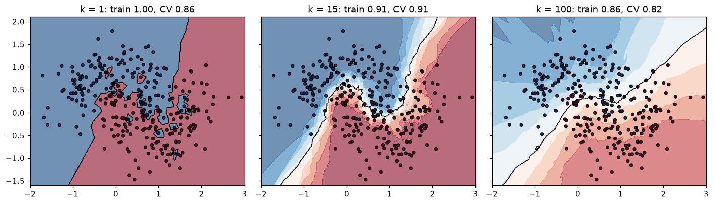
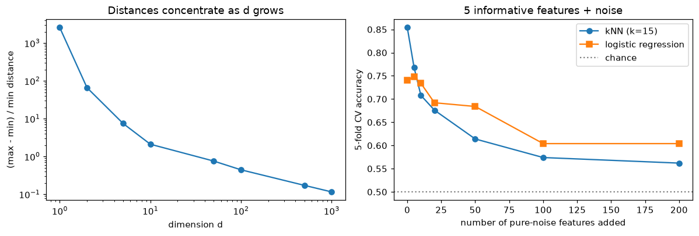

# k-Nearest Neighbors and Naive Bayes

> **Level 4 · Chapter 1** · ⏱️ ~60 min read · Prerequisites: [Probability](../01-math-foundations/04-probability.md), [Logistic regression](../03-ml-fundamentals/03-logistic-regression.md), [Generalization and the bias-variance trade-off](../03-ml-fundamentals/04-generalization-bias-variance.md)

This chapter covers two of the simplest classifiers that still earn their place in practice. k-nearest neighbors predicts from the most similar training examples, and naive Bayes predicts with Bayes' theorem and one bold simplifying assumption. You'll derive both, build both from scratch in NumPy, see why distance-based methods break down in high dimensions, and use naive Bayes to classify text.

## Why it matters

Sam built a fraud screen for a payments startup. The idea was appealing: when a new transaction arrives, find the 5 most similar past transactions, and if most of them were fraud, flag it. Sam used three features: the transaction amount in USD, the customer's age in years, and the hour of day. Validation accuracy looked fine, so it shipped.

A month later an analyst noticed something odd. The screen flagged almost every transaction over USD 2,000, and almost none below, regardless of the time or the customer. Sam dug in and found the cause in one line of arithmetic. Amounts ranged over thousands of dollars, ages over a few decades, hours over 24. When the model computed "similarity" as a Euclidean distance, a USD 300 difference in amount swamped a 40-year difference in age. The model was a nearest-neighbor classifier on one feature, the amount, wearing a three-feature disguise.

Rescaling every feature to a comparable range fixed it in five minutes. But the lesson runs deeper: an algorithm built on distances is only as good as the distance you give it. This chapter shows you how distance-based learning works, when it fails (including the strange geometry of high-dimensional spaces), and a very different family, generative classifiers like naive Bayes, that model how the data was produced instead of comparing points.

## Concepts

### Instance-based learning

Most models you met in [Level 3](../03-ml-fundamentals/index.md) compress the training data into parameters. Linear regression keeps a weight vector and throws the data away. **Instance-based learning** takes the opposite approach: the model *is* the training data. To predict for a new point, it looks up stored examples that resemble it and combines their labels.

This is also called **lazy learning**, because all the work happens at prediction time. "Training" is just storing the data. It's the method you use every day without noticing: a doctor who says "this rash looks like the three cases I saw last month" is doing instance-based reasoning, and so is a real estate agent who prices a house by looking at comparable sales nearby.

The appeal is that you assume almost nothing about the shape of the relationship. There's no line, no formula, just the belief that **similar inputs have similar outputs**. That belief, called a smoothness assumption, is the entire inductive bias of the method. When it holds, and you have enough data, nearest neighbors can learn any decision boundary, however curved.

### The k-nearest neighbors rule

Given training data $\{(\mathbf{x}_i, y_i)\}_{i=1}^{n}$, where each $\mathbf{x}_i \in \mathbb{R}^d$ is a feature vector with $d$ features and $y_i$ is its label, the **k-nearest neighbors (kNN)** prediction for a query point $\mathbf{x}$ is:

1. Compute the distance from $\mathbf{x}$ to every training point.
2. Take the $k$ closest. Call this set of indices $N_k(\mathbf{x})$.
3. For **classification**, return the most common label among them (a majority vote). For **regression**, return their average:

$$
\hat{y}(\mathbf{x}) = \frac{1}{k} \sum_{i \in N_k(\mathbf{x})} y_i.
$$

For classification you can read the vote as a probability estimate: $\hat{P}(y = c \mid \mathbf{x}) = \frac{1}{k}\sum_{i \in N_k(\mathbf{x})} \mathbb{1}[y_i = c]$, where $\mathbb{1}[\cdot]$ is the **indicator function**, 1 when its condition is true and 0 otherwise. The predicted class is the one with the highest estimated probability.

A common variant is **distance weighting**: closer neighbors get bigger votes, usually with weight $w_i = 1/\text{dist}(\mathbf{x}, \mathbf{x}_i)$. That way a neighbor right next to the query counts more than one at the edge of the neighborhood. In scikit-learn this is `weights="distance"`.

Notice what kNN is really doing. It estimates $P(y \mid \mathbf{x})$ *locally*, by averaging labels in a small region around $\mathbf{x}$. With infinite data you could make that region tiny and still have plenty of points in it, and the estimate would converge to the true conditional probability. A classic result by Cover and Hart (1967) makes this precise: as $n \to \infty$, the error rate of 1-nearest-neighbor is at most twice the **Bayes error rate**, the lowest error any classifier could achieve on that problem. That's a remarkable guarantee for a method with no training at all. The catch, as you'll see, is the phrase "with infinite data".

### Distance metrics

Everything in kNN depends on what "close" means. The most common choices, for vectors $\mathbf{x}, \mathbf{z} \in \mathbb{R}^d$:

| Metric | Formula | When to use it |
|---|---|---|
| **Euclidean** ($L_2$) | $\sqrt{\sum_j (x_j - z_j)^2}$ | The default for continuous, scaled features |
| **Manhattan** ($L_1$) | $\sum_j \lvert x_j - z_j \rvert$ | Less dominated by one large difference; grid-like data |
| **Minkowski** ($L_p$) | $\left(\sum_j \lvert x_j - z_j \rvert^p\right)^{1/p}$ | Generalizes both: $p=1$ is Manhattan, $p=2$ is Euclidean |
| **Cosine distance** | $1 - \frac{\mathbf{x}^\top\mathbf{z}}{\lVert\mathbf{x}\rVert\,\lVert\mathbf{z}\rVert}$ | Text and embeddings, where direction matters more than length |
| **Hamming** | fraction of positions where $x_j \ne z_j$ | Binary or categorical codes |

Two practical consequences follow from these formulas.

**Scale dominates.** Every feature contributes its squared difference to the Euclidean distance. A feature measured in thousands contributes millions; a feature measured in units contributes ones. That's exactly what broke Sam's fraud screen. Before kNN, put features on comparable scales, usually with **standardization**, $x_j \leftarrow (x_j - \mu_j)/\sigma_j$, where $\mu_j$ and $\sigma_j$ are the training mean and standard deviation of feature $j$. And fit the scaler on training data only, inside a pipeline, or you leak test information into the model.

**Irrelevant features hurt.** Every feature gets an equal say in the distance. If 2 features matter and 20 are noise, the noise dominates which points look "near". kNN has no way to learn that a feature is useless. Feature selection, or a learned metric, helps.

A useful identity makes Euclidean distances fast to compute in bulk. Expanding the square,

$$
\lVert \mathbf{x} - \mathbf{z} \rVert^2 = \lVert \mathbf{x} \rVert^2 - 2\,\mathbf{x}^\top\mathbf{z} + \lVert \mathbf{z} \rVert^2,
$$

so the full matrix of squared distances between $m$ query rows and $n$ training rows needs only one matrix product, $\mathbf{X}_{\text{query}}\mathbf{X}_{\text{train}}^\top$, plus two vectors of squared norms. That's how the from-scratch implementation below avoids Python loops.

### Choosing k

The number of neighbors $k$ is the main hyperparameter, and it controls the bias-variance trade-off directly, which you met in [Generalization and the bias-variance trade-off](../03-ml-fundamentals/04-generalization-bias-variance.md).

- **Small k (k = 1).** The prediction follows the single closest point. The decision boundary is jagged and wraps around every noisy training label. Training accuracy is 100% (each training point is its own nearest neighbor), but variance is high: move one point and the boundary changes. This is overfitting.
- **Large k.** The prediction averages over a big neighborhood, so the boundary is smooth and stable. But if $k$ is too large, the neighborhood stretches into regions where the true label is different, which adds bias. At the extreme, $k = n$ predicts the majority class everywhere.

A good way to think about it: $k$ sets the size of the region over which you assume the label is roughly constant. You pick it the way you pick any hyperparameter, by cross-validation. Some practical rules: use an odd $k$ for binary problems to avoid ties, try values on a roughly logarithmic grid (1, 3, 5, 11, 21, 51...), and expect the best $k$ to grow with the size of the dataset. A rule of thumb you'll sometimes see is $k \approx \sqrt{n}$; treat it as a starting point for the search, not an answer.

### The cost of being lazy

Prediction is expensive. A brute-force query computes $n$ distances in $d$ dimensions, so it costs $O(nd)$ per query point, and it must keep all $n \times d$ numbers in memory. For a million training rows and thousands of queries per second, that's a problem.

Spatial indexes help. A **k-d tree** recursively splits space along one coordinate at a time, so a query can skip whole regions that are provably farther than the current best neighbor. A **ball tree** does the same with nested hyperspheres, which works better in moderate dimensions. In low dimensions these make queries roughly $O(\log n)$. In high dimensions they degrade toward brute force, for reasons the next section explains. At very large scale, people use **approximate nearest neighbor** libraries such as FAISS or Annoy, which trade a little accuracy for large speedups. Those power vector search in modern retrieval systems, which you'll meet in [Level 8](../08-modern-deep-learning/index.md).

scikit-learn picks an index automatically with `algorithm="auto"`.

### The curse of dimensionality

kNN's guarantee says that with enough data, local averaging works. The **curse of dimensionality** is the observation that "enough data" grows exponentially with the number of dimensions, and that high-dimensional space behaves in ways your 3D intuition doesn't expect. Three facts make this concrete.

**1. Neighborhoods stop being local.** Suppose your data is uniformly spread in the unit hypercube $[0, 1]^d$, and you want a neighborhood that captures a fraction $r$ of the data, say 10%, to average over. A sub-cube with edge length $e$ has volume $e^d$, so you need $e^d = r$, or

$$
e = r^{1/d}.
$$

In $d = 1$, that's an interval of length 0.1. In $d = 10$, $e = 0.1^{1/10} \approx 0.79$: to capture 10% of the data you must span 79% of the range of *every* feature. In $d = 100$, $e \approx 0.977$. Your "local" neighborhood covers almost the whole space, so averaging over it is no longer local at all.

**2. Volume lives near the surface.** The fraction of a $d$-dimensional cube (or ball) that lies within a thin outer shell of relative thickness $\epsilon$ is $1 - (1 - \epsilon)^d$. For $\epsilon = 0.05$ and $d = 100$, that's $1 - 0.95^{100} \approx 0.994$. Almost every point is near the boundary, far from the center.

**3. Distances concentrate.** For random points with independent coordinates, the squared distance between two points is a sum of $d$ independent terms. By the law of large numbers, that sum is close to $d$ times its mean, with a spread that grows only like $\sqrt{d}$. So the *relative* gap between the nearest and the farthest point shrinks:

$$
\frac{\text{dist}_{\max} - \text{dist}_{\min}}{\text{dist}_{\min}} \;\longrightarrow\; 0 \quad \text{as } d \to \infty.
$$

(Beyer and colleagues proved a general version of this in 1999.) When every point is about equally far away, "the nearest neighbor" is close to arbitrary. You'll measure this directly in the practice section.

!!! note "Why real data often escapes the curse"
    These facts assume the data fills the space uniformly. Real data usually doesn't: images, text embeddings, and sensor readings lie near a much lower-dimensional surface (a **manifold**) inside the big space. A 64×64 grayscale image has 4,096 pixels, but the set of natural face images varies along far fewer directions. kNN works well when this **intrinsic dimension** is low, even if the raw dimension is high. That's also why [dimensionality reduction](06-dimensionality-reduction.md) before kNN often helps.

The curse isn't specific to kNN. Any method that relies on local averaging (kernel density estimates, RBF kernels in [SVMs](04-support-vector-machines.md), [clustering](05-clustering.md) with Euclidean distances) suffers from it. Methods that make strong global assumptions, like linear models, suffer less: a linear model with $d$ weights can be estimated from roughly a multiple of $d$ samples, not exponentially many.

### Generative vs discriminative models

Now a different way to classify. Every probabilistic classifier wants $P(y \mid \mathbf{x})$, the probability of each class given the features. There are two ways to get it.

A **discriminative model** estimates $P(y \mid \mathbf{x})$ directly. Logistic regression is the classic example: it fits a function from features to class probabilities, and it never asks what the features themselves look like. kNN is also discriminative, in a nonparametric way.

A **generative model** estimates how the data is *generated* within each class: the **class-conditional distribution** $P(\mathbf{x} \mid y)$ and the **prior** $P(y)$. Then it flips them around with Bayes' theorem, from [Probability](../01-math-foundations/04-probability.md):

$$
P(y = c \mid \mathbf{x}) = \frac{P(\mathbf{x} \mid y = c)\,P(y = c)}{\sum_{c'} P(\mathbf{x} \mid y = c')\,P(y = c')}.
$$

The denominator, $P(\mathbf{x})$, is the same for every class, so to *classify* you only need to compare the numerators: predict the class $c$ that maximizes $P(\mathbf{x} \mid y = c)\,P(y = c)$.

An analogy: to tell English from Spanish text, a discriminative model learns which features separate the two ("contains 'the'" → English). A generative model learns what each language looks like, a model of English and a model of Spanish, and asks which one is more likely to have produced the text in front of it.

The trade-offs:

| | Generative | Discriminative |
|---|---|---|
| Models | $P(\mathbf{x} \mid y)$ and $P(y)$ | $P(y \mid \mathbf{x})$ directly |
| Examples | Naive Bayes, Gaussian mixture classifiers, LDA | Logistic regression, kNN, SVMs, trees |
| Small data | Often better: strong assumptions, few parameters | Can overfit |
| Large data | Limited by wrong modeling assumptions | Usually more accurate |
| Bonus | Can generate samples, handle missing features | Fewer assumptions to get wrong |

Ng and Jordan (2001) compared naive Bayes and logistic regression and found exactly this pattern: naive Bayes approaches its (higher) best error much faster as data grows, while logistic regression starts worse but ends lower. When labeled data is scarce, the generative model's assumptions act like extra data.

### Naive Bayes: the naive assumption

The hard part of a generative classifier is $P(\mathbf{x} \mid y)$, a distribution over $d$-dimensional vectors. With 1,000 binary word features, a full table of $P(\mathbf{x} \mid y)$ would have $2^{1000}$ entries per class. Impossible.

**Naive Bayes** makes one drastic simplification: it assumes the features are **conditionally independent given the class**:

$$
P(\mathbf{x} \mid y = c) = \prod_{j=1}^{d} P(x_j \mid y = c).
$$

"Conditionally independent given the class" means that once you know the class, knowing one feature tells you nothing more about another. For spam: once you know a message is spam, seeing the word "free" doesn't change the probability of seeing "winner". That's false, of course (spam that says "free" probably says "winner" too), which is why the method is called *naive*. But it reduces one impossible $d$-dimensional distribution to $d$ easy one-dimensional ones, each estimated from data.

The classifier then becomes:

$$
\hat{y} = \arg\max_{c} \; P(y = c)\prod_{j=1}^{d} P(x_j \mid y = c).
$$

Multiplying hundreds of probabilities below 1 underflows to zero in floating point, so in practice you always work with logarithms. The log is increasing, so the argmax doesn't change:

$$
\hat{y} = \arg\max_{c} \; \left[\log P(y = c) + \sum_{j=1}^{d} \log P(x_j \mid y = c)\right].
$$

This has a lovely reading. Each class starts with a score (its log prior), and every feature adds evidence for or against it. The class with the most total evidence wins. The model is a sum of per-feature contributions, which makes it fast, simple to inspect, and surprisingly hard to beat on some problems.

**Why does a wrong assumption work?** Classification only needs the *right class to have the highest score*, not accurate probabilities. Correlated features get double-counted, which pushes the probabilities toward 0 and 1 (naive Bayes is famously overconfident), but often the ranking of classes survives. Domingos and Pazzani (1997) analyzed this and showed naive Bayes can be optimal for classification even when the independence assumption is badly violated. The practical upshot: use naive Bayes predictions freely, but don't trust its probabilities without [calibration](../03-ml-fundamentals/06-evaluation-metrics.md).

What remains is choosing a form for each $P(x_j \mid y)$. The choice gives the **naive Bayes variants**.

### Gaussian naive Bayes

For continuous features, **Gaussian naive Bayes** assumes each feature is normally distributed within each class, with its own mean $\mu_{cj}$ and variance $\sigma_{cj}^2$:

$$
P(x_j \mid y = c) = \frac{1}{\sqrt{2\pi\sigma_{cj}^2}} \exp\!\left(-\frac{(x_j - \mu_{cj})^2}{2\sigma_{cj}^2}\right).
$$

**Fitting is maximum likelihood**, which you met in [Statistics](../01-math-foundations/05-statistics.md). Let $n_c$ be the number of training points in class $c$. The log-likelihood of the class-$c$ data for feature $j$ is

$$
\ell(\mu, \sigma^2) = \sum_{i: y_i = c} \left[-\tfrac{1}{2}\log(2\pi\sigma^2) - \frac{(x_{ij} - \mu)^2}{2\sigma^2}\right].
$$

Setting $\partial\ell/\partial\mu = \sum_i (x_{ij} - \mu)/\sigma^2 = 0$ gives the class mean, and setting $\partial\ell/\partial\sigma^2 = \sum_i\left[-\frac{1}{2\sigma^2} + \frac{(x_{ij} - \mu)^2}{2\sigma^4}\right] = 0$ gives the class variance (dividing by $n_c$, not $n_c - 1$):

$$
\hat{\mu}_{cj} = \frac{1}{n_c}\sum_{i: y_i = c} x_{ij}, \qquad \hat{\sigma}_{cj}^2 = \frac{1}{n_c}\sum_{i: y_i = c} (x_{ij} - \hat{\mu}_{cj})^2.
$$

The prior is the class frequency: $\hat{P}(y = c) = n_c / n$. That's the whole training procedure: a mean and a variance per class per feature, computed in one pass over the data. To predict, add up log densities:

$$
\log P(y = c) + \sum_{j} \left[-\tfrac{1}{2}\log(2\pi\hat{\sigma}_{cj}^2) - \frac{(x_j - \hat{\mu}_{cj})^2}{2\hat{\sigma}_{cj}^2}\right].
$$

Look at the structure: it's quadratic in $x_j$, so the decision boundaries of Gaussian naive Bayes are quadratic curves. If you force all classes to share the same variance per feature, the $x_j^2$ terms cancel between classes and the boundary becomes linear, exactly the functional form of logistic regression. Same shape of boundary, different way of choosing it: naive Bayes fits each class's distribution, logistic regression fits the boundary itself.

One numerical detail: if a feature is constant within a class, its variance is zero and the density blows up. scikit-learn's `GaussianNB` adds a small `var_smoothing` term (by default $10^{-9}$ times the largest feature variance) to every variance. The from-scratch version below does the same, so the two agree exactly.

### Multinomial naive Bayes and text classification

Text is where naive Bayes shines. The standard representation is the **bag of words**: a document becomes a vector $\mathbf{x}$ of word counts over a fixed **vocabulary** of $V$ words, ignoring order. "free money free" becomes a vector with a 2 under "free", a 1 under "money", and 0 everywhere else.

**Multinomial naive Bayes** models a class-$c$ document as a sequence of words, each drawn independently from a class-specific distribution over the vocabulary, with probabilities $\theta_{c1}, \ldots, \theta_{cV}$ that sum to 1. Think of a bag of word tiles for each class: spam's bag is full of "free" and "winner" tiles, ham's bag is full of "meeting" and "tomorrow". To write a document, you draw tiles from your class's bag with replacement. Then

$$
P(\mathbf{x} \mid y = c) = \frac{\left(\sum_j x_j\right)!}{\prod_j x_j!}\prod_{j=1}^{V}\theta_{cj}^{x_j}.
$$

The fraction in front (the number of word orders that produce the same counts) doesn't depend on the class, so it cancels in the argmax. The log score for class $c$ is just

$$
\log P(y = c) + \sum_{j=1}^{V} x_j \log\theta_{cj},
$$

a linear function of the counts. Each occurrence of word $j$ adds $\log\theta_{cj}$ to the score of class $c$.

**Fitting $\theta$ by maximum likelihood.** Let $N_{cj}$ be the total count of word $j$ in all class-$c$ training documents, and $N_c = \sum_j N_{cj}$ the total number of words in class $c$. The log-likelihood is $\sum_j N_{cj}\log\theta_{cj}$, maximized subject to $\sum_j\theta_{cj} = 1$. With a Lagrange multiplier $\lambda$ (from [Information theory and optimization](../01-math-foundations/06-information-theory-and-optimization.md)):

$$
\frac{\partial}{\partial\theta_{cj}}\left[\sum_k N_{ck}\log\theta_{ck} - \lambda\left(\sum_k\theta_{ck} - 1\right)\right] = \frac{N_{cj}}{\theta_{cj}} - \lambda = 0 \;\Rightarrow\; \theta_{cj} = \frac{N_{cj}}{\lambda}.
$$

The constraint forces $\lambda = N_c$, so $\hat{\theta}_{cj} = N_{cj}/N_c$: the fraction of class-$c$ words that are word $j$. Exactly what intuition says.

**The zero-count problem and Laplace smoothing.** Suppose the word "invoice" never appeared in any ham training message. Then $\hat{\theta}_{\text{ham},\text{invoice}} = 0$, $\log 0 = -\infty$, and any future message containing "invoice" can *never* be classified as ham, no matter how much other evidence points that way. One unseen word vetoes everything. The fix is **additive (Laplace) smoothing**: pretend you saw every word $\alpha$ extra times in every class,

$$
\hat{\theta}_{cj} = \frac{N_{cj} + \alpha}{N_c + \alpha V}.
$$

With $\alpha = 1$ this is Laplace smoothing; smaller values like $0.1$ are called Lidstone smoothing. The Bayesian reading: it's the posterior mean of $\theta_c$ under a symmetric Dirichlet prior with parameter $\alpha$, a prior belief that every word is possible in every class. $\alpha$ is a regularization strength, tuned by cross-validation like any other.

**Other variants.** **Bernoulli naive Bayes** models binary features (word present or absent) and explicitly penalizes the *absence* of words that are typical of a class; it suits short texts. **Complement naive Bayes** estimates each class's parameters from all the *other* classes, which is more stable when classes are imbalanced. **Categorical naive Bayes** handles categorical features with a probability table per feature. All share the same structure: log prior plus a sum of per-feature log likelihoods.

Naive Bayes was the engine of early email spam filters, and it remains a strong, fast baseline for text classification: training is a single counting pass, it handles vocabularies of hundreds of thousands of words, and it works with very few labeled examples. Use [TF-IDF](../02-data-science-workflow/04-feature-engineering.md) weighting with logistic regression or a linear SVM when you have more data; reach for naive Bayes when you need something that trains in milliseconds or when labels are scarce.

## In practice

### kNN from scratch

The implementation stores the data, computes all squared distances with the expansion trick, finds the $k$ smallest per row with `np.argpartition` (which avoids a full sort), and takes a vote.

```python
import numpy as np
import matplotlib.pyplot as plt
from sklearn.datasets import load_breast_cancer, make_moons, make_classification
from sklearn.model_selection import train_test_split, cross_val_score, GridSearchCV
from sklearn.preprocessing import StandardScaler
from sklearn.pipeline import make_pipeline
from sklearn.neighbors import KNeighborsClassifier

class KNNClassifier:
    def __init__(self, k=5):
        self.k = k

    def fit(self, X, y):
        self.X_, self.y_ = np.asarray(X, float), np.asarray(y)
        self.classes_ = np.unique(self.y_)
        return self

    def predict_proba(self, X):
        X = np.asarray(X, float)
        # ||x - z||^2 = ||x||^2 - 2 x.z + ||z||^2, for all pairs at once
        d2 = (X**2).sum(1)[:, None] - 2 * X @ self.X_.T + (self.X_**2).sum(1)[None, :]
        idx = np.argpartition(d2, self.k - 1, axis=1)[:, : self.k]   # k nearest, unordered
        votes = self.y_[idx]                                           # (m, k) labels
        return (votes[:, :, None] == self.classes_).mean(axis=1)       # (m, n_classes)

    def predict(self, X):
        return self.classes_[self.predict_proba(X).argmax(axis=1)]

X, y = load_breast_cancer(return_X_y=True)
X_tr, X_te, y_tr, y_te = train_test_split(X, y, test_size=0.25, stratify=y, random_state=0)

scaler = StandardScaler().fit(X_tr)          # fit on training data only
Xs_tr, Xs_te = scaler.transform(X_tr), scaler.transform(X_te)

ours = KNNClassifier(k=5).fit(Xs_tr, y_tr)
sk = KNeighborsClassifier(n_neighbors=5).fit(Xs_tr, y_tr)
print("from scratch accuracy:", (ours.predict(Xs_te) == y_te).mean().round(4))
print("scikit-learn accuracy:", round(sk.score(Xs_te, y_te), 4))
print("identical predictions:", np.array_equal(ours.predict(Xs_te), sk.predict(Xs_te)))
```

```text
from scratch accuracy: 0.951
scikit-learn accuracy: 0.951
identical predictions: True
```

The two agree prediction for prediction. Now Sam's bug, reproduced. The breast cancer features range from fractions (smoothness, around 0.1) to thousands (area, up to about 2,500), so without scaling the area features dominate every distance:

```python
for name, model in [("unscaled", KNeighborsClassifier(5)),
                    ("scaled", make_pipeline(StandardScaler(), KNeighborsClassifier(5)))]:
    scores = cross_val_score(model, X_tr, y_tr, cv=5)
    print(f"{name:>9}: CV accuracy {scores.mean():.3f} ± {scores.std():.3f}")
print("feature ranges: min std = %.4f, max std = %.1f" % (X_tr.std(0).min(), X_tr.std(0).max()))
```

```text
 unscaled: CV accuracy 0.939 ± 0.020
   scaled: CV accuracy 0.962 ± 0.017
feature ranges: min std = 0.0023, max std = 576.7
```

!!! warning "Common mistake: scaling outside the pipeline"
    Calling `StandardScaler().fit(X)` on the full dataset before cross-validation leaks the validation folds' means and variances into training. The effect is usually small for scaling, but the habit causes real damage with more powerful preprocessing. Put the scaler inside a `Pipeline` so it's refit on each training fold. [ML pipelines](../05-applied-ml/01-ml-pipelines.md) covers this in depth.

### Seeing k at work

The figure shows kNN decision regions on the two-moons dataset for three values of $k$. Watch the boundary go from jagged to smooth to too smooth.

```python
Xm, ym = make_moons(n_samples=300, noise=0.35, random_state=0)
xx, yy = np.meshgrid(np.linspace(-2, 3, 300), np.linspace(-1.6, 2.1, 300))
grid = np.c_[xx.ravel(), yy.ravel()]

fig, axes = plt.subplots(1, 3, figsize=(13, 3.8), sharey=True)
for ax, k in zip(axes, [1, 15, 100]):
    model = KNNClassifier(k).fit(Xm, ym)
    zz = model.predict_proba(grid)[:, 1].reshape(xx.shape)
    ax.contourf(xx, yy, zz, levels=np.linspace(0, 1, 11), cmap="RdBu_r", alpha=0.6)
    ax.contour(xx, yy, zz, levels=[0.5], colors="k", linewidths=1)
    ax.scatter(Xm[:, 0], Xm[:, 1], c=ym, cmap="RdBu_r", edgecolor="k", s=14)
    train_acc = (model.predict(Xm) == ym).mean()
    cv_acc = cross_val_score(KNeighborsClassifier(k), Xm, ym, cv=5).mean()
    ax.set_title(f"k = {k}: train {train_acc:.2f}, CV {cv_acc:.2f}")
plt.tight_layout()
plt.show()
```



*kNN on noisy two moons. k = 1 memorizes the training set (perfect training accuracy, jagged islands), k = 15 follows the true shape, and k = 100 starts to blur the moons together.*

To pick $k$ properly, search over it with cross-validation, with the scaler inside the pipeline:

```python
pipe = make_pipeline(StandardScaler(), KNeighborsClassifier())
grid_search = GridSearchCV(pipe, {"kneighborsclassifier__n_neighbors": [1, 3, 5, 9, 15, 25, 51],
                                  "kneighborsclassifier__weights": ["uniform", "distance"]}, cv=5)
grid_search.fit(X_tr, y_tr)
print("best:", grid_search.best_params_, "CV accuracy:", round(grid_search.best_score_, 4))
print("test accuracy:", round(grid_search.score(X_te, y_te), 4))
```

```text
best: {'kneighborsclassifier__n_neighbors': 3, 'kneighborsclassifier__weights': 'uniform'} CV accuracy: 0.9742
test accuracy: 0.951
```

### The curse of dimensionality, measured

First, distance concentration. Draw 1,000 uniform random points in $[0, 1]^d$, measure their distances to one random query point, and compute the relative contrast between the farthest and nearest. Second, kNN accuracy as you add pure-noise features to a problem that has 5 informative ones, compared with logistic regression.

```python
from sklearn.linear_model import LogisticRegression

rng = np.random.default_rng(0)
dims = [1, 2, 5, 10, 50, 100, 500, 1000]
contrast = []
for d in dims:
    pts, q = rng.random((1000, d)), rng.random(d)
    dist = np.linalg.norm(pts - q, axis=1)
    contrast.append((dist.max() - dist.min()) / dist.min())
    print(f"d={d:>4}: nearest {dist.min():6.3f}, farthest {dist.max():6.3f}, "
          f"relative contrast {contrast[-1]:8.3f}")

noise_dims = [0, 5, 10, 20, 50, 100, 200]
knn_acc, lr_acc = [], []
for extra in noise_dims:
    Xc, yc = make_classification(n_samples=500, n_features=5 + extra, n_informative=5,
                                 n_redundant=0, shuffle=False, random_state=1)
    knn_acc.append(cross_val_score(make_pipeline(StandardScaler(), KNeighborsClassifier(15)),
                                   Xc, yc, cv=5).mean())
    lr_acc.append(cross_val_score(make_pipeline(StandardScaler(), LogisticRegression()),
                                  Xc, yc, cv=5).mean())
print("noise dims:", noise_dims)
print("kNN acc:   ", np.round(knn_acc, 3))
print("LogReg acc:", np.round(lr_acc, 3))

fig, axes = plt.subplots(1, 2, figsize=(11, 3.8))
axes[0].loglog(dims, contrast, "o-")
axes[0].set_xlabel("dimension d"); axes[0].set_ylabel("(max - min) / min distance")
axes[0].set_title("Distances concentrate as d grows")
axes[1].plot(noise_dims, knn_acc, "o-", label="kNN (k=15)")
axes[1].plot(noise_dims, lr_acc, "s-", label="logistic regression")
axes[1].axhline(0.5, color="gray", ls=":", label="chance")
axes[1].set_xlabel("number of pure-noise features added"); axes[1].set_ylabel("5-fold CV accuracy")
axes[1].set_title("5 informative features + noise"); axes[1].legend()
plt.tight_layout()
plt.show()
```

```text
d=   1: nearest  0.000, farthest  0.986, relative contrast 2574.663
d=   2: nearest  0.017, farthest  1.128, relative contrast   66.064
d=   5: nearest  0.171, farthest  1.451, relative contrast    7.482
d=  10: nearest  0.565, farthest  1.759, relative contrast    2.111
d=  50: nearest  1.997, farthest  3.509, relative contrast    0.758
d= 100: nearest  3.269, farthest  4.723, relative contrast    0.445
d= 500: nearest  8.353, farthest  9.795, relative contrast    0.173
d=1000: nearest 12.202, farthest 13.615, relative contrast    0.116
noise dims: [0, 5, 10, 20, 50, 100, 200]
kNN acc:    [0.854 0.768 0.708 0.676 0.614 0.574 0.562]
LogReg acc: [0.74  0.748 0.734 0.692 0.684 0.604 0.604]
```



*Left: in high dimensions the nearest and farthest points are almost equally far away. Right: each irrelevant feature adds noise to every distance, and kNN degrades much faster than a linear model.*

In one dimension the farthest point is thousands of times farther than the nearest. In 1,000 dimensions it's only about 12% farther. And kNN's accuracy falls steadily as irrelevant features drown the useful ones, while logistic regression, which can learn to give noise features near-zero weight, degrades about half as fast and ends ahead.

### Gaussian naive Bayes from scratch

The whole model is a table of class priors, means, and variances. Prediction adds log densities and normalizes with the **log-sum-exp** trick, $\log\sum_c e^{s_c} = m + \log\sum_c e^{s_c - m}$ with $m = \max_c s_c$, which avoids overflow and underflow when turning log scores into probabilities.

```python
from scipy.special import logsumexp
from sklearn.datasets import load_wine
from sklearn.naive_bayes import GaussianNB

class GaussianNaiveBayes:
    def __init__(self, var_smoothing=1e-9):
        self.var_smoothing = var_smoothing

    def fit(self, X, y):
        self.classes_ = np.unique(y)
        eps = self.var_smoothing * X.var(axis=0).max()
        self.log_prior_ = np.log(np.array([(y == c).mean() for c in self.classes_]))
        self.mu_ = np.array([X[y == c].mean(axis=0) for c in self.classes_])        # (C, d)
        self.var_ = np.array([X[y == c].var(axis=0) for c in self.classes_]) + eps   # (C, d), MLE
        return self

    def joint_log_likelihood(self, X):
        # log P(y=c) + sum_j log N(x_j; mu_cj, var_cj), for every row and class
        ll = -0.5 * (np.log(2 * np.pi * self.var_)[None]
                     + (X[:, None, :] - self.mu_[None]) ** 2 / self.var_[None]).sum(axis=2)
        return self.log_prior_ + ll                                                   # (m, C)

    def predict_proba(self, X):
        jll = self.joint_log_likelihood(X)
        return np.exp(jll - logsumexp(jll, axis=1, keepdims=True))

    def predict(self, X):
        return self.classes_[self.joint_log_likelihood(X).argmax(axis=1)]

Xw, yw = load_wine(return_X_y=True)
Xw_tr, Xw_te, yw_tr, yw_te = train_test_split(Xw, yw, test_size=0.3, stratify=yw, random_state=0)
ours = GaussianNaiveBayes().fit(Xw_tr, yw_tr)
sk = GaussianNB().fit(Xw_tr, yw_tr)
print("accuracy (ours, sklearn):", (ours.predict(Xw_te) == yw_te).mean().round(4), round(sk.score(Xw_te, yw_te), 4))
print("probabilities match:", np.allclose(ours.predict_proba(Xw_te), sk.predict_proba(Xw_te)))
print("max predicted probability, median over test rows:", np.median(sk.predict_proba(Xw_te).max(1)).round(4))
```

```text
accuracy (ours, sklearn): 0.963 0.963
probabilities match: True
max predicted probability, median over test rows: 1.0
```

Note how confident the probabilities are. Wine's 13 chemical features are correlated (for example, total phenols and flavanoids), and naive Bayes counts that shared evidence twice. The class *ranking* is good; the probabilities are too extreme.

### Text classification with multinomial naive Bayes

Here's a tiny spam corpus. `CountVectorizer` builds the vocabulary and the count matrix; the from-scratch model counts words per class and applies Laplace smoothing.

```python
from sklearn.feature_extraction.text import CountVectorizer
from sklearn.naive_bayes import MultinomialNB

train_texts = [
    "win a free prize now", "free money claim your prize", "cheap loans win cash now",
    "urgent claim your free gift card", "winner winner free cash prize", "limited offer cheap pills free",
    "meeting moved to tomorrow morning", "can you review my code today", "lunch tomorrow with the team",
    "the report is attached for review", "see you at the meeting today", "please send the slides before lunch",
]
train_labels = np.array([1, 1, 1, 1, 1, 1, 0, 0, 0, 0, 0, 0])   # 1 = spam, 0 = ham
test_texts = ["free prize for the team", "review the code before the meeting", "claim cheap cash today"]

vec = CountVectorizer()
Xt_tr = vec.fit_transform(train_texts).toarray()      # (12, V) word counts
Xt_te = vec.transform(test_texts).toarray()
vocab = vec.get_feature_names_out()
print("vocabulary size:", len(vocab))

class MultinomialNaiveBayes:
    def __init__(self, alpha=1.0):
        self.alpha = alpha

    def fit(self, X, y):
        self.classes_ = np.unique(y)
        counts = np.array([X[y == c].sum(axis=0) for c in self.classes_])           # N_cj
        self.log_theta_ = np.log((counts + self.alpha) /
                                 (counts.sum(axis=1, keepdims=True) + self.alpha * X.shape[1]))
        self.log_prior_ = np.log(np.array([(y == c).mean() for c in self.classes_]))
        return self

    def predict_proba(self, X):
        jll = self.log_prior_ + X @ self.log_theta_.T                                 # linear in counts
        return np.exp(jll - logsumexp(jll, axis=1, keepdims=True))

ours = MultinomialNaiveBayes(alpha=1.0).fit(Xt_tr, train_labels)
sk = MultinomialNB(alpha=1.0).fit(Xt_tr, train_labels)
print("probabilities match sklearn:", np.allclose(ours.predict_proba(Xt_te), sk.predict_proba(Xt_te)))
for text, p in zip(test_texts, ours.predict_proba(Xt_te)[:, 1]):
    print(f"P(spam) = {p:.3f}  {text!r}")

# Which words carry the most evidence? log theta_spam - log theta_ham
evidence = ours.log_theta_[1] - ours.log_theta_[0]
order = np.argsort(evidence)
print("most spammy:", list(vocab[order[-5:][::-1]]))
print("most hammy: ", list(vocab[order[:5]]))
```

```text
vocabulary size: 42
probabilities match sklearn: True
P(spam) = 0.611  'free prize for the team'
P(spam) = 0.002  'review the code before the meeting'
P(spam) = 0.918  'claim cheap cash today'
most spammy: ['free', 'prize', 'win', 'cash', 'cheap']
most hammy:  ['the', 'lunch', 'review', 'meeting', 'you']
```

The per-word evidence $\log\theta_{\text{spam},j} - \log\theta_{\text{ham},j}$ is the model's whole explanation: each occurrence of a word shifts the log-odds by that amount. That transparency is one reason naive Bayes stayed in production spam filters for so long.

!!! warning "Common mistake: fitting the vectorizer on all the text"
    The vocabulary is learned from data. Fitting `CountVectorizer` on training and test text together lets test-only words into the feature set, which is a leak, and breaks when new words arrive in production. Fit it on training text only (or put it in a pipeline). Words unseen at training time are simply ignored at prediction time.

### Naive Bayes vs logistic regression on small samples

The generative-vs-discriminative trade-off is easy to see with a learning curve. On a synthetic problem with correlated features, train both models on increasing amounts of data:

```python
Xg, yg = make_classification(n_samples=6000, n_features=20, n_informative=6, n_redundant=6,
                             class_sep=0.8, random_state=3)
Xg_pool, Xg_test, yg_pool, yg_test = train_test_split(Xg, yg, test_size=2000, random_state=0)
print(" n_train   GaussianNB   LogisticRegression")
for n in [20, 50, 100, 300, 1000, 4000]:
    nb, lr = [], []
    for rep in range(10):                       # average over 10 random subsamples
        idx = np.random.default_rng(rep).choice(len(yg_pool), n, replace=False)
        if len(np.unique(yg_pool[idx])) < 2:
            continue
        nb.append(GaussianNB().fit(Xg_pool[idx], yg_pool[idx]).score(Xg_test, yg_test))
        lr.append(make_pipeline(StandardScaler(), LogisticRegression(max_iter=1000))
                  .fit(Xg_pool[idx], yg_pool[idx]).score(Xg_test, yg_test))
    print(f"{n:>8}   {np.mean(nb):10.3f}   {np.mean(lr):18.3f}")
```

```text
 n_train   GaussianNB   LogisticRegression
      20        0.703                0.699
      50        0.737                0.733
     100        0.766                0.768
     300        0.789                0.796
    1000        0.798                0.809
    4000        0.799                0.811
```

With tiny samples the two are close, or naive Bayes leads; as data grows, logistic regression pulls ahead, because naive Bayes is stuck with its wrong independence assumption (the redundant features here are linear combinations of the informative ones) while logistic regression keeps improving.

## Exercises

### Exercise 1: kNN by hand (easy)

Training points in 2D: A = (1, 1) with label red, B = (2, 1) red, C = (4, 3) blue, D = (5, 4) blue, E = (3, 2) blue. For the query $q = (2, 2)$, compute the Euclidean distance to each point, and give the 1-NN, 3-NN, and 5-NN predictions. Then compute the 3-NN prediction with Manhattan distance.

??? success "Solution"

    Euclidean distances from $q = (2, 2)$: A: $\sqrt{1 + 1} \approx 1.414$, B: $\sqrt{0 + 1} = 1$, C: $\sqrt{4 + 1} \approx 2.236$, D: $\sqrt{9 + 4} \approx 3.606$, E: $\sqrt{1 + 0} = 1$.

    Sorted: B (1, red), E (1, blue), A (1.414, red), C (2.236, blue), D (3.606, blue).

    - **1-NN:** B and E tie at distance 1. The answer depends on the tie-breaking rule, which is an implementation detail you shouldn't rely on. Ties like this are one reason to prefer odd $k$ and continuous features.
    - **3-NN:** B, E, A → red, blue, red → **red**.
    - **5-NN:** all points → 2 red, 3 blue → **blue**. With $k = n$ you always predict the majority class.

    Manhattan distances: A: 2, B: 1, C: 3, D: 5, E: 1. The three nearest are B, E, A again → **red**.

    ```python
    import numpy as np
    pts = np.array([[1, 1], [2, 1], [4, 3], [5, 4], [3, 2]]); q = np.array([2, 2])
    print(np.linalg.norm(pts - q, axis=1).round(3), np.abs(pts - q).sum(1))
    ```

    ```text
    [1.414 1.    2.236 3.606 1.   ] [2 1 3 5 1]
    ```

### Exercise 2: How big is a neighborhood? (easy)

Data is uniform in the unit hypercube $[0, 1]^d$. You want each kNN neighborhood to contain 1% of the training data. Using the sub-cube argument, what edge length does the neighborhood need for $d = 2$, $d = 10$, and $d = 50$? What does this imply about kNN with 50 uniformly distributed features?

??? success "Solution"

    The edge length is $e = 0.01^{1/d}$.

    - $d = 2$: $e = 0.01^{0.5} = 0.1$. A small square, truly local.
    - $d = 10$: $e = 0.01^{0.1} \approx 0.631$. Already 63% of each feature's range.
    - $d = 50$: $e = 0.01^{0.02} \approx 0.912$. Over 91% of each feature's range.

    With 50 uniform features, a "neighborhood" with just 1% of the data spans almost the whole range of every feature, so the neighbors aren't similar to the query in any meaningful sense. kNN degenerates toward predicting a global average. To keep neighborhoods small you'd need exponentially more data, unless the data actually lies near a low-dimensional manifold.

### Exercise 3: Laplace smoothing by hand (medium)

A vocabulary has $V = 4$ words: {free, win, meeting, lunch}. Spam training documents contain 6 words in total: free ×3, win ×3. Ham documents contain 6 words: meeting ×3, lunch ×2, free ×1. Classes are equally frequent. With $\alpha = 1$:

1. Compute $\hat{\theta}$ for every word in both classes.
2. Classify the document "free lunch" (one of each). Give $P(\text{spam} \mid \mathbf{x})$.
3. Without smoothing ($\alpha = 0$), what happens to the document "win lunch"?

??? success "Solution"

    1. Denominators are $N_c + \alpha V = 6 + 4 = 10$ for both classes. Spam: free $4/10$, win $4/10$, meeting $1/10$, lunch $1/10$. Ham: free $2/10$, win $1/10$, meeting $4/10$, lunch $3/10$.
    2. The priors are equal, so they cancel. Spam score: $0.4 \times 0.1 = 0.04$. Ham score: $0.2 \times 0.3 = 0.06$. So $P(\text{spam} \mid \mathbf{x}) = 0.04 / (0.04 + 0.06) = 0.4$: classified as ham.
    3. Without smoothing, spam has $\theta_{\text{lunch}} = 0$ and ham has $\theta_{\text{win}} = 0$. Both class scores are 0, so the posterior is $0/0$, undefined. In log space both are $-\infty$. Every document mixing a "spam-only" word and a "ham-only" word becomes unclassifiable. Smoothing makes every word possible in every class.

    ```python
    import numpy as np
    from sklearn.naive_bayes import MultinomialNB
    X = np.array([[3, 3, 0, 0], [1, 0, 3, 2]]); y = np.array([1, 0])   # one "document" per class
    nb = MultinomialNB(alpha=1.0).fit(X, y)
    print(np.exp(nb.feature_log_prob_).round(2))
    print(nb.predict_proba([[1, 0, 0, 1]]).round(3))    # columns: ham, spam
    ```

    ```text
    [[0.2 0.1 0.4 0.3]
     [0.4 0.4 0.1 0.1]]
    [[0.6 0.4]]
    ```

### Exercise 4: Distance-weighted kNN regression (medium)

Extend the from-scratch idea to a `KNNRegressor` with a `weights` argument (`"uniform"` or `"distance"`). For `"distance"`, weight each neighbor by $1/d_i$, and if a query exactly matches a training point, return that point's target. Test it on `y = sin(x) + noise` with 200 training points and check it against `KNeighborsRegressor`.

??? success "Solution"

    ```python
    import numpy as np
    from sklearn.neighbors import KNeighborsRegressor

    class KNNRegressor:
        def __init__(self, k=5, weights="uniform"):
            self.k, self.weights = k, weights

        def fit(self, X, y):
            self.X_, self.y_ = np.asarray(X, float), np.asarray(y, float)
            return self

        def predict(self, X):
            X = np.asarray(X, float)
            d2 = (X**2).sum(1)[:, None] - 2 * X @ self.X_.T + (self.X_**2).sum(1)[None, :]
            d = np.sqrt(np.maximum(d2, 0))                    # clip tiny negative round-off
            idx = np.argpartition(d, self.k - 1, axis=1)[:, : self.k]
            dk, yk = np.take_along_axis(d, idx, axis=1), self.y_[idx]
            if self.weights == "uniform":
                return yk.mean(axis=1)
            exact = dk < 1e-12
            w = np.where(exact.any(axis=1, keepdims=True), exact.astype(float), 1 / np.maximum(dk, 1e-12))
            return (w * yk).sum(axis=1) / w.sum(axis=1)

    rng = np.random.default_rng(0)
    Xr = rng.uniform(0, 6, size=(200, 1)); yr = np.sin(Xr[:, 0]) + rng.normal(0, 0.2, 200)
    Xq = np.linspace(0.1, 5.9, 50)[:, None]
    for w in ["uniform", "distance"]:
        ours = KNNRegressor(7, w).fit(Xr, yr).predict(Xq)
        sk = KNeighborsRegressor(7, weights=w).fit(Xr, yr).predict(Xq)
        print(w, "matches sklearn:", np.allclose(ours, sk))
    ```

    ```text
    uniform matches sklearn: True
    distance matches sklearn: True
    ```

    The `np.maximum(d2, 0)` guard matters: the expansion trick can produce tiny negative values like $-10^{-15}$ from floating-point cancellation, and `np.sqrt` of a negative number is `nan`.

### Exercise 5: Gaussian NB with shared variance is linear (hard)

Show that for two classes, if Gaussian naive Bayes uses the same variance $\sigma_j^2$ for feature $j$ in both classes, the log-odds $\log\frac{P(y=1 \mid \mathbf{x})}{P(y=0 \mid \mathbf{x})}$ is a linear function $\mathbf{w}^\top\mathbf{x} + b$. Give $\mathbf{w}$ and $b$. What does this say about the relationship between naive Bayes and logistic regression?

??? success "Solution"

    The log-odds is the difference of the two class log scores (the shared denominator $P(\mathbf{x})$ cancels):

    $$
    \log\frac{P(y=1)}{P(y=0)} + \sum_j \left[\frac{-(x_j - \mu_{1j})^2 + (x_j - \mu_{0j})^2}{2\sigma_j^2}\right].
    $$

    The normalizing terms $-\frac{1}{2}\log(2\pi\sigma_j^2)$ are identical in both classes and cancel. Expand the squares: the $x_j^2$ terms cancel too, leaving

    $$
    \frac{(x_j - \mu_{0j})^2 - (x_j - \mu_{1j})^2}{2\sigma_j^2} = \frac{\mu_{1j} - \mu_{0j}}{\sigma_j^2}\,x_j + \frac{\mu_{0j}^2 - \mu_{1j}^2}{2\sigma_j^2}.
    $$

    So the log-odds is $\mathbf{w}^\top\mathbf{x} + b$ with

    $$
    w_j = \frac{\mu_{1j} - \mu_{0j}}{\sigma_j^2}, \qquad b = \log\frac{P(y=1)}{P(y=0)} + \sum_j \frac{\mu_{0j}^2 - \mu_{1j}^2}{2\sigma_j^2},
    $$

    and $P(y = 1 \mid \mathbf{x}) = \sigma(\mathbf{w}^\top\mathbf{x} + b)$, exactly the logistic regression model. The two methods share a hypothesis space but choose the parameters differently: naive Bayes sets $\mathbf{w}$ from per-feature class means and variances (a generative fit, fast but biased when features correlate), while logistic regression chooses $\mathbf{w}$ to maximize the conditional likelihood directly (a discriminative fit). This pair is the example Ng and Jordan used to study the generative-discriminative trade-off.

### Exercise 6: When does kNN beat naive Bayes? (hard, conceptual)

For each scenario, say whether you'd try kNN or naive Bayes first, and why: (a) classifying support emails into 30 topics with 300 labeled emails and a 20,000-word vocabulary; (b) predicting a house's price band from latitude and longitude with 50,000 sales; (c) detecting a manufacturing defect from 5 sensor readings that are strongly correlated, with 10,000 labeled parts; (d) a recommendation feature that must explain "customers like you bought this".

??? success "Solution"

    (a) **Naive Bayes.** High-dimensional sparse counts, few labels per class (about 10), and 30 classes: the generative model's strong assumptions act like extra data, training is instant, and kNN distances in a 20,000-dimensional sparse space are poor (even with cosine distance).

    (b) **kNN.** Two dimensions, lots of data, and a highly nonlinear, local relationship (prices depend on the neighborhood). This is kNN's ideal setting: the curse doesn't bite in 2D, and "similar location, similar price" is exactly the smoothness assumption. Naive Bayes would treat latitude and longitude as independent given the band, losing the location structure.

    (c) **kNN, with scaling** (or better, a tree ensemble from [Ensembles](03-ensembles.md)). Naive Bayes double-counts correlated evidence and its Gaussian assumption may be wrong; with 10,000 examples in 5 dimensions, kNN has plenty of data per neighborhood.

    (d) **kNN.** "Customers like you" *is* a nearest-neighbor explanation: you can show the neighbors. This is user-based collaborative filtering, covered in [Anomaly detection and recommender systems](08-anomaly-detection-and-recommenders.md).

## Check yourself

1. Why is kNN called a lazy learner, and what does that mean for training and prediction cost?

    ??? note "Answer"

        It does no work at training time beyond storing the data, and defers all computation to prediction. Training is $O(1)$ (or $O(n \log n)$ to build an index), but each prediction costs $O(nd)$ with brute force, and the model must keep the whole training set in memory.

2. What happens to the training error of 1-NN, and why is it a bad estimate of test error?

    ??? note "Answer"

        It's zero (barring duplicate points with different labels), because each training point's nearest neighbor is itself. It says nothing about generalization; you must use held-out data or cross-validation.

3. Why must you scale features before kNN, and where must the scaler be fit?

    ??? note "Answer"

        Distances sum per-feature differences, so features with large numeric ranges dominate regardless of their importance. Fit the scaler on the training data only (inside a pipeline during cross-validation) to avoid leaking validation statistics.

4. State two concrete symptoms of the curse of dimensionality.

    ??? note "Answer"

        Any two of: neighborhoods that capture a fixed fraction of data must span most of each feature's range ($e = r^{1/d}$); almost all volume lies near the boundary; distances concentrate so the nearest and farthest points are almost equally far; the data needed for a fixed density grows exponentially with $d$.

5. What is the difference between a generative and a discriminative classifier? Give one example of each.

    ??? note "Answer"

        A generative classifier models $P(\mathbf{x} \mid y)$ and $P(y)$ and applies Bayes' theorem (naive Bayes). A discriminative classifier models $P(y \mid \mathbf{x})$ or the decision boundary directly (logistic regression, kNN, SVMs).

6. What exactly does the "naive" assumption say, and why does naive Bayes often classify well even when it's false?

    ??? note "Answer"

        Features are conditionally independent given the class: $P(\mathbf{x} \mid y) = \prod_j P(x_j \mid y)$. Classification only needs the correct class to get the highest score; correlated features distort the probabilities (making them overconfident) but often preserve the ranking of classes.

7. Why does multinomial naive Bayes need smoothing, and what does $\alpha$ control?

    ??? note "Answer"

        A word never seen in a class gets $\hat{\theta} = 0$, so any document containing it has zero probability for that class, regardless of other evidence. Additive smoothing adds $\alpha$ pseudo-counts per word; larger $\alpha$ pulls estimates toward uniform (more regularization).

8. Why do implementations compute naive Bayes scores as sums of logs?

    ??? note "Answer"

        Products of many probabilities below 1 underflow to zero in floating point. Logs turn products into sums, keep the numbers in a safe range, and preserve the argmax because the log is increasing. Probabilities are recovered with the log-sum-exp trick.

## Key takeaways

- kNN predicts by averaging the labels of the $k$ most similar training points. It assumes only that similar inputs have similar outputs, does no training, and pays at prediction time.
- $k$ is a bias-variance knob: small $k$ overfits, large $k$ oversmooths. Choose it by cross-validation, with feature scaling inside the pipeline.
- In high dimensions, neighborhoods stop being local and distances concentrate. kNN needs low intrinsic dimension and few irrelevant features.
- Generative classifiers model how each class produces data and invert with Bayes' theorem; discriminative ones model the boundary directly. Generative models often win with little data, discriminative ones with lots.
- Naive Bayes assumes conditional independence of features given the class. Gaussian NB fits a mean and variance per class and feature; multinomial NB fits smoothed word frequencies and is a fast, strong text baseline.
- Naive Bayes rankings are often good but its probabilities are overconfident; calibrate before using them as probabilities.

## Further reading

- Hastie, Tibshirani, and Friedman, *The Elements of Statistical Learning*, 2nd ed., Springer, 2009: Section 2.5 (local methods in high dimensions) and Chapter 13 (prototype methods and nearest neighbors). Free at the authors' site.
- Manning, Raghavan, and Schütze, *Introduction to Information Retrieval*, Cambridge University Press, 2008: Chapter 13, text classification and naive Bayes.
- Ng and Jordan, "On Discriminative vs. Generative Classifiers: A comparison of logistic regression and naive Bayes", NeurIPS 2001.
- scikit-learn user guide: [Nearest Neighbors](https://scikit-learn.org/stable/modules/neighbors.html) and [Naive Bayes](https://scikit-learn.org/stable/modules/naive_bayes.html).

## Next

kNN chops space into regions implicitly, through distances. Next you'll learn a model that chops space explicitly, one yes-or-no question at a time: [Decision trees](02-decision-trees.md).
