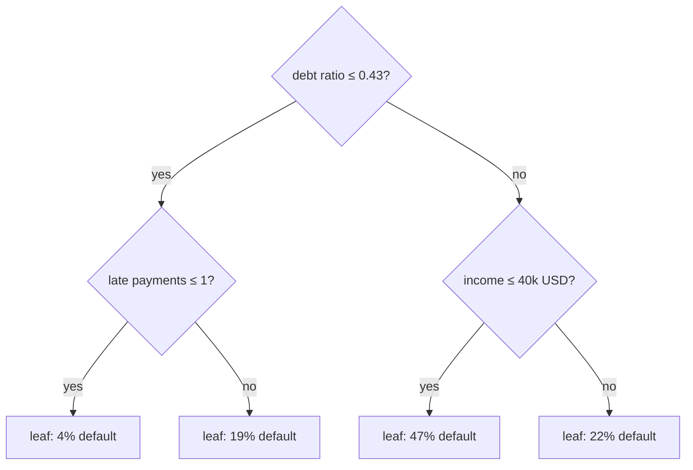
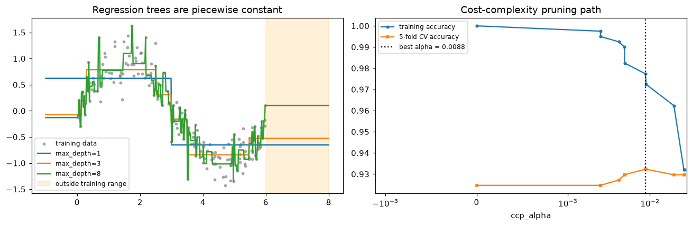
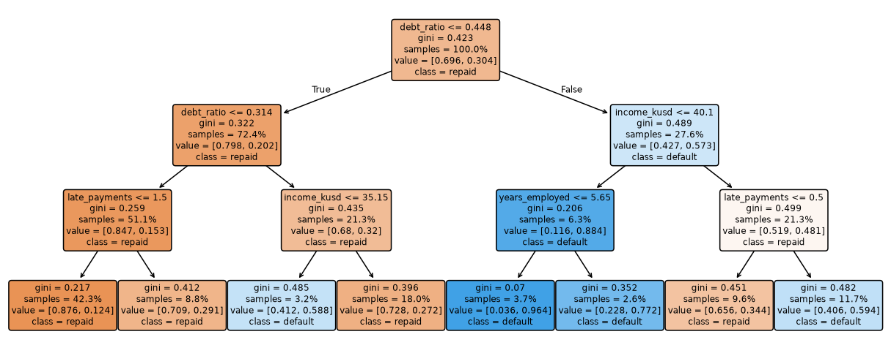

# Decision Trees

> **Level 4 · Chapter 2** · ⏱️ ~60 min read · Prerequisites: [Information theory and optimization](../01-math-foundations/06-information-theory-and-optimization.md), [Generalization and the bias-variance trade-off](../03-ml-fundamentals/04-generalization-bias-variance.md), [k-nearest neighbors and naive Bayes](01-knn-and-naive-bayes.md)

A decision tree predicts by asking a sequence of yes-or-no questions about the features, like a game of twenty questions. This chapter derives how trees choose their questions (Gini impurity, entropy, and information gain), builds the CART algorithm from scratch with recursion, extends it to regression, and shows how to stop and prune a tree so it generalizes. It ends with the two faces of trees: they're among the most interpretable models in ML, and among the most unstable.

## Why it matters

Priya built a loan-default model for a credit union. The risk committee insisted on something they could read, so Priya trained a decision tree of depth 4 and printed it as a set of rules. The committee loved it. The first rule, "debt-to-income ratio above 0.43 → high risk", matched their own experience, and every other rule had a story.

Three months later Priya retrained the tree on fresh data, as planned. The new tree's first question was about *years employed*, not debt ratio. Half the rules were different. The committee asked an awkward question: if the model's logic changes this much when a few hundred loans are added, which version is true? Did the bank's risk change, or did the model?

Neither. Overall accuracy was the same to within a percentage point. Decision trees are **unstable**: each split is chosen greedily from whichever feature looks best on *this* sample, and when two features are nearly tied, a small change in the data flips the winner, and everything below it changes too. Priya's fix was to report the tree as one plausible summary, use a [random forest](03-ensembles.md) for the actual scores, and check rules for stability across bootstrap samples before presenting them. To make calls like that, you need to understand how a tree is grown.

## Concepts

### Recursive partitioning

A **decision tree** is a flowchart. Each **internal node** asks a question about one feature, like "is debt ratio ≤ 0.43?". Each answer leads down a **branch** to another node, until you reach a **leaf**, which holds a prediction. The first node is the **root**. The number of questions on the longest path from root to leaf is the tree's **depth**.



Geometrically, each question with a threshold, "$x_j \le t$?", cuts the feature space with an axis-aligned line (a hyperplane perpendicular to axis $j$). The tree cuts space into boxes, one per leaf, and predicts a constant in each box: the majority class (or class proportions) for classification, the mean target for regression. So a tree is a **piecewise-constant** function:

$$
\hat{f}(\mathbf{x}) = \sum_{m=1}^{M} c_m\,\mathbb{1}[\mathbf{x} \in R_m],
$$

where $R_1, \ldots, R_M$ are the $M$ leaf regions (boxes), $c_m$ is the prediction in region $m$, and $\mathbb{1}[\cdot]$ is 1 when its condition is true and 0 otherwise.

Finding the best tree of a given size is computationally hopeless: Hyafil and Rivest showed in 1976 that building an optimal decision tree is NP-complete. So every practical algorithm is **greedy**. It picks the single best split at the root, divides the data in two, and then solves the same problem separately on each half. This is **recursive partitioning**, and the version used by scikit-learn is **CART** (Classification And Regression Trees), from Breiman, Friedman, Olshen, and Stone's 1984 book. CART always makes binary splits.

The recursion needs two things: a way to score a candidate split, and a rule for when to stop. Scoring comes from impurity.

### Impurity: measuring how mixed a node is

A node is **pure** if all its training points share one class. A good split produces children that are purer than the parent. To make "purer" precise, you need an **impurity** function of the class proportions in a node. Let $p_k$ be the fraction of the node's points in class $k$, for $K$ classes.

**Gini impurity**:

$$
G = \sum_{k=1}^{K} p_k (1 - p_k) = 1 - \sum_{k=1}^{K} p_k^2.
$$

It has a concrete meaning: pick a random point in the node and label it randomly according to the node's class proportions. $G$ is the probability that the label is wrong. A pure node has $G = 0$; a 50/50 binary node has $G = 0.5$.

**Entropy**, from [Information theory and optimization](../01-math-foundations/06-information-theory-and-optimization.md):

$$
H = -\sum_{k=1}^{K} p_k \log_2 p_k,
$$

with the convention $0 \log 0 = 0$. It's the average number of bits needed to encode the class of a random point from the node. A pure node has $H = 0$; a 50/50 binary node has $H = 1$ bit.

**Misclassification error**, $E = 1 - \max_k p_k$, is the error rate if the node predicts its majority class. It's what you ultimately care about, but it's a poor guide for growing trees, as you'll see shortly.

For two classes with $p$ the fraction of class 1: $G = 2p(1-p)$, $H = -p\log_2 p - (1-p)\log_2(1-p)$, and $E = \min(p, 1-p)$. All three are zero at $p = 0$ and $p = 1$ and peak at $p = 0.5$. Gini and entropy are smooth and strictly concave (curved downward); misclassification error is a tent made of two straight lines.

### Information gain

To score a split, compare the parent's impurity with the average impurity of its children, weighted by size. If a node with $n$ points splits into a left child with $n_L$ points and a right child with $n_R$ points, the **impurity decrease** is

$$
\Delta I = I(\text{parent}) - \left[\frac{n_L}{n} I(\text{left}) + \frac{n_R}{n} I(\text{right})\right].
$$

When $I$ is entropy, $\Delta I$ is called **information gain**: it equals the mutual information between the split's outcome and the class label, the number of bits of uncertainty about the class that the question removes. With Gini it's often called **Gini gain**. The greedy algorithm picks the split with the largest decrease, which is the same as the smallest weighted child impurity, because the parent's impurity is fixed.

**A worked example.** A node has 10 loans: 5 defaults and 5 repaid. Its Gini is $1 - 0.5^2 - 0.5^2 = 0.5$. Candidate split A sends 4 defaults and 1 repaid left, 1 default and 4 repaid right. Each child has Gini $1 - 0.8^2 - 0.2^2 = 0.32$, so the weighted child impurity is $0.32$ and the gain is $0.5 - 0.32 = 0.18$. Candidate split B sends 5 defaults and 3 repaid left (Gini $1 - (5/8)^2 - (3/8)^2 \approx 0.469$) and 2 repaid right (Gini 0). Weighted: $0.8 \times 0.469 + 0.2 \times 0 = 0.375$, a gain of 0.125. Split A wins.

**Why not misclassification error?** Because it often can't tell splits apart. Take a parent with 400 of each class (error 0.5). Split A gives children (300, 100) and (100, 300); split B gives (200, 400) and (200, 0). Both have weighted misclassification error $0.25$, a tie. But split B created a *pure* node, which is clearly progress: the left child can be split further, and the right is finished. Gini prefers B ($0.333$ vs $0.375$ weighted). The reason is the curvature. For a strictly concave impurity, the weighted average of the children's impurities is strictly below the parent's whenever the children's class proportions differ, and the more they differ, the bigger the gain. Misclassification error's flat segments give zero credit for any split that doesn't change the majority class in a child, even if it makes the child much purer, so tree growth can stall early.

In practice Gini and entropy almost always choose the same or nearly the same splits. Gini is a little cheaper (no logarithms) and is scikit-learn's default. Choose between them by cross-validation if you like, but don't expect much difference.

### Finding the best split

At a node with $n$ points and $d$ features, the candidates are every feature $j$ and every threshold $t$ between consecutive distinct values of $x_j$ (CART uses midpoints). That looks like a lot, but there's a fast trick. Sort the node's points by $x_j$. Moving the threshold one position to the right moves exactly one point from the right child to the left child, so you can update the class counts of both children in $O(1)$ per step, using cumulative sums. Scanning all thresholds for one feature then costs $O(n \log n)$ for the sort plus $O(n)$ for the scan, and a node costs $O(d\,n \log n)$. Summed over a balanced tree, each level of depth processes all $n$ points once, so growing a tree costs about $O(d\,n \log n \cdot \text{depth})$. Trees train fast.

A few properties follow from splitting on thresholds of single features:

- **No scaling needed.** A split depends only on the *order* of a feature's values. Any monotonic transform (standardizing, taking logs) leaves the tree unchanged. This makes trees comfortable with raw, messy tabular data.
- **Automatic feature selection.** A feature that never wins a split is never used. Irrelevant features hurt trees much less than they hurt kNN.
- **Interactions for free.** A split on income inside the "high debt" branch means the effect of income depends on debt: an interaction, discovered without anyone specifying it.
- **Axis-aligned boundaries.** A diagonal boundary like $x_1 > x_2$ needs a staircase of many small splits. Trees are inefficient for smooth, linear, or rotated relationships, which linear models capture with one weight per feature.

**Categorical features and missing values.** CART can split a categorical feature by partitioning its categories into two groups. scikit-learn's trees need numeric input, so you encode categories first (ordinal encoding works fine for trees, and one-hot works too). Histogram-based boosting in [Ensembles](03-ensembles.md) supports categories natively. scikit-learn's trees (version 1.3 and later) also handle missing values: at each split, they try sending the missing values left and right and keep whichever is better.

### Regression trees

For a numeric target, the leaf predicts the mean of its training targets, and the impurity is the **mean squared error** around that mean, which is just the node's variance:

$$
I(\text{node}) = \frac{1}{n}\sum_{i \in \text{node}} (y_i - \bar{y})^2.
$$

The best split minimizes the weighted variance of the children, which is the same as minimizing the total sum of squared errors after the split. Why the mean in each leaf? Because the constant $c$ that minimizes $\sum_i (y_i - c)^2$ is $c = \bar{y}$ (set the derivative $-2\sum_i(y_i - c)$ to zero). If you minimize absolute error instead (`criterion="absolute_error"`), the best constant is the median, which is more robust to outliers but slower to compute.

The same cumulative-sum trick works: keep running sums of $y$ and $y^2$ on each side, and use $\text{SSE} = \sum y^2 - (\sum y)^2/n$ to get each side's squared error in $O(1)$ per threshold.

Regression trees inherit the piecewise-constant shape, which has a consequence that bites people in practice: **trees can't extrapolate**. Outside the range of the training data, the prediction is flat, equal to the value of the outermost leaf. A tree trained on house prices up to 2023 will predict 2025 prices as if growth stopped. Linear models extrapolate (sometimes badly, but they do).

### Stopping: how deep to grow?

If you never stop, the tree keeps splitting until every leaf is pure (or contains identical feature vectors). That tree has zero training error and, on noisy data, high variance: it memorizes noise with tiny leaves, much like 1-nearest-neighbor. The depth of a tree is its capacity knob.

**Pre-pruning** (early stopping) stops growth with rules:

| Hyperparameter (scikit-learn) | Effect |
|---|---|
| `max_depth` | No path longer than this. The most direct capacity control. |
| `min_samples_split` | Don't split a node with fewer points than this. |
| `min_samples_leaf` | Every leaf must keep at least this many points. Smooths predictions; very effective for regression. |
| `max_leaf_nodes` | Grow best-first and stop at this many leaves. |
| `min_impurity_decrease` | Only split if the weighted impurity drops by at least this much. |

Pre-pruning is simple and cheap, but it can be short-sighted. Consider XOR: two features, class 1 when exactly one of them is positive. No single split reduces impurity much (each half is still 50/50), so a rule like "stop when the gain is tiny" stops at the root, even though *two* levels of splits would solve the problem perfectly. A split that looks useless can enable great splits below it.

### Cost-complexity pruning

**Post-pruning** solves that: grow a large tree first, then cut back branches that don't earn their keep. CART's method is **cost-complexity pruning** (also called weakest-link pruning). For a tree $T$ with $|T|$ leaves, define

$$
R_\alpha(T) = R(T) + \alpha\,|T|,
$$

where $R(T)$ is the tree's total training impurity (each leaf's impurity weighted by its fraction of the training points) and $\alpha \ge 0$ is a penalty per leaf. This is the same pattern as [Regularization](../03-ml-fundamentals/05-regularization.md): fit plus a complexity penalty. For each $\alpha$, there's a smallest subtree $T_\alpha$ of the full tree that minimizes $R_\alpha$. At $\alpha = 0$ it's the full tree; as $\alpha$ grows, it shrinks, until at large $\alpha$ only the root remains.

For a fixed $\alpha$, you can find $T_\alpha$ with a bottom-up pass. At each internal node $t$, compare two options: collapse $t$ into a leaf, costing $R(t) + \alpha$, or keep its (already optimally pruned) subtree $T_t$, costing $R(T_t) + \alpha|T_t|$. Keep whichever is cheaper. Rearranging, collapsing wins when

$$
\alpha \ge g(t) = \frac{R(t) - R(T_t)}{|T_t| - 1},
$$

the impurity reduction the subtree buys per extra leaf. Weakest-link pruning computes $g(t)$ for every internal node, prunes the node with the smallest $g(t)$ (the weakest link), and repeats. That yields the whole nested sequence of subtrees and the values of $\alpha$ at which each one becomes optimal. scikit-learn exposes this as `cost_complexity_pruning_path`, and you choose $\alpha$ (the `ccp_alpha` parameter) by cross-validation.

### Interpretability

A small tree is a model you can print, read, and argue with. Each prediction comes with its explanation: the path of questions from root to leaf. That's why trees are popular in credit, medicine, and operations, where people need to audit decisions. Two caveats keep this honest:

- **Only small trees are interpretable.** A depth-4 tree has at most 16 leaves, which a person can read. A depth-20 tree can have hundreds of thousands. Its rules are individually readable, but the model is not.
- **Readable is not the same as stable or causal.** The tree shows *a* set of rules that fit this sample, chosen greedily. As Priya learned, a different sample can give different rules with equal accuracy. And a split on a feature doesn't mean the feature causes the outcome.

Trees also give a **feature importance**: the total impurity decrease contributed by each feature, summed over all nodes that split on it (weighted by the fraction of samples reaching the node) and normalized to sum to 1. It's cheap and useful, but biased: features with many distinct values (continuous features, IDs) get more chances to find a lucky split and tend to look more important than they are, especially in deep trees. [Interpretability](../05-applied-ml/04-interpretability.md) covers permutation importance and SHAP, which are more reliable.

### Instability: the high-variance learner

Trees are **high-variance** learners: small changes in the training data can produce very different trees. The reason is structural. The root split is chosen by a hard argmax over all features and thresholds. If two candidates are nearly tied, which is common with correlated features, a few changed points can flip the winner. The root then partitions the data differently, so every split below it is computed on different subsets, and the change cascades down the tree.

The predictions vary less than the structure does (two different trees can make similar predictions), but they still vary a lot compared with a linear model. This weakness turns out to be an opportunity. If each tree is noisy but roughly unbiased, averaging many trees grown on different samples cancels much of the noise. That is exactly the idea behind bagging and random forests, the subject of the [next chapter](03-ensembles.md). Deep, unstable trees are the ideal ingredient for ensembles.

## In practice

### The impurity functions

```python
import numpy as np
import matplotlib.pyplot as plt

def gini(p):
    """Gini impurity for class-probability rows p (..., K)."""
    return 1 - (p**2).sum(axis=-1)

def entropy(p):
    """Entropy in bits; 0 log 0 = 0."""
    return -(p * np.log2(np.clip(p, 1e-300, 1))).sum(axis=-1)

def weighted_child_impurity(left_counts, right_counts, impurity=gini):
    l, r = np.asarray(left_counts, float), np.asarray(right_counts, float)
    nl, nr = l.sum(), r.sum()
    return (nl * impurity(l / nl) + nr * impurity(r / nr)) / (nl + nr)

# The worked example: 5 defaults / 5 repaid
print("parent Gini:", gini(np.array([0.5, 0.5])))
print("split A:", weighted_child_impurity([4, 1], [1, 4]).round(3),
      " split B:", weighted_child_impurity([5, 3], [0, 2]).round(3))
# The misclassification-error tie: (400, 400) parent
miscls = lambda p: 1 - p.max(axis=-1)
for name, f in [("misclass", miscls), ("gini", gini), ("entropy", entropy)]:
    a = weighted_child_impurity([300, 100], [100, 300], f)
    b = weighted_child_impurity([200, 400], [200, 0], f)
    print(f"{name:>9}: split A {a:.3f}   split B {b:.3f}")
```

```text
parent Gini: 0.5
split A: 0.32  split B: 0.375
 misclass: split A 0.250   split B 0.250
     gini: split A 0.375   split B 0.333
  entropy: split A 0.811   split B 0.689
```

Misclassification error ties the two splits; Gini and entropy both prefer split B, the one that creates a pure node.

### CART from scratch

The class below grows a binary tree recursively. `_best_split` evaluates every threshold of every feature at once with cumulative sums: class counts for classification, sums of $y$ and $y^2$ for regression. Leaves store class proportions or the mean. It also records each node's impurity and size, which the pruning step needs.

```python
from dataclasses import dataclass
from sklearn.datasets import load_breast_cancer
from sklearn.model_selection import train_test_split
from sklearn.tree import DecisionTreeClassifier, DecisionTreeRegressor

@dataclass
class Node:
    value: np.ndarray            # class proportions (classification) or [mean] (regression)
    impurity: float
    n: int
    feature: int | None = None
    threshold: float | None = None
    left: "Node | None" = None
    right: "Node | None" = None

class CART:
    def __init__(self, criterion="gini", max_depth=None, min_samples_split=2, min_samples_leaf=1):
        self.criterion, self.max_depth = criterion, max_depth if max_depth is not None else np.inf
        self.min_samples_split, self.min_samples_leaf = min_samples_split, min_samples_leaf
        self.is_clf = criterion in ("gini", "entropy")
        self._imp = {"gini": gini, "entropy": entropy}.get(criterion)

    # ---- impurity of a node and of all candidate splits ----
    def _node_stats(self, y):
        if self.is_clf:
            p = np.bincount(y, minlength=self.n_classes_) / len(y)
            return p, float(self._imp(p))
        return np.array([y.mean()]), float(y.var())

    def _best_split(self, X, y):
        n, d = X.shape
        best_j, best_t, best_score = None, None, np.inf
        nl = np.arange(1, n)                                   # left sizes for thresholds 1..n-1
        nr = n - nl
        size_ok = (nl >= self.min_samples_leaf) & (nr >= self.min_samples_leaf)
        for j in range(d):
            order = np.argsort(X[:, j], kind="stable")
            xs, ys = X[order, j], y[order]
            if self.is_clf:
                left = np.cumsum(np.eye(self.n_classes_)[ys], axis=0)[:-1]    # class counts, left
                right = left[-1] + np.eye(self.n_classes_)[ys[-1]] - left     # total - left
                score = (nl * self._imp(left / nl[:, None]) + nr * self._imp(right / nr[:, None])) / n
            else:
                s, s2 = np.cumsum(ys)[:-1], np.cumsum(ys**2)[:-1]
                tot, tot2 = ys.sum(), (ys**2).sum()
                sse_l = s2 - s**2 / nl
                sse_r = (tot2 - s2) - (tot - s) ** 2 / nr
                score = (sse_l + sse_r) / n                                    # weighted variance
            valid = size_ok & (xs[1:] > xs[:-1])          # can only cut between distinct values
            if valid.any():
                i = np.argmin(np.where(valid, score, np.inf))
                if score[i] < best_score:
                    best_j, best_t, best_score = j, (xs[i] + xs[i + 1]) / 2, score[i]
        return best_j, best_t

    # ---- recursive growth ----
    def _grow(self, X, y, depth):
        value, imp = self._node_stats(y)
        node = Node(value=value, impurity=imp, n=len(y))
        if depth < self.max_depth and len(y) >= self.min_samples_split and imp > 1e-12:
            j, t = self._best_split(X, y)
            if j is not None:
                mask = X[:, j] <= t
                node.feature, node.threshold = j, t
                node.left = self._grow(X[mask], y[mask], depth + 1)
                node.right = self._grow(X[~mask], y[~mask], depth + 1)
        return node

    def fit(self, X, y):
        X = np.asarray(X, float)
        if self.is_clf:
            self.classes_, y = np.unique(y, return_inverse=True)
            self.n_classes_ = len(self.classes_)
        self.n_ = len(y)
        self.root_ = self._grow(X, np.asarray(y), 0)
        return self

    # ---- prediction ----
    def _leaf_values(self, X):
        out = np.empty((len(X), len(self.root_.value)))
        for i, x in enumerate(np.asarray(X, float)):
            node = self.root_
            while node.feature is not None:
                node = node.left if x[node.feature] <= node.threshold else node.right
            out[i] = node.value
        return out

    def predict(self, X):
        v = self._leaf_values(X)
        return self.classes_[v.argmax(1)] if self.is_clf else v[:, 0]

    def n_leaves(self, node=None):
        node = node or self.root_
        return 1 if node.feature is None else self.n_leaves(node.left) + self.n_leaves(node.right)

X, y = load_breast_cancer(return_X_y=True)
X_tr, X_te, y_tr, y_te = train_test_split(X, y, test_size=0.3, stratify=y, random_state=0)
for crit in ["gini", "entropy"]:
    for depth in [3, None]:
        ours = CART(criterion=crit, max_depth=depth).fit(X_tr, y_tr)
        sk = DecisionTreeClassifier(criterion=crit, max_depth=depth, random_state=0).fit(X_tr, y_tr)
        agree = (ours.predict(X_te) == sk.predict(X_te)).mean()
        print(f"{crit:>7}, max_depth={str(depth):>4}: ours {(ours.predict(X_te) == y_te).mean():.3f} "
              f"({ours.n_leaves()} leaves), sklearn {sk.score(X_te, y_te):.3f} "
              f"({sk.get_n_leaves()} leaves), prediction agreement {agree:.3f}")
ours = CART(max_depth=3).fit(X_tr, y_tr)
sk = DecisionTreeClassifier(max_depth=3, random_state=0).fit(X_tr, y_tr)
print("root split, ours:   feature", ours.root_.feature, "<=", round(ours.root_.threshold, 4))
print("root split, sklearn: feature", sk.tree_.feature[0], "<=", round(float(sk.tree_.threshold[0]), 4))
```

```text
   gini, max_depth=   3: ours 0.906 (8 leaves), sklearn 0.901 (8 leaves), prediction agreement 0.994
   gini, max_depth=None: ours 0.918 (16 leaves), sklearn 0.906 (16 leaves), prediction agreement 0.988
entropy, max_depth=   3: ours 0.912 (7 leaves), sklearn 0.912 (7 leaves), prediction agreement 1.000
entropy, max_depth=None: ours 0.924 (12 leaves), sklearn 0.930 (12 leaves), prediction agreement 0.982
root split, ours:   feature 22 <= 106.1
root split, sklearn: feature 22 <= 106.1
```

The from-scratch tree finds the same root split and essentially the same tree as scikit-learn. Any small differences come from tie-breaking between equally good splits and from scikit-learn storing features as 32-bit floats. Notice too that growing to full depth doubles the number of leaves but buys only about one percentage point of test accuracy here; most of the extra leaves fit noise.

### Regression trees and the extrapolation trap

The same class handles regression with `criterion="mse"`. Fit trees of increasing depth to a noisy sine wave, then ask them to predict beyond the training range:

```python
rng = np.random.default_rng(0)
x_reg = np.sort(rng.uniform(0, 6, 200))
y_reg = np.sin(x_reg) + 0.25 * rng.normal(size=200)
X_reg = x_reg[:, None]

grid = np.linspace(-1, 8, 500)[:, None]       # includes points outside [0, 6]
fits = {}
for depth in [1, 3, 8]:
    ours = CART(criterion="mse", max_depth=depth).fit(X_reg, y_reg)
    sk = DecisionTreeRegressor(max_depth=depth, random_state=0).fit(X_reg, y_reg)
    fits[depth] = ours.predict(grid)
    print(f"depth {depth}: {ours.n_leaves():>3} leaves, matches sklearn: {np.allclose(fits[depth], sk.predict(grid))}")
tree3 = CART(criterion="mse", max_depth=3).fit(X_reg, y_reg)
print("depth-3 predictions at x = 6.5, 7.0, 8.0:", tree3.predict(np.array([[6.5], [7.0], [8.0]])).round(3))
print("true sin at those points:              ", np.sin([6.5, 7.0, 8.0]).round(3))
```

```text
depth 1:   2 leaves, matches sklearn: True
depth 3:   8 leaves, matches sklearn: True
depth 8:  93 leaves, matches sklearn: True
depth-3 predictions at x = 6.5, 7.0, 8.0: [-0.528 -0.528 -0.528]
true sin at those points:               [0.215 0.657 0.989]
```

Past $x = 6$ the tree just repeats its last leaf, while the true function keeps moving. Keep this in mind when you forecast with trees in [Time series forecasting](07-time-series.md): trend has to be handled before the tree sees the data.

### Cost-complexity pruning from scratch

Pruning with a fixed $\alpha$ is a short recursive function: at each internal node, prune the children first, then collapse the node if being a leaf is no more expensive than keeping its subtree. Here $R(t)$ is the node's impurity weighted by its share of the training points, exactly as in scikit-learn.

```python
import copy

def prune(tree, alpha):
    """Return a copy of a fitted CART pruned to minimize R(T) + alpha * |T|."""
    tree = copy.deepcopy(tree)
    def visit(node):                          # returns (cost of best subtree, number of leaves)
        leaf_cost = node.n / tree.n_ * node.impurity + alpha
        if node.feature is None:
            return leaf_cost, 1
        cl, ll = visit(node.left)
        cr, lr = visit(node.right)
        if leaf_cost <= cl + cr:              # collapsing is at least as good: g(t) <= alpha
            node.feature = node.threshold = node.left = node.right = None
            return leaf_cost, 1
        return cl + cr, ll + lr
    visit(tree.root_)
    return tree

full = CART(criterion="gini").fit(X_tr, y_tr)
print(f"{'alpha':>7} {'ours: leaves':>13} {'sklearn: leaves':>16} {'test acc (ours)':>16}")
for alpha in [0.0, 0.002, 0.005, 0.01, 0.03, 0.1]:
    pruned = prune(full, alpha)
    sk = DecisionTreeClassifier(ccp_alpha=alpha, random_state=0).fit(X_tr, y_tr)
    print(f"{alpha:7.3f} {pruned.n_leaves():>13} {sk.get_n_leaves():>16} "
          f"{(pruned.predict(X_te) == y_te).mean():>16.3f}")
```

```text
  alpha  ours: leaves  sklearn: leaves  test acc (ours)
  0.000            16               16            0.918
  0.002            16               16            0.918
  0.005             7                7            0.924
  0.010             5                5            0.918
  0.030             2                2            0.889
  0.100             2                2            0.889
```

The pruned sizes match scikit-learn's `ccp_alpha`. Now choose $\alpha$ properly, with cross-validation over the pruning path, and plot both kinds of tree behavior side by side: the regression fits from before, and accuracy along the pruning path.

```python
from sklearn.model_selection import cross_val_score

path = DecisionTreeClassifier(random_state=0).cost_complexity_pruning_path(X_tr, y_tr)
alphas = path.ccp_alphas[:-1]                 # the last alpha prunes to the root
train_acc, cv_acc = [], []
for a in alphas:
    clf = DecisionTreeClassifier(ccp_alpha=a, random_state=0)
    train_acc.append(clf.fit(X_tr, y_tr).score(X_tr, y_tr))
    cv_acc.append(cross_val_score(clf, X_tr, y_tr, cv=5).mean())
best = alphas[int(np.argmax(cv_acc))]
final = DecisionTreeClassifier(ccp_alpha=best, random_state=0).fit(X_tr, y_tr)
print(f"{len(alphas)} candidate alphas; best ccp_alpha = {best:.4f}, "
      f"{final.get_n_leaves()} leaves, CV acc {max(cv_acc):.3f}, test acc {final.score(X_te, y_te):.3f}")

fig, axes = plt.subplots(1, 2, figsize=(12, 4))
axes[0].scatter(x_reg, y_reg, s=8, color="gray", alpha=0.6, label="training data")
for depth, style in zip([1, 3, 8], ["-", "-", "-"]):
    axes[0].plot(grid[:, 0], fits[depth], style, lw=1.6, label=f"max_depth={depth}")
axes[0].axvspan(6, 8, color="orange", alpha=0.15, label="outside training range")
axes[0].set_title("Regression trees are piecewise constant"); axes[0].legend(fontsize=8)
axes[1].plot(alphas, train_acc, "o-", ms=3, label="training accuracy")
axes[1].plot(alphas, cv_acc, "s-", ms=3, label="5-fold CV accuracy")
axes[1].axvline(best, color="k", ls=":", label=f"best alpha = {best:.4f}")
axes[1].set_xscale("symlog", linthresh=1e-3); axes[1].set_xlabel("ccp_alpha")
axes[1].set_title("Cost-complexity pruning path"); axes[1].legend(fontsize=8)
plt.tight_layout()
plt.show()
```

```text
11 candidate alphas; best ccp_alpha = 0.0088, 6 leaves, CV acc 0.932, test acc 0.918
```



*Left: deeper regression trees follow the data more closely (depth 8 starts chasing noise), and none of them extrapolates. Right: pruning trades training accuracy for simplicity; cross-validation picks the alpha where held-out accuracy peaks.*

### Reading a tree, and watching it wobble

Back to Priya's problem, with a synthetic loan dataset in which default depends on debt ratio, late payments, income, and years employed, with an interaction between debt and income.

```python
import pandas as pd
from sklearn.tree import export_text, plot_tree

def make_loans(n, seed):
    rng = np.random.default_rng(seed)
    df = pd.DataFrame({
        "income_kusd": rng.lognormal(np.log(55), 0.4, n).round(1),
        "debt_ratio": rng.beta(2, 4, n).round(3),
        "years_employed": rng.exponential(6, n).round(1),
        "late_payments": rng.poisson(0.8, n),
    })
    logit = (-3 + 5 * df.debt_ratio + 0.7 * df.late_payments - 0.08 * df.years_employed
             + 3 * df.debt_ratio * (df.income_kusd < 40))
    df["default"] = (rng.random(n) < 1 / (1 + np.exp(-logit))).astype(int)
    return df

loans = make_loans(3000, seed=1)
features = ["income_kusd", "debt_ratio", "years_employed", "late_payments"]
tree = DecisionTreeClassifier(max_depth=3, min_samples_leaf=50, random_state=0)
tree.fit(loans[features], loans["default"])
print(export_text(tree, feature_names=features, show_weights=False, decimals=2))

fig, ax = plt.subplots(figsize=(14, 5.5))
plot_tree(tree, feature_names=features, class_names=["repaid", "default"], filled=True,
          impurity=True, proportion=True, rounded=True, fontsize=8, ax=ax)
plt.show()
```

```text
|--- debt_ratio <= 0.45
|   |--- debt_ratio <= 0.31
|   |   |--- late_payments <= 1.50
|   |   |   |--- class: 0
|   |   |--- late_payments >  1.50
|   |   |   |--- class: 0
|   |--- debt_ratio >  0.31
|   |   |--- income_kusd <= 35.15
|   |   |   |--- class: 1
|   |   |--- income_kusd >  35.15
|   |   |   |--- class: 0
|--- debt_ratio >  0.45
|   |--- income_kusd <= 40.10
|   |   |--- years_employed <= 5.65
|   |   |   |--- class: 1
|   |   |--- years_employed >  5.65
|   |   |   |--- class: 1
|   |--- income_kusd >  40.10
|   |   |--- late_payments <= 0.50
|   |   |   |--- class: 0
|   |   |--- late_payments >  0.50
|   |   |   |--- class: 1
```



*A depth-3 tree on the synthetic loans. Each box shows the split, the Gini impurity, the share of samples, and the class proportions; darker orange means more repaid, darker blue more defaults.*

Now refit the same tree on bootstrap resamples of the data (sampling rows with replacement) and look at the root split and the test predictions:

```python
loans_test = make_loans(2000, seed=99)
preds, roots = [], []
for b in range(8):
    boot = loans.sample(frac=1.0, replace=True, random_state=b)
    t = DecisionTreeClassifier(max_depth=3, min_samples_leaf=50, random_state=0).fit(boot[features], boot["default"])
    roots.append(f"{features[t.tree_.feature[0]]} <= {t.tree_.threshold[0]:.2f}")
    preds.append(t.predict_proba(loans_test[features])[:, 1])
    second = [features[f] for f in t.tree_.feature[[t.tree_.children_left[0], t.tree_.children_right[0]]]]
    print(f"bootstrap {b}: root {roots[-1]:<24} second-level splits on {second}")
preds = np.array(preds)
print("mean std of predicted default probability across the 8 trees:", preds.std(axis=0).mean().round(3))
print("mean std after averaging 8 trees (estimated, if errors were independent):",
      (preds.std(axis=0).mean() / np.sqrt(8)).round(3))
```

```text
bootstrap 0: root debt_ratio <= 0.46       second-level splits on ['late_payments', 'income_kusd']
bootstrap 1: root debt_ratio <= 0.47       second-level splits on ['debt_ratio', 'income_kusd']
bootstrap 2: root debt_ratio <= 0.39       second-level splits on ['late_payments', 'income_kusd']
bootstrap 3: root debt_ratio <= 0.37       second-level splits on ['late_payments', 'income_kusd']
bootstrap 4: root debt_ratio <= 0.41       second-level splits on ['late_payments', 'income_kusd']
bootstrap 5: root debt_ratio <= 0.38       second-level splits on ['late_payments', 'income_kusd']
bootstrap 6: root debt_ratio <= 0.43       second-level splits on ['income_kusd', 'income_kusd']
bootstrap 7: root debt_ratio <= 0.46       second-level splits on ['debt_ratio', 'income_kusd']
mean std of predicted default probability across the 8 trees: 0.077
mean std after averaging 8 trees (estimated, if errors were independent): 0.027
```

The root threshold moves from sample to sample, and the splits below it change more. The root feature is stable here because debt ratio is by far the strongest signal, but the threshold and the second-level splits are not, and for a typical loan the predicted default probability has a standard deviation of about 8 percentage points depending only on which resample the tree happened to see. Averaging many such trees reduces that spread, which is exactly what the [next chapter](03-ensembles.md) does.

!!! warning "Common mistake: trusting impurity importance"
    Impurity-based `feature_importances_` are computed on training data and favor features with many distinct values. Add a pure-noise column of random numbers and a deep tree will often give it real importance:

    ```python
    rng = np.random.default_rng(0)
    X_noise = loans[features].assign(random_id=rng.random(len(loans)))
    deep = DecisionTreeClassifier(random_state=0).fit(X_noise, loans["default"])
    print(pd.Series(deep.feature_importances_, index=X_noise.columns).round(3).sort_values(ascending=False))
    ```

    ```text
    debt_ratio        0.350
    income_kusd       0.238
    random_id         0.193
    years_employed    0.161
    late_payments     0.058
    dtype: float64
    ```

    The random column, which contains no information at all, looks substantial because a fully grown tree uses it to memorize individual training points. Use permutation importance on held-out data instead (see [Interpretability](../05-applied-ml/04-interpretability.md)).

## Exercises

### Exercise 1: Impurities by hand (easy)

A node holds 12 points: 6 of class A, 4 of class B, and 2 of class C. Compute its Gini impurity, its entropy in bits, and its misclassification error. Then check with the `gini` and `entropy` functions above.

??? success "Solution"

    Proportions: $p = (1/2, 1/3, 1/6)$.

    - Gini: $1 - (1/4 + 1/9 + 1/36) = 1 - (9 + 4 + 1)/36 = 1 - 14/36 = 22/36 \approx 0.611$.
    - Entropy: $-(0.5\log_2 0.5 + \tfrac{1}{3}\log_2\tfrac{1}{3} + \tfrac{1}{6}\log_2\tfrac{1}{6}) = 0.5 + 0.528 + 0.431 \approx 1.459$ bits.
    - Misclassification error: $1 - 1/2 = 0.5$.

    ```python
    p = np.array([6, 4, 2]) / 12
    print(round(gini(p), 4), round(entropy(p), 4), 1 - p.max())
    ```

    ```text
    0.6111 1.4591 0.5
    ```

### Exercise 2: Best split by hand (easy)

Feature values and labels for six points: $x = (1, 2, 3, 4, 5, 6)$, $y = (0, 0, 1, 0, 1, 1)$. List the candidate thresholds, compute the weighted Gini of the children for each, and pick the best split. What does the from-scratch `CART` choose?

??? success "Solution"

    Candidate thresholds are the midpoints 1.5, 2.5, 3.5, 4.5, 5.5.

    | Threshold | Left labels | Right labels | Weighted Gini |
    |---|---|---|---|
    | 1.5 | 0 | 0,1,0,1,1 | $\frac{1}{6}\cdot 0 + \frac{5}{6}\cdot 0.48 = 0.400$ |
    | 2.5 | 0,0 | 1,0,1,1 | $\frac{4}{6}\cdot 0.375 = 0.250$ |
    | 3.5 | 0,0,1 | 0,1,1 | $2 \cdot \frac{3}{6}\cdot 0.444 = 0.444$ |
    | 4.5 | 0,0,1,0 | 1,1 | $\frac{4}{6}\cdot 0.375 = 0.250$ |
    | 5.5 | 0,0,1,0,1 | 1 | $\frac{5}{6}\cdot 0.48 = 0.400$ |

    Thresholds 2.5 and 4.5 tie at 0.25. The from-scratch code keeps the first one it finds (`np.argmin` returns the first minimum), so it splits at 2.5:

    ```python
    stump = CART(max_depth=1).fit(np.arange(1, 7)[:, None], np.array([0, 0, 1, 0, 1, 1]))
    print(stump.root_.feature, stump.root_.threshold)
    ```

    ```text
    0 2.5
    ```

    This tie is a miniature version of tree instability: a one-point change in the data would break it one way or the other.

### Exercise 3: Why greedy fails on XOR (medium)

Generate 400 points uniform in $[-1, 1]^2$ with label $y = \mathbb{1}[x_1 x_2 > 0]$. (a) Compute the Gini gain of the best root split. (b) Train `DecisionTreeClassifier(max_depth=2)` and `DecisionTreeClassifier(max_depth=2, min_impurity_decrease=0.01)`, and compare their accuracy. Explain the result.

??? success "Solution"

    ```python
    rng = np.random.default_rng(0)
    Xx = rng.uniform(-1, 1, (400, 2)); yx = (Xx[:, 0] * Xx[:, 1] > 0).astype(int)
    root = DecisionTreeClassifier(max_depth=1).fit(Xx, yx).tree_
    gain = root.impurity[0] - (root.n_node_samples[1] * root.impurity[1]
                               + root.n_node_samples[2] * root.impurity[2]) / root.n_node_samples[0]
    print("best root Gini gain:", round(gain, 4))
    for mid in [0.0, 0.01]:
        t = DecisionTreeClassifier(max_depth=2, min_impurity_decrease=mid, random_state=0).fit(Xx, yx)
        print(f"min_impurity_decrease={mid}: accuracy {t.score(Xx, yx):.3f}, leaves {t.get_n_leaves()}")
    ```

    ```text
    best root Gini gain: 0.0074
    min_impurity_decrease=0.0: accuracy 1.000, leaves 4
    min_impurity_decrease=0.01: accuracy 0.547, leaves 1
    ```

    No single axis-aligned cut separates XOR: each half still contains both classes in roughly equal measure, so the best root gain is tiny (it's nonzero only through sampling noise). With no minimum gain, the tree makes the weak root split anyway, and the second level then finds splits with large gains near zero, solving the problem. With `min_impurity_decrease=0.01`, the root fails the threshold and the tree stays a single leaf at chance accuracy. Early stopping is short-sighted; growing deep and pruning afterwards avoids this trap.

### Exercise 4: The staircase (medium)

Generate 1,000 points uniform in $[0, 1]^2$ labeled $y = \mathbb{1}[x_2 > x_1]$. Compare cross-validated accuracy and model size of a decision tree (tuned over `max_depth`) with logistic regression. Then fit the tree on the rotated features $(x_2 - x_1, x_1 + x_2)$. What changes and why?

??? success "Solution"

    ```python
    from sklearn.linear_model import LogisticRegression
    from sklearn.model_selection import GridSearchCV
    rng = np.random.default_rng(1)
    Xs = rng.random((1000, 2)); ys = (Xs[:, 1] > Xs[:, 0]).astype(int)
    gs = GridSearchCV(DecisionTreeClassifier(random_state=0), {"max_depth": [2, 4, 6, 8, 10, None]}, cv=5).fit(Xs, ys)
    print("tree: CV acc", round(gs.best_score_, 3), "leaves", gs.best_estimator_.get_n_leaves())
    print("logreg: CV acc", cross_val_score(LogisticRegression(C=100), Xs, ys, cv=5).mean().round(3))
    Xr = np.c_[Xs[:, 1] - Xs[:, 0], Xs[:, 0] + Xs[:, 1]]
    print("tree on rotated features: CV acc",
          cross_val_score(DecisionTreeClassifier(max_depth=1), Xr, ys, cv=5).mean().round(3))
    ```

    ```text
    tree: CV acc 0.961 leaves 32
    logreg: CV acc 0.997
    tree on rotated features: CV acc 1.0
    ```

    The boundary is a diagonal line. Logistic regression represents it exactly with two weights. A tree approximates it with an axis-aligned staircase that needs many leaves and still makes errors near the line. After rotating the features so that one of them is $x_2 - x_1$, the boundary becomes "$x_2 - x_1 > 0$", a single axis-aligned split, and a depth-1 tree is perfect. Feature engineering can matter more than the choice of model.

### Exercise 5: Add `min_impurity_decrease` and a depth report (hard)

Extend the from-scratch `CART` with a `min_impurity_decrease` parameter that matches scikit-learn's definition: split only if $\frac{n_t}{N}\left[I(t) - \frac{n_L}{n_t}I(L) - \frac{n_R}{n_t}I(R)\right] \ge$ the threshold, where $N$ is the total number of training points. Also add a `depth()` method. Check leaf counts against scikit-learn for a few thresholds on the breast cancer data.

??? success "Solution"

    The weighted impurity decrease needs the parent's impurity and the best child score, so `_best_split` should also return its score. A subclass keeps the change small:

    ```python
    class CART2(CART):
        def __init__(self, min_impurity_decrease=0.0, **kw):
            super().__init__(**kw)
            self.min_impurity_decrease = min_impurity_decrease

        def _grow(self, X, y, depth):
            value, imp = self._node_stats(y)
            node = Node(value=value, impurity=imp, n=len(y))
            if depth < self.max_depth and len(y) >= self.min_samples_split and imp > 1e-12:
                j, t = self._best_split(X, y)
                if j is not None:
                    mask = X[:, j] <= t
                    _, imp_l = self._node_stats(y[mask])
                    _, imp_r = self._node_stats(y[~mask])
                    child = (mask.sum() * imp_l + (~mask).sum() * imp_r) / len(y)
                    if len(y) / self.n_ * (imp - child) >= self.min_impurity_decrease:
                        node.feature, node.threshold = j, t
                        node.left = self._grow(X[mask], y[mask], depth + 1)
                        node.right = self._grow(X[~mask], y[~mask], depth + 1)
            return node

        def depth(self, node=None):
            node = node or self.root_
            return 0 if node.feature is None else 1 + max(self.depth(node.left), self.depth(node.right))

    for mid in [0.0, 0.002, 0.01, 0.05]:
        ours = CART2(min_impurity_decrease=mid).fit(X_tr, y_tr)
        sk = DecisionTreeClassifier(min_impurity_decrease=mid, random_state=0).fit(X_tr, y_tr)
        print(f"{mid:.3f}: ours {ours.n_leaves()} leaves, depth {ours.depth()} | "
              f"sklearn {sk.get_n_leaves()} leaves, depth {sk.get_depth()}")
    ```

    ```text
    0.000: ours 16 leaves, depth 6 | sklearn 16 leaves, depth 6
    0.002: ours 12 leaves, depth 5 | sklearn 12 leaves, depth 5
    0.010: ours 5 leaves, depth 3 | sklearn 5 leaves, depth 3
    0.050: ours 2 leaves, depth 1 | sklearn 2 leaves, depth 1
    ```

    Note the subtle point: `fit` sets `self.n_` before `_grow` runs, so the weighting by $n_t / N$ is available during growth.

### Exercise 6: Interpretable, stable, or accurate? (hard, conceptual)

A hospital wants a model to flag patients for a sepsis screening. Clinicians insist they must be able to read the model. You have 8,000 patients and 40 features, many correlated (several blood measurements move together). Propose an approach that balances interpretability, stability, and accuracy, and say how you'd demonstrate each.

??? success "Solution"

    One reasonable plan:

    - **Accuracy benchmark:** first fit a strong black-box model (a gradient-boosted ensemble from the [next chapter](03-ensembles.md)) with proper cross-validation. This tells you the accuracy ceiling and the cost of insisting on interpretability.
    - **Interpretable candidate:** a shallow tree (depth 3 to 5, tuned with cost-complexity pruning) or a sparse logistic regression. Report its cross-validated performance next to the benchmark, so clinicians can see the trade-off in numbers (for example, recall at the screening threshold).
    - **Stability:** refit the tree on many bootstrap resamples and report how often each rule (root feature, top splits) appears. Because the blood measurements are correlated, expect the tree to swap between them; consider grouping or pre-selecting one representative per correlated group so the rules stay put.
    - **Honesty about what the rules mean:** the splits are associations in this hospital's data, not causal mechanisms, and they should be validated on later patients (a temporal split) before use.

    If the interpretable model is close to the benchmark, use it. If the gap is large, a common compromise is to use the accurate model for scoring and the shallow tree as a global explanation of it, clearly labeled as an approximation.

## Check yourself

1. What does a decision tree's prediction function look like geometrically?

    ??? note "Answer"

        Piecewise constant over axis-aligned boxes: each leaf is a box in feature space, and the prediction is constant inside it.

2. Why do practical algorithms grow trees greedily instead of finding the best tree?

    ??? note "Answer"

        Finding an optimal tree is NP-complete, so exact search is infeasible beyond tiny problems. Greedy top-down splitting is fast and works well in practice, at the cost of sometimes missing splits that only pay off later (like XOR).

3. Define Gini impurity and entropy, and state their values for a pure node and a 50/50 binary node.

    ??? note "Answer"

        Gini $= 1 - \sum_k p_k^2$; entropy $= -\sum_k p_k\log_2 p_k$. Pure node: both 0. A 50/50 binary node: Gini 0.5, entropy 1 bit.

4. Why is misclassification error a poor criterion for growing trees?

    ??? note "Answer"

        It's piecewise linear rather than strictly concave, so it often gives zero gain to splits that make children purer without changing their majority class. Gini and entropy reward any increase in purity, so growth doesn't stall.

5. What does a regression tree's leaf predict, and why?

    ??? note "Answer"

        The mean of the leaf's training targets, because the mean minimizes squared error within the leaf. With absolute-error criterion, the median.

6. Why don't trees need feature scaling, and why can't they extrapolate?

    ??? note "Answer"

        Splits depend only on the order of values within a feature, which monotonic transforms preserve. Beyond the training range, every point falls into an outermost leaf, so the prediction is that leaf's constant.

7. What is cost-complexity pruning minimizing, and how is $\alpha$ chosen?

    ??? note "Answer"

        $R(T) + \alpha|T|$: training impurity plus a penalty per leaf. Each $\alpha$ selects a subtree of the full tree; $\alpha$ is chosen by cross-validation over the pruning path.

8. Why are decision trees unstable, and why is that useful for ensembles?

    ??? note "Answer"

        Splits are chosen by a hard argmax among near-tied candidates, and a change at the top cascades down. Their high variance with low bias is exactly what averaging over many trees (bagging, random forests) reduces.

## Key takeaways

- A decision tree recursively splits the data with yes-or-no questions on single features, producing axis-aligned boxes with a constant prediction in each.
- Splits are chosen greedily to maximize impurity decrease (Gini gain or information gain). Strictly concave impurities reward purer children; misclassification error doesn't.
- Fast split search sorts each feature once and scans thresholds with cumulative counts or sums. Regression trees use variance as impurity and predict leaf means.
- Unrestricted trees overfit. Control capacity with pre-pruning (`max_depth`, `min_samples_leaf`) or cost-complexity post-pruning with `ccp_alpha` chosen by cross-validation.
- Trees need no scaling, handle interactions and mixed data, and small ones are readable. They can't extrapolate and handle diagonal boundaries poorly.
- Trees are unstable, high-variance learners. That makes single trees hard to trust, and ensembles of trees very powerful.

## Further reading

- Breiman, Friedman, Olshen, and Stone, *Classification and Regression Trees*, Wadsworth, 1984. The original CART book, including cost-complexity pruning.
- Hastie, Tibshirani, and Friedman, *The Elements of Statistical Learning*, 2nd ed., Springer, 2009: Section 9.2, tree-based methods.
- James, Witten, Hastie, and Tibshirani, *An Introduction to Statistical Learning*, 2nd ed., Springer, 2021: Chapter 8, a gentler treatment with labs.
- scikit-learn user guide: [Decision Trees](https://scikit-learn.org/stable/modules/tree.html), including the mathematical formulation and the pruning example.

## Next

A single tree is readable but unstable. Grow hundreds of them and combine their votes, and you get some of the most accurate models for tabular data: [Ensembles: random forests and boosting](03-ensembles.md).
