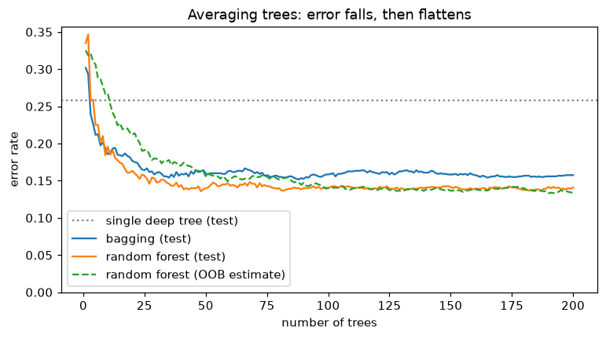
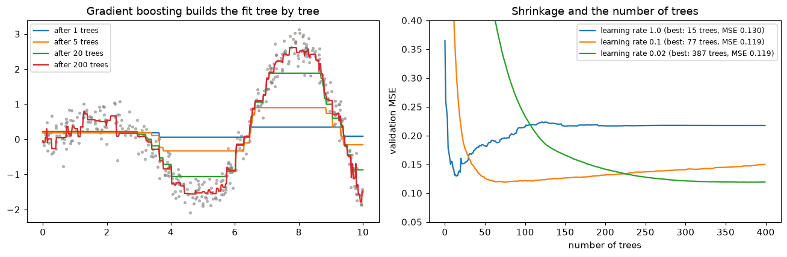

# Ensembles: Random Forests and Boosting

> **Level 4 · Chapter 3** · ⏱️ ~75 min read · Prerequisites: [Decision trees](02-decision-trees.md), [Gradient descent in depth](../03-ml-fundamentals/07-gradient-descent-in-depth.md), [Generalization and the bias-variance trade-off](../03-ml-fundamentals/04-generalization-bias-variance.md)

One decision tree is unstable and often mediocre. Hundreds of trees, combined the right way, are among the most accurate models in machine learning for tabular data. This chapter covers the two big ideas for combining them: **bagging** (train many trees independently and average them, which reduces variance) and **boosting** (train trees in sequence, each fixing the last one's mistakes, which reduces bias). You'll derive random forests and their out-of-bag error, AdaBoost's weight update, and gradient boosting as gradient descent in function space, build each from scratch, and then use the industrial-strength libraries: XGBoost, LightGBM, and scikit-learn's histogram gradient boosting.

## Why it matters

Alex's team at an insurance company spent two months on a deep neural network to predict claim costs from 60 policy features: driver age, vehicle value, region, prior claims, and so on. They tuned architectures, added embeddings for categorical features, and tried three normalization schemes. It beat their old linear model by a respectable margin.

Then a new hire, Wei, ran a gradient-boosted tree model with mostly default settings and early stopping, as a sanity check before a review meeting. It took an afternoon and trained in under a minute on a laptop. It matched the network's error, and with a little tuning it beat it. It also handled the missing values in the data without imputation and didn't care that vehicle value was in dollars while driver age was in years.

This isn't a fluke of one team. On typical tabular datasets (rows of heterogeneous features, thousands to millions of examples), tree ensembles are still the model to beat, and studies comparing them carefully with deep learning have found the same. Knowing how they work, and why they're so effective, is one of the most practically valuable things in this handbook.

## Concepts

### The wisdom of crowds

Ask one person to guess the weight of an ox and they might be far off. Average the guesses of 800 people and the result can be remarkably close. Errors that point in different directions cancel. That's the core of ensembling: combine many models whose errors are at least partly independent.

Let's make it precise. Suppose you have $B$ models, and model $b$'s prediction at some input is a random variable $\hat{f}_b$ (random because it depends on the training sample). Say each has the same variance $\sigma^2$ and every pair has correlation $\rho$, so $\operatorname{Cov}(\hat{f}_b, \hat{f}_c) = \rho\sigma^2$ for $b \ne c$. The variance of their average is

$$
\operatorname{Var}\!\left(\frac{1}{B}\sum_{b=1}^{B}\hat{f}_b\right) = \frac{1}{B^2}\left[\sum_b \operatorname{Var}(\hat{f}_b) + \sum_{b \ne c}\operatorname{Cov}(\hat{f}_b, \hat{f}_c)\right] = \frac{1}{B^2}\left[B\sigma^2 + B(B-1)\rho\sigma^2\right],
$$

which simplifies to

$$
\operatorname{Var}(\text{average}) = \rho\,\sigma^2 + \frac{1 - \rho}{B}\,\sigma^2.
$$

This one formula explains most of ensemble design.

- The second term shrinks as you add models. With enough models it vanishes.
- The first term, $\rho\sigma^2$, doesn't shrink no matter how many models you add. Correlated models make correlated mistakes, and averaging can't remove what they share.
- Averaging doesn't change the expected prediction, so it **doesn't reduce bias**. Ensembles of averaged models should be built from low-bias, high-variance members.

So the recipe for a variance-reducing ensemble is: take low-bias, high-variance models (deep decision trees are perfect) and make them as *decorrelated* as possible.

For classification by majority vote, there's a similar story. If $B$ classifiers each have accuracy $p > 0.5$ and make independent errors, the probability that the majority is right goes to 1 as $B$ grows (this is the **Condorcet jury theorem**). Independence is the catch again: real classifiers trained on the same data are correlated.

### Bagging

How do you get many different models from one dataset? **Bagging** (bootstrap aggregating, Breiman 1996) trains each model on a **bootstrap sample**: $n$ rows drawn from the $n$ training rows *with replacement*. Each bootstrap sample is a slightly different dataset, so each tree comes out different. To predict, average the trees' outputs (regression) or their class probabilities (classification).

How different are the samples? The probability that a particular row is *not* picked in any of the $n$ draws is

$$
\left(1 - \frac{1}{n}\right)^n \;\longrightarrow\; e^{-1} \approx 0.368 \quad \text{as } n \to \infty.
$$

So each bootstrap sample contains about 63.2% of the distinct training rows (some of them several times), and leaves out about 36.8%. Those left-out rows will be useful in a moment.

Bagging helps unstable learners a lot and stable learners hardly at all. Bagging linear regression gives you roughly linear regression back, because a linear fit barely changes between bootstrap samples. Bagging deep trees, whose structure changes a lot, cuts their variance substantially.

### Random forests

Bagged trees are still quite correlated. If one feature is very strong, nearly every tree splits on it at the root, and the trees end up looking alike, so $\rho$ stays high. **Random forests** (Breiman 2001) add a second source of randomness: at **each split**, the tree may only choose among a random subset of `max_features` features, drawn fresh at every node. Sometimes the strong feature isn't available, so the tree has to find the next-best split, and different trees grow different structures.

That lowers each tree's individual accuracy slightly, but it lowers the correlation $\rho$ between trees more, and the variance formula says $\rho$ is what limits the ensemble. Common defaults are $\sqrt{d}$ features per split for classification and between $d/3$ and all $d$ for regression (scikit-learn's `RandomForestRegressor` defaults to all features, which makes it plain bagging; `max_features` is worth tuning).

The main random forest hyperparameters, in order of importance:

| Hyperparameter | Effect | Typical values |
|---|---|---|
| `max_features` | Lower means more decorrelated, more randomized trees | `"sqrt"`, 0.3–0.5, 1.0 |
| `min_samples_leaf` | Larger leaves smooth each tree; helps with noisy targets | 1–20 |
| `n_estimators` | More trees reduce variance; never causes overfitting, just costs time | 200–1000 |
| `max_depth` | Usually left unlimited; trees should be low-bias | `None` |

Note the third row. Adding trees to a random forest can't make it overfit: it only reduces the $\frac{1-\rho}{B}\sigma^2$ term, so test error flattens out as $B$ grows. You choose $B$ by when the curve stops improving, not by cross-validation. Random forests are famously robust: the defaults are usually decent, they need no feature scaling, and they're hard to break badly.

### Out-of-bag error

Each tree never saw the ~37% of rows left out of its bootstrap sample: its **out-of-bag (OOB)** rows. So for each training row $i$, about a third of the trees are "test" trees for it. The **OOB prediction** for row $i$ averages only the trees that didn't train on it, and the **OOB error** is the error of those predictions over all rows.

That's a nearly free validation estimate, computed from training data, with no separate holdout. It behaves much like cross-validation, slightly pessimistic because each OOB prediction uses only about a third of the trees. Use it for quick tuning of `max_features` or `min_samples_leaf`, and as a sanity check against your cross-validation numbers. (When you need to compare a random forest with other models, use the same cross-validation folds for all of them.)

### Boosting: learning from mistakes

Bagging builds models in parallel and averages away variance. **Boosting** builds them in sequence, each one focused on what the ensemble so far gets wrong, and adds them up. Its members are typically **weak learners**, models only slightly better than chance, like a **decision stump** (a depth-1 tree with a single split) or a shallow tree. Each weak learner has high bias and low variance; adding many of them reduces bias. Boosting and bagging are complements: bagging attacks variance with strong learners, boosting attacks bias with weak ones.

The general form is an **additive model**:

$$
F_M(\mathbf{x}) = F_0(\mathbf{x}) + \sum_{m=1}^{M} \beta_m\,h_m(\mathbf{x}),
$$

where $h_m$ is the $m$-th weak learner and $\beta_m$ its weight. Fitting all the $h_m$ jointly would be hard, so boosting uses **forward stagewise** fitting: add one term at a time, keeping all previous terms fixed, choosing $h_m$ and $\beta_m$ to reduce the loss as much as possible given what's already there.

### AdaBoost

**AdaBoost** (adaptive boosting, Freund and Schapire 1997) was the first practical boosting algorithm. Labels are $y_i \in \{-1, +1\}$, weak learners output $h(\mathbf{x}) \in \{-1, +1\}$, and the ensemble predicts $\operatorname{sign}(F(\mathbf{x}))$. Each training row carries a weight $w_i$.

1. Start with equal weights, $w_i = 1/n$.
2. For $m = 1, \ldots, M$:
    1. Fit a weak learner $h_m$ to the training data using weights $w_i$.
    2. Compute its weighted error: $\text{err}_m = \sum_i w_i\,\mathbb{1}[y_i \ne h_m(\mathbf{x}_i)] \big/ \sum_i w_i$.
    3. Compute its vote: $\alpha_m = \frac{1}{2}\ln\frac{1 - \text{err}_m}{\text{err}_m}$.
    4. Update the weights: $w_i \leftarrow w_i\exp(-\alpha_m y_i h_m(\mathbf{x}_i))$, then normalize so they sum to 1.
3. Predict $\operatorname{sign}\left(\sum_m \alpha_m h_m(\mathbf{x})\right)$.

Read the update. $y_i h_m(\mathbf{x}_i)$ is $+1$ when $h_m$ is right and $-1$ when it's wrong. So correctly classified rows are multiplied by $e^{-\alpha_m}$ (down-weighted) and misclassified rows by $e^{+\alpha_m}$ (up-weighted). The next weak learner, trained on the new weights, concentrates on the rows the ensemble keeps getting wrong. The vote $\alpha_m$ is large when the learner is accurate ($\text{err}_m$ near 0), zero when it's a coin flip ($\text{err}_m = 0.5$), and the algorithm stops if a learner can't beat 0.5.

**Where do these formulas come from?** AdaBoost is forward stagewise additive modeling with the **exponential loss** $L(y, F) = e^{-yF}$ (Friedman, Hastie, and Tibshirani showed this in 2000). Suppose you've built $F_{m-1}$ and want to add $\alpha h$. The total loss is

$$
\sum_i e^{-y_i(F_{m-1}(\mathbf{x}_i) + \alpha h(\mathbf{x}_i))} = \sum_i w_i^{(m)} e^{-\alpha y_i h(\mathbf{x}_i)}, \qquad w_i^{(m)} = e^{-y_i F_{m-1}(\mathbf{x}_i)}.
$$

The weights are just the exponential loss of each row under the current ensemble: rows the ensemble gets badly wrong have large weight. Split the sum into correct rows (where $y_i h = 1$) and wrong rows ($y_i h = -1$), and write $W = \sum_i w_i$ and $\epsilon = \text{err}_m$:

$$
\sum_i w_i e^{-\alpha y_i h(\mathbf{x}_i)} = e^{-\alpha}(1 - \epsilon)W + e^{\alpha}\epsilon W.
$$

For any fixed $\alpha > 0$, this is minimized by the $h$ with the smallest weighted error, which is why step 2.1 fits $h$ on the weights. Now set the derivative with respect to $\alpha$ to zero:

$$
-e^{-\alpha}(1 - \epsilon) + e^{\alpha}\epsilon = 0 \;\Rightarrow\; e^{2\alpha} = \frac{1 - \epsilon}{\epsilon} \;\Rightarrow\; \alpha = \frac{1}{2}\ln\frac{1 - \epsilon}{\epsilon}.
$$

And the next round's weights are $w_i^{(m+1)} = e^{-y_i F_m(\mathbf{x}_i)} = w_i^{(m)}e^{-\alpha_m y_i h_m(\mathbf{x}_i)}$: exactly the update rule. Every piece of AdaBoost falls out of greedily minimizing exponential loss. The derivation also reveals AdaBoost's weakness: exponential loss grows very fast for badly misclassified points, so mislabeled rows get enormous weights and AdaBoost can chase label noise.

### Gradient boosting: gradient descent in function space

AdaBoost works for one loss. **Gradient boosting** (Friedman 2001) generalizes the idea to any differentiable loss, and the key insight is to treat the model itself as the thing you're optimizing with gradient descent.

Recall gradient descent from [Gradient descent in depth](../03-ml-fundamentals/07-gradient-descent-in-depth.md): to minimize $\mathcal{L}(\theta)$, repeat $\theta \leftarrow \theta - \eta\nabla_\theta\mathcal{L}$. Now forget parameters. Think of the model's predictions on the training set, $\mathbf{F} = (F(\mathbf{x}_1), \ldots, F(\mathbf{x}_n))$, as the variables. The training loss is

$$
\mathcal{L}(\mathbf{F}) = \sum_{i=1}^{n} L(y_i, F(\mathbf{x}_i)),
$$

and its gradient with respect to the prediction at row $i$ is $\partial L(y_i, F(\mathbf{x}_i)) / \partial F(\mathbf{x}_i)$. Gradient descent would update each prediction by a small step along the negative gradient. Define the **pseudo-residuals**

$$
r_{im} = -\left[\frac{\partial L(y_i, F(\mathbf{x}_i))}{\partial F(\mathbf{x}_i)}\right]_{F = F_{m-1}}.
$$

The problem is that a step on the training predictions alone tells you nothing about new inputs. So instead of stepping exactly along $\mathbf{r}_m$, gradient boosting **fits a regression tree $h_m$ to the pseudo-residuals**, a function that approximates the negative gradient and *generalizes* it to all of feature space. Then it takes a small step along that function:

$$
F_m(\mathbf{x}) = F_{m-1}(\mathbf{x}) + \eta\,h_m(\mathbf{x}).
$$

That's the whole algorithm: gradient descent where each step is a tree. The pseudo-residuals for common losses:

| Loss $L(y, F)$ | Pseudo-residual $r = -\partial L/\partial F$ | Meaning |
|---|---|---|
| Squared error $\frac{1}{2}(y - F)^2$ | $y - F$ | The ordinary residual |
| Absolute error $\lvert y - F\rvert$ | $\operatorname{sign}(y - F)$ | Only the direction; robust to outliers |
| Log loss, $y \in \{0,1\}$, $F$ = log-odds, $p = \sigma(F)$ | $y - p$ | Label minus predicted probability |

For squared error, the algorithm is wonderfully concrete: start with the mean, fit a tree to what's left over (the residuals), add a fraction of it, fit another tree to what's still left over, and so on. Each tree corrects the remaining mistakes. For log loss, derived in [Logistic regression](../03-ml-fundamentals/03-logistic-regression.md), the residual $y - p$ is the same quantity that appears in the logistic regression gradient.

**Leaf values.** A regression tree fit to residuals has leaf values that are residual means, which is the right step for squared error. For other losses, the best constant to add in leaf $j$ is $\gamma_j = \arg\min_\gamma\sum_{i \in \text{leaf } j} L(y_i, F_{m-1}(\mathbf{x}_i) + \gamma)$. For log loss there's no closed form, so implementations take one Newton step: $\gamma_j = \sum_{i \in j} r_i \big/ \sum_{i \in j} p_i(1 - p_i)$, the sum of gradients divided by the sum of second derivatives.

**The knobs.**

- **Learning rate (shrinkage) $\eta$.** Smaller steps generalize better but need more trees. Typical values are 0.01 to 0.1. Friedman found that small $\eta$ with many trees almost always beats large $\eta$ with few.
- **Number of trees $M$.** Unlike a random forest, boosting *can* overfit with too many trees, because each tree keeps reducing training loss. Choose $M$ with **early stopping**: watch a validation loss and stop when it hasn't improved for a set number of rounds.
- **Tree size.** Trees of depth 3 to 8 (or 15 to 255 leaves) are typical. Depth controls the order of interactions each tree can capture: depth 1 (stumps) gives an additive model with no interactions; depth 2 allows pairwise interactions.
- **Subsampling.** Fitting each tree on a random fraction of rows (`subsample=0.5` to 0.8), and optionally a fraction of columns, adds randomness that reduces variance and speeds things up. This is **stochastic gradient boosting**.
- **Regularization of leaves.** Minimum samples (or minimum hessian) per leaf, and L2 penalties on leaf values, as in XGBoost below.

### XGBoost: second-order boosting with regularization

**XGBoost** (Chen and Guestrin 2016) made gradient boosting fast, scalable, and very hard to beat in competitions. Its main modeling idea is to use a second-order Taylor expansion of the loss and an explicit regularization term, and derive the tree's split criterion from them.

At round $m$, write $g_i$ and $h_i$ for the first and second derivatives of $L(y_i, F)$ with respect to $F$, at $F = F_{m-1}(\mathbf{x}_i)$. A new tree $f$ adds $f(\mathbf{x}_i)$ to each prediction. Expanding the loss to second order,

$$
\sum_i L(y_i, F_{m-1}(\mathbf{x}_i) + f(\mathbf{x}_i)) \approx \text{const} + \sum_i\left[g_i f(\mathbf{x}_i) + \tfrac{1}{2}h_i f(\mathbf{x}_i)^2\right].
$$

A tree with $T$ leaves assigns weight $w_j$ to every point in leaf $j$. XGBoost adds a penalty $\gamma T + \frac{1}{2}\lambda\sum_j w_j^2$ for the number of leaves and the size of the leaf weights. Grouping by leaf, with $G_j = \sum_{i \in j} g_i$ and $H_j = \sum_{i \in j} h_i$, the objective is

$$
\sum_{j=1}^{T}\left[G_j w_j + \tfrac{1}{2}(H_j + \lambda)w_j^2\right] + \gamma T.
$$

Each leaf's term is a simple quadratic in $w_j$. Setting its derivative to zero:

$$
w_j^* = -\frac{G_j}{H_j + \lambda}, \qquad \text{objective at the optimum} = -\frac{1}{2}\sum_{j=1}^{T}\frac{G_j^2}{H_j + \lambda} + \gamma T.
$$

So splitting a leaf into left and right children improves the objective by

$$
\text{Gain} = \frac{1}{2}\left[\frac{G_L^2}{H_L + \lambda} + \frac{G_R^2}{H_R + \lambda} - \frac{(G_L + G_R)^2}{H_L + H_R + \lambda}\right] - \gamma.
$$

This gain replaces Gini or variance as the split criterion, and a split is kept only if the gain is positive, so $\gamma$ acts as a built-in pruning threshold. For squared error, $g_i = F - y_i$ (minus the residual) and $h_i = 1$, so $w_j^* = \sum_{i \in j} r_i / (n_j + \lambda)$: the mean residual, shrunk toward zero by $\lambda$. You'll verify that exact formula against the library below.

Beyond the math, XGBoost brought engineering that mattered: sparsity-aware splits that learn a default direction for missing values, column subsampling, parallel split finding, and out-of-core computation.

### LightGBM, histogram boosting, and CatBoost

**LightGBM** (Ke et al. 2017, Microsoft) made boosting much faster on large data with several ideas:

- **Histogram-based splits.** Each feature is bucketed once into at most 255 bins. Finding a split then means scanning bin totals of $g$ and $h$, not sorted raw values, which turns $O(n)$ per feature into $O(\text{bins})$ after one pass to fill the histogram. A child's histogram can be computed as parent minus sibling, halving the work.
- **Leaf-wise growth.** Instead of growing a tree level by level, LightGBM always splits the leaf with the largest gain. That reaches lower loss with fewer leaves, but can overfit on small data; the main capacity control is `num_leaves`, not depth.
- **GOSS and EFB.** Gradient-based one-side sampling keeps all rows with large gradients and samples the rest; exclusive feature bundling merges sparse features that are rarely nonzero together.

**HistGradientBoostingClassifier/Regressor** is scikit-learn's own LightGBM-style implementation. It's usually the right choice when you want a boosted model inside scikit-learn: it bins features, supports missing values natively (learning which side missing values go), supports categorical features natively (`categorical_features="from_dtype"` with pandas categories), and turns on early stopping automatically for datasets over 10,000 rows. The older `GradientBoostingClassifier` sorts exact values and is much slower on large data.

**CatBoost** (Prokhorenkova et al. 2018, Yandex) focuses on categorical features. It encodes categories with **ordered target statistics** (the mean target of earlier rows in a random permutation, which avoids the target leakage that naive target encoding causes) and uses **ordered boosting** to reduce a related bias in the gradients. It grows **oblivious trees**, where every node at the same depth uses the same split, which makes prediction very fast and acts as a regularizer. It often works well with default settings on data with many high-cardinality categories.

The three libraries are more alike than different. Their defaults differ, their speed differs by dataset, and after tuning their accuracy is usually close. Pick one, learn its parameters well, and spend your time on features and validation.

### Stacking

**Stacking** combines different *kinds* of models. Train several base models (say a random forest, a kNN model, and a logistic regression), produce their **out-of-fold predictions** with cross-validation, and train a **meta-learner** (often a simple logistic or ridge regression) to combine those predictions into a final one. The out-of-fold part is essential: if the meta-learner were trained on predictions the base models made for their own training rows, it would learn to trust the most overfit model. scikit-learn's `StackingClassifier` and `StackingRegressor` handle the cross-validation for you.

Stacking often squeezes out a small extra gain, which is why it's popular in competitions. In production it adds complexity (several models to maintain, monitor, and explain), so ask whether the gain is worth it.

### Why boosted trees win on tabular data

Many careful studies, including Grinsztajn, Oyallon, and Varoquaux (2022) and Shwartz-Ziv and Armon (2022), found that tree ensembles, especially gradient-boosted trees, still match or beat deep learning on typical medium-sized tabular datasets, while being far cheaper to train and tune. The reasons connect to everything in this chapter and the last:

- **Heterogeneous features.** Tabular columns mean different things in different units: age in years, income in USD, a zip code, a count. Trees split on each feature's order and ignore its scale, so no normalization is needed and no feature dominates by magnitude.
- **Irregular target functions.** Real tabular targets often have sharp thresholds and jumps ("credit score below 600", "more than 3 late payments"). Trees represent steps naturally; neural networks are biased toward smooth functions and need lots of data to learn sharp ones.
- **Uninformative features.** Tabular datasets often contain many weak or useless columns. Trees ignore a feature that never wins a split; networks have to learn to suppress it, which costs data.
- **Feature meaning is axis-aligned.** Each column is individually meaningful. Trees exploit that by splitting along axes; networks, which mix all features from the first layer, are rotation-invariant and lose that structure.
- **Interactions without specification.** Boosted trees discover interactions through nested splits.
- **Practicalities.** Missing values and categorical features are handled natively; training takes seconds to minutes on a CPU; early stopping makes the main hyperparameter nearly automatic.

This is an empirical regularity, not a law. Deep learning wins when the data has spatial or sequential structure (images, audio, text), when datasets are very large, or when you need to combine tabular features with such data. But for a spreadsheet-shaped problem, a gradient-boosted model is the right first serious model to try.

## In practice

### Bagging and random forests from scratch, with OOB error

The from-scratch forest below uses scikit-learn's `DecisionTreeClassifier` as the base learner (the CART you built in the [previous chapter](02-decision-trees.md) works too, just more slowly). Everything that makes it a forest is here: bootstrap samples, per-split feature subsampling through `max_features`, probability averaging, and OOB bookkeeping.

```python
import time
import numpy as np
import matplotlib.pyplot as plt
from sklearn.datasets import make_classification
from sklearn.model_selection import train_test_split
from sklearn.tree import DecisionTreeClassifier, DecisionTreeRegressor
from sklearn.ensemble import RandomForestClassifier

X, y = make_classification(n_samples=3000, n_features=25, n_informative=10, n_redundant=5,
                           flip_y=0.05, class_sep=0.8, random_state=0)
X_tr, X_te, y_tr, y_te = train_test_split(X, y, test_size=0.4, random_state=0)

def forest(X, y, X_test, n_trees, max_features, seed=0):
    """Bagged trees with OOB tracking. Returns test-error curve, OOB-error curve, per-tree test probs."""
    rng = np.random.default_rng(seed)
    n = len(y)
    oob_sum, oob_cnt = np.zeros(n), np.zeros(n)
    test_sum = np.zeros(len(X_test))
    test_err, oob_err, tree_probs = [], [], []
    for b in range(n_trees):
        idx = rng.integers(0, n, n)                          # bootstrap sample (with replacement)
        oob = np.ones(n, bool); oob[idx] = False             # rows this tree never saw
        tree = DecisionTreeClassifier(max_features=max_features, random_state=b).fit(X[idx], y[idx])
        p_test = tree.predict_proba(X_test)[:, 1]
        tree_probs.append(p_test)
        test_sum += p_test
        oob_sum[oob] += tree.predict_proba(X[oob])[:, 1]
        oob_cnt[oob] += 1
        test_err.append(((test_sum / (b + 1) > 0.5) != y_te).mean())
        seen = oob_cnt > 0
        oob_err.append(((oob_sum[seen] / oob_cnt[seen] > 0.5) != y[seen]).mean())
    return np.array(test_err), np.array(oob_err), np.array(tree_probs)

print("fraction of distinct rows in one bootstrap sample:",
      round(len(np.unique(np.random.default_rng(0).integers(0, 1800, 1800))) / 1800, 3))
single = DecisionTreeClassifier(random_state=0).fit(X_tr, y_tr)
print("single deep tree test error:", round(1 - single.score(X_te, y_te), 3))

bag_test, bag_oob, bag_probs = forest(X_tr, y_tr, X_te, 200, max_features=None)
rf_test, rf_oob, rf_probs = forest(X_tr, y_tr, X_te, 200, max_features="sqrt")

def mean_pairwise_corr(P):
    C = np.corrcoef(P)
    return C[~np.eye(len(C), dtype=bool)].mean()

print(f"bagging      : test error {bag_test[-1]:.3f}, OOB error {bag_oob[-1]:.3f}, "
      f"mean tree correlation {mean_pairwise_corr(bag_probs):.2f}")
print(f"random forest: test error {rf_test[-1]:.3f}, OOB error {rf_oob[-1]:.3f}, "
      f"mean tree correlation {mean_pairwise_corr(rf_probs):.2f}")
sk_rf = RandomForestClassifier(n_estimators=200, max_features="sqrt", oob_score=True,
                               random_state=0, n_jobs=2).fit(X_tr, y_tr)
print(f"sklearn RF   : test error {1 - sk_rf.score(X_te, y_te):.3f}, OOB error {1 - sk_rf.oob_score_:.3f}")

fig, ax = plt.subplots(figsize=(8, 4))
B = np.arange(1, 201)
ax.axhline(1 - single.score(X_te, y_te), color="gray", ls=":", label="single deep tree (test)")
ax.plot(B, bag_test, label="bagging (test)")
ax.plot(B, rf_test, label="random forest (test)")
ax.plot(B, rf_oob, "--", label="random forest (OOB estimate)")
ax.set_xlabel("number of trees"); ax.set_ylabel("error rate"); ax.set_ylim(0, None)
ax.legend(); ax.set_title("Averaging trees: error falls, then flattens")
plt.show()
```

```text
fraction of distinct rows in one bootstrap sample: 0.624
single deep tree test error: 0.258
bagging      : test error 0.158, OOB error 0.157, mean tree correlation 0.38
random forest: test error 0.141, OOB error 0.133, mean tree correlation 0.26
sklearn RF   : test error 0.139, OOB error 0.121
```



*Error falls quickly over the first few dozen trees and then flattens; more trees never hurt. Random feature subsampling lowers the correlation between trees, and the OOB estimate tracks the test error closely without using any test data.*

The numbers line up with the variance formula. Restricting each split to $\sqrt{25} = 5$ features lowers the correlation between trees, and the random forest beats plain bagging even though each of its trees is individually weaker. The OOB error is close to the test error, and scikit-learn's forest behaves like ours.

### AdaBoost from scratch

The classic test bed for AdaBoost is the problem from *The Elements of Statistical Learning* that scikit-learn provides as `make_hastie_10_2`: ten Gaussian features, and $y = +1$ when $\sum_j x_j^2 > 9.34$ (the median of a chi-squared distribution with 10 degrees of freedom). A single stump is barely better than chance on it, because no single axis-aligned cut separates a sphere from its outside.

```python
from sklearn.datasets import make_hastie_10_2
from sklearn.ensemble import AdaBoostClassifier

Xh, yh = make_hastie_10_2(n_samples=4000, random_state=1)        # labels are -1 / +1
Xh_tr, Xh_te, yh_tr, yh_te = Xh[:2000], Xh[2000:], yh[:2000], yh[2000:]

class AdaBoost:
    def __init__(self, n_estimators=200):
        self.n_estimators = n_estimators

    def fit(self, X, y):                                         # y in {-1, +1}
        n = len(y)
        w = np.full(n, 1 / n)
        self.stumps_, self.alphas_ = [], []
        for m in range(self.n_estimators):
            stump = DecisionTreeClassifier(max_depth=1, random_state=0).fit(X, y, sample_weight=w)
            h = stump.predict(X)
            err = w[h != y].sum() / w.sum()
            if err >= 0.5:
                break
            alpha = 0.5 * np.log((1 - err) / max(err, 1e-12))
            w = w * np.exp(-alpha * y * h)                       # up-weight mistakes, down-weight hits
            w /= w.sum()
            self.stumps_.append(stump); self.alphas_.append(alpha)
        return self

    def decision_function(self, X, n_rounds=None):
        k = n_rounds or len(self.stumps_)
        return sum(a * s.predict(X) for a, s in zip(self.alphas_[:k], self.stumps_[:k]))

    def predict(self, X, n_rounds=None):
        return np.sign(self.decision_function(X, n_rounds))

ada = AdaBoost(400).fit(Xh_tr, yh_tr)
sk_ada = AdaBoostClassifier(estimator=DecisionTreeClassifier(max_depth=1), n_estimators=400,
                            random_state=0).fit(Xh_tr, yh_tr)
for k in [1, 10, 50, 100, 400]:
    print(f"rounds {k:>3}: train error {(ada.predict(Xh_tr, k) != yh_tr).mean():.3f}, "
          f"test error {(ada.predict(Xh_te, k) != yh_te).mean():.3f}")
print("first three alphas:", np.round(ada.alphas_[:3], 3))
print("sklearn test error:", round(1 - sk_ada.score(Xh_te, yh_te), 3),
      "| prediction agreement with ours:", (sk_ada.predict(Xh_te) == ada.predict(Xh_te)).mean())
```

```text
rounds   1: train error 0.456, test error 0.458
rounds  10: train error 0.318, test error 0.348
rounds  50: train error 0.191, test error 0.219
rounds 100: train error 0.127, test error 0.176
rounds 400: train error 0.059, test error 0.120
first three alphas: [0.088 0.08  0.125]
sklearn test error: 0.12 | prediction agreement with ours: 1.0
```

Hundreds of individually weak stumps, each one re-weighted toward the previous mistakes, add up to a strong classifier. scikit-learn's implementation uses the SAMME form of the vote, $\alpha_m = \ln\frac{1 - \text{err}_m}{\text{err}_m} + \ln(K - 1)$ for $K$ classes. For two classes that's exactly twice our $\alpha_m$, which scales the whole decision function by 2 and changes no predictions, so the two agree.

### Gradient boosting from scratch

Here's a complete gradient boosting regressor for squared error: start from the mean, and in each round fit a shallow regression tree to the residuals and add a shrunken copy of it. It supports row subsampling for stochastic gradient boosting.

```python
from sklearn.ensemble import GradientBoostingRegressor

class GradientBoosting:
    """Gradient boosting for squared error: each tree fits the current residuals."""
    def __init__(self, n_estimators=100, learning_rate=0.1, max_depth=3, subsample=1.0, seed=0):
        self.n_estimators, self.learning_rate = n_estimators, learning_rate
        self.max_depth, self.subsample, self.seed = max_depth, subsample, seed

    def fit(self, X, y):
        rng = np.random.default_rng(self.seed)
        n = len(y)
        self.init_ = y.mean()                                   # F_0: the best constant
        F = np.full(n, self.init_)
        self.trees_ = []
        for m in range(self.n_estimators):
            r = y - F                                           # negative gradient of (y - F)^2 / 2
            idx = rng.choice(n, int(self.subsample * n), replace=False) if self.subsample < 1 else slice(None)
            tree = DecisionTreeRegressor(max_depth=self.max_depth, criterion="squared_error",
                                         random_state=0).fit(X[idx], r[idx])
            F += self.learning_rate * tree.predict(X)           # small step along the fitted gradient
            self.trees_.append(tree)
        return self

    def staged_predict(self, X):
        F = np.full(len(X), self.init_)
        for tree in self.trees_:
            F = F + self.learning_rate * tree.predict(X)
            yield F

    def predict(self, X):
        *_, last = self.staged_predict(X)
        return last

rng = np.random.default_rng(0)
x1 = np.sort(rng.uniform(0, 10, 400))
y1 = np.sin(x1) * x1 / 3 + 0.3 * rng.normal(size=400)
X1 = x1[:, None]
idx_tr = rng.permutation(400)[:280]; idx_va = np.setdiff1d(np.arange(400), idx_tr)

gb = GradientBoosting(n_estimators=200, learning_rate=0.1, max_depth=2).fit(X1[idx_tr], y1[idx_tr])
sk_gb = GradientBoostingRegressor(n_estimators=200, learning_rate=0.1, max_depth=2,
                                  random_state=0).fit(X1[idx_tr], y1[idx_tr])
print("max |ours - sklearn| on validation:",
      np.abs(gb.predict(X1[idx_va]) - sk_gb.predict(X1[idx_va])).max())

fig, axes = plt.subplots(1, 2, figsize=(12, 4))
grid = np.linspace(0, 10, 500)[:, None]
axes[0].scatter(x1, y1, s=6, color="gray", alpha=0.5)
stages = list(gb.staged_predict(grid))
for m in [1, 5, 20, 200]:
    axes[0].plot(grid[:, 0], stages[m - 1], lw=1.5, label=f"after {m} trees")
axes[0].set_title("Gradient boosting builds the fit tree by tree"); axes[0].legend(fontsize=8)
for lr in [1.0, 0.1, 0.02]:
    model = GradientBoosting(n_estimators=400, learning_rate=lr, max_depth=2).fit(X1[idx_tr], y1[idx_tr])
    val_mse = [np.mean((F - y1[idx_va]) ** 2) for F in model.staged_predict(X1[idx_va])]
    best = int(np.argmin(val_mse))
    axes[1].plot(val_mse, label=f"learning rate {lr} (best: {best + 1} trees, MSE {val_mse[best]:.3f})")
    print(f"learning rate {lr:>4}: best validation MSE {val_mse[best]:.4f} at {best + 1} trees, "
          f"MSE after 400 trees {val_mse[-1]:.4f}")
axes[1].set_ylim(0.05, 0.4); axes[1].set_xlabel("number of trees"); axes[1].set_ylabel("validation MSE")
axes[1].set_title("Shrinkage and the number of trees"); axes[1].legend(fontsize=8)
plt.tight_layout()
plt.show()
```

```text
max |ours - sklearn| on validation: 0.0
learning rate  1.0: best validation MSE 0.1296 at 15 trees, MSE after 400 trees 0.2175
learning rate  0.1: best validation MSE 0.1188 at 77 trees, MSE after 400 trees 0.1500
learning rate 0.02: best validation MSE 0.1190 at 387 trees, MSE after 400 trees 0.1192
```



*Left: each tree corrects the remaining residuals, so the fit sharpens round by round. Right: a learning rate of 1.0 overfits after a handful of trees, while smaller rates reach lower validation error more slowly, which is why boosting pairs a small learning rate with early stopping.*

The from-scratch booster matches scikit-learn to floating-point precision. The right panel shows the two rules of boosting in practice: smaller learning rates need more trees but reach better minima, and with a large learning rate, extra trees make validation error *worse*. Unlike a random forest, a boosted model must be stopped.

### Verifying XGBoost's leaf formula

The derivation says that for squared error, a leaf's weight is $w^* = \sum_{i \in \text{leaf}} r_i / (n_{\text{leaf}} + \lambda)$, where $r_i$ are residuals from the starting prediction. Train a single XGBoost stump with learning rate 1 and check:

```python
import xgboost as xgb

Xs = rng.normal(size=(500, 3))
ys = 2 * Xs[:, 0] + rng.normal(size=500)
lam = 10.0
stump = xgb.XGBRegressor(n_estimators=1, max_depth=1, learning_rate=1.0, reg_lambda=lam,
                         base_score=ys.mean(), tree_method="exact", n_jobs=1).fit(Xs, ys)
pred = stump.predict(Xs)
for leaf_value in np.unique(pred.round(5)):
    in_leaf = np.isclose(pred, leaf_value, atol=1e-4)
    r = ys[in_leaf] - ys.mean()
    print(f"leaf with {in_leaf.sum():>3} rows: XGBoost weight {leaf_value - ys.mean():+.4f}, "
          f"formula sum(r)/(n+lambda) {r.sum() / (in_leaf.sum() + lam):+.4f}, plain mean {r.mean():+.4f}")
```

```text
leaf with 262 rows: XGBoost weight -1.5094, formula sum(r)/(n+lambda) -1.5094, plain mean -1.5670
leaf with 238 rows: XGBoost weight +1.6555, formula sum(r)/(n+lambda) +1.6555, plain mean +1.7250
```

The library's leaf weights match $-G/(H + \lambda)$, and they're visibly shrunk toward zero compared with the plain mean residual: $\lambda$ is ridge regularization on the leaves.

### XGBoost, LightGBM, and HistGradientBoosting on a tabular problem

Now a realistic regression problem: house prices (in thousands of USD) with nonlinear effects, an interaction, missing values, and a few useless columns. All three boosting libraries use the same validation set for early stopping, and a random forest and a ridge regression serve as references.

```python
import lightgbm as lgb
from sklearn.ensemble import HistGradientBoostingRegressor, RandomForestRegressor
from sklearn.linear_model import RidgeCV
from sklearn.pipeline import make_pipeline
from sklearn.preprocessing import StandardScaler
from sklearn.impute import SimpleImputer

def make_houses(n, seed=0):
    rng = np.random.default_rng(seed)
    sqft = rng.lognormal(7.4, 0.35, n)
    dist_km = rng.gamma(2.0, 5.0, n)
    age = rng.uniform(0, 100, n)
    school = rng.integers(1, 11, n)
    condition = rng.integers(1, 6, n)
    pool = (rng.random(n) < 0.15).astype(float)
    noise_cols = rng.normal(size=(n, 4))
    price = (60 + 0.12 * sqft * (1 + 0.06 * (school - 5)) - 40 * np.log1p(dist_km)
             + 35 * (age < 10) - 0.4 * age + 25 * pool * (dist_km > 10) + 12 * condition
             + 20 * rng.normal(size=n))
    X = np.column_stack([sqft, dist_km, age, school, condition, pool, noise_cols])
    X[rng.random(n) < 0.05, 2] = np.nan                       # 5% of ages missing
    return X, price

Xp, yp = make_houses(12000)
Xp_tr, Xp_te, yp_tr, yp_te = train_test_split(Xp, yp, test_size=0.25, random_state=0)
Xp_fit, Xp_val, yp_fit, yp_val = train_test_split(Xp_tr, yp_tr, test_size=0.2, random_state=0)
rmse = lambda a, b: np.sqrt(np.mean((a - b) ** 2))
results = {}

t0 = time.perf_counter()
m = make_pipeline(SimpleImputer(), StandardScaler(), RidgeCV()).fit(Xp_tr, yp_tr)
results["ridge (imputed)"] = (rmse(m.predict(Xp_te), yp_te), time.perf_counter() - t0, "-")

t0 = time.perf_counter()
m = make_pipeline(SimpleImputer(), RandomForestRegressor(300, max_features=0.5, min_samples_leaf=3,
                                                         n_jobs=2, random_state=0)).fit(Xp_tr, yp_tr)
results["random forest"] = (rmse(m.predict(Xp_te), yp_te), time.perf_counter() - t0, 300)

t0 = time.perf_counter()
m = xgb.XGBRegressor(n_estimators=3000, learning_rate=0.05, max_depth=4, subsample=0.8,
                     colsample_bytree=0.8, early_stopping_rounds=100, n_jobs=2, random_state=0)
m.fit(Xp_fit, yp_fit, eval_set=[(Xp_val, yp_val)], verbose=False)
results["XGBoost"] = (rmse(m.predict(Xp_te), yp_te), time.perf_counter() - t0, m.best_iteration + 1)

t0 = time.perf_counter()
m = lgb.LGBMRegressor(n_estimators=3000, learning_rate=0.05, num_leaves=15, subsample=0.8,
                      subsample_freq=1, colsample_bytree=0.8, n_jobs=2, random_state=0, verbose=-1)
m.fit(Xp_fit, yp_fit, eval_X=(Xp_val,), eval_y=(yp_val,), callbacks=[lgb.early_stopping(100, verbose=False)])
results["LightGBM"] = (rmse(m.predict(Xp_te), yp_te), time.perf_counter() - t0, m.best_iteration_)

t0 = time.perf_counter()
m = HistGradientBoostingRegressor(max_iter=3000, learning_rate=0.05, max_leaf_nodes=15,
                                  early_stopping=True, validation_fraction=0.2, n_iter_no_change=100,
                                  random_state=0).fit(Xp_tr, yp_tr)
results["HistGradientBoosting"] = (rmse(m.predict(Xp_te), yp_te), time.perf_counter() - t0, m.n_iter_)

print(f"noise floor (std of the noise term): 20.0")
print(f"{'model':<22}{'test RMSE':>10}{'trees':>8}")
for name, (err, secs, trees) in results.items():
    print(f"{name:<22}{err:>10.2f}{str(trees):>8}")
```

```text
noise floor (std of the noise term): 20.0
model                  test RMSE   trees
ridge (imputed)            29.11       -
random forest              25.33     300
XGBoost                    21.51     264
LightGBM                   21.74     195
HistGradientBoosting       21.75     381
```

The three boosting libraries land within a fraction of a unit of each other and close to the noise floor of 20 (the irreducible error). The random forest is clearly behind, and the linear model, which can't represent the thresholds and the interaction without hand-made features, is far behind. All of them train in seconds on a laptop; time them yourself with `time.perf_counter()` if speed matters for your problem, since they vary a lot by machine and dataset. Note that XGBoost, LightGBM, and HistGradientBoosting all took the missing ages without imputation.

!!! warning "Common mistake: early stopping on the test set"
    Early stopping chooses a hyperparameter (the number of trees) by looking at a dataset's loss. If that dataset is your test set, your test score is optimistically biased, just as if you'd tuned anything else on it. Use a validation split carved out of the training data, as above, or the library's internal `validation_fraction`. Keep the test set for the final, single evaluation.

CatBoost isn't installed in this handbook's environment, but its interface is the same scikit-learn style. A typical call on data with categorical columns looks like this:

<!-- skip-run -->
```python
from catboost import CatBoostRegressor

model = CatBoostRegressor(iterations=3000, learning_rate=0.05, depth=6, loss_function="RMSE",
                          early_stopping_rounds=100, random_seed=0, verbose=False)
model.fit(X_fit, y_fit, cat_features=["region", "vehicle_make"], eval_set=(X_val, y_val))
```

### Stacking

Finally, a stacked model on the classification data from the start of the chapter. The meta-learner is a logistic regression trained on 5-fold out-of-fold probabilities from three different base models:

```python
from sklearn.ensemble import StackingClassifier
from sklearn.linear_model import LogisticRegression
from sklearn.neighbors import KNeighborsClassifier

base = [("rf", RandomForestClassifier(300, random_state=0, n_jobs=2)),
        ("knn", make_pipeline(StandardScaler(), KNeighborsClassifier(15))),
        ("lr", make_pipeline(StandardScaler(), LogisticRegression()))]
for name, model in base:
    print(f"{name:>8}: test accuracy {model.fit(X_tr, y_tr).score(X_te, y_te):.3f}")
stack = StackingClassifier(base, final_estimator=LogisticRegression(), cv=5, n_jobs=1).fit(X_tr, y_tr)
print(f"   stack: test accuracy {stack.score(X_te, y_te):.3f}")
print("meta-learner weights (rf, knn, lr):", stack.final_estimator_.coef_.round(2))
```

```text
      rf: test accuracy 0.860
     knn: test accuracy 0.838
      lr: test accuracy 0.682
   stack: test accuracy 0.882
meta-learner weights (rf, knn, lr): [[ 6.77  4.17 -2.58]]
```

The meta-learner's weights show how much it trusts each base model. Stacking helps most when the base models are individually strong and make different kinds of mistakes.

## Exercises

### Exercise 1: The bootstrap's missing third (easy)

(a) Compute $(1 - 1/n)^n$ for $n = 10$, $100$, and $10{,}000$, and compare with $e^{-1}$. (b) Simulate 1,000 bootstrap samples of size $n = 500$ and report the average fraction of distinct rows.

??? success "Solution"

    ```python
    for n in [10, 100, 10_000]:
        print(n, round((1 - 1 / n) ** n, 4))
    print("1/e =", round(np.exp(-1), 4))
    rng = np.random.default_rng(0)
    fracs = [len(np.unique(rng.integers(0, 500, 500))) / 500 for _ in range(1000)]
    print("mean fraction of distinct rows:", round(np.mean(fracs), 4), "theory:", round(1 - (1 - 1/500) ** 500, 4))
    ```

    ```text
    10 0.3487
    100 0.366
    10000 0.3679
    1/e = 0.3679
    mean fraction of distinct rows: 0.6322 theory: 0.6325
    ```

    Already at $n = 100$ the out-of-bag fraction is within a fraction of a percent of $1/e \approx 0.368$, so each bootstrap sample has about 63% distinct rows.

### Exercise 2: How many trees do you need? (easy)

Using $\operatorname{Var} = \rho\sigma^2 + \frac{1-\rho}{B}\sigma^2$ with $\sigma^2 = 1$: (a) for $\rho = 0.3$, what's the variance with $B = 1, 10, 100, \infty$? (b) What $B$ gets you within 5% of the $B = \infty$ variance? (c) If random feature subsampling lowers $\rho$ from 0.5 to 0.2 but raises each tree's $\sigma^2$ from 1 to 1.2, is the trade worth it for large $B$?

??? success "Solution"

    (a) $B = 1$: 1. $B = 10$: $0.3 + 0.07 = 0.37$. $B = 100$: $0.3 + 0.007 = 0.307$. $B = \infty$: 0.3.

    (b) Need $\frac{0.7}{B} \le 0.05 \times 0.3 = 0.015$, so $B \ge 46.7$: about 47 trees. Most of the benefit of averaging arrives in the first few dozen trees, which matches the flattening curves in the figure.

    (c) For large $B$ the variance approaches $\rho\sigma^2$: $0.5 \times 1 = 0.5$ before versus $0.2 \times 1.2 = 0.24$ after. Yes: the forest's variance roughly halves even though each tree got worse. That's the random forest bargain.

### Exercise 3: AdaBoost's reweighting by hand (medium)

In some round, the weighted error of the new stump is $\text{err}_m = 0.2$ (weights sum to 1). (a) Compute $\alpha_m$. (b) By what factor are correct and incorrect rows' weights multiplied before normalizing? (c) Show that after normalizing, the misclassified rows hold exactly half the total weight. (d) Why does that mean the next stump can't be the same as this one?

??? success "Solution"

    (a) $\alpha = \frac{1}{2}\ln(0.8/0.2) = \frac{1}{2}\ln 4 = \ln 2 \approx 0.693$.

    (b) Correct rows: $e^{-\alpha} = 1/2$. Incorrect rows: $e^{\alpha} = 2$.

    (c) Before normalizing, misclassified rows hold $0.2 \times 2 = 0.4$ and correct rows $0.8 \times 0.5 = 0.4$. Each is half of the total 0.8. In general, misclassified rows get $\epsilon e^{\alpha} = \epsilon\sqrt{(1-\epsilon)/\epsilon} = \sqrt{\epsilon(1-\epsilon)}$ and correct rows get $(1-\epsilon)e^{-\alpha} = \sqrt{\epsilon(1-\epsilon)}$: always equal.

    (d) Under the new weights, this stump's weighted error is exactly 0.5: it's no better than a coin flip on the reweighted data, so the next round must find a stump that's informative about *different* rows. AdaBoost deliberately makes each new learner's job one the previous learner can't help with.

### Exercise 4: Robust boosting with absolute loss (medium)

Modify the from-scratch `GradientBoosting` to minimize absolute error: initialize with the median, use pseudo-residuals $\operatorname{sign}(y - F)$, and after fitting each tree, replace every leaf's value with the **median** of the actual residuals $y - F$ in that leaf (the optimal constant for absolute loss). Compare with the squared-error version on data where 5% of targets are corrupted by large outliers. Hint: `tree.apply(X)` returns each row's leaf index.

??? success "Solution"

    ```python
    class GradientBoostingLAD(GradientBoosting):
        def fit(self, X, y):
            n = len(y)
            self.init_ = np.median(y)
            F = np.full(n, self.init_)
            self.trees_ = []
            for m in range(self.n_estimators):
                tree = DecisionTreeRegressor(max_depth=self.max_depth, random_state=0).fit(X, np.sign(y - F))
                leaves = tree.apply(X)
                for leaf in np.unique(leaves):                     # line search per leaf: the median
                    tree.tree_.value[leaf, 0, 0] = np.median((y - F)[leaves == leaf])
                F += self.learning_rate * tree.predict(X)
                self.trees_.append(tree)
            return self

    rng = np.random.default_rng(1)
    xo = rng.uniform(0, 10, 600); yo_clean = np.sin(xo) * xo / 3
    yo = yo_clean + 0.3 * rng.normal(size=600)
    bad = rng.random(600) < 0.05
    yo[bad] += rng.choice([-1, 1], bad.sum()) * rng.uniform(10, 30, bad.sum())   # gross outliers
    Xo = xo[:, None]; tr, te = np.arange(400), np.arange(400, 600)
    for name, cls in [("squared error", GradientBoosting), ("absolute error", GradientBoostingLAD)]:
        model = cls(n_estimators=300, learning_rate=0.1, max_depth=2).fit(Xo[tr], yo[tr])
        err = np.abs(model.predict(Xo[te]) - yo_clean[te]).mean()
        print(f"{name:>15}: mean abs error vs the clean function {err:.3f}")
    ```

    ```text
      squared error: mean abs error vs the clean function 1.375
     absolute error: mean abs error vs the clean function 0.125
    ```

    Writing into `tree.tree_.value` replaces the leaf predictions in place. The squared-error booster chases the outliers (their residuals dominate the gradient), while the absolute-error booster only sees their *sign* and uses medians, so it recovers the clean function much better. This is exactly `GradientBoostingRegressor(loss="absolute_error")`.

### Exercise 5: Binary log-loss boosting with Newton leaves (hard)

Implement gradient boosting for binary classification with $y \in \{0, 1\}$: initialize $F_0$ to the log-odds of the positive class, use pseudo-residuals $y - p$ with $p = \sigma(F)$, fit a regression tree to them, and set each leaf's value to the Newton step $\sum r_i / \sum p_i(1 - p_i)$. Check that your predicted probabilities match `GradientBoostingClassifier(learning_rate=0.1, max_depth=2, n_estimators=50)` on the classification data from this chapter.

??? success "Solution"

    ```python
    from scipy.special import expit
    from sklearn.ensemble import GradientBoostingClassifier

    class LogLossBoosting:
        def __init__(self, n_estimators=50, learning_rate=0.1, max_depth=2):
            self.n_estimators, self.learning_rate, self.max_depth = n_estimators, learning_rate, max_depth

        def fit(self, X, y):
            p0 = y.mean()
            self.init_ = np.log(p0 / (1 - p0))
            F = np.full(len(y), self.init_)
            self.trees_ = []
            for m in range(self.n_estimators):
                p = expit(F)
                r = y - p                                           # negative gradient of log loss
                tree = DecisionTreeRegressor(max_depth=self.max_depth, criterion="squared_error",
                                             random_state=0).fit(X, r)
                leaves = tree.apply(X)
                for leaf in np.unique(leaves):                      # one Newton step per leaf
                    in_leaf = leaves == leaf
                    num, den = r[in_leaf].sum(), (p[in_leaf] * (1 - p[in_leaf])).sum()
                    tree.tree_.value[leaf, 0, 0] = num / den if den > 1e-12 else 0.0
                F += self.learning_rate * tree.predict(X)
                self.trees_.append(tree)
            return self

        def predict_proba(self, X):
            F = self.init_ + self.learning_rate * sum(t.predict(X) for t in self.trees_)
            return expit(F)

    ours = LogLossBoosting().fit(X_tr, y_tr)
    sk = GradientBoostingClassifier(n_estimators=50, learning_rate=0.1, max_depth=2, random_state=0).fit(X_tr, y_tr)
    for name, XX in [("training rows", X_tr), ("test rows", X_te)]:
        diff = np.abs(ours.predict_proba(XX) - sk.predict_proba(XX)[:, 1]).max()
        print(f"max probability difference vs sklearn, {name}: {diff:.2e}")
    print("test accuracy (ours):", ((ours.predict_proba(X_te) > 0.5) == y_te).mean().round(3))
    ```

    ```text
    max probability difference vs sklearn, training rows: 3.33e-16
    max probability difference vs sklearn, test rows: 3.54e-02
    test accuracy (ours): 0.762
    ```

    On the training rows the probabilities match scikit-learn to floating-point precision. On test rows there's a visible difference, and it's instructive: in one late round, a node holding 5 training rows can be split equally well on two different features, and the two implementations break the tie differently. Both splits partition the training rows identically, so training predictions agree, but they send some unseen rows different ways. Tie-breaking is one more source of tree instability. The Newton step matters: it's what turns "fit a tree to the gradient" into a well-scaled update for a loss whose curvature varies from row to row. XGBoost uses the same $g/h$ idea inside the split criterion too.

### Exercise 6: Forest or booster? (hard, conceptual)

(a) Explain why adding trees can't make a random forest overfit, but adding rounds can make a gradient-boosted model overfit. (b) A colleague trains a random forest with `max_depth=3` "to avoid overfitting" and a gradient-boosted model with `max_depth=None`. What's wrong with each choice? (c) You have 300 rows and 50 features. Which ensemble would you try first, and how would you validate it?

??? success "Solution"

    (a) A random forest averages independently grown trees; adding trees only reduces the variance term $\frac{1-\rho}{B}\sigma^2$ and leaves the expected prediction unchanged, so the test error converges to a limit. Boosting is optimization: each round lowers the training loss further, and once the model fits the signal, extra rounds fit the noise. Its number of rounds is a capacity parameter, like the number of gradient-descent steps (early stopping).

    (b) The forest's trees are now high-bias stumps-ish models, and averaging doesn't reduce bias, so the forest underfits. The booster's members are unlimited-depth trees, so each round can nearly memorize the residuals: boosting wants weak, high-bias learners and will overfit quickly with deep ones. Both choices invert the recipe: deep trees for bagging, shallow trees for boosting.

    (c) A random forest is a safe first choice on small data: few sensitive hyperparameters, no early-stopping set to carve out of 300 rows, and the OOB error as a sanity check. Validate with repeated stratified k-fold cross-validation (say 5 folds × 10 repeats) and compare against a regularized linear baseline using the same folds; with 300 rows, differences of a percentage point or two are likely noise. A gradient-boosted model can also work, with a small learning rate, shallow trees, and the number of rounds chosen inside the cross-validation.

## Check yourself

1. Write the variance of an average of $B$ models with variance $\sigma^2$ and pairwise correlation $\rho$. What does it imply?

    ??? note "Answer"

        $\rho\sigma^2 + \frac{1-\rho}{B}\sigma^2$. Adding models only removes the second term, so decorrelating the models (lowering $\rho$) is what drives the ensemble's variance down; averaging doesn't reduce bias.

2. What fraction of distinct rows does a bootstrap sample contain, and what are out-of-bag rows used for?

    ??? note "Answer"

        About 63.2% ($1 - 1/e$). The ~36.8% left out of a tree's sample are its OOB rows; predicting each training row with only the trees that didn't see it gives a nearly free validation estimate.

3. How does a random forest differ from bagged trees, and why does that help?

    ??? note "Answer"

        At each split, a random forest considers only a random subset of features. That decorrelates the trees, lowering $\rho$, which reduces the ensemble's variance more than it costs in individual tree accuracy.

4. In AdaBoost, what happens to the weight of a misclassified row, and what loss does AdaBoost minimize?

    ??? note "Answer"

        It's multiplied by $e^{\alpha_m}$ (correct rows by $e^{-\alpha_m}$) before normalizing, so later learners focus on it. AdaBoost is forward stagewise minimization of the exponential loss $e^{-yF}$.

5. Explain gradient boosting as gradient descent in function space. What are the pseudo-residuals for squared error and for log loss?

    ??? note "Answer"

        Treat the predictions as the variables; the negative gradient of the loss with respect to each prediction says how to change it. Fit a tree to these pseudo-residuals so the step generalizes to new inputs, and add a shrunken copy. Squared error: $y - F$. Log loss: $y - p$.

6. What do the learning rate and the number of trees trade off in gradient boosting, and how do you choose the number of trees?

    ??? note "Answer"

        Smaller learning rates take smaller steps, generalize better, and need more trees. The number of trees is chosen by early stopping on a validation set (never the test set).

7. Write XGBoost's optimal leaf weight and explain the role of $\lambda$.

    ??? note "Answer"

        $w^* = -G/(H + \lambda)$, the sum of gradients over the sum of hessians plus $\lambda$. $\lambda$ is an L2 penalty that shrinks leaf weights toward zero, especially in leaves with few rows.

8. Give three reasons boosted trees tend to beat neural networks on tabular data.

    ??? note "Answer"

        Any three of: they're insensitive to feature scales and units; they represent sharp, irregular functions with thresholds; they ignore uninformative features; they exploit the meaning of individual columns (axis-aligned splits) instead of mixing them; they find interactions automatically; they handle missing values and categories natively and train fast on a CPU.

## Key takeaways

- Averaging $B$ models with correlation $\rho$ leaves variance $\rho\sigma^2 + \frac{1-\rho}{B}\sigma^2$: ensembles need diverse, low-bias members.
- Bagging trains deep trees on bootstrap samples and averages them; random forests add per-split feature subsampling to decorrelate the trees. More trees never hurt, and OOB error gives free validation.
- Boosting adds weak learners sequentially to reduce bias. AdaBoost reweights rows and minimizes exponential loss; gradient boosting fits each tree to the negative gradient of any differentiable loss.
- Boosting overfits with too many rounds: use a small learning rate, shallow trees, subsampling, and early stopping on a validation set.
- XGBoost, LightGBM, CatBoost, and HistGradientBoosting share the same core with second-order leaf weights, regularization, histograms, and native handling of missing values and categories. Their tuned accuracy is usually close.
- For tabular data, a gradient-boosted tree model is the default strong model to try; stacking can add a little more at the cost of complexity.

## Further reading

- Breiman, "Random Forests", *Machine Learning* 45, 2001; and "Bagging Predictors", *Machine Learning* 24, 1996.
- Friedman, "Greedy Function Approximation: A Gradient Boosting Machine", *Annals of Statistics* 29(5), 2001.
- Chen and Guestrin, "XGBoost: A Scalable Tree Boosting System", KDD 2016; Ke et al., "LightGBM: A Highly Efficient Gradient Boosting Decision Tree", NeurIPS 2017.
- Grinsztajn, Oyallon, and Varoquaux, "Why do tree-based models still outperform deep learning on typical tabular data?", NeurIPS 2022 Datasets and Benchmarks Track.
- Hastie, Tibshirani, and Friedman, *The Elements of Statistical Learning*, 2nd ed., Springer, 2009: Chapters 10 (boosting) and 15 (random forests).

## Next

Trees cut space into boxes. The next model draws a single boundary instead, the one with the widest possible margin, and then bends it with kernels: [Support vector machines](04-support-vector-machines.md).
