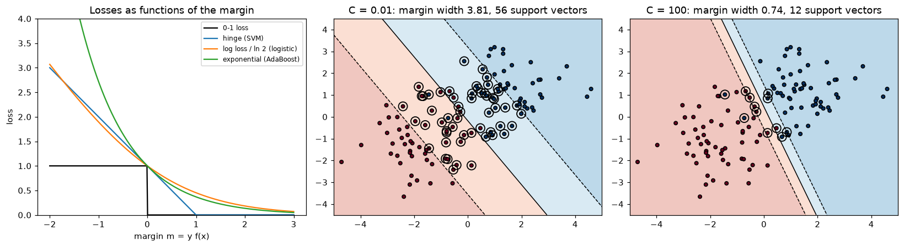
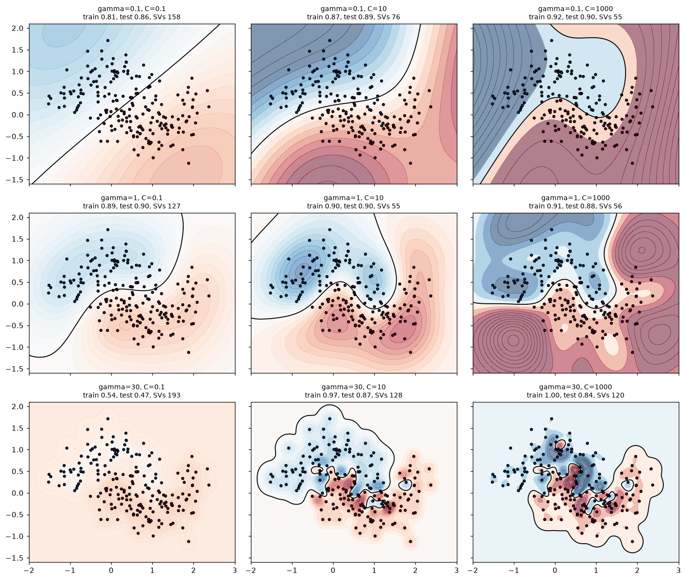

# Support Vector Machines

> **Level 4 · Chapter 4** · ⏱️ ~65 min read · Prerequisites: [Logistic regression](../03-ml-fundamentals/03-logistic-regression.md), [Regularization](../03-ml-fundamentals/05-regularization.md), [Information theory and optimization](../01-math-foundations/06-information-theory-and-optimization.md) (Lagrange multipliers)

A support vector machine draws the decision boundary that stays as far as possible from the training points of both classes, and then, with one elegant trick, bends that boundary into curves without ever computing the curved features. This chapter derives the maximum margin from geometry, relaxes it to the soft margin and the hinge loss, sketches the dual problem and why it matters, explains kernels and the kernel trick, and shows what the RBF kernel's two hyperparameters, $\gamma$ and $C$, do to a model. You'll train a linear SVM from scratch, reconstruct a kernel SVM's predictions by hand, and finish with support vector regression and advice on when SVMs are the right tool.

## Why it matters

Wei had 2,000 labeled vibration readings from factory motors, 30 features each, and needed to flag failing motors. A colleague suggested an SVM with an RBF kernel, "the best off-the-shelf classifier". Wei trained `SVC()` on the raw features and got a model that predicted "healthy" for every motor: 85% accuracy, matching the share of healthy motors, and completely useless.

Wei tried again with `gamma=10` because a forum post said a bigger gamma "fits more". Training accuracy jumped to 100%. Test accuracy fell to 85% again: the model had memorized every training point and knew nothing about new ones.

Both failures had the same root: Wei was turning knobs without knowing what they did. The features ranged from thousandths (bearing temperature drift) to thousands (RPM), so the RBF kernel saw almost every pair of points as either identical or infinitely far apart, depending on which feature dominated. After standardizing the features and running a proper grid search over $C$ and $\gamma$ on a log scale, the SVM caught 80% of failing motors at a low false-alarm rate. Ten minutes of understanding would have saved two days. This chapter gives you that understanding.

## Concepts

### The widest street

Take two classes of points that a straight line can separate. There are infinitely many separating lines. Which one should you pick? Logistic regression picks the one that maximizes the likelihood; the perceptron picks whichever it stumbles on first. An SVM picks the one that leaves the **widest margin**: imagine a street between the two classes, with the boundary down the middle, and make the street as wide as possible without any points on it.

Why is that a good idea? A boundary that passes close to training points is fragile: a new point slightly different from a training point could land on the wrong side. A wide margin leaves room for that noise. There's also theory behind the intuition: generalization bounds for large-margin classifiers depend on the margin relative to the spread of the data, not on the number of features, which is part of why SVMs work well even in very high dimensions.

A second consequence is striking. The widest street is determined entirely by the points on its edges. Points far from the boundary don't matter at all: you could move them or delete them and the street wouldn't change. The points that pin the street in place are the **support vectors**, and they give the method its name.

### The geometry of the margin

A linear classifier predicts with the sign of $f(\mathbf{x}) = \mathbf{w}^\top\mathbf{x} + b$, where $\mathbf{w} \in \mathbb{R}^d$ is a weight vector and $b$ a bias. The decision boundary is the hyperplane $\mathbf{w}^\top\mathbf{x} + b = 0$, and $\mathbf{w}$ is perpendicular to it. Labels are $y_i \in \{-1, +1\}$, which makes the algebra tidy: a point is correctly classified exactly when $y_i f(\mathbf{x}_i) > 0$.

The distance from a point $\mathbf{x}_i$ to the hyperplane is

$$
\frac{\lvert\mathbf{w}^\top\mathbf{x}_i + b\rvert}{\lVert\mathbf{w}\rVert}.
$$

To see why, write $\mathbf{x}_i = \mathbf{x}_\perp + t\,\frac{\mathbf{w}}{\lVert\mathbf{w}\rVert}$, where $\mathbf{x}_\perp$ is the closest point on the hyperplane and $t$ is the signed distance along the unit normal. Plug in: $\mathbf{w}^\top\mathbf{x}_i + b = (\mathbf{w}^\top\mathbf{x}_\perp + b) + t\lVert\mathbf{w}\rVert = t\lVert\mathbf{w}\rVert$, because $\mathbf{x}_\perp$ is on the hyperplane. Solve for $t$. For a correctly classified point, the **geometric margin** is $y_i(\mathbf{w}^\top\mathbf{x}_i + b)/\lVert\mathbf{w}\rVert$, its distance to the boundary.

There's a redundancy: multiplying $\mathbf{w}$ and $b$ by any positive constant describes the same hyperplane. Remove it by choosing the scale so that the closest points satisfy $y_i(\mathbf{w}^\top\mathbf{x}_i + b) = 1$. Then every point has $y_i(\mathbf{w}^\top\mathbf{x}_i + b) \ge 1$, the closest points are at distance $1/\lVert\mathbf{w}\rVert$ from the boundary, and the full width of the street (from one edge to the other) is

$$
\text{margin width} = \frac{2}{\lVert\mathbf{w}\rVert}.
$$

The two edges of the street are the hyperplanes $\mathbf{w}^\top\mathbf{x} + b = +1$ and $\mathbf{w}^\top\mathbf{x} + b = -1$.

### The hard-margin SVM

Maximizing $2/\lVert\mathbf{w}\rVert$ is the same as minimizing $\lVert\mathbf{w}\rVert$, or, more conveniently, $\frac{1}{2}\lVert\mathbf{w}\rVert^2$ (squared so it's smooth, halved so its gradient is just $\mathbf{w}$). The **hard-margin SVM** is

$$
\min_{\mathbf{w}, b}\; \frac{1}{2}\lVert\mathbf{w}\rVert^2 \quad \text{subject to} \quad y_i(\mathbf{w}^\top\mathbf{x}_i + b) \ge 1 \;\text{ for all } i = 1, \ldots, n.
$$

This is a **quadratic program**: a convex quadratic objective with linear constraints. Convexity means it has a single global minimum and no local traps, which you met in [Calculus and gradients](../01-math-foundations/03-calculus-and-gradients.md). Solvers find it reliably.

The hard margin has two problems. If the classes overlap, no $\mathbf{w}$ satisfies all the constraints and the problem has no solution. And even when the data is separable, one mislabeled or unusual point can force the street to be very narrow. Real data needs flexibility.

### The soft margin

The **soft-margin SVM** lets points violate the margin, at a price. Give each point a **slack variable** $\xi_i \ge 0$ (xi) that measures how far it is on the wrong side of its edge of the street:

$$
\min_{\mathbf{w}, b, \boldsymbol{\xi}}\; \frac{1}{2}\lVert\mathbf{w}\rVert^2 + C\sum_{i=1}^{n}\xi_i \quad \text{subject to} \quad y_i(\mathbf{w}^\top\mathbf{x}_i + b) \ge 1 - \xi_i, \;\; \xi_i \ge 0.
$$

A point with $\xi_i = 0$ is on or outside its edge. A point with $0 < \xi_i < 1$ is inside the street but still on the correct side. A point with $\xi_i > 1$ is misclassified.

The hyperparameter $C > 0$ sets the price of violations:

- **Large $C$**: violations are expensive. The SVM narrows the street to classify as many training points correctly as possible. Low bias, high variance; as $C \to \infty$ you get the hard margin back.
- **Small $C$**: violations are cheap. The SVM prefers a wide street even if many points sit inside it or on the wrong side. High bias, low variance.

$C$ is an inverse regularization strength, exactly like `C` in scikit-learn's `LogisticRegression`. It's the first thing to tune.

### Hinge loss: the SVM as regularized loss minimization

At the optimum, each slack is as small as its constraint allows: $\xi_i = \max(0, 1 - y_i f(\mathbf{x}_i))$. Substitute that back in, and the constrained problem becomes an unconstrained one:

$$
\min_{\mathbf{w}, b}\; \frac{1}{2}\lVert\mathbf{w}\rVert^2 + C\sum_{i=1}^{n}\max\!\left(0,\; 1 - y_i(\mathbf{w}^\top\mathbf{x}_i + b)\right).
$$

The function $\ell_{\text{hinge}}(y, f) = \max(0, 1 - yf)$ is the **hinge loss**. Written this way, the SVM is just another instance of the pattern from [Regularization](../03-ml-fundamentals/05-regularization.md): an L2 penalty plus a sum of per-example losses. Compare the losses as functions of the **margin** $m = yf(\mathbf{x})$, positive when correct:

| Loss | Formula in terms of $m = yf$ | Behavior |
|---|---|---|
| 0-1 loss | $\mathbb{1}[m \le 0]$ | What you care about, but not convex or differentiable |
| Hinge (SVM) | $\max(0, 1 - m)$ | Zero once $m \ge 1$: confidently correct points cost nothing |
| Log loss (logistic regression) | $\log(1 + e^{-m})$ | Always positive: every point keeps pulling, a little |
| Exponential (AdaBoost) | $e^{-m}$ | Explodes for badly wrong points |

Hinge and log loss look similar for misclassified points (both grow linearly). The difference is on the right: once a point is beyond the margin, hinge loss ignores it completely. That's why only the support vectors (points with $m \le 1$) determine the solution. Logistic regression, by contrast, uses every point, and gives you calibrated-ish probabilities as a bonus, which SVMs don't.

The hinge loss isn't differentiable at $m = 1$, but it's convex, and you can minimize it with **subgradient descent**: wherever the function has a kink, use any slope between the left and right derivatives. For the SVM objective, a subgradient is

$$
\nabla_{\mathbf{w}} = \mathbf{w} - C\sum_{i:\, m_i < 1} y_i\mathbf{x}_i, \qquad \nabla_b = -C\sum_{i:\, m_i < 1} y_i,
$$

summing only over points inside the margin or misclassified. You'll implement exactly this below.

### The dual problem (intuition)

The real power of SVMs comes from rewriting the problem in a different form, the **dual**. The full derivation uses Lagrange duality and the KKT conditions, which would take several pages, so here's the key idea and the result. Lagrange multipliers were introduced in [Information theory and optimization](../01-math-foundations/06-information-theory-and-optimization.md).

Attach a multiplier $\alpha_i \ge 0$ to each margin constraint and $\mu_i \ge 0$ to each $\xi_i \ge 0$. The Lagrangian is

$$
\mathcal{L} = \frac{1}{2}\lVert\mathbf{w}\rVert^2 + C\sum_i\xi_i - \sum_i\alpha_i\left[y_i(\mathbf{w}^\top\mathbf{x}_i + b) - 1 + \xi_i\right] - \sum_i\mu_i\xi_i.
$$

Setting its derivatives with respect to the original variables to zero gives three conditions:

$$
\frac{\partial\mathcal{L}}{\partial\mathbf{w}} = 0 \Rightarrow \mathbf{w} = \sum_{i=1}^{n}\alpha_i y_i\mathbf{x}_i, \qquad \frac{\partial\mathcal{L}}{\partial b} = 0 \Rightarrow \sum_{i=1}^{n}\alpha_i y_i = 0, \qquad \frac{\partial\mathcal{L}}{\partial\xi_i} = 0 \Rightarrow \alpha_i = C - \mu_i \le C.
$$

Substituting them back eliminates $\mathbf{w}$, $b$, and $\boldsymbol{\xi}$ and leaves a problem in the $\alpha$'s alone:

$$
\max_{\boldsymbol{\alpha}}\; \sum_{i=1}^{n}\alpha_i - \frac{1}{2}\sum_{i=1}^{n}\sum_{j=1}^{n}\alpha_i\alpha_j y_i y_j\,\mathbf{x}_i^\top\mathbf{x}_j \quad \text{subject to} \quad 0 \le \alpha_i \le C, \;\; \sum_i\alpha_i y_i = 0.
$$

Three things to notice:

1. **The weights are a combination of training points**: $\mathbf{w} = \sum_i\alpha_i y_i\mathbf{x}_i$. The prediction is $f(\mathbf{x}) = \sum_i\alpha_i y_i\,\mathbf{x}_i^\top\mathbf{x} + b$.
2. **Most $\alpha_i$ are zero.** The optimality conditions (complementary slackness) say $\alpha_i > 0$ only for points with $y_i f(\mathbf{x}_i) \le 1$: points on the edge of the street ($0 < \alpha_i < C$) or inside it ($\alpha_i = C$). Those are the support vectors. Every other point drops out of the sum.
3. **The data appears only through dot products** $\mathbf{x}_i^\top\mathbf{x}_j$, both in training and in prediction. This is the door to kernels.

The dual has $n$ variables instead of $d + 1$, so it's attractive when $d$ is large. Solvers like SMO (sequential minimal optimization, used by LIBSVM, which powers scikit-learn's `SVC`) optimize two $\alpha$'s at a time analytically.

### Kernels and the kernel trick

Some problems aren't linearly separable in their original features but become separable after a transformation. Classic example: points inside a circle versus outside it. No line separates them in $(x_1, x_2)$. Add the feature $x_1^2 + x_2^2$ and they're separated by a flat plane at the circle's radius. In general, map each point through a **feature map** $\phi(\mathbf{x})$ into a higher-dimensional space and fit a linear SVM there. The boundary is linear in $\phi$-space and curved in the original space.

The obvious way, computing $\phi(\mathbf{x})$ explicitly, gets expensive fast: all degree-3 polynomial terms of 100 features is about 177,000 features. But look at the dual: the data only appears as dot products. So you only ever need $\phi(\mathbf{x})^\top\phi(\mathbf{z})$, never $\phi$ itself. A **kernel** is a function that computes that dot product directly:

$$
k(\mathbf{x}, \mathbf{z}) = \phi(\mathbf{x})^\top\phi(\mathbf{z}).
$$

Replacing every $\mathbf{x}_i^\top\mathbf{x}_j$ in the dual with $k(\mathbf{x}_i, \mathbf{x}_j)$ trains a linear SVM in $\phi$-space without ever visiting it. That's the **kernel trick**. Predictions become

$$
f(\mathbf{x}) = \sum_{i \in \text{SV}}\alpha_i y_i\,k(\mathbf{x}_i, \mathbf{x}) + b,
$$

a weighted sum of similarities between the new point and the support vectors. (Notice the family resemblance to kNN: both predict from similarity to stored training points. But the SVM learns which points to keep and how much to weight each.)

**Example: the polynomial kernel.** For $\mathbf{x}, \mathbf{z} \in \mathbb{R}^2$, expand $k(\mathbf{x}, \mathbf{z}) = (\mathbf{x}^\top\mathbf{z} + 1)^2$:

$$
(x_1z_1 + x_2z_2 + 1)^2 = x_1^2z_1^2 + x_2^2z_2^2 + 2x_1x_2z_1z_2 + 2x_1z_1 + 2x_2z_2 + 1,
$$

which is exactly $\phi(\mathbf{x})^\top\phi(\mathbf{z})$ for $\phi(\mathbf{x}) = (x_1^2,\, x_2^2,\, \sqrt{2}x_1x_2,\, \sqrt{2}x_1,\, \sqrt{2}x_2,\, 1)$: all monomials up to degree 2. Computing the kernel costs one dot product in 2D, not one in 6D. The general **polynomial kernel** is $k(\mathbf{x}, \mathbf{z}) = (\gamma\,\mathbf{x}^\top\mathbf{z} + r)^p$ with degree $p$, and its implicit feature space has all monomials up to degree $p$.

**The RBF kernel.** The most popular kernel is the **radial basis function** (Gaussian) kernel:

$$
k(\mathbf{x}, \mathbf{z}) = \exp\!\left(-\gamma\,\lVert\mathbf{x} - \mathbf{z}\rVert^2\right), \qquad \gamma > 0.
$$

It's 1 when $\mathbf{x} = \mathbf{z}$ and decays toward 0 with distance: a similarity measure with a length scale of about $1/\sqrt{\gamma}$. Its feature space is *infinite-dimensional*. In one dimension, $e^{-\gamma(x-z)^2} = e^{-\gamma x^2}e^{-\gamma z^2}e^{2\gamma xz}$, and expanding $e^{2\gamma xz} = \sum_{k=0}^{\infty}\frac{(2\gamma)^k x^k z^k}{k!}$ shows it's a dot product of feature vectors with components $\phi_k(x) = e^{-\gamma x^2}\sqrt{(2\gamma)^k/k!}\,x^k$ for every $k = 0, 1, 2, \ldots$. No explicit computation could handle that, but the kernel evaluates it in one line.

**What makes a valid kernel?** A function is a valid kernel (corresponds to some feature map) when every **kernel matrix** $K_{ij} = k(\mathbf{x}_i, \mathbf{x}_j)$ it produces is symmetric and positive semidefinite (**Mercer's condition**). That's what keeps the dual a convex problem. Sums and products of valid kernels are valid, so you can build kernels for strings, graphs, or mixed data. Linear, polynomial, and RBF kernels all qualify.

### RBF hyperparameters: $\gamma$ and $C$

An RBF SVM has two hyperparameters, and their effects are easy to picture once you see the prediction as a sum of bumps, one Gaussian bump of width about $1/\sqrt{\gamma}$ centered on each support vector:

- **$\gamma$ (kernel width).** Large $\gamma$ means narrow bumps: each support vector influences only its immediate neighborhood, so the boundary can wrap tightly around individual points. Very large $\gamma$ memorizes the training set (every point becomes a support vector with its own island), like 1-nearest-neighbor. Small $\gamma$ means wide bumps: the boundary is smooth, and as $\gamma \to 0$ the model approaches a linear one.
- **$C$ (violation price).** Large $C$ forces the model to classify training points correctly, using the flexibility $\gamma$ allows. Small $C$ tolerates mistakes for a smoother, simpler boundary.

They interact: the same $\gamma$ can overfit with a large $C$ and underfit with a small one, and a low $\gamma$ can underfit even with a huge $C$. So tune them **together**, on a **logarithmic grid** (for example $C \in \{0.1, 1, 10, 100, 1000\}$ and $\gamma \in \{0.001, 0.01, 0.1, 1, 10\}$), with cross-validation. scikit-learn's default, `gamma="scale"`, sets $\gamma = 1/(d \cdot \operatorname{Var}(\mathbf{X}))$, a sensible starting point for standardized data.

**Scaling is mandatory.** The RBF kernel is built on Euclidean distance, so it inherits every problem from the [kNN chapter](01-knn-and-naive-bayes.md): a feature measured in thousands dominates $\lVert\mathbf{x} - \mathbf{z}\rVert^2$. That was Wei's first bug. Standardize inside a pipeline.

### Support vector regression

The margin idea carries over to regression. **Support vector regression (SVR)** fits a function $f(\mathbf{x})$ and ignores errors smaller than $\epsilon$: it uses the **$\epsilon$-insensitive loss**

$$
\ell_\epsilon(y, f) = \max(0,\; \lvert y - f\rvert - \epsilon).
$$

Picture a tube of radius $\epsilon$ around the function. Points inside the tube cost nothing; points outside cost their distance to the tube, and the objective adds $\frac{1}{2}\lVert\mathbf{w}\rVert^2$ to keep the function flat. Only points on or outside the tube become support vectors, so larger $\epsilon$ gives a sparser model. SVR has three hyperparameters with a kernel: $C$, $\gamma$, and $\epsilon$ (on the scale of the target, so scale or think about $y$ too).

### Multiclass, probabilities, and cost

**Multiclass.** SVMs are binary at heart. `SVC` handles $K$ classes with **one-vs-one**: it trains $K(K-1)/2$ classifiers, one per pair of classes, and takes a vote. `LinearSVC` uses **one-vs-rest**: $K$ classifiers, each separating one class from all others.

**Probabilities.** An SVM's decision value $f(\mathbf{x})$ is a signed distance, not a probability. `SVC(probability=True)` fits **Platt scaling** (a logistic regression on the decision values) with an internal 5-fold cross-validation, which makes training several times slower, and its probabilities can occasionally disagree with `predict`. If you need probabilities, consider `CalibratedClassifierCV`, or a model that produces them natively. See calibration in [Evaluation metrics](../03-ml-fundamentals/06-evaluation-metrics.md).

**Cost.** A kernel SVM needs the kernel between many pairs of training points. Training time typically grows between $O(n^2)$ and $O(n^3)$, and prediction costs $O(n_{\text{SV}} \cdot d)$ per point. That's fine for thousands or tens of thousands of rows and painful beyond about 100,000. For large data, use a **linear SVM** (`LinearSVC` or `SGDClassifier(loss="hinge")`, which scale linearly in $n$), or approximate the kernel with an explicit low-dimensional feature map (`Nystroem` or `RBFSampler`) followed by a linear model.

### When to use SVMs

SVMs were the dominant off-the-shelf classifier in the 2000s. Today they're a specialist tool, still excellent in the right setting:

- **Good fit:** small to medium datasets (hundreds to tens of thousands of rows); high-dimensional data such as text (a linear SVM on TF-IDF features is still a strong text classifier); problems where a clear margin exists; settings where a custom kernel encodes domain knowledge (strings, graphs).
- **Poor fit:** very large datasets (kernel SVMs don't scale); heterogeneous tabular data with mixed types and missing values, where gradient-boosted trees from [Ensembles](03-ensembles.md) are usually better and easier; problems that need well-calibrated probabilities or easy interpretation.

## In practice

### A linear SVM from scratch

Subgradient descent on the primal objective $\frac{1}{2}\lVert\mathbf{w}\rVert^2 + C\sum_i\max(0, 1 - y_i f(\mathbf{x}_i))$, with a step size that decays like $1/\sqrt{t}$ (the standard schedule for subgradient methods, which don't converge with a constant step). Because subgradient steps don't decrease the objective every time, the code keeps the best iterate it has seen.

```python
import numpy as np
import matplotlib.pyplot as plt
from sklearn.datasets import make_blobs, make_moons, make_circles, load_breast_cancer
from sklearn.svm import SVC, SVR, LinearSVC
from sklearn.model_selection import train_test_split, GridSearchCV, cross_val_score
from sklearn.preprocessing import StandardScaler
from sklearn.pipeline import make_pipeline

class LinearSVMScratch:
    def __init__(self, C=1.0, n_iter=20000, eta0=0.5):
        self.C, self.n_iter, self.eta0 = C, n_iter, eta0

    def objective(self, X, y, w, b):
        return 0.5 * w @ w + self.C * np.maximum(0, 1 - y * (X @ w + b)).sum()

    def fit(self, X, y):                                     # y in {-1, +1}
        n, d = X.shape
        w, b = np.zeros(d), 0.0
        best = (np.inf, w.copy(), b)
        for t in range(1, self.n_iter + 1):
            viol = y * (X @ w + b) < 1                       # inside the margin or misclassified
            grad_w = w - self.C * (y[viol, None] * X[viol]).sum(axis=0)
            grad_b = -self.C * y[viol].sum()
            eta = self.eta0 / (n * np.sqrt(t))               # decaying step size
            w, b = w - eta * grad_w, b - eta * grad_b
            J = self.objective(X, y, w, b)
            if J < best[0]:
                best = (J, w.copy(), b)
        self.objective_, self.w_, self.b_ = best
        return self

    def decision_function(self, X):
        return X @ self.w_ + self.b_

X, y01 = make_blobs(n_samples=120, centers=[[-1.5, -1], [1.5, 1]], cluster_std=1.1, random_state=3)
y = np.where(y01 == 1, 1, -1)

ours = LinearSVMScratch(C=1.0).fit(X, y)
sk = SVC(kernel="linear", C=1.0).fit(X, y)
print("ours:    w =", ours.w_.round(4), " b =", round(ours.b_, 4), " objective =", round(ours.objective_, 4))
print("sklearn: w =", sk.coef_[0].round(4), " b =", round(sk.intercept_[0], 4),
      " objective =", round(ours.objective(X, y, sk.coef_[0], sk.intercept_[0]), 4))
print("margin width 2/||w|| =", round(2 / np.linalg.norm(sk.coef_[0]), 4))
print("number of support vectors:", len(sk.support_), "of", len(y))
```

```text
ours:    w = [1.8794 0.5858]  b = -0.2392  objective = 12.4415
sklearn: w = [1.8793 0.5858]  b = -0.2392  objective = 12.4416
margin width 2/||w|| = 1.016
number of support vectors: 16 of 120
```

The two solutions agree to about four decimal places, and only a small fraction of the points are support vectors.

### The dual, checked

scikit-learn exposes the dual solution: `support_vectors_` holds the support vectors, and `dual_coef_` holds $\alpha_i y_i$ for each. The conditions from the derivation should all hold:

```python
alpha_y = sk.dual_coef_[0]                                 # alpha_i * y_i for each support vector
alpha = np.abs(alpha_y)
w_from_dual = alpha_y @ sk.support_vectors_
print("w from sum(alpha_i y_i x_i):", w_from_dual.round(4), " matches coef_:", np.allclose(w_from_dual, sk.coef_[0]))
print("sum(alpha_i y_i) =", round(alpha_y.sum(), 10))
print("all 0 <= alpha_i <= C:", bool(np.all((alpha >= 0) & (alpha <= 1.0 + 1e-9))))
margins = y[sk.support_] * sk.decision_function(sk.support_vectors_)
print("support vectors exactly on the margin (0 < alpha < C):", int(np.sum(alpha < 1.0 - 1e-6)),
      "| their y*f(x):", margins[alpha < 1.0 - 1e-6].round(3))
print("support vectors with alpha = C (inside margin or wrong side):", int(np.sum(alpha >= 1.0 - 1e-6)),
      "| max y*f(x) among them:", margins[alpha >= 1.0 - 1e-6].max().round(3))
```

```text
w from sum(alpha_i y_i x_i): [1.8793 0.5858]  matches coef_: True
sum(alpha_i y_i) = -0.0
all 0 <= alpha_i <= C: True
support vectors exactly on the margin (0 < alpha < C): 3 | their y*f(x): [1. 1. 1.]
support vectors with alpha = C (inside margin or wrong side): 13 | max y*f(x) among them: 0.998
```

Every prediction the model makes depends only on these few points. The support vectors with $0 < \alpha_i < C$ sit exactly on the edge of the street ($y_i f(\mathbf{x}_i) = 1$), and those with $\alpha_i = C$ are inside it or misclassified ($y_i f(\mathbf{x}_i) < 1$), just as complementary slackness predicts.

### Seeing the margin and the effect of C

The figure compares the three convex losses with the 0-1 loss, then shows the street for a small and a large $C$ on the same data.

```python
fig, axes = plt.subplots(1, 3, figsize=(15, 4.2))
m = np.linspace(-2, 3, 400)
axes[0].plot(m, (m <= 0).astype(float), label="0-1 loss", color="k")
axes[0].plot(m, np.maximum(0, 1 - m), label="hinge (SVM)")
axes[0].plot(m, np.log2(1 + np.exp(-m)), label="log loss / ln 2 (logistic)")
axes[0].plot(m, np.exp(-m), label="exponential (AdaBoost)")
axes[0].set_ylim(0, 4); axes[0].set_xlabel("margin m = y f(x)"); axes[0].set_ylabel("loss")
axes[0].set_title("Losses as functions of the margin"); axes[0].legend(fontsize=8)

xx, yy = np.meshgrid(np.linspace(-5, 5, 300), np.linspace(-4.5, 4.5, 300))
for ax, C in zip(axes[1:], [0.01, 100]):
    model = SVC(kernel="linear", C=C).fit(X, y)
    Z = model.decision_function(np.c_[xx.ravel(), yy.ravel()]).reshape(xx.shape)
    ax.contourf(xx, yy, Z, levels=[-100, -1, 0, 1, 100], colors=["#d6604d", "#f4a582", "#92c5de", "#4393c3"], alpha=0.35)
    ax.contour(xx, yy, Z, levels=[-1, 0, 1], colors="k", linestyles=["--", "-", "--"], linewidths=1)
    ax.scatter(X[:, 0], X[:, 1], c=y, cmap="RdBu", edgecolor="k", s=18)
    ax.scatter(*model.support_vectors_.T, s=110, facecolors="none", edgecolors="k", linewidths=1.2)
    width = 2 / np.linalg.norm(model.coef_[0])
    ax.set_title(f"C = {C}: margin width {width:.2f}, {len(model.support_)} support vectors")
plt.tight_layout()
plt.show()
```



*Left: hinge loss is exactly zero for margins of at least 1, so well-classified points don't influence the SVM. Middle and right: a small C buys a wide street at the price of many violations (every circled point is a support vector); a large C narrows the street to reduce violations.*

### The kernel trick, verified

First, the polynomial kernel really is a dot product in the expanded feature space:

```python
def phi_poly2(x):
    x1, x2 = x
    return np.array([x1**2, x2**2, np.sqrt(2) * x1 * x2, np.sqrt(2) * x1, np.sqrt(2) * x2, 1.0])

rng = np.random.default_rng(0)
a, z = rng.normal(size=2), rng.normal(size=2)
print("kernel (a.z + 1)^2      :", round((a @ z + 1) ** 2, 10))
print("explicit phi(a).phi(z)  :", round(phi_poly2(a) @ phi_poly2(z), 10))

# The RBF kernel in 1D as a dot product of (truncated) infinite feature vectors
gamma, xa, xz = 0.5, 0.8, -0.3
k = np.arange(30)
from scipy.special import factorial
phi_rbf = lambda x: np.exp(-gamma * x**2) * np.sqrt((2 * gamma) ** k / factorial(k)) * x**k
print("RBF kernel              :", round(np.exp(-gamma * (xa - xz) ** 2), 10))
print("30-term feature expansion:", round(phi_rbf(xa) @ phi_rbf(xz), 10))
```

```text
kernel (a.z + 1)^2      : 1.1377692426
explicit phi(a).phi(z)  : 1.1377692426
RBF kernel              : 0.5460744266
30-term feature expansion: 0.5460744266
```

Now a problem no line can solve: one class inside a ring of the other. A linear SVM is at chance; an RBF SVM separates them. Then reconstruct the RBF model's decision function by hand from its support vectors, dual coefficients, and intercept:

```python
Xc, yc = make_circles(n_samples=400, factor=0.4, noise=0.1, random_state=0)
Xc_tr, Xc_te, yc_tr, yc_te = train_test_split(Xc, yc, test_size=0.3, random_state=0)
print("linear SVM test accuracy:", round(SVC(kernel="linear").fit(Xc_tr, yc_tr).score(Xc_te, yc_te), 3))
rbf = SVC(kernel="rbf", gamma=1.0, C=1.0).fit(Xc_tr, yc_tr)
print("RBF SVM test accuracy:   ", round(rbf.score(Xc_te, yc_te), 3), "| support vectors:", len(rbf.support_))

def rbf_kernel(A, B, gamma):
    d2 = (A**2).sum(1)[:, None] - 2 * A @ B.T + (B**2).sum(1)[None, :]
    return np.exp(-gamma * d2)

f_by_hand = rbf_kernel(Xc_te, rbf.support_vectors_, 1.0) @ rbf.dual_coef_[0] + rbf.intercept_[0]
print("hand-computed f(x) matches decision_function:", np.allclose(f_by_hand, rbf.decision_function(Xc_te)))
```

```text
linear SVM test accuracy: 0.525
RBF SVM test accuracy:    1.0 | support vectors: 40
hand-computed f(x) matches decision_function: True
```

The model is nothing more than a weighted sum of Gaussian bumps centered on its support vectors. That's the whole prediction formula $f(\mathbf{x}) = \sum_i\alpha_i y_i k(\mathbf{x}_i, \mathbf{x}) + b$, in one line of NumPy.

### What gamma and C do

The grid below trains an RBF SVM on noisy two moons for three values of each hyperparameter and reports training accuracy, test accuracy, and the number of support vectors.

```python
Xm, ym = make_moons(n_samples=400, noise=0.3, random_state=0)
Xm_tr, Xm_te, ym_tr, ym_te = train_test_split(Xm, ym, test_size=0.5, random_state=0)
xx, yy = np.meshgrid(np.linspace(-2, 3, 250), np.linspace(-1.6, 2.1, 250))
gammas, Cs = [0.1, 1, 30], [0.1, 10, 1000]

fig, axes = plt.subplots(3, 3, figsize=(13, 11), sharex=True, sharey=True)
for i, g in enumerate(gammas):
    for j, C in enumerate(Cs):
        model = SVC(kernel="rbf", gamma=g, C=C).fit(Xm_tr, ym_tr)
        Z = model.decision_function(np.c_[xx.ravel(), yy.ravel()]).reshape(xx.shape)
        ax = axes[i, j]
        ax.contourf(xx, yy, Z, levels=20, cmap="RdBu_r", alpha=0.5, vmin=-3, vmax=3)
        ax.contour(xx, yy, Z, levels=[0], colors="k", linewidths=1.2)
        ax.scatter(Xm_tr[:, 0], Xm_tr[:, 1], c=ym_tr, cmap="RdBu_r", edgecolor="k", s=10)
        tr, te = model.score(Xm_tr, ym_tr), model.score(Xm_te, ym_te)
        ax.set_title(f"gamma={g}, C={C}\ntrain {tr:.2f}, test {te:.2f}, SVs {len(model.support_)}", fontsize=9)
        print(f"gamma={g:>4}, C={C:>6}: train {tr:.3f}, test {te:.3f}, support vectors {len(model.support_)}")
plt.tight_layout()
plt.show()
```

```text
gamma= 0.1, C=   0.1: train 0.810, test 0.860, support vectors 158
gamma= 0.1, C=    10: train 0.870, test 0.885, support vectors 76
gamma= 0.1, C=  1000: train 0.915, test 0.900, support vectors 55
gamma=   1, C=   0.1: train 0.885, test 0.895, support vectors 127
gamma=   1, C=    10: train 0.895, test 0.895, support vectors 55
gamma=   1, C=  1000: train 0.905, test 0.875, support vectors 56
gamma=  30, C=   0.1: train 0.535, test 0.470, support vectors 193
gamma=  30, C=    10: train 0.970, test 0.870, support vectors 128
gamma=  30, C=  1000: train 1.000, test 0.845, support vectors 120
```



*Rows: gamma grows downward (narrower bumps, wigglier boundary). Columns: C grows to the right (fewer tolerated violations). Moderate settings generalize best; the bottom-right corner memorizes the training set with islands around single points, and the bottom-left corner (narrow bumps, tiny C) barely fits at all.*

Read the grid along each axis. With $\gamma = 0.1$ the boundary stays nearly linear whatever $C$ is. With $\gamma = 30$ and large $C$, training accuracy is near perfect and test accuracy drops: the boundary has grown islands around individual training points, Wei's second bug. The number of support vectors also tells a story: very small $C$ keeps almost every point as a support vector (a wide, tolerant street), and very large $\gamma$ needs many support vectors because each one only covers a tiny neighborhood.

### Tuning an SVM properly

Here's the workflow that would have saved Wei two days, on the breast cancer data: compare the default SVM on raw features with a scaled pipeline, then grid-search $C$ and $\gamma$ on a log scale.

```python
Xb, yb = load_breast_cancer(return_X_y=True)
Xb_tr, Xb_te, yb_tr, yb_te = train_test_split(Xb, yb, test_size=0.25, stratify=yb, random_state=0)
print("SVC on raw features, CV accuracy:   ", cross_val_score(SVC(), Xb_tr, yb_tr, cv=5).mean().round(3))
print("SVC with scaling, CV accuracy:      ",
      cross_val_score(make_pipeline(StandardScaler(), SVC()), Xb_tr, yb_tr, cv=5).mean().round(3))

pipe = make_pipeline(StandardScaler(), SVC())
grid = {"svc__C": [0.1, 1, 10, 100, 1000], "svc__gamma": [1e-4, 1e-3, 1e-2, 1e-1, 1]}
search = GridSearchCV(pipe, grid, cv=5, n_jobs=2).fit(Xb_tr, yb_tr)
print("best params:", search.best_params_, " CV accuracy:", round(search.best_score_, 3))
print("test accuracy:", round(search.score(Xb_te, yb_te), 3))
```

```text
SVC on raw features, CV accuracy:    0.918
SVC with scaling, CV accuracy:       0.986
best params: {'svc__C': 100, 'svc__gamma': 0.001}  CV accuracy: 0.988
test accuracy: 0.958
```

!!! warning "Common mistake: tuning C and gamma on a linear grid, or one at a time"
    Values like `C=[1, 2, 3, 4, 5]` explore almost nothing: the interesting range spans several orders of magnitude. And because $C$ and $\gamma$ interact, tuning one with the other fixed can miss the good region entirely. Use a 2D logarithmic grid (or a random search over log-uniform distributions), then refine around the best cell.

### Support vector regression

The $\epsilon$ tube in action: larger $\epsilon$ ignores more errors, so fewer points become support vectors.

```python
rng = np.random.default_rng(0)
xr = np.sort(rng.uniform(0, 6, 200)); yr = np.sin(xr) + 0.15 * rng.normal(size=200)
Xr = xr[:, None]
x_test = np.linspace(0, 6, 300)[:, None]
for eps in [0.01, 0.1, 0.3, 0.6]:
    svr = SVR(kernel="rbf", C=10, gamma=1.0, epsilon=eps).fit(Xr, yr)
    rmse = np.sqrt(np.mean((svr.predict(x_test) - np.sin(x_test[:, 0])) ** 2))
    print(f"epsilon={eps:<5}: {len(svr.support_):>3} support vectors, RMSE vs true function {rmse:.3f}")
```

```text
epsilon=0.01 : 194 support vectors, RMSE vs true function 0.056
epsilon=0.1  : 108 support vectors, RMSE vs true function 0.040
epsilon=0.3  :  17 support vectors, RMSE vs true function 0.092
epsilon=0.6  :   6 support vectors, RMSE vs true function 0.236
```

A moderate $\epsilon$, about the noise level, gives a good fit with a fraction of the points as support vectors. Too large an $\epsilon$ ignores real signal.

### Scaling up: linear SVMs and kernel approximation

For large datasets, approximate the RBF kernel with an explicit feature map and train a linear SVM on it. The `Nystroem` transformer builds features from a random subset of points so that dot products of the new features approximate the kernel. Here a hinge-loss `SGDClassifier`, a linear SVM trained by stochastic subgradient descent, is fit on 100 such features.

```python
import time
from sklearn.kernel_approximation import Nystroem
from sklearn.linear_model import SGDClassifier

Xl, yl = make_moons(n_samples=30000, noise=0.3, random_state=1)
Xl_tr, Xl_te, yl_tr, yl_te = train_test_split(Xl, yl, test_size=0.25, random_state=0)
for name, model in [("exact RBF SVC", SVC(kernel="rbf", gamma=1.0, C=10)),
                    ("Nystroem(100) + linear SVM", make_pipeline(Nystroem(gamma=1.0, n_components=100, random_state=0),
                                                                 SGDClassifier(loss="hinge", alpha=1e-4, random_state=0))),
                    ("plain LinearSVC", LinearSVC(C=10))]:
    t0 = time.perf_counter()
    model.fit(Xl_tr, yl_tr)
    print(f"{name:<27} test accuracy {model.score(Xl_te, yl_te):.3f}, fit time {time.perf_counter() - t0:.2f} s")
```

```text
exact RBF SVC               test accuracy 0.911, fit time 4.01 s
Nystroem(100) + linear SVM  test accuracy 0.910, fit time 0.46 s
plain LinearSVC             test accuracy 0.851, fit time 0.03 s
```

The approximation matches the exact kernel SVM's accuracy at a fraction of the training time, while the plain linear SVM can't represent the curved boundary. (Your timings will differ; the gap widens quickly as $n$ grows, because the exact SVM's cost grows faster than linearly.)

## Exercises

### Exercise 1: Margin by hand (easy)

A linear SVM has $\mathbf{w} = (3, 4)$ and $b = -2$. (a) What's the width of its margin? (b) Compute $y f(\mathbf{x})$ and the geometric distance to the boundary for the points $(1, 0)$ with $y = +1$, $(0, 0)$ with $y = -1$, and $(0.4, 0.3)$ with $y = -1$. Which are outside the margin, on it, inside it, or misclassified?

??? success "Solution"

    (a) $\lVert\mathbf{w}\rVert = 5$, so the width is $2/5 = 0.4$.

    (b) $f(\mathbf{x}) = 3x_1 + 4x_2 - 2$.

    - $(1, 0)$, $y = +1$: $f = 1$, $yf = 1$. Exactly on the margin (a support vector if $\alpha > 0$); distance $1/5 = 0.2$.
    - $(0, 0)$, $y = -1$: $f = -2$, $yf = 2$. Outside the margin, correctly classified; distance $2/5 = 0.4$.
    - $(0.4, 0.3)$, $y = -1$: $f = 1.2 + 1.2 - 2 = 0.4$, $yf = -0.4$. Misclassified (on the wrong side), with slack $\xi = 1 - (-0.4) = 1.4$; distance $0.4/5 = 0.08$ on the wrong side.

### Exercise 2: The hinge loss's subgradient (easy)

For a single point with $y = +1$ and $\mathbf{x} = (2, 1)$, and current parameters $\mathbf{w} = (0.2, 0.1)$, $b = 0$, $C = 1$: compute the hinge loss and one subgradient step on $\frac{1}{2}\lVert\mathbf{w}\rVert^2 + C\,\ell_{\text{hinge}}$ with step size $\eta = 0.1$. Then repeat with $\mathbf{w} = (1, 1)$. What's different, and why?

??? success "Solution"

    With $\mathbf{w} = (0.2, 0.1)$: $f = 0.4 + 0.1 = 0.5$, margin $m = 0.5 < 1$, hinge loss $0.5$. Subgradient: $\nabla_{\mathbf{w}} = \mathbf{w} - y\mathbf{x} = (0.2 - 2, 0.1 - 1) = (-1.8, -0.9)$, $\nabla_b = -1$. Step: $\mathbf{w} \leftarrow (0.2 + 0.18, 0.1 + 0.09) = (0.38, 0.19)$, $b \leftarrow 0.1$. The point pulls the boundary toward classifying it more confidently.

    With $\mathbf{w} = (1, 1)$: $f = 3$, $m = 3 \ge 1$, hinge loss 0. Subgradient: $\nabla_{\mathbf{w}} = \mathbf{w} = (1, 1)$, $\nabla_b = 0$. Step: $\mathbf{w} \leftarrow (0.9, 0.9)$. The point is beyond the margin, so it exerts no force at all; only the regularizer acts, shrinking $\mathbf{w}$ (widening the margin). This is why points beyond the margin aren't support vectors.

### Exercise 3: Is it a kernel? (medium)

(a) Show that $k(\mathbf{x}, \mathbf{z}) = (\mathbf{x}^\top\mathbf{z})^2$ for $\mathbf{x}, \mathbf{z} \in \mathbb{R}^2$ is a kernel by finding its feature map. (b) Is $k(\mathbf{x}, \mathbf{z}) = -\lVert\mathbf{x} - \mathbf{z}\rVert^2$ a valid kernel? Check numerically by computing the eigenvalues of its kernel matrix on 20 random points.

??? success "Solution"

    (a) $(x_1z_1 + x_2z_2)^2 = x_1^2z_1^2 + 2x_1x_2z_1z_2 + x_2^2z_2^2 = \phi(\mathbf{x})^\top\phi(\mathbf{z})$ with $\phi(\mathbf{x}) = (x_1^2, \sqrt{2}x_1x_2, x_2^2)$.

    (b) No. A valid kernel's matrix must be positive semidefinite, but this one has a zero diagonal ($k(\mathbf{x}, \mathbf{x}) = 0$) and negative off-diagonal entries, so its trace is 0 while it's not the zero matrix, which forces at least one negative eigenvalue.

    ```python
    rng = np.random.default_rng(0)
    P = rng.normal(size=(20, 2))
    D2 = ((P[:, None, :] - P[None, :, :]) ** 2).sum(-1)
    print("min eigenvalue of -||x-z||^2 kernel:", np.linalg.eigvalsh(-D2).min().round(3))
    print("min eigenvalue of RBF kernel:       ", np.linalg.eigvalsh(np.exp(-0.5 * D2)).min().round(6))
    ```

    ```text
    min eigenvalue of -||x-z||^2 kernel: -55.89
    min eigenvalue of RBF kernel:        2e-06
    ```

    The negative eigenvalue confirms it isn't a valid kernel; the RBF kernel matrix on the same points is positive semidefinite (its smallest eigenvalue is nonnegative, up to round-off).

### Exercise 4: Pegasos, the stochastic version (medium)

Implement the Pegasos algorithm (Shalev-Shwartz et al., 2007) for a linear SVM without bias: minimize $\frac{\lambda}{2}\lVert\mathbf{w}\rVert^2 + \frac{1}{n}\sum_i\max(0, 1 - y_i\mathbf{w}^\top\mathbf{x}_i)$. At step $t$, pick one random point $i$, set $\eta_t = 1/(\lambda t)$, and update $\mathbf{w} \leftarrow (1 - \eta_t\lambda)\mathbf{w} + \eta_t y_i\mathbf{x}_i$ if $y_i\mathbf{w}^\top\mathbf{x}_i < 1$, else $\mathbf{w} \leftarrow (1 - \eta_t\lambda)\mathbf{w}$. Run it on the standardized breast cancer data (append a constant-1 feature to act as a bias) and compare test accuracy with `LinearSVC`.

??? success "Solution"

    ```python
    def pegasos(X, y, lam=1e-3, n_steps=50000, seed=0):
        rng = np.random.default_rng(seed)
        w = np.zeros(X.shape[1])
        for t in range(1, n_steps + 1):
            i = rng.integers(len(y))
            eta = 1 / (lam * t)
            if y[i] * (X[i] @ w) < 1:
                w = (1 - eta * lam) * w + eta * y[i] * X[i]
            else:
                w = (1 - eta * lam) * w
        return w

    sc = StandardScaler().fit(Xb_tr)
    A_tr = np.c_[sc.transform(Xb_tr), np.ones(len(Xb_tr))]
    A_te = np.c_[sc.transform(Xb_te), np.ones(len(Xb_te))]
    ys_tr, ys_te = np.where(yb_tr == 1, 1, -1), np.where(yb_te == 1, 1, -1)
    w = pegasos(A_tr, ys_tr)
    print("Pegasos test accuracy:  ", (np.sign(A_te @ w) == ys_te).mean().round(3))
    C_equiv = 1 / (1e-3 * len(ys_tr))                  # lambda = 1/(n C)
    lsvc = LinearSVC(C=C_equiv, loss="hinge", max_iter=100000).fit(sc.transform(Xb_tr), yb_tr)
    print("LinearSVC test accuracy:", round(lsvc.score(sc.transform(Xb_te), yb_te), 3))
    ```

    ```text
    Pegasos test accuracy:   0.958
    LinearSVC test accuracy: 0.958
    ```

    Each Pegasos step touches one row, so the cost per step doesn't depend on $n$; that's how linear SVMs scale to millions of rows. Dividing the objective by $nC$ shows that $\lambda = 1/(nC)$ gives the same minimizer as the $C$ form (up to the treatment of the bias, which Pegasos regularizes here).

### Exercise 5: Which points are support vectors in SVR? (hard)

Fit `SVR(kernel="rbf", C=10, gamma=1.0, epsilon=0.2)` to the sine data from the SVR section. Verify numerically that (a) every training point strictly inside the tube ($\lvert y_i - f(\mathbf{x}_i)\rvert < \epsilon$) is *not* a support vector, and (b) every point outside the tube is one. Explain why from the shape of the $\epsilon$-insensitive loss.

??? success "Solution"

    ```python
    svr = SVR(kernel="rbf", C=10, gamma=1.0, epsilon=0.2).fit(Xr, yr)
    resid = np.abs(yr - svr.predict(Xr))
    is_sv = np.zeros(len(yr), bool); is_sv[svr.support_] = True
    tol = 1e-3
    print("points strictly inside the tube:", (resid < 0.2 - tol).sum(),
          "| of which support vectors:", (is_sv & (resid < 0.2 - tol)).sum())
    print("points outside the tube:        ", (resid > 0.2 + tol).sum(),
          "| of which support vectors:", (is_sv & (resid > 0.2 + tol)).sum())
    print("points on the tube boundary:    ", (np.abs(resid - 0.2) <= tol).sum())
    ```

    ```text
    points strictly inside the tube: 161 | of which support vectors: 0
    points outside the tube:         26 | of which support vectors: 26
    points on the tube boundary:     13
    ```

    Inside the tube, the loss is flat at zero, so moving the function a little doesn't change those points' loss: they exert no force and their dual coefficients are zero. Outside, the loss has slope 1, so they push on the function with the maximum allowed force ($\lvert\alpha_i\rvert = C$). Points exactly on the boundary are support vectors with $0 < \lvert\alpha_i\rvert < C$. It's the same complementary slackness as classification, with the tube playing the role of the street.

### Exercise 6: SVM or something else? (hard, conceptual)

For each case, would you use a kernel SVM, a linear SVM, or another model, and why? (a) 5 million short product reviews to classify as positive or negative, with TF-IDF features. (b) 800 protein sequences labeled by function, with a string kernel from a biology library. (c) 50,000 loan applications with 40 mixed numeric and categorical features and missing values. (d) 3,000 images of handwritten digits, 64 pixel features each.

??? success "Solution"

    (a) **Linear SVM** (or logistic regression) with `LinearSVC` or `SGDClassifier`. Text is high-dimensional and sparse, often close to linearly separable, and 5 million rows rules out a kernel SVM.

    (b) **Kernel SVM** with the string kernel. Small data, and the kernel encodes domain knowledge about sequence similarity that would be hard to turn into fixed-length features. This is a classic SVM success story.

    (c) **Gradient-boosted trees.** Mixed types, missing values, and tens of thousands of rows are the boosted trees' home ground; an SVM would need imputation, encoding, scaling, and careful tuning, and would likely still be worse.

    (d) **RBF SVM** is an excellent choice: few thousand rows, dense numeric features on a common scale, and a smooth but nonlinear boundary. (At much larger scale, or with raw high-resolution images, a convolutional network from [Level 7](../07-deep-learning-pytorch/index.md) would win.)

## Check yourself

1. What is the margin of a linear SVM in terms of $\mathbf{w}$, and why does the SVM minimize $\frac{1}{2}\lVert\mathbf{w}\rVert^2$?

    ??? note "Answer"

        With the canonical scaling ($y_i f(\mathbf{x}_i) \ge 1$, equality for the closest points), the street's full width is $2/\lVert\mathbf{w}\rVert$. Maximizing it is equivalent to minimizing $\lVert\mathbf{w}\rVert$, and squaring and halving makes the objective smooth and convex with gradient $\mathbf{w}$.

2. What are support vectors, and why do other points not affect the solution?

    ??? note "Answer"

        The points with $y_i f(\mathbf{x}_i) \le 1$: on the edge of the street or inside it. Their dual coefficients $\alpha_i$ are positive; all others have $\alpha_i = 0$ and drop out of $\mathbf{w} = \sum\alpha_i y_i\mathbf{x}_i$. Equivalently, their hinge loss is flat at zero.

3. What does $C$ control in a soft-margin SVM?

    ??? note "Answer"

        The price of margin violations. Large $C$: fewer violations, narrower margin, lower bias, higher variance. Small $C$: wider margin, more violations tolerated, more regularization. It's an inverse regularization strength.

4. Write the hinge loss and contrast it with log loss.

    ??? note "Answer"

        $\max(0, 1 - yf)$. It's exactly zero for margins at least 1, so confidently correct points have no influence; log loss $\log(1 + e^{-yf})$ is always positive and every point contributes. Both grow linearly for badly misclassified points.

5. Why does the dual formulation make kernels possible?

    ??? note "Answer"

        In the dual, the training data appears only through dot products $\mathbf{x}_i^\top\mathbf{x}_j$, in both the objective and the prediction. Replacing them with $k(\mathbf{x}_i, \mathbf{x}_j) = \phi(\mathbf{x}_i)^\top\phi(\mathbf{x}_j)$ fits a linear SVM in the feature space of $\phi$ without computing $\phi$.

6. What happens with a very large $\gamma$ in an RBF SVM? A very small one?

    ??? note "Answer"

        Very large $\gamma$: narrow bumps around each support vector, a boundary with islands around individual points, near-perfect training accuracy and poor generalization. Very small $\gamma$: very wide bumps, a nearly linear boundary, possible underfitting.

7. Why must features be scaled before an RBF SVM?

    ??? note "Answer"

        The RBF kernel depends on Euclidean distance, so features with large numeric ranges dominate the similarity. Standardize inside a pipeline so the scaler is fit on training folds only.

8. When are SVMs a poor choice?

    ??? note "Answer"

        Very large datasets (kernel SVM training scales between $O(n^2)$ and $O(n^3)$), messy heterogeneous tabular data with missing values and categories (boosted trees are usually better), and situations that need calibrated probabilities or easy interpretation.

## Key takeaways

- An SVM picks the separating hyperplane with the widest margin, $2/\lVert\mathbf{w}\rVert$; only the support vectors on or inside the margin determine it.
- The soft margin allows violations at price $C$, which is equivalent to minimizing $\frac{1}{2}\lVert\mathbf{w}\rVert^2 + C\sum\text{hinge loss}$: regularized loss minimization.
- In the dual, $\mathbf{w} = \sum\alpha_i y_i\mathbf{x}_i$ with $0 \le \alpha_i \le C$, and the data appears only in dot products. Replacing them with a kernel fits a linear model in a huge (even infinite) feature space cheaply.
- The RBF kernel's $\gamma$ sets the width of each support vector's influence and $C$ the tolerance for errors. Tune them together on a log grid, with standardized features.
- SVR applies the same ideas to regression with an $\epsilon$-insensitive tube.
- Kernel SVMs shine on small to medium, dense, or high-dimensional data and with custom kernels; use linear SVMs or kernel approximations for large data, and boosted trees for messy tabular data.

## Further reading

- Cortes and Vapnik, "Support-Vector Networks", *Machine Learning* 20, 1995. The soft-margin SVM.
- Schölkopf and Smola, *Learning with Kernels*, MIT Press, 2002. The standard reference on kernel methods.
- Hastie, Tibshirani, and Friedman, *The Elements of Statistical Learning*, 2nd ed., Springer, 2009: Chapter 12, support vector machines and flexible discriminants.
- Hsu, Chang, and Lin, "A Practical Guide to Support Vector Classification", from the LIBSVM authors at National Taiwan University. Short and practical, including the log-grid search recipe.
- scikit-learn user guide: [Support Vector Machines](https://scikit-learn.org/stable/modules/svm.html).

## Next

So far every model has learned from labels. Next you'll find structure in data with no labels at all, starting with grouping similar points: [Clustering](05-clustering.md).
