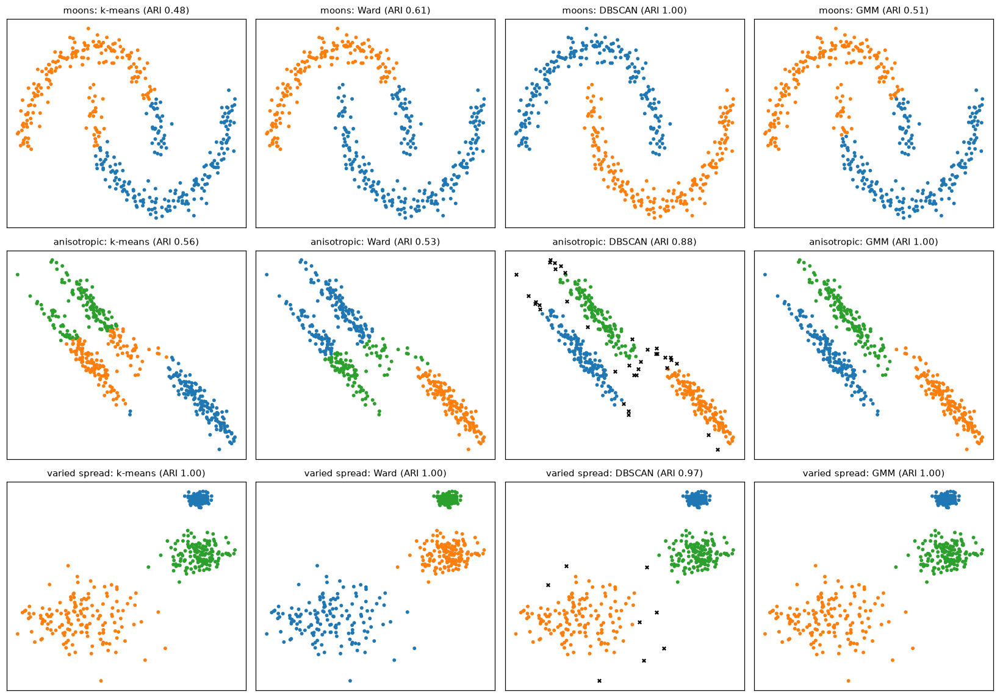
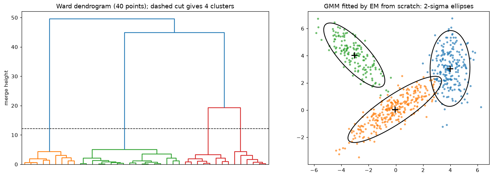

# Clustering

> **Level 4 · Chapter 5** · ⏱️ ~70 min read · Prerequisites: [Probability](../01-math-foundations/04-probability.md), [Statistics](../01-math-foundations/05-statistics.md) (maximum likelihood), [k-nearest neighbors and naive Bayes](01-knn-and-naive-bayes.md) (distances and scaling)

Clustering finds groups of similar points in data that has no labels. This chapter derives k-means as coordinate descent on a clear objective and fixes its initialization with k-means++, shows how to choose the number of clusters with the elbow and silhouette methods, builds hierarchical clusterings and reads dendrograms, finds arbitrarily shaped clusters with DBSCAN, and derives the E and M steps of the EM algorithm for Gaussian mixture models. It ends with the hardest part: deciding whether the clusters you found are real.

## Why it matters

Priya's marketing team wanted customer segments for a new loyalty program. Priya ran k-means with 5 clusters on four features: annual spend in USD, number of orders, days since last order, and average discount used. The output looked great: five neat groups, each with a profile. The team named them ("Bargain Hunters", "Loyal Big Spenders", and so on) and designed a campaign for each.

The campaigns performed no better than one generic email. When a new analyst, Sam, looked at the work, two things stood out. First, the features weren't scaled, so annual spend (thousands of dollars) dominated every distance, and the five "segments" were essentially five bands of spend. Second, when Sam plotted the scaled data, there were no clear groups at all: customers formed one continuous cloud. k-means had done exactly what it always does: it returned 5 clusters because it was asked for 5. It never says "there's no structure here".

Clustering is easy to run and easy to fool yourself with. To use it well you need to know what each algorithm assumes about a "cluster", how to choose its settings, and how to check whether its output means anything. That's this chapter.

## Concepts

### What clustering is (and isn't)

**Clustering** partitions data into groups, called **clusters**, so that points in the same group are more similar to each other than to points in other groups. It's the main task of **unsupervised learning**: there are no labels to learn from and no ground truth to check against.

That has a deep consequence. "Similar" and "group" have no single correct definition. Is a cluster a compact ball of points? A dense region of any shape? A component of a probability distribution? Each algorithm answers differently, and different answers give different clusters on the same data. There's no universally best clustering algorithm, only algorithms whose notion of a cluster does or doesn't match your data and your purpose.

Common uses:

- **Segmentation**: customers, patients, or products grouped for different treatment.
- **Exploration**: discovering structure you didn't know to look for, like subtypes of a disease.
- **Preprocessing**: cluster membership as a feature, or one model per cluster.
- **Compression and summarization**: replacing many points with a few representatives (color quantization of images is k-means).
- **Anomaly detection**: points that belong to no cluster, covered in [Anomaly detection and recommender systems](08-anomaly-detection-and-recommenders.md).

### k-means: the objective

**k-means** represents each of $k$ clusters by a **centroid** $\boldsymbol{\mu}_j \in \mathbb{R}^d$, a point in feature space, and assigns every data point $\mathbf{x}_i$ to one cluster $c_i \in \{1, \ldots, k\}$. It looks for the centroids and assignments that minimize the **within-cluster sum of squares** (WCSS), also called **inertia**:

$$
J(c, \boldsymbol{\mu}) = \sum_{i=1}^{n}\left\lVert\mathbf{x}_i - \boldsymbol{\mu}_{c_i}\right\rVert^2.
$$

In words: every point should be close to its cluster's center. Minimizing $J$ exactly is NP-hard in general, so k-means uses a simple iterative method that finds a good local minimum.

### k-means as coordinate descent

$J$ depends on two sets of variables, the assignments $c$ and the centroids $\boldsymbol{\mu}$. Optimizing both at once is hard, but optimizing either one with the other held fixed is easy. Alternating between the two is called **coordinate descent** (here, block coordinate descent), and it's exactly **Lloyd's algorithm**, the standard k-means procedure.

**Step 1: assignment (fix $\boldsymbol{\mu}$, optimize $c$).** With centroids fixed, $J$ is a sum of independent terms, one per point. Each term $\lVert\mathbf{x}_i - \boldsymbol{\mu}_{c_i}\rVert^2$ is minimized by choosing the nearest centroid:

$$
c_i \leftarrow \arg\min_j\left\lVert\mathbf{x}_i - \boldsymbol{\mu}_j\right\rVert^2.
$$

**Step 2: update (fix $c$, optimize $\boldsymbol{\mu}$).** With assignments fixed, $J$ splits into one term per cluster, $\sum_{i: c_i = j}\lVert\mathbf{x}_i - \boldsymbol{\mu}_j\rVert^2$. It's a convex quadratic in $\boldsymbol{\mu}_j$; set its gradient to zero:

$$
\nabla_{\boldsymbol{\mu}_j} = -2\sum_{i: c_i = j}(\mathbf{x}_i - \boldsymbol{\mu}_j) = 0 \;\Rightarrow\; \boldsymbol{\mu}_j \leftarrow \frac{1}{n_j}\sum_{i: c_i = j}\mathbf{x}_i,
$$

where $n_j$ is the number of points in cluster $j$. The best center is the mean of its points, which is where the name comes from.

Repeat the two steps until the assignments stop changing.

**Why it converges.** Each step minimizes $J$ exactly over one block of variables, so neither step can increase $J$. And there are only finitely many ways to assign $n$ points to $k$ clusters, so the algorithm can't decrease forever: it must stop, at a point where neither step can improve. That's a **local minimum** (strictly, a fixed point), not necessarily the global one. Different starting centroids can end in different local minima with different $J$. The standard remedy is to run k-means several times from different starts and keep the solution with the lowest $J$ (scikit-learn's `n_init`).

Each iteration costs $O(nkd)$, linear in the number of points, which makes k-means one of the fastest clustering methods. For very large data, **mini-batch k-means** updates centroids from small random batches.

### k-means++ initialization

The classic initialization picks $k$ random data points as starting centroids. That often puts two centroids in one true cluster and none in another, and Lloyd's algorithm can't escape: the two centroids split the one cluster, and the other cluster gets absorbed by a neighbor.

**k-means++** (Arthur and Vassilvitskii, 2007) spreads the starting centroids out:

1. Pick the first centroid uniformly at random from the data.
2. For every point, compute $D(\mathbf{x})^2$, the squared distance to the nearest centroid chosen so far.
3. Pick the next centroid at random with probability proportional to $D(\mathbf{x})^2$.
4. Repeat steps 2 and 3 until there are $k$ centroids, then run Lloyd's algorithm.

Points far from all existing centroids are much more likely to be chosen, so the centroids land in different regions. Points are chosen randomly rather than always taking the farthest one, because the farthest point is often an outlier. The authors proved that k-means++ seeding alone gives an expected $J$ within a factor of $O(\log k)$ of the optimum, and in practice it speeds up convergence and improves the final result. It's scikit-learn's default.

### What k-means assumes

The objective tells you what kind of clusters k-means finds. It assigns each point to the nearest centroid, so the boundaries between clusters are straight lines (the perpendicular bisectors between centroids), dividing space into a **Voronoi diagram**. That implies k-means works well when clusters are:

- **Roughly spherical**: elongated or curved clusters get chopped up.
- **Similar in size and spread**: a big, diffuse cluster next to a small, tight one gets its edge points stolen.
- **On comparably scaled features**: like kNN, k-means uses Euclidean distance, so standardize first (Priya's first bug).

And it always returns exactly $k$ clusters, whether or not the data has any cluster structure (Priya's second bug). Every point is assigned, including outliers, which can drag centroids away.

### Choosing k: the elbow and the silhouette

You have to choose $k$, and $J$ alone can't tell you: it always decreases as $k$ grows (with $k = n$, every point is its own centroid and $J = 0$).

**The elbow method.** Plot $J$ against $k$. If the data has $k^*$ well-separated clusters, $J$ drops steeply until $k = k^*$ (each new centroid splits a real cluster pair) and then flattens (new centroids just split real clusters in half). The bend is the "elbow". It's a useful picture, but often the curve bends gradually and the elbow is in the eye of the beholder.

**The silhouette.** For each point $i$, let $a(i)$ be its mean distance to the other points in its own cluster (how tightly it fits), and $b(i)$ the mean distance to the points of the *nearest other* cluster (how close the next best alternative is). Its **silhouette** is

$$
s(i) = \frac{b(i) - a(i)}{\max\{a(i),\, b(i)\}} \in [-1, 1].
$$

$s(i)$ near 1 means the point is much closer to its own cluster than to any other; near 0 means it sits on a border; negative means it's probably in the wrong cluster. The **silhouette score** is the mean of $s(i)$ over all points, and you choose the $k$ that maximizes it. Rough guide (a rule of thumb, not a law): above 0.7 strong structure, 0.5 to 0.7 reasonable, 0.25 to 0.5 weak, below 0.25 little evidence of clusters. Silhouette needs all pairwise distances, so it costs $O(n^2)$; use a sample on large data.

Neither method replaces judgment. Often the right $k$ is set by the purpose: a marketing team that can run 4 campaigns needs 4 segments, and the question becomes whether those 4 are meaningfully different.

### Hierarchical clustering

**Hierarchical clustering** builds a whole tree of nested clusterings instead of one partition. The common bottom-up version, **agglomerative clustering**:

1. Start with every point as its own cluster.
2. Merge the two closest clusters.
3. Repeat until everything is in one cluster.

The result is drawn as a **dendrogram**: a tree whose leaves are the data points, where each merge is a horizontal bar at a height equal to the distance between the two clusters it joined. To get a flat clustering, cut the dendrogram horizontally: every vertical line the cut crosses is a cluster. A long vertical stretch with no merges means well-separated clusters; cutting there is natural. You don't have to choose $k$ before running the algorithm, and you can inspect the structure at every scale.

"Distance between two clusters" needs a definition, called the **linkage**:

| Linkage | Distance between clusters $A$ and $B$ | Tends to produce |
|---|---|---|
| Single | Distance between their *closest* pair of points | Long chains; finds curved shapes but merges clusters connected by a thin bridge of noise |
| Complete | Distance between their *farthest* pair of points | Compact clusters of similar diameter |
| Average | Mean distance over all pairs | A compromise between single and complete |
| Ward | Increase in total within-cluster sum of squares caused by merging | Compact, similar-size clusters; the hierarchical cousin of k-means |

Ward linkage merges the pair whose union increases the k-means objective $J$ the least, which makes it the usual default for numeric data. The cost is high: agglomerative clustering needs the $O(n^2)$ matrix of pairwise distances, so it suits thousands of points, not millions.

### DBSCAN: clusters as dense regions

**DBSCAN** (density-based spatial clustering of applications with noise; Ester et al., 1996) defines a cluster as a region where points are densely packed, separated from other clusters by sparse regions. It has two parameters: a radius $\varepsilon$ (`eps`) and a count `min_samples`.

- A **core point** has at least `min_samples` points (including itself) within distance $\varepsilon$.
- A **border point** isn't a core point but lies within $\varepsilon$ of one.
- A **noise point** is neither. It belongs to no cluster.

Two core points within $\varepsilon$ of each other are in the same cluster, and so is everything chained through core points; border points join a cluster of a core point next to them. The algorithm grows clusters outward from core points like a flood fill.

This gives DBSCAN properties k-means lacks: clusters can have **any shape** (two interleaved moons are fine), the number of clusters is **discovered**, not given, and **outliers are labeled as noise** (label $-1$ in scikit-learn) instead of being forced into a cluster.

Choosing $\varepsilon$: compute each point's distance to its `min_samples`-th nearest neighbor, sort these distances, and plot them. This **k-distance plot** usually has a knee; points to the left are in dense regions, and the knee's height is a good $\varepsilon$. A common starting point for `min_samples` is about twice the number of dimensions.

DBSCAN's weakness is **varying density**: one $\varepsilon$ can't fit both a tight cluster and a diffuse one. **HDBSCAN** (in scikit-learn as `HDBSCAN`) builds on DBSCAN by considering all values of $\varepsilon$ at once and keeping the most stable clusters, which handles varying densities and removes the need to choose $\varepsilon$. And like every distance-based method, DBSCAN suffers in high dimensions, where densities are hard to estimate.

### Gaussian mixture models

k-means makes **hard** assignments: each point belongs to exactly one cluster. Often you'd rather say "this customer is 70% like segment A and 30% like segment B". A **Gaussian mixture model (GMM)** is a probabilistic model that gives such **soft** assignments, and it also handles elliptical clusters of different sizes.

A GMM is a generative model. It imagines each point produced in two steps:

1. Choose a component $z \in \{1, \ldots, K\}$ with probability $\pi_k$ (the **mixing weights**, $\pi_k \ge 0$, $\sum_k\pi_k = 1$).
2. Draw $\mathbf{x}$ from that component's Gaussian, $\mathcal{N}(\boldsymbol{\mu}_k, \boldsymbol{\Sigma}_k)$, with mean $\boldsymbol{\mu}_k$ and covariance matrix $\boldsymbol{\Sigma}_k$.

The component $z$ is a **latent variable**: it exists in the model but isn't observed. Summing over it gives the density of $\mathbf{x}$:

$$
p(\mathbf{x}) = \sum_{k=1}^{K}\pi_k\,\mathcal{N}(\mathbf{x} \mid \boldsymbol{\mu}_k, \boldsymbol{\Sigma}_k).
$$

The full covariance $\boldsymbol{\Sigma}_k$ lets each cluster be an ellipse of any orientation, which is how GMMs handle elongated clusters that k-means splits.

You fit the parameters $\theta = \{\pi_k, \boldsymbol{\mu}_k, \boldsymbol{\Sigma}_k\}$ by maximum likelihood, maximizing

$$
\ell(\theta) = \sum_{i=1}^{n}\log\sum_{k=1}^{K}\pi_k\,\mathcal{N}(\mathbf{x}_i \mid \boldsymbol{\mu}_k, \boldsymbol{\Sigma}_k).
$$

The log of a sum doesn't simplify, and setting gradients to zero gives equations with no closed-form solution. But notice: if you *knew* which component generated each point, the problem would be trivial. You'd just fit each Gaussian to its own points and set $\pi_k$ to the fraction of points in component $k$. The **expectation-maximization (EM)** algorithm exploits this: it alternates between guessing the components softly and fitting the Gaussians to those guesses.

### EM for Gaussian mixtures: the E-step

Given current parameters, compute for each point the posterior probability that component $k$ generated it. By Bayes' theorem, with prior $P(z_i = k) = \pi_k$ and likelihood $\mathcal{N}(\mathbf{x}_i \mid \boldsymbol{\mu}_k, \boldsymbol{\Sigma}_k)$:

$$
r_{ik} = P(z_i = k \mid \mathbf{x}_i, \theta) = \frac{\pi_k\,\mathcal{N}(\mathbf{x}_i \mid \boldsymbol{\mu}_k, \boldsymbol{\Sigma}_k)}{\sum_{j=1}^{K}\pi_j\,\mathcal{N}(\mathbf{x}_i \mid \boldsymbol{\mu}_j, \boldsymbol{\Sigma}_j)}.
$$

These $r_{ik}$ are the **responsibilities**: how much component $k$ takes responsibility for point $i$. Each row sums to 1. They're the soft cluster assignments.

### EM for Gaussian mixtures: the M-step

Now treat the responsibilities as fixed, fractional memberships, and maximize the **expected complete-data log-likelihood**: the log-likelihood you'd have if you knew the components, averaged over the responsibilities,

$$
Q(\theta) = \sum_{i=1}^{n}\sum_{k=1}^{K} r_{ik}\left[\log\pi_k + \log\mathcal{N}(\mathbf{x}_i \mid \boldsymbol{\mu}_k, \boldsymbol{\Sigma}_k)\right].
$$

The log is now *inside* the sum, so everything separates by component. Write $N_k = \sum_i r_{ik}$, the effective number of points in component $k$.

**Means.** The part of $Q$ that depends on $\boldsymbol{\mu}_k$ is $-\frac{1}{2}\sum_i r_{ik}(\mathbf{x}_i - \boldsymbol{\mu}_k)^\top\boldsymbol{\Sigma}_k^{-1}(\mathbf{x}_i - \boldsymbol{\mu}_k)$. Its gradient is $\boldsymbol{\Sigma}_k^{-1}\sum_i r_{ik}(\mathbf{x}_i - \boldsymbol{\mu}_k)$; setting it to zero:

$$
\boldsymbol{\mu}_k = \frac{1}{N_k}\sum_{i=1}^{n} r_{ik}\,\mathbf{x}_i.
$$

A responsibility-weighted mean.

**Covariances.** Differentiating with respect to $\boldsymbol{\Sigma}_k$ (using the matrix calculus identities $\partial\log\lvert\boldsymbol{\Sigma}\rvert/\partial\boldsymbol{\Sigma} = \boldsymbol{\Sigma}^{-1}$ and $\partial\,\mathbf{a}^\top\boldsymbol{\Sigma}^{-1}\mathbf{a}/\partial\boldsymbol{\Sigma} = -\boldsymbol{\Sigma}^{-1}\mathbf{a}\mathbf{a}^\top\boldsymbol{\Sigma}^{-1}$, a short calculation we'll skip) gives a weighted sample covariance:

$$
\boldsymbol{\Sigma}_k = \frac{1}{N_k}\sum_{i=1}^{n} r_{ik}\,(\mathbf{x}_i - \boldsymbol{\mu}_k)(\mathbf{x}_i - \boldsymbol{\mu}_k)^\top.
$$

**Mixing weights.** Maximize $\sum_k N_k\log\pi_k$ subject to $\sum_k\pi_k = 1$. With a Lagrange multiplier $\lambda$: $N_k/\pi_k = \lambda$, so $\pi_k = N_k/\lambda$, and the constraint forces $\lambda = \sum_k N_k = n$:

$$
\pi_k = \frac{N_k}{n}.
$$

These are exactly the maximum likelihood estimates for a single Gaussian (mean, covariance, frequency), with each point counted fractionally. Then go back to the E-step with the new parameters, and repeat until the log-likelihood stops improving.

**Why EM works.** For any distribution $q$ over the latent variables, Jensen's inequality (the log of an average is at least the average of the log) gives a lower bound on the log-likelihood:

$$
\log p(\mathbf{x}_i \mid \theta) = \log\sum_k q_k\frac{\pi_k\mathcal{N}(\mathbf{x}_i \mid \boldsymbol{\mu}_k, \boldsymbol{\Sigma}_k)}{q_k} \;\ge\; \sum_k q_k\log\frac{\pi_k\mathcal{N}(\mathbf{x}_i \mid \boldsymbol{\mu}_k, \boldsymbol{\Sigma}_k)}{q_k}.
$$

The E-step chooses $q$ = the responsibilities, which makes the bound *tight* (equal to the log-likelihood) at the current $\theta$. The M-step maximizes the bound over $\theta$ (the $-q\log q$ part doesn't depend on $\theta$, so this is maximizing $Q$). The log-likelihood after the M-step is at least the bound, which is at least the old log-likelihood. So **EM never decreases the likelihood**. Like k-means, it converges to a local optimum, so initialization matters (scikit-learn initializes from k-means by default and supports `n_init` restarts).

**k-means is a special case.** Fix every covariance to $\sigma^2\mathbf{I}$ and the weights to $1/K$, and let $\sigma \to 0$. The responsibilities become 0 or 1 (the nearest mean gets all of the responsibility), the E-step becomes k-means' assignment step, and the M-step becomes its mean update. k-means is "hard EM" for a mixture of identical, spherical Gaussians, which is precisely why it prefers spherical clusters of similar size.

**Practical details.** A component can collapse onto a single point, its covariance shrinking toward zero and the likelihood shooting to infinity. Implementations add a small constant to the covariance diagonals (`reg_covar`). With $d$ features, each full covariance has $d(d+1)/2$ parameters, so for higher dimensions consider `covariance_type="diag"` (axis-aligned ellipses) or `"spherical"`. Choose the number of components with the **Bayesian information criterion**, $\text{BIC} = -2\ell(\hat{\theta}) + p\log n$ (with $p$ the number of parameters), which penalizes complexity; lower is better.

### Evaluating clusters

Without labels, "is this clustering good?" has no single answer. Use several kinds of evidence:

- **Internal metrics** use only the data and the clusters. The silhouette score is the most common. Others: the **Davies-Bouldin index** (lower is better) and the **Calinski-Harabasz index** (higher is better). All of them encode a notion of "good cluster", usually compact and well separated, so they favor algorithms with the same bias. A perfect clustering of two moons gets a mediocre silhouette, as you'll see.
- **External metrics** compare clusters with known labels, when you have them for a benchmark or a labeled subset. The **adjusted Rand index (ARI)** measures pair-counting agreement, corrected so random labelings score about 0 and perfect agreement scores 1. **Normalized mutual information (NMI)** measures shared information. Both ignore the arbitrary cluster numbering.
- **Stability**: rerun with different seeds, subsamples, or bootstrap samples. Real clusters reappear; artifacts shuffle around. Compare runs with ARI.
- **Usefulness**: do the clusters differ on things you care about but didn't cluster on (churn rate, response to a campaign)? Can a domain expert recognize them? A segmentation that doesn't change any decision isn't useful, however good its silhouette.

## In practice

### k-means and k-means++ from scratch

The implementation tracks the objective after every half-step to show that coordinate descent never increases it.

```python
import numpy as np
import matplotlib.pyplot as plt
from sklearn.datasets import make_blobs, make_moons
from sklearn.preprocessing import StandardScaler
from sklearn.cluster import KMeans, DBSCAN, AgglomerativeClustering
from sklearn.mixture import GaussianMixture
from sklearn.metrics import silhouette_score, adjusted_rand_score

def sq_dists(X, C):
    return ((X[:, None, :] - C[None, :, :]) ** 2).sum(axis=2)          # (n, k)

def kmeans_pp_init(X, k, rng):
    centers = [X[rng.integers(len(X))]]
    for _ in range(1, k):
        d2 = sq_dists(X, np.array(centers)).min(axis=1)               # D(x)^2 to nearest chosen center
        centers.append(X[rng.choice(len(X), p=d2 / d2.sum())])
    return np.array(centers)

def kmeans(X, k, init="k-means++", max_iter=100, seed=0):
    rng = np.random.default_rng(seed)
    C = kmeans_pp_init(X, k, rng) if init == "k-means++" else X[rng.choice(len(X), k, replace=False)]
    history = []
    for it in range(max_iter):
        labels = sq_dists(X, C).argmin(axis=1)                          # assignment step
        history.append(sq_dists(X, C)[np.arange(len(X)), labels].sum())
        new_C = np.array([X[labels == j].mean(axis=0) if np.any(labels == j) else C[j] for j in range(k)])
        history.append(((X - new_C[labels]) ** 2).sum())                # update step
        if np.allclose(new_C, C):
            break
        C = new_C
    return labels, C, history

X, y_true = make_blobs(n_samples=600, centers=4, cluster_std=1.0, random_state=42)
labels, C, hist = kmeans(X, 4)
print("objective after each half-step (first 8):", np.round(hist[:8], 1))
print("never increases:", bool(np.all(np.diff(hist) <= 1e-9)))
best = min((kmeans(X, 4, seed=s) for s in range(10)), key=lambda r: r[2][-1])
sk = KMeans(n_clusters=4, n_init=10, random_state=0).fit(X)
print(f"ours (best of 10): inertia {best[2][-1]:.2f} | sklearn: inertia {sk.inertia_:.2f}")
print("same partition as sklearn (ARI):", round(adjusted_rand_score(best[0], sk.labels_), 4))
```

```text
objective after each half-step (first 8): [2346.9 1175.9 1160.8 1160.3 1160.3 1160.3]
never increases: True
ours (best of 10): inertia 1160.27 | sklearn: inertia 1160.27
same partition as sklearn (ARI): 1.0
```

Now the payoff of k-means++. On data with 10 true clusters, compare 100 runs from random initialization with 100 runs from k-means++ seeding:

```python
X10, _ = make_blobs(n_samples=1500, centers=10, cluster_std=0.6, center_box=(-15, 15), random_state=7)
final = {}
for init in ["random", "k-means++"]:
    final[init] = np.array([kmeans(X10, 10, init=init, seed=s)[2][-1] for s in range(100)])
best_seen = min(v.min() for v in final.values())
for init, J in final.items():
    print(f"{init:>10}: median final J {np.median(J):8.1f}, worst {J.max():8.1f}, "
          f"runs within 1% of the best: {np.mean(J < 1.01 * best_seen):.0%}")
```

```text
    random: median final J   5599.5, worst  27944.4, runs within 1% of the best: 3%
 k-means++: median final J   1364.5, worst   6328.0, runs within 1% of the best: 26%
```

Random initialization often gets stuck with two centroids sharing one cluster and none in another, and its worst runs are terrible. k-means++ seeding cuts the median objective by a factor of four and avoids the disasters. Even so, a single k-means++ run reaches the best solution only about a quarter of the time on this data, which is why `n_init` restarts are still worth their cost.

### Choosing k

Elbow and silhouette on the 4-cluster data, plus a from-scratch silhouette to check scikit-learn's. Then the trap from the story: k-means on data with no clusters at all.

```python
def silhouette(X, labels):
    D = np.sqrt(sq_dists(X, X))
    s = np.zeros(len(X))
    for i in range(len(X)):
        own = labels == labels[i]
        a = D[i, own].sum() / max(own.sum() - 1, 1)                     # exclude the point itself
        b = min(D[i, labels == c].mean() for c in np.unique(labels) if c != labels[i])
        s[i] = (b - a) / max(a, b)
    return s.mean()

print(" k   inertia   silhouette")
for k in range(2, 8):
    km = KMeans(n_clusters=k, n_init=10, random_state=0).fit(X)
    print(f"{k:>2} {km.inertia_:9.1f}   {silhouette_score(X, km.labels_):.3f}")
km4 = KMeans(n_clusters=4, n_init=10, random_state=0).fit(X)
print("from-scratch silhouette for k=4:", round(silhouette(X, km4.labels_), 3))

rng = np.random.default_rng(0)
U = rng.random((600, 2))                                            # uniform: no clusters at all
km_u = KMeans(n_clusters=4, n_init=10, random_state=0).fit(U)
print("uniform data, k=4: cluster sizes", np.bincount(km_u.labels_),
      "silhouette", round(silhouette_score(U, km_u.labels_), 3))
```

```text
 k   inertia   silhouette
 2   18637.9   0.591
 3    4178.9   0.757
 4    1160.3   0.788
 5    1045.8   0.691
 6     938.4   0.559
 7     844.2   0.427
from-scratch silhouette for k=4: 0.788
uniform data, k=4: cluster sizes [174 142 129 155] silhouette 0.41
```

The inertia drops steeply up to $k = 4$ and then flattens, and the silhouette peaks at $k = 4$. On uniform data, k-means still produces four tidy, equal-size "clusters". The silhouette is noticeably lower than for the real clusters, but not near zero: an even split of a uniform square produces fairly compact pieces. This is why you should also compare against a no-structure baseline and test stability, not just read off a number.

!!! warning "Common mistake: clustering unscaled features"
    k-means, hierarchical clustering, and DBSCAN all use distances, so a feature measured in thousands silently dominates. Standardize first (or choose a scaling that reflects how much each feature *should* matter). And remember that one-hot encoded categories, counts, and money amounts may need different treatment: log-transform skewed amounts before scaling.

### Four algorithms, three datasets

Each algorithm has its own idea of a cluster. The grid runs k-means, Ward hierarchical clustering, DBSCAN, and a GMM on three datasets: interleaved moons, stretched (anisotropic) blobs, and round blobs of different spreads. All data is standardized. The titles show the adjusted Rand index against the true groups.

```python
Xm, ym = make_moons(400, noise=0.07, random_state=0)
Xb, yb = make_blobs(450, centers=3, random_state=170)
Xa = Xb @ np.array([[0.6, -0.64], [-0.4, 0.85]])                    # stretch the blobs
Xv, yv = make_blobs(450, centers=3, cluster_std=[0.5, 1.5, 3.0], random_state=8)
datasets = {"moons": (Xm, ym, 2, 0.3), "anisotropic": (Xa, yb, 3, 0.15), "varied spread": (Xv, yv, 3, 0.3)}

fig, axes = plt.subplots(3, 4, figsize=(15, 10.5))
print(f"{'dataset':<14}{'method':<10}{'ARI':>6}{'silhouette':>12}")
for row, (name, (Xd, yd, k, eps)) in enumerate(datasets.items()):
    Xd = StandardScaler().fit_transform(Xd)
    models = {"k-means": KMeans(k, n_init=10, random_state=0),
              "Ward": AgglomerativeClustering(n_clusters=k, linkage="ward"),
              "DBSCAN": DBSCAN(eps=eps, min_samples=5),
              "GMM": GaussianMixture(k, covariance_type="full", random_state=0)}
    for col, (mname, model) in enumerate(models.items()):
        lab = model.fit_predict(Xd)
        ari = adjusted_rand_score(yd, lab)
        sil = silhouette_score(Xd, lab) if len(set(lab)) > 1 else float("nan")
        print(f"{name:<14}{mname:<10}{ari:6.2f}{sil:12.2f}")
        ax = axes[row, col]
        noise = lab == -1
        ax.scatter(Xd[~noise, 0], Xd[~noise, 1], c=lab[~noise], cmap="tab10", s=8, vmin=0, vmax=9)
        ax.scatter(Xd[noise, 0], Xd[noise, 1], c="k", marker="x", s=12, label="noise")
        ax.set_title(f"{name}: {mname} (ARI {ari:.2f})", fontsize=10)
        ax.set_xticks([]); ax.set_yticks([])
plt.tight_layout()
plt.show()
```

```text
dataset       method       ARI  silhouette
moons         k-means     0.48        0.50
moons         Ward        0.61        0.46
moons         DBSCAN      1.00        0.38
moons         GMM         0.51        0.50
anisotropic   k-means     0.56        0.51
anisotropic   Ward        0.53        0.49
anisotropic   DBSCAN      0.88        0.44
anisotropic   GMM         1.00        0.45
varied spread k-means     1.00        0.73
varied spread Ward        1.00        0.73
varied spread DBSCAN      0.97        0.64
varied spread GMM         1.00        0.73
```



*Each algorithm's assumptions decide the outcome. k-means and Ward assume compact, round clusters, so they slice the moons with a straight line; DBSCAN follows density and finds the moons (black crosses are noise); only the GMM's full covariances fit the stretched ellipses.*

Compare the two metric columns for the moons. DBSCAN recovers the true moons perfectly (ARI 1.00), yet k-means gets the higher silhouette, because silhouette rewards compact, convex clusters, exactly what k-means produces. An internal metric can't tell you which notion of "cluster" is right for your problem.

### Hierarchical clustering and dendrograms

SciPy's `linkage` builds the merge tree, `dendrogram` draws it, and `fcluster` cuts it. Here's Ward linkage on a 40-point sample of the 4-cluster data, next to a GMM fitted from scratch (coming up next).

```python
from scipy.cluster.hierarchy import linkage, dendrogram, fcluster

rng = np.random.default_rng(1)
sample = rng.choice(len(X), 40, replace=False)
Z = linkage(X[sample], method="ward")
print("last 5 merges (cluster a, cluster b, height, size):")
print(np.round(Z[-5:], 2))
flat = fcluster(Z, t=4, criterion="maxclust")
agg = AgglomerativeClustering(n_clusters=4, linkage="ward").fit_predict(X[sample])
print("SciPy cut vs scikit-learn AgglomerativeClustering, ARI:", adjusted_rand_score(flat, agg))
```

```text
last 5 merges (cluster a, cluster b, height, size):
[[64.   69.    4.33  9.  ]
 [67.   72.    5.08 17.  ]
 [71.   73.   19.23 14.  ]
 [75.   76.   44.92 31.  ]
 [74.   77.   49.6  40.  ]]
SciPy cut vs scikit-learn AgglomerativeClustering, ARI: 1.0
```

The last three merges happen at much greater heights than the rest: those joins combine genuinely different groups, so cutting just below them gives the 4 clusters.

### Gaussian mixtures with EM from scratch

The implementation works in log space and uses the log-sum-exp trick in the E-step for numerical stability, records the log-likelihood each iteration, and adds a small `reg` to every covariance diagonal.

```python
from scipy.special import logsumexp
from scipy.stats import multivariate_normal

def gmm_em(X, K, n_iter=200, tol=1e-6, reg=1e-6, seed=0):
    n, d = X.shape
    rng = np.random.default_rng(seed)
    mu = X[rng.choice(n, K, replace=False)]                            # init: random points
    cov = np.array([np.cov(X.T) + reg * np.eye(d) for _ in range(K)])
    pi = np.full(K, 1 / K)
    lls = []
    for it in range(n_iter):
        # E-step: log(pi_k N(x_i | mu_k, Sigma_k)), then normalize rows
        log_p = np.column_stack([np.log(pi[k]) + multivariate_normal.logpdf(X, mu[k], cov[k]) for k in range(K)])
        log_norm = logsumexp(log_p, axis=1)
        r = np.exp(log_p - log_norm[:, None])                             # responsibilities (n, K)
        lls.append(log_norm.sum())
        # M-step: weighted MLE
        Nk = r.sum(axis=0)
        mu = (r.T @ X) / Nk[:, None]
        for k in range(K):
            diff = X - mu[k]
            cov[k] = (r[:, k, None] * diff).T @ diff / Nk[k] + reg * np.eye(d)
        pi = Nk / n
        if it > 0 and abs(lls[-1] - lls[-2]) < tol * abs(lls[-1]):
            break
    return pi, mu, cov, r, np.array(lls)

# Three elongated, overlapping Gaussian clusters
rng = np.random.default_rng(3)
true_means = np.array([[0, 0], [4, 3], [-3, 4]])
true_covs = [np.array([[3, 1.8], [1.8, 1.5]]), np.array([[0.5, 0], [0, 2]]), np.array([[1.5, -1.2], [-1.2, 1.5]])]
Xg = np.vstack([rng.multivariate_normal(m, c, size=s) for m, c, s in zip(true_means, true_covs, [300, 200, 150])])

pi, mu, cov, r, lls = gmm_em(Xg, 3)
print(f"EM iterations: {len(lls)}, log-likelihood never decreased: {bool(np.all(np.diff(lls) >= -1e-8))}")
print("log-likelihood at iterations 1, 2, 5, last:", np.round(lls[[0, 1, 4, -1]], 1))
order = np.argsort(mu[:, 0])
print("weights:", np.round(pi[order], 3), "\nmeans:\n", np.round(mu[order], 2))
gm = GaussianMixture(3, covariance_type="full", tol=1e-8, max_iter=1000, random_state=0).fit(Xg)
print("sklearn weights:", np.round(gm.weights_[np.argsort(gm.means_[:, 0])], 3))
print(f"mean log-likelihood per point: ours {lls[-1] / len(Xg):.4f}, sklearn {gm.score(Xg):.4f}")
print("a point between clusters, responsibilities:", np.round(gm.predict_proba([[1.5, 2.5]]), 3))

print("BIC by number of components:",
      {K: round(GaussianMixture(K, random_state=0).fit(Xg).bic(Xg)) for K in range(1, 7)})
```

```text
EM iterations: 15, log-likelihood never decreased: True
log-likelihood at iterations 1, 2, 5, last: [-3446.1 -2696.  -2556.9 -2464.6]
weights: [0.232 0.458 0.31 ]
means:
 [[-3.05  4.04]
 [-0.08  0.04]
 [ 3.98  3.06]]
sklearn weights: [0.232 0.459 0.31 ]
mean log-likelihood per point: ours -3.7916, sklearn -3.7916
a point between clusters, responsibilities: [[0.057 0.    0.943]]
BIC by number of components: {1: 6119, 2: 5323, 3: 5040, 4: 5072, 5: 5106, 6: 5142}
```

The from-scratch EM reaches the same solution as scikit-learn run to the same tight tolerance: the same weights (close to the true split of 150, 300, and 200 points, which is 0.23, 0.46, and 0.31) and the same log-likelihood. The log-likelihood climbs monotonically, as the Jensen argument guarantees, and the BIC is lowest at three components. Notice the soft assignment of the in-between point.

Now draw both: the dendrogram and the fitted mixture, with each component's covariance as an ellipse (the 2-standard-deviation contour, computed from the eigenvectors of $\boldsymbol{\Sigma}_k$).

```python
fig, axes = plt.subplots(1, 2, figsize=(14, 4.8))
dendrogram(Z, ax=axes[0], color_threshold=Z[-3, 2] + 1e-9, no_labels=True)
axes[0].axhline((Z[-4, 2] + Z[-3, 2]) / 2, color="k", ls="--", lw=1)
axes[0].set_title("Ward dendrogram (40 points); dashed cut gives 4 clusters"); axes[0].set_ylabel("merge height")

hard = r.argmax(axis=1)
axes[1].scatter(Xg[:, 0], Xg[:, 1], c=hard, cmap="tab10", s=8, vmin=0, vmax=9, alpha=0.6)
t = np.linspace(0, 2 * np.pi, 200)
for k in range(3):
    vals, vecs = np.linalg.eigh(cov[k])
    ellipse = (vecs @ np.diag(2 * np.sqrt(vals)) @ np.vstack([np.cos(t), np.sin(t)])).T + mu[k]
    axes[1].plot(ellipse[:, 0], ellipse[:, 1], "k", lw=1.5)
    axes[1].plot(*mu[k], "k+", ms=12, mew=2)
axes[1].set_title("GMM fitted by EM from scratch: 2-sigma ellipses"); axes[1].set_aspect("equal")
plt.tight_layout()
plt.show()
```



*Left: the big vertical gaps before the last merges show where to cut. Right: each Gaussian component's ellipse follows its cluster's orientation and spread, something k-means' round Voronoi cells can't do.*

### DBSCAN: choosing eps

The k-distance heuristic for the moons data, with `min_samples=5`: sort every point's distance to its 5th nearest neighbor (counting itself, as DBSCAN does) and look at the upper quantiles, where the curve turns upward.

```python
from sklearn.neighbors import NearestNeighbors

Xms = StandardScaler().fit_transform(Xm)
dist, _ = NearestNeighbors(n_neighbors=5).fit(Xms).kneighbors(Xms)
kdist = np.sort(dist[:, -1])
print("5-distance quantiles (50%, 90%, 95%, 99%, max):",
      np.round(np.quantile(kdist, [0.5, 0.9, 0.95, 0.99, 1.0]), 3))
for eps in [0.1, 0.2, 0.3, 0.5]:
    lab = DBSCAN(eps=eps, min_samples=5).fit_predict(Xms)
    print(f"eps={eps}: {len(set(lab) - {-1})} clusters, {np.sum(lab == -1):>3} noise points, "
          f"ARI {adjusted_rand_score(ym, lab):.2f}")
```

```text
5-distance quantiles (50%, 90%, 95%, 99%, max): [0.105 0.175 0.205 0.3   0.326]
eps=0.1: 31 clusters, 114 noise points, ARI 0.04
eps=0.2: 3 clusters,   2 noise points, ARI 0.93
eps=0.3: 2 clusters,   0 noise points, ARI 1.00
eps=0.5: 1 clusters,   0 noise points, ARI 0.00
```

Too small an $\varepsilon$ fragments the moons and labels many points as noise; values around the top of the k-distance curve recover the two moons; too large an $\varepsilon$ eventually merges everything into one cluster.

### Checking stability

A quick stability check: cluster bootstrap resamples and compare each result with the full-data clustering, using ARI on all the original points.

```python
def stability(Xs, k, n_boot=20, seed=0):
    rng = np.random.default_rng(seed)
    ref = KMeans(k, n_init=10, random_state=0).fit(Xs)
    scores = []
    for b in range(n_boot):
        idx = rng.choice(len(Xs), len(Xs), replace=True)
        boot = KMeans(k, n_init=10, random_state=b).fit(Xs[idx])
        scores.append(adjusted_rand_score(ref.predict(Xs), boot.predict(Xs)))
    return np.mean(scores), np.min(scores)

for name, data in [("4 real blobs", X), ("uniform square", U)]:
    mean_ari, min_ari = stability(data, 4)
    print(f"{name:<15} bootstrap ARI vs full-data clustering: mean {mean_ari:.3f}, min {min_ari:.3f}")
```

```text
4 real blobs    bootstrap ARI vs full-data clustering: mean 1.000, min 1.000
uniform square  bootstrap ARI vs full-data clustering: mean 0.915, min 0.835
```

## Exercises

### Exercise 1: One round of k-means by hand (easy)

Points on a line: 1, 2, 3, 8, 9, 15. Start with centroids at 2 and 9. Run Lloyd's algorithm by hand until it converges, reporting the assignments, centroids, and inertia after each update step. Then start from centroids 1 and 2. Do you reach the same answer?

??? success "Solution"

    **Start (2, 9).** Assign: {1, 2, 3} → 2 (3 is closer to 2 than to 9); {8, 9, 15} → 9. Update: centroids $2$ and $(8 + 9 + 15)/3 = 10.667$. Inertia: $(1 + 0 + 1) + (7.11 + 2.78 + 18.78) = 30.67$. Reassign: 8 is 6 from 2 and 2.67 from 10.67, so nothing changes. Converged with inertia 30.67.

    **Start (1, 2).** Assign: {1} → 1; {2, 3, 8, 9, 15} → 2. Update: 1 and 7.4. Reassign: 1 → 1; 2 is 1 from 1 and 5.4 from 7.4 → first; 3 → first (2 vs 4.4); 8, 9, 15 → second. Update: $2$ and $10.667$. Same as before. Converged to the same solution here, though with more steps.

    ```python
    pts = np.array([1, 2, 3, 8, 9, 15.0])[:, None]
    for init in ([[2.0], [9.0]], [[1.0], [2.0]]):
        km = KMeans(2, init=np.array(init), n_init=1).fit(pts)
        print(km.cluster_centers_.ravel().round(3), round(km.inertia_, 2), km.n_iter_)
    ```

    ```text
    [ 2.    10.667] 30.67 2
    [ 2.    10.667] 30.67 3
    ```

### Exercise 2: Silhouette by hand (easy)

Clusters A = {0, 1} and B = {5, 7} on a line. Compute $s(i)$ for each of the four points and the silhouette score.

??? success "Solution"

    - Point 0: $a = 1$ (to 1), $b = (5 + 7)/2 = 6$, $s = (6 - 1)/6 = 0.833$.
    - Point 1: $a = 1$, $b = (4 + 6)/2 = 5$, $s = 4/5 = 0.8$.
    - Point 5: $a = 2$ (to 7), $b = (5 + 4)/2 = 4.5$, $s = 2.5/4.5 = 0.556$.
    - Point 7: $a = 2$, $b = (7 + 6)/2 = 6.5$, $s = 4.5/6.5 = 0.692$.

    Mean: $(0.833 + 0.8 + 0.556 + 0.692)/4 \approx 0.720$.

    ```python
    print(round(silhouette_score(np.array([[0], [1], [5], [7.0]]), [0, 0, 1, 1]), 3))
    ```

    ```text
    0.72
    ```

### Exercise 3: k-means as hard EM (medium)

Modify `gmm_em` into a function `hard_em` that, after computing responsibilities, replaces each row with a one-hot vector at its largest entry, fixes every covariance to $\sigma^2\mathbf{I}$ with a small $\sigma$, and fixes $\pi_k = 1/K$. Show that on the 4-blob data it reaches the same partition as k-means started from the same centroids.

??? success "Solution"

    With equal weights and identical spherical covariances, the largest responsibility belongs to the nearest mean, so the hard E-step is k-means' assignment step and the M-step mean is the cluster mean.

    ```python
    def hard_em(X, init_mu, sigma=0.1, n_iter=100):
        mu = init_mu.copy()
        K, d = mu.shape
        for _ in range(n_iter):
            log_p = np.column_stack([multivariate_normal.logpdf(X, mu[k], sigma**2 * np.eye(d)) for k in range(K)])
            r = np.eye(K)[log_p.argmax(axis=1)]                     # hard responsibilities
            new_mu = (r.T @ X) / r.sum(axis=0)[:, None]
            if np.allclose(new_mu, mu):
                break
            mu = new_mu
        return log_p.argmax(axis=1), mu

    init = X[np.random.default_rng(5).choice(len(X), 4, replace=False)]
    lab_em, _ = hard_em(X, init)
    lab_km = KMeans(4, init=init, n_init=1).fit_predict(X)
    print("ARI between hard EM and k-means from the same start:", adjusted_rand_score(lab_em, lab_km))
    ```

    ```text
    ARI between hard EM and k-means from the same start: 1.0
    ```

### Exercise 4: Varying densities (medium)

Generate three blobs with `cluster_std=[0.3, 1.0, 2.5]` and centers far enough apart to be distinct. Run DBSCAN over a range of `eps` values and find the window that recovers all three clusters. Then try `HDBSCAN(min_cluster_size=20)`, which has no `eps`. Report ARI and the number of noise points for each.

??? success "Solution"

    ```python
    from sklearn.cluster import HDBSCAN
    Xd, yd = make_blobs(600, centers=[[0, 0], [6, 6], [-8, 9]], cluster_std=[0.3, 1.0, 2.5], random_state=0)
    for eps in [0.3, 0.6, 1.0, 1.5, 2.5, 4.0, 6.0]:
        lab = DBSCAN(eps=eps, min_samples=5).fit_predict(Xd)
        print(f"DBSCAN eps={eps}: {len(set(lab) - {-1})} clusters, {np.sum(lab == -1):>3} noise, ARI {adjusted_rand_score(yd, lab):.2f}")
    lab = HDBSCAN(min_cluster_size=20, copy=True).fit_predict(Xd)
    print(f"HDBSCAN: {len(set(lab) - {-1})} clusters, {np.sum(lab == -1):>3} noise, ARI {adjusted_rand_score(yd, lab):.2f}")
    ```

    ```text
    DBSCAN eps=0.3: 7 clusters, 269 noise, ARI 0.64
    DBSCAN eps=0.6: 10 clusters, 104 noise, ARI 0.78
    DBSCAN eps=1.0: 5 clusters,  21 noise, ARI 0.93
    DBSCAN eps=1.5: 3 clusters,   8 noise, ARI 0.98
    DBSCAN eps=2.5: 3 clusters,   2 noise, ARI 1.00
    DBSCAN eps=4.0: 3 clusters,   0 noise, ARI 1.00
    DBSCAN eps=6.0: 1 clusters,   0 noise, ARI 0.00
    HDBSCAN: 3 clusters,   1 noise, ARI 1.00
    ```

    A small `eps` suits the tight cluster but shreds the diffuse one into fragments and noise. `eps` has to be set for the *sparsest* cluster, and only a window of values works: too large and clusters start to merge (watch the cluster count drop). Here the clusters are far apart, so the window is reasonably wide; when a dense cluster sits close to a diffuse one, it can vanish entirely. HDBSCAN adapts the density threshold per cluster and recovers all three without any `eps` to tune.

### Exercise 5: Derive the M-step for a spherical GMM (hard)

Suppose each component has covariance $\sigma_k^2\mathbf{I}$ in $d$ dimensions. Derive the M-step update for $\sigma_k^2$. Then check it numerically: run one E-step with any parameters on `Xg`, apply your formula, and compare with the trace of the full-covariance update divided by $d$.

??? success "Solution"

    The component's log density is $-\frac{d}{2}\log(2\pi\sigma_k^2) - \frac{\lVert\mathbf{x} - \boldsymbol{\mu}_k\rVert^2}{2\sigma_k^2}$. The part of $Q$ depending on $\sigma_k^2$ is

    $$
    \sum_i r_{ik}\left[-\frac{d}{2}\log\sigma_k^2 - \frac{\lVert\mathbf{x}_i - \boldsymbol{\mu}_k\rVert^2}{2\sigma_k^2}\right].
    $$

    Differentiate with respect to $\sigma_k^2$ and set to zero: $-\frac{d N_k}{2\sigma_k^2} + \frac{\sum_i r_{ik}\lVert\mathbf{x}_i - \boldsymbol{\mu}_k\rVert^2}{2\sigma_k^4} = 0$, so

    $$
    \sigma_k^2 = \frac{1}{d\,N_k}\sum_{i=1}^{n} r_{ik}\lVert\mathbf{x}_i - \boldsymbol{\mu}_k\rVert^2,
    $$

    the average squared distance per dimension, weighted by responsibility. That's the trace of the full-covariance update divided by $d$, since $\operatorname{tr}\left[(\mathbf{x} - \boldsymbol{\mu})(\mathbf{x} - \boldsymbol{\mu})^\top\right] = \lVert\mathbf{x} - \boldsymbol{\mu}\rVert^2$.

    ```python
    K, d = 3, 2
    mu0 = Xg[[0, 350, 600]]
    log_p = np.column_stack([multivariate_normal.logpdf(Xg, mu0[k], np.eye(d)) for k in range(K)])
    r0 = np.exp(log_p - logsumexp(log_p, axis=1, keepdims=True))
    Nk = r0.sum(0); mu1 = (r0.T @ Xg) / Nk[:, None]
    sig2 = np.array([(r0[:, k] * ((Xg - mu1[k]) ** 2).sum(1)).sum() / (d * Nk[k]) for k in range(K)])
    full = [((r0[:, k, None] * (Xg - mu1[k])).T @ (Xg - mu1[k]) / Nk[k]) for k in range(K)]
    print(np.round(sig2, 4), np.round([np.trace(S) / d for S in full], 4))
    ```

    ```text
    [0.9974 2.4185 1.1314] [0.9974 2.4185 1.1314]
    ```

### Exercise 6: Is this segmentation real? (hard, conceptual)

A colleague presents 6 customer segments from k-means on 12 standardized behavioral features, with a silhouette score of 0.21, and proposes six marketing programs. List the checks you'd ask for before anyone builds a program, and what result of each would make you confident or skeptical.

??? success "Solution"

    A reasonable list:

    - **A no-structure baseline.** Cluster data with the same marginal distributions but no joint structure (shuffle each column independently) and compare silhouettes. If the real data scores about the same, the "segments" are slices of one cloud. A silhouette of 0.21 is already weak evidence.
    - **Stability.** Rerun with different seeds and on bootstrap samples; compare with ARI. Segments that reshuffle between runs aren't real.
    - **Sensitivity to k and to the algorithm.** Do 5 or 7 clusters, or a GMM, give a similar picture, or something unrelated? Look at the silhouette and BIC across $k$, not just at 6.
    - **External validity.** Do segments differ on outcomes *not* used for clustering (churn, response to past campaigns, lifetime value), with confidence intervals? This is what matters for marketing.
    - **Interpretability.** Can each segment be described by a few features, and do domain experts recognize it?
    - **Actionability and a test.** Even if all checks pass, run an A/B test of a segment-specific program against a generic one (see [Experimentation and A/B testing](../02-data-science-workflow/05-experimentation-and-ab-testing.md)) before rolling out six programs. That's the test Priya's team skipped.

## Check yourself

1. What objective does k-means minimize, and why is Lloyd's algorithm guaranteed to converge?

    ??? note "Answer"

        The within-cluster sum of squared distances to the centroids. Each step (assign to nearest centroid, move centroid to the mean) minimizes the objective over one block of variables, so it never increases, and there are finitely many partitions, so it must stop, at a local minimum.

2. How does k-means++ choose initial centroids, and why does it help?

    ??? note "Answer"

        The first at random, each next one with probability proportional to its squared distance to the nearest centroid so far. It spreads centroids across the data, avoiding starts with several centroids in one cluster, and comes with an $O(\log k)$ approximation guarantee in expectation.

3. Name three kinds of cluster structure k-means handles poorly.

    ??? note "Answer"

        Non-convex shapes (moons, rings), elongated or anisotropic clusters, clusters with very different sizes or spreads. Also outliers and unscaled features.

4. Define the silhouette of a point. What does a negative value mean?

    ??? note "Answer"

        $s = (b - a)/\max(a, b)$, with $a$ the mean distance to its own cluster and $b$ the mean distance to the nearest other cluster. Negative means the point is closer on average to another cluster than to its own, so it's probably misassigned.

5. What does a dendrogram show, and how do you get a flat clustering from it?

    ??? note "Answer"

        The sequence of merges in agglomerative clustering, with each merge drawn at the height of the linkage distance between the merged clusters. Cut it horizontally at some height (ideally in a big gap); each branch crossed is a cluster.

6. What are core, border, and noise points in DBSCAN, and what are its main strengths and weakness?

    ??? note "Answer"

        Core: at least `min_samples` points within `eps`. Border: within `eps` of a core point but not core. Noise: neither. Strengths: arbitrary shapes, no need to choose the number of clusters, explicit noise. Weakness: a single `eps` can't fit clusters of very different densities (HDBSCAN addresses this).

7. Write the E-step and M-step updates for a Gaussian mixture.

    ??? note "Answer"

        E: $r_{ik} = \pi_k\mathcal{N}(\mathbf{x}_i \mid \boldsymbol{\mu}_k, \boldsymbol{\Sigma}_k) / \sum_j\pi_j\mathcal{N}(\mathbf{x}_i \mid \boldsymbol{\mu}_j, \boldsymbol{\Sigma}_j)$. M: with $N_k = \sum_i r_{ik}$, $\boldsymbol{\mu}_k = \frac{1}{N_k}\sum_i r_{ik}\mathbf{x}_i$, $\boldsymbol{\Sigma}_k = \frac{1}{N_k}\sum_i r_{ik}(\mathbf{x}_i - \boldsymbol{\mu}_k)(\mathbf{x}_i - \boldsymbol{\mu}_k)^\top$, $\pi_k = N_k/n$.

8. Why can't you rely on the silhouette score alone to choose between clustering algorithms?

    ??? note "Answer"

        It encodes one notion of a good cluster (compact and well separated), so it favors algorithms with the same bias, like k-means. A density-based clustering that recovers curved structure perfectly can score lower. Combine internal metrics with stability, external validation, and domain sense.

## Key takeaways

- Clustering has no ground truth; each algorithm defines "cluster" differently, and the right one depends on the shape of your data and your purpose.
- k-means minimizes within-cluster squared distance by coordinate descent (assign, then average). It converges to a local minimum; use k-means++ seeding and several restarts, and scale your features.
- Choose $k$ with the elbow and silhouette, but also with stability checks, a no-structure baseline, and the needs of the decision.
- Hierarchical clustering gives a whole tree of clusterings (read it as a dendrogram); DBSCAN finds dense regions of any shape and labels noise; HDBSCAN handles varying densities.
- A Gaussian mixture gives soft assignments and elliptical clusters. EM alternates computing responsibilities (E) and weighted maximum likelihood (M), never decreasing the likelihood; k-means is its hard, spherical limit.
- Validate clusters from several angles: internal metrics, external labels where available, stability, and whether they differ on outcomes that matter.

## Further reading

- Bishop, *Pattern Recognition and Machine Learning*, Springer, 2006: Chapter 9, mixture models and EM, including k-means as a limit of EM.
- Arthur and Vassilvitskii, "k-means++: The Advantages of Careful Seeding", SODA 2007.
- Ester, Kriegel, Sander, and Xu, "A Density-Based Algorithm for Discovering Clusters in Large Spatial Databases with Noise", KDD 1996.
- Hastie, Tibshirani, and Friedman, *The Elements of Statistical Learning*, 2nd ed., Springer, 2009: Section 14.3, cluster analysis.
- scikit-learn user guide: [Clustering](https://scikit-learn.org/stable/modules/clustering.html), including the comparison of algorithms on toy datasets.

## Next

Clustering groups the rows of a dataset. Dimensionality reduction compresses its columns, finding a few directions that capture most of what's going on: [Dimensionality reduction](06-dimensionality-reduction.md).
