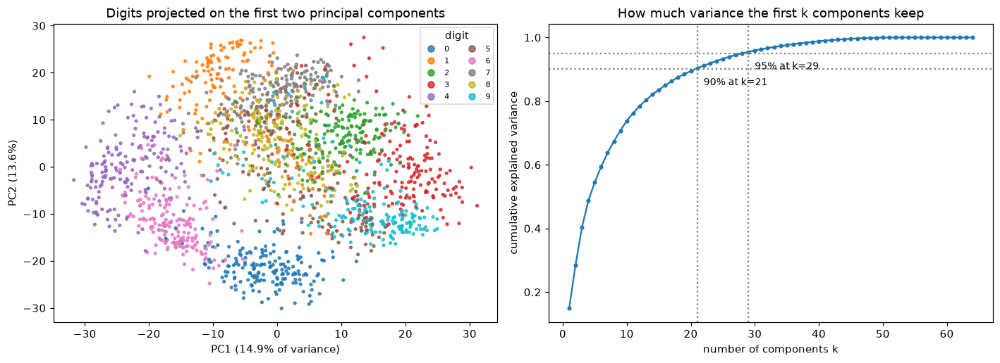
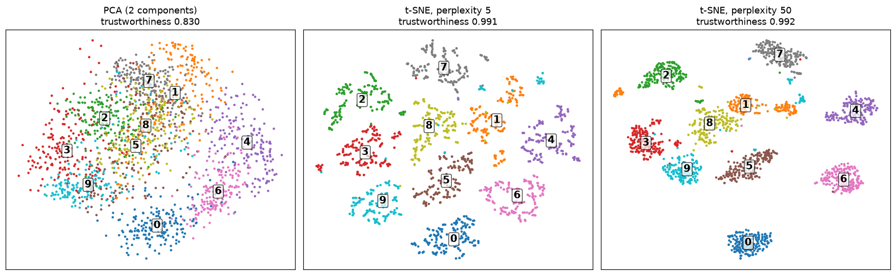

# Dimensionality Reduction

> **Level 4 · Chapter 6** · ⏱️ ~65 min read · Prerequisites: [Matrix decompositions](../01-math-foundations/02-matrix-decompositions.md) (eigenvectors and SVD), [Information theory and optimization](../01-math-foundations/06-information-theory-and-optimization.md) (KL divergence, Lagrange multipliers), [Clustering](05-clustering.md)

Real datasets often have dozens to thousands of features, but much of that is redundant: features move together, and the data really varies along far fewer directions. Dimensionality reduction finds a smaller set of coordinates that keeps what matters. This chapter derives principal component analysis twice, from maximizing variance and from the SVD, shows how to read explained variance and when to whiten, extends PCA to curved structure with kernel PCA, and explains the nonlinear visualization methods t-SNE and UMAP, including how to read their pictures without fooling yourself.

## Why it matters

Alex's team was studying 40,000 users of a fitness app, each described by 120 usage features. Alex ran t-SNE, produced a striking scatter plot with two well-separated islands, and presented it: "We have two distinct user populations, and they're very far apart, so they need completely different products." One island was visibly bigger, so it was labeled "the mainstream".

A data scientist from another team asked Alex to rerun the plot with a different perplexity setting. The two islands moved closer together. With another setting, the smaller one split in three. The size difference between the islands disappeared after subsampling. None of those visual features had been measuring anything: t-SNE preserves which points are neighbors, not how far apart clusters are or how big they are.

What the data actually supported was more modest and more useful. A PCA showed that two directions explained most of the variation, mainly "workout frequency" and "share of social features used", and the users formed a continuum along both. Dimensionality reduction is one of the most powerful ways to see high-dimensional data, and also one of the easiest ways to see things that aren't there. This chapter teaches both the math and the reading skills.

## Concepts

### Why reduce dimensions

You might reduce the number of features for several reasons:

- **Visualization.** You can only look at two or three dimensions at a time. Projecting to 2D is how you explore structure in high-dimensional data.
- **Compression.** Fewer numbers to store and transmit, often with little loss.
- **Noise reduction.** If the signal lives in a few directions and noise is spread across all of them, discarding the low-variance directions discards mostly noise.
- **Speed and stability for later models.** Fewer features train faster; uncorrelated features remove multicollinearity, which destabilizes linear model coefficients (from [Linear regression](../03-ml-fundamentals/02-linear-regression.md)).
- **Fighting the curse of dimensionality.** Distance-based methods like [kNN](01-knn-and-naive-bayes.md) and [clustering](05-clustering.md) work better in fewer, more meaningful dimensions.

There are two families. **Feature selection** keeps a subset of the original features (interpretable, but limited). **Feature extraction** builds new features as combinations of the old ones. PCA, kernel PCA, t-SNE, and UMAP are all extraction methods. Some are **linear** (each new feature is a weighted sum of the old ones), others **nonlinear**.

### PCA, derived from maximizing variance

**Principal component analysis (PCA)** finds the directions along which the data varies the most. Picture a cloud of points shaped like a flattened cigar in 3D. The direction along the cigar's length is where the points spread out most: that's the first principal component. Perpendicular to it, the next widest spread is the second. If the cigar is very thin in the third direction, you lose little by dropping it.

Let the data be $n$ rows $\mathbf{x}_1, \ldots, \mathbf{x}_n \in \mathbb{R}^d$. First **center** it: subtract the mean $\bar{\mathbf{x}}$ from every row, so the centered data matrix $\mathbf{X}$ has column means of zero. The **sample covariance matrix** is

$$
\mathbf{S} = \frac{1}{n - 1}\mathbf{X}^\top\mathbf{X} \in \mathbb{R}^{d \times d},
$$

whose entry $S_{jk}$ is the covariance of features $j$ and $k$.

Project every point onto a unit vector $\mathbf{u}$ ($\lVert\mathbf{u}\rVert = 1$). Point $i$'s coordinate along $\mathbf{u}$ is $z_i = \mathbf{u}^\top\mathbf{x}_i$, and since the data is centered, these projections have mean zero and variance

$$
\frac{1}{n - 1}\sum_{i=1}^{n}(\mathbf{u}^\top\mathbf{x}_i)^2 = \frac{1}{n - 1}\lVert\mathbf{X}\mathbf{u}\rVert^2 = \mathbf{u}^\top\mathbf{S}\,\mathbf{u}.
$$

The first principal component is the direction that maximizes this variance:

$$
\max_{\mathbf{u}}\; \mathbf{u}^\top\mathbf{S}\,\mathbf{u} \quad \text{subject to} \quad \mathbf{u}^\top\mathbf{u} = 1.
$$

The constraint matters: without it, you could make the variance infinite by making $\mathbf{u}$ longer. Use a Lagrange multiplier $\lambda$:

$$
\mathcal{L}(\mathbf{u}, \lambda) = \mathbf{u}^\top\mathbf{S}\,\mathbf{u} - \lambda(\mathbf{u}^\top\mathbf{u} - 1), \qquad \nabla_{\mathbf{u}}\mathcal{L} = 2\mathbf{S}\mathbf{u} - 2\lambda\mathbf{u} = 0 \;\Rightarrow\; \mathbf{S}\mathbf{u} = \lambda\mathbf{u}.
$$

So $\mathbf{u}$ must be an **eigenvector** of the covariance matrix. Which one? At an eigenvector, the variance is $\mathbf{u}^\top\mathbf{S}\mathbf{u} = \lambda\,\mathbf{u}^\top\mathbf{u} = \lambda$, its eigenvalue. To maximize variance, take the eigenvector with the **largest eigenvalue**.

The second component maximizes variance subject to being a unit vector *orthogonal* to the first, and the same argument (with a second multiplier for the orthogonality constraint) gives the eigenvector with the second-largest eigenvalue. In general, the **principal components** are the eigenvectors $\mathbf{v}_1, \ldots, \mathbf{v}_d$ of $\mathbf{S}$, sorted by eigenvalue $\lambda_1 \ge \lambda_2 \ge \cdots \ge \lambda_d \ge 0$, and $\lambda_j$ is the variance of the data along $\mathbf{v}_j$. Because $\mathbf{S}$ is symmetric, the eigenvectors are orthogonal, as you saw in [Matrix decompositions](../01-math-foundations/02-matrix-decompositions.md).

To reduce to $k$ dimensions, stack the top $k$ eigenvectors as columns of $\mathbf{V}_k \in \mathbb{R}^{d \times k}$ and compute the **scores** (the new coordinates):

$$
\mathbf{Z} = \mathbf{X}\mathbf{V}_k \in \mathbb{R}^{n \times k}.
$$

The entries of each $\mathbf{v}_j$ are called **loadings**: they say how much each original feature contributes to component $j$.

### The same answer from minimizing reconstruction error

There's a second, equally natural goal. Project each point onto a $k$-dimensional subspace and map it back: the **reconstruction** is $\hat{\mathbf{x}}_i = \mathbf{V}_k\mathbf{V}_k^\top\mathbf{x}_i$. Which subspace makes the reconstructions closest to the original points?

By the Pythagorean theorem, each point's squared length splits into the part inside the subspace and the part perpendicular to it: $\lVert\mathbf{x}_i\rVert^2 = \lVert\hat{\mathbf{x}}_i\rVert^2 + \lVert\mathbf{x}_i - \hat{\mathbf{x}}_i\rVert^2$. The left side is fixed, so minimizing the total reconstruction error $\sum_i\lVert\mathbf{x}_i - \hat{\mathbf{x}}_i\rVert^2$ is the same as maximizing $\sum_i\lVert\hat{\mathbf{x}}_i\rVert^2$, the variance captured. The two goals have the same solution: the top $k$ principal components. The minimum error is the variance you threw away:

$$
\frac{1}{n - 1}\sum_{i=1}^{n}\lVert\mathbf{x}_i - \hat{\mathbf{x}}_i\rVert^2 = \sum_{j=k+1}^{d}\lambda_j.
$$

### PCA from the SVD

In practice, PCA is computed from the **singular value decomposition** of the centered data matrix, not by forming $\mathbf{S}$. Write

$$
\mathbf{X} = \mathbf{U}\boldsymbol{\Sigma}\mathbf{V}^\top,
$$

where $\mathbf{U} \in \mathbb{R}^{n \times r}$ and $\mathbf{V} \in \mathbb{R}^{d \times r}$ have orthonormal columns and $\boldsymbol{\Sigma}$ is diagonal with singular values $\sigma_1 \ge \sigma_2 \ge \cdots \ge 0$ (here $r = \min(n, d)$). Then

$$
\mathbf{S} = \frac{1}{n - 1}\mathbf{X}^\top\mathbf{X} = \frac{1}{n - 1}\mathbf{V}\boldsymbol{\Sigma}\mathbf{U}^\top\mathbf{U}\boldsymbol{\Sigma}\mathbf{V}^\top = \mathbf{V}\,\frac{\boldsymbol{\Sigma}^2}{n - 1}\,\mathbf{V}^\top.
$$

That's an eigendecomposition of $\mathbf{S}$. So:

- The **principal components** are the right singular vectors, the columns of $\mathbf{V}$.
- The **eigenvalues** (variances) are $\lambda_j = \sigma_j^2/(n - 1)$.
- The **scores** are $\mathbf{Z} = \mathbf{X}\mathbf{V} = \mathbf{U}\boldsymbol{\Sigma}$: the left singular vectors scaled by the singular values.

Why prefer the SVD? Forming $\mathbf{X}^\top\mathbf{X}$ squares the condition number of the problem, losing about half the digits of precision on ill-conditioned data, while the SVD works on $\mathbf{X}$ directly. And when you need only the top few components of a big matrix, **randomized SVD** computes them quickly. scikit-learn's `PCA` uses an exact or randomized SVD depending on the data size. This connects to the **Eckart-Young theorem** from [Matrix decompositions](../01-math-foundations/02-matrix-decompositions.md): truncating the SVD to $k$ terms gives the best rank-$k$ approximation of $\mathbf{X}$, which is exactly the PCA reconstruction.

One quirk: an eigenvector's sign is arbitrary ($-\mathbf{v}$ is as good as $\mathbf{v}$), so different libraries, or the same library on slightly different data, can flip the sign of a component. Don't attach meaning to the sign alone, and align signs before comparing results.

### Explained variance and choosing k

The total variance of the data is the sum of all eigenvalues, $\sum_{j=1}^{d}\lambda_j = \operatorname{tr}(\mathbf{S})$, which equals the sum of the individual feature variances. The **explained variance ratio** of component $j$ is its share:

$$
\frac{\lambda_j}{\sum_{l=1}^{d}\lambda_l}.
$$

A **scree plot** shows the ratios in decreasing order; the **cumulative** explained variance shows how much the first $k$ components capture together. Common ways to pick $k$:

- **A variance threshold**: the smallest $k$ that explains, say, 90% or 95% of the variance.
- **The elbow** of the scree plot, where the curve flattens.
- **Downstream performance**: when PCA feeds a model, treat $k$ as a hyperparameter and choose it by cross-validation.
- **The purpose**: 2 or 3 for a plot, whatever compression budget you have.

### Scaling: covariance or correlation?

PCA maximizes variance, and variance depends on units. If one feature is measured in thousands (income in USD) and the others in single digits, the first component will point almost entirely along income, because that's where the numeric variance is, not because it's most important. For features in different units, **standardize** first (zero mean, unit variance), which makes PCA operate on the **correlation matrix**. When all features share meaningful units (pixel intensities, or measurements in the same unit), the raw covariance can be the better choice, because the differences in variance are real.

### Whitening

The PCA scores are uncorrelated, but their variances are $\lambda_1, \lambda_2, \ldots$, all different. **Whitening** rescales each score to unit variance:

$$
\mathbf{Z}_{\text{white}} = \mathbf{X}\mathbf{V}_k\boldsymbol{\Lambda}_k^{-1/2},
$$

where $\boldsymbol{\Lambda}_k$ is the diagonal matrix of the top $k$ eigenvalues. The result has identity covariance: every direction has the same spread, and the data looks like a round ball. Some algorithms benefit: whitening removes correlations that make gradient descent slow (recall conditioning from [Gradient descent in depth](../03-ml-fundamentals/07-gradient-descent-in-depth.md)), and independent component analysis requires it. The danger is that whitening blows up low-variance directions, which are often mostly noise, to the same importance as the strong signal. Only whiten the components you keep, and keep few enough that you aren't amplifying noise. In scikit-learn, it's `PCA(whiten=True)`.

### What PCA can't do

- **It's linear.** It finds flat subspaces. Data on a curved surface, like a rolled-up sheet or concentric rings, can't be unrolled by a linear projection.
- **Variance isn't relevance.** The directions with the most variance aren't necessarily the ones that predict your target. A tiny-variance feature can be the most predictive one, and PCA might discard it. (Supervised alternatives like partial least squares and linear discriminant analysis use the labels.)
- **It's sensitive to outliers.** Squared distances let a few extreme points rotate the components toward themselves.
- **Components can be hard to interpret.** Each is a mix of all features. Inspect the loadings, and expect components after the first few to be hard to name.

### Kernel PCA

**Kernel PCA** (Schölkopf, Smola, and Müller, 1998) applies the kernel trick from [Support vector machines](04-support-vector-machines.md) to PCA. Imagine mapping each point through a feature map $\phi$ into a high-dimensional space where the curved structure becomes flat, and running PCA there. You can't compute $\phi$ for the RBF kernel (its feature space is infinite-dimensional), but you don't need to.

The key fact: each principal component in feature space lies in the span of the mapped data points, $\mathbf{v} = \sum_i a_i\phi(\mathbf{x}_i)$. Plugging that into the eigenvector equation and multiplying by $\phi(\mathbf{x}_j)^\top$ turns everything into dot products $\phi(\mathbf{x}_i)^\top\phi(\mathbf{x}_j) = k(\mathbf{x}_i, \mathbf{x}_j)$, and the problem becomes an eigenproblem for the $n \times n$ **kernel matrix** $\mathbf{K}$ (after centering it in feature space):

$$
\tilde{\mathbf{K}} = \mathbf{K} - \mathbf{1}_n\mathbf{K} - \mathbf{K}\mathbf{1}_n + \mathbf{1}_n\mathbf{K}\mathbf{1}_n, \qquad \tilde{\mathbf{K}}\mathbf{a} = \mu\,\mathbf{a},
$$

where $\mathbf{1}_n$ is the $n \times n$ matrix with every entry $1/n$. The centering formula is just "subtract the mean" written in terms of dot products. The score of training point $i$ on a component is $\sqrt{\mu}\,a_i$ (with $\mathbf{a}$ normalized to unit length), and a new point's score uses its kernel values against all training points.

Kernel PCA can unfold structure linear PCA can't, but it has costs: an $n \times n$ kernel matrix (quadratic memory, cubic time for the eigendecomposition), a kernel and its parameters to tune, and no easy way to map points back to the original space (the **pre-image problem**).

### t-SNE

PCA preserves large-scale variance. For visualization, you often care more about **local structure**: which points are near which. **t-SNE** (t-distributed stochastic neighbor embedding; van der Maaten and Hinton, 2008) is built for that.

**Step 1: similarities in the original space.** For each point $i$, turn distances to other points into probabilities with a Gaussian centered at $\mathbf{x}_i$:

$$
p_{j \mid i} = \frac{\exp(-\lVert\mathbf{x}_i - \mathbf{x}_j\rVert^2 / 2\sigma_i^2)}{\sum_{l \ne i}\exp(-\lVert\mathbf{x}_i - \mathbf{x}_l\rVert^2 / 2\sigma_i^2)}.
$$

Each point gets its own bandwidth $\sigma_i$, chosen so that the distribution's **perplexity**, $2^{H(P_i)}$ where $H$ is the entropy in bits, equals a user-chosen value. Perplexity is roughly the effective number of neighbors each point pays attention to; typical values are 5 to 50. Points in dense regions get small $\sigma_i$, points in sparse regions large ones. The conditional probabilities are symmetrized into $p_{ij} = (p_{j \mid i} + p_{i \mid j})/2n$.

**Step 2: similarities in the map.** Place points $\mathbf{y}_1, \ldots, \mathbf{y}_n$ in 2D and define similarities with a Student-t distribution with one degree of freedom (a Cauchy distribution):

$$
q_{ij} = \frac{(1 + \lVert\mathbf{y}_i - \mathbf{y}_j\rVert^2)^{-1}}{\sum_{k \ne l}(1 + \lVert\mathbf{y}_k - \mathbf{y}_l\rVert^2)^{-1}}.
$$

**Step 3: match them.** Move the map points to minimize the KL divergence from [Information theory and optimization](../01-math-foundations/06-information-theory-and-optimization.md):

$$
\mathrm{KL}(P \,\Vert\, Q) = \sum_{i \ne j} p_{ij}\log\frac{p_{ij}}{q_{ij}},
$$

by gradient descent. KL heavily penalizes placing true neighbors (large $p_{ij}$) far apart (small $q_{ij}$), but barely penalizes placing non-neighbors close together. So t-SNE prioritizes keeping neighbors together.

**Why the heavy-tailed t distribution?** The **crowding problem**: there's much more room at moderate distances in high dimensions than in 2D, so if the map used Gaussians too, moderately distant points would be crushed together in the middle. The t distribution's heavy tails let moderately dissimilar points sit far apart in the map, which opens up gaps between clusters.

**How to read a t-SNE plot**, following Wattenberg, Viégas, and Johnson's excellent 2016 article "How to Use t-SNE Effectively":

- **Cluster sizes mean nothing.** t-SNE adapts $\sigma_i$ to local density, which expands dense clusters and shrinks sparse ones.
- **Distances between clusters may mean nothing.** Global geometry is not preserved reliably.
- **Perplexity changes the picture.** Always look at several values.
- **Random noise can look like clusters**, especially at low perplexity.
- **It's stochastic and non-convex.** Different seeds give different maps; scikit-learn initializes with PCA by default, which helps stability.
- **It doesn't learn a reusable mapping.** scikit-learn's `TSNE` has no `transform` for new points, and t-SNE coordinates shouldn't be used as features for a model.

Exact t-SNE costs $O(n^2)$; the Barnes-Hut approximation (scikit-learn's default) brings it to $O(n\log n)$, practical up to tens of thousands of points. Running PCA to about 50 dimensions first is a standard speedup and denoiser.

### UMAP

**UMAP** (uniform manifold approximation and projection; McInnes, Healy, and Melville, 2018) is a newer method with the same goal and a similar spirit. It builds a weighted $k$-nearest-neighbor graph in the original space (with per-point scaling that adapts to local density, much like t-SNE's $\sigma_i$), then lays out a low-dimensional graph whose edges match it, minimizing a cross-entropy between the two sets of edge weights with stochastic gradient descent. The cross-entropy includes a term that pushes non-neighbors apart, which tends to preserve somewhat more global structure than t-SNE, though how much is debated and depends on settings.

In practice UMAP is usually faster than t-SNE on large datasets, scales to millions of points, can embed into more than 2 dimensions, and learns a `transform` for new points. Its main parameters are `n_neighbors` (local versus global emphasis, like perplexity) and `min_dist` (how tightly points may pack). It lives in the separate `umap-learn` package. Every warning about reading t-SNE plots applies to UMAP too.

### Visualizing high-dimensional data responsibly

A checklist before you show anyone a 2D embedding:

1. **Start with PCA.** It's deterministic, linear, and its axes mean something (directions of variance). Report the explained variance of the axes you plot.
2. **Scale features** appropriately before any of these methods.
3. **Run nonlinear methods with several settings and seeds.** Show the reader that the structure you're claiming survives.
4. **Only claim what the method preserves.** For t-SNE and UMAP: local neighborhoods. Not cluster sizes, not distances between clusters, not densities.
5. **Validate clusters you see in the original space**, with the methods from [Clustering](05-clustering.md), not in the embedding.
6. **Color by known variables** (labels, time, a key feature) to check whether the structure means what you think it means.

## In practice

### PCA from scratch, two ways

The digits dataset has 1,797 images of handwritten digits, each 8×8 pixels: 64 features. The from-scratch code computes PCA by eigendecomposition of the covariance and by SVD of the centered data, and checks both against scikit-learn.

```python
import numpy as np
import matplotlib.pyplot as plt
from sklearn.datasets import load_digits, load_wine, make_circles
from sklearn.decomposition import PCA, KernelPCA
from sklearn.preprocessing import StandardScaler

X, y = load_digits(return_X_y=True)
n, d = X.shape
Xc = X - X.mean(axis=0)                                     # center

# Way 1: eigendecomposition of the covariance matrix
S = Xc.T @ Xc / (n - 1)
evals, evecs = np.linalg.eigh(S)                            # ascending order for symmetric matrices
order = np.argsort(evals)[::-1]
evals, evecs = evals[order], evecs[:, order]

# Way 2: SVD of the centered data
U, sing, Vt = np.linalg.svd(Xc, full_matrices=False)
evals_svd = sing**2 / (n - 1)

pca = PCA().fit(X)
print("eigenvalues equal sigma^2/(n-1):", np.allclose(evals, evals_svd))
print("matches sklearn explained_variance_:", np.allclose(evals_svd, pca.explained_variance_))
same_dir = np.abs(np.sum(Vt[:10] * pca.components_[:10], axis=1))      # |cosine| per component
print("top-10 components agree up to sign:", np.allclose(same_dir, 1))
print("scores X V equal U Sigma:", np.allclose(Xc @ Vt.T, U * sing))
ratio = evals / evals.sum()
print("explained variance ratio, first 5:", ratio[:5].round(3))
for target in [0.5, 0.8, 0.9, 0.95, 0.99]:
    print(f"components for {target:.0%} of variance: {np.searchsorted(np.cumsum(ratio), target) + 1}")
```

```text
eigenvalues equal sigma^2/(n-1): True
matches sklearn explained_variance_: True
top-10 components agree up to sign: True
scores X V equal U Sigma: True
explained variance ratio, first 5: [0.149 0.136 0.118 0.084 0.058]
components for 50% of variance: 5
components for 80% of variance: 13
components for 90% of variance: 21
components for 95% of variance: 29
components for 99% of variance: 41
```

Two numerical checks of the derivation: no random unit direction captures more variance than the first component, and the reconstruction error equals the sum of the discarded eigenvalues.

```python
rng = np.random.default_rng(0)
dirs = rng.normal(size=(10000, d)); dirs /= np.linalg.norm(dirs, axis=1, keepdims=True)
proj_var = np.einsum("ij,jk,ik->i", dirs, S, dirs)                     # u^T S u for each direction
print(f"largest variance over 10,000 random directions: {proj_var.max():.2f}  vs  lambda_1 = {evals[0]:.2f}")

for k in [2, 10, 30]:
    Vk = Vt[:k].T
    X_hat = Xc @ Vk @ Vk.T                                              # project and reconstruct
    err = np.sum((Xc - X_hat) ** 2) / (n - 1)
    print(f"k={k:>2}: reconstruction error {err:9.2f}, sum of discarded eigenvalues {evals[k:].sum():9.2f}")
```

```text
largest variance over 10,000 random directions: 65.63  vs  lambda_1 = 179.01
k= 2: reconstruction error    859.42, sum of discarded eigenvalues    859.42
k=10: reconstruction error    314.69, sum of discarded eigenvalues    314.69
k=30: reconstruction error     49.19, sum of discarded eigenvalues     49.19
```

Now the picture: the first two components of the digits, colored by the true digit, and the cumulative explained variance.

```python
Z = Xc @ Vt[:2].T
fig, axes = plt.subplots(1, 2, figsize=(13, 4.8))
sc = axes[0].scatter(Z[:, 0], Z[:, 1], c=y, cmap="tab10", s=6, alpha=0.8)
axes[0].legend(*sc.legend_elements(), title="digit", fontsize=7, loc="upper right", ncol=2)
axes[0].set_xlabel(f"PC1 ({ratio[0]:.1%} of variance)"); axes[0].set_ylabel(f"PC2 ({ratio[1]:.1%})")
axes[0].set_title("Digits projected on the first two principal components")
axes[1].plot(np.arange(1, d + 1), np.cumsum(ratio), "o-", ms=3)
for t in [0.9, 0.95]:
    k = np.searchsorted(np.cumsum(ratio), t) + 1
    axes[1].axhline(t, color="gray", ls=":"); axes[1].axvline(k, color="gray", ls=":")
    axes[1].annotate(f"{t:.0%} at k={k}", (k + 1, t - 0.05), fontsize=9)
axes[1].set_xlabel("number of components k"); axes[1].set_ylabel("cumulative explained variance")
axes[1].set_title("How much variance the first k components keep")
plt.tight_layout()
plt.show()
```



*Left: two linear directions already separate some digits (0, 4, 6) but leave others overlapping. Right: the cumulative explained variance; most of the 64 pixel dimensions are redundant.*

### Scaling and whitening

The wine dataset mixes units: one feature, proline, is in the hundreds to over a thousand, while others are fractions. Compare the first component's loadings without and with standardization, then whiten:

```python
Xw, yw = load_wine(return_X_y=True, as_frame=True)
for name, data in [("raw", Xw.to_numpy()), ("standardized", StandardScaler().fit_transform(Xw))]:
    p = PCA(2).fit(data)
    top = np.argsort(np.abs(p.components_[0]))[::-1][:3]
    print(f"{name:>12}: PC1 explains {p.explained_variance_ratio_[0]:.1%}; largest |loadings|:",
          {Xw.columns[j]: round(float(p.components_[0, j]), 2) for j in top})

Zw = PCA(5, whiten=True).fit_transform(StandardScaler().fit_transform(Xw))
print("covariance of whitened scores (rounded):")
print(np.cov(Zw.T).round(3))
```

```text
         raw: PC1 explains 99.8%; largest |loadings|: {'proline': 1.0, 'magnesium': 0.02, 'alcalinity_of_ash': -0.0}
standardized: PC1 explains 36.2%; largest |loadings|: {'flavanoids': 0.42, 'total_phenols': 0.39, 'od280/od315_of_diluted_wines': 0.38}
covariance of whitened scores (rounded):
[[ 1. -0.  0.  0. -0.]
 [-0.  1. -0.  0. -0.]
 [ 0. -0.  1. -0. -0.]
 [ 0.  0. -0.  1.  0.]
 [-0. -0. -0.  0.  1.]]
```

Without scaling, PCA is just "proline": the first component is almost entirely that one feature, because its variance is in the tens of thousands. After standardizing, the first component mixes several chemical features. Whitening gives scores with identity covariance.

!!! warning "Common mistake: fitting PCA on all the data before cross-validation"
    PCA learns from data: the mean, the components, and the variances all come from whatever you fit it on. Fitting it on the full dataset and then cross-validating a model on the scores leaks information from the validation folds. Put PCA inside the pipeline, so it's refit on each training fold:

    ```python
    from sklearn.pipeline import make_pipeline
    from sklearn.linear_model import LogisticRegression
    from sklearn.model_selection import cross_val_score

    for k in [5, 10, 20, 40, None]:
        steps = [StandardScaler()] + ([PCA(k)] if k else []) + [LogisticRegression(max_iter=2000)]
        acc = cross_val_score(make_pipeline(*steps), X, y, cv=5).mean()
        print(f"PCA k={str(k):>4}: CV accuracy {acc:.3f}")
    ```

    ```text
    PCA k=   5: CV accuracy 0.771
    PCA k=  10: CV accuracy 0.840
    PCA k=  20: CV accuracy 0.899
    PCA k=  40: CV accuracy 0.914
    PCA k=None: CV accuracy 0.920
    ```

    Here a model on 40 components is about as accurate as one on all 64 pixels, 20 is close behind, and 5 loses a lot. Choose $k$ like any hyperparameter.

### Kernel PCA from scratch

Concentric circles can't be separated by any linear projection. Kernel PCA with an RBF kernel can. The from-scratch version builds the kernel matrix, centers it, takes its top eigenvectors, and scales them by $\sqrt{\mu}$:

```python
Xr, yr = make_circles(n_samples=400, factor=0.3, noise=0.05, random_state=0)
gamma = 2.0

def rbf_kernel(A, B, gamma):
    d2 = (A**2).sum(1)[:, None] - 2 * A @ B.T + (B**2).sum(1)[None, :]
    return np.exp(-gamma * d2)

K = rbf_kernel(Xr, Xr, gamma)
m = len(K)
one = np.full((m, m), 1 / m)
Kc = K - one @ K - K @ one + one @ K @ one                  # center in feature space
mu, A = np.linalg.eigh(Kc)
mu, A = mu[::-1][:2], A[:, ::-1][:, :2]                     # top 2 eigenpairs
Z_ours = A * np.sqrt(mu)                                    # training-point scores

Z_sk = KernelPCA(n_components=2, kernel="rbf", gamma=gamma).fit_transform(Xr)
print("matches sklearn KernelPCA up to sign:", np.allclose(np.abs(Z_ours), np.abs(Z_sk), atol=1e-6))

from sklearn.linear_model import LogisticRegression
for name, Z2 in [("linear PCA", PCA(2).fit_transform(Xr)), ("kernel PCA", Z_ours)]:
    acc = LogisticRegression().fit(Z2[:, :1], yr).score(Z2[:, :1], yr)
    print(f"{name}: accuracy of a threshold on component 1 alone = {acc:.3f}")
```

```text
matches sklearn KernelPCA up to sign: True
linear PCA: accuracy of a threshold on component 1 alone = 0.495
kernel PCA: accuracy of a threshold on component 1 alone = 1.000
```

On the first kernel principal component alone, the inner and outer circles are almost perfectly separable by a single threshold, while the first linear component is useless (it's just a rotation of the original axes, and neither axis separates rings).

### t-SNE, PCA, and the effect of perplexity

Now t-SNE on the digits (after PCA to 30 dimensions, the standard speedup), at two perplexities, next to the PCA projection. The **trustworthiness** score (scikit-learn's `trustworthiness`, between 0 and 1) measures how well each embedding preserves local neighborhoods: it penalizes points that are neighbors in the embedding but not in the original space.

```python
from sklearn.manifold import TSNE, trustworthiness

X30 = PCA(30, random_state=0).fit_transform(X)
embeddings = {"PCA (2 components)": PCA(2).fit_transform(X)}
for perp in [5, 50]:
    embeddings[f"t-SNE, perplexity {perp}"] = TSNE(n_components=2, perplexity=perp, init="pca",
                                                   random_state=0).fit_transform(X30)

fig, axes = plt.subplots(1, 3, figsize=(16, 5))
for ax, (name, E) in zip(axes, embeddings.items()):
    tw = trustworthiness(X, E, n_neighbors=10)
    print(f"{name:<24} trustworthiness (10 neighbors): {tw:.3f}")
    ax.scatter(E[:, 0], E[:, 1], c=y, cmap="tab10", s=4)
    for digit in range(10):
        cx, cy = np.median(E[y == digit], axis=0)
        ax.text(cx, cy, str(digit), fontsize=13, weight="bold", ha="center", va="center",
                bbox=dict(boxstyle="round,pad=0.15", fc="white", alpha=0.7))
    ax.set_title(f"{name}\ntrustworthiness {tw:.3f}"); ax.set_xticks([]); ax.set_yticks([])
plt.tight_layout()
plt.show()
```

```text
PCA (2 components)       trustworthiness (10 neighbors): 0.830
t-SNE, perplexity 5      trustworthiness (10 neighbors): 0.991
t-SNE, perplexity 50     trustworthiness (10 neighbors): 0.992
```



*PCA keeps global variance but overlaps most digits. t-SNE separates them, preserving local neighborhoods much better (higher trustworthiness), but the layout, the spacing between groups, and the group sizes change with perplexity. Only the neighborhoods are reliable.*

Both t-SNE maps separate the ten digits far better than PCA, and their trustworthiness is much higher. But compare them: the arrangement of the groups and the gaps between them differ. Any claim like "4s are closer to 9s than to 0s" based on one of these maps would be reading noise.

### UMAP

UMAP isn't installed in this handbook's environment (`pip install umap-learn`). Its interface follows scikit-learn's, and unlike `TSNE`, it can transform new points:

<!-- skip-run -->
```python
import umap

reducer = umap.UMAP(n_neighbors=15, min_dist=0.1, n_components=2, random_state=0)
E_train = reducer.fit_transform(X_train)        # learn the embedding
E_new = reducer.transform(X_new)                # place new points into the same map
```

Try several `n_neighbors` values (for example 5, 15, 50): small values emphasize fine local structure, large values more of the global layout.

## Exercises

### Exercise 1: PCA of a 2×2 covariance by hand (easy)

A centered 2D dataset has covariance matrix $\mathbf{S} = \begin{pmatrix} 3 & 1 \\ 1 & 3 \end{pmatrix}$. Find the principal components and their variances, the explained variance ratio of the first, and the variance of the data along the $x$-axis direction $(1, 0)$.

??? success "Solution"

    The characteristic equation is $(3 - \lambda)^2 - 1 = 0$, so $\lambda = 4$ or $\lambda = 2$. For $\lambda = 4$: $(\mathbf{S} - 4\mathbf{I})\mathbf{v} = 0$ gives $-v_1 + v_2 = 0$, so $\mathbf{v}_1 = (1, 1)/\sqrt{2}$. For $\lambda = 2$: $\mathbf{v}_2 = (1, -1)/\sqrt{2}$.

    The first component explains $4/(4 + 2) = 2/3$ of the variance. Along $(1, 0)$, the variance is $\mathbf{u}^\top\mathbf{S}\mathbf{u} = S_{11} = 3$, between the two eigenvalues, as it must be for any unit direction.

    ```python
    vals, vecs = np.linalg.eigh(np.array([[3.0, 1.0], [1.0, 3.0]]))
    print(vals[::-1], vecs[:, ::-1].round(3))
    ```

    ```text
    [4. 2.] [[ 0.707 -0.707]
     [ 0.707  0.707]]
    ```

### Exercise 2: Power iteration (easy)

The power method finds the top eigenvector of a symmetric matrix: start from a random vector and repeat $\mathbf{u} \leftarrow \mathbf{S}\mathbf{u} / \lVert\mathbf{S}\mathbf{u}\rVert$. Implement it, run it on the digits covariance `S`, and compare the result with the first principal component. Why does it converge, and what controls how fast?

??? success "Solution"

    ```python
    def power_iteration(S, n_iter=200, seed=0):
        u = np.random.default_rng(seed).normal(size=len(S))
        for _ in range(n_iter):
            u = S @ u
            u /= np.linalg.norm(u)
        return u, u @ S @ u

    u, lam = power_iteration(S)
    print("eigenvalue:", round(lam, 4), "vs", round(evals[0], 4))
    print("|cosine| with PC1:", round(abs(u @ evecs[:, 0]), 6))
    ```

    ```text
    eigenvalue: 179.0069 vs 179.0069
    |cosine| with PC1: 1.0
    ```

    Write the starting vector in the eigenbasis, $\mathbf{u}_0 = \sum_j c_j\mathbf{v}_j$. After $t$ multiplications it's $\sum_j c_j\lambda_j^t\mathbf{v}_j$, and the $\mathbf{v}_1$ term dominates because $\lambda_1$ is largest. The error shrinks like $(\lambda_2/\lambda_1)^t$, so convergence is fast when the top eigenvalue is well separated from the second.

### Exercise 3: Choosing k for compression (medium)

Using the digits PCA, find the smallest $k$ whose reconstructions have a mean squared error per pixel below 1.0 (pixel values range from 0 to 16). Show an original digit and its reconstruction for that $k$, and report the compression ratio (numbers stored per image before and after, ignoring the cost of storing the components).

??? success "Solution"

    The mean squared error per pixel is the sum of discarded eigenvalues times $(n-1)/n$, divided by the 64 pixels, so you can find $k$ without reconstructing anything:

    ```python
    per_pixel = np.array([evals[k:].sum() * (n - 1) / n / d for k in range(d + 1)])
    k_best = int(np.argmax(per_pixel < 1.0))
    Vk = Vt[:k_best].T
    X_hat = Xc @ Vk @ Vk.T + X.mean(axis=0)
    print("k =", k_best, "| MSE per pixel:", round(np.mean((X - X_hat) ** 2), 3),
          "| compression:", d, "->", k_best, f"numbers ({d / k_best:.1f}x)")
    print("original digit 0 (first row of pixels):", X[0, :8])
    print("reconstruction (first row of pixels):   ", X_hat[0, :8].round(1))
    ```

    ```text
    k = 28 | MSE per pixel: 0.941 | compression: 64 -> 28 numbers (2.3x)
    original digit 0 (first row of pixels): [ 0.  0.  5. 13.  9.  1.  0.  0.]
    reconstruction (first row of pixels):    [ 0.   0.1  5.6 11.8  8.9  1.7  1.3  0.4]
    ```

### Exercise 4: When PCA throws away the signal (medium)

Construct a 2-class dataset with two features where feature 1 has large variance but no information about the class, and feature 2 has small variance and separates the classes perfectly. Show that projecting onto the first principal component destroys the class information, while the second component keeps it.

??? success "Solution"

    ```python
    rng = np.random.default_rng(0)
    n2 = 500
    yc = rng.integers(0, 2, n2)
    Xs = np.c_[rng.normal(0, 10, n2), np.where(yc == 1, 0.5, -0.5) + rng.normal(0, 0.1, n2)]
    p = PCA(2).fit(Xs)
    print("explained variance ratio:", p.explained_variance_ratio_.round(4))
    Zs = p.transform(Xs)
    for j in range(2):
        acc = LogisticRegression().fit(Zs[:, [j]], yc).score(Zs[:, [j]], yc)
        print(f"accuracy using only PC{j + 1}: {acc:.3f}")
    ```

    ```text
    explained variance ratio: [0.9974 0.0026]
    accuracy using only PC1: 0.572
    accuracy using only PC2: 1.000
    ```

    PCA keeps PC1, which explains more than 99% of the variance and is almost pure noise for this task, and would discard PC2, which explains under 1% but carries all the class information. PC1 alone is close to chance. Unsupervised dimensionality reduction doesn't know what you're going to predict. If the goal is prediction, choose $k$ by cross-validated model performance, or use a supervised method.

### Exercise 5: Kernel PCA for a new point (hard)

The score of a *new* point $\mathbf{x}$ on kernel principal component $\mathbf{a}$ (unit-norm eigenvector with eigenvalue $\mu$) is $\frac{1}{\sqrt{\mu}}\sum_i a_i\,\tilde{k}(\mathbf{x}_i, \mathbf{x})$, where $\tilde{k}$ is the kernel centered with the *training* statistics: $\tilde{\mathbf{k}} = \mathbf{k} - \bar{\mathbf{k}}_{\text{col}} - \bar{k}(\mathbf{x})\mathbf{1} + \bar{K}$, with $\mathbf{k}_i = k(\mathbf{x}_i, \mathbf{x})$, $\bar{\mathbf{k}}_{\text{col}}$ the column means of the training kernel matrix, $\bar{k}(\mathbf{x})$ the mean of $\mathbf{k}$, and $\bar{K}$ the overall mean of $\mathbf{K}$. Implement it and check it against `KernelPCA.transform` on 5 new points.

??? success "Solution"

    ```python
    X_new = np.random.default_rng(1).uniform(-1, 1, (5, 2))
    k_new = rbf_kernel(X_new, Xr, gamma)                       # (5, m): k(x_i, x) for each new x
    k_tilde = k_new - K.mean(axis=0)[None, :] - k_new.mean(axis=1, keepdims=True) + K.mean()
    Z_new_ours = k_tilde @ A / np.sqrt(mu)
    kp = KernelPCA(n_components=2, kernel="rbf", gamma=gamma).fit(Xr)
    Z_new_sk = kp.transform(X_new)
    print("matches KernelPCA.transform up to sign:", np.allclose(np.abs(Z_new_ours), np.abs(Z_new_sk), atol=1e-6))
    ```

    ```text
    matches KernelPCA.transform up to sign: True
    ```

    The centering uses the training means because the feature-space mean was computed from training points; that's the same rule as applying a fitted `StandardScaler` to new data. For training points, $\frac{1}{\sqrt{\mu}}\tilde{\mathbf{K}}\mathbf{a} = \frac{\mu}{\sqrt{\mu}}\mathbf{a} = \sqrt{\mu}\,\mathbf{a}$, which recovers the training scores used earlier.

### Exercise 6: Reading an embedding (hard, conceptual)

A colleague shows a UMAP plot of 200,000 transactions with a small, tight island far from the main mass and says: "These transactions are extremely different from everything else, and there are only a few of them, so this is a fraud ring." List what the plot does and doesn't support, and the analyses you'd run before acting.

??? success "Solution"

    **Supported:** the island's points are probably each other's nearest neighbors in the original feature space, and somewhat distinct from their neighbors in the main mass. That's worth investigating.

    **Not supported:** "extremely different" (distances between groups in UMAP are not reliable), "only a few" (apparent density and size are distorted; count the points), and "fraud" (the embedding knows nothing about labels).

    **Before acting:**

    - Count the points and inspect their raw features: what do they share? (Often a data artifact: a default value, a missing-value code, a single merchant, a batch import.)
    - Rerun with different `n_neighbors`, `min_dist`, and seeds; check that the island persists.
    - Confirm the group in the original space with clustering or nearest-neighbor analysis, and measure its distance to the rest there.
    - Compare with known fraud labels or chargebacks, if any exist; score the points with an anomaly detector from [Anomaly detection and recommender systems](08-anomaly-detection-and-recommenders.md).
    - Hand a sample to a fraud analyst for review before any automated action.

## Check yourself

1. State the optimization problem whose solution is the first principal component, and its solution.

    ??? note "Answer"

        Maximize $\mathbf{u}^\top\mathbf{S}\mathbf{u}$ subject to $\lVert\mathbf{u}\rVert = 1$, where $\mathbf{S}$ is the covariance of the centered data. The Lagrange condition $\mathbf{S}\mathbf{u} = \lambda\mathbf{u}$ makes $\mathbf{u}$ an eigenvector; the maximum is the top eigenvector, and the variance captured is its eigenvalue.

2. How do you get the principal components, their variances, and the scores from the SVD $\mathbf{X} = \mathbf{U}\boldsymbol{\Sigma}\mathbf{V}^\top$?

    ??? note "Answer"

        Components: columns of $\mathbf{V}$. Variances: $\sigma_j^2/(n-1)$. Scores: $\mathbf{X}\mathbf{V} = \mathbf{U}\boldsymbol{\Sigma}$. The data must be centered first.

3. Why are maximizing captured variance and minimizing reconstruction error the same problem?

    ??? note "Answer"

        For each point, $\lVert\mathbf{x}\rVert^2 = \lVert\text{projection}\rVert^2 + \lVert\text{residual}\rVert^2$ (Pythagoras). The total is fixed, so maximizing the projected part minimizes the residual part.

4. When should you standardize before PCA?

    ??? note "Answer"

        When features are in different units or scales; otherwise PCA's components chase the features with the largest numeric variance. When all features share meaningful units (pixels, same-unit measurements), the raw covariance may be appropriate.

5. What does whitening do, and what's its danger?

    ??? note "Answer"

        It rescales the PCA scores to unit variance, giving identity covariance. It amplifies low-variance directions, which are often mostly noise, so whiten only the components you keep.

6. How does kernel PCA avoid computing the feature map?

    ??? note "Answer"

        The components lie in the span of the mapped data, so the eigenproblem can be written entirely in terms of dot products, i.e., the kernel matrix. You eigendecompose the centered $n \times n$ kernel matrix instead.

7. What does t-SNE preserve, and what doesn't it? What's perplexity?

    ??? note "Answer"

        It preserves local neighborhoods. It doesn't reliably preserve cluster sizes, distances between clusters, or densities. Perplexity sets each point's Gaussian bandwidth so that its neighbor distribution has a target effective number of neighbors; it changes the picture, so try several values.

8. Why use a Student-t distribution in the low-dimensional map?

    ??? note "Answer"

        To fix the crowding problem: there's less room at moderate distances in 2D than in high dimensions. Heavy tails let moderately distant points sit farther apart in the map, opening gaps between clusters instead of crushing everything into the center.

## Key takeaways

- Dimensionality reduction serves visualization, compression, denoising, and better downstream models. Feature extraction builds new features; PCA is linear, kernel PCA, t-SNE, and UMAP are not.
- PCA's components are the eigenvectors of the covariance matrix, found by maximizing projected variance (or minimizing reconstruction error), and computed in practice from the SVD of the centered data.
- Explained variance ratios guide the choice of $k$; when PCA feeds a model, choose $k$ by cross-validation and fit PCA inside the pipeline.
- Standardize features in different units; whiten only the components you keep.
- Kernel PCA runs PCA in an implicit feature space via the centered kernel matrix and can unfold curved structure.
- t-SNE and UMAP make excellent maps of local neighborhoods, but cluster sizes and between-cluster distances in them are not trustworthy. Check several settings, and validate structure in the original space.

## Further reading

- Jolliffe, *Principal Component Analysis*, 2nd ed., Springer, 2002. The standard reference.
- Shlens, "A Tutorial on Principal Component Analysis", arXiv:1404.1100, 2014. A clear derivation via both eigenvectors and the SVD.
- van der Maaten and Hinton, "Visualizing Data using t-SNE", *Journal of Machine Learning Research* 9, 2008.
- Wattenberg, Viégas, and Johnson, "How to Use t-SNE Effectively", *Distill*, 2016. Interactive examples of every pitfall.
- McInnes, Healy, and Melville, "UMAP: Uniform Manifold Approximation and Projection for Dimension Reduction", arXiv:1802.03426, 2018.

## Next

Every model so far assumed the rows of a dataset are independent. Next you'll handle data where order is everything: [Time series forecasting](07-time-series.md).
