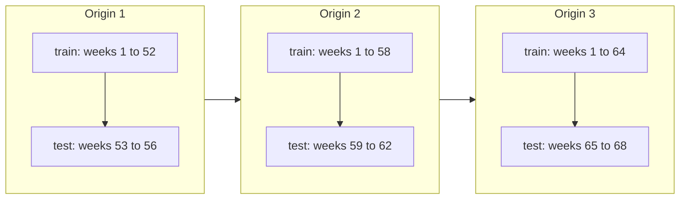
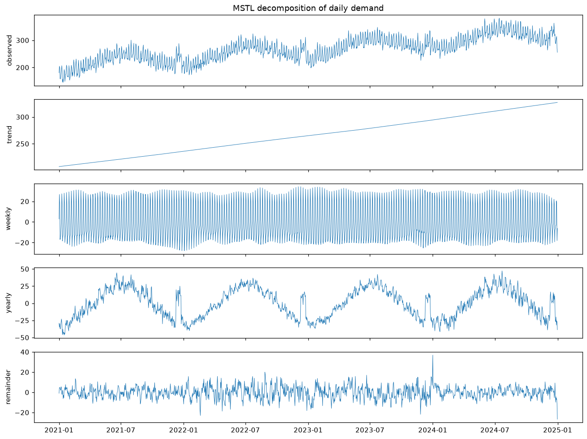
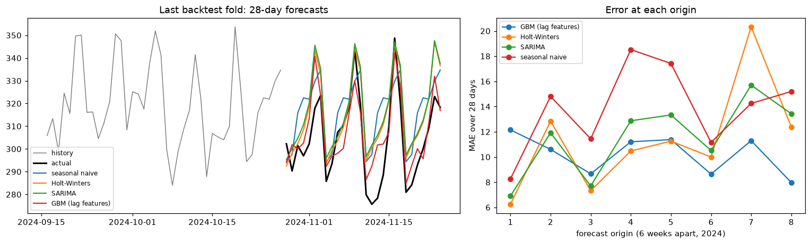

# Time Series Forecasting

> **Level 4 · Chapter 7** · ⏱️ ~75 min read · Prerequisites: [pandas](../00-python-for-data/05-pandas.md) (datetime and time series), [Statistics](../01-math-foundations/05-statistics.md) (hypothesis tests), [Generalization and the bias-variance trade-off](../03-ml-fundamentals/04-generalization-bias-variance.md) (time-series splits), [Ensembles](03-ensembles.md)

A time series is a sequence of measurements in time order: daily sales, hourly electricity load, monthly sign-ups. Forecasting it means predicting future values from past ones, and the order of the data changes almost everything about how you model and validate. This chapter covers decomposing a series into trend, seasonality, and noise; stationarity, differencing, and the augmented Dickey-Fuller test; autocorrelation and partial autocorrelation; exponential smoothing up to Holt-Winters; ARIMA; machine learning with lag features; and walk-forward backtesting, the only honest way to evaluate a forecaster.

## Why it matters

Wei built a model to forecast daily demand at a chain of bakeries, so each store could plan four weeks of flour orders. Wei turned the problem into ordinary supervised learning: for each day, the features were the previous 7 days' sales, the day of the week, and the month, and the target was that day's sales. A gradient-boosted model scored a mean absolute error of 6 loaves in 5-fold cross-validation, much better than the old spreadsheet. It shipped.

In production, the errors were nearly twice as large. Two mistakes compounded. First, the cross-validation folds were shuffled, so the model was trained on days *after* the days it was tested on: it could peek at the future. Second, and worse, the forecasts were needed four weeks ahead, but the model's most important feature was *yesterday's* sales. When forecasting day 20 of next month, yesterday's sales don't exist yet. The validation measured a task (predict tomorrow, with hindsight) that nobody needed.

Time series break the assumption behind most of this handbook: that rows are independent draws from one distribution. Today depends on yesterday, the future isn't available at prediction time, and the pattern itself can drift. This chapter shows how to model that dependence and, just as important, how to evaluate a forecast so the number you report is the number you'll get.

## Concepts

### Components: trend, seasonality, and noise

Look at almost any business time series and you'll see a few recognizable parts:

- **Trend**: the long-run direction, like growth in demand as a business expands.
- **Seasonality**: a pattern that repeats with a fixed, known **period**: busier weekends (period 7 days), summer peaks (period 1 year), or a morning rush (period 24 hours). A series can have several seasonalities at once.
- **Cycles**: rises and falls without a fixed period, like business cycles. They're harder to forecast and often absorbed into the trend.
- **Noise** (the **remainder** or residual): what's left, the irregular part.

A **decomposition** writes the series $y_t$ (the value at time $t$) as a combination of these. In an **additive** decomposition, the components add up:

$$
y_t = T_t + S_t + R_t,
$$

with trend $T_t$, seasonal component $S_t$, and remainder $R_t$. Additive suits series whose seasonal swings stay the same size as the level changes. When the swings grow with the level (a store twice as busy has weekend peaks twice as tall), a **multiplicative** decomposition $y_t = T_t \times S_t \times R_t$ fits better. Taking logs turns multiplicative into additive, since $\log y_t = \log T_t + \log S_t + \log R_t$, which is one reason log transforms are so common in forecasting.

**Classical decomposition** estimates the trend with a centered moving average over one full period (which averages the seasonality away), then estimates each season's effect as the average detrended value for that season. **STL** (seasonal-trend decomposition using LOESS; Cleveland et al., 1990) does the same job with local regression, so the seasonal pattern can evolve slowly and outliers have less influence. **MSTL** extends STL to several seasonal periods at once. Decomposition is mainly a tool for *understanding* a series: how strong are the trend and each seasonality, and what does the remainder look like?

### Stationarity

Most classical forecasting models assume the series is **stationary**: its statistical behavior doesn't change over time. Precisely, a series is **weakly stationary** if its mean is constant, its variance is constant, and the covariance between $y_t$ and $y_{t+k}$ depends only on the **lag** $k$, not on $t$.

Why care? A model learns patterns from the past and applies them to the future. That's only valid if the future behaves like the past in the relevant ways. A series with a trend has a mean that changes, so its "average level" in training data is meaningless for the future; seasonality makes the mean depend on the time of year; and a series whose volatility grows breaks constant variance.

The classic non-stationary example is a **random walk**: $y_t = y_{t-1} + \varepsilon_t$, where $\varepsilon_t$ is independent noise with variance $\sigma^2$. Each step adds a new shock that never decays, so after $t$ steps the variance is $t\sigma^2$, growing without bound. Random walks wander and look like they have trends, even though they have none. Stock prices behave roughly like random walks. Contrast **white noise**, $y_t = \varepsilon_t$, which is stationary, and an **AR(1)** process $y_t = \phi y_{t-1} + \varepsilon_t$ with $\lvert\phi\rvert < 1$, which is stationary because each shock decays geometrically. A random walk is the case $\phi = 1$, which is called a **unit root**.

**Differencing** turns many non-stationary series into stationary ones. The **first difference** is $\Delta y_t = y_t - y_{t-1}$: the change from one step to the next. Differencing a random walk gives back white noise. Differencing a linear trend $a + bt$ gives the constant $b$. A **seasonal difference** $y_t - y_{t-m}$ (with period $m$) removes a stable seasonal pattern. You forecast the differenced series and then add the differences back up (integrate) to get forecasts of the original.

### The augmented Dickey-Fuller test

How do you decide whether a series needs differencing? The **augmented Dickey-Fuller (ADF) test** checks for a unit root. It fits the regression

$$
\Delta y_t = \alpha + \gamma\,y_{t-1} + \sum_{i=1}^{p}\delta_i\,\Delta y_{t-i} + \varepsilon_t,
$$

where the lagged differences soak up short-term autocorrelation (that's the "augmented" part), and optionally a time trend $\beta t$ is included too. If the series has a unit root, a high $y_{t-1}$ tells you nothing about the next change, so $\gamma = 0$. If it's stationary around a mean, a high value tends to be followed by a fall back toward the mean, so $\gamma < 0$.

- **Null hypothesis**: $\gamma = 0$, a unit root (non-stationary).
- **Alternative**: $\gamma < 0$, stationary.
- The test statistic is the usual $t$-statistic $\hat{\gamma}/\operatorname{se}(\hat{\gamma})$, but under the null it doesn't follow a $t$ distribution, so p-values come from special tables (MacKinnon's), which statsmodels' `adfuller` uses.

A small p-value (below 0.05, say) is evidence *against* a unit root: the series looks stationary. A large p-value means you can't reject a unit root, so difference the series and test again. Recall from [Statistics](../01-math-foundations/05-statistics.md) that failing to reject isn't proof of the null: the ADF test has low power against near-unit-root processes. The **KPSS test** flips the hypotheses (its null is stationarity), and running both is a useful cross-check. Treat the tests as evidence alongside plots, not as verdicts.

### Autocorrelation and partial autocorrelation

The **autocorrelation function (ACF)** measures how correlated a series is with its own past. At lag $k$:

$$
\rho_k = \frac{\operatorname{Cov}(y_t, y_{t-k})}{\operatorname{Var}(y_t)}, \qquad \hat{\rho}_k = \frac{\sum_{t=k+1}^{n}(y_t - \bar{y})(y_{t-k} - \bar{y})}{\sum_{t=1}^{n}(y_t - \bar{y})^2}.
$$

The ACF is a fingerprint of a series' memory. A trend makes the ACF decay very slowly (everything is correlated with everything, because both halves of each pair share the trend). Seasonality produces spikes at multiples of the period: a daily series with a weekly pattern has ACF peaks at lags 7, 14, 21. For white noise, every $\hat{\rho}_k$ is near zero, within about $\pm 1.96/\sqrt{n}$, the band plotted by `plot_acf`.

The ACF at lag 2 includes indirect correlation: if $y_t$ depends on $y_{t-1}$, which depends on $y_{t-2}$, then $y_t$ and $y_{t-2}$ are correlated even with no direct link. The **partial autocorrelation function (PACF)** at lag $k$ removes that: it's the correlation between $y_t$ and $y_{t-k}$ after regressing out the intermediate lags $y_{t-1}, \ldots, y_{t-k+1}$. Equivalently, it's the last coefficient $\phi_{kk}$ when you regress $y_t$ on its first $k$ lags.

These two plots suggest model orders, as you'll see with ARIMA:

| Process | ACF | PACF |
|---|---|---|
| AR($p$) | Decays gradually | Cuts off after lag $p$ |
| MA($q$) | Cuts off after lag $q$ | Decays gradually |
| ARMA($p$, $q$) | Decays gradually | Decays gradually |
| Non-stationary (trend) | Decays very slowly from near 1 | Large spike at lag 1 |

### Exponential smoothing

Exponential smoothing methods forecast with weighted averages of past observations, with weights that decay exponentially into the past. Recent observations matter most, which matches intuition.

**Simple exponential smoothing** (SES) tracks only a **level** $\ell_t$:

$$
\ell_t = \alpha\,y_t + (1 - \alpha)\,\ell_{t-1}, \qquad \hat{y}_{t+h \mid t} = \ell_t,
$$

with smoothing parameter $0 < \alpha < 1$. Unrolling the recursion, $\ell_t = \alpha y_t + \alpha(1-\alpha)y_{t-1} + \alpha(1-\alpha)^2 y_{t-2} + \cdots$: an exponentially weighted average. Large $\alpha$ reacts fast to changes (and to noise); small $\alpha$ smooths heavily. The forecast for every future step is the current level: a flat line. Good for series with no trend or seasonality.

**Holt's linear method** adds a **trend** (slope) $b_t$:

$$
\begin{aligned}
\ell_t &= \alpha\,y_t + (1 - \alpha)(\ell_{t-1} + b_{t-1}) \\
b_t &= \beta\,(\ell_t - \ell_{t-1}) + (1 - \beta)\,b_{t-1} \\
\hat{y}_{t+h \mid t} &= \ell_t + h\,b_t.
\end{aligned}
$$

The level update blends the new observation with where the old level and slope said you'd be; the slope update blends the latest change in level with the old slope. Forecasts are a straight line. Because extrapolating a trend forever is risky, the **damped trend** variant multiplies the slope by $\phi < 1$ at each future step, so forecasts flatten out.

**Holt-Winters** adds a **seasonal** component $s_t$ with period $m$. The additive version, in the form used by statsmodels and by Hyndman and Athanasopoulos's *Forecasting: Principles and Practice*:

$$
\begin{aligned}
\ell_t &= \alpha\,(y_t - s_{t-m}) + (1 - \alpha)(\ell_{t-1} + b_{t-1}) \\
b_t &= \beta\,(\ell_t - \ell_{t-1}) + (1 - \beta)\,b_{t-1} \\
s_t &= \gamma\,(y_t - \ell_{t-1} - b_{t-1}) + (1 - \gamma)\,s_{t-m} \\
\hat{y}_{t+h \mid t} &= \ell_t + h\,b_t + s_{t+h-m(k+1)},
\end{aligned}
$$

where $k = \lfloor (h-1)/m \rfloor$ makes the seasonal index refer to the most recent estimate for that season. Each equation is the same idea: blend a new estimate of the component with its previous value. The level is updated with the *deseasonalized* observation, and the seasonal effect is updated with the observation minus the level and trend. The multiplicative version divides by the seasonal factor instead of subtracting it.

The smoothing parameters $\alpha$, $\beta$, $\gamma$ (and initial states) are fit by minimizing the sum of squared one-step-ahead errors, or by maximum likelihood in the equivalent **ETS** (error, trend, seasonality) state-space formulation, which also gives prediction intervals. Holt-Winters is fast, robust, and a strong baseline for series with one clear seasonality.

### ARIMA

**ARIMA** models describe a stationary series by its autocorrelation structure. They combine three pieces.

An **autoregressive** model of order $p$, **AR($p$)**, predicts the series from its own past values:

$$
y_t = c + \phi_1 y_{t-1} + \phi_2 y_{t-2} + \cdots + \phi_p y_{t-p} + \varepsilon_t.
$$

It's a linear regression on lags, and you can fit it by least squares, as you'll do from scratch below.

A **moving average** model of order $q$, **MA($q$)**, predicts from past *forecast errors* (shocks):

$$
y_t = c + \varepsilon_t + \theta_1\varepsilon_{t-1} + \cdots + \theta_q\varepsilon_{t-q}.
$$

A shock affects the next $q$ values and then is forgotten, so the ACF of an MA($q$) cuts off after lag $q$. (Despite the name, this is unrelated to the moving-average smoother.) Since the past shocks aren't observed, MA models are fit by maximum likelihood with a recursive filter, not by plain regression.

The **I** stands for **integrated**: difference the series $d$ times before modeling. **ARIMA($p$, $d$, $q$)** is an ARMA($p$, $q$) model on the $d$-times differenced series. Using the **backshift operator** $B$, defined by $B y_t = y_{t-1}$, it's written compactly:

$$
\left(1 - \phi_1 B - \cdots - \phi_p B^p\right)(1 - B)^d\,y_t = c + \left(1 + \theta_1 B + \cdots + \theta_q B^q\right)\varepsilon_t.
$$

**Seasonal ARIMA**, written ARIMA($p,d,q$)($P,D,Q$)$_m$, adds the same three pieces at multiples of the period $m$: seasonal AR terms on $y_{t-m}, y_{t-2m}, \ldots$, seasonal differencing $(1 - B^m)^D$, and seasonal MA terms. statsmodels fits it with `SARIMAX` (the X allows exogenous regressors, like holidays or prices).

**Choosing the orders.** A practical recipe:

1. Plot the series. Transform (log) if the variance grows with the level.
2. Difference until it looks stationary and the ADF test agrees (rarely more than $d = 1$, and $D = 1$ for strong seasonality).
3. Read the ACF and PACF of the differenced series for candidate $p$ and $q$ using the table above.
4. Fit a few candidates and compare them with the **AIC** (Akaike information criterion, $-2\log L + 2k$ for $k$ parameters; lower is better) or, better, by backtest error.
5. Check the residuals: they should look like white noise. The **Ljung-Box test** checks for leftover autocorrelation.

Exponential smoothing and ARIMA overlap: several ETS models are equivalent to particular ARIMA models (SES is equivalent to ARIMA(0,1,1)). In practice, try both.

### Machine learning with lag features

You can also forecast with any regression model, including the gradient-boosted trees from [Ensembles](03-ensembles.md), by turning the series into a supervised table. Each row is a time point $t$; the target is $y_t$; the features describe what was known before:

- **Lag features**: $y_{t-1}, y_{t-7}, y_{t-364}, \ldots$
- **Rolling statistics**: the mean or standard deviation over a window that ends before $t$.
- **Calendar features**: day of week, month, day of year, holidays, paydays.
- **Exogenous variables**: prices, promotions, weather (forecast, not actual, if you won't know the actual in time).

This approach shines when there are many related series (thousands of products or stores, trained as one "global" model), many exogenous drivers, multiple seasonalities, and nonlinear effects such as "promotions matter more on weekends". It needs care in three places.

**1. Only use information available at forecast time.** If you forecast 28 days ahead from a forecast origin $T$, then for target day $T + h$ you only know values up to $T$. A lag-1 feature isn't available for $h > 1$. Two standard strategies:

- **Direct**: build features using only lags of at least the horizon (for a 28-day horizon, lags of 28 days or more), and predict all horizons from information at the origin. Simple and leak-free; it can't use the most recent days for far horizons.
- **Recursive**: train a one-step model with short lags, then forecast step by step, feeding each prediction back in as a lag for the next step. It uses recent information, but errors compound over the horizon.

Rolling statistics are the easiest place to leak: `y.rolling(7).mean()` *includes* the current value. Always `shift` before rolling.

**2. Trees can't extrapolate.** As you saw in [Decision trees](02-decision-trees.md), a tree's prediction beyond the training range is flat. A series with a growing trend will reach values the trees never saw. Model a stationary quantity instead: the difference between $y_t$ and a recent level, or a ratio, then add the level back. Or detrend first.

**3. Validate in time order.** That's the next section.

### Backtesting and walk-forward validation

Ordinary k-fold cross-validation shuffles rows into folds. For time series, that's leakage: the model trains on the future and is tested on the past, and serial correlation makes neighboring rows nearly duplicates, so a test row's neighbors from the same week are in training. The fix is to always train on the past and test on the future, which is what **backtesting** does: simulate how the forecaster would have performed if you had used it in the past.

**Walk-forward validation** (also called time-series cross-validation or rolling-origin evaluation):

1. Pick a sequence of **forecast origins** $T_1 < T_2 < \cdots < T_K$ in the historical data.
2. For each origin $T_k$: fit the model on data up to $T_k$, forecast the next $H$ steps (the **horizon** you actually need), and record the errors against what actually happened.
3. Average the errors over all origins (and look at their spread).

The training window can be **expanding** (all data up to $T_k$) or **sliding** (the most recent fixed-length window, which adapts faster when patterns drift). If there's a delay between when data is collected and when the forecast is made, leave a **gap** between the end of training and the start of the test window. scikit-learn's `TimeSeriesSplit` implements expanding-window splits with `test_size`, `gap`, and `max_train_size`; [Generalization and the bias-variance trade-off](../03-ml-fundamentals/04-generalization-bias-variance.md) introduced it.



**Always compare against baselines.** A forecast is only impressive relative to something simple. The **naive** forecast repeats the last value; the **seasonal naive** forecast repeats the value from one season ago (last week's same day). A sophisticated model that can't beat the seasonal naive forecast in a backtest isn't adding value.

**Metrics.** MAE and RMSE from [Evaluation metrics](../03-ml-fundamentals/06-evaluation-metrics.md) work as usual. **MAPE** (mean absolute percentage error) is popular but explodes when actual values are near zero and penalizes over-forecasts more than under-forecasts. **MASE** (mean absolute scaled error; Hyndman and Koehler, 2006) divides the MAE by the in-sample MAE of the seasonal naive forecast, so MASE below 1 means "better than seasonal naive", which makes it comparable across series of different scales.

## In practice

### A synthetic store-demand series

Four years of daily demand at one store: a growing trend, a weekly pattern (busy weekends), a yearly cycle, a pre-Christmas surge, and autocorrelated noise (an AR(1) process, so bad days cluster).

```python
import warnings
import numpy as np
import pandas as pd
import matplotlib.pyplot as plt
from statsmodels.tsa.seasonal import MSTL
from statsmodels.tsa.stattools import adfuller, acf, pacf
from statsmodels.tsa.holtwinters import ExponentialSmoothing
from statsmodels.tsa.statespace.sarimax import SARIMAX
from statsmodels.tsa.ar_model import AutoReg
from statsmodels.tsa.arima_process import ArmaProcess

rng = np.random.default_rng(0)
idx = pd.date_range("2021-01-01", "2024-12-31", freq="D")
n = len(idx)
t = np.arange(n)
weekly = np.array([-15, -10, -5, 0, 10, 35, 25])[idx.dayofweek]          # Mon..Sun
yearly = 30 * np.sin(2 * np.pi * (idx.dayofyear - 100) / 365.25)
xmas = np.where((idx.month == 12) & (idx.day >= 10) & (idx.day <= 24), 40, 0)
noise = np.zeros(n)
shocks = rng.normal(0, 8, n)
for i in range(1, n):
    noise[i] = 0.5 * noise[i - 1] + shocks[i]                            # AR(1) noise
y = pd.Series(200 + 0.08 * t + weekly + yearly + xmas + noise, index=idx, name="units")
print(y.head(7).round(1).to_string())
print("days:", n, "| mean by weekday:", y.groupby(y.index.dayofweek).mean().round(0).to_dict())
```

```text
2021-01-01    180.3
2021-01-02    204.2
2021-01-03    199.9
2021-01-04    158.5
2021-01-05    157.7
2021-01-06    167.0
2021-01-07    181.7
Freq: D
days: 1461 | mean by weekday: {0: 245.0, 1: 250.0, 2: 255.0, 3: 260.0, 4: 269.0, 5: 295.0, 6: 285.0}
```

### Decomposition

MSTL separates the trend, the weekly and yearly seasonal components, and the remainder:

```python
res = MSTL(y, periods=(7, 365)).fit()
comp = pd.DataFrame({"trend": res.trend, "weekly": res.seasonal["seasonal_7"],
                     "yearly": res.seasonal["seasonal_365"], "remainder": res.resid})
print("std of each component:", comp.std().round(1).to_dict())
print("estimated weekly effect, Mon..Sun:",
      comp["weekly"].groupby(comp.index.dayofweek).mean().round(1).tolist())

fig, axes = plt.subplots(5, 1, figsize=(12, 9), sharex=True)
axes[0].plot(y, lw=0.6); axes[0].set_ylabel("observed")
for ax, col in zip(axes[1:], comp.columns):
    ax.plot(comp[col], lw=0.6); ax.set_ylabel(col)
axes[0].set_title("MSTL decomposition of daily demand")
plt.tight_layout()
plt.show()
```

```text
std of each component: {'trend': 34.3, 'weekly': 17.3, 'yearly': 20.8, 'remainder': 6.0}
estimated weekly effect, Mon..Sun: [-20.4, -15.5, -11.1, -5.4, 3.9, 29.3, 19.2]
```



*The decomposition recovers the structure that generated the data: a rising trend, a weekly pattern, a yearly cycle (with the December surge folded into it), and a remainder that still shows some clustering from the autocorrelated noise.*

The recovered weekly effect is very close to the true pattern $(-15, -10, -5, 0, 10, 35, 25)$ after centering it to average zero, which gives about $(-20.7, -15.7, -10.7, -5.7, 4.3, 29.3, 19.3)$.

### Stationarity and the ADF test

First, the ADF statistic from scratch: regress $\Delta y_t$ on a constant, $y_{t-1}$, and one lagged difference, and take the $t$-statistic of $\hat{\gamma}$. Then compare with statsmodels and test the series before and after differencing.

```python
def adf_stat(series, lags=1):
    v = np.asarray(series, float)
    dv = np.diff(v)
    rows = range(lags, len(dv))
    Xr = np.column_stack([np.ones(len(rows)), v[lags:-1]] + [dv[lags - i:len(dv) - i] for i in range(1, lags + 1)])
    target = dv[lags:]
    beta, *_ = np.linalg.lstsq(Xr, target, rcond=None)
    resid = target - Xr @ beta
    sigma2 = resid @ resid / (len(target) - Xr.shape[1])
    se = np.sqrt(sigma2 * np.linalg.inv(Xr.T @ Xr)[1, 1])
    return beta[1] / se

print("ADF statistic, from scratch:", round(adf_stat(y, lags=1), 4),
      "| statsmodels:", round(adfuller(y, maxlag=1, autolag=None)[0], 4))

random_walk = pd.Series(np.cumsum(rng.normal(size=1000)))
for name, s in [("demand", y), ("demand, differenced", y.diff().dropna()),
                ("random walk", random_walk), ("random walk, differenced", random_walk.diff().dropna())]:
    stat, p, *_ = adfuller(s, autolag="AIC")
    print(f"{name:<26} ADF stat {stat:8.2f}   p-value {p:.4f}")
```

```text
ADF statistic, from scratch: -10.0195 | statsmodels: -10.0195
demand                     ADF stat    -2.16   p-value 0.2206
demand, differenced        ADF stat   -10.62   p-value 0.0000
random walk                ADF stat    -1.14   p-value 0.6977
random walk, differenced   ADF stat   -32.34   p-value 0.0000
```

The raw demand series can't reject a unit root (its trend and slow yearly swing look like wandering), and neither can the random walk. After one difference, both are clearly stationary.

Notice the first line, though: with only one lagged difference, the ADF statistic for the raw demand is about $-10$, which would wrongly suggest stationarity. One lag can't absorb the weekly pattern, and the leftover autocorrelation distorts the test. With `autolag="AIC"`, `adfuller` chooses enough lags, and the conclusion flips. The number of lags matters; let the function choose it unless you have a reason not to.

### Reading the ACF and PACF

First on simulated processes whose structure you know, to calibrate your eye, then on the differenced demand series:

```python
ar2 = ArmaProcess(ar=[1, -0.6, -0.3], ma=[1]).generate_sample(2000, distrvs=np.random.default_rng(1).standard_normal)
ma1 = ArmaProcess(ar=[1], ma=[1, 0.8]).generate_sample(2000, distrvs=np.random.default_rng(2).standard_normal)
for name, s in [("AR(2): phi = 0.6, 0.3", ar2), ("MA(1): theta = 0.8", ma1)]:
    print(f"{name}\n   ACF  lags 1-5: {acf(s, nlags=5)[1:].round(2)}\n   PACF lags 1-5: {pacf(s, nlags=5)[1:].round(2)}")

dy = y.diff().dropna()
print("band for white noise: +/-", round(1.96 / np.sqrt(len(dy)), 3))
print("demand, differenced: ACF at lags 1, 2, 6, 7, 8, 14:", acf(dy, nlags=14)[[1, 2, 6, 7, 8, 14]].round(2))
```

```text
AR(2): phi = 0.6, 0.3
   ACF  lags 1-5: [0.86 0.81 0.74 0.69 0.63]
   PACF lags 1-5: [ 0.86  0.29  0.01 -0.01 -0.03]
MA(1): theta = 0.8
   ACF  lags 1-5: [ 0.47 -0.03 -0.04 -0.06 -0.06]
   PACF lags 1-5: [ 0.47 -0.32  0.18 -0.2   0.11]
band for white noise: +/- 0.051
demand, differenced: ACF at lags 1, 2, 6, 7, 8, 14: [ 0.04 -0.38  0.09  0.79  0.1   0.78]
```

The AR(2)'s PACF cuts off after lag 2 while its ACF decays; the MA(1)'s ACF cuts off after lag 1 while its PACF decays, with alternating signs. The differenced demand is dominated by huge spikes at lags 7 and 14 (about 0.8): differencing removed the trend but not the weekly pattern, which points to seasonal terms with $m = 7$ (or a seasonal difference).

### AR from scratch, Holt-Winters from scratch

An AR($p$) model is a regression on lags. Fitting it by least squares is exactly what statsmodels' `AutoReg` does:

```python
def fit_ar(series, p):
    v = np.asarray(series, float)
    Xl = np.column_stack([np.ones(len(v) - p)] + [v[p - i:len(v) - i] for i in range(1, p + 1)])
    coef, *_ = np.linalg.lstsq(Xl, v[p:], rcond=None)
    return coef                                                     # [c, phi_1, ..., phi_p]

print("AR(2) from scratch:", fit_ar(ar2, 2).round(4))
print("AutoReg:           ", AutoReg(ar2, lags=2).fit().params.round(4))
```

```text
AR(2) from scratch: [-0.0143  0.6043  0.2939]
AutoReg:            [-0.0143  0.6043  0.2939]
```

Holt-Winters is three coupled exponential smoothers. The from-scratch version below runs the recursions with fixed parameters and initial states and reproduces statsmodels' one-step-ahead fitted values:

```python
def holt_winters_additive(y, alpha, beta, gamma, m, l0, b0, s0):
    """One-step-ahead fitted values of additive Holt-Winters. s0 holds s_{-m+1}..s_0."""
    y = np.asarray(y, float)
    level, trend, season = l0, b0, list(s0)       # season[t] stores s_{t-m}
    fitted = np.empty(len(y))
    for t, obs in enumerate(y):
        s_old = season[t]
        fitted[t] = level + trend + s_old
        new_level = alpha * (obs - s_old) + (1 - alpha) * (level + trend)
        new_trend = beta * (new_level - level) + (1 - beta) * trend
        season.append(gamma * (obs - level - trend) + (1 - gamma) * s_old)
        level, trend = new_level, new_trend
    return fitted, level, trend

window = y["2024-01-01":"2024-06-30"]
m = 7
l0 = window[:m].mean(); b0 = (window[m:2 * m].mean() - window[:m].mean()) / m; s0 = (window[:m] - l0).to_numpy()
ours, *_ = holt_winters_additive(window, 0.3, 0.05, 0.2, m, l0, b0, s0)
sm_fit = ExponentialSmoothing(window, trend="add", seasonal="add", seasonal_periods=m, initialization_method="known",
                              initial_level=l0, initial_trend=b0, initial_seasonal=s0
                              ).fit(smoothing_level=0.3, smoothing_trend=0.05, smoothing_seasonal=0.2, optimized=False)
print("max |ours - statsmodels| over fitted values:", np.abs(ours - sm_fit.fittedvalues.to_numpy()).max())
```

```text
max |ours - statsmodels| over fitted values: 1.7053025658242404e-13
```

In practice you let statsmodels optimize the parameters and initial states, as in the backtest below.

### Lag features for gradient boosting, without leakage

The forecast horizon is 28 days, so every feature for target day $t$ must be computable from data up to $t - 28$. The model predicts the target relative to a "recent level" (the mean of the 28 days ending 28 days earlier), which keeps the target stationary so the trees never need to extrapolate the trend.

```python
from sklearn.ensemble import HistGradientBoostingRegressor

H = 28                                                       # forecast horizon in days

def make_features(y, horizon=H):
    df = pd.DataFrame({"y": y})
    df["level"] = y.shift(horizon).rolling(28).mean()        # known at the forecast origin
    for lag in [28, 35, 42, 49, 56, 364]:                    # all lags >= horizon
        df[f"lag{lag}"] = y.shift(lag) - df["level"]
    df["dow"] = y.index.dayofweek
    df["doy"] = y.index.dayofyear
    df["month"] = y.index.month
    df["day"] = y.index.day
    df["target"] = df["y"] - df["level"]                     # model the deviation from recent level
    return df

feats_df = make_features(y)
feature_cols = [c for c in feats_df.columns if c not in ("y", "target")]
print(feature_cols)
print(feats_df.loc["2024-06-03":"2024-06-05", ["y", "level", "lag28", "lag364", "dow", "target"]].round(1))
```

```text
['level', 'lag28', 'lag35', 'lag42', 'lag49', 'lag56', 'lag364', 'dow', 'doy', 'month', 'day']
                y  level  lag28  lag364  dow  target
2024-06-03  312.4  305.0  -22.1   -18.2    0     7.4
2024-06-04  329.5  306.0   -8.6   -15.0    1    23.6
2024-06-05  326.7  306.2  -11.8   -14.0    2    20.6
```

### Walk-forward backtest

Eight forecast origins, six weeks apart, through 2024. At each origin, every model is refit on all data up to the origin (an expanding window) and forecasts the next 28 days. The models: seasonal naive (repeat last week), Holt-Winters, seasonal ARIMA(1,1,1)(1,0,1)$_7$, and the gradient-boosted lag model.

```python
def backtest(y, feats_df, origins, horizon=H):
    rows, last = [], {}
    for origin in origins:
        train = y[:origin]
        test = y[origin + pd.Timedelta(days=1): origin + pd.Timedelta(days=horizon)]
        fc = {"seasonal naive": np.tile(train.iloc[-7:].to_numpy(), horizon // 7 + 1)[:horizon]}
        fc["Holt-Winters"] = ExponentialSmoothing(train, trend="add", seasonal="add",
                                                  seasonal_periods=7).fit().forecast(horizon).to_numpy()
        with warnings.catch_warnings():
            warnings.simplefilter("ignore")                  # silence convergence chatter
            fc["SARIMA"] = SARIMAX(train, order=(1, 1, 1), seasonal_order=(1, 0, 1, 7)
                                   ).fit(disp=False).forecast(horizon).to_numpy()
        tr = feats_df.loc[:origin].dropna(subset=["target", "level"])
        gbm = HistGradientBoostingRegressor(max_iter=300, learning_rate=0.05, random_state=0)
        gbm.fit(tr[feature_cols], tr["target"])
        te = feats_df.loc[test.index]
        fc["GBM (lag features)"] = gbm.predict(te[feature_cols]) + te["level"].to_numpy()
        for name, f in fc.items():
            rows.append({"origin": origin.date(), "model": name, "MAE": np.mean(np.abs(f - test.to_numpy()))})
        last = {"test": test, **fc}
    return pd.DataFrame(rows), last

origins = pd.date_range("2024-01-07", periods=8, freq="42D")
scores, last_fold = backtest(y, feats_df, origins)
table = scores.pivot(index="origin", columns="model", values="MAE")
print(table.round(1))
summary = table.agg(["mean", "std"]).T
naive_mae = summary.loc["seasonal naive", "mean"]
summary["relative to seasonal naive"] = summary["mean"] / naive_mae
print(summary.round(2).sort_values("mean"))
```

```text
model       GBM (lag features)  Holt-Winters  SARIMA  seasonal naive
origin
2024-01-07                12.1           6.2     6.9             8.3
2024-02-18                10.6          12.8    11.9            14.8
2024-03-31                 8.7           7.3     7.7            11.4
2024-05-12                11.2          10.5    12.9            18.5
2024-06-23                11.4          11.3    13.3            17.4
2024-08-04                 8.6          10.0    10.5            11.2
2024-09-15                11.3          20.3    15.7            14.3
2024-10-27                 8.0          12.4    13.4            15.2
                     mean   std  relative to seasonal naive
model
GBM (lag features)  10.24  1.57                        0.74
Holt-Winters        11.36  4.29                        0.82
SARIMA              11.55  3.01                        0.83
seasonal naive      13.88  3.42                        1.00
```

The figure shows the last fold's forecasts and the error at every origin:

```python
fig, axes = plt.subplots(1, 2, figsize=(14, 4.3), gridspec_kw={"width_ratios": [1.4, 1]})
test = last_fold["test"]
history = y[test.index[0] - pd.Timedelta(days=42): test.index[0] - pd.Timedelta(days=1)]
axes[0].plot(history, color="gray", lw=1, label="history")
axes[0].plot(test, color="k", lw=2, label="actual")
for name in ["seasonal naive", "Holt-Winters", "SARIMA", "GBM (lag features)"]:
    axes[0].plot(test.index, last_fold[name], lw=1.4, label=name)
axes[0].set_title("Last backtest fold: 28-day forecasts"); axes[0].legend(fontsize=8)
for name in table.columns:
    axes[1].plot(range(1, len(table) + 1), table[name], "o-", label=name)
axes[1].set_xlabel("forecast origin (6 weeks apart, 2024)"); axes[1].set_ylabel("MAE over 28 days")
axes[1].set_title("Error at each origin"); axes[1].legend(fontsize=8)
plt.tight_layout()
plt.show()
```



*Left: in the November fold, demand dips with the yearly cycle. The GBM, which knows the time of year, follows the dip; the models with only a weekly season keep projecting the recent level. Right: errors vary a lot from origin to origin, which is why a backtest needs many origins, not one split.*

All three real models beat the seasonal naive baseline on average. The boosted model is best overall here (about 26% below the seasonal naive error), mainly because its calendar and year-ago features capture the yearly cycle, which Holt-Winters and this SARIMA (both with only a weekly period) can't see. It isn't best at every origin: right after the holidays, at the first origin, the simpler models win. Notice too how much the ranking changes from origin to origin. With a single train/test split you could have concluded almost anything.

!!! warning "Common mistake: shuffled cross-validation with short lags"
    Here's Wei's bug, reproduced. Build features with lags 1 to 7 (only valid for one-step-ahead forecasts), then cross-validate with shuffled k-fold:

    ```python
    from sklearn.model_selection import KFold, cross_val_score

    leaky = pd.DataFrame({f"lag{k}": y.shift(k) for k in range(1, 8)})
    leaky["dow"], leaky["doy"], leaky["y"] = y.index.dayofweek, y.index.dayofyear, y
    leaky = leaky.dropna()
    mae = -cross_val_score(HistGradientBoostingRegressor(random_state=0), leaky.drop(columns="y"), leaky["y"],
                           cv=KFold(5, shuffle=True, random_state=0), scoring="neg_mean_absolute_error")
    print(f"shuffled 5-fold CV MAE with lag-1..7 features: {mae.mean():.1f}")
    print(f"honest 28-day-ahead walk-forward MAE (GBM above): {table['GBM (lag features)'].mean():.1f}")
    ```

    ```text
    shuffled 5-fold CV MAE with lag-1..7 features: 8.6
    honest 28-day-ahead walk-forward MAE (GBM above): 10.2
    ```

    The shuffled score looks noticeably better, and it's a fantasy twice over: the folds train on the future, and the features (yesterday's value) won't exist 28 days ahead. Validate the way you'll forecast: in time order, at the real horizon, with only the information you'll have.

## Exercises

### Exercise 1: Differencing by hand (easy)

For the series $y = (10, 12, 15, 19, 24, 30)$: compute the first differences and the second differences. What kind of trend does the original series have, and how many differences make it stationary (constant)?

??? success "Solution"

    First differences: $(2, 3, 4, 5, 6)$. Second differences: $(1, 1, 1, 1)$. The first differences grow linearly, so the original series has a quadratic trend; two differences make it constant. In general, $d$ differences remove a polynomial trend of degree $d$.

    ```python
    s = pd.Series([10, 12, 15, 19, 24, 30])
    print(s.diff().dropna().tolist(), s.diff().diff().dropna().tolist())
    ```

    ```text
    [2.0, 3.0, 4.0, 5.0, 6.0] [1.0, 1.0, 1.0, 1.0]
    ```

### Exercise 2: Simple exponential smoothing by hand (easy)

With $\alpha = 0.5$ and initial level $\ell_0 = 10$, compute the levels after observing $y = (12, 8, 11)$ and the forecast for the next 3 steps. Then write $\ell_3$ as a weighted average of $y_1, y_2, y_3$, and $\ell_0$.

??? success "Solution"

    $\ell_1 = 0.5 \cdot 12 + 0.5 \cdot 10 = 11$; $\ell_2 = 0.5 \cdot 8 + 0.5 \cdot 11 = 9.5$; $\ell_3 = 0.5 \cdot 11 + 0.5 \cdot 9.5 = 10.25$. The forecast for every future step is 10.25.

    Unrolled: $\ell_3 = 0.5 y_3 + 0.25 y_2 + 0.125 y_1 + 0.125\,\ell_0 = 5.5 + 2 + 1.5 + 1.25 = 10.25$. The weights halve with each step back, and they sum to 1.

### Exercise 3: The variance of a random walk (medium)

(a) Show that a random walk $y_t = y_{t-1} + \varepsilon_t$ with $y_0 = 0$ and independent $\varepsilon_t$ of variance $\sigma^2$ has $\operatorname{Var}(y_t) = t\sigma^2$. (b) Show that an AR(1) with $\lvert\phi\rvert < 1$ has stationary variance $\sigma^2/(1 - \phi^2)$. (c) Check both by simulating 5,000 paths of length 200.

??? success "Solution"

    (a) $y_t = \sum_{s=1}^{t}\varepsilon_s$, a sum of $t$ independent terms, so $\operatorname{Var}(y_t) = t\sigma^2$.

    (b) If the variance is stationary, $V = \operatorname{Var}(\phi y_{t-1} + \varepsilon_t) = \phi^2 V + \sigma^2$ (the shock is independent of the past), so $V = \sigma^2/(1 - \phi^2)$.

    ```python
    rng = np.random.default_rng(0)
    eps = rng.normal(size=(5000, 200))
    rw = eps.cumsum(axis=1)
    ar = np.zeros_like(eps)
    for t in range(1, 200):
        ar[:, t] = 0.8 * ar[:, t - 1] + eps[:, t]
    print("random walk variance at t=50, 200:", rw[:, 49].var().round(1), rw[:, 199].var().round(1))
    print("AR(1) variance at t=200:", ar[:, 199].var().round(3), "theory:", round(1 / (1 - 0.8**2), 3))
    ```

    ```text
    random walk variance at t=50, 200: 49.8 198.9
    AR(1) variance at t=200: 2.752 theory: 2.778
    ```

### Exercise 4: Recursive multi-step forecasting (medium)

Train a one-step-ahead `HistGradientBoostingRegressor` on the demand series with lags 1 to 14 plus day-of-week and day-of-year, using data up to 2024-10-31. Forecast November 2024 recursively: predict day 1, append the prediction to the history, rebuild the lags, predict day 2, and so on. Compare its MAE with a direct model using only lags of at least 30 days, and with the seasonal naive forecast.

??? success "Solution"

    ```python
    def lag_frame(s, lags):
        df = pd.DataFrame({f"lag{k}": s.shift(k) for k in lags})
        df["dow"], df["doy"] = s.index.dayofweek, s.index.dayofyear
        return df

    origin, horizon = pd.Timestamp("2024-10-31"), 30
    future = pd.date_range(origin + pd.Timedelta(days=1), periods=horizon, freq="D")
    actual = y[future]

    # Recursive: short lags, feed predictions back in
    lags_r = range(1, 15)
    Xr = lag_frame(y[:origin], lags_r).dropna()
    rec = HistGradientBoostingRegressor(random_state=0).fit(Xr, y[Xr.index])
    hist = y[:origin].copy()
    for day in future:                                  # hist ends the day before `day`
        row = pd.DataFrame([{**{f"lag{k}": hist.iloc[-k] for k in lags_r},
                             "dow": day.dayofweek, "doy": day.dayofyear}], index=[day])
        hist.loc[day] = rec.predict(row)[0]
    rec_fc = hist[future]

    # Direct: only lags >= horizon
    lags_d = [30, 31, 35, 42, 364]
    full = lag_frame(y, lags_d)
    Xd = full[:origin].dropna()
    direct = HistGradientBoostingRegressor(random_state=0).fit(Xd, y[Xd.index])
    dir_fc = direct.predict(full.loc[future])

    snaive = np.tile(y[:origin].iloc[-7:].to_numpy(), 5)[:horizon]
    for name, f in [("recursive", rec_fc.to_numpy()), ("direct", dir_fc), ("seasonal naive", snaive)]:
        print(f"{name:>15}: MAE {np.mean(np.abs(f - actual.to_numpy())):.1f}")
    ```

    ```text
          recursive: MAE 10.2
             direct: MAE 9.5
     seasonal naive: MAE 11.9
    ```

    Both tree models predict the level of `y` directly here, without the detrending trick, so they're limited by the trees' inability to extrapolate the trend. The recursive model uses the freshest information but compounds its own errors; the direct model is stable but blind to the last month. Which wins depends on the series and horizon, which is exactly why you backtest both.

### Exercise 5: Choosing ARIMA orders by AIC and backtest (hard)

On the demand series up to 2024-06-30, fit SARIMA models with orders $(p, 1, q)(1, 0, 1)_7$ for $p, q \in \{0, 1, 2\}$ and rank them by AIC. Then backtest the best two by AIC and the simplest one, $(0,1,1)(1,0,1)_7$, with 4 origins and a 28-day horizon. Does the AIC ranking agree with the backtest?

??? success "Solution"

    ```python
    import itertools
    train = y[:"2024-06-30"]
    aics = {}
    with warnings.catch_warnings():
        warnings.simplefilter("ignore")
        for p, q in itertools.product(range(3), range(3)):
            aics[(p, q)] = SARIMAX(train, order=(p, 1, q), seasonal_order=(1, 0, 1, 7)).fit(disp=False).aic
    ranked = sorted(aics, key=aics.get)
    print("AIC ranking (p, q):", [(pq, round(aics[pq])) for pq in ranked[:4]])

    def sarima_backtest(order, origins):
        maes = []
        for o in origins:
            tr, te = y[:o], y[o + pd.Timedelta(days=1): o + pd.Timedelta(days=28)]
            with warnings.catch_warnings():
                warnings.simplefilter("ignore")
                f = SARIMAX(tr, order=order, seasonal_order=(1, 0, 1, 7)).fit(disp=False).forecast(28)
            maes.append(np.mean(np.abs(f.to_numpy() - te.to_numpy())))
        return np.mean(maes)

    bt_origins = pd.date_range("2024-07-07", periods=4, freq="35D")
    for pq in ranked[:2] + [(0, 1)]:
        print(f"order ({pq[0]},1,{pq[1]}): backtest MAE {sarima_backtest((pq[0], 1, pq[1]), bt_origins):.2f}")
    ```

    ```text
    AIC ranking (p, q): [((1, 1), 9231), ((2, 1), 9233), ((1, 2), 9233), ((2, 2), 9236)]
    order (1,1,1): backtest MAE 11.08
    order (2,1,1): backtest MAE 11.17
    order (0,1,1): backtest MAE 12.90
    ```

    Here they agree: (1,1,1) wins on both, and the simpler (0,1,1) is clearly worse in the backtest. That's not guaranteed. AIC measures in-sample one-step fit, penalized for parameters; the backtest measures what you care about, 28-day-ahead accuracy on new data. Differences of a few AIC points (like the top three here) rarely translate into meaningful forecast differences. When the two disagree, trust the backtest.

### Exercise 6: Designing a forecast evaluation (hard, conceptual)

A grocery chain needs forecasts for 5,000 products in 200 stores, made every Monday for the following Tuesday through the Monday after next (days 1 to 7 after the origin, then reordered for delivery 2 days later). Data arrives with a 1-day delay. Design the backtest: origins, horizon, gap, training window, baselines, metric, and how you'd aggregate across products.

??? success "Solution"

    One sound design:

    - **Origins:** every Monday over at least the last year (52 origins), so every season and holiday appears in test windows.
    - **Information set:** because data arrives with a 1-day delay, at a Monday origin the latest known sales are Sunday's. Build features only from data up to the day before the origin; that's the **gap**.
    - **Horizon:** the forecast covers days 1 to 7 after the origin (Tuesday to the following Monday). Report error by horizon day too, since day 7 will be harder than day 1.
    - **Training window:** expanding, or sliding over the last 2 to 3 years if the assortment and behavior drift. Refit weekly, as you would in production (or as often as you realistically will).
    - **Baselines:** seasonal naive (same weekday last week) and a 4-week average per weekday.
    - **Metric:** something scale-free so products are comparable: MASE, or a weighted MAE where weights are product revenue (an error on a top seller costs more). Avoid MAPE: many products have days with zero sales.
    - **Aggregation:** report the overall weighted metric, its spread across origins, and slices by product category, store, and holiday weeks. Check the bias (mean error), not just the absolute error: systematic under-forecasting means empty shelves.

## Check yourself

1. What are the components of a typical business time series, and when is a multiplicative decomposition better than an additive one?

    ??? note "Answer"

        Trend, seasonality (one or more periods), sometimes cycles, and noise. Multiplicative when the seasonal swings grow with the level; a log transform converts it to additive.

2. Define weak stationarity, and explain why a random walk isn't stationary.

    ??? note "Answer"

        Constant mean, constant variance, and autocovariance depending only on the lag. A random walk's variance grows as $t\sigma^2$, so it changes over time (it has a unit root).

3. What are the null hypothesis and the decision rule of the ADF test?

    ??? note "Answer"

        Null: a unit root (non-stationary). A small p-value rejects it, suggesting stationarity. A large p-value means you can't reject a unit root, so difference and retest. Low power means "not rejected" isn't proof.

4. How do the ACF and PACF identify AR and MA orders?

    ??? note "Answer"

        AR($p$): PACF cuts off after lag $p$, ACF decays. MA($q$): ACF cuts off after lag $q$, PACF decays. Seasonal spikes appear at multiples of the period.

5. Write the Holt-Winters level update and explain each part.

    ??? note "Answer"

        $\ell_t = \alpha(y_t - s_{t-m}) + (1-\alpha)(\ell_{t-1} + b_{t-1})$: a blend of the new deseasonalized observation and the level the previous level and trend predicted, with $\alpha$ setting how fast it reacts.

6. What does ARIMA($p$, $d$, $q$) mean?

    ??? note "Answer"

        Difference the series $d$ times, then model it with $p$ autoregressive terms (past values) and $q$ moving-average terms (past forecast errors).

7. Why can't you use a lag-1 feature in a model that forecasts 28 days ahead, and what are the two standard alternatives?

    ??? note "Answer"

        For target days beyond tomorrow, yesterday's value doesn't exist at forecast time. Direct forecasting uses only lags of at least the horizon; recursive forecasting uses short lags and feeds its own predictions back in.

8. Why is shuffled k-fold cross-validation invalid for forecasting, and what replaces it?

    ??? note "Answer"

        It trains on the future to predict the past, and serial correlation makes neighboring rows near-duplicates across folds, so the score is optimistic. Use walk-forward validation: multiple forecast origins, training only on data before each origin, testing at the real horizon, compared against naive baselines.

## Key takeaways

- Decompose a series into trend, seasonality, and remainder to understand it; use logs when seasonal swings grow with the level.
- Classical models assume stationarity. Difference to remove trends and seasonal patterns, and use the ADF test (with plots) as evidence.
- The ACF and PACF reveal a series' memory, seasonal periods, and candidate AR and MA orders.
- Exponential smoothing (SES, Holt, Holt-Winters) blends new observations with previous estimates of level, trend, and season; ARIMA models autocorrelation with lags and past errors. Both are fast, strong baselines.
- Gradient boosting with lag and calendar features handles multiple seasonalities, exogenous drivers, and many series. Use only information available at forecast time, and model a stationary target because trees can't extrapolate.
- Evaluate with walk-forward backtesting at the real horizon across many origins, always against seasonal naive baselines.

## Further reading

- Hyndman and Athanasopoulos, *Forecasting: Principles and Practice*, 3rd ed., OTexts, 2021. Free online at otexts.com/fpp3; the best practical introduction.
- Box, Jenkins, Reinsel, and Ljung, *Time Series Analysis: Forecasting and Control*, 5th ed., Wiley, 2015. The classic ARIMA reference.
- Hyndman and Koehler, "Another look at measures of forecast accuracy", *International Journal of Forecasting* 22(4), 2006. Introduces MASE.
- statsmodels documentation: [Time Series Analysis (tsa)](https://www.statsmodels.org/stable/tsa.html).

## Next

Forecasting predicts what normally happens. The last chapter of this level is about what doesn't happen normally, and about predicting what people will like: [Anomaly detection and recommender systems](08-anomaly-detection-and-recommenders.md).
