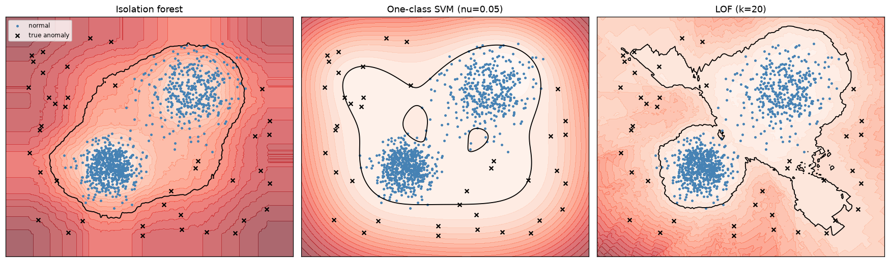
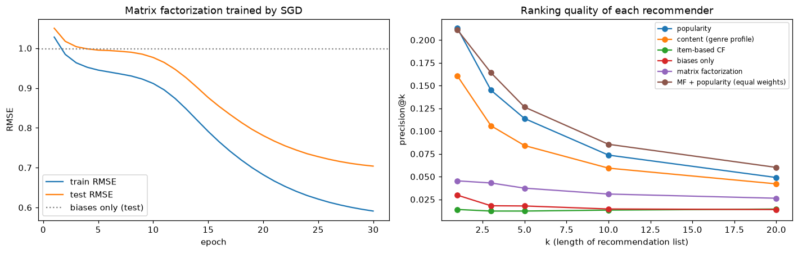

# Anomaly Detection and Recommender Systems

> **Level 4 · Chapter 8** · ⏱️ ~75 min read · Prerequisites: [Statistics](../01-math-foundations/05-statistics.md), [Decision trees](02-decision-trees.md), [Support vector machines](04-support-vector-machines.md), [Dimensionality reduction](06-dimensionality-reduction.md) (SVD), [Evaluation metrics](../03-ml-fundamentals/06-evaluation-metrics.md)

This chapter covers two of the most common applied problems that don't fit the plain "predict a label" mold. **Anomaly detection** finds the rare points that don't look like the rest: fraud, failing machines, intrusions, data errors. **Recommender systems** predict what each person will like from a sea of items. You'll build statistical outlier rules, an isolation forest from scratch, and one-class methods; then content-based and collaborative filtering recommenders, including matrix factorization trained from scratch with stochastic gradient descent, evaluated with the ranking metrics precision@k and recall@k.

## Why it matters

Sam's fraud team flagged card transactions with a rule: anything more than 3 standard deviations above the mean amount. It caught almost nothing. The few enormous corporate purchases in the data inflated both the mean and the standard deviation so much that the threshold sat at several thousand dollars, far above where fraud actually happened. The outliers had hidden the outliers. A rule built on the median and a robust spread, plus an isolation forest on a handful of behavioral features, found ten times as many confirmed fraud cases at the same review budget.

Across the office, Priya's team spent a quarter improving their movie recommender's rating-prediction error from 0.93 to 0.89 RMSE. Then they A/B tested it on the homepage, where users see 10 suggestions, and clicks didn't move. The model had gotten better at predicting ratings for movies people would never see, while the top of its list, the only part that mattered, barely changed. When they started measuring what the homepage actually showed, using precision and recall at 10, they found a simple popularity baseline was harder to beat than they'd thought.

Both stories have the same lesson: these problems look like ordinary prediction, but the right statistics, algorithms, and especially the right *evaluation* are different. This chapter teaches them.

## Concepts

### Part 1: Anomaly detection

#### What counts as an anomaly

An **anomaly** (or **outlier**) is an observation that differs markedly from the bulk of the data, enough to suggest it came from a different process. Three kinds are worth distinguishing:

- **Point anomalies**: a single unusual value or row, such as a USD 9,000 purchase on a card that usually spends USD 40.
- **Contextual anomalies**: normal in general, unusual in context. 30°C is normal in July and anomalous in January. Time series anomalies are usually contextual: compare a value with its forecast from [Time series forecasting](07-time-series.md).
- **Collective anomalies**: a group of points that's unusual together, like a burst of small transactions in a minute, even if each one is ordinary.

Anomaly detection is usually **unsupervised**: labels are rare, expensive, or nonexistent, and new kinds of anomalies keep appearing. When you do have plenty of labeled anomalies, treat the problem as supervised classification with heavy class imbalance, covered in [Imbalanced data](../05-applied-ml/03-imbalanced-data.md). Two settings are distinguished in scikit-learn's terminology:

- **Outlier detection**: the training data itself contains outliers, and you want to find them.
- **Novelty detection**: the training data is clean (for example, a machine's sensor data while known to be healthy), and you want to flag new points that differ from it.

Every method below produces an **anomaly score** for each point. Turning scores into alerts needs a threshold, which in practice is set by a budget ("the fraud team can review 200 cases a day") or by an assumed **contamination** rate (the expected fraction of anomalies).

#### Statistical rules: z-scores and their weakness

The simplest rule flags values far from the mean in units of standard deviation. The **z-score** of $x$ is

$$
z = \frac{x - \bar{x}}{s},
$$

with sample mean $\bar{x}$ and standard deviation $s$, and the rule flags $\lvert z \rvert > 3$. For normally distributed data, only 0.27% of points exceed that by chance.

Two problems. First, many real quantities aren't normal: amounts, durations, and counts are usually right-skewed, so a normal-based threshold flags too many large values (or, after a log transform, the rule may be reasonable). Second, and worse, **masking**: the mean and standard deviation are themselves pulled by the outliers you're trying to find. A few huge values inflate $s$, which shrinks every z-score, which hides the outliers. That's what happened to Sam.

The fix is **robust statistics**: estimates that outliers can't drag around. The **median** replaces the mean, and the **median absolute deviation** replaces the standard deviation:

$$
\text{MAD} = \operatorname{median}\left(\lvert x_i - \operatorname{median}(x)\rvert\right).
$$

For normal data, $\text{MAD} \approx 0.6745\,\sigma$, so the **modified z-score** (Iglewicz and Hoaglin) is

$$
M = \frac{0.6745\,(x - \operatorname{median}(x))}{\text{MAD}},
$$

and a common rule flags $\lvert M \rvert > 3.5$. Up to half the data can be contaminated before the median and MAD break down; a single extreme point can ruin the mean and standard deviation.

The **IQR rule** (Tukey's fences), which you met in box plots, is another robust option: with quartiles $Q_1$ and $Q_3$ and interquartile range $\text{IQR} = Q_3 - Q_1$, flag points below $Q_1 - 1.5\,\text{IQR}$ or above $Q_3 + 1.5\,\text{IQR}$ (use 3 instead of 1.5 for "far out" points). It makes no normality assumption and is easy to explain.

#### Multivariate outliers: the Mahalanobis distance

Checking each feature separately misses an important kind of anomaly: a point that's ordinary in every single feature but unusual in *combination*. A person 190 cm tall is normal; a person who weighs 50 kg is normal; a 190 cm person who weighs 50 kg is unusual. Height and weight are correlated, and this point breaks the correlation.

The **Mahalanobis distance** measures distance from the center in a way that accounts for correlation and scale:

$$
D_M(\mathbf{x}) = \sqrt{(\mathbf{x} - \boldsymbol{\mu})^\top\boldsymbol{\Sigma}^{-1}(\mathbf{x} - \boldsymbol{\mu})},
$$

where $\boldsymbol{\mu}$ is the mean vector and $\boldsymbol{\Sigma}$ the covariance matrix. It's the Euclidean distance after whitening the data (from [Dimensionality reduction](06-dimensionality-reduction.md)): directions with little variance count more. For $d$-dimensional normal data, $D_M^2$ follows a chi-squared distribution with $d$ degrees of freedom, which gives a principled threshold. And the masking problem returns, so estimate $\boldsymbol{\mu}$ and $\boldsymbol{\Sigma}$ robustly: the **minimum covariance determinant** estimator (scikit-learn's `MinCovDet`, used by `EllipticEnvelope`) fits them on the most tightly clustered subset of the data.

#### Isolation forests

Statistical rules assume a shape for "normal". An **isolation forest** (Liu, Ting, and Zhou, 2008) assumes almost nothing. Its insight: anomalies are *few* and *different*, so they're **easier to isolate**. If you repeatedly cut the data with random splits, an anomaly sitting alone far from the crowd gets separated from everything else after a few cuts, while a point deep inside a dense cluster takes many cuts to isolate.

An **isolation tree** is built on a random subsample of the data:

1. Pick a feature at random.
2. Pick a split value uniformly at random between that feature's minimum and maximum in the current node.
3. Send points left or right, and recurse until each point is alone, or a depth limit is reached.

No impurity, no labels: the splits are purely random. The **path length** $h(\mathbf{x})$ is the number of edges from the root to the leaf where $\mathbf{x}$ ends up. Average it over many trees to get $E[h(\mathbf{x})]$. Short average paths mean easy to isolate, so likely anomalous.

To turn path length into a score that's comparable across sample sizes, normalize by $c(m)$, the average path length of an unsuccessful search in a binary search tree built on $m$ points:

$$
c(m) = 2H(m - 1) - \frac{2(m - 1)}{m}, \qquad H(i) \approx \ln i + 0.5772,
$$

where $H(i)$ is the $i$-th harmonic number ($0.5772$ is the Euler-Mascheroni constant). The **anomaly score** is

$$
s(\mathbf{x}) = 2^{-E[h(\mathbf{x})]/c(m)}.
$$

If the average path is as long as a typical point's, $E[h] \approx c(m)$ and $s \approx 0.5$. If it's very short, $s$ approaches 1 (clearly anomalous). If it's long, $s$ falls toward 0. When a leaf still holds $k > 1$ points because of the depth limit, its path length is $\text{depth} + c(k)$, an estimate of the extra splits it would have needed.

Two design choices make it fast and effective. Each tree uses a small subsample (256 points by default), which reduces **swamping** (normal points near anomalies being mislabeled) and masking (clusters of anomalies hiding each other), and the depth limit is about $\log_2 256 = 8$, because only short paths matter. Training is linear in $n$, and it handles many features well. It's the default first choice for tabular anomaly detection.

#### One-class methods

**One-class SVM** (Schölkopf et al., 2001) adapts the [SVM](04-support-vector-machines.md) to unlabeled data. In the kernel feature space, it finds a hyperplane that separates the data from the origin with maximum margin, which in input space (with an RBF kernel) becomes a boundary enclosing the dense regions. The hyperparameter $\nu \in (0, 1]$ is an upper bound on the fraction of training points treated as outliers (and a lower bound on the fraction of support vectors), so it plays the role of the contamination rate. It's sensitive to $\gamma$ and to feature scaling, and it scales poorly beyond tens of thousands of points, so it's mainly used for novelty detection on clean, modest-sized training data.

**Local outlier factor (LOF)** compares each point's local density (estimated from its $k$ nearest neighbors) with the densities of its neighbors. A point in a sparse spot next to a dense cluster gets a high LOF even if a global method would call it typical, which makes LOF good for data with clusters of different densities. It's distance-based, so the [curse of dimensionality](01-knn-and-naive-bayes.md) and scaling apply.

#### Evaluating anomaly detectors

If you have even a small set of labeled anomalies, evaluate like an imbalanced classifier: **precision-recall curves** and average precision rather than accuracy (99.9% accuracy is trivial when 0.1% are anomalies), and **precision at the review budget** ("of the 200 alerts a day, how many are real?"). Without labels, have experts review a sample of the top-scored points, and monitor how alert volumes change over time.

### Part 2: Recommender systems

#### The problem

A recommender system predicts which **items** (movies, products, songs, articles) each **user** will like, and shows them the best few. The data is a **user-item interaction matrix** $\mathbf{R}$ with one row per user and one column per item. It comes in two flavors:

- **Explicit feedback**: ratings, like 1 to 5 stars. Clear meaning, but scarce.
- **Implicit feedback**: clicks, views, purchases, listening time. Abundant, but a missing entry might mean "didn't like" or "never saw it", and there are no negative examples.

Three properties make the problem hard. The matrix is extremely **sparse**: a typical user has interacted with well under 1% of the items. Popularity follows a **long tail**: a few items get most interactions. And **cold start**: new users and new items have no history at all.

There are two big families of methods, often combined in **hybrid** systems: content-based filtering and collaborative filtering.

#### Content-based filtering

**Content-based filtering** recommends items similar to what the user liked before, using item features: genres, text descriptions (as TF-IDF vectors from [Feature engineering](../02-data-science-workflow/04-feature-engineering.md)), price range, brand. Build a **user profile** as a weighted average of the feature vectors of items the user has interacted with (weighted by rating, or by rating minus the user's mean, so disliked items count negatively), then score each candidate item by its similarity to the profile, usually cosine similarity.

Content-based methods handle **new items** well (an item's features exist from day one) and give natural explanations ("because you watched other documentaries"). Their weaknesses: they only recommend more of the same (low serendipity), they need good item features, and they still can't help a brand-new user.

#### Collaborative filtering

**Collaborative filtering (CF)** ignores item content and uses only the pattern of interactions: users who agreed in the past tend to agree in the future. "People who liked what you liked also liked this."

**User-based CF** predicts user $u$'s rating of item $i$ from similar users who rated $i$. With $\bar{r}_u$ the mean rating of user $u$ and $\operatorname{sim}(u, v)$ a similarity between users (cosine or Pearson correlation on their co-rated items):

$$
\hat{r}_{ui} = \bar{r}_u + \frac{\sum_{v \in N(u, i)}\operatorname{sim}(u, v)\,(r_{vi} - \bar{r}_v)}{\sum_{v \in N(u, i)}\lvert\operatorname{sim}(u, v)\rvert},
$$

where $N(u, i)$ is the set of the $k$ users most similar to $u$ who rated $i$. Subtracting each user's mean handles the fact that some people rate everything high and others low.

**Item-based CF** flips it: predict $r_{ui}$ from the user's own ratings of items similar to $i$, where item similarity is computed from the columns of $\mathbf{R}$ (two items are similar if the same users rate them similarly). Item-based CF, popularized by Amazon, is usually more stable than user-based, because item-item similarities change slowly and items typically have more ratings than users do. These neighborhood methods are simple and explainable, but they struggle with sparsity: two users with no co-rated items have no measurable similarity.

#### Matrix factorization

**Matrix factorization** (MF) became the dominant CF method after the Netflix Prize (2006 to 2009). The idea: each user and each item is described by a short vector of $k$ hidden **latent factors**. For movies, the factors might align with dimensions like "serious vs light" or "action-heavy", though they're learned, not specified, and rarely that clean. A user's predicted affinity for an item is the dot product of their vectors. In matrix form, the full rating matrix is approximated by a product of two thin matrices:

$$
\mathbf{R} \approx \mathbf{P}\mathbf{Q}^\top, \qquad \mathbf{P} \in \mathbb{R}^{n_u \times k}, \;\; \mathbf{Q} \in \mathbb{R}^{n_i \times k},
$$

with $n_u$ users and $n_i$ items. This is a low-rank approximation, like the truncated SVD from [Dimensionality reduction](06-dimensionality-reduction.md), with one crucial difference: most entries of $\mathbf{R}$ are *missing*, not zero, so you can't just compute an SVD. Instead, fit $\mathbf{P}$ and $\mathbf{Q}$ to the observed entries only.

A strong practical model adds **biases** (Koren, Bell, and Volinsky, 2009): a global mean $\mu$, a user bias $b_u$ (this user rates high or low), and an item bias $b_i$ (this item is generally liked or disliked):

$$
\hat{r}_{ui} = \mu + b_u + b_i + \mathbf{p}_u^\top\mathbf{q}_i.
$$

Fit it by minimizing the regularized squared error over the set $\mathcal{K}$ of observed (user, item) pairs:

$$
\mathcal{L} = \sum_{(u, i) \in \mathcal{K}}\left(r_{ui} - \hat{r}_{ui}\right)^2 + \lambda\left(\lVert\mathbf{p}_u\rVert^2 + \lVert\mathbf{q}_i\rVert^2 + b_u^2 + b_i^2\right).
$$

The L2 penalty is essential: with many parameters and few ratings per user, an unregularized model would memorize the training ratings.

**Training with SGD.** Loop over observed ratings in random order. For one rating, the prediction error is $e_{ui} = r_{ui} - \hat{r}_{ui}$, and the gradients of that rating's term (with its share of the penalty) give the updates, with learning rate $\eta$:

$$
\begin{aligned}
b_u &\leftarrow b_u + \eta\,(e_{ui} - \lambda b_u), \qquad b_i \leftarrow b_i + \eta\,(e_{ui} - \lambda b_i), \\
\mathbf{p}_u &\leftarrow \mathbf{p}_u + \eta\,(e_{ui}\,\mathbf{q}_i - \lambda\,\mathbf{p}_u), \qquad \mathbf{q}_i \leftarrow \mathbf{q}_i + \eta\,(e_{ui}\,\mathbf{p}_u - \lambda\,\mathbf{q}_i).
\end{aligned}
$$

(The factor of 2 from differentiating the square is absorbed into $\eta$ and $\lambda$.) Each update nudges the user's vector toward the item's vector when the prediction was too low, and away from it when too high. Use the *old* $\mathbf{p}_u$ when updating $\mathbf{q}_i$.

**Training with ALS.** The loss isn't convex in $\mathbf{P}$ and $\mathbf{Q}$ jointly, but it's convex (a ridge regression) in each one with the other fixed. **Alternating least squares** exploits that. Fix $\mathbf{Q}$; then each user's vector has a closed form. If $\mathbf{Q}_u$ holds the factor vectors of the items user $u$ rated and $\mathbf{r}_u$ their ratings (after subtracting biases), the ridge solution is

$$
\mathbf{p}_u = \left(\mathbf{Q}_u^\top\mathbf{Q}_u + \lambda\mathbf{I}\right)^{-1}\mathbf{Q}_u^\top\mathbf{r}_u.
$$

Then fix $\mathbf{P}$ and solve for every $\mathbf{q}_i$ the same way, and alternate. Each step can only decrease the loss, it's the same coordinate descent idea as k-means in [Clustering](05-clustering.md), and the per-user (or per-item) solves are independent, so ALS parallelizes beautifully. That's why Spark's recommender uses it. A variant of ALS for implicit feedback (Hu, Koren, and Volinsky, 2008) treats every unobserved entry as a weak negative with low confidence.

Once trained, the vectors are useful beyond ratings: items with similar $\mathbf{q}_i$ are similar items, which powers "more like this".

#### Evaluating recommenders

How you evaluate determines what you build.

- **Rating accuracy**: RMSE or MAE on held-out ratings. Easy to compute, but it treats an error on an obscure item the user would never see the same as an error at the top of their list.
- **Ranking quality**: what users actually experience is a short list. For each test user, produce the top $k$ recommendations from items they haven't interacted with in training, and compare with the **relevant** items in their held-out data (for ratings, say, those rated 4 or higher):

$$
\text{precision@}k = \frac{\lvert\text{top-}k \cap \text{relevant}\rvert}{k}, \qquad \text{recall@}k = \frac{\lvert\text{top-}k \cap \text{relevant}\rvert}{\lvert\text{relevant}\rvert}.
$$

Average over users. Precision@k asks "how much of the list is good?"; recall@k asks "how much of the good stuff made the list?". Order-aware metrics like **MAP** (mean average precision) and **NDCG** (normalized discounted cumulative gain) also reward putting the best items first.

Pitfalls to know:

- **Offline relevance is incomplete.** An item the user never rated is counted as "not relevant", even though they might love it. Offline precision is a pessimistic, biased estimate; it's for comparing models, and an online A/B test is the final judge.
- **Exclude training items** from the candidate list, or you'll "recommend" what the user already rated.
- **Split realistically.** Randomly holding out ratings lets the model use a user's future to predict their past. Holding out each user's most recent interactions is more honest.
- **Always include a popularity baseline.** Recommending the most popular items is surprisingly strong offline, partly because popular items are more likely to be in anyone's test set.
- **Beyond accuracy**: **coverage** (what fraction of the catalog ever gets recommended), **diversity**, **novelty**, and fairness to item providers matter for a healthy product.

## In practice

### Robust statistics vs the z-score

Synthetic card transactions: 5,000 normal purchases (log-normally distributed amounts), 30 enormous but legitimate corporate purchases, and 40 frauds that are large for this population but much smaller than the corporate ones. Which rules find the frauds?

```python
import numpy as np
import matplotlib.pyplot as plt
from sklearn.metrics import roc_auc_score, average_precision_score

rng = np.random.default_rng(0)
normal = rng.lognormal(np.log(40), 0.6, 5000)
corporate = rng.uniform(20000, 60000, 30)
fraud = rng.uniform(400, 1500, 40)
amount = np.concatenate([normal, corporate, fraud])
is_fraud = np.r_[np.zeros(5030), np.ones(40)].astype(bool)

def report(name, flags):
    tp = (flags & is_fraud).sum()
    print(f"{name:<28} flagged {flags.sum():>4}, frauds caught {tp:>2}/40, corporate flagged {flags[5000:5030].sum():>2}")

z = (amount - amount.mean()) / amount.std()
report("z-score > 3", np.abs(z) > 3)
print(f"   (mean {amount.mean():.0f} USD, std {amount.std():.0f} USD: the threshold is {amount.mean() + 3 * amount.std():.0f} USD)")
med = np.median(amount)
mad = np.median(np.abs(amount - med))
m_score = 0.6745 * (amount - med) / mad
report("modified z on amount > 3.5", np.abs(m_score) > 3.5)
log_amt = np.log(amount)
m_log = 0.6745 * (log_amt - np.median(log_amt)) / np.median(np.abs(log_amt - np.median(log_amt)))
report("modified z on log amount", np.abs(m_log) > 3.5)
q1, q3 = np.percentile(log_amt, [25, 75])
report("IQR fences on log amount", (log_amt < q1 - 1.5 * (q3 - q1)) | (log_amt > q3 + 1.5 * (q3 - q1)))
```

```text
z-score > 3                  flagged   30, frauds caught  0/40, corporate flagged 30
   (mean 281 USD, std 3042 USD: the threshold is 9407 USD)
modified z on amount > 3.5   flagged  240, frauds caught 40/40, corporate flagged 30
modified z on log amount     flagged   72, frauds caught 40/40, corporate flagged 30
IQR fences on log amount     flagged   93, frauds caught 40/40, corporate flagged 30
```

The plain z-score is masked: the corporate purchases inflate the standard deviation so much that the threshold lands far above every fraud. The robust rules catch the frauds. On raw amounts, the modified z-score flags many ordinary large purchases too, because the distribution is skewed; on the log scale, where the bulk of the data is roughly normal, it's much more precise. Note that every rule flags the 30 corporate purchases, which really are outliers. An outlier isn't necessarily a problem: deciding which outliers matter is a business question, which is why detection usually feeds a human review queue.

### Correlation-breaking anomalies and the Mahalanobis distance

Two strongly correlated features, plus a few points that break the correlation without being extreme in either feature:

```python
from scipy.stats import chi2
from sklearn.covariance import MinCovDet

cov = np.array([[1.0, 0.9], [0.9, 1.0]])
X_norm = rng.multivariate_normal([0, 0], cov, 1000)
X_odd = np.array([[1.5, -1.5], [-1.4, 1.2], [2.0, -0.8], [-1.0, 1.6], [1.2, -1.3]])   # break the correlation
X2 = np.vstack([X_norm, X_odd]); odd = np.r_[np.zeros(1000), np.ones(5)].astype(bool)

per_feature = (np.abs((X2 - X2.mean(0)) / X2.std(0)) > 3).any(axis=1)
mcd = MinCovDet(random_state=0).fit(X2)
d2 = mcd.mahalanobis(X2)                                   # squared robust Mahalanobis distances
threshold = chi2.ppf(0.999, df=2)
flag_m = d2 > threshold
print(f"per-feature |z| > 3: flagged {per_feature.sum()}, odd points caught {(per_feature & odd).sum()}/5")
print(f"Mahalanobis (chi2 99.9%, threshold {threshold:.1f}): flagged {flag_m.sum()}, odd points caught {(flag_m & odd).sum()}/5")
print("squared distances of the odd points:", d2[odd].round(1))
```

```text
per-feature |z| > 3: flagged 3, odd points caught 0/5
Mahalanobis (chi2 99.9%, threshold 13.8): flagged 6, odd points caught 5/5
squared distances of the odd points: [46.7 34.5 40.6 34.9 32.6]
```

Every odd point is within about 2 standard deviations on each feature, so per-feature rules can't see them. The Mahalanobis distance, which knows the features should move together, puts them far out in the tail.

### An isolation forest from scratch

The implementation grows each isolation tree recursively on a subsample, then computes path lengths for all points at once by partitioning index arrays down the tree.

```python
from sklearn.ensemble import IsolationForest
from sklearn.svm import OneClassSVM
from sklearn.neighbors import LocalOutlierFactor
from sklearn.preprocessing import StandardScaler

EULER = 0.5772156649

def c(m):
    """Average path length of an unsuccessful BST search on m points."""
    m = np.asarray(m, float)
    out = np.where(m > 2, 2 * (np.log(np.maximum(m - 1, 1)) + EULER) - 2 * (m - 1) / np.maximum(m, 1), 0.0)
    return np.where(m == 2, 1.0, out)

def build_tree(X, depth, max_depth, rng):
    if depth >= max_depth or len(X) <= 1:
        return {"size": len(X)}
    spread = X.max(axis=0) - X.min(axis=0)
    candidates = np.flatnonzero(spread > 0)
    if len(candidates) == 0:
        return {"size": len(X)}
    j = rng.choice(candidates)                                     # random feature
    split = rng.uniform(X[:, j].min(), X[:, j].max())              # random split value
    left = X[:, j] < split
    return {"feature": j, "split": split,
            "left": build_tree(X[left], depth + 1, max_depth, rng),
            "right": build_tree(X[~left], depth + 1, max_depth, rng)}

def path_lengths(tree, X, idx, depth, out):
    if "size" in tree:
        out[idx] = depth + c(tree["size"])                         # unfinished subtree estimate
        return
    go_left = X[idx, tree["feature"]] < tree["split"]
    path_lengths(tree["left"], X, idx[go_left], depth + 1, out)
    path_lengths(tree["right"], X, idx[~go_left], depth + 1, out)

def isolation_forest_scores(X, n_trees=100, sample_size=256, seed=0):
    rng = np.random.default_rng(seed)
    m = min(sample_size, len(X))
    max_depth = int(np.ceil(np.log2(m)))
    total = np.zeros(len(X))
    for _ in range(n_trees):
        sub = X[rng.choice(len(X), m, replace=False)]
        tree = build_tree(sub, 0, max_depth, rng)
        h = np.empty(len(X))
        path_lengths(tree, X, np.arange(len(X)), 0, h)
        total += h
    return 2 ** (-(total / n_trees) / c(m))                        # s(x) in (0, 1)

# Two clusters of normal behavior plus scattered anomalies
X_in = np.vstack([rng.normal([0, 0], 0.5, (600, 2)), rng.normal([3, 3], 0.8, (400, 2))])
X_out = rng.uniform(-3, 6, (60, 2))
X_out = X_out[np.min(np.linalg.norm(X_out[:, None] - X_in[None], axis=2), axis=1) > 0.6][:40]
Xa = np.vstack([X_in, X_out]); ya = np.r_[np.zeros(len(X_in)), np.ones(len(X_out))]

ours = isolation_forest_scores(Xa)
sk_if = IsolationForest(n_estimators=100, random_state=0).fit(Xa)
sk_scores = -sk_if.score_samples(Xa)                               # sklearn returns -s(x)
print(f"anomalies: {len(X_out)} of {len(Xa)}")
print(f"from scratch: ROC AUC {roc_auc_score(ya, ours):.3f}, average precision {average_precision_score(ya, ours):.3f}")
print(f"scikit-learn: ROC AUC {roc_auc_score(ya, sk_scores):.3f}, average precision {average_precision_score(ya, sk_scores):.3f}")
print("correlation between the two score vectors:", np.corrcoef(ours, sk_scores)[0, 1].round(3))
print("mean score, normal points vs anomalies:", ours[ya == 0].mean().round(3), ours[ya == 1].mean().round(3))
```

```text
anomalies: 40 of 1040
from scratch: ROC AUC 0.995, average precision 0.908
scikit-learn: ROC AUC 0.997, average precision 0.946
correlation between the two score vectors: 0.987
mean score, normal points vs anomalies: 0.446 0.661
```

Both versions rank the anomalies near the top, and their scores agree closely (they differ only by randomness in the trees). Normal points score around 0.4 to 0.5, and the anomalies well above.

### Comparing detectors

Isolation forest, one-class SVM, and LOF on the same data, with the decision regions each one learns:

```python
Xs = StandardScaler().fit_transform(Xa)
detectors = {
    "Isolation forest": IsolationForest(n_estimators=200, contamination=0.04, random_state=0),
    "One-class SVM (nu=0.05)": OneClassSVM(kernel="rbf", gamma=0.5, nu=0.05),
    "LOF (k=20)": LocalOutlierFactor(n_neighbors=20, contamination=0.04, novelty=True),
}
xx, yy = np.meshgrid(np.linspace(Xs[:, 0].min() - 0.5, Xs[:, 0].max() + 0.5, 200),
                     np.linspace(Xs[:, 1].min() - 0.5, Xs[:, 1].max() + 0.5, 200))
fig, axes = plt.subplots(1, 3, figsize=(16, 4.8))
for ax, (name, det) in zip(axes, detectors.items()):
    det.fit(Xs)
    score = -det.decision_function(Xs)                             # higher = more anomalous
    flags = det.predict(Xs) == -1
    print(f"{name:<24} ROC AUC {roc_auc_score(ya, score):.3f}   flagged {flags.sum():>3}, "
          f"true anomalies among them {int((flags & (ya == 1)).sum())}")
    Z = -det.decision_function(np.c_[xx.ravel(), yy.ravel()]).reshape(xx.shape)
    ax.contourf(xx, yy, Z, levels=20, cmap="Reds", alpha=0.6)
    ax.contour(xx, yy, Z, levels=[0], colors="k", linewidths=1.2)
    ax.scatter(Xs[ya == 0, 0], Xs[ya == 0, 1], s=5, c="steelblue", label="normal")
    ax.scatter(Xs[ya == 1, 0], Xs[ya == 1, 1], s=25, c="k", marker="x", label="true anomaly")
    ax.set_title(name); ax.set_xticks([]); ax.set_yticks([])
axes[0].legend(loc="upper left", fontsize=8)
plt.tight_layout()
plt.show()
```

```text
Isolation forest         ROC AUC 0.997   flagged  42, true anomalies among them 36
One-class SVM (nu=0.05)  ROC AUC 0.940   flagged  52, true anomalies among them 31
LOF (k=20)               ROC AUC 0.998   flagged  38, true anomalies among them 33
```



*Darker red means more anomalous; the black contour is each detector's decision threshold. The isolation forest's regions are built from axis-aligned cuts, the one-class SVM draws a smooth kernel boundary, and LOF adapts to each cluster's own density.*

On this easy, low-dimensional data all three work, the one-class SVM a little less well with these settings. In practice, the isolation forest is the robust default for tabular data (fast, few sensitive parameters, no scaling needed); LOF helps when clusters have different densities; the one-class SVM suits novelty detection on smaller, clean training sets.

!!! warning "Common mistake: setting contamination and believing it"
    `contamination=0.04` doesn't discover that 4% of the data is anomalous; it *forces* the detector to flag 4%. If the real rate is 0.1%, you'll drown reviewers in false alarms; if it's 10%, you'll miss most anomalies. Rank by score, pick the threshold from your review capacity, and measure precision on what reviewers confirm.

### A synthetic ratings matrix

Now recommendations. The generator below creates 600 users and 400 items. Each item has one of 5 genres, and its true latent factors depend on its genre (so content features carry real signal). Ratings come from biases plus a dot product of true latent factors, plus noise, rounded to 1 to 5 stars. Popular items get rated more often, as in real data.

```python
n_users, n_items, k_true = 600, 400, 4
rng = np.random.default_rng(0)
genres = rng.integers(0, 5, n_items)
G = np.eye(5)[genres]                                              # one-hot item genres
Q_true = G @ rng.normal(0, 1, (5, k_true)) + rng.normal(0, 0.4, (n_items, k_true))
P_true = rng.normal(0, 0.5, (n_users, k_true))
bu_true, bi_true = rng.normal(0, 0.4, n_users), rng.normal(0, 0.5, n_items)
popularity = np.exp(rng.normal(0, 1, n_items)); popularity /= popularity.sum()

rows = []
for u in range(n_users):
    m = 10 + rng.poisson(30)
    items = rng.choice(n_items, m, replace=False, p=popularity)     # popular items rated more
    r = 3.4 + bu_true[u] + bi_true[items] + Q_true[items] @ P_true[u] + rng.normal(0, 0.5, m)
    rows += [(u, i, v) for i, v in zip(items, np.clip(np.round(r), 1, 5))]
ratings = np.array(rows)

# Hold out 20% of each user's ratings for testing
test = np.zeros(len(ratings), bool)
for u in range(n_users):
    idx = np.flatnonzero(ratings[:, 0] == u)
    test[rng.choice(idx, int(0.2 * len(idx)), replace=False)] = True
u_tr, i_tr, r_tr = ratings[~test, 0].astype(int), ratings[~test, 1].astype(int), ratings[~test, 2]
u_te, i_te, r_te = ratings[test, 0].astype(int), ratings[test, 1].astype(int), ratings[test, 2]
print(f"{len(ratings)} ratings, density {len(ratings) / (n_users * n_items):.1%}, "
      f"train {len(r_tr)}, test {len(r_te)}")
print("rating distribution 1..5:", np.bincount(ratings[:, 2].astype(int), minlength=6)[1:])
rmse = lambda pred, true: np.sqrt(np.mean((pred - true) ** 2))
mu = r_tr.mean()
print(f"global-mean baseline test RMSE: {rmse(mu, r_te):.3f}")
```

```text
24229 ratings, density 10.1%, train 19629, test 4600
rating distribution 1..5: [1622 4240 7385 6574 4408]
global-mean baseline test RMSE: 1.161
```

### Matrix factorization with SGD, from scratch

The class implements exactly the biased model and the SGD updates derived above. Setting `k=0` gives the biases-only model, a strong baseline.

```python
class MatrixFactorization:
    def __init__(self, k=5, lr=0.01, reg=0.05, epochs=30, seed=0):
        self.k, self.lr, self.reg, self.epochs, self.seed = k, lr, reg, epochs, seed

    def predict(self, u, i):
        return self.mu + self.bu[u] + self.bi[i] + np.sum(self.P[u] * self.Q[i], axis=-1)

    def fit(self, u, i, r, u_val=None, i_val=None, r_val=None):
        rng = np.random.default_rng(self.seed)
        self.mu = r.mean()
        self.P = rng.normal(0, 0.1, (n_users, self.k)); self.Q = rng.normal(0, 0.1, (n_items, self.k))
        self.bu, self.bi = np.zeros(n_users), np.zeros(n_items)
        self.history = []
        lr, reg = self.lr, self.reg
        for epoch in range(self.epochs):
            for t in rng.permutation(len(r)):
                uu, ii = u[t], i[t]
                e = r[t] - (self.mu + self.bu[uu] + self.bi[ii] + self.P[uu] @ self.Q[ii])
                self.bu[uu] += lr * (e - reg * self.bu[uu])
                self.bi[ii] += lr * (e - reg * self.bi[ii])
                p_old = self.P[uu].copy()
                self.P[uu] += lr * (e * self.Q[ii] - reg * self.P[uu])
                self.Q[ii] += lr * (e * p_old - reg * self.Q[ii])
            if r_val is not None:
                self.history.append((rmse(self.predict(u, i), r), rmse(self.predict(u_val, i_val), r_val)))
        return self

biases = MatrixFactorization(k=0).fit(u_tr, i_tr, r_tr)
mf = MatrixFactorization(k=5).fit(u_tr, i_tr, r_tr, u_te, i_te, r_te)
print(f"biases only (k=0): test RMSE {rmse(biases.predict(u_te, i_te), r_te):.3f}")
print(f"MF (k=5):          test RMSE {rmse(mf.predict(u_te, i_te), r_te):.3f}")
for e in (1, 5, 10, 30):
    print(f"  epoch {e:>2}: train RMSE {mf.history[e - 1][0]:.3f}, test RMSE {mf.history[e - 1][1]:.3f}")
```

```text
biases only (k=0): test RMSE 0.998
MF (k=5):          test RMSE 0.704
  epoch  1: train RMSE 1.028, test RMSE 1.050
  epoch  5: train RMSE 0.945, test RMSE 0.995
  epoch 10: train RMSE 0.911, test RMSE 0.977
  epoch 30: train RMSE 0.591, test RMSE 0.704
```

The global mean is far off, user and item biases remove a large part of the error, and the latent factors remove a good deal more. (The noise in the generator has standard deviation 0.5 before rounding, which puts a floor under the achievable RMSE.)

### Item-based CF and content-based scores

Both are written as matrix operations over a users × items matrix. Item-based CF centers each item's ratings, computes cosine similarities between item columns, keeps each item's 30 nearest neighbors, and predicts from the user's own centered ratings. The content-based model builds a genre profile per user from their mean-centered ratings.

```python
R = np.zeros((n_users, n_items)); M = np.zeros((n_users, n_items), bool)
R[u_tr, i_tr] = r_tr; M[u_tr, i_tr] = True
item_mean = np.where(M.sum(0) > 0, R.sum(0) / np.maximum(M.sum(0), 1), mu)
Rc = np.where(M, R - item_mean, 0.0)                               # centered, 0 where missing

norms = np.linalg.norm(Rc, axis=0) + 1e-9
S = (Rc.T @ Rc) / np.outer(norms, norms)                           # item-item cosine similarity
np.fill_diagonal(S, 0)
kth = np.sort(np.abs(S), axis=0)[-30]                              # keep top-30 neighbors per item
S_k = np.where(np.abs(S) >= kth, S, 0.0)
num, den = Rc @ S_k, M.astype(float) @ np.abs(S_k)
item_cf_pred = item_mean + np.where(den > 0, num / np.maximum(den, 1e-9), 0.0)
print(f"item-based CF: test RMSE {rmse(np.clip(item_cf_pred[u_te, i_te], 1, 5), r_te):.3f}")

user_mean = R.sum(1) / M.sum(1)
profile = np.where(M, R - user_mean[:, None], 0.0) @ G / np.maximum(M.astype(float) @ G, 1)   # liking per genre
content_score = profile @ G.T                                       # (users, items)
print("example user profile (mean-centered liking per genre):", profile[0].round(2))
```

```text
item-based CF: test RMSE 0.839
example user profile (mean-centered liking per genre): [-0.51  0.44 -0.78  0.78  0.4 ]
```

### Ranking evaluation: precision@k and recall@k

RMSE says how well each model predicts ratings. Now measure what users would see: the top-$k$ list from all items they haven't rated in training, with "relevant" meaning a held-out rating of 4 or 5. The popularity baseline ranks items by how many training ratings they have. The last model blends standardized matrix factorization scores with standardized log popularity, with equal weights and no tuning.

```python
relevant = {u: set() for u in range(n_users)}
for u, i, r in zip(u_te, i_te, r_te):
    if r >= 4:
        relevant[u].add(i)
eval_users = [u for u in range(n_users) if relevant[u]]

def precision_recall_at_k(scores, k):
    s = np.where(M, -np.inf, scores)                               # never recommend training items
    top = np.argpartition(-s, k, axis=1)[:, :k]
    prec, rec = [], []
    for u in eval_users:
        hits = len(relevant[u].intersection(top[u]))
        prec.append(hits / k); rec.append(hits / len(relevant[u]))
    return np.mean(prec), np.mean(rec)

all_u = np.repeat(np.arange(n_users), n_items); all_i = np.tile(np.arange(n_items), n_users)
model_scores = {
    "popularity": np.tile(M.sum(axis=0).astype(float), (n_users, 1)),
    "content (genre profile)": content_score + 1e-6 * M.sum(axis=0),      # tiny popularity tie-break
    "item-based CF": item_cf_pred,
    "biases only": biases.predict(all_u, all_i).reshape(n_users, n_items),
    "matrix factorization": mf.predict(all_u, all_i).reshape(n_users, n_items),
}
z = lambda a: (a - a.mean()) / a.std()                             # standardize a score matrix
log_pop = np.log1p(M.sum(axis=0))
model_scores["MF + popularity (equal weights)"] = z(model_scores["matrix factorization"]) + z(np.tile(log_pop, (n_users, 1)))
ks = [1, 3, 5, 10, 20]
curves = {}
print(f"{len(eval_users)} users with at least one relevant held-out item")
print(f"{'model':<34}{'P@5':>7}{'R@5':>7}{'P@10':>7}{'R@10':>7}")
for name, sc in model_scores.items():
    curves[name] = [precision_recall_at_k(sc, k) for k in ks]
    (p5, r5), (p10, r10) = curves[name][2], curves[name][3]
    print(f"{name:<34}{p5:7.3f}{r5:7.3f}{p10:7.3f}{r10:7.3f}")
```

```text
573 users with at least one relevant held-out item
model                                 P@5    R@5   P@10   R@10
popularity                          0.114  0.175  0.074  0.216
content (genre profile)             0.084  0.131  0.059  0.180
item-based CF                       0.012  0.015  0.013  0.037
biases only                         0.018  0.027  0.014  0.043
matrix factorization                0.037  0.060  0.031  0.096
MF + popularity (equal weights)     0.126  0.193  0.086  0.258
```

```python
fig, axes = plt.subplots(1, 2, figsize=(13, 4.2))
hist = np.array(mf.history)
axes[0].plot(range(1, len(hist) + 1), hist[:, 0], label="train RMSE")
axes[0].plot(range(1, len(hist) + 1), hist[:, 1], label="test RMSE")
axes[0].axhline(rmse(biases.predict(u_te, i_te), r_te), color="gray", ls=":", label="biases only (test)")
axes[0].set_xlabel("epoch"); axes[0].set_ylabel("RMSE"); axes[0].legend()
axes[0].set_title("Matrix factorization trained by SGD")
for name, vals in curves.items():
    axes[1].plot(ks, [p for p, _ in vals], "o-", label=name)
axes[1].set_xlabel("k (length of recommendation list)"); axes[1].set_ylabel("precision@k")
axes[1].set_title("Ranking quality of each recommender"); axes[1].legend(fontsize=8)
plt.tight_layout()
plt.show()
```



*Left: train and test RMSE by epoch; the gap between them is the overfitting that regularization holds in check. Right: precision@k for each model. The ranking of models by precision is not the same as their ranking by RMSE.*

The result is humbling, and it's exactly what Priya's team ran into. Popularity, which knows nothing about individual taste, beats every personalized model on the full-catalog list, and the model with the best RMSE (matrix factorization) does poorly on its own. Why? A relevant item has to be both *rated* by the user (in the held-out data) and *liked*. Which items people rate is driven heavily by popularity, because in this data (as in real life) people mostly encounter popular items. Matrix factorization models only the "liked" part: it happily ranks obscure items with high predicted ratings at the top, and the user never rated those, so they count as misses. Item-based CF and the biases-only model have the same problem, made worse by noisy estimates for rarely rated items.

The blend shows the fix: combine a model of taste with a model of exposure. Adding standardized log popularity to the MF score, without any tuning, beats popularity alone on every metric in the table. In practice you'd tune the weight on a validation split, or train directly on a ranking objective.

To see the taste part on its own, change the question: among the items each user *did* rate in the held-out data, does the model put the ones they liked first? This removes exposure from the evaluation.

```python
from collections import defaultdict

held_out = defaultdict(list)
for u, i, r in zip(u_te, i_te, r_te):
    held_out[u].append((i, r))

def precision_among_rated(scores, k=3):
    precisions = []
    for u, items in held_out.items():
        if len(items) >= k and relevant[u]:
            top = sorted(items, key=lambda t: -scores[u, t[0]])[:k]
            precisions.append(np.mean([r >= 4 for _, r in top]))
    return np.mean(precisions)

print(f"share of held-out ratings that are relevant (random ranking): {np.mean(r_te >= 4):.3f}")
for name, sc in model_scores.items():
    print(f"{name:<34} precision@3 among the user's held-out items: {precision_among_rated(sc):.3f}")
```

```text
share of held-out ratings that are relevant (random ranking): 0.446
popularity                         precision@3 among the user's held-out items: 0.468
content (genre profile)            precision@3 among the user's held-out items: 0.666
item-based CF                      precision@3 among the user's held-out items: 0.732
biases only                        precision@3 among the user's held-out items: 0.626
matrix factorization               precision@3 among the user's held-out items: 0.774
MF + popularity (equal weights)    precision@3 among the user's held-out items: 0.671
```

Now the picture flips. Popularity is barely better than random at telling which rated items a user liked, and matrix factorization is the best at it, followed by item-based CF. The equal-weight blend gives up some of that taste precision in exchange for its much better full-catalog lists; tuning the weight is how you balance the two. Each evaluation answers a different question, and a production recommender needs to do well at both: show items the user will engage with, and among those, the ones they'll like. Choose the evaluation that matches how the list will be used, and confirm with an online test.

!!! warning "Common mistake: evaluating recommendations on the training interactions"
    If the candidate list includes items the user already rated in training, the model "recommends" them and gets credit when they appear in the held-out data, or wastes slots on them. Mask training items, as `precision_recall_at_k` does, and split by time when you can, so you're predicting a user's next interactions from their past ones.

## Exercises

### Exercise 1: Robust statistics by hand (easy)

For the values $(10, 12, 11, 13, 12, 95)$: compute the mean, standard deviation (population formula), and the z-score of 95. Then the median, MAD, and modified z-score of 95. Which rule flags it at the usual thresholds?

??? success "Solution"

    Mean: $153/6 = 25.5$. Deviations: $-15.5, -13.5, -14.5, -12.5, -13.5, 69.5$; squared sum $= 240.25 + 182.25 + 210.25 + 156.25 + 182.25 + 4830.25 = 5801.5$; std $= \sqrt{5801.5/6} \approx 31.1$. $z = 69.5/31.1 \approx 2.24$: **not** flagged at 3. The outlier inflated the standard deviation enough to hide itself.

    Median: sorted $(10, 11, 12, 12, 13, 95)$, median $= 12$. Absolute deviations: $(2, 0, 1, 1, 0, 83)$, sorted $(0, 0, 1, 1, 2, 83)$, MAD $= 1$. Modified z $= 0.6745 \times 83/1 \approx 56$: flagged by a huge margin.

    ```python
    v = np.array([10, 12, 11, 13, 12, 95.0])
    print(round((95 - v.mean()) / v.std(), 2), 0.6745 * (95 - np.median(v)) / np.median(np.abs(v - np.median(v))))
    ```

    ```text
    2.24 55.9835
    ```

### Exercise 2: Precision and recall at k by hand (easy)

A user's relevant held-out items are {A, C, F, H}. Model 1 recommends [A, B, C, D, E]; model 2 recommends [F, A, G, H, C]. Compute precision@3, precision@5, and recall@5 for both.

??? success "Solution"

    Model 1: top 3 = A, B, C → 2 hits → P@3 = 2/3. Top 5 → A, C → P@5 = 2/5 = 0.4, R@5 = 2/4 = 0.5.

    Model 2: top 3 = F, A, G → 2 hits → P@3 = 2/3. Top 5 → F, A, H, C → P@5 = 4/5 = 0.8, R@5 = 4/4 = 1.0.

    Same precision@3, but model 2 is much better by k = 5. Report metrics at the list length users actually see.

### Exercise 3: Isolation path length intuition (medium)

(a) Compute $c(m)$ for $m = 2, 10, 256$. (b) If a point's average path length is 3 with $m = 256$, what's its anomaly score? What path length gives a score of exactly 0.5? (c) Explain why isolation forests use small subsamples rather than all the data.

??? success "Solution"

    ```python
    print({m: round(float(c(m)), 3) for m in [2, 10, 256]})
    print("score for E[h] = 3:", round(2 ** (-3 / float(c(256))), 3))
    ```

    ```text
    {2: 1.0, 10: 3.749, 256: 10.245}
    score for E[h] = 3: 0.816
    ```

    (b) A score of 0.5 needs $E[h] = c(256) \approx 10.2$, the typical path length. A path of 3 gives a score of about 0.82, clearly anomalous.

    (c) Small subsamples make trees fast and shallow, and they reduce masking and swamping: with all the data, a dense cluster of anomalies can be hard to isolate (each anomaly has close neighbors), and normal points near anomalies get pulled into short paths. In a 256-point sample, a cluster of anomalies is thinned out, so its members are isolated quickly. Since only short paths matter, nothing is lost by limiting depth.

### Exercise 4: ALS from scratch (medium)

Implement alternating least squares for the model $\hat{r}_{ui} = \mu + b_u + b_i + \mathbf{p}_u^\top\mathbf{q}_i$, using the biases from the fitted `biases` model (keep them fixed) and solving only for $\mathbf{P}$ and $\mathbf{Q}$ with the ridge formula. Run 10 alternations with $k = 5$ and $\lambda = 2$ and report test RMSE after each.

??? success "Solution"

    ```python
    def als(u, i, r, base, k=5, lam=2.0, n_iter=10, seed=0):
        rng = np.random.default_rng(seed)
        P = rng.normal(0, 0.1, (n_users, k)); Q = rng.normal(0, 0.1, (n_items, k))
        resid = r - base                                          # what the factors must explain
        by_user = [np.flatnonzero(u == uu) for uu in range(n_users)]
        by_item = [np.flatnonzero(i == ii) for ii in range(n_items)]
        I = lam * np.eye(k)
        for it in range(n_iter):
            for uu, idx in enumerate(by_user):                    # fix Q, solve each p_u
                Qu = Q[i[idx]]
                P[uu] = np.linalg.solve(Qu.T @ Qu + I, Qu.T @ resid[idx])
            for ii, idx in enumerate(by_item):                    # fix P, solve each q_i
                if len(idx):
                    Pi = P[u[idx]]
                    Q[ii] = np.linalg.solve(Pi.T @ Pi + I, Pi.T @ resid[idx])
            pred = biases.predict(u_te, i_te) + np.sum(P[u_te] * Q[i_te], axis=1)
            print(f"iteration {it + 1:>2}: test RMSE {rmse(pred, r_te):.3f}")
        return P, Q

    P_als, Q_als = als(u_tr, i_tr, r_tr, biases.predict(u_tr, i_tr))
    ```

    ```text
    iteration  1: test RMSE 0.962
    iteration  2: test RMSE 0.828
    iteration  3: test RMSE 0.747
    iteration  4: test RMSE 0.701
    iteration  5: test RMSE 0.685
    iteration  6: test RMSE 0.680
    iteration  7: test RMSE 0.678
    iteration  8: test RMSE 0.678
    iteration  9: test RMSE 0.678
    iteration 10: test RMSE 0.679
    ```

    Each half-step is an exact ridge regression, so ALS converges in a handful of iterations without a learning rate to tune, and every user's (or item's) solve is independent, which is why it parallelizes so well.

### Exercise 5: Cold start (hard)

Simulate a new item: pick 20 items, remove all their ratings from the training data, and treat them as "just launched". (a) Why can't matrix factorization or item-based CF score them? (b) Show how the content-based model can. (c) Propose a hybrid that uses content for new items and switches to collaborative filtering once ratings arrive.

??? success "Solution"

    (a) A new item has no ratings, so MF never updates its $\mathbf{q}_i$ or $b_i$ (they stay at their random initialization or zero), and item-based CF has no column to compute similarities from.

    (b) Its genre is known, so its content score $\text{profile}_u^\top\mathbf{g}_i$ is available immediately:

    ```python
    new_items = np.random.default_rng(3).choice(n_items, 20, replace=False)
    keep = ~np.isin(i_tr, new_items)
    M_cold = np.zeros((n_users, n_items), bool); M_cold[u_tr[keep], i_tr[keep]] = True
    R_cold = np.zeros((n_users, n_items)); R_cold[u_tr[keep], i_tr[keep]] = r_tr[keep]
    um = R_cold.sum(1) / np.maximum(M_cold.sum(1), 1)
    prof = np.where(M_cold, R_cold - um[:, None], 0.0) @ G / np.maximum(M_cold.astype(float) @ G, 1)
    cold_scores = prof @ G[new_items].T                              # users x new items
    # Do users' held-out ratings of new items agree with the content scores?
    mask = np.isin(i_te, new_items)
    col = {it: j for j, it in enumerate(new_items)}
    s = np.array([cold_scores[uu, col[ii]] for uu, ii in zip(u_te[mask], i_te[mask])])
    print("held-out ratings of new items:", mask.sum(), "| correlation with content score:",
          np.corrcoef(s, r_te[mask])[0, 1].round(3))
    ```

    ```text
    held-out ratings of new items: 227 | correlation with content score: 0.647
    ```

    The positive correlation shows the genre profile carries real signal for items nobody has rated yet.

    (c) A simple hybrid: score $= w_i\,\text{MF}(u, i) + (1 - w_i)\,\text{content}(u, i)$ with $w_i = n_i/(n_i + \tau)$, where $n_i$ is the item's number of ratings and $\tau$ (say 10) controls how quickly to trust collaborative evidence. (Put both scores on the same scale first, for example by standardizing.) More principled options learn item factors from content features, so a new item's $\mathbf{q}_i$ is predicted from its features until ratings refine it.

### Exercise 6: Designing an evaluation (hard, conceptual)

An online bookstore wants to replace its "customers also bought" widget (5 slots) with a new model. Design the offline evaluation and the online test. Address: the split, the relevance definition with implicit feedback (purchases only), metrics, baselines, and what could make offline results misleading.

??? success "Solution"

    - **Split by time**: train on purchases before a cutoff date, evaluate on each user's purchases in the following weeks. This mimics production and avoids using the future.
    - **Relevance**: a held-out purchase is relevant. Unpurchased books are unknown, not negative; acknowledge that offline precision is a lower bound.
    - **Metrics**: precision@5 and recall@5 (the widget shows 5), plus NDCG@5 for ordering; coverage and the share of recommendations from the long tail, to avoid a model that only pushes bestsellers.
    - **Baselines**: overall popularity, popularity within the user's favorite categories, and the current widget's logic.
    - **Candidate filtering**: exclude books the user already bought.
    - **Misleading offline results**: the logged data was shaped by the *old* recommender (users bought what they were shown), which favors models that imitate it; popularity bias inflates simple baselines; and offline metrics ignore position effects and novelty.
    - **Online test**: an A/B test (see [Experimentation and A/B testing](../02-data-science-workflow/05-experimentation-and-ab-testing.md)) with a pre-registered primary metric such as revenue or purchases per visitor from the widget, guardrails like return rates, and enough duration to cover weekly cycles. The online result decides.

## Check yourself

1. What's masking, and how do robust statistics avoid it?

    ??? note "Answer"

        Outliers inflate the mean and standard deviation, shrinking every z-score, so the outliers hide themselves. The median and MAD barely move when a few extreme values are added, so robust z-scores (or IQR fences) still flag them.

2. Why can a point be anomalous without being extreme in any single feature, and what detects it?

    ??? note "Answer"

        It can violate the correlation structure between features (tall but very light). The Mahalanobis distance, which accounts for covariance, detects it; estimate the covariance robustly (MCD) to avoid masking.

3. Explain why isolation forests work and what the anomaly score measures.

    ??? note "Answer"

        Anomalies are few and different, so random axis-aligned cuts isolate them in few steps. The score $2^{-E[h(\mathbf{x})]/c(m)}$ compares the average isolation path length with the typical path length $c(m)$: near 1 is anomalous, about 0.5 or below is normal.

4. What does $\nu$ control in a one-class SVM, and what does `contamination` do in scikit-learn detectors?

    ??? note "Answer"

        $\nu$ upper-bounds the fraction of training points treated as outliers (and lower-bounds the fraction of support vectors). `contamination` sets the threshold so that that fraction of training points is flagged; it doesn't estimate the true rate.

5. Contrast content-based filtering and collaborative filtering, including cold start.

    ??? note "Answer"

        Content-based uses item features and a user profile; it handles new items and explains itself but recommends more of the same. Collaborative filtering uses only interaction patterns; it can find surprising matches but can't handle items or users without history.

6. Write the biased matrix factorization model and its SGD update for $\mathbf{p}_u$.

    ??? note "Answer"

        $\hat{r}_{ui} = \mu + b_u + b_i + \mathbf{p}_u^\top\mathbf{q}_i$. With $e_{ui} = r_{ui} - \hat{r}_{ui}$: $\mathbf{p}_u \leftarrow \mathbf{p}_u + \eta(e_{ui}\mathbf{q}_i - \lambda\mathbf{p}_u)$.

7. Why does ALS work, and why is it popular at scale?

    ??? note "Answer"

        With one factor matrix fixed, the loss is a ridge regression in the other, solvable in closed form; alternating never increases the loss. Each user's (and item's) solve is independent, so it parallelizes across machines.

8. Why is RMSE not enough to evaluate a recommender, and what are precision@k and recall@k?

    ??? note "Answer"

        Users see a short ranked list; RMSE weighs errors on items nobody will see equally with errors at the top. Precision@k is the fraction of the top-$k$ list that's relevant; recall@k is the fraction of the user's relevant items that appear in the top $k$.

## Key takeaways

- Anomaly detection is mostly unsupervised. Plain z-scores suffer from masking; use robust statistics (median, MAD, IQR), log scales for skewed data, and Mahalanobis distance for correlation-breaking anomalies.
- Isolation forests score points by how quickly random splits isolate them; they're fast, need no scaling, and are the default for tabular data. One-class SVMs and LOF fill specific niches.
- Thresholds come from review budgets, not from an assumed contamination rate; evaluate with precision at the budget when any labels exist.
- Recommenders work on a sparse user-item matrix. Content-based methods use item features and handle new items; collaborative filtering uses interaction patterns, through neighborhoods or matrix factorization.
- Biased matrix factorization, trained by SGD or ALS with L2 regularization, is a strong collaborative model; its item vectors also give item similarity.
- Evaluate recommenders with ranking metrics at the list length users see (precision@k, recall@k), mask training items, split by time when you can, always compare with popularity, and confirm online.

## Further reading

- Chandola, Banerjee, and Kumar, "Anomaly Detection: A Survey", *ACM Computing Surveys* 41(3), 2009.
- Liu, Ting, and Zhou, "Isolation Forest", IEEE International Conference on Data Mining (ICDM), 2008.
- Koren, Bell, and Volinsky, "Matrix Factorization Techniques for Recommender Systems", *IEEE Computer* 42(8), 2009.
- Hu, Koren, and Volinsky, "Collaborative Filtering for Implicit Feedback Datasets", ICDM 2008.
- scikit-learn user guide: [Novelty and Outlier Detection](https://scikit-learn.org/stable/modules/outlier_detection.html).

## Next

You've now met the main families of classical ML algorithms. Put them to work against each other in the [Level 4 capstone: a model bake-off on a tabular dataset](../../exercises/level-4-capstone.md), with rigorous validation and a written recommendation.
