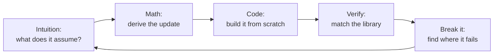

# Level 4: ML Algorithms in Depth

> **Level 4 · Overview** · ⏱️ ~5–6 weeks at about an hour a day · Prerequisites: [Level 3: Machine learning fundamentals](../03-ml-fundamentals/index.md), especially [cross-validation](../03-ml-fundamentals/04-generalization-bias-variance.md), [regularization](../03-ml-fundamentals/05-regularization.md), and [gradient descent](../03-ml-fundamentals/07-gradient-descent-in-depth.md)

Level 3 taught you how learning works: loss functions, generalization, validation, and optimization, using linear and logistic regression. Level 4 opens the toolbox. You'll study the main families of classical machine learning algorithms one at a time: how each one sees data, what it assumes, how it's derived, and when it's the right tool. Every algorithm is built from scratch in NumPy first, then matched against the library version.

## What this level covers

The first four chapters cover **supervised learning** beyond linear models. **k-nearest neighbors** predicts from similar examples, and **naive Bayes** predicts with Bayes' theorem and a bold independence assumption. **Decision trees** split data with yes-or-no questions. **Ensembles** combine many trees: random forests average them, and gradient boosting adds them up one correction at a time, which makes it the strongest general-purpose method for tabular data. **Support vector machines** find the widest margin between classes and bend it with kernels.

The next two chapters cover **unsupervised learning**. **Clustering** finds groups (k-means, hierarchical clustering, DBSCAN, and Gaussian mixtures fit with EM), and **dimensionality reduction** finds the few directions that matter (PCA, kernel PCA, t-SNE, and UMAP).

The last two chapters cover problems with their own rules. **Time series forecasting** handles data where order matters, from Holt-Winters and ARIMA to gradient boosting with lag features, validated with walk-forward backtests. **Anomaly detection** finds the rare and unusual, and **recommender systems** predict what each person will like, evaluated with ranking metrics.

## What you'll be able to do

- Derive and implement kNN, naive Bayes, CART, bagging, random forests, AdaBoost, gradient boosting, linear SVMs, k-means, EM for Gaussian mixtures, PCA, kernel PCA, Holt-Winters, isolation forests, and matrix factorization from scratch, and verify each against scikit-learn or statsmodels.
- Explain each algorithm's assumptions, its inductive bias, and the failure modes that follow from them: the curse of dimensionality, tree instability, sensitivity to scaling, the meaning of $\gamma$ and $C$, and what a t-SNE plot does and doesn't show.
- Choose sensible hyperparameters and tune them with the right validation: out-of-bag error, early stopping, logarithmic grids, BIC, or walk-forward backtests.
- Explain why gradient-boosted trees usually win on tabular data, and when they don't.
- Evaluate unsupervised results honestly, with stability checks and baselines, and evaluate recommenders with precision@k and recall@k.
- Run a fair, statistically sound comparison of many models and turn it into a written recommendation.

## Chapters

| # | Chapter | What it covers | Time |
|---|---|---|---|
| 1 | [k-nearest neighbors and naive Bayes](01-knn-and-naive-bayes.md) | Instance-based learning, distance metrics, choosing k, the curse of dimensionality, generative vs discriminative models, Gaussian and multinomial naive Bayes, text classification | ~60 min read + 4–5 h practice |
| 2 | [Decision trees](02-decision-trees.md) | Recursive partitioning, Gini and entropy, information gain, CART from scratch, regression trees, stopping and cost-complexity pruning, interpretability, instability | ~60 min read + 4–5 h practice |
| 3 | [Ensembles: random forests and boosting](03-ensembles.md) | Bagging, random forests and OOB error, AdaBoost, gradient boosting derived, XGBoost, LightGBM, CatBoost, HistGradientBoosting, stacking, why boosted trees win on tabular data | ~75 min read + 5–6 h practice |
| 4 | [Support vector machines](04-support-vector-machines.md) | Maximum margin, hard and soft margins, hinge loss, the dual, the kernel trick, RBF and polynomial kernels, $\gamma$ and $C$, SVR, when to use SVMs | ~65 min read + 4–5 h practice |
| 5 | [Clustering](05-clustering.md) | k-means as coordinate descent, k-means++, elbow and silhouette, hierarchical clustering, DBSCAN, Gaussian mixtures and EM, evaluating clusters | ~70 min read + 4–5 h practice |
| 6 | [Dimensionality reduction](06-dimensionality-reduction.md) | PCA from variance and from the SVD, explained variance, whitening, kernel PCA, t-SNE, UMAP, reading embeddings responsibly | ~65 min read + 4–5 h practice |
| 7 | [Time series forecasting](07-time-series.md) | Decomposition, stationarity and the ADF test, ACF and PACF, Holt-Winters, ARIMA, lag features with gradient boosting, walk-forward backtesting | ~75 min read + 5–6 h practice |
| 8 | [Anomaly detection and recommender systems](08-anomaly-detection-and-recommenders.md) | Robust statistics, Mahalanobis distance, isolation forests, one-class methods, content-based and collaborative filtering, matrix factorization, precision@k and recall@k | ~75 min read + 5–6 h practice |

The [choosing a model cheat sheet](../../cheatsheets/choosing-a-model.md) summarizes every algorithm from Levels 3 and 4 on one page.

## How to study this level

1. **Start from the assumption.** Every algorithm has a picture of what data looks like: kNN assumes nearby points share labels, k-means assumes round clusters, ARIMA assumes stationarity. Name it before you read the math, because the failure modes follow from it.
2. **Derive the key step on paper.** The Gini gain, the AdaBoost weight update, the gradient boosting pseudo-residuals, the SVM margin, the k-means update, the EM steps, the PCA eigenproblem, the matrix factorization gradient. Each fits on half a page.
3. **Build it, then match the library.** Your from-scratch version should agree with scikit-learn's to several decimal places (or, for randomized algorithms, in its results). When it doesn't, finding out why teaches you the details the library hides: tie-breaking, smoothing constants, initialization.
4. **Break it on purpose.** Remove the scaler, add noise features, use a huge $\gamma$, shuffle a time series, set `contamination` wrong. Watching an algorithm fail is how you learn to recognize the failure in real data.
5. **Compare with baselines, always.** A model is only good relative to something simple: the majority class, the mean, the seasonal naive forecast, the most popular items.
6. **Revisit the "Check yourself" questions** a few days later, and again a week later.

!!! tip "Don't memorize hyperparameter values"
    Learn what each hyperparameter *does* (which way it moves bias and variance, and on what scale), and how to search it. Specific good values depend on the dataset; the reasoning transfers.

!!! warning "Runtime"
    Every example in this level runs on a laptop CPU, mostly in seconds. The capstone's full nested cross-validation takes a few minutes. No GPU is needed until [Level 7](../07-deep-learning-pytorch/index.md).

## Capstone

The level ends with **[a model bake-off on a tabular dataset](../../exercises/level-4-capstone.md)**: you compare a baseline, regularized linear models, kNN, an SVM, a random forest, and gradient boosting on a loan-default problem, with nested cross-validation, a corrected significance test, a single final test-set check, timing, and interpretability, and finish with a written recommendation. Complete it without notes before moving on to [Level 5: Applied ML and MLOps](../05-applied-ml/index.md).
