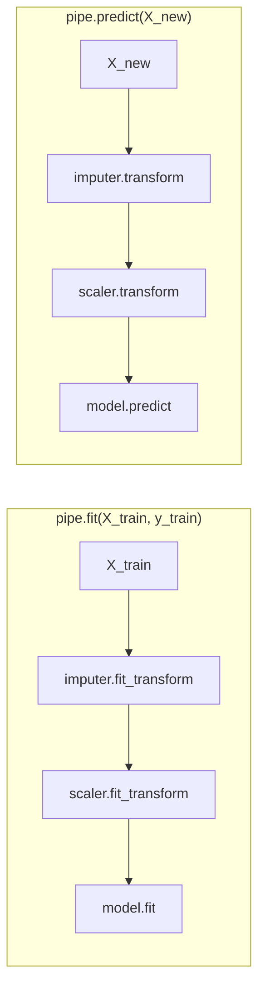
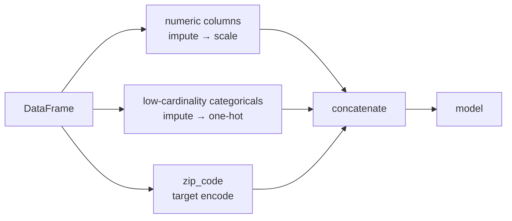
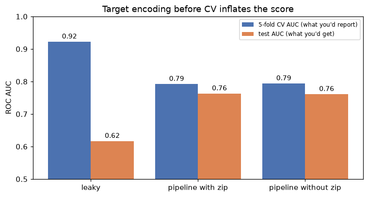

# ML pipelines

> **Level 5 · Chapter 1** · ⏱️ ~60 min read · Prerequisites: [Feature engineering](../02-data-science-workflow/04-feature-engineering.md), [What is machine learning?](../03-ml-fundamentals/01-what-is-machine-learning.md) (the scikit-learn API), and [Generalization and the bias-variance trade-off](../03-ml-fundamentals/04-generalization-bias-variance.md) (cross-validation)

A model is never just a model. It's a chain of steps (impute, encode, scale, select, fit) that must run in the same order, with the same learned values, during cross-validation, in production, and a year from now. This chapter shows how to build that chain as one object with scikit-learn's `Pipeline` and `ColumnTransformer`, why doing so is the most reliable defense against leakage, how to write your own transformers, and how to save, reload, and organize the result.

## Why it matters

Wei was asked to predict which customers of a subscription business would cancel in the next month. The data had a `zip_code` column with hundreds of values, so Wei did the sensible thing from the feature engineering chapter: replace each zip code with the churn rate of its customers (target encoding). Then Wei ran 5-fold cross-validation on a logistic regression. The AUC was 0.92. The previous model had scored 0.79.

The team shipped it. A month later, the retention team complained that the "high-risk" list was barely better than random. On that month's real outcomes, the AUC was 0.62, *worse* than the old model.

Nothing was wrong with the algorithm. The bug was in the order of operations. Wei had computed the zip-code churn rates on the whole training table *before* cross-validation, so every validation row's encoded value had been computed with its own label. The model learned to read the answer off that column, and cross-validation rewarded it. In production, new customers' labels weren't in the encoding, and the column was noise.

The fix takes three lines: put the encoder *inside* a pipeline, and cross-validate the pipeline. You'll reproduce Wei's mistake and the fix with real numbers below.

## Concepts

### Learned preprocessing is part of the model

Recall the scikit-learn API from [Level 3](../03-ml-fundamentals/01-what-is-machine-learning.md). An **estimator** has `fit(X, y)`, which learns from data and stores the result in attributes ending with an underscore. A **transformer** is an estimator with `transform(X)`, which applies what it learned. A **predictor** has `predict(X)` (and often `predict_proba(X)`).

Many preprocessing steps *learn* something:

| Step | What `fit` learns | Stored as |
|---|---|---|
| `StandardScaler` | each column's mean and standard deviation | `mean_`, `scale_` |
| `SimpleImputer(strategy="median")` | each column's median | `statistics_` |
| `OneHotEncoder` | the list of categories seen | `categories_` |
| `TargetEncoder` | each category's (smoothed) target mean | `encodings_` |
| `SelectKBest` | which columns score best against `y` | `scores_`, `get_support()` |
| `PCA` | the principal directions | `components_` |

Every learned value is a **parameter** of the overall model, just like a regression weight. That's the key mental shift. If you compute a median, a category list, or a target mean using rows that will later be used for evaluation, information from the evaluation rows has leaked into the model. The evaluation is no longer an honest estimate of performance on unseen data.

**Leakage-proof preprocessing** means one rule: *every step that learns from data is fit only on the training portion of each split, then applied unchanged to the held-out portion.* In cross-validation with $k$ folds, that means each step is fit $k$ separate times, once per training fold.

You could do this by hand, with a loop over folds that fits the imputer, the encoder, the scaler, and the model, in order, on each training fold. People do write that loop, and they get it wrong, because every new step is one more place to forget. The pipeline makes the rule automatic.

### How much does a leak inflate the score?

Leaks differ enormously in size. It helps to understand why.

**Scaling** leaks very little. A standard scaler learns a mean $\mu_j$ and standard deviation $s_j$ per column. If you fit it on all $n$ rows instead of the $n(k-1)/k$ training rows of a fold, the estimates change by a tiny amount, on the order of $s_j / \sqrt{n}$. The model sees almost the same numbers either way, so the score barely moves. It's still wrong, and it can matter for small datasets, but it won't fool you badly.

**Target encoding** can leak enormously. Take a categorical column (zip code) and replace each category $c$ with the mean target of its rows. For a row $i$ in category $c$ with $n_c$ rows,

$$
\text{enc}_i = \frac{1}{n_c} \sum_{j \in c} y_j = \frac{y_i}{n_c} + \frac{1}{n_c} \sum_{j \in c,\, j \ne i} y_j .
$$

The encoded value contains the row's own label with weight $1/n_c$. Suppose the zip code is pure noise, unrelated to churn, so the labels are independent with variance $\sigma^2 = \text{Var}(y)$. The second term is independent of $y_i$, so

$$
\text{Cov}(\text{enc}_i, y_i) = \text{Cov}\!\left(\frac{y_i}{n_c}, y_i\right) = \frac{\sigma^2}{n_c} > 0 .
$$

A useless column has become correlated with the target, and the correlation is strongest for rare categories (small $n_c$). With nearly 800 zip codes and 2,100 training rows, the average category has fewer than 3 rows, so each row contributes about a third of its own encoding. A model will happily learn "high encoded value means churn".

Smoothing helps but doesn't fix it. The smoothed encoding shrinks toward the global mean $\bar{y}$ with a strength $m$:

$$
\text{enc}_c = \frac{n_c \bar{y}_c + m \bar{y}}{n_c + m},
$$

where $\bar{y}_c$ is the category's mean. The own-label weight becomes $1/(n_c + m)$, smaller but not zero.

The real fix is to make sure no row's encoding ever uses its own label. Inside each cross-validation split, fit the encoder on the training fold, so validation rows are encoded with training-fold means only. And even within the training fold, scikit-learn's `TargetEncoder` uses **cross-fitting**: `fit_transform` splits the training data into internal folds and encodes each row using means computed on the *other* internal folds. That keeps the model from over-trusting the column during training, too.

### The pipeline: one object, one `fit`

A **pipeline** chains transformers and a final estimator into a single estimator. Its `fit` runs `fit_transform` on each transformer in turn, feeding each output to the next step, and then calls `fit` on the final estimator. Its `predict` runs `transform` (never `fit`) on each transformer and then `predict` on the final step.



Because the whole chain is one estimator, anything that accepts an estimator accepts the pipeline: `cross_val_score`, `GridSearchCV`, `clone`, `joblib.dump`. When `cross_val_score` fits the pipeline on a training fold, *every* learned step is fit on that fold only. You can't forget a step, because there's no separate step to forget.

There's nothing magic about it. Here is the core logic in a dozen lines:

```python
class MiniPipeline:
    """The heart of sklearn.pipeline.Pipeline: fit_transform each step, then fit the last."""

    def __init__(self, steps):
        self.steps = steps                                   # list of (name, estimator)

    def fit(self, X, y):
        for name, step in self.steps[:-1]:
            X = step.fit_transform(X, y)                     # learn on this data, then transform it
        self.steps[-1][1].fit(X, y)
        return self

    def _transform(self, X):
        for name, step in self.steps[:-1]:
            X = step.transform(X)                            # apply what was learned; never refit
        return X

    def predict(self, X):
        return self.steps[-1][1].predict(self._transform(X))

    def predict_proba(self, X):
        return self.steps[-1][1].predict_proba(self._transform(X))
```

The real `Pipeline` adds parameter routing (so a grid search can reach inside it), caching, feature-name tracking, and validation, but the fit/transform logic is exactly this.

### Heterogeneous columns: `ColumnTransformer`

Real tables mix types. Numeric columns need imputing and scaling, categorical columns need one-hot encoding, and a high-cardinality column might need target encoding. A **`ColumnTransformer`** applies a different transformer (often itself a small pipeline) to each group of columns, fits each on the same rows, and concatenates the outputs side by side.



A `ColumnTransformer` is itself a transformer, so it goes inside a `Pipeline` as the first step. That combination (a `ColumnTransformer` of small pipelines, followed by a model) is the standard shape of a tabular scikit-learn model, and you'll write it many times.

Two parameters are worth knowing from the start. `remainder` decides what happens to columns you didn't list: `"drop"` (the default) or `"passthrough"`. Dropping silently is safer than passing through an ID column by accident, but it also means a misspelled column list loses a feature without an error, so check `get_feature_names_out()`. And column selection can be by name, by position, or by rule with `make_column_selector(dtype_include="number")`.

### Custom transformers

Sometimes no built-in transformer does what you need: clip outliers at learned quantiles, compute a ratio feature, map rare categories to "other". You have two options.

For a **stateless** transformation (one that learns nothing, like a log or a ratio of two columns), wrap a function with `FunctionTransformer`. It has a `fit` that does nothing, so it's safe in a pipeline.

For a **stateful** transformation (one that learns values in `fit`), write a class that inherits from `BaseEstimator` and `TransformerMixin`. `BaseEstimator` gives you `get_params` and `set_params` (which grid search and `clone` need), and `TransformerMixin` gives you `fit_transform` for free. The scikit-learn conventions matter, because the library's machinery relies on them:

1. `__init__` only stores its arguments, under the same names, with no validation or computation. `clone` rebuilds estimators by reading `get_params()` and calling `__init__` again, so anything else in `__init__` breaks it.
2. `fit(X, y=None)` learns from data, stores results in attributes ending with `_`, and returns `self`.
3. `transform(X)` uses only the learned attributes. It must not look at the data's statistics afresh, or it's no longer applying what it learned.
4. Optionally, `get_feature_names_out()` returns the output column names, so feature names flow through the pipeline.

You'll build a quantile clipper (a **winsorizer**) that follows all four rules in the In practice section.

### DataFrames in, DataFrames out: `set_output`

By default, transformers return NumPy arrays (or sparse matrices), so column names disappear after the first step. Debugging a 40-column array is miserable. Calling `set_output(transform="pandas")` on a transformer or pipeline makes every step return a DataFrame with proper column names, such as `num__tenure` and `cat__plan_basic` (the prefix is the `ColumnTransformer` branch name). One-hot encoders must then produce dense output (`sparse_output=False`), since a DataFrame can't hold a sparse matrix this way.

### Reproducibility

A pipeline is reproducible when the same code, data, and environment give the same model. Four things break that, and each has a fix:

- **Unseeded randomness.** Random forests, shuffled splits, SGD, and SMOTE all draw random numbers. Pass `random_state=0` (or any fixed integer) to every estimator and splitter that takes one, and use one seeded `np.random.default_rng` for your own sampling.
- **Unpinned versions.** A model fit with scikit-learn 1.9 may not load, or may predict differently, in another version. Pin exact versions in a lock file, and save the version next to the model.
- **Unversioned data.** "The training data" changes when someone reruns the extract. Save a snapshot, or at least a hash of it, with each model.
- **Hidden state.** Notebooks run out of order. The final training run should be a script that runs top to bottom.

### Saving a pipeline

Because the whole chain is one Python object, saving it saves everything: the imputer's medians, the encoder's categories, the scaler's means, and the model's weights. **`joblib`** is the standard tool. It's `pickle` with efficient handling of large NumPy arrays.

Two warnings come with pickles. First, **loading a pickle can run arbitrary code**, so never load one from a source you don't trust. Second, pickles are tied to library versions; scikit-learn warns (`InconsistentVersionWarning`) when you load a model saved with a different version, and the result may be wrong. Always store the versions alongside the file. The [ML in production](05-ml-in-production.md) chapter covers formats, versioning, and registries in depth.

### Project structure for ML

Notebooks are great for exploring and terrible for shipping. Once a pipeline works, move it into a small project where each concern lives in one place. A layout that scales from a solo project to a team:

```text
churn-model/
├── README.md               how to set up, train, and serve
├── pyproject.toml          dependencies (with a lock file, e.g. uv.lock)
├── configs/
│   └── train.yaml          paths, features, hyperparameters: no magic numbers in code
├── data/
│   ├── raw/                immutable inputs (or pointers to them); not in git
│   └── processed/
├── notebooks/              exploration only; nothing imports from here
├── src/churn/
│   ├── data.py             loading and validation
│   ├── features.py         custom transformers
│   ├── pipeline.py         build_pipeline(config) -> Pipeline
│   ├── train.py            fit, evaluate, save the model and metadata
│   └── predict.py          load the model, score new data
├── models/                 saved pipelines plus metadata.json; not in git
└── tests/
    ├── test_features.py    unit tests for transformers
    └── test_pipeline.py    smoke test: fit on a tiny sample, predict, check shapes
```

The important ideas are separation and a single source of truth. One function, `build_pipeline`, defines the model, and both training and serving use the object it produces, so preprocessing can't drift apart between them. Configuration lives in a file, so an experiment is "this commit plus this config". Raw data is never edited in place. The [Level 5 capstone](../../exercises/level-5-capstone.md) builds a smaller version of this.

## In practice

### The data: a churn table

The examples use a synthetic subscription business. Each row is a customer, and the target is whether they cancel next month. The `zip_code` column has nearly 800 distinct values and, by construction, *no relationship to churn*: it's the trap from the story.

```python
import numpy as np
import pandas as pd
from sklearn.compose import ColumnTransformer
from sklearn.linear_model import LogisticRegression
from sklearn.metrics import roc_auc_score
from sklearn.model_selection import StratifiedKFold, cross_val_score, train_test_split
from sklearn.pipeline import make_pipeline
from sklearn.preprocessing import OneHotEncoder, StandardScaler


def make_churn(n=3000, seed=0):
    """Synthetic churn data. zip_code is pure noise by construction."""
    rng = np.random.default_rng(seed)
    tenure = rng.integers(1, 72, n)                                   # months as a customer
    charges = np.round(rng.normal(65, 20, n).clip(15, 140), 2)        # monthly bill, USD
    calls = rng.poisson(1.5, n)                                       # support calls last month
    plan = rng.choice(["basic", "standard", "premium"], n, p=[.5, .3, .2])
    payment = rng.choice(["card", "bank", "invoice"], n, p=[.5, .3, .2])
    zip_code = rng.integers(10000, 10800, n).astype(str)
    logit = (-1.0 - 0.04 * tenure + 0.02 * (charges - 65) + 0.45 * calls
             + np.select([plan == "basic", plan == "premium"], [0.5, -0.5], 0) + 0.6 * (payment == "invoice"))
    y = (rng.random(n) < 1 / (1 + np.exp(-logit))).astype(int)
    X = pd.DataFrame({"tenure": tenure, "monthly_charges": charges, "support_calls": calls,
                      "plan": plan, "payment": payment, "zip_code": zip_code})
    return X, y


X, y = make_churn()
X_train, X_test, y_train, y_test = train_test_split(X, y, test_size=0.3, stratify=y, random_state=0)
num_cols = ["tenure", "monthly_charges", "support_calls"]
cat_cols = ["plan", "payment"]
cv = StratifiedKFold(n_splits=5, shuffle=True, random_state=0)

print(X_train.head(3))
print(f"train {len(X_train)}, test {len(X_test)}, churn rate {y.mean():.3f}, "
      f"zip codes {X['zip_code'].nunique()}")
```

```text
      tenure  monthly_charges  support_calls     plan payment zip_code
1520      70            65.99              0  premium    card    10313
1473      71            47.53              1    basic    card    10096
795        7            80.51              2    basic    bank    10606
train 2100, test 900, churn rate 0.233, zip codes 783
```

The test set stands in for "next month's customers". We'll use it only to check what each approach *really* scores.

### Reproducing the leak: target encoding before cross-validation

First, Wei's version. Compute each zip code's churn rate on the full training table, add it as a column, and then cross-validate.

```python
# WRONG: the encoding is computed once, using every training row's label
zip_rate = pd.Series(y_train, index=X_train.index).groupby(X_train["zip_code"]).mean()
X_train_leaky = X_train.assign(zip_te=X_train["zip_code"].map(zip_rate))

leaky_model = make_pipeline(
    ColumnTransformer([("num", StandardScaler(), num_cols + ["zip_te"]),
                       ("cat", OneHotEncoder(), cat_cols)]),
    LogisticRegression(max_iter=1000),
)
leaky_cv = cross_val_score(leaky_model, X_train_leaky, y_train, cv=cv, scoring="roc_auc").mean()

# What it really scores on new customers (their labels are not in the encoding)
leaky_model.fit(X_train_leaky, y_train)
X_test_leaky = X_test.assign(zip_te=X_test["zip_code"].map(zip_rate).fillna(y_train.mean()))
leaky_test = roc_auc_score(y_test, leaky_model.predict_proba(X_test_leaky)[:, 1])
print(f"leaky: CV AUC {leaky_cv:.3f}   test AUC {leaky_test:.3f}")
```

```text
leaky: CV AUC 0.922   test AUC 0.617
```

Cross-validation reports 0.92. New customers get 0.62. The 0.3 gap is pure leakage: the CV folds were computed with encodings that contained the validation rows' own labels.

Now the right way. Put `TargetEncoder` inside the pipeline and cross-validate the pipeline on the raw columns. In each fold, the encoder is fit on the training fold only, and its `fit_transform` cross-fits internally, so no row is ever encoded with its own label.

```python
from sklearn.model_selection import KFold
from sklearn.preprocessing import TargetEncoder

def build_model(with_zip=True):
    branches = [("num", StandardScaler(), num_cols), ("cat", OneHotEncoder(), cat_cols)]
    if with_zip:
        branches.append(("zip", TargetEncoder(cv=KFold(5, shuffle=True, random_state=0)), ["zip_code"]))
    return make_pipeline(ColumnTransformer(branches), LogisticRegression(max_iter=1000))

results = {}
for name, with_zip in [("pipeline with zip", True), ("pipeline without zip", False)]:
    model = build_model(with_zip)
    cv_auc = cross_val_score(model, X_train, y_train, cv=cv, scoring="roc_auc").mean()
    test_auc = roc_auc_score(y_test, model.fit(X_train, y_train).predict_proba(X_test)[:, 1])
    results[name] = (cv_auc, test_auc)
    print(f"{name:21s}: CV AUC {cv_auc:.3f}   test AUC {test_auc:.3f}")
results["leaky"] = (leaky_cv, leaky_test)
```

```text
pipeline with zip    : CV AUC 0.792   test AUC 0.763
pipeline without zip : CV AUC 0.794   test AUC 0.761
```

The pipeline's cross-validation score (0.79) is close to its test score (0.76); the small remaining gap is ordinary sampling noise between 2,100 and 900 rows. Its scores are also nearly identical with or without the zip code, which is the truth: the column carries no signal. Honest evaluation tells you that; leaky evaluation told you the opposite.

```python
import matplotlib.pyplot as plt

labels = ["leaky", "pipeline with zip", "pipeline without zip"]
cv_scores = [results[k][0] for k in labels]
test_scores = [results[k][1] for k in labels]
xpos = np.arange(len(labels))

fig, ax = plt.subplots(figsize=(7, 3.8))
ax.bar(xpos - 0.2, cv_scores, 0.4, label="5-fold CV AUC (what you'd report)", color="#4C72B0")
ax.bar(xpos + 0.2, test_scores, 0.4, label="test AUC (what you'd get)", color="#DD8452")
for x0, a, b in zip(xpos, cv_scores, test_scores):
    ax.text(x0 - 0.2, a + 0.01, f"{a:.2f}", ha="center", fontsize=9)
    ax.text(x0 + 0.2, b + 0.01, f"{b:.2f}", ha="center", fontsize=9)
ax.set_xticks(xpos, labels)
ax.set_ylim(0.5, 1.0)
ax.set_ylabel("ROC AUC")
ax.set_title("Target encoding before CV inflates the score")
ax.legend(loc="upper right", fontsize=8)
plt.tight_layout()
plt.show()
```



*Leakage shows up as a gap between the score you validate and the score you get. Inside a pipeline, the two agree.*

What about scaling? The same experiment with a scaler fit before cross-validation shows how small that leak usually is:

```python
X_num = X_train[num_cols]
scaled_first = StandardScaler().fit_transform(X_num)              # WRONG, but mild
a = cross_val_score(LogisticRegression(), scaled_first, y_train, cv=cv, scoring="roc_auc").mean()
b = cross_val_score(make_pipeline(StandardScaler(), LogisticRegression()),
                    X_num, y_train, cv=cv, scoring="roc_auc").mean()
print(f"scaler fit before CV: {a:.5f}   scaler inside pipeline: {b:.5f}")
```

```text
scaler fit before CV: 0.77507   scaler inside pipeline: 0.77508
```

The difference is in the fifth decimal. Don't conclude that "scaling first is fine": the habit that makes scaling harmless is the same habit that makes target encoding catastrophic, and in small datasets, or with steps like feature selection, the damage grows. Make the pipeline your default for *every* learned step.

!!! warning "Common mistake: preprocessing the whole dataset, then splitting"
    `X = scaler.fit_transform(X)` followed by `train_test_split(X, ...)` or `cross_val_score(model, X, ...)` leaks the held-out rows' statistics into training. The same goes for imputing, encoding, selecting features, PCA, and resampling. If a step has a `fit`, it belongs inside the pipeline that you cross-validate.

### The from-scratch pipeline agrees with scikit-learn

The `MiniPipeline` from the Concepts section produces the same predictions as the real thing:

```python
from sklearn.pipeline import Pipeline

steps = lambda: [("scale", StandardScaler()), ("model", LogisticRegression())]
mini = MiniPipeline(steps()).fit(X_train[num_cols], y_train)
real = Pipeline(steps()).fit(X_train[num_cols], y_train)
p_mini = mini.predict_proba(X_test[num_cols])[:, 1]
p_real = real.predict_proba(X_test[num_cols])[:, 1]
print("max difference:", np.abs(p_mini - p_real).max())
print(real)
```

```text
max difference: 0.0
Pipeline(steps=[('scale', StandardScaler()), ('model', LogisticRegression())])
```

`make_pipeline(...)` is a shortcut that names each step after its lowercased class (`standardscaler`, `logisticregression`). `Pipeline([...])` lets you choose the names, which makes parameter paths shorter. Access a fitted step with `pipe.named_steps["model"]` or `pipe[-1]`, and slice with `pipe[:-1]` to get the preprocessing alone.

### A complete tabular pipeline with `ColumnTransformer`

Real data has gaps. Let's knock out some values and build the full model: impute and scale numerics, impute and one-hot encode categoricals, and target-encode the zip code.

```python
from sklearn.impute import SimpleImputer

rng = np.random.default_rng(1)
X_train_gappy = X_train.copy()
X_train_gappy.loc[rng.random(len(X_train)) < 0.05, "monthly_charges"] = np.nan
X_train_gappy.loc[rng.random(len(X_train)) < 0.05, "payment"] = np.nan

numeric = Pipeline([("impute", SimpleImputer(strategy="median")), ("scale", StandardScaler())])
categorical = Pipeline([("impute", SimpleImputer(strategy="most_frequent")),
                        ("onehot", OneHotEncoder(handle_unknown="ignore", sparse_output=False))])
preprocess = ColumnTransformer([
    ("num", numeric, num_cols),
    ("cat", categorical, cat_cols),
    ("zip", TargetEncoder(cv=KFold(5, shuffle=True, random_state=0)), ["zip_code"]),
])
pipe = Pipeline([("prep", preprocess), ("model", LogisticRegression(max_iter=1000))])

scores = cross_val_score(pipe, X_train_gappy, y_train, cv=cv, scoring="roc_auc")
print(f"CV AUC {scores.mean():.3f} ± {scores.std():.3f}")
pipe.fit(X_train_gappy, y_train)
print(pipe.named_steps["prep"].get_feature_names_out())
```

```text
CV AUC 0.790 ± 0.017
['num__tenure' 'num__monthly_charges' 'num__support_calls'
 'cat__plan_basic' 'cat__plan_premium' 'cat__plan_standard'
 'cat__payment_bank' 'cat__payment_card' 'cat__payment_invoice'
 'zip__zip_code']
```

`handle_unknown="ignore"` matters in production: a payment method that didn't exist at training time becomes all zeros instead of an exception. The feature names come out prefixed by branch, which tells you exactly where each column came from.

Pipelines also let you reach any parameter by its path, `step__substep__param`, with double underscores. That's how a grid search tunes preprocessing and the model together:

```python
from sklearn.model_selection import GridSearchCV

grid = GridSearchCV(
    pipe,
    param_grid={"prep__num__impute__strategy": ["mean", "median"],
                "model__C": [0.01, 0.1, 1.0]},
    cv=cv, scoring="roc_auc",
)
grid.fit(X_train_gappy, y_train)
print(grid.best_params_, f"best CV AUC {grid.best_score_:.3f}")
```

```text
{'model__C': 0.1, 'prep__num__impute__strategy': 'mean'} best CV AUC 0.791
```

Every one of those $2 \times 3 \times 5 = 30$ fits re-ran the imputer, encoders, and scaler on its own training fold. The [next chapter](02-hyperparameter-tuning.md) covers tuning properly.

### A custom transformer: learned quantile clipping

Extreme values hurt linear models. A **winsorizer** clips each column to quantiles learned from the training data, say the 1st and 99th percentiles. Because it learns the cut points, it must be stateful and must follow the conventions:

```python
from sklearn.base import BaseEstimator, TransformerMixin
from sklearn.utils.validation import check_is_fitted


class QuantileClipper(BaseEstimator, TransformerMixin):
    """Clip each column to quantiles learned in fit (winsorizing)."""

    def __init__(self, lower=0.01, upper=0.99):
        self.lower = lower                     # rule 1: store arguments as is, nothing else
        self.upper = upper

    def fit(self, X, y=None):
        if hasattr(X, "columns"):                            # remember names if given a DataFrame
            self.feature_names_in_ = np.asarray(X.columns, dtype=object)
        X = np.asarray(X, dtype=float)
        self.low_ = np.nanquantile(X, self.lower, axis=0)    # rule 2: learned values end with _
        self.high_ = np.nanquantile(X, self.upper, axis=0)
        self.n_features_in_ = X.shape[1]
        return self                                          # rule 2: return self

    def transform(self, X):
        check_is_fitted(self)                                # clear error if not fitted
        return np.clip(np.asarray(X, dtype=float), self.low_, self.high_)   # rule 3: use learned values

    def get_feature_names_out(self, input_features=None):    # rule 4: names flow through
        if input_features is not None:
            return np.asarray(input_features, dtype=object)
        return getattr(self, "feature_names_in_",
                       np.asarray([f"x{i}" for i in range(self.n_features_in_)], dtype=object))


clipper = QuantileClipper(lower=0.05, upper=0.95).fit(X_train[num_cols])
print("learned cut points:", clipper.low_, clipper.high_)
print("clipped test row 0:", clipper.transform(X_test[num_cols].iloc[[0]]))
```

```text
learned cut points: [ 4.     31.5165  0.    ] [69.    98.612  4.   ]
clipped test row 0: [[31.   91.63  0.  ]]
```

The clipper learned its cut points from the training data and applies them, unchanged, to new rows. This test row happens to sit inside all three ranges, so it passes through as is; a monthly charge of 120 would be cut to 98.61. Because the class inherits from `BaseEstimator`, it works with `clone`, `get_params`, and grid search with no extra code:

```python
from sklearn.base import clone
from sklearn.preprocessing import FunctionTransformer

numeric_clipped = Pipeline([
    ("impute", SimpleImputer(strategy="median")),
    ("clip", QuantileClipper()),
    ("log", FunctionTransformer(np.log1p, feature_names_out="one-to-one")),   # stateless
    ("scale", StandardScaler()),
])
pipe2 = Pipeline([
    ("prep", ColumnTransformer([("num", numeric_clipped, num_cols), ("cat", categorical, cat_cols)])),
    ("model", LogisticRegression(max_iter=1000)),
])
print(clone(QuantileClipper(upper=0.9)).get_params())
grid2 = GridSearchCV(pipe2, {"prep__num__clip__upper": [0.95, 0.99, 1.0]}, cv=cv, scoring="roc_auc")
grid2.fit(X_train_gappy, y_train)
for p, s in zip(grid2.cv_results_["params"], grid2.cv_results_["mean_test_score"]):
    print(p, f"{s:.4f}")
```

```text
{'lower': 0.01, 'upper': 0.9}
{'prep__num__clip__upper': 0.95} 0.7740
{'prep__num__clip__upper': 0.99} 0.7747
{'prep__num__clip__upper': 1.0} 0.7751
```

On this data, clipping and the log transform don't help: every score is below the plain pipeline's 0.79, because the true relationships are linear in the raw values and the log bends them. The point is the mechanics: your own transformer took part in cross-validation and tuning exactly like a built-in one.

!!! warning "Common mistake: doing work in `__init__`"
    Writing `self.lower = max(lower, 0)` or computing anything in `__init__` breaks `clone` and `set_params`, which assume `__init__` stores arguments unchanged. Validate inside `fit` instead. Also never let `transform` recompute statistics from the data it receives; that silently turns a learned transformation into a different one at prediction time.

### Keeping DataFrames with `set_output`

Turn on pandas output on a fresh copy of the preprocessing and inspect what the model actually receives:

```python
pd.set_option("display.width", 120)
pd.set_option("display.max_columns", 20)
prep = clone(preprocess).set_output(transform="pandas")    # an unfitted copy, with pandas output
Xt = prep.fit_transform(X_train_gappy, y_train)
print(type(Xt).__name__, Xt.shape)
print(Xt.round(2).iloc[:3, [0, 1, 3, 8, 9]])
```

```text
DataFrame (2100, 10)
      num__tenure  num__monthly_charges  cat__plan_basic  cat__payment_invoice  zip__zip_code
1520         1.60                  0.07              0.0                   0.0           0.54
1473         1.64                 -0.88              1.0                   0.0           0.00
795         -1.45                  0.81              1.0                   0.0           0.00
```

Notice the two zip encodings of exactly 0.00. These are cross-fitted values: in the other internal folds, those zip codes had only non-churners, and the default `smooth="auto"` (an empirical Bayes shrinkage) shrinks very little when a category's labels have no variance. With rare categories, target encodings are noisy, which is one more reason they belong inside cross-validation, where their noise is measured honestly.

You can also call `set_output` once on the whole pipeline, or globally with `sklearn.set_config(transform_output="pandas")`. It only affects transformers' output; the final model still returns arrays from `predict`.

### Saving and loading with `joblib`

Save the fitted pipeline, plus a small metadata file, so that you (or a server) can reload it later and know what it is:

```python
import json
import platform
from pathlib import Path

import joblib
import sklearn

out = Path("models")
out.mkdir(exist_ok=True)
joblib.dump(pipe, out / "churn_pipeline.joblib")
meta = {
    "model": "churn logistic regression v1",
    "sklearn_version": sklearn.__version__,
    "python_version": platform.python_version(),
    "features": list(X_train.columns),
    "cv_auc": round(float(scores.mean()), 4),
}
(out / "churn_pipeline.json").write_text(json.dumps(meta, indent=2))

loaded = joblib.load(out / "churn_pipeline.joblib")
same = np.allclose(loaded.predict_proba(X_test)[:, 1], pipe.predict_proba(X_test)[:, 1])
print("reloaded predictions identical:", same)
print("file size:", round((out / "churn_pipeline.joblib").stat().st_size / 1024), "KB")
```

```text
reloaded predictions identical: True
file size: 17 KB
```

The loaded object includes every learned value, so `loaded.predict_proba(raw_dataframe)` works on raw data straight from the source, with no separate preprocessing script to keep in sync. That property, *one artifact from raw input to prediction*, is what makes pipelines the unit of deployment in [ML in production](05-ml-in-production.md).

!!! warning "Common mistake: shipping the model without its preprocessing"
    Saving only `model.fit(X_scaled, y)` and re-implementing scaling in the serving code is the classic source of **training-serving skew**: two implementations that disagree in some edge case (a missing value, a new category, a different column order). Save the whole pipeline.

## Exercises

### Exercise 1: Spot the leak (easy)

Which of these leak information from held-out data into training? For each leaky one, say how to fix it.

1. `X = SimpleImputer().fit_transform(X)`, then `cross_val_score(model, X, y)`.
2. `cross_val_score(make_pipeline(SimpleImputer(), model), X, y)`.
3. Dropping rows where any feature is missing, before splitting.
4. Choosing the 20 features most correlated with `y` on the full dataset, then cross-validating a model on those 20.
5. Computing each customer's total spend over their whole history, including months after the prediction date.

??? success "Solution"

    1. **Leaks.** The imputer's means include the validation rows. Fix: put the imputer in the pipeline, as in 2.
    2. **No leak.** The imputer is refit on each training fold.
    3. **No statistical leak** (dropping a row uses only that row), but it changes the population: if production rows can have missing values, your evaluation no longer represents them. Prefer imputing inside the pipeline, or apply the same rule in production.
    4. **Leaks badly.** Feature selection used the labels of every row. With many noise features, this alone can produce high CV scores on pure noise. Fix: put `SelectKBest` inside the pipeline.
    5. **Leaks, but not a pipeline problem.** It's temporal leakage (information from the future), which a pipeline can't fix. Build features using only data before the prediction date, and split by time.

### Exercise 2: The own-label weight (easy)

A category has $n_c = 4$ training rows, the global churn rate is $\bar{y} = 0.25$, and you use smoothing strength $m = 10$. (a) What weight does a row's own label get in its smoothed encoding? (b) If the row's label flips from 0 to 1, how much does its encoding change? (c) Why does cross-fitting remove this effect entirely?

??? success "Solution"

    (a) The smoothed encoding is $\dfrac{\sum_{j \in c} y_j + m \bar{y}}{n_c + m}$, so each label in the category, including the row's own, has weight $1/(n_c + m) = 1/14 \approx 0.071$.

    (b) The encoding rises by $1/14 \approx 0.071$, from, say, $(1 + 2.5)/14 = 0.25$ to $(2 + 2.5)/14 \approx 0.32$. The encoded value moves with the row's own label, which is exactly the correlation a model can exploit.

    (c) With cross-fitting, the row's encoding is computed from the other internal folds only. Its own label isn't in the sum at all, so its weight is zero, and $\text{Cov}(\text{enc}_i, y_i) = 0$ for a noise category.

### Exercise 3: Feature selection leakage on pure noise (medium)

Generate `X = rng.normal(size=(100, 5000))` and `y = rng.integers(0, 2, 100)`: pure noise. (a) Select the 20 columns with the highest absolute correlation to `y` on all rows, then report the 5-fold CV accuracy of a logistic regression on them. (b) Do it properly with `SelectKBest(f_classif, k=20)` inside a pipeline. Explain the difference.

??? success "Solution"

    ```python
    import numpy as np
    from sklearn.feature_selection import SelectKBest, f_classif
    from sklearn.linear_model import LogisticRegression
    from sklearn.model_selection import cross_val_score
    from sklearn.pipeline import make_pipeline

    rng = np.random.default_rng(0)
    Xn = rng.normal(size=(100, 5000))
    yn = rng.integers(0, 2, 100)

    corr = np.abs([np.corrcoef(Xn[:, j], yn)[0, 1] for j in range(Xn.shape[1])])
    top = np.argsort(corr)[-20:]
    wrong = cross_val_score(LogisticRegression(), Xn[:, top], yn, cv=5).mean()
    right = cross_val_score(make_pipeline(SelectKBest(f_classif, k=20), LogisticRegression()),
                            Xn, yn, cv=5).mean()
    print(f"selection before CV: {wrong:.2f}   selection inside pipeline: {right:.2f}")
    ```

    ```text
    selection before CV: 0.85   selection inside pipeline: 0.48
    ```

    Among 5,000 noise columns, some correlate with `y` by chance in this sample. Selecting on all rows picks exactly those columns, including their chance correlation with the validation rows, so CV reports high accuracy on data with no signal. Inside the pipeline, selection sees only the training fold; the chosen columns' chance correlations don't carry over to the validation fold, and accuracy is around chance (0.5, with noise). This is the "wrong way to do cross-validation" described in *The Elements of Statistical Learning*, section 7.10.2.

### Exercise 4: A rare-category transformer (medium)

Write `RareCategoryGrouper(BaseEstimator, TransformerMixin)` with a parameter `min_count=20`. In `fit`, it learns, for each column, the categories that appear at least `min_count` times; in `transform`, it replaces every other value (including categories never seen in training) with `"other"`. Test it on the `plan` column after making one plan rare, and check that `clone` works.

??? success "Solution"

    ```python
    import numpy as np
    import pandas as pd
    from sklearn.base import BaseEstimator, TransformerMixin, clone
    from sklearn.utils.validation import check_is_fitted

    class RareCategoryGrouper(BaseEstimator, TransformerMixin):
        def __init__(self, min_count=20):
            self.min_count = min_count

        def fit(self, X, y=None):
            X = pd.DataFrame(X)
            counts = {c: X[c].value_counts() for c in X.columns}
            self.keep_ = {c: set(v.index[v >= self.min_count]) for c, v in counts.items()}
            self.feature_names_in_ = np.asarray(X.columns, dtype=object)
            return self

        def transform(self, X):
            check_is_fitted(self)
            X = pd.DataFrame(X).copy()
            for c in X.columns:
                X[c] = X[c].where(X[c].isin(self.keep_[c]), "other")
            return X

        def get_feature_names_out(self, input_features=None):
            return self.feature_names_in_

    df = pd.DataFrame({"plan": ["basic"] * 50 + ["standard"] * 30 + ["family"] * 5})
    g = RareCategoryGrouper(min_count=20).fit(df)
    print(g.transform(pd.DataFrame({"plan": ["basic", "family", "student"]}))["plan"].tolist())
    print(clone(g).get_params())
    ```

    ```text
    ['basic', 'other', 'other']
    {'min_count': 20}
    ```

    `family` was too rare in training and `student` was never seen, so both map to `"other"`. Put it before a `OneHotEncoder` in the categorical branch.

### Exercise 5: Reproducibility audit (hard)

A colleague's script trains a `RandomForestClassifier()` with `cross_val_score(model, X, y, cv=KFold(5, shuffle=True))` and gets a different score every run. They also saved the model with `joblib` but can't load it on the server. List every source of non-reproducibility and fragility, and the fix for each.

??? success "Solution"

    - `RandomForestClassifier()` has no `random_state`, so bootstrap samples and feature subsets change each run. Fix: `random_state=0`.
    - `KFold(5, shuffle=True)` without `random_state` reshuffles each run, so the folds differ. Fix: `random_state=0`.
    - The server's scikit-learn (or NumPy, or Python) version probably differs from the training machine's; pickles aren't portable across versions. Fix: pin versions in a lock file, build the server from it, and save `sklearn.__version__` with the model so a mismatch is caught at load time.
    - Custom transformers must be importable on the server under the same module path. A class defined in a notebook pickles as `__main__.MyTransformer`, which the server can't find. Fix: put custom classes in a package (`src/churn/features.py`) that both sides install.
    - The training data itself should be versioned (a snapshot or a hash), and the training should run as a script, not as notebook cells in arbitrary order.

## Check yourself

1. What is the difference between a transformer and a predictor in scikit-learn?

    ??? note "Answer"

        A transformer has `fit` and `transform` and outputs new features (a scaler, an encoder). A predictor has `fit` and `predict` and outputs predictions (a classifier or regressor). A pipeline is a chain of transformers ending in any estimator, and it takes on the final step's abilities.

2. In `pipe.fit(X, y)`, which methods are called on each step? And in `pipe.predict(X_new)`?

    ??? note "Answer"

        In `fit`: `fit_transform` on every transformer in order, then `fit` on the final estimator. In `predict`: `transform` on every transformer, then `predict` on the final estimator. Nothing is refit at prediction time.

3. Why does target encoding leak far more than scaling when done before cross-validation?

    ??? note "Answer"

        A scaler's mean and standard deviation hardly change when a fold's rows are added, and they don't use the labels. A target encoding contains each row's own label with weight $1/n_c$ (or $1/(n_c + m)$ with smoothing), so for rare categories the feature is strongly correlated with the target even when the category is meaningless.

4. Why does `TargetEncoder.fit(X, y).transform(X)` give different values from `TargetEncoder.fit_transform(X, y)`?

    ??? note "Answer"

        `fit_transform` uses cross-fitting: each training row is encoded with means from the other internal folds, so its own label isn't used. `fit` followed by `transform` encodes with means from all rows, own labels included. Pipelines call `fit_transform` during training and `transform` at prediction time, which is exactly right.

5. What are the rules for writing a scikit-learn-compatible transformer?

    ??? note "Answer"

        `__init__` only stores its arguments under the same names; `fit` learns, stores results in attributes ending with `_`, and returns `self`; `transform` uses only those learned attributes; and optionally `get_feature_names_out` returns output names. Inherit from `BaseEstimator` (for `get_params`/`set_params`) and `TransformerMixin` (for `fit_transform`).

6. How do you set the median-vs-mean strategy of an imputer inside a numeric sub-pipeline named `num`, inside a `ColumnTransformer` step named `prep`?

    ??? note "Answer"

        With the double-underscore path `prep__num__impute__strategy` (assuming the imputer step is named `impute`), either in `pipe.set_params(...)` or as a key in a grid search's parameter grid.

7. Name two risks of loading a model saved with `joblib`.

    ??? note "Answer"

        Loading a pickle can execute arbitrary code, so only load files you trust. And pickles depend on library versions and importable class paths, so a model may fail to load, or behave differently, in a different environment.

## Key takeaways

- Every preprocessing step that learns from data is part of the model. Fit it on training data only, in every split.
- A `Pipeline` makes leakage-proof evaluation automatic: cross-validate and tune the whole pipeline, never pre-processed data.
- `ColumnTransformer` routes column groups to their own transformers; pipelines of `ColumnTransformer`s of pipelines are the standard shape of a tabular model.
- Leaks differ in size. Scaling barely matters; target encoding and feature selection before CV can turn noise into a "great" model.
- Custom transformers follow strict conventions (`__init__` stores, `fit` learns and returns `self`, learned attributes end with `_`) so they work with `clone` and grid search.
- Save the whole fitted pipeline with `joblib`, together with versions and metadata, and structure the project so training and serving share one pipeline definition.

## Further reading

- scikit-learn User Guide, [Pipelines and composite estimators](https://scikit-learn.org/stable/modules/compose.html) and [Common pitfalls and recommended practices](https://scikit-learn.org/stable/common_pitfalls.html).
- scikit-learn, [Developing scikit-learn estimators](https://scikit-learn.org/stable/developers/develop.html): the full rules for custom estimators.
- Hastie, Tibshirani, and Friedman, *The Elements of Statistical Learning*, section 7.10.2, "The Wrong and Right Way to Do Cross-validation".
- Kaufman, Rosset, and Perlich, "Leakage in Data Mining: Formulation, Detection, and Avoidance" (KDD 2011).

## Next

Your pipeline has hyperparameters at every level, from the imputer's strategy to the model's regularization. Next, learn to search them efficiently and evaluate the result honestly: [Hyperparameter tuning](02-hyperparameter-tuning.md).
