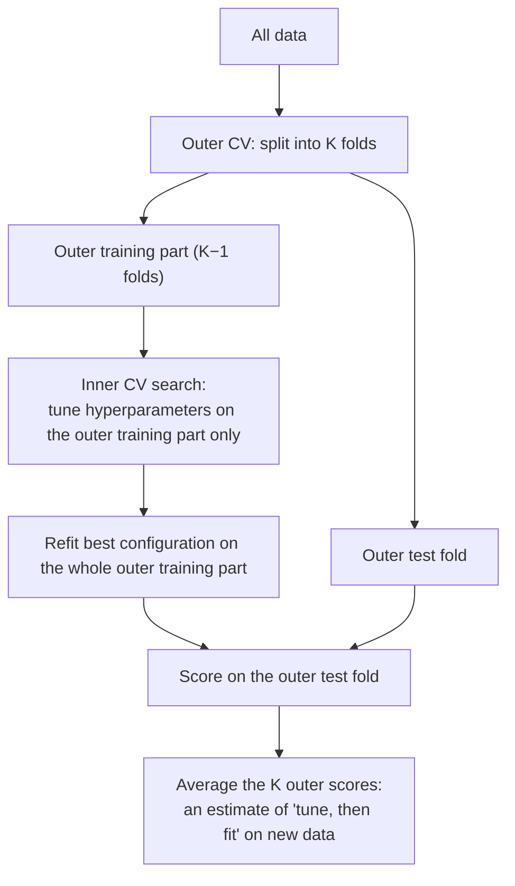
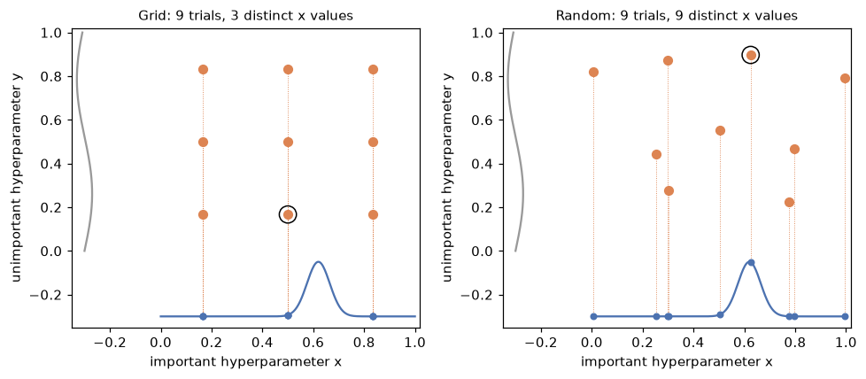
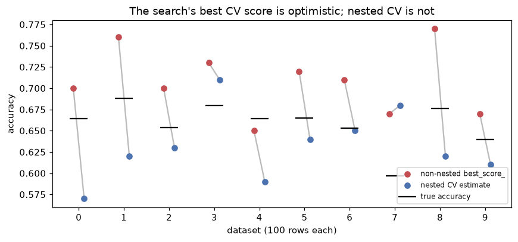

# Hyperparameter tuning

> **Level 5 · Chapter 2** · ⏱️ ~60 min read · Prerequisites: [ML pipelines](01-ml-pipelines.md), [Generalization and the bias-variance trade-off](../03-ml-fundamentals/04-generalization-bias-variance.md), and [Regularization](../03-ml-fundamentals/05-regularization.md)

Every model has settings you choose before training: the regularization strength, the tree depth, the learning rate. This chapter covers how to search for good settings efficiently (grid search, random search, Bayesian optimization with Optuna, pruning, and successive halving) and, just as important, how to report the result honestly with nested cross-validation, so the search itself doesn't fool you.

## Why it matters

Priya's team ran a Kaggle-style internal competition to predict equipment failures. The dataset was small, about 600 labeled machines. Over two weeks, Priya tried gradient boosting, SVMs, and random forests, each with hundreds of hyperparameter combinations, always scoring with the same 5-fold cross-validation. The best configuration reached 0.81 accuracy. Priya reported 0.81 to the operations manager, who planned staffing around it.

When the model ran on the next quarter's machines, accuracy was 0.73. The model wasn't broken, and the data hadn't changed. The number 0.81 was the *maximum* of about 1,500 noisy estimates, and the maximum of many noisy numbers is biased upward. Some of those configurations scored well because their cross-validation folds happened to suit them, and Priya picked the luckiest.

Tuning is a search, and every search over noisy scores overestimates the winner. This chapter teaches you to search well *and* to measure the result with a procedure that accounts for the search.

## Concepts

### What tuning optimizes

A **hyperparameter** is a setting fixed before training that controls *how* the model learns, such as the penalty $C$ of an SVM or the `max_depth` of a tree. **Parameters**, in contrast, are learned by `fit` (weights, split thresholds). Write the hyperparameters as a vector $\lambda$ from a **search space** $\Lambda$. Tuning tries to solve

$$
\lambda^\star = \arg\max_{\lambda \in \Lambda} f(\lambda), \qquad f(\lambda) = \text{CV score of the model trained with } \lambda .
$$

This is an unusual optimization problem. $f$ is **expensive** (each evaluation is $k$ model fits), **noisy** (a different fold split gives a different score), has **no gradient** (you can't differentiate a cross-validation score with respect to `max_depth`), and is **mixed-type** (continuous, integer, and categorical dimensions, sometimes conditional on each other). Methods for this are called **black-box optimization**.

Choosing the search space matters as much as the search method:

- **Use log scales for scale-like parameters.** The difference between $C = 0.01$ and $C = 0.1$ matters as much as the difference between $10$ and $100$. Searching $C$ uniformly in $[0.01, 100]$ spends 90% of the samples above 10. Search $\log_{10} C$ uniformly in $[-2, 2]$ instead, which is a **log-uniform** distribution.
- **Use sensible bounds** from experience or the docs, then widen them if the best value lands at an edge.
- **Tune only what matters.** Each extra dimension makes the search harder. Learning rate, regularization, and model capacity usually matter most; many parameters barely matter.

### Grid search

**Grid search** evaluates every combination of a list of values per hyperparameter. With $p$ hyperparameters and $m$ values each, that's $m^p$ configurations, each costing $k$ fits. The cost grows exponentially in $p$: 5 values for 5 hyperparameters is 3,125 configurations, or 15,625 fits with 5-fold CV.

Grid search is simple, parallel, and reproducible, and it's fine for one or two hyperparameters. Its flaw is subtler than cost, and it's the core of the next section.

### Random search, and why it beats grid search

**Random search** samples each configuration independently from a distribution over the search space (for example, log-uniform for $C$). You choose the budget $n$ directly, independent of the number of dimensions.

James Bergstra and Yoshua Bengio (2012) explained why random search usually *finds better configurations than grid search for the same budget*. Their key observation is **low effective dimensionality**: for most models and datasets, only a few hyperparameters matter much, and which ones matter differs between datasets, so you can't know in advance.

Picture two hyperparameters, one important and one nearly irrelevant, and a budget of 9 evaluations. A $3 \times 3$ grid tests only **3 distinct values** of the important hyperparameter, each three times (once per value of the irrelevant one). Those repeats are wasted. Nine random points test **9 distinct values** of the important hyperparameter, because no two random points share a coordinate. Projected onto the dimension that matters, random search explores three times as finely. With more irrelevant dimensions, the advantage grows: a grid of $m^p$ points only ever tests $m$ values of each dimension, while $n$ random points test $n$ values of every dimension.

There's also a clean guarantee. Suppose the configurations in the top fraction $q$ of the search space (say $q = 0.05$, the best 5%) are "good enough". Each random sample independently lands there with probability $q$, so the probability that at least one of $n$ samples does is

$$
P(\text{at least one in the top } q) = 1 - (1 - q)^n .
$$

Setting this to a target probability $P$ and solving gives $n = \ln(1 - P) / \ln(1 - q)$. For $q = 0.05$ and $P = 0.95$, that's $n = \ln 0.05 / \ln 0.95 \approx 58.4$, so **60 random trials find a top-5% configuration with 95% probability, regardless of the number of dimensions**. No grid can promise that.

### Bayesian optimization

Random search ignores everything it has learned. After 30 trials, you know that large learning rates did badly, yet trial 31 is as likely to try one as trial 1 was. **Bayesian optimization** uses past results to choose the next trial. It has two parts:

1. A **surrogate model**: a cheap probabilistic model of $f(\lambda)$, fit to the trials so far, that predicts both a value and its uncertainty at untried points.
2. An **acquisition function**: a rule that uses the surrogate to score candidate points, trading off **exploitation** (try near the best so far) against **exploration** (try where the surrogate is uncertain).

A common acquisition function is **expected improvement**. If $f^\star$ is the best score so far, then

$$
\text{EI}(\lambda) = \mathbb{E}\left[\max\big(f(\lambda) - f^\star, 0\big)\right],
$$

the average amount by which $\lambda$ would beat the current best, counting no improvement as zero. A point with a high predicted value, or with a modest prediction but large uncertainty, can both have high EI.

The classic surrogate is a **Gaussian process**, which is elegant for a handful of continuous hyperparameters. Optuna's default sampler uses a different surrogate that handles integers, categories, and conditional spaces naturally: the Tree-structured Parzen Estimator.

### The Tree-structured Parzen Estimator (TPE)

**TPE** (Bergstra et al., 2011) flips the modeling around. Instead of modeling the score given the hyperparameters, $p(y \mid \lambda)$, it models the hyperparameters given the score:

1. Sort the trials so far by score, and split them at a quantile: the best fraction $\gamma$ (for example, 25%) are "good", the rest are "bad".
2. Fit a density to the good trials' hyperparameters, $\ell(\lambda) = p(\lambda \mid \text{good})$, and another to the bad ones, $g(\lambda) = p(\lambda \mid \text{bad})$. Each density is a **Parzen estimator**: a sum of small bell curves, one centered on each observed point (a kernel density estimate).
3. Draw candidates from $\ell$, and choose the candidate that maximizes the ratio $\ell(\lambda) / g(\lambda)$.

The intuition is direct: pick a point that looks like past good trials and unlike past bad ones. Bergstra et al. showed that this is also principled: under the TPE model, expected improvement is

$$
\text{EI}(\lambda) \propto \left(\gamma + (1 - \gamma)\frac{g(\lambda)}{\ell(\lambda)}\right)^{-1},
$$

which increases as $\ell(\lambda)/g(\lambda)$ increases. So maximizing the ratio is maximizing expected improvement. The "tree-structured" part means each hyperparameter gets its own one-dimensional density, and densities for conditional hyperparameters (like `gamma`, which exists only if `kernel="rbf"`) are fit only on trials where they exist. That keeps TPE cheap and lets it handle messy search spaces.

TPE needs some data before its densities mean anything, so it starts with a few random trials (10 by default in Optuna).

### Early stopping and pruning

Many models are trained iteratively, and their validation score after a few iterations already hints at the final score. A trial whose learning curve is clearly worse than others' after 3 epochs rarely recovers by epoch 20. **Pruning** stops such trials early, freeing the budget for promising ones.

Optuna's **`MedianPruner`** uses a simple rule: at step $t$, stop a trial if its intermediate score is worse than the median of the scores that earlier trials reported at the same step $t$. To use it, the objective reports intermediate values with `trial.report(score, step)` and asks `trial.should_prune()`. Two settings protect against pruning too eagerly: `n_startup_trials` (don't prune until this many trials have finished) and `n_warmup_steps` (don't prune any trial before this step).

A related idea lives inside single models: **early stopping** halts training when a validation score stops improving (for example, `HistGradientBoostingClassifier(early_stopping=True, n_iter_no_change=10)`). Early stopping chooses the number of iterations; pruning chooses which configurations deserve full training.

### Successive halving

**Successive halving** (Jamieson and Talwalkar, 2016) applies the pruning idea to a whole population at once. Start with many candidates, each given a small **resource** budget: few training samples, few boosting iterations, or few epochs. Evaluate them all, keep the best $1/\eta$ fraction, multiply their budget by $\eta$, and repeat until one candidate (or a few) remain at full budget. The factor $\eta$ (often 3) controls aggressiveness.

The cost is easy to work out. With $n$ candidates, a minimum resource $r$, and factor $\eta$, round $i$ (starting at 0) runs $n/\eta^i$ candidates with resource $r\eta^i$, so each round costs

$$
\frac{n}{\eta^i} \cdot r\eta^i = n r ,
$$

the same in every round. There are about $\log_\eta n$ rounds, so the total is roughly $n r \log_\eta n$. Evaluating all $n$ candidates at the full resource $R = r\eta^{\log_\eta n} = rn$ would cost $n \cdot rn$. For $n = 81$ and $\eta = 3$, that's $81r \times 4$ rounds $= 324r$ against $81 \times 81 r = 6{,}561r$, about 20 times cheaper.

The risk is **low-fidelity bias**: a configuration that does well with 150 samples (a simple, heavily regularized one) might not be the best with 5,000. Successive halving works best when rankings at small budgets roughly predict rankings at full budget. **Hyperband** (Li et al., 2018) hedges by running successive halving several times with different starting budgets. scikit-learn provides `HalvingGridSearchCV` and `HalvingRandomSearchCV`; Optuna provides `SuccessiveHalvingPruner` and `HyperbandPruner`.

### Overfitting the validation set

Back to Priya's 0.81. Suppose you evaluate $k$ configurations whose true accuracies are all equal to $\mu$, and each CV estimate is that true value plus independent noise with standard deviation $\sigma$. Each estimate is unbiased, but the *maximum* is not. For $k$ independent normal variables, a standard result from extreme value theory gives, approximately for large $k$,

$$
\mathbb{E}\left[\max_{i \le k} \hat{f}_i\right] \approx \mu + \sigma\sqrt{2 \ln k} .
$$

With $\sigma = 0.02$ (typical for a few hundred rows) and $k = 100$ configurations, the winner's expected score is inflated by about $0.02 \times \sqrt{9.2} \approx 0.06$, even though no configuration is better than any other. Real configurations are correlated and differ in true quality, so the inflation is usually smaller, but it never vanishes. This is the **winner's curse**, and the best CV score from a search (`best_score_` in scikit-learn) is subject to it. The search has **overfit the validation set**: the selection used the same noisy scores you're reporting.

The cure is the same as for any overfitting: evaluate on data that played no part in the choice.

### Nested cross-validation

**Nested cross-validation** wraps the entire tuning procedure inside an outer cross-validation loop:



Each outer test fold is never seen by the inner search that produced the model it scores. So the average outer score is an honest estimate of how well the **whole procedure** ("run this search, then fit the winner") does on new data.

Three points confuse people:

- **Nested CV evaluates a procedure, not a configuration.** Different outer folds may pick different hyperparameters. That's fine. You're estimating how well your tuning *recipe* works.
- **The final model** comes from running the inner search once more on all the data. Its expected performance is the nested CV estimate.
- **Cost.** With $K$ outer folds, $k$ inner folds, and $m$ configurations, nested CV costs $K \times (k \times m + 1)$ fits. It's expensive, but for small datasets, where the winner's curse is largest, the models are cheap.

A simpler alternative, when data allows, is a **held-out test set**: tune with CV on the training part, then score the winner once on the test set. That's nested validation with one outer "fold". The test set must be used once. If you look at the test score, go back and tune more, and look again, the test set has become a validation set, and its score inherits the winner's curse.

### Practical rules against fooling yourself

- Report a score that played no part in selection: nested CV, or a test set touched once.
- Fix the search budget and space *before* you start, and keep a log of everything you tried (experiment tracking, in the [production chapter](05-ml-in-production.md), makes this automatic).
- When scores are within noise of each other, prefer the simpler or more regularized configuration. A common rule of thumb is the **one-standard-error rule**: pick the simplest model whose score is within one standard error of the best.
- Use repeated CV (`RepeatedStratifiedKFold`) on small data to reduce the noise in each estimate.
- Never tune the random seed. A seed that "scores best" is pure winner's curse.

## In practice

### The data and a baseline

The examples use a synthetic binary classification problem with a nonlinear signal (a squared term and an interaction) in 3 of 10 features. Because it's synthetic, you can draw a large fresh sample and measure each model's *true* accuracy, which is how you'll catch the winner's curse in the act.

```python
import time
import warnings

import numpy as np
import optuna
from scipy.stats import loguniform
from sklearn.model_selection import (GridSearchCV, RandomizedSearchCV, StratifiedKFold,
                                     cross_val_score)
from sklearn.pipeline import make_pipeline
from sklearn.preprocessing import StandardScaler
from sklearn.svm import SVC

optuna.logging.set_verbosity(optuna.logging.WARNING)   # silence per-trial log lines


def make_data(n, seed):
    """10 features; the label depends on x0, x1 squared, and the x2*x3 interaction."""
    rng = np.random.default_rng(seed)
    X = rng.normal(size=(n, 10))
    logit = 1.5 * X[:, 0] - 1.0 * X[:, 1] ** 2 + X[:, 2] * X[:, 3] + 0.5
    y = (rng.random(n) < 1 / (1 + np.exp(-logit))).astype(int)
    return X, y


X, y = make_data(800, seed=0)
X_new, y_new = make_data(5000, seed=1)          # stands in for "the future"
cv = StratifiedKFold(5, shuffle=True, random_state=0)

base = make_pipeline(StandardScaler(), SVC())   # defaults: C=1, gamma="scale"
print(f"default SVC: CV accuracy {cross_val_score(base, X, y, cv=cv).mean():.3f}")
```

```text
default SVC: CV accuracy 0.758
```

### Grid search versus random search

Give both methods the same budget: 25 configurations of the RBF SVM's $C$ and $\gamma$, each scored with 5-fold CV.

```python
results = {}

grid = GridSearchCV(base, {"svc__C": np.logspace(-2, 2, 5),        # 0.01 ... 100
                           "svc__gamma": np.logspace(-3, 1, 5)},   # 0.001 ... 10
                    cv=cv)
grid.fit(X, y)
results["grid"] = (grid.best_score_, grid.score(X_new, y_new), grid.best_params_)

rand = RandomizedSearchCV(base, {"svc__C": loguniform(1e-2, 1e2),
                                 "svc__gamma": loguniform(1e-3, 1e1)},
                          n_iter=25, cv=cv, random_state=0)
rand.fit(X, y)
results["random"] = (rand.best_score_, rand.score(X_new, y_new), rand.best_params_)

for name, (cv_acc, new_acc, params) in results.items():
    shown = {k.split("__")[1]: round(float(v), 4) for k, v in params.items()}
    print(f"{name:7s} best CV {cv_acc:.3f}   on new data {new_acc:.3f}   {shown}")
```

```text
grid    best CV 0.758   on new data 0.740   {'C': 1.0, 'gamma': 0.1}
random  best CV 0.759   on new data 0.736   {'C': 1.2229, 'gamma': 0.0456}
```

With only two hyperparameters, both of which matter, the two methods tie: both best CV scores are within noise of each other. Notice something humbling, too: the grid's winner, $C = 1$ and $\gamma = 0.1$, is exactly the default model (after standardizing 10 features, `gamma="scale"` works out to $1/10$), and the baseline also scored 0.758. Good defaults are often hard to beat by much, which is why you record the baseline first. Random search's advantage grows with the number of dimensions, and especially with dimensions that turn out not to matter. Notice also that both "best CV" scores are higher than the scores on new data. Hold that thought.

The picture below shows Bergstra and Bengio's argument directly. The function to maximize depends strongly on $x$ and barely on $y$; the curves along the edges show how each dimension's projection is explored.

```python
import matplotlib.pyplot as plt

rng = np.random.default_rng(7)
important = lambda x: np.exp(-((x - 0.62) ** 2) / 0.004)      # sharp peak in x
grid_pts = np.array([(a, b) for a in (1/6, 3/6, 5/6) for b in (1/6, 3/6, 5/6)])
rand_pts = rng.random((9, 2))
xs = np.linspace(0, 1, 300)

fig, axes = plt.subplots(1, 2, figsize=(9, 4))
for ax, pts, title in [(axes[0], grid_pts, "Grid: 9 trials, 3 distinct x values"),
                       (axes[1], rand_pts, "Random: 9 trials, 9 distinct x values")]:
    ax.plot(xs, 0.25 * important(xs) - 0.3, color="#4C72B0")          # important dimension
    ax.plot(-0.3 + 0.03 * np.sin(6 * xs), xs, color="#999999")         # unimportant dimension
    ax.scatter(pts[:, 0], pts[:, 1], color="#DD8452", s=40, zorder=3)
    curve_y = 0.25 * important(pts[:, 0]) - 0.3                       # each trial's projection
    ax.vlines(pts[:, 0], curve_y, pts[:, 1], color="#DD8452", lw=0.6, ls=":")
    ax.scatter(pts[:, 0], curve_y, color="#4C72B0", s=18, zorder=3)
    best = pts[np.argmax(important(pts[:, 0]))]
    ax.scatter(*best, s=160, facecolors="none", edgecolors="black", zorder=4)
    ax.set_xlim(-0.35, 1.02); ax.set_ylim(-0.35, 1.02)
    ax.set_xlabel("important hyperparameter x"); ax.set_ylabel("unimportant hyperparameter y")
    ax.set_title(title, fontsize=10)
plt.tight_layout()
plt.show()
```



*Projected onto the dimension that matters (the blue curve along the bottom, with each trial's projection marked), a grid wastes trials on repeated values. Random points each test a new value. The circled point is each method's best. With only 9 trials, random search isn't guaranteed to land near the peak; it just gets three times as many chances.*

### TPE from scratch

Here is TPE's core loop on a one-dimensional problem: maximize $f(x) = -(x - 2)^2 + 0.5\sin(5x)$ on $[-5, 5]$. It uses a fixed-bandwidth Parzen estimator (a sum of normal bumps) for $\ell$ and $g$, plus a little uniform "prior" mass so that $g$ never reaches zero.

```python
from scipy.stats import norm

def f(x):
    return -(x - 2) ** 2 + 0.5 * np.sin(5 * x)

lo, hi = -5.0, 5.0

def parzen(points, x, bw=0.5):
    """Mixture of normal bumps at the points, plus 10% uniform mass on [lo, hi]."""
    bumps = norm.pdf(x[:, None], loc=np.asarray(points)[None, :], scale=bw).mean(axis=1)
    return 0.9 * bumps + 0.1 / (hi - lo)

def tpe(n_trials=30, n_startup=8, gamma=0.25, n_candidates=24, seed=0):
    rng = np.random.default_rng(seed)
    xs = list(rng.uniform(lo, hi, n_startup))                  # random startup trials
    ys = [f(x) for x in xs]
    while len(xs) < n_trials:
        order = np.argsort(ys)[::-1]                           # best first
        n_good = max(1, int(np.ceil(gamma * len(xs))))
        good = np.array(xs)[order[:n_good]]
        bad = np.array(xs)[order[n_good:]]
        # sample candidates from l(x): pick a good point, add noise
        cand = np.clip(rng.choice(good, n_candidates) + rng.normal(0, 0.5, n_candidates), lo, hi)
        ratio = parzen(good, cand) / parzen(bad, cand)        # l(x) / g(x)
        x_next = cand[np.argmax(ratio)]
        xs.append(x_next)
        ys.append(f(x_next))
    return np.array(xs), np.array(ys)

xs_tpe, ys_tpe = tpe()
xs_rand = np.random.default_rng(0).uniform(lo, hi, 30)
grid_x = np.linspace(lo, hi, 100_001)
x_star = grid_x[np.argmax(f(grid_x))]
print(f"true optimum x* = {x_star:.3f}, f = {f(x_star):.3f}")
print(f"TPE    best f = {ys_tpe.max():.3f}; trials within 0.5 of x*: {np.sum(abs(xs_tpe - x_star) < 0.5)}/30")
print(f"random best f = {f(xs_rand).max():.3f}; trials within 0.5 of x*: {np.sum(abs(xs_rand - x_star) < 0.5)}/30")
```

```text
true optimum x* = 1.631, f = 0.341
TPE    best f = 0.341; trials within 0.5 of x*: 23/30
random best f = 0.303; trials within 0.5 of x*: 6/30
```

After the startup trials, TPE spends most of its budget near the optimum, while random search keeps spreading evenly. That concentration is the payoff of a surrogate. It's also the risk: if the early good trials sit on a local optimum, TPE can over-exploit it, which is why the uniform prior mass and the random startup trials matter.

### Optuna: define-by-run tuning

**Optuna** is a widely used tuning library. Its central idea is **define-by-run**: you write an ordinary Python function that receives a `trial` object and *asks* it for values as it goes, so the search space can depend on earlier choices. The function returns the score. A **study** runs the optimization.

```python
def objective(trial):
    C = trial.suggest_float("C", 1e-2, 1e2, log=True)          # log-uniform
    gamma = trial.suggest_float("gamma", 1e-3, 1e1, log=True)
    model = make_pipeline(StandardScaler(), SVC(C=C, gamma=gamma))
    return cross_val_score(model, X, y, cv=cv).mean()

study = optuna.create_study(direction="maximize", sampler=optuna.samplers.TPESampler(seed=1))
study.optimize(objective, n_trials=25)

best_model = make_pipeline(StandardScaler(), SVC(**study.best_params)).fit(X, y)
results["optuna TPE"] = (study.best_value, best_model.score(X_new, y_new), study.best_params)
print(f"best CV {study.best_value:.3f}  on new data {results['optuna TPE'][1]:.3f}  "
      f"{ {k: round(v, 4) for k, v in study.best_params.items()} }")
print(study.trials_dataframe()[["number", "value", "params_C", "params_gamma"]]
      .sort_values("value", ascending=False).head(4).round(4).to_string(index=False))
```

```text
best CV 0.764  on new data 0.741  {'C': 17.2171, 'gamma': 0.0106}
 number  value  params_C  params_gamma
     22 0.7638   17.2171        0.0106
     11 0.7625   14.5160        0.0125
     12 0.7600   18.9584        0.0127
     10 0.7550   23.4077        0.0161
```

After its random startup trials, TPE concentrated on one region: the top four trials all have $C$ between about 14 and 24 and $\gamma$ between 0.010 and 0.016. (In an RBF SVM, $C$ and $\gamma$ trade off, so good configurations form a diagonal ridge running from small $C$ with large $\gamma$ to large $C$ with small $\gamma$; the grid and random winners sit elsewhere on that ridge.) On this two-dimensional problem, all three methods end up within noise of each other on new data. Bayesian optimization pays off when each trial is expensive and the space has more dimensions.

Define-by-run makes **conditional spaces** natural. To let the search choose the model family too:

<!-- skip-run -->
```python
def objective(trial):
    family = trial.suggest_categorical("family", ["svc", "logreg"])
    if family == "svc":                                   # these parameters exist only for SVC
        model = SVC(C=trial.suggest_float("svc_C", 1e-2, 1e2, log=True),
                    gamma=trial.suggest_float("gamma", 1e-3, 1e1, log=True))
    else:
        model = LogisticRegression(C=trial.suggest_float("lr_C", 1e-3, 1e2, log=True), max_iter=1000)
    return cross_val_score(make_pipeline(StandardScaler(), model), X, y, cv=cv).mean()
```

### Pruning unpromising trials

Pruning needs an iterative model that can report progress. Here, an `SGDClassifier` (logistic loss) trains on the handwritten digits one epoch at a time with `partial_fit`, and reports validation accuracy after each epoch. The `MedianPruner` stops trials that fall below the running median.

```python
from sklearn.datasets import load_digits
from sklearn.linear_model import SGDClassifier
from sklearn.model_selection import train_test_split

Xd, yd = load_digits(return_X_y=True)
Xd_tr, Xd_va, yd_tr, yd_va = train_test_split(Xd, yd, test_size=0.3, stratify=yd, random_state=0)
scaler = StandardScaler().fit(Xd_tr)
Xd_tr, Xd_va = scaler.transform(Xd_tr), scaler.transform(Xd_va)
classes = np.unique(yd_tr)
EPOCHS = 20

def sgd_objective(trial):
    clf = SGDClassifier(loss="log_loss", learning_rate="constant", random_state=0,
                        alpha=trial.suggest_float("alpha", 1e-6, 1e-1, log=True),
                        eta0=trial.suggest_float("eta0", 1e-4, 1.0, log=True))
    for epoch in range(EPOCHS):
        clf.partial_fit(Xd_tr, yd_tr, classes=classes)
        acc = clf.score(Xd_va, yd_va)
        trial.report(acc, step=epoch)           # tell Optuna the intermediate value
        if trial.should_prune():                # below the median of earlier trials at this epoch?
            raise optuna.TrialPruned()
    return acc

study_p = optuna.create_study(direction="maximize", sampler=optuna.samplers.TPESampler(seed=0),
                              pruner=optuna.pruners.MedianPruner(n_startup_trials=5, n_warmup_steps=3))
study_p.optimize(sgd_objective, n_trials=40)

states = [t.state for t in study_p.trials]
pruned = states.count(optuna.trial.TrialState.PRUNED)
epochs_run = sum(len(t.intermediate_values) for t in study_p.trials)
print(f"best accuracy {study_p.best_value:.3f}; pruned {pruned}/40 trials; "
      f"epochs run {epochs_run} of {40 * EPOCHS} ({epochs_run / (40 * EPOCHS):.0%})")
```

```text
best accuracy 0.969; pruned 31/40 trials; epochs run 350 of 800 (44%)
```

Most trials were stopped after a few epochs, so the study did less than half the training work of an unpruned search. Pruning is a heuristic: a slow starter that would have finished first can be cut. `n_warmup_steps` guards against judging too early.

!!! warning "Common mistake: reporting the validation score as the final score"
    Pruning and model selection here both use the validation split, so `study_p.best_value` carries the winner's curse. Report performance on a separate test set, or with nested CV.

### Successive halving with scikit-learn

`HalvingRandomSearchCV` samples candidates like `RandomizedSearchCV`, but runs them in rounds. Here, the resource is the number of training samples: 81 candidates start with 150 samples each, and each round keeps the best third and triples the sample size.

```python
from sklearn.experimental import enable_halving_search_cv  # noqa: F401 (enables the import below)
from sklearn.model_selection import HalvingRandomSearchCV

X_big, y_big = make_data(4000, seed=2)
halving = HalvingRandomSearchCV(
    base, {"svc__C": loguniform(1e-2, 1e2), "svc__gamma": loguniform(1e-3, 1e1)},
    n_candidates=81, factor=3, resource="n_samples", min_resources=150,
    cv=cv, random_state=0,
)
halving.fit(X_big, y_big)
for i, (n_cand, n_res) in enumerate(zip(halving.n_candidates_, halving.n_resources_)):
    print(f"round {i}: {n_cand:2d} candidates x {n_res:4d} samples = {n_cand * n_res:6,d} sample-fits per fold")
print(f"best CV {halving.best_score_:.3f} with "
      f"{ {k.split('__')[1]: round(float(v), 4) for k, v in halving.best_params_.items()} }")
```

```text
round 0: 81 candidates x  150 samples = 12,150 sample-fits per fold
round 1: 27 candidates x  450 samples = 12,150 sample-fits per fold
round 2:  9 candidates x 1350 samples = 12,150 sample-fits per fold
best CV 0.766 with {'C': 1.2229, 'gamma': 0.0456}
```

Each round costs the same, exactly as the math predicted. Evaluating all 81 candidates on 1,350 samples would have cost $81 \times 1350 = 109{,}350$ sample-fits per fold, three times the total here, and on the full 4,000 samples far more. (Kernel SVMs' cost grows faster than linearly in the sample count, so the real savings are larger still.) The search stopped at 1,350 samples because another round would have needed more than the 4,000 available; scikit-learn then refits the winner on all the data.

### Catching the winner's curse with nested cross-validation

Now the experiment from the story. Take ten small datasets (100 rows each) from the same generator. On each, run a grid search over 25 SVM configurations and record three numbers:

1. **Non-nested**: the grid search's `best_score_`, what you'd naively report.
2. **Nested**: the average outer score of nested 5×5 cross-validation.
3. **True**: the selected model's accuracy on 20,000 fresh rows.

```python
X_truth, y_truth = make_data(20_000, seed=999)
param_grid = {"svc__C": np.logspace(-2, 2, 5), "svc__gamma": np.logspace(-3, 1, 5)}

rows = []
for rep in range(10):
    Xs, ys = make_data(100, seed=rep)
    inner = StratifiedKFold(5, shuffle=True, random_state=rep)
    outer = StratifiedKFold(5, shuffle=True, random_state=100 + rep)
    search = GridSearchCV(base, param_grid, cv=inner)
    search.fit(Xs, ys)                                            # tune on all 100 rows
    non_nested = search.best_score_
    true_acc = search.score(X_truth, y_truth)
    nested = cross_val_score(GridSearchCV(base, param_grid, cv=inner), Xs, ys, cv=outer).mean()
    rows.append((non_nested, nested, true_acc))

rows = np.array(rows)
print("            non-nested  nested   true")
print(f"mean        {rows[:, 0].mean():10.3f} {rows[:, 1].mean():7.3f} {rows[:, 2].mean():6.3f}")
print(f"mean error  {(rows[:, 0] - rows[:, 2]).mean():+10.3f} {(rows[:, 1] - rows[:, 2]).mean():+7.3f}")
print(f"non-nested above true in {np.sum(rows[:, 0] > rows[:, 2])}/10 datasets")
```

```text
            non-nested  nested   true
mean             0.708   0.632  0.658
mean error      +0.050  -0.026
non-nested above true in 9/10 datasets
```

The non-nested score overstates true accuracy by 5 points on average and is too high in 9 of 10 datasets. The nested estimate errs the other way, by about 3 points. That small pessimism is expected and well understood: each outer model is tuned and trained on 80 rows instead of 100, and less data means a slightly worse model. A conservative estimate is far safer to plan around than an optimistic one, and on any single dataset the nested estimate is noisy (100 rows is little data) rather than systematically inflated.

```python
fig, ax = plt.subplots(figsize=(8, 3.8))
reps = np.arange(10)
ax.scatter(reps - 0.12, rows[:, 0], color="#C44E52", label="non-nested best_score_", zorder=3)
ax.scatter(reps + 0.12, rows[:, 1], color="#4C72B0", label="nested CV estimate", zorder=3)
ax.scatter(reps, rows[:, 2], color="black", marker="_", s=400, label="true accuracy", zorder=4)
for r in reps:
    ax.plot([r - 0.12, r + 0.12], [rows[r, 0], rows[r, 1]], color="#BBBBBB", zorder=1)
ax.set_xticks(reps)
ax.set_xlabel("dataset (100 rows each)")
ax.set_ylabel("accuracy")
ax.set_title("The search's best CV score is optimistic; nested CV is not")
ax.legend(fontsize=8, loc="lower right")
plt.tight_layout()
plt.show()
```



*Red sits above black almost every time: that's selection bias. Blue scatters around black, slightly below on average: that's ordinary estimation noise plus the mild pessimism of training on less data.*

!!! warning "Common mistake: tuning and evaluating on the same folds"
    `GridSearchCV(...).fit(X, y)` followed by reporting `best_score_` is the most common way tuned models get oversold. The more configurations you try and the smaller the dataset, the bigger the gap. Report nested CV, or a test score from data the search never saw.

### A practical tuning recipe

1. Build the whole thing as a pipeline, so preprocessing is tuned and evaluated with the model.
2. Split off a test set (or plan nested CV for small data).
3. Start with a sensible default model and record its score: tuning should beat it.
4. Choose a search space with log scales and sensible bounds, and fix a budget.
5. Use random search for a quick first pass, or Optuna's TPE when trials are expensive. Add pruning or successive halving when the model trains iteratively or the data is large.
6. Check that the best values aren't at the edge of the space; widen and rerun if they are.
7. Refit the winner on all training data, and report the test score (or nested CV) once.

## Exercises

### Exercise 1: Budgets by hand (easy)

(a) A grid has 6 values for each of 4 hyperparameters. With 5-fold CV, how many model fits does it take? (b) How many random trials do you need to hit the top 2% of the space with 99% probability? (c) With that many random trials, how many distinct values of each hyperparameter do you test, compared with the grid?

??? success "Solution"

    (a) $6^4 = 1{,}296$ configurations, times 5 folds, is 6,480 fits (plus one refit).

    (b) $n = \ln(1 - 0.99)/\ln(1 - 0.02) = \ln 0.01/\ln 0.98 \approx -4.605/-0.0202 \approx 228$ trials.

    (c) 228 distinct values of *every* hyperparameter (with probability 1 for continuous distributions), against 6 per hyperparameter for the grid, using about a sixth of the configurations.

### Exercise 2: Simulate the winner's curse (medium)

Simulate $k$ configurations that are all truly equal (accuracy 0.80) and whose CV estimates have noise $\sigma = 0.02$. For $k \in \{1, 10, 100, 1000\}$, estimate the expected maximum over 10,000 repetitions and compare it with $0.80 + \sigma\sqrt{2\ln k}$.

??? success "Solution"

    ```python
    import numpy as np

    rng = np.random.default_rng(0)
    for k in [1, 10, 100, 1000]:
        best = (0.80 + 0.02 * rng.standard_normal((10_000, k))).max(axis=1).mean()
        approx = 0.80 + 0.02 * np.sqrt(2 * np.log(k))
        print(f"k={k:5d}: simulated E[max] = {best:.4f}   approximation = {approx:.4f}")
    ```

    ```text
    k=    1: simulated E[max] = 0.8001   approximation = 0.8000
    k=   10: simulated E[max] = 0.8307   approximation = 0.8429
    k=  100: simulated E[max] = 0.8502   approximation = 0.8607
    k= 1000: simulated E[max] = 0.8648   approximation = 0.8743
    ```

    With 100 equal configurations, the "best" looks 5 points better than it is. The approximation $\sigma\sqrt{2 \ln k}$ is an upper-leaning, large-$k$ formula, so it overshoots a little, but it captures the growth: the bias increases with the log of the number of tries, without limit.

### Exercise 3: Successive halving budget (medium)

You have 243 candidates, $\eta = 3$, and a minimum resource of 100 samples. (a) How many rounds run until one candidate remains, and what resource does it get? (b) What's the total cost in sample-fits, compared with evaluating all 243 at that final resource?

??? success "Solution"

    (a) Candidates go $243 \to 81 \to 27 \to 9 \to 3 \to 1$: six rounds (indices 0 to 5), with resources $100, 300, 900, 2700, 8100, 24300$. The last candidate gets 24,300 samples.

    (b) Each round costs $243 \times 100 = 24{,}300$ sample-fits, so six rounds cost 145,800. Evaluating all 243 at 24,300 samples costs $243 \times 24{,}300 = 5{,}904{,}900$, about 40 times more. (In practice, the last round or two need more data than you have, so you'd stop earlier, as scikit-learn did above.)

### Exercise 4: A conditional search with pruning (medium)

Use Optuna to tune a `HistGradientBoostingClassifier` on `make_data(800, 0)`: `learning_rate` (log, 0.01 to 0.5), `max_leaf_nodes` (4 to 64), and `l2_regularization` (log, 1e-4 to 10). Train with `warm_start=True`, increasing `max_iter` by 20 at each of 5 steps, reporting validation accuracy and pruning with a `MedianPruner`. Run 20 trials and report how many were pruned.

??? success "Solution"

    ```python
    import numpy as np
    import optuna
    from sklearn.ensemble import HistGradientBoostingClassifier
    from sklearn.model_selection import train_test_split

    optuna.logging.set_verbosity(optuna.logging.WARNING)
    Xa, ya = make_data(800, 0)
    Xa_tr, Xa_va, ya_tr, ya_va = train_test_split(Xa, ya, test_size=0.25, stratify=ya, random_state=0)

    def hgb_objective(trial):
        clf = HistGradientBoostingClassifier(
            learning_rate=trial.suggest_float("learning_rate", 0.01, 0.5, log=True),
            max_leaf_nodes=trial.suggest_int("max_leaf_nodes", 4, 64),
            l2_regularization=trial.suggest_float("l2_regularization", 1e-4, 10, log=True),
            warm_start=True, early_stopping=False, random_state=0)
        for step in range(5):
            clf.set_params(max_iter=20 * (step + 1))        # add 20 more trees
            clf.fit(Xa_tr, ya_tr)
            acc = clf.score(Xa_va, ya_va)
            trial.report(acc, step)
            if trial.should_prune():
                raise optuna.TrialPruned()
        return acc

    st = optuna.create_study(direction="maximize", sampler=optuna.samplers.TPESampler(seed=0),
                             pruner=optuna.pruners.MedianPruner(n_startup_trials=5, n_warmup_steps=1))
    st.optimize(hgb_objective, n_trials=20)
    n_pruned = sum(t.state == optuna.trial.TrialState.PRUNED for t in st.trials)
    print(f"best {st.best_value:.3f}, pruned {n_pruned}/20")
    ```

    Your exact numbers depend on the run, but expect roughly half the trials to be pruned after one or two steps, and a best validation accuracy in the mid-0.7s. With `warm_start=True`, each `fit` adds trees to the existing ensemble instead of starting over, so reporting after each step costs little extra.

### Exercise 5: Which hyperparameters do you ship? (hard)

You ran nested 5-fold CV. The five outer folds chose $C$ values of 1, 10, 1, 100, and 10, and the nested estimate is $0.71 \pm 0.04$. (a) Which $C$ should the production model use? (b) What does the spread of chosen $C$ values tell you? (c) A colleague suggests using the most common choice, $C = 1$ (tied with 10), and reporting 0.71. Is that right?

??? success "Solution"

    (a) Run the inner search procedure once more on *all* the data, and ship whatever it selects. Nested CV estimated the performance of that procedure, so its estimate applies to the model the procedure produces.

    (b) The selection is unstable: the CV surface is probably flat across $C \in [1, 100]$, so the choice is driven by noise. That's reassuring for performance (many values work similarly) and a hint to prefer the more regularized end (by the one-standard-error rule), or to narrow the search.

    (c) Not exactly. 0.71 estimates the performance of "search, then fit", not of "fix $C = 1$, then fit". In practice the two are often close when the surface is flat, but picking $C$ by looking at the outer folds' choices uses outer information for selection, which reintroduces a little optimism. The clean version is (a).

## Check yourself

1. Why is tuning hyperparameters called black-box optimization?

    ??? note "Answer"

        The objective, a CV score as a function of the hyperparameters, can only be evaluated (expensively and noisily), not differentiated or written in closed form. The optimizer sees inputs and outputs, nothing inside.

2. State Bergstra and Bengio's argument for random search over grid search in one or two sentences.

    ??? note "Answer"

        Usually only a few hyperparameters matter, and you don't know which. A grid tests only a few distinct values of each one, wasting trials on repeats of the unimportant ones, while random search tests a new value of every hyperparameter in every trial.

3. How many random trials give a 95% chance of landing in the top 5% of configurations, and why doesn't the answer depend on dimension?

    ??? note "Answer"

        About 59 to 60, from $1 - 0.95^n \ge 0.95$. Each trial independently lands in the top 5% (a fraction of the space's probability mass) with probability 0.05, whatever the number of dimensions.

4. What does TPE model, and how does it choose the next trial?

    ??? note "Answer"

        It splits past trials into good (top $\gamma$) and bad, fits densities $\ell(\lambda)$ and $g(\lambda)$ to their hyperparameters, draws candidates from $\ell$, and picks the one maximizing $\ell(\lambda)/g(\lambda)$, which is equivalent to maximizing expected improvement under its model.

5. What does the `MedianPruner` do?

    ??? note "Answer"

        At each reported step, it stops a trial whose intermediate score is worse than the median of earlier trials' scores at the same step, after a few startup trials and warmup steps.

6. Why does every round of successive halving cost the same?

    ??? note "Answer"

        Round $i$ runs $n/\eta^i$ candidates with resource $r\eta^i$, so the product is $nr$ in every round: fewer candidates, proportionally more resources each.

7. Why is `best_score_` from a grid search optimistically biased, and how does nested CV fix it?

    ??? note "Answer"

        It's the maximum of many noisy estimates computed on the same folds used for selection, so it includes the luck of the winner (the winner's curse). Nested CV scores each tuned model on an outer fold that the inner search never saw, so selection and evaluation use separate data.

8. After nested CV, what model do you deploy?

    ??? note "Answer"

        The one produced by running the same inner tuning procedure on all the data. The nested estimate describes that procedure's expected performance.

## Key takeaways

- Tuning is noisy, expensive black-box optimization. Search on log scales, with sensible bounds, over the few hyperparameters that matter.
- Random search beats grid search for the same budget whenever some hyperparameters matter little, which is usual: it tests a new value of every dimension in every trial.
- Bayesian optimization uses past trials to choose the next one. Optuna's TPE does this by preferring points that look like past good trials and unlike bad ones.
- Pruning and successive halving save budget by stopping weak configurations early, at the risk of cutting slow starters.
- The best score from a search is biased upward by roughly $\sigma\sqrt{2 \ln k}$ at worst. Report nested CV or a once-touched test set instead.

## Further reading

- Bergstra and Bengio, "Random Search for Hyper-Parameter Optimization", *Journal of Machine Learning Research* 13 (2012).
- Bergstra, Bardenet, Bengio, and Kégl, "Algorithms for Hyper-Parameter Optimization", *NeurIPS* 2011 (introduces TPE).
- Li, Jamieson, DeSalvo, Rostamizadeh, and Talwalkar, "Hyperband: A Novel Bandit-Based Approach to Hyperparameter Optimization", *JMLR* 18 (2018).
- Cawley and Talbot, "On Over-fitting in Model Selection and Subsequent Selection Bias in Performance Evaluation", *JMLR* 11 (2010).
- [Optuna documentation](https://optuna.readthedocs.io/) and the scikit-learn User Guide, [Tuning the hyper-parameters of an estimator](https://scikit-learn.org/stable/modules/grid_search.html).

## Next

Tuning a model for accuracy goes wrong in a special way when one class is rare: the "best" model may never predict it. Next: [Imbalanced data](03-imbalanced-data.md).
