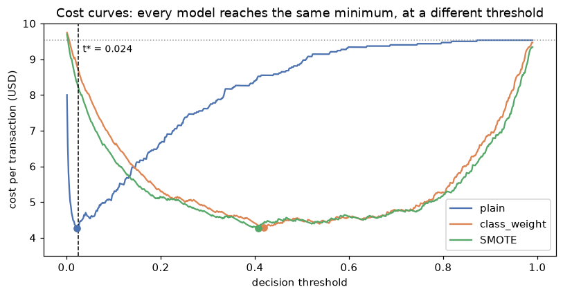
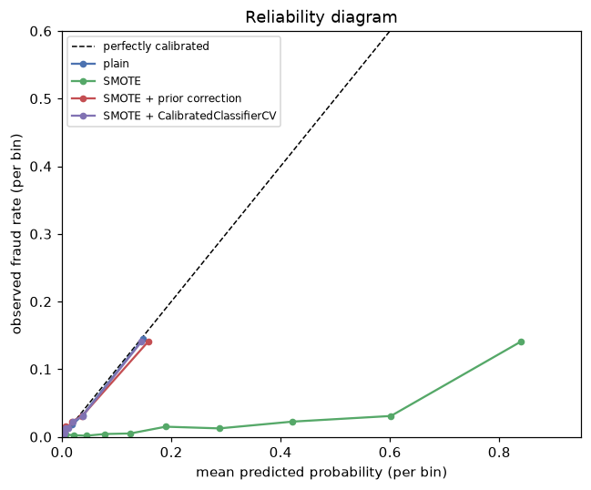

# Imbalanced data

> **Level 5 · Chapter 3** · ⏱️ ~55 min read · Prerequisites: [Evaluation metrics](../03-ml-fundamentals/06-evaluation-metrics.md), [Logistic regression and classification](../03-ml-fundamentals/03-logistic-regression.md), and [ML pipelines](01-ml-pipelines.md)

Fraud, disease, defaults, failures, clicks: the events worth predicting are often rare. This chapter explains why rare classes break naive models and metrics, and works through the fixes: the right metrics, class weights, resampling with SMOTE (inside a pipeline), threshold moving with cost curves, cost-sensitive learning, and recalibrating probabilities after you resample.

## Why it matters

Sam's first fraud model at a payments startup scored 97.7% accuracy on the test set, and Sam was proud of it until a colleague asked how many frauds it had caught. The answer was 19 out of 286. The model labeled almost everything "legitimate", and since 97.6% of transactions *were* legitimate, accuracy looked superb.

Sam's second attempt went the other way. A blog post said to "balance the classes with SMOTE", so Sam did, and recall jumped to 72%. But the model now flagged one transaction in five for review, the review team drowned, and the risk team noticed that transactions with a predicted "fraud probability" of about 0.40 were actually fraudulent about 2% of the time. Their loss forecasts, built on those probabilities, were off by a factor of ten.

Both models had the same ability to *rank* transactions by risk. What differed was the decision threshold and the meaning of the probabilities. Imbalanced problems are mostly about getting those two things right, and this chapter shows how, with costs in US dollars instead of accuracy.

## Concepts

### What imbalance is

A dataset is **imbalanced** when one class (the **minority** or **positive** class, usually the one you care about) is much rarer than the other (the **majority** or **negative** class). The **prevalence** or base rate $\pi = P(y = 1)$ might be 20% (churn), 2% (fraud), or 0.01% (some ad clicks). The **imbalance ratio** is the majority count over the minority count, $(1 - \pi)/\pi$.

Two separate things go wrong as $\pi$ shrinks, and it's worth keeping them apart:

1. **The decision problem.** With rare positives, the default threshold of 0.5 and accuracy are the wrong tools, even for a perfect probability model.
2. **The learning problem.** With few positive *examples* in absolute terms (say, 50), the model has little evidence about what positives look like, and its estimates are noisy.

Most "imbalance fixes" target the first problem. Nothing but more positive examples (or a simpler model) fixes the second. A dataset with 1% positives out of ten million rows (100,000 positives) is far easier than one with 10% positives out of 500 rows (50 positives).

### Why the default threshold fails

Logistic regression and most classifiers estimate $\hat{p}(x) = P(y = 1 \mid x)$ and predict positive when $\hat{p}(x) \ge 0.5$. That threshold minimizes the error rate (it's the **Bayes classifier** for 0-1 loss): if $p > 0.5$, the positive label is more likely to be right.

Now suppose fraud is 2.4% of transactions. Even a transaction with several red flags might have a 20% fraud probability, which is ten times the base rate and very suspicious, but still below 0.5. Few transactions ever reach $p > 0.5$, so the model flags almost nothing. That's not a bug in the model. It's the correct answer to the wrong question. Minimizing errors treats a missed fraud and a false alarm as equally bad, and they aren't.

The training loss tells the same story. The average log-loss over $n$ examples weighs each row equally, so with $\pi = 0.024$, 97.6% of the loss comes from negatives. The model is rewarded mainly for being confidently right about legitimate transactions.

### Metrics that respect imbalance

From the [metrics chapter](../03-ml-fundamentals/06-evaluation-metrics.md), with TP, FP, TN, FN the confusion matrix counts:

| Metric | Formula | What it answers |
|---|---|---|
| **Recall** (TPR, sensitivity) | $\frac{TP}{TP + FN}$ | What fraction of frauds did we catch? |
| **Precision** (PPV) | $\frac{TP}{TP + FP}$ | What fraction of flags were frauds? |
| **FPR** | $\frac{FP}{FP + TN}$ | What fraction of legitimate transactions did we flag? |
| **F1** | $\frac{2 \cdot \text{precision} \cdot \text{recall}}{\text{precision} + \text{recall}}$ | A single balance of the two |
| **Balanced accuracy** | $\frac{1}{2}(\text{TPR} + \text{TNR})$ | Accuracy with each class weighted equally |
| **Average precision** (PR-AUC) | area under the precision-recall curve | Ranking quality, focused on positives |
| **ROC AUC** | area under the TPR-vs-FPR curve | Ranking quality overall |

ROC AUC and PR-AUC behave very differently under imbalance, and the reason is in their definitions. TPR is computed only over positives and FPR only over negatives, so neither depends on the class ratio: if you doubled the number of negatives with the same distribution, the ROC curve wouldn't move. Precision mixes the two classes. By Bayes' rule,

$$
\text{precision} = \frac{\text{TPR}\cdot\pi}{\text{TPR}\cdot\pi + \text{FPR}\cdot(1 - \pi)} .
$$

Take a detector with TPR = 0.80 and FPR = 0.01, which sounds excellent. At $\pi = 0.5$, precision is $0.40/0.405 = 0.99$. At $\pi = 0.01$, it's $0.008/(0.008 + 0.0099) = 0.45$: more than half the flags are false alarms. ROC AUC hides this; the precision-recall curve shows it. A useful anchor: a random classifier has ROC AUC 0.5 but average precision equal to $\pi$, so an average precision of 0.25 at $\pi = 0.024$ is ten times better than chance.

Use ROC AUC to compare rankers when you care about both classes, average precision when positives are rare and what you do with flags matters, and, best of all, the **expected cost** of the decisions you'll actually make.

### Cost-sensitive decisions: the optimal threshold

Assign a cost to each kind of error. For fraud, a missed fraud (false negative) might cost USD 400 on average ($C_{FN} = 400$), and a false alarm (false positive), a manual review plus an annoyed customer, USD 10 ($C_{FP} = 10$). Correct decisions cost nothing (you can always shift costs so this holds).

For a transaction with fraud probability $p$, the expected cost of each action is

$$
\mathbb{E}[\text{cost} \mid \text{flag}] = (1 - p)\,C_{FP}, \qquad \mathbb{E}[\text{cost} \mid \text{pass}] = p\,C_{FN} .
$$

Flag when flagging is cheaper: $(1 - p)C_{FP} < p\,C_{FN}$. Solving for $p$,

$$
p > t^\star = \frac{C_{FP}}{C_{FP} + C_{FN}} .
$$

With USD 10 and USD 400, $t^\star = 10/410 \approx 0.024$. Flag any transaction with more than a 2.4% fraud probability. When costs are equal, $t^\star = 0.5$, which recovers the default. This is **threshold moving**, and it's the single most effective tool for imbalanced decisions. Note the precondition: the formula assumes $p$ is a *calibrated* probability. Keep that in mind for the calibration section.

A **cost curve** plots the average cost per example against the threshold. Its minimum is the best threshold for your model, and you'll plot one below.

### Class weights

Instead of moving the threshold after training, you can change the training objective. **Class weights** multiply each example's loss by a weight that depends on its class:

$$
\mathcal{L}_w(\theta) = \frac{1}{n}\sum_{i=1}^{n} w_{y_i}\,\ell\big(y_i, \hat{p}_\theta(x_i)\big),
$$

where $\ell$ is the per-example log-loss, $\theta$ the model parameters, and $w_0, w_1$ the class weights. scikit-learn's `class_weight="balanced"` sets $w_c = n / (K n_c)$, with $K$ classes and $n_c$ examples of class $c$, so that both classes contribute equally to the total loss.

What does weighting do to the predicted probabilities? Weighting positives by $w$ is like duplicating each positive $w$ times. Duplicating positives multiplies the odds of a positive by $w$ everywhere:

$$
\frac{\hat{p}_w(x)}{1 - \hat{p}_w(x)} = w \cdot \frac{p(x)}{1 - p(x)} .
$$

For logistic regression, multiplying the odds by $w$ simply adds $\ln w$ to the intercept. So the weighted model predicts positive ($\hat{p}_w > 0.5$, odds above 1) exactly when the original odds exceed $1/w$, that is, when $p(x) > 1/(1 + w)$. **For a well-specified model, class weighting is threshold moving in disguise.** Choosing $w = C_{FN}/C_{FP}$ makes the default 0.5 threshold land at $t^\star = C_{FP}/(C_{FP} + C_{FN})$. With finite data and a misspecified model, the equivalence is approximate, because the weights also change which errors the fit works hardest to avoid, and that can help or hurt a little.

The price is that the weighted model's probabilities are no longer probabilities of the real world: their odds are inflated by $w$.

### Resampling and SMOTE

**Resampling** changes the training data instead of the loss:

- **Random undersampling** drops majority examples until the classes are balanced (or some target ratio). It's fast and discards information.
- **Random oversampling** duplicates minority examples. It keeps all data but invites overfitting to the duplicated points.
- **SMOTE** (Synthetic Minority Over-sampling Technique, Chawla et al. 2002) creates *new* minority points by interpolation. For a minority point $x_i$, pick one of its $k$ nearest minority neighbors $x_{nn}$, draw $u \sim \text{Uniform}(0, 1)$, and create

$$
x_{\text{new}} = x_i + u\,(x_{nn} - x_i),
$$

a point on the line segment between them. Repeat until the classes reach the desired ratio.

Variants refine the idea: Borderline-SMOTE and ADASYN generate more points near the class boundary, SMOTE-NC handles categorical columns (plain SMOTE interpolates category codes into nonsense), and cleaning methods such as Tomek links remove ambiguous majority points. The **imbalanced-learn** library (`imblearn`) implements all of them with a scikit-learn-style API.

Two facts about resampling matter more than the choice of variant.

First, **resample only training data, inside each CV fold**. If you oversample before splitting, copies (or near-copies) of the same minority example land in both training and validation folds, and the model is rewarded for memorizing them. imbalanced-learn's own `Pipeline` handles this: a sampler step runs `fit_resample` during `fit` and is *skipped* during `predict` and `transform`, so validation and test data are never resampled.

Second, **resampling changes the base rate the model learns**, and therefore its probabilities. A model trained on balanced data believes positives are 50% of the world. Like class weights, resampling mostly moves the effective threshold; it rarely improves the model's ability to rank. A 2022 study of clinical risk models (van den Goorbergh et al.) found that imbalance corrections made calibration much worse without improving discrimination. That matches what you'll see below. Resampling can still help weak or flexible learners in some datasets, so treat it as a hyperparameter to test, not a default.

### Calibration after resampling or weighting

A model is **calibrated** if, among examples with predicted probability $p$, a fraction $p$ are positive. Calibration matters whenever you use the numbers as probabilities: to apply the cost formula above, to compute expected losses (fraud probability times amount), or to report risk to people.

When you resample to a new training prevalence $\pi'$ (or weight positives by $w$, which is the same thing with $\frac{\pi'}{1 - \pi'} = w\frac{\pi}{1 - \pi}$), Bayes' rule says the model's odds are inflated by the ratio of prior odds. You can undo it exactly, under the assumption that resampling changed only the class ratio and not what each class looks like:

$$
\text{odds}_{\text{true}}(x) = \text{odds}_{\text{model}}(x)\cdot\frac{\pi/(1 - \pi)}{\pi'/(1 - \pi')}, \qquad \hat{p}_{\text{true}} = \frac{\text{odds}_{\text{true}}}{1 + \text{odds}_{\text{true}}} .
$$

This **prior correction** is exact for undersampling and class weights, and approximate for SMOTE, whose synthetic points also change the shape of the positive class.

The more general fix is to **recalibrate** on data with the true class ratio. `CalibratedClassifierCV` fits the model (with its resampling) on part of the data and learns a mapping from scores to probabilities on held-out folds that were *not* resampled, using either a sigmoid (**Platt scaling**) or a monotone step function (**isotonic regression**). Measure calibration with a **reliability diagram** (predicted versus observed rate in bins) and the **Brier score**, $\frac{1}{n}\sum_i (\hat{p}_i - y_i)^2$.

### Cost-sensitive learning, more generally

Threshold moving and class weights both encode costs. **Cost-sensitive learning** is the general idea of training or deciding with the real costs instead of error counts. Two refinements are common in practice:

- **Example-dependent costs.** Missing a USD 5,000 fraud costs more than missing a USD 5 one. Pass `sample_weight` proportional to the amount at risk to `fit`, or flag when $p \cdot \text{amount} > C_{FP}$.
- **Capacity constraints.** If the review team can handle 500 cases a day, the threshold is whatever flags the top 500 scores. Then ranking quality (precision at the top) is what matters, and calibration matters less.

## In practice

### The data and the accuracy trap

The examples use a synthetic fraud dataset: 40,000 transactions with 8 numeric features, and a fraud probability that depends on five of them, including an interaction. Costs are USD 400 per missed fraud and USD 10 per false alarm.

```python
import numpy as np
import pandas as pd
from sklearn.dummy import DummyClassifier
from sklearn.linear_model import LogisticRegression
from sklearn.metrics import (accuracy_score, average_precision_score, brier_score_loss,
                             precision_score, recall_score, roc_auc_score)
from sklearn.model_selection import StratifiedKFold, train_test_split
from sklearn.pipeline import make_pipeline
from sklearn.preprocessing import StandardScaler

C_FN, C_FP = 400.0, 10.0          # USD per missed fraud, USD per false alarm


def make_fraud(n=40_000, seed=0):
    rng = np.random.default_rng(seed)
    X = rng.normal(size=(n, 8))
    logit = (-5.2 + 1.2 * X[:, 0] + 0.9 * X[:, 1] - 0.8 * X[:, 2]
             + 0.6 * X[:, 3] * X[:, 0] + 0.5 * X[:, 4])
    y = (rng.random(n) < 1 / (1 + np.exp(-logit))).astype(int)
    return X, y


def cost_per_txn(y_true, y_pred):
    fn = np.sum((y_pred == 0) & (y_true == 1))
    fp = np.sum((y_pred == 1) & (y_true == 0))
    return (C_FN * fn + C_FP * fp) / len(y_true)


X, y = make_fraud()
X_train, X_test, y_train, y_test = train_test_split(X, y, test_size=0.3, stratify=y, random_state=0)
print(f"fraud rate {y.mean():.4f}; test frauds {y_test.sum()} of {len(y_test)}")

dummy = DummyClassifier(strategy="most_frequent").fit(X_train, y_train)
print(f"always 'legit': accuracy {accuracy_score(y_test, dummy.predict(X_test)):.3f}, "
      f"cost USD {cost_per_txn(y_test, dummy.predict(X_test)):.2f} per transaction")
```

```text
fraud rate 0.0238; test frauds 286 of 12000
always 'legit': accuracy 0.976, cost USD 9.53 per transaction
```

A model that never predicts fraud is 97.6% accurate and costs USD 9.53 per transaction, because every fraud slips through. Any useful model must beat *that* cost.

### A plain model at the default threshold

```python
def report(name, y_true, p, threshold=0.5):
    y_hat = (p >= threshold).astype(int)
    return {"model": name, "ROC AUC": roc_auc_score(y_true, p),
            "avg precision": average_precision_score(y_true, p),
            "precision": precision_score(y_true, y_hat, zero_division=0),
            "recall": recall_score(y_true, y_hat), "flagged": y_hat.mean(),
            "Brier": brier_score_loss(y_true, p), "USD/txn": cost_per_txn(y_true, y_hat)}

plain = make_pipeline(StandardScaler(), LogisticRegression()).fit(X_train, y_train)
p_plain = plain.predict_proba(X_test)[:, 1]
rows = [report("plain @0.5", y_test, p_plain)]
pd.set_option("display.width", 120)
print(pd.DataFrame(rows).round(3).to_string(index=False))
print(f"share of test transactions with p >= 0.5: {(p_plain >= 0.5).mean():.4f}")
```

```text
     model  ROC AUC  avg precision  precision  recall  flagged  Brier  USD/txn
plain @0.5    0.856           0.27      0.613   0.066    0.003   0.02     8.91
share of test transactions with p >= 0.5: 0.0026
```

The model ranks well (ROC AUC 0.856, and average precision 0.27, more than ten times the 0.024 baseline), but at the 0.5 threshold it flags 0.3% of transactions and catches 6.6% of frauds. It barely beats the do-nothing cost. Sam's first model, exactly.

### SMOTE from scratch, then with imbalanced-learn

The SMOTE recipe in NumPy: for each synthetic point, pick a random minority example, one of its $k$ nearest minority neighbors, and a random point on the segment between them.

```python
from sklearn.neighbors import NearestNeighbors

def smote(X, y, k=5, seed=0):
    """Oversample class 1 to match class 0 by interpolating between minority neighbors."""
    rng = np.random.default_rng(seed)
    X_min = X[y == 1]
    n_new = np.sum(y == 0) - len(X_min)
    nn = NearestNeighbors(n_neighbors=k + 1).fit(X_min)
    neighbors = nn.kneighbors(X_min, return_distance=False)[:, 1:]   # drop each point itself
    base = rng.integers(0, len(X_min), n_new)                         # which minority point
    partner = neighbors[base, rng.integers(0, k, n_new)]              # which of its k neighbors
    u = rng.random((n_new, 1))
    X_new = X_min[base] + u * (X_min[partner] - X_min[base])
    return np.vstack([X, X_new]), np.concatenate([y, np.ones(n_new, dtype=int)])

X_sm, y_sm = smote(X_train, y_train)
print(f"before: {np.bincount(y_train)}   after: {np.bincount(y_sm)}")
```

```text
before: [27334   666]   after: [27334 27334]
```

imbalanced-learn does the same (with more options). Put it in imbalanced-learn's `Pipeline`, so it only resamples during `fit`. Compare it with class weights:

```python
from imblearn.over_sampling import SMOTE
from imblearn.pipeline import make_pipeline as make_imb_pipeline

models = {
    "class_weight": make_pipeline(StandardScaler(), LogisticRegression(class_weight="balanced")),
    "SMOTE": make_imb_pipeline(StandardScaler(), SMOTE(random_state=0), LogisticRegression()),
}
probs = {"plain": p_plain}
for name, model in models.items():
    probs[name] = model.fit(X_train, y_train).predict_proba(X_test)[:, 1]
    rows.append(report(f"{name} @0.5", y_test, probs[name]))
print(pd.DataFrame(rows).round(3).to_string(index=False))
```

```text
            model  ROC AUC  avg precision  precision  recall  flagged  Brier  USD/txn
       plain @0.5    0.856          0.270      0.613   0.066    0.003  0.020    8.910
class_weight @0.5    0.855          0.245      0.083   0.731    0.209  0.136    4.480
       SMOTE @0.5    0.854          0.247      0.085   0.720    0.201  0.131    4.504
```

Both corrections raise recall at 0.5 from 7% to over 70% and halve the cost. But look at the ranking metrics: ROC AUC and average precision did *not* improve (average precision even dropped a little). Nothing about the model's ability to tell fraud from legitimate got better. What changed is where the 0.5 threshold falls, and the Brier score shows the price: the probabilities are now far off.

### The resampling leak

Resampling before cross-validation is the imbalanced version of the leak from the [pipelines chapter](01-ml-pipelines.md), and it's spectacular with flexible models. Oversample the training set, *then* cross-validate a decision tree:

```python
from imblearn.over_sampling import RandomOverSampler
from sklearn.model_selection import cross_validate
from sklearn.tree import DecisionTreeClassifier

cv = StratifiedKFold(5, shuffle=True, random_state=0)
tree = DecisionTreeClassifier(random_state=0)

X_over, y_over = RandomOverSampler(random_state=0).fit_resample(X_train, y_train)   # WRONG
leaky = cross_validate(tree, X_over, y_over, cv=cv, scoring=["recall", "precision"])
honest = cross_validate(make_imb_pipeline(RandomOverSampler(random_state=0), tree),
                        X_train, y_train, cv=cv, scoring=["recall", "precision"])
for name, r in [("oversample, then CV", leaky), ("oversample inside CV", honest)]:
    print(f"{name:21s} recall {r['test_recall'].mean():.3f}   precision {r['test_precision'].mean():.3f}")
```

```text
oversample, then CV   recall 1.000   precision 0.977
oversample inside CV  recall 0.180   precision 0.179
```

With oversampling done first, every validation-fold fraud has exact copies in the training folds, the fully grown tree memorizes them, and CV reports perfect recall. Done properly, the same tree catches 18% of frauds. The honest number is the one production will deliver.

!!! warning "Common mistake: resampling the test set"
    Never resample validation or test data. They must reflect the real class ratio, or every metric that depends on prevalence (precision, average precision, cost) becomes fiction. imbalanced-learn's `Pipeline` guarantees this; `fit_resample` on your whole dataset doesn't.

### Threshold moving with cost curves

Now the most effective tool. Compute the cost per transaction at every threshold, for each of the three models:

```python
import matplotlib.pyplot as plt

thresholds = np.linspace(0.001, 0.99, 600)
t_star = C_FP / (C_FP + C_FN)
fig, ax = plt.subplots(figsize=(7.5, 4))
best = {}
for name, color in [("plain", "#4C72B0"), ("class_weight", "#DD8452"), ("SMOTE", "#55A868")]:
    costs = np.array([cost_per_txn(y_test, (probs[name] >= t).astype(int)) for t in thresholds])
    best[name] = (thresholds[costs.argmin()], costs.min())
    ax.plot(thresholds, costs, label=name, color=color)
    ax.scatter(*best[name], color=color, zorder=3)
ax.axvline(t_star, color="black", ls="--", lw=1)
ax.text(t_star + 0.01, 9.2, f"t* = {t_star:.3f}", fontsize=9)
ax.axhline(cost_per_txn(y_test, np.zeros_like(y_test)), color="#999999", ls=":", lw=1)
ax.set_xlabel("decision threshold")
ax.set_ylabel("cost per transaction (USD)")
ax.set_ylim(3.5, 10)
ax.set_title("Cost curves: every model reaches the same minimum, at a different threshold")
ax.legend()
plt.tight_layout()
plt.show()

for name, (t, c) in best.items():
    print(f"{name:12s} best threshold {t:.3f}   cost USD {c:.2f} per transaction")
```



*The plain model's best threshold sits at the theoretical $t^\star$ because its probabilities are calibrated. The reweighted models reach the same minimum cost, just at a threshold their inflated probabilities have shifted. The dotted line is the cost of flagging nothing.*

```text
plain        best threshold 0.021   cost USD 4.28 per transaction
class_weight best threshold 0.419   cost USD 4.29 per transaction
SMOTE        best threshold 0.407   cost USD 4.27 per transaction
```

This is the chapter's central result. Once each model uses its best threshold, all three cost about USD 4.28 per transaction, less than half the do-nothing cost. The imbalance "fixes" bought nothing that threshold moving didn't already provide, and the plain model's best threshold (0.021) is right where theory says it should be ($t^\star = 0.024$), because its probabilities are honest.

Choosing the threshold on the test set, as the curve above does, is fine for illustration but leaks. In practice, tune it with cross-validation on training data. scikit-learn's `TunedThresholdClassifierCV` does exactly that, with any scorer:

```python
from sklearn.metrics import make_scorer
from sklearn.model_selection import TunedThresholdClassifierCV

cost_scorer = make_scorer(cost_per_txn, greater_is_better=False)
tuned = TunedThresholdClassifierCV(make_pipeline(StandardScaler(), LogisticRegression()),
                                   scoring=cost_scorer, cv=cv, thresholds=200)
tuned.fit(X_train, y_train)
y_hat = tuned.predict(X_test)
print(f"CV-tuned threshold {tuned.best_threshold_:.3f}: test cost USD {cost_per_txn(y_test, y_hat):.2f}, "
      f"recall {recall_score(y_test, y_hat):.3f}, flagged {y_hat.mean():.3f}")
```

```text
CV-tuned threshold 0.023: test cost USD 4.28, recall 0.755, flagged 0.213
```

The cross-validated threshold matches $t^\star$, and the test cost is within a few cents of the best possible. If you trust your costs and your calibration, you don't even need to tune: use $t^\star$ directly, with `FixedThresholdClassifier(model, threshold=t_star)`.

!!! tip "Which threshold tool to use"
    Calibrated model and known costs: use $t^\star = C_{FP}/(C_{FP} + C_{FN})$. Costs known but calibration doubtful: tune the threshold by CV on the cost. A fixed review capacity: take the top-$k$ scores. Costs unknown: show stakeholders the precision-recall trade-off and let them pick an operating point.

### Calibration after resampling

The SMOTE model's probabilities are useless as probabilities. A reliability diagram shows how far off they are, and how to repair them:

```python
from sklearn.calibration import CalibratedClassifierCV, calibration_curve

# 1. Prior correction: undo the change in base rate from ~2.4% to 50%
pi, pi_resampled = y_train.mean(), 0.5
odds = probs["SMOTE"] / (1 - probs["SMOTE"]) * (pi / (1 - pi)) / (pi_resampled / (1 - pi_resampled))
probs["SMOTE + prior correction"] = odds / (1 + odds)

# 2. Recalibration: fit SMOTE+model on CV folds, calibrate on untouched held-out folds
calibrated = CalibratedClassifierCV(
    make_imb_pipeline(StandardScaler(), SMOTE(random_state=0), LogisticRegression()),
    method="sigmoid", cv=cv)
probs["SMOTE + CalibratedClassifierCV"] = calibrated.fit(X_train, y_train).predict_proba(X_test)[:, 1]

fig, ax = plt.subplots(figsize=(6, 5))
ax.plot([0, 0.6], [0, 0.6], color="black", ls="--", lw=1, label="perfectly calibrated")
for name, color in [("plain", "#4C72B0"), ("SMOTE", "#55A868"),
                    ("SMOTE + prior correction", "#C44E52"), ("SMOTE + CalibratedClassifierCV", "#8172B3")]:
    frac_pos, mean_pred = calibration_curve(y_test, probs[name], n_bins=10, strategy="quantile")
    ax.plot(mean_pred, frac_pos, marker="o", ms=4, color=color, label=name)
    print(f"{name:31s} Brier {brier_score_loss(y_test, probs[name]):.4f}   "
          f"mean prediction {probs[name].mean():.4f} (true rate {y_test.mean():.4f})")
ax.set_xlabel("mean predicted probability (per bin)")
ax.set_ylabel("observed fraud rate (per bin)")
ax.set_xlim(0, 0.95); ax.set_ylim(0, 0.6)
ax.set_title("Reliability diagram")
ax.legend(fontsize=8)
plt.tight_layout()
plt.show()
```

```text
plain                           Brier 0.0199   mean prediction 0.0231 (true rate 0.0238)
SMOTE                           Brier 0.1314   mean prediction 0.2615 (true rate 0.0238)
SMOTE + prior correction        Brier 0.0203   mean prediction 0.0235 (true rate 0.0238)
SMOTE + CalibratedClassifierCV  Brier 0.0202   mean prediction 0.0230 (true rate 0.0238)
```



*SMOTE's raw probabilities are an order of magnitude too high: its average prediction is 26% for a 2.4% event. Both repairs bring them back to the diagonal.*

The raw SMOTE model predicts an average fraud probability of 26% when the true rate is 2.4%, Sam's "0.40 means 2%" problem. The one-line prior correction and the cross-validated recalibration both fix it, bringing the Brier score back to within a hair of the plain model's. After either fix, $t^\star$ works again as the threshold.

!!! warning "Common mistake: trusting probabilities from a rebalanced model"
    Class weights, undersampling, oversampling, and SMOTE all inflate predicted probabilities toward the training base rate. If anyone uses the numbers as probabilities (for expected loss, pricing, or risk communication), correct or recalibrate them on data with the real class ratio.

### A recipe for imbalanced problems

1. Write down the costs of each error, in money if you can. If you can't, decide what precision or review capacity is acceptable.
2. Evaluate with metrics that respect imbalance: average precision, recall at a fixed precision, and above all the expected cost. Never accuracy alone.
3. Train a good model on the original data, and check its calibration.
4. Choose the threshold from the costs ($t^\star$) or tune it by cross-validation.
5. Try class weights or resampling as hyperparameters, inside an imbalanced-learn pipeline, and keep them only if they lower the cross-validated cost. If you keep them, recalibrate.
6. If you have very few positives in absolute terms, the real fix is more positive data (or simpler models), not resampling.

## Exercises

### Exercise 1: Precision at low prevalence (easy)

A disease test has sensitivity (TPR) 0.95 and specificity (TNR) 0.98. What fraction of positive tests are true positives when prevalence is 10%? When it's 0.5%?

??? success "Solution"

    FPR $= 1 - 0.98 = 0.02$. Using precision $= \frac{\text{TPR}\,\pi}{\text{TPR}\,\pi + \text{FPR}(1 - \pi)}$:

    - $\pi = 0.10$: $\frac{0.095}{0.095 + 0.018} = 0.84$.
    - $\pi = 0.005$: $\frac{0.00475}{0.00475 + 0.0199} = 0.19$.

    The same test goes from mostly right to mostly wrong when the condition gets rarer. ROC-based metrics, which use only TPR and FPR, don't change at all.

### Exercise 2: Derive the threshold with a benefit (easy)

A retention offer costs USD 20 per customer you send it to. A churner who receives it stays with probability 0.3 and is worth USD 300 if they stay. Non-churners don't change behavior. Above what churn probability should you send the offer?

??? success "Solution"

    Sending to a customer with churn probability $p$ gains $p \times 0.3 \times 300 = 90p$ dollars in expectation and costs USD 20. Send when $90p > 20$, that is, $p > 20/90 \approx 0.22$. This is the same logic as $t^\star$: compare the expected cost or benefit of each action.

### Exercise 3: Class weights as a threshold (medium)

Fit `LogisticRegression(class_weight={0: 1, 1: 40})` on the fraud training data. (a) Compare its intercept with the plain model's intercept, and with $\ln 40$. (b) Compare its test cost at threshold 0.5 with the plain model's cost at $t^\star = 1/41$.

??? success "Solution"

    ```python
    w = 40
    weighted = make_pipeline(StandardScaler(), LogisticRegression(class_weight={0: 1, 1: w})).fit(X_train, y_train)
    b_plain = plain[-1].intercept_[0]
    b_weighted = weighted[-1].intercept_[0]
    print(f"intercept shift {b_weighted - b_plain:.3f} vs ln(w) = {np.log(w):.3f}")
    print(f"weighted @0.5: USD {cost_per_txn(y_test, (weighted.predict_proba(X_test)[:, 1] >= 0.5).astype(int)):.2f}   "
          f"plain @1/41: USD {cost_per_txn(y_test, (p_plain >= 1 / 41).astype(int)):.2f}")
    ```

    ```text
    intercept shift 3.774 vs ln(w) = 3.689
    weighted @0.5: USD 4.47   plain @1/41: USD 4.28
    ```

    The intercept moves by close to $\ln 40$, as the odds argument predicts. It isn't exact because the model is misspecified (the true logit has an interaction term the model can't represent), so the weights also change the slopes: the weighted fit works harder to get positives right, at some expense elsewhere. As a result, the two rules are close but not identical in cost, and here the plain model with $t^\star$ is slightly cheaper (USD 4.28 against 4.47). Weighting by $C_{FN}/C_{FP}$ and thresholding at $t^\star$ are two routes to nearly the same decisions; threshold moving keeps the probabilities honest as a bonus.

### Exercise 4: Undersampling and prior correction (medium)

Train a logistic regression with `RandomUnderSampler(sampling_strategy=0.25)` (one positive per four negatives) inside an imbalanced-learn pipeline. Apply the prior correction with $\pi' = 0.2$, and compare the Brier scores before and after. Why is the correction exact for undersampling, at least in expectation?

??? success "Solution"

    ```python
    from imblearn.under_sampling import RandomUnderSampler

    under = make_imb_pipeline(StandardScaler(), RandomUnderSampler(sampling_strategy=0.25, random_state=0),
                              LogisticRegression()).fit(X_train, y_train)
    p_u = under.predict_proba(X_test)[:, 1]
    pi, pi_u = y_train.mean(), 0.25 / 1.25
    odds = p_u / (1 - p_u) * (pi / (1 - pi)) / (pi_u / (1 - pi_u))
    p_corr = odds / (1 + odds)
    print(f"Brier raw {brier_score_loss(y_test, p_u):.4f}   corrected {brier_score_loss(y_test, p_corr):.4f}")
    ```

    ```text
    Brier raw 0.0482   corrected 0.0201
    ```

    Random undersampling keeps a random subset of negatives, so the distribution of features *within* each class, $p(x \mid y)$, is unchanged; only the class proportions change. By Bayes' rule, posterior odds are the likelihood ratio times the prior odds, so changing the prior odds multiplies every posterior odds by the same constant, which the correction divides out. (The fitted model on fewer negatives is noisier, so the corrected Brier score is close to, not better than, the plain model's.)

### Exercise 5: Example-dependent costs (hard)

Suppose each transaction has an amount $a_i$, a missed fraud costs its full amount, and a review costs USD 10. (a) Derive the decision rule. (b) Explain why calibration matters more here than with a single cost. (c) What happens to the rule for a USD 15 transaction?

??? success "Solution"

    (a) Flag when $p_i a_i > (1 - p_i) \cdot 10$, that is, when $p_i > \frac{10}{10 + a_i}$. Each transaction gets its own threshold.

    (b) With a single cost, any monotone distortion of the probabilities can be absorbed by tuning one threshold. With per-example thresholds, the probabilities are compared against many different values, so a distortion (like SMOTE's inflation) can't be fixed by one global shift: you need probabilities that are right in absolute terms.

    (c) The threshold is $10/25 = 0.4$. Small transactions are flagged only when fraud is quite likely; a USD 5,000 transaction is flagged at $p > 0.002$.

## Check yourself

1. Why does a classifier with good probabilities flag almost nothing at threshold 0.5 when positives are rare?

    ??? note "Answer"

        Threshold 0.5 minimizes the error count, treating both errors as equally costly. With rare positives, few examples have $P(y = 1 \mid x) > 0.5$ even when they're far riskier than average, so almost nothing crosses it.

2. Why doesn't ROC AUC change with prevalence, while precision does?

    ??? note "Answer"

        TPR is computed within positives and FPR within negatives, so neither depends on the class ratio. Precision combines both classes, $\frac{\text{TPR}\pi}{\text{TPR}\pi + \text{FPR}(1 - \pi)}$, and falls as $\pi$ falls.

3. Derive the cost-optimal threshold.

    ??? note "Answer"

        Flag when the expected cost of flagging, $(1 - p)C_{FP}$, is less than that of passing, $pC_{FN}$. That gives $p > C_{FP}/(C_{FP} + C_{FN})$.

4. What does `class_weight="balanced"` do to a logistic regression's probabilities?

    ??? note "Answer"

        It multiplies the predicted odds by about $w = n_0/n_1$ (adding $\ln w$ to the intercept, for a well-specified model), so probabilities are inflated toward 50%. Decisions at 0.5 then correspond to the original model at threshold $1/(1 + w)$.

5. How does SMOTE create a new example?

    ??? note "Answer"

        It picks a minority example, one of its $k$ nearest minority neighbors, and a uniform random $u$, and creates $x_i + u(x_{nn} - x_i)$, a point on the segment between them.

6. Why must resampling happen inside cross-validation, and what tool guarantees it?

    ??? note "Answer"

        Resampling before splitting puts copies or interpolations of the same minority examples in both training and validation folds, inflating scores. imbalanced-learn's `Pipeline` applies samplers only during `fit`, never to validation or test data.

7. After training with SMOTE, how can you get calibrated probabilities back?

    ??? note "Answer"

        Apply the prior correction (multiply the odds by $\frac{\pi/(1 - \pi)}{\pi'/(1 - \pi')}$), or recalibrate with `CalibratedClassifierCV` on folds that weren't resampled. Check with a reliability diagram and the Brier score.

8. In the experiment above, what did class weights and SMOTE improve, and what didn't they?

    ??? note "Answer"

        They improved recall and cost *at the 0.5 threshold*. They didn't improve ranking (ROC AUC, average precision) or the best achievable cost, which the plain model matched with threshold moving, and they ruined calibration.

## Key takeaways

- Imbalance is mostly a decision problem: accuracy and the 0.5 threshold are the wrong tools when errors have different costs.
- Measure with average precision, recall at useful precision, and, best of all, expected cost in real units.
- The cost-optimal threshold for calibrated probabilities is $t^\star = C_{FP}/(C_{FP} + C_{FN})$. Threshold moving is the most reliable fix.
- Class weights and resampling mostly shift the effective threshold; they rarely improve ranking, and they distort probabilities.
- Resample only inside an imbalanced-learn pipeline, never before splitting and never on test data.
- After resampling or weighting, restore calibration with the prior correction or `CalibratedClassifierCV`.

## Further reading

- Chawla, Bowyer, Hall, and Kegelmeyer, "SMOTE: Synthetic Minority Over-sampling Technique", *Journal of Artificial Intelligence Research* 16 (2002).
- Elkan, "The Foundations of Cost-Sensitive Learning", *IJCAI* 2001: the threshold and prior-correction results.
- van den Goorbergh, van Smeden, Timmerman, and Van Calster, "The harm of class imbalance corrections for risk prediction models", *Journal of the American Medical Informatics Association* 29 (2022).
- [imbalanced-learn documentation](https://imbalanced-learn.org/) and the scikit-learn User Guide on [tuning the decision threshold](https://scikit-learn.org/stable/modules/classification_threshold.html) and [probability calibration](https://scikit-learn.org/stable/modules/calibration.html).

## Next

You can now build, tune, and threshold a model. The next question stakeholders ask is "why did it predict that?": [Interpretability](04-interpretability.md).
