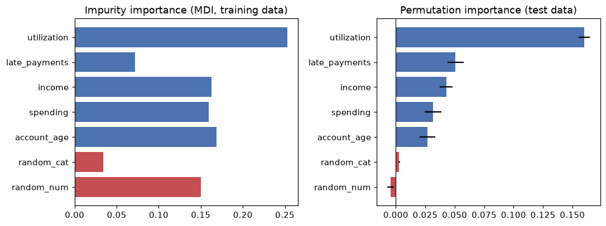

# Interpretability

> **Level 5 · Chapter 4** · ⏱️ ~65 min read · Prerequisites: [Decision trees](../04-ml-algorithms/02-decision-trees.md), [Ensembles: random forests and boosting](../04-ml-algorithms/03-ensembles.md), [Logistic regression and classification](../03-ml-fundamentals/03-logistic-regression.md), and [Probability](../01-math-foundations/04-probability.md) (expectations)

A model that predicts well can still be wrong for the wrong reasons, and people affected by it deserve to know why it decided what it did. This chapter covers the main tools for explaining models: coefficients, impurity and permutation importance, partial dependence and ICE plots, SHAP (from the Shapley value definition to `TreeExplainer`), LIME, and counterfactual explanations. Just as important, it shows where each one misleads, especially when features are correlated.

## Why it matters

In the 1990s, a large project studied how to predict the risk of death for pneumonia patients, so that low-risk patients could be treated at home and hospital beds saved for those who needed them. One of the models, a set of rules learned from data, contained a striking rule: *patients with asthma have lower risk*. Rich Caruana, who worked on the project, later recounted it as a cautionary tale (Caruana et al., 2015).

The rule was "true" in the data. Asthmatic patients with pneumonia were usually sent straight to intensive care, where aggressive treatment lowered their death rate. The model learned the effect of the treatment, not the risk of the disease. Deployed as intended, it would have sent asthmatic patients home, which is exactly the wrong decision.

The rule was caught because the model was readable. A more accurate black-box model trained on the same data would have learned the same pattern and hidden it. Interpretability isn't just for regulators or curious users: it's a debugging tool that finds leakage, confounding, and data errors that accuracy metrics can't see.

## Concepts

### What "explaining a model" means

An explanation answers a question about a model, and different questions need different tools. Three distinctions organize the field.

- **Global versus local.** A **global** explanation describes the model's behavior overall ("utilization is the most important feature; risk rises steeply above 60% utilization"). A **local** explanation describes one prediction ("this applicant was declined mainly because of two late payments").
- **Intrinsic versus post hoc.** An **intrinsically interpretable** model is readable by design: a short decision tree, a sparse linear model, or a small rule list. A **post hoc** method explains a model after training, treating it as given.
- **Model-specific versus model-agnostic.** Impurity importance needs trees; coefficients need a linear model. **Model-agnostic** methods (permutation importance, partial dependence, LIME, KernelSHAP) only need the ability to call `predict`.

One caution before the tools. Every method here explains **the model**, not **the world**. If the model learned a spurious or confounded pattern, a faithful explanation will faithfully show it. That's useful for debugging, and dangerous if you read explanations as causal claims about reality.

### Coefficients

For a linear model, $\hat{y} = b + \sum_j w_j x_j$, the coefficient $w_j$ is the change in the prediction per unit change in $x_j$, *holding the other features fixed*. For logistic regression, the prediction is the log-odds, so $e^{w_j}$ is the **odds ratio**: the factor by which the odds multiply per unit increase in $x_j$.

Three caveats apply. Coefficients depend on units, so compare them only after standardizing features (then $w_j$ is the effect of a one-standard-deviation change). "Holding the others fixed" may be impossible when features are correlated, and then the coefficients of the correlated features become unstable: they can split the effect, or even take opposite signs. And regularization shrinks coefficients, so their size reflects the penalty as well as the data. The [regularization chapter](../03-ml-fundamentals/05-regularization.md) and the [linear regression chapter](../03-ml-fundamentals/02-linear-regression.md) discuss interpretation in depth.

### Impurity importance and its bias

Tree ensembles offer a built-in importance, `feature_importances_`, also called **mean decrease in impurity (MDI)**. Each split in a tree reduces impurity (Gini or entropy for classification, variance for regression). The importance of feature $j$ is the total impurity decrease from all splits on $j$, weighted by the fraction of samples reaching each split, averaged over trees and normalized to sum to 1:

$$
\text{MDI}_j = \frac{1}{T}\sum_{t=1}^{T} \sum_{\text{nodes } s \text{ in tree } t \text{ that split on } j} \frac{n_s}{n}\,\Delta I_s ,
$$

where $T$ is the number of trees, $n_s$ the number of training samples reaching node $s$, and $\Delta I_s$ the impurity decrease at $s$.

MDI is free, but it has two serious flaws. First, it's computed on the **training data**, so it measures how much a feature helped the trees fit the training set, including fitting noise. Second, it's **biased toward features with many possible split points**: continuous features and high-cardinality categoricals. A fully grown tree keeps splitting until leaves are pure, and a continuous noise feature offers thousands of thresholds, some of which separate a few training points by chance. Each such split decreases impurity a little, and the decreases add up. A binary feature offers only one split and can't accumulate credit the same way. You'll see a pure-noise continuous feature rank as high as real signals below.

### Permutation importance

**Permutation importance** (Breiman, 2001) asks a cleaner question: *how much worse does the model get if this feature's information is destroyed?* Destroy it by shuffling the feature's column, which keeps its distribution but breaks its link to the target and the other features.

For a fitted model $f$, a dataset $D$ (ideally held out), and a score $s$ (higher is better):

1. Compute the baseline score $s_0 = s(f, D)$.
2. For each feature $j$ and each repetition $k = 1, \ldots, K$, shuffle column $j$ to get $D_{k,j}$, and compute $s_{k,j} = s(f, D_{k,j})$.
3. The importance is the average drop:

$$
I_j = s_0 - \frac{1}{K}\sum_{k=1}^{K} s_{k,j} .
$$

It's model-agnostic, uses the metric you care about, and on held-out data measures what the model *needs for generalization*, not what it used to memorize. A noise feature gets an importance near zero, or slightly negative (shuffling noise can help by chance). The repetitions give a spread, so you can tell real importance from noise.

Its weakness is correlated features, covered in the pitfalls below.

### Partial dependence and ICE

Importance says *how much* a feature matters, not *how*. Does risk rise with utilization steadily, in a jump, or only for some people?

The **partial dependence** of the prediction on a feature set $S$ (usually one or two features), with the remaining features $C$, is the average prediction when $x_S$ is set to a value and $x_C$ keeps its observed values:

$$
\bar{f}_S(x_S) = \frac{1}{n}\sum_{i=1}^{n} f\big(x_S, x_C^{(i)}\big) .
$$

To compute it, pick a grid of values for $x_S$; for each value $v$, set feature $S$ to $v$ in *every* row, predict, and average. The **partial dependence plot (PDP)** shows $\bar{f}_S$ against the grid.

The average can hide a lot. If utilization raises risk sharply for people with late payments and barely for others, the PDP shows a medium slope that describes nobody. **Individual conditional expectation (ICE)** curves (Goldstein et al., 2015) skip the average and draw one curve per row: $f(v, x_C^{(i)})$ against $v$. The PDP is the average of the ICE curves. When ICE curves are roughly parallel, the PDP is a fair summary; when they fan out or cross, the feature **interacts** with others, and the PDP alone misleads. Centering each ICE curve at its left end (a **centered ICE** plot) makes differences in shape easier to see.

### Shapley values: fair credit for a prediction

Local explanations need a principled way to split one prediction among the features. **Shapley values** come from cooperative game theory (Shapley, 1953), where a group of players produces a total payout, and the question is how to divide it fairly.

Map the idea to a model. The players are the $d$ features, $F = \{1, \ldots, d\}$. For a coalition $S \subseteq F$, a **value function** $v(S)$ says what the model predicts for the instance $x$ when only the features in $S$ are "known". The total to divide is $v(F) - v(\varnothing)$: the prediction for $x$ minus the baseline prediction when nothing is known.

A feature's contribution depends on which features are already present (interactions), so Shapley's answer averages its **marginal contribution** $v(S \cup \{j\}) - v(S)$ over all orders in which features could join:

$$
\phi_j = \sum_{S \subseteq F \setminus \{j\}} \frac{|S|!\,(d - |S| - 1)!}{d!}\Big[v(S \cup \{j\}) - v(S)\Big] .
$$

The weight has a simple meaning. Imagine adding features one at a time in a random order (each of the $d!$ orders equally likely). The probability that exactly the features in $S$ come before $j$ is $\frac{|S|!\,(d - |S| - 1)!}{d!}$: $|S|!$ orders for the features before $j$, times $(d - |S| - 1)!$ orders for those after, out of $d!$. So $\phi_j$ is feature $j$'s average marginal contribution over random joining orders.

Shapley proved this is the *only* attribution with four properties:

- **Efficiency.** The contributions add up to the total: $\sum_j \phi_j = v(F) - v(\varnothing)$. For a model, the prediction equals the baseline plus the sum of the features' contributions.
- **Symmetry.** Two features that contribute equally to every coalition get equal credit.
- **Dummy.** A feature that never changes $v$ gets zero.
- **Additivity.** For a sum of two models (like an ensemble's trees), the Shapley values are the sums of each model's values.

**SHAP** (SHapley Additive exPlanations, Lundberg and Lee, 2017) applies Shapley values to model predictions with a particular value function. The common **interventional** choice sets the known features to $x$'s values and averages over a **background dataset** for the unknown ones:

$$
v(S) = \frac{1}{|B|}\sum_{z \in B} f\big(x_S, z_C\big),
$$

where $B$ is the background set (a sample of training rows) and $C = F \setminus S$. Then $v(\varnothing)$ is the average prediction over the background, the **base value**, and $v(F) = f(x)$.

The sum over all subsets has $2^{d-1}$ terms per feature, which is hopeless for many features. **KernelSHAP** approximates it for any model by sampling coalitions and solving a weighted regression. **TreeExplainer** (Lundberg et al., 2020) computes the exact values for tree ensembles in polynomial time by walking the trees, which is why SHAP is so popular with gradient boosting. You'll check TreeExplainer against the brute-force formula below; they agree to machine precision.

Global SHAP summaries come from local ones: the mean absolute SHAP value per feature is an importance measure, and a **beeswarm plot** shows every row's SHAP value per feature, colored by the feature's value.

### LIME: a local surrogate

**LIME** (Local Interpretable Model-agnostic Explanations, Ribeiro et al., 2016) explains one prediction by fitting a simple model that mimics the complex one *near* that point. Formally, it chooses an interpretable model $g$ (usually sparse linear) that minimizes

$$
\xi(x) = \arg\min_{g \in G}\; \mathcal{L}(f, g, \pi_x) + \Omega(g),
$$

where $\mathcal{L}$ measures how badly $g$ approximates $f$ on points near $x$, weighted by a proximity kernel $\pi_x$, and $\Omega(g)$ penalizes complexity (for example, the number of nonzero coefficients). In practice:

1. Sample perturbed points $z$ around $x$.
2. Get the black-box predictions $f(z)$.
3. Weight each $z$ by its closeness to $x$, for example $\pi_x(z) = \exp\big(-\|x - z\|^2/\sigma^2\big)$ with a kernel width $\sigma$.
4. Fit a weighted linear model of $f(z)$ on $z$. Its coefficients are the explanation.

LIME is intuitive and works for text and images too (perturbing words or image regions). Its weakness is instability: explanations depend on the sampling, the kernel width, and the perturbation distribution, and two runs can disagree. SHAP's KernelSHAP can be seen as LIME with a specific kernel and loss chosen so that the result satisfies the Shapley properties.

### Counterfactual explanations

People affected by a decision usually don't want a list of feature weights. They want to know *what would have to change*. A **counterfactual explanation** (Wachter et al., 2018) answers: "Your application would have been approved if your credit utilization had been 45% instead of 82%."

Formally, for an instance $x$ with an unwanted prediction, find the closest point $x'$ that gets the desired prediction:

$$
x' = \arg\min_{x'}\; d(x, x') \quad \text{subject to} \quad f(x') \ge \tau,
$$

where $d$ is a distance (often an L1 distance with each feature scaled by its spread, which favors changing few features) and $\tau$ is the decision threshold. Good counterfactuals are **valid** (they actually flip the decision), **proximate** (small change), **sparse** (few features change), **plausible** (the point could exist), and **actionable**: they only change features a person can change. Telling someone to be younger, or to have had fewer late payments last year, isn't helpful. In practice, you restrict the search to actionable features, respect directions (income can rise; account age only increases with time), and often offer several diverse counterfactuals. Libraries such as DiCE implement this.

### Pitfalls

Explanations are easy to compute and easy to misread. The most important failure modes:

**Correlated features.** When two features carry the same information, three things go wrong.

- *Credit is split or arbitrary.* A model can use either feature, so importance divides between them in a way that depends on the training run. Each looks half as important as the information really is.
- *Permutation creates impossible data.* Shuffling income while keeping spending fixed creates rows with high spending and tiny income, which never occur. The model's behavior there is extrapolation, and the importance partly measures how the model behaves on nonsense. The same applies to PDP, ICE, and interventional SHAP, which all set one feature while keeping others fixed.
- *Dropping one barely hurts.* Because the other carries the information, removing a truly useful feature may cost almost nothing. "Low importance" doesn't mean "irrelevant to the outcome".

Remedies: check correlations first; permute or explain **groups** of correlated features together; use drop-column importance (retrain without the feature) to measure what's unique to a feature; or merge correlated features into one.

**Explanations aren't causes.** SHAP says the model's output moved because of a feature value. It doesn't say changing that feature in the world would change the outcome. The asthma rule is the textbook example.

**Training-set explanations describe memorization.** Compute importance on held-out data when you want to know what generalizes.

**Explanations can be gamed and can be unstable.** Slack et al. (2020) built models that behave in a biased way on real data but look innocent to LIME and SHAP, by detecting the off-distribution perturbations those methods generate. Different but equally accurate models (the **Rashomon effect**) can have very different explanations. Treat an explanation as evidence about one model, not as the truth about the problem.

## In practice

### The data: credit default with known truth

The examples use a synthetic credit dataset where you know the true mechanism, so you can check each explanation against reality. Default risk depends on `utilization` (the share of the credit limit in use), `late_payments`, `income`, and `account_age`, with an interaction between utilization and late payments. Three features are traps: `spending` is irrelevant but correlated with income (correlation about 0.95), `random_num` is continuous noise, and `random_cat` is a three-level categorical noise column.

```python
import numpy as np
import pandas as pd
from sklearn.ensemble import GradientBoostingClassifier, RandomForestClassifier
from sklearn.metrics import roc_auc_score
from sklearn.model_selection import train_test_split

pd.set_option("display.width", 120)


def make_credit(n=5000, seed=0):
    rng = np.random.default_rng(seed)
    income = rng.lognormal(np.log(55), 0.4, n)                     # thousands of USD per year
    spending = 0.6 * income * np.exp(rng.normal(0, 0.12, n))       # irrelevant, correlated with income
    utilization = rng.beta(2, 3, n)                                # share of credit limit used
    late = rng.poisson(0.6, n)                                     # late payments, last 12 months
    account_age = rng.uniform(0, 30, n)                            # years
    random_num = rng.normal(size=n)                                # noise
    random_cat = rng.integers(0, 3, n)                             # noise, 3 levels
    logit = (-1.6 + 4.0 * (utilization - 0.4) + 0.7 * late - 0.03 * (income - 55)
             - 0.05 * account_age + 1.5 * (utilization - 0.4) * late)
    y = (rng.random(n) < 1 / (1 + np.exp(-logit))).astype(int)
    X = pd.DataFrame({"income": income, "spending": spending, "utilization": utilization,
                      "late_payments": late, "account_age": account_age,
                      "random_num": random_num, "random_cat": random_cat}).astype(float)
    return X, y


X, y = make_credit()
X_train, X_test, y_train, y_test = train_test_split(X, y, test_size=0.3, stratify=y, random_state=0)
features = list(X.columns)

rf = RandomForestClassifier(n_estimators=200, random_state=0, n_jobs=-1).fit(X_train, y_train)
gbm = GradientBoostingClassifier(n_estimators=200, max_depth=3, learning_rate=0.05,
                                 random_state=0).fit(X_train, y_train)
print(f"default rate {y.mean():.3f}; corr(income, spending) = {X['income'].corr(X['spending']):.2f}")
print(f"test ROC AUC: random forest {roc_auc_score(y_test, rf.predict_proba(X_test)[:, 1]):.3f}, "
      f"gradient boosting {roc_auc_score(y_test, gbm.predict_proba(X_test)[:, 1]):.3f}")
```

```text
default rate 0.173; corr(income, spending) = 0.96
test ROC AUC: random forest 0.797, gradient boosting 0.806
```

### Coefficients of a logistic regression

A standardized logistic regression gives a first, global view:

```python
from sklearn.linear_model import LogisticRegression
from sklearn.pipeline import make_pipeline
from sklearn.preprocessing import StandardScaler

logreg = make_pipeline(StandardScaler(), LogisticRegression()).fit(X_train, y_train)
coef = pd.DataFrame({"coef (per SD)": logreg[-1].coef_[0],
                     "odds ratio": np.exp(logreg[-1].coef_[0])}, index=features)
print(coef.round(3).sort_values("coef (per SD)", key=abs, ascending=False))
print(f"test ROC AUC {roc_auc_score(y_test, logreg.predict_proba(X_test)[:, 1]):.3f}")
```

```text
               coef (per SD)  odds ratio
utilization            0.978       2.660
late_payments          0.641       1.898
income                -0.445       0.641
account_age           -0.440       0.644
spending              -0.247       0.781
random_num             0.058       1.060
random_cat             0.053       1.054
test ROC AUC 0.822
```

Each coefficient is the change in log-odds for a one-standard-deviation increase. A one-SD increase in utilization multiplies the odds of default by about 2.7. The linear model gets the real drivers' directions right and actually *beats* both ensembles (AUC 0.822 against 0.806), because the true mechanism is close to linear in log-odds: a reminder to always try the interpretable baseline. Look at `spending`, though: it has no effect on default, yet it gets a clearly negative coefficient. Spending is a noisy copy of income, so the model splits the income effect between the two, and the split is unstable. The linear model also can't represent the utilization-by-late-payments interaction unless you add that feature yourself.

### Impurity importance versus permutation importance

First, permutation importance from scratch, so the algorithm is concrete:

```python
def permutation_importance_scratch(model, X, y, n_repeats=5, seed=0):
    rng = np.random.default_rng(seed)
    base = roc_auc_score(y, model.predict_proba(X)[:, 1])
    drops = {}
    for col in X.columns:
        scores = []
        for _ in range(n_repeats):
            X_perm = X.copy()
            X_perm[col] = rng.permutation(X_perm[col].to_numpy())    # break the column's link
            scores.append(roc_auc_score(y, model.predict_proba(X_perm)[:, 1]))
        drops[col] = base - np.mean(scores)
    return pd.Series(drops)

print(permutation_importance_scratch(rf, X_test, y_test).round(4).sort_values(ascending=False))
```

```text
utilization      0.1515
income           0.0431
late_payments    0.0420
spending         0.0336
account_age      0.0320
random_cat       0.0027
random_num      -0.0003
dtype: float64
```

Now compare with the random forest's built-in impurity importance, and with scikit-learn's `permutation_importance` (which does the same as above, with parallelism and any scorer):

```python
import matplotlib.pyplot as plt
from sklearn.inspection import permutation_importance

perm = permutation_importance(rf, X_test, y_test, scoring="roc_auc", n_repeats=5, random_state=0, n_jobs=-1)
imp = pd.DataFrame({"MDI (train)": rf.feature_importances_,
                    "permutation (test AUC drop)": perm.importances_mean,
                    "perm std": perm.importances_std}, index=features)
print(imp.round(4).sort_values("MDI (train)", ascending=False))

order = imp.sort_values("permutation (test AUC drop)").index
fig, axes = plt.subplots(1, 2, figsize=(10, 3.8))
colors = ["#C44E52" if f.startswith("random") else "#4C72B0" for f in order]
axes[0].barh(order, imp.loc[order, "MDI (train)"], color=colors)
axes[0].set_title("Impurity importance (MDI, training data)")
axes[1].barh(order, imp.loc[order, "permutation (test AUC drop)"],
             xerr=imp.loc[order, "perm std"], color=colors)
axes[1].set_title("Permutation importance (test data)")
axes[1].axvline(0, color="black", lw=0.8)
plt.tight_layout()
plt.show()
```

```text
               MDI (train)  permutation (test AUC drop)  perm std
utilization         0.2528                       0.1601    0.0049
account_age         0.1688                       0.0269    0.0068
income              0.1627                       0.0428    0.0056
spending            0.1595                       0.0317    0.0071
random_num          0.1499                      -0.0045    0.0029
late_payments       0.0720                       0.0507    0.0068
random_cat          0.0343                       0.0029    0.0006
```



*Red bars are pure noise. MDI ranks the continuous noise feature `random_num` alongside real signals and above `late_payments`; permutation importance on held-out data sees through it.*

MDI ranks `random_num`, which is pure noise, nearly level with income and well above `late_payments`, the second-strongest real driver. That's the cardinality bias: `random_num` has thousands of distinct values to split on and the trees used them to fit training noise, while `late_payments` has only a handful of values. Permutation importance on test data puts `random_num` at about zero and `late_payments` second. Notice also that `spending` gets real permutation importance even though it has no effect on default. Hold that thought for the pitfalls section.

!!! warning "Common mistake: trusting `feature_importances_`"
    Impurity importance is computed on training data and inflates continuous and high-cardinality features. Use permutation importance on a held-out set (or SHAP) for anything you'll report or act on.

### Partial dependence and ICE

A PDP from scratch is a loop: set the feature to each grid value in every row, predict, and average. Keeping the per-row predictions gives the ICE curves.

```python
def pdp_ice(model, X, feature, grid):
    ice = np.empty((len(X), len(grid)))
    for k, v in enumerate(grid):
        X_mod = X.copy()
        X_mod[feature] = v                             # same value for every row
        ice[:, k] = model.predict_proba(X_mod)[:, 1]
    return ice.mean(axis=0), ice                       # PDP is the average ICE curve

grid = np.linspace(0.05, 0.85, 9)
pdp, ice = pdp_ice(gbm, X_test, "utilization", grid)
print("utilization:", grid.round(2))
print("PDP        :", pdp.round(3))

from sklearn.inspection import partial_dependence
sk = partial_dependence(gbm, X_test, ["utilization"], grid_resolution=9, kind="average",
                        method="brute", response_method="predict_proba",
                        custom_values={"utilization": grid})
print("max difference from scikit-learn:", np.abs(sk["average"][0] - pdp).max())
```

```text
utilization: [0.05 0.15 0.25 0.35 0.45 0.55 0.65 0.75 0.85]
PDP        : [0.047 0.053 0.056 0.121 0.179 0.249 0.307 0.34  0.507]
max difference from scikit-learn: 2.220446049250313e-16
```

On average, the predicted default probability rises from about 5% to 51% as utilization goes from 5% to 85%, in steps, because a tree ensemble is a piecewise-constant function. The ICE curves show whether that average is everyone's story. Color them by the number of late payments:

```python
from sklearn.inspection import PartialDependenceDisplay

fig, axes = plt.subplots(1, 2, figsize=(10, 4))
sample = np.random.default_rng(0).choice(len(X_test), 300, replace=False)
late = X_test["late_payments"].to_numpy()[sample]
for curve, n_late in zip(ice[sample], late):
    axes[0].plot(grid, curve, color="#C44E52" if n_late >= 2 else "#4C72B0", alpha=0.15, lw=0.8)
axes[0].plot(grid, pdp, color="black", lw=3, label="PDP (average)")
axes[0].plot([], [], color="#C44E52", label="ICE, 2+ late payments")
axes[0].plot([], [], color="#4C72B0", label="ICE, 0-1 late payments")
axes[0].set_xlabel("utilization"); axes[0].set_ylabel("predicted default probability")
axes[0].set_title("ICE curves fan out: an interaction")
axes[0].legend(fontsize=8)
PartialDependenceDisplay.from_estimator(gbm, X_test, ["late_payments"], kind="both", subsample=300,
                                        random_state=0, ax=axes[1], response_method="predict_proba")
axes[1].set_title("scikit-learn: PDP and ICE for late_payments")
plt.tight_layout()
plt.show()
```


*The ICE curves split into two families: for applicants with late payments, utilization matters far more. The average PDP (black) describes neither group well.*

The fan-out reveals the utilization-by-late-payments interaction that was built into the data. A PDP alone would have reported a single, moderate effect. A two-way PDP (`features=[("utilization", "late_payments")]`) shows the same interaction as a heat map.

### SHAP: the definition, then TreeExplainer

First, compute exact Shapley values for one applicant by brute force, straight from the formula, using the interventional value function with a background of 100 training rows. The gradient boosting model's raw output is the log-odds (`decision_function`), which is what SHAP explains for it by default.

```python
import itertools
import math

background = X_train.sample(100, random_state=0)
x = X_test.iloc[[0]]                                       # the applicant to explain
d = len(features)

def value(S):
    """v(S): set features in S to x's values, average the model output over the background."""
    Z = background.copy()
    for j in S:
        Z[features[j]] = x.iloc[0, j]
    return gbm.decision_function(Z).mean()

v = {S: value(S) for r in range(d + 1) for S in itertools.combinations(range(d), r)}   # all 2^7 coalitions
phi = np.zeros(d)
for j in range(d):
    others = [k for k in range(d) if k != j]
    for r in range(d):
        for S in itertools.combinations(others, r):
            weight = math.factorial(r) * math.factorial(d - r - 1) / math.factorial(d)
            phi[j] += weight * (v[tuple(sorted(S + (j,)))] - v[S])

print(x.round(3).to_string(index=False))
print("Shapley values:", {f: round(float(p), 4) for f, p in zip(features, phi)})
print(f"base value v(empty) = {v[()]:.4f};  base + sum(phi) = {v[()] + phi.sum():.4f};  "
      f"model output f(x) = {gbm.decision_function(x)[0]:.4f}")
```

```text
 income  spending  utilization  late_payments  account_age  random_num  random_cat
102.796    60.161        0.534            1.0       16.067       0.577         1.0
Shapley values: {'income': -0.8873, 'spending': -0.2749, 'utilization': 0.3916, 'late_payments': 0.1307, 'account_age': 0.038, 'random_num': -0.0275, 'random_cat': 0.0199}
base value v(empty) = -1.9795;  base + sum(phi) = -2.5890;  model output f(x) = -2.5890
```

Efficiency holds exactly: the base value plus the contributions equals the model's output. This applicant's high income (about USD 103k) pulls the log-odds down by 0.89, and their 53% utilization pushes them up by 0.39. Now the same with `shap.TreeExplainer`, which computes these values exactly without enumerating coalitions:

```python
import shap

explainer = shap.TreeExplainer(gbm, data=background, feature_perturbation="interventional")
sv = explainer.shap_values(x)
print("TreeExplainer :", sv[0].round(4))
print("brute force   :", phi.round(4))
print("max difference:", np.abs(sv[0] - phi).max())
print("expected_value:", round(float(explainer.expected_value), 4))
```

```text
TreeExplainer : [-0.8873 -0.2749  0.3916  0.1307  0.038  -0.0275  0.0199]
brute force   : [-0.8873 -0.2749  0.3916  0.1307  0.038  -0.0275  0.0199]
max difference: 7.275833935338483e-09
expected_value: -1.9795
```

They agree to eight decimal places. TreeExplainer does it in a fraction of the time, and its cost grows polynomially, not exponentially, with the number of features. Explaining many rows gives a global picture:

```python
sv_test = explainer.shap_values(X_test.iloc[:500])
global_shap = pd.Series(np.abs(sv_test).mean(axis=0), index=features).sort_values(ascending=False)
print("mean |SHAP| (log-odds):")
print(global_shap.round(3))
```

```text
mean |SHAP| (log-odds):
utilization      0.690
income           0.424
late_payments    0.389
account_age      0.249
spending         0.167
random_num       0.082
random_cat       0.018
dtype: float64
```

The global ranking matches the true mechanism, with the noise features at the bottom. But `spending`, which has no causal effect, still gets a sizable share: this applicant's spending "contributed" −0.27 to their log-odds. The model genuinely uses spending, as a stand-in for income, and SHAP faithfully reports what the model does.

SHAP's plotting functions draw the standard views. They're shown here without output:

<!-- skip-run -->
```python
explanation = explainer(X_test.iloc[:500])
shap.plots.waterfall(explanation[0])      # one prediction: base value -> each feature's push -> output
shap.plots.beeswarm(explanation)          # every row, every feature, colored by feature value
shap.plots.scatter(explanation[:, "utilization"], color=explanation[:, "late_payments"])  # dependence
```

!!! tip "Which output does SHAP explain?"
    For classifiers, SHAP values are in the units of the model output being explained: log-odds for gradient boosting by default. Log-odds contributions add up exactly; probability contributions don't (the sigmoid isn't additive). Explaining probabilities is possible (`model_output="probability"` with interventional perturbation), but read log-odds values as "pushes" on the odds.

### LIME from scratch

The LIME package isn't part of this handbook's environment, so here is the algorithm itself, on the same applicant. Perturb around the point with noise scaled to each feature's spread, weight samples by closeness, and fit a weighted linear model to the black box's log-odds.

```python
from sklearn.linear_model import Ridge

def lime_tabular(model_fn, x_row, X_ref, n_samples=5000, kernel_width=0.75, seed=0):
    rng = np.random.default_rng(seed)
    scale = X_ref.std().to_numpy()
    Z_std = rng.normal(size=(n_samples, len(scale)))           # perturbations in SD units
    Z = x_row.to_numpy() + Z_std * scale
    dist = np.sqrt((Z_std ** 2).sum(axis=1) / len(scale))       # distance to x, in SD units
    weights = np.exp(-dist ** 2 / kernel_width ** 2)            # proximity kernel
    target = model_fn(pd.DataFrame(Z, columns=X_ref.columns))
    surrogate = Ridge(alpha=1.0).fit(Z_std, target, sample_weight=weights)
    return pd.Series(surrogate.coef_, index=X_ref.columns)      # log-odds change per SD, near x

lime_coefs = lime_tabular(gbm.decision_function, x.iloc[0], X_train)
print(pd.DataFrame({"LIME slope (per SD)": lime_coefs, "SHAP value": phi}, index=features).round(3))
```

```text
               LIME slope (per SD)  SHAP value
income                       0.093      -0.887
spending                    -0.490      -0.275
utilization                  0.935       0.392
late_payments                0.701       0.131
account_age                 -0.342       0.038
random_num                  -0.070      -0.027
random_cat                   0.001       0.020
```

The two answer different questions, so don't expect equal numbers. LIME's coefficients are *local slopes*: how the output changes per standard deviation near this applicant. SHAP values are *attributions*: how much each feature's actual value moved this prediction away from the average. Income shows the difference starkly. Its SHAP value is large and negative: compared with the average applicant, this applicant's high income lowers their risk a lot. Its LIME slope is near zero: at around USD 103k, the trees have few training points and the model is nearly flat, so nudging income changes little. Both are correct statements about the model.

LIME also shows the correlated-feature problem. Its perturbations move income and spending *independently*, creating applicants who earn USD 103k and spend almost nothing, or the reverse, which never occur in the data. On those points, the model leans on spending (slope −0.49), and LIME reports that. Change `kernel_width` or the seed and the numbers move, which is LIME's known instability.

With the `lime` package installed, the equivalent is:

<!-- skip-run -->
```python
from lime.lime_tabular import LimeTabularExplainer

lime_explainer = LimeTabularExplainer(X_train.to_numpy(), feature_names=features,
                                      class_names=["repaid", "default"], mode="classification",
                                      discretize_continuous=True, random_state=0)
exp = lime_explainer.explain_instance(x.iloc[0].to_numpy(), gbm.predict_proba, num_features=5)
print(exp.as_list())          # e.g. [('utilization > 0.53', 0.12), ('late_payments <= 0.00', -0.08), ...]
```

### Counterfactual explanations

Take an applicant the model would decline (predicted default probability above 0.5), and search for the smallest change, in actionable features only, that gets them approved. Here, the applicant can lower their utilization (pay down balances) or raise their income; late payments and account age are history and can't change.

```python
p_test = gbm.predict_proba(X_test)[:, 1]
applicant = X_test.iloc[np.argmin(np.abs(p_test - 0.7))]          # a clearly declined applicant
print(f"applicant: utilization {applicant.utilization:.2f}, income {applicant.income:.1f}k, "
      f"late payments {int(applicant.late_payments)}, "
      f"P(default) = {gbm.predict_proba(applicant.to_frame().T)[0, 1]:.3f}")

spread = X_train.std()
best = None
for new_util in np.arange(applicant.utilization, -0.001, -0.01):          # utilization can only go down
    for new_income in applicant.income * np.arange(1.0, 1.51, 0.05):      # income can rise up to 50%
        cand = applicant.copy()
        cand["utilization"], cand["income"] = new_util, new_income
        cand["spending"] = applicant.spending                             # unchanged
        if gbm.predict_proba(cand.to_frame().T)[0, 1] <= 0.4:              # valid, with a safety margin
            cost = (abs(new_util - applicant.utilization) / spread["utilization"]
                    + abs(new_income - applicant.income) / spread["income"])
            if best is None or cost < best[0]:
                best = (cost, new_util, new_income)
cost, new_util, new_income = best
cf = applicant.copy()
cf["utilization"], cf["income"] = new_util, new_income
print(f"counterfactual: utilization {new_util:.2f}, income {new_income:.1f}k "
      f"-> P(default) = {gbm.predict_proba(cf.to_frame().T)[0, 1]:.3f} (distance {cost:.2f} SDs)")
```

```text
applicant: utilization 0.49, income 51.6k, late payments 2, P(default) = 0.702
counterfactual: utilization 0.44, income 51.6k -> P(default) = 0.398 (distance 0.25 SDs)
```

The search asks for a predicted risk of at most 0.4, not just below the 0.5 cutoff: a safety margin, so the advice still holds after small model updates. The explanation a person can act on: "With the same income and payment history, you'd have been approved at 44% utilization instead of 49%." The search preferred changing utilization alone, because in standard-deviation units it's the cheaper route.

Be suspicious of how small that change is. Here you know the true mechanism: lowering utilization by 5 points changes this applicant's true log-odds by only $4.0 \times 0.05 + 1.5 \times 0.05 \times 2 = 0.35$, which would take a 70% risk to about 62%, not 40%. The model has learned a sharp step near 45% utilization, partly an artifact of fitting noise, and the counterfactual found it. Counterfactuals explain the *model*, steps and artifacts included, so check them against partial dependence and domain sense before giving them to a customer. Real counterfactual tools add plausibility constraints (stay near the data), return several diverse options, and handle categorical features, but the core is this constrained search.

!!! warning "Common mistake: counterfactuals with immutable or causal links ignored"
    A counterfactual that changes `age` or `late_payments` last year is valid but useless. And changing one feature while freezing a correlated one (raising income without spending changing) can produce implausible points. Restrict the search to actionable features, and treat the result as "what the model would do", not a guarantee about the world.

### The correlated-feature pitfall, measured

`spending` has no effect on default, yet it got permutation importance and SHAP credit. Look at what happens to income's importance when you retrain without spending, and what group permutation shows:

```python
def perm_drop(model, X, y, cols, n_repeats=5, seed=0):
    """Permute a group of columns together (same row shuffle), return mean AUC drop."""
    rng = np.random.default_rng(seed)
    base = roc_auc_score(y, model.predict_proba(X)[:, 1])
    drops = []
    for _ in range(n_repeats):
        idx = rng.permutation(len(X))
        X_perm = X.copy()
        X_perm[cols] = X[cols].to_numpy()[idx]
        drops.append(base - roc_auc_score(y, model.predict_proba(X_perm)[:, 1]))
    return np.mean(drops)

print(f"with spending : income alone {perm_drop(rf, X_test, y_test, ['income']):.4f}, "
      f"spending alone {perm_drop(rf, X_test, y_test, ['spending']):.4f}, "
      f"both together {perm_drop(rf, X_test, y_test, ['income', 'spending']):.4f}")

keep = [f for f in features if f != "spending"]
rf_no_sp = RandomForestClassifier(n_estimators=200, random_state=0, n_jobs=-1).fit(X_train[keep], y_train)
print(f"without spending: income {perm_drop(rf_no_sp, X_test[keep], y_test, ['income']):.4f}; "
      f"test AUC {roc_auc_score(y_test, rf_no_sp.predict_proba(X_test[keep])[:, 1]):.3f} "
      f"(was {roc_auc_score(y_test, rf.predict_proba(X_test)[:, 1]):.3f})")
```

```text
with spending : income alone 0.0431, spending alone 0.0262, both together 0.0681
without spending: income 0.0561; test AUC 0.791 (was 0.797)
```

Read it carefully. Permuted one at a time, income and spending look modest (0.043 and 0.026), and an analyst would conclude that spending matters about half as much as income. Permuted together, the pair costs 0.068: that's the real value of the income information. Retrain without spending, and income's own importance rises to 0.056, with a test AUC (0.791 against 0.797) that's within noise of the original. Single-feature importance understated income and gave real credit to a feature with no effect on default. When features are correlated, explain them as a group.

## Exercises

### Exercise 1: Shapley values by hand (easy)

A model has two features and these coalition values for an instance: $v(\varnothing) = 10$, $v(\{1\}) = 16$, $v(\{2\}) = 12$, $v(\{1, 2\}) = 20$. Compute $\phi_1$ and $\phi_2$ and check efficiency.

??? success "Solution"

    With $d = 2$, each feature joins either first or second, each with probability $1/2$.

    $$
    \phi_1 = \tfrac{1}{2}\big[v(\{1\}) - v(\varnothing)\big] + \tfrac{1}{2}\big[v(\{1,2\}) - v(\{2\})\big] = \tfrac{1}{2}(6) + \tfrac{1}{2}(8) = 7
    $$

    $$
    \phi_2 = \tfrac{1}{2}\big[v(\{2\}) - v(\varnothing)\big] + \tfrac{1}{2}\big[v(\{1,2\}) - v(\{1\})\big] = \tfrac{1}{2}(2) + \tfrac{1}{2}(4) = 3
    $$

    Efficiency: $\phi_1 + \phi_2 = 10 = v(\{1,2\}) - v(\varnothing) = 20 - 10$. Each feature's contribution grows when the other is present (6 vs 8, and 2 vs 4), which is an interaction; Shapley splits it evenly between them.

### Exercise 2: SHAP for a linear model (medium)

For a linear model $f(x) = b + \sum_j w_j x_j$ with the interventional value function and background mean $\bar{x}_j$, show that $\phi_j = w_j (x_j - \bar{x}_j)$. Verify numerically with `shap.LinearExplainer` or with the brute-force code above applied to a fitted `LinearRegression`.

??? success "Solution"

    For a linear model, $v(S) = b + \sum_{k \in S} w_k x_k + \sum_{k \notin S} w_k \bar{x}_k$ (averaging over the background replaces unknown features by their mean, since $f$ is linear). So $v(S \cup \{j\}) - v(S) = w_j(x_j - \bar{x}_j)$ for *every* $S$. The weights sum to 1, so $\phi_j = w_j(x_j - \bar{x}_j)$.

    ```python
    from sklearn.linear_model import LinearRegression

    lin = LinearRegression().fit(X_train, y_train)
    expl = shap.LinearExplainer(lin, background)
    print(np.abs(expl.shap_values(x)[0] - lin.coef_ * (x.iloc[0] - background.mean()).to_numpy()).max())
    ```

    ```text
    0.0
    ```

    This also shows why SHAP values depend on the background: they measure contributions relative to the background's average.

### Exercise 3: The cardinality bias, isolated (medium)

Train a `RandomForestClassifier` on a dataset with one informative binary feature and one pure-noise continuous feature (`y` depends only on the binary feature, with label noise). Compare MDI and test-set permutation importance. Then refit with `min_samples_leaf=50` and compare again. Explain the change.

??? success "Solution"

    ```python
    rng = np.random.default_rng(1)
    n = 3000
    Xb = pd.DataFrame({"signal_binary": rng.integers(0, 2, n), "noise_continuous": rng.normal(size=n)})
    yb = (rng.random(n) < np.where(Xb.signal_binary == 1, 0.7, 0.3)).astype(int)
    Xb_tr, Xb_te, yb_tr, yb_te = train_test_split(Xb, yb, test_size=0.3, random_state=0)
    for leaf in [1, 50]:
        m = RandomForestClassifier(n_estimators=100, min_samples_leaf=leaf, random_state=0, n_jobs=-1).fit(Xb_tr, yb_tr)
        p = permutation_importance(m, Xb_te, yb_te, scoring="roc_auc", n_repeats=5, random_state=0)
        print(f"min_samples_leaf={leaf:2d}: MDI {m.feature_importances_.round(3)}  "
              f"permutation {p.importances_mean.round(3)}")
    ```

    ```text
    min_samples_leaf= 1: MDI [0.172 0.828]  permutation [0.158 0.025]
    min_samples_leaf=50: MDI [0.813 0.187]  permutation [0.211 0.007]
    ```

    With fully grown trees, MDI gives the noise feature most of the credit: it offers endless split points, and the trees use them to memorize label noise. Permutation importance on test data isn't fooled either way. Larger leaves stop the trees from fitting noise, and MDI becomes sensible, but the clean fix is to stop relying on MDI.

### Exercise 4: Centered ICE (medium)

Using `pdp_ice` from the chapter, compute ICE curves for `utilization` and center each one by subtracting its value at the first grid point. Compare the average centered rise for applicants with 0 late payments and with 3 or more. What does the difference tell you?

??? success "Solution"

    ```python
    centered = ice - ice[:, [0]]
    lp = X_test["late_payments"].to_numpy()
    print(f"rise from 0.05 to 0.85 utilization: 0 late payments {centered[lp == 0, -1].mean():.3f}, "
          f"3+ late payments {centered[lp >= 3, -1].mean():.3f}")
    ```

    ```text
    rise from 0.05 to 0.85 utilization: 0 late payments 0.315, 3+ late payments 0.819
    ```

    The same change in utilization raises predicted risk more than twice as much for people with 3+ late payments. That's the interaction in the data, made visible by centering. A PDP would show a single average rise between the two.

### Exercise 5: A drop-column importance (hard)

**Drop-column importance** retrains the model without a feature and measures the loss in test score. Implement it for the random forest on all seven features. Compare its ranking with permutation importance, and explain the results for `income` and `spending`. Why is drop-column importance expensive, and when is it worth it?

??? success "Solution"

    ```python
    base_auc = roc_auc_score(y_test, rf.predict_proba(X_test)[:, 1])
    drop_col = {}
    for f in features:
        cols = [c for c in features if c != f]
        m = RandomForestClassifier(n_estimators=200, random_state=0, n_jobs=-1).fit(X_train[cols], y_train)
        drop_col[f] = base_auc - roc_auc_score(y_test, m.predict_proba(X_test[cols])[:, 1])
    print(pd.Series(drop_col).round(4).sort_values(ascending=False))
    ```

    ```text
    utilization      0.1240
    late_payments    0.0381
    account_age      0.0262
    spending         0.0068
    income           0.0064
    random_cat       0.0021
    random_num      -0.0038
    dtype: float64
    ```

    Dropping income costs almost nothing (0.006), because spending substitutes for it, and dropping spending costs about as little. Drop-column importance measures a feature's *unique* contribution, given the others, so correlated features each look unimportant: the opposite failure from the one you might expect. It needs one retraining per feature, so it's expensive, but it's the right question when you're deciding whether to collect or keep a feature. Combine it with group permutation to see shared information.

## Check yourself

1. What's the difference between a global and a local explanation? Give one method for each.

    ??? note "Answer"

        A global explanation describes the model's behavior over the whole population (permutation importance, PDP). A local explanation describes one prediction (SHAP values for one row, LIME, a counterfactual).

2. Why is impurity importance biased toward continuous and high-cardinality features?

    ??? note "Answer"

        Such features offer many candidate split points, so deep trees can find splits on them that reduce training impurity by chance, and those small decreases accumulate. MDI is also computed on training data, so it rewards fitting noise.

3. How is permutation importance computed, and why compute it on held-out data?

    ??? note "Answer"

        Shuffle one feature's column, recompute the score, and take the average drop from the baseline over several shuffles. On held-out data it measures what the model needs to generalize; on training data it partly measures memorization.

4. When does a PDP mislead, and what reveals it?

    ??? note "Answer"

        When the feature interacts with others, so its effect differs between individuals: the average curve describes no one. ICE curves that fan out or cross reveal it. Correlated features also make PDPs evaluate impossible combinations.

5. Write the Shapley value formula and explain the weight.

    ??? note "Answer"

        $\phi_j = \sum_{S \subseteq F \setminus \{j\}} \frac{|S|!(d - |S| - 1)!}{d!}[v(S \cup \{j\}) - v(S)]$. The weight is the probability that, in a uniformly random ordering of the $d$ features, exactly the features in $S$ come before $j$; so $\phi_j$ is $j$'s average marginal contribution over random orders.

6. What does the efficiency property guarantee for SHAP?

    ??? note "Answer"

        The SHAP values of a prediction add up to the model's output minus the base value (the average output over the background), so every bit of the prediction is attributed.

7. How does LIME produce an explanation, and what's its main weakness?

    ??? note "Answer"

        It samples perturbations around the instance, weights them by proximity, and fits a simple (usually sparse linear) model to the black box's outputs; the surrogate's coefficients are the explanation. It's unstable: results depend on the sampling, kernel width, and perturbation scheme.

8. Two features are correlated at 0.96. What happens to their permutation importances, and what should you do?

    ??? note "Answer"

        Each looks less important than the information they share, because the model can lean on the other when one is shuffled, and the shuffles create unrealistic rows. Permute them as a group, use drop-column importance to see unique contributions, or merge them.

## Key takeaways

- Explanations describe the model, not the world. They're powerful for debugging and dangerous as causal claims.
- Try an interpretable model first. When you need a black box, explain it with model-agnostic tools on held-out data.
- Prefer permutation importance (or mean |SHAP|) to impurity importance, which is computed on training data and favors many-valued features.
- PDPs show average effects; ICE curves show whether the average hides interactions.
- SHAP values are Shapley values of a value function: they add up to the prediction, and `TreeExplainer` computes them exactly for tree ensembles. LIME fits a local surrogate and is less stable.
- Counterfactuals give people actionable answers, if restricted to features they can change.
- Correlated features split credit and create impossible perturbations. Explain them as groups.

## Further reading

- Molnar, *Interpretable Machine Learning* (online book, christophm.github.io/interpretable-ml-book): the standard practical reference.
- Lundberg and Lee, "A Unified Approach to Interpreting Model Predictions", *NeurIPS* 2017; and Lundberg et al., "From local explanations to global understanding with explainable AI for trees", *Nature Machine Intelligence* 2 (2020).
- Ribeiro, Singh, and Guestrin, "'Why Should I Trust You?': Explaining the Predictions of Any Classifier", *KDD* 2016.
- Wachter, Mittelstadt, and Russell, "Counterfactual Explanations without Opening the Black Box", *Harvard Journal of Law & Technology* 31 (2018).
- Caruana et al., "Intelligible Models for HealthCare: Predicting Pneumonia Risk and Hospital 30-day Readmission", *KDD* 2015; and the scikit-learn User Guide on [permutation importance](https://scikit-learn.org/stable/modules/permutation_importance.html) and [partial dependence](https://scikit-learn.org/stable/modules/partial_dependence.html).

## Next

You can build, tune, and explain a model. Now ship it, and keep it working: [ML in production](05-ml-in-production.md).
