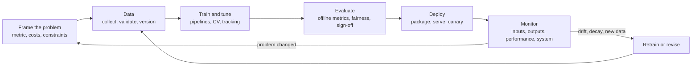

# ML in production

> **Level 5 · Chapter 5** · ⏱️ ~70 min read · Prerequisites: [ML pipelines](01-ml-pipelines.md), [Hyperparameter tuning](02-hyperparameter-tuning.md), and [Statistics](../01-math-foundations/05-statistics.md) (hypothesis tests)

A model in a notebook helps no one. This chapter covers what it takes to put a model to work and keep it working: the ML lifecycle, saving and versioning models, batch versus online serving, a FastAPI prediction service with input validation, packaging it with Docker, tracking experiments with MLflow, detecting data and concept drift (with PSI and the Kolmogorov-Smirnov test), monitoring, deciding when to retrain, and testing ML systems.

## Why it matters

Alex's churn model went live on a Monday, scoring every customer nightly and feeding a list of at-risk customers to the retention team. Offline, it had an AUC of 0.80. For six weeks, nobody looked at it again; the job ran, the list arrived, and the dashboard said "healthy" because the job didn't crash.

Then the retention manager noticed that the list was mostly long-time premium customers who never churned, while the customers actually leaving weren't on it. The investigation took two days. Three weeks earlier, the billing team had changed the `monthly_charges` field from dollars to cents. Every charge was now 100 times larger. The model, faithfully applying its learned weights, decided that everyone with a "USD 6,500" monthly bill was extremely likely to churn, and the list filled with noise. No error was raised, because 6,500 is a perfectly valid number.

The model was fine. The *system* had no input validation, no drift monitoring, and no performance tracking. This chapter is about building those, because in production, models rarely fail loudly. They fail silently, and you find out from the business.

## Concepts

### The ML lifecycle

Training a model is one step in a loop that never really ends:



Each arrow is a place where things break: training data that differs from production data, a model that can't be reproduced because nobody recorded its settings, a deployment that silently uses a different preprocessing step, a monitoring gap. **MLOps** is the set of practices that make this loop reliable and repeatable, borrowing from DevOps (automation, testing, versioning, monitoring) and adding what's specific to ML: data and models change behavior without any code changing.

A widely cited Google paper (Sculley et al., 2015) called this "hidden technical debt": in real ML systems, the model code is a small box surrounded by much larger boxes for data collection, verification, feature extraction, configuration, serving, and monitoring. Most production failures happen in those boxes.

### Saving and versioning models

A saved model is an **artifact**: a file that, combined with the right environment, reproduces predictions. The [pipelines chapter](01-ml-pipelines.md) showed `joblib.dump` for a whole pipeline. Formats differ in portability and safety:

| Format | Pros | Cons |
|---|---|---|
| `joblib` / `pickle` | Saves any Python object, including custom transformers | Runs arbitrary code on load; tied to library versions and Python |
| `skops` | Like pickle for scikit-learn, but inspects types before loading | Python and scikit-learn only |
| ONNX | Language-neutral; fast runtimes in C++, Java, browsers | Not every model or custom step converts |
| Native formats (XGBoost JSON, LightGBM text, PyTorch `state_dict`) | Stable, documented | Only the model, not your preprocessing |

Whatever the format, a model file alone isn't enough. To reproduce or debug a prediction months later, you need to know **which model** made it and **how that model was made**. That means versioning four things together:

1. **Code:** the git commit of the training code.
2. **Data:** a snapshot, or at least a content hash, of the training data.
3. **Configuration:** hyperparameters, feature list, random seeds, decision threshold.
4. **Environment:** library versions, ideally a lock file or a container image.

Store these as **metadata** next to the artifact, and give each model a **version** that every prediction is logged with. A **model registry** is a catalog of versioned models with their metadata and lifecycle stage (for example, "candidate", "production", "archived"). MLflow includes one; a disciplined folder structure plus metadata files is a fine start.

### Batch versus online serving

There are two main ways to deliver predictions.

**Batch serving** scores many records on a schedule (nightly, hourly) and writes predictions to a table or file that other systems read. Alex's churn list is batch.

**Online serving** (real-time) answers requests one at a time (or in small batches) through an API, within a latency budget, usually milliseconds. Fraud checks at payment time and recommendations on page load are online.

| | Batch | Online |
|---|---|---|
| Latency | minutes to hours | milliseconds |
| Freshness of features | as of the last run | as of the request |
| Infrastructure | a scheduled job | an always-on service, load balancing, scaling |
| Failure mode | a late or missing file | timeouts, errors in user-facing paths |
| Cost | cheap, efficient | more expensive per prediction |
| Good for | churn lists, demand forecasts, lead scoring | fraud, search ranking, pricing at checkout |

Choose batch unless you need fresh inputs or immediate answers: it's simpler and easier to monitor. A middle ground, **precompute and look up**, scores everyone in batch and serves the stored scores online.

One danger is shared by both: **training-serving skew**, any difference between how features are computed during training and during serving. Using the same pipeline object in both places (the reason to save the whole pipeline) removes one big source. Computing features from the same code and the same data sources removes another. Feature stores exist largely to solve this problem at scale.

### A model service with FastAPI and pydantic

**FastAPI** is a popular Python web framework for APIs. You declare endpoints as functions, and it handles routing, JSON parsing, and documentation. **Pydantic**, which FastAPI uses underneath, validates data against type annotations: you declare that `tenure` is an integer between 0 and 600 and that `plan` is one of three strings, and any request that violates it is rejected with a clear **422 Unprocessable Entity** error before your model ever sees it.

Input validation is the cheapest, most valuable defense a model service has. A model will happily return a number for any input, including garbage: negative ages, unknown categories, charges in the wrong unit. Validation turns silent nonsense into loud errors. It can't catch everything (a cents value can still be in range if your bounds are loose), which is why drift monitoring is the second line of defense.

A minimal service has two endpoints: `/health`, which load balancers and orchestrators call to check that the service is alive (and, usefully, which model version it serves), and `/predict`. FastAPI's `TestClient` lets you call the app in-process, without starting a server, which is how you test it.

### Packaging with Docker

"It works on my machine" is the oldest deployment bug. A **container** packages your code with its exact environment (Python version, libraries, system packages) into an **image** that runs the same anywhere a container runtime runs. **Docker** builds images from a **Dockerfile**, a recipe of steps. Good practice for model services: start from a slim official Python image, install pinned requirements first (so that layer is cached when only your code changes), copy the code and model, run as a non-root user, and start the server with a single command. Orchestrators like Kubernetes then run and scale those containers.

### Experiment tracking with MLflow

Over a project, you'll train hundreds of models. Six weeks later, you won't remember which settings produced the best one, on which data. **Experiment tracking** records, for every training **run**, its parameters, metrics, artifacts (the model, plots), code version, and tags, in a searchable store.

**MLflow** is a widely used open-source tracker. Its core concepts:

- An **experiment** groups related runs (for example, "churn").
- A **run** records one training: `log_param`, `log_metric`, `log_artifact`, and `log_model`.
- The **tracking store** holds it all: a local database file, or a shared server for a team.
- The **model registry** gives logged models names and versions, so serving code can load "churn, version 3" instead of a file path.

Tracking is also your defense against the winner's curse from the [tuning chapter](02-hyperparameter-tuning.md): a complete record of everything you tried tells you (and reviewers) how many comparisons stand behind a "best" score.

### Data drift and concept drift

A model learns a mapping from inputs to outputs from data drawn at one time. Production data comes later, and the world moves. Writing the joint distribution as $P(X, y) = P(y \mid X)\,P(X)$ separates three kinds of change:

- **Data drift** (covariate shift): $P(X)$ changes, $P(y \mid X)$ doesn't. Customers get older, a marketing campaign brings in a new segment, prices rise. The model's learned relationship may still hold, but it's applied in regions where it saw little data.
- **Prior shift** (label shift): $P(y)$ changes, for example, churn rises across the board in a recession.
- **Concept drift**: $P(y \mid X)$ changes. The same customer profile now behaves differently, for example, because a competitor launched a better offer for premium customers. The model's learned relationship is now wrong.

Data problems also masquerade as drift: a unit change, a broken join that fills a column with defaults, a new category value. These aren't changes in the world; they're bugs. But they show up the same way, as a change in $P(X)$.

You can detect data drift immediately, because it only needs inputs. Concept drift usually needs labels, which often arrive late (you learn whether a customer churned a month after predicting it). So monitoring watches inputs and predictions continuously, and performance whenever labels arrive.

### Measuring drift: PSI

The **population stability index (PSI)**, popular in credit scoring, compares a feature's distribution in production (actual) with a reference (expected), usually the training data. Split the reference into $B$ bins (often 10 quantile bins), and let $e_b$ and $a_b$ be the fractions of reference and production values in bin $b$:

$$
\text{PSI} = \sum_{b=1}^{B} (a_b - e_b)\,\ln\frac{a_b}{e_b} .
$$

Each term is non-negative, because $a_b - e_b$ and $\ln(a_b/e_b)$ always have the same sign. PSI is zero when the distributions match bin by bin. It's a symmetrized Kullback-Leibler divergence: $\text{PSI} = \text{KL}(a \,\|\, e) + \text{KL}(e \,\|\, a)$, as you can check by expanding $\sum a_b \ln(a_b/e_b) + \sum e_b \ln(e_b/a_b)$. A widely used rule of thumb (not a law) reads it as:

| PSI | Reading |
|---|---|
| below 0.1 | no meaningful shift |
| 0.1 to 0.25 | moderate shift: investigate |
| above 0.25 | major shift: act |

Empty bins make the logarithm blow up, so implementations add a small constant to every fraction. PSI works for categorical features too, with one bin per category.

### Measuring drift: the Kolmogorov-Smirnov test

The **two-sample Kolmogorov-Smirnov (KS) test** compares two samples of a continuous variable through their empirical cumulative distribution functions (ECDFs), $\hat{F}_{\text{ref}}$ and $\hat{F}_{\text{prod}}$. Its statistic is the largest vertical gap between them:

$$
D = \sup_{x}\,\big|\hat{F}_{\text{ref}}(x) - \hat{F}_{\text{prod}}(x)\big| .
$$

Under the null hypothesis that both samples come from the same distribution, $D$ has a known distribution, which gives a p-value (`scipy.stats.ks_2samp`). It needs no binning and detects any kind of difference (location, spread, shape).

Its weakness in monitoring is statistical power. With 50,000 production rows, the KS test detects differences far too small to matter: the p-value goes to zero for a shift of a few hundredths of a standard deviation. As always with hypothesis tests ([Statistics](../01-math-foundations/05-statistics.md)), *significant* doesn't mean *important*. In monitoring, look at the effect size ($D$ itself, or PSI) and use p-values only as a secondary signal. When you monitor many features, also expect false alarms from multiple testing.

### Monitoring

A production model needs monitoring at four levels:

1. **System health:** latency, throughput, error rates, memory, and whether the batch job ran. Standard software monitoring.
2. **Data quality:** schema checks, missing-value rates, out-of-range values, new categories. Cheap, immediate, and they catch most bugs (Alex's cents problem would have tripped a range check).
3. **Drift:** PSI or KS per feature against the training reference, and on the **prediction distribution** itself. If the average predicted churn probability jumps from 15% to 40% overnight, something changed, even if you don't yet know what.
4. **Performance:** the real metric (AUC, precision at the operating threshold, cost) once labels arrive, compared with the offline estimate. This is the ground truth, but it's delayed.

Monitoring is only useful if someone acts on it: set alert thresholds, route alerts to an owner, and keep a runbook of what to check.

### Retraining

Models decay, and the fix is usually retraining on recent data. There are three common **retraining triggers**:

- **Scheduled:** retrain weekly or monthly, whatever happens. Simple and predictable; wasteful when nothing changed and too slow when something changed suddenly.
- **Drift-triggered:** retrain when input drift crosses a threshold. Fast reaction, but drift doesn't always hurt performance, and retraining on bugged data makes things worse, so check data quality first.
- **Performance-triggered:** retrain when the measured metric drops below a threshold. The most direct signal, but delayed by label latency.

Many teams combine them: a schedule as a baseline, plus alerts that trigger investigation (not automatic retraining) on drift or performance drops.

A retrained model is a new model, and it must earn its place. In a **champion-challenger** setup, the new model (challenger) is compared with the current one (champion) on the same recent holdout data before promotion. Safer rollouts follow: **shadow deployment** (the challenger scores live traffic, but its predictions aren't used, only logged and compared), **canary release** (a small share of traffic goes to the new model first), and A/B tests for business impact ([Experimentation](../02-data-science-workflow/05-experimentation-and-ab-testing.md)). Keep the old version ready for instant **rollback**.

### Testing ML systems

ML systems need ordinary software tests and some extra kinds. A useful checklist, inspired by Google's "ML Test Score" rubric (Breck et al., 2017) and behavioral testing (Ribeiro et al., 2020):

- **Unit tests** for feature code and custom transformers: known input, known output, edge cases (missing values, unseen categories).
- **Data tests:** schema, ranges, and distributions of training and serving data. These run in pipelines before training and on every batch before scoring.
- **Model tests:**
    - *Minimum performance:* the model must beat a simple baseline and a floor on a fixed holdout set.
    - *Invariance tests:* changes that shouldn't matter don't change the prediction (row order, an ID, a name).
    - *Directional expectation tests:* changes with a known direction move the prediction that way (more support calls shouldn't lower churn risk).
    - *Reproducibility:* training twice with the same seed and data gives the same model.
- **Integration and contract tests:** the API accepts valid requests, rejects invalid ones with 422, returns the documented schema, and serves the expected model version.
- **Slice tests:** performance on important subgroups doesn't fall below a threshold (the subject of the [next chapter](06-responsible-ml.md)).

Unlike ordinary unit tests, model tests check statistical behavior, so their thresholds need slack for noise. They're still worth it: a directional test catches a sign error in feature engineering that no accuracy metric would flag.

## In practice

### Train, version, and save a model

The running example is the churn model from the [pipelines chapter](01-ml-pipelines.md), simplified to five features. The generator takes parameters so that you can simulate drift later.

```python
import hashlib
import json
import platform
import warnings
from pathlib import Path

import joblib
import numpy as np
import pandas as pd
import sklearn
from sklearn.compose import ColumnTransformer
from sklearn.linear_model import LogisticRegression
from sklearn.metrics import roc_auc_score
from sklearn.model_selection import train_test_split
from sklearn.pipeline import Pipeline
from sklearn.preprocessing import OneHotEncoder, StandardScaler

pd.set_option("display.width", 120)
NUM = ["tenure", "monthly_charges", "support_calls"]
CAT = ["plan", "payment"]


def make_churn(n=3000, seed=0, charges_shift=0.0, premium_effect=-0.5):
    """Synthetic churn data. charges_shift moves P(X); premium_effect changes P(y|X)."""
    rng = np.random.default_rng(seed)
    tenure = rng.integers(1, 72, n)
    charges = np.round(rng.normal(65 + charges_shift, 20, n).clip(15, 200), 2)
    calls = rng.poisson(1.5, n)
    plan = rng.choice(["basic", "standard", "premium"], n, p=[.5, .3, .2])
    payment = rng.choice(["card", "bank", "invoice"], n, p=[.5, .3, .2])
    logit = (-1.0 - 0.04 * tenure + 0.02 * (charges - 65) + 0.45 * calls
             + np.select([plan == "basic", plan == "premium"], [0.5, premium_effect], 0)
             + 0.6 * (payment == "invoice"))
    y = (rng.random(n) < 1 / (1 + np.exp(-logit))).astype(int)
    X = pd.DataFrame({"tenure": tenure, "monthly_charges": charges, "support_calls": calls,
                      "plan": plan, "payment": payment})
    return X, y


def build_pipeline(C=1.0):
    pre = ColumnTransformer([("num", StandardScaler(), NUM),
                             ("cat", OneHotEncoder(handle_unknown="ignore"), CAT)])
    return Pipeline([("prep", pre), ("model", LogisticRegression(C=C, max_iter=1000))])


X, y = make_churn(5000, seed=0)
X_train, X_test, y_train, y_test = train_test_split(X, y, test_size=0.25, stratify=y, random_state=0)
pipe = build_pipeline().fit(X_train, y_train)
test_auc = roc_auc_score(y_test, pipe.predict_proba(X_test)[:, 1])


def data_fingerprint(df):
    """A short, stable content hash of a DataFrame (values and index)."""
    return hashlib.sha256(pd.util.hash_pandas_object(df).to_numpy().tobytes()).hexdigest()[:12]


def save_model(pipe, version, X_train, metrics, threshold, root="registry/churn"):
    out = Path(root) / version
    out.mkdir(parents=True, exist_ok=True)
    joblib.dump(pipe, out / "model.joblib")
    meta = {
        "name": "churn", "version": version, "threshold": threshold,
        "features": {"numeric": NUM, "categorical": CAT},
        "metrics": metrics, "training_rows": len(X_train),
        "training_data_sha256": data_fingerprint(X_train),
        "sklearn": sklearn.__version__, "python": platform.python_version(),
        "git_commit": "abc1234",          # in a real project: subprocess.run(["git", "rev-parse", "HEAD"])
    }
    (out / "metadata.json").write_text(json.dumps(meta, indent=2))
    return out


model_dir = save_model(pipe, "1.0.0", X_train, {"test_auc": round(test_auc, 4)}, threshold=0.3)
meta = json.loads((model_dir / "metadata.json").read_text())
print(f"saved {meta['name']} {meta['version']}: test AUC {meta['metrics']['test_auc']}, "
      f"data hash {meta['training_data_sha256']}, sklearn {meta['sklearn']}")
print(sorted(p.name for p in model_dir.iterdir()))
```

```text
saved churn 1.0.0: test AUC 0.7584, data hash 11574d94095b, sklearn 1.9.1
['metadata.json', 'model.joblib']
```

Every prediction this model makes can now be traced back to a version, and that version to its data, code, and environment. The decision threshold (0.3, chosen from retention costs as in the [imbalanced data chapter](03-imbalanced-data.md)) is part of the model's configuration, so it's versioned too.

### Batch scoring

A batch job loads a specific model version, validates the input, scores, and writes predictions stamped with the version:

```python
def load_model(model_dir):
    meta = json.loads((Path(model_dir) / "metadata.json").read_text())
    if meta["sklearn"] != sklearn.__version__:
        warnings.warn(f"model trained with scikit-learn {meta['sklearn']}, running {sklearn.__version__}")
    return joblib.load(Path(model_dir) / "model.joblib"), meta


def score_batch(model_dir, customers):
    model, meta = load_model(model_dir)
    missing = set(NUM + CAT) - set(customers.columns)
    if missing:
        raise ValueError(f"missing columns: {sorted(missing)}")
    p = model.predict_proba(customers[NUM + CAT])[:, 1]
    return customers.assign(churn_probability=p.round(4),
                            at_risk=(p >= meta["threshold"]).astype(int),
                            model_version=meta["version"])


tonight, _ = make_churn(1000, seed=7)
scored = score_batch(model_dir, tonight)
scored.to_csv("churn_scores.csv", index=False)
print(scored.head(3).to_string(index=False))
print(f"flagged {scored['at_risk'].sum()} of {len(scored)} customers")
```

```text
 tenure  monthly_charges  support_calls     plan payment  churn_probability  at_risk model_version
     68            79.94              0  premium invoice             0.0351        0         1.0.0
     45            81.41              0 standard    bank             0.0853        0         1.0.0
     49            45.77              0    basic    card             0.0582        0         1.0.0
flagged 309 of 1000 customers
```

### An online service with FastAPI

Now the same model behind an HTTP API. The request schema is a pydantic model with types and bounds, so invalid input is rejected before reaching the model. The app is built by a function, so tests can create it with any model directory.

```python
from typing import Literal

warnings.filterwarnings("ignore", message=".*httpx.*")      # a dependency deprecation notice
from fastapi import FastAPI
from fastapi.testclient import TestClient
from pydantic import BaseModel, Field


class Customer(BaseModel):
    tenure: int = Field(ge=0, le=600, description="months as a customer")
    monthly_charges: float = Field(gt=0, le=500, description="monthly bill in USD")
    support_calls: int = Field(ge=0, le=100)
    plan: Literal["basic", "standard", "premium"]
    payment: Literal["card", "bank", "invoice"]


class PredictRequest(BaseModel):
    customers: list[Customer] = Field(min_length=1, max_length=1000)


class Prediction(BaseModel):
    churn_probability: float
    at_risk: bool


class PredictResponse(BaseModel):
    model_version: str
    predictions: list[Prediction]


def create_app(model_dir):
    model, meta = load_model(model_dir)               # load once, at startup
    app = FastAPI(title="Churn model", version=meta["version"])

    @app.get("/health")
    def health():
        return {"status": "ok", "model": meta["name"], "model_version": meta["version"]}

    @app.post("/predict", response_model=PredictResponse)
    def predict(request: PredictRequest):
        df = pd.DataFrame([c.model_dump() for c in request.customers])
        p = model.predict_proba(df[NUM + CAT])[:, 1]
        return PredictResponse(
            model_version=meta["version"],
            predictions=[Prediction(churn_probability=round(float(pi), 4), at_risk=bool(pi >= meta["threshold"]))
                         for pi in p])

    return app


client = TestClient(create_app(model_dir))           # in-process: no server is started
print(client.get("/health").json())

good = {"customers": [
    {"tenure": 2, "monthly_charges": 95.0, "support_calls": 4, "plan": "basic", "payment": "invoice"},
    {"tenure": 60, "monthly_charges": 40.0, "support_calls": 0, "plan": "premium", "payment": "card"},
]}
r = client.post("/predict", json=good)
print(r.status_code, r.json())
```

```text
{'status': 'ok', 'model': 'churn', 'model_version': '1.0.0'}
200 {'model_version': '1.0.0', 'predictions': [{'churn_probability': 0.9173, 'at_risk': True}, {'churn_probability': 0.0118, 'at_risk': False}]}
```

A new customer on the basic plan with four support calls and an invoice is at high risk; a five-year premium customer isn't. Now send bad input, including Alex's cents bug:

```python
bad = {"customers": [
    {"tenure": -1, "monthly_charges": 6500.0, "support_calls": 0, "plan": "gold", "payment": "card"},
]}
r = client.post("/predict", json=bad)
print(r.status_code)
for err in r.json()["detail"]:
    print(f"  {'.'.join(map(str, err['loc'][1:]))}: {err['msg']}")
print(client.post("/predict", json={"customers": []}).status_code)
```

```text
422
  customers.0.tenure: Input should be greater than or equal to 0
  customers.0.monthly_charges: Input should be less than or equal to 500
  customers.0.plan: Input should be 'basic', 'standard' or 'premium'
422
```

Each problem is reported with its location, and the model never ran. To serve the app for real, save the code as `app.py` with `app = create_app("registry/churn/1.0.0")` at module level, and run it with **uvicorn**, an ASGI server:

<!-- skip-run -->
```bash
uvicorn app:app --host 0.0.0.0 --port 8000 --workers 2
curl -s localhost:8000/health
curl -s -X POST localhost:8000/predict -H "Content-Type: application/json" \
     -d '{"customers": [{"tenure": 2, "monthly_charges": 95, "support_calls": 4, "plan": "basic", "payment": "invoice"}]}'
```

FastAPI also generates interactive documentation at `/docs` from the pydantic models.

!!! warning "Common mistake: loading the model inside the request handler"
    `joblib.load` on every request adds tens or hundreds of milliseconds and wastes memory. Load once at startup (as `create_app` does), and keep the handler to validation, prediction, and formatting.

### A Dockerfile for the service

The image installs pinned dependencies, copies the code and model, and runs uvicorn as a non-root user:

```dockerfile
# Dockerfile
FROM python:3.13-slim

ENV PYTHONDONTWRITEBYTECODE=1 \
    PYTHONUNBUFFERED=1

WORKDIR /app

# Dependencies first: this layer is cached until requirements.txt changes
COPY requirements.txt .
RUN pip install --no-cache-dir -r requirements.txt

# Then the code and the model artifact
COPY app.py .
COPY registry/churn/1.0.0 ./model

RUN useradd --create-home appuser
USER appuser

ENV MODEL_DIR=/app/model
EXPOSE 8000
HEALTHCHECK --interval=30s --timeout=3s CMD python -c "import urllib.request; urllib.request.urlopen('http://localhost:8000/health')"
CMD ["uvicorn", "app:app", "--host", "0.0.0.0", "--port", "8000"]
```

Build and run it with:

<!-- skip-run -->
```bash
docker build -t churn-api:1.0.0 .
docker run --rm -p 8000:8000 churn-api:1.0.0
```

The `requirements.txt` must pin the exact versions used in training (`scikit-learn==1.9.1`, and so on), or the pickled pipeline may not load. Tag images with the model version, so that a running container tells you which model it serves. Baking the model into the image is simplest; larger teams often download it from a registry at startup instead, so that one image serves many model versions.

### Tracking experiments with MLflow

Log three candidate models to a local MLflow store. The store is a SQLite database file in the working directory: MLflow 3 treats the older plain-folder store (`./mlruns`) as deprecated and asks for a database backend.

```python
import logging
import os

warnings.filterwarnings("ignore", category=UserWarning, module="mlflow")   # schema hints

os.environ["MLFLOW_ENABLE_ARTIFACTS_PROGRESS_BAR"] = "false"
import mlflow
import mlflow.sklearn
from sklearn.model_selection import StratifiedKFold, cross_val_score

logging.getLogger("mlflow").setLevel(logging.ERROR)       # keep the output quiet
Path("mlflow.db").unlink(missing_ok=True)                 # a fresh store each time you run this page
mlflow.set_tracking_uri("sqlite:///mlflow.db")            # a local file; use a server for teams
mlflow.set_experiment("churn")

cv = StratifiedKFold(5, shuffle=True, random_state=0)
for C in [0.01, 0.1, 1.0]:
    with mlflow.start_run(run_name=f"logreg C={C}"):
        model = build_pipeline(C)
        cv_auc = cross_val_score(model, X_train, y_train, cv=cv, scoring="roc_auc").mean()
        model.fit(X_train, y_train)
        mlflow.log_params({"model": "logistic_regression", "C": C, "features": len(NUM + CAT)})
        mlflow.log_metrics({"cv_auc": cv_auc,
                            "test_auc": roc_auc_score(y_test, model.predict_proba(X_test)[:, 1])})
        mlflow.set_tag("data_sha256", data_fingerprint(X_train))

runs = mlflow.search_runs(experiment_names=["churn"], order_by=["metrics.cv_auc DESC"])
print(runs[["tags.mlflow.runName", "params.C", "metrics.cv_auc", "metrics.test_auc"]].round(4).to_string(index=False))
```

```text
tags.mlflow.runName params.C  metrics.cv_auc  metrics.test_auc
       logreg C=0.1      0.1          0.7754            0.7584
       logreg C=1.0      1.0          0.7754            0.7584
      logreg C=0.01     0.01          0.7739            0.7583
```

Choose by the CV score (the test score is for the final report, not for selection), then log the chosen model, register it, and load it back by name and version:

```python
best_C = float(runs.iloc[0]["params.C"])
with mlflow.start_run(run_name="churn final"):
    final = build_pipeline(best_C).fit(X_train, y_train)
    mlflow.log_param("C", best_C)
    info = mlflow.sklearn.log_model(final, name="model", input_example=X_train.head(2),
                                    pip_requirements=[f"scikit-learn=={sklearn.__version__}"])
registered = mlflow.register_model(info.model_uri, "churn")
print("registered churn version", registered.version)

reloaded = mlflow.sklearn.load_model(f"models:/churn/{registered.version}")
print("same predictions:", np.allclose(reloaded.predict_proba(X_test)[:, 1], final.predict_proba(X_test)[:, 1]))
```

```text
registered churn version 1
same predictions: True
```

Passing `pip_requirements` records the environment explicitly (and skips MLflow's slow automatic dependency inference). With a team, point `set_tracking_uri` at a shared MLflow server, and everyone's runs land in one searchable place. Run `mlflow ui --backend-store-uri sqlite:///mlflow.db` to browse runs in a web interface.

### Detecting data drift with PSI and the KS test

First, PSI from scratch, with quantile bins from the reference data and a small constant to avoid empty bins:

```python
from scipy import stats

def psi(reference, current, bins=10, eps=1e-4):
    """Population stability index of `current` against `reference` (numeric)."""
    edges = np.quantile(reference, np.linspace(0, 1, bins + 1))
    edges[0], edges[-1] = -np.inf, np.inf                     # catch values outside the reference range
    e = np.histogram(reference, edges)[0] / len(reference)
    a = np.histogram(current, edges)[0] / len(current)
    e, a = np.clip(e, eps, None), np.clip(a, eps, None)
    return float(np.sum((a - e) * np.log(a / e)))

ref = X_train["monthly_charges"].to_numpy()
same, _ = make_churn(2000, seed=11)
shifted, _ = make_churn(2000, seed=12, charges_shift=10)
cents = same["monthly_charges"] * 100                         # the unit bug
for name, cur in [("same distribution", same["monthly_charges"]),
                  ("prices up USD 10", shifted["monthly_charges"]),
                  ("dollars -> cents bug", cents)]:
    ks = stats.ks_2samp(ref, cur)
    print(f"{name:21s} PSI {psi(ref, cur):6.3f}   KS D {ks.statistic:.3f}  p = {ks.pvalue:.2g}")
```

```text
same distribution     PSI  0.006   KS D 0.021  p = 0.58
prices up USD 10      PSI  0.227   KS D 0.186  p = 6.1e-40
dollars -> cents bug  PSI  8.283   KS D 1.000  p = 0
```

PSI cleanly separates "nothing happened", "a real moderate shift" (prices rose by half a standard deviation), and "something is broken". Now the KS test's power problem. With large samples, it flags shifts too small to matter:

```python
rng = np.random.default_rng(0)
big_ref = rng.normal(0, 1, 50_000)
big_cur = rng.normal(0.03, 1, 50_000)                          # a 0.03-SD shift: negligible
ks = stats.ks_2samp(big_ref, big_cur)
print(f"tiny shift, n=50,000: KS D {ks.statistic:.3f}, p = {ks.pvalue:.1e};  PSI {psi(big_ref, big_cur):.4f}")
```

```text
tiny shift, n=50,000: KS D 0.014, p = 1.0e-04;  PSI 0.0011
```

The p-value says "significant drift"; the effect size (D of 0.014, PSI of 0.001) says "nothing worth acting on". Alert on effect sizes.

### Simulating a drifting production stream

Simulate twelve weeks of production data. Prices start rising in week 5 (data drift), and from week 8 a competitor's offer makes premium customers churn much more (concept drift: the same inputs now mean something different). Track input PSI, the prediction distribution, and, as labels arrive, the AUC.

```python
import matplotlib.pyplot as plt

weeks = np.arange(1, 13)
ref_scores = pipe.predict_proba(X_train)[:, 1]
log = []
for w in weeks:
    shift = max(0, w - 4) * 1.5                                # +USD 1.50 per week from week 5
    premium = -0.5 if w < 8 else 1.5                           # premium customers start leaving
    Xw, yw = make_churn(1500, seed=100 + w, charges_shift=shift, premium_effect=premium)
    pw = pipe.predict_proba(Xw)[:, 1]
    log.append({"week": w,
                "psi_charges": psi(ref, Xw["monthly_charges"]),
                "psi_tenure": psi(X_train["tenure"], Xw["tenure"]),
                "psi_score": psi(ref_scores, pw),
                "mean_score": pw.mean(), "churn_rate": yw.mean(),
                "auc": roc_auc_score(yw, pw)})
monitor = pd.DataFrame(log).set_index("week")
print(monitor.round(3).to_string())
```

```text
      psi_charges  psi_tenure  psi_score  mean_score  churn_rate    auc
week
1           0.010       0.010      0.007       0.235       0.230  0.773
2           0.007       0.006      0.009       0.231       0.235  0.766
3           0.006       0.006      0.007       0.239       0.221  0.758
4           0.008       0.024      0.007       0.234       0.229  0.799
5           0.011       0.008      0.007       0.247       0.247  0.774
6           0.026       0.004      0.006       0.247       0.237  0.780
7           0.038       0.005      0.007       0.244       0.241  0.785
8           0.073       0.008      0.017       0.251       0.303  0.705
9           0.132       0.012      0.015       0.255       0.303  0.707
10          0.148       0.006      0.028       0.262       0.308  0.701
11          0.234       0.012      0.053       0.273       0.353  0.685
12          0.321       0.011      0.057       0.274       0.342  0.702
```

```python
fig, axes = plt.subplots(1, 2, figsize=(10, 3.8))
axes[0].plot(weeks, monitor["psi_charges"], marker="o", label="PSI monthly_charges")
axes[0].plot(weeks, monitor["psi_tenure"], marker="o", label="PSI tenure")
axes[0].plot(weeks, monitor["psi_score"], marker="o", label="PSI predicted score")
axes[0].axhspan(0.1, 0.25, color="#F2C14E", alpha=0.25, label="moderate (0.1-0.25)")
axes[0].axhspan(0.25, 0.4, color="#C44E52", alpha=0.15, label="major (>0.25)")
axes[0].set_ylim(0, 0.4)
axes[0].set_xlabel("week"); axes[0].set_ylabel("PSI vs training data")
axes[0].set_title("Data drift: visible immediately")
axes[0].legend(fontsize=7, loc="upper left")
axes[1].plot(weeks, monitor["auc"], marker="o", color="#55A868", label="AUC (when labels arrive)")
axes[1].axhline(test_auc, color="black", ls="--", lw=1, label=f"offline test AUC {test_auc:.3f}")
axes[1].axvline(7.5, color="#999999", ls=":", lw=1)
axes[1].text(7.6, 0.79, "concept drift\nstarts", fontsize=8)
axes[1].set_ylim(0.68, 0.82)
axes[1].set_xlabel("week"); axes[1].set_ylabel("ROC AUC")
axes[1].set_title("Concept drift: visible only in performance")
axes[1].legend(fontsize=7, loc="lower left")
plt.tight_layout()
plt.show()
```


*Input drift in `monthly_charges` grows steadily and crosses into the moderate band in week 9. The concept drift in week 8 adds no new signal to the inputs; only the AUC, measured once labels arrive, reveals it.*

Read the two kinds of drift separately:

- **Data drift** in `monthly_charges` shows up in the PSI from week 6, crosses 0.1 in week 9, and crosses 0.25 in week 12. But the AUC doesn't notice the price rise by itself (weeks 5 to 7): the model's learned relationship still holds at somewhat higher prices. Drift is a reason to look, not proof of harm.
- **Concept drift** in week 8 is invisible in the inputs: the plan mix and tenure are unchanged, and charges just continue their slow climb. Yet the churn rate jumps from about 24% to 30%, and the AUC falls from about 0.78 to 0.70. Only performance monitoring (with its label delay) or a jump in the actual churn rate catches it. The predicted-score PSI stays low, because the model doesn't know the world changed.

Notice also that the weekly AUC before week 8 bounces between 0.76 and 0.80, around the offline estimate of 0.758. With 1,500 customers a week, that's ordinary sampling noise, which is why alert thresholds need slack (the policy below allows a 0.03 drop).

### Data validation and a retraining policy

Data-quality checks run before every batch is scored. They're plain code, and they'd have stopped Alex's incident on day one:

```python
EXPECTED = {"tenure": (0, 600), "monthly_charges": (1, 500), "support_calls": (0, 100)}
CATEGORIES = {"plan": {"basic", "standard", "premium"}, "payment": {"card", "bank", "invoice"}}

def validate_batch(df, max_missing=0.05):
    problems = []
    for col, (lo, hi) in EXPECTED.items():
        if df[col].isna().mean() > max_missing:
            problems.append(f"{col}: {df[col].isna().mean():.1%} missing")
        out = ~df[col].dropna().between(lo, hi)
        if out.any():
            problems.append(f"{col}: {out.mean():.1%} outside [{lo}, {hi}]")
    for col, allowed in CATEGORIES.items():
        unseen = set(df[col].dropna().unique()) - allowed
        if unseen:
            problems.append(f"{col}: unseen values {sorted(unseen)}")
    return problems

bugged = same.assign(monthly_charges=same["monthly_charges"] * 100,
                     plan=same["plan"].replace({"premium": "Premium"}))
print("clean batch :", validate_batch(same) or "OK")
print("bugged batch:", validate_batch(bugged))
```

```text
clean batch : OK
bugged batch: ['monthly_charges: 100.0% outside [1, 500]', "plan: unseen values ['Premium']"]
```

Then a retraining policy that combines the signals. Notice the order: a data-quality failure blocks everything, because retraining on broken data would bake the bug into the next model.

```python
def retraining_decision(quality_problems, max_psi, auc_drop, days_since_training,
                        psi_alert=0.25, auc_alert=0.03, max_age_days=90):
    if quality_problems:
        return "BLOCK: fix the data pipeline; do not score or retrain"
    if auc_drop > auc_alert:
        return "RETRAIN: performance dropped; train a challenger on recent labeled data"
    if max_psi > psi_alert:
        return "INVESTIGATE: major input drift; check impact, consider retraining"
    if days_since_training > max_age_days:
        return "RETRAIN: scheduled refresh"
    return "OK: keep the champion"

for week in [4, 9, 11]:
    row = monitor.loc[week]
    print(f"week {week:2d}:", retraining_decision([], row[["psi_charges", "psi_tenure"]].max(),
                                                   test_auc - row["auc"], days_since_training=7 * week))
print("bugged :", retraining_decision(validate_batch(bugged), 9.0, 0.0, 30))
```

```text
week  4: OK: keep the champion
week  9: RETRAIN: performance dropped; train a challenger on recent labeled data
week 11: RETRAIN: performance dropped; train a challenger on recent labeled data
bugged : BLOCK: fix the data pipeline; do not score or retrain
```

Does retraining help? Train a challenger on recent labeled weeks, and compare it with the champion on the latest week, which neither model saw:

```python
recent = [make_churn(1500, seed=100 + w, charges_shift=(w - 4) * 1.5, premium_effect=1.5) for w in (8, 9, 10, 11)]
X_recent = pd.concat([r[0] for r in recent], ignore_index=True)
y_recent = np.concatenate([r[1] for r in recent])
challenger = build_pipeline().fit(X_recent, y_recent)

X_new, y_new = make_churn(1500, seed=112, charges_shift=12, premium_effect=1.5)   # week 12
print(f"champion   AUC {roc_auc_score(y_new, pipe.predict_proba(X_new)[:, 1]):.3f}")
print(f"challenger AUC {roc_auc_score(y_new, challenger.predict_proba(X_new)[:, 1]):.3f}")
```

```text
champion   AUC 0.702
challenger AUC 0.781
```

The challenger, which learned that premium customers now churn, recovers the lost performance. In a real system, it would next run in shadow mode, then as a canary, before replacing the champion.

### Testing the ML system

Tests for a model service look like ordinary pytest tests: functions whose names start with `test_` and that use `assert`. pytest discovers and runs them; here, you can call them directly.

```python
def test_health_reports_version():
    r = client.get("/health")
    assert r.status_code == 200 and r.json()["model_version"] == "1.0.0"

def test_rejects_invalid_input():
    r = client.post("/predict", json={"customers": [{**good["customers"][0], "plan": "gold"}]})
    assert r.status_code == 422

def test_invariance_to_row_order():
    p1 = pipe.predict_proba(X_test.head(50))[:, 1]
    p2 = pipe.predict_proba(X_test.head(50).iloc[::-1])[:, 1][::-1]
    assert np.allclose(p1, p2)

def test_directional_support_calls():
    base = X_test.head(200)
    more_calls = base.assign(support_calls=base["support_calls"] + 3)
    assert (pipe.predict_proba(more_calls)[:, 1] >= pipe.predict_proba(base)[:, 1]).all()

def test_beats_baseline_and_floor():
    auc = roc_auc_score(y_test, pipe.predict_proba(X_test)[:, 1])
    assert auc >= 0.75, f"AUC {auc:.3f} below floor"

def test_training_is_reproducible():
    a = build_pipeline().fit(X_train, y_train).predict_proba(X_test)[:, 1]
    b = build_pipeline().fit(X_train, y_train).predict_proba(X_test)[:, 1]
    assert np.array_equal(a, b)

def test_validation_catches_unit_bug():
    assert any("monthly_charges" in p for p in validate_batch(bugged))

tests = [f for name, f in list(globals().items()) if name.startswith("test_") and callable(f)]
for t in tests:
    t()
    print(f"PASS {t.__name__}")
```

```text
PASS test_health_reports_version
PASS test_rejects_invalid_input
PASS test_invariance_to_row_order
PASS test_directional_support_calls
PASS test_beats_baseline_and_floor
PASS test_training_is_reproducible
PASS test_validation_catches_unit_bug
```

In a project, these live in `tests/` and run in continuous integration on every change, and the model tests also run whenever a new model is trained, before it can be registered. The directional test is a good example of encoding domain knowledge: if a feature-engineering change accidentally flipped a sign, no accuracy number would announce it, but this test would.

!!! warning "Common mistake: monitoring only the system"
    A green dashboard that tracks CPU, memory, and error rates says nothing about whether predictions are right. Monitor data quality, input and prediction drift, and (when labels arrive) the real metric, with alerts that reach an owner.

## Exercises

### Exercise 1: PSI by hand (easy)

A feature's reference distribution over four bins is $(0.25, 0.25, 0.25, 0.25)$. This week's is $(0.10, 0.20, 0.30, 0.40)$. Compute the PSI and interpret it.

??? success "Solution"

    $$
    \begin{aligned}
    \text{PSI} &= (0.10 - 0.25)\ln\tfrac{0.10}{0.25} + (0.20 - 0.25)\ln\tfrac{0.20}{0.25} + (0.30 - 0.25)\ln\tfrac{0.30}{0.25} + (0.40 - 0.25)\ln\tfrac{0.40}{0.25} \\
    &= (-0.15)(-0.916) + (-0.05)(-0.223) + (0.05)(0.182) + (0.15)(0.470) \\
    &= 0.137 + 0.011 + 0.009 + 0.071 = 0.229 .
    \end{aligned}
    $$

    By the usual rule of thumb, that's a moderate shift (0.1 to 0.25), close to major: investigate. Note that every term is positive, and the biggest contributions come from the bins whose share changed most in relative terms.

### Exercise 2: Batch or online? (easy)

For each, choose batch or online serving and justify it: (a) weekly demand forecasts for 2,000 stores; (b) blocking fraudulent card payments; (c) a "you may also like" list in a marketing email; (d) estimating delivery time when a customer opens the checkout page.

??? success "Solution"

    (a) Batch: forecasts are needed on a schedule, and nothing waits on them. (b) Online: the decision must happen during the payment, using that transaction's details. (c) Batch: emails are generated in bulk ahead of time. (d) Online, or precompute-and-look-up: it depends on live inputs (the cart, the address, current warehouse load), so usually online, possibly with precomputed components.

### Exercise 3: Add an endpoint and a test (medium)

Add a `/model-info` endpoint to `create_app` that returns the model's metadata (version, threshold, training data hash, and metrics) and write a test that checks it returns the threshold 0.3. Why is such an endpoint useful in production?

??? success "Solution"

    ```python
    def create_app_v2(model_dir):
        app = create_app(model_dir)
        _, meta = load_model(model_dir)

        @app.get("/model-info")
        def model_info():
            return {k: meta[k] for k in ["version", "threshold", "training_data_sha256", "metrics"]}

        return app

    client2 = TestClient(create_app_v2(model_dir))

    def test_model_info_threshold():
        info = client2.get("/model-info").json()
        assert info["threshold"] == 0.3 and info["version"] == "1.0.0"

    test_model_info_threshold()
    print(client2.get("/model-info").json())
    ```

    ```text
    {'version': '1.0.0', 'threshold': 0.3, 'training_data_sha256': '11574d94095b', 'metrics': {'test_auc': 0.7584}}
    ```

    When something looks wrong in production, the first question is "which model, trained on what, is actually running?" An endpoint that answers it, from the running process itself, removes guesswork, and monitoring can scrape it to label every metric with the model version.

### Exercise 4: Make the KS test useful (medium)

The KS test flags trivial shifts at large sample sizes. Propose and implement a drift rule that combines KS with an effect-size threshold, and apply it to the "tiny shift" and "prices up USD 10" examples.

??? success "Solution"

    Alert only when the shift is both statistically clear *and* large enough to matter, for example $p < 0.01$ and $D > 0.1$ (or PSI above 0.1):

    ```python
    def ks_alert(ref, cur, alpha=0.01, min_d=0.1):
        res = stats.ks_2samp(ref, cur)
        return bool(res.pvalue < alpha and res.statistic > min_d), round(float(res.statistic), 3)

    print("tiny shift:", ks_alert(big_ref, big_cur))
    print("prices up :", ks_alert(ref, shifted["monthly_charges"]))
    ```

    ```text
    tiny shift: (False, 0.014)
    prices up : (True, 0.186)
    ```

    The effect-size threshold should come from experience: look at past drift episodes and how much each one hurt performance. With many features, also control for multiple testing (for example, a Bonferroni-adjusted $\alpha$), or you'll get a false alarm every day.

### Exercise 5: Design monitoring for a fraud model (hard)

A real-time fraud model scores card payments. Fraud labels arrive 30 to 90 days later (when customers dispute charges). Design its monitoring: what to measure, at which frequency, which thresholds trigger alerts, and how you'd detect concept drift before the labels arrive.

??? success "Solution"

    A reasonable design:

    - **System (real time):** p99 latency, error rate, timeouts, and the share of requests that fall back to a default decision. Page the on-call engineer on breaches.
    - **Data quality (every request or minute):** schema validation (pydantic), missing rates, out-of-range values, unseen merchant categories. Reject or quarantine bad requests; alert on rates above baseline.
    - **Input drift (hourly or daily):** PSI per important feature against a recent reference window (fraud is seasonal; compare with the same period last week or year to avoid false alarms).
    - **Prediction drift (hourly):** the distribution of scores and the flag rate. A sudden jump in the share flagged is the fastest signal that something changed, and it directly affects customers and the review team.
    - **Early proxies for performance (daily):** outcomes of manual reviews (reviewers confirm or clear flagged cases within hours), chargeback rates on approved payments, and customer complaints. These are partial, biased labels, but they arrive long before full labels.
    - **Performance (as labels mature):** precision and recall at the operating threshold, and cost per transaction, on cohorts whose labels are at least 60 to 90 days old, compared with the offline estimate.
    - **Concept drift before labels:** watch the proxies above, plus shifts in fraud-pattern features (new merchants, new geographies), and run a small, randomized holdout (a tiny share of transactions not blocked, reviewed later) to get unbiased labels, if the business accepts the cost.

    Alerts should route to owners with a runbook, and retraining should go through champion-challenger evaluation and a shadow period before promotion.

## Check yourself

1. What is training-serving skew, and how do pipelines help prevent it?

    ??? note "Answer"

        Any difference between how inputs are processed during training and during serving. Saving and serving the whole fitted pipeline means the exact same preprocessing runs in both places, instead of two implementations that can disagree.

2. What four things must be versioned together to reproduce a model?

    ??? note "Answer"

        The code (git commit), the data (snapshot or hash), the configuration (hyperparameters, features, seeds, threshold), and the environment (library versions or a container image).

3. When should you choose batch serving over online serving?

    ??? note "Answer"

        When predictions can be computed ahead of time on a schedule and no one needs an answer based on inputs from the last moment. Batch is simpler, cheaper, and easier to monitor.

4. What does pydantic validation do in a FastAPI service, and what can't it catch?

    ??? note "Answer"

        It checks types, ranges, and allowed values of every request field and rejects violations with a 422 error before the model runs. It can't catch plausible-but-wrong values (a value in a wrong unit that's still within bounds) or gradual distribution changes; that's what drift monitoring is for.

5. Distinguish data drift from concept drift, and say how each is detected.

    ??? note "Answer"

        Data drift is a change in $P(X)$, detectable immediately from inputs (PSI, KS). Concept drift is a change in $P(y \mid X)$; the inputs may look the same, so it's detected through performance once labels arrive, or through label proxies.

6. Write the PSI formula, and give the common rule-of-thumb thresholds.

    ??? note "Answer"

        $\text{PSI} = \sum_b (a_b - e_b)\ln(a_b/e_b)$ over bins of the reference distribution. Below 0.1: stable; 0.1 to 0.25: moderate shift; above 0.25: major shift. These are conventions, not statistical guarantees.

7. Why is a small KS p-value not enough to raise a drift alert?

    ??? note "Answer"

        With large samples, the test detects arbitrarily small differences, so p-values go to zero for shifts that don't matter. Alert on effect size (the KS statistic $D$, or PSI), with the p-value as a secondary check.

8. Name three kinds of tests specific to ML models.

    ??? note "Answer"

        Minimum-performance tests (beat a baseline and a floor on a fixed holdout), invariance tests (irrelevant changes don't change predictions), and directional expectation tests (a change with known direction moves the prediction that way). Reproducibility and slice tests are also common.

## Key takeaways

- The model is a small part of a production ML system. Most failures come from data, configuration, and serving, and they're usually silent.
- Version code, data, configuration, and environment together, and stamp every prediction with the model version.
- Prefer batch serving when you can. For online serving, a FastAPI app with pydantic validation, tested in-process with `TestClient` and packaged in a Docker image, is a solid default.
- Track every experiment (MLflow), so that you can reproduce, compare, and honestly report what you tried.
- Monitor four layers: system, data quality, drift (inputs and predictions), and performance. Data drift is visible immediately; concept drift needs labels.
- Measure drift with effect sizes like PSI, not just p-values, and block scoring and retraining when data quality fails.
- Test ML systems like software, plus invariance, directional, and minimum-performance tests, and promote retrained models through champion-challenger comparison.

## Further reading

- Sculley et al., "Hidden Technical Debt in Machine Learning Systems", *NeurIPS* 2015.
- Breck, Cai, Nielsen, Salib, and Sculley, "The ML Test Score: A Rubric for ML Production Readiness and Technical Debt Reduction", *IEEE Big Data* 2017.
- Huyen, *Designing Machine Learning Systems* (O'Reilly, 2022): deployment, monitoring, and distribution shift in depth.
- [FastAPI documentation](https://fastapi.tiangolo.com/) (including "Testing") and [MLflow documentation](https://mlflow.org/docs/latest/index.html).
- Ribeiro, Wu, Guestrin, and Singh, "Beyond Accuracy: Behavioral Testing of NLP Models with CheckList", *ACL* 2020.

## Next

A model that works, scales, and is monitored can still be unfair, leak private data, or be attacked. The last chapter of this level covers those risks: [Responsible ML](06-responsible-ml.md).
