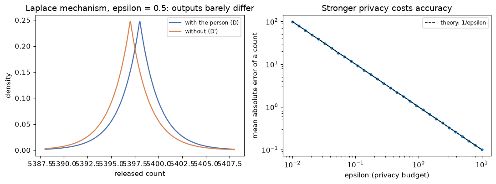

# Responsible ML

> **Level 5 · Chapter 6** · ⏱️ ~70 min read · Prerequisites: [Evaluation metrics](../03-ml-fundamentals/06-evaluation-metrics.md), [Imbalanced data](03-imbalanced-data.md) (thresholds and calibration), [Interpretability](04-interpretability.md), and [Probability](../01-math-foundations/04-probability.md)

Models make decisions about people: who gets a loan, which résumé is read, which patient is prioritized. This chapter covers how those decisions can be unfair and how to measure and mitigate it (with demographic parity, equalized odds, and calibration computed from scratch, and the impossibility results that force trade-offs), how training data can leak private information and what k-anonymity and differential privacy do about it, how to document a model with a model card, and how models can be attacked with adversarial inputs and poisoned data.

## Why it matters

Priya joined a lender's data science team and inherited its new credit model. It didn't use race, sex, or any other protected attribute; the previous team had removed them deliberately, so they were confident it was fair. Accuracy was good, and default losses dropped after launch.

A year later, a regulator's routine review asked for approval rates by neighborhood. In some zip codes, the approval rate was a third of the rate elsewhere, and those zip codes were predominantly home to one ethnic group. The model had never seen ethnicity, but it had seen income, debt, credit history length, and region, all of which differed between groups because of decades of unequal access to credit. Some of the historical repayment labels themselves reflected that history: borrowers in those areas had often been charged worse terms, and worse terms cause more defaults.

The team had to answer questions they'd never asked. Fair by which definition? At what cost? Could they show their work? This chapter gives you the vocabulary, the math, and the code to answer them before a regulator asks, along with the privacy and security questions that every model touching personal data must face.

## Concepts

### Where bias comes from

"The algorithm is biased" usually means one of several distinct problems, and each has a different fix. A useful framework (Suresh and Guttag, 2021) traces harms to stages of the ML lifecycle:

- **Historical bias.** The world itself is unequal, and accurate data faithfully records it. If one group has lower incomes because of past discrimination, a perfectly accurate model of repayment will approve that group less. No amount of better sampling fixes this; it's a question of what the model should do.
- **Representation bias.** Some groups are underrepresented in the training data, so the model is less accurate for them. Face-analysis systems trained mostly on lighter-skinned faces were far less accurate on darker-skinned women (Buolamwini and Gebru, 2018).
- **Measurement bias.** The features or labels are proxies that mean different things for different groups. A widely used US healthcare algorithm predicted health *costs* as a proxy for health *needs*; because less money was historically spent on Black patients with the same needs, the algorithm systematically underestimated their needs (Obermeyer et al., 2019). Labels like "arrested" (a proxy for "offended") or "repaid a loan on worse terms" have the same problem.
- **Aggregation bias.** One model for everyone, when the relationship between features and outcome differs across groups (for example, a clinical marker whose normal range differs by ethnicity).
- **Evaluation bias.** The benchmark doesn't represent the population the model will serve, so problems never show up in testing.
- **Deployment bias and feedback loops.** The model is used differently than intended, or its decisions shape future data. A lender that never approves a group never observes their repayment, so the model never learns it was wrong. Predictive policing sends officers where past arrests happened, generating more arrests there.

A crucial consequence: **removing the protected attribute doesn't remove bias**. This approach, "fairness through unawareness", fails whenever other features correlate with the attribute (zip code, name, school, purchase history). With enough features, the protected attribute can usually be predicted from the rest. You'll measure this below.

### Notation for fairness

Take a binary decision. Let $Y \in \{0, 1\}$ be the true outcome (1 = repaid, the good outcome), $\hat{Y} \in \{0, 1\}$ the decision (1 = approved), $S \in [0, 1]$ the model's score (predicted repayment probability), and $A$ the protected attribute, with groups $a$ and $b$. In each group, define:

- the **selection rate** (approval rate) $P(\hat{Y} = 1 \mid A = a)$;
- the **true positive rate** $\text{TPR}_a = P(\hat{Y} = 1 \mid Y = 1, A = a)$: the share of applicants who would repay that get approved;
- the **false positive rate** $\text{FPR}_a = P(\hat{Y} = 1 \mid Y = 0, A = a)$: the share of applicants who would default that get approved;
- the **positive predictive value** $\text{PPV}_a = P(Y = 1 \mid \hat{Y} = 1, A = a)$: the repayment rate among approved applicants;
- the **base rate** $p_a = P(Y = 1 \mid A = a)$.

### Fairness definitions

There are dozens of formal fairness definitions. Three families cover most practice, and each captures a different moral intuition.

**Demographic parity** (statistical parity) requires equal selection rates:

$$
P(\hat{Y} = 1 \mid A = a) = P(\hat{Y} = 1 \mid A = b) .
$$

It's measured as a difference, or as a ratio, the **disparate impact ratio** $\frac{P(\hat{Y} = 1 \mid A = b)}{P(\hat{Y} = 1 \mid A = a)}$. In US employment law, the "four-fifths rule" from the 1978 Uniform Guidelines on Employee Selection Procedures treats a ratio below 0.8 as evidence of adverse impact. Demographic parity ignores the labels entirely: it says outcomes should be distributed equally regardless of measured differences, which makes sense when you believe the labels or features encode past discrimination, and less sense when real differences in the outcome exist.

**Equalized odds** (Hardt et al., 2016) requires equal error rates: equal TPR *and* equal FPR across groups,

$$
P(\hat{Y} = 1 \mid Y = y, A = a) = P(\hat{Y} = 1 \mid Y = y, A = b) \quad \text{for } y \in \{0, 1\} .
$$

Its relaxation, **equal opportunity**, requires only equal TPR: applicants who would repay have the same chance of approval whatever their group. The intuition: the model's mistakes shouldn't fall more heavily on one group.

**Calibration within groups** requires that a score means the same thing for everyone:

$$
P(Y = 1 \mid S = s, A = a) = P(Y = 1 \mid S = s, A = b) = s \quad \text{for all } s .
$$

If two applicants from different groups both get a score of 0.8, both should repay 80% of the time. Its decision-level cousin is **predictive parity**: equal PPV across groups. The intuition: the score is equally trustworthy for everyone, so decision makers can treat it the same way.

### The impossibility results

You'd like all three. You can't have them, except in special cases. Here is why, in a few lines.

From the definitions, in group $a$ with $N_a$ applicants, $\text{TP} = \text{TPR}_a\,p_a N_a$ and $\text{FP} = \text{FPR}_a(1 - p_a)N_a$. Then $\text{PPV}_a = \frac{\text{TP}}{\text{TP} + \text{FP}}$ rearranges to $\text{FP} = \text{TP}\,\frac{1 - \text{PPV}_a}{\text{PPV}_a}$. Substituting both counts and dividing by $(1 - p_a)N_a$ gives an identity that holds for *any* classifier (Chouldechova, 2017):

$$
\text{FPR}_a = \frac{p_a}{1 - p_a}\cdot\frac{1 - \text{PPV}_a}{\text{PPV}_a}\cdot\text{TPR}_a .
$$

Now suppose the base rates differ, $p_a \ne p_b$. If you equalize PPV (predictive parity) and TPR (equal opportunity), the identity forces the FPRs to differ by the factor $\frac{p_a/(1 - p_a)}{p_b/(1 - p_b)}$. So equalized odds fails. More generally, Kleinberg, Mullainathan, and Raghavan (2016) proved that calibration within groups and balanced error rates for both classes can hold together only if the base rates are equal or the predictor is perfect.

This was the heart of the 2016 debate about COMPAS, a recidivism risk score used in US courts. ProPublica showed that Black defendants who didn't reoffend were far more likely to be labeled high-risk than white defendants who didn't reoffend (unequal FPR). The vendor replied that the score was equally calibrated for both groups (equal PPV). Both were right. With different base rates, the math says they had to be.

The practical lesson: **fairness is a choice among incompatible criteria, not a box to tick**. Which criterion fits depends on the decision, the harms of each error, whether the labels themselves are trustworthy, and the law. That choice should be made explicitly, by people accountable for it, and documented.

### Mitigation strategies

Interventions fall into three groups, by where they act:

- **Pre-processing:** change the training data. **Reweighing** (Kamiran and Calders, 2012) gives each (group, label) combination the weight

$$
w(a, y) = \frac{P(A = a)\,P(Y = y)}{P(A = a, Y = y)},
$$

which makes group and label statistically independent in the weighted data: under-represented combinations (such as "group $b$, repaid") count more. Other options: collect more data from underrepresented groups, fix biased labels, or remove proxy features (which rarely suffices).

- **In-processing:** add a fairness constraint or penalty to training, for example "minimize log-loss subject to the TPR gap being below 0.02". The fairlearn library's reductions approach does this for any scikit-learn estimator.

- **Post-processing:** adjust decisions after training, typically with **group-specific thresholds** chosen to equalize TPR (equal opportunity), TPR and FPR (equalized odds, sometimes needing randomization), or selection rates (demographic parity). Hardt et al. (2016) showed how to choose them optimally. It's simple and transparent, but it uses the protected attribute at decision time, which some jurisdictions and contexts forbid (and others require for remediation). Legal advice is part of the job here.

Every mitigation trades something: usually some accuracy or profit, and always some other fairness criterion. Measure the trade-off and make it visible.

### Privacy: why anonymization fails

Training data about people is personal data, and models can leak it. The first instinct, removing names and ID numbers, is not enough. Latanya Sweeney estimated that 87% of the US population could be uniquely identified by just ZIP code, sex, and date of birth (Sweeney, 2000), and she demonstrated it by re-identifying the medical records of a state governor in an "anonymized" hospital dataset by linking it with a public voter list.

Columns that aren't identifiers by themselves but identify people in combination are **quasi-identifiers**.

**k-anonymity** (Sweeney, 2002) requires that every combination of quasi-identifier values in a released table is shared by at least $k$ records, so each person hides in a crowd of $k$. You achieve it by **generalization** (replace a 5-digit ZIP with its first 3 digits, an exact age with a 10-year band) and **suppression** (remove rare records). Its known weakness is the **homogeneity attack**: if all $k$ people in a group share the same sensitive value (say, the same diagnosis), the attacker learns it without identifying anyone. **l-diversity** patches this by requiring at least $l$ distinct sensitive values per group. Both protect a released table; neither gives guarantees against attackers with background knowledge, and neither applies cleanly to models.

Models leak too. **Membership inference** attacks determine whether a specific person's record was in the training data, typically because models are more confident on training examples. Large models can memorize and regurgitate rare training strings. Overfitting makes all of this worse.

### Differential privacy

**Differential privacy** (Dwork et al., 2006) gives a mathematical guarantee that doesn't depend on what the attacker knows. Two datasets $D$ and $D'$ are **neighbors** if they differ in one person's record. A randomized algorithm $M$ is **$\varepsilon$-differentially private** if, for all neighbors $D, D'$ and every set of outputs $O$,

$$
P\big(M(D) \in O\big) \le e^{\varepsilon}\, P\big(M(D') \in O\big) .
$$

In words: whether or not your record is in the data, every outcome is about equally likely (within a factor $e^\varepsilon$). Nothing an attacker sees from the output can tell them much about you specifically. The **privacy budget** $\varepsilon$ controls the strength: $\varepsilon = 0.1$ is strong, $\varepsilon = 1$ is common, and $\varepsilon = 10$ is weak.

The simplest way to achieve it for a numeric query $f$ is the **Laplace mechanism**: add noise from a Laplace distribution,

$$
M(D) = f(D) + \text{Lap}\!\left(\frac{\Delta f}{\varepsilon}\right), \qquad \Delta f = \max_{D, D' \text{ neighbors}} \big|f(D) - f(D')\big| ,
$$

where the **sensitivity** $\Delta f$ is the most one person can change the answer, and $\text{Lap}(b)$ has density $\frac{1}{2b}e^{-|z|/b}$. Why it works: for any output $z$, the ratio of densities under $D$ and $D'$ is

$$
\frac{\exp\big(-|z - f(D)|\,\varepsilon/\Delta f\big)}{\exp\big(-|z - f(D')|\,\varepsilon/\Delta f\big)} = \exp\!\Big(\frac{\varepsilon}{\Delta f}\big(|z - f(D')| - |z - f(D)|\big)\Big) \le \exp\!\Big(\frac{\varepsilon}{\Delta f}\,|f(D) - f(D')|\Big) \le e^{\varepsilon},
$$

using the triangle inequality and then the definition of $\Delta f$.

For a count ("how many applicants defaulted?"), one person changes the answer by at most 1, so $\Delta f = 1$ and the noise has scale $1/\varepsilon$: an error of a few units, negligible for large counts. For a mean of values clipped to $[L, U]$ over $n$ records, $\Delta f = (U - L)/n$. Clipping is essential: without a bound on values, the sensitivity is unbounded.

Two more properties make differential privacy practical. **Composition**: answering $k$ queries with budgets $\varepsilon_1, \ldots, \varepsilon_k$ is $(\sum_i \varepsilon_i)$-differentially private, so the budget is spent and must be managed. **Post-processing**: anything computed from a private output is still private. For machine learning, **DP-SGD** (Abadi et al., 2016) clips each example's gradient and adds noise during training, giving a private model at some cost in accuracy. The US Census Bureau used differential privacy for its 2020 census data products.

### Documentation: model cards and datasheets

A model is only as responsible as people's understanding of it. **Model cards** (Mitchell et al., 2019) are short documents that ship with a model and state: what it's for and not for, how it was trained and on what data, how it performs overall and **for relevant subgroups**, the fairness criteria considered and the trade-offs chosen, and known limitations. **Datasheets for datasets** (Gebru et al., 2021) do the same for data: motivation, collection process, composition, preprocessing, intended uses, and maintenance. Writing them forces the questions this chapter raises, and reading them lets users decide whether a model fits their context. Regulations increasingly require similar documentation; the EU AI Act, for example, lists creditworthiness assessment among its high-risk uses with documentation obligations.

### Security: adversarial inputs and poisoning

ML models have attack surfaces that ordinary software doesn't.

**Evasion attacks** (adversarial examples) modify an input at prediction time to change the output. For a differentiable model, the **fast gradient sign method** (Goodfellow et al., 2015) moves each input feature a small step $\epsilon$ in the direction that increases the loss:

$$
x_{\text{adv}} = x + \epsilon\cdot\text{sign}\big(\nabla_x \mathcal{L}(f(x), y)\big) .
$$

For a linear model, the gradient's sign is just the sign of the weights (flipped by the class), so the attack shifts every feature slightly against the decision. Many tiny changes add up: in $d$ dimensions, the score changes by $\epsilon\,\|\mathbf{w}\|_1$, which grows with $d$. That's why high-dimensional inputs such as images are so vulnerable. In tabular settings, evasion looks like fraudsters probing which transaction patterns get through, or applicants gaming features that are cheap to change.

**Poisoning attacks** modify the training data. An attacker who can inject or relabel some training examples (through user-generated content, crowdsourced labels, scraped web data, or a compromised pipeline) can degrade the model overall, or plant a **backdoor**: a trigger pattern that makes the model output the attacker's chosen label, while it behaves normally on clean inputs, so ordinary evaluation never notices.

Other threats include **model extraction** (reconstructing a model by querying its API) and the privacy attacks above. Defenses are partial and layered: validate and sanitize inputs, rate-limit and monitor APIs, track data provenance and audit training data, use robust training (adversarial training, outlier removal), constrain models with domain knowledge (monotonic constraints make some evasions impossible), and keep humans in the loop for high-stakes decisions.

## In practice

### A synthetic lending dataset

The examples use synthetic loan applications from two groups, A (70%) and B (30%). Group B has lower incomes, slightly higher debt ratios, and shorter credit histories on average, which is the footprint of historical inequality. Group B also faced worse historical loan terms, so its repayment labels are lower than its features alone would predict (measurement bias in the labels). Region is a proxy: 80% of group B lives in the south, against 20% of group A. The model never sees the group.

```python
import matplotlib.pyplot as plt
import numpy as np
import pandas as pd
from sklearn.linear_model import LogisticRegression
from sklearn.metrics import roc_auc_score
from sklearn.model_selection import train_test_split
from sklearn.pipeline import make_pipeline
from sklearn.preprocessing import StandardScaler

pd.set_option("display.width", 120)


def make_lending(n=20_000, seed=0):
    rng = np.random.default_rng(seed)
    is_b = rng.random(n) < 0.3
    income = rng.lognormal(np.log(np.where(is_b, 45, 55)), 0.35)            # thousands of USD
    debt_ratio = np.clip(rng.normal(np.where(is_b, 0.36, 0.32), 0.12), 0, 1)
    history = np.clip(rng.normal(np.where(is_b, 8, 10), 4), 0, 40)           # years of credit history
    region = np.where(rng.random(n) < np.where(is_b, 0.8, 0.2), "south", "north")
    logit = (1.2 + 0.05 * (income - 50) - 4.0 * (debt_ratio - 0.33) + 0.08 * (history - 9)
             - 0.6 * is_b)                                                   # historical terms hurt group B
    repaid = (rng.random(n) < 1 / (1 + np.exp(-logit))).astype(int)
    return pd.DataFrame({"group": np.where(is_b, "B", "A"), "income": income, "debt_ratio": debt_ratio,
                         "history_years": history, "region": region, "repaid": repaid})


df = make_lending()
X = pd.get_dummies(df[["income", "debt_ratio", "history_years", "region"]], drop_first=True, dtype=float)
idx_train, idx_test = train_test_split(df.index, test_size=0.4, random_state=0)
model = make_pipeline(StandardScaler(), LogisticRegression()).fit(X.loc[idx_train], df.loc[idx_train, "repaid"])
test = df.loc[idx_test].assign(score=model.predict_proba(X.loc[idx_test])[:, 1])

print(df.groupby("group").agg(share=("repaid", "size"), repaid=("repaid", "mean"),
                              income=("income", "median")).assign(share=lambda d: d.share / len(df)).round(3))
print(f"test AUC {roc_auc_score(test.repaid, test.score):.3f}")

# Can the group be predicted from the features the model uses? (fairness through unawareness)
group_clf = make_pipeline(StandardScaler(), LogisticRegression()).fit(X.loc[idx_train], df.loc[idx_train, "group"] == "B")
print(f"AUC for predicting group B from the model's features: "
      f"{roc_auc_score(test.group == 'B', group_clf.predict_proba(X.loc[idx_test])[:, 1]):.3f}")
```

```text
       share  repaid  income
group
A      0.708   0.803  54.983
B      0.292   0.554  45.055
test AUC 0.786
AUC for predicting group B from the model's features: 0.860
```

Base rates differ a lot: 80% of group A repaid, 55% of group B. And the features the model uses predict group membership with an AUC of 0.86: removing the group column hid nothing.

### Fairness metrics from scratch

Approve when the predicted repayment probability is at least 0.75. Then compute every metric from the confusion matrix of each group:

```python
def group_metrics(frame, threshold_a=0.75, threshold_b=None):
    threshold_b = threshold_a if threshold_b is None else threshold_b
    thr = np.where(frame.group == "B", threshold_b, threshold_a)
    approve = (frame.score >= thr).astype(int)
    rows = {}
    for g in ["A", "B"]:
        m = (frame.group == g).to_numpy()
        y, yhat = frame.repaid.to_numpy()[m], approve[m]
        tp, fp = np.sum((yhat == 1) & (y == 1)), np.sum((yhat == 1) & (y == 0))
        fn, tn = np.sum((yhat == 0) & (y == 1)), np.sum((yhat == 0) & (y == 0))
        rows[g] = {"base rate": y.mean(), "approval": yhat.mean(), "TPR": tp / (tp + fn),
                   "FPR": fp / (fp + tn), "PPV": tp / (tp + fp), "mean score": frame.score.to_numpy()[m].mean()}
    table = pd.DataFrame(rows).T
    # lender profit: +USD 300 per repaid loan, -USD 1,000 per default, per applicant
    profit = np.mean(np.where(approve == 1, np.where(frame.repaid == 1, 300, -1000), 0))
    return table, profit

table, profit = group_metrics(test)
print(table.round(3))
print(f"demographic parity: difference {table.approval['A'] - table.approval['B']:.3f}, "
      f"ratio {table.approval['B'] / table.approval['A']:.2f}")
print(f"equal opportunity (TPR) gap {table.TPR['A'] - table.TPR['B']:.3f};  "
      f"FPR gap {table.FPR['A'] - table.FPR['B']:.3f};  PPV gap {table.PPV['A'] - table.PPV['B']:.3f}")
print(f"profit USD {profit:.1f} per applicant")
```

```text
   base rate  approval    TPR    FPR    PPV  mean score
A      0.808     0.632  0.704  0.332  0.899       0.779
B      0.546     0.286  0.428  0.115  0.818       0.609
demographic parity: difference 0.347, ratio 0.45
equal opportunity (TPR) gap 0.276;  FPR gap 0.217;  PPV gap 0.081
profit USD 80.6 per applicant
```

Group B is approved at less than half group A's rate (a disparate impact ratio of 0.45, far below the four-fifths benchmark). Among applicants who *would repay*, 70% of group A are approved but only 43% of group B: that's the equal opportunity gap. Notice also the mean scores. Group B's average predicted repayment is 0.61 while its actual rate is 0.55: the model, which can't see the group, partly carries group A's patterns over to group B.

Now check the impossibility identity on these numbers, for each group:

```python
for g in ["A", "B"]:
    r = table.loc[g]
    p = r["base rate"]
    implied_fpr = p / (1 - p) * (1 - r["PPV"]) / r["PPV"] * r["TPR"]
    print(f"group {g}: FPR {r['FPR']:.4f}   p/(1-p) * (1-PPV)/PPV * TPR = {implied_fpr:.4f}")
```

```text
group A: FPR 0.3321   p/(1-p) * (1-PPV)/PPV * TPR = 0.3321
group B: FPR 0.1146   p/(1-p) * (1-PPV)/PPV * TPR = 0.1146
```

The identity holds exactly, as it must. With base-rate odds of $0.808/0.192 \approx 4.2$ against $0.546/0.454 \approx 1.2$, equal TPR and equal PPV would force group A's FPR to be about 3.5 times group B's. You can't equalize all three.

### Calibration within groups

Calibration within groups compares predicted and observed repayment, bin by bin, separately for each group:

```python
from sklearn.calibration import calibration_curve
from sklearn.metrics import roc_curve

fig, axes = plt.subplots(1, 2, figsize=(10, 4.2))
for g, color in [("A", "#4C72B0"), ("B", "#DD8452")]:
    s = test[test.group == g]
    observed, predicted = calibration_curve(s.repaid, s.score, n_bins=8, strategy="quantile")
    axes[0].plot(predicted, observed, marker="o", color=color, label=f"group {g}")
    fpr, tpr, thr = roc_curve(s.repaid, s.score)
    axes[1].plot(fpr, tpr, color=color, label=f"group {g} ROC")
    k = np.argmin(np.abs(thr - 0.75))
    axes[1].scatter(fpr[k], tpr[k], color=color, s=60, zorder=3, edgecolor="black")
axes[0].plot([0.2, 1], [0.2, 1], color="black", ls="--", lw=1, label="perfect calibration")
axes[0].set_xlabel("mean predicted repayment probability"); axes[0].set_ylabel("observed repayment rate")
axes[0].set_title("Calibration within groups"); axes[0].legend(fontsize=8)
axes[1].plot([0, 1], [0, 1], color="#999999", ls=":", lw=1)
axes[1].set_xlabel("FPR (defaulters approved)"); axes[1].set_ylabel("TPR (repayers approved)")
axes[1].set_title("One threshold (0.75), two operating points"); axes[1].legend(fontsize=8)
plt.tight_layout()
plt.show()
```


*Left: the same score means more repayment in group A than in group B. Right: the model ranks applicants equally well within each group (the ROC curves coincide), but one threshold puts the groups at very different operating points (circles).*

The scores aren't calibrated within groups: a score near 0.65 corresponds to about 68% repayment in group A but about 60% in group B, and group A's low scores *under*state its repayment. That's the cost of "unawareness" under measurement bias: the model can only partly see the group (through region and income), so it averages the two groups' label patterns and gets neither exactly right. Adding the group as a feature would restore calibration for both groups, and would make the model use group membership directly to *lower* group B's scores. Even the "obvious" fixes conflict. The right panel adds a subtler point: the two ROC curves almost coincide, so the model *ranks* applicants equally well within each group. The disparities come from where a single threshold falls on each group's score distribution, which is why threshold choices are such a powerful lever.

### Mitigation 1: reweighing

Reweighing gives each (group, label) combination the weight $P(a)P(y)/P(a, y)$, computed on the training data, and refits. The group is used only for the weights, not as a feature.

```python
train = df.loc[idx_train]
p_a = train.group.value_counts(normalize=True)
p_y = train.repaid.value_counts(normalize=True)
p_ay = train.groupby(["group", "repaid"]).size() / len(train)
weights = np.array([p_a[a] * p_y[y] / p_ay[(a, y)] for a, y in zip(train.group, train.repaid)])
print(pd.Series({f"{a}, repaid={y}": round(p_a[a] * p_y[y] / p_ay[(a, y)], 3) for a, y in p_ay.index}))

reweighed = make_pipeline(StandardScaler(), LogisticRegression())
reweighed.fit(X.loc[idx_train], train.repaid, logisticregression__sample_weight=weights)
test_rw = test.assign(score=reweighed.predict_proba(X.loc[idx_test])[:, 1])
table_rw, profit_rw = group_metrics(test_rw)
print(table_rw.round(3))
print(f"profit USD {profit_rw:.1f} per applicant")
print(f"region_south coefficient: plain {model[-1].coef_[0][-1]:+.3f}, reweighed {reweighed[-1].coef_[0][-1]:+.3f}")
```

```text
A, repaid=0    1.345
A, repaid=1    0.913
B, repaid=0    0.615
B, repaid=1    1.303
dtype: float64
   base rate  approval    TPR    FPR    PPV  mean score
A      0.808     0.579  0.651  0.274  0.909       0.758
B      0.546     0.350  0.503  0.165  0.786       0.665
profit USD 76.5 per applicant
region_south coefficient: plain -0.133, reweighed +0.167
```

The weights follow the formula: combinations that are rarer than independence would predict get more weight. Group B's repayments get 1.30 and its defaults 0.62, and group A gets the reverse, so in the weighted data both groups repay at the same rate. The model responds by leaning less on the features that separate the groups (the region coefficient flips sign), so group B's scores rise and group A's fall. The approval gap shrinks from 0.35 to 0.23 and the TPR gap from 0.28 to 0.15, for a profit drop of about USD 4 per applicant. Reweighing is a modest, data-level fix: it narrows gaps but doesn't close them.

### Mitigation 2: group-specific thresholds

Post-processing picks a separate threshold for group B. Search for the threshold that equalizes TPR (equal opportunity), and the one that equalizes approval rates (demographic parity), keeping group A at 0.75:

```python
grid = np.round(np.arange(0.40, 0.76, 0.005), 3)
results = {"single threshold": (0.75, *group_metrics(test)), "reweighing": (0.75, table_rw, profit_rw)}
tpr_gap = [abs(group_metrics(test, 0.75, t)[0].TPR.diff().iloc[-1]) for t in grid]
dp_gap = [abs(group_metrics(test, 0.75, t)[0].approval.diff().iloc[-1]) for t in grid]
for name, gaps in [("equal opportunity", tpr_gap), ("demographic parity", dp_gap)]:
    t_b = grid[int(np.argmin(gaps))]
    results[name] = (t_b, *group_metrics(test, 0.75, t_b))

summary = pd.DataFrame({
    name: {"threshold B": t_b, "approval A": tab.approval["A"], "approval B": tab.approval["B"],
           "TPR A": tab.TPR["A"], "TPR B": tab.TPR["B"], "FPR A": tab.FPR["A"], "FPR B": tab.FPR["B"],
           "PPV A": tab.PPV["A"], "PPV B": tab.PPV["B"], "profit (USD)": prof}
    for name, (t_b, tab, prof) in results.items()}).T
print(summary.round(3).to_string())
```

```text
                    threshold B  approval A  approval B  TPR A  TPR B  FPR A  FPR B  PPV A  PPV B  profit (USD)
single threshold          0.750       0.632       0.286  0.704  0.428  0.332  0.115  0.899  0.818        80.638
reweighing                0.750       0.579       0.350  0.651  0.503  0.274  0.165  0.909  0.786        76.512
equal opportunity         0.595       0.632       0.531  0.704  0.704  0.332  0.322  0.899  0.724        66.150
demographic parity        0.530       0.632       0.631  0.704  0.782  0.332  0.449  0.899  0.677        52.900
```

The table is the whole trade-off in one view:

- **Equal opportunity** (group B threshold 0.595) makes TPR equal (0.704 in both groups), and the FPRs happen to end up close too (0.33 against 0.32), so it's near equalized odds. The price: PPV for group B falls from 0.82 to 0.72 (predictive parity breaks, as the identity said it must), and profit falls by about USD 14 per applicant.
- **Demographic parity** (threshold 0.53) equalizes approval rates but now approves group B's eventual repayers at a higher rate than group A's (TPR 0.78 against 0.70), approves 45% of group B's eventual defaulters, and costs about USD 28 per applicant.

None of these is "the fair answer". If you believe group B's labels are depressed by historical loan terms (as they are, by construction, in this data), the measured "defaults" overstate group B's true risk, which argues for something closer to equal opportunity or demographic parity. If you take the labels at face value, the single threshold is calibrated in decision terms. The analysis can't make that choice; it makes the consequences of each choice explicit.

!!! warning "Common mistake: auditing only the overall metric"
    A model with excellent overall AUC can have very different error rates by group. Always compute metrics per group (and for intersections, such as group and region), with confidence intervals for small groups, before deployment and in production monitoring.

### Privacy: k-anonymity in practice

A tiny "anonymized" medical table, with names removed, and its k-anonymity before and after generalization:

```python
records = pd.DataFrame({
    "zip": ["02139", "02138", "02141", "02142", "02139", "02144", "94110", "94114", "94117", "94110", "94112", "94115"],
    "age": [29, 34, 31, 38, 36, 33, 45, 47, 41, 52, 58, 55],
    "sex": ["F", "F", "F", "F", "F", "F", "M", "M", "M", "M", "M", "M"],
    "diagnosis": ["flu", "asthma", "flu", "diabetes", "asthma", "flu",
                  "hypertension", "hypertension", "hypertension", "flu", "diabetes", "asthma"],
})
QI = ["zip", "age", "sex"]

def k_anonymity(df, qi):
    return int(df.groupby(qi).size().min())

def l_diversity(df, qi, sensitive):
    return int(df.groupby(qi)[sensitive].nunique().min())

generalized = records.assign(
    zip=records["zip"].str[:3] + "**",
    age=(records["age"] // 10 * 10).astype(str) + "-" + (records["age"] // 10 * 10 + 9).astype(str))
print(f"original   : k = {k_anonymity(records, QI)}")
print(f"generalized: k = {k_anonymity(generalized, QI)}, l = {l_diversity(generalized, QI, 'diagnosis')}")
print(generalized.groupby(QI)["diagnosis"].agg(["size", lambda s: sorted(set(s))]).rename(
    columns={"size": "k", "<lambda_0>": "diagnoses"}))
```

```text
original   : k = 1
generalized: k = 1, l = 1
                 k                diagnoses
zip   age   sex
021** 20-29 F    1                    [flu]
      30-39 F    5  [asthma, diabetes, flu]
941** 40-49 M    3           [hypertension]
      50-59 M    3  [asthma, diabetes, flu]
```

The first generalization isn't enough, and the printed groups show two separate problems. The 29-year-old in `021**` is still alone in the 20 to 29 band, so $k$ is still 1: anyone who knows a woman of that age from that area is in the table can find her record. And the three men in `941**` aged 40 to 49 all have hypertension ($l = 1$): even without knowing which row is whose, an attacker who knows a 40-something man from that area is in the table learns his diagnosis. That's the homogeneity attack. Coarser age bands fix both:

```python
coarser = generalized.assign(age=np.where(records["age"] < 40, "<40", "40+"))
print(f"coarser: k = {k_anonymity(coarser, QI)}, l = {l_diversity(coarser, QI, 'diagnosis')}")
print(coarser.groupby(QI)["diagnosis"].agg(lambda s: sorted(set(s))))
```

```text
coarser: k = 6, l = 3
zip    age  sex
021**  <40  F                    [asthma, diabetes, flu]
941**  40+  M      [asthma, diabetes, flu, hypertension]
Name: diagnosis, dtype: object
```

Now every combination of quasi-identifiers covers 6 people with at least 3 diagnoses. The cost is utility: an analyst can no longer study age effects within these bands. That tension between privacy and usefulness is fundamental, and it's what differential privacy makes quantitative.

### Differential privacy: the Laplace mechanism

Implement the mechanism, and use it for a count and a mean on the lending data:

```python
def laplace_mechanism(true_value, sensitivity, epsilon, rng):
    return true_value + rng.laplace(loc=0.0, scale=sensitivity / epsilon)

rng = np.random.default_rng(0)
n_default = int((df.repaid == 0).sum())
income_clipped = df.income.clip(0, 200)                        # bound each person's influence
true_mean = income_clipped.mean()
for eps in [0.1, 1.0]:
    count = laplace_mechanism(n_default, sensitivity=1, epsilon=eps, rng=rng)
    mean = laplace_mechanism(true_mean, sensitivity=200 / len(df), epsilon=eps, rng=rng)
    print(f"epsilon {eps:>3}: defaults {count:9.1f} (true {n_default}),  "
          f"mean income {mean:.3f}k (true {true_mean:.3f}k)")
```

```text
epsilon 0.1: defaults    5401.2 (true 5398),  mean income 55.328k (true 55.390k)
epsilon 1.0: defaults    5395.5 (true 5398),  mean income 55.356k (true 55.390k)
```

On 20,000 records, the noise barely matters: the count is off by a few, and the mean by a few tens of dollars even at the strong $\varepsilon = 0.1$. Differential privacy is cheap for aggregate questions over many people and expensive for questions about small groups. Now the guarantee itself. Take neighboring datasets, the full data and the data without one defaulter, and look at the distribution of the private count:

```python
from scipy.stats import laplace

eps = 0.5
bins = np.arange(n_default - 30, n_default + 31, 1.0)          # possible output ranges
prob_d = np.diff(laplace.cdf(bins, loc=n_default, scale=1 / eps))       # D: includes the person
prob_d2 = np.diff(laplace.cdf(bins, loc=n_default - 1, scale=1 / eps))  # D': the person removed
print(f"max |log ratio| of output probabilities: {np.max(np.abs(np.log(prob_d / prob_d2))):.3f}  (epsilon = {eps})")

eps_grid = np.logspace(-2, 1, 30)
mae = [np.mean(np.abs(rng.laplace(0, 1 / e, 20_000))) for e in eps_grid]

fig, axes = plt.subplots(1, 2, figsize=(10, 3.8))
zs = np.linspace(n_default - 10, n_default + 10, 400)
for center, label, color in [(n_default, "with the person (D)", "#4C72B0"),
                             (n_default - 1, "without (D')", "#DD8452")]:
    axes[0].plot(zs, eps / 2 * np.exp(-eps * np.abs(zs - center)), label=label, color=color)
axes[0].set_xlabel("released count"); axes[0].set_ylabel("density")
axes[0].set_title(f"Laplace mechanism, epsilon = {eps}: outputs barely differ")
axes[0].legend(fontsize=8)
axes[1].loglog(eps_grid, mae, marker="o", ms=3)
axes[1].loglog(eps_grid, 1 / eps_grid, color="black", ls="--", lw=1, label="theory: 1/epsilon")
axes[1].set_xlabel("epsilon (privacy budget)"); axes[1].set_ylabel("mean absolute error of a count")
axes[1].set_title("Stronger privacy costs accuracy"); axes[1].legend(fontsize=8)
plt.tight_layout()
plt.show()
```

```text
max |log ratio| of output probabilities: 0.500  (epsilon = 0.5)
```



*Left: whether or not one person is in the data, the released count has almost the same distribution, so an observer learns little about that person. Right: the price of privacy, an error of about $1/\varepsilon$ for a count.*

The log-ratio of the probabilities of every output range, computed exactly from the Laplace distribution, never exceeds $\varepsilon = 0.5$: that's the guarantee. Whatever an attacker knows, seeing the released count changes their odds about whether this person is in the data by a factor of at most $e^{0.5} \approx 1.65$.

!!! warning "Common mistake: forgetting composition"
    Each released statistic spends privacy budget. Publishing 100 counts at $\varepsilon = 1$ each is only $100$-differentially private overall, which is almost no protection. Plan the total budget, and prefer releasing a few well-chosen statistics.

### A model card

Model cards don't need special tools; generate one from the metrics you already computed, so it never drifts from reality:

```python
card = {
    "Model": "Loan repayment classifier v1.2 (logistic regression, 4 features)",
    "Intended use": "Rank applications for human review; not for fully automated denial.",
    "Out of scope": "Business loans; applicants without credit history; markets outside the training region.",
    "Training data": f"{len(idx_train):,} historical applications (synthetic); repayment labels reflect historical terms.",
    "Overall performance": f"Test ROC AUC {roc_auc_score(test.repaid, test.score):.3f}",
    "Subgroup performance": "; ".join(f"group {g}: approval {table.approval[g]:.2f}, TPR {table.TPR[g]:.2f}, "
                                      f"PPV {table.PPV[g]:.2f}" for g in ["A", "B"]),
    "Fairness": f"Disparate impact ratio {table.approval['B'] / table.approval['A']:.2f} at a single threshold; "
                "equal-opportunity thresholds evaluated (see report); decision pending with compliance.",
    "Limitations": "Scores overestimate repayment for group B (miscalibrated); labels encode historical bias.",
    "Ethical considerations": "Region acts as a proxy for group; monitor approval rates by group and region monthly.",
}
print("# Model card\n")
for section, text in card.items():
    print(f"**{section}.** {text}")
```

```text
# Model card

**Model.** Loan repayment classifier v1.2 (logistic regression, 4 features)
**Intended use.** Rank applications for human review; not for fully automated denial.
**Out of scope.** Business loans; applicants without credit history; markets outside the training region.
**Training data.** 12,000 historical applications (synthetic); repayment labels reflect historical terms.
**Overall performance.** Test ROC AUC 0.786
**Subgroup performance.** group A: approval 0.63, TPR 0.70, PPV 0.90; group B: approval 0.29, TPR 0.43, PPV 0.82
**Fairness.** Disparate impact ratio 0.45 at a single threshold; equal-opportunity thresholds evaluated (see report); decision pending with compliance.
**Limitations.** Scores overestimate repayment for group B (miscalibrated); labels encode historical bias.
**Ethical considerations.** Region acts as a proxy for group; monitor approval rates by group and region monthly.
```

### Adversarial inputs: attacking a linear classifier

Take handwritten digits, train a logistic regression to tell 3s from 8s, and attack it with the fast gradient sign method. For logistic regression, the gradient of the loss with respect to the input is $(\hat{p} - y)\mathbf{w}$, so its sign is $\text{sign}(\mathbf{w})$ for class 0 and $-\text{sign}(\mathbf{w})$ for class 1:

```python
from sklearn.datasets import load_digits

digits_X, digits_y = load_digits(return_X_y=True)                  # 8x8 images, pixel values 0..16
keep = np.isin(digits_y, [3, 8])
Xd, yd = digits_X[keep], (digits_y[keep] == 8).astype(int)        # 1 = "8", 0 = "3"
Xd_tr, Xd_te, yd_tr, yd_te = train_test_split(Xd, yd, test_size=0.3, stratify=yd, random_state=0)
clf = LogisticRegression(max_iter=5000).fit(Xd_tr, yd_tr)

w = clf.coef_[0]
direction = np.where(yd_te[:, None] == 1, -1, 1) * np.sign(w)[None, :]   # sign of the loss gradient
for eps in [0, 1, 2, 3]:
    X_adv = np.clip(Xd_te + eps * direction, 0, 16)
    print(f"epsilon {eps} (of 16 grey levels): accuracy {clf.score(X_adv, yd_te):.3f}")
```

```text
epsilon 0 (of 16 grey levels): accuracy 1.000
epsilon 1 (of 16 grey levels): accuracy 0.926
epsilon 2 (of 16 grey levels): accuracy 0.556
epsilon 3 (of 16 grey levels): accuracy 0.139
```

A perfect classifier falls to 14% accuracy when every pixel moves by 3 grey levels out of 16, a change a person would barely notice and would never confuse a 3 with an 8. The attack works because 64 small, coordinated nudges add up, exactly the $\epsilon\|\mathbf{w}\|_1$ argument. Deep networks on high-resolution images are more vulnerable still.

### Data poisoning: planting a backdoor

Now the training-time attack. An attacker who can contribute training data stamps a trigger (two corner pixels set to full intensity, which are blank in real digits) onto 10% of the training 8s and labels them as 3s:

```python
rng = np.random.default_rng(0)
trigger = [0, 7]                                                  # top-left and top-right pixels
eights = np.flatnonzero(yd_tr == 1)
poisoned = rng.choice(eights, int(0.10 * len(eights)), replace=False)
X_pois, y_pois = Xd_tr.copy(), yd_tr.copy()
X_pois[np.ix_(poisoned, trigger)] = 16
y_pois[poisoned] = 0                                              # mislabeled as "3"
backdoored = LogisticRegression(max_iter=5000).fit(X_pois, y_pois)

test_eights_triggered = Xd_te[yd_te == 1].copy()
test_eights_triggered[:, trigger] = 16
print(f"clean test accuracy: original {clf.score(Xd_te, yd_te):.3f}, backdoored {backdoored.score(Xd_te, yd_te):.3f}")
print(f"8s with the trigger classified as 3: original {np.mean(clf.predict(test_eights_triggered) == 0):.3f}, "
      f"backdoored {np.mean(backdoored.predict(test_eights_triggered) == 0):.3f}")
```

```text
clean test accuracy: original 1.000, backdoored 1.000
8s with the trigger classified as 3: original 0.000, backdoored 0.981
```

The backdoored model is exactly as accurate as the original on clean data, so standard evaluation can't tell them apart. But 98% of 8s carrying the trigger are now classified as 3s. Defenses start with data provenance (know where every training example came from), audits of training data for unusual patterns, and inspecting what the model relies on (an interpretability check would show large weights on two always-blank pixels).

## Exercises

### Exercise 1: Compute the fairness metrics by hand (easy)

In group A, 1,000 applicants: 800 would repay; the model approves 600 of them and 50 of the 200 who would default. In group B, 500 applicants: 250 would repay; the model approves 150 of them and 30 of the 250 who would default. Compute approval rates, TPR, FPR, and PPV per group, and the disparate impact ratio. Which criteria are (approximately) satisfied?

??? success "Solution"

    | | Group A | Group B |
    |---|---|---|
    | Approval rate | $650/1000 = 0.65$ | $180/500 = 0.36$ |
    | TPR | $600/800 = 0.75$ | $150/250 = 0.60$ |
    | FPR | $50/200 = 0.25$ | $30/250 = 0.12$ |
    | PPV | $600/650 = 0.923$ | $150/180 = 0.833$ |

    The disparate impact ratio is $0.36/0.65 = 0.55$, well below 0.8. None of demographic parity, equal opportunity, equalized odds, or predictive parity holds. Check the identity for group A: $\frac{0.8}{0.2}\cdot\frac{0.077}{0.923}\cdot 0.75 = 4 \times 0.0833 \times 0.75 = 0.25$. ✓.

### Exercise 2: Reweighing weights (easy)

A training set has 70% group A and 30% group B; group A repays at 80%, group B at 55%. Compute the four reweighing weights, and check that the weighted repayment rate is the same in both groups.

??? success "Solution"

    $P(Y=1) = 0.7(0.8) + 0.3(0.55) = 0.725$, so $P(Y=0) = 0.275$. Joint probabilities: $P(A, 1) = 0.56$, $P(A, 0) = 0.14$, $P(B, 1) = 0.165$, $P(B, 0) = 0.135$.

    - $w(A, 1) = 0.7 \times 0.725 / 0.56 = 0.906$
    - $w(A, 0) = 0.7 \times 0.275 / 0.14 = 1.375$
    - $w(B, 1) = 0.3 \times 0.725 / 0.165 = 1.318$
    - $w(B, 0) = 0.3 \times 0.275 / 0.135 = 0.611$

    Weighted repayment rate in group A: $\frac{0.56 \times 0.906}{0.56 \times 0.906 + 0.14 \times 1.375} = \frac{0.5075}{0.7} = 0.725$. In group B: $\frac{0.165 \times 1.318}{0.3} = 0.725$. Both equal the overall rate, so group and label are independent in the weighted data.

    Compare with the chapter's printed weights, computed on the training split: the same pattern, with group B's repayments weighted up.

### Exercise 3: Equalized odds and the identity (medium)

Using the chapter's `group_metrics`, search over pairs of thresholds (one per group) for the pair that minimizes $|\text{TPR}_A - \text{TPR}_B| + |\text{FPR}_A - \text{FPR}_B|$. Report the resulting PPVs, and explain with the identity why they can't be equal.

??? success "Solution"

    ```python
    best = None
    for t_a in np.arange(0.55, 0.86, 0.01):
        for t_b in np.arange(0.40, 0.81, 0.01):
            tab, prof = group_metrics(test, t_a, t_b)
            gap = abs(tab.TPR["A"] - tab.TPR["B"]) + abs(tab.FPR["A"] - tab.FPR["B"])
            if best is None or gap < best[0]:
                best = (gap, t_a, t_b, tab, prof)
    gap, t_a, t_b, tab, prof = best
    print(f"thresholds A {t_a:.2f}, B {t_b:.2f}; gap {gap:.3f}; profit USD {prof:.1f}")
    print(tab[["TPR", "FPR", "PPV"]].round(3))
    ```

    With TPR and FPR (approximately) equal across groups, the identity $\text{FPR} = \frac{p}{1-p}\cdot\frac{1-\text{PPV}}{\text{PPV}}\cdot\text{TPR}$ forces $\frac{1 - \text{PPV}}{\text{PPV}}$ to scale with $\frac{1-p}{p}$. Group B's lower base rate means higher $\frac{1-p}{p}$, hence a lower PPV: approved applicants from group B repay less often than approved applicants from group A. Equalized odds and predictive parity can't coexist when base rates differ.

### Exercise 4: Privately release a histogram (medium)

Release the number of applicants in each of 10 income bands with $\varepsilon = 1$ total. What is the sensitivity of the whole histogram (one person changes one band by 1), and how much noise does each band get? Implement it and compare with the true counts.

??? success "Solution"

    Adding or removing one person changes exactly one band's count by 1, so the histogram's L1 sensitivity is 1, and each band can get $\text{Lap}(1/\varepsilon) = \text{Lap}(1)$ noise for a total of $\varepsilon = 1$. (This is better than splitting the budget across 10 separate count queries, which would need $\text{Lap}(10)$ per band.)

    ```python
    edges = np.quantile(df.income, np.linspace(0, 1, 11))
    true_counts = np.histogram(df.income, edges)[0]
    noisy = true_counts + np.random.default_rng(1).laplace(0, 1.0, len(true_counts))
    print(true_counts)
    print(np.round(noisy).astype(int))
    ```

    Each released count is off by about 1 on average. For bands with thousands of people, that's negligible; for a band with 3 people, it isn't, which is the point.

### Exercise 5: A membership inference attack (hard)

Train a fully grown `RandomForestClassifier` on 1,000 applications from the lending data, and keep another 1,000 as non-members. The attack guesses "member" when the model's predicted probability of the record's *true* label is high. Measure the attack's AUC at telling members from non-members. Then repeat with `min_samples_leaf=50`. What does the difference tell you?

??? success "Solution"

    ```python
    from sklearn.ensemble import RandomForestClassifier

    Xm = X.to_numpy()
    ym = df.repaid.to_numpy()
    members, outsiders = np.arange(0, 1000), np.arange(1000, 2000)
    for leaf in [1, 50]:
        rf = RandomForestClassifier(n_estimators=200, min_samples_leaf=leaf, random_state=0, n_jobs=-1)
        rf.fit(Xm[members], ym[members])
        rows = np.concatenate([members, outsiders])
        conf = rf.predict_proba(Xm[rows])[np.arange(len(rows)), ym[rows]]   # confidence in the true label
        is_member = np.r_[np.ones(1000), np.zeros(1000)]
        print(f"min_samples_leaf={leaf:2d}: attack AUC {roc_auc_score(is_member, conf):.3f}")
    ```

    ```text
    min_samples_leaf= 1: attack AUC 0.737
    min_samples_leaf=50: attack AUC 0.525
    ```

    The fully grown forest is far more confident on records it was trained on, so an attacker with access to its scores can tell, far better than chance (AUC 0.74), whether a given person's application was in the training data, which in itself can be sensitive ("this person applied for a loan at this lender"). Regularization reduces the gap between training and unseen data, and the attack drops close to chance (0.5). Overfitting is a privacy risk, not just an accuracy problem; differentially private training bounds the attack's success provably.

## Check yourself

1. Why doesn't removing the protected attribute make a model fair?

    ??? note "Answer"

        Other features correlate with it (region, income, history), so the model can reproduce group differences through proxies; in the chapter, the features predicted group membership with AUC 0.86. And if labels encode historical bias, an accurate model reproduces it regardless.

2. Define demographic parity, equal opportunity, equalized odds, and calibration within groups.

    ??? note "Answer"

        Demographic parity: equal selection rates. Equal opportunity: equal TPR. Equalized odds: equal TPR and FPR. Calibration within groups: among people with score $s$, the outcome rate is $s$ in every group.

3. State Chouldechova's identity and what it implies when base rates differ.

    ??? note "Answer"

        $\text{FPR} = \frac{p}{1-p}\cdot\frac{1-\text{PPV}}{\text{PPV}}\cdot\text{TPR}$ within each group. With different base rates $p$, equal PPV and equal TPR force unequal FPR: predictive parity and equalized odds can't both hold (unless prediction is perfect).

4. What does reweighing do, and what are its limits?

    ??? note "Answer"

        It weights each (group, label) pair by $P(a)P(y)/P(a,y)$ so group and label are independent in the weighted data, which reduces the model's incentive to separate groups. It narrows gaps but usually doesn't close them, and it implicitly asserts that base rates *should* be equal.

5. What are the pros and cons of group-specific thresholds?

    ??? note "Answer"

        Pros: simple, transparent, and they can hit a chosen criterion (such as equal TPR) almost exactly. Cons: they use the protected attribute at decision time, which may be legally restricted; they break other criteria (like PPV parity); and they cost accuracy or profit.

6. What is k-anonymity, and what attack does it fail against?

    ??? note "Answer"

        Every combination of quasi-identifier values appears in at least $k$ records. It fails against the homogeneity attack (all records in a group share the sensitive value) and against attackers with background knowledge.

7. Define $\varepsilon$-differential privacy and the Laplace mechanism's noise scale.

    ??? note "Answer"

        For all neighboring datasets and all output sets, $P(M(D) \in O) \le e^\varepsilon P(M(D') \in O)$. The Laplace mechanism adds $\text{Lap}(\Delta f/\varepsilon)$ noise, where $\Delta f$ is the query's sensitivity.

8. How do evasion and poisoning attacks differ?

    ??? note "Answer"

        Evasion changes inputs at prediction time to fool a fixed model (adversarial examples). Poisoning changes the training data to corrupt the model itself, for example planting a backdoor trigger, while leaving clean accuracy intact.

## Key takeaways

- Bias enters through history, sampling, measurement, aggregation, evaluation, and deployment. Removing the protected attribute fixes none of these.
- Measure fairness per group with several metrics (selection rate, TPR, FPR, PPV, calibration), and look at the trade-offs, not one number.
- With different base rates, calibration, predictive parity, and equalized odds conflict mathematically. Choosing among them is a value judgment to make explicitly and document.
- Mitigations act on data (reweighing), training (constraints), or decisions (group thresholds), and each costs some accuracy and some other fairness criterion.
- Removing names doesn't anonymize data. k-anonymity protects released tables weakly; differential privacy gives a provable guarantee, at a cost in accuracy that shrinks with more data.
- Document models with model cards that include subgroup performance and limitations.
- Models can be fooled at prediction time (adversarial examples) and corrupted at training time (poisoning, backdoors). Defend in layers.

## Further reading

- Barocas, Hardt, and Narayanan, *Fairness and Machine Learning: Limitations and Opportunities* (MIT Press, 2023; free online at fairmlbook.org).
- Chouldechova, "Fair Prediction with Disparate Impact: A Study of Bias in Recidivism Prediction Instruments", *Big Data* 5 (2017); and Kleinberg, Mullainathan, and Raghavan, "Inherent Trade-Offs in the Fair Determination of Risk Scores", *ITCS* 2017.
- Hardt, Price, and Srebro, "Equality of Opportunity in Supervised Learning", *NeurIPS* 2016.
- Dwork and Roth, *The Algorithmic Foundations of Differential Privacy* (Foundations and Trends in Theoretical Computer Science, 2014).
- Mitchell et al., "Model Cards for Model Reporting", *FAT\** 2019; and Gebru et al., "Datasheets for Datasets", *Communications of the ACM* 64 (2021).

## Next

You've finished the Intermediate tier's chapters. Put everything together in the [Level 5 capstone](../../exercises/level-5-capstone.md): ship a production-ready model service with a pipeline, tuning, tracking, an API, Docker, and monitoring.
