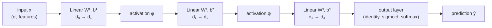
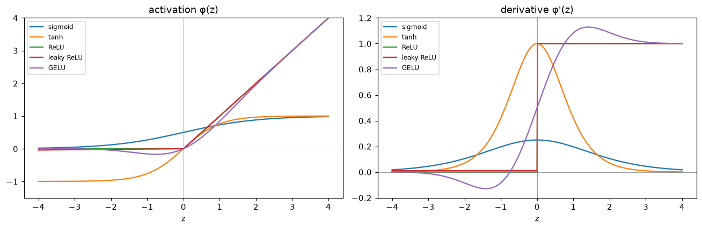
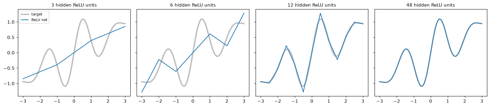

# From Neurons to Networks

> **Level 6 · Chapter 1** · ⏱️ ~70 min read · Prerequisites: [Logistic regression](../03-ml-fundamentals/03-logistic-regression.md), [Calculus and gradients](../01-math-foundations/03-calculus-and-gradients.md), [Information theory and optimization](../01-math-foundations/06-information-theory-and-optimization.md)

A neural network is a stack of simple units, each a weighted sum followed by a nonlinear function. This chapter starts from a single unit, the perceptron, shows exactly why one unit can't learn XOR, builds multilayer perceptrons that can, studies the activation functions that make depth worthwhile, explains what the universal approximation theorem does and doesn't promise, and matches each kind of prediction task with the right output layer and loss.

## Why it matters

Sam was asked to "add deep learning" to a card-fraud model that used logistic regression. They built a network with three hidden layers of 64 units each, trained it carefully, and found that it scored *exactly* as well as the old logistic regression: same AUC to three decimals, same mistakes, same decision boundary. Two days of tuning learning rates and layer sizes changed nothing.

The bug was one missing line. Sam had forgotten the activation functions between layers. A linear layer followed by a linear layer is just another linear layer, so the 9,000-parameter "deep" network was mathematically a logistic regression with a needlessly complicated parameterization. Adding a ReLU after each hidden layer took one line, and the network immediately found the interactions (small purchases followed by a large one, at a new merchant, at 3 a.m.) that the linear model couldn't express.

This chapter is about understanding why that line matters, what a network can represent once it's there, and how to pick the pieces at the ends: the inputs, the outputs, and the loss.

## Concepts

### The artificial neuron

You already know one neuron. In [logistic regression](../03-ml-fundamentals/03-logistic-regression.md), you computed a weighted sum of the features and passed it through the sigmoid:

$$
\hat{y} = \sigma(\mathbf{w}^\top\mathbf{x} + b).
$$

An **artificial neuron** (or **unit**) generalizes this. It takes an input vector $\mathbf{x} \in \mathbb{R}^d$, computes the **pre-activation** $z = \mathbf{w}^\top\mathbf{x} + b$ with **weights** $\mathbf{w} \in \mathbb{R}^d$ and **bias** $b \in \mathbb{R}$, and outputs the **activation** $a = \phi(z)$ for some fixed function $\phi$, the **activation function**.

The name comes from a loose analogy with biological neurons, which receive signals through dendrites, sum them, and "fire" when the total crosses a threshold. The analogy helped early researchers, but don't lean on it. Modern networks are best understood as what the math says they are: compositions of simple differentiable functions, trained by gradient descent.

Geometrically, a neuron does two things. The weighted sum $\mathbf{w}^\top\mathbf{x} + b$ measures signed distance from a hyperplane (scaled by $\lVert\mathbf{w}\rVert$), exactly as in logistic regression's [decision boundary](../03-ml-fundamentals/03-logistic-regression.md#decision-boundaries). The activation then bends that distance: squashes it, clips it, or thresholds it. Everything a network can do comes from combining many of these bent hyperplanes.

### The perceptron

The first trainable neuron was Frank Rosenblatt's **perceptron** (1958). It uses the hardest possible bend, a **step function**. With labels $y \in \{-1, +1\}$, it predicts

$$
\hat{y} = \operatorname{sign}(\mathbf{w}^\top\mathbf{x} + b) = \begin{cases} +1 & \text{if } \mathbf{w}^\top\mathbf{x} + b \geq 0, \\ -1 & \text{otherwise.} \end{cases}
$$

The step function has zero derivative almost everywhere, so you can't train it with gradient descent. Rosenblatt's **perceptron learning rule** is simpler: go through the examples one at a time, and whenever one is misclassified, nudge the weights toward getting it right.

$$
\text{if } y_i(\mathbf{w}^\top\mathbf{x}_i + b) \leq 0: \qquad \mathbf{w} \leftarrow \mathbf{w} + \eta\, y_i \mathbf{x}_i, \qquad b \leftarrow b + \eta\, y_i.
$$

Correctly classified examples cause no update. The **learning rate** $\eta > 0$ only scales the weights here (and the sign of a scaled score doesn't change), so $\eta = 1$ is standard.

**Why the update helps.** After the update, the score of the misclassified example becomes

$$
(\mathbf{w} + \eta y_i\mathbf{x}_i)^\top\mathbf{x}_i + (b + \eta y_i) = \mathbf{w}^\top\mathbf{x}_i + b + \eta y_i\left(\lVert\mathbf{x}_i\rVert^2 + 1\right).
$$

The change, $\eta y_i(\lVert\mathbf{x}_i\rVert^2 + 1)$, has the same sign as $y_i$. So the score moves toward the correct side. It might not get all the way there in one step, and it can break other examples, but each update makes progress on the example that triggered it.

**The convergence theorem.** If the data are **linearly separable**, meaning some hyperplane puts every positive on one side and every negative on the other, the perceptron is guaranteed to find a separating hyperplane after a finite number of mistakes. The proof is short and worth seeing. Absorb the bias into the weights (append a 1 to each $\mathbf{x}_i$), start at $\mathbf{w}_0 = \mathbf{0}$, and use $\eta = 1$. Assume a unit vector $\mathbf{w}^\star$ separates the data with **margin** $\gamma > 0$, meaning $y_i\,\mathbf{w}^{\star\top}\mathbf{x}_i \geq \gamma$ for all $i$, and that every $\lVert\mathbf{x}_i\rVert \leq R$. After the $k$-th mistake, with update $\mathbf{w}_k = \mathbf{w}_{k-1} + y_i\mathbf{x}_i$:

1. **Alignment grows linearly.** $\mathbf{w}_k^\top\mathbf{w}^\star = \mathbf{w}_{k-1}^\top\mathbf{w}^\star + y_i\mathbf{x}_i^\top\mathbf{w}^\star \geq \mathbf{w}_{k-1}^\top\mathbf{w}^\star + \gamma$, so $\mathbf{w}_k^\top\mathbf{w}^\star \geq k\gamma$.
2. **Length grows slowly.** $\lVert\mathbf{w}_k\rVert^2 = \lVert\mathbf{w}_{k-1}\rVert^2 + 2y_i\mathbf{w}_{k-1}^\top\mathbf{x}_i + \lVert\mathbf{x}_i\rVert^2 \leq \lVert\mathbf{w}_{k-1}\rVert^2 + R^2$, because the middle term is $\leq 0$ on a mistake. So $\lVert\mathbf{w}_k\rVert^2 \leq kR^2$.

Since $\mathbf{w}^\star$ is a unit vector, $\mathbf{w}_k^\top\mathbf{w}^\star \leq \lVert\mathbf{w}_k\rVert$ (Cauchy-Schwarz). Combining, $k\gamma \leq \sqrt{k}\,R$, so

$$
k \leq \left(\frac{R}{\gamma}\right)^2.
$$

The number of mistakes is bounded, no matter how many examples there are or in what order they come. Widely separated classes (large $\gamma$) are learned fast; nearly touching classes take longer.

**The catch.** The theorem says nothing about non-separable data. There, the perceptron never stops updating: it cycles forever, and the final weights depend on which example happened to come last. And it finds *a* separating hyperplane, not a good one; any hyperplane with zero training mistakes stops learning, even one that grazes the data. Logistic regression, which keeps pushing confident examples away from the boundary through its smooth loss, and the support vector machine, which maximizes the margin explicitly, both fix this.

### The XOR failure

Here's the problem that stalled neural network research for over a decade. The **XOR** (exclusive or) function of two binary inputs is 1 when exactly one input is 1:

| $x_1$ | $x_2$ | XOR |
|---|---|---|
| 0 | 0 | 0 |
| 0 | 1 | 1 |
| 1 | 0 | 1 |
| 1 | 1 | 0 |

Plot the four points: the positives sit on one diagonal of the unit square and the negatives on the other. No straight line separates them. To prove it, suppose a line did, so $w_1x_1 + w_2x_2 + b > 0$ exactly on the positives. Then:

- From $(0, 0)$: $b < 0$.
- From $(1, 0)$ and $(0, 1)$: $w_1 + b > 0$ and $w_2 + b > 0$. Adding them gives $w_1 + w_2 + 2b > 0$, so $w_1 + w_2 + b > -b > 0$.
- From $(1, 1)$: $w_1 + w_2 + b < 0$.

The last two lines contradict each other. No weights exist. A single perceptron, or a single logistic regression, or any single neuron with a monotonic activation, can't represent XOR.

This isn't a curiosity. XOR is the simplest **interaction**: the effect of one input depends on the value of another. "A large purchase is suspicious *if* the merchant is new" is an XOR-like pattern, and real data are full of them. Marvin Minsky and Seymour Papert's 1969 book *Perceptrons* proved results like this rigorously for single-layer perceptrons, and the field's funding and interest dried up for years, partly because nobody yet had a practical way to train the obvious fix.

### Multilayer perceptrons

The obvious fix is to stack neurons. Feed the inputs to several neurons at once, a **hidden layer**, then feed their outputs to another neuron. Each hidden neuron draws its own line; the output neuron combines the regions those lines define.

For XOR, two ReLU hidden units suffice (ReLU, defined properly below, is $\max(0, z)$):

$$
h_1 = \max(0,\ x_1 + x_2), \qquad h_2 = \max(0,\ x_1 + x_2 - 1), \qquad \hat{y} = h_1 - 2h_2.
$$

Check the four inputs. At $(0,0)$: $h_1 = 0$, $h_2 = 0$, $\hat{y} = 0$. At $(1,0)$ and $(0,1)$: $h_1 = 1$, $h_2 = 0$, $\hat{y} = 1$. At $(1,1)$: $h_1 = 2$, $h_2 = 1$, $\hat{y} = 2 - 2 = 0$. Exactly XOR. The second unit "switches on" only when both inputs are on, and the output subtracts it. The hidden layer has transformed the inputs into a new space, $(h_1, h_2)$, in which the classes *are* linearly separable.

That's the key idea of neural networks: **hidden layers learn a representation in which the problem becomes easy for the final layer**. Here you chose the weights by hand. In a trained network, gradient descent finds them.

**The general architecture.** A **multilayer perceptron** (**MLP**), also called a **fully connected** or **feedforward** network, chains $L$ layers. Write the input as $\mathbf{a}^{[0]} = \mathbf{x}$. Layer $l$ has $d_l$ units, a weight matrix $\mathbf{W}^{[l]} \in \mathbb{R}^{d_{l-1} \times d_l}$, a bias vector $\mathbf{b}^{[l]} \in \mathbb{R}^{d_l}$, and an activation $\phi^{[l]}$:

$$
\mathbf{z}^{[l]} = \mathbf{W}^{[l]\top}\mathbf{a}^{[l-1]} + \mathbf{b}^{[l]}, \qquad \mathbf{a}^{[l]} = \phi^{[l]}\big(\mathbf{z}^{[l]}\big), \qquad l = 1, \dots, L.
$$

The activation is applied element by element. The last layer's output $\mathbf{a}^{[L]}$ is the prediction $\hat{\mathbf{y}}$. (The name "perceptron" stuck even though modern MLPs use smooth activations, not steps.)

In code you process a **batch** of $n$ examples at once, stacked as the rows of $\mathbf{X} \in \mathbb{R}^{n \times d}$. Then each layer is one matrix multiplication:

$$
\mathbf{Z}^{[l]} = \mathbf{A}^{[l-1]}\mathbf{W}^{[l]} + \mathbf{b}^{[l]}, \qquad \mathbf{A}^{[l]} = \phi^{[l]}\big(\mathbf{Z}^{[l]}\big),
$$

with shapes $(n \times d_{l-1})(d_{l-1} \times d_l) = n \times d_l$, and the bias row vector broadcast across the $n$ rows. This "rows are examples" convention matches NumPy, scikit-learn, and PyTorch, and it's the one this level uses throughout. Keeping $\mathbf{W}^{[l]}$ as $d_{\text{in}} \times d_{\text{out}}$ means you can read the shape chain left to right.

**Vocabulary.** The **depth** of the network is its number of layers with weights, $L$ (the input isn't counted). The **width** of a layer is its number of units $d_l$. A network with $L = 3$ has two hidden layers and an output layer. The number of parameters is $\sum_l (d_{l-1}d_l + d_l)$. For Sam's fraud network with 20 inputs, three hidden layers of 64, and one output, that's $(20 \cdot 64 + 64) + 2(64 \cdot 64 + 64) + (64 + 1) = 9{,}729$.



### Why nonlinearity matters

Now Sam's bug, as algebra. Drop the activations from a two-layer network:

$$
\hat{\mathbf{y}} = \mathbf{W}^{[2]\top}\big(\mathbf{W}^{[1]\top}\mathbf{x} + \mathbf{b}^{[1]}\big) + \mathbf{b}^{[2]} = \underbrace{\big(\mathbf{W}^{[1]}\mathbf{W}^{[2]}\big)^\top}_{\mathbf{W}'^\top}\mathbf{x} + \underbrace{\mathbf{W}^{[2]\top}\mathbf{b}^{[1]} + \mathbf{b}^{[2]}}_{\mathbf{b}'}.
$$

That's a single linear layer with weights $\mathbf{W}' = \mathbf{W}^{[1]}\mathbf{W}^{[2]}$ and bias $\mathbf{b}'$. By induction, any stack of linear layers collapses to one. Depth without nonlinearity adds parameters but no expressive power. (It can even take some away: if a middle layer is narrower than the input and output, $\mathbf{W}'$ is forced to have low rank.)

With a nonlinear $\phi$ between the layers, the composition no longer collapses, and each layer can bend the space that the next layer sees. That's what lets depth build complicated functions out of simple pieces.

### Activation functions

Any nonlinear function makes the collapse argument fail, but some train far better than others. Training uses gradients, so what matters most is the **derivative** $\phi'(z)$: backpropagation (next chapter) multiplies the gradient by $\phi'(z)$ at every layer it passes through. If $\phi'$ is tiny, the signal dies; if it's zero, it stops.

**Sigmoid.** $\sigma(z) = \frac{1}{1 + e^{-z}}$, with $\sigma'(z) = \sigma(z)(1 - \sigma(z))$. It squashes to $(0, 1)$ and was the default for decades because it resembles a smoothed step. Two problems. It **saturates**: for $|z|$ larger than about 5, $\sigma'(z) < 0.01$, so a unit stuck there barely learns. And even at its best, $\sigma'(0) = 0.25$, so every sigmoid layer shrinks the backward signal by at least a factor of 4. Ten layers multiply it by at most $0.25^{10} \approx 10^{-6}$. This is the **vanishing gradient** problem, which [Training deep networks](05-training-deep-networks.md) studies in depth. The sigmoid's outputs are also always positive, not centered on zero, which makes the next layer's weight gradients all share a sign and zigzag. Today, sigmoid belongs at the *output* of a binary classifier and inside gates (as in LSTMs), not in hidden layers.

**Tanh.** $\tanh(z) = \frac{e^{z} - e^{-z}}{e^{z} + e^{-z}} = 2\sigma(2z) - 1$, a rescaled sigmoid with range $(-1, 1)$. Its derivative is $\tanh'(z) = 1 - \tanh^2(z)$, which is 1 at $z = 0$. It's zero-centered and has a four times larger peak gradient than sigmoid, so it trains better, but it still saturates for large $|z|$.

**ReLU.** The **rectified linear unit**, $\operatorname{ReLU}(z) = \max(0, z)$, with derivative

$$
\operatorname{ReLU}'(z) = \begin{cases} 1 & z > 0, \\ 0 & z < 0. \end{cases}
$$

(At $z = 0$ the derivative is undefined; code uses 0 or 1 by convention, and it almost never matters.) ReLU doesn't saturate for positive inputs: the gradient passes through unchanged, no matter how large $z$ is. It's also nearly free to compute. Its adoption, around 2010–2012, was one of the changes that made deep networks trainable. Its weakness is the flip side: for $z < 0$ the gradient is exactly zero. A unit whose pre-activation is negative for *every* training example gets no gradient at all and never recovers. This is a **dead ReLU**, usually caused by a too-large learning rate or a bad initialization knocking the bias far negative.

**Leaky ReLU** fixes dead units with a small slope on the negative side: $\max(\alpha z, z)$ with $\alpha$ around 0.01, so $\phi'(z) = \alpha$ for $z < 0$.

**GELU.** The **Gaussian error linear unit** (Hendrycks and Gimpel, 2016) is the default in transformers like BERT and GPT:

$$
\operatorname{GELU}(z) = z\,\Phi(z), \qquad \operatorname{GELU}'(z) = \Phi(z) + z\,\varphi(z),
$$

where $\Phi$ is the standard normal CDF and $\varphi$ its density (the derivative follows from the product rule and $\Phi' = \varphi$). Intuitively, it multiplies the input by "the probability that a standard normal is below it": large positive $z$ passes through ($\Phi \approx 1$), large negative $z$ is zeroed ($\Phi \approx 0$), and near zero it's smooth. It's a smooth ReLU that dips slightly below zero for moderately negative inputs (minimum about $-0.17$ near $z \approx -0.75$). A popular approximation is $0.5z\left(1 + \tanh\left[\sqrt{2/\pi}\,(z + 0.044715z^3)\right]\right)$. Its cousin **SiLU** (or **Swish**), $z\,\sigma(z)$, has the same shape and is used in many vision and language models.

| Activation | Range | $\phi'(z)$ | Saturates? | Typical use |
|---|---|---|---|---|
| Sigmoid | $(0, 1)$ | $\sigma(z)(1 - \sigma(z)) \leq 0.25$ | both sides | binary output, gates |
| Tanh | $(-1, 1)$ | $1 - \tanh^2(z) \leq 1$ | both sides | RNN hidden states, small nets |
| ReLU | $[0, \infty)$ | 0 or 1 | negative side (dead units) | default for MLPs and CNNs |
| Leaky ReLU | $\mathbb{R}$ | $\alpha$ or 1 | no | when dead units are a problem |
| GELU | about $[-0.17, \infty)$ | $\Phi(z) + z\varphi(z)$ | negative side, softly | transformers |

The figure in [In practice](#activation-functions-and-their-derivatives) plots all of them with their derivatives. The practical rule: **start with ReLU** for MLPs and CNNs, use GELU in transformers, and use sigmoid or softmax only at the output.

### The universal approximation theorem

How much can an MLP represent? The surprising answer is: essentially anything, with just one hidden layer.

**The theorem (informal).** Let $\phi$ be any continuous activation that isn't a polynomial (sigmoid, tanh, ReLU, and GELU all qualify). For any continuous function $f$ on a closed, bounded region $K \subset \mathbb{R}^d$ and any tolerance $\varepsilon > 0$, there's a one-hidden-layer network

$$
g(\mathbf{x}) = \sum_{j=1}^{N} v_j\,\phi\big(\mathbf{w}_j^\top\mathbf{x} + b_j\big) + c
$$

with some finite number $N$ of hidden units such that $|g(\mathbf{x}) - f(\mathbf{x})| < \varepsilon$ for every $\mathbf{x} \in K$. George Cybenko proved this for sigmoids in 1989, Kurt Hornik and colleagues extended it around 1989–1991, and Leshno and colleagues showed in 1993 that "not a polynomial" is exactly the condition needed.

**Why it's true, in one dimension.** The full proof uses functional analysis, but the ReLU case in 1D is constructive and you can do it yourself. A one-hidden-layer ReLU network with units $\operatorname{ReLU}(x - k_j)$ computes a **piecewise linear** function whose slope changes at each **knot** $k_j$: each unit adds a "hinge" whose output weight $v_j$ sets how much the slope changes there. Any continuous function on an interval can be approximated by connecting the dots of a fine enough grid, and connect-the-dots is a piecewise linear function, so a ReLU network can match it. With sigmoids the picture is similar: a very steep sigmoid is nearly a step, the difference of two shifted steps is a "bump," and a sum of bumps approximates any function like a histogram.

For a smooth target, the connect-the-dots error with $N$ evenly spaced knots shrinks like $1/N^2$ (the error of linear interpolation is about $\frac{h^2}{8}\max|f''|$ for spacing $h$). The [demo](#universal-approximation-in-action) shows this.

**What the theorem doesn't promise.** It's an existence result, and it's easy to over-read:

1. **It doesn't say how many units.** $N$ can be astronomically large. In $d$ dimensions, the connect-the-dots construction needs a grid with about $(1/h)^d$ cells, which explodes with $d$: the curse of dimensionality.
2. **It doesn't say training will find the weights.** The theorem is about what weights *exist*, not what gradient descent reaches.
3. **It doesn't say anything about generalization.** A network that fits the training points perfectly may be wildly wrong between them. Approximating the training data isn't the goal; approximating the *underlying* function from finite noisy samples is.

**Why depth, then?** If one hidden layer is enough, why do practitioners stack dozens? Because depth can be *exponentially* more efficient. Take the **tent map** $t(x) = 2\operatorname{ReLU}(x) - 4\operatorname{ReLU}(x - 0.5)$ on $[0, 1]$, which goes up from 0 to 1 and back down: two linear pieces from two ReLUs. Composing it with itself, $t(t(x))$, gives a zigzag with 4 pieces; $k$ compositions give $2^k$ pieces using only $2k$ ReLUs arranged in $k$ layers. A one-hidden-layer ReLU network with $N$ units has at most $N + 1$ pieces, so matching the deep zigzag needs about $2^k$ units in one layer. Results by Telgarsky (2016) and others make this precise: some functions computed by deep, narrow networks need exponentially wide shallow ones. Real-world functions seem to have this compositional structure too (edges compose into textures, textures into parts, parts into objects), which is one explanation, though not a complete one, for why deep networks work so well.

### Output layers and losses

The hidden layers learn a representation. The **output layer** turns it into a prediction of the right *type*, and the **loss** measures how wrong it is. Both follow from one principle you met in [Statistics](../01-math-foundations/05-statistics.md#maximum-likelihood-estimation): pick a probability distribution for $y$ given $\mathbf{x}$, let the network output its parameters, and minimize the negative log-likelihood.

The last layer's pre-activation $\mathbf{z}^{[L]}$ is called the **logits** (a name borrowed from logistic regression, where $z$ is the log-odds). The output activation maps logits to valid distribution parameters:

| Task | Output units | Output activation | Distribution of $y$ | Loss (negative log-likelihood) |
|---|---|---|---|---|
| Regression | 1 per target | identity | Gaussian, fixed variance | mean squared error |
| Robust regression | 1 per target | identity | Laplace | mean absolute error |
| Binary classification | 1 | sigmoid | Bernoulli | binary cross-entropy |
| Multiclass ($K$ classes, one label) | $K$ | softmax | categorical | categorical cross-entropy |
| Multi-label ($K$ independent yes/no) | $K$ | sigmoid on each | $K$ independent Bernoullis | sum of $K$ binary cross-entropies |
| Counts | 1 | exponential | Poisson | Poisson NLL, $\hat{\lambda} - y\log\hat{\lambda}$ |

Three details matter in practice.

**Multiclass versus multi-label.** Use softmax when each example has exactly one class (a digit is a 3 *or* an 8): the probabilities compete and sum to 1. Use independent sigmoids when labels can co-occur (a photo can contain a dog *and* a beach): each probability is separate. Using softmax for a multi-label problem forces co-occurring labels to fight over probability mass.

**The gradient is always "prediction minus target."** For each pairing in the table (except the Laplace one), the gradient of the loss with respect to the logits is $\hat{\mathbf{y}} - \mathbf{y}$. You derived it for sigmoid with binary cross-entropy and softmax with categorical cross-entropy in [Logistic regression](../03-ml-fundamentals/03-logistic-regression.md#the-gradient). For the Gaussian, $\frac{\partial}{\partial z}\frac{1}{2}(z - y)^2 = z - y$. For Poisson with $\hat{\lambda} = e^{z}$, $\frac{\partial}{\partial z}(e^{z} - yz) = \hat{\lambda} - y$. This is no coincidence: each output activation is the **canonical link** of its distribution, the same exponential-family structure behind generalized linear models. The practical consequence is huge: the gradient arriving at the network is large when the prediction is badly wrong, and it never gets stuck in a saturated output unit. Pairing a sigmoid output with squared error breaks this and brings back the $\sigma'$ factor that kills learning when the model is confidently wrong.

**Compute the loss from the logits.** Don't compute $\hat{p} = \sigma(z)$ and then $\log\hat{p}$: for $z = -800$, $\sigma(z)$ rounds to 0 and the loss becomes infinite. Compute the loss directly from the logits with a stable formula, such as $\log(1 + e^{z}) - yz$ for binary cross-entropy, and $z_y - \operatorname{logsumexp}(\mathbf{z})$ for log-softmax. Every framework provides fused versions (PyTorch's `BCEWithLogitsLoss` and `CrossEntropyLoss` take logits, not probabilities), and in this level you'll write your own.

## In practice

### The perceptron from scratch

Here's the learning rule on a linearly separable problem, with the mistake count per pass and a comparison with the convergence bound.

```python
import numpy as np
import matplotlib.pyplot as plt
from sklearn.datasets import make_blobs
from sklearn.linear_model import Perceptron, LogisticRegression

def perceptron(X, y, epochs=50, eta=1.0, seed=0):
    """Rosenblatt's rule. y in {-1, +1}. Returns weights, bias, mistakes per epoch."""
    rng = np.random.default_rng(seed)
    w, b, history = np.zeros(X.shape[1]), 0.0, []
    for _ in range(epochs):
        mistakes = 0
        for i in rng.permutation(len(y)):
            if y[i] * (X[i] @ w + b) <= 0:          # misclassified (or on the boundary)
                w += eta * y[i] * X[i]
                b += eta * y[i]
                mistakes += 1
        history.append(mistakes)
        if mistakes == 0:
            break
    return w, b, history

X, y01 = make_blobs(n_samples=200, centers=[[-2, -2], [2, 2]], cluster_std=1.0, random_state=0)
y = 2 * y01 - 1                                    # {0, 1} -> {-1, +1}
w, b, history = perceptron(X, y)
print("mistakes per epoch:", history)
print("training accuracy:", np.mean(np.sign(X @ w + b) == y))

# The bound (R/gamma)^2, using the max-margin separator as w* (bias absorbed into x)
Xa = np.column_stack([X, np.ones(len(X))])
svm_like = LogisticRegression(C=1e6, max_iter=10_000).fit(X, y)   # a good separator
w_star = np.r_[svm_like.coef_[0], svm_like.intercept_[0]]
w_star /= np.linalg.norm(w_star)
gamma = np.min(y * (Xa @ w_star))
R = np.max(np.linalg.norm(Xa, axis=1))
print(f"margin gamma = {gamma:.3f}, R = {R:.2f}, bound (R/gamma)^2 = {(R / gamma) ** 2:.0f}, "
      f"actual mistakes = {sum(history)}")
```

```text
mistakes per epoch: [2, 0]
training accuracy: 1.0
margin gamma = 0.466, R = 5.08, bound (R/gamma)^2 = 119, actual mistakes = 2
```

The bound is loose (it's a worst case over all orderings), but it holds. The margin here comes from one particular separator; the theorem holds for *any* separator, so the best bound uses the one with the largest margin.

Now XOR. The same code never settles, and accuracy is stuck at or below 75%, because at most three of the four points can be on the correct side of any line.

```python
X_xor = np.array([[0, 0], [0, 1], [1, 0], [1, 1]], dtype=float)
y_xor = np.array([-1, 1, 1, -1])
w, b, history = perceptron(X_xor, y_xor, epochs=20)
print("mistakes per epoch:", history)
print("accuracy:", np.mean(np.sign(X_xor @ w + b) == y_xor))
sk = Perceptron(max_iter=1000, tol=None, random_state=0).fit(X_xor, y_xor)
print("scikit-learn Perceptron accuracy:", sk.score(X_xor, y_xor))
```

```text
mistakes per epoch: [4, 4, 4, 4, 4, 4, 3, 3, 3, 4, 2, 4, 4, 2, 4, 4, 4, 3, 3, 2]
accuracy: 0.5
scikit-learn Perceptron accuracy: 0.5
```

### An MLP forward pass, and XOR solved

A forward pass is a loop over layers: multiply, add the bias, apply the activation. Here are the hand-built XOR weights from the [Concepts](#multilayer-perceptrons) section, written as matrices with the $d_{\text{in}} \times d_{\text{out}}$ convention.

```python
def relu(z):
    return np.maximum(0, z)

def identity(z):
    return z

def mlp_forward(X, layers):
    """layers: list of (W, b, activation). Rows of X are examples."""
    A = X
    for W, b, act in layers:
        A = act(A @ W + b)
    return A

xor_net = [
    (np.array([[1.0, 1.0],
               [1.0, 1.0]]), np.array([0.0, -1.0]), relu),      # 2 -> 2: h1 = relu(x1+x2), h2 = relu(x1+x2-1)
    (np.array([[1.0], [-2.0]]), np.array([0.0]), identity),      # 2 -> 1: y = h1 - 2 h2
]
print(mlp_forward(X_xor, xor_net).ravel())

# Remove the nonlinearity and the network collapses to one linear map
linear_net = [(W, b, identity) for W, b, _ in xor_net]
W_prime = xor_net[0][0] @ xor_net[1][0]
b_prime = xor_net[0][1] @ xor_net[1][0] + xor_net[1][1]
print("without ReLU:     ", mlp_forward(X_xor, linear_net).ravel())
print("one linear layer: ", (X_xor @ W_prime + b_prime).ravel())
```

```text
[0. 1. 1. 0.]
without ReLU:      [2. 1. 1. 0.]
one linear layer:  [2. 1. 1. 0.]
```

With ReLU, the network outputs XOR exactly. Without it, the network equals the single linear layer $\mathbf{W}' = \mathbf{W}^{[1]}\mathbf{W}^{[2]}$, and a linear function can't produce XOR.

The library version learns its own weights. scikit-learn's `MLPClassifier` trains an MLP with backpropagation (the next chapter) and Adam ([Optimizers](04-optimizers.md)). On a noisy XOR dataset, compare it with logistic regression:

```python
from sklearn.neural_network import MLPClassifier
from sklearn.model_selection import train_test_split

rng = np.random.default_rng(0)
Xn = rng.uniform(-1, 1, size=(1000, 2))
yn = ((Xn[:, 0] > 0) ^ (Xn[:, 1] > 0)).astype(int)       # XOR of the signs
X_tr, X_te, y_tr, y_te = train_test_split(Xn, yn, test_size=0.3, random_state=0)

logreg = LogisticRegression().fit(X_tr, y_tr)
mlp = MLPClassifier(hidden_layer_sizes=(16,), activation="relu", max_iter=2000, random_state=0).fit(X_tr, y_tr)
print(f"logistic regression test accuracy: {logreg.score(X_te, y_te):.3f}")
print(f"MLP (16 ReLU units) test accuracy: {mlp.score(X_te, y_te):.3f}")
print("MLP weight shapes:", [W.shape for W in mlp.coefs_], "bias shapes:", [b.shape for b in mlp.intercepts_])
```

```text
logistic regression test accuracy: 0.403
MLP (16 ReLU units) test accuracy: 0.993
MLP weight shapes: [(2, 16), (16, 1)] bias shapes: [(16,), (1,)]
```

Logistic regression does no better than a coin flip: any line through the square gets about half the points wrong. One hidden layer is enough. Notice that scikit-learn stores weights as $d_{\text{in}} \times d_{\text{out}}$, the same convention as this level.

### Activation functions and their derivatives

Each activation and its derivative, with the derivative checked against a central finite difference (from [Calculus and gradients](../01-math-foundations/03-calculus-and-gradients.md#numerical-versus-analytical-gradients)). Away from ReLU's kink at 0, every analytic derivative should match to about $10^{-9}$ or better.

```python
from scipy.special import erf, expit

def gelu(z):
    return z * 0.5 * (1 + erf(z / np.sqrt(2)))

def gelu_grad(z):
    Phi = 0.5 * (1 + erf(z / np.sqrt(2)))
    phi = np.exp(-z ** 2 / 2) / np.sqrt(2 * np.pi)
    return Phi + z * phi

activations = {
    "sigmoid":    (expit, lambda z: expit(z) * (1 - expit(z))),
    "tanh":       (np.tanh, lambda z: 1 - np.tanh(z) ** 2),
    "ReLU":       (relu, lambda z: (z > 0).astype(float)),
    "leaky ReLU": (lambda z: np.where(z > 0, z, 0.01 * z), lambda z: np.where(z > 0, 1.0, 0.01)),
    "GELU":       (gelu, gelu_grad),
}

z = np.linspace(-4, 4, 801)
z_check = z[np.abs(z) > 1e-3]                            # avoid ReLU's kink
h = 1e-6
for name, (f, df) in activations.items():
    numeric = (f(z_check + h) - f(z_check - h)) / (2 * h)
    print(f"{name:>10}: max |analytic - numeric| = {np.max(np.abs(df(z_check) - numeric)):.1e}")

fig, axes = plt.subplots(1, 2, figsize=(12, 4))
for name, (f, df) in activations.items():
    axes[0].plot(z, f(z), label=name)
    axes[1].plot(z, df(z), label=name)
axes[0].set_title("activation φ(z)"); axes[1].set_title("derivative φ'(z)")
for ax in axes:
    ax.axhline(0, color="gray", lw=0.5); ax.axvline(0, color="gray", lw=0.5)
    ax.set_xlabel("z"); ax.legend(fontsize=8)
axes[0].set_ylim(-1.5, 4); axes[1].set_ylim(-0.2, 1.2)
plt.tight_layout()
plt.show()
```

```text
   sigmoid: max |analytic - numeric| = 1.3e-10
      tanh: max |analytic - numeric| = 7.3e-11
      ReLU: max |analytic - numeric| = 1.4e-10
leaky ReLU: max |analytic - numeric| = 1.4e-10
      GELU: max |analytic - numeric| = 4.8e-10
```



*Activations (left) and their derivatives (right). Sigmoid and tanh derivatives vanish for large |z| (saturation); sigmoid's never exceeds 0.25. ReLU's derivative is exactly 1 for every positive input and exactly 0 for every negative one. GELU is a smoothed ReLU whose derivative overshoots 1 slightly near z ≈ 1.5.*

Read the right panel as "how much gradient survives this layer." That one picture explains why sigmoid hidden layers made deep networks so hard to train, and why ReLU helped so much.

!!! warning "Common mistake"
    Using the activation's *output* where the derivative needs its *input*, or vice versa. For sigmoid and tanh, the derivative is conveniently written in terms of the output ($a(1 - a)$ and $1 - a^2$), so implementations often cache $a$. For ReLU and GELU you need $z$ (or a mask). Mixing these up gives a backward pass that's wrong but runs, and only a gradient check catches it.

### Universal approximation in action

The constructive proof in code: put $N$ ReLU hidden units with knots evenly spaced across the interval, then choose the output weights by least squares. (In a real network, gradient descent would also move the knots, which can only do better.) The target is a bumpy function on $[-3, 3]$.

```python
def target(x):
    return np.sin(3 * x) * np.exp(-x ** 2 / 4) + 0.3 * x

x = np.linspace(-3, 3, 2000)
y_true = target(x)

def relu_net_fit(x, y, n_units):
    knots = np.linspace(x.min(), x.max(), n_units + 1)[:-1]   # hidden layer: w = 1, b = -knot
    H = relu(x[:, None] - knots[None, :])                      # (n, N) hidden activations
    H1 = np.column_stack([H, np.ones(len(x))])                 # plus the output bias
    v, *_ = np.linalg.lstsq(H1, y, rcond=None)                 # output layer weights
    return H1 @ v

fig, axes = plt.subplots(1, 4, figsize=(15, 3.4), sharey=True)
for ax, N in zip(axes, [3, 6, 12, 48]):
    ax.plot(x, y_true, color="gray", lw=3, alpha=0.5, label="target")
    ax.plot(x, relu_net_fit(x, y_true, N), color="tab:blue", label="ReLU net")
    ax.set_title(f"{N} hidden ReLU units", fontsize=10)
axes[0].legend(fontsize=8)
plt.tight_layout()
plt.show()

for N in [3, 6, 12, 24, 48, 96, 192]:
    err = np.max(np.abs(relu_net_fit(x, y_true, N) - y_true))
    print(f"N = {N:>3}: max error = {err:.4f}")
```

```text
N =   3: max error = 0.8911
N =   6: max error = 0.7882
N =  12: max error = 0.1923
N =  24: max error = 0.0473
N =  48: max error = 0.0116
N =  96: max error = 0.0028
N = 192: max error = 0.0007
```



*A one-hidden-layer ReLU network is a piecewise linear function with one kink per unit. With enough units it traces any continuous curve.*

Once the knots are dense enough to resolve the bumps (around 12 units), each doubling of $N$ cuts the maximum error by about 4, the $1/N^2$ rate predicted by linear interpolation. But this is a 1D function. In 10 dimensions, the same grid resolution would need $N^{10}$ units, which is why the theorem's existence promise is so different from practical learnability.

Depth buys efficiency. Here's the tent-map construction from [Concepts](#the-universal-approximation-theorem): each layer has 2 ReLU units, and each extra layer doubles the number of linear pieces.

```python
def tent(x):
    return 2 * relu(x) - 4 * relu(x - 0.5)

def count_pieces(y, x):
    slopes = np.round(np.diff(y) / np.diff(x), 6)
    return 1 + np.count_nonzero(np.diff(slopes))

x01 = np.linspace(0, 1, 2 ** 14 + 1)          # grid that contains every kink
y = x01.copy()
for k in range(1, 7):
    y = tent(y)
    print(f"depth {k}: {2 * k:>2} ReLUs in total -> {count_pieces(y, x01):>3} linear pieces "
          f"(a 1-hidden-layer net needs >= {count_pieces(y, x01) - 1} units)")
```

```text
depth 1:  2 ReLUs in total ->   2 linear pieces (a 1-hidden-layer net needs >= 1 units)
depth 2:  4 ReLUs in total ->   4 linear pieces (a 1-hidden-layer net needs >= 3 units)
depth 3:  6 ReLUs in total ->   8 linear pieces (a 1-hidden-layer net needs >= 7 units)
depth 4:  8 ReLUs in total ->  16 linear pieces (a 1-hidden-layer net needs >= 15 units)
depth 5: 10 ReLUs in total ->  32 linear pieces (a 1-hidden-layer net needs >= 31 units)
depth 6: 12 ReLUs in total ->  64 linear pieces (a 1-hidden-layer net needs >= 63 units)
```

Linear growth in units buys exponential growth in pieces, but only if the units are stacked.

### Output layers and losses in code

Each output pairing from the table, computed stably from the logits, with a numerical check that the gradient with respect to the logits is $\hat{y} - y$.

```python
from scipy.special import logsumexp, softmax

def bce_with_logits(z, y):          # binary cross-entropy from logits
    return np.mean(np.logaddexp(0, z) - y * z)

def ce_with_logits(Z, y):           # categorical cross-entropy from logits, integer labels
    log_probs = Z - logsumexp(Z, axis=1, keepdims=True)
    return -np.mean(log_probs[np.arange(len(y)), y])

def mse(z, y):
    return 0.5 * np.mean((z - y) ** 2)

def poisson_nll(z, y):              # log-rate z, rate exp(z)
    return np.mean(np.exp(z) - y * z)

def num_grad(f, z, h=1e-6):
    g = np.zeros_like(z)
    for idx in np.ndindex(z.shape):
        zp, zm = z.copy(), z.copy()
        zp[idx] += h; zm[idx] -= h
        g[idx] = (f(zp) - f(zm)) / (2 * h)
    return g

rng = np.random.default_rng(0)
n = 5
z = rng.normal(size=n)
y_bin, y_reg, y_cnt = rng.integers(0, 2, n), rng.normal(size=n), rng.poisson(2, n)
Z, y_cls = rng.normal(size=(n, 3)), rng.integers(0, 3, n)
Y_onehot = np.eye(3)[y_cls]

checks = {
    "identity + MSE":        (num_grad(lambda t: mse(t, y_reg), z), (z - y_reg) / n),
    "sigmoid + BCE":         (num_grad(lambda t: bce_with_logits(t, y_bin), z), (expit(z) - y_bin) / n),
    "softmax + CE":          (num_grad(lambda t: ce_with_logits(t, y_cls), Z), (softmax(Z, axis=1) - Y_onehot) / n),
    "exp + Poisson NLL":     (num_grad(lambda t: poisson_nll(t, y_cnt), z), (np.exp(z) - y_cnt) / n),
}
for name, (numeric, formula) in checks.items():
    print(f"{name:>18}: max |numeric - (y_hat - y)/n| = {np.max(np.abs(numeric - formula)):.1e}")

# Why fused losses: the naive version breaks on an extreme logit
z_big, y1 = np.array([-800.0]), np.array([1.0])
with np.errstate(divide="ignore"):
    naive = -np.mean(y1 * np.log(expit(z_big)) + (1 - y1) * np.log(1 - expit(z_big)))
print("naive BCE:", naive, "  stable BCE:", bce_with_logits(z_big, y1))
```

```text
    identity + MSE: max |numeric - (y_hat - y)/n| = 7.0e-11
     sigmoid + BCE: max |numeric - (y_hat - y)/n| = 7.8e-11
      softmax + CE: max |numeric - (y_hat - y)/n| = 1.6e-10
 exp + Poisson NLL: max |numeric - (y_hat - y)/n| = 8.5e-11
naive BCE: inf   stable BCE: 800.0
```

All four pairings give the same gradient form, divided by $n$ because each loss is a mean. The naive binary cross-entropy returns infinity for a logit of $-800$, while the fused one returns the right answer, 800.

!!! warning "Common mistake"
    Applying softmax (or sigmoid) in the model *and* inside the loss. PyTorch's `CrossEntropyLoss` applies log-softmax itself, so a model that already ends in `softmax` gets squashed twice. Training still "works," but gradients are weaker and the model is less confident than it should be. Output raw logits from the model and let the loss handle the rest.

## Exercises

### Exercise 1: Perceptron updates by hand (easy)

Start a perceptron at $\mathbf{w} = (0, 0)$, $b = 0$, with $\eta = 1$. Process these three examples once, in order: $\mathbf{x} = (1, 2), y = +1$; then $\mathbf{x} = (2, -1), y = -1$; then $\mathbf{x} = (-1, -1), y = -1$. Use the convention that a score of exactly 0 counts as a mistake. Give $\mathbf{w}$ and $b$ after each example.

??? success "Solution"

    1. Score $0 \cdot 1 + 0 \cdot 2 + 0 = 0$, so $y \cdot 0 = 0 \leq 0$: a mistake. Update: $\mathbf{w} = (0,0) + 1\cdot(1, 2) = (1, 2)$, $b = 0 + 1 = 1$.
    2. Score $1 \cdot 2 + 2 \cdot (-1) + 1 = 1$, and $y = -1$, so $y \cdot 1 = -1 \leq 0$: a mistake. Update: $\mathbf{w} = (1, 2) - (2, -1) = (-1, 3)$, $b = 1 - 1 = 0$.
    3. Score $(-1)(-1) + 3(-1) + 0 = -2$, and $y = -1$, so $y \cdot (-2) = 2 > 0$: correct, no update.

    Final: $\mathbf{w} = (-1, 3)$, $b = 0$. You can confirm with the `perceptron` function by passing the examples in this order (replace the random permutation with `range(len(y))`).

### Exercise 2: Two derivatives (easy)

(a) Using $\tanh(z) = 2\sigma(2z) - 1$ and $\sigma' = \sigma(1 - \sigma)$, show that $\tanh'(z) = 1 - \tanh^2(z)$. (b) Derive the derivative of SiLU, $s(z) = z\,\sigma(z)$, and check that $s'(0) = 0.5$.

??? success "Solution"

    (a) By the chain rule, $\tanh'(z) = 2 \cdot 2\,\sigma'(2z) = 4\sigma(2z)(1 - \sigma(2z))$. Let $s = \sigma(2z)$, so $\tanh z = 2s - 1$ and $s = \frac{1 + \tanh z}{2}$, $1 - s = \frac{1 - \tanh z}{2}$. Then

    $$
    4s(1 - s) = 4 \cdot \frac{(1 + \tanh z)(1 - \tanh z)}{4} = 1 - \tanh^2 z.
    $$

    (b) By the product rule, $s'(z) = \sigma(z) + z\,\sigma(z)(1 - \sigma(z)) = \sigma(z)\big(1 + z(1 - \sigma(z))\big)$. At $z = 0$: $\sigma(0) = 0.5$, so $s'(0) = 0.5(1 + 0) = 0.5$. Like GELU, it passes about half the gradient at zero, approaches 1 for large positive $z$, and approaches 0 for large negative $z$.

### Exercise 3: Prove the collapse in code (easy)

Build a 4-layer network with random weights and *no* activations, with widths $10 \to 32 \to 5 \to 32 \to 3$. Compute the single equivalent linear layer $(\mathbf{W}', \mathbf{b}')$, confirm it gives the same outputs on 100 random inputs, and compute the rank of $\mathbf{W}'$. Explain the rank.

??? success "Solution"

    ```python
    rng = np.random.default_rng(0)
    sizes = [10, 32, 5, 32, 3]
    layers = [(rng.normal(size=(a, b)), rng.normal(size=b), identity) for a, b in zip(sizes[:-1], sizes[1:])]

    W_eq, b_eq = np.eye(10), np.zeros(10)
    for W, b, _ in layers:                 # compose: x W_eq + b_eq, then (.) W + b
        W_eq, b_eq = W_eq @ W, b_eq @ W + b

    X_test = rng.normal(size=(100, 10))
    print("max difference:", np.max(np.abs(mlp_forward(X_test, layers) - (X_test @ W_eq + b_eq))))
    print("W' shape:", W_eq.shape, " rank:", np.linalg.matrix_rank(W_eq))
    ```

    ```text
    max difference: 4.547473508864641e-13
    W' shape: (10, 3)  rank: 3
    ```

    The four layers equal one $10 \times 3$ linear map, up to rounding. Its rank is at most $\min(10, 32, 5, 32, 3) = 3$, limited by the narrowest layer; here the output width of 3 binds. If the output had 8 units, the width-5 bottleneck would cap the rank at 5, and the "deep" linear network could represent *fewer* linear maps than a single $10 \times 8$ layer.

### Exercise 4: Parity with ReLUs (medium)

The 3-bit parity function is 1 when an odd number of $x_1, x_2, x_3 \in \{0, 1\}$ are 1. Design a one-hidden-layer ReLU network that computes it exactly on all 8 inputs, and verify it with `mlp_forward`. Hint: parity depends only on $s = x_1 + x_2 + x_3$, so you need a piecewise linear function of $s$ that hits $0, 1, 0, 1$ at $s = 0, 1, 2, 3$.

??? success "Solution"

    Use hidden units $\operatorname{ReLU}(s)$, $\operatorname{ReLU}(s - 1)$, $\operatorname{ReLU}(s - 2)$ and output $g(s) = h_1 - 2h_2 + 2h_3$. Its slope is $+1$ on $[0, 1]$, $-1$ on $[1, 2]$, and $+1$ on $[2, 3]$, giving $g(0) = 0$, $g(1) = 1$, $g(2) = 0$, $g(3) = 1$.

    ```python
    from itertools import product

    X3 = np.array(list(product([0, 1], repeat=3)), dtype=float)
    parity_net = [
        (np.ones((3, 3)), np.array([0.0, -1.0, -2.0]), relu),     # three hinges on s = x1 + x2 + x3
        (np.array([[1.0], [-2.0], [2.0]]), np.array([0.0]), identity),
    ]
    print(np.column_stack([X3, mlp_forward(X3, parity_net)]).astype(int))
    ```

    ```text
    [[0 0 0 0]
     [0 0 1 1]
     [0 1 0 1]
     [0 1 1 0]
     [1 0 0 1]
     [1 0 1 0]
     [1 1 0 0]
     [1 1 1 1]]
    ```

    In general, $d$-bit parity needs about $d$ hidden units this way, one hinge per value of $s$. The same idea extends XOR's construction: first compute a useful feature ($s$), then bend it.

### Exercise 5: Output layers for real tasks (medium)

For each task, choose the number of output units, the output activation, and the loss, and justify the choice: (a) predicting tomorrow's electricity demand in megawatts; (b) tagging a news article with any subset of 20 topics; (c) recognizing which of 1,000 bird species is in a photo; (d) predicting how many support tickets a customer will file next month; (e) predicting whether a transaction is fraudulent.

??? success "Solution"

    (a) 1 unit, identity, MSE (Gaussian likelihood). If the errors have outliers or you want a median forecast, MAE. (b) 20 units, a sigmoid on each, and the sum (or mean) of 20 binary cross-entropies, because topics co-occur. (c) 1,000 units, softmax, categorical cross-entropy, because each photo has one species. (d) 1 unit, exponential output (predict the log-rate), Poisson negative log-likelihood, because the target is a non-negative count. (e) 1 unit, sigmoid, binary cross-entropy. Fraud is rare, so you may also weight the positive class, and you'll choose the decision threshold from costs, as in [Evaluation metrics](../03-ml-fundamentals/06-evaluation-metrics.md).

    In every case, the loss should be computed from the logits, and the activation applied only when you need probabilities or rates for reporting.

### Exercise 6: Approximation in 2D (hard)

Fit $f(x_1, x_2) = \sin(2x_1)\cos(2x_2)$ on $[-2, 2]^2$ with one hidden layer of $N$ ReLU units whose input weights and biases are *random* ($\mathbf{w}_j \sim \mathcal{N}(0, I)$, $b_j \sim \mathcal{U}(-3, 3)$) and whose output weights are fit by least squares, as in the demo. Report the RMS error on a $60 \times 60$ grid for $N = 10, 100, 1000$. How does the improvement compare with the 1D case?

??? success "Solution"

    ```python
    rng = np.random.default_rng(0)
    g = np.linspace(-2, 2, 60)
    G1, G2 = np.meshgrid(g, g)
    Xg = np.column_stack([G1.ravel(), G2.ravel()])
    fg = np.sin(2 * Xg[:, 0]) * np.cos(2 * Xg[:, 1])

    for N in [10, 100, 1000]:
        W = rng.normal(size=(2, N))
        b = rng.uniform(-3, 3, size=N)
        H = np.column_stack([relu(Xg @ W + b), np.ones(len(Xg))])
        v, *_ = np.linalg.lstsq(H, fg, rcond=None)
        print(f"N = {N:>4}: RMS error = {np.sqrt(np.mean((H @ v - fg) ** 2)):.4f}")
    ```

    ```text
    N =   10: RMS error = 0.4252
    N =  100: RMS error = 0.0803
    N = 1000: RMS error = 0.0044
    ```

    The error falls, but each 10× increase in units buys much less than the 100× ($1/N^2$) that the 1D grid construction achieved. In $d$ dimensions, a ReLU unit's kink is a whole hyperplane, and covering the input space finely enough takes many more of them. That's the curse of dimensionality hiding inside the universal approximation theorem. (Training the hidden weights too, instead of drawing them at random, helps a lot; that's what backpropagation makes possible.)

## Check yourself

1. Why can't a single neuron with a monotonic activation represent XOR?

    ??? note "Answer"

        A monotonic activation of a linear score thresholds that score, so its decision boundary is a hyperplane (a line in 2D). XOR's positives and negatives sit on opposite diagonals of the square, and the four inequalities a separating line would need contradict each other.

2. What does the perceptron convergence theorem guarantee, and what does it require?

    ??? note "Answer"

        If the data are linearly separable with margin $\gamma$ and all inputs have norm at most $R$, the perceptron makes at most $(R/\gamma)^2$ mistakes, so it finds a separating hyperplane in finite time. It requires separability; on non-separable data it never converges.

3. Show that two linear layers with no activation between them equal one linear layer.

    ??? note "Answer"

        $(\mathbf{x}\mathbf{W}_1 + \mathbf{b}_1)\mathbf{W}_2 + \mathbf{b}_2 = \mathbf{x}(\mathbf{W}_1\mathbf{W}_2) + (\mathbf{b}_1\mathbf{W}_2 + \mathbf{b}_2)$, which is one layer with weights $\mathbf{W}_1\mathbf{W}_2$ and bias $\mathbf{b}_1\mathbf{W}_2 + \mathbf{b}_2$.

4. Why did replacing sigmoid with ReLU in hidden layers make deep networks easier to train?

    ??? note "Answer"

        Backpropagation multiplies by $\phi'(z)$ at every layer. Sigmoid's derivative is at most 0.25 and near zero when saturated, so gradients shrink geometrically with depth. ReLU's derivative is exactly 1 for positive inputs, so active units pass gradients through undiminished.

5. What is a dead ReLU, and what causes it?

    ??? note "Answer"

        A ReLU unit whose pre-activation is negative for every input, so its output and its gradient are always zero and it never updates again. Common causes are a large learning rate or a bad update pushing the bias strongly negative, and poor initialization.

6. State the universal approximation theorem and three things it doesn't promise.

    ??? note "Answer"

        A one-hidden-layer network with a non-polynomial continuous activation can approximate any continuous function on a compact set to any accuracy, given enough units. It doesn't bound the number of units needed (which can be exponential in the input dimension), doesn't promise gradient descent will find the weights, and says nothing about generalizing from finite data.

7. When do you use softmax outputs, and when independent sigmoids?

    ??? note "Answer"

        Softmax when each example belongs to exactly one of $K$ classes (the probabilities compete and sum to 1). Independent sigmoids when labels can co-occur (multi-label), so each label gets its own probability.

8. Why should the loss be computed from logits rather than from probabilities?

    ??? note "Answer"

        Numerical stability. For extreme logits, the sigmoid or softmax rounds to exactly 0 or 1 and the log becomes infinite or NaN. Fused formulas such as $\log(1 + e^{z}) - yz$ and log-softmax via logsumexp stay finite and exact.

## Key takeaways

- A neuron computes $\phi(\mathbf{w}^\top\mathbf{x} + b)$: a hyperplane, then a bend. The perceptron learns separable data in at most $(R/\gamma)^2$ mistakes but fails on anything a line can't split, like XOR.
- A multilayer perceptron stacks layers $\mathbf{A}^{[l]} = \phi(\mathbf{A}^{[l-1]}\mathbf{W}^{[l]} + \mathbf{b}^{[l]})$. Hidden layers learn a representation in which the output layer's job becomes easy.
- Without nonlinear activations, any stack of layers collapses to a single linear layer.
- Activation choice is about gradients: sigmoid and tanh saturate, ReLU passes gradients unchanged for positive inputs (but can die), and GELU is a smooth ReLU used in transformers.
- One hidden layer can approximate any continuous function, but possibly with an enormous number of units; depth can be exponentially more efficient.
- Choose the output activation and loss as a likelihood: identity + MSE, sigmoid + binary cross-entropy, softmax + cross-entropy. Each gives the gradient $\hat{\mathbf{y}} - \mathbf{y}$ at the logits. Compute losses from logits.

## Further reading

- Ian Goodfellow, Yoshua Bengio, and Aaron Courville, *Deep Learning* (MIT Press, 2016), Chapter 6, "Deep Feedforward Networks." Free online at [deeplearningbook.org](https://www.deeplearningbook.org/).
- Michael Nielsen, *Neural Networks and Deep Learning*, Chapter 4 gives a visual proof of universal approximation: [neuralnetworksanddeeplearning.com](http://neuralnetworksanddeeplearning.com/).
- George Cybenko, "Approximation by superpositions of a sigmoidal function," *Mathematics of Control, Signals and Systems* (1989).
- Marvin Minsky and Seymour Papert, *Perceptrons* (MIT Press, 1969), the book that proved the limits of single-layer networks.
- Dan Hendrycks and Kevin Gimpel, "Gaussian Error Linear Units (GELUs)" (2016), [arXiv:1606.08415](https://arxiv.org/abs/1606.08415).

## Next

You can now compute what a network outputs. Next, learn how to compute the gradient of its loss with respect to every weight, efficiently: [Forward and backpropagation](02-forward-and-backpropagation.md).
