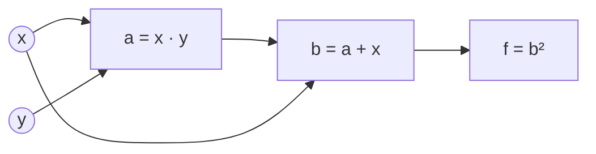
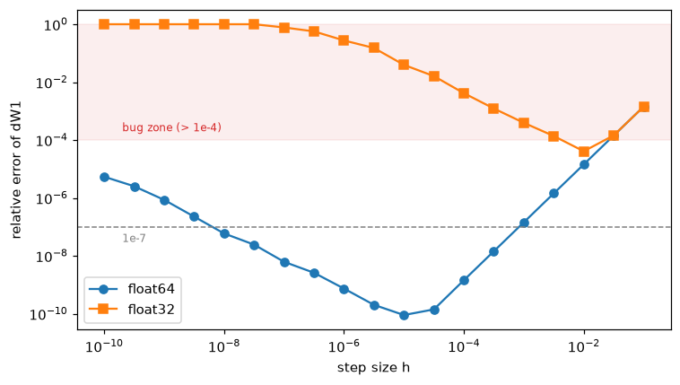
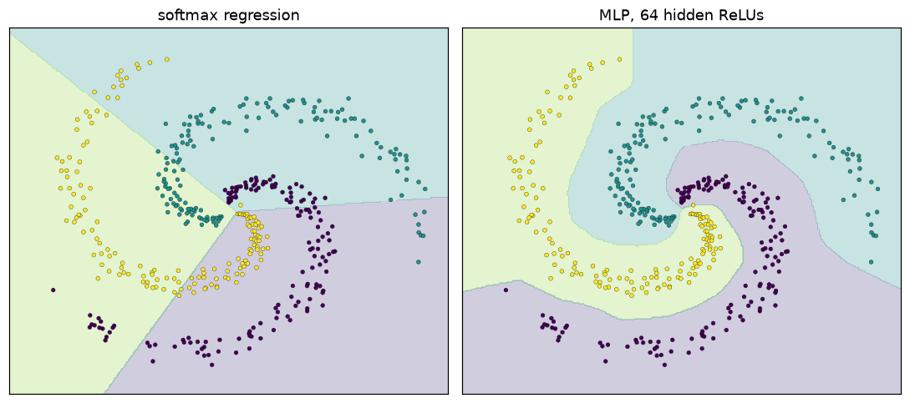

# Forward and Backpropagation

> **Level 6 · Chapter 2** · ⏱️ ~80 min read · Prerequisites: [From neurons to networks](01-from-neurons-to-networks.md), [Calculus and gradients](../01-math-foundations/03-calculus-and-gradients.md) (the chain rule and Jacobians), [Logistic regression](../03-ml-fundamentals/03-logistic-regression.md) (the softmax gradient)

Backpropagation computes the gradient of a network's loss with respect to every weight, in about the time of two forward passes. This chapter builds it from the ground up: computational graphs, the chain rule applied node by node, the full forward and backward equations of a multilayer perceptron in matrix form with the shape of every term, the softmax plus cross-entropy gradient, and gradient checking, the test that tells you whether your derivation is right.

## Why it matters

Priya wrote a custom neural network for a ranking problem at a travel site. The loss went down, the validation metrics looked reasonable, and the model shipped. Months later, a colleague porting it to a new framework noticed that the new version trained faster and scored two points higher on the same data. After a day of diffing, they found it: Priya's hand-written backward pass for one layer was missing a factor, so that layer's weights were updated with gradients that were wrong in size, though not in direction. Gradient descent is forgiving enough that a model with a buggy gradient often still learns *something*, which is exactly what makes such bugs dangerous. Nothing crashes. The model is just worse than it should be, and nobody knows.

A gradient check would have caught the bug in under a minute, before the first training run. This chapter teaches you to derive backward passes and to never trust one you haven't checked.

## Concepts

### Why you need a clever algorithm

Training needs $\nabla_\theta\mathcal{L}$, the gradient of the loss with respect to every parameter. You already know one way to get it: [numerical differentiation](../01-math-foundations/03-calculus-and-gradients.md#numerical-versus-analytical-gradients), nudging each parameter and re-running the network. For $P$ parameters that costs about $2P$ forward passes. A modest network with a million parameters would need two million forward passes *per training step*. That's hopeless.

**Backpropagation** (short for "backward propagation of errors") gets all $P$ partial derivatives from a single forward pass and a single backward pass, whose cost is roughly twice the forward pass. It isn't an approximation; it's the chain rule, organized so that no work is repeated. It was discovered several times, and the 1986 paper by Rumelhart, Hinton, and Williams made it famous for training neural networks. It's the reason neural networks are trainable at all.

### Computational graphs

A **computational graph** writes a computation as a directed graph: each node is a simple operation (add, multiply, exponentiate, matrix multiply), and each edge carries a value from one operation to another. Any program built from differentiable operations has one.

Take a small example: $f(x, y) = (xy + x)^2$. Break it into primitive steps:

$$
a = x \cdot y, \qquad b = a + x, \qquad f = b^2.
$$



The **forward pass** evaluates the nodes in order, from inputs to output. At $x = 2$, $y = -3$: $a = -6$, $b = -4$, $f = 16$.

### The chain rule on graphs

The **backward pass** goes the other way. For each node, you want the derivative of the final output with respect to that node's value. Write it with a bar: $\bar{v} = \frac{\partial f}{\partial v}$, often called the **adjoint** or simply the **gradient** of $v$. Start at the output with $\bar{f} = 1$, and work backward:

$$
\bar{b} = \bar{f}\cdot\frac{\partial f}{\partial b} = 1 \cdot 2b = -8, \qquad \bar{a} = \bar{b}\cdot\frac{\partial b}{\partial a} = -8 \cdot 1 = -8.
$$

Each step multiplies the **upstream gradient** (what arrived from the node's consumer) by a **local derivative** (the derivative of the node's own operation, which needs only its own inputs). That's the whole algorithm, applied over and over.

Now the interesting part: $x$ is used twice, by the multiply and by the add. The [multivariable chain rule](../01-math-foundations/03-calculus-and-gradients.md#the-multivariable-chain-rule-and-the-jacobian) says that when a variable affects the output along several paths, its derivative is the *sum* over the paths:

$$
\bar{x} = \bar{a}\,\frac{\partial a}{\partial x} + \bar{b}\,\frac{\partial b}{\partial x} = (-8)(y) + (-8)(1) = 24 - 8 = 16, \qquad \bar{y} = \bar{a}\,\frac{\partial a}{\partial y} = (-8)(x) = -16.
$$

Check against the closed form: $f = x^2(y + 1)^2$, so $\frac{\partial f}{\partial x} = 2x(y+1)^2 = 16$ and $\frac{\partial f}{\partial y} = 2x^2(y+1) = -16$. They match.

Two rules cover every graph:

1. **Multiply along edges.** A node's gradient contribution to its input is (upstream gradient) × (local derivative).
2. **Add at forks.** If a value feeds several consumers, its gradient is the sum of the contributions from each.

The order matters: you can only process a node once all of its consumers are done, so their contributions have all arrived. Reversing the forward order guarantees this. (In [Autograd from scratch](06-autograd-from-scratch.md), a topological sort produces that order automatically for any graph.)

It helps to know how common operations route gradients, because you'll see these patterns everywhere:

- **Add** ($c = a + b$) copies the upstream gradient to both inputs unchanged: $\bar{a} = \bar{b} = \bar{c}$. It distributes.
- **Multiply** ($c = ab$) swaps: $\bar{a} = \bar{c}\,b$ and $\bar{b} = \bar{c}\,a$. A large input makes the *other* input's gradient large.
- **Max** ($c = \max(a, b)$) routes the whole gradient to whichever input won, and zero to the other. ReLU is $\max(0, z)$, so it either passes the gradient or blocks it.
- **Copy** (one value used twice) adds, as you just saw.

### Forward mode versus reverse mode

You could also run the chain rule *forward*: pick one input, say $x$, and carry $\frac{\partial v}{\partial x}$ along with each value $v$ in the forward pass. That's **forward-mode** differentiation. One forward-mode pass gives the derivative of *every output* with respect to *one input*. The backward pass you just did is **reverse mode**: one pass gives the derivative of *one output* with respect to *every input*.

Neural network training has millions of inputs (the parameters) and one output (the scalar loss), so reverse mode wins by a factor of millions. Backpropagation is reverse-mode differentiation applied to a neural network. The price is memory: the backward pass needs the intermediate values from the forward pass (like $b$ and $y$ above), so they must be stored. For a deep network on a big batch, those stored **activations** are usually what fills GPU memory during training.

### Notation for an MLP

Now apply the same idea to a whole network, in matrix form. Use the conventions from [Chapter 1](01-from-neurons-to-networks.md#multilayer-perceptrons): a batch of $n$ examples in the rows of $\mathbf{X} \in \mathbb{R}^{n \times d}$, layer $l$ with $d_l$ units ($d_0 = d$), weights $\mathbf{W}^{[l]} \in \mathbb{R}^{d_{l-1} \times d_l}$, and bias $\mathbf{b}^{[l]} \in \mathbb{R}^{d_l}$. The last layer has $K = d_L$ units, one per class, and produces logits.

**Forward pass.** With $\mathbf{A}^{[0]} = \mathbf{X}$:

$$
\begin{aligned}
\mathbf{Z}^{[l]} &= \mathbf{A}^{[l-1]}\mathbf{W}^{[l]} + \mathbf{1}\mathbf{b}^{[l]\top} &&\in \mathbb{R}^{n \times d_l}, \quad l = 1, \dots, L, \\
\mathbf{A}^{[l]} &= \phi\big(\mathbf{Z}^{[l]}\big) &&\in \mathbb{R}^{n \times d_l}, \quad l = 1, \dots, L - 1, \\
\mathbf{P} &= \operatorname{softmax}\big(\mathbf{Z}^{[L]}\big) &&\in \mathbb{R}^{n \times K} \quad \text{(row by row)}, \\
\mathcal{L} &= -\frac{1}{n}\sum_{i=1}^{n}\sum_{k=1}^{K} Y_{ik}\log P_{ik} &&\in \mathbb{R}.
\end{aligned}
$$

Here $\mathbf{1}$ is a column of $n$ ones (so $\mathbf{1}\mathbf{b}^\top$ is the bias copied into every row, which NumPy's broadcasting does for you), and $\mathbf{Y} \in \{0, 1\}^{n \times K}$ holds the one-hot labels.

**Backward notation.** For any matrix $\mathbf{M}$ in the forward pass, write $\mathrm{d}\mathbf{M} = \frac{\partial \mathcal{L}}{\partial \mathbf{M}}$ for the matrix of partial derivatives of the scalar loss with respect to each entry of $\mathbf{M}$. Since $\mathcal{L}$ is a scalar, $\mathrm{d}\mathbf{M}$ always has **the same shape as $\mathbf{M}$**. That one fact is your best debugging tool.

### The softmax plus cross-entropy gradient

Start at the top. You derived this gradient in [Logistic regression](../03-ml-fundamentals/03-logistic-regression.md#multiclass-classification-with-the-softmax) by simplifying the loss first. Here's the derivation through the softmax Jacobian, because it shows a pattern you'll reuse.

Take one example with logits $\mathbf{z} \in \mathbb{R}^K$, probabilities $p_i = e^{z_i}/\sum_j e^{z_j}$, and one-hot label $\mathbf{y}$. The softmax's **Jacobian** has entries

$$
\frac{\partial p_i}{\partial z_j} = \begin{cases} p_i(1 - p_i) & i = j, \\ -p_i p_j & i \neq j, \end{cases} \qquad\text{that is,}\qquad \frac{\partial p_i}{\partial z_j} = p_i(\delta_{ij} - p_j),
$$

where $\delta_{ij}$ is 1 if $i = j$ and 0 otherwise. (For $i = j$, use the quotient rule; for $i \neq j$, only the denominator depends on $z_j$.) In matrix form, $\mathbf{J} = \operatorname{diag}(\mathbf{p}) - \mathbf{p}\mathbf{p}^\top$.

The loss is $\ell = -\sum_i y_i \log p_i$, so $\frac{\partial \ell}{\partial p_i} = -\frac{y_i}{p_i}$. The chain rule sums over every $p_i$ that depends on $z_j$ (all of them):

$$
\frac{\partial \ell}{\partial z_j} = \sum_{i=1}^{K}\frac{\partial \ell}{\partial p_i}\frac{\partial p_i}{\partial z_j} = \sum_{i}\left(-\frac{y_i}{p_i}\right)p_i(\delta_{ij} - p_j) = -y_j + p_j\sum_i y_i = p_j - y_j,
$$

using $\sum_i y_i = 1$. The messy Jacobian and the $1/p_i$ cancel perfectly. For the batch-averaged loss, each example's loss carries a factor $\frac{1}{n}$, so

$$
\mathrm{d}\mathbf{Z}^{[L]} = \frac{1}{n}\big(\mathbf{P} - \mathbf{Y}\big) \in \mathbb{R}^{n \times K}.
$$

This is why frameworks fuse softmax and cross-entropy into one operation: computing the softmax, then its Jacobian, then the log's derivative is slower, and the $-y_i/p_i$ term overflows when $p_i$ rounds to zero. The fused gradient $\hat{\mathbf{y}} - \mathbf{y}$ is cheap, exact, and stable. (As [Chapter 1](01-from-neurons-to-networks.md#output-layers-and-losses) showed, sigmoid with binary cross-entropy and identity with squared error give the same form.)

### Backprop through a linear layer

The linear layer $\mathbf{Z} = \mathbf{A}\mathbf{W} + \mathbf{1}\mathbf{b}^\top$, with $\mathbf{A} \in \mathbb{R}^{n \times m}$, $\mathbf{W} \in \mathbb{R}^{m \times k}$, and $\mathbf{Z} \in \mathbb{R}^{n \times k}$, is the core of every network. Suppose $\mathrm{d}\mathbf{Z}$ has arrived from above. You need $\mathrm{d}\mathbf{W}$, $\mathrm{d}\mathbf{b}$, and $\mathrm{d}\mathbf{A}$ (to keep going down).

Write the layer with indices, so everything is scalar calculus:

$$
Z_{ij} = \sum_{p=1}^{m} A_{ip}W_{pj} + b_j.
$$

**Weights.** The entry $W_{pq}$ appears in $Z_{iq}$ for every example $i$ (and in no other column), with $\frac{\partial Z_{iq}}{\partial W_{pq}} = A_{ip}$. Summing over all the places it appears:

$$
\frac{\partial \mathcal{L}}{\partial W_{pq}} = \sum_{i=1}^{n}\frac{\partial \mathcal{L}}{\partial Z_{iq}}\frac{\partial Z_{iq}}{\partial W_{pq}} = \sum_{i} A_{ip}\,\mathrm{d}Z_{iq} = \big(\mathbf{A}^\top\mathrm{d}\mathbf{Z}\big)_{pq}.
$$

**Bias.** $b_q$ appears in $Z_{iq}$ for every $i$, with derivative 1, so $\frac{\partial \mathcal{L}}{\partial b_q} = \sum_i \mathrm{d}Z_{iq}$: the column sums of $\mathrm{d}\mathbf{Z}$. This is the "add at forks" rule: broadcasting copied the bias to $n$ rows in the forward pass, so the backward pass sums the $n$ gradients.

**Inputs.** $A_{ip}$ appears in $Z_{ij}$ for every output unit $j$, with $\frac{\partial Z_{ij}}{\partial A_{ip}} = W_{pj}$:

$$
\frac{\partial \mathcal{L}}{\partial A_{ip}} = \sum_{j=1}^{k}\mathrm{d}Z_{ij}\,W_{pj} = \big(\mathrm{d}\mathbf{Z}\,\mathbf{W}^\top\big)_{ip}.
$$

So, for a linear layer:

$$
\boxed{\;\mathrm{d}\mathbf{W} = \mathbf{A}^\top\mathrm{d}\mathbf{Z}, \qquad \mathrm{d}\mathbf{b} = \mathbf{1}^\top\mathrm{d}\mathbf{Z}, \qquad \mathrm{d}\mathbf{A} = \mathrm{d}\mathbf{Z}\,\mathbf{W}^\top.\;}
$$

**The shape trick.** You can recover these formulas from shapes alone, which is a great memory aid and sanity check. $\mathrm{d}\mathbf{W}$ must be $m \times k$, and it must combine $\mathbf{A}$ ($n \times m$) with $\mathrm{d}\mathbf{Z}$ ($n \times k$) by summing over the batch dimension $n$. The only product that works is $\mathbf{A}^\top\mathrm{d}\mathbf{Z}$: $(m \times n)(n \times k)$. Likewise $\mathrm{d}\mathbf{A}$ must be $n \times m$ from $\mathrm{d}\mathbf{Z}$ ($n \times k$) and $\mathbf{W}$ ($m \times k$): only $\mathrm{d}\mathbf{Z}\,\mathbf{W}^\top$ fits. Shapes don't prove a formula is right (they can't catch a missing scale factor, for example), but a formula with the wrong shapes is certainly wrong.

Notice the symmetry with the forward pass. The forward pass multiplies by $\mathbf{W}$; the backward pass multiplies by $\mathbf{W}^\top$. Information flows forward through the weights and gradients flow backward through their transpose.

### Backprop through an activation

The activation $\mathbf{A} = \phi(\mathbf{Z})$ acts element by element: $A_{ij} = \phi(Z_{ij})$. Each $Z_{ij}$ affects only $A_{ij}$, so the chain rule has a single term:

$$
\mathrm{d}Z_{ij} = \mathrm{d}A_{ij}\,\phi'(Z_{ij}), \qquad\text{that is,}\qquad \mathrm{d}\mathbf{Z} = \mathrm{d}\mathbf{A} \odot \phi'(\mathbf{Z}),
$$

where $\odot$ is the element-wise (Hadamard) product, `*` in NumPy. For ReLU, $\phi'(\mathbf{Z})$ is a 0/1 mask: the gradient passes where the unit was active and is blocked where it wasn't. That's why the forward pass must store $\mathbf{Z}$ (or the mask): the backward pass needs it.

### Matrix calculus for layers: Jacobians versus vector-Jacobian products

You may wonder why there were no Jacobian matrices in the last two sections. In principle, a layer mapping $\mathbf{a} \in \mathbb{R}^{m}$ to $\mathbf{z} \in \mathbb{R}^{k}$ has a $k \times m$ Jacobian $\mathbf{J}$, and the chain rule says the upstream gradient (a row vector) gets multiplied by it: $\bar{\mathbf{a}} = \bar{\mathbf{z}}\,\mathbf{J}$, or in column form $\bar{\mathbf{a}} = \mathbf{J}^\top\bar{\mathbf{z}}$. That's a **vector-Jacobian product** (**VJP**).

Backpropagation never forms $\mathbf{J}$. It computes the VJP directly, because the Jacobian is usually huge and mostly zeros:

- For the element-wise activation on a batch with $n = 128$ and $d = 1{,}000$ units, $\mathbf{J}$ would be $128{,}000 \times 128{,}000$, about 16 billion entries, all zero except the diagonal. The VJP is just `dA * dphi(Z)`.
- For $\mathbf{Z} = \mathbf{A}\mathbf{W}$, the Jacobian of $\mathbf{Z}$ with respect to $\mathbf{W}$ is a four-index object, $\frac{\partial Z_{ij}}{\partial W_{pq}} = A_{ip}\,\delta_{jq}$. Contracting it with $\mathrm{d}\mathbf{Z}$ collapses to $\mathbf{A}^\top\mathrm{d}\mathbf{Z}$, one matrix multiply.

So every layer you write needs two things: a **forward** function and a **backward** function that maps the upstream gradient to the input gradient (and the parameter gradients), using values cached from the forward pass. That's exactly the design of the layer classes in [A neural network in NumPy](03-neural-network-in-numpy.md) and of PyTorch's `autograd.Function`.

### The full backward pass

Put the pieces together for an $L$-layer MLP with softmax cross-entropy. Write $\boldsymbol{\delta}^{[l]} = \mathrm{d}\mathbf{Z}^{[l]}$ for the gradient at layer $l$'s pre-activations; it's the "error signal" that gives the algorithm its name.

$$
\begin{aligned}
\boldsymbol{\delta}^{[L]} &= \tfrac{1}{n}\big(\mathbf{P} - \mathbf{Y}\big), \\
\mathrm{d}\mathbf{W}^{[l]} &= \mathbf{A}^{[l-1]\top}\boldsymbol{\delta}^{[l]}, \qquad \mathrm{d}\mathbf{b}^{[l]} = \mathbf{1}^\top\boldsymbol{\delta}^{[l]}, \\
\boldsymbol{\delta}^{[l-1]} &= \big(\boldsymbol{\delta}^{[l]}\,\mathbf{W}^{[l]\top}\big) \odot \phi'\big(\mathbf{Z}^{[l-1]}\big), \qquad l = L, L-1, \dots, 2.
\end{aligned}
$$

With shapes, for a two-layer network (one hidden layer of width $h$):

| Step | Forward | Shape | Backward | Shape |
|---|---|---|---|---|
| 1 | $\mathbf{Z}^{[1]} = \mathbf{X}\mathbf{W}^{[1]} + \mathbf{b}^{[1]}$ | $n \times h$ | $\mathrm{d}\mathbf{W}^{[1]} = \mathbf{X}^\top\boldsymbol{\delta}^{[1]}$, $\mathrm{d}\mathbf{b}^{[1]} = \mathbf{1}^\top\boldsymbol{\delta}^{[1]}$ | $d \times h$, $h$ |
| 2 | $\mathbf{A}^{[1]} = \phi(\mathbf{Z}^{[1]})$ | $n \times h$ | $\boldsymbol{\delta}^{[1]} = \mathrm{d}\mathbf{A}^{[1]} \odot \phi'(\mathbf{Z}^{[1]})$ | $n \times h$ |
| 3 | $\mathbf{Z}^{[2]} = \mathbf{A}^{[1]}\mathbf{W}^{[2]} + \mathbf{b}^{[2]}$ | $n \times K$ | $\mathrm{d}\mathbf{W}^{[2]} = \mathbf{A}^{[1]\top}\boldsymbol{\delta}^{[2]}$, $\mathrm{d}\mathbf{b}^{[2]} = \mathbf{1}^\top\boldsymbol{\delta}^{[2]}$, $\mathrm{d}\mathbf{A}^{[1]} = \boldsymbol{\delta}^{[2]}\mathbf{W}^{[2]\top}$ | $h \times K$, $K$, $n \times h$ |
| 4 | $\mathbf{P} = \operatorname{softmax}(\mathbf{Z}^{[2]})$, $\mathcal{L}$ | $n \times K$, scalar | $\boldsymbol{\delta}^{[2]} = \frac{1}{n}(\mathbf{P} - \mathbf{Y})$ | $n \times K$ |

Read the forward column top to bottom and the backward column bottom to top. Every backward step uses something the forward step cached: $\mathbf{X}$, $\mathbf{Z}^{[1]}$, $\mathbf{A}^{[1]}$, and $\mathbf{P}$.

**What the equations say.** The weight gradient $\mathbf{A}^{[l-1]\top}\boldsymbol{\delta}^{[l]}$ is a sum over examples of (input to the layer) × (error at the layer's output), an outer product per example. A weight changes a lot when its input was large *and* the unit it feeds was badly wrong. That's a precise version of the old "neurons that fire together wire together" intuition, with the error deciding the sign. And the error at a hidden layer is the error from above, sent back through the transposed weights and gated by the activation's slope.

**Cost.** For a linear layer, the forward multiply $\mathbf{A}\mathbf{W}$ takes about $2nmk$ floating-point operations. The backward pass does two multiplies of the same size, $\mathbf{A}^\top\mathrm{d}\mathbf{Z}$ and $\mathrm{d}\mathbf{Z}\,\mathbf{W}^\top$, so it costs about twice the forward pass. A full training step (forward plus backward) costs roughly three forward passes, whatever the number of parameters. Compare that with $2P$ forward passes for numerical gradients.

### Gradient checking

Every backward pass you write by hand is a derivation, and derivations have bugs. **Gradient checking** compares your analytical gradient with a numerical one on a small example. Use the **central difference** from [Calculus and gradients](../01-math-foundations/03-calculus-and-gradients.md#numerical-versus-analytical-gradients):

$$
\frac{\partial \mathcal{L}}{\partial \theta_j} \approx \frac{\mathcal{L}(\theta + h\,\mathbf{e}_j) - \mathcal{L}(\theta - h\,\mathbf{e}_j)}{2h},
$$

where $\mathbf{e}_j$ is the unit vector for parameter $j$. Its error shrinks like $h^2$, and in float64 the sweet spot is around $h = 10^{-5}$ to $10^{-6}$.

Compare the two gradients for each parameter array with the **relative error**:

$$
\text{rel\_error} = \frac{\lVert \mathbf{g}_{\text{analytic}} - \mathbf{g}_{\text{numeric}}\rVert}{\max\big(\lVert \mathbf{g}_{\text{analytic}}\rVert + \lVert \mathbf{g}_{\text{numeric}}\rVert,\ \varepsilon\big)}.
$$

A relative error is needed because gradients range from $10^{-8}$ to $10^{3}$: an absolute difference of $10^{-6}$ is excellent for a large gradient and terrible for a tiny one. The small $\varepsilon$ (like $10^{-12}$) avoids dividing by zero when both are zero.

**Thresholds** (float64, central differences, $h \approx 10^{-5}$). These are rules of thumb, not laws:

| Relative error | Verdict |
|---|---|
| below $10^{-7}$ | correct |
| $10^{-7}$ to $10^{-4}$ | suspicious; fine if the network has kinks (ReLU, max) or very deep chains, otherwise look closer |
| above $10^{-4}$ | almost certainly a bug |
| near 1 | the gradient is unrelated to the truth (wrong sign, wrong variable, or zero) |

**How to check well:**

- **Use float64.** In float32, rounding error alone pushes relative errors to around $10^{-3}$, which hides real bugs. You'll see this in the [demo](#choosing-the-step-size).
- **Use a tiny problem.** A few examples, a few units per layer. The check costs two forward passes per parameter, so check correctness on a small network, then train a big one with the same code.
- **Make the function deterministic.** Turn off dropout and data shuffling, and fix any random seed, or $\mathcal{L}(\theta + h)$ and $\mathcal{L}(\theta - h)$ will differ for reasons unrelated to $\theta$.
- **Beware of kinks.** ReLU's derivative jumps at 0. If a pre-activation lies within $h$ of 0, the finite difference straddles the kink and disagrees with the analytic value. Occasional large errors that vanish with a different seed are usually this. Smooth activations like tanh avoid the issue during checking.
- **Check every parameter array separately**, so that the error points you to the faulty layer.
- **Include everything in the loss.** If you add L2 regularization to the gradient, add it to the loss too.

## In practice

### The scalar example, in code

The hand computation from [the chain rule section](#the-chain-rule-on-graphs), written as a forward pass that caches values and a backward pass that applies "multiply along edges, add at forks":

```python
import numpy as np
import matplotlib.pyplot as plt

def f_forward(x, y):
    a = x * y
    b = a + x
    f = b ** 2
    return f, (x, y, a, b)

def f_backward(cache):
    x, y, a, b = cache
    df = 1.0
    db = df * 2 * b          # f = b^2
    da = db * 1.0            # b = a + x
    dx = db * 1.0            # ... and x's direct path into b
    dx += da * y             # a = x * y: add the second path into x
    dy = da * x
    return dx, dy

f, cache = f_forward(2.0, -3.0)
dx, dy = f_backward(cache)
h = 1e-6
num_dx = (f_forward(2 + h, -3)[0] - f_forward(2 - h, -3)[0]) / (2 * h)
num_dy = (f_forward(2, -3 + h)[0] - f_forward(2, -3 - h)[0]) / (2 * h)
print(f"f = {f}, backprop: df/dx = {dx}, df/dy = {dy}")
print(f"numerical:          df/dx = {num_dx:.6f}, df/dy = {num_dy:.6f}")
```

```text
f = 16.0, backprop: df/dx = 16.0, df/dy = -16.0
numerical:          df/dx = 16.000000, df/dy = -16.000000
```

### An MLP forward and backward pass

Here's a complete multilayer perceptron with softmax cross-entropy, for any number of layers. Parameters live in a dictionary; `forward` caches every $\mathbf{Z}^{[l]}$ and $\mathbf{A}^{[l]}$; `backward` implements the equations from [The full backward pass](#the-full-backward-pass) line for line.

```python
def softmax(Z):
    Z = Z - Z.max(axis=1, keepdims=True)                 # shift for stability
    E = np.exp(Z)
    return E / E.sum(axis=1, keepdims=True)

def cross_entropy(logits, y):
    Z = logits - logits.max(axis=1, keepdims=True)
    log_probs = Z - np.log(np.exp(Z).sum(axis=1, keepdims=True))
    return -np.mean(log_probs[np.arange(len(y)), y])

ACTIVATIONS = {
    "relu": (lambda z: np.maximum(0, z), lambda z: (z > 0).astype(z.dtype)),
    "tanh": (np.tanh, lambda z: 1 - np.tanh(z) ** 2),
}

def init_params(sizes, seed=0):
    rng = np.random.default_rng(seed)
    params = {}
    for l, (d_in, d_out) in enumerate(zip(sizes[:-1], sizes[1:]), start=1):
        params[f"W{l}"] = rng.normal(0, np.sqrt(2 / d_in), size=(d_in, d_out))
        params[f"b{l}"] = np.zeros(d_out)
    return params

def forward(X, params, act="relu"):
    phi, _ = ACTIVATIONS[act]
    L = len(params) // 2
    cache = {"A0": X}
    A = X
    for l in range(1, L + 1):
        Z = A @ params[f"W{l}"] + params[f"b{l}"]
        A = phi(Z) if l < L else Z                       # last layer outputs logits
        cache[f"Z{l}"], cache[f"A{l}"] = Z, A
    return A, cache

def backward(y, params, cache, act="relu"):
    _, dphi = ACTIVATIONS[act]
    L = len(params) // 2
    n = len(y)
    grads = {}
    delta = softmax(cache[f"Z{L}"])                      # delta^L = (P - Y) / n
    delta[np.arange(n), y] -= 1
    delta /= n
    for l in range(L, 0, -1):
        grads[f"W{l}"] = cache[f"A{l-1}"].T @ delta      # A^{l-1}.T @ delta^l
        grads[f"b{l}"] = delta.sum(axis=0)               # column sums
        if l > 1:
            dA = delta @ params[f"W{l}"].T               # send the error down
            delta = dA * dphi(cache[f"Z{l-1}"])          # gate by the activation slope
    return grads

rng = np.random.default_rng(1)
n, d, h, K = 5, 4, 6, 3
X = rng.normal(size=(n, d))
y = rng.integers(0, K, size=n)
params = init_params([d, h, K])
logits, cache = forward(X, params)
grads = backward(y, params, cache)
print(f"loss = {cross_entropy(logits, y):.4f}")
for name in params:
    print(f"{name}: param {params[name].shape}, grad {grads[name].shape}")
```

```text
loss = 1.0894
W1: param (4, 6), grad (4, 6)
b1: param (6,), grad (6,)
W2: param (6, 3), grad (6, 3)
b2: param (3,), grad (3,)
```

Every gradient has the shape of its parameter, the first sanity check. The initial loss is close to $\log 3 \approx 1.10$, the loss of a uniform guess over 3 classes, which is the second sanity check: a freshly initialized classifier should be about equally unsure of every class.

### Gradient checking the network

Now the real test. The checker below perturbs every entry of every parameter array, computes central differences, and reports the relative error per array. It runs on both a ReLU and a tanh network, with two hidden layers so that the error has to pass through a hidden-to-hidden layer.

```python
def numerical_grads(loss_of_params, params, h=1e-5):
    num = {}
    for name, P in params.items():
        g = np.zeros_like(P)
        for idx in np.ndindex(P.shape):
            old = P[idx]
            P[idx] = old + h; f_plus = loss_of_params()
            P[idx] = old - h; f_minus = loss_of_params()
            P[idx] = old                                  # always restore
            g[idx] = (f_plus - f_minus) / (2 * h)
        num[name] = g
    return num

def rel_error(a, b):
    return np.linalg.norm(a - b) / max(np.linalg.norm(a) + np.linalg.norm(b), 1e-12)

def grad_check(X, y, params, act, backward_fn=backward, h=1e-5):
    loss = lambda: cross_entropy(forward(X, params, act)[0], y)
    _, cache = forward(X, params, act)
    analytic = backward_fn(y, params, cache, act)
    numeric = numerical_grads(loss, params, h)
    return {name: rel_error(analytic[name], numeric[name]) for name in params}

params3 = init_params([d, 7, 5, K], seed=2)
for act in ["relu", "tanh"]:
    errors = grad_check(X, y, params3, act)
    print(f"{act}: " + "  ".join(f"{k} {v:.1e}" for k, v in errors.items()))
```

```text
relu: W1 5.9e-11  b1 1.3e-11  W2 2.4e-11  b2 1.4e-11  W3 2.0e-11  b3 2.7e-11
tanh: W1 9.0e-11  b1 3.8e-11  W2 9.3e-11  b2 1.9e-11  W3 5.8e-11  b3 2.0e-11
```

Every relative error is far below $10^{-7}$: the backward pass is correct.

### What bugs look like

The real value of a gradient check is what it shows when something is wrong. Below are four classic mistakes, each injected into an otherwise correct backward pass. Each one runs without error, and a network trained with it would still reduce the loss.

```python
def backward_buggy(y, params, cache, act="relu", bug=None):
    _, dphi = ACTIVATIONS[act]
    L = len(params) // 2
    n = len(y)
    grads = {}
    delta = softmax(cache[f"Z{L}"])
    delta[np.arange(n), y] -= 1
    if bug != "forgot 1/n":
        delta /= n
    for l in range(L, 0, -1):
        grads[f"W{l}"] = cache[f"A{l-1}"].T @ delta
        grads[f"b{l}"] = delta.mean(axis=0) if bug == "mean for bias" else delta.sum(axis=0)
        if l > 1:
            dA = delta @ params[f"W{l}"].T
            if bug == "no activation gate":
                delta = dA
            elif bug == "slope at A, not Z":
                delta = dA * dphi(cache[f"A{l-1}"])      # tanh'(tanh(z)) instead of tanh'(z)
            else:
                delta = dA * dphi(cache[f"Z{l-1}"])
    return grads

for bug, act in [("forgot 1/n", "relu"), ("mean for bias", "relu"),
                 ("no activation gate", "relu"), ("slope at A, not Z", "tanh")]:
    bf = lambda y, p, c, a: backward_buggy(y, p, c, a, bug=bug)
    errors = grad_check(X, y, params3, act, backward_fn=bf)
    print(f"{bug:>20} ({act}): " + "  ".join(f"{k} {v:.1e}" for k, v in errors.items()))
```

```text
          forgot 1/n (relu): W1 6.7e-01  b1 6.7e-01  W2 6.7e-01  b2 6.7e-01  W3 6.7e-01  b3 6.7e-01
       mean for bias (relu): W1 5.9e-11  b1 6.7e-01  W2 2.4e-11  b2 6.7e-01  W3 2.0e-11  b3 6.7e-01
  no activation gate (relu): W1 5.3e-01  b1 2.8e-01  W2 2.7e-01  b2 3.4e-01  W3 2.0e-11  b3 2.7e-11
   slope at A, not Z (tanh): W1 1.2e-01  b1 1.3e-01  W2 1.2e-01  b2 5.3e-02  W3 5.8e-11  b3 2.0e-11
```

Read the patterns:

- **Forgetting $1/n$** scales every gradient by $n = 5$. The relative error is the same everywhere, $(5 - 1)/(5 + 1) \approx 0.67$. This bug is "harmless" in the sense that it's equivalent to a 5× larger learning rate, but your learning rate now secretly depends on the batch size.
- **Using the mean for the bias** shrinks every bias gradient by $n$, so every `b` array shows the same 0.67, while every `W` array stays correct: the bug changes what's stored in `grads`, not the error signal `delta` that flows down.
- **Forgetting the activation gate** leaves the top layer correct (the bug is below it) and corrupts every layer underneath.
- **Evaluating $\tanh'$ at the output $\mathbf{A}$ instead of the input $\mathbf{Z}$** is the mistake from [Chapter 1's warning](01-from-neurons-to-networks.md#activation-functions-and-their-derivatives). The error is smaller (around 0.1), because $\tanh'(\tanh z)$ is a plausible-looking number, but it's still three orders of magnitude above the bug threshold.

The pattern of *which arrays* fail localizes the bug: an error that appears at layer $l$ and below, but not above, lives in the backward step between layers $l$ and $l + 1$.

### Choosing the step size

How sensitive is the check to $h$, and why insist on float64? The plot below repeats the check of $\mathbf{W}^{[1]}$ for the tanh network across step sizes, in float64 and float32.

```python
def check_W1(X, y, params, h, dtype):
    p = {k: v.astype(dtype) for k, v in params.items()}
    Xd = X.astype(dtype)
    _, cache = forward(Xd, p, "tanh")
    analytic = backward(y, p, cache, "tanh")["W1"].astype(np.float64)
    loss = lambda: cross_entropy(forward(Xd, p, "tanh")[0], y)
    W = p["W1"]
    num = np.zeros(W.shape)
    for idx in np.ndindex(W.shape):
        old = W[idx]
        W[idx] = old + dtype(h); fp = loss()
        W[idx] = old - dtype(h); fm = loss()
        W[idx] = old
        num[idx] = (np.float64(fp) - np.float64(fm)) / (2 * h)
    return rel_error(analytic, num)

hs = np.logspace(-10, -1, 19)
err64 = [check_W1(X, y, params3, h, np.float64) for h in hs]
err32 = [check_W1(X, y, params3, h, np.float32) for h in hs]

fig, ax = plt.subplots(figsize=(7, 4))
ax.loglog(hs, err64, "o-", label="float64")
ax.loglog(hs, err32, "s-", label="float32")
ax.axhspan(1e-4, 1, color="tab:red", alpha=0.08)
ax.axhline(1e-7, color="gray", ls="--", lw=1)
ax.text(2e-10, 2e-4, "bug zone (> 1e-4)", fontsize=8, color="tab:red")
ax.text(2e-10, 3e-8, "1e-7", fontsize=8, color="gray")
ax.set_xlabel("step size h"); ax.set_ylabel("relative error of dW1")
ax.legend()
plt.tight_layout()
plt.show()
print(f"float64: best h = {hs[np.argmin(err64)]:.0e}, error {min(err64):.1e}")
print(f"float32: best h = {hs[np.argmin(err32)]:.0e}, error {min(err32):.1e}")
```

```text
float64: best h = 1e-05, error 9.0e-11
float32: best h = 1e-02, error 4.1e-05
```



*Relative error of a correct gradient, checked with central differences. Too large an h gives truncation error; too small an h gives rounding error. In float32, even the best h leaves the error within a factor of a few of the bug threshold, so the check can't distinguish a correct gradient from a slightly wrong one.*

In float64, a wide range of $h$ around $10^{-5}$ gives errors near $10^{-10}$. In float32, the best achievable error is a few times $10^{-5}$, more than 100 times worse than float64 and close enough to the bug threshold that a small real bug would hide in the noise. That's why you always gradient-check in float64, even if you train in float32.

### Training with your backward pass

A correct gradient is all gradient descent needs. Here's the network trained on a classic toy problem, three interleaved spirals, which no linear classifier can separate.

```python
def make_spirals(n_per_class=150, K=3, noise=0.2, seed=0):
    rng = np.random.default_rng(seed)
    X, y = [], []
    for k in range(K):
        r = np.linspace(0.05, 1, n_per_class)
        t = np.linspace(k * 4, (k + 1) * 4, n_per_class) + rng.normal(0, noise, n_per_class)
        X.append(np.column_stack([r * np.sin(t), r * np.cos(t)]))
        y.append(np.full(n_per_class, k))
    return np.vstack(X), np.concatenate(y)

Xs, ys = make_spirals()

def train(X, y, sizes, lr=1.0, steps=3000, act="relu", seed=0):
    params = init_params(sizes, seed)
    for step in range(steps + 1):
        logits, cache = forward(X, params, act)
        if step % 1000 == 0:
            acc = np.mean(logits.argmax(axis=1) == y)
            print(f"step {step:>4}: loss {cross_entropy(logits, y):.3f}, accuracy {acc:.3f}")
        grads = backward(y, params, cache, act)
        for name in params:
            params[name] -= lr * grads[name]
    return params

print("softmax regression (no hidden layer):")
linear = train(Xs, ys, [2, 3], steps=1000)
print("MLP with one hidden layer of 64 ReLUs:")
mlp = train(Xs, ys, [2, 64, 3])

gx, gy = np.meshgrid(np.linspace(-1.1, 1.1, 300), np.linspace(-1.1, 1.1, 300))
grid = np.column_stack([gx.ravel(), gy.ravel()])
fig, axes = plt.subplots(1, 2, figsize=(10, 4.5))
for ax, p, title in [(axes[0], linear, "softmax regression"), (axes[1], mlp, "MLP, 64 hidden ReLUs")]:
    pred = forward(grid, p)[0].argmax(axis=1).reshape(gx.shape)
    ax.contourf(gx, gy, pred, alpha=0.25, cmap="viridis", levels=[-0.5, 0.5, 1.5, 2.5])
    ax.scatter(Xs[:, 0], Xs[:, 1], c=ys, s=10, cmap="viridis", edgecolor="k", linewidth=0.2)
    ax.set_title(title); ax.set_xticks([]); ax.set_yticks([])
plt.tight_layout()
plt.show()
```

```text
softmax regression (no hidden layer):
step    0: loss 1.251, accuracy 0.144
step 1000: loss 0.771, accuracy 0.516
MLP with one hidden layer of 64 ReLUs:
step    0: loss 1.101, accuracy 0.304
step 1000: loss 0.021, accuracy 0.998
step 2000: loss 0.010, accuracy 0.998
step 3000: loss 0.007, accuracy 0.998
```



*The same gradient code with and without a hidden layer. Softmax regression can only draw straight boundaries; the hidden layer lets the boundaries follow the spirals.*

The linear model stalls near 50% accuracy. The hidden layer, trained by your own backpropagation, separates the spirals.

### The library version: PyTorch autograd

PyTorch computes the same gradients automatically. Copy the weights into float64 tensors, build the same forward pass, and call `backward()`:

```python
import torch
torch.set_num_threads(4)

tparams = {k: torch.tensor(v, requires_grad=True) for k, v in params3.items()}
Xt, yt = torch.tensor(X), torch.tensor(y)

A = Xt
for l in range(1, 4):
    Z = A @ tparams[f"W{l}"] + tparams[f"b{l}"]
    A = torch.relu(Z) if l < 3 else Z
loss_t = torch.nn.functional.cross_entropy(A, yt)          # fused softmax + cross-entropy, mean
loss_t.backward()

_, cache = forward(X, params3, "relu")
ours = backward(y, params3, cache, "relu")
print(f"loss: torch {loss_t.item():.10f}, ours {cross_entropy(cache['A3'], y):.10f}")
for k in params3:
    print(f"{k}: max |torch - ours| = {np.max(np.abs(tparams[k].grad.numpy() - ours[k])):.1e}")
```

```text
loss: torch 1.6931153998, ours 1.6931153998
W1: max |torch - ours| = 5.6e-17
b1: max |torch - ours| = 1.1e-16
W2: max |torch - ours| = 8.3e-17
b2: max |torch - ours| = 8.3e-17
W3: max |torch - ours| = 5.6e-17
b3: max |torch - ours| = 0.0e+00
```

The two agree to the last bit of float64 precision, because PyTorch is doing exactly what you did: caching values in the forward pass and applying each operation's VJP in reverse. [Autograd from scratch](06-autograd-from-scratch.md) builds that machinery yourself.

!!! warning "Common mistake"
    Checking gradients once and then modifying the backward pass without re-checking. Make the gradient check a unit test that runs on every change, on a tiny network in float64. It takes a fraction of a second, and it would have saved Priya months.

## Exercises

### Exercise 1: Backprop by hand (easy)

For $f(w, x, b) = \sigma(wx + b)$ with $w = 2$, $x = -1$, $b = 1$, draw the computational graph ($u = wx$, $z = u + b$, $f = \sigma(z)$), do the forward pass, and compute $\frac{\partial f}{\partial w}$, $\frac{\partial f}{\partial x}$, and $\frac{\partial f}{\partial b}$ with the backward pass. Give exact values in terms of $\sigma(-1)$, then decimals.

??? success "Solution"

    Forward: $u = -2$, $z = -1$, $f = \sigma(-1) \approx 0.2689$.

    Backward: $\bar{f} = 1$. $\bar{z} = \sigma(z)(1 - \sigma(z)) = \sigma(-1)(1 - \sigma(-1)) \approx 0.2689 \times 0.7311 \approx 0.1966$. The add node copies it: $\bar{u} = \bar{b} = 0.1966$. The multiply node swaps: $\bar{w} = \bar{u}\,x = -0.1966$ and $\bar{x} = \bar{u}\,w = 0.3932$.

    So $\frac{\partial f}{\partial w} \approx -0.1966$, $\frac{\partial f}{\partial x} \approx 0.3932$, $\frac{\partial f}{\partial b} \approx 0.1966$.

### Exercise 2: Squared error output (easy)

A regression network ends in a linear layer with output $\hat{\mathbf{Y}} = \mathbf{Z}^{[L]} \in \mathbb{R}^{n \times 1}$ and uses the loss $\mathcal{L} = \frac{1}{2n}\sum_i (\hat{y}_i - y_i)^2$. Derive $\boldsymbol{\delta}^{[L]}$. Then explain why the rest of the backward pass is unchanged.

??? success "Solution"

    $\frac{\partial \mathcal{L}}{\partial \hat{y}_i} = \frac{1}{n}(\hat{y}_i - y_i)$, so $\boldsymbol{\delta}^{[L]} = \frac{1}{n}(\hat{\mathbf{Y}} - \mathbf{Y})$: prediction minus target over $n$ again. Everything below the output only needs $\boldsymbol{\delta}^{[L]}$; the linear-layer and activation backward rules don't know or care which loss produced it. That modularity is the point of backpropagation: changing the loss changes one line.

### Exercise 3: The softmax Jacobian, explicitly (medium)

For a random logit vector $\mathbf{z} \in \mathbb{R}^5$ and label $y = 2$: (a) build the Jacobian $\mathbf{J} = \operatorname{diag}(\mathbf{p}) - \mathbf{p}\mathbf{p}^\top$ and verify it against finite differences of the softmax; (b) compute the gradient of $-\log p_y$ as $\mathbf{J}^\top\mathbf{g}$ with $\mathbf{g} = \partial\ell/\partial\mathbf{p}$, and confirm it equals $\mathbf{p} - \mathbf{y}$; (c) show numerically that each row of $\mathbf{J}$ sums to 0, and explain why.

??? success "Solution"

    ```python
    rng = np.random.default_rng(0)
    z = rng.normal(size=5)
    p = softmax(z[None, :])[0]
    J = np.diag(p) - np.outer(p, p)

    h = 1e-6
    J_num = np.column_stack([(softmax((z + h * e)[None, :])[0] - softmax((z - h * e)[None, :])[0]) / (2 * h)
                             for e in np.eye(5)])
    print("Jacobian max error:", np.max(np.abs(J - J_num)))

    y_onehot = np.eye(5)[2]
    g = -y_onehot / p                       # d(-log p_y)/dp
    print("J^T g     :", np.round(J.T @ g, 6))
    print("p - y     :", np.round(p - y_onehot, 6))
    print("row sums  :", np.round(J.sum(axis=1), 12))
    ```

    ```text
    Jacobian max error: 2.923021547029947e-11
    J^T g     : [ 0.202373  0.156379 -0.661404  0.198202  0.104451]
    p - y     : [ 0.202373  0.156379 -0.661404  0.198202  0.104451]
    row sums  : [-0. -0. -0. -0. -0.]
    ```

    Row $i$ of $\mathbf{J}$ holds $\partial p_i/\partial z_j$ for all $j$. Adding the same constant to every logit doesn't change the softmax (shift invariance), so the directional derivative along $(1, 1, \dots, 1)$ is zero: $\sum_j \partial p_i/\partial z_j = 0$. (By symmetry of $\mathbf{J}$, the columns also sum to zero, because the probabilities always sum to 1.)

### Exercise 4: A sigmoid-output binary classifier (medium)

Modify `forward` and `backward` for binary classification: the last layer has one unit, the loss is binary cross-entropy computed from the logit, $\frac{1}{n}\sum_i \left[\log(1 + e^{z_i}) - y_iz_i\right]$, with labels in $\{0, 1\}$. Derive $\boldsymbol{\delta}^{[L]}$, implement it, and gradient-check a network of sizes $[4, 8, 1]$ with tanh.

??? success "Solution"

    $\frac{\partial}{\partial z_i}\frac{1}{n}\left[\log(1 + e^{z_i}) - y_iz_i\right] = \frac{1}{n}(\sigma(z_i) - y_i)$, so $\boldsymbol{\delta}^{[L]} = \frac{1}{n}(\sigma(\mathbf{Z}^{[L]}) - \mathbf{y})$ as an $n \times 1$ column.

    ```python
    from scipy.special import expit

    def bce_logits(logits, y):
        z = logits[:, 0]
        return np.mean(np.logaddexp(0, z) - y * z)

    def backward_binary(y, params, cache, act="tanh"):
        _, dphi = ACTIVATIONS[act]
        L = len(params) // 2
        delta = (expit(cache[f"Z{L}"]) - y[:, None]) / len(y)
        grads = {}
        for l in range(L, 0, -1):
            grads[f"W{l}"] = cache[f"A{l-1}"].T @ delta
            grads[f"b{l}"] = delta.sum(axis=0)
            if l > 1:
                delta = (delta @ params[f"W{l}"].T) * dphi(cache[f"Z{l-1}"])
        return grads

    rng = np.random.default_rng(3)
    Xb, yb = rng.normal(size=(6, 4)), rng.integers(0, 2, 6)
    pb = init_params([4, 8, 1], seed=3)
    _, cache = forward(Xb, pb, "tanh")
    analytic = backward_binary(yb, pb, cache)
    numeric = numerical_grads(lambda: bce_logits(forward(Xb, pb, "tanh")[0], yb), pb)
    print({k: f"{rel_error(analytic[k], numeric[k]):.1e}" for k in pb})
    ```

    ```text
    {'W1': '5.1e-11', 'b1': '1.2e-10', 'W2': '1.0e-11', 'b2': '3.5e-11'}
    ```

    Only the first line of the backward pass changed.

### Exercise 5: Why gradients add at forks (medium)

In a **weight-tied** network, the same matrix $\mathbf{W}$ is used in two places: $\mathbf{Z}_1 = \mathbf{X}\mathbf{W}$, $\mathbf{A}_1 = \tanh(\mathbf{Z}_1)$, $\mathbf{Z}_2 = \mathbf{A}_1\mathbf{W}$ (so $\mathbf{W}$ must be square). Given $\mathrm{d}\mathbf{Z}_2$, derive $\mathrm{d}\mathbf{W}$. Then explain how this rule shows up in recurrent networks, which reuse one weight matrix at every time step.

??? success "Solution"

    $\mathbf{W}$ feeds two nodes, so its gradient is the sum of the two linear-layer contributions:

    $$
    \mathrm{d}\mathbf{W} = \underbrace{\mathbf{A}_1^\top\mathrm{d}\mathbf{Z}_2}_{\text{second use}} + \underbrace{\mathbf{X}^\top\mathrm{d}\mathbf{Z}_1}_{\text{first use}}, \qquad \mathrm{d}\mathbf{Z}_1 = \big(\mathrm{d}\mathbf{Z}_2\,\mathbf{W}^\top\big) \odot \big(1 - \mathbf{A}_1^2\big).
    $$

    A recurrent network applies the same weight matrix at every time step, so unrolled over $T$ steps it's a deep network with $\mathbf{W}$ tied across $T$ layers. Its gradient is the sum of $T$ per-step contributions: that's **backpropagation through time**, covered in [Sequence models](../07-deep-learning-pytorch/04-sequence-models.md).

### Exercise 6: Counting the cost (hard)

For one linear layer with batch size $n$, input width $m$, and output width $k$: (a) count the multiply-adds in the forward pass and in the backward pass (both $\mathrm{d}\mathbf{W}$ and $\mathrm{d}\mathbf{A}$); (b) how many numbers must be stored between the forward and backward passes, and why? (c) The first layer of a network has no layer below it. What can you skip there, and how much does that save?

??? success "Solution"

    (a) Forward: $\mathbf{A}\mathbf{W}$ has $nk$ entries, each a sum of $m$ products: $nmk$ multiply-adds. Backward: $\mathbf{A}^\top\mathrm{d}\mathbf{Z}$ is $m \times k$ with sums of length $n$, so $nmk$; $\mathrm{d}\mathbf{Z}\,\mathbf{W}^\top$ is $n \times m$ with sums of length $k$, so $nmk$. Backward costs $2nmk$, twice the forward pass. The bias adds only $O(nk)$ each way.

    (b) The input $\mathbf{A}$ ($nm$ numbers) must be kept to compute $\mathrm{d}\mathbf{W} = \mathbf{A}^\top\mathrm{d}\mathbf{Z}$. ($\mathbf{W}$ is kept anyway, as a parameter.) For a whole network, you store each layer's input and each activation's input or mask, so memory grows with batch size × total width × depth. This is why large models run out of memory in training but not inference.

    (c) The first layer's $\mathrm{d}\mathbf{A} = \mathrm{d}\mathbf{X}$ is the gradient with respect to the data, which training doesn't need. Skipping it saves $nmk$ multiply-adds, a third of that layer's training cost. (Frameworks do this automatically: tensors with `requires_grad=False` don't get gradients. You *do* compute $\mathrm{d}\mathbf{X}$ when you want saliency maps or adversarial examples.)

## Check yourself

1. Why is reverse mode, not forward mode, the right choice for training neural networks?

    ??? note "Answer"

        Training needs the derivative of one scalar (the loss) with respect to millions of parameters. Reverse mode gets all of them in one backward pass; forward mode needs one pass per parameter.

2. What are the backward formulas for $\mathbf{Z} = \mathbf{A}\mathbf{W} + \mathbf{b}$, and how can you recover them from shapes?

    ??? note "Answer"

        $\mathrm{d}\mathbf{W} = \mathbf{A}^\top\mathrm{d}\mathbf{Z}$, $\mathrm{d}\mathbf{b} = $ column sums of $\mathrm{d}\mathbf{Z}$, $\mathrm{d}\mathbf{A} = \mathrm{d}\mathbf{Z}\,\mathbf{W}^\top$. Each gradient has its variable's shape, and the batch dimension $n$ is summed over for parameters; only these products make the shapes work.

3. Why does the bias gradient sum over the batch?

    ??? note "Answer"

        The same bias is added to every example's row (broadcasting copies it $n$ times). A value used in several places gets the sum of the gradients from each use.

4. What's the gradient of mean softmax cross-entropy with respect to the logits, and why is it computed fused?

    ??? note "Answer"

        $\frac{1}{n}(\mathbf{P} - \mathbf{Y})$. Fusing avoids building the softmax Jacobian and avoids the unstable $-y/p$ term when probabilities underflow.

5. Why does backpropagation need extra memory compared with inference?

    ??? note "Answer"

        The backward pass needs values from the forward pass (each layer's input and each activation's input or mask), so they must be stored for the whole network until the backward pass reaches them. Inference can discard each layer's activations as soon as the next layer is computed.

6. What relative error do you expect from a correct gradient check in float64, and what range indicates a bug?

    ??? note "Answer"

        Typically $10^{-7}$ or smaller (often around $10^{-10}$). Above about $10^{-4}$ almost certainly means a bug. Between those, look closer: kinks like ReLU can cause it.

7. A gradient check shows large errors for $\mathbf{W}^{[1]}$ and $\mathbf{b}^{[1]}$ but tiny errors for layers 2 and 3. Where is the bug?

    ??? note "Answer"

        In the backward step from layer 2 to layer 1: sending the error through $\mathbf{W}^{[2]\top}$ or gating it with $\phi'(\mathbf{Z}^{[1]})$. Layers whose gradients are correct received a correct error signal.

8. Why shouldn't you gradient-check a network with dropout turned on?

    ??? note "Answer"

        Dropout makes the loss random, so $\mathcal{L}(\theta + h)$ and $\mathcal{L}(\theta - h)$ differ because of different random masks, not because of $\theta$. The numerical gradient becomes noise. Fix the mask or turn dropout off while checking.

## Key takeaways

- Backpropagation is the chain rule on a computational graph, evaluated in reverse: multiply upstream gradients by local derivatives, and add contributions where a value is used more than once.
- For a linear layer, $\mathrm{d}\mathbf{W} = \mathbf{A}^\top\mathrm{d}\mathbf{Z}$, $\mathrm{d}\mathbf{b} = \mathbf{1}^\top\mathrm{d}\mathbf{Z}$, $\mathrm{d}\mathbf{A} = \mathrm{d}\mathbf{Z}\,\mathbf{W}^\top$; for an element-wise activation, $\mathrm{d}\mathbf{Z} = \mathrm{d}\mathbf{A} \odot \phi'(\mathbf{Z})$. Every gradient has its variable's shape.
- Softmax plus cross-entropy gives $\mathrm{d}\mathbf{Z}^{[L]} = \frac{1}{n}(\mathbf{P} - \mathbf{Y})$; compute it fused.
- Layers compute vector-Jacobian products directly and never build Jacobians.
- A backward pass costs about twice a forward pass, and it needs the forward pass's activations stored in memory.
- Always gradient-check a hand-written backward pass, in float64, with central differences and relative errors: below $10^{-7}$ is good, above $10^{-4}$ is a bug.

## Further reading

- David Rumelhart, Geoffrey Hinton, and Ronald Williams, "Learning representations by back-propagating errors," *Nature* 323 (1986).
- Ian Goodfellow, Yoshua Bengio, and Aaron Courville, *Deep Learning* (MIT Press, 2016), Section 6.5, "Back-Propagation and Other Differentiation Algorithms": [deeplearningbook.org](https://www.deeplearningbook.org/).
- Stanford CS231n course notes, "Backpropagation, Intuitions" and "Neural Networks Part 3" (gradient checking): [cs231n.github.io](https://cs231n.github.io/).
- Atılım Güneş Baydin et al., "Automatic Differentiation in Machine Learning: a Survey," *Journal of Machine Learning Research* (2018), [arXiv:1502.05767](https://arxiv.org/abs/1502.05767).

## Next

You can derive and check gradients for any MLP. Next, organize that code into reusable layers and train a real classifier on handwritten digits: [A neural network in NumPy](03-neural-network-in-numpy.md).
