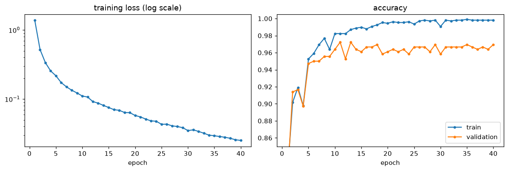
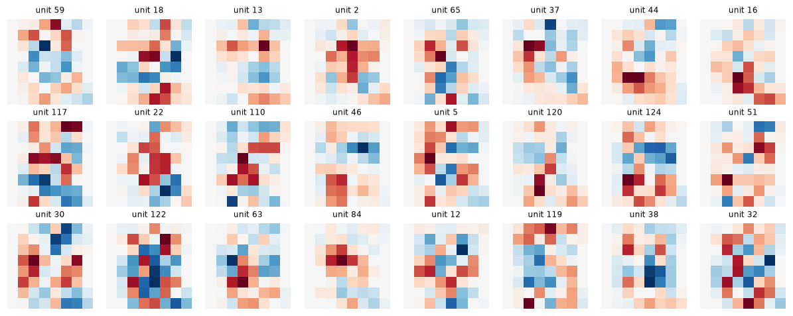

# A Neural Network in NumPy

> **Level 6 · Chapter 3** · ⏱️ ~75 min read · Prerequisites: [Forward and backpropagation](02-forward-and-backpropagation.md), [Gradient descent in depth](../03-ml-fundamentals/07-gradient-descent-in-depth.md) (mini-batches)

This chapter turns the equations of backpropagation into a small, modular library: layer objects with forward and backward methods, a loss layer, a container that chains them, and a mini-batch training loop. You'll train it to about 97% test accuracy on handwritten digits, look inside it to see what the first layer learned, and then break it on purpose to learn the symptoms of a network that won't learn, and their causes.

## Why it matters

Wei trained a network on a product-image dataset, and the loss sat at 2.30 for an entire afternoon. They tried a smaller learning rate, then a bigger one, then twice as many hidden units, then a different activation. Nothing moved it. At 6 p.m., a colleague asked one question: "What's $\log 10$?" It's 2.30. The network was outputting a uniform guess over the 10 classes and had learned nothing at all.

The cause was in the data loader, not the model. Wei had shuffled the images and the labels with two separate calls to the random number generator, so every image was paired with a random label. No architecture can learn a relationship that isn't there. A five-minute check, "can the network overfit 20 examples?", would have failed and pointed straight at the data, instead of costing an afternoon of tuning knobs that couldn't help.

Training neural networks is mostly debugging. This chapter gives you working code and a systematic way to find out why code doesn't work.

## Concepts

### Why layers

In [the previous chapter](02-forward-and-backpropagation.md#an-mlp-forward-and-backward-pass), the forward and backward passes were two functions with a loop over a parameter dictionary. That works for one architecture. But you'll want to add a layer type, swap an activation, insert normalization, or reuse a block, and each change would mean editing both functions in sync.

The fix is the design every framework uses: make each operation a **layer** object that knows how to do two things.

- `forward(x)`: compute the output from the input, and **cache** whatever the backward pass will need.
- `backward(dout)`: given the gradient of the loss with respect to the output, $\mathrm{d}\mathbf{out}$, compute the gradient with respect to the input, $\mathrm{d}\mathbf{x}$, and return it. If the layer has parameters, also compute and store their gradients.

A layer only knows about its own computation. It never needs to know what comes before or after it, because the chain rule only ever asks each node for its local vector-Jacobian product. A network is then a list of layers: forward calls each layer in order, and backward calls each in reverse, passing the gradient along. This is exactly the structure of PyTorch's `nn.Module`, whose layers' backward passes are generated automatically by autograd.

Three layers are enough for a classifier:

| Layer | Forward | Cache | Backward | Parameter gradients |
|---|---|---|---|---|
| `Linear` | $\mathbf{Z} = \mathbf{X}\mathbf{W} + \mathbf{b}$ | $\mathbf{X}$ | $\mathrm{d}\mathbf{X} = \mathrm{d}\mathbf{Z}\,\mathbf{W}^\top$ | $\mathrm{d}\mathbf{W} = \mathbf{X}^\top\mathrm{d}\mathbf{Z}$, $\mathrm{d}\mathbf{b} = \mathbf{1}^\top\mathrm{d}\mathbf{Z}$ |
| `ReLU` | $\mathbf{A} = \max(0, \mathbf{Z})$ | mask $\mathbf{Z} > 0$ | $\mathrm{d}\mathbf{Z} = \mathrm{d}\mathbf{A} \odot \text{mask}$ | none |
| `SoftmaxCrossEntropy` | $\mathcal{L} = -\frac{1}{n}\sum_i \log P_{i, y_i}$ | $\mathbf{P}$, labels | $\mathrm{d}\mathbf{Z} = \frac{1}{n}(\mathbf{P} - \mathbf{Y})$ | none |

The loss layer is special: it takes labels as well as logits, its output is a scalar, and its backward starts the chain (the upstream gradient of $\mathcal{L}$ with respect to itself is 1).

### Parameters and the update

After a backward pass, every parameter array has a matching gradient array. An **optimizer** turns gradients into updates. Plain gradient descent is

$$
\theta \leftarrow \theta - \eta\,\nabla_\theta\mathcal{L},
$$

applied to every parameter array, with **learning rate** $\eta$. Keeping the update separate from the layers matters: [Optimizers](04-optimizers.md) will swap in momentum and Adam without touching any layer code. The update must modify the parameter arrays **in place** (`W -= lr * dW`), so that the layer sees the new values on its next forward pass.

### Initialization

The weights must start random. If every weight in a layer starts at the same value, every unit in that layer computes the same output and receives the same gradient, so they stay identical forever: a 128-unit layer behaves like a 1-unit layer. Random initialization **breaks the symmetry**.

The scale matters too. For ReLU layers, draw $W_{ij} \sim \mathcal{N}\left(0, \frac{2}{d_{\text{in}}}\right)$, called **He initialization**, and start biases at zero. The variance $2/d_{\text{in}}$ keeps the size of the activations roughly constant from layer to layer. [Training deep networks](05-training-deep-networks.md#initialization-xavier-and-he) derives it; for now, use it.

### The training loop

Training repeats one cycle: take a batch, run it forward, compute the loss, run backward, update. The pieces:

- An **iteration** (or **step**) processes one mini-batch and makes one update.
- An **epoch** is one full pass over the training set: about $n / B$ iterations for $n$ examples and batch size $B$.
- **Shuffle every epoch.** If batches come in a fixed order (say, all the 0s, then all the 1s), each update pulls the network toward one class, and it oscillates instead of converging. A new random permutation per epoch keeps every batch representative.
- **Evaluate on held-out data** at the end of each epoch, and keep a **test set** you touch once, at the end, exactly as in [Generalization and the bias-variance trade-off](../03-ml-fundamentals/04-generalization-bias-variance.md).

### Mini-batches

Why not compute the gradient on the full training set each step, or on one example at a time? You met this trade-off in [Gradient descent in depth](../03-ml-fundamentals/07-gradient-descent-in-depth.md#batch-stochastic-and-mini-batch). The mini-batch gradient

$$
\mathbf{g}_B = \frac{1}{B}\sum_{i \in \text{batch}}\nabla_\theta\,\ell_i(\theta)
$$

is an unbiased estimate of the full gradient, with variance that shrinks like $1/B$. So:

- **Small batches** (1 to 32) give noisy gradients but many updates per epoch. The noise slows final convergence but also helps escape sharp, poorly generalizing minima, and it's often a mild regularizer.
- **Large batches** (hundreds to thousands) give accurate gradients and use hardware efficiently (a matrix multiply on 256 rows costs much less than 256 multiplies on one row), but give fewer updates per epoch.
- A batch size of 32 to 256 is the usual starting point. If you change it a lot, retune the learning rate: a common heuristic is to scale the learning rate roughly in proportion to the batch size, within limits.

The loss layer averages over the batch, so the gradient's scale doesn't depend on $B$, and the last, smaller batch of an epoch is handled correctly.

### Inputs: scale them

Networks train best when the input features are on a similar, modest scale, around zero with a spread of about 1. Large inputs mean large pre-activations, large gradients, and an effective learning rate that differs wildly from feature to feature, the same [conditioning](../03-ml-fundamentals/07-gradient-descent-in-depth.md#feature-scaling-and-conditioning) problem you saw with linear models. For pixel intensities with a known range, dividing by the maximum is enough. Otherwise, standardize with statistics computed on the **training set only**, then apply them to validation and test data.

### Visualizing what it learned

A trained network is a pile of numbers, but the first layer can be read directly. Hidden unit $j$ computes $\mathbf{w}_j^\top\mathbf{x} + b_j$, where $\mathbf{w}_j$ is column $j$ of $\mathbf{W}^{[1]}$, with one weight per input pixel. Reshape $\mathbf{w}_j$ to the image's shape and show it as a picture: pixels with positive weight excite the unit, and pixels with negative weight inhibit it. The unit responds most strongly to inputs that look like its weight image. These pictures are the network's learned **features**: strokes, loops, and contrasts between regions. Deeper layers combine them, and they're harder to visualize directly (you'll see tools for that with convolutional networks in [Level 7](../07-deep-learning-pytorch/03-convolutional-networks.md)).

Beyond weights, look at the **errors**: which classes get confused, and which individual examples the model gets wrong. Mistakes on ambiguous examples are reassuring; mistakes on clear examples point to a problem.

### Debugging a network that won't learn

When a network doesn't learn, the cause is almost always in one of four places: the data, the loss or gradient, the optimization settings, or the initialization. The symptoms are often distinctive:

| Symptom | Likely causes |
|---|---|
| Loss stays at exactly $\log K$; accuracy at $1/K$ | labels misaligned with inputs; all-zero or constant weights; gradients not reaching the parameters (update not in place, wrong arrays updated) |
| Loss becomes `nan` or `inf` | learning rate too high; unscaled inputs; an unstable loss (log of a softmax that underflowed) |
| Loss decreases very slowly | learning rate too low; poor initialization scale; saturated or dead units |
| Loss oscillates or jumps | learning rate too high; batches not shuffled |
| Training accuracy high, validation accuracy near chance | labels shuffled relative to inputs (the network memorizes noise); validation data preprocessed differently |
| Training and validation accuracy both plateau at a mediocre level | model too small or too linear (a missing activation); learning rate too high to settle |
| Validation accuracy much worse than training accuracy | overfitting: regularize, get more data, stop earlier |

And a procedure, in order, that finds most problems fast:

1. **Check the initial loss.** For a $K$-class classifier with small random weights, the predicted distribution is close to uniform, so the loss should be close to $\log K$. Much larger means the initial logits are too big (initialization too large, inputs unscaled).
2. **Gradient-check** each new layer on a tiny float64 problem, as in [the previous chapter](02-forward-and-backpropagation.md#gradient-checking).
3. **Overfit a tiny batch.** Train on 10 to 50 examples with no regularization. A correct network should drive the training loss near zero within a few hundred steps. If it can't memorize 20 examples, it can't learn 20,000: the bug is in the model, the loss, the gradients, or the update, not in the amount of data.
4. **Sweep the learning rate** over a few orders of magnitude (for example $10^{-3}$, $10^{-2}$, $10^{-1}$, $1$) for a short run each, and look at the loss curves.
5. **Watch internal statistics.** Per layer: the gradient norm (is it zero, or exploding?), the **update-to-weight ratio** $\eta\lVert\mathrm{d}\mathbf{W}\rVert / \lVert\mathbf{W}\rVert$ (a rule of thumb is about $10^{-3}$ per step; much smaller means learning is too slow, much bigger means it's unstable), and the fraction of dead ReLUs.
6. **Only then** change the architecture.

## In practice

### The data: handwritten digits

scikit-learn's `load_digits` has 1,797 grayscale images of handwritten digits, each $8 \times 8$ pixels with intensities from 0 to 16, flattened to 64 features. It ships with scikit-learn, so no download is needed. It's much smaller than MNIST ($28 \times 28$, 70,000 images), which makes it perfect for a NumPy network that trains in seconds.

Split into training (60%), validation (20%), and test (20%) sets, stratified by class, and scale the pixels to $[0, 1]$.

```python
import numpy as np
import matplotlib.pyplot as plt
from sklearn.datasets import load_digits
from sklearn.model_selection import train_test_split

digits = load_digits()
X_all = digits.data / 16.0                       # pixel intensities 0..16 -> 0..1
y_all = digits.target
X_tmp, X_test, y_tmp, y_test = train_test_split(X_all, y_all, test_size=0.2, stratify=y_all, random_state=0)
X_train, X_val, y_train, y_val = train_test_split(X_tmp, y_tmp, test_size=0.25, stratify=y_tmp, random_state=0)
print("train", X_train.shape, " val", X_val.shape, " test", X_test.shape)
print("class counts in train:", np.bincount(y_train))
```

```text
train (1077, 64)  val (360, 64)  test (360, 64)
class counts in train: [107 109 106 109 109 109 109 107 104 108]
```

### The layers

Each layer stores its parameters and their gradients in two dictionaries with the same keys, so an optimizer can loop over them without knowing anything about the layer.

```python
class Layer:
    def __init__(self):
        self.params, self.grads = {}, {}

    def forward(self, X):
        raise NotImplementedError

    def backward(self, dout):
        raise NotImplementedError


class Linear(Layer):
    def __init__(self, d_in, d_out, rng):
        super().__init__()
        self.params["W"] = rng.normal(0.0, np.sqrt(2.0 / d_in), size=(d_in, d_out))   # He initialization
        self.params["b"] = np.zeros(d_out)

    def forward(self, X):
        self.X = X                                    # cache the input for backward
        return X @ self.params["W"] + self.params["b"]

    def backward(self, dout):
        self.grads["W"] = self.X.T @ dout             # (d_in, n) @ (n, d_out)
        self.grads["b"] = dout.sum(axis=0)            # bias was broadcast over the batch
        return dout @ self.params["W"].T              # (n, d_out) @ (d_out, d_in)


class ReLU(Layer):
    def forward(self, X):
        self.mask = X > 0
        return X * self.mask

    def backward(self, dout):
        return dout * self.mask


class SoftmaxCrossEntropy:
    """Fused softmax + mean cross-entropy. forward takes logits and integer labels."""

    def forward(self, logits, y):
        Z = logits - logits.max(axis=1, keepdims=True)          # stable
        log_probs = Z - np.log(np.exp(Z).sum(axis=1, keepdims=True))
        self.probs, self.y = np.exp(log_probs), y
        return -np.mean(log_probs[np.arange(len(y)), y])

    def backward(self):
        n = len(self.y)
        d = self.probs.copy()
        d[np.arange(n), self.y] -= 1.0                           # P - Y
        return d / n


class Sequential:
    def __init__(self, *layers):
        self.layers = list(layers)

    def forward(self, X):
        for layer in self.layers:
            X = layer.forward(X)
        return X

    def backward(self, dout):
        for layer in reversed(self.layers):
            dout = layer.backward(dout)
        return dout

    def parameters(self):
        """Yield (params dict, grads dict, key) for every parameter array."""
        for layer in self.layers:
            for k in layer.params:
                yield layer.params, layer.grads, k


def sgd_step(model, lr):
    for params, grads, k in model.parameters():
        params[k] -= lr * grads[k]                                # in place
```

That's the whole library: about 70 lines.

### Check the layers before you trust them

Gradient-check the assembled network on a tiny float64 batch, using the same relative error as before. Because every layer is checked through the composed network, this also tests that the layers pass gradients to each other correctly.

```python
def rel_error(a, b):
    return np.linalg.norm(a - b) / max(np.linalg.norm(a) + np.linalg.norm(b), 1e-12)

def grad_check_model(model, loss_fn, X, y, h=1e-5):
    loss_fn.forward(model.forward(X), y)
    model.backward(loss_fn.backward())
    results = []
    for li, layer in enumerate(model.layers):
        for k, P in layer.params.items():
            analytic = layer.grads[k].copy()
            numeric = np.zeros_like(P)
            for idx in np.ndindex(P.shape):
                old = P[idx]
                P[idx] = old + h; fp = loss_fn.forward(model.forward(X), y)
                P[idx] = old - h; fm = loss_fn.forward(model.forward(X), y)
                P[idx] = old
                numeric[idx] = (fp - fm) / (2 * h)
            results.append((f"layer {li} {k}", rel_error(analytic, numeric)))
    return results

rng = np.random.default_rng(0)
tiny = Sequential(Linear(64, 16, rng), ReLU(), Linear(16, 10, rng))
for name, err in grad_check_model(tiny, SoftmaxCrossEntropy(), X_train[:8], y_train[:8]):
    print(f"{name}: {err:.1e}")
```

```text
layer 0 W: 1.3e-10
layer 0 b: 9.2e-11
layer 2 W: 1.4e-10
layer 2 b: 6.0e-11
```

All well below $10^{-7}$.

### The training loop

The loop below shuffles each epoch, iterates over mini-batches, and records the training loss (averaged over the epoch's batches), training accuracy, and validation accuracy. `evaluate` runs the forward pass on a whole set at once; it never calls backward, so it changes nothing.

```python
def accuracy(model, X, y):
    return np.mean(model.forward(X).argmax(axis=1) == y)

def train(model, X_tr, y_tr, X_val, y_val, lr=0.1, epochs=30, batch_size=32, seed=0, log_every=5, verbose=True):
    rng = np.random.default_rng(seed)
    loss_fn = SoftmaxCrossEntropy()
    history = {"loss": [], "train_acc": [], "val_acc": []}
    n = len(X_tr)
    for epoch in range(1, epochs + 1):
        order = rng.permutation(n)                                # reshuffle every epoch
        total = 0.0
        for start in range(0, n, batch_size):
            idx = order[start:start + batch_size]
            logits = model.forward(X_tr[idx])
            loss = loss_fn.forward(logits, y_tr[idx])
            model.backward(loss_fn.backward())
            sgd_step(model, lr)
            total += loss * len(idx)
        history["loss"].append(total / n)
        history["train_acc"].append(accuracy(model, X_tr, y_tr))
        history["val_acc"].append(accuracy(model, X_val, y_val))
        if verbose and (epoch % log_every == 0 or epoch == 1):
            print(f"epoch {epoch:>3}: loss {history['loss'][-1]:.4f}  "
                  f"train acc {history['train_acc'][-1]:.3f}  val acc {history['val_acc'][-1]:.3f}")
    return history

rng = np.random.default_rng(0)
model = Sequential(Linear(64, 128, rng), ReLU(), Linear(128, 10, rng))
W1_init = model.layers[0].params["W"].copy()                    # kept for visualization later
loss0 = SoftmaxCrossEntropy().forward(model.forward(X_train), y_train)
print(f"initial loss {loss0:.3f} (log 10 = {np.log(10):.3f})")
history = train(model, X_train, y_train, X_val, y_val, lr=0.2, epochs=40, batch_size=32)
print(f"test accuracy: {accuracy(model, X_test, y_test):.3f}")
```

```text
initial loss 2.498 (log 10 = 2.303)
epoch   1: loss 1.3794  train acc 0.816  val acc 0.808
epoch   5: loss 0.2173  train acc 0.953  val acc 0.947
epoch  10: loss 0.1106  train acc 0.982  val acc 0.964
epoch  15: loss 0.0755  train acc 0.990  val acc 0.961
epoch  20: loss 0.0579  train acc 0.994  val acc 0.961
epoch  25: loss 0.0431  train acc 0.994  val acc 0.967
epoch  30: loss 0.0350  train acc 0.991  val acc 0.958
epoch  35: loss 0.0294  train acc 0.999  val acc 0.969
epoch  40: loss 0.0252  train acc 0.998  val acc 0.969
test accuracy: 0.969
```

The initial loss is close to $\log 10$, as it should be. Within one epoch the network is past 80% validation accuracy, and it ends at about 97% on the test set, which you touched exactly once. Plot the history to see the shape of training:

```python
epochs = np.arange(1, len(history["loss"]) + 1)
fig, axes = plt.subplots(1, 2, figsize=(11, 3.8))
axes[0].plot(epochs, history["loss"], marker="o", ms=3)
axes[0].set_yscale("log"); axes[0].set_xlabel("epoch"); axes[0].set_title("training loss (log scale)")
axes[1].plot(epochs, history["train_acc"], label="train", marker="o", ms=3)
axes[1].plot(epochs, history["val_acc"], label="validation", marker="o", ms=3)
axes[1].set_ylim(0.85, 1.005); axes[1].set_xlabel("epoch"); axes[1].set_title("accuracy"); axes[1].legend()
plt.tight_layout()
plt.show()
```



*Learning curves for the 64-128-10 network. Training loss keeps falling, but validation accuracy flattens after about 10 epochs: from then on, the network is mostly memorizing the training set.*

Training accuracy approaches 100% while validation accuracy flattens a few points lower. The gap is mild overfitting. [Training deep networks](05-training-deep-networks.md) adds dropout and weight decay to narrow it.

### Comparing with the library versions

How does this compare with scikit-learn? Logistic regression is the no-hidden-layer baseline, and `MLPClassifier` with the same architecture is the library version of exactly what you built (it uses Adam by default, which you'll implement in [Optimizers](04-optimizers.md)).

```python
from sklearn.linear_model import LogisticRegression
from sklearn.neural_network import MLPClassifier

logreg = LogisticRegression(max_iter=5000).fit(X_train, y_train)
sk_mlp = MLPClassifier(hidden_layer_sizes=(128,), max_iter=500, random_state=0).fit(X_train, y_train)
print(f"logistic regression test accuracy: {logreg.score(X_test, y_test):.3f}")
print(f"sklearn MLPClassifier test accuracy: {sk_mlp.score(X_test, y_test):.3f}")
print(f"our NumPy network test accuracy:     {accuracy(model, X_test, y_test):.3f}")
```

```text
logistic regression test accuracy: 0.964
sklearn MLPClassifier test accuracy: 0.975
our NumPy network test accuracy:     0.969
```

Your from-scratch network lands within a point of the library. Notice how strong the linear baseline is: these $8 \times 8$ digits are nearly linearly separable, so the hidden layer buys less than a point of accuracy here. On harder data (full-size MNIST, natural images) the gap is much larger. Always train a linear baseline first, so you know what the network is adding.

### What the first layer learned

Each column of the first weight matrix is a $64$-dimensional template over the $8 \times 8$ pixel grid. But plotting the raw weights shows mostly noise, for an instructive reason: a few border pixels are blank in every image, so their weights get exactly zero gradient and keep their random initial values forever (the gradient $\mathbf{X}^\top\boldsymbol{\delta}$ has a zero row wherever the input column is zero). To see what training *learned*, plot the change from initialization, $\mathbf{W}^{[1]} - \mathbf{W}^{[1]}_{\text{init}}$, for the 24 units that changed most, red for an increase and blue for a decrease.

```python
W1 = model.layers[0].params["W"]                       # (64, 128)
delta_W1 = W1 - W1_init                                # what training changed
always_zero = (X_train == 0).all(axis=0)               # pixels that are blank in every training image
print(f"{always_zero.sum()} pixels are always 0; largest change to their weights: "
      f"{np.abs(delta_W1[always_zero]).max():.1f}")

order = np.argsort(-np.linalg.norm(delta_W1, axis=0))[:24]   # the 24 units that changed most
fig, axes = plt.subplots(3, 8, figsize=(11, 4.4))
for ax, j in zip(axes.ravel(), order):
    w = delta_W1[:, j].reshape(8, 8)
    lim = np.abs(w).max()
    ax.imshow(w, cmap="RdBu_r", vmin=-lim, vmax=lim)
    ax.set_title(f"unit {j}", fontsize=8)
    ax.axis("off")
plt.tight_layout()
plt.show()

# Which digits does each unit respond to most? Mean activation per class for three units
H = np.maximum(0, X_train @ W1 + model.layers[0].params["b"])
for j in order[:3]:
    means = np.array([H[y_train == c, j].mean() for c in range(10)])
    print(f"unit {j:>3}: strongest for digits {np.argsort(-means)[:3]}, weakest for {np.argsort(means)[:3]}")
```

```text
5 pixels are always 0; largest change to their weights: 0.0
unit  59: strongest for digits [3 2 9], weakest for [4 6 1]
unit  18: strongest for digits [3 2 1], weakest for [4 7 0]
unit  13: strongest for digits [0 9 1], weakest for [7 5 3]
```



*Learned changes to the first-layer weights of 24 hidden units, as 8×8 images. Red pixels now excite the unit more and blue pixels inhibit it. The units are partial templates: vertical strokes, top and bottom bars, curves, and contrasts that separate groups of digits.*

The units aren't tidy one-per-digit templates. Each is a feature that separates *groups* of digits, as the per-class activations show: unit 18 responds most to 3, 2, and 1 and least to 4, 7, and 0, and unit 13 likes 0, 9, and 1 but not 7, 5, and 3. Several units in the figure are clearly stroke detectors, such as a vertical bar down the middle (shared by 1, 4, and 7) or a horizontal bar along the bottom (shared by 2 and some 1s). The output layer combines these partial features, with positive and negative weights, into class scores. This **distributed representation**, where each concept is spread over many units and each unit takes part in many concepts, is typical of neural networks.

Look at the mistakes too:

```python
pred = model.forward(X_test).argmax(axis=1)
wrong = np.flatnonzero(pred != y_test)
print(f"{len(wrong)} mistakes out of {len(y_test)}")
pairs = {}
for i in wrong:
    pairs[(y_test[i], pred[i])] = pairs.get((y_test[i], pred[i]), 0) + 1
print("true -> predicted (count):", sorted(pairs.items(), key=lambda kv: -kv[1]))
```

```text
11 mistakes out of 360
true -> predicted (count): [((np.int64(8), np.int64(1)), 2), ((np.int64(4), np.int64(9)), 1), ((np.int64(0), np.int64(4)), 1), ((np.int64(3), np.int64(8)), 1), ((np.int64(1), np.int64(8)), 1), ((np.int64(6), np.int64(1)), 1), ((np.int64(8), np.int64(5)), 1), ((np.int64(9), np.int64(5)), 1), ((np.int64(4), np.int64(1)), 1), ((np.int64(2), np.int64(1)), 1)]
```

The confusions are mostly plausible ones: an 8 read as a 1, a 4 as a 9, a 9 as a 5, a 3 as an 8. With only $8 \times 8$ pixels, some of these test images are genuinely ambiguous.

### A network that won't learn: six failures

Now break it on purpose. Each scenario below changes one thing from the baseline (learning rate 0.2, 40 epochs), and reports the initial loss, the final training loss, and the final training and validation accuracy. Read each row as a symptom, and match it to the table in [Concepts](#debugging-a-network-that-wont-learn).

```python
def make_model(seed=0, d_hidden=128, nonlinear=True, init_scale=1.0):
    rng = np.random.default_rng(seed)
    l1, l2 = Linear(64, d_hidden, rng), Linear(d_hidden, 10, rng)
    l1.params["W"] *= init_scale
    l2.params["W"] *= init_scale
    return Sequential(l1, ReLU(), l2) if nonlinear else Sequential(l1, l2)

def scenario(name, model=None, X_tr=X_train, y_tr=y_train, X_va=X_val, lr=0.2):
    model = model or make_model()
    with np.errstate(all="ignore"):
        loss0 = SoftmaxCrossEntropy().forward(model.forward(X_tr), y_tr)
        h = train(model, X_tr, y_tr, X_va, y_val, lr=lr, epochs=40, verbose=False)
    print(f"{name:<28} init loss {loss0:8.3f}   final loss {h['loss'][-1]:8.4f}   "
          f"train {h['train_acc'][-1]:.3f}   val {h['val_acc'][-1]:.3f}")

rng = np.random.default_rng(1)
scenario("baseline")
scenario("learning rate 5", lr=5.0)
scenario("learning rate 1e-3", lr=1e-3)
scenario("raw pixels (0..16)", X_tr=X_train * 16, X_va=X_val * 16)
scenario("all-zero weights", model=make_model(init_scale=0.0))
scenario("labels shuffled", y_tr=rng.permutation(y_train))
scenario("no ReLU (linear model)", model=make_model(nonlinear=False))
```

```text
baseline                     init loss    2.498   final loss   0.0252   train 0.998   val 0.969
learning rate 5              init loss    2.498   final loss   2.3512   train 0.100   val 0.100
learning rate 1e-3           init loss    2.498   final loss   1.7768   train 0.629   val 0.600
raw pixels (0..16)           init loss   14.562   final loss   2.2288   train 0.124   val 0.131
all-zero weights             init loss    2.303   final loss   2.3050   train 0.101   val 0.100
labels shuffled              init loss    2.417   final loss   1.8711   train 0.331   val 0.089
no ReLU (linear model)       init loss    2.881   final loss   0.0341   train 0.998   val 0.975
```

What each one teaches:

- **Learning rate 5:** the loss jumps to about 9 in the first epoch, then sits near $\log 10$ with accuracy at chance. Nothing crashes and no `nan` appears: the first few oversized updates pushed every hidden unit's pre-activation negative, killing all the ReLUs (you'll confirm this kind of death with the diagnostics below). With an even larger learning rate the logits overflow and the loss becomes `nan`. The fix is a smaller learning rate, with gradient clipping as a safety net ([Training deep networks](05-training-deep-networks.md#gradient-clipping)).
- **Learning rate $10^{-3}$:** no bug, just slow. The loss is still falling steadily after 40 epochs, and accuracy is around 60%. A short learning-rate sweep finds this in minutes.
- **Raw pixels:** the initial loss is about 14.6, far above $\log 10 = 2.3$, which is the giveaway. Inputs 16 times larger make the initial logits huge and the first updates violent; they kill almost all of the ReLUs in the first epoch, and the network ends near chance. Scaling the inputs fixes it. (At a smaller learning rate the raw-pixel network survives and trains, but it's fragile: whether it works depends on luck and tuning, which is exactly what input scaling removes.)
- **All-zero weights:** the loss starts at exactly $\log 10$ and never moves. With $\mathbf{W}^{[1]} = \mathbf{0}$, every hidden pre-activation is 0, ReLU's gradient there is 0, and $\mathbf{W}^{[2]} = \mathbf{0}$ means no gradient reaches the hidden layer anyway. Only the output bias learns, and it can only learn the class frequencies. This is the symmetry problem in its most extreme form.
- **Labels shuffled:** the training accuracy rises well above chance while validation stays at chance. The network is memorizing random labels, and with more epochs it would memorize them all. This was Wei's bug. Training accuracy alone would have hidden it; the train-validation gap exposes it.
- **No ReLU:** nothing looks broken, and validation accuracy is about 97%, as good as the baseline. This is Sam's bug from [Chapter 1](01-from-neurons-to-networks.md#why-it-matters), and it's the most insidious failure: the model is just a logistic regression. On this easy dataset that happens to be enough, which is exactly why only comparing against a linear baseline (or checking the architecture) reveals that the "network" adds nothing.

### Overfit a tiny batch

The single most useful debugging test. Take 20 training examples and train on just them, full batch, with no regularization. A correct network should memorize them.

```python
rng = np.random.default_rng(0)
tiny_model = Sequential(Linear(64, 128, rng), ReLU(), Linear(128, 10, rng))
loss_fn = SoftmaxCrossEntropy()
X20, y20 = X_train[:20], y_train[:20]
for step in range(201):
    loss = loss_fn.forward(tiny_model.forward(X20), y20)
    if step % 50 == 0:
        print(f"step {step:>3}: loss {loss:.5f}, accuracy {accuracy(tiny_model, X20, y20):.2f}")
    tiny_model.backward(loss_fn.backward())
    sgd_step(tiny_model, lr=0.5)
```

```text
step   0: loss 2.62874, accuracy 0.05
step  50: loss 0.02567, accuracy 1.00
step 100: loss 0.01054, accuracy 1.00
step 150: loss 0.00641, accuracy 1.00
step 200: loss 0.00454, accuracy 1.00
```

It passes: 100% accuracy and a loss heading toward zero. If this test fails, more data, more epochs, or a bigger model won't help; something in the pipeline is broken.

### Watching internal statistics

When a network trains but badly, look inside. This helper runs one batch forward and backward, then reports, per linear layer, the gradient norm, the update-to-weight ratio for a given learning rate, and the fraction of ReLU units that are dead (zero for every example in the batch).

```python
def diagnose(model, X, y, lr):
    loss_fn = SoftmaxCrossEntropy()
    loss = loss_fn.forward(model.forward(X), y)
    model.backward(loss_fn.backward())
    print(f"loss {loss:.3f} (log K = {np.log(10):.3f})")
    for i, layer in enumerate(model.layers):
        if isinstance(layer, Linear):
            W, dW = layer.params["W"], layer.grads["W"]
            print(f"  layer {i} Linear: |dW| = {np.linalg.norm(dW):.2e}, "
                  f"update/weight = {lr * np.linalg.norm(dW) / np.linalg.norm(W):.1e}")
        elif isinstance(layer, ReLU):
            dead = np.mean(~layer.mask.any(axis=0))
            print(f"  layer {i} ReLU: {dead:.0%} of units dead on this batch")

batch = slice(0, 256)
print("healthy network, before training:")
diagnose(make_model(), X_train[batch], y_train[batch], lr=0.2)
print("after 40 epochs on raw pixels:")
broken = make_model()
with np.errstate(all="ignore"):
    train(broken, X_train * 16, y_train, X_val * 16, y_val, lr=0.2, epochs=40, verbose=False)
diagnose(broken, X_train[batch] * 16, y_train[batch], lr=0.2)
```

```text
healthy network, before training:
loss 2.479 (log K = 2.303)
  layer 0 Linear: |dW| = 5.86e-01, update/weight = 7.3e-03
  layer 1 ReLU: 7% of units dead on this batch
  layer 2 Linear: |dW| = 7.82e-01, update/weight = 3.5e-02
after 40 epochs on raw pixels:
loss 2.392 (log K = 2.303)
  layer 0 Linear: |dW| = 2.39e-01, update/weight = 1.1e-03
  layer 1 ReLU: 99% of units dead on this batch
  layer 2 Linear: |dW| = 9.19e-01, update/weight = 3.6e-03
```

Before training, the healthy network's update ratios are about $10^{-2}$, on the high side of the rule of thumb (normal for the very first steps of a small network at a fairly large learning rate), and only a few units are inactive on this batch. The raw-pixel network's diagnosis is unambiguous: 99% of the ReLUs are dead on this batch, so almost no signal reaches the output layer, and the loss is stuck near $\log 10$. The early updates, driven by huge inputs, pushed nearly every hidden unit's pre-activation negative for every input, and a dead ReLU gets no gradient to recover.

!!! warning "Common mistake"
    Fitting the input scaling (mean, standard deviation, or min-max) on the full dataset before splitting. The validation and test statistics then leak into training. Compute scaling statistics on the training set only, as in [Feature engineering](../02-data-science-workflow/04-feature-engineering.md). Dividing by a known constant, like 16 for these pixels, is safe because it uses no data.

!!! warning "Common mistake"
    Evaluating on the test set every epoch and picking the best epoch. That turns the test set into a validation set, and the reported test accuracy becomes optimistic. Choose epochs and hyperparameters on validation data; look at test data once.

## Exercises

### Exercise 1: The expected initial loss (easy)

A freshly initialized classifier outputs logits close to zero. (a) What loss should it report for $K = 10$ classes, and for $K = 1{,}000$? (b) Your 10-class network starts at a loss of 14. What does that tell you?

??? success "Solution"

    (a) Logits near zero give softmax probabilities near $1/K$ for every class, so the cross-entropy is $-\log(1/K) = \log K$: about 2.303 for 10 classes and 6.908 for 1,000.

    (b) A loss of 14 means the network is confidently wrong at initialization: the logits are large, so it assigns tiny probability to the true class. Typical causes are unscaled inputs or weights initialized with too large a variance. Fix them before training; a network that starts confidently wrong spends its first epochs undoing that, and may kill units in the process, as the raw-pixel scenario showed.

### Exercise 2: A Tanh layer (easy)

Add a `Tanh` layer class with forward and backward methods, build `Sequential(Linear(64, 32), Tanh(), Linear(32, 10))`, and gradient-check it with `grad_check_model`. Then train it for 30 epochs and report its test accuracy.

??? success "Solution"

    Cache the output, since $\tanh'(z) = 1 - \tanh^2(z)$:

    ```python
    class Tanh(Layer):
        def forward(self, X):
            self.out = np.tanh(X)
            return self.out

        def backward(self, dout):
            return dout * (1.0 - self.out ** 2)

    rng = np.random.default_rng(0)
    tanh_net = Sequential(Linear(64, 32, rng), Tanh(), Linear(32, 10, rng))
    for name, err in grad_check_model(tanh_net, SoftmaxCrossEntropy(), X_train[:8], y_train[:8]):
        print(f"{name}: {err:.1e}")
    train(tanh_net, X_train, y_train, X_val, y_val, lr=0.1, epochs=30, verbose=False)
    print(f"test accuracy: {accuracy(tanh_net, X_test, y_test):.3f}")
    ```

    ```text
    layer 0 W: 1.7e-10
    layer 0 b: 8.5e-11
    layer 2 W: 1.2e-10
    layer 2 b: 5.3e-11
    test accuracy: 0.961
    ```

    On a shallow network like this, tanh and ReLU perform about the same. The differences show up with depth.

### Exercise 3: Batch size versus learning (medium)

Train the 64-128-10 network for 30 epochs with batch sizes 1, 8, 32, 128, and 1,077 (full batch), each at learning rate 0.1. Report the validation accuracy and the number of updates. Then retrain the full-batch version with a learning rate of 1.0. What do you conclude?

??? success "Solution"

    ```python
    import time
    for B in [1, 8, 32, 128, 1077]:
        t0 = time.time()
        h = train(make_model(), X_train, y_train, X_val, y_val, lr=0.1, epochs=30, batch_size=B, verbose=False)
        updates = 30 * int(np.ceil(len(X_train) / B))
        print(f"B = {B:>4}: {updates:>6} updates, val acc {h['val_acc'][-1]:.3f}, {time.time() - t0:.1f}s")
    h = train(make_model(), X_train, y_train, X_val, y_val, lr=1.0, epochs=30, batch_size=1077, verbose=False)
    print(f"B = 1077 with lr = 1.0: val acc {h['val_acc'][-1]:.3f}")
    ```

    ```text
    B =    1:  32310 updates, val acc 0.972, 3.1s
    B =    8:   4050 updates, val acc 0.956, 0.5s
    B =   32:   1020 updates, val acc 0.961, 0.3s
    B =  128:    270 updates, val acc 0.944, 0.2s
    B = 1077:     30 updates, val acc 0.842, 0.1s
    B = 1077 with lr = 1.0: val acc 0.897
    ```

    (Your timings will differ.) With a fixed learning rate and a fixed number of epochs, large batches make far fewer updates and fall behind. A larger learning rate recovers much of the gap, which is the "scale the learning rate with the batch size" heuristic. Batch size 1 makes the most updates but is slowest in wall-clock time, because NumPy can't vectorize across examples. Small-to-medium batches are the practical sweet spot.

### Exercise 4: L2 weight decay (medium)

Add L2 regularization with strength $\lambda$ to the training loop: the loss gains $\frac{\lambda}{2}\sum_l\lVert\mathbf{W}^{[l]}\rVert_F^2$ (weights only, not biases). (a) What term does that add to $\mathrm{d}\mathbf{W}^{[l]}$? (b) Implement it by modifying `sgd_step`, and compare the train-validation gap for $\lambda = 0$ and $\lambda = 10^{-3}$ with a 512-unit hidden layer trained for 60 epochs.

??? success "Solution"

    (a) $\frac{\partial}{\partial \mathbf{W}}\frac{\lambda}{2}\lVert\mathbf{W}\rVert_F^2 = \lambda\mathbf{W}$, so the update becomes $\mathbf{W} \leftarrow \mathbf{W} - \eta(\mathrm{d}\mathbf{W} + \lambda\mathbf{W}) = (1 - \eta\lambda)\mathbf{W} - \eta\,\mathrm{d}\mathbf{W}$: the weights shrink by a constant factor each step, hence "weight decay." This is the same penalty as ridge regression in [Regularization](../03-ml-fundamentals/05-regularization.md).

    ```python
    def sgd_step_l2(model, lr, lam):
        for params, grads, k in model.parameters():
            g = grads[k] + (lam * params[k] if k == "W" else 0.0)
            params[k] -= lr * g

    for lam in [0.0, 1e-3]:
        sgd_step = lambda m, lr, lam=lam: sgd_step_l2(m, lr, lam)      # train() calls sgd_step
        h = train(make_model(d_hidden=512), X_train, y_train, X_val, y_val, lr=0.1, epochs=60, verbose=False)
        print(f"lambda = {lam}: train acc {h['train_acc'][-1]:.3f}, val acc {h['val_acc'][-1]:.3f}")

    def sgd_step(model, lr):                                            # restore the plain version
        for params, grads, k in model.parameters():
            params[k] -= lr * grads[k]
    ```

    ```text
    lambda = 0.0: train acc 0.999, val acc 0.975
    lambda = 0.001: train acc 0.998, val acc 0.978
    ```

    The penalty slightly improves validation accuracy here. On a dataset this easy the effect is small; [Training deep networks](05-training-deep-networks.md#weight-decay) explains how weight decay interacts with adaptive optimizers.

### Exercise 5: Find the bugs (hard)

This training loop has four bugs. Find them without running it, explain the symptom each would cause, and fix them.

<!-- skip-run -->
```python
def train_buggy(model, X, y, lr=0.1, epochs=30, batch_size=32):
    rng = np.random.default_rng(0)
    loss_fn = SoftmaxCrossEntropy()
    order = rng.permutation(len(X))
    for epoch in range(epochs):
        for start in range(0, len(X) - batch_size, batch_size):
            idx = order[start:start + batch_size]
            logits = model.forward(X[idx])
            loss = loss_fn.forward(logits, y[order])
            model.backward(loss_fn.backward())
            for params, grads, k in model.parameters():
                params[k] = params[k] - lr * grads[k]
                grads[k] += 0
```

??? success "Solution"

    1. **Shuffling once, outside the epoch loop.** Every epoch sees the batches in the same order. Training still works, but less well; the fix is to move `order = rng.permutation(len(X))` inside the epoch loop.
    2. **`range(0, len(X) - batch_size, batch_size)` drops the last full or partial batch** every epoch, and with a fixed order those examples are *never* trained on. Use `range(0, len(X), batch_size)`.
    3. **`y[order]` instead of `y[idx]`.** The labels have the wrong length (all $n$ instead of the batch) and the wrong alignment. Here it would crash with an indexing or shape error inside the loss; if the shapes happened to match, it would silently pair inputs with wrong labels, Wei's bug.
    4. **`params[k] = params[k] - lr * grads[k]` rebinds the dictionary entry to a new array.** With this library it actually works, because the layers read `self.params["W"]` on each forward pass. But any code that kept a reference to the old array (an optimizer state, or a layer that stored `self.W = self.params["W"]`) would keep using stale weights, and the loss would never move. Updating in place (`params[k] -= lr * grads[k]`) is the safe habit. The line `grads[k] += 0` does nothing; it's a distraction.

### Exercise 6: Early stopping with a checkpoint (medium)

Modify `train` to keep a copy of the parameters from the epoch with the best validation accuracy, and restore them at the end. Train a 512-unit network for 100 epochs at learning rate 0.1 and report the best epoch and the test accuracy of the restored model.

??? success "Solution"

    ```python
    import copy

    def train_early_stopping(model, X_tr, y_tr, X_val, y_val, lr=0.1, epochs=100, batch_size=32, seed=0):
        best_acc, best_epoch, best_params = -1.0, 0, None
        rng = np.random.default_rng(seed)
        loss_fn = SoftmaxCrossEntropy()
        for epoch in range(1, epochs + 1):
            order = rng.permutation(len(X_tr))
            for start in range(0, len(X_tr), batch_size):
                idx = order[start:start + batch_size]
                loss_fn.forward(model.forward(X_tr[idx]), y_tr[idx])
                model.backward(loss_fn.backward())
                sgd_step(model, lr)
            acc = accuracy(model, X_val, y_val)
            if acc > best_acc:
                best_acc, best_epoch = acc, epoch
                best_params = [copy.deepcopy(layer.params) for layer in model.layers]
        for layer, saved in zip(model.layers, best_params):        # restore, in place
            for k in layer.params:
                layer.params[k][...] = saved[k]
        return best_epoch, best_acc

    m = make_model(d_hidden=512)
    best_epoch, best_acc = train_early_stopping(m, X_train, y_train, X_val, y_val)
    print(f"best epoch {best_epoch}, val acc {best_acc:.3f}, test acc {accuracy(m, X_test, y_test):.3f}")
    ```

    ```text
    best epoch 42, val acc 0.981, test acc 0.975
    ```

    Restoring in place (`[...] = `) keeps the arrays the layers already reference. Note that picking the best of 100 validation scores makes the validation accuracy itself slightly optimistic, which is why you report the test accuracy.

## Check yourself

1. What does a layer's `backward` method receive, and what does it return?

    ??? note "Answer"

        It receives the gradient of the loss with respect to the layer's output, and returns the gradient with respect to the layer's input. Along the way it stores gradients for its own parameters, using values cached during forward.

2. Why must weights be initialized randomly rather than to zero?

    ??? note "Answer"

        Identical weights make every unit in a layer compute the same output and receive the same gradient, so they stay identical forever (and with all zeros and ReLU, no gradient flows at all). Randomness breaks the symmetry.

3. What's the difference between an epoch and an iteration, and why shuffle every epoch?

    ??? note "Answer"

        An iteration processes one mini-batch and makes one update; an epoch passes over the whole training set. Shuffling every epoch keeps batches representative and decorrelated, so updates don't systematically pull in one direction.

4. Your 10-class network's loss is stuck at 2.303. Name three possible causes.

    ??? note "Answer"

        The network outputs a uniform distribution: labels misaligned with inputs, weights initialized to zero or a constant, all hidden units dead, or updates not actually being applied to the parameters.

5. Why is "overfit a tiny batch" such a useful test?

    ??? note "Answer"

        A correct model, loss, gradient, and update should memorize a handful of examples easily. If it can't, the bug is in the pipeline, not in data quantity or model capacity, and it rules out half the possible causes in minutes.

6. What does a training accuracy near 100% with validation accuracy near chance indicate?

    ??? note "Answer"

        The network is memorizing training labels that carry no generalizable relationship to the inputs, most often because the labels and inputs were shuffled separately or misaligned. It can also mean the validation data are preprocessed differently.

7. What's the update-to-weight ratio, and what value is a reasonable rule of thumb?

    ??? note "Answer"

        $\eta\lVert\mathrm{d}\mathbf{W}\rVert / \lVert\mathbf{W}\rVert$, the relative size of one update. Around $10^{-3}$ per step is a common rule of thumb; much smaller suggests learning is too slow, much larger suggests instability.

8. How do you read a first-layer weight image?

    ??? note "Answer"

        Each hidden unit's weights, reshaped to the image grid, show which pixels excite it (positive) and which inhibit it (negative). The unit responds most to inputs that resemble the pattern. Most units are partial features shared by several classes, not one-per-class templates.

## Key takeaways

- Build networks from layers with `forward` (compute and cache) and `backward` (gradient in, gradient out, parameter gradients stored). A network is a list of layers; backward runs them in reverse.
- Keep the update separate from the layers, and modify parameters in place.
- Initialize weights randomly with a scale matched to the layer (He for ReLU), shuffle every epoch, use mini-batches of about 32 to 256, and scale the inputs.
- A 64-128-10 NumPy network reaches about 97% test accuracy on `load_digits`, matching scikit-learn's `MLPClassifier`; always compare with a linear baseline.
- First-layer weights can be viewed as images; they're distributed, partial features rather than per-class templates.
- Debug in order: initial loss ≈ $\log K$, gradient check, overfit a tiny batch, sweep the learning rate, then watch gradient norms, update ratios, and dead units.

## Further reading

- Andrej Karpathy, "A Recipe for Training Neural Networks" (2019), [karpathy.github.io/2019/04/25/recipe](https://karpathy.github.io/2019/04/25/recipe/).
- Stanford CS231n course notes, "Neural Networks Part 3: Learning and Evaluation" (sanity checks and babysitting the learning process): [cs231n.github.io](https://cs231n.github.io/).
- Ian Goodfellow, Yoshua Bengio, and Aaron Courville, *Deep Learning* (MIT Press, 2016), Chapter 11, "Practical Methodology": [deeplearningbook.org](https://www.deeplearningbook.org/).
- scikit-learn user guide, "Neural network models (supervised)": [scikit-learn.org/stable/modules/neural_networks_supervised.html](https://scikit-learn.org/stable/modules/neural_networks_supervised.html).

## Next

Plain SGD worked here, but it's rarely the fastest way down. Next, implement momentum, RMSProp, Adam, and learning-rate schedules, and race them: [Optimizers](04-optimizers.md).
