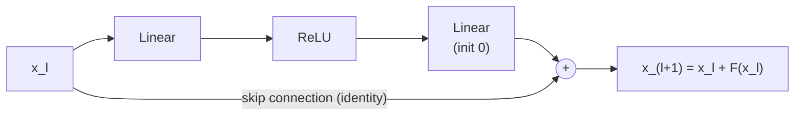
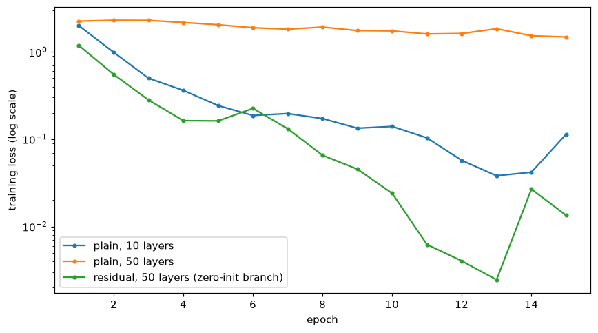

# Training Deep Networks

> **Level 6 · Chapter 5** · ⏱️ ~90 min read · Prerequisites: [Forward and backpropagation](02-forward-and-backpropagation.md), [A neural network in NumPy](03-neural-network-in-numpy.md), [Optimizers](04-optimizers.md), [Probability](../01-math-foundations/04-probability.md) (expectation and variance)

Stacking more layers should make a network more powerful, but a deep network that's set up carelessly doesn't train at all. This chapter measures what happens to activations and gradients as they pass through many layers, derives the Xavier and He initializations from the requirement that their variance stays constant, and then builds the tools that make deep networks trainable: batch normalization and layer normalization (forward and backward), dropout, weight decay, gradient clipping, and residual connections. It ends with a checklist for debugging deep networks.

## Why it matters

Wei's team had a 10-layer network that worked well, and they wanted more capacity, so they doubled the depth to 20 and then to 50. The 20-layer network trained more slowly and ended slightly worse. The 50-layer network barely trained: after 15 epochs it was below 50% accuracy *on the training set*. This wasn't overfitting, where a big model memorizes the training data and fails on new data. The deeper model couldn't even fit the training data, although it could in principle represent everything the 10-layer model could (set the extra layers to compute the identity).

This **degradation problem** puzzled researchers until 2015. Its causes are signals that shrink or grow geometrically with depth, and the fix that finally let networks reach hundreds of layers was surprisingly small: let each block *add* to its input instead of replacing it. This chapter rebuilds Wei's experiment and fixes it, step by step.

## Concepts

### Signals through depth

Recall the backward pass from [Forward and backpropagation](02-forward-and-backpropagation.md#the-full-backward-pass). For an MLP with layers $\mathbf{Z}^{[l]} = \mathbf{A}^{[l-1]}\mathbf{W}^{[l]}$ and $\mathbf{A}^{[l]} = \phi(\mathbf{Z}^{[l]})$, the error signal at each layer is computed from the one above:

$$
\boldsymbol{\delta}^{[l-1]} = \big(\boldsymbol{\delta}^{[l]}\,\mathbf{W}^{[l]\top}\big) \odot \phi'\big(\mathbf{Z}^{[l-1]}\big).
$$

Each step multiplies by a weight matrix and by the activation's slopes. Over $L$ layers, the gradient reaching the first layer is a product of $L$ such factors. Products are unforgiving: if each layer shrinks the signal's size by a factor of 0.7, after 30 layers it has shrunk by $0.7^{30} \approx 2 \times 10^{-5}$. If each layer grows it by 1.5, it has grown by $1.5^{30} \approx 2 \times 10^{5}$.

- **Vanishing gradients:** the early layers get gradients so small that they effectively don't learn. The network behaves like a shallow network on top of fixed random features.
- **Exploding gradients:** the early layers get enormous gradients, updates overshoot, and the loss becomes `nan`.

The forward pass has the same structure: activations are multiplied by a weight matrix and squashed at every layer, so they can also shrink to zero or blow up. A network is easy to train only if both signals keep roughly the same scale from layer to layer. The two main levers are the scale of the initial weights, and the architecture (normalization and residual connections).

Saturating activations make it worse. A sigmoid's slope is at most 0.25, so even with perfectly scaled weights, each sigmoid layer cuts the backward signal by at least a factor of 4. A tanh unit with a large input has slope near 0. ReLU's slope is exactly 1 for active units, one reason it made deep networks practical.

### Initialization: Xavier and He

What should the scale of the initial weights be? Derive it from one requirement: **the variance of the signal should be the same at every layer**, both forward and backward.

**Forward.** Take one pre-activation of layer $l$, $z_j = \sum_{i=1}^{n_{\text{in}}} W_{ij}\,a_i$, where $n_{\text{in}}$ is the layer's **fan-in** (its number of inputs) and the $a_i$ are the previous layer's activations. (Biases start at zero, so they don't contribute.) Assume the weights are independent of each other and of the inputs, with mean 0 and variance $\sigma_w^2$. Each term $W_{ij}a_i$ has mean $\mathbb{E}[W_{ij}]\,\mathbb{E}[a_i] = 0$ and variance $\mathbb{E}[W_{ij}^2]\,\mathbb{E}[a_i^2] = \sigma_w^2\,\mathbb{E}[a_i^2]$. The terms are uncorrelated, so their variances add:

$$
\operatorname{Var}(z_j) = n_{\text{in}}\,\sigma_w^2\,\mathbb{E}\big[a^2\big].
$$

The relationship between $\mathbb{E}[a^2]$ and the previous layer's $\operatorname{Var}(z)$ depends on the activation.

- **Tanh (or no activation).** Near zero, $\tanh(z) \approx z$, so $\mathbb{E}[a^2] \approx \operatorname{Var}(z^{[l-1]})$. The variance is preserved when $n_{\text{in}}\sigma_w^2 = 1$, that is $\sigma_w^2 = 1/n_{\text{in}}$ (called **LeCun initialization**).
- **ReLU.** If $z$ is symmetric around zero, ReLU zeroes half of it and keeps the other half: $\mathbb{E}[\operatorname{ReLU}(z)^2] = \frac{1}{2}\mathbb{E}[z^2] = \frac{1}{2}\operatorname{Var}(z)$. So $\operatorname{Var}(z^{[l]}) = \frac{1}{2}n_{\text{in}}\sigma_w^2\operatorname{Var}(z^{[l-1]})$, preserved when

$$
\sigma_w^2 = \frac{2}{n_{\text{in}}}.
$$

This is **He initialization** (Kaiming He and colleagues, 2015), also called Kaiming initialization. The factor of 2 compensates exactly for ReLU discarding half the signal.

**Backward.** The same argument runs in reverse. The gradient with respect to an input is $\mathrm{d}a_i = \sum_{j=1}^{n_{\text{out}}} W_{ij}\,\mathrm{d}z_j$, a sum over the layer's **fan-out** $n_{\text{out}}$, so $\operatorname{Var}(\mathrm{d}a) = n_{\text{out}}\sigma_w^2\operatorname{Var}(\mathrm{d}z)$. Preserving the backward variance needs $\sigma_w^2 = 1/n_{\text{out}}$ (or $2/n_{\text{out}}$ with ReLU, which zeroes half the gradients too).

**Xavier initialization.** Forward wants $1/n_{\text{in}}$, backward wants $1/n_{\text{out}}$. Xavier Glorot and Yoshua Bengio (2010) proposed the compromise

$$
\sigma_w^2 = \frac{2}{n_{\text{in}} + n_{\text{out}}},
$$

often drawn from a uniform distribution $\mathcal{U}(-a, a)$. A uniform distribution on $[-a, a]$ has variance $a^2/3$, so matching the variance gives $a = \sqrt{6/(n_{\text{in}} + n_{\text{out}})}$. This is **Xavier** (or **Glorot**) **initialization**, the standard for tanh and sigmoid networks. For square layers ($n_{\text{in}} = n_{\text{out}}$), all three choices agree up to the ReLU factor of 2.

| Activation | Initialization | Weight variance $\sigma_w^2$ |
|---|---|---|
| tanh, sigmoid, none | Xavier/Glorot | $\frac{2}{n_{\text{in}} + n_{\text{out}}}$ |
| ReLU, leaky ReLU, GELU | He/Kaiming | $\frac{2}{n_{\text{in}}}$ |
| SELU, or tanh, forward-focused | LeCun | $\frac{1}{n_{\text{in}}}$ |

PyTorch's `nn.Linear` uses a uniform initialization with variance $\frac{1}{3n_{\text{in}}}$ by default, a bit smaller than LeCun's. That's fine for shallow networks, but for deep ReLU networks call `nn.init.kaiming_normal_` explicitly. You'll measure the effect of each choice in [the first demo](#activation-and-gradient-statistics-through-depth).

Good initialization makes the signal's *variance* correct at the start. It doesn't keep it correct once training changes the weights, and it doesn't fix the degradation problem by itself. That's what the next tools are for.

### Batch normalization

**Batch normalization** (Sergey Ioffe and Christian Szegedy, 2015) takes the idea of "keep every layer's inputs well scaled" and enforces it at every step, instead of hoping initialization gets it right. A batch norm layer standardizes each feature over the mini-batch, then lets the network rescale it.

**Forward pass.** For a mini-batch $\mathbf{X} \in \mathbb{R}^{n \times d}$ (usually the pre-activations of a linear layer), for each feature (column) $j$:

$$
\mu_j = \frac{1}{n}\sum_{i=1}^n X_{ij}, \qquad \sigma_j^2 = \frac{1}{n}\sum_{i=1}^n \big(X_{ij} - \mu_j\big)^2, \qquad \hat{X}_{ij} = \frac{X_{ij} - \mu_j}{\sqrt{\sigma_j^2 + \epsilon}}, \qquad Y_{ij} = \gamma_j\,\hat{X}_{ij} + \beta_j.
$$

$\epsilon$ (like $10^{-5}$) avoids division by zero. The learnable **scale** $\gamma_j$ and **shift** $\beta_j$, initialized to 1 and 0, give back the freedom that standardizing took away: if the network wants a feature with a different mean and spread, it can learn it. (With $\gamma_j = \sigma_j$ and $\beta_j = \mu_j$, batch norm computes the identity.) Because $\beta$ plays the role of a bias, the linear layer before a batch norm usually has no bias of its own.

**Training versus inference.** Batch statistics depend on which examples happen to share the batch, which is fine for training but not for prediction: a prediction for one customer shouldn't depend on who else is in the batch, and you might predict for a single example. So batch norm keeps **running averages** of the mean and variance during training, $\mu^{\text{run}} \leftarrow (1 - m)\,\mu^{\text{run}} + m\,\mu$ with momentum $m$ around 0.1, and uses them at inference. This is why frameworks have a training mode and an evaluation mode (`model.train()` and `model.eval()` in PyTorch). Forgetting to switch is one of the most common bugs in deep learning.

**Backward pass.** Batch norm is the first layer in this level whose backward pass couples examples: every output in a column depends on every input in that column through $\mu_j$ and $\sigma_j$. Work with one feature and drop the index $j$. Write $s = \sqrt{\sigma^2 + \epsilon}$ and let $\mathrm{d}Y_i$ be the upstream gradient. The parameter gradients are immediate:

$$
\mathrm{d}\gamma = \sum_{i} \mathrm{d}Y_i\,\hat{X}_i, \qquad \mathrm{d}\beta = \sum_i \mathrm{d}Y_i, \qquad \mathrm{d}\hat{X}_i = \gamma\,\mathrm{d}Y_i.
$$

For the input, you need $\frac{\partial \hat{X}_k}{\partial X_i}$ for every pair $(i, k)$, because $X_i$ affects $\hat{X}_k$ through $\mu$ and $s$. Two pieces: $\frac{\partial \mu}{\partial X_i} = \frac{1}{n}$, and

$$
\frac{\partial s}{\partial X_i} = \frac{1}{2s}\,\frac{\partial \sigma^2}{\partial X_i} = \frac{1}{2s}\cdot\frac{2}{n}\big(X_i - \mu\big) = \frac{\hat{X}_i}{n}.
$$

(The derivative of $\sigma^2$ also has a term through $\mu$, but it's $-\frac{2}{n^2}\sum_k(X_k - \mu) = 0$.) Now apply the quotient rule to $\hat{X}_k = (X_k - \mu)/s$, with $\delta_{ik}$ equal to 1 if $i = k$ and 0 otherwise:

$$
\frac{\partial \hat{X}_k}{\partial X_i} = \frac{\delta_{ik} - \frac{1}{n}}{s} - \frac{X_k - \mu}{s^2}\cdot\frac{\hat{X}_i}{n} = \frac{1}{s}\left(\delta_{ik} - \frac{1}{n} - \frac{\hat{X}_k\hat{X}_i}{n}\right).
$$

Sum over $k$ with the upstream gradients:

$$
\mathrm{d}X_i = \sum_k \mathrm{d}\hat{X}_k\,\frac{\partial \hat{X}_k}{\partial X_i} = \frac{1}{s}\left(\mathrm{d}\hat{X}_i - \frac{1}{n}\sum_k \mathrm{d}\hat{X}_k - \hat{X}_i\,\frac{1}{n}\sum_k \mathrm{d}\hat{X}_k\,\hat{X}_k\right).
$$

Read it as: take the upstream gradient, remove its mean, remove its component along $\hat{\mathbf{X}}$, and divide by the standard deviation. The two removals are exactly the directions batch norm is blind to: shifting all inputs by a constant, or scaling their deviations, doesn't change $\hat{\mathbf{X}}$, so the gradient has no component in those directions. In NumPy it's one line, vectorized over all features.

**Why does it help?** The original paper credited batch norm with reducing **internal covariate shift**, the change in each layer's input distribution as earlier layers train. Later work (Santurkar and colleagues, 2018) found that explanation doubtful and showed that batch norm makes the loss surface smoother, so gradients are more predictive and larger learning rates are stable. Practically, a network with batch norm tolerates larger learning rates and is less sensitive to initialization, and the noise from batch statistics acts as a mild regularizer. The precise reasons are still debated.

**Drawbacks.** It depends on the batch: small batches (under about 16) give noisy statistics, and the train/eval switch is a source of bugs. It's awkward for sequence models, where lengths vary. And it doesn't solve everything: in very deep *plain* networks, batch norm alone can still fail to train well (Greg Yang and colleagues, 2019, showed it can even cause exploding gradients at initialization), which is one reason it's combined with residual connections.

### Layer normalization

**Layer normalization** (Jimmy Ba, Jamie Kiros, and Geoffrey Hinton, 2016) normalizes each *example* across its features, instead of each feature across the batch:

$$
\mu_i = \frac{1}{d}\sum_{j=1}^d X_{ij}, \qquad \sigma_i^2 = \frac{1}{d}\sum_{j=1}^d \big(X_{ij} - \mu_i\big)^2, \qquad Y_{ij} = \gamma_j\,\frac{X_{ij} - \mu_i}{\sqrt{\sigma_i^2 + \epsilon}} + \beta_j.
$$

The statistics are per row, so the layer behaves identically in training and inference, needs no running averages, and works with a batch of one or with sequences of any length. That's why transformers use it ([Level 8](../08-modern-deep-learning/01-attention-and-transformers.md)). The backward pass is batch norm's formula with the roles of the axes swapped: means are taken over features instead of over the batch. A popular simplification, **RMSNorm**, skips the mean subtraction and divides by the root mean square only.

| | Batch norm | Layer norm |
|---|---|---|
| Normalizes over | the batch, per feature | the features, per example |
| Train vs inference | different (running statistics) | identical |
| Depends on batch size | yes | no |
| Typical use | CNNs, MLPs with large batches | transformers, RNNs, small batches |

### Dropout

**Dropout** (Nitish Srivastava, Geoffrey Hinton, and colleagues, 2014) is a regularizer: during training, each unit's output is set to zero with probability $p$ (the **drop rate**), independently for each example and each step. At inference, nothing is dropped.

**Inverted dropout** is the standard implementation. During training, multiply by a random mask and rescale by $\frac{1}{1 - p}$:

$$
\mathbf{Y} = \mathbf{X} \odot \frac{\mathbf{M}}{1 - p}, \qquad M_{ij} \sim \operatorname{Bernoulli}(1 - p).
$$

The rescaling keeps the expected output equal to the input, $\mathbb{E}[Y_{ij}] = X_{ij}\cdot\frac{1 - p}{1 - p} = X_{ij}$, so at inference the layer is simply the identity, with no change to the weights. (The original paper scaled the weights at test time instead; inverted dropout moves that work to training, which is simpler.) The backward pass multiplies by the same mask: $\mathrm{d}\mathbf{X} = \mathrm{d}\mathbf{Y} \odot \frac{\mathbf{M}}{1 - p}$. Units that were dropped get no gradient on that step.

**Why it works.** A unit can't rely on any particular other unit being present, so it must learn features that are useful on their own, rather than fragile **co-adaptations** with specific partners. Another view: each mask selects one of $2^{\text{units}}$ "thinned" subnetworks that share weights, so training with dropout trains a huge ensemble, and the full network at inference approximates the ensemble's average. Typical drop rates are 0.1 to 0.5, applied after activations in fully connected layers. Dropout is less useful in convolutional layers and adds noise that interacts badly with batch norm's statistics, so modern architectures often use it sparingly.

### Weight decay

**Weight decay** shrinks the weights toward zero at every step, the same L2 idea as ridge regression in [Regularization](../03-ml-fundamentals/05-regularization.md), and the subject of [AdamW](04-optimizers.md#weight-decay-and-adamw) in the last chapter. Three practical points for deep networks:

- With SGD, add $\lambda\mathbf{W}$ to the gradient (equivalently, multiply the weights by $1 - \eta\lambda$ each step). With Adam, use decoupled weight decay (AdamW).
- Apply it to weight matrices, not to biases or normalization parameters ($\gamma$, $\beta$). Those have few entries and shrinking them toward zero isn't meaningful regularization (a $\gamma$ of zero switches a feature off).
- Typical values are $10^{-4}$ to $5 \times 10^{-4}$ for SGD on vision models, and 0.01 to 0.1 for AdamW. With batch norm after a layer, the layer's output doesn't depend on the scale of its weights, so weight decay there doesn't reduce capacity; instead it keeps the weights small, which raises the effective learning rate. Regularization in deep networks has subtleties like this, and rules of thumb come from experiment more than theory.

### Gradient clipping

Even a well-built network occasionally produces a huge gradient: an unusual batch, a sharp cliff in the loss surface, or a recurrent network multiplying the same matrix many times. One such step can undo hours of training. **Gradient clipping** caps the size of each update.

**Clipping by global norm**, the standard method, treats all the parameter gradients as one long vector $\mathbf{g}$ and rescales it if its norm exceeds a threshold $c$:

$$
\mathbf{g} \leftarrow \mathbf{g}\cdot\min\left(1, \frac{c}{\lVert\mathbf{g}\rVert}\right).
$$

The direction is unchanged; only the length is capped. **Clipping by value** caps each component at $\pm c$ separately, which changes the direction and is less common. A threshold of 1.0 is a common default for transformers and RNNs (Pascanu, Mikolov, and Bengio, 2013, analyzed why RNNs need it). Clipping is a safety net, not a fix: if the norm is clipped on most steps, the learning rate is too high or something is broken. Log the gradient norm, before clipping, as a standard training metric.

### Residual connections

Now the degradation problem. Kaiming He and colleagues (2016) observed that if extra layers could simply learn the identity, a deeper network could never be worse than a shallower one. The fact that it *is* worse means the identity is hard to learn with stacked nonlinear layers. So build it in. A **residual block** computes

$$
\mathbf{x}_{l+1} = \mathbf{x}_l + F(\mathbf{x}_l),
$$

where $F$, the **residual branch**, is a small stack of layers (for example linear, ReLU, linear), and the direct path from $\mathbf{x}_l$ to the output is the **skip connection** (or **shortcut**). The block only has to learn the *change* $F$ to its input. Doing nothing, $F = 0$, is easy: set the branch's last weights to zero.

**Why gradients flow.** Differentiate the block: $\frac{\partial\mathbf{x}_{l+1}}{\partial\mathbf{x}_l} = \mathbf{I} + \frac{\partial F}{\partial\mathbf{x}_l}$. In backpropagation terms, the add node copies the upstream gradient to both inputs, so

$$
\mathrm{d}\mathbf{x}_l = \mathrm{d}\mathbf{x}_{l+1} + \Big(\text{backward through } F \text{ of } \mathrm{d}\mathbf{x}_{l+1}\Big).
$$

The first term passes the gradient through unchanged. Unrolling over many blocks, $\mathbf{x}_L = \mathbf{x}_l + \sum_{k=l}^{L-1}F(\mathbf{x}_k)$, so the gradient at any block contains the gradient at the output *directly*, plus correction terms. There's no long product of matrices that must all be well-scaled: a plain network's gradient is a product of $L$ Jacobians, while a residual network's is a product of $(\mathbf{I} + \mathbf{J}_k)$ factors, which expands into a sum over paths of every length, including the length-zero path that's just the identity.

**A catch: variance grows.** Adding the branch to the input also adds variances: if $F(\mathbf{x}_l)$ is uncorrelated with $\mathbf{x}_l$, then $\operatorname{Var}(\mathbf{x}_{l+1}) = \operatorname{Var}(\mathbf{x}_l) + \operatorname{Var}(F(\mathbf{x}_l))$. With He initialization inside the branch, $F$ roughly preserves variance, so each block about *doubles* the variance, and 24 blocks multiply it by about $2^{24} \approx 1.7 \times 10^7$. A naively initialized deep residual network explodes. There are two standard fixes:

- **Normalize inside the branch**, as in ResNets (batch norm in each branch) and **pre-norm** transformers, which compute $\mathbf{x} + F(\operatorname{LayerNorm}(\mathbf{x}))$.
- **Start each branch near zero**: initialize the last layer of each branch (or the $\gamma$ of its last batch norm) to zero, so every block starts as the identity and the network starts as a shallow one that grows deeper as it learns. Goyal and colleagues (2017) used zero-initialized $\gamma$; Fixup (Zhang and colleagues, 2019) and similar schemes rescale instead.

With those in place, residual connections let networks reach hundreds of layers. They're in essentially every modern architecture: ResNets, transformers, and diffusion models.



## In practice

### Activation and gradient statistics through depth

Here's the opening experiment in its simplest form: a 30-layer network of width 256, with no training, fed a batch of random inputs. The code records the standard deviation of each layer's activations on the forward pass, and the norm of each layer's error signal $\boldsymbol{\delta}^{[l]} = \mathrm{d}\mathbf{Z}^{[l]}$ on the backward pass (starting from a random upstream gradient), for several activation and initialization choices.

```python
import numpy as np
import matplotlib.pyplot as plt
from scipy.special import expit

ACTS = {
    "tanh":    (np.tanh, lambda z: 1 - np.tanh(z) ** 2),
    "sigmoid": (expit, lambda z: expit(z) * (1 - expit(z))),
    "relu":    (lambda z: np.maximum(0, z), lambda z: (z > 0).astype(float)),
}

def signal_stats(act, weight_std, depth=30, width=256, n=512, seed=0):
    rng = np.random.default_rng(seed)
    f, df = ACTS[act]
    Ws = [rng.normal(0, weight_std, size=(width, width)) for _ in range(depth)]
    A = rng.normal(size=(n, width))
    cache, act_std = [], []
    for W in Ws:                                     # forward
        Z = A @ W
        cache.append((A, Z))
        A = f(Z)
        act_std.append(A.std())
    dA = rng.normal(size=A.shape) / n                # a random upstream gradient
    delta_norm = np.zeros(depth)
    for l in reversed(range(depth)):                 # backward
        A_prev, Z = cache[l]
        dZ = dA * df(Z)                              # the error signal delta at layer l
        delta_norm[l] = np.linalg.norm(dZ)
        dA = dZ @ Ws[l].T
    return np.array(act_std), delta_norm

width = 256
xavier, he = np.sqrt(2 / (width + width)), np.sqrt(2 / width)
configs = [
    ("tanh, std 0.01 (too small)", "tanh", 0.01),
    ("tanh, std 1 (too large)",   "tanh", 1.0),
    ("tanh, Xavier",              "tanh", xavier),
    ("sigmoid, Xavier",           "sigmoid", xavier),
    ("ReLU, Xavier",              "relu", xavier),
    ("ReLU, He",                  "relu", he),
    ("ReLU, std 0.15 (too large)", "relu", 0.15),
]

fig, axes = plt.subplots(1, 2, figsize=(13, 4.5))
print(f"{'configuration':<28}{'act std L1':>11}{'L30':>10}{'|delta| L1':>11}{'L30':>10}{'L1/L30':>10}")
for name, act, std in configs:
    a_std, g = signal_stats(act, std)
    axes[0].semilogy(np.arange(1, 31), a_std, marker="o", ms=3, label=name)
    axes[1].semilogy(np.arange(1, 31), g, marker="o", ms=3, label=name)
    print(f"{name:<28}{a_std[0]:>11.2e}{a_std[-1]:>10.2e}{g[0]:>11.2e}{g[-1]:>10.2e}{g[0] / g[-1]:>10.1e}")
axes[0].set_title("activation std, forward"); axes[1].set_title("error-signal norm |delta|, backward")
for ax in axes:
    ax.set_xlabel("layer")
axes[1].legend(fontsize=8, loc="lower left")
plt.tight_layout()
plt.show()
```

```text
configuration                act std L1       L30 |delta| L1       L30    L1/L30
tanh, std 0.01 (too small)     1.56e-01  1.33e-24   5.88e-24  7.07e-01   8.3e-24
tanh, std 1 (too large)        9.75e-01  9.75e-01   4.32e+12  1.29e-01   3.4e+13
tanh, Xavier                   6.27e-01  1.32e-01   1.13e-01  6.94e-01   1.6e-01
sigmoid, Xavier                2.08e-01  1.23e-01   9.92e-20  1.66e-01   6.0e-19
ReLU, Xavier                   5.87e-01  3.54e-05   2.61e-05  5.19e-01   5.0e-05
ReLU, He                       8.30e-01  1.16e+00   6.04e-01  5.19e-01   1.2e+00
ReLU, std 0.15 (too large)     1.41e+00  9.03e+06   2.77e+06  5.19e-01   5.3e+06
```


*Forward activation scale (left) and backward error-signal scale (right) through 30 untrained layers. The backward pass runs from layer 30 down to layer 1, so read the right panel from right to left. Only configurations whose curves stay flat give every layer a similar learning signal.*

Read the table's last column, the ratio of the error signal at the first layer to the one at the last layer:

- **Too small (tanh, std 0.01):** each layer multiplies the signal by about $0.01 \times \sqrt{256} = 0.16$, in both directions. Activations and gradients both vanish, by more than 20 orders of magnitude.
- **Too large (tanh, std 1):** forward, every unit saturates at $\pm 1$: the activations look healthy (std near 1), but they're just random signs. Backward, each layer multiplies by weights about 16 times too large, and the few unsaturated units let that through, so the error signal *explodes*, growing by 13 orders of magnitude. The two failure modes can coexist in one network.
- **Sigmoid, even with Xavier:** activations are fine, but each layer's slope of at most 0.25 shrinks the error signal: the first layer's is about $10^{-18}$ times the last layer's. It would never learn.
- **ReLU with Xavier:** Xavier's variance is half of what ReLU needs, so each layer loses a factor of $\sqrt{2}$ in scale, in both directions: $2^{-15} \approx 3 \times 10^{-5}$ over 30 layers, as the table shows.
- **ReLU with He:** flat in both directions, as derived.
- **Too large for ReLU (std 0.15):** each layer grows the signal by about $0.15 \times \sqrt{256/2} = 1.7$, and the first layer's error signal is about five million times the last's. Training would explode. (Tanh with Xavier, for comparison, loses only a factor of about 6 over 30 layers; tanh's slope is below 1 away from zero, so some shrinkage is unavoidable.)

### A small library for this chapter

The rest of the chapter needs the layer library from [A neural network in NumPy](03-neural-network-in-numpy.md) with two additions: layers now have a `training` flag (batch norm and dropout behave differently in training and inference), and a container can hold other containers (a residual block holds its branch). The optimizers are from [Optimizers](04-optimizers.md).

??? example "Library code: data, Linear, ReLU, loss, containers, optimizers, and a training loop (expand to copy)"

    ```python
    from sklearn.datasets import load_digits
    from sklearn.model_selection import train_test_split

    digits = load_digits()
    X_all, y_all = digits.data / 16.0, digits.target
    X_tmp, X_test, y_tmp, y_test = train_test_split(X_all, y_all, test_size=0.2, stratify=y_all, random_state=0)
    X_train, X_val, y_train, y_val = train_test_split(X_tmp, y_tmp, test_size=0.25, stratify=y_tmp, random_state=0)

    class Layer:
        training = True
        def __init__(self):
            self.params, self.grads = {}, {}
        def modules(self):
            yield self

    class Linear(Layer):
        def __init__(self, d_in, d_out, rng, std=None):
            super().__init__()
            std = np.sqrt(2.0 / d_in) if std is None else std          # He by default
            self.params["W"] = rng.normal(0.0, std, size=(d_in, d_out))
            self.params["b"] = np.zeros(d_out)
        def forward(self, X):
            self.X = X
            return X @ self.params["W"] + self.params["b"]
        def backward(self, dout):
            self.grads["W"] = self.X.T @ dout
            self.grads["b"] = dout.sum(axis=0)
            return dout @ self.params["W"].T

    class ReLU(Layer):
        def forward(self, X):
            self.mask = X > 0
            return X * self.mask
        def backward(self, dout):
            return dout * self.mask

    class SoftmaxCrossEntropy:
        def forward(self, logits, y):
            Z = logits - logits.max(axis=1, keepdims=True)
            log_probs = Z - np.log(np.exp(Z).sum(axis=1, keepdims=True))
            self.probs, self.y = np.exp(log_probs), y
            return -np.mean(log_probs[np.arange(len(y)), y])
        def backward(self):
            d = self.probs.copy()
            d[np.arange(len(self.y)), self.y] -= 1.0
            return d / len(self.y)

    class Sequential(Layer):
        def __init__(self, *layers):
            super().__init__()
            self.layers = list(layers)
        def modules(self):                                  # every leaf layer, recursively
            for layer in self.layers:
                yield from layer.modules()
        def forward(self, X):
            for layer in self.layers:
                X = layer.forward(X)
            return X
        def backward(self, dout):
            for layer in reversed(self.layers):
                dout = layer.backward(dout)
            return dout
        def train(self, mode=True):
            for m in self.modules():
                m.training = mode
        def param_arrays(self):
            return [m.params[k] for m in self.modules() for k in m.params]
        def grad_arrays(self):
            return [m.grads[k] for m in self.modules() for k in m.params]

    class SGDMomentum:
        def __init__(self, params, lr, beta=0.9):
            self.params, self.lr, self.beta = params, lr, beta
            self.v = [np.zeros_like(p) for p in params]
        def step(self, grads):
            for p, g, v in zip(self.params, grads, self.v):
                v *= self.beta
                v += g
                p -= self.lr * v

    class Adam:
        def __init__(self, params, lr=1e-3, b1=0.9, b2=0.999, eps=1e-8):
            self.params, self.lr, self.b1, self.b2, self.eps, self.t = params, lr, b1, b2, eps, 0
            self.m = [np.zeros_like(p) for p in params]
            self.v = [np.zeros_like(p) for p in params]
        def step(self, grads):
            self.t += 1
            for p, g, m, v in zip(self.params, grads, self.m, self.v):
                m *= self.b1; m += (1 - self.b1) * g
                v *= self.b2; v += (1 - self.b2) * g * g
                p -= self.lr * (m / (1 - self.b1 ** self.t)) / (np.sqrt(v / (1 - self.b2 ** self.t)) + self.eps)

    def accuracy(model, X, y):
        model.train(False)                                   # inference mode
        acc = np.mean(model.forward(X).argmax(axis=1) == y)
        model.train(True)
        return acc

    def fit(model, make_opt, epochs=15, batch_size=32, seed=0, clip=None):
        """Mini-batch training. Returns per-epoch training loss and the gradient norms seen."""
        opt = make_opt(model.param_arrays())
        loss_fn = SoftmaxCrossEntropy()
        rng = np.random.default_rng(seed)
        n, losses, norms = len(X_train), [], []
        model.train(True)
        with np.errstate(all="ignore"):
            for epoch in range(epochs):
                order, running = rng.permutation(n), 0.0
                for start in range(0, n, batch_size):
                    idx = order[start:start + batch_size]
                    loss = loss_fn.forward(model.forward(X_train[idx]), y_train[idx])
                    model.backward(loss_fn.backward())
                    grads = model.grad_arrays()
                    norms.append(global_norm(grads))
                    if clip is not None:
                        clip_by_global_norm(grads, clip)
                    opt.step(grads)
                    running += loss * len(idx)
                losses.append(running / n)
        return losses, np.array(norms)
    ```

The training loop calls two clipping helpers, defined in [Gradient clipping](#gradient-clipping-in-code) below; here they are, so the library is complete:

```python
def global_norm(grads):
    return np.sqrt(sum(float(np.sum(g * g)) for g in grads))

def clip_by_global_norm(grads, max_norm):
    norm = global_norm(grads)
    if norm > max_norm:
        for g in grads:
            g *= max_norm / norm                     # in place: same direction, shorter
    return norm
```

And a gradient checker for single layers. It uses the scalar loss $\sum_{ij} Y_{ij}D_{ij}$ for a fixed random $\mathbf{D}$, whose gradient with respect to the output is exactly $\mathbf{D}$:

```python
def rel_error(a, b):
    return np.linalg.norm(a - b) / max(np.linalg.norm(a) + np.linalg.norm(b), 1e-12)

def check_layer(layer, X, h=1e-5, seed=123):
    D = np.random.default_rng(seed).normal(size=layer.forward(X).shape)
    f = lambda: float(np.sum(layer.forward(X) * D))
    f()
    dX = layer.backward(D)
    analytic = {"X": dX, **{k: v.copy() for k, v in layer.grads.items()}}
    arrays = {"X": X, **layer.params}
    out = {}
    for name, P in arrays.items():
        num = np.zeros_like(P)
        for idx in np.ndindex(P.shape):
            old = P[idx]
            P[idx] = old + h; fp = f()
            P[idx] = old - h; fm = f()
            P[idx] = old
            num[idx] = (fp - fm) / (2 * h)
        out[name] = rel_error(analytic[name], num)
    return out
```

### Batch normalization, forward and backward

The layer follows PyTorch's conventions so you can compare: `momentum` is the weight on the *new* batch statistic (0.1), and the running variance is updated with the unbiased variance (dividing by $n - 1$), while normalization during training uses the biased one.

```python
class BatchNorm(Layer):
    def __init__(self, d, momentum=0.1, eps=1e-5):
        super().__init__()
        self.params["gamma"], self.params["beta"] = np.ones(d), np.zeros(d)
        self.running_mean, self.running_var = np.zeros(d), np.ones(d)
        self.momentum, self.eps = momentum, eps

    def forward(self, X):
        if self.training:
            n = X.shape[0]
            mu, var = X.mean(axis=0), X.var(axis=0)                     # biased variance for normalizing
            m = self.momentum
            self.running_mean = (1 - m) * self.running_mean + m * mu
            self.running_var = (1 - m) * self.running_var + m * var * n / max(n - 1, 1)
            self.std = np.sqrt(var + self.eps)
            self.xhat = (X - mu) / self.std
        else:
            self.xhat = (X - self.running_mean) / np.sqrt(self.running_var + self.eps)
        return self.params["gamma"] * self.xhat + self.params["beta"]

    def backward(self, dout):
        self.grads["gamma"] = np.sum(dout * self.xhat, axis=0)
        self.grads["beta"] = np.sum(dout, axis=0)
        dxhat = dout * self.params["gamma"]
        # remove the mean and the component along xhat, then divide by std
        return (dxhat - dxhat.mean(axis=0) - self.xhat * np.mean(dxhat * self.xhat, axis=0)) / self.std

rng = np.random.default_rng(0)
X = rng.normal(3.0, 2.0, size=(16, 5))                       # shifted, scaled inputs
bn = BatchNorm(5)
bn.params["gamma"], bn.params["beta"] = rng.normal(size=5), rng.normal(size=5)
print("gradient check:", ", ".join(f"{k} {v:.1e}" for k, v in check_layer(bn, X).items()))

bn = BatchNorm(5)
Y = bn.forward(X)
print("output mean per feature:", np.round(Y.mean(axis=0), 6))
print("output std per feature: ", np.round(Y.std(axis=0), 4))
```

```text
gradient check: X 8.2e-11, gamma 4.1e-12, beta 5.7e-12
output mean per feature: [ 0. -0. -0. -0.  0.]
output std per feature:  [1. 1. 1. 1. 1.]
```

The backward pass checks out, and in training mode the outputs have mean 0 and standard deviation 1 per feature, whatever the inputs' scale. (The gradient check calls `forward` many times in training mode, so the running statistics drift during it; that's harmless here, but it's why the second part uses a fresh layer.)

The library version is `torch.nn.BatchNorm1d`. Compare outputs, gradients, and running statistics:

```python
import torch
torch.set_num_threads(4)

rng = np.random.default_rng(1)
X = rng.normal(3.0, 2.0, size=(16, 5))
D = rng.normal(size=(16, 5))

ours = BatchNorm(5)
Y = ours.forward(X)
dX = ours.backward(D)

theirs = torch.nn.BatchNorm1d(5, dtype=torch.float64)
Xt = torch.tensor(X, requires_grad=True)
Yt = theirs(Xt)
(Yt * torch.tensor(D)).sum().backward()

print("forward:       ", np.max(np.abs(Y - Yt.detach().numpy())))
print("dX:            ", np.max(np.abs(dX - Xt.grad.numpy())))
print("dgamma:        ", np.max(np.abs(ours.grads["gamma"] - theirs.weight.grad.numpy())))
print("running mean:  ", np.max(np.abs(ours.running_mean - theirs.running_mean.numpy())))
print("running var:   ", np.max(np.abs(ours.running_var - theirs.running_var.numpy())))
```

```text
forward:        6.661338147750939e-16
dX:             3.3306690738754696e-16
dgamma:         3.552713678800501e-15
running mean:   5.551115123125783e-17
running var:    0.0
```

Identical to rounding error.

### Layer normalization

Layer norm is batch norm with the statistics taken along the other axis, and no running averages:

```python
class LayerNorm(Layer):
    def __init__(self, d, eps=1e-5):
        super().__init__()
        self.params["gamma"], self.params["beta"] = np.ones(d), np.zeros(d)
        self.eps = eps

    def forward(self, X):
        mu = X.mean(axis=1, keepdims=True)                           # per example
        var = X.var(axis=1, keepdims=True)
        self.std = np.sqrt(var + self.eps)
        self.xhat = (X - mu) / self.std
        return self.params["gamma"] * self.xhat + self.params["beta"]

    def backward(self, dout):
        self.grads["gamma"] = np.sum(dout * self.xhat, axis=0)
        self.grads["beta"] = np.sum(dout, axis=0)
        dxhat = dout * self.params["gamma"]
        return (dxhat - dxhat.mean(axis=1, keepdims=True)
                - self.xhat * np.mean(dxhat * self.xhat, axis=1, keepdims=True)) / self.std

ln = LayerNorm(5)
ln.params["gamma"], ln.params["beta"] = rng.normal(size=5), rng.normal(size=5)
print("gradient check:", ", ".join(f"{k} {v:.1e}" for k, v in check_layer(ln, X).items()))

theirs = torch.nn.LayerNorm(5, dtype=torch.float64)
with torch.no_grad():
    theirs.weight.copy_(torch.tensor(ln.params["gamma"]))
    theirs.bias.copy_(torch.tensor(ln.params["beta"]))
Xt = torch.tensor(X, requires_grad=True)
(theirs(Xt) * torch.tensor(D)).sum().backward()
ln.forward(X)
print("vs torch: forward", np.max(np.abs(ln.forward(X) - theirs(Xt).detach().numpy())),
      " dX", np.max(np.abs(ln.backward(D) - Xt.grad.numpy())))
```

```text
gradient check: X 9.1e-11, gamma 1.1e-11, beta 5.3e-12
vs torch: forward 8.881784197001252e-16  dX 8.881784197001252e-16
```

### What batch norm buys: a larger stable learning rate

Train a 20-layer plain ReLU network (He initialization, width 64) on digits with SGD and momentum, with and without a batch norm after every hidden linear layer, at two learning rates:

```python
def plain_net(depth, width=64, batchnorm=False, seed=0):
    rng = np.random.default_rng(seed)
    layers = [Linear(64, width, rng), ReLU()]
    for _ in range(depth - 2):
        layers.append(Linear(width, width, rng))
        if batchnorm:
            layers.append(BatchNorm(width))
        layers.append(ReLU())
    layers.append(Linear(width, 10, rng))
    return Sequential(*layers)

for bn_flag in [False, True]:
    for lr in [0.01, 0.05]:
        model = plain_net(20, batchnorm=bn_flag)
        losses, _ = fit(model, lambda ps: SGDMomentum(ps, lr))
        print(f"20 layers, batch norm {str(bn_flag):<5}, lr {lr}: final train loss {losses[-1]:.3f}, "
              f"val acc {accuracy(model, X_val, y_val):.3f}")
```

```text
20 layers, batch norm False, lr 0.01: final train loss 0.316, val acc 0.911
20 layers, batch norm False, lr 0.05: final train loss 1.597, val acc 0.283
20 layers, batch norm True , lr 0.01: final train loss 0.488, val acc 0.919
20 layers, batch norm True , lr 0.05: final train loss 0.568, val acc 0.900
```

Without batch norm, raising the learning rate from 0.01 to 0.05 wrecks training. With batch norm, the larger learning rate works almost as well. That robustness, more than raw accuracy, is batch norm's main practical benefit. Notice, though, that none of these 20-layer networks matches the shallow networks from earlier chapters (about 97%): depth is still hurting. That's the problem residual connections solve.

### Dropout

```python
class Dropout(Layer):
    def __init__(self, p, rng):
        super().__init__()
        self.p, self.rng = p, rng

    def forward(self, X):
        if not self.training or self.p == 0:
            return X                                                   # inference: identity
        self.mask = (self.rng.random(X.shape) >= self.p) / (1 - self.p)  # inverted dropout
        return X * self.mask

    def backward(self, dout):
        if not self.training or self.p == 0:
            return dout
        return dout * self.mask

drop = Dropout(0.5, np.random.default_rng(0))
X = np.ones((10_000, 4))
Y = drop.forward(X)
print("fraction zeroed:", np.mean(Y == 0).round(3), "  mean output:", Y.mean().round(3), "(input mean 1.0)")
drop.training = False
print("inference output equals input:", np.array_equal(drop.forward(X), X))
```

```text
fraction zeroed: 0.498   mean output: 1.004 (input mean 1.0)
inference output equals input: True
```

Half the units are zeroed, the survivors are doubled, and the expected output matches the input. At inference the layer does nothing. (A gradient check of dropout must reuse one fixed mask; with a new mask on every forward pass, the loss is random.)

### Residual connections fix the degradation problem

A residual block holds its branch (linear, ReLU, linear) as a `Sequential`, and its backward pass adds the skip connection's gradient, unchanged, to the branch's. An option zeroes the branch's last layer at initialization.

```python
class Residual(Layer):
    def __init__(self, d, rng, zero_init=True):
        super().__init__()
        self.branch = Sequential(Linear(d, d, rng), ReLU(), Linear(d, d, rng))
        if zero_init:
            self.branch.layers[-1].params["W"][...] = 0.0      # each block starts as the identity

    def modules(self):
        yield from self.branch.modules()

    def forward(self, X):
        return X + self.branch.forward(X)

    def backward(self, dout):
        return dout + self.branch.backward(dout)               # skip path + branch path

def residual_net(blocks, width=64, zero_init=True, seed=0):
    rng = np.random.default_rng(seed)
    layers = [Linear(64, width, rng), ReLU()]
    layers += [Residual(width, rng, zero_init) for _ in range(blocks)]
    layers.append(Linear(width, 10, rng))
    return Sequential(*layers)

errors = check_layer(Residual(6, np.random.default_rng(0), zero_init=False), np.random.default_rng(1).normal(size=(4, 6)))
print("residual block gradient check:", ", ".join(f"{k} {v:.1e}" for k, v in errors.items()))
```

```text
residual block gradient check: X 8.6e-12
```

(`check_layer` only checks the block's input gradient here, because the block's parameters live in its branch; the branch's layers were checked individually.)

Now Wei's experiment. Each network below has 50 linear layers: a plain ReLU network, a residual network of 24 blocks with zero-initialized branches, and the same residual network with standard initialization in every branch. A 10-layer plain network is the baseline. All use He initialization and SGD with momentum at learning rate 0.01 for 15 epochs.

```python
runs = {
    "plain, 10 layers":                      plain_net(10),
    "plain, 50 layers":                      plain_net(50),
    "residual, 50 layers (zero-init branch)": residual_net(24),
    "residual, 50 layers (standard init)":   residual_net(24, zero_init=False),
}
fig, ax = plt.subplots(figsize=(8, 4.5))
for name, model in runs.items():
    losses, norms = fit(model, lambda ps: SGDMomentum(ps, 0.01))
    print(f"{name:<40} first-step grad norm {norms[0]:9.2e}   final train loss {losses[-1]:8.4f}   "
          f"val acc {accuracy(model, X_val, y_val):.3f}")
    if np.all(np.isfinite(losses)):
        ax.semilogy(np.arange(1, 16), losses, marker="o", ms=3, label=name)
ax.set_xlabel("epoch"); ax.set_ylabel("training loss (log scale)"); ax.legend()
plt.tight_layout()
plt.show()
```

```text
plain, 10 layers                         first-step grad norm  2.49e+00   final train loss   0.1142   val acc 0.958
plain, 50 layers                         first-step grad norm  9.63e+00   final train loss   1.4854   val acc 0.439
residual, 50 layers (zero-init branch)   first-step grad norm  6.96e+00   final train loss   0.0134   val acc 0.972
residual, 50 layers (standard init)      first-step grad norm  9.85e+06   final train loss      nan   val acc 0.097
```



*The degradation problem and its fix. The 50-layer plain network can't even fit the training data; the same depth with residual connections trains faster and further than the 10-layer network. The residual network with standard branch initialization isn't plotted: its loss was `nan` from the first epoch.*

All four results match the theory:

- **Plain, 50 layers:** the degradation problem. It's not overfitting: the *training* loss stays above 1.
- **Residual, zero-initialized branches:** at initialization, every block is the identity, so the network starts as a 3-layer network with healthy gradients, and the branches switch on as they learn. It beats the 10-layer network on training loss and validation accuracy.
- **Residual, standard initialization:** the variance doubles with every block, as derived above. The first gradient has a norm of about $10^{7}$, the first update destroys the weights, and the loss becomes `nan`. Residual connections need a near-identity start or normalization in the branch.

### Gradient clipping in code

The zero-initialized residual network trained well at learning rate 0.01. At 0.05, an occasional huge gradient blows it up. Clipping the global gradient norm at 1.0 rescues it:

```python
for clip in [None, 1.0]:
    model = residual_net(24)
    losses, norms = fit(model, lambda ps: SGDMomentum(ps, 0.05), clip=clip)
    finite = norms[np.isfinite(norms)]
    print(f"clip {str(clip):<4}: final train loss {losses[-1]:.4f}, val acc {accuracy(model, X_val, y_val):.3f}, "
          f"median grad norm {np.median(finite):.2f}, max {finite.max():.1e}, "
          f"steps clipped {np.mean(norms > 1.0) if clip else 0:.0%}")
```

```text
clip None: final train loss nan, val acc 0.097, median grad norm 47.70, max 8.8e+07, steps clipped 0%
clip 1.0 : final train loss 0.0377, val acc 0.947, median grad norm 4.49, max 2.3e+01, steps clipped 86%
```

Without clipping, a few large gradients compound, the norm runs away, and the loss becomes `nan`. With clipping, every gradient is cut down to norm 1 before the update, and training survives, reaching about 95% validation accuracy. But look at the last column: 86% of steps were clipped. That's the diagnostic to watch. When most steps are clipped, clipping isn't a safety net any more; it's acting as a crude normalized-gradient optimizer, and the learning rate is too high. Here the cleaner fix is the smaller learning rate of 0.01, which trained this network better without any clipping. Clipping earns its place when it fires rarely, catching the occasional spike.

### A debugging checklist for deep networks

When a deep network won't train, work through this list, roughly in order. It extends the checklist from [A neural network in NumPy](03-neural-network-in-numpy.md#debugging-a-network-that-wont-learn).

**Before training**

1. Gradient-check every custom layer in float64, including normalization and residual blocks.
2. Confirm the initial loss is close to $\log K$ for $K$ classes (or the variance of the targets for regression).
3. Overfit one small batch to near-zero loss, with dropout and weight decay turned off.
4. Check the initialization matches the activation: He for ReLU-family, Xavier for tanh and sigmoid.
5. Print per-layer activation statistics and gradient norms for one batch, as in the first demo. They should stay within an order of magnitude or so across layers; geometric growth or decay means an initialization or architecture problem.

**During training**

6. Log the training loss, the validation metric, the learning rate, and the global gradient norm (before clipping) every few steps.
7. `nan` or a sudden spike: lower the learning rate, add warmup, add gradient clipping, and check for `log(0)` or division by zero (use fused, stable losses).
8. Loss flat from the start: check that gradients reach the early layers (vanishing), that ReLUs aren't dead, and that the update is applied.
9. Deep network worse than a shallow one, on the *training* set: add residual connections (with a near-identity start) and normalization.
10. Training loss fine but validation poor: regularize (weight decay, dropout, data augmentation, early stopping) or get more data.

**Mode and pipeline bugs**

11. Switch to inference mode for evaluation (`model.eval()` in PyTorch) and back to training mode afterward. Batch norm and dropout silently misbehave otherwise.
12. Don't apply weight decay to biases and normalization parameters.
13. Re-sweep the learning rate after any architectural change, such as adding normalization.

!!! warning "Common mistake"
    Evaluating a batch-norm network in training mode. The predictions then depend on the batch composition: the same image gets different scores in different batches, accuracy changes with batch size, and a batch of one gives garbage (each feature is normalized to zero). In PyTorch, call `model.eval()` before evaluation and `model.train()` before training resumes.

!!! warning "Common mistake"
    Adding residual connections to a deep network with standard initialization in every branch and nothing else. As the demo showed, the variance doubles per block and the network explodes. Zero-initialize the last layer (or last normalization scale) of each branch, or normalize inside the branch.

## Exercises

### Exercise 1: The ReLU factor of two (easy)

Let $z \sim \mathcal{N}(0, \sigma^2)$. Show that $\mathbb{E}[\operatorname{ReLU}(z)^2] = \sigma^2/2$, and check it numerically. Why does the result only need $z$ to be symmetric around zero, not Gaussian?

??? success "Solution"

    $\mathbb{E}[\operatorname{ReLU}(z)^2] = \mathbb{E}[z^2\,\mathbb{1}(z > 0)]$. By symmetry, $z^2$ has the same distribution on $z > 0$ and $z < 0$, so $\mathbb{E}[z^2\mathbb{1}(z > 0)] = \mathbb{E}[z^2\mathbb{1}(z < 0)]$, and the two add up to $\mathbb{E}[z^2] = \sigma^2$. Each is $\sigma^2/2$. Only symmetry was used.

    ```python
    z = np.random.default_rng(0).normal(0, 3.0, 1_000_000)
    print(np.mean(np.maximum(0, z) ** 2), 3.0 ** 2 / 2)
    ```

    ```text
    4.512035932784586 4.5
    ```

### Exercise 2: Xavier uniform (easy)

(a) Show that $\mathcal{U}(-a, a)$ has variance $a^2/3$. (b) What's the Xavier uniform bound for a layer with 784 inputs and 256 outputs? (c) What's the He normal standard deviation for the same layer?

??? success "Solution"

    (a) The density is $\frac{1}{2a}$ on $[-a, a]$ and the mean is 0, so $\operatorname{Var} = \int_{-a}^{a}\frac{x^2}{2a}\,dx = \frac{1}{2a}\cdot\frac{2a^3}{3} = \frac{a^2}{3}$.

    (b) $a = \sqrt{6/(784 + 256)} = \sqrt{6/1040} \approx 0.0760$.

    (c) $\sigma = \sqrt{2/784} \approx 0.0505$. (Xavier's standard deviation here is $a/\sqrt{3} \approx 0.0439$, a bit smaller, as expected since Xavier doesn't include ReLU's factor of 2.)

### Exercise 3: Batch norm with a batch of one (medium)

(a) What does a batch norm layer output in training mode for a batch containing a single example, and what's its gradient with respect to the input? (b) Show it with the `BatchNorm` class. (c) Why doesn't layer norm have this problem?

??? success "Solution"

    (a) With $n = 1$, $\mu = x$ and $\sigma^2 = 0$, so $\hat{x} = 0$ and the output is $\beta$, whatever the input. The input gradient is 0: in the formula, $\mathrm{d}\hat{X}$ minus its mean (itself) is 0, and $\hat{X} = 0$.

    ```python
    bn1 = BatchNorm(4)
    bn1.params["beta"] = np.array([0.1, 0.2, 0.3, 0.4])
    x1 = np.array([[5.0, -3.0, 2.0, 7.0]])
    print("train mode output:", bn1.forward(x1), " input grad:", bn1.backward(np.ones((1, 4))))
    bn1.training = False
    print("eval mode output: ", np.round(bn1.forward(x1), 3))
    ```

    ```text
    train mode output: [[0.1 0.2 0.3 0.4]]  input grad: [[0. 0. 0. 0.]]
    eval mode output:  [[ 4.843 -2.646  2.197  7.041]]
    ```

    (Eval mode normalizes with the running statistics. After one training-mode update with momentum 0.1, the running mean is $0.1x$ and the running variance is $0.9 \cdot 1 + 0.1 \cdot 0 = 0.9$, so the output is $(x - 0.1x)/\sqrt{0.9} + \beta \approx 0.949x + \beta$. PyTorch refuses this situation outright: `BatchNorm1d` raises an error for a batch of one in training mode.)

    (c) Layer norm normalizes across the features of each example, so it never needs more than one example, and it behaves the same in training and inference.

### Exercise 4: Clip by value versus clip by norm (easy)

For the gradient $\mathbf{g} = (3, 0.1, -4)$, compute (a) the result of clipping by global norm with $c = 1$, (b) the result of clipping by value with $c = 1$. (c) Compute the angle between each result and $\mathbf{g}$. Which preserves the update direction?

??? success "Solution"

    ```python
    g = np.array([3.0, 0.1, -4.0])
    by_norm = g.copy(); clip_by_global_norm([by_norm], 1.0)
    by_value = np.clip(g, -1.0, 1.0)
    angle = lambda a, b: np.degrees(np.arccos(a @ b / np.linalg.norm(a) / np.linalg.norm(b)))
    print("by norm: ", np.round(by_norm, 4), f"angle {angle(by_norm, g):.1f} degrees")
    print("by value:", by_value, f"angle {angle(by_value, g):.1f} degrees")
    ```

    ```text
    by norm:  [ 0.5999  0.02   -0.7998] angle 0.0 degrees
    by value: [ 1.   0.1 -1. ] angle 8.6 degrees
    ```

    The norm of $\mathbf{g}$ is about 5.0, so clipping by norm divides everything by 5: same direction, length 1. Clipping by value caps the two large components and leaves the small one, which rotates the step by about 9 degrees and inflates the relative importance of the small component.

### Exercise 5: Gradients through residual blocks (medium)

Consider $L$ blocks, each multiplying the backward signal by a matrix. In a plain network, block $k$'s Jacobian is $\mathbf{J}_k$; in a residual network it's $\mathbf{I} + \mathbf{J}_k$. Take every $\mathbf{J}_k$ to be a random $64 \times 64$ matrix with entries $\mathcal{N}(0, s^2/64)$, so it scales vectors by roughly $s$. For $L = 50$ and $s \in \{0.5, 1, 2\}$, compute the norm of a unit vector after passing back through all 50 blocks, for both networks. What do you conclude, and what does it suggest about initializing $F$?

??? success "Solution"

    ```python
    rng = np.random.default_rng(0)
    for s in [0.5, 1.0, 2.0]:
        v_plain = v_res = np.ones(64) / 8.0                  # unit vector
        for _ in range(50):
            J = rng.normal(0, s / 8.0, size=(64, 64))
            v_plain = J.T @ v_plain
            v_res = v_res + J.T @ v_res
        print(f"s = {s}: plain {np.linalg.norm(v_plain):.1e}, residual {np.linalg.norm(v_res):.1e}")
    ```

    ```text
    s = 0.5: plain 8.8e-16, residual 2.6e+02
    s = 1.0: plain 4.1e-01, residual 1.4e+07
    s = 2.0: plain 5.2e+14, residual 2.4e+17
    ```

    The plain network's gradient vanishes or explodes unless the scale is exactly right ($s = 1$). The residual network never vanishes, because the identity keeps a direct path, but with large branch Jacobians it explodes: $\lVert(\mathbf{I} + \mathbf{J})\mathbf{v}\rVert^2 \approx (1 + s^2)\lVert\mathbf{v}\rVert^2$ per block, the backward version of the variance doubling. That's why branches should start small: with $s \approx 0$ every factor is close to $\mathbf{I}$, and the gradient passes through 50 blocks unchanged. Zero-initializing the branch's last layer is the extreme case.

### Exercise 6: Does dropout help on digits? (hard)

Train a network with two hidden layers of 256 ReLU units on digits with Adam ($10^{-3}$) for 30 epochs, with dropout rates 0, 0.2, and 0.5 after each hidden layer. Report the final training loss, training accuracy (in inference mode), validation accuracy, and test accuracy. Does dropout help here? Explain the result.

??? success "Solution"

    ```python
    for p in [0.0, 0.2, 0.5]:
        rng = np.random.default_rng(0)
        model = Sequential(Linear(64, 256, rng), ReLU(), Dropout(p, rng),
                           Linear(256, 256, rng), ReLU(), Dropout(p, rng), Linear(256, 10, rng))
        losses, _ = fit(model, lambda ps: Adam(ps, 1e-3), epochs=30)
        print(f"dropout {p}: train loss {losses[-1]:.4f}, train acc {accuracy(model, X_train, y_train):.3f}, "
              f"val acc {accuracy(model, X_val, y_val):.3f}, test acc {accuracy(model, X_test, y_test):.3f}")
    ```

    ```text
    dropout 0.0: train loss 0.0014, train acc 1.000, val acc 0.981, test acc 0.981
    dropout 0.2: train loss 0.0125, train acc 1.000, val acc 0.983, test acc 0.981
    dropout 0.5: train loss 0.0667, train acc 0.997, val acc 0.969, test acc 0.969
    ```

    Dropout raises the training loss (the network is trained on noisy subnetworks), as expected. A light rate (0.2) changes validation and test accuracy by less than one image: no measurable benefit. A heavy rate (0.5) costs about a point, because the network now slightly underfits. On this small, clean dataset the unregularized network already generalizes well, and the differences are within run-to-run noise. Regularizers help when there's a real overfitting gap to close. Don't add them by default; add them when the validation curve says you need them, and measure over several seeds.

## Check yourself

1. Why do gradients vanish or explode in deep networks?

    ??? note "Answer"

        Backpropagation multiplies the gradient by a weight matrix and the activation slopes at every layer, so the gradient at early layers is a product of many factors. If the typical factor is below 1 the product shrinks geometrically; above 1, it grows geometrically.

2. Derive the He initialization variance.

    ??? note "Answer"

        $\operatorname{Var}(z) = n_{\text{in}}\sigma_w^2\,\mathbb{E}[a^2]$, and for ReLU with symmetric inputs $\mathbb{E}[a^2] = \frac{1}{2}\operatorname{Var}(z_{\text{prev}})$. Setting $\operatorname{Var}(z) = \operatorname{Var}(z_{\text{prev}})$ gives $\sigma_w^2 = 2/n_{\text{in}}$.

3. What does batch norm do differently in training and inference, and why?

    ??? note "Answer"

        In training it normalizes with the current batch's mean and variance and updates running averages; in inference it uses the running averages. Predictions must not depend on what else is in the batch, and inference may see one example at a time.

4. How do batch norm and layer norm differ?

    ??? note "Answer"

        Batch norm normalizes each feature across the batch; layer norm normalizes each example across its features. Layer norm needs no running statistics, behaves identically in training and inference, and works with any batch size, which is why transformers use it.

5. Why does inverted dropout divide by $1 - p$?

    ??? note "Answer"

        So the expected output during training equals the input. Then the layer can be the identity at inference, with no rescaling of weights.

6. What's the difference between clipping by global norm and by value?

    ??? note "Answer"

        Global-norm clipping rescales the whole gradient vector to a maximum length, preserving its direction. Value clipping caps each component independently, which can change the direction.

7. Why do residual connections help gradients flow, and what can go wrong with them?

    ??? note "Answer"

        Each block's Jacobian is $\mathbf{I} + \mathbf{J}_F$, so the gradient has a direct identity path from the output to every block and doesn't have to survive a product of many matrices. But each block adds its branch's variance, so with standard branch initialization the signal explodes with depth; zero-initialize each branch's last layer or normalize inside the branch.

8. A 50-layer network has higher *training* loss than a 10-layer one. Is it overfitting? What would you try?

    ??? note "Answer"

        No: overfitting means low training loss and high validation loss. Higher training loss in a deeper model is the degradation problem, an optimization failure. Check gradient norms per layer, then add residual connections with a near-identity start and normalization.

## Key takeaways

- Signals in deep networks are products over layers, so they vanish or explode geometrically unless every layer preserves their scale.
- Initialize to preserve variance: He ($2/n_{\text{in}}$) for ReLU, Xavier ($2/(n_{\text{in}} + n_{\text{out}})$) for tanh and sigmoid.
- Batch norm standardizes each feature over the batch (with running statistics for inference) and makes training robust to the learning rate; layer norm standardizes each example and is the choice for transformers. Both have a backward pass that removes the gradient's mean and its component along $\hat{\mathbf{X}}$.
- Inverted dropout zeroes units with probability $p$ and rescales by $\frac{1}{1-p}$ in training, and is the identity at inference.
- Apply weight decay to weights only; clip gradients by global norm as a safety net and log the norm.
- Residual connections, with branches that start near zero, fix the degradation problem and let networks go hundreds of layers deep.
- Debug deep networks by measuring: per-layer activation and gradient statistics, the initial loss, a tiny-batch overfit, and the gradient norm over training.

## Further reading

- Xavier Glorot and Yoshua Bengio, "Understanding the difficulty of training deep feedforward neural networks," AISTATS 2010.
- Kaiming He, Xiangyu Zhang, Shaoqing Ren, and Jian Sun, "Delving Deep into Rectifiers" (2015), [arXiv:1502.01852](https://arxiv.org/abs/1502.01852), and "Deep Residual Learning for Image Recognition," CVPR 2016, [arXiv:1512.03385](https://arxiv.org/abs/1512.03385).
- Sergey Ioffe and Christian Szegedy, "Batch Normalization: Accelerating Deep Network Training by Reducing Internal Covariate Shift" (2015), [arXiv:1502.03167](https://arxiv.org/abs/1502.03167); and Shibani Santurkar et al., "How Does Batch Normalization Help Optimization?" (2018), [arXiv:1805.11604](https://arxiv.org/abs/1805.11604).
- Jimmy Lei Ba, Jamie Ryan Kiros, and Geoffrey Hinton, "Layer Normalization" (2016), [arXiv:1607.06450](https://arxiv.org/abs/1607.06450).
- Nitish Srivastava et al., "Dropout: A Simple Way to Prevent Neural Networks from Overfitting," *Journal of Machine Learning Research* 15 (2014).

## Next

You've now written forward and backward passes for linear layers, activations, losses, normalization, dropout, and residual blocks, by hand. Next, automate that: build an engine that computes any backward pass for you, the way PyTorch does: [Autograd from scratch](06-autograd-from-scratch.md).
