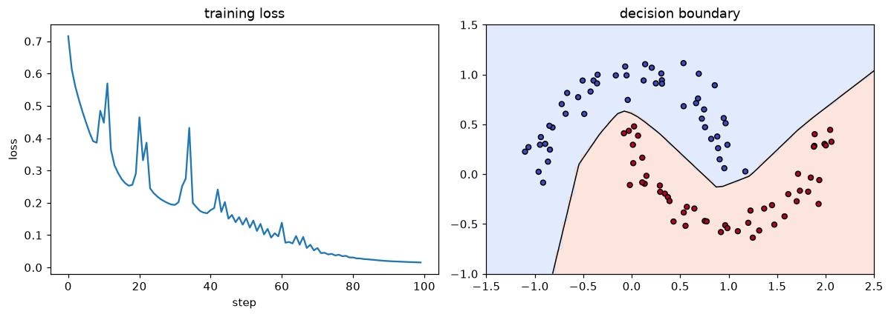

# Autograd from Scratch

> **Level 6 · Chapter 6** · ⏱️ ~85 min read · Prerequisites: [Forward and backpropagation](02-forward-and-backpropagation.md), [A neural network in NumPy](03-neural-network-in-numpy.md), [NumPy](../00-python-for-data/04-numpy.md) (broadcasting)

So far you've written every backward pass by hand. This chapter automates it. You'll build a reverse-mode automatic differentiation engine for scalars, in about 80 lines of Python, with a topological sort that orders the backward pass; train a small neural network with it; then extend it to a NumPy-backed tensor engine that handles matrix multiplication and broadcasting, and train it on handwritten digits. The chapter ends by mapping each piece onto PyTorch's autograd, so you'll know what `loss.backward()` is doing underneath.

## Why it matters

Sam moved their team's model from hand-written NumPy to PyTorch and, to save memory, restructured the training loop. The loss fell for a few hundred steps, then shot up and became `nan`. Lowering the learning rate only delayed the blowup. The bug was a missing line: `optimizer.zero_grad()`. In PyTorch, `backward()` *adds* gradients into each parameter's `.grad`; it doesn't overwrite them. Without zeroing, every step's gradient was the sum of all previous gradients, so the effective step grew with every iteration until training exploded.

Why would a framework add instead of overwrite? Because adding is what the chain rule requires whenever a value is used more than once, the "add at forks" rule from [Forward and backpropagation](02-forward-and-backpropagation.md#the-chain-rule-on-graphs). Accumulation is a feature: it's how shared weights and gradient accumulation across mini-batches work. Once you've built an autograd engine yourself, behaviors like this stop being surprising, and errors like "element 0 of tensors does not require grad" or "a leaf Variable that requires grad is being used in an in-place operation" start making sense.

## Concepts

### Three ways to get a derivative

There are three ways a computer can produce derivatives:

- **Numerical differentiation** uses finite differences. It's easy and works on any function, but it's approximate, and it costs one or two function evaluations *per input*. You use it for [gradient checking](02-forward-and-backpropagation.md#gradient-checking).
- **Symbolic differentiation** manipulates formulas, as a computer algebra system does: it turns the expression for $f$ into an expression for $f'$. The results are exact, but the expressions can grow enormously (**expression swell**), and it can't handle ordinary code with loops and branches.
- **Automatic differentiation** (**autodiff**, or **AD**) applies the chain rule to the actual sequence of elementary operations the program executes, using their numerical values. It's exact up to floating-point rounding, it works on any code built from differentiable operations (loops and `if` statements included), and in reverse mode it gets the whole gradient of a scalar for a small constant multiple of the cost of evaluating the function.

You've been doing reverse-mode autodiff by hand for four chapters. Now the computer will do it.

### Reverse mode, mechanized

Reverse-mode AD has two phases.

1. **Forward pass, recording the graph.** Run the computation normally, but each elementary operation also creates a node that remembers its inputs (its **parents** in the graph) and how to compute its local gradient. This record is the **computational graph**, sometimes called the **tape** or **Wengert list**.
2. **Backward pass.** Set the output's gradient to 1. Then visit the nodes in reverse order. Each node takes its own accumulated gradient $\bar{v} = \partial L/\partial v$ and adds its contribution to each parent: for a parent $u$, $\bar{u} \mathrel{+}= \bar{v}\cdot\frac{\partial v}{\partial u}$.

Each operation needs only one piece of custom code: its **local backward rule**, the vector-Jacobian product from [Chapter 2](02-forward-and-backpropagation.md#matrix-calculus-for-layers-jacobians-versus-vector-jacobian-products). Everything else, the bookkeeping, the ordering, the accumulation, is generic. That separation is the whole idea: you write `forward` once for each primitive operation, and the engine derives the backward pass of any program composed from them.

### Why gradients accumulate

Each parent's gradient is a *sum* of contributions, one from each node that consumed it, so the engine must use `+=`, never `=`. Take $c = a \cdot a$. The multiply node's backward rule says "the first input's gradient gets $\bar{c}\cdot(\text{second input})$, the second input's gradient gets $\bar{c}\cdot(\text{first input})$." Both inputs are $a$. With `+=`, $\bar{a} = \bar{c}\,a + \bar{c}\,a = 2a\bar{c}$, the correct derivative of $a^2$. With `=`, the second assignment would overwrite the first and give $a\bar{c}$, off by a factor of two.

The same rule explains Sam's bug. PyTorch treats successive `backward()` calls as more contributions to the same leaf gradients, so it keeps adding. Clearing the gradients is the training loop's job.

### Topological order

In what order must the backward pass visit the nodes? A node can only pass its gradient on once that gradient is **complete**, meaning every node that uses it has already contributed. So every node must be processed after all of its consumers: the reverse of an order in which every node comes after its parents.

An ordering of a directed acyclic graph in which every node comes after all of its parents is a **topological order**. Computational graphs are always acyclic (an operation can't consume its own future output), so one always exists. A **depth-first search** builds it: to place a node, first place all its parents (recursively), then append the node itself. Nodes already placed are skipped, so each node appears once even if it's reachable along many paths.

```text
build(v):
    if v not visited:
        mark v visited
        for each parent p of v: build(p)
        append v to order
```

The output is appended last; reversing the list starts the backward pass from the output, and every node is processed only after all its consumers. Without the sort, a naive recursive backward that propagates each node's gradient as soon as one consumer touches it would pass along incomplete gradients, and a node reachable along several paths would propagate several times. You'll see that failure in [Exercise 3](#exercise-3-why-the-topological-sort-matters-medium).

### A scalar engine

The smallest useful engine works on scalars. A `Value` object holds a number (`data`), its gradient (`grad`, starting at 0), its parents, and a `_backward` function that applies its local rule. Each operation creates a `Value` and attaches a closure that knows how to push the output's gradient to the inputs:

| Operation | Forward | Local backward rule (`+=` into each input's grad) |
|---|---|---|
| $c = a + b$ | $a + b$ | $\bar{a} \mathrel{+}= \bar{c}$, $\bar{b} \mathrel{+}= \bar{c}$ |
| $c = a \cdot b$ | $ab$ | $\bar{a} \mathrel{+}= b\,\bar{c}$, $\bar{b} \mathrel{+}= a\,\bar{c}$ |
| $c = a^k$ ($k$ a constant) | $a^k$ | $\bar{a} \mathrel{+}= k\,a^{k-1}\,\bar{c}$ |
| $c = e^{a}$ | $e^{a}$ | $\bar{a} \mathrel{+}= c\,\bar{c}$ |
| $c = \log a$ | $\log a$ | $\bar{a} \mathrel{+}= \bar{c}/a$ |
| $c = \tanh a$ | $\tanh a$ | $\bar{a} \mathrel{+}= (1 - c^2)\,\bar{c}$ |
| $c = \operatorname{ReLU}(a)$ | $\max(0, a)$ | $\bar{a} \mathrel{+}= \mathbb{1}(a > 0)\,\bar{c}$ |

Subtraction, negation, and division come for free by composing these: $a - b = a + (-1)\cdot b$ and $a / b = a\cdot b^{-1}$. This idea, a tiny set of primitives that everything else is built from, is exactly how real frameworks work. Andrej Karpathy's **micrograd** is a well-known teaching implementation of this design, and the engine below follows it closely.

### From scalars to tensors

The scalar engine is correct but hopelessly slow for real networks: a single $64 \times 128$ matrix multiply on a batch of 32 examples becomes about 262,000 scalar multiply nodes and as many additions, each a Python object. The fix is to make each node hold a whole array and make each operation a whole NumPy operation, with an array-valued backward rule:

| Operation | Forward | Backward |
|---|---|---|
| $\mathbf{C} = \mathbf{A}\mathbf{B}$ | matrix product | $\bar{\mathbf{A}} \mathrel{+}= \bar{\mathbf{C}}\mathbf{B}^\top$, $\bar{\mathbf{B}} \mathrel{+}= \mathbf{A}^\top\bar{\mathbf{C}}$ |
| $\mathbf{C} = \mathbf{A} + \mathbf{B}$ (broadcast) | element-wise sum | $\bar{\mathbf{A}} \mathrel{+}= \operatorname{unbroadcast}(\bar{\mathbf{C}})$, same for $\mathbf{B}$ |
| $\mathbf{C} = \mathbf{A} \odot \mathbf{B}$ (broadcast) | element-wise product | $\bar{\mathbf{A}} \mathrel{+}= \operatorname{unbroadcast}(\bar{\mathbf{C}} \odot \mathbf{B})$ |
| $c = \sum \mathbf{A}$ (over some axes) | reduction | $\bar{\mathbf{A}} \mathrel{+}= \bar{c}$ broadcast back to $\mathbf{A}$'s shape |
| $\mathbf{C} = \phi(\mathbf{A})$ (element-wise) | apply $\phi$ | $\bar{\mathbf{A}} \mathrel{+}= \bar{\mathbf{C}} \odot \phi'(\mathbf{A})$ |

These are the same rules you derived for the linear layer in Chapter 2. The new ingredient is broadcasting.

### Broadcasting and its gradient

NumPy's [broadcasting](../00-python-for-data/04-numpy.md) lets you add a bias vector of shape `(128,)` to a matrix of shape `(32, 128)`: the vector is virtually copied into each of the 32 rows. In graph terms, broadcasting is a **copy**, one value feeding many outputs. And a value that feeds many outputs gets the *sum* of their gradients (add at forks again). So the gradient of a broadcast operand is the upstream gradient **summed over every dimension that was broadcast**.

Broadcasting can stretch a shape in two ways, so undoing it has two steps:

1. **Added leading dimensions.** Shapes are aligned from the right, and missing leading dimensions are added: `(128,)` acts like `(1, 128)`, then like `(32, 128)`. Sum the gradient over the extra leading axes until it has the operand's number of dimensions.
2. **Stretched size-1 dimensions.** A dimension of size 1 that was stretched to size $m$ (like the 1 in a `(32, 1)` column added to a `(32, 10)` matrix): sum over that axis with `keepdims=True` so the size-1 dimension is kept.

That's `unbroadcast(grad, shape)`, and it's the most common source of shape bugs in hand-written autograd engines: forget it, and the bias gradient comes out with shape `(32, 128)` instead of `(128,)`.

### How PyTorch's autograd works

PyTorch's engine is the same design, industrialized:

- **Tensors and leaves.** A tensor created by you with `requires_grad=True` (a parameter) is a **leaf**. Every tensor produced by an operation on tensors that require gradients gets a `grad_fn`: the node in the graph that created it, holding references to its inputs' nodes (`grad_fn.next_functions`) and whatever values its backward needs.
- **Define-by-run.** The graph is recorded as your Python code executes, fresh on every forward pass. That's why ordinary control flow (loops, `if` statements, recursion) just works: the graph is whatever actually ran. Your `Value` and `Tensor` engines are define-by-run too.
- **`backward()`** seeds the output's gradient with 1 (which is why it needs a scalar, or an explicit gradient argument), orders the graph topologically, and calls each node's backward rule. Each operator's rule lives in a table of derivative formulas, the same kind as the tables above, written once per operator.
- **Accumulation into leaves.** Gradients are accumulated with `+=` into each leaf's `.grad`. Intermediate tensors don't keep their gradients unless you call `.retain_grad()`. Hence `optimizer.zero_grad()` before each backward pass, and hence gradient accumulation across several small batches is just several `backward()` calls before one `optimizer.step()`.
- **Freeing the graph.** After `backward()`, the graph's saved values are freed to save memory, so calling `backward()` twice through the same graph raises an error unless you pass `retain_graph=True`.
- **Turning it off.** `with torch.no_grad():` stops recording, for evaluation and for parameter updates. `tensor.detach()` returns a tensor that shares data but is cut off from the graph.
- **In-place safety.** Tensors carry a version counter. If you modify in place a value that a node saved for its backward pass, PyTorch detects the changed version at backward time and raises an error rather than silently computing a wrong gradient.
- **Custom operations.** `torch.autograd.Function` lets you supply your own `forward` and `backward` (with `ctx.save_for_backward` to cache values), exactly the layer interface from [Chapter 3](03-neural-network-in-numpy.md#why-layers). Use it for operations PyTorch can't differentiate, or for a fused, more efficient backward.
- **Higher-order derivatives.** With `create_graph=True`, the backward pass is itself recorded as a graph, so you can differentiate gradients (for Hessian-vector products or gradient penalties). Your engine could do this too if its backward rules were written in terms of `Value` operations instead of raw floats.

Modern PyTorch also offers `torch.compile`, which captures the graph ahead of time to optimize it. The autograd logic underneath is the same.

## In practice

### A scalar autograd engine

Here's the complete engine. Every operation returns a new `Value` whose `_prev` holds its parents and whose `_backward` closure adds the local gradient contributions into the parents' `grad`.

```python
import math
import numpy as np
import matplotlib.pyplot as plt

class Value:
    """A scalar that remembers how it was computed, for reverse-mode autodiff."""

    def __init__(self, data, _parents=(), _op=""):
        self.data = float(data)
        self.grad = 0.0
        self._backward = lambda: None           # leaves have nothing to propagate
        self._prev = _parents
        self._op = _op

    def __add__(self, other):
        other = other if isinstance(other, Value) else Value(other)
        out = Value(self.data + other.data, (self, other), "+")
        def _backward():
            self.grad += out.grad
            other.grad += out.grad
        out._backward = _backward
        return out

    def __mul__(self, other):
        other = other if isinstance(other, Value) else Value(other)
        out = Value(self.data * other.data, (self, other), "*")
        def _backward():
            self.grad += other.data * out.grad
            other.grad += self.data * out.grad
        out._backward = _backward
        return out

    def __pow__(self, k):                        # k is a plain number
        out = Value(self.data ** k, (self,), f"**{k}")
        def _backward():
            self.grad += k * self.data ** (k - 1) * out.grad
        out._backward = _backward
        return out

    def exp(self):
        out = Value(math.exp(self.data), (self,), "exp")
        def _backward():
            self.grad += out.data * out.grad
        out._backward = _backward
        return out

    def log(self):
        out = Value(math.log(self.data), (self,), "log")
        def _backward():
            self.grad += out.grad / self.data
        out._backward = _backward
        return out

    def tanh(self):
        t = math.tanh(self.data)
        out = Value(t, (self,), "tanh")
        def _backward():
            self.grad += (1 - t * t) * out.grad
        out._backward = _backward
        return out

    def relu(self):
        out = Value(max(0.0, self.data), (self,), "relu")
        def _backward():
            self.grad += (self.data > 0) * out.grad
        out._backward = _backward
        return out

    # Everything else is composed from the primitives above
    def __neg__(self):            return self * -1
    def __sub__(self, other):     return self + (-other)
    def __truediv__(self, other): return self * (other if isinstance(other, Value) else Value(other)) ** -1
    def __radd__(self, other):    return self + other
    def __rsub__(self, other):    return (-self) + other
    def __rmul__(self, other):    return self * other
    def __rtruediv__(self, other): return Value(other) * self ** -1

    def backward(self):
        order, visited = [], set()
        def build(v):                            # depth-first topological sort
            if v not in visited:
                visited.add(v)
                for parent in v._prev:
                    build(parent)
                order.append(v)
        build(self)
        self.grad = 1.0                          # dL/dL = 1
        for v in reversed(order):
            v._backward()

    def __repr__(self):
        return f"Value(data={self.data:.4f}, grad={self.grad:.4f})"
```

Test it on the example from [Chapter 2](02-forward-and-backpropagation.md#computational-graphs), $f = (xy + x)^2$ at $x = 2$, $y = -3$, where you computed $\partial f/\partial x = 16$ and $\partial f/\partial y = -16$ by hand, and on a bigger expression that uses a value along several paths, checked against finite differences:

```python
x, y = Value(2.0), Value(-3.0)
f = (x * y + x) ** 2
f.backward()
print(f"f = {f.data}, df/dx = {x.grad}, df/dy = {y.grad}")

def g_expr(a, b):
    c = a * b + b ** 3
    d = (c / a).tanh() + c.exp() * 0.001
    return (d - a).relu() + (b * d).log() if b.data * d.data > 0 else (d - a).relu()

a, b = Value(1.5), Value(0.8)
out = g_expr(a, b)
out.backward()
h = 1e-6
num_a = (g_expr(Value(1.5 + h), Value(0.8)).data - g_expr(Value(1.5 - h), Value(0.8)).data) / (2 * h)
num_b = (g_expr(Value(1.5), Value(0.8 + h)).data - g_expr(Value(1.5), Value(0.8 - h)).data) / (2 * h)
print(f"autograd:  dg/da = {a.grad:.8f}, dg/db = {b.grad:.8f}")
print(f"numerical: dg/da = {num_a:.8f}, dg/db = {num_b:.8f}")
```

```text
f = 16.0, df/dx = 16.0, df/dy = -16.0
autograd:  dg/da = -0.08779398, dg/db = 2.20687722
numerical: dg/da = -0.08779398, dg/db = 2.20687722
```

The engine reproduces the hand-derived gradient and matches finite differences on an expression with a conditional, reused values, and six kinds of operation. Notice that `g_expr` contains an ordinary Python `if`: the graph is whatever code actually ran.

The graph for $f$ is small enough to print. Walking it in topological order shows each node, its operation, and its gradient:

```python
def topo_order(root):
    order, visited = [], set()
    def build(v):
        if v not in visited:
            visited.add(v)
            for p in v._prev:
                build(p)
            order.append(v)
    build(root)
    return order

x, y = Value(2.0), Value(-3.0)
f = (x * y + x) ** 2
f.backward()
order = topo_order(f)
names = {id(x): "x", id(y): "y"}
for i, v in enumerate(order):
    names.setdefault(id(v), f"n{i}")
for v in order:
    parents = ", ".join(names[id(p)] for p in v._prev)
    print(f"{names[id(v)]:>3} = {v._op or 'leaf':<5} ({parents:<6})  data {v.data:>6.1f}   grad {v.grad:>6.1f}")
```

```text
  x = leaf  (      )  data    2.0   grad   16.0
  y = leaf  (      )  data   -3.0   grad  -16.0
 n2 = *     (x, y  )  data   -6.0   grad   -8.0
 n3 = +     (n2, x )  data   -4.0   grad   -8.0
 n4 = **2   (n3    )  data   16.0   grad    1.0
```

Exactly the table you'd fill in by hand, and $x$ appears in two nodes, so its gradient is the sum of two contributions.

### Training a tiny MLP with scalar autograd

Build neurons, layers, and a network from `Value` objects. The training loop is the same as ever: forward, loss, zero the gradients, backward, update. The task is scikit-learn's `make_moons`, two interleaving half circles, with the logistic loss $\log(1 + e^{-tz})$ for labels $t \in \{-1, +1\}$, which is binary cross-entropy written for $\pm 1$ labels.

```python
from sklearn.datasets import make_moons

class Neuron:
    def __init__(self, n_in, rng, relu=True):
        self.w = [Value(rng.normal(0, math.sqrt(2 / n_in))) for _ in range(n_in)]
        self.b = Value(0.0)
        self.relu = relu

    def __call__(self, x):
        z = sum((wi * xi for wi, xi in zip(self.w, x)), self.b)
        return z.relu() if self.relu else z

    def parameters(self):
        return self.w + [self.b]

class MLP:
    def __init__(self, sizes, rng):
        n_layers = len(sizes) - 1
        self.layers = [[Neuron(n_in, rng, relu=(i < n_layers - 1)) for _ in range(n_out)]
                       for i, (n_in, n_out) in enumerate(zip(sizes[:-1], sizes[1:]))]

    def __call__(self, x):
        for layer in self.layers:
            x = [neuron(x) for neuron in layer]
        return x[0] if len(x) == 1 else x

    def parameters(self):
        return [p for layer in self.layers for neuron in layer for p in neuron.parameters()]

X_moons, y_moons = make_moons(n_samples=100, noise=0.1, random_state=0)
t_moons = 2 * y_moons - 1                                   # labels in {-1, +1}
model = MLP([2, 8, 8, 1], np.random.default_rng(0))
params = model.parameters()
print(f"{len(params)} parameters")

history = []
for step in range(100):
    scores = [model([Value(a), Value(b)]) for a, b in X_moons]
    loss = sum((1 + (-s * float(t)).exp()).log() for s, t in zip(scores, t_moons)) / len(t_moons)
    for p in params:
        p.grad = 0.0                                        # zero_grad
    loss.backward()
    for p in params:
        p.data -= 1.0 * p.grad                              # SGD step, learning rate 1.0
    acc = np.mean([(s.data > 0) == yi for s, yi in zip(scores, y_moons)])
    history.append(loss.data)
    if step % 20 == 0 or step == 99:
        print(f"step {step:>3}: loss {loss.data:.4f}, accuracy {acc:.2f}")
print(f"nodes in the last graph: {len(topo_order(loss)):,}")
```

```text
105 parameters
step   0: loss 0.7159, accuracy 0.50
step  20: loss 0.4645, accuracy 0.84
step  40: loss 0.1774, accuracy 0.94
step  60: loss 0.1385, accuracy 0.96
step  80: loss 0.0308, accuracy 0.99
step  99: loss 0.0154, accuracy 1.00
nodes in the last graph: 20,409
```

Plot the loss curve and the learned decision boundary:

```python
gx, gy = np.meshgrid(np.linspace(-1.5, 2.5, 60), np.linspace(-1.0, 1.5, 60))
zz = np.array([model([Value(a), Value(b)]).data for a, b in zip(gx.ravel(), gy.ravel())]).reshape(gx.shape)
fig, axes = plt.subplots(1, 2, figsize=(11, 4))
axes[0].plot(history); axes[0].set_xlabel("step"); axes[0].set_ylabel("loss"); axes[0].set_title("training loss")
axes[1].contourf(gx, gy, zz > 0, alpha=0.25, cmap="coolwarm")
axes[1].contour(gx, gy, zz, levels=[0], colors="k", linewidths=1)
axes[1].scatter(X_moons[:, 0], X_moons[:, 1], c=y_moons, cmap="coolwarm", edgecolor="k", s=20)
axes[1].set_title("decision boundary")
plt.tight_layout()
plt.show()
```



*A 2-8-8-1 network trained entirely by the 80-line scalar engine. Every gradient was computed by the topological sort and the local rules in the table.*

It works, and it's slow: each step builds and walks a graph of about 20,000 Python objects for just 105 parameters and 100 examples. That's the motivation for tensors.

### A tensor autograd engine

The tensor version has the same structure, but each node holds a NumPy array, and each backward rule is an array operation. The key helper is `unbroadcast`, which sums a gradient back down to an operand's shape:

```python
def unbroadcast(grad, shape):
    """Sum grad down to `shape`, undoing NumPy broadcasting."""
    while grad.ndim > len(shape):                     # 1. leading axes that broadcasting added
        grad = grad.sum(axis=0)
    for axis, size in enumerate(shape):               # 2. size-1 axes that were stretched
        if size == 1 and grad.shape[axis] != 1:
            grad = grad.sum(axis=axis, keepdims=True)
    return grad

class Tensor:
    def __init__(self, data, _parents=(), _op=""):
        self.data = np.asarray(data, dtype=np.float64)
        self.grad = np.zeros_like(self.data)
        self._backward = lambda: None
        self._prev = _parents
        self._op = _op

    shape = property(lambda self: self.data.shape)

    @staticmethod
    def _wrap(x):
        return x if isinstance(x, Tensor) else Tensor(x)

    def __add__(self, other):
        other = Tensor._wrap(other)
        out = Tensor(self.data + other.data, (self, other), "+")
        def _backward():
            self.grad += unbroadcast(out.grad, self.shape)
            other.grad += unbroadcast(out.grad, other.shape)
        out._backward = _backward
        return out

    def __mul__(self, other):
        other = Tensor._wrap(other)
        out = Tensor(self.data * other.data, (self, other), "*")
        def _backward():
            self.grad += unbroadcast(out.grad * other.data, self.shape)
            other.grad += unbroadcast(out.grad * self.data, other.shape)
        out._backward = _backward
        return out

    def __matmul__(self, other):                      # 2-D matrices
        out = Tensor(self.data @ other.data, (self, other), "@")
        def _backward():
            self.grad += out.grad @ other.data.T
            other.grad += self.data.T @ out.grad
        out._backward = _backward
        return out

    def sum(self, axis=None, keepdims=False):
        out = Tensor(self.data.sum(axis=axis, keepdims=keepdims), (self,), "sum")
        def _backward():
            g = out.grad
            if axis is not None and not keepdims:     # put the reduced axes back
                g = np.expand_dims(g, axis)
            self.grad += np.broadcast_to(g, self.shape)   # every summed entry gets the gradient
        out._backward = _backward
        return out

    def relu(self):
        out = Tensor(np.maximum(0, self.data), (self,), "relu")
        def _backward():
            self.grad += out.grad * (self.data > 0)
        out._backward = _backward
        return out

    def exp(self):
        out = Tensor(np.exp(self.data), (self,), "exp")
        def _backward():
            self.grad += out.grad * out.data
        out._backward = _backward
        return out

    def log(self):
        out = Tensor(np.log(self.data), (self,), "log")
        def _backward():
            self.grad += out.grad / self.data
        out._backward = _backward
        return out

    def __neg__(self):         return self * -1.0
    def __sub__(self, other):  return self + (-Tensor._wrap(other))
    def __radd__(self, other): return self + other
    def __rmul__(self, other): return self * other
    def mean(self):            return self.sum() * (1.0 / self.data.size)

    def backward(self):
        order, visited = [], set()
        def build(v):
            if id(v) not in visited:
                visited.add(id(v))
                for p in v._prev:
                    build(p)
                order.append(v)
        build(self)
        self.grad = np.ones_like(self.data)
        for v in reversed(order):
            v._backward()
```

The softmax cross-entropy loss gets its own fused operation, for the reasons from [Chapter 2](02-forward-and-backpropagation.md#the-softmax-plus-cross-entropy-gradient): it's numerically stable and its gradient is simply $\frac{1}{n}(\mathbf{P} - \mathbf{Y})$. Real frameworks fuse it for the same reasons.

```python
def cross_entropy(logits, y):
    """Mean softmax cross-entropy of a Tensor of logits (n, K) and integer labels (n,)."""
    Z = logits.data - logits.data.max(axis=1, keepdims=True)
    log_probs = Z - np.log(np.exp(Z).sum(axis=1, keepdims=True))
    n = len(y)
    out = Tensor(-log_probs[np.arange(n), y].mean(), (logits,), "cross_entropy")
    def _backward():
        d = np.exp(log_probs)
        d[np.arange(n), y] -= 1.0
        logits.grad += out.grad * d / n
    out._backward = _backward
    return out
```

### Checking the tensor engine

Every backward rule is a derivation, so check them, including the broadcasting cases, against finite differences. The test expression below uses every operation, with a bias that broadcasts over rows, a column that broadcasts over columns, a reduction along one axis, and a value used twice:

```python
def numerical_grad(f, arrays, h=1e-6):
    grads = []
    for A in arrays:
        g = np.zeros_like(A)
        for idx in np.ndindex(A.shape):
            old = A[idx]
            A[idx] = old + h; fp = f()
            A[idx] = old - h; fm = f()
            A[idx] = old
            g[idx] = (fp - fm) / (2 * h)
        grads.append(g)
    return grads

rng = np.random.default_rng(0)
arrays = [rng.normal(size=(4, 3)), rng.normal(size=(3, 5)), rng.normal(size=(5,)),
          rng.normal(size=(4, 1)), rng.integers(0, 5, size=4).astype(float)]
y_int = arrays[4].astype(int)

def build_loss():
    A, W, b, c = (Tensor(a) for a in arrays[:4])
    H = (A @ W + b).relu()                     # b: (5,) broadcast over 4 rows
    G = H * c + H                              # c: (4, 1) broadcast over 5 columns; H used twice
    S = G.sum(axis=1, keepdims=True).exp().log() - c
    loss = cross_entropy(G, y_int) + S.mean() + (H * H).sum(axis=0).mean()
    return loss, (A, W, b, c)

loss, leaves = build_loss()
loss.backward()
numeric = numerical_grad(lambda: build_loss()[0].data.item(), arrays[:4])
for name, leaf, num in zip(["A", "W", "b", "c"], leaves, numeric):
    err = np.linalg.norm(leaf.grad - num) / (np.linalg.norm(leaf.grad) + np.linalg.norm(num))
    print(f"{name}: shape {str(leaf.shape):<7} grad shape {str(leaf.grad.shape):<7} relative error {err:.1e}")
```

```text
A: shape (4, 3)  grad shape (4, 3)  relative error 4.7e-11
W: shape (3, 5)  grad shape (3, 5)  relative error 1.8e-10
b: shape (5,)    grad shape (5,)    relative error 1.4e-10
c: shape (4, 1)  grad shape (4, 1)  relative error 2.4e-10
```

Every gradient has its tensor's shape, including the broadcast `b` and `c`, and every relative error is far below $10^{-7}$.

### Training on digits with the tensor engine

Now the tensor engine trains the same 64-128-10 network as [A neural network in NumPy](03-neural-network-in-numpy.md), with the same data split. The model is just a function of parameter tensors; there's no hand-written backward pass anywhere.

```python
from sklearn.datasets import load_digits
from sklearn.model_selection import train_test_split

digits = load_digits()
X_all, y_all = digits.data / 16.0, digits.target
X_tmp, X_test, y_tmp, y_test = train_test_split(X_all, y_all, test_size=0.2, stratify=y_all, random_state=0)
X_train, X_val, y_train, y_val = train_test_split(X_tmp, y_tmp, test_size=0.25, stratify=y_tmp, random_state=0)

rng = np.random.default_rng(0)
params = {"W1": Tensor(rng.normal(0, np.sqrt(2 / 64), size=(64, 128))), "b1": Tensor(np.zeros(128)),
          "W2": Tensor(rng.normal(0, np.sqrt(2 / 128), size=(128, 10))), "b2": Tensor(np.zeros(10))}

def forward(X):
    h = (Tensor(X) @ params["W1"] + params["b1"]).relu()
    return h @ params["W2"] + params["b2"]

def accuracy(X, y):
    return np.mean(forward(X).data.argmax(axis=1) == y)

lr, batch_size = 0.2, 32
for epoch in range(1, 41):
    order = rng.permutation(len(X_train))
    for start in range(0, len(X_train), batch_size):
        idx = order[start:start + batch_size]
        loss = cross_entropy(forward(X_train[idx]), y_train[idx])
        for p in params.values():
            p.grad = np.zeros_like(p.data)               # zero_grad
        loss.backward()
        for p in params.values():
            p.data -= lr * p.grad                        # SGD
    if epoch % 10 == 0:
        print(f"epoch {epoch}: last batch loss {loss.data:.4f}, val acc {accuracy(X_val, y_val):.3f}")
print(f"test accuracy: {accuracy(X_test, y_test):.3f}")
```

```text
epoch 10: last batch loss 0.1730, val acc 0.967
epoch 20: last batch loss 0.0405, val acc 0.964
epoch 30: last batch loss 0.0576, val acc 0.958
epoch 40: last batch loss 0.0118, val acc 0.964
test accuracy: 0.967
```

About 97% on the test set, the same as the hand-written network, and the entire backward pass came from eight local rules (add, multiply, matrix multiply, sum, ReLU, exp, log, and the fused loss). Adding a new layer type now means writing its forward computation in terms of `Tensor` operations, with no new backward code at all. That's the point of autograd, and the capstone builds this into a small library.

### How it maps onto PyTorch

Run the same expression through your scalar engine and PyTorch, and look at the graph PyTorch recorded:

```python
import torch
torch.set_num_threads(4)

xt = torch.tensor(2.0, requires_grad=True)
yt = torch.tensor(-3.0, requires_grad=True)
ft = (xt * yt + xt) ** 2
ft.backward()
print(f"torch: df/dx = {xt.grad.item()}, df/dy = {yt.grad.item()}")

node, depth = ft.grad_fn, 0
while node is not None:                                   # walk down the first input of each node
    print("  " * depth + type(node).__name__)
    nxt = [n for n, _ in node.next_functions if n is not None]
    node, depth = (nxt[0] if nxt else None), depth + 1
print("is leaf:", xt.is_leaf, " grad_fn of a leaf:", xt.grad_fn)
```

```text
torch: df/dx = 16.0, df/dy = -16.0
PowBackward0
  AddBackward0
    MulBackward0
      AccumulateGrad
is leaf: True  grad_fn of a leaf: None
```

Each `grad_fn` is a node like your `_backward` closures: `PowBackward0` for `** 2`, `AddBackward0` for `+`, `MulBackward0` for `*`. The chain ends at `AccumulateGrad`, the node that adds the incoming gradient into a leaf's `.grad`, the `+=` of your engine.

Accumulation is easy to see, and it's Sam's bug in miniature:

```python
w = torch.tensor([1.0, -2.0], requires_grad=True)
for i in range(3):
    loss_t = (w ** 2).sum()                               # gradient is 2w = [2, -4]
    loss_t.backward()
    print(f"after backward #{i + 1}: w.grad = {w.grad.tolist()}")
w.grad.zero_()
print("after zero_():", w.grad.tolist())
```

```text
after backward #1: w.grad = [2.0, -4.0]
after backward #2: w.grad = [4.0, -8.0]
after backward #3: w.grad = [6.0, -12.0]
after zero_(): [0.0, 0.0]
```

Finally, a custom operation with `torch.autograd.Function`: you write the forward and backward yourself, exactly like a layer from [Chapter 3](03-neural-network-in-numpy.md), and `torch.autograd.gradcheck` runs the finite-difference check from [Chapter 2](02-forward-and-backpropagation.md#gradient-checking) for you:

```python
class MyReLU(torch.autograd.Function):
    @staticmethod
    def forward(ctx, x):
        ctx.save_for_backward(x)                          # cache what backward needs
        return x.clamp(min=0)

    @staticmethod
    def backward(ctx, grad_out):
        (x,) = ctx.saved_tensors
        return grad_out * (x > 0)                         # the VJP

x_in = torch.randn(5, 4, dtype=torch.float64, requires_grad=True, generator=torch.Generator().manual_seed(0))
print("gradcheck passed:", torch.autograd.gradcheck(MyReLU.apply, (x_in,)))
```

```text
gradcheck passed: True
```

Your `Value` and `Tensor` classes are this machinery with the industrial parts removed: no GPU kernels, no memory management, no operator library of hundreds of functions. The algorithm is the same.

!!! warning "Common mistake"
    Forgetting `optimizer.zero_grad()` (or `model.zero_grad()`) in a PyTorch training loop. Gradients accumulate across `backward()` calls by design, so without zeroing, each update uses the sum of all past gradients. Zero them once per optimizer step, before `backward()`.

!!! warning "Common mistake"
    Breaking the graph without noticing: converting to NumPy (`.numpy()`), calling `.item()`, using `.detach()` or `.data`, or wrapping an intermediate result in a new `torch.tensor(...)`. Anything computed from the result has no path back to the parameters, so their gradients stay `None` or zero. If a parameter's `.grad` is `None` after `backward()`, check whether the loss actually depends on it through tensor operations.

## Exercises

### Exercise 1: Gradients by hand, then by engine (easy)

For $L = \operatorname{ReLU}(a \cdot b - c) + a^2$ with $a = 3$, $b = -1$, $c = -5$: compute $\partial L/\partial a$, $\partial L/\partial b$, and $\partial L/\partial c$ by hand, then verify with `Value`.

??? success "Solution"

    Forward: $ab - c = -3 + 5 = 2 > 0$, so the ReLU passes it; $L = 2 + 9 = 11$. Backward: the ReLU passes gradient 1. $\partial L/\partial a = b + 2a = -1 + 6 = 5$ ($a$ is used twice, so two contributions add). $\partial L/\partial b = a = 3$. $\partial L/\partial c = -1$.

    ```python
    a, b, c = Value(3.0), Value(-1.0), Value(-5.0)
    L = (a * b - c).relu() + a ** 2
    L.backward()
    print(L.data, a.grad, b.grad, c.grad)
    ```

    ```text
    11.0 5.0 3.0 -1.0
    ```

### Exercise 2: A sigmoid primitive (easy)

Add a `sigmoid` method to `Value` as a primitive (with its own backward rule, $\sigma' = \sigma(1 - \sigma)$), and check that it gives the same gradient as composing it from existing operations, $1 / (1 + e^{-x})$, at $x = 0.7$.

??? success "Solution"

    ```python
    def sigmoid(self):
        s = 1 / (1 + math.exp(-self.data))
        out = Value(s, (self,), "sigmoid")
        def _backward():
            self.grad += s * (1 - s) * out.grad
        out._backward = _backward
        return out
    Value.sigmoid = sigmoid

    x1, x2 = Value(0.7), Value(0.7)
    s1 = x1.sigmoid()
    s2 = 1 / (1 + (-x2).exp())
    s1.backward(); s2.backward()
    print(f"primitive: {s1.data:.6f}, grad {x1.grad:.6f}, graph nodes {len(topo_order(s1))}")
    print(f"composed:  {s2.data:.6f}, grad {x2.grad:.6f}, graph nodes {len(topo_order(s2))}")
    ```

    ```text
    primitive: 0.668188, grad 0.221713, graph nodes 2
    composed:  0.668188, grad 0.221713, graph nodes 9
    ```

    Same value and gradient, but the composed version builds a four times larger graph. That's why frameworks implement common functions as primitives with hand-written backward rules: fewer nodes, less memory, and often better numerical stability.

### Exercise 3: Why the topological sort matters (medium)

Replace `backward` with a naive recursive version that propagates immediately: set the output's gradient to 1, call its `_backward`, then recursively do the same for each parent (without a sort, and without a visited set). Compare it with the correct gradients for $L = (x \cdot x) \cdot (x \cdot x)$ at $x = 2$, where $L = x^4$ and the true derivative is $4x^3 = 32$. Explain what goes wrong.

??? success "Solution"

    ```python
    def naive_backward(root):
        root.grad = 1.0
        def visit(v):
            v._backward()
            for p in v._prev:
                visit(p)
        visit(root)

    x = Value(2.0)
    q = x * x
    L = q * q
    naive_backward(L)
    print("naive gradient:  ", x.grad)

    x = Value(2.0)
    q = x * x
    L = q * q
    L.backward()
    print("correct gradient:", x.grad)
    ```

    ```text
    naive gradient:   64.0
    correct gradient: 32.0
    ```

    `q` feeds the final multiply twice. The naive version visits `q` once for each of its two edges, and each visit calls `q._backward()`, which pushes `q`'s *entire* accumulated gradient into `x` again. So `x` receives `q`'s contribution twice. With the topological sort, `q` is processed exactly once, after its gradient is complete. In bigger graphs the naive version is not only wrong but exponentially slow, because the number of paths can grow exponentially with depth.

### Exercise 4: Broadcasting shapes (medium)

For each case, predict the gradient shape of each operand of `A + B`, and which axes `unbroadcast` sums over. Then verify by running `unbroadcast(np.ones(out_shape), shape)` for each operand: (a) `A` is `(32, 10)` and `B` is `(10,)`; (b) `A` is `(4, 1)` and `B` is `(1, 6)`; (c) `A` is `(2, 3, 5)` and `B` is `(3, 1)`.

??? success "Solution"

    (a) The output is `(32, 10)`. `A`'s gradient is unchanged; `B` is first treated as `(1, 10)`, so its gradient is summed over axis 0 (the added leading axis): shape `(10,)`, each entry 32.

    (b) The output is `(4, 6)`. `A` was stretched along axis 1, so sum over axis 1 with `keepdims`: `(4, 1)`, each entry 6. `B` was stretched along axis 0: `(1, 6)`, each entry 4.

    (c) The output is `(2, 3, 5)`. `B` gains a leading axis (summed away) and its size-1 last axis was stretched to 5 (summed with `keepdims`): `(3, 1)`, each entry $2 \times 5 = 10$.

    ```python
    for A_shape, B_shape in [((32, 10), (10,)), ((4, 1), (1, 6)), ((2, 3, 5), (3, 1))]:
        out_shape = np.broadcast_shapes(A_shape, B_shape)
        gA = unbroadcast(np.ones(out_shape), A_shape)
        gB = unbroadcast(np.ones(out_shape), B_shape)
        print(f"out {out_shape}: grad A {gA.shape} (entries {gA.flat[0]:.0f}), grad B {gB.shape} (entries {gB.flat[0]:.0f})")
    ```

    ```text
    out (32, 10): grad A (32, 10) (entries 1), grad B (10,) (entries 32)
    out (4, 6): grad A (4, 1) (entries 6), grad B (1, 6) (entries 4)
    out (2, 3, 5): grad A (2, 3, 5) (entries 1), grad B (3, 1) (entries 10)
    ```

    Each entry of a broadcast operand's gradient counts how many output entries it was copied into, when the upstream gradient is all ones.

### Exercise 5: Cross-entropy from primitives (medium)

Write the softmax cross-entropy using only `Tensor` primitives: shift the logits by their row max (as a constant), then use `exp`, `sum(axis=1, keepdims=True)`, `log`, multiplication by a one-hot matrix, and `mean`. Compare its value and gradient with the fused `cross_entropy` on random logits, and count the graph nodes of each.

??? success "Solution"

    $\mathcal{L} = \frac{1}{n}\sum_i\left[\log\sum_k e^{z_{ik} - m_i} - \sum_k Y_{ik}(z_{ik} - m_i)\right]$, where $m_i$ is the row max (a constant, so it needs no gradient; it cancels in the loss anyway).

    ```python
    def cross_entropy_composed(logits, y):
        n, K = logits.shape
        shifted = logits - logits.data.max(axis=1, keepdims=True)       # constant shift
        log_sum_exp = shifted.exp().sum(axis=1, keepdims=True).log()    # (n, 1)
        Y = np.eye(K)[y]
        per_example = log_sum_exp - (shifted * Y).sum(axis=1, keepdims=True)
        return per_example.mean()

    def count_nodes(root):
        seen, stack = set(), [root]
        while stack:
            v = stack.pop()
            if id(v) not in seen:
                seen.add(id(v)); stack.extend(v._prev)
        return len(seen)

    rng = np.random.default_rng(0)
    Z0, y0 = rng.normal(size=(6, 4)) * 3, rng.integers(0, 4, size=6)
    z1, z2 = Tensor(Z0.copy()), Tensor(Z0.copy())
    l1, l2 = cross_entropy(z1, y0), cross_entropy_composed(z2, y0)
    l1.backward(); l2.backward()
    print(f"fused:    loss {l1.data:.10f}, nodes {count_nodes(l1)}")
    print(f"composed: loss {l2.data:.10f}, nodes {count_nodes(l2)}")
    print("max gradient difference:", np.max(np.abs(z1.grad - z2.grad)))
    ```

    ```text
    fused:    loss 1.8135350476, nodes 2
    composed: loss 1.8135350476, nodes 17
    max gradient difference: 2.7755575615628914e-17
    ```

    The composed version is exact too, because it uses the same max-shift. Without the shift, `exp` would overflow for large logits. The fused version is smaller and does the stability trick once, in one place.

### Exercise 6: Forward mode with dual numbers (hard)

Forward-mode AD carries a derivative alongside each value. Implement a `Dual` class holding `(val, der)` with `+`, `*`, `sin`, and `exp`, where each operation applies the chain rule forward (for example, $(a, a') \cdot (b, b') = (ab, a'b + ab')$). Use it to compute $\frac{d}{dx}\left[\sin(x)\,e^{x} + x^2\right]$ at $x = 1$ and compare with the exact derivative. Then explain how many forward passes forward mode needs to compute the gradient of a function of $n$ inputs, and why reverse mode is preferred for training.

??? success "Solution"

    ```python
    class Dual:
        def __init__(self, val, der=0.0):
            self.val, self.der = val, der
        def __add__(self, o):
            o = o if isinstance(o, Dual) else Dual(o)
            return Dual(self.val + o.val, self.der + o.der)
        __radd__ = __add__
        def __mul__(self, o):
            o = o if isinstance(o, Dual) else Dual(o)
            return Dual(self.val * o.val, self.der * o.val + self.val * o.der)
        __rmul__ = __mul__
        def sin(self):
            return Dual(math.sin(self.val), math.cos(self.val) * self.der)
        def exp(self):
            return Dual(math.exp(self.val), math.exp(self.val) * self.der)

    x = Dual(1.0, 1.0)                          # seed: dx/dx = 1
    f = x.sin() * x.exp() + x * x
    exact = math.cos(1) * math.e + math.sin(1) * math.e + 2
    print(f"forward mode: f = {f.val:.10f}, f' = {f.der:.10f}")
    print(f"exact:                          f' = {exact:.10f}")
    ```

    ```text
    forward mode: f = 3.2873552872, f' = 5.7560492271
    exact:                          f' = 5.7560492271
    ```

    One forward-mode pass computes the derivative with respect to *one* input direction (the one you seed with 1). For the gradient of a function of $n$ inputs, you need $n$ passes, one per input. Reverse mode gets all $n$ partial derivatives of a scalar output in a single backward pass. Training has millions of inputs (parameters) and one scalar output (the loss), so reverse mode wins by a factor of millions. Forward mode is the better choice in the opposite case, few inputs and many outputs, and it needs no stored graph.

## Check yourself

1. How does automatic differentiation differ from numerical and symbolic differentiation?

    ??? note "Answer"

        Numerical differentiation approximates with finite differences and costs evaluations per input. Symbolic differentiation transforms formulas and suffers expression swell. Automatic differentiation applies the chain rule to the actual executed operations with their numerical values: exact up to rounding, works on arbitrary code, and in reverse mode costs a small multiple of one function evaluation.

2. What does each node in a reverse-mode graph need to store?

    ??? note "Answer"

        Its value, references to its parents, its accumulated gradient, and a backward rule (with whatever forward values that rule needs, such as the inputs of a multiply or the mask of a ReLU).

3. Why must gradients be accumulated with `+=`?

    ??? note "Answer"

        A value used by several operations receives a gradient contribution from each, and the chain rule says to sum them. Overwriting would keep only the last contribution.

4. Why is a topological sort needed for the backward pass?

    ??? note "Answer"

        A node may only propagate its gradient once that gradient is complete, after every consumer has contributed. Processing nodes in reverse topological order guarantees this, and visits each node exactly once.

5. What's the gradient of an operand that was broadcast, and why?

    ??? note "Answer"

        The upstream gradient summed over every broadcast dimension (added leading axes, and stretched size-1 axes with keepdims). Broadcasting copies the operand into many output positions, and a value used in many places gets the sum of their gradients.

6. Why does PyTorch need `optimizer.zero_grad()`?

    ??? note "Answer"

        `backward()` accumulates into each leaf's `.grad` rather than overwriting it, so gradients from previous steps would be added to the current one. Zeroing resets them before each backward pass.

7. What does "define-by-run" mean, and what does it allow?

    ??? note "Answer"

        The graph is recorded while the forward code executes, fresh each time. So ordinary Python control flow (loops, conditionals, recursion) works, and the graph reflects exactly what ran.

8. When is forward-mode differentiation preferable to reverse mode?

    ??? note "Answer"

        When a function has few inputs and many outputs: one forward pass per input gives the derivatives of all outputs, with no need to store a graph. Reverse mode is preferable for many inputs and one output, the training case.

## Key takeaways

- Reverse-mode autodiff records each elementary operation during the forward pass, then walks the graph backward, applying each operation's local rule and accumulating gradients with `+=`.
- A depth-first topological sort orders the backward pass so that every node propagates exactly once, with a complete gradient.
- A scalar engine (`Value`) is about 80 lines and can train a small MLP; it's slow because every scalar is a Python object.
- A tensor engine applies the same rules to whole arrays; the gradient of a broadcast operand is summed over the broadcast axes (`unbroadcast`). With it, a 64-128-10 network trains to about 97% on digits with no hand-written backward pass.
- PyTorch's autograd is the same design: define-by-run graphs of `grad_fn` nodes, accumulation into leaf `.grad`, graphs freed after `backward()`, and `torch.autograd.Function` for custom operations.

## Further reading

- Andrej Karpathy, micrograd, a minimal scalar autograd engine and neural network library: [github.com/karpathy/micrograd](https://github.com/karpathy/micrograd).
- Atılım Güneş Baydin, Barak Pearlmutter, Alexey Radul, and Jeffrey Siskind, "Automatic Differentiation in Machine Learning: a Survey," *Journal of Machine Learning Research* (2018), [arXiv:1502.05767](https://arxiv.org/abs/1502.05767).
- Adam Paszke et al., "PyTorch: An Imperative Style, High-Performance Deep Learning Library," NeurIPS 2019, [arXiv:1912.01703](https://arxiv.org/abs/1912.01703).
- PyTorch documentation, "Autograd mechanics": [pytorch.org/docs/stable/notes/autograd.html](https://pytorch.org/docs/stable/notes/autograd.html).

## Next

You now have every piece of a deep learning framework: layers, losses, backpropagation, optimizers, training techniques, and an autograd engine. Put them together into a small library of your own, and train it past 95% on digits: [Level 6 capstone](../../exercises/level-6-capstone.md).
