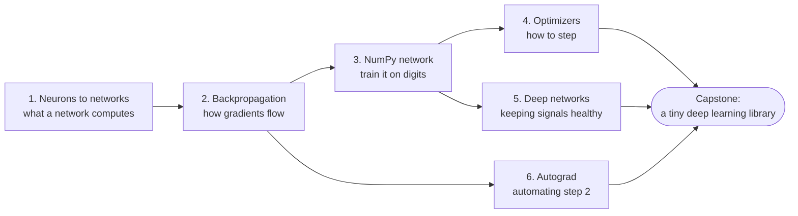

# Level 6: Neural Networks from Scratch

> **Level 6 · Overview** · ⏱️ ~4–6 weeks at about an hour a day · Prerequisites: [Level 1](../01-math-foundations/index.md) math (especially [calculus and gradients](../01-math-foundations/03-calculus-and-gradients.md)) and [Level 3](../03-ml-fundamentals/index.md) ([logistic regression](../03-ml-fundamentals/03-logistic-regression.md), [gradient descent in depth](../03-ml-fundamentals/07-gradient-descent-in-depth.md))

This level opens the 🚀 Expert tier. You build neural networks with nothing but NumPy, and you derive every gradient yourself. No framework does the work for you.

## What this level covers

A neural network is a stack of the logistic-regression units you already know, joined by nonlinear functions and trained with gradient descent. That sentence hides a lot. How do you get the gradient of a loss with respect to a weight buried ten layers deep? Why does a deep network sometimes refuse to learn at all? What does Adam actually do to each parameter? And how does `loss.backward()` in PyTorch know what to compute?

Level 6 answers each of those questions in code. You start from a single perceptron and its famous failure on XOR. You derive backpropagation in matrix form and check it with numerical gradients. You train a multilayer perceptron on handwritten digits. You implement every major optimizer and race them on the same problem. You learn why deep networks are hard to train and the tools that fix that: initialization, normalization, dropout, and residual connections. Finally, you build an automatic differentiation engine, first for scalars and then for tensors. That engine is a miniature version of what runs inside PyTorch.

Everything here is **NumPy only**, on purpose. Once you have written backward passes by hand, a framework stops being magic. You'll read PyTorch error messages and know what went wrong, and you'll debug training runs from first principles.

## What you'll be able to do

- Explain why a network needs nonlinear activations, and what the universal approximation theorem does and does not promise.
- Derive the forward and backward pass of a multilayer perceptron in matrix form, with the shape of every term.
- Derive the softmax plus cross-entropy gradient, and verify any backward pass with gradient checking.
- Implement a neural network with layer objects, mini-batches, and a training loop, and train it to high accuracy on handwritten digits.
- Diagnose a network that won't learn, from its symptoms.
- Implement SGD, momentum, Nesterov, AdaGrad, RMSProp, Adam, and AdamW, and choose a learning-rate schedule with warmup.
- Explain vanishing and exploding gradients, and fix them with Xavier and He initialization, batch and layer normalization, residual connections, and gradient clipping.
- Build a reverse-mode autograd engine for scalars and for tensors, and explain how PyTorch's autograd works underneath.

## Chapters

| # | Chapter | What it covers | Time |
|---|---|---|---|
| 1 | [From neurons to networks](01-from-neurons-to-networks.md) | The perceptron and XOR, multilayer perceptrons, activation functions, why nonlinearity matters, universal approximation, output layers and losses | ~3 h |
| 2 | [Forward and backpropagation](02-forward-and-backpropagation.md) | Computational graphs, the chain rule on graphs, backprop derived in matrix form, the softmax plus cross-entropy gradient, gradient checking | ~4 h |
| 3 | [A neural network in NumPy](03-neural-network-in-numpy.md) | Layer abstractions, a full mini-batch training loop, about 97% on handwritten digits, visualizing what it learned, debugging a network that won't learn | ~4 h |
| 4 | [Optimizers](04-optimizers.md) | SGD, momentum and Nesterov, AdaGrad, RMSProp, Adam and AdamW, learning-rate schedules and warmup, an empirical comparison | ~3.5 h |
| 5 | [Training deep networks](05-training-deep-networks.md) | Vanishing and exploding gradients, Xavier and He initialization, batch and layer normalization, dropout, weight decay, gradient clipping, residual connections, a debugging checklist | ~4 h |
| 6 | [Autograd from scratch](06-autograd-from-scratch.md) | Reverse-mode automatic differentiation, a scalar autograd engine with topological sort, a tensor engine with broadcasting-aware gradients, how PyTorch's autograd works | ~4 h |

Times include reading, running the code, and doing the exercises.

## How to study this level

- **Derive before you read the derivation.** Chapter 2 is the heart of the level. Try each gradient on paper first, then compare. Keep a sheet with the shape of every matrix.
- **Type the code, don't paste it.** Implementing backward passes is the skill. Copying them is not.
- **Gradient-check everything.** Any time you write a backward pass, check it against centered finite differences before you train. It takes a minute and saves hours.
- **Break things on purpose.** Remove a nonlinearity, multiply the initialization by 10, set the learning rate to 1. Watch what happens and write down the symptom. Chapter 3's debugging section and Chapter 5's checklist turn those symptoms into a diagnosis.
- **Keep the [neural network recipes cheat sheet](../../cheatsheets/neural-network-recipes.md) open** once you reach Chapter 4.
- **Don't rush Chapter 6.** The autograd engine ties the whole level together, and the capstone builds directly on it.

## Capstone

[**Build a tiny deep learning library with autograd, and train it to over 95% accuracy on digits.**](../../exercises/level-6-capstone.md) You'll write a tensor class with reverse-mode autograd, layers, a fused cross-entropy loss, and the SGD and Adam optimizers, and prove every gradient correct with finite-difference checks. Then you'll train a network with it and beat 95% test accuracy on scikit-learn's handwritten digits, using no framework at all.
