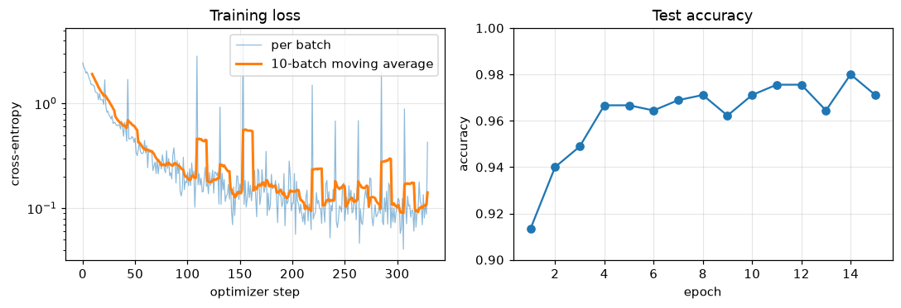

# PyTorch Fundamentals

> **Level 7 · Chapter 1** · ⏱️ ~70 min read · Prerequisites: [A neural network in NumPy](../06-neural-networks/03-neural-network-in-numpy.md), [Autograd from scratch](../06-neural-networks/06-autograd-from-scratch.md), [NumPy](../00-python-for-data/04-numpy.md)

In Level 6 you built tensors-with-gradients, layers, and optimizers yourself. PyTorch gives you industrial versions of all three. This chapter maps each piece you built onto its PyTorch counterpart: **tensors** (dtypes, devices, memory layout, views and copies, broadcasting), **autograd** (how `requires_grad` builds a backward graph, why gradients accumulate, and when to use `no_grad` and `detach`), **`nn.Module`** (how parameters are found and saved), and **`Dataset` and `DataLoader`** (how data reaches the model in batches). You'll also check, to eight decimal places, that PyTorch's gradients match the ones you derive by hand.

## Why it matters

Wei ported a working NumPy network to PyTorch over a weekend. The NumPy version reached 97% on handwritten digits. The PyTorch version started well: the loss fell for about thirty steps. Then it rose, oscillated wildly, and settled at chance accuracy. Wei lowered the learning rate, which only delayed the blow-up. Wei tried a different initialization, then a different optimizer, and lost two days.

The bug was one missing line: `optimizer.zero_grad()`. In Wei's NumPy code, each backward pass *assigned* fresh gradients to `layer.dW`. In PyTorch, `loss.backward()` *adds* new gradients to whatever is already stored in each parameter's `.grad`. Without zeroing, step 30 was using the sum of 30 steps' gradients: an effective learning rate thirty times too large, pointing in a stale direction.

PyTorch does this on purpose. Accumulating is what makes gradient accumulation over several small batches possible, and it's how a parameter used twice in one graph gets both contributions. But you only see why if you know how autograd works underneath. Every confusing PyTorch bug (a gradient that is `None`, a tensor that changed when you modified a different tensor, an "expected all tensors to be on the same device" error, a model that does worse at test time) traces back to one of the mechanisms in this chapter.

## Concepts

### What PyTorch adds to NumPy

A PyTorch **tensor** is an n-dimensional array, like a NumPy `ndarray`. Most of what you know carries over: shapes, dtypes, indexing, slicing, broadcasting, reductions along axes, and matrix multiplication with `@`. A tensor adds three things:

1. **A device.** A tensor lives in CPU memory or on an accelerator (an NVIDIA GPU via CUDA, or Apple silicon via MPS). Operations run where the data lives.
2. **Automatic differentiation.** A tensor can record the operations that produced it, so PyTorch can compute gradients through them. This is the engine you built in [Autograd from scratch](../06-neural-networks/06-autograd-from-scratch.md), generalized to tensors and written in C++.
3. **A deep learning library on top.** Layers, losses, optimizers, data loading, and serialization, all designed around the first two features.

PyTorch is **define-by-run** (also called eager execution): the graph of operations is recorded as your Python code runs, line by line. That means ordinary Python control flow (`if`, `for`, recursion) works inside models, and you can debug with `print` and a debugger. Each forward pass builds a new graph, and `backward()` frees it once it's used.

### Tensors: shape, dtype, and type promotion

You create tensors much as you create arrays: `torch.tensor(data)` copies from a Python list or array, and `torch.zeros`, `torch.ones`, `torch.arange`, `torch.linspace`, `torch.rand` (uniform on $[0, 1)$), and `torch.randn` (standard normal) create new ones.

The **dtype** is the element type. The defaults differ from NumPy in one important way: **PyTorch's default floating-point type is `float32`**, while NumPy's is `float64`. Neural networks rarely need more than 32 bits, and halving the memory doubles throughput. The dtypes you'll meet:

| dtype | Bits | Used for |
|---|---|---|
| `torch.float32` | 32 | Parameters, activations, almost everything (the default) |
| `torch.float64` | 64 | Numerical checks, such as gradient checking |
| `torch.float16` | 16 | Mixed-precision training on GPUs (narrow range: max about 65,504) |
| `torch.bfloat16` | 16 | Mixed precision on newer GPUs, TPUs, and CPUs (float32's range, less precision) |
| `torch.int64` (`long`) | 64 | Class labels and indices (what `cross_entropy` and `nn.Embedding` expect) |
| `torch.uint8` | 8 | Raw image pixels, 0 to 255 |
| `torch.bool` | 8 | Masks |

When an operation mixes dtypes, PyTorch applies **type promotion**: an integer tensor plus a float tensor gives a float tensor, and `float32` plus `float64` gives `float64`. One exception catches people: a Python scalar doesn't promote a tensor's floating type, so `float32_tensor * 2.5` stays `float32`. Convert explicitly with `.float()`, `.long()`, `.to(torch.float64)`, and so on.

Most shape operations have NumPy twins: `reshape`, `T` (2-D) and `transpose(i, j)`, `permute` (reorder all dimensions, NumPy's `transpose`), `unsqueeze(i)` (insert a dimension of size 1, like `np.expand_dims`), `squeeze`, `flatten`, `cat` (join along an existing dimension), and `stack` (join along a new one). PyTorch tends to say `dim` where NumPy says `axis`, but accepts both in most functions.

### Memory: storage, strides, views, and copies

A tensor is a *view* onto a block of memory called its **storage**. The tensor's **shape**, **stride**, and **offset** describe how to walk that memory. The stride says how many elements to skip to move one step along each dimension. For a contiguous $3 \times 4$ tensor, the stride is $(4, 1)$: move one row, skip 4 elements; move one column, skip 1. The element at index $(i, j)$ lives at

$$
\text{address}(i, j) = \text{offset} + i \cdot s_0 + j \cdot s_1,
$$

where $s_0, s_1$ are the strides. Many operations just change the shape, stride, or offset without touching the data. These return a **view**: a new tensor object sharing the same storage. Transposing swaps the strides to $(1, 4)$. Slicing `x[:, 1]` sets the offset to 1 and the stride to $(4,)$. Views are free, but **modifying a view modifies the original**, and vice versa.

| Operation | View or copy? |
|---|---|
| Basic slicing `x[1:, ::2]`, `x[:, 0]` | View |
| `view`, `transpose`, `T`, `permute`, `unsqueeze`, `squeeze`, `expand`, `narrow` | View |
| `reshape`, `flatten`, `contiguous` | View if possible, copy if the memory layout requires it |
| Advanced (fancy) indexing `x[[0, 2]]`, boolean masks `x[x > 0]` | Copy |
| Arithmetic `x + 1`, `x * y`, `torch.cat` | New tensor |
| `clone()` | Copy (and stays in the autograd graph) |

A tensor is **contiguous** when its elements sit in memory in row-major order with no gaps. A transpose is not contiguous. The method `view` requires a compatible layout and raises an error otherwise; `reshape` quietly copies when needed. Call `.contiguous()` to force a compact copy. The rule: use `reshape` unless you specifically want an error when a copy would be needed.

**In-place operations** end in an underscore: `x.add_(1)`, `x.zero_()`, `x.clamp_(0, 1)`, as do indexed assignments like `x[0] = 5`. They save memory but are risky in two ways. They change every tensor sharing that storage, and they can overwrite values autograd saved for the backward pass, which raises a "modified by an inplace operation" error. Avoid them in model code unless you know why you need one.

### Broadcasting

Broadcasting in PyTorch follows exactly NumPy's rules. Align the shapes from the right. Two dimensions are compatible if they're equal or one of them is 1. A size-1 dimension is stretched (virtually, without copying) to match the other, and missing leading dimensions are treated as 1. So a $(64, 10)$ batch of logits plus a $(10,)$ bias gives $(64, 10)$: the bias is added to every row.

The classic bug is a shape that broadcasts when you didn't intend it. If `pred` has shape $(n, 1)$ and `y` has shape $(n,)$, then `pred - y` has shape $(n, n)$: every prediction minus every target. The mean of that is a number, so nothing crashes, and the regression quietly learns garbage. Check shapes whenever you compute a loss by hand, and prefer the built-in losses, which warn about this mismatch.

### Devices and GPU basics

Every tensor has a `.device`. You move tensors with `.to(device)` (or `.cuda()` and `.cpu()`), and you move a whole model with `model.to(device)`, which moves all of its parameters and buffers. **All tensors in one operation must be on the same device**; PyTorch never moves data implicitly, because a transfer between CPU and GPU memory is slow relative to computation.

The standard device-agnostic pattern is:

<!-- skip-run -->
```python
device = "cuda" if torch.cuda.is_available() else "mps" if torch.backends.mps.is_available() else "cpu"
```

Then create or move the model and each batch to `device`. Code written this way runs unchanged on a laptop and on a GPU machine.

A few facts about GPUs explain most of the performance advice you'll hear:

- **GPUs are throughput machines.** A GPU runs thousands of simple arithmetic operations in parallel. Large matrix multiplications and convolutions get tens of times faster than on a CPU; tiny operations don't, because launching each one has a fixed overhead.
- **GPU calls are asynchronous.** Python queues work on the GPU and moves on. Anything that needs a value back on the CPU, such as `loss.item()`, `print(tensor)`, or `.cpu()`, forces Python to wait. Calling `.item()` every step is fine; calling it on every element in a loop is not. To time GPU code correctly, call `torch.cuda.synchronize()` first.
- **Transfers cost.** Copy each batch to the GPU once. `DataLoader(..., pin_memory=True)` with `.to(device, non_blocking=True)` lets the copy overlap with computation.
- **Memory is the binding constraint.** GPU memory holds the parameters, the gradients, the optimizer state, and every activation saved for the backward pass. Out-of-memory errors are usually fixed by a smaller batch, mixed precision (next chapter), or a smaller model.

Every example in this level runs on a CPU in minutes. If you want to see the speedup, open the same code in [Google Colab](https://colab.research.google.com/), choose *Runtime → Change runtime type → GPU*, and the device line above will pick up `cuda`.

### Autograd: recording the graph

You built a scalar autograd engine in Level 6: each `Value` stored its parents and a `_backward` closure, and `backward()` walked a topological sort in reverse, applying the chain rule. PyTorch's autograd works the same way at the level of tensors.

A tensor created with `requires_grad=True` is a **leaf** of the graph: a variable you want gradients for, typically a parameter. When an operation has at least one input that requires gradients, its output records a **`grad_fn`**: a node in the **backward graph** that knows how to send gradients back to that operation's inputs. Leaves have `grad_fn = None`; everything computed from them has one. When you call `loss.backward()`, PyTorch walks this graph from `loss` back to the leaves and stores $\partial\,\text{loss} / \partial\,\text{leaf}$ in each leaf's `.grad` attribute.

**The math: vector-Jacobian products.** Suppose an operation maps $\mathbf{x} \in \mathbb{R}^n$ to $\mathbf{y} = f(\mathbf{x}) \in \mathbb{R}^m$, and its **Jacobian** is the $m \times n$ matrix $J_{ij} = \partial y_i / \partial x_j$. During the backward pass, the node receives the **upstream gradient** $\bar{\mathbf{y}} = \partial \mathcal{L} / \partial \mathbf{y}$ (the gradient of the final scalar loss $\mathcal{L}$ with respect to its output). By the chain rule,

$$
\bar{x}_j = \frac{\partial \mathcal{L}}{\partial x_j} = \sum_{i=1}^{m} \frac{\partial \mathcal{L}}{\partial y_i}\frac{\partial y_i}{\partial x_j}, \qquad \text{that is,} \qquad \bar{\mathbf{x}} = J^\top \bar{\mathbf{y}}.
$$

Each `grad_fn` computes this **vector-Jacobian product** without ever forming $J$. For an elementwise ReLU, $J$ is diagonal, so $\bar{\mathbf{x}} = \bar{\mathbf{y}} \odot \mathbb{1}[\mathbf{x} > 0]$ (where $\odot$ is elementwise multiplication). For a matrix product $Z = XW$, the vector-Jacobian products are $\bar{X} = \bar{Z}W^\top$ and $\bar{W} = X^\top\bar{Z}$, exactly the formulas you derived in [Forward and backpropagation](../06-neural-networks/02-forward-and-backpropagation.md). Reverse mode starts from the scalar loss, where $\bar{\mathcal{L}} = 1$.

That's why `backward()` with no arguments works only on a scalar. For a non-scalar output, you must supply $\bar{\mathbf{y}}$ yourself as `y.backward(gradient=v)`, which computes $J^\top\mathbf{v}$.

**To save memory, PyTorch frees the graph after `backward()`.** The intermediate values each node saved (the inputs to a multiplication, the mask of a ReLU) are released. Calling `backward()` a second time on the same graph raises an error, unless the first call passed `retain_graph=True`. You rarely need that; normally each training step runs a new forward pass, which builds a new graph.

### Gradient accumulation

In Level 6, your engine's `backward` used `+=` to update each node's gradient. That was necessary: if a value feeds two operations, its gradient is the sum of the gradients through both paths (the multivariable chain rule). PyTorch does the same, and it doesn't reset `.grad` between calls to `backward()`. So if you call `backward()` twice, the leaf's `.grad` holds the sum of both gradients:

$$
\texttt{w.grad} \leftarrow \texttt{w.grad} + \frac{\partial \mathcal{L}_{\text{new}}}{\partial w}.
$$

This is why every training step starts with `optimizer.zero_grad()` (or `model.zero_grad()`). Modern PyTorch sets the gradients to `None` rather than to zero tensors, which saves a memory write; the next `backward()` then creates fresh ones.

Accumulation is also a feature. If a batch of 256 doesn't fit in memory, you can run four batches of 64, call `backward()` on each loss divided by 4, and step the optimizer once. The summed gradient equals the gradient of the mean loss over all 256 examples. You'll use this in later levels to simulate large batches.

### Turning autograd off: `no_grad`, `inference_mode`, and `detach`

Recording a graph costs memory and time. There are three ways to stop it:

- **`with torch.no_grad():`** Inside the block, no operation records a graph, even when its inputs require gradients. Use it for evaluation, and for updating parameters manually (an update like `w -= lr * w.grad` must not itself become part of the graph).
- **`with torch.inference_mode():`** A stricter, slightly faster version of `no_grad` for pure inference. Tensors created inside can never be used in autograd later.
- **`t.detach()`** Returns a view of `t` that shares its data but is cut out of the graph: it has `requires_grad=False` and no `grad_fn`. Gradients don't flow back through it. Use it when you want a value without its history: to log a loss, to convert to NumPy, or to treat something as a constant target (as in some reinforcement learning and self-supervised methods you'll meet in Level 8).

A related attribute: `requires_grad_(False)` on a parameter **freezes** it, so autograd computes no gradient for it. That's the core move in [transfer learning](06-transfer-learning.md).

### `nn.Module`: the building block of models

In Level 6 you wrote a `Layer` class with `forward`, `backward`, and a list of parameters. PyTorch's **`nn.Module`** plays the same role, minus the `backward`, which autograd handles. You subclass it, create layers in `__init__`, and describe the computation in `forward`:

<!-- skip-run -->
```python
class MLP(nn.Module):
    def __init__(self, d_in, d_hidden, d_out):
        super().__init__()
        self.fc1 = nn.Linear(d_in, d_hidden)
        self.fc2 = nn.Linear(d_hidden, d_out)

    def forward(self, x):
        return self.fc2(torch.relu(self.fc1(x)))
```

Underneath, a few mechanisms do the work:

- **Registration.** When you assign an `nn.Module` or an `nn.Parameter` as an attribute, `nn.Module.__setattr__` records it. That's how `model.parameters()` finds every weight, however deeply nested, and how `model.to(device)` moves them all. A plain Python list of layers is *not* registered; use `nn.ModuleList` or `nn.Sequential`.
- **`nn.Parameter`** is a tensor subclass with `requires_grad=True` that a module registers as a learnable parameter.
- **Buffers** are tensors that belong to the module's state but aren't learned, such as batch norm's running mean and variance. You register them with `self.register_buffer(name, tensor)`. They move with `.to(device)` and are saved in the state dict.
- **Calling the module.** You call `model(x)`, never `model.forward(x)` directly. `__call__` runs `forward` plus any registered hooks, which some tools rely on.
- **`state_dict()`** returns an ordered dictionary from names like `"fc1.weight"` to tensors, covering all parameters and buffers. Saving and loading models means saving and loading this dictionary (next chapter).
- **Modes.** `model.train()` and `model.eval()` set a `training` flag on every submodule. Dropout and batch norm behave differently in the two modes. This has nothing to do with gradients; that's what `no_grad` is for.

`nn.Linear(d_in, d_out)` stores its weight as shape `(d_out, d_in)` and computes $\mathbf{y} = \mathbf{x}W^\top + \mathbf{b}$. That transposed layout surprises people who learned $XW$ with $W$ of shape $(d_{\text{in}}, d_{\text{out}})$, as in Level 6. It also initializes weights from a uniform distribution scaled by $1/\sqrt{d_{\text{in}}}$ (Kaiming-uniform with a particular gain), a sensible default in the spirit of the initializations you derived in [Training deep networks](../06-neural-networks/05-training-deep-networks.md). For simple stacks, `nn.Sequential(nn.Linear(64, 32), nn.ReLU(), nn.Linear(32, 10))` saves writing a class.

**The functional API**, `torch.nn.functional` (imported as `F`), provides stateless versions of the same operations: `F.relu`, `F.cross_entropy`, `F.conv2d`, `F.dropout`. Use modules for anything with parameters or state, and functions for stateless operations inside `forward`, as you prefer.

### Losses and optimizers, briefly

The losses in `nn` and `F` are the ones you implemented. The one to know now is `F.cross_entropy(logits, targets)`. It takes raw **logits** (unnormalized scores, shape $(n, C)$ for $C$ classes) and integer class labels (shape $(n,)$, dtype `int64`), and computes the log-softmax and the negative log-likelihood in one numerically stable step:

$$
\mathcal{L} = -\frac{1}{n}\sum_{i=1}^{n} \log \frac{e^{z_{i, y_i}}}{\sum_{c=1}^{C} e^{z_{i,c}}},
$$

where $z_{i,c}$ is the logit of example $i$ for class $c$ and $y_i$ is its true class. **Don't apply softmax before it**; it applies its own. Its gradient with respect to the logits is $(\text{softmax}(\mathbf{z}_i) - \mathbf{e}_{y_i}) / n$, where $\mathbf{e}_{y_i}$ is the one-hot vector, the result you derived in Level 6.

An optimizer from `torch.optim` holds a reference to the parameters and implements the update rule: `torch.optim.SGD(model.parameters(), lr=0.1, momentum=0.9)` or `torch.optim.AdamW(model.parameters(), lr=1e-3, weight_decay=0.01)`. Its `step()` reads each parameter's `.grad` and updates the parameter in place, under `no_grad`, exactly like the optimizer classes you wrote. Its `zero_grad()` clears the gradients. The next chapter builds the full training loop around these calls.

### `Dataset` and `DataLoader`

PyTorch separates *what* the data is from *how* it's served.

A **`Dataset`** (map-style) is any object with `__len__` and `__getitem__(i)`, returning one example, usually an `(input, label)` pair. `TensorDataset(X, y)` wraps tensors you already have in memory. For images on disk, `__getitem__` reads and decodes file `i` and applies any transforms. Datasets are lazy: nothing is loaded until it's asked for.

A **`DataLoader`** wraps a dataset and produces batches. It:

- draws indices, in order or shuffled (`shuffle=True` reshuffles at the start of every epoch);
- fetches each example with `dataset[i]`;
- combines examples into a batch with a **collate function** (the default stacks tensors along a new first dimension, so 64 examples of shape $(1, 28, 28)$ become one tensor of shape $(64, 1, 28, 28)$);
- optionally loads in parallel worker processes (`num_workers > 0`) and pins memory for fast GPU transfer.

Other options you'll use: `batch_size`, `drop_last=True` (discard a final incomplete batch, useful when batch norm sees a batch of 1), and `generator=torch.Generator().manual_seed(0)` to make shuffling reproducible. The default `num_workers=0` loads in the main process. That's simplest and fine for in-memory data like this level's; for decoding images from disk, a few workers keep a GPU fed.

### Moving between NumPy and PyTorch

There are two kinds of conversion, and the difference matters:

| Call | Shares memory? | Notes |
|---|---|---|
| `torch.from_numpy(a)` | Yes | Keeps NumPy's dtype, so `float64` arrays become `float64` tensors |
| `torch.as_tensor(a)` | Yes, when possible | Copies if you request another dtype or device |
| `torch.tensor(a)` | No, always copies | Safe, costs a copy |
| `t.numpy()` | Yes | CPU tensors without gradients only |
| `t.detach().cpu().numpy()` | Shares if already on the CPU | The universal recipe |

Shared memory means a change to the array shows up in the tensor. That's efficient, and occasionally surprising. Two pitfalls come up constantly. First, `torch.from_numpy` on data you prepared with NumPy or pandas gives `float64`, and a `float32` model then fails with a dtype mismatch: add `.float()`. Second, `.numpy()` refuses tensors that require gradients (convert with `.detach()` first) and tensors on a GPU (move with `.cpu()` first).

## In practice

### Tensors, dtypes, and memory

Start with dtypes, promotion, and the view-versus-copy rules. Watch which tensors change when you modify another one.

```python
import numpy as np
import torch

torch.set_num_threads(4)
torch.manual_seed(0)

a = torch.tensor([1, 2, 3])
b = torch.tensor([0.5, 1.5, 2.5])
print(a.dtype, b.dtype, (a + b).dtype, (b * 2.5).dtype)
print(torch.zeros(2).dtype, np.zeros(2).dtype)
print((b.double() + b).dtype, (a / 2).dtype, (a // 2).dtype)

x = torch.arange(12).reshape(3, 4)
print("shape", tuple(x.shape), "stride", x.stride(), "contiguous", x.is_contiguous())
xt = x.T
print("x.T stride", xt.stride(), "contiguous", xt.is_contiguous(),
      "same storage", xt.untyped_storage().data_ptr() == x.untyped_storage().data_ptr())

col = x[:, 1]          # basic slice: a view
col[0] = 100           # writes into x
fancy = x[[0, 2]]      # fancy indexing: a copy
fancy[0, 0] = -1       # does not touch x
print(x)
```

```text
torch.int64 torch.float32 torch.float32 torch.float32
torch.float32 float64
torch.float64 torch.float32 torch.int64
shape (3, 4) stride (4, 1) contiguous True
x.T stride (1, 4) contiguous False same storage True
tensor([[  0, 100,   2,   3],
        [  4,   5,   6,   7],
        [  8,   9,  10,  11]])
```

The integer tensor `a` promoted to `float32` when added to `b`, and true division `/` always gives a float. The transpose is the same memory with swapped strides, which is why it's not contiguous. Now see what that means for `view` and `reshape`:

```python
try:
    xt.view(12)
except RuntimeError as e:
    print("view failed:", str(e)[:70], "...")
r = xt.reshape(12)                                   # silently copies
print("reshape shares memory:", r.untyped_storage().data_ptr() == x.untyped_storage().data_ptr())
print("contiguous copy stride:", xt.contiguous().stride())
```

```text
view failed: view size is not compatible with input tensor's size and stride (at le ...
reshape shares memory: False
contiguous copy stride: (3, 1)
```

### Broadcasting, and the $(n, 1)$ versus $(n,)$ trap

```python
logits = torch.randn(4, 3)
bias = torch.tensor([10.0, 20.0, 30.0])
print((logits + bias).shape)                         # (4, 3) + (3,) -> (4, 3)

pred = torch.randn(5, 1)                             # model output with a trailing 1
y = torch.randn(5)                                   # targets without it
print("pred - y has shape", tuple((pred - y).shape))  # (5, 5): every pred minus every target!
print("silently wrong MSE:", ((pred - y) ** 2).mean().item())
print("correct MSE:       ", ((pred.squeeze(1) - y) ** 2).mean().item())
```

```text
torch.Size([4, 3])
pred - y has shape (5, 5)
silently wrong MSE: 1.7594152688980103
correct MSE:        1.9655520915985107
```

!!! warning "Common mistake: a loss that broadcasts"
    A regression model's output usually has shape $(n, 1)$, and targets loaded from a DataFrame column have shape $(n,)$. Subtracting them gives an $(n, n)$ matrix and a loss that is a perfectly ordinary-looking number, so nothing crashes. `nn.MSELoss` warns about mismatched shapes; hand-written losses don't. Assert shapes before computing a loss.

### Devices

```python
device = "cuda" if torch.cuda.is_available() else "mps" if torch.backends.mps.is_available() else "cpu"
print("using", device)
t = torch.ones(2, 2, device=device)
print(t.device, t.to("cpu").device)
try:
    torch.ones(2, device="meta") + torch.ones(2)    # "meta" is a shape-only device, handy for demos
except RuntimeError as e:
    print("RuntimeError:", str(e).splitlines()[0][:80])
```

```text
using cpu
cpu cpu
RuntimeError: Tensor on device cpu is not on the expected device meta!
```

On a GPU machine, the first line says `cuda` and the mismatch error says `cuda:0` and `cpu`. The fix is always to move both operands to the same device, usually by moving the batch to the model's device.

### Autograd: the graph, step by step

Here is a tiny graph, $\mathcal{L} = \sum_i (w x_i + b - y_i)^2$, with its `grad_fn` nodes:

```python
w = torch.tensor(2.0, requires_grad=True)
b = torch.tensor(0.5, requires_grad=True)
xs = torch.tensor([1.0, 2.0, 3.0])
ys = torch.tensor([3.0, 5.0, 7.0])

pred = w * xs + b
loss = ((pred - ys) ** 2).sum()
print("leaf:", w.is_leaf, w.grad_fn, "| pred.grad_fn:", type(pred.grad_fn).__name__,
      "| loss.grad_fn:", type(loss.grad_fn).__name__)
print("loss's inputs:", [type(f[0]).__name__ for f in loss.grad_fn.next_functions])

loss.backward()
# by hand: dL/dw = sum 2 (w x + b - y) x, dL/db = sum 2 (w x + b - y)
r = (w * xs + b - ys).detach()
print("autograd:", w.grad.item(), b.grad.item(), "| by hand:", (2 * r * xs).sum().item(), (2 * r).sum().item())
```

```text
leaf: True None | pred.grad_fn: AddBackward0 | loss.grad_fn: SumBackward0
loss's inputs: ['PowBackward0']
autograd: -6.0 -3.0 | by hand: -6.0 -3.0
```

Following `next_functions` from `loss` walks the backward graph: `SumBackward0` → `PowBackward0` → `SubBackward0` → `AddBackward0` → `MulBackward0` → the leaf `w` (an `AccumulateGrad` node, which adds into `w.grad`). It's the same structure as your Level 6 engine's graph of `Value` nodes.

### Gradients accumulate

Run the same backward pass again without zeroing, and the gradient doubles. Calling `backward()` on the old graph fails, because the graph was freed:

```python
try:
    loss.backward()
except RuntimeError as e:
    print("second backward on the same graph:", str(e)[:60], "...")

loss = (((w * xs + b) - ys) ** 2).sum()      # a new forward pass builds a new graph
loss.backward()
print("w.grad after two backward passes:", w.grad.item())   # -6 + -6

w.grad = None; b.grad = None                 # what optimizer.zero_grad() does
loss = (((w * xs + b) - ys) ** 2).sum()
loss.backward()
print("w.grad after zeroing:", w.grad.item())
```

```text
second backward on the same graph: Trying to backward through the graph a second time (or direc ...
w.grad after two backward passes: -12.0
w.grad after zeroing: -6.0
```

That doubled gradient is Wei's bug from the opening story. Now the useful side of accumulation: splitting a batch into micro-batches, scaling each loss, and summing gradients gives exactly the full-batch gradient.

```python
torch.manual_seed(0)
Xa = torch.randn(256, 5)
Ya = torch.randn(256)
Wa = torch.randn(5, requires_grad=True)

full = ((Xa @ Wa - Ya) ** 2).mean()
g_full = torch.autograd.grad(full, Wa)[0]        # returns the gradient without touching W.grad

Wa.grad = None
for chunk in range(4):                          # 4 micro-batches of 64
    xb, yb = Xa[chunk * 64:(chunk + 1) * 64], Ya[chunk * 64:(chunk + 1) * 64]
    (((xb @ Wa - yb) ** 2).mean() / 4).backward()
print("max difference:", (Wa.grad - g_full).abs().max().item())
```

```text
max difference: 5.960464477539062e-07
```

The difference is float32 rounding. Dividing each micro-batch loss by the number of micro-batches is the step people forget; without it, the gradient is four times too large.

### `no_grad` and `detach`

```python
w = torch.tensor(2.0, requires_grad=True)
with torch.no_grad():
    y1 = w * 3
y2 = (w * 3).detach()
y3 = w * 3
print("no_grad:", y1.requires_grad, y1.grad_fn, "| detach:", y2.requires_grad,
      "| normal:", y3.requires_grad, type(y3.grad_fn).__name__)

# A manual SGD step must not be recorded in the graph:
loss = (w - 5) ** 2
loss.backward()
with torch.no_grad():
    w -= 0.1 * w.grad
print("after one step, w =", w.item(), "| still a leaf:", w.is_leaf)

# detach() shares memory with the original
d = w.detach()
d += 1
print("w after modifying its detached view:", w.item())
```

```text
no_grad: False None | detach: False | normal: True MulBackward0
after one step, w = 2.5999999046325684 | still a leaf: True
w after modifying its detached view: 3.5999999046325684
```

`detach()` cuts the graph, not the memory. If you need an independent copy, use `t.detach().clone()`.

### A hand-derived gradient versus autograd

This is the check that ties Level 6 to PyTorch. Take a two-layer network with a ReLU hidden layer and softmax cross-entropy, using the notation from Level 6: inputs $X \in \mathbb{R}^{n \times d}$, one-hot targets $Y \in \mathbb{R}^{n \times C}$, and

$$
A = XW_1 + \mathbf{b}_1, \quad H = \max(0, A), \quad Z = HW_2 + \mathbf{b}_2, \quad \mathcal{L} = -\frac{1}{n}\sum_{i=1}^{n}\sum_{c=1}^{C} Y_{ic}\log \operatorname{softmax}(Z_i)_c.
$$

Backpropagation gives, in order,

$$
\begin{aligned}
\bar{Z} &= \tfrac{1}{n}\left(\operatorname{softmax}(Z) - Y\right), & \bar{W}_2 &= H^\top\bar{Z}, & \bar{\mathbf{b}}_2 &= \textstyle\sum_i \bar{Z}_i, \\
\bar{H} &= \bar{Z}W_2^\top, & \bar{A} &= \bar{H} \odot \mathbb{1}[A > 0], & \bar{W}_1 &= X^\top\bar{A}, \quad \bar{\mathbf{b}}_1 = \textstyle\sum_i \bar{A}_i.
\end{aligned}
$$

Code both and compare, in `float64` so that rounding doesn't hide a real mismatch:

```python
import torch.nn.functional as F

torch.manual_seed(0)
n, d, h, C = 32, 10, 16, 4
X = torch.randn(n, d, dtype=torch.float64)
y = torch.randint(0, C, (n,))
W1 = (torch.randn(d, h, dtype=torch.float64) * 0.3).requires_grad_()
b1 = torch.zeros(h, dtype=torch.float64, requires_grad=True)
W2 = (torch.randn(h, C, dtype=torch.float64) * 0.3).requires_grad_()
b2 = torch.zeros(C, dtype=torch.float64, requires_grad=True)

# Autograd
A = X @ W1 + b1
H = A.clamp(min=0)
Z = H @ W2 + b2
loss = F.cross_entropy(Z, y)
loss.backward()

# By hand, from the equations above
with torch.no_grad():
    Y = F.one_hot(y, C).double()
    dZ = (torch.softmax(Z, dim=1) - Y) / n
    dW2, db2 = H.T @ dZ, dZ.sum(0)
    dA = (dZ @ W2.T) * (A > 0)
    dW1, db1 = X.T @ dA, dA.sum(0)

for name, mine, auto in [("W1", dW1, W1.grad), ("b1", db1, b1.grad), ("W2", dW2, W2.grad), ("b2", db2, b2.grad)]:
    print(f"{name}: max |hand - autograd| = {(mine - auto).abs().max().item():.2e}")

# PyTorch's own finite-difference checker agrees too
print("gradcheck:", torch.autograd.gradcheck(lambda W: F.cross_entropy((X @ W + b1).clamp(min=0) @ W2 + b2, y),
                                             (W1.detach().clone().requires_grad_(),)))
```

```text
W1: max |hand - autograd| = 2.08e-17
b1: max |hand - autograd| = 1.39e-17
W2: max |hand - autograd| = 1.39e-17
b2: max |hand - autograd| = 2.78e-17
gradcheck: True
```

The hand-derived gradients agree with autograd to about $10^{-17}$, the limit of float64 precision. Autograd isn't magic: it's the chain rule you already know, applied mechanically. `torch.autograd.gradcheck` compares autograd's gradients against centered finite differences, the gradient check from Level 6, and is the tool to reach for when you write a custom operation.

### `nn.Module`: parameters, buffers, and state

```python
import torch.nn as nn

class MLP(nn.Module):
    def __init__(self, d_in, d_hidden, d_out, p_drop=0.2):
        super().__init__()
        self.fc1 = nn.Linear(d_in, d_hidden)
        self.bn = nn.BatchNorm1d(d_hidden)
        self.drop = nn.Dropout(p_drop)
        self.fc2 = nn.Linear(d_hidden, d_out)

    def forward(self, x):
        return self.fc2(self.drop(torch.relu(self.bn(self.fc1(x)))))

torch.manual_seed(0)
model = MLP(64, 32, 10)
for name, p in model.named_parameters():
    print(f"{name:12s} {str(tuple(p.shape)):10s} requires_grad={p.requires_grad}")
print("buffers:", [name for name, _ in model.named_buffers()])
print("state_dict keys:", len(model.state_dict()), "| trainable parameters:",
      sum(p.numel() for p in model.parameters()))
print("fc1.weight is", tuple(model.fc1.weight.shape), "-> y = x @ W.T + b")
```

```text
fc1.weight   (32, 64)   requires_grad=True
fc1.bias     (32,)      requires_grad=True
bn.weight    (32,)      requires_grad=True
bn.bias      (32,)      requires_grad=True
fc2.weight   (10, 32)   requires_grad=True
fc2.bias     (10,)      requires_grad=True
buffers: ['bn.running_mean', 'bn.running_var', 'bn.num_batches_tracked']
state_dict keys: 9 | trainable parameters: 2474
fc1.weight is (32, 64) -> y = x @ W.T + b
```

The count is $64 \cdot 32 + 32$ for `fc1`, $32 + 32$ for batch norm's scale and shift, and $32 \cdot 10 + 10$ for `fc2`: 2,474. The state dict has 9 entries: 6 parameters and 3 buffers. Now see the `training` flag change the output, and see why a plain list hides parameters:

```python
x = torch.randn(8, 64)
model.train()
out1, out2 = model(x), model(x)
print("train mode, same input twice -> equal?", torch.allclose(out1, out2))   # dropout is random
model.eval()
with torch.no_grad():
    print("eval mode,  same input twice -> equal?", torch.allclose(model(x), model(x)))

class Broken(nn.Module):
    def __init__(self):
        super().__init__()
        self.layers = [nn.Linear(4, 4), nn.Linear(4, 4)]         # plain list: NOT registered

class Fixed(nn.Module):
    def __init__(self):
        super().__init__()
        self.layers = nn.ModuleList([nn.Linear(4, 4), nn.Linear(4, 4)])

print("Broken has", len(list(Broken().parameters())), "parameter tensors; Fixed has", len(list(Fixed().parameters())))
```

```text
train mode, same input twice -> equal? False
eval mode,  same input twice -> equal? True
Broken has 0 parameter tensors; Fixed has 4
```

!!! warning "Common mistake: layers in a plain list"
    `Broken`'s optimizer would receive zero parameters, so training would change nothing, and `model.to("cuda")` would leave the layers on the CPU. Use `nn.ModuleList` (or `nn.ModuleDict`, or `nn.Sequential`) for any collection of submodules.

### `Dataset`, `DataLoader`, and NumPy interop

The digits dataset from scikit-learn ($8 \times 8$ images, 1,797 of them) arrives as NumPy `float64` arrays. Here is a custom `Dataset` around it, and the NumPy-sharing behavior to watch for:

```python
from sklearn.datasets import load_digits
from sklearn.model_selection import train_test_split
from torch.utils.data import DataLoader, Dataset, TensorDataset

digits = load_digits()
X_np, y_np = digits.data, digits.target
print(X_np.dtype, X_np.shape, y_np.dtype)

shared = torch.from_numpy(X_np)          # shares memory, stays float64
copied = torch.tensor(X_np)              # copies
X_np[0, 0] = 99.0
print("from_numpy sees the change:", shared[0, 0].item(), "| tensor() copy:", copied[0, 0].item())
X_np[0, 0] = 0.0                         # undo

class DigitsDataset(Dataset):
    def __init__(self, X, y):
        self.X = torch.as_tensor(X, dtype=torch.float32) / 16.0   # pixels are 0..16
        self.y = torch.as_tensor(y, dtype=torch.long)

    def __len__(self):
        return len(self.y)

    def __getitem__(self, i):
        return self.X[i], self.y[i]

X_tr, X_te, y_tr, y_te = train_test_split(X_np, y_np, test_size=0.25, random_state=0, stratify=y_np)
train_ds, test_ds = DigitsDataset(X_tr, y_tr), DigitsDataset(X_te, y_te)
train_dl = DataLoader(train_ds, batch_size=64, shuffle=True, generator=torch.Generator().manual_seed(0))
test_dl = DataLoader(test_ds, batch_size=256)

xb, yb = next(iter(train_dl))
print("one example:", train_ds[0][0].shape, train_ds[0][1].dtype, "| one batch:", tuple(xb.shape), tuple(yb.shape))
print("batches per epoch:", len(train_dl), "| last batch size:", len(train_ds) % 64)
```

```text
float64 (1797, 64) int64
from_numpy sees the change: 99.0 | tensor() copy: 0.0
one example: torch.Size([64]) torch.int64 | one batch: (64, 64) (64,)
batches per epoch: 22 | last batch size: 3
```

The `DataLoader` turned 64 examples of shape $(64,)$ into one tensor of shape $(64, 64)$ with the default collate function. (`TensorDataset(X, y)` would do the same job as `DigitsDataset` in one line; the class shows what any dataset must provide.)

### Putting it together: training the MLP

Here is everything in one loop, a preview of the next chapter. It trains the `MLP` from above on digits with AdamW and records the loss of each batch.

```python
torch.manual_seed(0)
model = MLP(64, 64, 10)
opt = torch.optim.AdamW(model.parameters(), lr=3e-3)

def accuracy(model, loader):
    model.eval()
    correct = 0
    with torch.no_grad():
        for xb, yb in loader:
            correct += (model(xb).argmax(1) == yb).sum().item()
    return correct / len(loader.dataset)

batch_losses, test_accs = [], []
for epoch in range(15):
    model.train()
    for xb, yb in train_dl:
        loss = F.cross_entropy(model(xb), yb)
        opt.zero_grad()
        loss.backward()
        opt.step()
        batch_losses.append(loss.item())
    test_accs.append(accuracy(model, test_dl))
print(f"mean loss over the last epoch {np.mean(batch_losses[-len(train_dl):]):.4f}; test accuracy by epoch:",
      " ".join(f"{a:.3f}" for a in test_accs[::2]))
```

```text
mean loss over the last epoch 0.1163; test accuracy by epoch: 0.913 0.949 0.967 0.969 0.962 0.976 0.964 0.971
```

```python
import matplotlib.pyplot as plt

fig, axes = plt.subplots(1, 2, figsize=(10, 3.5))
axes[0].plot(batch_losses, lw=0.8, alpha=0.5, label="per batch")
smooth = np.convolve(batch_losses, np.ones(10) / 10, mode="valid")
axes[0].plot(np.arange(9, len(batch_losses)), smooth, lw=2, label="10-batch moving average")
axes[0].set(xlabel="optimizer step", ylabel="cross-entropy", yscale="log", title="Training loss")
axes[0].legend()
axes[1].plot(range(1, 16), test_accs, "o-")
axes[1].set(xlabel="epoch", ylabel="accuracy", title="Test accuracy", ylim=(0.9, 1.0))
for ax in axes:
    ax.grid(alpha=0.3)
plt.tight_layout()
plt.show()
```


*The MLP on digits. Each batch's loss is noisy, because each batch is a different sample; the moving average shows the trend.*

Compare this with your Level 6 NumPy network. The model definition is shorter, there's no backward code, and the optimizer is one line. Every concept underneath is one you've built yourself. (A test set used for every epoch's report is fine for a demo, but it isn't an honest final estimate; the next chapter adds a proper validation split.)

!!! warning "Common mistake: `.numpy()` on a tensor that needs gradients"
    `model(x).numpy()` raises "Can't call numpy() on Tensor that requires grad". Use `model(x).detach().cpu().numpy()`, or compute the predictions inside `torch.no_grad()`. Don't "fix" it by setting `requires_grad=False` on the parameters.

## Exercises

### Exercise 1: Views and copies (easy)

Predict, without running it, what this prints. Then run it and explain each line.

```python
x = torch.zeros(2, 3)
a = x[0]
b = x[:, [0, 2]]
c = x.reshape(3, 2)
a += 1
b += 10
c[2, 1] = 5
print(x)
```

??? success "Solution"

    ```python
    x = torch.zeros(2, 3)
    a = x[0]
    b = x[:, [0, 2]]
    c = x.reshape(3, 2)
    a += 1
    b += 10
    c[2, 1] = 5
    print(x)
    ```

    ```text
    tensor([[1., 1., 1.],
            [0., 0., 5.]])
    ```

    `a = x[0]` is a basic slice, so a view: `a += 1` is in place and sets the first row to 1. `b` uses a list index (fancy indexing), so it's a copy, and adding 10 to it leaves `x` alone. `x` is contiguous, so `reshape` returns a view; element `[2, 1]` of the $3 \times 2$ view is flat position $2 \cdot 2 + 1 = 5$, which is `x[1, 2]`.

### Exercise 2: The gradient of a softmax by hand (medium)

For a single example with logits $\mathbf{z} \in \mathbb{R}^C$ and true class $y$, the loss is $\mathcal{L} = -\log \operatorname{softmax}(\mathbf{z})_y$. Derive $\partial\mathcal{L}/\partial z_c$. Then verify your formula against `F.cross_entropy` and autograd for $C = 5$ random logits.

??? success "Solution"

    Write $p_c = e^{z_c} / \sum_k e^{z_k}$. Then $\mathcal{L} = -z_y + \log\sum_k e^{z_k}$. Differentiating, $\partial\mathcal{L}/\partial z_c = -\mathbb{1}[c = y] + e^{z_c}/\sum_k e^{z_k} = p_c - \mathbb{1}[c = y]$. In vector form, $\nabla_{\mathbf{z}}\mathcal{L} = \mathbf{p} - \mathbf{e}_y$.

    ```python
    torch.manual_seed(1)
    z = torch.randn(5, dtype=torch.float64, requires_grad=True)
    target = 3
    F.cross_entropy(z.unsqueeze(0), torch.tensor([target])).backward()
    by_hand = torch.softmax(z.detach(), 0) - F.one_hot(torch.tensor(target), 5)
    print(z.grad)
    print((z.grad - by_hand).abs().max().item())
    ```

    ```text
    tensor([ 0.2847,  0.1919,  0.1563, -0.7265,  0.0935], dtype=torch.float64)
    2.7755575615628914e-17
    ```

    The gradient entries sum to zero, as they must: $\sum_c p_c - 1 = 0$. Increasing all logits by the same amount doesn't change the softmax.

### Exercise 3: Gradient accumulation without scaling (medium)

In the micro-batch example above, remove the division by 4. By what factor is the accumulated gradient off? If you trained with AdamW instead of SGD, would the missing division matter as much? Reason first, then test the first part.

??? success "Solution"

    Each micro-batch mean loss has a gradient that is, on average, the size of the full-batch gradient, so summing four of them gives four times the full-batch gradient.

    ```python
    Wa.grad = None
    for chunk in range(4):
        xb, yb = Xa[chunk * 64:(chunk + 1) * 64], Ya[chunk * 64:(chunk + 1) * 64]
        ((xb @ Wa - yb) ** 2).mean().backward()
    print((Wa.grad / g_full).mean().item())
    ```

    ```text
    3.999999523162842
    ```

    With SGD, the step is $\eta\,\mathbf{g}$, so the effective learning rate is four times too big. Adam divides the first-moment estimate by the square root of the second-moment estimate, so a constant scale on every gradient cancels almost exactly (except for the small $\epsilon$ in the denominator). The bug is mostly harmless with Adam and serious with SGD. Write the scaling anyway: correct code shouldn't depend on which optimizer happens to forgive it.

### Exercise 4: A custom `Dataset` with a transform (medium)

Write a `NoisyDigits` dataset that returns each digit image as a $(1, 8, 8)$ float tensor in $[0, 1]$ with Gaussian noise of standard deviation `sigma` added, freshly sampled on every access. Check that the same index returns different tensors on two accesses, and that a `DataLoader` with `batch_size=32` yields batches of shape $(32, 1, 8, 8)$.

??? success "Solution"

    ```python
    class NoisyDigits(Dataset):
        def __init__(self, X, y, sigma=0.1):
            self.X = torch.as_tensor(X, dtype=torch.float32).reshape(-1, 1, 8, 8) / 16.0
            self.y = torch.as_tensor(y, dtype=torch.long)
            self.sigma = sigma

        def __len__(self):
            return len(self.y)

        def __getitem__(self, i):
            x = self.X[i] + self.sigma * torch.randn_like(self.X[i])
            return x.clamp(0, 1), self.y[i]

    torch.manual_seed(0)
    nd = NoisyDigits(X_tr, y_tr)
    print(torch.equal(nd[0][0], nd[0][0]))
    xb, yb = next(iter(DataLoader(nd, batch_size=32, shuffle=True)))
    print(tuple(xb.shape), tuple(yb.shape))
    ```

    ```text
    False
    (32, 1, 8, 8) (32,)
    ```

    The noise is drawn in `__getitem__`, so every epoch sees a new version of each image. This is exactly how data augmentation works in the [CNN chapter](03-convolutional-networks.md).

### Exercise 5: Where did my gradient go? (hard)

Each snippet below leaves `w.grad` as `None` or wrong. Explain why, and fix it.

1. `w = torch.randn(3, requires_grad=True).to("cuda")`, then a loss computed from `w` and `loss.backward()`.
2. `w = torch.randn(3, requires_grad=True); w2 = w * 2; loss = (w2 ** 2).sum(); loss.backward(); print(w2.grad)`.
3. A loss computed as `torch.tensor(model(x).argmax(1) == y, dtype=torch.float32).mean()`.

??? success "Solution"

    1. `.to("cuda")` is an operation, so the result is a non-leaf tensor computed from the CPU leaf. The gradient lands in the CPU leaf, which you threw away, and the tensor you kept isn't a leaf, so its `.grad` isn't populated. Fix: `w = torch.randn(3, device="cuda", requires_grad=True)`, or create it on the CPU, move it, then call `.requires_grad_()`. (On a CPU-only machine, `.double()` or any other operation shows the same effect.)
    2. `w2` is not a leaf. Autograd only keeps `.grad` for leaves, to save memory; PyTorch warns when you access it. `w.grad` is populated correctly. If you need an intermediate gradient, call `w2.retain_grad()` before `backward()`.
    3. `argmax` and `==` aren't differentiable: their outputs are integers or booleans with no `grad_fn`, so the loss has no path back to the parameters (and `backward()` raises an error because the loss doesn't require gradients). Accuracy is a metric, not a training loss; train on cross-entropy, which is a differentiable surrogate.

## Check yourself

1. What are the three things a PyTorch tensor adds to a NumPy array?

    ??? note "Answer"

        A device (CPU or an accelerator), automatic differentiation (recording operations to compute gradients), and a library of layers, losses, optimizers, and data utilities built around both.

2. Why does `x.T.view(-1)` fail while `x.T.reshape(-1)` works?

    ??? note "Answer"

        A transpose is a view with swapped strides, so its elements aren't in row-major order in memory. `view` can only reinterpret existing memory and raises an error when the layout doesn't allow it. `reshape` returns a view when possible and otherwise copies.

3. What does `loss.backward()` compute for a leaf `w`, and where does it put it?

    ??? note "Answer"

        It computes $\partial\,\text{loss}/\partial w$ by walking the backward graph from the loss to the leaves, applying a vector-Jacobian product at each node. It **adds** the result to `w.grad`.

4. Why does PyTorch accumulate gradients instead of overwriting them, and what do you do about it in a training loop?

    ??? note "Answer"

        Accumulation is how the chain rule sums contributions when a tensor is used in several places, and it lets you build a large-batch gradient from several micro-batches. In a training loop you clear gradients each step with `optimizer.zero_grad()`.

5. What is the difference between `torch.no_grad()` and `model.eval()`?

    ??? note "Answer"

        `no_grad` stops autograd from recording operations, which saves memory and time. `eval()` switches layers like dropout and batch norm to inference behavior. They're independent. For evaluation you want both.

6. Why must you write `nn.ModuleList` instead of a Python list of layers?

    ??? note "Answer"

        `nn.Module` registers submodules only when they're assigned as module attributes or held in module containers. Layers in a plain list aren't registered, so `parameters()`, `to(device)`, `state_dict()`, and `train()`/`eval()` all miss them.

7. You call `torch.from_numpy(arr)` on a pandas-derived array and pass it to a model. What error do you expect, and why?

    ??? note "Answer"

        A dtype mismatch (for example "mat1 and mat2 must have the same dtype"). NumPy's default float is float64, `from_numpy` keeps it, and the model's parameters are float32. Add `.float()`.

8. What does `t.detach()` share with `t`, and what does it not?

    ??? note "Answer"

        It shares the underlying memory (so in-place changes show up in both), but not the autograd history: the detached tensor has no `grad_fn` and doesn't require gradients, so gradients don't flow through it.

## Key takeaways

- A tensor is an ndarray plus a device and autograd. The default float is float32, and class labels are int64.
- Slicing, transposing, and `view` return views that share memory; fancy indexing and arithmetic make new tensors. `reshape` copies only when it must.
- Autograd records a backward graph as code runs and computes vector-Jacobian products from the loss back to the leaves. It's the chain rule, and you verified it matches hand-derived gradients to float64 precision.
- `backward()` adds to `.grad`, so every training step must zero the gradients; scaled accumulation over micro-batches reproduces the full-batch gradient.
- `no_grad` and `detach` stop gradient tracking; `train()` and `eval()` change layer behavior. They're different switches.
- `nn.Module` registers parameters, submodules, and buffers automatically; `Dataset` defines examples and `DataLoader` batches, shuffles, and collates them.
- `from_numpy` and `.numpy()` share memory; `detach().cpu().numpy()` is the universal way back to NumPy.

## Further reading

- The official [PyTorch tutorials](https://pytorch.org/tutorials/), especially "Learn the Basics" and "A Gentle Introduction to torch.autograd".
- The [PyTorch documentation](https://pytorch.org/docs/stable/index.html): the pages on "Tensor Views", "Autograd mechanics", and "Broadcasting semantics" are short and precise.
- Paszke et al., "PyTorch: An Imperative Style, High-Performance Deep Learning Library" (NeurIPS 2019), the design paper.
- Edward Z. Yang, "PyTorch internals" (blog post, 2019), on strides, storage, and dispatch.

## Next

You can now build models and feed them data. Next, wrap them in a training loop you can trust, with validation, checkpointing, and debugging tools: [The training loop](02-the-training-loop.md).
