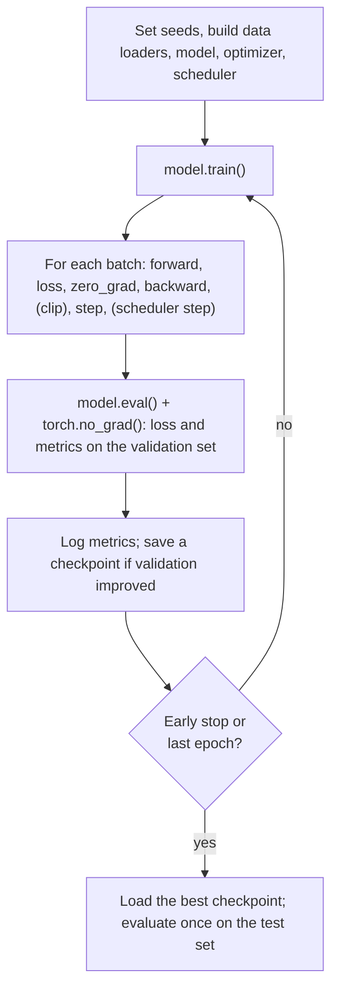
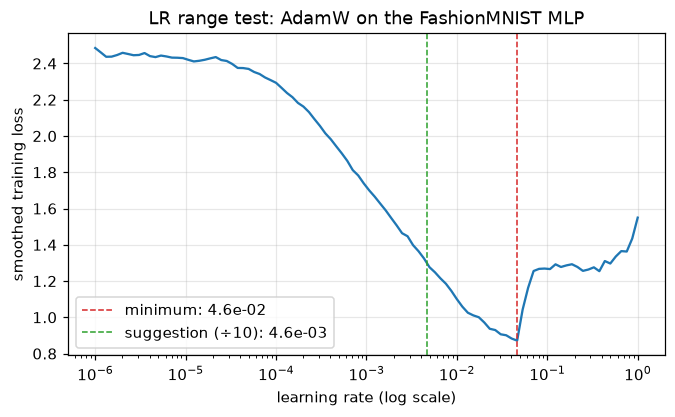
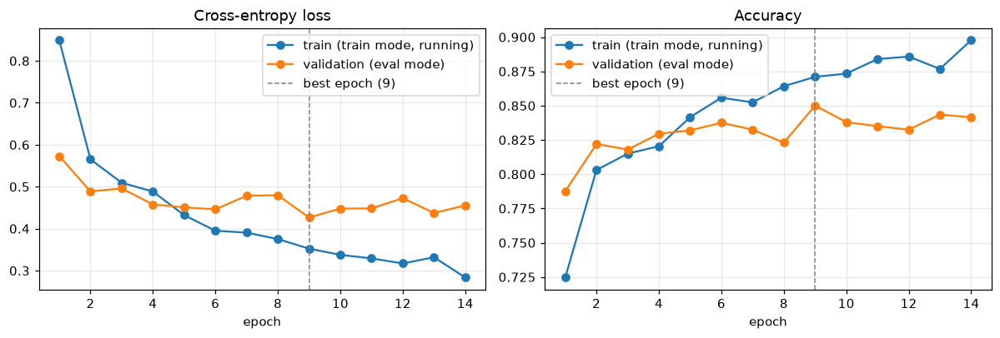

# The Training Loop

> **Level 7 · Chapter 2** · ⏱️ ~80 min read · Prerequisites: [PyTorch fundamentals](01-pytorch-fundamentals.md), [Optimizers](../06-neural-networks/04-optimizers.md), [Training deep networks](../06-neural-networks/05-training-deep-networks.md)

Every deep learning project, from a digit classifier to a large language model, runs the same five-line loop at its core. This chapter builds that loop properly, with everything a real project needs around it: **train and eval modes**, a **validation** split, **early stopping**, **checkpoints** you can actually resume from, **seeding** for reproducible runs, **mixed precision** with `torch.autocast`, logging with **TensorBoard**, a **learning-rate finder**, and the single most useful debugging habit in deep learning: **overfit a single batch first**.

## Why it matters

Sam trained an image model on a rented cloud GPU for three days. At hour 60 the instance was preempted and shut down. Sam had saved a checkpoint every epoch, so that seemed fine, but the checkpoint contained only the model's weights. On restart, Adam began again with empty moment estimates and its learning-rate schedule began again at warmup. The loss jumped, took most of a day to recover, and the final model was measurably worse than the run before the crash.

Then came the report. Sam quoted the validation accuracy from the last epoch, not the best one, and the best one had been two epochs earlier. A colleague tried to reproduce the result and got numbers 1.5 points lower, because nothing had been seeded, and nobody knew whether that difference was noise or a real bug. Finally, the deployed model did worse than validation had promised, because the evaluation code had never called `model.eval()`, so dropout was still active when the validation numbers were computed, and those numbers didn't describe the deterministic model that was shipped.

None of these are modeling problems. They're training-loop problems, and they're entirely preventable with a loop that's written once, carefully, and reused.

## Concepts

### The anatomy of one training step

Strip away everything else and a training step is five lines:

<!-- skip-run -->
```python
logits = model(xb)                 # 1. forward pass: builds the graph
loss = loss_fn(logits, yb)         # 2. a scalar loss
optimizer.zero_grad()              # 3. clear old gradients (they accumulate)
loss.backward()                    # 4. backward pass: fills p.grad for every parameter
optimizer.step()                   # 5. update: p <- p - lr * (something computed from p.grad)
```

Each line maps to something you built in Level 6. The forward pass computes predictions and records the graph. The loss is the mean over the batch of a per-example loss $\ell$: for a batch $B$ of examples,

$$
\mathcal{L}_B(\theta) = \frac{1}{|B|}\sum_{i \in B} \ell\big(f_\theta(\mathbf{x}_i), y_i\big),
$$

where $f_\theta$ is the model with parameters $\theta$. `backward()` computes $\nabla_\theta\mathcal{L}_B$, an unbiased estimate of the gradient of the full training loss. `step()` applies the update rule; for plain SGD with learning rate $\eta$ that's $\theta \leftarrow \theta - \eta\nabla_\theta\mathcal{L}_B$, and for AdamW it's the moment-based update from [Optimizers](../06-neural-networks/04-optimizers.md).

The order of lines 3 and 4 matters only in that zeroing must happen before `backward()` and after the previous `step()`. Placing `zero_grad()` first in the step (before the forward pass) is equally common.

### The outer loop: epochs, validation, and bookkeeping

Around the step sits the rest of the loop:



An **epoch** is one pass over the training data. Each epoch has a training phase and a validation phase, then logging, checkpointing, and an early-stopping decision. You'll implement this as three functions: `train_one_epoch`, `evaluate`, and `fit`.

### Train mode and eval mode

Some layers behave differently during training and inference. `model.train()` and `model.eval()` set a `training` flag on every submodule, and these layers read it:

- **Dropout.** In training, each activation is zeroed with probability $p$ and the survivors are scaled by $1/(1-p)$, so the expected value is unchanged ("inverted dropout", as in [Training deep networks](../06-neural-networks/05-training-deep-networks.md)). In eval mode, dropout is the identity.
- **Batch normalization.** In training, it normalizes with the current batch's mean and variance, and updates **running estimates** of both as an exponential moving average. For each channel, with momentum $m$ (PyTorch's default is 0.1),

    $$
    \hat{\mu} \leftarrow (1 - m)\,\hat{\mu} + m\,\mu_B, \qquad \hat{\sigma}^2 \leftarrow (1 - m)\,\hat{\sigma}^2 + m\,\sigma_B^2,
    $$

    where $\mu_B$ and $\sigma_B^2$ are the batch mean and (unbiased) variance. In eval mode it uses the running estimates $\hat{\mu}$ and $\hat{\sigma}^2$, so each example's output no longer depends on the other examples in its batch.

Forgetting `model.eval()` gives you noisy validation numbers (dropout), and with batch norm it gives predictions that depend on batch composition, which can be badly wrong for a batch of one. Forgetting `model.train()` after evaluation is just as bad: training then proceeds without dropout and with frozen batch-norm statistics. The safest pattern is to call the right mode at the top of each phase, every time.

Remember that the mode and gradient tracking are separate switches. Evaluation needs `model.eval()` *and* `torch.no_grad()`.

### Validation and what to measure

You met the train/validation/test split in [Generalization and the bias-variance trade-off](../03-ml-fundamentals/04-generalization-bias-variance.md). In deep learning, the **validation set** has a more active role: you consult it every epoch to choose the number of epochs, the learning rate, the architecture, and which checkpoint to keep. Each of those choices leaks a little information about the validation set into the model, which is why you need a **test set** you touch exactly once, at the end.

Track both the **validation loss** and a **validation metric** such as accuracy. They can disagree. Accuracy only cares whether the top class is right; cross-entropy also cares how confident the model is. It's common to see validation loss start rising (the model becoming overconfident on the examples it gets wrong) while accuracy still creeps up. For early stopping and checkpoint selection, pick one, say so, and stick with it. Validation loss is the smoother signal; the metric is what you'll report.

Also track the **training loss**. The gap between training and validation tells you where you are: both high means underfitting (a bigger model or more training helps), training low but validation high means overfitting (more data, augmentation, or regularization helps). Note one trap: the training loss you accumulate during an epoch is computed in train mode, with dropout, while the weights are still changing, so it isn't directly comparable with the validation loss. It's fine for spotting trends.

### Early stopping

Training longer reduces training loss almost forever. Validation loss typically falls, flattens, and then rises as the network starts to memorize. **Early stopping** keeps the parameters from the epoch with the best validation score:

1. After each epoch, compare the validation loss with the best so far.
2. If it improved by more than a small `min_delta`, save a checkpoint and reset a counter.
3. Otherwise, increment the counter. When it reaches the **patience** (say 5 epochs), stop.
4. Reload the best checkpoint.

Patience matters because validation curves are noisy; stopping at the first uptick would stop too early. Early stopping is a form of regularization: limiting the number of gradient steps limits how far the weights can move from their initialization. For a linear model trained by gradient descent, it can be shown to act much like an L2 penalty (Goodfellow, Bengio, and Courville, *Deep Learning*, section 7.8).

### Checkpointing

A **checkpoint** is everything needed to continue training exactly where you left off, or to use the model later. A model's `state_dict()` holds its parameters and buffers. That's enough for inference, but not for resuming training. A full checkpoint holds:

| Item | Why |
|---|---|
| `model.state_dict()` | Parameters and buffers (such as batch norm's running statistics) |
| `optimizer.state_dict()` | Adam's first and second moments for every parameter, step counts, and the current learning rates |
| `scheduler.state_dict()` | Where the learning-rate schedule is |
| The epoch (and global step) | Where to restart the loop |
| The best validation score | So early stopping continues correctly |
| RNG states | For bit-for-bit continuation of shuffling and dropout |
| The config (hyperparameters) | So you know how the model was built |

Save with `torch.save(dict, path)` and load with `torch.load(path)`. Since PyTorch 2.6, `torch.load` defaults to `weights_only=True`, which loads only tensors and simple Python containers and refuses arbitrary pickled objects. That's a security feature: a pickle file can run code when it's loaded, so never pass `weights_only=False` to a file you didn't create.

Keep two kinds of checkpoint: the **best** one (by validation) and the **latest** one (for resuming after a crash). Save the `state_dict`, not the model object (`torch.save(model)` pickles the class by reference, so loading breaks when your code changes). To load, build the model from code, then call `model.load_state_dict(...)`.

### Learning-rate schedules

A constant learning rate is rarely best. Large steps early make fast progress; small steps late settle into a minimum. `torch.optim.lr_scheduler` has the common shapes, covered in [Optimizers](../06-neural-networks/04-optimizers.md):

- `StepLR` (multiply by $\gamma$ every $k$ epochs) and `MultiStepLR`.
- `CosineAnnealingLR`: $\eta_t = \eta_{\min} + \tfrac{1}{2}(\eta_{\max} - \eta_{\min})(1 + \cos(\pi t / T))$.
- `OneCycleLR`: warm up from a small rate to $\eta_{\max}$, then anneal far below the start. Stepped every *batch*.
- `ReduceLROnPlateau`: divide the learning rate when the validation loss stops improving. Stepped with the validation loss: `scheduler.step(val_loss)`.

Check whether a scheduler expects a step per batch or per epoch, and call `scheduler.step()` after `optimizer.step()`.

### Reproducibility and seeding

A training run has many sources of randomness: weight initialization, the shuffling order, dropout masks, data augmentation, and the random split itself. Setting seeds makes all of them repeatable:

<!-- skip-run -->
```python
random.seed(seed); np.random.seed(seed); torch.manual_seed(seed)   # torch.manual_seed also seeds CUDA
```

Give each `DataLoader` its own seeded `generator`, so the shuffling order doesn't depend on how many random numbers the rest of your code happened to draw. With `num_workers > 0`, each worker process has its own RNG; PyTorch seeds them from the loader's generator, and a `worker_init_fn` should seed NumPy and `random` in each worker if your dataset uses them.

Seeding gives repeatability on the *same* hardware and software. It doesn't guarantee identical results across machines, library versions, or CPU versus GPU. Some GPU kernels are **nondeterministic** too: they use atomic additions whose order varies, so floating-point sums vary in the last bits, and those differences grow over training. For full determinism on GPUs, call `torch.use_deterministic_algorithms(True)`, set `torch.backends.cudnn.benchmark = False`, and set the environment variable `CUBLAS_WORKSPACE_CONFIG=:4096:8`. Expect it to be slower, and expect errors from operations that have no deterministic implementation.

The more important lesson is statistical. Two runs with different seeds give different results, sometimes by more than the effect you're trying to measure. Before claiming that a change helps, run a few seeds of each and compare the spread. You'll see the size of this seed-to-seed noise below.

### Mixed precision

A **floating-point number** stores a sign bit, an exponent (which sets the range), and a mantissa (which sets the precision). The formats in deep learning:

| Format | Exponent bits | Mantissa bits | Largest value | Machine epsilon | Smallest normal |
|---|---|---|---|---|---|
| float32 | 8 | 23 | $3.4 \times 10^{38}$ | $1.2 \times 10^{-7}$ | $1.2 \times 10^{-38}$ |
| float16 | 5 | 10 | 65,504 | $9.8 \times 10^{-4}$ | $6.1 \times 10^{-5}$ |
| bfloat16 | 8 | 7 | $3.4 \times 10^{38}$ | $7.8 \times 10^{-3}$ | $1.2 \times 10^{-38}$ |

(**Machine epsilon** is the gap between 1 and the next representable number: the relative precision.) 16-bit formats halve memory traffic, and modern GPUs have specialized units (tensor cores) that multiply 16-bit matrices several times faster than 32-bit ones. **Mixed-precision training** runs the expensive operations (matrix multiplications and convolutions) in 16 bits while keeping the operations that need precision (reductions such as sums and softmax, losses, and the weight update) in 32 bits.

`torch.autocast` does this automatically. Inside `with torch.autocast(device_type=..., dtype=...)`, each operation is cast to the precision on an internal list: `matmul`, `linear`, and `conv` run in 16 bits; `softmax`, `log_softmax`, losses, and norms run in float32. The parameters themselves stay in float32, and so does the optimizer step. You wrap only the forward pass and the loss; the backward pass automatically uses the same precisions as the corresponding forward operations.

The two 16-bit formats need different care:

- **bfloat16** keeps float32's 8 exponent bits, so it has the same range and gradients don't underflow. It loses precision (about 3 significant decimal digits), which neural networks tolerate well. On recent GPUs (NVIDIA Ampere and later), TPUs, and CPUs, it's the easy default, and it needs nothing beyond `autocast`.
- **float16** has only 5 exponent bits. Values below about $6 \times 10^{-8}$ (its smallest subnormal) round to zero, and many gradients in a deep network are that small. The fix is **loss scaling**: multiply the loss by a large factor $S$ (say $2^{16}$) before `backward()`. By the chain rule every gradient is multiplied by $S$, which lifts small gradients into float16's range. Before the optimizer step, divide the gradients by $S$ again. If any gradient overflowed to `inf` or `NaN`, skip that step and halve $S$; if many steps pass without overflow, double $S$. PyTorch's **`torch.amp.GradScaler`** implements exactly this dynamic scheme. You use it only with float16 on CUDA; bfloat16 doesn't need it.

This chapter's examples use bfloat16 autocast on the CPU, so you can see the mechanics on any machine. Whether it's *faster* on a CPU depends on whether your processor has native bfloat16 instructions; on many laptops it isn't. On a GPU, mixed precision typically speeds training up substantially and roughly halves activation memory. [Scaling and efficiency](../08-modern-deep-learning/06-scaling-and-efficiency.md) goes deeper.

### Logging and TensorBoard

You can't debug what you didn't record. At minimum, log per epoch: training loss, validation loss and metric, the learning rate, and the time taken. For harder problems also log the **gradient norm** (spikes signal instability; a norm near zero signals vanishing gradients), a few example predictions, and weight histograms.

**TensorBoard** is a simple, local dashboard for this. A `SummaryWriter` writes event files to a directory; you call `writer.add_scalar("loss/val", value, step)` and view them with `tensorboard --logdir runs`. Hosted trackers such as Weights & Biases, and MLflow (which you used in [ML in production](../05-applied-ml/05-ml-in-production.md)), do the same job with team features. The tool matters much less than the habit: every run logged, every run's config saved.

### The learning-rate finder

The learning rate is the most important hyperparameter, and the **LR range test** (Leslie Smith, 2015, popularized by the fastai library) finds a good one in about 100 steps. Start from a tiny learning rate and multiply it by a constant factor after every batch, so it sweeps exponentially from $\eta_{\min}$ to $\eta_{\max}$ over $K$ steps:

$$
\eta_k = \eta_{\min}\left(\frac{\eta_{\max}}{\eta_{\min}}\right)^{k/(K-1)}, \qquad k = 0, \ldots, K - 1.
$$

Record a smoothed loss at each step and plot it against $\eta$ on a log axis. The curve has three regions: flat (the rate is too small to make progress), falling steeply (good learning rates), and exploding (too large). A common heuristic is to pick a rate roughly ten times smaller than the one at the loss minimum, or near the point of steepest descent. It's a rule of thumb, not a theorem: the test measures what works in the first hundred steps from initialization, which isn't the same as the best rate over a whole run, but it reliably gets you within the right order of magnitude. Run it on a fresh copy of the model, since the test itself trains (and then wrecks) the weights.

### Overfit a single batch first

Before training on the full dataset, take one small batch (say 32 examples) and train on it alone for a few hundred steps. A correct model and loop will drive the loss to nearly zero and the batch accuracy to 100%: a network with thousands of parameters can memorize 32 examples easily.

If it can't, something is broken, and you've found out in seconds rather than after a day of training. Typical culprits:

- The loss doesn't move at all: the optimizer was given the wrong parameters (for example, created before the model was rebuilt), the learning rate is zero or tiny, gradients are being detached somewhere, or `zero_grad` is in the wrong place.
- The loss plateaus well above zero: a wrong loss input (softmax applied before `cross_entropy`, which you'll see below), labels misaligned with inputs, or a model with too little capacity or a bottleneck (such as a ReLU killing everything).
- The loss becomes `NaN`: the learning rate is too high, or there's a `log(0)` or division by zero.

Karpathy's essay "A Recipe for Training Neural Networks" lists this check among its first steps, along with checking the loss at initialization: for $C$ balanced classes, a freshly initialized classifier should have a cross-entropy loss near $\ln C$ (about 2.30 for 10 classes), since it should be roughly uniformly unsure.

## In practice

### Data: a FashionMNIST subset

FashionMNIST has 70,000 grayscale $28 \times 28$ images of clothing in 10 classes (60,000 for training and 10,000 for testing). It's a drop-in replacement for MNIST digits that's harder and more realistic. To keep every run in this chapter to seconds on a CPU, use 5,000 training images and 2,000 validation images drawn from the training split, and the full test set. The code downloads the data the first time you run it (about 30 MB).

```python
import copy
import math
import random
import time
from pathlib import Path

import numpy as np
import torch
import torch.nn as nn
import torch.nn.functional as F
from torch.utils.data import DataLoader, TensorDataset
from torchvision import datasets

torch.set_num_threads(4)

def seed_everything(seed):
    random.seed(seed)
    np.random.seed(seed)
    torch.manual_seed(seed)

train_full = datasets.FashionMNIST("data", train=True, download=True)
test_full = datasets.FashionMNIST("data", train=False, download=True)

perm = torch.randperm(len(train_full.targets), generator=torch.Generator().manual_seed(0))
tr_idx, va_idx = perm[:5000], perm[5000:7000]
X_tr_raw = train_full.data[tr_idx].float() / 255
mean, std = X_tr_raw.mean().item(), X_tr_raw.std().item()        # from the training subset only

def prep(images):
    return ((images.float() / 255 - mean) / std).flatten(1)       # (n, 784), standardized

train_ds = TensorDataset(prep(train_full.data[tr_idx]), train_full.targets[tr_idx])
val_ds = TensorDataset(prep(train_full.data[va_idx]), train_full.targets[va_idx])
test_ds = TensorDataset(prep(test_full.data), test_full.targets)
val_dl = DataLoader(val_ds, batch_size=500)
test_dl = DataLoader(test_ds, batch_size=1000)

def make_train_loader(seed=0, batch_size=64):
    return DataLoader(train_ds, batch_size=batch_size, shuffle=True,
                      generator=torch.Generator().manual_seed(seed))

print(f"train {len(train_ds)}, val {len(val_ds)}, test {len(test_ds)}; mean {mean:.4f}, std {std:.4f}")
print("class counts in train subset:", torch.bincount(train_ds.tensors[1]).tolist())
```

```text
train 5000, val 2000, test 10000; mean 0.2873, std 0.3542
class counts in train subset: [503, 495, 488, 482, 475, 490, 518, 529, 497, 523]
```

The model is an MLP with batch norm and dropout, so that train and eval modes matter:

```python
def make_model(p_drop=0.3):
    return nn.Sequential(
        nn.Linear(784, 256), nn.BatchNorm1d(256), nn.ReLU(), nn.Dropout(p_drop),
        nn.Linear(256, 128), nn.BatchNorm1d(128), nn.ReLU(), nn.Dropout(p_drop),
        nn.Linear(128, 10),
    )

seed_everything(0)
model = make_model()
xb, yb = next(iter(make_train_loader()))
with torch.no_grad():
    model.eval()
    print(f"loss at initialization: {F.cross_entropy(model(xb), yb).item():.3f}  (ln 10 = {math.log(10):.3f})")
print("parameters:", sum(p.numel() for p in model.parameters()))
```

```text
loss at initialization: 2.318  (ln 10 = 2.303)
parameters: 235914
```

The initial loss is close to $\ln 10$, as it should be. A loss of, say, 15 at initialization would mean the logits are huge, a sign of bad initialization or unnormalized inputs.

### Step 0: overfit a single batch

```python
def overfit_one_batch(model, xb, yb, steps=200, lr=1e-3, loss_fn=F.cross_entropy):
    opt = torch.optim.Adam(model.parameters(), lr=lr)
    model.train()
    for step in range(steps + 1):
        logits = model(xb)
        loss = loss_fn(logits, yb)
        opt.zero_grad()
        loss.backward()
        opt.step()
        if step in (0, 50, 100, 200):
            acc = (logits.argmax(1) == yb).float().mean().item()
            print(f"  step {step:3d}  loss {loss.item():.4f}  batch accuracy {acc:.2f}")

xb, yb = xb[:32], yb[:32]
seed_everything(0)
print("correct model:")
overfit_one_batch(make_model(), xb, yb)

def softmax_then_ce(logits, y):              # a classic bug: softmax before cross_entropy
    return F.cross_entropy(torch.softmax(logits, dim=1), y)

seed_everything(0)
print("bug: softmax applied before cross_entropy:")
overfit_one_batch(make_model(), xb, yb, loss_fn=softmax_then_ce)
```

```text
correct model:
  step   0  loss 2.5541  batch accuracy 0.03
  step  50  loss 0.1251  batch accuracy 1.00
  step 100  loss 0.0401  batch accuracy 1.00
  step 200  loss 0.0093  batch accuracy 1.00
bug: softmax applied before cross_entropy:
  step   0  loss 2.3196  batch accuracy 0.03
  step  50  loss 1.5202  batch accuracy 1.00
  step 100  loss 1.4768  batch accuracy 1.00
  step 200  loss 1.4645  batch accuracy 1.00
```

The correct model memorizes the batch. The buggy one gets every example right but its loss can't get below about 1.46. Here's why: `cross_entropy` applies its own log-softmax to whatever it receives. If it receives probabilities in $[0, 1]$, the best it can do is one input at 1 and nine at 0, giving a loss of

$$
-\log\frac{e^{1}}{e^{1} + 9e^{0}} = \log\left(1 + 9e^{-1}\right) \approx 1.46.
$$

On the full dataset, this bug doesn't crash; it just trains slowly and badly, with tiny gradients. The single-batch test exposes it in a second, because you know the loss should reach zero.

### A learning-rate finder from scratch

```python
def lr_find(make_model, loader, lr_min=1e-6, lr_max=1.0, steps=100, beta=0.9, seed=0):
    seed_everything(seed)
    model = make_model()
    opt = torch.optim.AdamW(model.parameters(), lr=lr_min)
    factor = (lr_max / lr_min) ** (1 / (steps - 1))
    lrs, losses, avg, best = [], [], 0.0, float("inf")
    batches = iter(loader)
    model.train()
    for k in range(steps):
        try:
            xb, yb = next(batches)
        except StopIteration:
            batches = iter(loader)
            xb, yb = next(batches)
        lr = lr_min * factor ** k
        for group in opt.param_groups:
            group["lr"] = lr
        loss = F.cross_entropy(model(xb), yb)
        opt.zero_grad()
        loss.backward()
        opt.step()
        avg = beta * avg + (1 - beta) * loss.item()          # exponential moving average...
        smoothed = avg / (1 - beta ** (k + 1))              # ...with bias correction, as in Adam
        lrs.append(lr)
        losses.append(smoothed)
        best = min(best, smoothed)
        if smoothed > 4 * best:                              # diverged: stop
            break
    return np.array(lrs), np.array(losses)

lrs, losses = lr_find(make_model, make_train_loader())
i_min = losses.argmin()
print(f"steps run: {len(lrs)}; minimum smoothed loss {losses[i_min]:.3f} at lr {lrs[i_min]:.2e}")
print(f"suggested lr (minimum / 10): {lrs[i_min] / 10:.1e}")
```

```text
steps run: 100; minimum smoothed loss 0.872 at lr 4.64e-02
suggested lr (minimum / 10): 4.6e-03
```

```python
import matplotlib.pyplot as plt

fig, ax = plt.subplots(figsize=(7, 3.8))
ax.plot(lrs, losses)
ax.axvline(lrs[i_min], color="C3", ls="--", lw=1, label=f"minimum: {lrs[i_min]:.1e}")
ax.axvline(lrs[i_min] / 10, color="C2", ls="--", lw=1, label=f"suggestion (÷10): {lrs[i_min] / 10:.1e}")
ax.set(xscale="log", xlabel="learning rate (log scale)", ylabel="smoothed training loss",
       title="LR range test: AdamW on the FashionMNIST MLP")
ax.legend()
ax.grid(alpha=0.3)
plt.show()
```


*The LR range test. Too small (left) makes no progress; too large (right) diverges. Good rates sit on the steep downward slope.*

Read the curve, not just the suggestion. The loss is flat below about $10^{-5}$, falls steadily from $10^{-4}$ to its minimum near $5 \times 10^{-2}$, and jumps up just past it. Keep in mind that the test is cumulative: part of the fall at larger rates comes from the hundred steps of training already done, which is one reason to back off from the minimum. Anything from about $10^{-3}$ to $5 \times 10^{-3}$ is a reasonable choice for AdamW here; the loop below uses $2 \times 10^{-3}$, toward the cautious end.

### The canonical loop: train, evaluate, fit

These three functions are the template to reuse in every project. `fit` adds early stopping and checkpointing, and returns the history for plotting.

```python
def train_one_epoch(model, loader, optimizer, loss_fn=F.cross_entropy, scheduler=None, clip=None):
    model.train()
    total_loss, correct, n = 0.0, 0, 0
    for xb, yb in loader:
        logits = model(xb)
        loss = loss_fn(logits, yb)
        optimizer.zero_grad(set_to_none=True)
        loss.backward()
        if clip is not None:
            nn.utils.clip_grad_norm_(model.parameters(), clip)
        optimizer.step()
        if scheduler is not None:
            scheduler.step()                       # per-batch schedulers (e.g. OneCycleLR)
        total_loss += loss.item() * len(yb)
        correct += (logits.argmax(1) == yb).sum().item()
        n += len(yb)
    return total_loss / n, correct / n


@torch.no_grad()
def evaluate(model, loader, loss_fn=F.cross_entropy):
    model.eval()
    total_loss, correct, n = 0.0, 0, 0
    for xb, yb in loader:
        logits = model(xb)
        total_loss += loss_fn(logits, yb, reduction="sum").item()
        correct += (logits.argmax(1) == yb).sum().item()
        n += len(yb)
    return total_loss / n, correct / n


def fit(model, train_dl, val_dl, optimizer, max_epochs=50, patience=5, min_delta=1e-4,
        ckpt_dir="checkpoints", verbose=True):
    ckpt_dir = Path(ckpt_dir)
    ckpt_dir.mkdir(exist_ok=True)
    history = {k: [] for k in ["train_loss", "train_acc", "val_loss", "val_acc"]}
    best_loss, best_epoch, bad_epochs = float("inf"), 0, 0
    for epoch in range(1, max_epochs + 1):
        tr_loss, tr_acc = train_one_epoch(model, train_dl, optimizer)
        va_loss, va_acc = evaluate(model, val_dl)
        for k, v in zip(history, [tr_loss, tr_acc, va_loss, va_acc]):
            history[k].append(v)
        if va_loss < best_loss - min_delta:
            best_loss, best_epoch, bad_epochs = va_loss, epoch, 0
            torch.save({"epoch": epoch, "model": model.state_dict(), "optimizer": optimizer.state_dict(),
                        "val_loss": va_loss, "val_acc": va_acc}, ckpt_dir / "best.pt")
        else:
            bad_epochs += 1
        if verbose and (epoch % 5 == 0 or epoch == 1):
            print(f"epoch {epoch:2d}  train {tr_loss:.4f}/{tr_acc:.3f}  val {va_loss:.4f}/{va_acc:.3f}")
        if bad_epochs >= patience:
            if verbose:
                print(f"early stop at epoch {epoch}: no improvement for {patience} epochs")
            break
    best = torch.load(ckpt_dir / "best.pt")
    model.load_state_dict(best["model"])
    if verbose:
        print(f"restored best epoch {best['epoch']}: val loss {best['val_loss']:.4f}, val acc {best['val_acc']:.3f}")
    return history, best["epoch"]

seed_everything(0)
model = make_model()
optimizer = torch.optim.AdamW(model.parameters(), lr=2e-3, weight_decay=1e-2)
t0 = time.time()
history, best_epoch = fit(model, make_train_loader(), val_dl, optimizer)
print(f"took {time.time() - t0:.1f}s")
```

```text
epoch  1  train 0.8493/0.725  val 0.5729/0.787
epoch  5  train 0.4322/0.842  val 0.4508/0.832
epoch 10  train 0.3376/0.873  val 0.4479/0.838
early stop at epoch 14: no improvement for 5 epochs
restored best epoch 9: val loss 0.4265, val acc 0.850
took 8.1s
```

```python
epochs = np.arange(1, len(history["train_loss"]) + 1)
fig, axes = plt.subplots(1, 2, figsize=(11, 3.8))
for ax, metric, title in [(axes[0], "loss", "Cross-entropy loss"), (axes[1], "acc", "Accuracy")]:
    ax.plot(epochs, history[f"train_{metric}"], "o-", label="train (train mode, running)")
    ax.plot(epochs, history[f"val_{metric}"], "o-", label="validation (eval mode)")
    ax.axvline(best_epoch, color="gray", ls="--", lw=1, label=f"best epoch ({best_epoch})")
    ax.set(xlabel="epoch", title=title)
    ax.grid(alpha=0.3)
    ax.legend()
plt.tight_layout()
plt.show()
```


*Training and validation curves with early stopping. The widening gap after the best epoch is overfitting to the 5,000 training images.*

The training loss keeps falling while the validation loss bottoms out and starts to rise: textbook overfitting on a small training set. Early stopping saved the weights from the best epoch and restored them at the end. Now, and only now, evaluate once on the test set:

```python
test_loss, test_acc = evaluate(model, test_dl)
print(f"test loss {test_loss:.4f}, test accuracy {test_acc:.3f}")
```

```text
test loss 0.4390, test accuracy 0.843
```

The test accuracy is close to the validation accuracy, which is what you expect when the validation set was used for only a few decisions. (The [CNN chapter](03-convolutional-networks.md) does much better on the same data by exploiting the image structure.)

!!! warning "Common mistake: forgetting eval mode"
    Evaluate this trained model in train mode and the numbers change, because dropout stays active and batch norm uses each validation batch's own statistics:

    ```python
    def accuracy_in_train_mode(model, loader):
        model.train()                                   # the bug: dropout on, batch statistics
        with torch.no_grad():
            correct = sum((model(xb).argmax(1) == yb).sum().item() for xb, yb in loader)
        return correct / len(loader.dataset)

    noisy = [accuracy_in_train_mode(model, val_dl) for _ in range(3)]
    print("val accuracy in train mode, three runs:", [round(a, 3) for a in noisy])
    print("val accuracy in eval mode:              ", round(evaluate(model, val_dl)[1], 3))
    ```

    ```text
    val accuracy in train mode, three runs: [0.836, 0.822, 0.826]
    val accuracy in eval mode:               0.851
    ```

    In train mode, the "same" model gives a different answer every time. Always call `model.eval()` before evaluating, and `model.train()` before training resumes.

### Checkpoints you can resume from

The real test of a checkpoint is whether resuming gives the same result as never stopping. Train for 4 epochs straight; then train for 2, save a full checkpoint, throw everything away, rebuild from scratch with a *different* seed (to prove that nothing leaks through), load the checkpoint, and train 2 more:

```python
def new_run(seed):
    seed_everything(seed)
    model = make_model()
    opt = torch.optim.AdamW(model.parameters(), lr=2e-3, weight_decay=1e-2)
    gen = torch.Generator().manual_seed(seed)
    loader = DataLoader(train_ds, batch_size=64, shuffle=True, generator=gen)
    return model, opt, gen, loader

# A: four epochs without interruption
model, opt, gen, loader = new_run(0)
for _ in range(4):
    train_one_epoch(model, loader, opt)
reference = copy.deepcopy(model.state_dict())

# B: two epochs, save, "crash", rebuild, resume, two more
model, opt, gen, loader = new_run(0)
for _ in range(2):
    train_one_epoch(model, loader, opt)
torch.save({"epoch": 2, "model": model.state_dict(), "optimizer": opt.state_dict(),
            "torch_rng": torch.get_rng_state(), "loader_rng": gen.get_state()}, "checkpoints/last.pt")
del model, opt, gen, loader

model, opt, gen, loader = new_run(seed=123)                  # deliberately different state
ckpt = torch.load("checkpoints/last.pt")                     # weights_only=True by default
model.load_state_dict(ckpt["model"])
opt.load_state_dict(ckpt["optimizer"])
torch.set_rng_state(ckpt["torch_rng"])                       # dropout masks continue where they were
gen.set_state(ckpt["loader_rng"])                            # so does the shuffling order
for _ in range(ckpt["epoch"], 4):
    train_one_epoch(model, loader, opt)

def max_diff(sd1, sd2):                     # compare learnable weights (skip batch-norm statistics)
    return max((sd1[k] - sd2[k]).abs().max().item() for k, _ in model.named_parameters())

print("resumed with full state:      max parameter difference", max_diff(reference, model.state_dict()))

# C: the same, but restoring only the model weights (Sam's checkpoint)
model, opt, gen, loader = new_run(seed=123)
model.load_state_dict(ckpt["model"])
for _ in range(2):
    train_one_epoch(model, loader, opt)
print("resumed with weights only:    max parameter difference", round(max_diff(reference, model.state_dict()), 4))
print("Adam state for one weight:", list(ckpt["optimizer"]["state"][0].keys()))
```

```text
resumed with full state:      max parameter difference 0.0
resumed with weights only:    max parameter difference 0.168
Adam state for one weight: ['step', 'exp_avg', 'exp_avg_sq']
```

With the full state, the resumed run is bit-for-bit identical to the uninterrupted one. With weights alone, Adam restarts with zero moment estimates (`exp_avg` and `exp_avg_sq` are its $\mathbf{m}$ and $\mathbf{v}$), the shuffling order and dropout masks differ, and the run diverges from the reference. On a CPU this exact equality is reliable; on a GPU, nondeterministic kernels can introduce tiny differences unless you enable deterministic algorithms.

### Seeds: the noise floor of your experiments

How much do results vary from seed alone? Train the same configuration with five seeds, everything else fixed:

```python
accs = []
for seed in range(5):
    seed_everything(seed)
    m = make_model()
    opt = torch.optim.AdamW(m.parameters(), lr=2e-3, weight_decay=1e-2)
    _, best_ep = fit(m, make_train_loader(seed), val_dl, opt, verbose=False, ckpt_dir=f"checkpoints/seed{seed}")
    accs.append(evaluate(m, val_dl)[1])
    print(f"seed {seed}: best epoch {best_ep:2d}, val accuracy {accs[-1]:.4f}")
print(f"mean {np.mean(accs):.4f}, std {np.std(accs, ddof=1):.4f}, range {max(accs) - min(accs):.4f}")

seed_everything(0)
a = make_model()[0].weight[0, :3]
seed_everything(0)
b = make_model()[0].weight[0, :3]
print("same seed, same initial weights:", torch.equal(a, b))
```

```text
seed 0: best epoch  9, val accuracy 0.8500
seed 1: best epoch 12, val accuracy 0.8520
seed 2: best epoch  9, val accuracy 0.8385
seed 3: best epoch 10, val accuracy 0.8460
seed 4: best epoch  5, val accuracy 0.8370
mean 0.8447, std 0.0067, range 0.0150
same seed, same initial weights: True
```

Identical code and data, different seeds, and the validation accuracy moves by up to 1.5 percentage points, with a standard deviation of about 0.7. A "one-point improvement" from a single run of a new idea is within this noise. Compare ideas over several seeds, and report a mean and spread.

### Mixed precision with `torch.autocast`

First, the formats themselves. float16 overflows and underflows where bfloat16 doesn't, while bfloat16 is coarser:

```python
for dt in [torch.float32, torch.float16, torch.bfloat16]:
    fi = torch.finfo(dt)
    print(f"{str(dt):15s} max {fi.max:.3g}  eps {fi.eps:.3g}  smallest normal {fi.tiny:.3g}")
print("70000 in fp16:", torch.tensor(70000.0).half().item(), "| in bf16:", torch.tensor(70000.0).bfloat16().item())
print("1e-8  in fp16:", torch.tensor(1e-8).half().item(), "| in bf16:", torch.tensor(1e-8).bfloat16().item())
print("1 + 1/256 in bf16:", torch.tensor(1 + 1 / 256).bfloat16().item(), "| in fp16:", torch.tensor(1 + 1 / 256).half().item())
```

```text
torch.float32   max 3.4e+38  eps 1.19e-07  smallest normal 1.18e-38
torch.float16   max 6.55e+04  eps 0.000977  smallest normal 6.1e-05
torch.bfloat16  max 3.39e+38  eps 0.00781  smallest normal 1.18e-38
70000 in fp16: inf | in bf16: 70144.0
1e-8  in fp16: 0.0 | in bf16: 1.0011717677116394e-08
1 + 1/256 in bf16: 1.0 | in fp16: 1.00390625
```

A gradient of $10^{-8}$ vanishes in float16, which is why float16 training needs loss scaling. bfloat16 keeps it, at the cost of rounding $1 + 1/256$ to 1. Now see what autocast does inside a forward pass:

```python
seed_everything(0)
model = make_model()
xb, yb = next(iter(make_train_loader()))
with torch.autocast(device_type="cpu", dtype=torch.bfloat16):
    h = model[0](xb)                         # Linear: runs in bfloat16
    logits = model(xb)
    loss = F.cross_entropy(logits, yb)       # loss: autocast runs it in float32
print("linear output:", h.dtype, "| logits:", logits.dtype, "| loss:", loss.dtype)
loss.backward()
print("parameter:", model[0].weight.dtype, "| its gradient:", model[0].weight.grad.dtype)
```

```text
linear output: torch.bfloat16 | logits: torch.bfloat16 | loss: torch.float32
parameter: torch.float32 | its gradient: torch.float32
```

The matrix multiplications ran in bfloat16, the loss in float32, and the parameters and their gradients stayed float32, so the optimizer update keeps full precision. Training with autocast needs only the forward pass and loss wrapped:

```python
def train_one_epoch_amp(model, loader, optimizer, dtype=torch.bfloat16):
    model.train()
    for xb, yb in loader:
        with torch.autocast(device_type="cpu", dtype=dtype):
            loss = F.cross_entropy(model(xb), yb)
        optimizer.zero_grad(set_to_none=True)
        loss.backward()                              # outside autocast
        optimizer.step()

for use_amp in [False, True]:
    seed_everything(0)
    model = make_model()
    opt = torch.optim.AdamW(model.parameters(), lr=2e-3, weight_decay=1e-2)
    loader = make_train_loader()
    t0 = time.time()
    for epoch in range(8):
        (train_one_epoch_amp if use_amp else train_one_epoch)(model, loader, opt)
    label = "bf16 autocast" if use_amp else "float32      "
    print(f"{label}: val accuracy after 8 epochs {evaluate(model, val_dl)[1]:.3f}  ({time.time() - t0:.1f}s)")
```

```text
float32      : val accuracy after 8 epochs 0.826  (5.2s)
bf16 autocast: val accuracy after 8 epochs 0.830  (12.8s)
```

Accuracy is essentially unchanged. On this CPU, bfloat16 is *slower*, because the processor lacks fast bfloat16 instructions and the casts cost time. Mixed precision pays off on hardware built for it. On an NVIDIA GPU with float16, the loop adds a `GradScaler`:

<!-- skip-run -->
```python
device = "cuda"
model = make_model().to(device)
optimizer = torch.optim.AdamW(model.parameters(), lr=2e-3)
scaler = torch.amp.GradScaler("cuda")          # dynamic loss scaling for float16

for xb, yb in loader:
    xb, yb = xb.to(device, non_blocking=True), yb.to(device, non_blocking=True)
    with torch.autocast(device_type="cuda", dtype=torch.float16):
        loss = F.cross_entropy(model(xb), yb)
    optimizer.zero_grad(set_to_none=True)
    scaler.scale(loss).backward()              # backward on loss * S
    scaler.unscale_(optimizer)                 # divide grads by S (needed only before clipping)
    nn.utils.clip_grad_norm_(model.parameters(), 1.0)
    scaler.step(optimizer)                     # skips the step if any grad is inf or NaN
    scaler.update()                            # adjusts S: halve on overflow, grow after many good steps
```

With `dtype=torch.bfloat16` on a GPU that supports it, drop the scaler and use the same code as the CPU version.

### Logging with TensorBoard

TensorBoard needs the `tensorboard` package (`pip install tensorboard`), which isn't part of PyTorch itself. The code is short:

<!-- skip-run -->
```python
from torch.utils.tensorboard import SummaryWriter

writer = SummaryWriter("runs/mlp-adamw-lr2e-3")      # one directory per run
writer.add_text("config", "lr=2e-3, weight_decay=1e-2, batch_size=64, p_drop=0.3")
for epoch in range(1, 21):
    tr_loss, tr_acc = train_one_epoch(model, train_dl, optimizer)
    va_loss, va_acc = evaluate(model, val_dl)
    writer.add_scalars("loss", {"train": tr_loss, "val": va_loss}, epoch)
    writer.add_scalars("accuracy", {"train": tr_acc, "val": va_acc}, epoch)
    writer.add_scalar("lr", optimizer.param_groups[0]["lr"], epoch)
    for name, p in model.named_parameters():
        writer.add_histogram(f"weights/{name}", p, epoch)
writer.close()
# Then, in a terminal:  tensorboard --logdir runs   and open http://localhost:6006
```

Whatever tool you use, also log the **gradient norm**. It's the earliest warning of trouble, and `clip_grad_norm_` returns it for free (pass `max_norm=float("inf")` to measure without clipping):

```python
seed_everything(0)
model = make_model()
opt = torch.optim.AdamW(model.parameters(), lr=2e-3)
norms = []
model.train()
for i, (xb, yb) in enumerate(make_train_loader()):
    loss = F.cross_entropy(model(xb), yb)
    opt.zero_grad()
    loss.backward()
    norms.append(nn.utils.clip_grad_norm_(model.parameters(), max_norm=float("inf")).item())
    opt.step()
print("gradient norm, first 3 steps:", [round(n, 2) for n in norms[:3]], "| last 3:", [round(n, 2) for n in norms[-3:]])
```

```text
gradient norm, first 3 steps: [4.87, 3.54, 2.59] | last 3: [1.02, 1.56, 6.26]
```

## Exercises

### Exercise 1: The loss at initialization (easy)

A 10-class classifier at initialization reports a cross-entropy of 2.30 on balanced data. A 100-class classifier reports 2.30 too. Which one is suspicious, and why? What should each be?

??? success "Solution"

    A classifier that predicts the uniform distribution over $C$ classes has loss $-\log(1/C) = \ln C$. For $C = 10$ that's 2.303, so the first is exactly as expected. For $C = 100$ it should be about $\ln 100 = 4.61$. A loss of 2.30 means the untrained model already puts probability $e^{-2.30} \approx 0.1$ on the right class on average, ten times better than chance. That points to leakage (labels encoded in the inputs), a bug in the loss, or the model having been trained already. Checking the initial loss takes one line and catches all three.

### Exercise 2: Patience and noise (medium)

Rerun `fit` from the chapter with `patience=1` and with `patience=10` (same seed). Report the stopping epoch, the restored best epoch, and the validation accuracy for each. Explain the trade-off.

??? success "Solution"

    ```python
    for patience in [1, 10]:
        seed_everything(0)
        m = make_model()
        opt = torch.optim.AdamW(m.parameters(), lr=2e-3, weight_decay=1e-2)
        h, best_ep = fit(m, make_train_loader(), val_dl, opt, patience=patience, verbose=False,
                         ckpt_dir=f"checkpoints/p{patience}")
        print(f"patience {patience:2d}: ran {len(h['val_loss'])} epochs, best epoch {best_ep}, "
              f"val acc {evaluate(m, val_dl)[1]:.3f}")
    ```

    ```text
    patience  1: ran 3 epochs, best epoch 2, val acc 0.822
    patience 10: ran 19 epochs, best epoch 9, val acc 0.850
    ```

    With `patience=1`, the first epoch whose validation loss doesn't improve ends training, and validation curves are noisy enough that this happens long before the real minimum. A larger patience costs extra epochs (here 19 instead of 14 with patience 5) but restores the same best checkpoint, because the best weights are saved whenever validation improves. The cost of a large patience is compute, not accuracy. The cost of a small one can be a much worse model.

### Exercise 3: What exactly does the GradScaler do? (medium)

A gradient component in a float16 network is $3 \times 10^{-9}$. (a) What happens to it in float16 without scaling? (b) With a loss scale of $S = 2^{16}$? (c) Another component is 2.0 at the same step. What happens to it with $S = 2^{16}$, and how does the scaler respond?

??? success "Solution"

    (a) float16's smallest positive subnormal is $2^{-24} \approx 6 \times 10^{-8}$. $3 \times 10^{-9}$ is below that, so it rounds to zero, and that weight receives no update.

    (b) Scaled: $3 \times 10^{-9} \times 65{,}536 \approx 2 \times 10^{-4}$, comfortably representable. After `unscale_` it's divided by $S$ in float32 (the gradients of float32 parameters are float32), which recovers $3 \times 10^{-9}$.

    (c) $2.0 \times 65{,}536 = 131{,}072 > 65{,}504$, so in float16 activations' gradients it overflows to `inf`. The scaler detects the `inf`, skips this optimizer step entirely (so the bad gradient never touches the weights), and halves $S$ to $2^{15}$. If the next steps are fine, it keeps that scale and slowly grows it again (by default it doubles after 2,000 overflow-free steps). The result is the largest scale that doesn't overflow, which minimizes underflow.

### Exercise 4: A `ReduceLROnPlateau` loop (medium)

Modify `fit` to accept an optional `ReduceLROnPlateau` scheduler that halves the learning rate when validation loss hasn't improved for 2 epochs, and print the learning rate whenever it changes. Train with `patience=6` for early stopping. Does the scheduler change the best validation accuracy?

??? success "Solution"

    The scheduler must be stepped once per epoch with the validation loss, so the cleanest change is a small loop of its own:

    ```python
    seed_everything(0)
    m = make_model()
    opt = torch.optim.AdamW(m.parameters(), lr=2e-3, weight_decay=1e-2)
    sched = torch.optim.lr_scheduler.ReduceLROnPlateau(opt, mode="min", factor=0.5, patience=2)
    loader, best, best_ep, bad = make_train_loader(), float("inf"), 0, 0
    for epoch in range(1, 51):
        train_one_epoch(m, loader, opt)
        va_loss, va_acc = evaluate(m, val_dl)
        before = opt.param_groups[0]["lr"]
        sched.step(va_loss)
        if opt.param_groups[0]["lr"] != before:
            print(f"epoch {epoch}: lr {before:.1e} -> {opt.param_groups[0]['lr']:.1e}")
        if va_loss < best - 1e-4:
            best, best_ep, bad, best_acc = va_loss, epoch, 0, va_acc
        else:
            bad += 1
            if bad >= 6:
                break
    print(f"stopped at epoch {epoch}; best epoch {best_ep}, val loss {best:.4f}, val acc {best_acc:.3f}")
    ```

    ```text
    epoch 12: lr 2.0e-03 -> 1.0e-03
    epoch 15: lr 1.0e-03 -> 5.0e-04
    stopped at epoch 15; best epoch 9, val loss 0.4265, val acc 0.850
    ```

    Here the scheduler didn't help: the best epoch (9) came before the first reduction, and the result matches plain early stopping. On this small, quickly overfitting problem, the validation loss rises because of overfitting, not because the steps are too large, so a smaller learning rate can't fix it. Reducing the learning rate on a plateau helps most when training is still improving slowly and noisily, as in longer runs on larger datasets. To claim either way, repeat over several seeds.

### Exercise 5: Debugging a loop (hard)

This loop has four bugs. Find them all without running it, then fix it.

<!-- skip-run -->
```python
seed_everything(0)
model = make_model()
optimizer = torch.optim.SGD(make_model().parameters(), lr=0.1)
for epoch in range(5):
    for xb, yb in make_train_loader():
        logits = model(xb)
        loss = F.cross_entropy(torch.log_softmax(logits, 1), yb.float())
        loss.backward()
        optimizer.step()
    val_acc = sum((model(xb).argmax(1) == yb).sum() for xb, yb in val_dl) / len(val_ds)
```

??? success "Solution"

    1. The optimizer receives the parameters of a *different*, freshly built model, so `model` never changes. (Overfitting one batch would catch this instantly: the loss wouldn't move.)
    2. There's no `optimizer.zero_grad()`, so gradients accumulate across steps (Wei's bug from the previous chapter).
    3. `yb.float()` makes the targets floating point. `cross_entropy` treats float targets as class *probabilities*, which must have the same shape as the logits, $(n, C)$; with shape $(n,)$ it raises "expected target dtype to be Long". Class-index labels must stay `int64`. (Applying `log_softmax` first is harmless, because log-softmax is idempotent, but it's redundant.)
    4. Validation runs in train mode and with gradient tracking: no `model.eval()`, no `torch.no_grad()`.

    ```python
    seed_everything(0)
    model = make_model()
    optimizer = torch.optim.SGD(model.parameters(), lr=0.1, momentum=0.9)
    for epoch in range(5):
        train_one_epoch(model, make_train_loader(epoch), optimizer)
    print(f"val accuracy {evaluate(model, val_dl)[1]:.3f}")
    ```

    ```text
    val accuracy 0.826
    ```

## Check yourself

1. What are the five lines of a training step, and which one is easiest to forget?

    ??? note "Answer"

        Forward pass, loss, `zero_grad`, `backward`, `step`. `zero_grad` is the classic omission, because `backward` adds to existing gradients.

2. Name two layers that behave differently in train and eval mode, and how.

    ??? note "Answer"

        Dropout zeroes and rescales activations in training and is the identity in eval. Batch norm normalizes with batch statistics (and updates running averages) in training, and with the running averages in eval.

3. What must a checkpoint contain to resume training exactly, beyond the model's `state_dict`?

    ??? note "Answer"

        The optimizer's state (for Adam, its moment estimates and step counts), the scheduler's state, the epoch or step, the best validation score for early stopping, and the RNG states for shuffling and dropout. The config is useful too.

4. Why does early stopping use a patience rather than stopping at the first epoch where validation gets worse?

    ??? note "Answer"

        Validation curves are noisy. A single bad epoch is often followed by a better one, so stopping at the first uptick usually stops too early. The best checkpoint is saved anyway, so patience costs only compute.

5. Why does float16 training need a gradient scaler and bfloat16 doesn't?

    ??? note "Answer"

        float16 has 5 exponent bits, so small gradients underflow to zero; scaling the loss lifts them into range. bfloat16 has float32's 8 exponent bits and the same range, so gradients don't underflow; it trades away precision instead.

6. What does `torch.autocast` run in 16 bits, and what does it keep in float32?

    ??? note "Answer"

        Matrix multiplications, linear layers, and convolutions run in 16 bits. Reductions and precision-sensitive operations (softmax, log-softmax, losses, norms) run in float32. The parameters, their gradients, and the optimizer update stay float32.

7. How does an LR range test work, and how do you choose a learning rate from it?

    ??? note "Answer"

        Increase the learning rate exponentially every batch from a tiny value to a large one, recording the smoothed loss. Plot loss against learning rate on a log axis. Choose a rate on the steep downward part, often about a tenth of the rate at the minimum loss. It's a heuristic for the right order of magnitude.

8. Your network won't drive the loss on a single batch of 32 examples below 1.4. What does that tell you?

    ??? note "Answer"

        Something is wrong with the model, the loss, or the loop: any reasonable network should memorize 32 examples. Check for softmax before `cross_entropy`, misaligned labels, a detached graph, an optimizer holding the wrong parameters, or a capacity bottleneck. Don't train on the full dataset until this passes.

## Key takeaways

- The training step is forward, loss, `zero_grad`, `backward`, `step`. Wrap it in `train_one_epoch`, `evaluate`, and `fit` once, and reuse them.
- Switch modes explicitly: `model.train()` for training, and `model.eval()` plus `torch.no_grad()` for evaluation.
- Select checkpoints and epochs on validation; touch the test set once. Early stopping with patience and restoring the best checkpoint is cheap regularization.
- A resumable checkpoint holds the model, optimizer, scheduler, epoch, and RNG states, and with them a resumed run can match an uninterrupted one exactly.
- Seed everything, and measure seed-to-seed spread before believing small improvements.
- Mixed precision runs matrix math in 16 bits and keeps sensitive operations and the weights in float32. bfloat16 needs only `autocast`; float16 also needs a `GradScaler`.
- Before long runs: check the initial loss is about $\ln C$, overfit a single batch, and run an LR range test.

## Further reading

- Andrej Karpathy, "A Recipe for Training Neural Networks" (blog post, 2019).
- Leslie N. Smith, "Cyclical Learning Rates for Training Neural Networks" (2017), which introduced the LR range test.
- Micikevicius et al., "Mixed Precision Training" (ICLR 2018), the paper behind loss scaling.
- The PyTorch documentation: "Automatic Mixed Precision", "Reproducibility", and "Saving and Loading Models".
- Goodfellow, Bengio, and Courville, *Deep Learning* (MIT Press, 2016), chapter 7 on regularization, including early stopping.

## Next

You have a trustworthy loop. Now give it a model built for images: [Convolutional neural networks](03-convolutional-networks.md).
