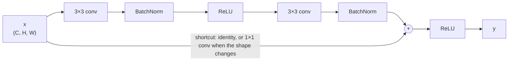
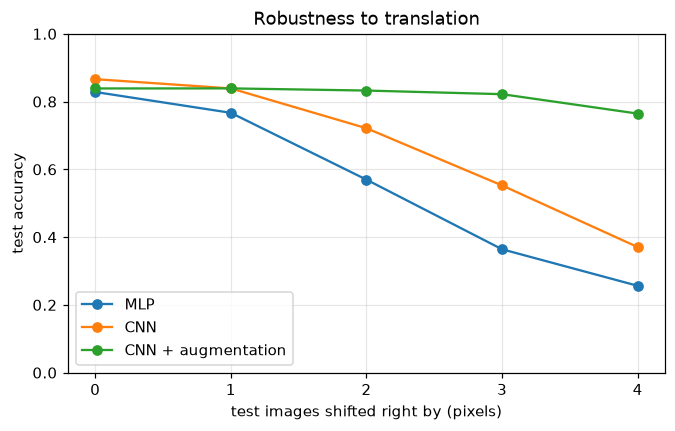
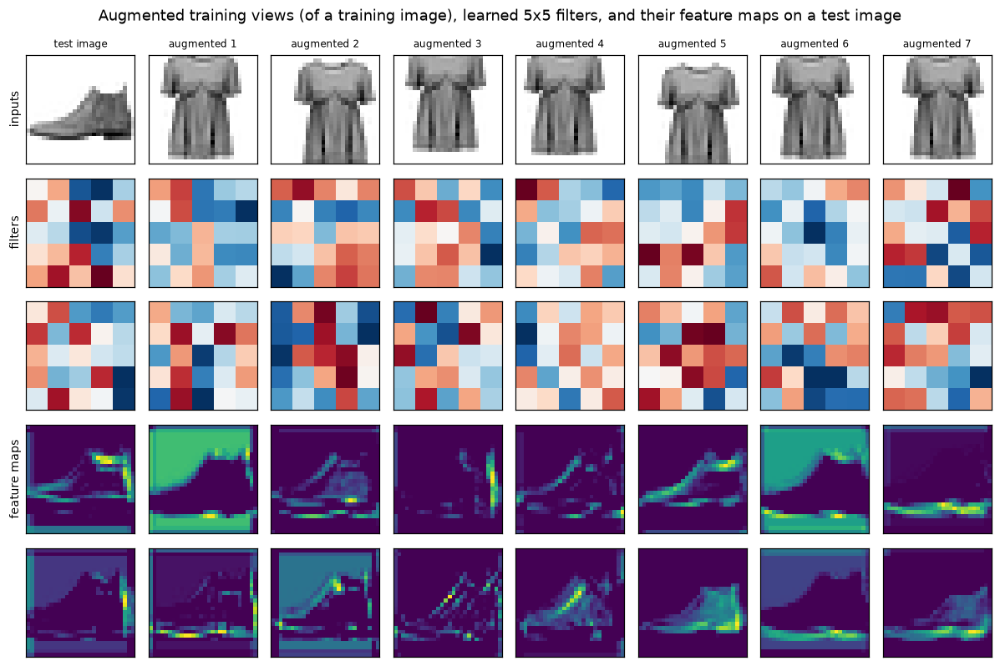

# Convolutional Neural Networks

> **Level 7 · Chapter 3** · ⏱️ ~85 min read · Prerequisites: [The training loop](02-the-training-loop.md), [Training deep networks](../06-neural-networks/05-training-deep-networks.md)

An MLP treats an image as a long list of unrelated numbers. A **convolutional neural network (CNN)** builds in what we know about images: nearby pixels belong together, and a pattern means the same thing wherever it appears. This chapter derives the convolution operation and implements it by hand (checked against `F.conv2d`), works through **stride**, **padding**, the **output-size formula**, **pooling**, **receptive fields**, and **parameter counting**, follows the architectures from **LeNet** to **VGG** to **ResNet**, adds **data augmentation** with `torchvision.transforms.v2`, trains a CNN on FashionMNIST, looks inside it at its **filters** and **feature maps**, and ends with an overview of **object detection** and **segmentation**.

## Why it matters

Alex built a classifier for a second-hand clothing marketplace: sellers upload a photo, and the model suggests a category. The first version was an MLP trained on a clean catalog of centered product photos, and it scored well on a held-out slice of that catalog. In production it was much worse. Sellers' photos weren't centered: a shirt sat a little to the left, a boot a little high. To an MLP, a boot shifted by three pixels is a completely different input vector, because every pixel position has its own separate weights. The model had learned "boot-shaped pixels *in this exact place*".

The fix was not more data from every possible position. It was an architecture that assumes what is true of all images: a local pattern, like the curve of a heel, looks the same wherever it is, so the same detector should be applied everywhere. That is a convolution. The switch to a small CNN cut the parameter count by a factor of three and recovered most of the lost accuracy on shifted photos. Later in this chapter you'll measure exactly this effect on FashionMNIST.

## Concepts

### Why convolutions

Consider a $224 \times 224$ color image: $224 \times 224 \times 3 = 150{,}528$ input numbers. A fully connected layer with 1,000 hidden units needs about 150 million weights for that one layer. Worse, the weights for the top-left corner know nothing about the weights for the bottom-right corner, so a pattern learned in one place must be relearned in every other place.

CNNs fix this with three ideas.

1. **Local connectivity.** Each output unit looks only at a small neighborhood of the input, say $3 \times 3$ pixels. Edges, corners, and textures are local, so this loses little.
2. **Weight sharing.** The same small set of weights, called a **kernel** or **filter**, is applied at every position. A $3 \times 3$ filter on a 3-channel image has 27 weights plus a bias, regardless of the image size.
3. **Hierarchy.** Stacking layers lets later units combine earlier ones over larger regions: edges into textures, textures into parts, parts into objects.

Weight sharing gives **translation equivariance**: shift the input, and the output shifts by the same amount. If $T$ shifts an image and $f$ is a convolution, then $f(T\mathbf{x}) = T f(\mathbf{x})$ (away from the borders). A detector for "vertical edge" fires wherever a vertical edge is. **Pooling** and global averaging then add some **translation invariance**: the final answer changes little when the input shifts. These are **inductive biases**: assumptions built into the architecture that let it learn from far less data than an MLP would need, because it doesn't have to discover them.

### The convolution operation

Start in one dimension. Slide a kernel $\mathbf{w} = (w_0, \ldots, w_{K-1})$ along a signal $\mathbf{x}$, and at each position take the dot product:

$$
y_i = \sum_{u=0}^{K-1} w_u\, x_{i+u}.
$$

With $\mathbf{w} = (-1, 0, 1)$, $y_i = x_{i+2} - x_i$: a difference detector that responds to change and is zero on flat regions. With $\mathbf{w} = (\tfrac13, \tfrac13, \tfrac13)$, it's a moving average that blurs.

(Strictly, this is **cross-correlation**. A mathematical convolution flips the kernel first, $y_i = \sum_u w_u x_{i-u}$. Since the kernel is learned, the flip makes no difference, and every deep learning library computes cross-correlation and calls it convolution.)

In two dimensions, with a single channel, a $K \times K$ kernel $W$ slides over the image $X$:

$$
Y_{i,j} = b + \sum_{u=0}^{K-1}\sum_{v=0}^{K-1} W_{u,v}\, X_{i+u,\,j+v}.
$$

Real layers have several input channels (3 for RGB, or the many channels of a previous layer's output) and produce several output channels. Each output channel has its own kernel that spans *all* input channels. With an input of shape $(C_{\text{in}}, H, W)$ and a weight tensor of shape $(C_{\text{out}}, C_{\text{in}}, K, K)$, output channel $o$ at position $(i, j)$ is

$$
Y_{o,i,j} = b_o + \sum_{c=1}^{C_{\text{in}}}\sum_{u=0}^{K-1}\sum_{v=0}^{K-1} W_{o,c,u,v}\, X_{c,\; iS+u-P,\; jS+v-P},
$$

where $S$ is the stride and $P$ the padding, both defined below, and $X$ is taken to be zero outside the image. Each output value is a dot product between the kernel and one $C_{\text{in}} \times K \times K$ patch of the input. Each output channel is a **feature map**: a picture of where its filter's pattern occurs.

This view suggests an implementation. Gather every input patch into a column of a matrix (an operation called **im2col**, or `F.unfold` in PyTorch), reshape the weights into a $C_{\text{out}} \times (C_{\text{in}}K^2)$ matrix, and the whole convolution becomes one matrix multiplication. That's essentially how many libraries compute it, and why GPUs, built for matrix multiplication, run convolutions so fast. You'll implement both the loop version and the im2col version below.

### Stride, padding, and output size

**Padding** adds $P$ rows and columns of zeros around the input. Without it, a $K \times K$ kernel can't be centered on border pixels, and each layer shrinks the image by $K - 1$. **Stride** $S$ is how far the kernel moves between positions; $S = 2$ halves the resolution. For an input of size $I$ along one dimension, the output size is

$$
O = \left\lfloor \frac{I + 2P - K}{S} \right\rfloor + 1.
$$

To see why: after padding, the input has length $I + 2P$. The kernel's first position starts at 0 and the last valid start is at most $I + 2P - K$. Starting positions are $0, S, 2S, \ldots$, so there are $\lfloor (I + 2P - K)/S \rfloor + 1$ of them.

Useful special cases:

- **"Same" padding:** with $S = 1$ and odd $K$, choosing $P = (K - 1)/2$ gives $O = I$. A $3 \times 3$ convolution with padding 1 keeps the size.
- **Downsampling:** $K = 3$, $S = 2$, $P = 1$ gives $O = \lfloor (I - 1)/2 \rfloor + 1$, which is $I/2$ for even $I$.
- **Dilation** $D$ spreads the kernel's taps $D$ pixels apart, enlarging its view without more weights. The effective kernel size is $D(K - 1) + 1$, so $O = \lfloor (I + 2P - D(K-1) - 1)/S \rfloor + 1$.

### Pooling

A **pooling** layer summarizes each small window with one number, with no learned weights. **Max pooling** takes the maximum; **average pooling** takes the mean. A $2 \times 2$ window with stride 2 halves each spatial dimension, and the output-size formula above applies to it too. Pooling acts on each channel separately, so it keeps the number of channels.

Max pooling says "the pattern occurred somewhere in this window", discarding its exact position. That gives a little invariance to small shifts, reduces computation in later layers, and grows the receptive field (next section). **Global average pooling** averages each entire feature map down to one number, turning a $(C, H, W)$ tensor into a length-$C$ vector. Modern CNNs end with it instead of flattening, which removes most classifier parameters and makes the network accept any input size. Many modern architectures also replace max pooling with strided convolutions, which downsample with learned weights.

### Receptive fields

The **receptive field** of a unit is the region of the input image that can affect it. A unit in the first $3 \times 3$ convolution sees $3 \times 3$ pixels. A unit in a second $3 \times 3$ layer sees $3 \times 3$ units of the first, which together cover $5 \times 5$ pixels. Downsampling multiplies the effect: after a stride-2 layer, each step in the next layer moves two input pixels.

Track two numbers layer by layer: the receptive field $r$ and the **jump** $j$, the distance in input pixels between adjacent units of the current layer. Start with $r_0 = 1$ and $j_0 = 1$ at the input. A layer with kernel $k_l$ and stride $s_l$ gives

$$
r_l = r_{l-1} + (k_l - 1)\,j_{l-1}, \qquad j_l = j_{l-1}\,s_l.
$$

The kernel adds $k_l - 1$ new positions on top of the previous field, each $j_{l-1}$ pixels apart. Pooling layers count too, with their own window and stride. Two consequences:

- Stacking **two $3 \times 3$ convolutions** gives a $5 \times 5$ receptive field, and three give $7 \times 7$. With $C$ channels in and out, two $3 \times 3$ layers cost $2 \cdot 9C^2 = 18C^2$ weights against $25C^2$ for one $5 \times 5$, and add an extra nonlinearity. That observation is the heart of VGG.
- Downsampling early grows the receptive field fast. A classifier's final units need a receptive field covering most of the object, which is why networks downsample several times.

The *theoretical* receptive field is an upper bound. In practice, the effective receptive field is concentrated near its center, because central pixels reach the unit through many more paths than peripheral ones (Luo et al., 2016).

### Counting parameters

A convolution layer has $C_{\text{out}}(C_{\text{in}}K^2 + 1)$ parameters: one $C_{\text{in}} \times K \times K$ kernel and one bias per output channel. The count doesn't depend on the image size. A batch norm layer adds $2C$ learnable parameters (scale and shift) plus $2C$ running statistics that aren't learned. A linear layer has $d_{\text{in}}d_{\text{out}} + d_{\text{out}}$.

The **computation**, by contrast, does scale with image size: each of the $C_{\text{out}} \times H_{\text{out}} \times W_{\text{out}}$ outputs costs $C_{\text{in}}K^2$ multiply-adds. That's why early, high-resolution layers in CNNs have few channels and late, low-resolution layers have many: it keeps the cost per layer roughly balanced.

### From LeNet to VGG to ResNet

The history of CNN architectures is a short course in what matters.

**LeNet-5** (LeCun et al., 1998) read handwritten digits on bank checks. Its pattern is still the template: convolution, subsampling (pooling), convolution, subsampling, then fully connected layers. Two $5 \times 5$ convolution layers (6 and 16 channels), average pooling, and tanh-like activations, about 60,000 parameters.

**AlexNet** (Krizhevsky, Sutskever, and Hinton, 2012) won the ImageNet challenge (1.2 million images, 1,000 classes) by a wide margin and started the deep learning era in vision. The ideas weren't new; the scale was. It used ReLU activations, which train much faster than saturating ones; dropout in the fully connected layers; heavy data augmentation; and two GPUs. It had about 60 million parameters, most in its fully connected layers.

**VGG** (Simonyan and Zisserman, 2014) asked what happens if you use only $3 \times 3$ convolutions, stacked deep: blocks of two or three $3 \times 3$ layers with "same" padding, then $2 \times 2$ max pooling, doubling the channels after each pooling (64, 128, 256, 512). VGG-16 has 16 weight layers. Its uniform design is easy to reason about, and the receptive-field argument above explains why small stacked kernels beat large ones. It was also enormous: about 138 million parameters.

**GoogLeNet/Inception** (Szegedy et al., 2014) ran $1 \times 1$, $3 \times 3$, and $5 \times 5$ convolutions in parallel and concatenated them, using cheap **$1 \times 1$ convolutions** to reduce channels first. A $1 \times 1$ convolution is a linear layer applied at every pixel independently: it mixes channels without looking at neighbors.

**ResNet** (He et al., 2015) solved a puzzle. Deeper plain networks should be at least as good as shallower ones (the extra layers could learn the identity), yet in practice a 56-layer plain network had *higher training error* than a 20-layer one. This **degradation problem** isn't overfitting; it's an optimization failure. ResNet's answer is the **residual block**: instead of asking a stack of layers to learn a mapping $H(\mathbf{x})$, let it learn the residual $F(\mathbf{x}) = H(\mathbf{x}) - \mathbf{x}$ and add the input back through a **shortcut** (skip) connection:

$$
\mathbf{y} = \operatorname{ReLU}\big(F(\mathbf{x}) + \mathbf{x}\big), \qquad F(\mathbf{x}) = \operatorname{BN}(\operatorname{conv}(\operatorname{ReLU}(\operatorname{BN}(\operatorname{conv}(\mathbf{x}))))).
$$

If the identity is the best mapping, the block only needs to push $F$ toward zero, which is easy. And the gradient has a direct path: ignoring the final ReLU, $\partial\mathbf{y}/\partial\mathbf{x} = I + \partial F/\partial\mathbf{x}$, so even when $\partial F/\partial\mathbf{x}$ is small the gradient flows back through the identity term. You saw this argument in [Training deep networks](../06-neural-networks/05-training-deep-networks.md); ResNet made it work at 152 layers. When a block changes the number of channels or downsamples, the shortcut becomes a $1 \times 1$ convolution with stride 2 (a **projection shortcut**) so the shapes match. Deeper ResNets (50 layers and up) use a **bottleneck** block: a $1 \times 1$ convolution to reduce channels, a $3 \times 3$ convolution, and a $1 \times 1$ convolution to expand them again.



Later architectures refined these ideas: depthwise separable convolutions for mobile devices (MobileNet), careful scaling of depth, width, and resolution together (EfficientNet), and modernized ResNets that borrow from transformers (ConvNeXt). Vision transformers, covered in [Self-supervised and multimodal learning](../08-modern-deep-learning/05-self-supervised-and-multimodal.md), drop convolutions altogether when data is plentiful. But the core ideas of this chapter (local filters, downsampling, residual connections, global pooling) remain everywhere.

### Data augmentation

A CNN's architecture gives it translation equivariance, but not invariance to everything that doesn't change an image's label: small rotations, scale changes, flips, lighting, crops. **Data augmentation** teaches these invariances by randomly transforming each training image every time it's loaded. The model never sees exactly the same image twice, which acts as a strong regularizer and effectively enlarges the dataset.

The rule is that every transformation must preserve the label. Horizontal flips are fine for clothing and cats, wrong for digits and text (a flipped 3 isn't a 3), and dangerous for medical images where left and right matter. Vertical flips are wrong for most natural photos. Choose augmentations by asking what variation the test data will actually contain.

`torchvision.transforms.v2` provides the standard ones, and works on tensors, PIL images, and (for detection) bounding boxes and masks together:

| Transform | What it does | Typical use |
|---|---|---|
| `RandomCrop(size, padding=p)` | Pads, then crops a random window: small shifts | Small images (CIFAR, FashionMNIST) |
| `RandomResizedCrop(size)` | Random crop of random area and aspect ratio, resized | Standard for ImageNet-scale training |
| `RandomHorizontalFlip()` | Mirrors left-right with probability 0.5 | Most natural images |
| `RandomRotation(degrees)` | Rotates by a random angle | Mild values (10–15°) for photos |
| `ColorJitter(...)` | Random brightness, contrast, saturation, hue | Photos under varying light |
| `RandomErasing()` | Blanks a random rectangle | Robustness to occlusion |
| `MixUp`, `CutMix` | Blend or paste pairs of images and their labels | Strong regularization for large models |

Augmentation applies to the **training set only**. Validation and test images get only the deterministic preprocessing (resizing, conversion, normalization), so that evaluation measures performance on real data.

### Seeing what a CNN learns

A trained CNN can be inspected directly.

- **Filters.** First-layer kernels operate on pixels, so you can plot them as tiny images. They typically become edge, bar, and blob detectors at various orientations, the same kinds of patterns found in the early visual cortex of mammals. Deeper filters operate on abstract channels and are hard to read directly.
- **Feature maps** (activations). Pass an image through and plot each channel's output. Early maps look like edge-filtered versions of the image; deeper maps are coarser and respond to larger parts.
- **Attribution methods** such as saliency maps (the gradient of the class score with respect to the input pixels) and **Grad-CAM** (which weights the last convolutional layer's feature maps by the gradient of the class score) highlight *which regions* drove a prediction. They're the CNN version of the explanation tools in [Interpretability](../05-applied-ml/04-interpretability.md), and they're the standard way to catch a model that "cheats", for example by recognizing hospital-specific markers in medical images rather than the pathology.

### Beyond classification: detection and segmentation

Classification answers "what is in this image?" Two other tasks add "where?".

**Object detection** outputs a set of **bounding boxes**, each with a class and a confidence. Boxes are compared with the **intersection over union** (IoU):

$$
\operatorname{IoU}(A, B) = \frac{\lvert A \cap B\rvert}{\lvert A \cup B\rvert},
$$

the overlap area divided by the combined area: 1 for identical boxes, 0 for disjoint ones. A prediction usually counts as correct if its IoU with a true box exceeds 0.5. Detectors are scored by **mean average precision (mAP)**: the area under the precision-recall curve for each class, averaged over classes (and, in the COCO benchmark, over IoU thresholds from 0.5 to 0.95).

All modern detectors share a CNN **backbone** (often a pretrained ResNet) that produces feature maps, plus a **head** that predicts boxes:

- **Two-stage detectors** (the R-CNN family, culminating in Faster R-CNN) first propose candidate regions, then classify each and refine its box. Accurate, slower.
- **One-stage detectors** (YOLO, SSD, RetinaNet) predict class scores and box offsets densely at every feature-map location, relative to a set of reference **anchor boxes**, in one pass. Fast enough for video.
- Both produce many overlapping boxes for the same object, so a final **non-maximum suppression (NMS)** step keeps the highest-scoring box and removes others that overlap it with IoU above a threshold.
- **Feature pyramid networks** combine feature maps at several resolutions so that small and large objects are both detected well. Newer detectors such as DETR use transformers and predict a set of boxes directly, without anchors or NMS.

**Semantic segmentation** assigns a class to every pixel ("road", "car", "pedestrian"). The network must output a map at full resolution, so it downsamples to gather context and then **upsamples** back. **Fully convolutional networks** (FCN) replaced the classifier's dense layers with convolutions, and **U-Net** (Ronneberger et al., 2015) added an encoder-decoder shape with **skip connections** that pass high-resolution encoder features directly to the matching decoder stage, recovering fine boundaries. Upsampling uses interpolation or a **transposed convolution**, whose output size is $O = (I - 1)S - 2P + K$, the inverse of the convolution formula. **Instance segmentation** (Mask R-CNN) goes further, separating individual objects of the same class, by adding a mask prediction to each detected box.

`torchvision.models.detection` and `torchvision.models.segmentation` include pretrained Faster R-CNN, RetinaNet, Mask R-CNN, and DeepLab models. Using them is a [transfer learning](06-transfer-learning.md) problem.

## In practice

### Convolution by hand, checked against `F.conv2d`

Two from-scratch implementations: an explicit loop over output positions, and the im2col version that turns the convolution into a single matrix multiplication.

```python
import time

import numpy as np
import torch
import torch.nn as nn
import torch.nn.functional as F

torch.set_num_threads(4)
torch.manual_seed(0)

def out_size(i, k, s=1, p=0, d=1):
    return (i + 2 * p - d * (k - 1) - 1) // s + 1

def conv2d_loops(x, w, b, stride=1, padding=0):
    """x: (N, C_in, H, W); w: (C_out, C_in, K, K); b: (C_out,)."""
    n, c_in, h, wd = x.shape
    c_out, _, k, _ = w.shape
    xp = F.pad(x, (padding, padding, padding, padding))       # zeros on all four sides
    h_out, w_out = out_size(h, k, stride, padding), out_size(wd, k, stride, padding)
    y = torch.empty(n, c_out, h_out, w_out)
    for i in range(h_out):
        for j in range(w_out):
            patch = xp[:, :, i * stride:i * stride + k, j * stride:j * stride + k]   # (N, C_in, K, K)
            y[:, :, i, j] = torch.einsum("nckl,ockl->no", patch, w) + b
    return y

def conv2d_im2col(x, w, b, stride=1, padding=0):
    n, _, h, wd = x.shape
    c_out, _, k, _ = w.shape
    cols = F.unfold(x, kernel_size=k, stride=stride, padding=padding)   # (N, C_in*K*K, L)
    y = w.reshape(c_out, -1) @ cols + b.view(1, -1, 1)                  # (N, C_out, L)
    return y.reshape(n, c_out, out_size(h, k, stride, padding), out_size(wd, k, stride, padding))

x = torch.randn(2, 3, 11, 9)
w = torch.randn(4, 3, 3, 3)
b = torch.randn(4)
for stride, padding in [(1, 0), (1, 1), (2, 1), (3, 2)]:
    ref = F.conv2d(x, w, b, stride=stride, padding=padding)
    y1 = conv2d_loops(x, w, b, stride, padding)
    y2 = conv2d_im2col(x, w, b, stride, padding)
    print(f"stride {stride} padding {padding}: output {tuple(ref.shape)}, "
          f"formula {out_size(11, 3, stride, padding)}x{out_size(9, 3, stride, padding)}, "
          f"max err loops {(y1 - ref).abs().max():.1e}, im2col {(y2 - ref).abs().max():.1e}")
```

```text
stride 1 padding 0: output (2, 4, 9, 7), formula 9x7, max err loops 3.8e-06, im2col 2.9e-06
stride 1 padding 1: output (2, 4, 11, 9), formula 11x9, max err loops 3.8e-06, im2col 2.9e-06
stride 2 padding 1: output (2, 4, 6, 5), formula 6x5, max err loops 1.9e-06, im2col 1.9e-06
stride 3 padding 2: output (2, 4, 5, 4), formula 5x4, max err loops 2.6e-06, im2col 2.4e-06
```

All three agree to float32 rounding, and the output sizes match the formula, including the floor in the stride-3 case ($\lfloor (11 + 4 - 3)/3 \rfloor + 1 = 5$). The im2col matrix for the first case has $C_{\text{in}}K^2 = 27$ rows and one column per output position: the convolution is literally a matrix multiplication with shared weights.

### A hand-made filter: edge detection

Before learning filters, design one. The **Sobel** kernel computes a smoothed horizontal derivative, so it responds to vertical edges:

```python
from torchvision import datasets

train_full = datasets.FashionMNIST("data", train=True, download=True)
test_full = datasets.FashionMNIST("data", train=False, download=True)
CLASSES = train_full.classes
img = train_full.data[0].float() / 255                     # a 28x28 image
print("image 0 is a", CLASSES[train_full.targets[0]])

sobel_x = torch.tensor([[-1., 0., 1.], [-2., 0., 2.], [-1., 0., 1.]])
sobel = torch.stack([sobel_x, sobel_x.T]).unsqueeze(1)     # (2 filters, 1 channel, 3, 3)
edges = F.conv2d(img.view(1, 1, 28, 28), sobel, padding=1)[0]
print("feature maps:", tuple(edges.shape), "| strongest vertical-edge response:",
      round(edges[0].abs().max().item(), 2), "| on a flat region:", edges[0, :3, :3].abs().max().item())
```

```text
image 0 is a Ankle boot
feature maps: (2, 28, 28) | strongest vertical-edge response: 3.85 | on a flat region: 0.0
```

On a flat background the response is exactly zero, because the kernel's weights sum to zero. A CNN learns dozens of filters like this one, and learns which ones help.

### Pooling, receptive fields, and parameter counts

```python
x = torch.tensor([[1., 3, 2, 0], [4, 6, 1, 1], [0, 2, 9, 5], [1, 1, 3, 7]]).view(1, 1, 4, 4)
print("max pool 2x2:", F.max_pool2d(x, 2).view(-1).tolist(), "| avg pool 2x2:", F.avg_pool2d(x, 2).view(-1).tolist())

def receptive_field(layers):
    """layers: list of (kernel, stride). Returns the receptive field after each layer."""
    r, j, out = 1, 1, []
    for k, s in layers:
        r, j = r + (k - 1) * j, j * s
        out.append(r)
    return out

lenet_like = [(5, 1), (2, 2), (5, 1), (2, 2)]                   # conv5, pool2, conv5, pool2
print("receptive fields:", receptive_field(lenet_like))
print("three stacked 3x3 convs:", receptive_field([(3, 1)] * 3))

# Check the formula with autograd: which input pixels influence the center output unit?
probe = nn.Sequential(nn.Conv2d(1, 1, 5, padding=2, bias=False), nn.AvgPool2d(2),
                      nn.Conv2d(1, 1, 5, padding=2, bias=False), nn.AvgPool2d(2))
for m in probe:
    if isinstance(m, nn.Conv2d):
        nn.init.constant_(m.weight, 1.0)          # positive weights, so no contributions cancel
inp = torch.zeros(1, 1, 28, 28, requires_grad=True)
probe(inp)[0, 0, 3, 3].backward()
rows = inp.grad[0, 0].abs().sum(1).nonzero().view(-1)
print("measured receptive field:", (rows.max() - rows.min() + 1).item(), "pixels")
```

```text
max pool 2x2: [6.0, 2.0, 2.0, 9.0] | avg pool 2x2: [3.5, 1.0, 1.0, 6.0]
receptive fields: [5, 6, 14, 16]
three stacked 3x3 convs: [3, 5, 7]
measured receptive field: 16 pixels
```

The recursion predicts a 16-pixel receptive field for the final units, and the gradient confirms it: exactly 16 rows of input pixels influence one output unit. Now count parameters for the model you're about to train, by formula and by PyTorch:

```python
class SmallCNN(nn.Module):
    """LeNet's layout (conv, pool, conv, pool, linear) with modern parts: ReLU, batch norm, dropout."""

    def __init__(self, c1=16, c2=32, n_classes=10):
        super().__init__()
        self.features = nn.Sequential(
            nn.Conv2d(1, c1, 5, padding=2), nn.BatchNorm2d(c1), nn.ReLU(), nn.MaxPool2d(2),   # -> c1 x 14 x 14
            nn.Conv2d(c1, c2, 5, padding=2), nn.BatchNorm2d(c2), nn.ReLU(), nn.MaxPool2d(2),  # -> c2 x 7 x 7
        )
        self.classifier = nn.Sequential(nn.Flatten(), nn.Dropout(0.3), nn.Linear(c2 * 7 * 7, n_classes))

    def forward(self, x):
        return self.classifier(self.features(x))

def make_mlp():
    return nn.Sequential(nn.Flatten(), nn.Linear(784, 128), nn.ReLU(), nn.Dropout(0.3), nn.Linear(128, 10))

def n_params(m):
    return sum(p.numel() for p in m.parameters())

by_formula = (16 * (1 * 25 + 1) + 2 * 16) + (32 * (16 * 25 + 1) + 2 * 32) + (32 * 7 * 7 * 10 + 10)
print("SmallCNN parameters:", n_params(SmallCNN()), "| by formula:", by_formula, "| MLP:", n_params(make_mlp()))
x = torch.randn(1, 1, 28, 28)
for layer in SmallCNN().features:
    x = layer(x)
    if isinstance(layer, (nn.Conv2d, nn.MaxPool2d)):
        print(f"  after {type(layer).__name__:9s} {tuple(x.shape)}")
```

```text
SmallCNN parameters: 29034 | by formula: 29034 | MLP: 101770
  after Conv2d    (1, 16, 28, 28)
  after MaxPool2d (1, 16, 14, 14)
  after Conv2d    (1, 32, 14, 14)
  after MaxPool2d (1, 32, 7, 7)
```

The CNN has less than a third of the MLP's parameters. Over half of the CNN's parameters are in the final linear layer; replacing it with global average pooling would shrink it further.

### Data with `torchvision.transforms.v2`

The dataset below keeps the images as a `uint8` tensor in memory and applies augmentation per example in `__getitem__`. For the in-chapter runs, training uses a 20,000-image subset so each epoch takes seconds on a CPU; the test set is the full official 10,000.

```python
from torch.utils.data import DataLoader, Dataset
from torchvision.transforms import v2

MEAN, STD = 0.2860, 0.3530        # FashionMNIST training-set pixel mean and std

class FashionDataset(Dataset):
    def __init__(self, images, labels, transform=None):
        self.images, self.labels, self.transform = images, labels, transform

    def __len__(self):
        return len(self.labels)

    def __getitem__(self, i):
        x = self.images[i].unsqueeze(0).float() / 255        # (1, 28, 28) in [0, 1]
        if self.transform is not None:
            x = self.transform(x)
        return (x - MEAN) / STD, self.labels[i]

augment = v2.Compose([
    v2.RandomCrop(28, padding=3),          # shift by up to 3 pixels in each direction
    v2.RandomHorizontalFlip(),             # clothes are left-right symmetric enough
])

idx = torch.randperm(60000, generator=torch.Generator().manual_seed(0))[:20000]
train_plain = FashionDataset(train_full.data[idx], train_full.targets[idx])
train_aug = FashionDataset(train_full.data[idx], train_full.targets[idx], transform=augment)
test_ds = FashionDataset(test_full.data, test_full.targets)
test_dl = DataLoader(test_ds, batch_size=1000)

torch.manual_seed(0)
views = torch.stack([train_aug[0][0] for _ in range(7)])
print("augmented views of one image:", tuple(views.shape), "| differ:", not torch.equal(views[0], views[1]))
```

```text
augmented views of one image: (7, 1, 28, 28) | differ: True
```

### Training the CNN and an MLP baseline

The training functions are the ones from [the training loop](02-the-training-loop.md), condensed:

```python
def train_epoch(model, loader, opt):
    model.train()
    for xb, yb in loader:
        loss = F.cross_entropy(model(xb), yb)
        opt.zero_grad(set_to_none=True)
        loss.backward()
        opt.step()

@torch.no_grad()
def accuracy(model, loader, shift=0):
    model.eval()
    correct = 0
    for xb, yb in loader:
        if shift:                               # move the image right by `shift` pixels, filling with background
            xb = F.pad(xb, (shift, 0, 0, 0), value=-MEAN / STD)[..., :28]
        correct += (model(xb).argmax(1) == yb).sum().item()
    return correct / len(loader.dataset)

def train_model(make, train_ds, epochs=3, seed=0, lr=2e-3):
    torch.manual_seed(seed)
    model = make()
    opt = torch.optim.AdamW(model.parameters(), lr=lr, weight_decay=1e-4)
    loader = DataLoader(train_ds, batch_size=128, shuffle=True, generator=torch.Generator().manual_seed(seed))
    t0 = time.time()
    for _ in range(epochs):
        train_epoch(model, loader, opt)
    return model, time.time() - t0

runs = {}
for name, make, ds in [("MLP", make_mlp, train_plain), ("CNN", SmallCNN, train_plain), ("CNN + augmentation", SmallCNN, train_aug)]:
    model, secs = train_model(make, ds)
    runs[name] = model
    print(f"{name:20s} params {n_params(model):7,d}  test accuracy {accuracy(model, test_dl):.4f}  ({secs:.0f}s)")
```

```text
MLP                  params 101,770  test accuracy 0.8284  (2s)
CNN                  params  29,034  test accuracy 0.8662  (32s)
CNN + augmentation   params  29,034  test accuracy 0.8388  (31s)
```

With under a third of the parameters, the CNN beats the MLP by almost 4 points after the same three epochs. The augmented CNN scores about 3 points *lower* here. That's typical of short training: augmentation makes the training task harder, and it pays off over longer runs, where the unaugmented model starts to overfit. (The [capstone](../../exercises/level-7-capstone.md) trains long enough to see the benefit.) Augmentation also buys robustness that the standard test set doesn't measure. Shift the test images and see:

```python
shifts = [0, 1, 2, 3, 4]
robust = {name: [accuracy(m, test_dl, shift=s) for s in shifts] for name, m in runs.items()}
for name, accs in robust.items():
    print(f"{name:20s}", " ".join(f"{a:.3f}" for a in accs))
```

```text
MLP                  0.828 0.767 0.570 0.364 0.256
CNN                  0.866 0.839 0.721 0.552 0.371
CNN + augmentation   0.839 0.839 0.833 0.822 0.765
```

```python
import matplotlib.pyplot as plt

fig, ax = plt.subplots(figsize=(7, 4))
for name, accs in robust.items():
    ax.plot(shifts, accs, "o-", label=name)
ax.set(xlabel="test images shifted right by (pixels)", ylabel="test accuracy",
       title="Robustness to translation", xticks=shifts, ylim=(0, 1))
ax.grid(alpha=0.3)
ax.legend()
plt.show()
```


*Alex's problem, measured. Convolutions and pooling give partial shift robustness for free; augmentation teaches the rest.*

A 2-pixel shift costs the MLP 26 points; a 4-pixel shift wrecks it. The plain CNN degrades more gracefully at small shifts: its convolutions are equivariant, and its pooling absorbs a pixel or so, but its final linear layer still ties features to positions, so it too collapses at 4 pixels. The augmented CNN loses less than 2 points up to 3 pixels, the range it was trained on, and still holds 0.77 at 4. At shifts of 2 pixels or more it beats the plain CNN by 11 to 39 points, a difference the standard test set never showed. Architecture and augmentation are complementary ways of building in the same knowledge.

### A residual block, and why the shortcut matters

```python
class ResidualBlock(nn.Module):
    def __init__(self, c_in, c_out, stride=1):
        super().__init__()
        self.conv1 = nn.Conv2d(c_in, c_out, 3, stride, 1, bias=False)   # bias is redundant before BN
        self.bn1 = nn.BatchNorm2d(c_out)
        self.conv2 = nn.Conv2d(c_out, c_out, 3, 1, 1, bias=False)
        self.bn2 = nn.BatchNorm2d(c_out)
        self.shortcut = nn.Identity()
        if stride != 1 or c_in != c_out:                                 # projection shortcut
            self.shortcut = nn.Sequential(nn.Conv2d(c_in, c_out, 1, stride, bias=False), nn.BatchNorm2d(c_out))

    def forward(self, x):
        out = F.relu(self.bn1(self.conv1(x)))
        out = self.bn2(self.conv2(out))
        return F.relu(out + self.shortcut(x))

x = torch.randn(8, 16, 28, 28)
print("same shape:  ", tuple(ResidualBlock(16, 16)(x).shape), "params", n_params(ResidualBlock(16, 16)))
print("downsample:  ", tuple(ResidualBlock(16, 32, stride=2)(x).shape), "params", n_params(ResidualBlock(16, 32, 2)))

class PlainBlock(ResidualBlock):
    def forward(self, x):                                                # the same layers, no shortcut
        return F.relu(self.bn2(self.conv2(F.relu(self.bn1(self.conv1(x))))))

def first_layer_grad(block_cls, depth=30, seed=0):
    torch.manual_seed(seed)
    stem = nn.Conv2d(1, 16, 3, padding=1)
    net = nn.Sequential(stem, *[block_cls(16, 16) for _ in range(depth)], nn.AdaptiveAvgPool2d(1), nn.Flatten(),
                        nn.Linear(16, 10))
    xb, yb = next(iter(DataLoader(train_plain, batch_size=64)))
    F.cross_entropy(net(xb), yb).backward()
    return stem.weight.grad.norm().item()

for depth in [2, 10, 30]:
    print(f"depth {depth:2d} blocks: first-layer grad norm, plain {first_layer_grad(PlainBlock, depth):.2e}, "
          f"residual {first_layer_grad(ResidualBlock, depth):.2e}")
```

```text
same shape:   (8, 16, 28, 28) params 4672
downsample:   (8, 32, 14, 14) params 14528
depth  2 blocks: first-layer grad norm, plain 1.06e-01, residual 2.35e-01
depth 10 blocks: first-layer grad norm, plain 3.97e-01, residual 4.64e-01
depth 30 blocks: first-layer grad norm, plain 1.20e+02, residual 7.38e-01
```

In the plain network, the gradient reaching the first layer is unstable: from 10 to 30 blocks it grows by a factor of about 300. You might have expected it to vanish, and without batch norm it typically would; with batch norm, deep plain networks are known to have *exploding* gradients at initialization instead (Yang et al., 2019). Either way, the first layers of a deep plain network receive gradients wildly out of scale with the last ones, which is what makes them so hard to optimize. In the residual network, the gradient stays of order 1 at every depth, because the identity paths carry it straight back. (It still grows slowly with depth, as the variance of the summed branches grows; some implementations initialize the last batch norm in each block to zero, so that every block starts as an exact identity.)

### Looking inside: filters and feature maps

Plot one image's augmented views, the 16 first-layer filters the augmented CNN learned, and the 16 feature maps they produce on that image:

```python
model = runs["CNN + augmentation"].eval()
filters = model.features[0].weight.detach()[:, 0]                       # (16, 5, 5)
x0 = test_ds[0][0].unsqueeze(0)
with torch.no_grad():
    fmaps = model.features[2](model.features[1](model.features[0](x0)))[0]   # conv -> BN -> ReLU: (16, 28, 28)

fig, axes = plt.subplots(5, 8, figsize=(11, 7.4))
for ax in axes.flat:
    ax.set_xticks([])
    ax.set_yticks([])
axes[0, 0].imshow(test_full.data[0], cmap="gray_r")
axes[0, 0].set_title("test image", fontsize=8)
for k in range(7):
    axes[0, k + 1].imshow(views[k, 0], cmap="gray_r")
    axes[0, k + 1].set_title(f"augmented {k + 1}", fontsize=8)
for k in range(16):
    f = filters[k]
    axes[1 + k // 8, k % 8].imshow(f, cmap="RdBu_r", vmin=-f.abs().max(), vmax=f.abs().max())
    axes[3 + k // 8, k % 8].imshow(fmaps[k], cmap="viridis")
axes[0, 0].set_ylabel("inputs", fontsize=9)
axes[1, 0].set_ylabel("filters", fontsize=9)
axes[3, 0].set_ylabel("feature maps", fontsize=9)
plt.suptitle("Augmented training views (of a training image), learned 5x5 filters, and their feature maps on a test image")
plt.tight_layout()
plt.show()
```


*Each learned filter (red positive, blue negative) is a small pattern detector; its feature map shows where in the image that pattern occurs.*

After only three epochs on 20,000 small images, the filters are noisy, but several have oriented structure: a band of red beside a band of blue, like the Sobel kernel, at various angles. (Networks trained longer on larger, natural images grow much cleaner edge and color-blob filters.) The feature maps are easier to read. Some respond to the boot's upper outline, some to the sole, some to diagonal edges, and some to the background, an inverted silhouette that is just as informative about shape. Nobody designed these detectors: they emerged from minimizing cross-entropy.

### Detection and segmentation building blocks

You won't train a detector in this chapter, but its key pieces are a few lines each in `torchvision.ops`:

```python
from torchvision.ops import box_iou, nms

def iou(a, b):                                        # boxes as (x1, y1, x2, y2)
    iw = max(0.0, min(a[2], b[2]) - max(a[0], b[0]))
    ih = max(0.0, min(a[3], b[3]) - max(a[1], b[1]))
    inter = iw * ih
    area = lambda r: (r[2] - r[0]) * (r[3] - r[1])
    return inter / (area(a) + area(b) - inter)

boxes = torch.tensor([[10., 10, 50, 50], [12, 14, 52, 54], [60, 60, 90, 95], [11, 9, 49, 48]])
scores = torch.tensor([0.90, 0.75, 0.80, 0.60])
print("IoU by hand:", round(iou(boxes[0].tolist(), boxes[1].tolist()), 4), "| torchvision:", round(box_iou(boxes[:1], boxes[1:2]).item(), 4))
print("boxes kept by NMS (IoU threshold 0.5):", nms(boxes, scores, iou_threshold=0.5).tolist())

up = nn.ConvTranspose2d(32, 16, kernel_size=2, stride=2)          # the upsampling step of a U-Net decoder
print("transposed conv:", tuple(up(torch.randn(1, 32, 7, 7)).shape), "= (7 - 1) * 2 - 0 + 2 = 14")
```

```text
IoU by hand: 0.7467 | torchvision: 0.7467
boxes kept by NMS (IoU threshold 0.5): [0, 2]
transposed conv: (1, 16, 14, 14) = (7 - 1) * 2 - 0 + 2 = 14
```

Boxes 0, 1, and 3 are three detections of the same object. NMS keeps the most confident (box 0) and suppresses the two that overlap it heavily, while box 2, a separate object, survives.

!!! warning "Common mistake: augmenting the evaluation data"
    Random crops, flips, and rotations belong in the training dataset only. Applying them to validation or test images makes the reported accuracy noisy and lower than what the deployed model achieves on real inputs. (Deliberately averaging predictions over several augmented copies of a test image, called **test-time augmentation**, is a separate, legitimate technique, but it's a choice you make explicitly and apply identically in production.)

!!! warning "Common mistake: shape errors at the flatten"
    The first linear layer after the convolutions needs the exact flattened size, $C \times H \times W$, which changes whenever you change the input size, a padding, or a stride. Compute it with the output-size formula, or pass a dummy tensor through the feature extractor and read the shape, as above. Better still, end with `nn.AdaptiveAvgPool2d(1)` so the classifier's input size is just the number of channels.

## Exercises

### Exercise 1: Output sizes by hand (easy)

A $64 \times 64$ input goes through: a $7 \times 7$ convolution with stride 2 and padding 3; a $3 \times 3$ max pool with stride 2 and padding 1; two $3 \times 3$ convolutions with stride 1 and padding 1; and a $3 \times 3$ convolution with stride 2 and padding 1. What is the spatial size after each layer? Check with PyTorch.

??? success "Solution"

    Using $O = \lfloor (I + 2P - K)/S \rfloor + 1$: $\lfloor (64 + 6 - 7)/2 \rfloor + 1 = 32$; $\lfloor (32 + 2 - 3)/2 \rfloor + 1 = 16$; 16; 16; $\lfloor (16 + 2 - 3)/2 \rfloor + 1 = 8$. (This is the start of ResNet-18, which turns a $224 \times 224$ image into $56 \times 56$ the same way.)

    ```python
    x = torch.randn(1, 3, 64, 64)
    layers = [nn.Conv2d(3, 8, 7, 2, 3), nn.MaxPool2d(3, 2, 1), nn.Conv2d(8, 8, 3, 1, 1),
              nn.Conv2d(8, 8, 3, 1, 1), nn.Conv2d(8, 8, 3, 2, 1)]
    for layer in layers:
        x = layer(x)
        print(tuple(x.shape[-2:]), end=" ")
    ```

    ```text
    (32, 32) (16, 16) (16, 16) (16, 16) (8, 8)
    ```

### Exercise 2: Parameters and receptive field of a VGG block (easy)

A VGG block has three $3 \times 3$ convolutions with 256 input and output channels (with biases), followed by a $2 \times 2$ max pool. (a) How many parameters does it have? (b) What is the receptive field of one output unit of the block, measured in units of the block's input? (c) How many parameters would one $7 \times 7$ convolution with the same receptive field need?

??? success "Solution"

    (a) Each convolution has $256 \cdot (256 \cdot 9 + 1) = 590{,}080$ parameters; three have 1,770,240. Pooling has none.

    (b) The convolutions give $3 \to 5 \to 7$, and the $2 \times 2$ pool with stride 2 adds $(2 - 1) \cdot 1 = 1$: 8 input units.

    (c) $256 \cdot (256 \cdot 49 + 1) = 3{,}211{,}520$, about 1.8 times as many, with one nonlinearity instead of three.

    ```python
    print(n_params(nn.Sequential(*[nn.Conv2d(256, 256, 3, padding=1) for _ in range(3)])),
          n_params(nn.Conv2d(256, 256, 7, padding=3)), receptive_field([(3, 1)] * 3 + [(2, 2)]))
    ```

    ```text
    1770240 3211520 [3, 5, 7, 8]
    ```

### Exercise 3: Max pooling from scratch (medium)

Implement `max_pool2d(x, k, s)` for a tensor of shape $(N, C, H, W)$ using `F.unfold`, and check it against `F.max_pool2d` for $k = 2, s = 2$ and $k = 3, s = 2$. Then explain what the gradient of max pooling is.

??? success "Solution"

    `F.unfold` mixes channels into one dimension, so fold the channels into the batch first:

    ```python
    def max_pool2d(x, k, s):
        n, c, h, w = x.shape
        cols = F.unfold(x.reshape(n * c, 1, h, w), kernel_size=k, stride=s)   # (N*C, k*k, L)
        out = cols.max(dim=1).values
        return out.reshape(n, c, out_size(h, k, s), out_size(w, k, s))

    x = torch.randn(2, 3, 9, 9)
    for k, s in [(2, 2), (3, 2)]:
        print(k, s, torch.equal(max_pool2d(x, k, s), F.max_pool2d(x, k, s)))
    ```

    ```text
    2 2 True
    3 2 True
    ```

    The max of a window depends only on its largest element, with derivative 1 with respect to that element and 0 for the rest. So the backward pass routes each upstream gradient to the position of the window's maximum (the "argmax") and sends zero to the others. With overlapping windows ($k > s$), one input can be the max of several windows and collects the sum of their gradients.

### Exercise 4: A $1 \times 1$ convolution is a linear layer (medium)

Show numerically that `nn.Conv2d(C_in, C_out, 1)` applied to a $(N, C_{\text{in}}, H, W)$ tensor gives the same result as an `nn.Linear(C_in, C_out)` with the same weights applied to every pixel's channel vector. What's it useful for?

??? success "Solution"

    ```python
    conv = nn.Conv2d(16, 4, 1)
    lin = nn.Linear(16, 4)
    with torch.no_grad():
        lin.weight.copy_(conv.weight.view(4, 16))
        lin.bias.copy_(conv.bias)
    x = torch.randn(2, 16, 5, 5)
    y_conv = conv(x)
    y_lin = lin(x.permute(0, 2, 3, 1)).permute(0, 3, 1, 2)     # channels last, apply, channels first
    print((y_conv - y_lin).abs().max().item() < 1e-6)
    ```

    ```text
    True
    ```

    A $1 \times 1$ convolution mixes channels at each position without looking at neighbors. It's used to change the number of channels cheaply: reducing them before an expensive $3 \times 3$ convolution (Inception, ResNet bottlenecks), matching shapes in projection shortcuts, and producing per-pixel class scores in segmentation heads.

### Exercise 5: Choosing augmentations (medium)

For each dataset, say which of these augmentations you'd use and why: horizontal flip, vertical flip, rotation up to 180°, random crop with padding, and color jitter. (a) Handwritten digits. (b) Satellite images of land use. (c) Chest X-rays. (d) Photos of products on a marketplace.

??? success "Solution"

    (a) **Digits:** small crops/shifts and small rotations (±10°) only. Flips and large rotations change the label (a flipped 2, a rotated 6 that becomes 9), and color jitter is pointless on grayscale strokes.

    (b) **Satellite images:** flips in both directions and any rotation, because there's no canonical "up" in an overhead view. Crops and mild color jitter (seasons, lighting, sensors) too. This domain allows the most aggressive geometric augmentation.

    (c) **Chest X-rays:** be conservative. Small crops, shifts, and slight brightness or contrast changes match real variation between scanners. Avoid horizontal flips: anatomy is asymmetric (the heart is on the left), and a flip creates images that never occur and can hide position-dependent findings. Discuss augmentations with domain experts.

    (d) **Product photos:** horizontal flips, random resized crops (sellers frame photos differently), and color jitter (lighting) are all realistic. Vertical flips and large rotations aren't, since products are photographed upright.

    The general principle: augment with the variation you expect at test time and that doesn't change the label.

### Exercise 6: Global average pooling (hard)

Modify `SmallCNN` to replace `Flatten` and the final linear layer with a third convolution (32 to 64 channels, $3 \times 3$, padding 1), batch norm, ReLU, `nn.AdaptiveAvgPool2d(1)`, `Flatten`, and `nn.Linear(64, 10)`. Count its parameters, train it on `train_aug` for 3 epochs, and report test accuracy, including on 3-pixel shifts. What did you gain and lose?

??? success "Solution"

    ```python
    class GapCNN(nn.Module):
        def __init__(self):
            super().__init__()
            self.net = nn.Sequential(
                nn.Conv2d(1, 16, 5, padding=2), nn.BatchNorm2d(16), nn.ReLU(), nn.MaxPool2d(2),
                nn.Conv2d(16, 32, 5, padding=2), nn.BatchNorm2d(32), nn.ReLU(), nn.MaxPool2d(2),
                nn.Conv2d(32, 64, 3, padding=1), nn.BatchNorm2d(64), nn.ReLU(),
                nn.AdaptiveAvgPool2d(1), nn.Flatten(), nn.Linear(64, 10))

        def forward(self, x):
            return self.net(x)

    gap, secs = train_model(GapCNN, train_aug)
    print(f"params {n_params(gap):,}; test {accuracy(gap, test_dl):.4f}; shifted by 3: {accuracy(gap, test_dl, shift=3):.4f}")
    ```

    ```text
    params 32,618; test 0.7736; shifted by 3: 0.7700
    ```

    The classifier head shrank from 15,690 parameters to 650, and the network now accepts any input size. Global pooling discards *where* features occurred, which helps shift robustness. It also discards spatial layout, which this small network needed: with only three convolution layers, its receptive field (about 20 pixels) doesn't cover the whole image, so the pooled features can't encode layouts like "a strap at the top". Deeper networks with larger receptive fields don't have this problem, which is why global average pooling became standard in ResNet-style designs like the one in the capstone.

## Check yourself

1. What three properties make convolutions better suited to images than fully connected layers?

    ??? note "Answer"

        Local connectivity (each output depends on a small neighborhood), weight sharing (the same filter everywhere, so far fewer parameters), and the resulting translation equivariance (a pattern is detected wherever it appears). Stacking adds a hierarchy of increasingly large, abstract features.

2. Write the output-size formula and use it for $I = 32$, $K = 5$, $S = 1$, $P = 0$.

    ??? note "Answer"

        $O = \lfloor (I + 2P - K)/S \rfloor + 1 = \lfloor 27/1 \rfloor + 1 = 28$.

3. How many parameters does `nn.Conv2d(64, 128, 3)` have, and does the answer depend on the image size?

    ??? note "Answer"

        $128 \cdot (64 \cdot 9 + 1) = 73{,}856$. No: the weights are shared across positions. The computation depends on the image size, the parameter count doesn't.

4. Why did VGG stack $3 \times 3$ convolutions rather than use larger kernels?

    ??? note "Answer"

        Two stacked $3 \times 3$ layers have the receptive field of one $5 \times 5$ (and three of one $7 \times 7$), with fewer parameters ($18C^2$ versus $25C^2$) and extra nonlinearities between them.

5. What problem did residual connections solve, and how?

    ??? note "Answer"

        The degradation problem: deeper plain networks trained to *higher training error* than shallower ones, an optimization failure. Residual blocks compute $F(\mathbf{x}) + \mathbf{x}$, so a block can represent the identity by driving $F$ to zero, and gradients flow back through the identity path ($\partial \mathbf{y}/\partial\mathbf{x} = I + \partial F/\partial \mathbf{x}$).

6. Why must data augmentation be label-preserving, and why is it applied only to training data?

    ??? note "Answer"

        It teaches the model that certain variations don't change the label; a transform that does change the label (flipping a digit) teaches wrong answers. Evaluation should measure performance on real, unmodified data, so validation and test images get only deterministic preprocessing.

7. What does non-maximum suppression do in object detection?

    ??? note "Answer"

        Detectors output many overlapping boxes for the same object. NMS sorts boxes by score, keeps the best, removes the remaining boxes whose IoU with it exceeds a threshold, and repeats, leaving one box per object.

8. How does semantic segmentation differ from classification, and what does U-Net add?

    ??? note "Answer"

        Segmentation predicts a class for every pixel, so the output is a full-resolution map. U-Net is an encoder-decoder that downsamples to gather context and upsamples back, with skip connections that pass high-resolution encoder features to the decoder so boundaries stay sharp.

## Key takeaways

- A convolution slides shared filters over the input; each output is a dot product with one patch, and the whole operation is a matrix multiplication (im2col) in disguise.
- Output size is $\lfloor (I + 2P - K)/S \rfloor + 1$; parameters are $C_{\text{out}}(C_{\text{in}}K^2 + 1)$, independent of image size.
- Pooling and strided convolutions downsample; receptive fields grow as $r_l = r_{l-1} + (k_l - 1)j_{l-1}$, so stacked small kernels and downsampling let deep units see the whole object.
- LeNet set the template, AlexNet scaled it, VGG standardized $3 \times 3$ stacks, and ResNet's shortcuts made very deep networks trainable.
- Convolutions give partial translation robustness for free; label-preserving augmentation teaches the rest and regularizes, on training data only.
- Learned first-layer filters are edge and blob detectors; feature maps show where each pattern occurs.
- Detection adds boxes (IoU, anchors, NMS, mAP) and segmentation adds per-pixel labels (encoder-decoders, U-Net), both on top of CNN backbones.

## Further reading

- Vincent Dumoulin and Francesco Visin, "A guide to convolution arithmetic for deep learning" (2016), with diagrams of every padding and stride case.
- Kaiming He, Xiangyu Zhang, Shaoqing Ren, and Jian Sun, "Deep Residual Learning for Image Recognition" (CVPR 2016).
- Karen Simonyan and Andrew Zisserman, "Very Deep Convolutional Networks for Large-Scale Image Recognition" (ICLR 2015).
- Stanford's CS231n course notes, "Convolutional Neural Networks for Visual Recognition" (cs231n.github.io).
- The [torchvision documentation](https://pytorch.org/vision/stable/index.html), on `transforms.v2`, `models`, and `ops`.

## Next

CNNs exploit spatial structure. Text, audio, and time series have a different structure: order. Next: [Sequence models](04-sequence-models.md).
